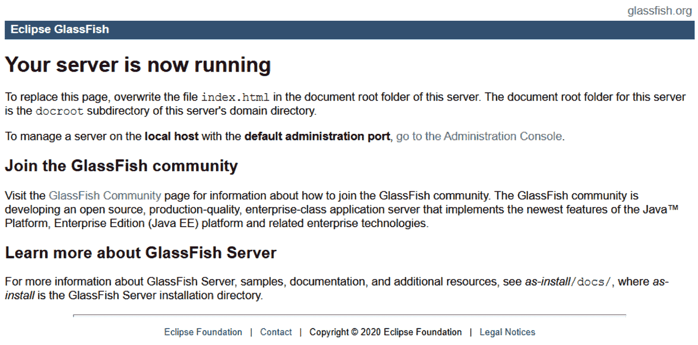
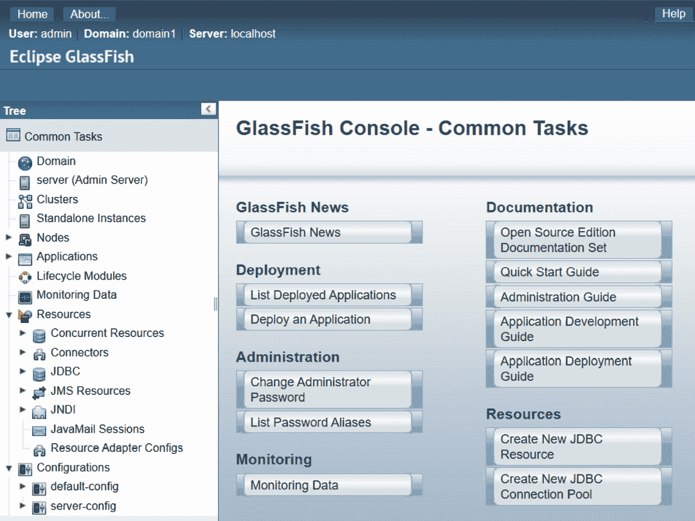
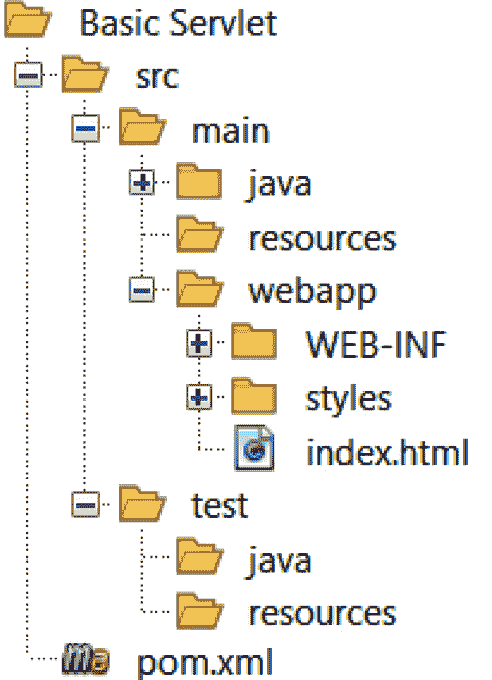
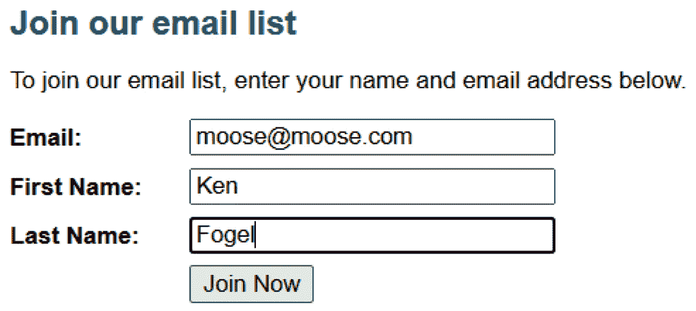

# 第十四章：使用 Jakarta 进行服务器端编码

虽然 Java 与网络的最初连接是通过小程序开发实现的，但该语言出现后的几年内，服务器端 Java，最初称为 **Java 2 Enterprise Edition** 或 **J2EE**，后来称为 **Java Enterprise Edition** 或 **JEE**，才被引入。与可以在您的桌面上运行的独立应用程序不同，JEE 应用程序在另一组称为应用服务器的 Java 程序中运行。当 Oracle 决定主要关注核心语言 Java SE 时，规范和库被转交给 Eclipse 基金会。这些规范和库被重命名为 **Jakarta EE**。

任何编程语言的服务器端编码通常涉及软件监听互联网端口，例如 `80`。信息从浏览器到服务器以及返回遵循 HTTP 协议。浏览器向服务器发送请求。请求可以通过返回由 HTML 和 JavaScript 组成的响应来满足，浏览器再将页面渲染出来。HTTP 协议是语言和服务器无关的。这意味着它与特定的语言或浏览器无关。

在 Java 中，我们有一种特殊的类，它在应用服务器中运行，等待请求，在接收到请求时执行一些操作，然后返回浏览器可以渲染的响应。这个特殊类是 `new` 关键字。

一个 Jakarta EE 应用程序打包在一个具有 `.war` 扩展名的 ZIP 文件中。它不包含 JEE 库。这些库是应用服务器的一部分。这意味着网络应用相对较小。这些库是编译代码所必需的。Maven 会下载这些库，以便 Java 编译器可以验证你的 Jakarta 使用情况。当将应用程序打包成用于服务器的 `.war` 文件时，这些库不是最终包的一部分。

Jakarta EE 规范描述了两个页面渲染库。第一个称为 **Jakarta Server Pages**，之前称为 **JavaServer Pages** 或 **JSP**。第二个称为 **Jakarta Faces**，之前被称为 **JavaServer Faces** 或 **JSF**。这个缩写仍然被广泛使用，而不是 JF。这两个库都支持从运行在应用服务器的 Java 代码生成 HTML 和 JavaScript。我们将在下一章中探讨 Jakarta Faces。

在本章中，我们将探讨以下主题：

+   理解 Java 应用服务器的作用

+   使用 Maven 配置网络项目

+   理解 servlet 的作用以及其编码方式

+   使用 `web.xml` 文件配置部署

到本章结束时，你应该能够理解如何在 Java 中基于 HTML 构建一个网络应用，以及如何编写 servlet 代码。

# 技术要求

在本章中运行示例所需的工具如下：

+   Java 17

+   一个文本编辑器

+   安装 Maven 3.8.6 或更高版本

+   GlassFish 7.0 应用服务器

+   一个网络浏览器

本章的示例代码可在[`github.com/PacktPublishing/Transitioning-to-Java/tree/chapter14`](https://github.com/PacktPublishing/Transitioning-to-Java/tree/chapter14)找到。

# 理解 Java 应用程序服务器的作用

在 Jakarta EE 10 编程宇宙的中心是应用程序服务器。这些程序提供了一系列您的应用程序可以调用的服务。它们还包含了您的应用程序可能需要的所有 Jakarta 10 库。这意味着您的应用程序不需要包含所有必需的外部库，例如桌面应用程序必须在最终的 JAR 文件中包含的库。

应用程序服务器可以通过以下三种方式之一指定：

+   第一项是平台。它提供了 Jakarta EE 10 服务的全部集合。

+   第二项是 Web 配置文件，它提供平台服务的子集。

+   最后，是核心配置文件。这是最小的配置文件，旨在为微服务提供基础设施。

下表显示了每个配置文件中可以找到哪些 Jakarta EE 10 库。每个配置文件右侧的列中的库（除核心库外）属于该配置文件。该平台包括 Web 配置文件和核心配置文件，而 Web 配置文件包括核心配置文件。随着 Jakarta EE 的发展，可以添加新功能，库也会更新。

| **平台** | **Web 配置文件** | **核心配置文件** |
| --- | --- | --- |
| 授权 2.1 | 表达式语言 5.0 | CDI Lite 4.0 |
| 激活 2.1 | 认证 3.0 | JSON 绑定 3.0 |
| 批处理 2.1 | 并发 3.0 | 注解 2.1 |
| 连接器 2.1 | 持久化 3.1 | 拦截器 2.1 |
| 邮件 2.1 | Faces 4.0 | RESTful Web Services 3.1 |
| 消息传递 3.1 | 安全性 3.0 | JSON 处理 2.1 |
| 企业 Bean 4.0 | Servlet 6.0 | 依赖注入 2.0 |
|  | 标准标签库 3.0 |  |
|  | 服务器页面 3.1 |  |
|  | CDI 4.0 |  |
|  | WebSocket 2.1 |  |
|  | Bean 验证 3.0 |  |
|  | 调试支持 2.0 |  |
|  | 企业 Bean Lite 4.0 |  |
|  | 管理 Bean 2.0 |  |
|  | 事务 2.0 |  |

表 14.1 – Jakarta EE 10 库/服务

预期平台服务器提供前表中列出的所有服务。Web 配置文件服务器提供 Web 配置文件和核心配置文件服务。最后，核心配置文件服务器仅支持其列中的内容。在本章中，我们只将查看其中的一些服务。

应用程序服务器由多家公司提供。这些服务器通常有一个免费的社区/开源版本，以及付费许可的版本。付费许可为您提供对服务器的支持。社区版本维护邮件列表，您可以在列表上提问，并从公司或其他社区版本用户那里获得回复。一个特定的服务器脱颖而出，那就是开源的。这就是 Eclipse GlassFish 服务器。这就是我们在本章中将使用的服务器。

## GlassFish 7.0

GlassFish 服务器最初由太阳微系统公司开发，作为 Java EE 的参考服务器。这意味着任何希望被识别为 Java EE 服务器的其他服务器都需要通过与 GlassFish 相同的 **技术兼容性工具包** 测试套件，通常称为 **TCK**。

当甲骨文公司收购了太阳微系统公司后，他们继续维护 GlassFish。2017 年，甲骨文决定不再开发 Java EE。他们将 Eclipse 基金会指定为 Java EE 的新家，该基金会随后将其更名为 Jakarta EE。技术转让包括了 GlassFish。这也意味着 Jakarta EE 和 GlassFish 都是开源的。

### 下载、安装和运行 GlassFish

GlassFish 服务器可以从 [`glassfish.org/`](https://glassfish.org/) 下载。对于独立服务器有两个选择。如下所示：

+   Eclipse GlassFish 7.0.0 和 Jakarta EE 平台 10

+   Eclipse GlassFish 7.0.0 和 Jakarta EE Web Profile 10

此外，还有两个嵌入式版本。嵌入式版本可以用作应用程序的一部分。每个选择只有一个下载。这些不是 Linux、macOS 或 Windows 版本，因为它们都使用几乎相同的类文件和库，任何特定于操作系统的组件都是单个版本的一部分。这是一个 ZIP 文件。安装相当简单。以下是步骤：

1.  下载 GlassFish。

1.  将环境或 `JAVA_HOME` shell 变量设置为 JVM 的位置。

1.  解压您下载的文件。它应该创建一个名为 `glassfish7` 的文件夹，您现在可以将其移动到您希望的位置。

1.  前往 `glassfish7` 文件夹中的 `bin` 文件夹。

1.  在 `bin` 文件夹中打开终端或控制台窗口。

1.  通过输入 `asadmin start-domain` 在任何操作系统上启动服务器。

在 Linux 上，在运行之前确保 `asadmin` 脚本是可执行的。在 Windows 上，您将运行 `asadmin.bat` 批处理文件。要停止服务器，请输入 `asadmin stop-domain`。您应该在控制台/终端窗口中看到消息，告诉您操作成功。如果您不成功，请查阅 GlassFish 网站上的更详细的安装说明。

1.  要测试安装，请打开您的网页浏览器并输入 `http://localhost:8080`。

GlassFish 监听的默认端口是 `8080`，用于服务器上运行的应用程序，以及 `4848` 用于访问管理控制台。如果需要，这两个端口都可以更改。

您应该看到一个看起来像这样的网页：



图 14.1 – 默认端口 8080 的网页

1.  要访问管理控制台，请输入 `http://localhost:4848`。

您现在应该看到以下内容：



图 14.2 – 端口 4848 的管理控制台

你应该使用`admin`用户，因为你可能已经注意到，访问管理控制台时没有要求你输入密码。就我们的目的而言，在 GlassFish 上没有更多的事情要做。当我们想要测试我们的应用程序时，我们可以使用**部署应用程序**这个常用任务。

探索 GlassFish 并阅读其文档，你将在下载网站上找到它。它的默认配置就是我们所需要的。现在让我们创建构建 Maven Web 应用程序所需的必要文件夹结构。

# 使用 Maven 配置 Web 项目

制作 Web 应用程序的第一步是为 Maven 配置你的项目。首先，我们需要为任何使用 Maven 构建的 Jakarta EE 应用程序创建适当的文件夹结构。以下是设置所需的步骤：



图 14.3 – 使用 Maven 构建的 Jakarta EE 应用程序所需的文件夹

Maven 桌面设置和 Web 设置之间的唯一区别是在`main`文件夹中添加了`webapp`文件夹。在这个文件夹中有一个`WEB-INF`文件夹和一个可选的`styles`文件夹。以下是文件夹的概述：

+   `src/main/java`: 所有 Java 源文件都存储在子文件夹/包中，就像我们在桌面应用程序中做的那样。

+   `src/main/resources/`: 语言包和日志配置文件放在这里。一些包可以放在子文件夹中，而另一些则不能。

+   `src/main/webapp`: 这是一个将包含任何静态网页、JavaServer 页面和 JavaServer Faces 页面的文件夹。你可以创建子文件夹。

+   `src/main/webapp/WEB-INF`: 这个文件夹包含配置文件和私有文件。私有文件可以是任何可能在`WEB-INF`文件夹中的东西。URL 不能包含这个文件夹，这就是为什么它们被认为是私有的。这个文件夹可以通过在服务器上运行的代码访问。

+   `src/main/webapp/styles`: 这个文件夹将包含任何 CSS 文件。这不是一个标准文件夹，所以你可以将 CSS 文件放在任何文件夹中，除了`webapp`文件夹中的`WEB_INF`。

+   `src/test`: 这是任何单元测试或仅在运行单元测试时使用的其他文件的存放地。

当你的代码准备好编译时，你只需要在项目的根文件夹中打开一个终端/控制台窗口，并输入 Maven 命令`mvn`。如果没有错误，那么你将在项目中有一个名为`target`的新文件夹，在这里你可以找到`.war`文件。`.war`文件，就像`.jar`文件一样，是一个 ZIP 压缩文件。它们之间的区别在于它们在文件中的布局。Web 服务器期望的文件组织与桌面程序不同。

## 修改 pom.xml 文件

一个 Web 应用程序被打包在一个以`war`为扩展名的文件中。这个文件中的文件夹组织基于应用程序服务器的标准。这意味着对 POM 文件的第一次更改将如下所示：

```java
    <packaging>war</packaging>
```

在我们的桌面 pom 文件中，我们包括了日志记录和单元测试的依赖项。我们将使用`java.util.logging`，从而消除所有日志记录依赖项。Web 应用程序的单元测试需要一个特殊的代码运行器，例如来自 Red Hat 的 Arquillian。我们不会涉及这部分内容，因此可以删除单元测试依赖项和插件。新的`pom.xml`文件现在，从`properties`开始，将包含以下内容：

```java
    <properties>
        <java.version>17</java.version>
        <project.build.sourceEncoding>
            UTF-8
        </project.build.sourceEncoding>
        <maven.compiler.release>
            ${java.version}
        </maven.compiler.release>
        <jakartaee>10.0.0</jakartaee>
    </properties>
```

在下面的`dependencies`部分，我们展示了 Jakarta 库依赖项。请注意，`scope`设置被设置为`provided`，这意味着库不会被包含在 WAR 文件中：

```java
    <dependencies>
        <dependency>
            <groupId>jakarta.platform</groupId>
            <artifactId>jakarta.jakartaee-api</artifactId>
            <version>${jakartaee}</version>
            <scope>provided</scope>
        </dependency>
    </dependencies>
    <build>
        <finalName>
            ${project.artifactId}
        </finalName>
```

与桌面应用程序不同，我们不能简单地运行一个 Web 应用程序。它必须被复制到 GlassFish 的相应文件夹中，然后打开浏览器来访问该网站。虽然有一些 Maven 插件可以为你完成这项工作，但我们将保持简单。Maven 将输出一个 WAR 文件，你可以使用 GlassFish 管理控制台来部署它：

```java
        <defaultGoal>verify package</defaultGoal>
        <plugins>
            <plugin>
                <groupId>org.apache.maven.plugins</groupId>
                <artifactId>maven-war-plugin</artifactId>
                <version>3.3.2</version>
            </plugin>
        </plugins>
    </build>
```

部署应用程序还有另一种方法。在 GlassFish 中有一个名为`glassfish7\glassfish\domains\domain1\autodeploy`的文件夹。

如果你只是将 WAR 文件复制到这个文件夹，那么服务器将自动部署它。

现在，让我们看看 Java Web 编程的核心，即 servlet。

# 理解 servlet 的功能以及它的编码方式

在 Java Web 编程中，没有 main 方法。相反，所有应用程序至少必须有一个 servlet。当我们查看 Jakarta Faces 的客户端渲染时，没有 servlet，因为它已经是库的一部分。让我们看看一个 servlet。

第一行是一个注解，它定义了此类是一个 servlet。描述在服务器的管理控制台中可见。`urlPattern`属性是在 URL 中使用的名称。servlet 可以命名为任何东西，可以有任意扩展名，尽管标准做法是不使用扩展名。servlet 可以有多个模式。以下是一个 servlet 的示例：

```java
@WebServlet(description = "Basic Servlet",
                     urlPatterns = {"/basicservlet"})
```

如果我们希望使用多个模式来引用此 servlet，我们可以编写以下内容：

```java
@WebServlet(description = "Basic Servlet",
                     urlPatterns = {"/basicservlet",
                                      "/anotherservlet"})
```

Java 中的 servlet 是一个扩展`HttpServlet`的类：

```java
public class BasicServlet extends HttpServlet {
    private static final Logger LOG =
          Logger.getLogger(BasicServlet.class.getName());
```

Servlet 类的构造函数很少使用，因为它不能调用`HttpServlet`超类中的任何方法。你可以安全地省略它：

```java
    public BasicServlet() {
        LOG.info(">>> Constructor <<<");
    }
```

如果你必须在 servlet 接收到第一个请求之前准备或初始化某些内容，那么你可以使用`init`方法。它可以访问超类，但不会得到`request`或`response`对象。它在 servlet 在第一个请求到达之前运行时被调用：

```java
    @Override
    public void init() throws ServletException {
        LOG.info(">>> init <<<");
    }
```

`destroy`方法类似于 C++中的析构函数。在服务器卸载之前，它会被服务器调用以执行任何必要的结束任务：

```java
    @Override
    public void destroy() {
        LOG.info(">>> destroy <<<");
    }
```

`getServletInfo`方法允许你准备一个包含关于此 servlet 信息的字符串：

```java
    @Override
    public String getServletInfo() {
        LOG.info(">>> getServletInfo <<<");
        return "BasicServlet01 Version 2.0";
    }
```

服务器在每次请求此 servlet 时都会调用`service`方法。`service`方法调用`HttpServletRequest`对象的`getMethod`以确定请求类型，然后调用匹配的`do`方法，例如`doPost`或`doGet`。覆盖此方法的常见原因是你希望无论请求类型如何都执行一项任务。在这个例子中，我们只是调用`service`超类方法，如果你没有在覆盖的`service`方法体中调用适当的方法，你必须这样做：

```java
    @Override
    protected void service(HttpServletRequest request,
              HttpServletResponse response)
              throws ServletException, IOException {
        super.service(request, response);
        LOG.info(">>> service <<<");
    }
```

有八种不同的请求类型。这些都是 servlet 提供的 HTTP 动词，以支持协议。它们是`GET`、`POST`、`PUT`、`DELETE`、`HEAD`、`OPTIONS`、`CONNECT`和`TRACE`。前四种是最常用的，尽管只有`GET`和`POST`可以在 HTML 页面上使用。要测试无法从 HTML 页面发出的请求，你可以使用`curl`实用程序。这个工具允许你从你的计算机的终端/控制台中发送任何类型的请求。当你运行这个应用程序时，你会看到下载和使用`curl`的说明：

```java
    @Override
    protected void doGet(HttpServletRequest request,
              HttpServletResponse response)
              throws ServletException, IOException {
```

在`response`对象中可以返回给浏览器的不同内容类型。类型可以是`image/gif`或`application/pdf`。纯文本是`text/plain`：

```java
        response.setContentType("text/html;charset=UTF-8");
```

为了让 servlet 返回文本给浏览器，我们使用`PrintWriter`对象。它由`response`对象实例化，这样你写入的数据就会发送到`response`对象中找到的 URL：

```java
        try ( PrintWriter writer = response.getWriter()) {
            writer.print(createHTMLString("GET"));
        }
        LOG.info(">>> doGet <<<");
    }
```

这里是`doPost`方法，它将显示由`createHTMLString`创建的网页，并显示已发出`POST`请求：

```java
    @Override
    protected void doPost(HttpServletRequest request,
              HttpServletResponse response) throws
              ServletException, IOException {
        response.setContentType("text/html;charset=UTF-8");
        try ( PrintWriter writer = response.getWriter()) {
            writer.print(createHTMLString("POST"));
        }
        LOG.info(">>> doPost <<<");
    }
```

这里是`doPut`方法。由于我们只能使用`curl`发出`PUT`，它只返回一个简单的字符串，`curl`将在你的终端/控制台中显示：

```java
    @Override
    protected void doPut(HttpServletRequest request,
              HttpServletResponse response)
              throws ServletException, IOException {
        response.setContentType(
                        "text/plain;charset=UTF-8");
        try ( PrintWriter writer = response.getWriter()) {
            writer.print("You have called doPut");
        }
        LOG.info(">>> doPut <<<");
    }
```

这里是`doDelete`方法。就像`PUT`一样，你只能使用`curl`来发出它：

```java
    @Override
    protected void doDelete(HttpServletRequest request,
              HttpServletResponse response)
              throws ServletException, IOException {
        response.setContentType(
                        "text/plain;charset=UTF-8");
        try ( PrintWriter writer = response.getWriter()) {
            writer.print("You have called doDelete");
        }
        LOG.info(">>> doDelete <<<");
    }
```

最后一种方法是一个用户方法，用于生成 HTML 代码字符串，该字符串可以返回给用户的浏览器。请注意，HTML 页面使用三个引号包含在一个文本块中。文本中还有一个占位符`%s`，它使用`formatted`字符串方法进行替换：

```java
    private String createHTMLString(String methodName) {
        String htmlStr = """
           <html>
              <head><link rel='stylesheet'
                 href='styles/main.css'
                 type='text/css'/>
              <title>The Basic Servlet</title></head>
              <body>
                 <h1>%s method</h1>
                 <br/><br/>
                 <form action='index.html'>
                    <label>Return to Home page</label>
                    <br/>
                    <button class='button'>Return</button>
                 </form>
              </body>
           </html>
           """.formatted(methodName);
        return htmlStr;
    }
}
```

## 当请求一个 servlet 时会发生什么？

服务器在开始时或第一次调用 servlet 时，会实例化一个 servlet 类。一旦实例化，它就会保留在服务器上，直到你明确要求服务器将其删除。每个 servlet 只有一个实例。

每个请求都会生成一个 servlet 的线程。创建线程比创建对象更快。servlet 的线程可以自由地做几乎所有它想做的事情，比如实例化其他对象。如果一个线程在用户定义的时间段内（通常是 30 分钟）没有收到请求，它就会被停止，线程创建的对象将进入垃圾回收。

## servlet 如何访问请求中的查询字符串？

假设有一个 HTML 表单，有三个名为 `emailAddress`、`firstName` 和 `lastName` 的输入字段。点击 `submit` 类型的按钮将创建一个查询字符串，如果你使用 `GET` 请求，它将被附加到 URL 上；如果你使用 `POST`，它将被添加到请求体中。在两种情况下，数据都是 `key = value` 格式。以下是一个这样的 HTML 页面：

```java
<html>
    <head>
        <title>Just Servlet Input</title>
        <link rel="stylesheet" href="styles/main.css"
                                   type="text/css"/>
    </head>
    <body>
        <h1>Join our email list</h1>
        <p>To join our email list, enter your name and
            email address below.</p>
        <form action="AddToEmailList" method="get">
            <label class="pad_top">Email:</label>
            <input type="email" name="emailAddress"
                                         required><br>
            <label class="pad_top">First Name:</label>
            <input type="text" name="firstName"
                                          required><br>
            <label class="pad_top">Last Name:</label>
            <input type="text" name="lastName"
                                          required><br>
            <label>&nbsp;</label>
            <input type="submit" value="Join Now"
                                    class="margin_left">
        </form>
    </body>
</html>
```

这段 HTML 将生成以下页面：



图 14.4 – 浏览器对 HTML 的渲染

在 HTML 中，我使用 `method` 属性来显示当按钮被按下时发出的请求类型是 `GET`。由于这个表单将数据提交到服务器，它应该使用 `POST` 方法。我这里使用 `GET`，因为它在地址栏中显示了查询字符串，而 `POST` 将查询字符串传输为请求的一个单独组件，因此是不可见的。如果你需要防止查询字符串中的信息以纯文本形式发送并在服务器日志中显示，也应该首选 `POST`。

我已经填写了表单，当我点击按钮时，浏览器中的 URL 将更新为显示为单行：

```java
http://localhost:8080/HTMLServlet/AddToEmailList?
                          emailAddress=moose%40moose.com&
                          firstName=Ken&lastName=Fogel
```

servlet 中的 `doGet` 方法现在可以读取三个参数。在我的例子中，我将这些数据存储在一个简单的 JavaBean 风格的对象中：

```java
    @Override
    protected void doGet(HttpServletRequest request,
                   HttpServletResponse response)
                   throws ServletException, IOException {
```

使用查询字符串中键值的名称，我们可以检索数据，然后将它们分配给 `User` 对象：

```java
        String firstName =
              request.getParameter("firstName");
        String lastName = request.getParameter("lastName");
        String emailAddress =
              request.getParameter("emailAddress");
        User user =
             new User(firstName, lastName, emailAddress);
```

在这里，我展示了使用名为 `displayConfirmation` 的方法构建的结果页面：

```java
        response.setContentType("text/html;charset=UTF-8");
        try (PrintWriter out = response.getWriter()) {
            displayConfirmation(out, user);
        }
    }
```

servlet 的输出将如下所示：


图 14.5 – servlet 的输出

不要忘记回顾本章的源代码。

## servlet 如何记住我的数据？

每次你第一次调用应用程序中的 servlet 时，你将收到一个 ID 号码，该号码用于标识一个 `HttpSession` 对象。这个 ID 作为 cookie 发送到你的浏览器，或者如果你正在阻止 cookie，则在每次请求时作为 URL 中的隐藏字段发送。如果你已经在 cookie 中有了这个 ID，那么就会使用它。服务器管理这个 ID；你不需要做任何事情。服务器使用这个 ID 来管理 `HttpSession` 对象，并确保你的请求是唯一可以访问的。你可以使用以下代码访问会话对象：

```java
HttpSession session = request.getSession();
```

如果与你的 ID 关联的 `HttpSession` 对象存在，则返回它。如果不存在，则返回一个新的 `HttpSession` 对象，它有自己的 ID。我们将在 `HttpSession` 对象中使用两种方法，一种用于读取，一种用于写入。如果你想在示例中保留 `User` 对象，以便在另一个 servlet 中使用，你将编写以下代码：

```java
HttpSession session = request.getSession();
session.setAttribute("myUser", user);
```

这个`HttpSession`对象将保持有效，直到`HttpSession`计时器，通常是 30 分钟，结束或者你调用`session.invalidate()`。如果我们想在另一个 servlet 中检索`User`对象，那么我们可以写以下内容：

```java
HttpSession session = request.getSession();
String animal = (User) session.getAttribute("myUser");
```

你不希望保留比必要更长的时间数据。存储在`HttpServletRequest`对象中的数据在给出响应后就会丢失。在许多情况下，这已经足够了。然而，如果你正在编写一个购物车应用，你希望保留客户在网站中从一个页面移动到另一个页面时所做的选择。这就是`HttpSession`对象被使用的地方。

现在我们来看一个可以用来配置服务器如何处理 servlets 的文件，称为`web.xml`。

# 使用 web.xml 文件配置部署

在 Web 项目的`WEB-INF`文件夹中，通常有一个名为`web.xml`的文件。在`@WebServlet`注解引入之前，这是强制性的。有了这个注解，应用服务器可以自己确定哪些文件是 servlet，哪些不是。在这个文件中，你可以做的不仅仅是列出 servlet。因此，我建议你始终保留一个`web.xml`文件。

我们的描述符将会相当基础：

```java
<web-app xmlns="https://jakarta.ee/xml/ns/jakartaee"
     xmlns:xsi="http://www.w3.org/2001/XMLSchema-instance"
     xsi:schemaLocation=
                 "https://jakarta.ee/xml/ns/jakartaee
       https://jakarta.ee/xml/ns/jakartaee/web-app_5_0.xsd"
       version="5.0">
    <display-name>BasicServlet</display-name>
    <welcome-file-list>
        <welcome-file>index.html</welcome-file>
    </welcome-file-list>
</web-app>
```

我们有一个显示名称，应用服务器可以在报告中使用，然后是欢迎页面。欢迎页面是当 URL 不包含页面名称时显示的页面名称。假设你在浏览器中输入以下内容：

```java
http://localhost:8080/BasicServlet/index.html
```

而不是写上面那样，你只需要写以下内容：

```java
http://localhost:8080/BasicServlet
```

HTTP 协议是无状态的。这意味着每次你发起请求时，服务器都会表现得像是你第一次访问网站。应用服务器可以通过使用`HttpSession`对象来记住你。这个对象自你上次访问网站以来有一个默认的 30 分钟生命周期。当时间到了，对象就会失效，服务器将不再记住你。你可以通过在`web.xml`文件中添加以下内容来改变这个时间长度：

```java
    <session-config>
        <session-timeout>
            30
        </session-timeout>
    </session-config>
```

在某些情况下，你可能有一些数据，以字符串的形式存在，这些数据在应用中的每个 servlet 中都是通用的——例如，需要在每个页面上显示的公司电子邮件地址。我们使用`context-param`来处理这种情况：

```java
    <context-param>
        <param-name>email</param-name>
        <param-value>me@me.com</param-value>
    </context-param>
```

要在 servlet 中访问这个文件，我们只需要以下内容：

```java
String email =
          getServletContext().getInitParameter("email");
```

现在你应该能够启动一个基于 servlet 的 Web 应用。

# 摘要

在本章中，我们探讨了 Web 应用的基础。这个宇宙的中心是 servlet。还有许多其他框架，如 Spring，提供了另一组库，但所有这些框架都建立在 servlet 规范之上，并依赖于 Jakarta 库。

Jakarta 是基于标准的。这意味着通过遵循 HTTP 协议，它可以向任何前端提供服务，例如 React.js、Bootstrap 和 Angular。在下一章中，我们将探讨一个前端编程库，即 Jakarta Faces，它是 Jakarta 框架的一部分。

在本章中，我们使用了 GlassFish 服务器，但还有许多其他选择用于 Java 应用程序服务器。例如，Payara 服务器基于 Glassfish，但由于它由 Payara 公司支持，因此它提供了 Glassfish 所没有的商业支持。还有来自 Red Hat、IBM 和其他公司的服务器。通常有一个社区版本，您可以在不支付商业许可证费用的情况下使用。

在我们查看服务器端编程时，我们需要对我们的 Maven `pom.xml` 文件进行修改。有了这些，我们就能像创建桌面`.jar`文件一样轻松地创建用于服务器的`.war`文件。

接下来，我们将通过检查一个将上一章中看到的财务计算器应用到网络的应用程序来更深入地了解 Jakarta EE。

# 进一步阅读

+   Jakarta EE: [`jakarta.ee/`](https://jakarta.ee/)

)

+   HTTP 方法: [`www.tutorialspoint.com/http/http_methods.htm`](https://www.tutorialspoint.com/http/http_methods.htm)
