# 第一章. 欢迎来到 WildFly！

在本章中，你将学习以下食谱：

+   软件先决条件

+   下载和安装 WildFly

+   理解 WildFly 目录概述

+   以独立模式运行 WildFly

+   以域模式运行 WildFly

+   以服务形式运行 WildFly

# 简介

在本章中，我们将描述 WildFly 的历史、其先决条件、如何获取它以及如何安装它。我们还将解释独立和域运行模式，即如何启动它们。

JBoss.org 社区是一个庞大的社区，世界各地的人们在这里开发、测试和编写代码片段。其中有很多项目，除了 JBoss AS 或最近的 WildFly 之外，如 Infinispan、Undertow、PicketLink、Arquillian、HornetQ、RESTeasy、AeroGear 和 Vert.x。要查看所有项目的完整列表，请访问以下网站：[`www.jboss.org/projects/`](http://www.jboss.org/projects/)。

尽管有营销原因，因为没有首选项目，社区希望将 JBoss AS 项目的名称改为不同的名称，以免与社区名称冲突。另一个原因是 Red Hat JBoss 支持的版本名为 JBoss **企业应用平台**（**EAP**）。这又是一个取代 JBoss AS 名称的理由。

社区是如何改变名称的？他们是如何决定的？很简单——向我们，社区，提出新的名称。选举过程开始了，来自 JBoss 社区、**JBoss 用户组**（**JBUGs**）、**Java 用户组**（**JUGs**）以及世界各地的相关社区的人们都表达了自己的偏好。

JBoss AS 的新名称应该暗示 Java 应用程序服务器的能力和亲和力，如集成、云、移动、消息、敏捷、强大、开源、自由精神等。你猜对了赢家！

> *"一只野蜂极其敏捷、轻量、野性十足，真正自由。"*

这个全新的名字是在 2013 年巴西的 JUDCon 上宣布的。Zzzzhhh... 欢迎来到 WildFly！

让我们谈谈 WildFly 的功能和特性：

+   WildFly 取代了 JBoss AS。WildFly 的第一个版本是 8.0，它基于 JBoss AS 7.1。为了简化，社区决定保持相同的编号。

+   WildFly 获得了 Java EE 7 Full 平台兼容实现徽章，这意味着它拥有最新的 Java 技术。易于开发、更好的安全性、更好的集成、更好的管理！

+   WildFly 启动只需几秒钟。所有服务一起启动，但只需启动它需要的那些。这是因为有一个集中的元数据缓存和模块化类加载系统，这可以防止著名的类路径地狱。

+   另一个重大变化是默认的 Web 服务器；现在 WildFly 使用 Undertow。

    > *"Undertow 是一个灵活高效的 Java 编写的 Web 服务器，提供基于 NIO 的阻塞和非阻塞 API。"*

+   它轻量级，核心 jar 文件小于 1 MB，运行时小于 4 MB。Undertow 是可嵌入的，灵活的；它支持 WebSocket（HTTP 升级协议）和 Servlet 3.1。在本书的后面，我们将看到如何配置和调整嵌入在 WildFly 中的 Undertow。

+   在 WildFly 的新版本中，引入了一个**基于角色的访问控制**（**RBAC**）系统。这个新功能实际上赋予了定义用户、组和角色的功能。这样，你将不仅仅有一个超级用户，而是一个能够完成其适当任务而不影响安全性的用户。它高度可定制，并且可以与大多数身份存储系统集成，如 LDAPs 和 ADs。

+   WildFly 只有一个配置文件，因此所有设置都集中在一个地方。

+   你可以通过管理控制台（也称为 Web 控制台）、**命令行界面**（**CLI**）、REST API 和 Java API 来管理你的配置。所有这些工具都赋予了你强大的自定义管理设置的能力。在本书中，我们将主要集中讨论 CLI 和管理控制台。

    ### 注意

    WildFly 是用 Java SE 1.7 构建的；因此，它要求你至少拥有 JRE 版本 1.7。

话虽如此，让我们开始吧！

在接下来的菜谱中，我们将看到启动 JBoss AS、ops 和 WildFly 需要什么，在哪里获取，其文件夹结构是什么样的，以及在哪里可以找到其配置文件。

# 软件先决条件

WildFly 运行在 Java 平台之上。它至少需要 Java 运行时环境（**JRE**）版本 1.7 才能运行（对版本 1.7 和 7 的进一步引用应视为相同——同样适用于版本 1.8 和 8），但它也可以与最新的 JRE 版本 8 完美兼容。

由于我们还需要编译和构建 Java 网络应用程序，我们需要**Java 开发工具包**（**JDK**），它提供了与 Java 源代码一起工作的必要工具。在 JDK 全景中，我们可以找到 Oracle JDK，由 Oracle 开发和维护，以及 OpenJDK，它依赖于社区贡献。

然而，自 2015 年 4 月起，Oracle 将不再向其公共下载站点发布 Java SE 7 的更新，如[`www.oracle.com/technetwork/java/javase/downloads/eol-135779.html`](http://www.oracle.com/technetwork/java/javase/downloads/eol-135779.html)中所述。此外，请记住，Java 关键补丁更新是按季度发布的；因此，出于稳定性和功能支持的原因，我们将使用 Oracle JDK 8，该版本可在[`www.oracle.com/technetwork/java/javase/downloads/index.html`](http://www.oracle.com/technetwork/java/javase/downloads/index.html)免费下载。

在编写这本书的时候，最新的稳定 Oracle JDK 版本是 1.8.0_31（以及 8u31）。因此，对**Java 虚拟机**（**JVM**）、Java、JRE 和 JDK 的所有引用都将是指 Oracle JDK 1.8.0_31。为了简化问题，如果你不介意，请使用相同的版本。

除了 JDK 之外，我们还需要 Apache Maven 3，这是一个 Java 项目的构建工具。它可以在[`maven.apache.org/download.cgi`](http://maven.apache.org/download.cgi)免费下载。通用下载链接可以在[`www.us.apache.org/dist/maven/maven-3/3.2.5/binaries/apache-maven-3.2.5-bin.tar.gz`](http://www.us.apache.org/dist/maven/maven-3/3.2.5/binaries/apache-maven-3.2.5-bin.tar.gz)找到。

## 准备中

要完全遵循书中的食谱，使用相同的环境是一个基本要求。由于我无法复制相同的食谱以适应不同的设置（如 Windows、Mac 和 Linux），我将使用 Linux（实际上是 Fedora 21）作为基础操作系统。

如果您正在运行不同的系统，并且想仔细遵循书中的内容，您可以使用 VirtualBox 软件轻松安装和运行 Fedora 21 虚拟机，该软件可在[`www.virtualbox.org/wiki/Downloads`](https://www.virtualbox.org/wiki/Downloads)找到。

1.  选择与您的实际系统兼容的版本。您可以通过下载其镜像来安装 Fedora 21，链接为[`getfedora.org/en/workstation/`](https://getfedora.org/en/workstation/)。

    ### 注意

    上述软件的安装超出了本书的范围。

1.  要安装 Oracle JDK，您需要打开浏览器并将其指向[`www.oracle.com/technetwork/java/javase/downloads/index.html`](http://www.oracle.com/technetwork/java/javase/downloads/index.html)。

1.  一旦进入，点击 JDK 下载链接，如下图所示：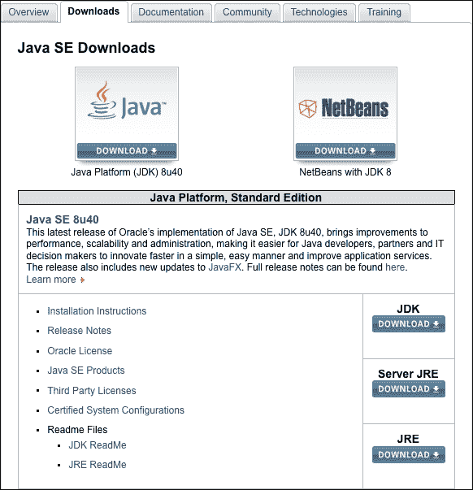

1.  链接将带您进入下载页面，在那里您首先需要勾选**接受许可协议**选项以启用链接，如下截图所示：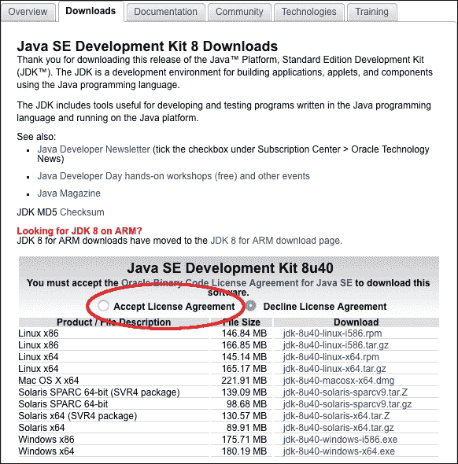

1.  当您接受协议时，所有链接都会激活。选择最适合您硬件和操作系统的链接。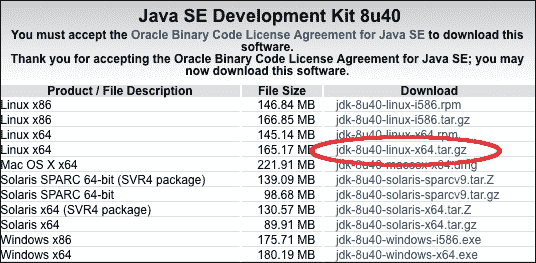

    我正在运行一个 64 位硬件支持的 Fedora 21 Linux 机器，因此我将使用**jdk-8u40-linux-x64.tar.gz**包。我本可以使用 RPM 包，但我更喜欢安装存档版本，以便更好地满足我在路径方面的需求；什么放在哪里。

1.  接下来，我们将创建一个名为`WFC`的文件夹，代表*WildFly 食谱*，用于存储所有必要软件、代码和文件，以便遵循书中的所有食谱。打开您的终端应用程序并运行以下命令：

    ```java
    $ cd && mkdir WFC

    ```

    ### 注意

    `WFC`文件夹仅用于不干扰您当前的环境。

## 如何操作…

1.  选择包存档；下载完成后，打开您的命令行并将内容提取到`WFC`文件夹中，如下所示：

    ```java
    $ cd ~/WFC && tar zxvf jdk-8u40-linux-x64.tar.gz

    ```

    这将把 Oracle JDK 软件提取到`WFC`文件夹内的`jdk1.8.0_40`文件夹中，从您的`home`文件夹开始。为了方便，我们将使用不同的文件夹名，如`jdk8`，来指代先前的 JDK 安装文件夹。运行以下命令：

    ```java
    $ cd ~/WFC && mv jdk1.8.0_40 jdk8

    ```

    现在我们需要设置`JAVA_HOME`环境变量，并使 JDK 命令可以从我们的 shell（也称为终端）中可用。

1.  使用您选择的文本编辑器，并将以下指令添加到位于您`home`文件夹中的`.bash_profile`文件中：

    ```java
    export JAVA_HOME=~/WFC/jdk8
    export PATH=$JAVA_HOME/bin:$PATH
    ```

    前两个命令将设置`JAVA_HOME`变量，并将`JAVA_HOME/bin`路径分别导出到您的**PATH**系统变量中。波浪线`~`符号是 Unix-like 系统中用户主目录的快捷方式。

    为了使更改生效，您可以注销并重新登录，或者只需发出以下命令：

    ```java
    $ source ~/.bash_profile

    ```

1.  安装阶段完成后，通过在终端应用程序中执行`java -version`命令来测试您的新环境，您应该看到（或多或少）以下图片中所示的内容：

1.  接下来，我们需要安装 Apache Maven 3。如果您还没有下载，请点击以下链接：

    [`www.us.apache.org/dist/maven/maven-3/3.2.5/binaries/apache-maven-3.2.5-bin.tar.gz`](http://www.us.apache.org/dist/maven/maven-3/3.2.5/binaries/apache-maven-3.2.5-bin.tar.gz)

1.  下载完成后，打开您的命令行，将其内容提取到`WFC`文件夹中：

    ```java
    $ cd ~/WFC && tar zxvf apache-maven-3.2.5-bin.tar.gz

    ```

    这将把 Apache Maven（也称为 Maven）软件提取到`WFC`文件夹内的`apache-maven-3.2.5`文件夹中，从您的`home`文件夹开始。为了方便，我们将使用不同的文件夹名，如`maven`，来指代先前的 Maven 安装文件夹。运行以下命令：

    ```java
    $ cd ~/WFC && mv apache-maven-3.2.5 maven

    ```

    现在我们需要设置`M2_HOME`环境变量，并使 Maven 的命令可以从我们的 shell（也称为终端）中可用。

1.  使用您选择的文本编辑器，并将以下指令添加到位于您`home`文件夹中的`.bash_profile`文件中：

    ```java
    export M2_HOME=~/WFC/maven
    export PATH=$JAVA_HOME/bin:M2_HOME/bin:$PATH

    ```

    前两个命令将设置`M2_HOME`变量，并将`M2_HOME/bin`路径分别导出到您的**PATH**系统变量中。波浪线`~`符号是 Unix-like 系统中用户主目录的快捷方式。

    为了使更改生效，您可以注销并重新登录，或者只需发出以下命令：

    ```java
    $ source ~/.bash_profile

    ```

1.  安装阶段完成后，通过在终端应用程序中执行`mvn -version`命令来测试您的新环境，您应该看到（或多或少）以下图片中所示的内容：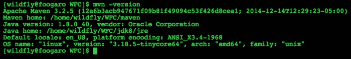

1.  最后，但同样重要的是，我们需要安装`git`，这是一个分布式版本控制系统。它主要用于源代码，但也用作配置仓库。为了安装`git`工具，我们将依赖`yum`软件管理器，这使得安装过程变得简单。打开终端并按照以下步骤操作：

    ```java
    $ sudo yum -y install git

    ```

1.  完成后，尝试执行以下命令：

    ```java
    $ git version
    git version 2.1.0

    ```

## 还有更多...

现在我们已经安装了`git`，我们可以继续下载本书使用的代码仓库（或 repo），它位于以下 GitHub 账户的 URL：[`github.com/foogaro/wildfly-cookbook.git`](https://github.com/foogaro/wildfly-cookbook.git)。

您可以`git-clone`仓库或直接下载 ZIP 存档。无论哪种方式，请在`WFC`文件夹中创建一个名为`github`的文件夹，并将源文件放入其中。

使用`git-clone`命令，按照以下步骤操作：

```java
$ cd ~/WFC
$ mkdir github
$ cd github
$ git clone https://github.com/foogaro/wildfly-cookbook.git

```

一旦`git`完成了仓库的克隆，您将找到一个名为`wildfly-cookbook`的新文件夹，其中包含本书中使用的所有项目。

要构建项目，只需进入相应的文件夹并执行`maven-package`命令。

例如，要构建`example`项目，请按照以下步骤操作：

```java
$ cd ~/WFC/github/wildfly-cookbook/example
$ mvn -e clean package

```

前面的命令会构建项目，并将 Web 应用程序工件生成到名为`target`的文件夹中。在那里您可以找到名为`example.war`的应用程序，准备部署。

好的，我们终于完成了所有软件的安装，这些软件将在本书中使用。为了确保您没有遗漏任何部分，您应该拥有以下图像所示的环境：

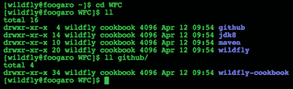

# 下载和安装 WildFly

在这个菜谱中，我们将学习如何获取和安装 WildFly。像往常一样，在开源世界中，您可以用不同的方式做同样的事情。WildFly 可以使用您首选的软件管理器或通过下载[`wildfly.org`](http://wildfly.org)网站提供的捆绑包进行安装。我们将选择第二种方式，按照 JDK 的要求。

## 准备工作

只需打开您喜欢的浏览器并将它指向[`wildfly.org/downloads/`](http://wildfly.org/downloads/)。您应该看到一个类似于以下截图的页面：

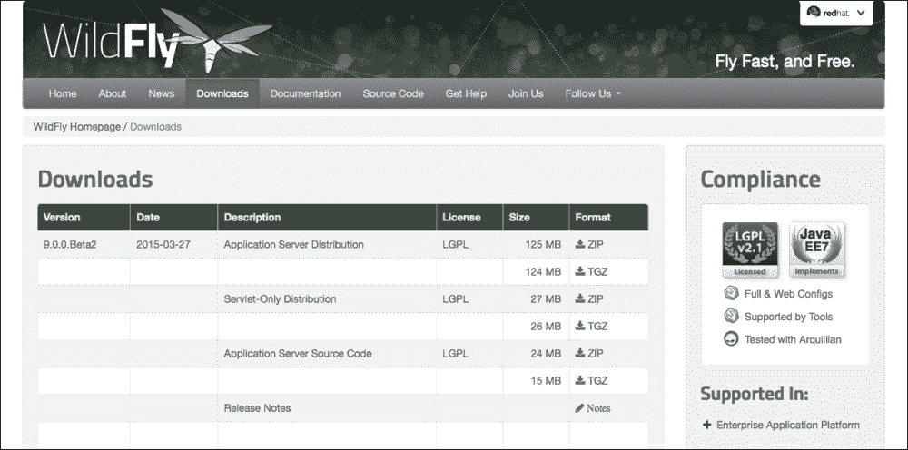

WildFly 的下载页面

在撰写本书时，最新的 WildFly 版本是 9.0.0.Beta2。最终版本现在可用并正在使用。

现在，将最新版本下载到`WFC`文件夹中。

## 如何操作...

1.  下载完成后，打开终端并将内容提取到`WFC`文件夹中，执行以下命令：

    ```java
    $ cd ~/WFC && tar zx wildfly-9.0.0.Beta2.tar.gz

    ```

    前面的命令首先指向我们的`WildFly Cookbook`文件夹；然后它会从中提取 WildFly 存档。列出`WFC`文件夹，我们应该找到新创建的名为`wildfly-9.0.0.Beta2`的 WildFly 文件夹。

1.  为了更好地记住和处理 WildFly 的安装目录，将其重命名为`wildfly`，如下所示：

    ```java
    $ cd ~/WFC && mv wildfly-9.0.0.Beta2 wildfly

    ```

    顺便说一句，WildFly 也可以使用传统的`YUM`，Fedora 的软件管理器进行安装。

    ### 注意

    在生产环境中，你不会将 WildFly 安装目录放置在特定用户的 `home` 文件夹中。相反，你将把它放置在相对于你工作上下文的不同路径中。

1.  现在我们需要创建 `JBOSS_HOME` 环境变量，这是 WildFly 在启动时用作基础目录的变量（可能在未来的版本中，这将更新为 `WILDFLY_HOME`）。我们还将创建 `WILDFLY_HOME` 环境变量，我们将在整个书中使用它来引用 WildFly 的安装目录。因此，使用你喜欢的文本编辑器打开位于你的 `home` 文件夹中的 `.bash_profile` 文件，并添加以下指令：

    ```java
    export JBOSS_HOME=~/WFC/wildfly
    export WILDFLY_HOME=$JBOSS_HOME
    ```

1.  要使更改生效，你可以要么注销并重新登录，要么只需发出以下命令：

    ```java
    $ source ~/.bash_profile

    ```

如果你仔细遵循了前两个食谱，你的 `.bash_profile` 文件应该看起来像以下图片：

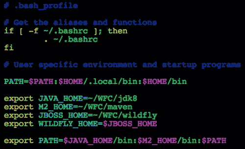

# 理解 WildFly 的目录概览

现在我们已经完成了 WildFly 的安装，让我们来看看它的文件夹。这个食谱将稍微有些理论性。

## 如何操作…

1.  打开你的终端并运行以下命令：

    ```java
    $ cd $WILDFLY_HOME
    $ pwd && ls -la

    ```

1.  你命令的输出应该类似于以下图片：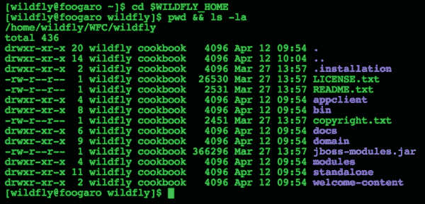

    WildFly 的文件夹概览

## 如何工作…

前面的图片展示了文件系统中 WildFly 的文件夹。以下表格中概述了每个文件夹：

| 文件夹名称 | 描述 |
| --- | --- |
| `appclient` | 由该安装启动的应用客户端容器使用的配置文件、部署内容和可写区域。 |
| `bin` | 包含启动脚本、启动配置文件以及 Unix 和 Windows 环境中可用的各种命令行工具，如 Vault、add-user 和 Java 诊断报告。 |
| `bin/client` | 包含用于非 Maven 基础客户端的客户端 jar。 |
| `docs/schema` | XML 架构定义文件。 |
| `docs/examples/configs` | 代表特定用例的示例配置文件。 |
| `domain` | 由该安装启动的域模式进程使用的配置文件、部署内容和可写区域。 |
| `modules` | WildFly 基于模块化类加载架构。服务器中使用的各种模块存储在这里。 |
| `standalone` | 由该安装启动的单个独立服务器使用的配置文件、部署内容和可写区域。 |
| `welcome-content` | 默认欢迎页面内容。 |

在前面的表中，我强调了“domain”和“standalone”文件夹，这些文件夹决定了 WildFly 将运行在哪种模式下：独立模式或域模式。在接下来的几个食谱中，我们将概述它们，并在本书的后续部分进行深入了解。

### 注意

在此之后，每当提到 WildFly 的家目录时，将指代 `$WILDFLY_HOME`。

# 以独立模式运行 WildFly

独立模式下的 WildFly 意味着一个 WildFly 实例是独立启动和管理的。您可以拥有任意数量的独立 WildFly 实例，但您必须分别管理它们。这意味着每个配置、数据源、部署和模块都必须为每个实例管理一次。

### 注意

独立模式和域模式之间的主要区别在于管理，而不是功能。功能由您选择运行 WildFly 的配置确定。

## 准备工作

让我们来看看独立文件夹：

| 文件夹名称 | 描述 |
| --- | --- |
| `configuration` | 由此安装的单个独立服务器运行时使用的配置文件。 |
| `deployments` | 由此安装的单个独立服务器运行时使用的部署内容。 |
| `lib` | 由此安装的单个独立服务器运行时使用的库。 |
| `log` | 由此安装的单个独立服务器运行时创建的日志文件。 |

因此，配置文件夹包含所有配置文件。是的，您可以拥有多个，但您必须选择要运行的配置。`deployments`文件夹包含所有要部署的应用程序，已部署和未部署的（正如我们稍后将要看到的，甚至有失败的部署标记）。`lib`文件夹包含使用扩展列表机制引用的应用程序的所有库 jar 文件。最后，`log`文件夹包含 WildFly 的`server.log`文件。

如前所述，在`configuration`文件夹中，您可以找到以下文件：

| 文件名 | 描述 |
| --- | --- |
| `standalone.xml (默认)` | Java 企业版 7 网络配置认证配置，包含所需的技术。 |
| `standalone-ha.xml` | Java 企业版 7 网络配置认证配置，具有高可用性。 |
| `standalone-full.xml` | Java 企业版 7 完整配置认证配置，包括所有必需的 EE 7 技术，包括消息传递—JMS。 |
| `standalone-full-ha.xml` | Java 企业版 7 完整配置认证配置，具有高可用性。 |

在 Java EE 7 配置的基础上，WildFly 定义了自己的配置。对于独立模式，每个文件对应一个 WildFly 配置，即`standalone.xml`对应默认配置，`standalone-ha.xml`对应`ha`配置，`standalone-full.xml`对应`full`配置，而`standalone-full-ha.xml`对应`full-ha`配置。在域模式下也可以找到相同的 WildFly 配置。

## 如何操作...

让我们尝试以默认设置运行 WildFly 的独立模式，如下所示：

```java
$ cd $WILDFLY_HOME
$ ./bin/standalone.sh =========================================================================

 JBoss Bootstrap Environment

 JBOSS_HOME: /home/wildfly/WFC/wildfly

 JAVA: /home/wildfly/WFC/jdk8/bin/java

 JAVA_OPTS:  -server -XX:+UseCompressedOops  -server -XX:+UseCompressedOops -Xms64m -Xmx512m -XX:MaxPermSize=256m -Djava.net.preferIPv4Stack=true -Djboss.modules.system.pkgs=org.jboss.byteman -Djava.awt.headless=true

=========================================================================

Java HotSpot(TM) 64-Bit Server VM warning: ignoring option MaxPermSize=256m; support was removed in 8.0
08:43:50,658 INFO  [org.jboss.modules] (main) JBoss Modules version 1.4.2.Final
08:43:50,799 INFO  [org.jboss.msc] (main) JBoss MSC version 1.2.4.Final
08:43:50,850 INFO  [org.jboss.as] (MSC service thread 1-6) WFLYSRV0049: WildFly Full 9.0.0.Beta2 (WildFly Core 1.0.0.Beta2) starting
08:43:51,543 INFO  [org.jboss.as.controller.management-deprecated] (ServerService Thread Pool -- 26) WFLYCTL0028: Attribute enabled is deprecated, and it might be removed in future version!
08:43:51,564 INFO  [org.jboss.as.server] (Controller Boot Thread) WFLYSRV0039: Creating http management service using socket-binding (management-http)
08:43:51,592 INFO  [org.xnio] (MSC service thread 1-11) XNIO version 3.3.0.Final
08:43:51,601 INFO  [org.xnio.nio] (MSC service thread 1-11) XNIO NIO Implementation Version 3.3.0.Final
08:43:51,627 WARN  [org.jboss.as.txn] (ServerService Thread Pool -- 54) WFLYTX0013: Node identifier property is set to the default value. Please make sure it is unique.
08:43:51,626 INFO  [org.jboss.as.security] (ServerService Thread Pool -- 53) WFLYSEC0002: Activating Security Subsystem
08:43:51,631 INFO  [org.wildfly.extension.io] (ServerService Thread Pool -- 37) WFLYIO001: Worker 'default' has auto-configured to 16 core threads with 128 task threads based on your 8 available processors
08:43:51,635 INFO  [org.jboss.as.security] (MSC service thread 1-10) WFLYSEC0001: Current PicketBox version=4.9.0.Beta2
08:43:51,649 INFO  [org.jboss.as.jsf] (ServerService Thread Pool -- 44) WFLYJSF0007: Activated the following JSF Implementations: [main]
08:43:51,650 INFO  [org.jboss.as.clustering.infinispan] (ServerService Thread Pool -- 38) WFLYCLINF0001: Activating Infinispan subsystem.
08:43:51,680 INFO  [org.jboss.as.naming] (ServerService Thread Pool -- 46) WFLYNAM0001: Activating Naming Subsystem
08:43:51,686 INFO  [org.jboss.remoting] (MSC service thread 1-11) JBoss Remoting version 4.0.8.Final
08:43:51,687 INFO  [org.jboss.as.webservices] (ServerService Thread Pool -- 56) WFLYWS0002: Activating WebServices Extension
08:43:51,704 INFO  [org.jboss.as.connector.subsystems.datasources] (ServerService Thread Pool -- 33) WFLYJCA0004: Deploying JDBC-compliant driver class org.h2.Driver (version 1.3)
08:43:51,707 INFO  [org.wildfly.extension.undertow] (MSC service thread 1-5) WFLYUT0003: Undertow 1.2.0.Beta10 starting
08:43:51,707 INFO  [org.wildfly.extension.undertow] (ServerService Thread Pool -- 55) WFLYUT0003: Undertow 1.2.0.Beta10 starting
08:43:51,714 INFO  [org.jboss.as.connector] (MSC service thread 1-3) WFLYJCA0009: Starting JCA Subsystem (IronJacamar 1.2.3.Final)
08:43:51,725 INFO  [org.jboss.as.connector.deployers.jdbc] (MSC service thread 1-5) WFLYJCA0018: Started Driver service with driver-name = h2
08:43:51,813 INFO  [org.jboss.as.naming] (MSC service thread 1-5) WFLYNAM0003: Starting Naming Service
08:43:51,814 INFO  [org.jboss.as.mail.extension] (MSC service thread 1-7) WFLYMAIL0001: Bound mail session [java:jboss/mail/Default]
08:43:51,876 INFO  [org.wildfly.extension.undertow] (ServerService Thread Pool -- 55) WFLYUT0014: Creating file handler for path /Users/foogaro/wildfly9/wildfly-9.0.0.Beta2/welcome-content
08:43:51,904 INFO  [org.wildfly.extension.undertow] (MSC service thread 1-16) WFLYUT0012: Started server default-server.
08:43:51,926 INFO  [org.wildfly.extension.undertow] (MSC service thread 1-2) WFLYUT0018: Host default-host starting
08:43:51,990 INFO  [org.wildfly.extension.undertow] (MSC service thread 1-12) WFLYUT0006: Undertow HTTP listener default listening on /127.0.0.1:8080
08:43:52,122 INFO  [org.jboss.as.connector.subsystems.datasources] (MSC service thread 1-12) WFLYJCA0001: Bound data source [java:jboss/datasources/ExampleDS]
08:43:52,166 INFO  [org.jboss.as.server.deployment.scanner] (MSC service thread 1-5) WFLYDS0013: Started FileSystemDeploymentService for directory /Users/foogaro/wildfly9/wildfly-9.0.0.Beta2/standalone/deployments
08:43:52,244 INFO  [org.jboss.ws.common.management] (MSC service thread 1-11) JBWS022052: Starting JBoss Web Services - Stack CXF Server 5.0.0.Beta3
08:43:52,403 INFO  [org.jboss.as] (Controller Boot Thread) WFLYSRV0060: Http management interface listening on http://127.0.0.1:9990/management
08:43:52,403 INFO  [org.jboss.as] (Controller Boot Thread) WFLYSRV0051: Admin console listening on http://127.0.0.1:9990
08:43:52,403 INFO  [org.jboss.as] (Controller Boot Thread) WFLYSRV0025: WildFly Full 9.0.0.Beta2 (WildFly Core 1.0.0.Beta2) started in 1970ms - Started 202 of 379 services (210 services are lazy, passive or on-demand)

```

## 它是如何工作的...

前几行会告诉你 WildFly 的位置和 JVM 选项。接下来是 Undertow HTTP 监听器，它是处理 HTTP 请求的组件，监听于`http://127.0.0.1:8080`。实际上，你可以通过指向前面的地址来测试 WildFly 是否正在运行正确，你应该会看到以下类似图像：

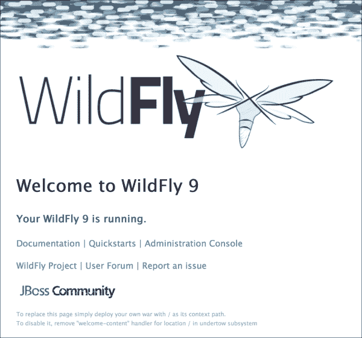

WildFly 的欢迎内容

接下来是关于 WildFly 管理监听器的日志，我已强调。第一个监听器是 HTTP 管理监听器，它实际上是一个 HTTP API，用于通过 HTTP 调用命令。第二个是管理控制台，它为你提供了一个 Web 控制台，以简化 WildFly 的大多数配置。HTTP 管理接口和管理控制台分别监听于`http://127.0.0.1:9990/management`和`http://127.0.0.1:9990`。

要访问管理控制台，打开浏览器并将它指向`http://127.0.0.1:9990/`。你应该会看到一个页面，如下面的图像所示：

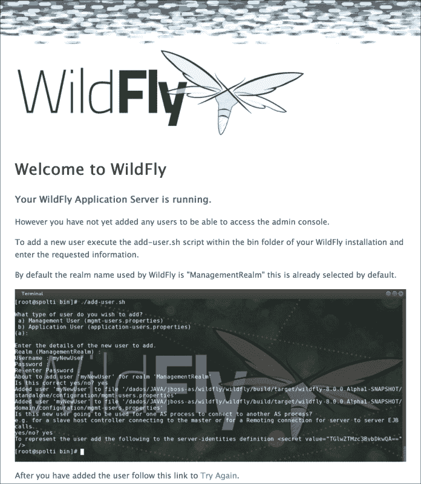

WildFly 的管理错误页面

WildFly 正在运行，但此时管理控制台不可见，因为没有用户注册到属于管理控制台的安全上下文（WildFly 的正确术语是域）。我们将在本食谱和随后的章节中讨论安全和域。

### 注意

因此，无论何时我使用“管理控制台”或“Web 控制台”这个术语，它们都指的是同一件事。

此外，前面的屏幕截图告诉你如何创建一个用户来访问管理控制台。我们需要通过使用 WildFly 在`bin`文件夹中提供的`add-user.sh`脚本来创建管理员用户。

再次打开你的命令行（除非你正在关闭你的 PC，否则你不应该关闭它）并执行以下命令：

```java
$ cd $WILDFLY
$ ./bin/add-user.sh

```

下面的屏幕截图是前面代码的结果：

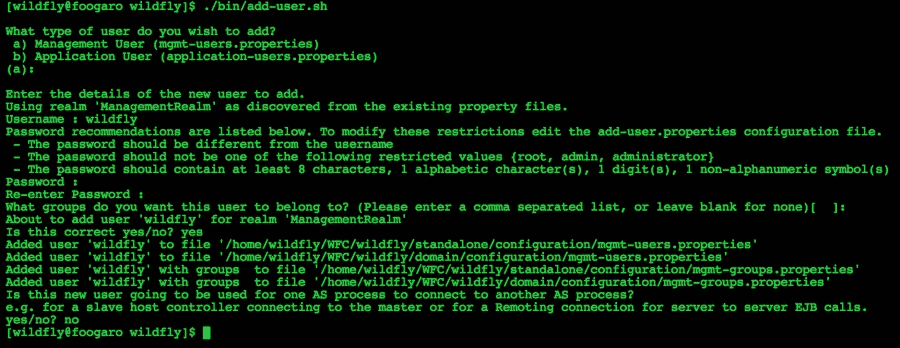

检查脚本及其交互：

+   在前面的屏幕截图中，脚本首先询问用户类型；在我们的情况下，我们需要一个管理用户。所以只需按*Enter*键或输入`a`然后按*Enter*键。我们不需要在应用级别创建用户，用于创建安全上下文。

+   我们指定用户名，例如`wildfly`。

+   然后我们需要输入符合指定策略的密码。所以我们输入`cookbook.2015`并按*Enter*键。

+   我们通过重新输入之前提供的密码来确认上一步提供的密码。

+   我们确认要将我们的用户“wildfly”添加到`ManagementRealm`域。所以我们输入`yes`并按*Enter*键。

+   在最后一步，脚本会询问用户是否将用于连接 WildFly 的一个进程到另一个进程，或者用于对 EJB 进行认证。在这种情况下，我们输入`no`并按*Enter*键。

现在，让我们再次指向管理地址 `http://127.0.0.1:9990`。页面现在要求你输入用户名和密码。将用户名指定为 `wildfly`，密码指定为 `cookbook.2015`，你应该会看到如下 WildFly 管理控制台：

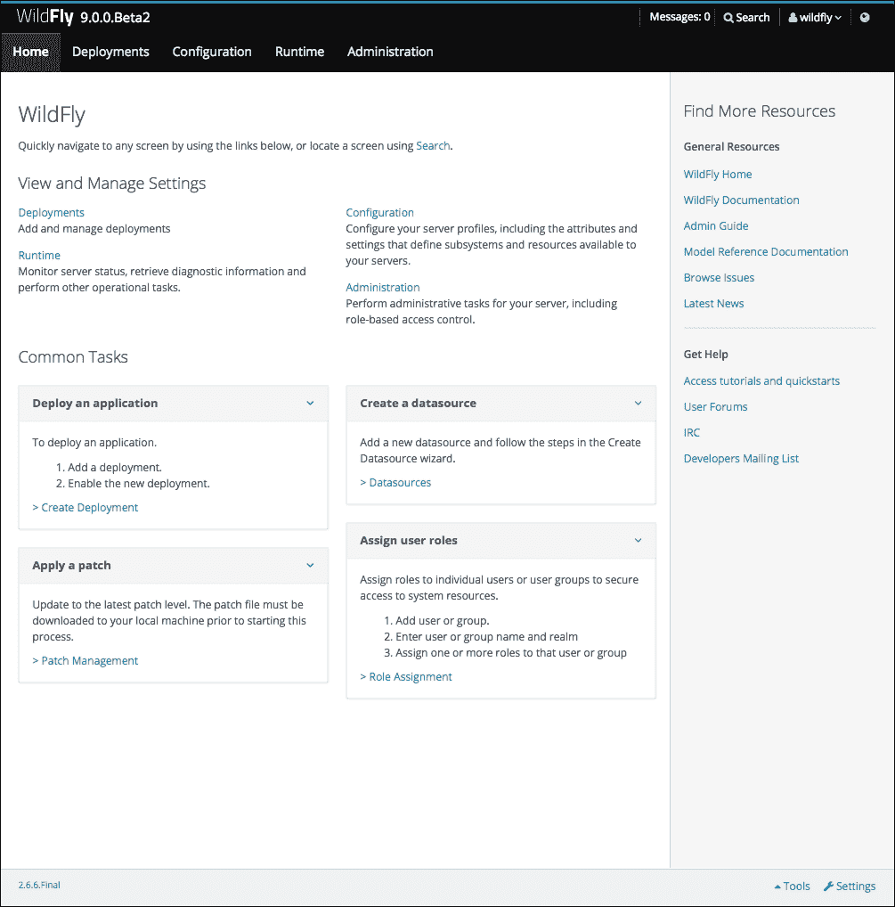

WildFly 的 Web 控制台

## 参见

我们很快将深入研究独立模式。在 第二章，*以独立模式运行 WildFly* 中，将详细描述所有配置文件，你应该使用哪个，以及如何使用管理控制台和 CLI 管理你的实例。我们还将部署管理工具。

# 以域模式运行 WildFly

自从 JBoss AS 4、5 和 6 以来，域模式是一种全新的功能。它首次在 JBoss AS 7 中引入。

这涉及到将几个 WildFly 实例组合成一个单一组，即使用 WildFly 命名法的服务器组。实际上，我们将 WildFly 服务器组合成一个逻辑服务器组，所有 WildFly 实例将共享相同的配置。通过这种方式，我们意味着它们将共享相同的 WildFly 配置文件（`default`、`ha`、`full` 和 `full-ha`），相同的部署，等等。不会共享的是特定实例配置，例如 IP 绑定地址、端口等。

假设你有一个应用程序，并且你希望它在你的基础设施的四个服务器上部署（或者更确切地说，是在测试而不是预生产或生产环境中）。你需要配置一个服务器组，将四个服务器实例与之关联，然后你就完成了。仅处理服务器组时，所有设置和更改都将传播到所有相关服务器实例。这绝对是 JBoss AS 中的一个重大遗漏，但现在我们有了它。

### 注意

记住，服务器组在任何方式下都不会形成一个集群。

## 准备工作

在处理域模式时，有两个新术语需要了解和理解：**域控制器**（**DC**）和**主机控制器**（**HC**）。

第一个，即域控制器（DC），充当父进程，乐队的“总指挥”。所有更改都是由 DC 向所有服务器组的所有 HC 提供的。DC 配置文件命名为 `domain.xml`，而 HC 配置文件命名为 `host.xml`。

### 注意

为了避免混淆，最好明确我们在书中将使用的术语。我们可能会将运行域控制器的服务器称为“主服务器”或“域”。或者，我们可能会将不是域的运行 WildFly 实例称为“主机”或“从服务器”。

另一件需要了解的事情是，与独立模式不同，在独立模式下，你有不同配置文件的不同文件，在域模式下，你最终只有一个文件（还有一个名为 `host.xml` 的文件，但我们很快就会谈到它），其中包含了为你配置的所有配置文件。配置文件与独立模式相同。我们将在专门介绍域模式的章节中学习如何将配置文件关联到服务器组。

让我们看看`domain`文件夹：

| 文件夹名称 | 描述 |
| --- | --- |
| `configuration` | 域和宿主控制器以及在此安装上运行的任何服务器的配置文件。域内管理的服务器的所有配置信息都位于此处，并且是配置信息的唯一位置。 |
| `content` | 宿主控制器控制此安装的内部工作区域。这是它内部存储部署内容的地方。此目录由 WildFly 启动时生成，不打算由最终用户操作。请注意，域模式不支持基于扫描文件系统部署内容。 |
| `lib/ext` | 使用扩展列表机制引用的已安装库 jar 文件的位置。 |
| `log` | 宿主控制器进程写入其日志的位置。进程控制器，一个实际产生其他宿主控制器进程和任何应用服务器进程的小型轻量级进程，也在这里写入日志。 |

| `servers` | 由从该安装运行的应用服务器实例使用的可写区域。每个应用服务器实例将拥有自己的子目录，当服务器首次启动时创建。在每个服务器的子目录中，将包含以下子目录：

+   `data`：服务器写入需要从服务器重启中恢复的信息

+   `log`：服务器的日志文件

+   `tmp`：服务器写入的临时文件的位置

|

| `tmp` | 服务器写入的临时文件的位置 |
| --- | --- |
| `tmp/auth` | 专门用于与本地客户端交换认证令牌的位置，以便它们可以确认它们是正在运行的 AS 进程的本地。 |

因此，`configuration` 文件夹包含所有配置文件。让我们看看它们全部：

| 文件名称 | 描述 |
| --- | --- |
| `domain.xml (默认名称)` | 这是包含所有 WildFly 配置文件以及运行 AS 所需的所有其他配置的主配置文件。当 WildFly 启动时，如果未指定其他文件，它将寻找名为`domain.xml`的文件。 |
| `host.xml (默认名称)` | 这是 WildFly 安装提供的宿主控制器配置文件。在这里，您将找到有关服务器实例的所有特定配置。当 WildFly 启动时，如果未指定其他文件，它将寻找名为`host.xml`的文件。 |
| `host-master.xml` | 这是 WildFly 安装提供的宿主控制器配置示例文件。它展示了如何配置仅运行域控制器的 WildFly。 |
| `host-slave.xml` | 这是 WildFly 安装提供的宿主控制器配置示例文件，用于配置作为从机运行的 WildFly 并连接到域控制器。 |

## 如何操作...

让我们尝试使用默认设置（两个服务器组——第一个有两个名为`server-one`和`server-two`的实例，最后一个有一个名为`server-three`的实例，自动启动已禁用）在域模式下运行 WildFly。按照以下步骤操作：

```java
$ CD $WILDFLY_HOME
$ ./bin/domain.sh -b 0.0.0.0 -bmanagement 0.0.0.0
====================================================================

 JBoss Bootstrap Environment

 JBOSS_HOME: /home/wildfly/WFC/wildfly

 JAVA: /home/wildfly/WFC/jdk8/bin/java

 JAVA_OPTS: -Xms64m -Xmx512m -XX:MaxPermSize=256m -Djava.net.preferIPv4Stack=true -Djboss.modules.system.pkgs=org.jboss.byteman -Djava.awt.headless=true

====================================================================

Java HotSpot(TM) 64-Bit Server VM warning: ignoring option MaxPermSize=256m; support was removed in 8.0
08:50:53,715 INFO  [org.jboss.modules] (main) JBoss Modules version 1.4.2.Final
08:50:53,804 INFO  [org.jboss.as.process.Host Controller.status] (main) WFLYPC0018: Starting process 'Host Controller'
[Host Controller] Java HotSpot(TM) 64-Bit Server VM warning: ignoring option MaxPermSize=256m; support was removed in 8.0
[Host Controller] 08:50:54,154 INFO  [org.jboss.modules] (main) JBoss Modules version 1.4.2.Final
[Host Controller] 08:50:54,841 INFO  [org.jboss.msc] (main) JBoss MSC version 1.2.4.Final
[Host Controller] 08:50:54,869 INFO  [org.jboss.as] (MSC service thread 1-7) WFLYSRV0049: WildFly Full 9.0.0.Beta2 (WildFly Core 1.0.0.Beta2) starting
[Host Controller] 08:50:55,326 INFO  [org.xnio] (MSC service thread 1-7) XNIO version 3.3.0.Final
[Host Controller] 08:50:55,328 INFO  [org.jboss.as] (Controller Boot Thread) WFLYHC0003: Creating http management service using network interface (management) port (9990) securePort (-1)
[Host Controller] 08:50:55,332 INFO  [org.xnio.nio] (MSC service thread 1-7) XNIO NIO Implementation Version 3.3.0.Final
[Host Controller] 08:50:55,391 INFO  [org.jboss.remoting] (MSC service thread 1-7) JBoss Remoting version 4.0.8.Final
[Host Controller] 08:50:55,415 INFO  [org.jboss.as.remoting] (MSC service thread 1-1) WFLYRMT0001: Listening on 0.0.0.0:9999
[Host Controller] 08:50:56,189 INFO  [org.jboss.as.host.controller] (Controller Boot Thread) WFLYHC0023: Starting server server-one
08:50:56,199 INFO  [org.jboss.as.process.Server:server-one.status] (ProcessController-threads - 3) WFLYPC0018: Starting process 'Server:server-one'
[Server:server-one] 08:50:56,527 INFO  [org.jboss.modules] (main) JBoss Modules version 1.4.2.Final
[Server:server-one] 08:50:56,692 INFO  [org.jboss.msc] (main) JBoss MSC version 1.2.4.Final
[Server:server-one] 08:50:56,753 INFO  [org.jboss.as] (MSC service thread 1-7) WFLYSRV0049: WildFly Full 9.0.0.Beta2 (WildFly Core 1.0.0.Beta2) starting
...
[Host Controller] 08:50:57,401 INFO  [org.jboss.as.domain.controller.mgmt] (Remoting "master:MANAGEMENT" task-4) WFLYHC0021: Server [Server:server-one] connected using connection [Channel ID 56504cde (inbound) of Remoting connection 0f0a1d33 to /192.168.59.3:50968]
[Host Controller] 08:50:57,420 INFO  [org.jboss.as.host.controller] (Controller Boot Thread) WFLYHC0023: Starting server server-two
08:50:57,423 INFO  [org.jboss.as.process.Server:server-two.status] (ProcessController-threads - 3) WFLYPC0018: Starting process 'Server:server-two'
[Host Controller] 08:50:57,430 INFO  [org.jboss.as.host.controller] (server-registration-threads - 1) WFLYHC0020: Registering server server-one
...
[Server:server-two] 08:50:58,213 INFO  [org.jboss.modules] (main) JBoss Modules version 1.4.2.Final
[Server:server-two] 08:50:58,513 INFO  [org.jboss.msc] (main) JBoss MSC version 1.2.4.Final
[Server:server-two] 08:50:58,621 INFO  [org.jboss.as] (MSC service thread 1-6) WFLYSRV0049: WildFly Full 9.0.0.Beta2 (WildFly Core 1.0.0.Beta2) starting

```

## 它是如何工作的...

域控制器负责启动所有本地主机控制器以及配置的实例。现在，打开 WildFly 管理控制台，你可以看到您实例的详细信息概览：

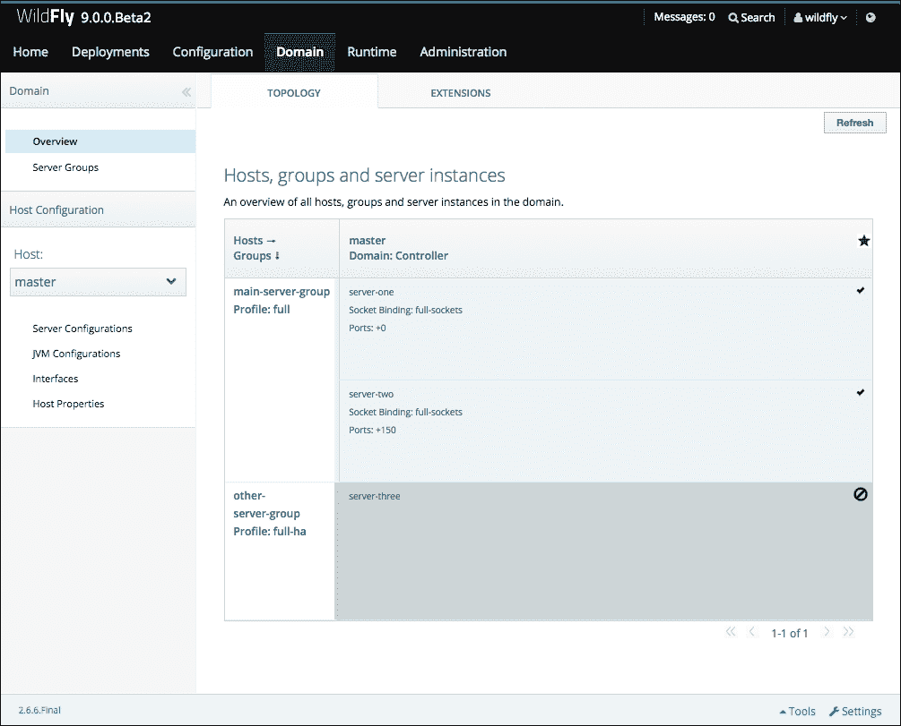

WildFly 的运行时域概述

从域的角度来看，你可以看到两个名为**main-server-group**的服务器组，具有`full`配置文件，以及具有`full-ha`配置文件的**other-server-group**。后者没有运行，因为其自动启动属性设置为 false。

### 注意

这次，即使第一次在域模式下运行，我们也不必创建新用户，因为我们已经在设置独立模式时创建了。

## 参见

我们很快将深入探讨域模式。在第三章中，*在域模式下运行 WildFly*，将详细描述所有配置文件，除了学习如何选择正确的配置文件以及如何使用管理控制台和 CLI 管理您的实例。我们将分析域和主机控制器进程。我们将创建各种服务器组示例，包括本地运行和在伪不同机器上运行。我们还将部署管理工具并分析其在域模式下的行为。

# 将 WildFly 作为服务运行

在这个菜谱中，你将学习如何将 WildFly 作为服务安装，实际上是在操作系统启动时自动运行 WildFly。如果你需要手动按需运行 Wildfly，你可以跳过这个菜谱，除非出于知识目的。

大多数类 Unix 系统都有不同的“运行级别”（可以将它们视为系统运行阶段的步骤）。在操作系统级别，只有当其他服务已成功激活时，才能激活服务。因此，如果你激活一个在之前一个服务启动并运行之前需要网络的服务的服务，它将出现故障或变得无用。这就是“运行级别”的基本作用。

以下是一个运行级别的列表：

+   **rc1.d**：单用户模式

+   **rc2.d**：带网络的单用户模式

+   **rc3.d**：多用户模式—以文本模式启动

+   **rc4.d**：未定义

+   **rc5.d**：多用户模式—在 X 窗口中启动

+   **rc6.d**：关机

大多数生产级 Linux 系统使用运行级别 3（不需要 UI，这将是一种资源浪费），但为了达到所有受众，我们将使用级别 2、3 和 5。

## 如何做到这一点...

WildFly 附带一个预定义的脚本，可以用来将 WildFly 作为服务运行。此脚本位于 WildFly 安装文件夹的`bin/init.d`文件夹中。因此，我们只需将系统文件夹`/etc/init.d`中的文件复制进去，并将其设置为服务，如下所示：

```java
$ sudo cp $WILDFLY_HOME/bin/init.d/wildfly-init-redhat.sh /etc/init.d/wildfly
$ sudo chkconfig --add wildfly
$ sudo chkconfig wildfly on --level 235

```

还有另一个文件我们需要查看，那就是`wildfly.conf`，位于 WildFly 安装文件夹的同一`bin/init.d`目录中。以下就是该文件的内容：

```java
# General configuration for the init.d scripts,
# not necessarily for JBoss AS itself.
# default location: /etc/default/wildfly

## Location of JDK
# JAVA_HOME="/usr/lib/jvm/default-java"

## Location of WildFly
# JBOSS_HOME="/opt/wildfly"

## The username who should own the process.
# JBOSS_USER=wildfly

## The mode WildFly should start, standalone or domain
# JBOSS_MODE=standalone

## Configuration for standalone mode
# JBOSS_CONFIG=standalone.xml

## Configuration for domain mode
# JBOSS_DOMAIN_CONFIG=domain.xml
# JBOSS_HOST_CONFIG=host-master.xml

## The amount of time to wait for startup
# STARTUP_WAIT=60

## The amount of time to wait for shutdown
# SHUTDOWN_WAIT=60

## Location to keep the console log
# JBOSS_CONSOLE_LOG="/var/log/wildfly/console.log"
```

之前的配置文件基本上设置了一系列参数，告诉`init-script`使用哪种 WildFly 模式，哪个配置文件，WildFly 应该以哪个用户运行，等等。任何更新都应该放入该文件中。

目前，我们将依赖默认设置，除了我们将通过取消注释行`# JBOSS_USER=wildfly`，移除`#`符号来明确提到的用户。你可能已经注意到，你也可以指定 WildFly 将运行的模式：域模式或独立模式。

我们现在需要创建`wildfly`用户，并将 WildFly 的`home`文件夹的所有权赋予`wildfly`用户。按照以下步骤操作：

```java
$ sudo groupadd -r wildfly
$ sudo useradd -r -g wildfly -s /sbin/nologin -c "WildFly user" wildfly
$ sudo passwd -d wildfly
$ sudo chown -R :wildfly $WILDFLY_HOME/*

```

现在，如果你重启系统，WildFly 将以默认设置作为服务启动并运行，由`wildfly`用户启动。
