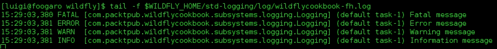

# 第四章. 使用 CLI 管理日志子系统

在本章中，您将涵盖以下主题：

+   创建一个文件处理器日志

+   创建一个周期性旋转的文件处理器

+   创建一个大小旋转的文件处理器

+   定义异步处理器

+   创建一个 syslog 处理器

+   列出和读取日志文件

+   使用不同的日志实现

# 简介

日志子系统是您配置 WildFly 和应用程序的信息语句的地方，用于调试和审计目的。

WildFly 自带默认配置，可以在独立和域目录的`configuration`文件夹中找到。默认配置会自动在控制台和名为`server.log`的文件中记录信息。

正如您在本章中将学到的，WildFly 有七个不同的处理器来帮助您持久化应用程序日志：

+   **控制台**: 将应用程序日志写入标准输出

+   **文件**: 将应用程序日志写入文件

+   **周期性**: 根据时间旋转文件来写入应用程序日志

+   **大小**: 根据大小旋转文件来写入应用程序日志

+   **异步**: 包装一个或多个处理器以提供异步行为

+   **自定义**: 允许您使用自己的处理器，只要它扩展了`java.util.logging.Handler`类

+   **Syslog**: 将应用程序日志写入默认的操作系统日志记录器

根据您的 WildFly 的操作模式，您有不同的默认日志文件路径设置。

## 域模式

在托管域中，我们有两种类型的日志文件：控制器和服务器日志。

从默认的`domain.xml`配置开始，域控制器组件和服务器都位于同一主机上：

| 进程 | 日志文件 |
| --- | --- |
| `[主机控制器]` | `jboss.domain.log.dir/host-controller.log` |
| `[进程控制器]` | `jboss.domain.log.dir/process-controller.log` |
| `[服务器一】` | `jboss.domain.servers.dir/server-one/log/server.log` |
| `[服务器二】` | `jboss.domain.servers.dir/server-two/log/server.log` |
| `[服务器三】` | `jboss.domain.servers.dir/server-three/log/server.log` |

如果您想更改上述提到的属性之一，可以设置不同的值，如下所示：

```java
$ ./bin/domain.sh -Djboss.domain.log.dir=/home/luigi/wildfly-domain-logs
```

## 独立模式

独立服务器的默认日志文件位于 WildFly 主目录的`jboss.server.base.dir`文件夹的日志子目录中：

| 进程 | 日志文件 |
| --- | --- |
| `[服务器]` | `jboss.server.log.dir/server.log` |

如果您想更改上述提到的属性，可以设置不同的值，如下所示：

```java
$ ./bin/standalone.sh -Djboss.server.log.dir=/home/luigi/wildfly-standalone-logs
```

# 创建一个文件处理器日志

日志子系统是您配置应用程序和/或 WildFly 核心的输出信息语句的地方，用于调试或审计目的。在本食谱中，我们将学习如何将应用程序的日志语句输出指向文件处理器。

为了简化，我们将尝试在独立模式下运行的 WildFly 的食谱。

## 准备工作

首先，让我们为我们的菜谱创建一个独立的配置，如下所示：

```java
$ cd $WILDFLY_HOME
$ cp -a standalone std-logging
```

为了测试我们的日志配置，我们需要一个应用程序来记录一些语句。在这种情况下，我们将使用名为`logging`的应用程序。要获取部署的工件，请参阅第一章中的*软件先决条件*菜谱，*欢迎来到 WildFly!*。

现在，让我们启动 WildFly，如下所示：

```java
$ cd $WILDFLY_HOME
$ ./bin/standalone.sh -Djboss.server.base.dir=$WILDFLY_HOME/std-logging
```

## 如何做...

1.  在 WildFly 服务器运行的情况下，打开你的命令行工具并连接到 CLI：

    ```java
    $ ./bin/jboss-cli.sh --connect

    [standalone@localhost:9990 /]
    ```

1.  现在执行以下命令：

    ```java
    [standalone@localhost:9990 /] /subsystem=logging/file-handler=wildflycookbook-fh:add(level=INFO, file={"relative-to"=>"jboss.server.log.dir", "path"=>"wildflycookbook-fh.log"}, append=false, autoflush=true)
    [standalone@localhost:9990 /] /subsystem=logging/logger=com.packtpub.wildflycookbook:add(use-parent-handlers=false,handlers=["wildflycookbook-fh"],level=INFO)
    ```

1.  现在部署`logging.war`应用程序，查看`log`文件夹以查看是否存在文件`wildflycookbook-fh.log`。相应的测试 URL 如下`http://127.0.0.1:8080/logging`。

现在检查你的日志，你应该看到如下内容：



使用 wildflycookbook-fh 文件处理程序的日志语句。

## 它是如何工作的...

我们首先需要添加文件处理程序，然后创建一个类别来将适当的应用程序包映射到我们新的文件处理程序`wildflycookbook-fh`。

应用程序包可以是任何，甚至是你可能感兴趣并希望存储在单独文件中的 WildFly 内部包。

不管怎样，一旦你创建了文件处理程序，你可以在 CLI 中检查它的配置，如下所示：


查看`standalone.xml`文件，新的文件处理程序配置如下所示：

```java
<file-handler name="wildflycookbook-fh" autoflush="true">
  <level name="INFO"/>
  <file relative-to="jboss.server.log.dir" path="wildflycookbook-fh.log"/>
  <append value="false"/>
</file-handler>            
<logger category="com.packtpub.wildflycookbook" use-parent-handlers="false">
  <level name="INFO"/>
  <handlers>
    <handler name="wildflycookbook-fh"/>
  </handlers>
</logger>
```

## 还有更多...

通常，每个环境都有其独特的特性，即使是日志子系统也不例外。在测试环境中，你可能需要更多信息来查看，因此你希望开发者信息被追踪到日志文件中。我们可以通过在处理程序和类别上启用`DEBUG`级别来实现这种行为。让我们看看这两个指令。

首先，我们为文件处理程序本身启用`DEBUG`级别：

```java
[standalone@localhost:9990 /] /subsystem=logging/file-handler=wildflycookbook-fh:write-attribute(name=level,value=DEBUG)
```

然后我们在类别上启用`DEBUG`级别：

```java
[standalone@localhost:9990 /] /subsystem=logging/logger=com.packtpub.wildflycookbook:write-attribute(name=level,value=DEBUG)
```

# 创建周期性轮转文件处理程序

在这个菜谱中，我们将学习如何将应用程序的日志语句输出定向到周期性文件处理程序。这与文件处理程序不同，因为当运行系统达到预定义的时间（即小时变化、日变化等）时，日志文件会滚动，备份自身并创建一个具有相同特性的新文件。

为了简单起见，我们将尝试在独立模式下运行的 WildFly 的菜谱。

## 准备工作

如果你没有遵循前面的菜谱，我们需要为我们的菜谱创建一个独立的配置，如下所示：

```java
$ cd $WILDFLY_HOME
$ cp -a standalone std-logging
```

为了测试我们的日志配置，我们需要一个应用程序来记录一些语句。在这种情况下，我们将使用名为`logging`的应用程序。要获取部署的工件，请参阅第一章中的*软件先决条件*菜谱，*欢迎来到 WildFly!*。

现在，让我们启动 WildFly，如下所示：

```java
$ cd $WILDFLY_HOME
$ ./bin/standalone.sh -Djboss.server.base.dir=$WILDFLY_HOME/std-logging
```

## 如何做…

1.  在运行 WildFly 服务器的情况下，打开您的命令行工具并连接到 CLI：

    ```java
    $ ./bin/jboss-cli.sh --connect

    [standalone@localhost:9990 /]
    ```

1.  现在执行以下命令：

    ```java
    [standalone@localhost:9990 /] /subsystem=logging/periodic-rotating-file-handler=wildflycookbook-prfh:add(level=INFO, file={"relative-to"=>"jboss.server.log.dir", "path"=>"wildflycookbook-prfh.log"}, append=false, autoflush=true, suffix=".yyyy-MM-dd-HH-mm")
    ```

    在前面的配置中，我们设置了后缀和旋转算法为分钟，只是为了举例。

    ### 小贴士

    在生产环境中，您应该使用每日旋转算法并安排一个`olding`机制，以便将文件备份到其他位置，以避免文件系统满载。

    然而，如果您遵循了之前的配方，您只需将 `periodic.rotating-file-handler` 添加到类别中，如下所示：

    ```java
    [standalone@localhost:9990 /] /subsystem=logging/logger=com.packtpub.wildflycookbook:add-handler(name=wildflycookbook-prfh)
    ```

1.  相反，如果您跳过了 *创建文件处理器日志* 配方，您需要创建一个新的类别并将处理器引用到它，如下所示：

    ```java
    [standalone@localhost:9990 /] /subsystem=logging/logger=com.packtpub.wildflycookbook:add(use-parent-handlers=false,handlers=["wildflycookbook-prfh"], level=INFO)
    ```

1.  现在部署 `logging.war`，如果您还没有这样做，然后查看 `log` 文件夹以检查文件 `wildflycookbook-prfh.log` 是否存在。要触发日志语句到新文件，请访问以下地址：`http://127.0.0.1:8080/logging`。

    现在等一会儿，刷新页面几次。您应该在 `jboss.server.base.dir/log` 文件夹中注意到至少另一个 `*-prfh*` 日志文件，如下所示：

    

正如您所看到的，我们的日志文件已经旋转了一次。

## 如何工作…

我们首先需要创建文件处理器，然后创建一个类别来将适当的应用程序包映射到我们新的周期性旋转文件处理器 `wildflycookbook-prfh`。应用程序包可以是任何类型，甚至是您可能感兴趣并希望存储在单独文件中的 WildFly 内部包。

那么关于“零”字节的文件呢？该文件是在创建处理器后创建的。在我的情况下，我在运行 `logging` 应用程序之前等了几分钟，所以当是时候写入文件时，处理器首先检查分钟是否改变（它改变了），然后旋转文件。然后它创建了新文件并将内容写入其中。

无论如何，一旦您创建了周期性旋转文件处理器，您可以在 CLI 中检查其配置，如下所示：


查看 `standalone.xml`，新的周期性旋转文件处理器配置如下所示：

```java
<periodic-rotating-file-handler name="wildflycookbook-prfh" autoflush="true">
  <level name="INFO"/>
  <file relative-to="jboss.server.log.dir" path="wildflycookbook-prfh.log"/>
  <suffix value=".yyyy-MM-dd-HH-mm"/>
  <append value="false"/>
</periodic-rotating-file-handler>
<logger category="com.packtpub.wildflycookbook" use-parent-handlers="false">
  <level name="INFO"/>
  <handlers>
    <handler name="wildflycookbook-fh"/>
    <handler name="wildflycookbook-prfh"/>
  </handlers>
</logger>
```

`wildflycookbook-fh` 处理器存在是因为之前的配方。

# 创建大小旋转文件处理器

在这个配方中，我们将学习如何将应用程序的日志语句输出目标到一个大小旋转文件处理器。它与文件处理器不同，因为当文件本身在字节大小方面达到特定值时，它会自动备份并创建一个具有相同特性的新文件。这个机制默认只设置一个备份文件。这是为了防止您忘记设置，导致硬盘空间快速耗尽。

为了简化，我们将尝试在独立模式下运行的 WildFly 中的配方。

## 准备工作

如果您没有遵循之前的配方，我们需要为我们的配方创建一个独立配置，如下所示：

```java
$ cd $WILDFLY_HOME
$ cp -a standalone std-logging
```

为了测试我们的日志配置，我们需要一个应用程序来记录一些语句。在这种情况下，我们将使用名为`logging`的应用程序。要获取部署的工件，请参阅第一章中的*软件先决条件*配方，*欢迎来到 WildFly!*。

现在，让我们启动 WildFly，如下所示：

```java
$ cd $WILDFLY_HOME
$ ./bin/standalone.sh -Djboss.server.base.dir=$WILDFLY_HOME/std-logging
```

## 如何做…

1.  在 WildFly 服务器运行时，打开你的命令行工具并连接到 CLI：

    ```java
    $ ./bin/jboss-cli.sh--connect
    [standalone@localhost:9990 /]
    ```

1.  现在执行以下命令：

    ```java
    [standalone@localhost:9990 /] /subsystem=logging/size-rotating-file-handler=wildflycookbook-srfh:add(level=INFO, file={"relative-to"=>"jboss.server.log.dir", "path"=>"wildflycookbook-srfh.log"}, append=false, autoflush=true, rotate-size=1k, max-backup-index=5)
    ```

    在前面的配置中，我们将`rotate-size`设置为`1` KB。当文件达到该大小时，处理器将关闭当前文件并创建一个新的文件。旧的文件将被重命名并添加索引后缀。属性`max-backup-index`指定处理器需要维护的文件数量；在我们的例子中是`五个`。

1.  然而，在*创建文件处理器日志*配方中，我们创建了一个日志类别。因此，如果你遵循了那个配方，你只需要将`size-rotating-file-handler`处理器添加到类别中，如下所示：

    ```java
    [standalone@localhost:9990 /] /subsystem=logging/logger=com.packtpub.wildflycookbook:add-handler(name=wildflycookbook-srfh)
    ```

1.  相反，如果你跳过了`创建文件处理器日志`配方，你需要创建一个新的类别并将处理器引用到它，如下所示：

    ```java
    [standalone@localhost:9990 /] /subsystem=logging/logger=com.packtpub.wildflycookbook:add(use-parent-handlers=false,handlers=["wildflycookbook-srfh"], level=INFO)
    ```

1.  现在部署`logging.war`，如果你还没有做的话，然后查看`log`文件夹以检查是否存在文件`wildflycookbook-srfh.log`。要触发日志语句到新文件，请点击以下地址：`http://127.0.0.1:8080/logging`。

1.  做三到四次，这样我们的日志文件就会增加大小。你应该注意`jboss.server.base.dir/log`文件夹中的一些`*-srfh.log`日志文件，如下所示：

## 它是如何工作的…

我们首先需要创建 size-rotating-file-handler，然后创建/选择一个类别来将适当的应用程序包映射到我们新的 size-rotating-file-handler，`wildflycookbook-srfh`。应用程序包可以是任何，甚至是 WildFly 内部包，你可能感兴趣并希望将其存储在单独的文件中。

如果我们达到`max-backup-index`会发生什么？

假设我们已经切换了当前日志文件五次，所以在我们`log`文件夹中有以下文件：

+   `wildflycookbook-srfh.log`

+   `wildflycookbook-srfh.log.1`

+   `wildflycookbook-srfh.log.2`

+   `wildflycookbook-srfh.log.3`

+   `wildflycookbook-srfh.log.4`

+   `wildflycookbook-srfh.log.5`

索引文件的大小大约为 1 KB，而当前的`wildflycookbook-srfh.log`只需要额外的几个字节就可以滚动。

当我们再次点击应用程序时，当前文件会带上索引后缀 1，旧的`.1`变成`.2`，旧的`.2`变成`.3`，以此类推。`.5`文件会发生什么？它将被删除，`.4`文件将取而代之。

无论如何，一旦你创建了 size-rotating-file-handler，你可以在 CLI 中检查其配置，如下所示：


查看`standalone.xml`，新的 size-rotating-file-handler 配置如下所示：

```java
<size-rotating-file-handler name="wildflycookbook-srfh" autoflush="true">
  <level name="INFO"/>
  <file relative-to="jboss.server.log.dir" path="wildflycookbook-srfh.log"/>
  <rotate-size value="1k"/>
  <max-backup-index value="5"/>
  <append value="false"/>
</size-rotating-file-handler>
<logger category="com.packtpub.wildflycookbook" use-parent-handlers="false">
  <level name="INFO"/>
  <handlers>
    <handler name="wildflycookbook-fh"/>
    <handler name="wildflycookbook-prfh"/>
    <handler name="wildflycookbook-srfh"/>
  </handlers>
</logger>
```

由于之前的食谱，存在处理程序`wildflycookbook-fh`和`wildflycookbook-prfh`。

# 定义异步处理程序

在这个食谱中，你将学习如何将应用程序的日志语句输出指向你选择的处理程序，并以异步方式记录。为了简单起见，我们将尝试在独立模式下运行的 WildFly 上执行我们的食谱。

## 准备工作

为了测试我们的日志配置，我们需要一个应用程序来记录一些语句。在这种情况下，我们将使用名为`logging`的应用程序。要获取部署的工件，请参阅第一章中的*软件先决条件*食谱，*欢迎来到 WildFly!*。

此外，这个食谱依赖于本章中解释的*创建文件处理程序日志*和*创建周期性旋转文件处理程序*食谱所做的配置。

## 如何做到这一点...

1.  在一个运行的 WildFly 服务器上，打开你的命令行工具并连接到 CLI：

    ```java
    $ ./bin/jboss-cli.sh--connect
    [standalone@localhost:9990 /]
    ```

1.  现在执行以下命令：

    ```java
    [standalone@localhost:9990 /] /subsystem=logging/async-handler=wildflycookbook-afh:add(level=INFO, queue-length=1024, overflow-action=BLOCK)
    {"outcome" => "success"}
    [standalone@localhost:9990 /] /subsystem=logging/async-handler=wildflycookbook-afh:assign-subhandler(name=wildflycookbook-prfh)
    {"outcome" => "success"}
    [standalone@localhost:9990 /] /subsystem=logging/async-handler=wildflycookbook-afh:assign-subhandler(name=wildflycookbook-fh)
    {"outcome" => "success"}
    [standalone@localhost:9990 /]
    ```

1.  要检查新的配置，只需发出以下命令：

    ```java
    [standalone@localhost:9990 /] /subsystem=logging/async-handler=wildflycookbook-afh:read-resource(recursive=true,include-runtime=true,include-defaults=true)
    {
      "outcome" => "success",
      "result" => {
        "enabled" => true,
        "filter" => undefined,
        "filter-spec" => undefined,
        "level" => "INFO",
        "name" => "wildflycookbook-afh",
        "overflow-action" => "BLOCK",
        "queue-length" => 1024,
        "subhandlers" => [
            "wildflycookbook-prfh",
            "wildflycookbook-fh"
        ]
      }
    }
    [standalone@localhost:9990 /]
    ```

1.  好吧，现在我们有了新的异步处理程序以异步方式管理两个其他处理程序。要检查异步处理程序是否配置正确，请打开浏览器并将它指向以下 URL：`http://127.0.0.1:8080/logging`

## 它是如何工作的...

由`wildflycookbook-fh`和`wildflycookbook-prfh`处理程序管理的文件仍然写入它们自己的日志文件。异步处理程序本身根本不会生成任何额外的文件；它只为其他处理程序添加异步行为。

异步处理程序用于提高日志吞吐量。

它抓取应用程序日志语句，将它们放入缓冲区，然后使用您定义的处理程序进行记录。此外，这个缓冲区不是无界的——它有一个限制。实际上，从*如何做到这一点*部分显示的命令中，我强调了几个关键点：`queue-length`和`overflow-action`。

简而言之，我们告诉异步处理程序缓冲区可以容纳多少日志语句，以及当它们没有更多空间时应该做什么。

我们将`1024`作为缓冲区中日志语句的数量，并将`block`操作作为超出限制的行为。这意味着日志语句处于等待状态，直到它在缓冲区中找到空间。否则，你可以选择`discard`操作，其后果是丢失你的日志。

你可以使用你想要的任何操作，但请记住，对于`block`操作，你应该调整缓冲区的大小，以避免存储过多的或过少的日志。

查看`standalone.xml`，新的异步处理程序配置看起来像这样：

```java
<async-handler name="wildflycookbook-afh">
  <level name="INFO"/>
  <queue-length value="1024"/>
  <overflow-action value="block"/>
  <subhandlers>
    <handler name="wildflycookbook-prfh"/>
    <handler name="wildflycookbook-fh"/>
  </subhandlers>
</async-handler>
```

## 还有更多...

异步处理程序更快，那么为什么你总是不使用它呢？好吧，不一定；有时使用异步处理程序可能会得到更差的表现。

如果你的应用程序大量使用 I/O 操作，那么你可以从中受益。另一方面，如果你的应用程序大量使用 CPU，那么使用异步处理器肯定不会给你带来好处，因为它会增加上下文切换。

# 创建 syslog 处理器

在这个菜谱中，我们将学习如何使用"syslog"。syslog 是一个用于消息记录的标准协议。这个标准已经在不同的操作系统上实现，例如 Linux、Unix 和 Windows。在 2009 年，**互联网** **工程任务组**（**IETF**）标准化了"syslog"协议规范，可以在以下地址查看：

[RFC5424](http://tools.ietf.org/html/rfc5424)

你可能会在集中式日志系统用于收集所有系统信息的环境中使用`syslog-handler`。

最后，对于这个菜谱，我将使用一个名为`syslog-ng`的 syslog 服务器。

1.  要安装到 Fedora 21 系统，请按以下步骤操作：

    ```java
    $ sudo yum -y install rsyslog
    ```

1.  完成后，将以下指令启用到`/etc/rsyslog.conf`中：

    ```java
    $ModLoad imudp.so
    $UDPServerRun 514
    ```

1.  然后使用以下命令启动`rsyslogd`守护进程：

    ```java
    $ sudo /usr/sbin/rsyslogd
    ```

### 注意

它的详细安装和配置超出了本书的范围。顺便说一句，你可以参考以下网站的官方文档：

[syslog-ng 官网](https://syslog-ng.org)

## 准备工作

如果你没有遵循之前的菜谱，我们需要为我们的菜谱创建一个独立配置，如下所示：

```java
$ cd $WILDFLY_HOME
$ cp -a standalone std-logging
```

为了测试我们的日志配置，我们需要一个应用程序来记录一些语句。在这种情况下，我们将使用名为`logging`的应用程序。要获取部署的工件，请参阅第一章中的*软件先决条件*菜谱，*欢迎来到 WildFly!*。

现在，让我们启动 WildFly，如下所示：

```java
$ cd $WILDFLY_HOME
$ ./bin/standalone.sh -Djboss.server.base.dir=$WILDFLY_HOME/std-logging
```

## 如何操作…

1.  在 WildFly 服务器运行后，打开你的命令行工具并连接到 CLI：

    ```java
    $ ./bin/jboss-cli.sh--connect
    [standalone@localhost:9990 /]
    ```

1.  现在执行以下命令：

    ```java
    [standalone@localhost:9990 /] /subsystem=logging/syslog-handler=wildfly-slh:add(server-address=localhost,hostname=foogaro,port=514,syslog-format=RFC5424,facility=user-level,level=INFO,app-name=wildfly-logging,enabled=true)
    {"outcome" => "success"}
    ```

1.  现在我们需要将处理器与日志记录器关联起来，我们将使用`com.packtpub.wildflycookbook`（在本章之前的菜谱中使用过），如下所示：

    ```java
    [standalone@localhost:9990 /] /subsystem=logging/logger=com.packtpub.wildflycookbook:add-handler(name=wildfly-slh)
    {"outcome" => "success"}
    [standalone@localhost:9990 /]
    ```

1.  在我们可以测试我们的新配置之前，打开一个新的终端窗口，通过以下命令`tail``syslog`：

    ```java
    $ journalctl -f
    ```

    这在 Fedora 21 上会起作用；在不同的 Linux 系统上，你可能发现你的`SysLog`服务器将日志记录到`/var/log/messages`文件中。然而，根据你的操作系统指定文件。

1.  准备就绪后，如果你还没有这样做，部署日志应用程序，并在浏览器中打开以下 URL：`http://localhost:8080/logging`。

1.  你应该看到以下类似的内容：

    ```java
    Message from syslogd@localhost at Apr 19 17:56:36 ...
    wildfly-logging[15343] Fatal message
    ```

    这是我们的日志应用程序捕获的致命消息。你知道这是因为它引用了`wildfly-logging`，这与定义`syslog-handler`时属性`app-name`的值相对应。它成功了！

## 它是如何工作的…

首先，最好重复一下，“syslog”是一个协议，因此它有多个实现，这取决于硬件和软件。换句话说，它是操作系统依赖的。在我们的第一个命令中，当创建 `syslog-handler` 时，我们指定了许多参数。

让我们在以下表格中总结它们：

| 属性 | 描述 |
| --- | --- |
| `server-address` | 这是 syslog 服务器所在的位置——默认是 `localhost`。 |
| `hostname` | 这是发送消息的服务器的主机名。 |
| `port` | 这是 syslog 服务器监听的端口——默认是 `514`。 |
| `syslog-format` | 根据 RFC5424 规范用于记录消息的格式——默认是 `RFC5424`。 |
| `facility` | 这是消息的“类别”，仍然基于 RFC5425 规范——默认是 `user-level`。 |
| `level` | 这是日志级别——默认是 `ALL`。 |
| `app-name` | 这应该对应于生成消息的应用程序。它基本上用于过滤。 |
| `enabled` | 当设置为 false 时，禁用 `syslog-handler`——默认值是 `true`。 |

然而，无论何时创建处理器，你都必须将其引用到记录器中。否则，你将看不到任何消息。

### 注意

详细介绍“syslog”协议超出了本书的范围。有关更多信息，请参阅其规范，可在以下网站找到：

[`tools.ietf.org/html/rfc5424`](http://tools.ietf.org/html/rfc5424)

# 列出和读取日志文件

在这个菜谱中，我们将学习如何列出和读取日志文件。当你只能访问 CLI（可能是一个远程 CLI），而不能访问服务器本身或托管日志文件的文件系统时，这可能会很有帮助。

## 准备工作

为了完全理解这个菜谱，你应该遵循之前的某个菜谱，这些菜谱创建了各种日志文件。然而，标准的 WildFly 日志文件 `server.log` 将会存在，这已经足够了。

## 如何操作...

1.  在运行 WildFly 服务器的情况下，打开你的命令行工具并连接到 CLI：

    ```java
    $ ./bin/jboss-cli.sh --connect
    [standalone@localhost:9990 /]
    ```

1.  在读取文件之前，我们需要知道哪些日志文件存在。要列出所有文件，请执行以下命令：

    ```java
    [standalone@localhost:9990 /] /subsystem=logging:list-log-files
    {
      "outcome" => "success",
      "result" => [
        {
          "file-name" => "server.log",
          "file-size" => 24879L,
          "last-modified-date" => "2015-05-24T15:14:29.000+0200"
        },
        {
          "file-name" => "wildflycookbook-fh.log",
          "file-size" => 0L,
          "last-modified-date" => "2015-05-24T15:14:13.000+0200"
        },
        {
          "file-name" => "wildflycookbook-prfh.log",
          "file-size" => 0L,
          "last-modified-date" => "2015-05-24T15:14:13.000+0200"
        },
        {
          "file-name" => "wildflycookbook-prfh.log.2015-05-24-14-42",
          "file-size" => 0L,
          "last-modified-date" => "2015-05-24T14:42:14.000+0200"
        },
        {
          "file-name" => "wildflycookbook-prfh.log.2015-05-24-14-43",
          "file-size" => 440L,
          "last-modified-date" => "2015-05-24T14:43:06.000+0200"
        },
        {
          "file-name" => "wildflycookbook-srfh.log",
          "file-size" => 0L,
          "last-modified-date" => "2015-05-24T15:14:13.000+0200"
        },
        {
          "file-name" => "wildflycookbook-srfh.log.1",
          "file-size" => 1096L,
          "last-modified-date" => "2015-05-24T14:44:17.000+0200"
        }
        ]
    }
    [standalone@localhost:9990 /]
    ```

1.  由于我们之前的菜谱，我们有大量的文件要查看。为了这个菜谱的目的，我们将使用默认的日志文件，`server.log`。要读取文件，我们可以尝试以下命令：

    ```java
    [standalone@localhost:9990 /] /subsystem=logging:read-log-file(name=server.log)
    {
        "outcome" => "success",
        "result" => [
            "2015-05-24 15:14:14,813 INFO  [org.wildfly.extension.undertow] (MSC service thread 1-9) WFLYUT0006: Undertow HTTP listener default listening on /127.0.0.1:8080",
            "2015-05-24 15:14:14,964 INFO  [org.jboss.as.connector.subsystems.datasources] (MSC service thread 1-15) WFLYJCA0001: Bound data source [java:jboss/datasources/ExampleDS]",
            "2015-05-24 15:14:15,021 INFO  [org.jboss.as.server.deployment.scanner] (MSC service thread 1-5) WFLYDS0013: Started FileSystemDeploymentService for directory /Users/foogaro/wildfly-9.0.0.Beta2/std-logging/deployments",
            "2015-05-24 15:14:15,025 INFO  [org.jboss.as.server.deployment] (MSC service thread 1-8) WFLYSRV0027: Starting deployment of \"logging.war\" (runtime-name: \"logging.war\")",
            "2015-05-24 15:14:15,116 INFO [org.jboss.ws.common.management] (MSC service thread 1-4) JBWS022052: Starting JBoss Web Services - Stack CXF Server 5.0.0.Beta3",
            "2015-05-24 15:14:15,363 INFO  [org.wildfly.extension.undertow] (MSC service thread 1-11) WFLYUT0021: Registered web context: /logging",
            "2015-05-24 15:14:15,405 INFO  [org.jboss.as.server] (ServerService Thread Pool -- 34) WFLYSRV0010: Deployed \"logging.war\" (runtime-name : \"logging.war\")",
            "2015-05-24 15:14:15,545 INFO  [org.jboss.as] (Controller Boot Thread) WFLYSRV0060: Http management interface listening on http://127.0.0.1:9990/management",
            "2015-05-24 15:14:15,546 INFO  [org.jboss.as] (Controller Boot Thread) WFLYSRV0051: Admin console listening on http://127.0.0.1:9990",
            "2015-05-24 15:14:15,546 INFO  [org.jboss.as] (Controller Boot Thread) WFLYSRV0025: WildFly Full 9.0.0.Beta2 (WildFly Core 1.0.0.Beta2) started in 2328ms - Started 269 of 451 services (221 services are lazy, passive or on-demand)"
        ]
    }
    [standalone@localhost:9990 /]
    ```

    如你所见，输出仅显示了内容的一些最后几行。

1.  如果你想从开头读取，可以指定 `tail=false` 参数（默认设置为 `true`），以及 `name` 参数，如下所示：

    ```java
    [standalone@localhost:9990 /] /subsystem=logging:read-log-file(name=server.log,tail=false)
    {
        "outcome" => "success",
        "result" => [
            "2015-05-24 14:38:38,059 INFO  [org.jboss.modules] (main) JBoss Modules version 1.4.2.Final",
            "2015-05-24 14:38:38,216 INFO  [org.jboss.msc] (main) JBoss MSC version 1.2.4.Final",
            "2015-05-24 14:38:38,266 INFO  [org.jboss.as] (MSC service thread 1-6) WFLYSRV0049: WildFly Full 9.0.0.Beta2 (WildFly Core 1.0.0.Beta2) starting",
            "2015-05-24 14:38:38,267 DEBUG [org.jboss.as.config] (MSC service thread 1-6) Configured system properties:",
            "[Standalone] = ",
            "awt.toolkit = sun.lwawt.macosx.LWCToolkit",
            "file.encoding = UTF-8",
            "file.encoding.pkg = sun.io",
            "file.separator = /",
            "ftp.nonProxyHosts = local|*.local|169.254/16|*.169.254/16"
        ]
    }
    [standalone@localhost:9990 /]
    ```

1.  如果你想要查看更多行日志文件，只需指定你想要的行数，并添加 `lines` 参数，如下所示：

    ```java
    [standalone@localhost:9990 /] /subsystem=logging:read-log-file(name=server.log,lines=15)
    {
      "outcome" => "success",
      "result" => [
        "2015-05-24 15:14:14,642 INFO  [org.jboss.as.naming] (MSC service thread 1-16) WFLYNAM0003: Starting Naming Service",
        "2015-05-24 15:14:14,642 INFO [org.jboss.as.mail.extension] (MSC service thread 1-14) 
        WFLYMAIL0001: Bound mail session [java:jboss/mail/Default]",
        "2015-05-24 15:14:14,703 INFO [org.wildfly.extension.undertow] (ServerService Thread Pool -- 55) WFLYUT0014: Creating file handler for path /Users/foogaro/wildfly-9.0.0.Beta2/welcome-content",
        "2015-05-24 15:14:14,728 INFO [org.wildfly.extension.undertow] (MSC service thread 1-5) WFLYUT0012: Started server default-server.",
        "2015-05-24 15:14:14,745 INFO [org.wildfly.extension.undertow] (MSC service thread 1-3) WFLYUT0018: Host default-host starting",
        "2015-05-24 15:14:14,813 INFO [org.wildfly.extension.undertow] (MSC service thread 1-9) WFLYUT0006: Undertow HTTP listener default listening on /127.0.0.1:8080",
        "2015-05-24 15:14:14,964 INFO [org.jboss.as.connector.subsystems.datasources] (MSC service thread 1-15) WFLYJCA0001: Bound data source [java:jboss/datasources/ExampleDS]",
        "2015-05-24 15:14:15,021 INFO [org.jboss.as.server.deployment.scanner] (MSC service thread 1-5) WFLYDS0013: Started FileSystemDeploymentService for directory /Users/foogaro/wildfly-9.0.0.Beta2/std-logging/deployments",
        "2015-05-24 15:14:15,025 INFO [org.jboss.as.server.deployment] (MSC service thread 1-8) WFLYSRV0027: Starting deployment of \"logging.war\" (runtime-name: \"logging.war\")",
        "2015-05-24 15:14:15,116 INFO [org.jboss.ws.common.management] (MSC service thread 1-4) JBWS022052: Starting JBoss Web Services - Stack CXF Server 5.0.0.Beta3",
        "2015-05-24 15:14:15,363 INFO [org.wildfly.extension.undertow] (MSC service thread 1-11) WFLYUT0021: Registered web context: /logging",
        "2015-05-24 15:14:15,405 INFO  [org.jboss.as.server] (ServerService Thread Pool -- 34) WFLYSRV0010: Deployed \"logging.war\" (runtime-name : \"logging.war\")",
        "2015-05-24 15:14:15,545 INFO  [org.jboss.as] (Controller Boot Thread) WFLYSRV0060: Http management interface listening on http://127.0.0.1:9990/management",
        "2015-05-24 15:14:15,546 INFO  [org.jboss.as] (Controller Boot Thread) WFLYSRV0051: Admin console listening on http://127.0.0.1:9990",
        "2015-05-24 15:14:15,546 INFO  [org.jboss.as] (Controller 
        Boot Thread) WFLYSRV0025: WildFly Full 9.0.0.Beta2 (WildFly Core 1.0.0.Beta2) started in 2328ms - Started 269 of 451 services (221 services are lazy, passive or on-demand)"
        ]
    }
    [standalone@localhost:9990 /]
    ```

显然，一个持续的 `tail -f` 命令将会非常有用，但目前还没有这样的命令。 

## 还有更多...

值得注意的是还有一个选项，那就是`skip`参数。它基本上根据您是从文件头部还是尾部开始读取来向上或向下移动行。

让我们尝试跳过 5 行来试试：

```java
[standalone@localhost:9990 /] /subsystem=logging:read-log-file(name=server.log,skip=5)
{
  "outcome" => "success",
  "result" => [
    "2015-05-24 15:14:14,642 INFO  [org.jboss.as.naming] (MSC service thread 1-16) WFLYNAM0003: Starting Naming Service",
    "2015-05-24 15:14:14,642 INFO  [org.jboss.as.mail.extension] (MSC service thread 1-14) WFLYMAIL0001: Bound mail session [java:jboss/mail/Default]",
    "2015-05-24 15:14:14,703 INFO  [org.wildfly.extension.undertow] (ServerService Thread Pool -- 55) WFLYUT0014: Creating file handler for path /Users/foogaro/wildfly-9.0.0.Beta2/welcome-content",
    "2015-05-24 15:14:14,728 INFO  [org.wildfly.extension.undertow] (MSC service thread 1-5) WFLYUT0012: Started server default-server.",
    "2015-05-24 15:14:14,745 INFO  [org.wildfly.extension.undertow] (MSC service thread 1-3) WFLYUT0018: Host default-host starting",
    "2015-05-24 15:14:14,813 INFO  [org.wildfly.extension.undertow] (MSC service thread 1-9) WFLYUT0006: Undertow HTTP listener default listening on /127.0.0.1:8080",
    "2015-05-24 15:14:14,964 INFO [org.jboss.as.connector.subsystems.datasources] (MSC service thread 1-15) WFLYJCA0001: Bound data source [java:jboss/datasources/ExampleDS]",
    "2015-05-24 15:14:15,021 INFO [org.jboss.as.server.deployment.scanner] (MSC service thread 1-5) WFLYDS0013: Started FileSystemDeploymentService for directory /Users/foogaro/wildfly-9.0.0.Beta2/std-logging/deployments",
    "2015-05-24 15:14:15,025 INFO  [org.jboss.as.server.deployment] (MSC service thread 1-8) WFLYSRV0027: Starting deployment of \"logging.war\" (runtime-name: \"logging.war\")",
    "2015-05-24 15:14:15,116 INFO  [org.jboss.ws.common.management] (MSC service thread 1-4) JBWS022052: Starting JBoss Web Services - Stack CXF Server 5.0.0.Beta3"
    ]
}
[standalone@localhost:9990 /]
```

该命令仅删除了文件的最后 5 行，但它从 5 行之前开始显示输出。默认情况下，显示的总行数是 10 行——这是因为默认情况下，它从文件的末尾开始读取。

自 WildFly 版本 8.2 以来，日志子系统获得了一个名为`log-file`的新资源。该资源列出了在`jboss.server.log.dir`（或根据操作模式为`jboss.domain.log.dir`）中定义的所有日志文件，这些文件在子系统中被定义。在 WildFly 9 中，现在您可以通过管理接口下载日志文件。

1.  打开浏览器并将其指向`http://localhost:9990/management/subsystem/logging/log-file/server.log?operation=attribute&name=stream&useStreamAsResponse`。

1.  或者，您可以使用如`curl`这样的 HTTP 工具。使用`curl`工具，您可以获取日志文件内容，如下所示：

    ```java
    $ curl --digest -o server.log -L -D - http://127.0.0.1:9990/management?useStreamAsResponse --header "Content-Type: application/json" -u wildfly:cookbook.2015 -d '{"operation":"read-attribute","address":[{"subsystem":"logging"},{"log-file":"server.log"}],"name":"stream"}'
    ```

    上述示例获取了`server.log`的流并将其存储到同名的文件中（`-o server.log`指令实际上存储了输出）。

1.  同时，随着 WildFly 9 的新版本发布，您可以直接从 Web 控制台读取日志文件。您可以通过点击**运行时**并选择左侧的**日志查看器**菜单项来查看所有可用的文件，如下图中所示：

1.  一旦您选择了要查看的日志文件，**下载**和**查看**按钮将被启用。以下截图显示了 Web 控制台中的日志文件外观：

多么优雅啊！

# 使用不同的日志实现

在本关于日志的最后一道菜中，我们将学习如何使用不同的日志实现。在早期版本的 JBoss AS 中，您可以依赖`java.util.logging`（也称为 JUL）或`log4j`实现。WildFly 依赖于 JUL 日志实现。

## 准备中

为了管理您可以使用哪些日志实现，WildFly 为您提供了几个属性。

第一个名为`add-logging-api-dependencies`，可以设置为`true`（默认值）或`false`。当设置为`true`时，WildFly 日志默认实现将自动添加到所有部署中。

另一个属性名为`use-deployment-logging-config`，可以设置为`true`（默认值）或`false`。当设置为`true`时，它为部署提供了`per-deployment logging`功能，这实际上使得您的应用程序能够携带自己的日志配置文件。

以下配置文件是允许的：

+   `logging.properties`

+   `jboss-logging.properties`

+   `log4j.properties`

+   `log4j.xml`

+   `jboss-log4j.xml`

如果您正在部署一个 EAR 应用程序，该文件应放置在`META-INF`目录中。而在 WAR 和 JAR 捆绑包的情况下，该文件可以放置在`META-INF`或`WEB-INF`目录中。

现在让我们回到我们的配方。我们将看到如何使用不同的日志实现。我们将使用`log4j`实现。

为了测试我们的日志配置，我们需要一个应用程序来记录一些语句。在这种情况下，我们将使用名为`log4j`的应用程序。要获取部署的工件，请参阅第一章中的*软件先决条件*配方，*欢迎来到 WildFly!*。

现在是时候创建一个自定义的独立配置文件夹来测试我们的配方了，如下所示：

```java
$ cd $WILDFLY_HOME
$ cp -a standalone std-log4j
$ ./bin/standalone.sh -Djboss.server.base.dir=$WILDFLY_HOME/std-log4j
```

## 如何操作...

1.  在 WildFly 服务器运行时，打开你的命令行工具并连接到 CLI：

    ```java
    $ ./bin/jboss-cli.sh --connect
    [standalone@localhost:9990 /]
    ```

1.  现在我们移除了应用程序的自动日志记录依赖。请注意，此设置将适用于同一 WildFly 实例上运行的所有其他应用程序，如下面的命令所示：

    ```java
    [standalone@localhost:9990 /] /subsystem=logging:write-attribute(name=add-logging-api-dependencies,value=false)
    {"outcome" => "success"}
    ```

1.  现在需要部署的应用程序需要声明对`log4j`的依赖，它已经作为模块提供给你，位于 WildFly 主目录的`modules/system/layers/base/org/apache/log4j/main`文件夹中。为此，您需要将一个名为`jboss-deployment-structure.xml`的文件添加到您的`META-INF`或`WEB-INF`文件夹中（取决于您是否有一个 EAR 或 WAR 应用程序），如下所示：

    ```java
    <?xml version="1.0"?>
    <jboss-deployment-structure >
      <deployment>
        <dependencies>
          <module name="org.apache.log4j" />
         </dependencies>
      </deployment>
    </jboss-deployment-structure>
    Now, let's go back to the CLI to tell WildFly that we have our own configuration file, which looks like the following:
    <log4j:configuration debug="true" xmlns:log4j='http://jakarta.apache.org/log4j/'>
      <appender name="fileAppender" class="org.apache.log4j.RollingFileAppender">
          <param name="append" value="false" />
          <param name="file" value="log4j.log" />

          <layout class="org.apache.log4j.PatternLayout">
            <param name="ConversionPattern" value="%d{ABSOLUTE} %-5p [%c{1}] %m%n" />
          </layout>
      </appender>
      <root>
        <level value="DEBUG" />
        <appender-ref ref="fileAppender" />
      </root>
    </log4j:configuration>
    ```

1.  如前所述，`per-deployment-logging`功能默认启用。然而，以下是一个启用它的 CLI 命令：

    ```java
    [standalone@localhost:9990 /] /subsystem=logging:write-attribute(name=use-deployment-logging-config,value=true)
    {
      "outcome" => "success",
      "response-headers" => {
        "operation-requires-reload" => true,
        "process-state" => "reload-required"
      }
    }
    ```

    ### 小贴士

    完成后，请记得`重新加载`服务器。

1.  此外，如*准备就绪*部分所指出的，您可以提供自己的日志配置文件。以下是我`log4j`应用程序附带的`log4j.xml`文件：

    ```java
    <log4j:configuration debug="true" xmlns:log4j='http://jakarta.apache.org/log4j/'>
      <appender name="fileAppender" class="org.apache.log4j.RollingFileAppender">
        <param name="append" value="false" />
        <param name="file" value="log4j.log" />

        <layout class="org.apache.log4j.PatternLayout">
          <param name="ConversionPattern" value="%d{ABSOLUTE} %-5p [%c{1}] %m%n" />
        </layout>
      </appender>
        <root>
          <level value="DEBUG" />
          <appender-ref ref="fileAppender" />
        </root>
    </log4j:configuration>
    ```

1.  现在我们可以构建和部署应用程序了。在部署应用程序时，请注意`log4j.log`文件中的日志（在上述 XML 代码片段中定义），该文件位于`£WILDFLY_HOME`文件夹中。你应该会看到以下条目：

    ```java
    15:32:20,835 ERROR [Startup] Error message
    15:32:20,837 WARN  [Startup] Warning message
    15:32:20,837 INFO  [Startup] Information message
    15:32:20,837 DEBUG [Startup] Debug message
    ```

## 还有更多...

有另一种方法可以达到相同的结果。您可以保持`add-logging-api-dependencies`为`true`，并通过在`jboss-deployment-structure.xml`文件中排除`logging`子系统来避免隐式依赖，如下所示：

```java
<?xml version="1.0"?>
<jboss-deployment-structure >
  <deployment>
    <exclude-subsystems>
      <subsystem name="logging"/>
      </exclude-subsystems>
      <dependencies>
        <module name="org.apache.log4j" />
      </dependencies>
  </deployment>
</jboss-deployment-structure>
```

这种方法过于保守，因为它不会影响可能依赖于日志子系统的其他应用程序。

此外，依赖项可以按照标准的 Java 方式编写，即通过放置在`META-INF`文件夹中的`MANIFEST.MF`文件，如下所示：

```java
Manifest-Version: 1.0
Dependencies: org.apache.log4j
<empty line>
```

### 小贴士

请记住在行尾添加一个空行，以拥有一个有效的`MANIFEST.MF`文件。你也可以有更多的依赖模块，通过逗号`,`分隔它们。

## 参见

更多关于 WildFly 9 中日志工作原理的信息，可以在[`docs.jboss.org/author/display/WFLY9/Logging+Configuration`](https://docs.jboss.org/author/display/WFLY9/Logging+Configuration)查看。
