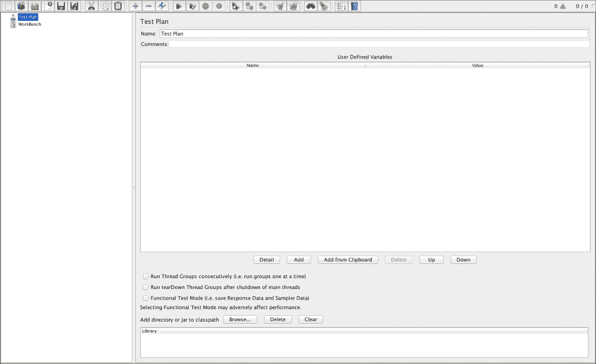
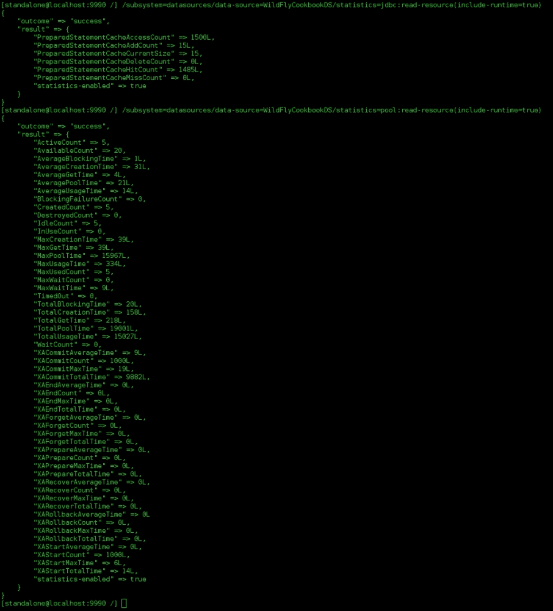
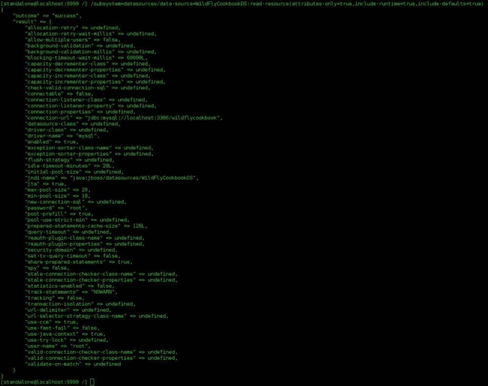
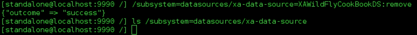

# 第五章. 使用 CLI 管理数据源子系统

在本章中，您将涵盖以下主题：

+   准备非 JDBC-4 兼容的驱动程序

+   创建和删除数据源

+   检查数据源连接

+   读取数据源的统计信息

+   设置连接池

+   创建和删除 XA 数据源

# 简介

在本章中，您将学习如何使用 CLI 管理 WildFly 数据源子系统。这独立于 WildFly 的操作模式。因此，为了便于配置，我们将以独立模式运行 WildFly。

数据源是应用程序用于连接数据库的组件。数据源反过来使用驱动程序与底层数据库正确通信。因此，为了 WildFly 提供数据库集成，它需要一个驱动程序和一个数据源。

WildFly 自带默认配置，即`ExampleDS`数据源，绑定到“H2”驱动程序。H2 是一个 Java SQL 数据库，主要用于测试目的的内存数据库，并支持 SQL。

WildFly 自动识别任何符合 JDBC 4 规范的驱动程序。因此，驱动程序可以作为模块（即静态部署）安装，或者它可以作为任何正常应用程序部署。

在第一种方法中，您必须在所有需要此类驱动程序的应用程序和配置的主机上复制驱动模块安装。另一方面，通过在域模式下使用动态部署，只需一个命令或一个点击，就可以将驱动程序传播到所有服务器组，从而传播到所有可用的主机。

数据源也可以通过使用`-ds.xml`文件以传统方式部署。尽管这种替代方案在从 JBoss 5 和 JBoss 6 迁移时非常有帮助，但在配置生产环境时并不是最佳选择。这是因为数据源不能通过管理界面（如 CLI 和 Web 管理控制台）进行更改。此外，数据源不能配置为利用安全关注，如安全域和密码保险库（我们将在本书的后面讨论这些主题）。

# 准备非 JDBC-4 兼容的驱动程序

在本配方中，我们将学习如何使 JDBC 驱动程序符合版本 4。这是安装驱动程序并将其提供给您的数据源，以及您的应用程序所必需的。

## 准备工作

如果您已经有一个符合 JDBC 4 规范的驱动程序，您可以跳过此配方；否则，我假设您没有 JDBC 驱动程序，我将在整个配方中将其称为`non-jdbc-4-driver.jar`。

## 如何操作...

要使您的驱动程序符合 JDBC 4 规范，您只需按照以下步骤添加一个文件：

1.  创建一个临时文件夹并进入其中。

1.  将您的`non-jdbc-4-driver.jar`驱动程序文件放入其中。

1.  创建一个`META-INF/services`目录。

1.  创建一个名为`java.sql.Driver`的文件并将其放置在第 3 步指定的文件夹中。

1.  编辑文件 `java.sqlDriver` 并输入一行包含实现驱动程序类的完全限定名称。

1.  从步骤 `1` 的空文件夹开始，使用 JAR 工具更新文件 `non-jdbc-4-driver.jar`，如下所示：

    ```java
    jar -uf non-jdbc-4-driver.jar META-INF/services/java.sql.Driver
    ```

现在，你已经准备好安装或部署你的新 JDBC 4 兼容驱动程序了。

# 创建和删除数据源

应用程序附带的最常用功能之一是将状态（如用户信息、订单等）持久化到数据库中的可能性。在这个菜谱中，我们将学习如何配置数据源和 JDBC 4 兼容驱动程序。

## 准备工作

在我们开始之前，我们需要在我们的计算机上安装一个运行的数据库，或者在远程服务器上。在这个菜谱中，我们将使用一个运行在本地的 MySQL 数据库，监听端口 `3306`——MySQL 数据库服务器的安装和配置超出了本书的范围。

声明一个新的数据源包括两个独立的步骤：

1.  安装 JDBC 驱动程序。

1.  配置数据源本身。

第一步可以有两种不同的方法。你可以通过部署它作为一个普通工件来安装 JDBC 驱动程序，或者你可以将其安装为 WildFly 模块。

首先，从 [`dev.mysql.com/downloads/connector/j/`](http://dev.mysql.com/downloads/connector/j/) 下载最新的 MySQL JDBC 连接器版本（根据本文写作时，版本是 "5.1.35"），并将其放置在你的 `home` 文件夹下的 WildFly Cookbook 目录 `WFC` 中。

要将 JDBC 驱动程序作为 WildFly 模块安装，我们需要执行以下操作：

1.  进入模块文件夹 `$WILDFLY_HOME/modules/system/layers/base` 并创建一个与你的模块名称匹配的子文件夹结构，如下所示：

    ```java
    $ cd $WILDFLY_HOME/modules/system/layers/base
    $ mkdir -p jdbc/mysql/main
    ```

1.  将你之前下载的 `~/WFC/mysql-connector-java-5.1.35-bin.jar` 文件放入 `main` 文件夹。

1.  在 `main` 文件夹中，创建一个名为 `module.xml` 的文件，内容如下：

    ```java
    <module  name="jdbc.mysql">
      <resources>
        <resource-root path="mysql-connector-java-5.1.35-bin.jar"/>
      </resources>
      <dependencies>
        <module name="javax.api"/>
        <module name="javax.transaction.api"/>
      </dependencies>
    </module>
    ```

    如你所见，我已经强调了与子文件夹结构匹配的模块名称——除了主文件夹，它仅对应于 `version`。

    太好了！现在我们准备好将驱动程序添加到数据源子系统了。

1.  启动 WildFly 并执行以下操作：

    ```java
    $ ./bin/jboss-cli.sh --connect
    [standalone@localhost:9990 /] /subsystem=datasources/jdbc-driver=mysql:add(driver-module-name=jdbc.mysql, driver-name=mysql)
    {"outcome" => "success"}
    [standalone@localhost:9990 /]
    ```

1.  在我们继续之前，请在你的运行 MySQL 服务器实例上创建一个名为 `wildflycookbook` 的数据库，如下所示：

    ```java
    CREATE DATABASE IF NOT EXISTS wildflycookbook
    ```

现在我们已经安装了 JDBC 驱动程序，我们准备好配置我们的数据源了。

## 如何做到这一点...

1.  在一个运行的 WildFly 服务器上，打开你的命令行工具并连接到 CLI：

    ```java
    $ ./bin/jboss-cli.sh
    You are disconnected at the moment. Type 'connect' to connect to the server or 'help' for the list of supported commands.
    [disconnected /] connect
    [standalone@localhost:9990 /]
    ```

1.  现在执行以下命令：

    ```java
    [standalone@localhost:9990 /] /subsystem=datasources/data-source=WildFlyCookbookDS:add(jndi-name="java:jboss/datasources/WildFlyCookbookDS", connection-url="jdbc:mysql://localhost:3306/wildflycookbook", driver-name="mysql", user-name="wildflymysql", password="wildfly-mysql-password", prepared-statements-cache-size=128, share-prepared-statements=true, blocking-timeout-wait-millis=60000, idle-timeout-minutes=20)
    {"outcome" => "success"}
    [standalone@localhost:9990 /]
    ```

1.  现在，在列出可用的数据源时，你应该找到我们新创建的一个：

    ```java
    [standalone@localhost:9990 /] ls /subsystem=datasources/data-source                  
    ExampleDS          WildFlyCookbookDS  
    [standalone@localhost:9990 /]
    ```

1.  如果你需要删除一个数据源，在其旁边调用 `remove`，如下所示：

    ```java
    [standalone@localhost:9990 /] /subsystem=datasources/data-source=WildFlyCookbookDS:remove()
    {"outcome" => "success"}
    [standalone@localhost:9990 /] ls /subsystem=datasources/data-source
    ExampleDS  
    [standalone@localhost:9990 /]
    ```

## 它是如何工作的...

如你所见，配置数据源并不那么困难，但要达到这个目标需要做很多工作。数据源本身只是对数据库的引用，涉及到一个连接器，即驱动程序。实际上，在 DS 配置中，我强调了与我们在*准备工作*部分定义的驱动程序匹配的`driver-name`属性。此外，我还强调了应该根据你的数据库配置更改的`password`属性。

## 还有更多...

数据源配置包含更多参数，例如定义和调整连接池的大小，但我们将在本章的专用配方中看到这些。你还将了解到你可以有一个 XA-Datasource，这实际上可以在不同的事务系统中启用分布式事务。

# 检查数据源连接

有时，你可能会在你的日志应用中看到错误，这是因为你的持久化存储出现了问题。在这种情况下，首先要做的是检查数据库是否正在运行，通过测试其连接来确认；你甚至可能意识到你指向了一个错误的数据库或者拼写错误了连接 URL。

## 准备工作

这个配方基于之前的配方，其中我们配置了一个连接到本地 MySQL 数据库的数据源，因此我们将使用 WildFlyCookBookDS 数据源来测试我们的数据库连接。只要你提供了正确的配置，你也可以使用你选择的数据源进行测试。

## 如何操作...

1.  在一个运行的 WildFly 服务器上，打开你的命令行工具并连接到 CLI：

    ```java
    $ ./bin/jboss-cli.sh --connect
    [standalone@localhost:9990 /]
    ```

1.  现在执行以下命令：

    ```java
    [standalone@localhost:9990 /] /subsystem=datasources/data-source=WildFlyCookbookDS:test-connection-in-pool()
    {
        "outcome" => "success",
        "result" => [true]
    }
    [standalone@localhost:9990 /]
    ```

就这样！不是很容易吗？

# 读取数据源的统计信息

在这个配方中，你将学习如何启用数据源的统计信息，以检查我们是否充分利用了它，或者是否需要调整数据源，或者在最坏的情况下，与数据库进行扩展。

## 准备工作

为了了解我们的数据源发生了什么，让我们向数据库生成一些流量。在这种情况下，我们将使用名为`datasource-traffic-generator`的应用程序。要获取部署的工件，请参考第一章中的*软件先决条件*配方，*欢迎来到 WildFly！*。此外，在应用程序的源代码中，你可以找到一个 Apache JMeter（也称为 JMeter）项目，位于以下路径：`datasource-traffic-generator/src/main/resources/HTTP Request Defaults.jmx`。

简而言之，Apache JMeter 是一个用于进行压力测试的测试工具；实际上，我们将对`datasource-traffic-generator`应用程序进行压力测试，该应用程序将一些数据插入到数据库中。

### 注意

你可以从[`jmeter.apache.org/download_jmeter.cgi`](http://jmeter.apache.org/download_jmeter.cgi)下载 Apache JMeter 的二进制文件。

安装相当简单：

1.  只需将下载的包`apache-jmeter-2.13.zip`解压到`~/WFC`文件夹中。

1.  要运行它，从命令行导航到 JMeter 文件夹并输入以下命令：

    ```java
    $ ./bin/jmeter.sh
    ```

    如果一切顺利，你应该会看到如图所示的 JMeter 工具：

    

    Apache JMeter

1.  此外，我们将要使用的数据库是 MySQL。在那里，创建一个名为`wildflycookbook`的数据库。

1.  最后，创建一个名为`USER`的表，如下所示：

    ```java
    CREATE DATABASE IF NOT EXISTS wildflycookbook
    CREATE TABLE
      wildflycookbook.user
      (
        id BIGINT NOT NULL AUTO_INCREMENT,
        firstname VARCHAR(100) NOT NULL,
        lastname VARCHAR(100) NOT NULL,
        email VARCHAR(255) NOT NULL,
        phone VARCHAR(50),
        nickname VARCHAR(50),
        PRIMARY KEY (id),
        CONSTRAINT user_email UNIQUE (email)
      )
      ENGINE=InnoDB DEFAULT CHARSET=latin1
    ```

## 如何操作…

1.  在运行中的 WildFly 服务器上，打开您的命令行工具并连接到 CLI：

    ```java
    $ ./bin/jboss-cli.sh --connect
    [standalone@localhost:9990 /]
    ```

1.  现在，按照常规部署`datasource-traffic-generator.war`包。

1.  在 CLI 上使用以下命令启用 JDBC 和池统计信息：

    ```java
    [standalone@localhost:9990 /] /subsystem=datasources/data-source=WildFlyCookbookDS/statistics=jdbc:write-attribute(name=statistics-enabled,value=true)
    {"outcome" => "success"}
    [standalone@localhost:9990 /] /subsystem=datasources/data-source=WildFlyCookbookDS/statistics=pool:write-attribute(name=statistics-enabled,value=true)
    {"outcome" => "success"}
    ```

1.  打开`datasource-traffic-generator/src/main/resources/HTTP Request Defaults.jmx` JMeter 项目并点击启动按钮。

1.  一旦你在 JMeter 中按下播放按钮，在 WildFLy CLI 中，执行以下命令：

    ```java
    /subsystem=datasources/data-source=WildFlyCookbookDS/statistics=jdbc:read-resource(include-runtime=true)
    /subsystem=datasources/data-source=WildFlyCookbookDS/statistics=pool:read-resource(include-runtime=true)
    ```

    结果如图所示：

    

## 它是如何工作的…

如您所见，我们执行了两个命令，一个用于检索`jdbc`级别的信息，另一个用于检索数据源中配置的`pool`信息。

## 还有更多...

而不是在 CLI 中执行两个命令，您可以使用一个命令检索更多信息。这有助于在 CLI 外解析数据；同时请注意，输出非常类似于 JSON 格式。

实际上，您可以使用 bash 脚本、python 或 Java 在 CLI 外执行 CLI 命令，然后解析结果以检索所需的信息。

要使用 bash-shell 执行 CLI 命令，请输入以下命令：

```java
$ ./bin/jboss-cli.sh -c --command="/subsystem=datasources/data-source=WildFlyCookbookDS:read-resource(include-runtime=true,recursive=true)"
```

# 设置连接池

如前所述的食谱，有时我们需要提取一些关于数据库集成行为的信息。很多时候，当您的应用程序的并发用户数量在数百或数千时，您必须同时服务多个数据库连接。这正是我们将在这个食谱中学习的内容，使用 CLI。

## 准备就绪

将连接池想象成一个预先填充了最小数量可供应用程序使用的连接的桶。还有一个上限限制，它定义了池可以保持的最大连接数。池的最小和最大大小默认值分别为`0`和`20`，默认情况下`prefill`属性设置为`false`。这意味着当数据源启动时，其连接池将创建`0`个活跃和有效的连接，并且它可以保持多达 20 个连接。

为什么你会使用连接池？因为创建一个连接涉及到很多幕后的事情，所以有它准备可以帮助你提高性能。

## 如何操作…

1.  在运行中的 WildFly 服务器上，打开您的命令行工具并连接到 CLI：

    ```java
    $ ./bin/jboss-cli.sh
    You are disconnected at the moment. Type 'connect' to connect to the server or 'help' for the list of supported commands.
    [disconnected /] connect
    [standalone@localhost:9990 /]
    ```

1.  现在执行以下命令：

    ```java
    [standalone@localhost:9990 /] /subsystem=datasources/data-source=WildFlyCookbookDS:write-attribute(name="min-pool-size", value="10")
    {"outcome" => "success"}
    [standalone@localhost:9990 /] /subsystem=datasources/data-source=WildFlyCookbookDS:write-attribute(name="max-pool-size", value="20")
    {"outcome" => "success"}
    [standalone@localhost:9990 /]
    ```

## 它是如何工作的…

之前提到的命令为我们创建了一个连接池，这样我们就可以计算从 10 到 20 的一系列可用连接。

## 还有更多…

我们还可以使用的一个选项是让我们的连接池预先填充连接，以增强我们的数据库连接。

1.  要实现这一点，我们需要将`pool-prefill`属性设置为`true`，如下所示：

    ```java
    [standalone@localhost:9990 /] /subsystem=datasources/data-source=WildFlyCookbookDS:write-attribute(name="pool-prefill", value="true")
    {
      "outcome" => "success",
      "response-headers" => {
        "operation-requires-reload" => true,
        "process-state" => "reload-required"
      }
    }
    [standalone@localhost:9990 /]
    ```

1.  如您所见，并非所有更改都是在运行时进行的；我们经常需要重新加载 WildFly 配置，就像在这个例子中一样。要重新加载服务器（我们为此有一个配方，无论是独立模式还是域模式），请执行以下命令：

    ```java
    [standalone@localhost:9990 /] :reload
    {
      "outcome" => "success",
      "result" => undefined
    }
    [standalone@localhost:9990 /]
    ```

    以下图像显示了带有其新池配置的`WildFlyCookbookDS`数据源：

    

还有另一个重要方面，值得提及关于数据源连接池。

如果你预先填充你的池以有效连接，然后数据库崩溃或重新启动会发生什么？好吧，你的连接在池中可能看起来是有效的，但底层数据库的引用已经改变，因此它们将无法查询你的数据。幸运的是，有几个参数可以帮助你解决这个问题。

首先，你需要选择一个验证连接的机制。你可以选择基于时间的方法，或者决定每次使用连接时都进行检查。

第一种方法包括设置以下属性：

+   `background-validation=true`

+   `background-validation-millis=30000`—默认是`0`

另一方面，第二种方法包括设置以下属性：

+   `validate-on-match=true`

无论你使用哪种方法，总是将另一个设置为`false`。

一旦你选择了验证机制，你需要指定如何检查连接是否有效。你可以通过使用以下属性之一来实现：

+   `check-valid-connection-sql`

+   `valid-connection-checker-class`

这两个属性都是数据库特定的。第一个必须包含有效的 SQL 代码（例如`SELECT 1`或`SELECT 1 FROM DUAL`）。第二个将检查算法委托给一个类。WildFly 为最常用的数据库提供了检查类，如下所示：

| **检查类** |
| --- |
| `org.jboss.jca.adapters.jdbc.extensions.db2.DB2ValidConnectionChecker` |
| `org.jboss.jca.adapters.jdbc.extensions.mssql.MSSQLValidConnectionChecker` |
| `org.jboss.jca.adapters.jdbc.extensions.mysql.MySQLReplicationValidConnectionChecker` |
| `org.jboss.jca.adapters.jdbc.extensions.mysql.MySQLValidConnectionChecker` |
| `org.jboss.jca.adapters.jdbc.extensions.novendor.GoodForSecondsValidConnectionChecker` |
| `org.jboss.jca.adapters.jdbc.extensions.novendor.JDBC4ValidConnectionChecker` |
| `org.jboss.jca.adapters.jdbc.extensions.novendor.NullValidConnectionChecker` |
| `org.jboss.jca.adapters.jdbc.extensions.novendor.SQLExceptionValidConnectionChecker` |
| `org.jboss.jca.adapters.jdbc.extensions.oracle.OracleValidConnectionChecker` |
| `org.jboss.jca.adapters.jdbc.extensions.postgres.PostgreSQLValidConnectionChecker` |
| `org.jboss.jca.adapters.jdbc.extensions.sybase.SybaseValidConnectionChecker` |

最后，但同样重要的是，你可以依赖两个其他属性来帮助你清理连接：`stale-connection-checker-class-name` 和 `exception-sorter-class-name`。

第一个提供了你清理陈旧连接的简单方法；你可以依赖一个通用类，以及 DB2 和 Oracle 特定类，如下所示：

| **通用/特定类** |
| --- |
| `org.jboss.jca.adapters.jdbc.extensions.novendor.AlwaysStaleConnectionChecker` |
| `org.jboss.jca.adapters.jdbc.extensions.novendor.NullStaleConnectionChecker` |
| `org.jboss.jca.adapters.jdbc.extensions.db2.DB2StaleConnectionChecker` |
| `org.jboss.jca.adapters.jdbc.extensions.oracle.OracleStaleConnectionChecker` |

第二个属性为你提供了清理抛出 `FATAL` 异常的连接的简单方法，并且相对于你的数据库，你可以依赖以下类：

| **类** |
| --- |
| `org.jboss.jca.adapters.jdbc.extensions.db2.DB2ExceptionSorter` |
| `org.jboss.jca.adapters.jdbc.extensions.informix.InformixExceptionSorter` |
| `org.jboss.jca.adapters.jdbc.extensions.mysql.MySQLExceptionSorter` |
| `org.jboss.jca.adapters.jdbc.extensions.mssql.MSSQLExceptionSorter` |
| `org.jboss.jca.adapters.jdbc.extensions.novendor.AlwaysExceptionSorter` |
| `org.jboss.jca.adapters.jdbc.extensions.novendor.NullExceptionSorter` |
| `org.jboss.jca.adapters.jdbc.extensions.oracle.OracleExceptionSorter` |
| `org.jboss.jca.adapters.jdbc.extensions.postgres.PostgreSQLExceptionSorter` |
| `org.jboss.jca.adapters.jdbc.extensions.sybase.SybaseExceptionSorter` |

# 创建和删除 XA-Datasource

XA-Datasources 与普通数据源类似，只是它们需要一个不同的 `driver-class-name`，并且支持跨异构事务系统的分布式事务。

想象一下在线商店的经典例子：用户购买商品，商品从库存数据库中移除，并且从用户的银行账户中扣除相应金额，这是一个外部系统。这两个操作必须成功才能进行支付和发货。

这只是一个例子，为了给你一个概念；我们不会进一步深入。

## 准备工作

本菜谱的前提是 *Creating and removing a datasource* 菜谱中的 *Getting ready* 部分。

## 如何操作…

1.  在 WildFly 服务器运行时，打开你的命令行工具并连接到 CLI：

    ```java
    $ ./bin/jboss-cli.sh --connect
    [standalone@localhost:9990 /]
    ```

1.  现在执行以下命令：

    ```java
    [standalone@localhost:9990 /] batch
    [standalone@localhost:9990 / #] /subsystem=datasources/xa-data-source=XAWildFlyCookBookDS:add(driver-name=mysql,jndi-name=java:jboss/datasources/XAWildFlyCookBookDS,use-java-context=true,new-connection-sql="select 1 from dual",no-tx-separate-pool=true,valid-connection-checker-class-name="org.jboss.jca.adapters.jdbc.extensions.mysql.MySQLValidConnectionChecker",stale-connection-checker-class-name="org.jboss.jca.adapters.jdbc.extensions.mysql.MySQLStaleConnectionChecker",min-pool-size=10,max-pool-size=25,track-statements=true,prepared-statements-cache-size=25, xa-datasource-class="com.mysql.jdbc.jdbc2.optional.MysqlXADataSource")
    [standalone@localhost:9990 / #] /subsystem=datasources/xa-data-source=XAWildFlyCookBookDS/xa-datasource-properties=URL:add(value="jdbc:mysql://localhost:3306/wildflycookbook")
    [standalone@localhost:9990 / #] /subsystem=datasources/xa-data-source=XAWildFlyCookBookDS/xa-datasource-properties=User:add(value="root")
    [standalone@localhost:9990 / #] /subsystem=datasources/xa-data-source=XAWildFlyCookBookDS/xa-datasource-properties=Password:add(value="password-root")
    [standalone@localhost:9990 / #] run-batch
    The batch executed successfully
    [standalone@localhost:9990 /]
    ```

1.  现在，在列出可用的数据源时，你应该找到我们新创建的一个：

    ```java
    [standalone@localhost:9990 /] ls /subsystem=datasources/xa-data-source                  
    XAWildFlyCookBookDS  
    [standalone@localhost:9990 /]
    ```

1.  如果你需要删除一个数据源，请在其旁边调用 `remove`，如下面的图片所示：

## 它是如何工作的…

我们首先只使用所需信息创建了一个 XA-DataSource，然后以批量模式添加了其他信息。通过这样做，我们能够将配置过程拆分，并最终找出我们出错的地方。

此外，我们指定了`xa-datasource-class`类，因为 XA-DataSource 需要一个实现并支持分布式事务的特殊类。驱动程序是相同的，只需指定不同的驱动类实现。
