# 第六章 WildFly 集群

本章我们将涵盖以下主题：

+   以独立模式创建集群

+   以独立模式创建单独的集群

+   以域模式创建集群

+   以域模式创建单独的集群

+   通过 TCP 创建集群

+   使用 JGroups 工具测试 UDP 协议

# 简介

在本章中，你将学习如何为分布在两个或更多 WildFly 节点上的 Web 应用程序创建集群。集群是在发生故障（即服务器崩溃）的情况下继续为客户端提供服务的能力，也称为故障转移。

### 注意

集群旨在在应用层而不是在操作系统层实现。

例如，假设你正在填写一个长表单，包含大量步骤（步骤指的是页面）。现在假设在最后一步，服务器或 WildFly 节点崩溃了，你将不得不重新填写所有信息。当然，如果你可以选择的话，你肯定不会再使用那个网站了。顺便问一下，你会如何解决这个问题？集群就是答案。

在集群中，用户的会话会被复制到你的集群节点。所以，在发生故障的情况下，在下一个 HTTP 请求中，你将落在不同的服务器/节点上，它将像什么都没发生一样继续为你提供服务——显然，最终用户不会看到他的/她的请求是由不同的服务器/节点处理的。

在 WildFly 中，我们有两个组件（从配置文件的角度来看，它们是子系统）来完成这项工作；它们是*infinispan*（用于缓存数据会话）和*JGroups*（用于在集群节点之间传播 HTTP 会话）。Infinispan 是存储数据的组件，而 JGroups 是协调构成应用集群的节点之间通信的组件。

我们将看到如何使用不同的协议实现集群：UDP（多播和默认协议）和 TCP（单播）。这可以在`jgroups`子系统中进行配置。默认的是 UDP。

为了完整性，我们将在两种操作模式中尝试我们的配置：独立模式和域模式。

### 注意

记住，集群是 WildFly 提供的一项服务，因此它是按需激活的。因此，你需要提供一个`集群感知`的应用程序来激活集群。这意味着在你的`web.xml`文件中需要有`<distributable/>` XML 标签。

在本章中，你需要一个标准的 WildFly 安装和一个设置好的管理用户。如果你从这里开始，请参阅第一章，*欢迎来到 WildFly！*

# 以独立模式创建集群

在这个菜谱中，你将学习如何在本地将两个 WildFly 节点进行集群化，即在你的 PC 上。我们将使用独立模式和`ha`配置文件来尝试这个操作。

## 准备工作

对于这个配方，我们需要名为 `cluster-test` 的 `cluster-aware` 应用程序，你可以在我的 GitHub 仓库中找到它。如果你跳过了 第二章 中的 *使用部署文件夹管理应用程序* 配方，*以独立模式运行 WildFly*，请参考它以下载你需要的所有源代码和项目。

要构建应用程序，请输入以下命令：

```java
$ cd ~/WFC/github/wildfly-cookbook
$ cd cluster-test
$ mvn -e clean package
```

## 如何操作...

从 WildFly 安装目录 `$WILDFLY_HOME`，让我们创建两个文件夹，每个文件夹代表一个服务器节点：

1.  打开一个终端并执行以下命令：

    ```java
    $ cd $WILDFLY_HOME
    $ cp -a standalone cl-std-node-1
    $ cp -a standalone cl-std-node-2
    ```

1.  现在，让我们将 `cluster-test.war` 应用程序复制到我们刚刚创建的每个节点的 `deployments` 文件夹中。执行以下命令：

    ```java
    $ cp ~/WFC/github/wildfly-cookbook/cluster-test/target/cluster-test.war cl-std-node-1/deployments/
    $ cp ~/WFC/github/wildfly-cookbook/cluster-test/target/cluster-test.war cl-std-node-2/deployments/
    ```

1.  我们几乎准备好测试我们的集群了。我们需要一些配置，但不需要编辑太多，我们只需将命令行参数传递给 `standalone.sh` 脚本。让我们这么做：

    ```java
    $ ./bin/standalone.sh -Djboss.server.base.dir=cl-std-node-1 --server-config=standalone-ha.xml -Djboss.socket.binding.port-offset=100 -Djboss.node.name=node-1
    ...
    02:26:22,755 INFO  [org.jboss.as.server.deployment] (MSC service thread 1-14) WFLYSRV0027: Starting deployment of "cluster-test.war" (runtime-name: "cluster-test.war")
    02:26:22,910 INFO  [org.jboss.ws.common.management] (MSC service thread 1-2) JBWS022052: Starting JBoss Web Services - Stack CXF Server 5.0.0.Beta3
    02:26:23,843 INFO  [stdout] (MSC service thread 1-6)
    02:26:23,843 INFO  [stdout] (MSC service thread 1-6) -------------------------------------------------------------------
    02:26:23,843 INFO  [stdout] (MSC service thread 1-6) GMS: address=node-1, cluster=ee, physical address=127.0.0.1:55300
    02:26:23,843 INFO  [stdout] (MSC service thread 1-6) -------------------------------------------------------------------
    02:26:27,145 INFO  [org.infinispan.remoting.transport.jgroups.JGroupsTransport] (ServerService Thread Pool -- 64) ISPN000078: Starting JGroups channel web
    02:26:27,154 INFO  [org.infinispan.remoting.transport.jgroups.JGroupsTransport] (ServerService Thread Pool -- 64) ISPN000094: Received new cluster view for channel web: [node-1|0] (1) [node-1]
    02:26:27,155 INFO  [org.infinispan.remoting.transport.jgroups.JGroupsTransport] (ServerService Thread Pool -- 64) ISPN000079: Channel web local address is node-1, physical addresses are [127.0.0.1:55300]
    02:26:27,163 INFO  [org.infinispan.factories.GlobalComponentRegistry] (ServerService Thread Pool -- 64) ISPN000128: Infinispan version: Infinispan 'Hoptimus Prime' 7.1.1.Final
    02:26:27,706 INFO  [org.jboss.as.clustering.infinispan] (ServerService Thread Pool -- 64) WFLYCLINF0002: Started dist cache from web container
    02:26:27,706 INFO  [org.jboss.as.clustering.infinispan] (ServerService Thread Pool -- 62) WFLYCLINF0002: Started cluster-test.war cache from web container
    02:26:27,970 INFO  [org.wildfly.extension.undertow] (MSC service thread 1-16) WFLYUT0021: Registered web context: /cluster-test
    02:26:28,006 INFO  [org.jboss.as.server] (ServerService Thread Pool -- 36) WFLYSRV0010: Deployed "cluster-test.war" (runtime-name : "cluster-test.war")
    02:26:28,182 INFO  [org.jboss.as] (Controller Boot Thread) WFLYSRV0060: Http management interface listening on http://127.0.0.1:10090/management
    02:26:28,183 INFO  [org.jboss.as] (Controller Boot Thread) WFLYSRV0051: Admin console listening on http://127.0.0.1:10090
    02:26:28,183 INFO  [org.jboss.as] (Controller Boot Thread) WFLYSRV0025: WildFly Full 9.0.0.Beta2 (WildFly Core 1.0.0.Beta2) started in 8645ms - Started 334 of 516 services (285 services are lazy, passive or on-demand)
    ```

    在前面的命令中，我只强调了相关的输出；这是为了给你一个清晰的聚类服务视图。

1.  让我们打开一个浏览器，将其指向 URL `http://127.0.0.1:8180/cluster-test`。现在刷新页面几次。你应该会看到以下截图：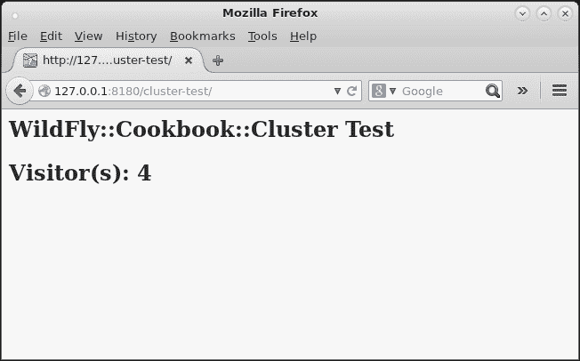

    "node-1" 上运行的 "cluster-test" 应用程序

    在日志中，你应该会找到以下语句：

    ```java
    15:20:25,118 INFO  [stdout] (default task-3) ********************************+
    15:20:25,119 INFO  [stdout] (default task-3) Visitor(s): 0
    15:20:25,119 INFO  [stdout] (default task-3) ********************************+
    15:20:25,228 INFO  [stdout] (default task-4) ********************************+
    15:20:25,229 INFO  [stdout] (default task-4) Visitor(s): 1
    15:20:25,229 INFO  [stdout] (default task-4) ********************************+
    15:20:25,291 INFO  [stdout] (default task-5) ********************************+
    15:20:25,291 INFO  [stdout] (default task-5) Visitor(s): 2
    15:20:25,291 INFO  [stdout] (default task-5) ********************************+
    15:20:25,315 INFO  [stdout] (default task-6) ********************************+
    15:20:25,315 INFO  [stdout] (default task-6) Visitor(s): 3
    15:20:25,316 INFO  [stdout] (default task-6) ********************************+
    15:20:25,608 INFO  [stdout] (default task-7) ********************************+
    15:20:25,609 INFO  [stdout] (default task-7) Visitor(s): 4
    15:20:25,609 INFO  [stdout] (default task-7) ********************************+
    ```

    现在一切顺利，让我们启动第二个节点并看看会发生什么。

1.  在一个新的终端中，执行以下命令：

    ```java
    $ cd $JBOSS_HOME
    $ ./bin/standalone.sh -Djboss.server.base.dir=cl-std-node-2 --server-config=standalone-ha.xml -Djboss.socket.binding.port-offset=200 -Djboss.node.name=node-2
    …
    03:13:44,381 INFO  [org.jboss.as.server.deployment] (MSC service thread 1-14) WFLYSRV0027: Starting deployment of "cluster-test.war" (runtime-name: "cluster-test.war")
    03:13:44,548 INFO  [org.jboss.ws.common.management] (MSC service thread 1-15) JBWS022052: Starting JBoss Web Services - Stack CXF Server 5.0.0.Beta3
    03:13:45,075 INFO  [stdout] (MSC service thread 1-6)
    03:13:45,075 INFO  [stdout] (MSC service thread 1-6) -------------------------------------------------------------------
    03:13:45,075 INFO  [stdout] (MSC service thread 1-6) GMS: address=node-2, cluster=ee, physical address=127.0.0.1:55400
    03:13:45,077 INFO  [stdout] (MSC service thread 1-6) -------------------------------------------------------------------
    03:13:45,153 INFO  [org.infinispan.remoting.transport.jgroups.JGroupsTransport] (Incoming-2,ee,node-1) ISPN000094: Received new cluster view for channel web: [node-1|1] (2) [node-1, node-2]
    03:13:45,675 INFO  [org.infinispan.remoting.transport.jgroups.JGroupsTransport] (ServerService Thread Pool -- 62) ISPN000078: Starting JGroups channel web
    03:13:45,679 INFO  [org.infinispan.remoting.transport.jgroups.JGroupsTransport] (ServerService Thread Pool -- 62) ISPN000094: Received new cluster view for channel web: [node-1|1] (2) [node-1, node-2]
    03:13:45,680 INFO  [org.infinispan.remoting.transport.jgroups.JGroupsTransport] (ServerService Thread Pool -- 62) ISPN000079: Channel web local address is node-2, physical addresses are [127.0.0.1:55400]
    03:13:45,747 INFO  [org.infinispan.factories.GlobalComponentRegistry] (ServerService Thread Pool -- 62) ISPN000128: Infinispan version: Infinispan 'Hoptimus Prime' 7.1.1.Final
    03:13:46,187 INFO  [org.infinispan.CLUSTER] (remote-thread--p3-t1) ISPN000310: Starting cluster-wide rebalance for cache cluster-test.war, topology CacheTopology{id=1, rebalanceId=1, currentCH=DefaultConsistentHash{ns = 80, owners = (1)[node-1: 80+0]}, pendingCH=DefaultConsistentHash{ns = 80, owners = (2)[node-1: 40+40, node-2: 40+40]}, unionCH=null, actualMembers=[node-1, node-2]}
    03:13:46,187 INFO  [org.infinispan.CLUSTER] (remote-thread--p3-t2) ISPN000310: Starting cluster-wide rebalance for cache dist, topology CacheTopology{id=1, rebalanceId=1, currentCH=DefaultConsistentHash{ns = 80, owners = (1)[node-1: 80+0]}, pendingCH=DefaultConsistentHash{ns = 80, owners = (2)[node-1: 40+40, node-2: 40+40]}, unionCH=null, actualMembers=[node-1, node-2]}
    03:13:46,204 INFO  [org.infinispan.CLUSTER] (transport-thread--p2-t10) ISPN000328: Finished local rebalance for cache cluster-test.war on node node-1, topology id = 1
    03:13:46,209 INFO  [org.infinispan.CLUSTER] (transport-thread--p2-t11) ISPN000328: Finished local rebalance for cache dist on node node-1, topology id = 1
    03:13:46,416 INFO  [org.infinispan.CLUSTER] (remote-thread--p3-t1) ISPN000328: Finished local rebalance for cache dist on node node-2, topology id = 1
    03:13:46,431 INFO  [org.infinispan.CLUSTER] (remote-thread--p3-t2) ISPN000328: Finished local rebalance for cache cluster-test.war on node node-2, topology id = 1
    03:13:46,461 INFO  [org.jboss.as.clustering.infinispan] (ServerService Thread Pool -- 62) WFLYCLINF0002: Started dist cache from web container
    03:13:46,461 INFO  [org.jboss.as.clustering.infinispan] (ServerService Thread Pool -- 64) WFLYCLINF0002: Started cluster-test.war cache from web container
    03:13:46,662 INFO  [org.wildfly.extension.undertow] (MSC service thread 1-3) WFLYUT0021: Registered web context: /cluster-test
    03:13:46,700 INFO  [org.jboss.as.server] (ServerService Thread Pool -- 36) WFLYSRV0010: Deployed "cluster-test.war" (runtime-name : "cluster-test.war")
    03:13:46,863 INFO  [org.jboss.as] (Controller Boot Thread) WFLYSRV0060: Http management interface listening on http://127.0.0.1:10190/management
    03:13:46,864 INFO  [org.jboss.as] (Controller Boot Thread) WFLYSRV0051: Admin console listening on http://127.0.0.1:10190
    03:13:46,864 INFO  [org.jboss.as] (Controller Boot Thread) WFLYSRV0025: WildFly Full 9.0.0.Beta2 (WildFly Core 1.0.0.Beta2) started in 5424ms - Started 334 of 516 services (285 services are lazy, passive or on-demand)
    ```

    在前面的命令行输出中，我只强调了相关的输出；这是为了给你一个清晰的聚类服务视图。与 `node-1` 不同，我们可以看到现在集群由两个成员组成：`node-1` 和 `node-2`。

1.  现在，让我们尝试将同一个浏览器窗口指向 URL `http://127.0.0.1:8280/cluster-test`。你应该会看到如下内容：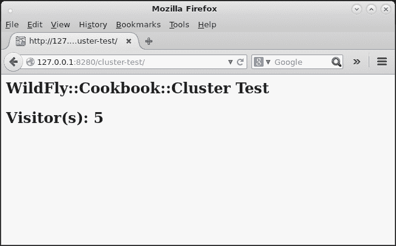

    "node-2" 上运行的 "cluster-test" 应用程序

    如你所见，第二个节点从我们在 `node-1` 中停止的地方继续计数。太好了，我们的集群正在工作！！

## 它是如何工作的...

让我们分析一下我们做了什么以及为什么它不需要太多配置就能工作。除了 `node-1` 的 `standalone.sh` 脚本外，我们还指定了一些参数，例如：

+   `jboss.server.base.dir=cl-std-node-1`：需要指定我们的基础目录作为起始文件夹以检索所有配置文件。

+   `--server-config=standalone-ha.xml`：需要指定具有 `ha` 配置文件的服务器配置文件。

+   `jboss.socket.binding.port-offset=100`：需要指定端口偏移量（对于 `node-2` 为 `200`）。对于第一个节点，我们可以跳过这个步骤，但我喜欢看到序列：`1`、`2`、`3`、`4`...`n`，在这种情况下将是 `8180`、`8280`、`8380`，以此类推。

+   `jboss.node.name=node-1`：需要唯一标识集群内的节点（显然，对于第二个节点是 `node-2`）。

这就是我们构建集群所需做的全部工作。这是因为 WildFly 的默认配置，特别是子系统`jgroups`的配置。让我们看看它的默认设置：

```java
<subsystem >
    <channels default="ee">
        <channel name="ee"/>
    </channels>
    <stacks default="udp">
        <stack name="udp">
            <transport type="UDP" socket-binding="jgroups-udp"/>
            <protocol type="PING"/>
            <protocol type="MERGE3"/>
            <protocol type="FD_SOCK" socket-binding="jgroups-udp-fd"/>
            <protocol type="FD_ALL"/>
            <protocol type="VERIFY_SUSPECT"/>
            <protocol type="pbcast.NAKACK2"/>
            <protocol type="UNICAST3"/>
            <protocol type="pbcast.STABLE"/>
            <protocol type="pbcast.GMS"/>
            <protocol type="UFC"/>
            <protocol type="MFC"/>
            <protocol type="FRAG2"/>
            <protocol type="RSVP"/>
        </stack>
        <stack name="tcp">
            <transport type="TCP" socket-binding="jgroups-tcp"/>
            <protocol type="MPING" socket-binding="jgroups-mping"/>
            <protocol type="MERGE3"/>
            <protocol type="FD_SOCK" socket-binding="jgroups-tcp-fd"/>
            <protocol type="FD"/>
            <protocol type="VERIFY_SUSPECT"/>
            <protocol type="pbcast.NAKACK2"/>
            <protocol type="UNICAST3"/>
            <protocol type="pbcast.STABLE"/>
            <protocol type="pbcast.GMS"/>
            <protocol type="MFC"/>
            <protocol type="FRAG2"/>
            <protocol type="RSVP"/>
        </stack>
    </stacks>
</subsystem>
```

因此，用于集群传输的默认协议是 UDP（见强调的代码）。此 UDP 设置在`standalone-ha.xml`文件中指定的`socket-binding-group`内有额外的配置，如下所示：

```java
<socket-binding-group name="standard-sockets" default-interface="public" port-offset="${jboss.socket.binding.port-offset:0}">
    <socket-binding name="management-http" interface="management" port="${jboss.management.http.port:9990}"/>
    <socket-binding name="management-https" interface="management" port="${jboss.management.https.port:9993}"/>
    <socket-binding name="ajp" port="${jboss.ajp.port:8009}"/>
    <socket-binding name="http" port="${jboss.http.port:8080}"/>
    <socket-binding name="https" port="${jboss.https.port:8443}"/>
    <socket-binding name="jgroups-mping" port="0" multicast-address="${jboss.default.multicast.address:230.0.0.4}" multicast-port="45700"/>
    <socket-binding name="jgroups-tcp" port="7600"/>
    <socket-binding name="jgroups-tcp-fd" port="57600"/>
    <socket-binding name="jgroups-udp" port="55200" multicast-address="${jboss.default.multicast.address:230.0.0.4}" multicast-port="45688"/>
    <socket-binding name="jgroups-udp-fd" port="54200"/>
    <socket-binding name="modcluster" port="0" multicast-address="224.0.1.105" multicast-port="23364"/>
    <socket-binding name="txn-recovery-environment" port="4712"/>
    <socket-binding name="txn-status-manager" port="4713"/>
    <outbound-socket-binding name="mail-smtp">
        <remote-destination host="localhost" port="25"/>
    </outbound-socket-binding>
</socket-binding-group>
```

因此，默认情况下，集群中的每个成员都会在`230.0.0.4`地址上广播自己。此外，配置中指定的每个端口都会随着命令行脚本中指定的`jboss.socket.binding.port-offset`参数一起更改。

## 还有更多...

我们可以不使用`port-offset`指令来构建我们的集群，而是为每个节点使用不同的 IP 地址，但这不会正常工作。这是因为存储在 cookie 中的 HTTP 会话引用。一般来说，cookie 由一个名称（通常是`JSESSIONID`）、一个值（用于在服务器上引用 HTTP 会话的 ID）、一个域和一个上下文路径组成。

所有这些属性必须相同，才能向服务器上的同一 HTTP 会话发送请求，而绑定到不同 IP 的节点则不会是这样。IP 是 cookie 的域，因此它将不起作用——除非你平衡所有属性——但这将是下一章的主题。

## 参见

如果您在此配置中遇到任何问题，您可能存在网络问题，您可以使用本章的最后一个配方进行故障排除。

# 在独立模式下创建单独的集群

在这个配方中，您将学习如何配置不同且隔离的集群，在本地运行。我们将使用独立模式和`ha`配置文件来尝试这样做。

## 准备工作

对于这个配方，我们需要一个名为`cluster-test`的`cluster-aware`应用程序，您可以在我的 GitHub 仓库中找到它。如果您跳过了第二章中关于“使用部署文件夹管理应用程序”的配方，请参阅它以下载您将需要的所有源代码和项目。

要构建应用程序，请执行以下命令：

```java
$ cd ~/WFC/github/wildfly-cookbook
$ cd cluster-test
$ mvn -e clean package
```

从 WildFly 安装目录`$WILDFLY_HOME`开始，让我们创建四个文件夹，每个文件夹代表一个服务器节点。

1.  打开一个终端并执行以下命令：

    ```java
    $ cd $WILDFLY_HOME
    $ cp -a standalone cl-std-node-A1
    $ cp -a standalone cl-std-node-A2
    $ cp -a standalone cl-std-node-B1
    $ cp -a standalone cl-std-node-B2
    ```

1.  现在，让我们将`cluster-test.war`应用程序复制到我们刚刚创建的每个节点的`deployments`文件夹中。请执行以下命令：

    ```java
    $ cp ~/WFC/github/wildfly-cookbook/cluster-test/target/cluster-test.war cl-std-node-A1/deployments/
    $ cp ~/WFC/github/wildfly-cookbook/cluster-test/target/cluster-test.war cl-std-node-A2/deployments/
    $ cp ~/WFC/github/wildfly-cookbook/cluster-test/target/cluster-test.war cl-std-node-B1/deployments/
    $ cp ~/WFC/github/wildfly-cookbook/cluster-test/target/cluster-test.war cl-std-node-B2/deployments/
    ```

我们几乎准备好测试我们的集群了。我们只需要一些配置传递给`standalone.sh`脚本，通过命令行。

### 节点-A1

在以下日志输出中，您可以看到已经形成了一个集群，并且一个名为`node-A1`的成员加入了它：

```java
$ ./bin/standalone.sh -Djboss.server.base.dir=cl-std-node-A1 --server-config=standalone-ha.xml -Djboss.socket.binding.port-offset=100 -Djboss.node.name=node-A1
...
03:41:27,703 INFO  [stdout] (MSC service thread 1-13)
03:41:27,703 INFO  [stdout] (MSC service thread 1-13) -------------------------------------------------------------------
03:41:27,703 INFO  [stdout] (MSC service thread 1-13) GMS: address=node-A1, cluster=ee, physical address=127.0.0.1:55300
03:41:27,704 INFO  [stdout] (MSC service thread 1-13) -------------------------------------------------------------------
03:41:31,065 INFO  [org.infinispan.remoting.transport.jgroups.JGroupsTransport] (ServerService Thread Pool -- 62) ISPN000078: Starting JGroups channel web
03:41:31,073 INFO  [org.infinispan.remoting.transport.jgroups.JGroupsTransport] (ServerService Thread Pool -- 62) ISPN000094: Received new cluster view for channel web: [node-A1|0] (1) [node-A1]
03:41:31,075 INFO  [org.infinispan.remoting.transport.jgroups.JGroupsTransport] (ServerService Thread Pool -- 62) ISPN000079: Channel web local address is node-A1, physical addresses are [127.0.0.1:55300]
...
```

### 节点-A2

在以下日志输出中，您可以看到一个名为`node-A2`的成员与另一个名为`node-A1`的成员一起加入了一个集群：

```java
$ ./bin/standalone.sh -Djboss.server.base.dir=cl-std-node-A2 --server-config=standalone-ha.xml -Djboss.socket.binding.port-offset=200 -Djboss.node.name=node-A2
...
03:43:27,309 INFO  [stdout] (MSC service thread 1-5)
03:43:27,309 INFO  [stdout] (MSC service thread 1-5) -------------------------------------------------------------------
03:43:27,310 INFO  [stdout] (MSC service thread 1-5) GMS: address=node-A2, cluster=ee, physical address=127.0.0.1:55400
03:43:27,310 INFO  [stdout] (MSC service thread 1-5) -------------------------------------------------------------------
03:43:27,672 INFO  [org.infinispan.remoting.transport.jgroups.JGroupsTransport] (ServerService Thread Pool -- 62) ISPN000078: Starting JGroups channel web
03:43:27,681 INFO  [org.infinispan.remoting.transport.jgroups.JGroupsTransport] (ServerService Thread Pool -- 62) ISPN000094: Received new cluster view for channel web: [node-A1|1] (2) [node-A1, node-A2]
03:43:27,683 INFO  [org.infinispan.remoting.transport.jgroups.JGroupsTransport] (ServerService Thread Pool -- 62) ISPN000079: Channel web local address is node-A2, physical addresses are [127.0.0.1:55400]
...
```

### 节点-B1

在以下日志输出中，你可以看到已经形成了一个集群，并且一个名为`node-B1`的成员加入了它。我们没有看到任何`node-Ax`成员，所以我们形成了一个不同的集群：

```java
$ ./bin/standalone.sh -Djboss.server.base.dir=cl-std-node-B1 --server-config=standalone-ha.xml -Djboss.socket.binding.port-offset=300 -Djboss.node.name=node-B1 -Djboss.default.multicast.address=230.0.0.5
...
03:44:59,778 INFO  [stdout] (MSC service thread 1-3)
03:44:59,778 INFO  [stdout] (MSC service thread 1-3) -------------------------------------------------------------------
03:44:59,779 INFO  [stdout] (MSC service thread 1-3) GMS: address=node-B1, cluster=ee, physical address=127.0.0.1:55500
03:44:59,779 INFO  [stdout] (MSC service thread 1-3) -------------------------------------------------------------------
03:45:03,810 INFO  [org.infinispan.remoting.transport.jgroups.JGroupsTransport] (ServerService Thread Pool -- 62) ISPN000078: Starting JGroups channel web
03:45:03,818 INFO  [org.infinispan.remoting.transport.jgroups.JGroupsTransport] (ServerService Thread Pool -- 62) ISPN000094: Received new cluster view for channel web: [node-B1|0] (1) [node-B1]
03:45:03,819 INFO  [org.infinispan.remoting.transport.jgroups.JGroupsTransport] (ServerService Thread Pool -- 62) ISPN000079: Channel web local address is node-B1, physical addresses are [127.0.0.1:55500]
...
```

### 节点-B2

在以下日志输出中，你可以看到一个名为`node-B2`的成员与另一个名为`node-B1`的成员一起加入了一个集群：

```java
$ ./bin/standalone.sh -Djboss.server.base.dir=cl-std-node-B2 --server-config=standalone-ha.xml -Djboss.socket.binding.port-offset=400 -Djboss.node.name=node-B2 -Djboss.default.multicast.address=230.0.0.5
...
03:46:32,480 INFO  [stdout] (MSC service thread 1-14)
03:46:32,481 INFO  [stdout] (MSC service thread 1-14) -------------------------------------------------------------------
03:46:32,481 INFO  [stdout] (MSC service thread 1-14) GMS: address=node-B2, cluster=ee, physical address=127.0.0.1:55600
03:46:32,481 INFO  [stdout] (MSC service thread 1-14) -------------------------------------------------------------------
03:46:35,068 INFO  [org.infinispan.remoting.transport.jgroups.JGroupsTransport] (ServerService Thread Pool -- 62) ISPN000078: Starting JGroups channel web
03:46:35,081 INFO  [org.infinispan.remoting.transport.jgroups.JGroupsTransport] (ServerService Thread Pool -- 62) ISPN000094: Received new cluster view for channel web: [node-B1|1] (2) [node-B1, node-B2]
03:46:35,082 INFO  [org.infinispan.remoting.transport.jgroups.JGroupsTransport] (ServerService Thread Pool -- 62) ISPN000079: Channel web local address is node-B2, physical addresses are [127.0.0.1:55600]
...
```

## 如何操作…

现在我们已经启动了所有 WildFly 节点并形成了两个不同的集群，让我们用我们的优秀`cluster-test`应用程序来测试它们：

1.  打开你的浏览器，将其指向以下位置：`http://127.0.0.1:8180/cluster-test`。

1.  刷新页面几次。在浏览器窗口中，你应该会看到以下类似截图：

    在“node-A1”上运行的“cluster-test”应用程序

    在`node-A1`日志中，你应该找到以下语句：

    ```java
    17:07:15,429 INFO  [stdout] (default task-1) ********************************+
    17:07:15,429 INFO  [stdout] (default task-1) Visitor(s): 0
    17:07:15,430 INFO  [stdout] (default task-1) ********************************+
    17:07:16,853 INFO  [stdout] (default task-2) ********************************+
    17:07:16,854 INFO  [stdout] (default task-2) Visitor(s): 1
    17:07:16,854 INFO  [stdout] (default task-2) ********************************+
    17:07:17,271 INFO  [stdout] (default task-3) ********************************+
    17:07:17,273 INFO  [stdout] (default task-3) Visitor(s): 2
    17:07:17,273 INFO  [stdout] (default task-3) ********************************+
    17:07:17,693 INFO  [stdout] (default task-4) ********************************+
    17:07:17,694 INFO  [stdout] (default task-4) Visitor(s): 3
    17:07:17,695 INFO  [stdout] (default task-4) ********************************+
    17:07:18,208 INFO  [stdout] (default task-5) ********************************+
    17:07:18,209 INFO  [stdout] (default task-5) Visitor(s): 4
    17:07:18,209 INFO  [stdout] (default task-5) ********************************+
    ```

1.  现在，让我们尝试将相同的浏览器窗口指向 URL `http://127.0.0.1:8280/cluster-test`。你应该会看到以下类似截图：

    在“node-A2”上运行的“cluster-test”应用程序

    如你所见，第二个节点从我们在`node-A1`停止的地方继续计数。在`node-A2`日志中，你应该找到以下语句：

    ```java
    17:10:29,776 INFO  [stdout] (default task-1) ********************************+
    17:10:29,777 INFO  [stdout] (default task-1) Visitor(s): 5
    17:10:29,777 INFO  [stdout] (default task-1) ********************************+
    ```

    好的，集群`A`正在运行。

现在我们尝试节点`B`的其他 URL：

1.  在同一个浏览器窗口中，指向地址`http://127.0.0.1:8380/cluster-test`。在浏览器窗口中，你应该会看到以下类似图像：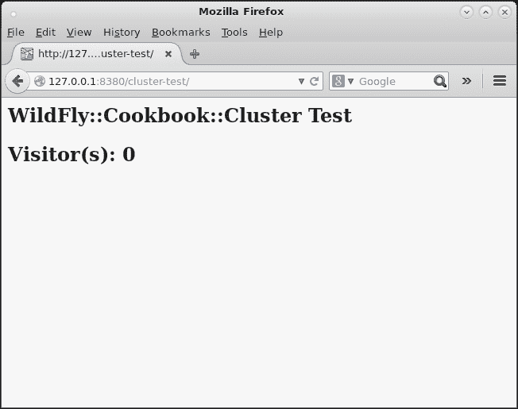

    在“node-B1”上运行的“cluster-test”应用程序

    如你所见，应用程序从`0`（零）开始计数。`node-B1`日志应该有如下语句：

    ```java
    17:12:59,978 INFO  [stdout] (default task-1) ********************************+
    17:12:59,979 INFO  [stdout] (default task-1) Visitor(s): 0
    17:12:59,980 INFO  [stdout] (default task-1) ********************************+
    ```

1.  现在，让我们尝试将相同的浏览器窗口指向以下 URL：`http://127.0.0.1:8480/cluster-test`。你应该会看到以下截图：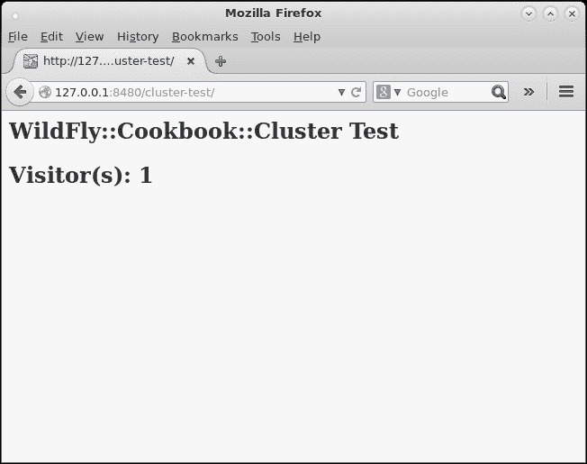

    在“node-B2”上运行的“cluster-test”应用程序

    在`node-B2`日志中，你应该找到以下语句：

    ```java
    17:13:52,841 INFO  [stdout] (default task-1) ********************************+
    17:13:52,841 INFO  [stdout] (default task-1) Visitor(s): 1
    17:13:52,842 INFO  [stdout] (default task-1) ********************************+
    ```

    太好了，集群`B`也正在运行！现在，尝试在不同的 URL 之间切换，看看集群是否正确响应。

## 它是如何工作的…

让我们分析我们所做的，以及为什么它不需要太多配置就能工作。除了`node-A1`和`node-A2`的`standalone.sh`脚本外，我们还指定了一些参数：

+   `jboss.server.base.dir=cl-std-node-A1`：需要指定我们的基础目录作为起始文件夹以检索所有配置文件（`cl-std-node-A2`用于`node-A2`）

+   `--server-config=standalone-ha.xml`：需要指定具有`ha`配置文件的服务器配置文件

+   jboss.socket.binding.port-offset=100：需要指定端口偏移量（对于“node-2”是 200）

+   `jboss.node.name=node-A1`：需要唯一标识集群内的节点（显然对于第二个`A`节点是`node-A2`）

这就是我们为节点`A`创建集群所需做的所有事情。

为了创建节点`B`集群，我们需要指定几乎相同的参数，加上`jboss.default.multicast.address`，其值为`230.0.0.5`。默认的组播地址值为`230.0.0.4`，然后由`A`节点使用。这使得我们能够创建两个不同的集群：集群`A`的成员将通过`230.0.0.4`地址进行通信，而集群`B`的成员将通过*230.0.0.5*地址进行通信。

# 在域模式下创建集群

在这个菜谱中，你将学习如何在本地将两个 WildFly 节点进行集群，也就是说，在你的电脑上。我们将使用域模式和`ha`配置文件来尝试这个操作。

## 准备工作

对于这个菜谱，我们需要一个名为`cluster-test`的`cluster-aware`应用程序，你可以在我的 GitHub 仓库中找到它。如果你跳过了第二章中关于*使用部署文件夹管理应用程序*的菜谱，请参考它以下载你需要的所有源代码和项目。

要构建应用程序，请运行以下命令：

```java
$ cd ~/WFC/github/wildfly-cookbook
$ cd cluster-test
$ mvn -e clean package
```

## 如何操作...

从 WildFly 安装目录`$WILDFLY_HOME`开始，让我们创建两个文件夹；一个代表`domain-controller`，另一个代表主机（我们将在同一主机内运行两个实例）。

打开一个终端并执行以下命令：

```java
$ cd $WILDFLY_HOME
$ cp -a domain cl-dmn-master
$ cp -a domain cl-dmn-host-1
```

### 主机

现在，让我们使用放置在`cl-dmn-master`文件夹中的`domain.xml`和`host.xml`文件来配置我们的域控制器。

编辑`domain.xml`文件，并将`<server-groups>...</server-groups>`标签定义替换为以下内容：

```java
<server-groups>
    <server-group name="cluster-REST-app" profile="ha">
        <jvm name="default">
            <heap size="512m" max-size="512m"/>
        </jvm>
        <socket-binding-group ref="ha-sockets"/>
    </server-group>
</server-groups>
```

再次，为了使用集群，我们需要使用`ha`配置文件，我在`server-group`的`profile`属性中提到了它。此外，我们还需要通过`ref`属性引用适当的`socket-binding-group`，在这种情况下值为`ha-sockets`。

### 小贴士

遵循以下规则：始终正确命名服务器组；不要将它们命名为"server-A"、"*server-1*"或类似名称，否则当你开始管理越来越多的服务器时，你会感到困惑。

现在，让我们编辑`host.xml`文件，以便只包含`domain-controller`而没有任何正在运行的主机。

以下是需要采取的步骤：

1.  将主机命名为`master`：

    ```java
    <host name="master" >
    ```

1.  将`<domain-controller>...</domain-controller>`标签定义替换为以下内容：

    ```java
    <domain-controller>
      <local/>
    </domain-controller>
    ```

1.  删除`<servers>`标签定义。

    好的，我们已经完成了`domain-controller`的配置。让我们运行一下。

1.  打开一个终端并执行以下命令：

    ```java
    $ cd $WILDFLY_HOME
    $ ./bin/domain.sh -Djboss.domain.base.dir=cl-dmn-master
    ```

现在我们可以配置将成为集群一部分的主机。

### 主机-1

首先，让我们禁用`cl-dmn-host-1`文件夹中现有的`domain.xml`。

打开一个终端并执行以下命令：

```java
$ cd $WILDFLY_HOME
$ cd cl-dmn-host-1
$ mv configuration/domain.xml configuration/domain.xml.unused
```

通过这样做，文件在启动时将不会被读取。现在，让我们使用放置在`cl-dmn-host-1`文件夹中的`host.xml`文件来配置我们的主机控制器。

编辑`host.xml`文件并按照以下步骤操作：

1.  将主机命名为`host-1`：

    ```java
    <host name="host-1" >
    ```

1.  将`<management-interfaces>...</management-interfaces>`标签定义替换为`<management>`标签内的以下内容：

    ```java
    <management-interfaces>
      <native-interface security-realm="ManagementRealm">
        <socket interface="management" port="${jboss.management.native.port:19999}"/>
      </native-interface>
      <http-interface security-realm="ManagementRealm" http-upgrade-enabled="true">
        <socket interface="management" port="${jboss.management.http.port:19990}"/>
      </http-interface>
    </management-interfaces>
    ```

1.  将`<domain-controller>...</domain-controller>`标签定义替换为以下内容：

    ```java
    <domain-controller>
      <remote security-realm="ManagementRealm">
        <discovery-options>
          <static-discovery name="primary" protocol="${jboss.domain.master.protocol:remote}" host="${jboss.domain.master.address}" port="${jboss.domain.master.port:9999}"/>
        </discovery-options>
      </remote>
    </domain-controller>
    ```

1.  将`<servers>...</servers>`标签定义替换为以下内容：

    ```java
    <servers>
      <server name="REST-server-1" group="cluster-REST-app">
        <jvm name="default">
           <heap size="384m" max-size="384m"/>
        </jvm>
          <socket-bindings port-offset="100"/>
      </server>
      <server name="REST-server-2" group="cluster-REST-app">
        <jvm name="default">
          <heap size="384m" max-size="384m"/>
        </jvm>
          <socket-bindings port-offset="200"/>
      </server>
    </servers>
    ```

### 注意

在这种情况下，使用索引前缀命名服务器有助于提供更多信息。例如，如果你有五个服务器，每个服务器运行两个实例，并且你在日志文件中捕获到关于`REST-server-7`的错误语句，那么你知道你需要查看机器编号`4`，对吧？

打开终端并执行以下命令：

```java
$ cd $WILDFLY_HOME
$ ./bin/domain.sh -Djboss.domain.base.dir=cl-dmn-host-1 -Djboss.domain.master.address=127.0.0.1
```

现在，如果你查看`host-1`的日志输出，你应该已经注意到关于我们的集群没有任何信息。为什么？（你应该知道；无论如何，答案将在稍后解释。）

现在一切都已经启动并运行，让我们部署我们的应用（你得到答案了吗？）。

1.  打开终端并执行以下命令：

    ```java
    $ cd $WILDFLY_HOME
    $ ./bin/jboss-cli.sh
    You are disconnected at the moment. Type 'connect' to connect to the server or 'help' for the list of supported commands.
    [disconnected /] connect
    [domain@localhost:9990 /] deploy cluster-test.war --server-groups=cluster-REST-app
    ```

1.  让我们先检查日志。在`domain-controller`中，你应该看到一条声明内容已上传的语句，如下所示：

    ```java
    [Host Controller] 20:52:54,502 INFO  [org.jboss.as.repository] (management-handler-thread - 7) WFLYDR0001: Content added at location /Users/foogaro/wildfly-9.0.0.Beta2/cl-dmn-master/data/content/ee/f4c936445881ec81ccb497cd2e7a500b95a92c/content
    ```

    在**host-1**你应该看到以下语句：

    ```java
    [Server:REST-server-2] 21:09:41,157 INFO  [stdout] (MSC service thread 1-11)
    [Server:REST-server-2] 21:09:41,157 INFO  [stdout] (MSC service thread 1-11) -------------------------------------------------------------------
    [Server:REST-server-2] 21:09:41,157 INFO  [stdout] (MSC service thread 1-11) GMS: address=REST-server-2, cluster=ee, physical address=127.0.0.1:55400
    [Server:REST-server-2] 21:09:41,157 INFO  [stdout] (MSC service thread 1-11) -------------------------------------------------------------------
    [Server:REST-server-1] 21:09:41,167 INFO  [stdout] (MSC service thread 1-14)
    [Server:REST-server-1] 21:09:41,167 INFO  [stdout] (MSC service thread 1-14) -------------------------------------------------------------------
    [Server:REST-server-1] 21:09:41,168 INFO  [stdout] (MSC service thread 1-14) GMS: address=REST-server-1, cluster=ee, physical address=127.0.0.1:55300
    [Server:REST-server-1] 21:09:41,168 INFO  [stdout] (MSC service thread 1-14) -------------------------------------------------------------------
    [Server:REST-server-2] 21:09:44,576 INFO  [org.infinispan.remoting.transport.jgroups.JGroupsTransport] (ServerService Thread Pool -- 21) ISPN000078: Starting JGroups channel web
    [Server:REST-server-1] 21:09:44,576 INFO  [org.infinispan.remoting.transport.jgroups.JGroupsTransport] (ServerService Thread Pool -- 21) ISPN000078: Starting JGroups channel web
    [Server:REST-server-1] 21:09:44,580 INFO  [org.infinispan.remoting.transport.jgroups.JGroupsTransport] (ServerService Thread Pool -- 21) ISPN000094: Received new cluster view for channel web: [REST-server-1|0] (1) [REST-server-1]
    [Server:REST-server-1] 21:09:44,581 INFO  [org.infinispan.remoting.transport.jgroups.JGroupsTransport] (ServerService Thread Pool -- 21) ISPN000079: Channel web local address is REST-server-1, physical addresses are [127.0.0.1:55300]
    [Server:REST-server-2] 21:09:44,581 INFO  [org.infinispan.remoting.transport.jgroups.JGroupsTransport] (ServerService Thread Pool -- 21) ISPN000094: Received new cluster view for channel web: [REST-server-2|0] (1) [REST-server-2]
    [Server:REST-server-2] 21:09:44,582 INFO  [org.infinispan.remoting.transport.jgroups.JGroupsTransport] (ServerService Thread Pool -- 21) ISPN000079: Channel web local address is REST-server-2, physical addresses are [127.0.0.1:55400]
    [Server:REST-server-1] 21:09:44,588 INFO  [org.infinispan.factories.GlobalComponentRegistry] (ServerService Thread Pool -- 21) ISPN000128: Infinispan version: Infinispan 'Hoptimus Prime' 7.1.1.Final
    [Server:REST-server-2] 21:09:44,589 INFO  [org.infinispan.factories.GlobalComponentRegistry] (ServerService Thread Pool -- 21) ISPN000128: Infinispan version: Infinispan 'Hoptimus Prime' 7.1.1.Final
    [Server:REST-server-1] 21:09:44,793 INFO  [org.jboss.as.clustering.infinispan] (ServerService Thread Pool -- 31) WFLYCLINF0002: Started cluster-test.war cache from web container
    [Server:REST-server-1] 21:09:44,793 INFO  [org.jboss.as.clustering.infinispan] (ServerService Thread Pool -- 21) WFLYCLINF0002: Started dist cache from web container
    [Server:REST-server-2] 21:09:44,798 INFO  [org.jboss.as.clustering.infinispan] (ServerService Thread Pool -- 29) WFLYCLINF0002: Started cluster-test.war cache from web container
    [Server:REST-server-2] 21:09:44,798 INFO  [org.jboss.as.clustering.infinispan] (ServerService Thread Pool -- 21) WFLYCLINF0002: Started dist cache from web container
    [Server:REST-server-1] 21:09:45,050 INFO  [org.wildfly.extension.undertow] (MSC service thread 1-7) WFLYUT0021: Registered web context: /cluster-test
    [Server:REST-server-2] 21:09:45,052 INFO  [org.wildfly.extension.undertow] (MSC service thread 1-12) WFLYUT0021: Registered web context: /cluster-test
    [Server:REST-server-1] 21:09:45,119 INFO  [org.jboss.as.server] (ServerService Thread Pool -- 60) WFLYSRV0010: Deployed "cluster-test.war" (runtime-name : "cluster-test.war")
    [Server:REST-server-2] 21:09:45,119 INFO  [org.jboss.as.server] (ServerService Thread Pool -- 24) WFLYSRV0010: Deployed "cluster-test.war" (runtime-name : "cluster-test.war")
    ```

    看看，现在我们有了关于集群的语句日志，我们知道答案：一旦应用程序需要，集群就会被激活。

    是时候使用我们的应用程序来测试我们的集群了！

1.  打开你的浏览器并将它指向以下位置：`http://127.0.0.1:8180/cluster-test`。刷新页面几次。在浏览器窗口中，你应该会看到以下类似截图的内容：

    在“host-1”上运行的“cluster-test”应用与“REST-server-1”

    在`host-1`的日志中，你应该找到以下语句：

    ```java
    [Server:REST-server-1] 16:05:47,393 INFO  [stdout] (default task-1) ********************************+
    [Server:REST-server-1] 16:05:47,394 INFO  [stdout] (default task-1) Visitor(s): 0
    [Server:REST-server-1] 16:05:47,394 INFO  [stdout] (default task-1) ********************************+
    [Server:REST-server-1] 16:05:50,266 INFO  [stdout] (default task-3) ********************************+
    [Server:REST-server-1] 16:05:50,267 INFO  [stdout] (default task-3) Visitor(s): 1
    [Server:REST-server-1] 16:05:50,267 INFO  [stdout] (default task-3) ********************************+
    [Server:REST-server-1] 16:05:50,529 INFO  [stdout] (default task-4) ********************************+
    [Server:REST-server-1] 16:05:50,530 INFO  [stdout] (default task-4) Visitor(s): 2
    [Server:REST-server-1] 16:05:50,531 INFO  [stdout] (default task-4) ********************************+
    [Server:REST-server-1] 16:05:50,800 INFO  [stdout] (default task-5) ********************************+
    [Server:REST-server-1] 16:05:50,800 INFO  [stdout] (default task-5) Visitor(s): 3
    [Server:REST-server-1] 16:05:50,801 INFO  [stdout] (default task-5) ********************************+
    [Server:REST-server-1] 16:05:51,405 INFO  [stdout] (default task-6) ********************************+
    [Server:REST-server-1] 16:05:51,406 INFO  [stdout] (default task-6) Visitor(s): 4
    [Server:REST-server-1] 16:05:51,407 INFO  [stdout] (default task-6) ********************************+
    ```

    注意日志语句后缀指示的服务器名称。

1.  现在，让我们尝试将同一个浏览器窗口指向 URL `http://127.0.0.1:8280/cluster-test`。你应该会看到以下类似截图的内容：

    在“host-1”上运行的“cluster-test”应用与“REST-server-2”

### 注意

如你所见，第二个节点从我们在`REST-server-1`停止的地方继续计数。在`host-1`的日志中，你应该找到以下语句：

```java
[Server:REST-server-2] 16:11:27,734 INFO  [stdout] (default task-1) ********************************+
[Server:REST-server-2] 16:11:27,734 INFO  [stdout] (default task-1) Visitor(s): 5
[Server:REST-server-2] 16:11:27,734 INFO  [stdout] (default task-1) ********************************+
```

日志后缀已更改为`REST-server-2`。好的，我们的集群正在正常工作。

## 它是如何工作的...

跳过域模式配置的细节（见第三章，*在域模式下运行 WildFly*），让我们分析我们所做的工作以及为什么它不需要太多配置就能工作。除了`master`节点的`domain.sh`脚本外，我们还指定了`-Djboss.domain.base.dir=cl-dmn-master`参数，表示我们的基础目录作为获取整个配置文件的起始文件夹。

此外，在`domain.xml`中，我们在`server-groups`的定义中指定了对`ha`配置文件和`ha-sockets`的引用。这些配置启用了集群功能。记住，只有`ha`和`full-ha`配置文件启用了集群功能。

在查看`host-1`端时，除了`domain.sh`脚本外，我们还指定了`-Djboss.domain.base.dir=cl-dmn-host-1`和`-Djboss.domain.master.address=127.0.0.1`属性，将我们的基本目录设置为起始文件夹，以检索整个配置文件，以及相对的`domain-controller`地址。

### 注意

记住，域控制器通过主机控制器将配置推送到主机，这就是为什么我们在`host-1`中没有配置对应项。

这就是我们创建集群所需做的所有事情。这是因为默认的 WildFly 配置，特别是子系统`jgroups`的配置。让我们看看它的默认设置：

```java
<subsystem >
    <channels default="ee">
        <channel name="ee"/>
    </channels>
    <stacks default="udp">
        <stack name="udp">
            <transport type="UDP" socket-binding="jgroups-udp"/>
            <protocol type="PING"/>
            <protocol type="MERGE3"/>
            <protocol type="FD_SOCK" socket-binding="jgroups-udp-fd"/>
            <protocol type="FD_ALL"/>
            <protocol type="VERIFY_SUSPECT"/>
            <protocol type="pbcast.NAKACK2"/>
            <protocol type="UNICAST3"/>
            <protocol type="pbcast.STABLE"/>
            <protocol type="pbcast.GMS"/>
            <protocol type="UFC"/>
            <protocol type="MFC"/>
            <protocol type="FRAG2"/>
            <protocol type="RSVP"/>
        </stack>
        <stack name="tcp">
            <transport type="TCP" socket-binding="jgroups-tcp"/>
            <protocol type="MPING" socket-binding="jgroups-mping"/>
            <protocol type="MERGE3"/>
            <protocol type="FD_SOCK" socket-binding="jgroups-tcp-fd"/>
            <protocol type="FD"/>
            <protocol type="VERIFY_SUSPECT"/>
            <protocol type="pbcast.NAKACK2"/>
            <protocol type="UNICAST3"/>
            <protocol type="pbcast.STABLE"/>
            <protocol type="pbcast.GMS"/>
            <protocol type="MFC"/>
            <protocol type="FRAG2"/>
            <protocol type="RSVP"/>
        </stack>
    </stacks>
</subsystem>
```

因此，用于集群传输的默认协议是 UDP（见强调的代码）。这个 UDP 设置在`domain.xml`文件中，在名为`ha-sockets`的`socket-binding-group`内，有额外的配置，如下所示：

```java
<socket-binding-group name="ha-sockets" default-interface="public">
    <socket-binding name="ajp" port="${jboss.ajp.port:8009}"/>
    <socket-binding name="http" port="${jboss.http.port:8080}"/>
    <socket-binding name="https" port="${jboss.https.port:8443}"/>
    <socket-binding name="jgroups-mping" port="0" multicast-address="${jboss.default.multicast.address:230.0.0.4}" multicast-port="45700"/>
    <socket-binding name="jgroups-tcp" port="7600"/>
    <socket-binding name="jgroups-tcp-fd" port="57600"/>
    <socket-binding name="jgroups-udp" port="55200" multicast-address="${jboss.default.multicast.address:230.0.0.4}" multicast-port="45688"/>
    <socket-binding name="jgroups-udp-fd" port="54200"/>
    <socket-binding name="modcluster" port="0" multicast-
    address="224.0.1.105" multicast-port="23364"/>
    <socket-binding name="txn-recovery-environment" port="4712"/>
    <socket-binding name="txn-status-manager" port="4713"/>
    <outbound-socket-binding name="mail-smtp">
        <remote-destination host="localhost" port="25"/>
    </outbound-socket-binding>
</socket-binding-group>
```

因此，默认情况下，集群的每个成员都会在`230.0.0.4`地址上广播自己。此外，配置中指定的每个端口都会随着`host.xml`文件中`host-1`服务器中指定的`<socket-bindings port-offset="XXX"/>`设置一起更改。

## 还有更多…

我们本可以不使用`port-offset`指令来创建我们的集群，而是为每个节点使用不同的 IP 地址，但这不会正常工作。这是因为存储在 cookie 中的 HTTP 会话引用。一般来说，cookie 由一个名称（通常是`JSESSIONID`）、一个值（用于在服务器上引用 HTTP 会话的 ID）、一个域和一个上下文路径组成。

所有这些属性必须相同，才能向服务器上的同一 HTTP 会话发出请求，而对于绑定到不同 IP 的节点来说，情况并非如此。IP 是 cookie 的域，因此它将不起作用——除非您进行负载均衡——但这将在下一章中介绍。

## 参见

如果您遇到此配置问题，您可能存在网络问题，您可以使用本章的*使用 JGroups 工具测试 UDP 协议*配方进行故障排除。

# 在域模式下创建单独的集群

在前面的配方中，我们学习了如何创建集群。如果我们需要管理更多应用程序，每个应用程序都有自己的集群怎么办？这正是您将在本配方中学到的。我们将学习如何使用`ha`配置文件管理更多应用程序。

## 准备工作

对于这个菜谱，我们需要一个名为`example`的`cluster-aware`应用程序，你可以在我的 GitHub 仓库中找到它。如果你跳过了第二章中关于“使用部署文件夹管理应用程序”的菜谱，请参考它以下载你需要的所有源代码和项目。

要构建应用程序，执行以下命令：

```java
$ cd ~/WFC/github/wildfly-cookbook
$ cd example
$ mvn -e clean package
```

## 如何操作...

从 WildFly 安装目录`$WILDFLY_HOME`开始，让我们创建三个文件夹，一个用于域控制器（始终运行域控制器本身，不包含任何其他主机），以及两个代表两个不同主机及其自己的`host-controller`的文件夹。

打开终端并执行以下命令（如果你遵循了前一个菜谱中的步骤，你可以跳过前两个`cp`命令）：

```java
$ cd $WILDFLY_HOME
$ cp -a domain cl-dmn-master
$ cp -a domain cl-dmn-host-1
$ cp -a domain cl-dmn-host-2
```

### 主

现在，让我们使用放置在`cl-dmn-master`文件夹中的`domain.xml`和`host.xml`文件来配置我们的域控制器。这将与之前的菜谱完全相同，以防万一。

编辑`domain.xml`文件，将`<server-groups>...</server-groups>`标签定义替换为以下内容：

```java
<server-groups>
    <server-group name="cluster-REST-app" profile="ha">
        <jvm name="default">
            <heap size="512m" max-size="512m"/>
        </jvm>
        <socket-binding-group ref="ha-sockets"/>
    </server-group>
    <server-group name="cluster-SOAP-app" profile="ha">
        <jvm name="default">
            <heap size="512m" max-size="512m"/>
        </jvm>
        <socket-binding-group ref="ha-sockets"/>
    </server-group>
</server-groups>
```

再次强调，要使用集群，我们需要使用`ha`配置文件，我在`server-group`元素的`profile`属性中引用了它。此外，我们还需要通过`ref`属性引用适当的`socket-binding-group`，在这种情况下值为`ha-sockets`。

### 小贴士

遵循以下规则：始终正确命名服务器组，不要将它们命名为“server-A”、“`server-1`”或类似名称。

现在让我们编辑`host.xml`文件，以便只包含`domain-controller`而没有任何运行的主机。

这里是要遵循的步骤：

1.  将主机命名为`master`：

    ```java
    <host name="master" >
    ```

1.  将`<domain-controller>...</domain-controller>`标签定义替换为以下内容：

    ```java
    <domain-controller>
      <local/>
    </domain-controller>
    ```

1.  删除`<servers>`标签定义。

    好的，我们已经完成了 domain-controller 的配置。现在让我们运行一下。

1.  打开终端并执行以下命令：

    ```java
    $ cd $WILDFLY_HOME
    $ ./bin/domain.sh -Djboss.domain.base.dir=cl-dmn-master
    ```

现在，我们可以配置将成为集群一部分的主机。

### 主机-1

首先，让我们禁用`cl-dmn-host-1`文件夹中现有的`domain.xml`文件。

打开终端并执行以下命令：

```java
$ cd $WILDFLY_HOME
$ cd cl-dmn-host-1
$ mv configuration/domain.xml configuration/domain.xml.unused
```

通过这样做，文件将在启动时不会被读取。现在，让我们使用放置在`cl-dmn-host-1`文件夹中的`host.xml`来配置我们的主机控制器。

编辑`host.xml`文件，按照以下步骤操作：

1.  将主机命名为`host-1`：

    ```java
    <host name="host-1" >
    ```

1.  将`<management-interfaces>...</management-interfaces>`标签定义替换为以下内容，位于`<management>`标签内部：

    ```java
    <management-interfaces>
      <native-interface security-realm="ManagementRealm">
        <socket interface="management" port="${jboss.management.native.port:19999}"/>
        </native-interface>
        <http-interface security-realm="ManagementRealm" http-upgrade-enabled="true">
            <socket interface="management" port="${jboss.management.http.port:19990}"/>
        </http-interface>
    </management-interfaces>
    ```

    这只在同一服务器上运行了更多管理接口时才需要。

1.  将`<domain-controller>...</domain-controller>`标签定义替换为以下内容：

    ```java
    <domain-controller>
      <remote security-realm="ManagementRealm">
        <discovery-options>
          <static-discovery name="primary" protocol="${jboss.domain.master.protocol:remote}" host="${jboss.domain.master.address}" port="${jboss.domain.master.port:9999}"/>
        </discovery-options>
      </remote>
    </domain-controller>
    ```

    如你所见，`jboss.domain.master.address`属性没有默认值，因此我们需要以某种方式传递它。

1.  将`<servers>...</servers>`标签定义替换为以下内容：

    ```java
    <servers>
      <server name="REST-server-1" group="cluster-REST-app">
        <socket-bindings port-offset="100"/>
      </server>
      <server name="SOAP-server-1" group="cluster-SOAP-app">
        <socket-bindings port-offset="200"/>
      </server>
    </servers>
    ```

1.  打开终端并执行以下命令：

    ```java
    $ cd $WILDFLY_HOME
    $ ./bin/domain.sh -Djboss.domain.base.dir=cl-dmn-host-1 -Djboss.domain.master.address=127.0.0.1
    ```

### 注意

记住，集群是在需要时激活的，也就是说，在我们安装了`cluster-aware`应用程序之后。

### 主机-2

让我们对`host-2`进行完全相同的事情，只需做少许调整。

打开终端并执行以下命令：

```java
$ cd $WILDFLY_HOME
$ cd cl-dmn-host-2
$ mv configuration/domain.xml configuration/domain.xml.unused
```

编辑`host.xml`文件并按照以下步骤操作：

1.  将主机命名为`host-2`：

    ```java
    <host name="host-2" >
    ```

1.  将`<management>`标签内的`<management-interfaces>...</management-interfaces>`标签定义替换为以下内容：

    ```java
    <management-interfaces>
        <native-interface security-realm="ManagementRealm">
            <socket interface="management" port="${jboss.management.native.port:29999}"/>
        </native-interface>
        <http-interface security-realm="ManagementRealm" http-upgrade-enabled="true">
            <socket interface="management" port="${jboss.management.http.port:29990}"/>
        </http-interface>
    </management-interfaces>
    ```

1.  将`<domain-controller>...</domain-controller>`标签定义替换为以下内容：

    ```java
    <domain-controller>
        <remote security-realm="ManagementRealm">
            <discovery-options>
                <static-discovery name="primary" protocol="${jboss.domain.master.protocol:remote}" host="${jboss.domain.master.address}" port="${jboss.domain.master.port:9999}"/>
            </discovery-options>
        </remote>
    </domain-controller>
    ```

1.  将`<servers>...</servers>`标签定义替换为以下内容：

    ```java
    <servers>
        <server name="REST-server-2" group="cluster-REST-app">
            <socket-bindings port-offset="300"/>
        </server>
        <server name="SOAP-server-2" group="cluster-SOAP-app">
            <socket-bindings port-offset="400"/>
        </server>
    </servers>
    ```

1.  打开终端并执行以下命令：

    ```java
    $ cd $WILDFLY_HOME
    $ ./bin/domain.sh -Djboss.domain.base.dir=cl-dmn-host-2 -Djboss.domain.master.address=127.0.0.1
    ```

    ### 注意

    记住，集群是在需要时激活的，也就是说，在我们安装了`cluster-aware`应用程序之后。

1.  按照以下方式部署应用程序：

    ```java
    $ cd $WILDFLY_HOME
    $ ./bin/jboss-cli.sh
    You are disconnected at the moment. Type 'connect' to connect to the server or 'help' for the list of supported commands.
    [disconnected /] connect
    [domain@localhost:9990 /] deploy cluster-test.war --all-server-groups
    ```

### 测试集群

现在所有主机都已启动并运行，让我们测试我们的两个集群！

打开浏览器并指向以下 URL，使用不同的窗口：

+   URL `http://127.0.0.1:8180/cluster-test`将显示以下输出：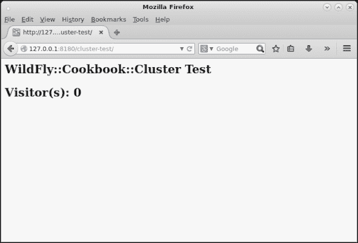

+   URL `http://127.0.0.1:8280/cluster-test`将显示以下输出：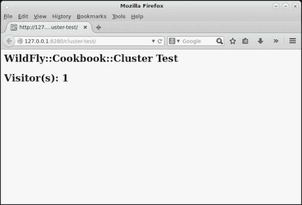

+   URL `http://127.0.0.1:8380/cluster-test`将显示以下输出：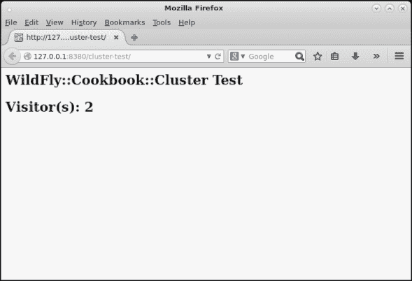

+   URL `http://127.0.0.1:8480/cluster-test`将显示以下输出：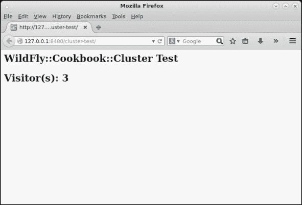

哎呀！我们没想到会出现这种情况，对吧？我们错过了什么？

+   好吧，我们得到了相同的应用程序，但仍然，集群应该已经工作。我的意思是两个独立的集群。我们为所有主机分配了不同的端口。那么问题出在哪里？

+   服务器组并不定义集群。集群是在网络层面上定义的。为了有一个第二个集群，即一个独立的集群，我们需要为想要形成第二个集群的服务器指定一个不同的多播地址。两个服务器组都在共享同一个套接字绑定组`ha-sockets`，所以所有信息、缓存和集群 ping 都会发送到同一个网络。

我们该如何做呢？将多播地址作为参数与`domain.sh`脚本一起传递给`host-2`？不！那样做的话，我们会为`REST-server-2`服务器设置一个不同的多播地址，这个地址应该存在于第一个集群`cluster-REST-app`中。

我们需要为第一个集群定义一个多播地址，并为第二个集群定义另一个地址。我们的集群在逻辑上由`cluster-REST-app`服务器组和`cluster-SOAP-app`服务器组表示，我们可以在服务器组级别定义这些多播地址，因此是在`domain.xml`中。

现在，停止一切！

#### 主

编辑`domain.xml`文件，将`<server-groups>...</server-groups>`标签定义替换为以下内容：

```java
<server-groups>
    <server-group name="cluster-REST-app" profile="ha">
        <jvm name="default">
            <heap size="512m" max-size="512m"/>
        </jvm>
        <socket-binding-group ref="ha-sockets"/>
        <system-properties>
         <property name="jboss.default.multicast.address" value="${rest.multicast.address}" />
        </system-properties>
        <deployments>
            <deployment name="cluster-test.war" runtime-name="cluster-test.war"/>
        </deployments>
    </server-group>
    <server-group name="cluster-SOAP-app" profile="ha">
        <jvm name="default">
            <heap size="512m" max-size="512m"/>
        </jvm>
        <socket-binding-group ref="ha-sockets"/>
        <system-properties>
         <property name="jboss.default.multicast.address" value="${soap.multicast.address}" />
        </system-properties>
        <deployments>
            <deployment name="cluster-test.war" runtime-name="cluster-test.war"/>
        </deployments>
    </server-group>
</server-groups>
```

打开终端并执行以下命令：

```java
$ cd $WILDFLY_HOME
$ ./bin/domain.sh -Djboss.domain.base.dir=cl-dmn-master
```

#### 主机-1

打开终端并执行以下命令：

```java
$ cd $WILDFLY_HOME
$ ./bin/domain.sh -Djboss.domain.base.dir=cl-dmn-host-1 -Djboss.domain.master.address=127.0.0.1 -Drest.multicast.address=230.0.0.4 -Dsoap.multicast.address=230.0.0.5

```

#### 主机-2

打开终端并执行以下命令：

```java
$ cd $WILDFLY_HOME
$ ./bin/domain.sh -Djboss.domain.base.dir=cl-dmn-host-2 -Djboss.domain.master.address=127.0.0.1 -Drest.multicast.address=230.0.0.4 -Dsoap.multicast.address=230.0.0.5

```

### 重新测试集群

让我们打开同一浏览器的两个窗口并将它们指向以下 URL：

+   URL `http://127.0.0.1:8180/cluster-test`将显示以下输出：

+   URL `http://127.0.0.1:8380/cluster-test`将显示以下输出：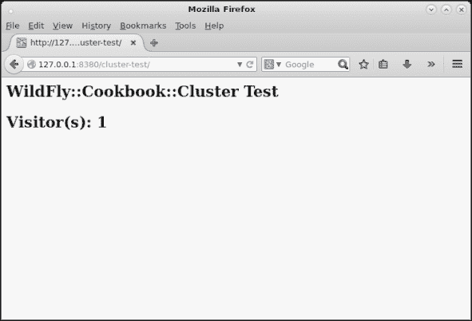

现在打开另一个不同浏览器的两个其他窗口并将它们指向以下 URL：

+   URL `http://127.0.0.1:8280/cluster-test`将显示以下输出：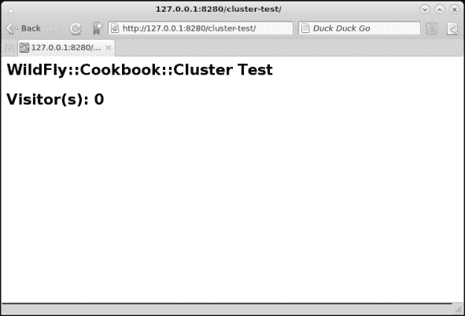

+   URL `http://127.0.0.1:8480/cluster-test`将显示以下输出：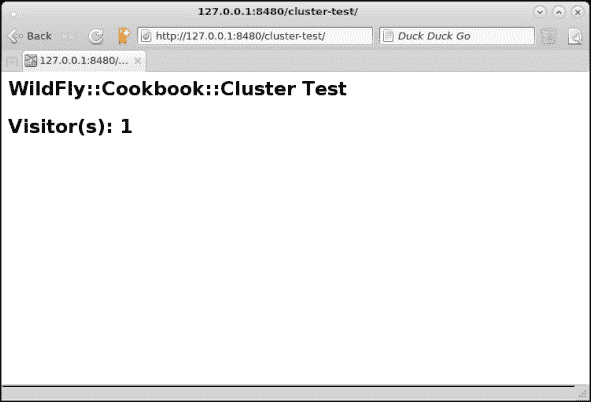

我们开始了！

## 它是如何工作的…

我们在第一个测试过程中解释了出了什么问题。然而，第二个测试略有不同；似乎使用不同的浏览器起到了魔法般的效果。好吧，有点像。

首先，我们实际上将集群分成了两部分，每部分都有自己的网络，这正是设计和实现的要求。

需要不同的浏览器只有一个原因——因为我们正在同一 IP（但不同端口）上进行测试，并且因为主机名（即 IP）与浏览器会话 cookie 的域名匹配，如果四个窗口共享相同的 cookie，最终会导致完全错误的行为——从我们的角度来看。

让我们描述一下“同一四个窗口浏览器”的场景，看看它是否符合我们的思考：

+   **客户端向服务器 8180 发起请求**：它以包含名称`JSESSIONID`，域名`127.0.0.1`，路径`/cluster-test`和值`0o0hPhIZ73unAtIMDCb0zR2h.host-1:REST-server-1`的`set-cookie`头部进行响应。访问者编号`0`。

+   **客户端向服务器 8380 发起请求**：服务器没有返回`set-cookie`头部，因为浏览器在自己的机器上找到了 cookie 并将其发送到服务器，与请求一起。由于服务器`8180`和`8380`位于同一个集群中，并且 HTTP 会话在这些服务器之间进行了复制，服务器找到了会话并增加了我们的访问者数量。访问者编号`1`。

+   **客户端向服务器 8280 发起请求**：我们将其配置为位于不同的集群中。浏览器将 cookie 与请求本身一起发送。服务器找不到会话，因此它以包含新创建值的`set-cookie`头部进行响应：名称`JSESSIONID`，域名`127.0.0.1`，路径`/cluster-test`和值`8X1gLkCbr5RsmELxwTlI0izj.host-1:SOAP-server-1`。访问者编号`0`。

+   **客户端向服务器 8480 发起请求**：浏览器将 cookie 与请求本身一起发送。服务器找不到会话，因此它以包含新创建值的`set-cookie`头部进行响应。

如您所见，使用相同的浏览器——至少是相同会话的浏览器——是无法工作的。

## 参见

如果您在这个配置中遇到任何问题，您可能存在网络问题，您可以使用本章最后一个小节中的最后一个配方进行故障排除。

# 通过 TCP 创建集群

在许多情况下，尤其是在存在多个网络限制的企业和云环境中，你无法使用多播地址，即使在同一网络中。幸运的是，`jgroups`子系统通过提供一种简单的方法在 UDP 和 TCP 集群之间切换，这正是你将在本食谱中学到的。我们将使用带有`ha`配置文件的独立模式进行工作。

## 准备中

对于这个食谱，我们需要一个名为“example”的“集群感知”应用程序，你可以在我的 GitHub 仓库中找到它。如果你跳过了第二章中关于“使用部署文件夹管理应用程序”的食谱，请参阅它以下载你需要的所有源代码和项目。

要构建应用程序，请按以下步骤操作：

```java
$ cd ~/WFC/github/wildfly-cookbook
$ cd example
$ mvn -e clean package
```

## 如何进行测试...

从 WildFly 安装目录`$WILDFLY_HOME`，让我们创建两个文件夹，每个文件夹代表一个服务器节点。

1.  打开终端并执行以下命令：

    ```java
    $ cd $WILDFLY_HOME
    $ cp -a standalone cl-std-tcp-node-1
    $ cp -a standalone cl-std-tcp-node-2
    ```

1.  现在，让我们将`cluster-test.war`应用程序复制到我们刚刚创建的每个节点的`deployments`文件夹中。运行以下命令：

    ```java
    $ cp cluster-test.war cl-std-tcp-node-1/deployments/
    $ cp cluster-test.war cl-std-tcp-node-2/deployments/
    ```

我们几乎准备好测试我们的集群了。我们只需要一些配置。

### Node-1

编辑`standalone-ha.xml`文件，并将`jgroups`子系统替换为以下定义：

```java
<subsystem >
    <channels default="ee">
        <channel name="ee"/>
    </channels>
    <stacks default="tcp">
        <stack name="udp">
            <transport type="UDP" socket-binding="jgroups-udp"/>
            <protocol type="PING"/>
            <protocol type="MERGE3"/>
            <protocol type="FD_SOCK" socket-binding="jgroups-udp-fd"/>
            <protocol type="FD_ALL"/>
            <protocol type="VERIFY_SUSPECT"/>
            <protocol type="pbcast.NAKACK2"/>
            <protocol type="UNICAST3"/>
            <protocol type="pbcast.STABLE"/>
            <protocol type="pbcast.GMS"/>
            <protocol type="UFC"/>
            <protocol type="MFC"/>
            <protocol type="FRAG2"/>
            <protocol type="RSVP"/>
        </stack>
        <stack name="tcp">
            <transport type="TCP" socket-binding="jgroups-tcp"/>
              <protocol type="TCPPING">
                <property name="initial_hosts">
                  127.0.0.1[7700],127.0.0.1[7800]
                </property>
                <property name="num_initial_members">
                  2
                </property>
                <property name="port_range">
                  0
                </property>
                <property name="timeout">
                  2000
                </property>
              </protocol>
            <protocol type="MPING" socket-binding="jgroups-mping"/>
            <protocol type="MERGE3"/>
            <protocol type="FD_SOCK" socket-binding="jgroups-tcp-fd"/>
            <protocol type="FD"/>
            <protocol type="VERIFY_SUSPECT"/>
            <protocol type="pbcast.NAKACK2"/>
            <protocol type="UNICAST3"/>
            <protocol type="pbcast.STABLE"/>
            <protocol type="pbcast.GMS"/>
            <protocol type="MFC"/>
            <protocol type="FRAG2"/>
            <protocol type="RSVP"/>
        </stack>
    </stacks>
</subsystem>
```

打开终端并执行以下命令：

```java
$ cd $WILDFLY_HOME
$ ./bin/standalone.sh -Djboss.server.base.dir=cl-std-tcp-node-1 --server-config=standalone-ha.xml -Djboss.socket.binding.port-offset=100 -Djboss.node.name=node-1
```

### Node-2

编辑`standalone-ha.xml`文件，并替换`jgroups`子系统，就像我们为`node-1`所做的那样。

打开终端并执行以下命令：

```java
$ cd $WILDFLY_HOME
$ ./bin/standalone.sh -Djboss.server.base.dir=cl-std-tcp-node-2 --server-config=standalone-ha.xml -Djboss.socket.binding.port-offset=200 -Djboss.node.name=node-2
```

### 测试 TCP 集群

现在所有节点都已启动并运行，让我们测试我们的 TCP 集群！

1.  打开浏览器并指向`http://127.0.0.1:8180/cluster-test`。刷新页面几次，你应该会看到以下类似图像：

    在 TCP 集群的独立模式“ha”配置文件下运行在“node-1”上的“cluster-test”应用程序

    在`node-1`的日志中，你应该会看到以下语句：

    ```java
    15:04:57,966 INFO  [stdout] (default task-1) ********************************+
    15:04:57,967 INFO  [stdout] (default task-1) Visitor(s): 0
    15:04:57,967 INFO  [stdout] (default task-1) ********************************+
    15:04:59,762 INFO  [stdout] (default task-3) ********************************+
    15:04:59,763 INFO  [stdout] (default task-3) Visitor(s): 1
    15:04:59,763 INFO  [stdout] (default task-3) ********************************+
    15:05:00,105 INFO  [stdout] (default task-4) ********************************+
    15:05:00,105 INFO  [stdout] (default task-4) Visitor(s): 2
    15:05:00,105 INFO  [stdout] (default task-4) ********************************+
    15:05:00,462 INFO  [stdout] (default task-5) ********************************+
    15:05:00,462 INFO  [stdout] (default task-5) Visitor(s): 3
    15:05:00,463 INFO  [stdout] (default task-5) ********************************+
    15:05:01,080 INFO  [stdout] (default task-6) ********************************+
    15:05:01,080 INFO  [stdout] (default task-6) Visitor(s): 4
    15:05:01,080 INFO  [stdout] (default task-6) ********************************+
    ```

1.  现在，尝试将浏览器指向`http://127.0.0.1:8280/cluster-test`。你应该会看到以下类似图像：

    在 TCP 集群的独立模式“ha”配置文件下运行在“node-2”上的“cluster-test”应用程序

    并且在`node-2`的日志中，你应该会看到以下语句：

    ```java
    15:05:28,122 INFO  [stdout] (default task-1) ********************************+
    15:05:28,123 INFO  [stdout] (default task-1) Visitor(s): 5
    15:05:28,123 INFO  [stdout] (default task-1) ********************************+
    ```

我们的 TCP 集群正在运行！让我们也尝试看看它是否具有良好的扩展性：

1.  打开终端并执行以下命令：

    ```java
    $ cd $WILDFLY_HOME
    $ cp -a standalone cl-std-tcp-node-3
    ```

1.  现在，让我们将`cluster-test.war`应用程序复制到`node-3`的`deployments`文件夹中，如下所示：

    ```java
    $ cp cluster-test.war cl-std-tcp-node-3/deployments/
    ```

1.  编辑`standalone-ha.xml`文件，并替换`jgroups`子系统，就像我们为`node-1`和`node-2`所做的那样。

1.  打开终端并执行以下命令：

    ```java
    $ cd $JBOSS_HOME
    $ ./bin/standalone.sh -Djboss.server.base.dir=cl-std-tcp-node-3 --server-config=standalone-ha.xml -Djboss.socket.binding.port-offset=300 -Djboss.node.name=node-3
    ```

在前两个节点的日志中，你应该会看到以下条目：

+   `23:14:24,466 INFO [org.infinispan.remoting.transport.jgroups.JGroupsTransport] (Incoming-8,ee,node-1) ISPN000094: Received new cluster view for channel web: [node-1|2] (3) [node-1, node-2, node-3]`

+   `23:14:24,468 INFO [org.infinispan.remoting.transport.jgroups.JGroupsTransport] (Incoming-9,ee,node-2) ISPN000094: Received new cluster view for channel web: [node-1|2] (3) [node-1, node-2, node-3]`

让我们在浏览器中测试它，指向`http://127.0.0.1:8380/cluster-test`。你应该看到以下截图类似的内容：

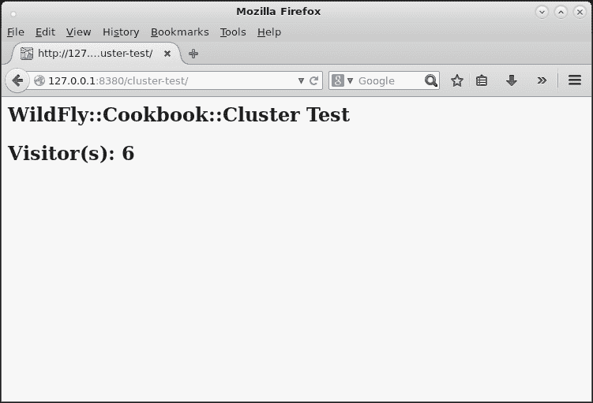

在 TCP 集群中扩展运行在`node-3`上的“cluster-test”应用程序——使用“ha”配置文件的单机模式

好的，一切如预期工作！

## 它是如何工作的……

让我们分析我们所做的。

尽管`standalone.sh`脚本只有少量参数，但主要配置包括正确设置 JGroups 子系统的`stack`元素的`default`属性为 TCP。此外，我们还需要设置集群成员之间如何 ping 对方。默认是`MPING`协议（`M`代表多播）。因此，我们定义了 ping 协议，命名为`TCPPING`，并定义了已知主机（`initial_hosts`属性）。

概念是每个想要加入集群的主机都会向已知主机请求成员信息。如果这些主机没有运行，新节点将无法加入集群。顺便说一句，如果所有集群成员都处于运行状态，而已知主机关闭，集群不会有任何影响；它们只是被视为离开了集群的两个成员。

事实上，在测试通过添加`node-3`和停止前两个节点来扩展 TCP 集群时，我们只会看到`node-3`日志中的以下条目：

```java
23:21:54,480 INFO  [org.infinispan.remoting.transport.jgroups.JGroupsTransport] (Incoming-8,ee,node-3) ISPN000094: Received new cluster view for channel web: [node-3|5] (2) [node-3, node-2]
23:21:57,473 INFO  [org.infinispan.remoting.transport.jgroups.JGroupsTransport] (Incoming-10,ee,node-3) ISPN000094: Received new cluster view for channel web: [node-3|6] (1) [node-3]
```

我们定义的与`<protocol type="TCPPING">...</protocol>`相关的属性如下：

+   `num_initial_members`：在集群被视为完整之前节点的数量。

+   `port_range`：在已知主机未响应的情况下尝试的端口号范围。例如，使用`port_range`为`50`和已知主机`10.0.0.1[7600]`时，新成员将尝试端口`7600`、`7601`、`7602`到`7650`。

+   `timeout`：成员在加入集群之前将等待的超时时间。

# 使用 JGroups 工具测试 UDP 协议

通常情况下，你需要验证和/或认证一个配置，在涉及 UDP 集群的问题时，首先要检查的是 UDP 是否正常工作。

在这个菜谱中，你将学习如何检查 UDP 是否工作，使用图形工具测试，并使用 Java 应用程序（因此没有 UI——这是企业环境的情况）。

## 如何做……

首先，让我们检查我们是否在我们的 WildFly 安装文件夹中有 JGroups 库。

打开你的命令行工具并执行以下命令：

```java
$ find . -name "jgroups*.jar"
./modules/system/layers/base/org/jgroups/main/jgroups-3.6.2.Final.jar
```

太好了！现在我们可以测试它了。

### 图形测试

打开你的命令行工具。

1.  现在执行以下命令：

    ```java
    $ java -cp modules/system/layers/base/org/jgroups/main/jgroups-3.6.2.Final.jar org.jgroups.demos.Draw
    ...
    -------------------------------------------------------------------
    GMS: address=0-44172, cluster=draw-cluster, physical address=fe80:0:0:0:f2de:f1ff:fe99:b294%2:35420
    -------------------------------------------------------------------
    ** View=[0-44172|0] (1) [0-44172]
    ```

    你应该看到以下图像类似的应用程序：

    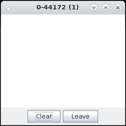

    第一个 JGroups 绘图应用程序

1.  如果你因为 IPv6 而遇到网络问题，尝试通过添加以下参数来强制使用 IPv4：

    ```java
    -Djava.net.preferIPv4Stack=true
    ```

1.  现在，在另一个终端中，执行之前提到的相同命令：

    ```java
    $ java -cp $WILDFLY_HOME/modules/system/layers/base/org/jgroups/main/jgroups-3.6.2.Final.jar org.jgroups.demos.Draw
    ...
    -------------------------------------------------------------------
    GMS: address=0-3647, cluster=draw-cluster, physical address=fe80:0:0:0:f2de:f1ff:fe99:b294%2:40803
    -------------------------------------------------------------------
    ** View=[0-44172|1] (2) [0-44172, 0-3647]

    ```

    从这个第二个命令中，我强调了集群视图，它正在计数两个成员，你现在可以看到相同的应用程序正在运行（括号内的数字也指示集群成员）：

    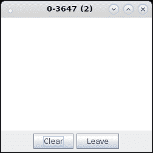

    第二个 JGroups 绘图应用程序

1.  在它上面画些东西，如果你的 UDP 工作正常，你的草图应该会出现在另一个画布上，就像我的这样：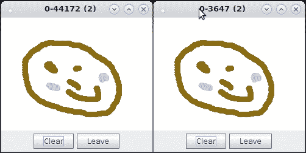

    JGroups 应用程序反映变化

如果你遇到图形测试问题，尝试通过命令行测试 UDP，如下一节所述。

### Shell 测试

打开你的命令行工具：

1.  现在执行以下命令：

    ```java
    $ java -cp $WILDFLY_HOME/modules/system/layers/base/org/jgroups/main/jgroups-3.6.2.Final.jar org.jgroups.tests.McastReceiverTest
    Socket=0.0.0.0/0.0.0.0:5555, bind interface=/172.17.42.1
    Socket=0.0.0.0/0.0.0.0:5555, bind interface=/10.0.1.6
    Socket=0.0.0.0/0.0.0.0:5555, bind interface=/10.0.1.5
    Socket=0.0.0.0/0.0.0.0:5555, bind interface=/10.0.1.4
    Socket=0.0.0.0/0.0.0.0:5555, bind interface=/10.0.1.3
    Socket=0.0.0.0/0.0.0.0:5555, bind interface=/fe80:0:0:0:f2de:f1ff:fe99:b294%em1
    Socket=0.0.0.0/0.0.0.0:5555, bind interface=/10.0.254.33
    Socket=0.0.0.0/0.0.0.0:5555, bind interface=/0:0:0:0:0:0:0:1%lo
    Socket=0.0.0.0/0.0.0.0:5555, bind interface=/127.0.0.1
    ```

    这将启动一个 JGroups 应用程序作为接收器，因此它将监听传入的消息。

1.  再次，如果你因为 IPv6 而遇到网络问题，尝试通过添加以下参数来强制使用 IPv4：

    ```java
    -Djava.net.preferIPv4Stack=true
    ```

1.  现在，在另一个终端中，我们可以称它为 `sender`，执行以下命令：

    ```java
    $ java -cp $WILDFLY_HOME/modules/system/layers/base/org/jgroups/main/jgroups-3.6.2.Final.jar org.jgroups.tests.McastSenderTest
    Socket #1=0.0.0.0/0.0.0.0:5555, ttl=32, bind interface=/172.17.42.1
    Socket #2=0.0.0.0/0.0.0.0:5555, ttl=32, bind interface=/10.0.1.6
    Socket #3=0.0.0.0/0.0.0.0:5555, ttl=32, bind interface=/10.0.1.5
    Socket #4=0.0.0.0/0.0.0.0:5555, ttl=32, bind interface=/10.0.1.4
    Socket #5=0.0.0.0/0.0.0.0:5555, ttl=32, bind interface=/10.0.1.3
    Socket #6=0.0.0.0/0.0.0.0:5555, ttl=32, bind interface=/fe80:0:0:0:f2de:f1ff:fe99:b294%em1
    Socket #7=0.0.0.0/0.0.0.0:5555, ttl=32, bind interface=/10.0.254.33
    Socket #8=0.0.0.0/0.0.0.0:5555, ttl=32, bind interface=/0:0:0:0:0:0:0:1%lo
    Socket #9=0.0.0.0/0.0.0.0:5555, ttl=32, bind interface=/127.0.0.1
    >
    ```

1.  第二个终端将等待标准输入。由于我没有指定任何接口或多播地址，它将绑定到任何可用的接口，在我的情况下，有多个。顺便说一句，让我们尝试输入一些内容并按 *Enter* 键，如下所示：

    ```java
    > Ciao!
    >
    ```

1.  现在看看第一个终端，即我们启动 `receiver` 应用程序的终端：

    ```java
    Ciao! [sender=172.17.42.1:5555]
    Ciao! [sender=10.0.1.6:5555]
    Ciao! [sender=10.0.1.5:5555]
    Ciao! [sender=10.0.1.4:5555]
    Ciao! [sender=10.0.1.3:5555]
    Ciao! [sender=10.0.254.33:5555]
    Ciao! [sender=10.0.254.33:5555]
    Ciao! [sender=127.0.0.1:5555]
    Ciao! [sender=127.0.0.1:5555]
    ```

哟！我们收到了来自所有可用和配置的接口的所有内容。
