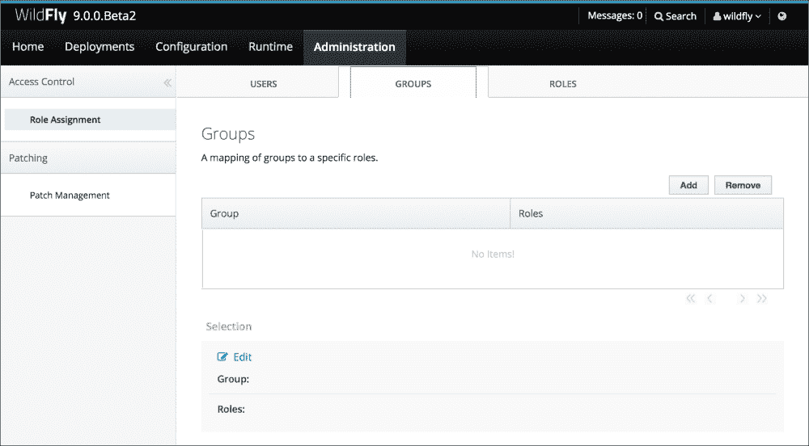

# 第十二章. 使用 WildFly 进行基于角色的访问控制

在本章中，你将学习以下菜谱：

+   在简单和 RBAC 提供者之间切换

+   管理用户、组和它们的角色映射

+   将预定义的角色设置给所有已认证用户

+   通过服务器组或主机范围授予用户访问权限 - 范围角色

+   与 OpenLDAP 集成

# 简介

在本章中，你将学习如何通过提供细粒度的访问控制机制来改进 WildFly 管理控制台。WildFly 附带两个内置提供者：一个是称为 simple，它是默认的；另一个称为 RBAC——正如你所猜到的，它代表**基于角色的访问控制**。

切换到 RBAC 提供者意味着你可以控制用户可以做什么和看到什么，以及用户被允许执行的操作类型。使用 RBAC 提供者，你基本上是在与不同用户分担责任。你可能希望一些用户只进行部署，其他人偶尔监控整个系统，等等。此外，我们将看到如何将 RBAC 与一个提供用户和组的 LDAP 系统（WildFly 角色）集成。

WildFly 附带一组预定义的角色，每个角色都有特定的权限。这些角色如下：

+   **监控员**：正如其名可能暗示的，这个角色只能查看服务器状态，但不能查看敏感数据，如密码。

+   **操作员**：这个角色具有与监控器提供的相同权限，还可以停止和启动服务器，或者暂停运行时服务，如 JMS 目的地。通常，你会将这样的角色授予负责管理特定服务器实例的人员。然而，操作员无法查看敏感数据，如密码。

+   **维护者**：这个角色有权查看和编辑所有运行时状态和所有配置，除了敏感数据。具有这种角色的用户可以管理几乎整个系统。

+   **部署者**：这个角色类似于监控器角色，还可以读取和修改部署的配置和状态。

+   **审计员**：这个角色类似于监控器角色，还可以查看敏感数据。它还可以访问审计日志子系统。

+   **管理员**：这个角色可以做任何事情，查看和修改一切，除了审计日志子系统。管理员还可以配置 RBAC 提供者。

+   **超级用户**：这是最强大的角色。它可以查看和修改资源、状态和敏感数据。这个角色是在引入 RBAC 之前使用的。

这些角色可以组合在一起形成一个角色组，该角色组可以被特定用户使用。

# 在简单和 RBAC 提供者之间切换

在这个菜谱中，我们将学习如何从简单提供者切换到 RBAC 提供者。RBAC 为我们提供了细粒度的访问控制。

## 准备工作

要开始，让我们首先创建一个`ad-hoc`文件夹来运行我们的 WildFly。在终端窗口中，执行以下命令：

```java
$ cd $WILDFLY_HOME
$ cp -a standalone rbac-std-node-1
```

现在是时候运行我们的 WildFly 了！！！

## 如何操作…

执行以下步骤：

1.  打开一个终端窗口并输入以下命令：

    ```java
    $ cd $WILDFLY_HOME
    $ ./bin/standalone.sh -Djboss.server.base.dir=rbac-std-node-1
    ```

1.  一旦启动，在新终端窗口中，连接到 CLI 并切换到 RBAC 提供者，如下所示：

    ```java
    $ cd $WILDFLY_HOME
    $ ./bin/jboss-cli.sh
    You are disconnected at the moment. Type 'connect' to connect to the server or 'help' for the list of supported commands.
    [disconnected /] connect
    [standalone@localhost:9990 /] /core-service=management/access=authorization:write-attribute(name=provider,value=rbac)
    {
        "outcome" => "success",
        "response-headers" => {
            "operation-requires-reload" => true,
            "process-state" => "reload-required"
        }
    }
    [standalone@localhost:9990 /] :reload()
    {
        "outcome" => "success",
        "result" => undefined
    }
    [standalone@localhost:9990 /]
    ```

    太好了，我们成功切换到了 RBAC 提供者。

1.  在我们的`standalone.xml`文件中，我们应该找到以下定义：

    ```java
    <access-control provider="rbac">
        <role-mapping>
            <role name="SuperUser">
                <include>
                    <user name="$local"/>
                </include>
            </role>
        </role-mapping>
    </access-control>
    ```

1.  要切换回`simple`提供者，请按以下操作：

    ```java
    standalone@localhost:9990 /] /core-service=management/access=authorization:write-attribute(name=provider,value=simple)
    {
        "outcome" => "success",
        "response-headers" => {
            "operation-requires-reload" => true,
            "process-state" => "reload-required"
        }
    }
    [standalone@localhost:9990 /] :reload()
    {
        "outcome" => "success",
        "result" => undefined
    }
    [standalone@localhost:9990 /]
    ```

1.  在我们的`standalone.xml`文件中，我们应该找到以下定义：

    ```java
    <access-control provider="simple">
        <role-mapping>
            <role name="SuperUser">
                <include>
                    <user name="$local"/>
                </include>
            </role>
        </role-mapping>
    </access-control>
    ```

就这样，到目前为止相当简单！！！

## 它是如何工作的…

这种方法相当简单直接；除了它的用法之外，没有太多可说的。前面的例子只是第一步。实际上，如果您在切换到`RBAC`提供者后尝试访问控制台，您将无法登录。

尝试一下！！！打开浏览器，将其指向`http://localhost:9990`。输入我们在本书开头指定的用户名和密码：用户名为`wildfly`，密码为`cookbook.2015`。

看吧，您无法登录。如何解决这个问题？

从前面的 XML 代码片段中，您应该已经注意到了指向名为`$local`用户的`include`指令。在这种情况下，`$local`意味着在`ManagementRealm`和`ApplicationRealm`领域中定义的用户，但没有任何权限访问控制台。

我们应该做的是，在`include` XML 元素中添加我们的`wildfly`用户从`ManagementRealm`，如下所示：

```java
[standalone@localhost:9990 /] /core-service=management/access=authorization/role-mapping=SuperUser/include=wildfly:add(name=wildfly,realm=ManagementRealm,type=USER)
{"outcome" => "success"}
[standalone@localhost:9990 /]
```

之前的命令将以下 XML 代码生成到我们的`standalone.xml`文件中：

```java
<access-control provider="rbac">
    <role-mapping>
        <role name="SuperUser">
            <include>
                <user name="$local"/>
                <user alias="wildfly" realm="ManagementRealm" name="wildfly"/>
            </include>
        </role>
    </role-mapping>
</access-control>
```

现在如果我们像往常一样尝试访问控制台，我们应该能够成功登录。

## 还有更多…

无论您选择了哪种提供者，一旦登录，您都可以通过点击显示在 Web 控制台右上角的用户名来查看您用户的角色：


显示当前登录用户的角色

如您所见，我们有一个名为**SuperUser**的角色。再深入一点，有一个有趣的链接**以…运行**，这可能会引起您的兴趣。让我们点击它！


以角色选择角色弹出窗口运行

尝试玩转它，以更好地理解不同的角色和您获得的权限。例如，尝试使用**Monitor**角色部署一个应用程序，或者检查您是否可以查看或编辑数据源的用户名和密码。保持好奇心！

# 管理用户、组和它们的角色映射

在这个菜谱中，您将学习如何管理用户、组和它们与 WildFly 角色的相对映射。我们将从 Web 控制台内部执行大多数任务。

## 准备工作

要开始，让我们首先创建一个`ad-hoc`文件夹来运行我们的 WildFly。在终端窗口中，执行以下命令：

```java
$ cd $WILDFLY_HOME
$ cp -a standalone rbac-std-node-2
```

现在是时候运行我们的 WildFly 了。

## 如何操作…

1.  打开一个终端窗口并输入以下命令：

    ```java
    $ cd $WILDFLY_HOME
    $ ./bin/standalone.sh -Djboss.server.base.dir=rbac-std-node-2
    ```

1.  一旦启动，连接到 CLI 并在新终端窗口中切换到 RBAC 提供者，就像我们之前菜谱中所做的那样：

    ```java
    $ cd $WILDFLY_HOME
    $ ./bin/jboss-cli.sh
    You are disconnected at the moment. Type 'connect' to connect to the server or 'help' for the list of supported commands.
    [disconnected /] connect
    [standalone@localhost:9990 /] /core-service=management/access=authorization:write-attribute(name=provider,value=rbac)
    {
        "outcome" => "success",
        "response-headers" => {
            "operation-requires-reload" => true,
            "process-state" => "reload-required"
        }
    }
    [standalone@localhost:9990 /] :reload()
    {
        "outcome" => "success",
        "result" => undefined
    }
    [standalone@localhost:9990 /]
    ```

1.  现在我们已经成功切换到 RBAC 提供者，我们需要将我们的本地管理用户（如果您一直在跟随这本书，您会知道它是**wildfly**）映射到**超级用户**角色，如下所示：

    ```java
    [standalone@localhost:9990 /] /core-service=management/access=authorization/role-mapping=SuperUser/include=wildfly:add(name=wildfly,realm=ManagementRealm,type=USER)
    {"outcome" => "success"}
    [standalone@localhost:9990 /]
    ```

好的，我们现在可以访问 Web 控制台，并查看我们如何管理用户、组和它们的相关映射。

### 用户

让我们先添加一些用户：

1.  在一个新的终端窗口中，执行以下命令：

    ```java
    $ cd $WILDFLY_HOME
    $ ./bin/add-user.sh --silent=true devguy devguy.2015 -sc rbac-std-node-2/configuration
    $ ./bin/add-user.sh --silent=true opsguy opsguy.2015 -sc rbac-std-node-2/configuration
    $ ./bin/add-user.sh --silent=true devopsguy devopsguy.2015 -sc rbac-std-node-2/configuration
    $ ./bin/add-user.sh --silent=true pmguy pmguy.2015 -sc rbac-std-node-2/configuration
    ```

1.  好的，现在让我们打开浏览器并将它指向`http://localhost:9990`。

1.  以**wildfly**用户登录后，点击管理选项卡，您应该会看到一个类似于以下页面的页面：

    显示 RBAC 用户

1.  我们的**wildfly**用户在那里。让我们通过点击标记为**添加**的按钮，并按照以下方式填写表单来添加用户`devguy`：

    添加用户及其角色的 RBAC 表单

1.  通过点击**保存**按钮进行确认。现在我们应该已经将新用户添加到列表中，如下一张图片所示：

    显示新添加的用户 devguy

1.  如果由于任何原因我们无法访问 Web 控制台，我们可以依赖 CLI，并指定以下命令：

    ```java
    [standalone@localhost:9990 /] /core-service=management/access=authorization/role-mapping=Deployer:add
    {"outcome" => "success"}
    [standalone@localhost:9990 /] /core-service=management/access=authorization/role-mapping=Deployer/include=devguy:add(name=devguy,type=USER,realm=ManagementRealm)
    {"outcome" => "success"}
    [standalone@localhost:9990 /] /core-service=management/access=authorization/role-mapping=Operator:add
    {"outcome" => "success"}
    [standalone@localhost:9990 /] /core-service=management/access=authorization/role-mapping=Operator/include=devguy:add(name=devguy,type=USER,realm=ManagementRealm)
    {"outcome" => "success"}
    [standalone@localhost:9990 /]
    ```

1.  让我们添加其他用户，`opsguy`、`devopsguy`和`pmguy`，并赋予他们适当的角色：

    +   `opsguy`：维护者和操作者的角色

    +   `devopsguy`：管理者的角色

    +   `pmguy`：监控者的角色

1.  您应该有以下列表：

    用户列表

    现在我们已经输入了所有用户，让我们尝试其中一个。

1.  因此，注销并使用用户`pmguy`重新登录。一旦我们回来，让我们转到**部署**选项卡。您会看到一个类似于以下页面的页面：

    没有任何按钮可以更改部署的部署页面

    如您所见，我们无法管理我们的部署，无法删除或禁用它们，也无法部署新的应用程序。

1.  让我们回到我们的**管理**选项卡，看看我们是否可以添加一个更强大的角色：

    管理页面关于授权所需的警告

我们不能；只有具有管理员和超级用户角色的用户才能。

### 组

正如我们所见，每个角色都有特定的权限，关于你可以做什么和不可以做什么，以及你可以看到什么和不可以看到什么。尽管用户角色映射很简单，但你可以在特定组下管理和组合多个角色。

让我们创建两个组：`development`和`operations`：

1.  如果你仍然以`pmguy`用户登录，请注销并使用`wildfly`用户重新登录。

1.  到达那里后，转到**管理**选项卡并点击**组**：

    显示 RBAC 组

1.  通过点击**添加**按钮添加两个组，如下所示：

    创建开发组

1.  在前面的屏幕截图中，我们正在从 WildFly 内置角色列表中选择**部署者**和**操作员**角色，并将它们赋予**开发**组。

    创建操作组

1.  在前面的屏幕截图中，我们正在从 WildFly 内置角色列表中选择**维护者**和**操作员**角色，并将它们分配给**操作**组。

1.  现在，我们的`group-roles`表中应该有以下条目：

    组列表

1.  我们的`standalone.xml`文件应该有如下定义：

    ```java
    <access-control provider="rbac">
        <role-mapping>
            <role name="SuperUser">
                <include>
                    <user name="$local"/>
                    <user alias="wildfly" realm="ManagementRealm" name="wildfly"/>
                </include>
            </role>
            <role name="Deployer">
                <include>
                    <user realm="ManagementRealm" name="devguy"/>
                    <group name="Development"/>
                </include>
            </role>
            <role name="Operator">
                <include>
                    <user realm="ManagementRealm" name="devguy"/>
                    <user realm="ManagementRealm" name="opsguy"/>
                    <group name="Development"/>
                    <group name="Operations"/>
                </include>
            </role>
            <role name="Maintainer">
                <include>
                    <user realm="ManagementRealm" name="opsguy"/>
                    <group name="Operations"/>
                </include>
            </role>
            <role name="Administrator">
                <include>
                    <user realm="ManagementRealm" name="devopsguy"/>
                </include>
            </role>
            <role name="Monitor">
                <include>
                    <user realm="ManagementRealm" 
                    name="pmguy"/>
                </include>
            </role>
        </role-mapping>
    </access-control>
    ```

如您所见，组也已包含在适当的角色中。现在我们需要给一个用户分配一个组。根据我们的配置，我们可以将**开发**组分配给`devguy`用户，将**操作**组分配给`opsguy`。

由于我们正在处理属于**管理域**的用户以从命令行完成此任务，我们可以遵循两种不同的方法：

1.  使用`add-user.sh`脚本再次插入用户，并传递组，如下所示：

    ```java
    $ ./bin/add-user.sh --silent=true devguy devguy.2015 -g Development -sc rbac-std-node-2/configuration
    ```

1.  直接将用户添加到`mgmt-groups.properties`文件中，如下所示：

    ```java
    $ echo "opsguy=Operations" >> rbac-std-node-2/configuration/mgmt-groups.properties
    ```

    ### 注意

    由于我们可能潜在地有数十、数百甚至数千名用户，我们可能不想为每个用户分配一个角色，而是将一组角色映射到一个组中，并将用户映射到该组。这种场景在拥有其用户存储在`Active Directory`或 LDAP 存储的企业中很常见——我们将在本章后面深入探讨集成 LDAP 存储。

话虽如此，让我们移除用户`devguy`和`opsguy`的角色映射。

1.  我们可以通过从 Web 控制台选择用户并点击**移除**按钮来完成此操作。

1.  完成后，我们应该有以下场景：

    用户列表

1.  现在，我们应该能够使用用户`devguy`注销并重新登录。

1.  完成后，让我们点击页面右上角的`devguy`链接，我们应该看到他的角色，如下所示：

    显示用户的角色

让我们用另一个用户`opsguy`试一试。如果一切顺利，我们应该也能看到他的角色。

## 它是如何工作的...

用户和组管理通过 Web 控制台简化；尽管如此，我们仍然需要在 Web 控制台之外完成一些任务，例如将用户映射到组。顺便说一句，这里的主要过程是：

+   我们需要一个能够访问 RBAC 管理页面并添加/删除用户和组的用户——就像我们的 WildFly 超级用户一样。

+   我们需要添加用户或组并将它们映射到适当的角色

+   用户必须存在于存储中，如属性文件和 LDAP（WildFly 支持这两个存储）；我们使用`add-user.sh`脚本来静默添加用户，包括他们的域。

# 为所有已认证用户设置预定义的角色

在这个菜谱中，你将学习如何将预定义的角色分配给所有已认证的用户。当你的用户基数很大，且无法完全查看身份存储中所有用户和组时，这个设置可能很有用。因此，与其不授权某些用户，你可能会想给他们最简单和最少的权限。

## 准备工作

要开始，让我们首先创建一个`ad-hoc`文件夹来运行我们的 WildFly。在终端窗口中执行以下命令：

```java
$ cd $WILDFLY_HOME
$ cp -a standalone rbac-std-node-3
```

现在是时候运行我们的 WildFly 了！

## 如何操作…

1.  打开一个终端窗口并输入以下命令：

    ```java
    $ cd $WILDFLY_HOME
    $ ./bin/standalone.sh -Djboss.server.base.dir=rbac-std-node-3
    ```

1.  一旦启动，在新终端窗口中连接到 CLI 并切换到 RBAC 提供者，就像我们之前的方法一样：

    ```java
    $ cd $WILDFLY_HOME
    $ ./bin/jboss-cli.sh
    You are disconnected at the moment. Type 'connect' to connect to the server or 'help' for the list of supported commands.
    [disconnected /] connect
    [standalone@localhost:9990 /] /core-service=management/access=authorization:write-attribute(name=provider,value=rbac)
    {
        "outcome" => "success",
        "response-headers" => {
            "operation-requires-reload" => true,
            "process-state" => "reload-required"
        }
    }
    [standalone@localhost:9990 /] :reload()
    {
        "outcome" => "success",
        "result" => undefined
    }
    [standalone@localhost:9990 /]
    ```

1.  现在我们已经成功切换到 RBAC 提供者，我们需要将我们的本地管理用户（如果您正在遵循本书，本地管理用户是`wildfly`）映射到**SuperUser**角色，如下所示：

    ```java
    [standalone@localhost:9990 /] /core-service=management/access=authorization/role-mapping=SuperUser/include=wildfly:add(name=wildfly,realm=ManagementRealm,type=USER)
    {"outcome" => "success"}
    [standalone@localhost:9990 /]
    ```

1.  现在我们需要添加一些用户，只是为了模拟我们没有考虑为系统提供访问权限的用户；在新的终端窗口中，执行以下命令：

    ```java
    $ cd $WILDFLY_HOME
    $ ./bin/add-user.sh --silent=true luigi luigi.2015 -sc rbac-std-node-3/configuration
    $ ./bin/add-user.sh --silent=true fabio fabio.2015 -sc rbac-std-node-3/configuration
    $ ./bin/add-user.sh --silent=true stefano stefano.2015 -sc rbac-std-node-3/configuration
    ```

    好的，我们现在可以访问 Web 控制台并查看我们如何通过给他们默认角色来管理这类用户。

1.  让我们打开浏览器并将它指向`http://localhost:9990`。

1.  使用`wildfly`用户进行认证，一旦登录，点击**管理**标签，然后点击**角色**部分。

1.  然后，选择**Monitor**角色，点击**编辑**链接，并标记**包含所有**复选框，如下所示：

    为所有已认证用户分配默认角色

1.  一旦您点击**保存**，所选角色将被分配给所有已认证用户的默认角色。

    角色列表

1.  如果我们没有访问 Web 控制台，我们仍然可以依赖我们的 CLI 并发出以下命令：

    ```java
    [standalone@localhost:9990 /] /core-service=management/access=authorization/role-mapping=Monitor:write-attribute(name=include-all,value=true)
    {"outcome" => "success"}
    [standalone@localhost:9990 /]
    ```

1.  好的，让我们通过注销并使用用户`luigi`重新登录来尝试我们的设置。打开浏览器并将它指向`http://localhost:9990`。

1.  将`luigi`作为用户名，将`luigi.2015`作为密码；我们应该得到以下场景：

    用户 luigi 映射到默认角色 Monitor

很棒！

## 它是如何工作的…

由于过程相当直接，没有太多可说的。让我们回顾一下我们做了什么以及我们是如何做的。

首先，我们需要切换提供者，使用 CLI 将`simple`切换到`rbac`。

其次，我们需要将我们的管理用户`wildfly`添加到**SuperUser**角色中，这导致了以下配置：

```java
<access-control provider="rbac">
    <role-mapping>
        <role name="SuperUser">
            <include>
                <user name="$local"/>
                <user alias="wildfly" realm="ManagementRealm" name="wildfly"/>
            </include>
        </role>
    </role-mapping>
</access-control>
```

然后，我们使用`add-user.sh`脚本将潜在的非管理用户添加到`ManagementRealm`域中：

```java
$ cd $WILDFLY_HOME
$ ./bin/add-user.sh --silent=true luigi luigi.2015 -sc rbac-std-node-3/configuration
$ ./bin/add-user.sh --silent=true fabio fabio.2015 -sc rbac-std-node-3/configuration
$ ./bin/add-user.sh --silent=true stefano stefano.2015 -sc rbac-std-node-3/configuration
```

`--silent=true`命令基本上意味着非交互模式；然后我们传递用户名和密码，然后我们指定存储用户的路径。默认情况下，存储由`mgmt-users.properties`文件表示，对应于 WildFly 侧的`ManagementRealm`。

如果我们想要将用户存储在`ApplicationRealm`中，我们应该在脚本中传递了选项`-a`。此外，如果我们想要将用户的凭据存储到不同的文件中，我们可以传递选项`-up /path/filename.properties`。

要获取所有可用选项的完整列表，请运行`add-user.sh`脚本并传递`--help`指令，如下所示：

```java
$ ./bin/add-user.sh –help
```


最后，我们将监控角色设置为所有已认证用户的默认角色。

# 通过服务器组或主机授予用户访问权限 - 作用域角色

在这个食谱中，您将学习如何仅授予用户在特定服务器组或主机上的访问权限。显然，此功能仅在域模式下可用。这个特性被称为作用域角色，当您需要与多个团队（如开发团队）共享环境时非常有用。这样，每个团队实际上都可以在其服务器组或专用主机上工作，而不会干扰其他服务器组或主机。

## 准备工作

要开始，让我们首先创建一个`ad-hoc`文件夹来运行我们的 WildFly。在终端窗口中输入以下命令：

```java
$ cd $WILDFLY_HOME
$ cp -a domain rbac-dmn-scp-roles
```

现在是时候运行我们的 WildFly 了。

## 如何操作…

1.  打开一个终端窗口并执行以下命令：

    ```java
    $ cd $WILDFLY_HOME
    $ ./bin/domain.sh -Djboss.domain.base.dir=rbac-dmn-scp-roles
    ```

1.  一旦开始，在一个新的终端窗口中连接到 CLI，并切换到 RBAC 提供者，就像我们在前面的食谱中所做的那样：

    ```java
    $ cd $WILDFLY_HOME
    $ ./bin/jboss-cli.sh
    You are disconnected at the moment. Type 'connect' to connect to the server or 'help' for the list of supported commands.
    [disconnected /] connect
    [domain@localhost:9990 /] /core-service=management/access=authorization:write-attribute(name=provider,value=rbac)
    {
        "outcome" => "success",
        "response-headers" => {
            "operation-requires-reload" => true,
            "process-state" => "reload-required"
        },
        "result" => undefined,
        "server-groups" => {"main-server-group" => {"host" => {"master" => {
            "server-one" => {"response" => {
                "outcome" => "success",
                "response-headers" => {
                    "operation-requires-reload" => true,
                    "process-state" => "reload-required"
                }
            }},
            "server-two" => {"response" => {
                "outcome" => "success",
                "response-headers" => {
                    "operation-requires-reload" => true,
                    "process-state" => "reload-required"
                }
            }}
        }}}}
    }
    [domain@localhost:9990 /] reload --host=master
    [domain@localhost:9990 /]
    ```

1.  现在我们已经成功切换到 RBAC 提供者，我们需要将我们的`wildfly`用户映射到**超级用户**角色，如下所示：

    ```java
    [domain@localhost:9990 /] /core-service=management/access=authorization/role-mapping=SuperUser/include=wildfly:add(name=wildfly,realm=ManagementRealm,type=USER)
    {
        "outcome" => "success",
        "result" => undefined,
        "server-groups" => {"main-server-group" => {"host" => {"master" => {
            "server-one" => {"response" => {"outcome" => 
        "success"}},
            "server-two" => {"response" => {"outcome" => "success"}}
        }}}}
    }
    [domain@localhost:9990 /]
    ```

    现在，我们可以登录到我们的 WildFly 控制台并创建所谓的`scoped-roles`。

1.  登录到 WildFly Web 控制台并转到**管理**选项卡。然后选择**角色**子选项卡，并选择**作用域角色**部分。页面如下所示：

    作用域角色的管理页面

1.  现在，点击**添加**按钮并填写以下截图所示的信息：

    作用域角色添加表单

1.  一旦您通过点击**保存**按钮提交表单，作用域角色将被插入并按照以下列表显示：

    显示 dev-team-one 作用域角色的列表

现在，是时候创建一个用户并将其映射到之前步骤中创建的作用域角色了。

1.  打开一个终端并执行以下命令：

    ```java
    $ cd $WILDFLY_HOME
    $ ./bin/add-user.sh --silent=true user-dev-1 devguy.2015 -sc rbac-dmn-scp-roles/configuration
    ```

    现在，我们可以将该用户添加到`dev-team-one`作用域角色中。

1.  让我们回到 WildFly Web 控制台，选择**管理**选项卡，然后选择**用户**子选项卡，并点击**添加**按钮。填写以下图像所示的信息：

1.  保存您的更改后，您应该有如下列表：

1.  现在，我们可以使用`user-dev-1`用户和密码`devguy.2015`注销并重新登录。

    现在，如果您转到**域**选项卡，在**概览**部分（左侧的菜单项），您将只看到您所属的服务器组的拓扑结构，如下截图所示：

    

就这样！

## 它是如何工作的…

关于这个过程没有太多可说的，因为它相当直接。让我们回顾一下我们做了什么以及我们是如何做的。

首先，我们需要切换提供者，从`simple`切换到`rbac`提供者，使用 CLI。

其次，我们需要将我们的管理用户`wildfly`添加到**SuperUser**角色，这导致了以下配置：

```java
<access-control provider="rbac">
  <role-mapping>
    <role name="SuperUser">
      <include>
        <user name="$local"/>
        <user alias="wildfly" realm="ManagementRealm" name="wildfly"/>
      </include>
    </role>
  </role-mapping>
</access-control>
```

然后，我们以用户`wildfly`的身份登录到 WildFly Web 控制台，并添加了我们的第一个范围角色。我们将范围角色映射到名为`main-server-group`的服务器组，其基本角色为`Deployer`。

我们还可以通过在**类型**选择组件中指定`Host`，将我们的范围角色映射到主机，如下所示：


如您所见，角色的范围将与我们的配置中可用的主机名相匹配，即在我们的情况下是`master`。

然后，我们使用`add-user.sh`脚本添加了一个用户：

```java
$ cd $WILDFLY_HOME
$ ./bin/add-user.sh --silent=true user-dev-1 devguy.2015 -sc rbac-dmn-scp-roles/configuration
```

`--silent=true`命令基本上意味着非交互模式；然后我们传递用户名和密码，然后指定存储用户的路径。默认情况下，存储由`mgmt-users.properties`文件表示，对应于 WildFly 侧的`ManagementRealm`。

最后，我们将`user-dev-1`映射到范围角色，并使用它登录。

因此，WildFly Web 控制台仅对指定在范围角色中的服务器组可用，相应地，它被分配了`Deployer`角色。

# 与 OpenLDAP 集成

在这个配方中，你将学习如何集成 OpenLDAP 为我们的 RBAC 提供者提供一个用户基础。在企业环境中，你通常会发现公司存储其用户的数据库。这些数据库通常具有某种结构，为每个用户定义角色、配置文件和/或组。

例如，连接到服务器的用户可能看到或不看到某些文件或目录。访问应用程序的用户可能找到或不找到特定的功能；这可能就是 WildFly Web 控制台的情况。LDAP 是一种由许多数据库使用的协议，用于存储这些用户的权限。有许多这样的数据库，例如 Microsoft Active Directory，但为了保持我们与开源世界的同步，我们将查看和使用 OpenLDAP 工具。

## 准备工作

对于这个配方，你将使用一个现成的 OpenLDAP 服务器，因为 OpenLDAP 服务器的安装超出了本书的范围。

尽管如此，我们仍将使用以下 LDIF 文件中定义的 LDAP 结构：

+   [`raw.githubusercontent.com/foogaro/wildfly-cookbook/master/rbac.ldif`](https://raw.githubusercontent.com/foogaro/wildfly-cookbook/master/rbac.ldif)

顺便说一下，如果您想深入了解 OpenLDAP，您可以依靠优秀的书籍《Mastering OpenLDAP: Configuring, Securing and Integrating Directory Services》，作者：*Matt Butcher*，出版社：*Packt Publishing*。

要开始，我们首先创建一个`ad-hoc`文件夹来运行我们的 WildFly。在终端窗口中输入以下命令：

```java
$ cd $WILDFLY_HOME
$ cp -a standalone rbac-std-ldap
```

现在是时候运行我们的 WildFly 了。

## 如何做到这一点…

1.  打开一个终端窗口并执行以下命令：

    ```java
    $ cd $WILDFLY_HOME
    $ ./bin/standalone.sh -Djboss.server.base.dir=rbac-std-ldap
    ```

1.  一旦启动，在一个新的终端窗口中，连接到 CLI 并切换到 RBAC 提供者，就像我们在之前的菜谱中所做的那样：

    ```java
    $ cd $WILDFLY_HOME
    $ ./bin/jboss-cli.sh
    You are disconnected at the moment. Type 'connect' to connect to the server or 'help' for the list of supported commands.
    [disconnected /] connect
    [standalone@localhost:9990 /] /core-service=management/access=authorization:write-attribute(name=provider,value=rbac)
    {
        "outcome" => "success",
        "response-headers" => {
            "operation-requires-reload" => true,
            "process-state" => "reload-required"
        }
    }
    [standalone@localhost:9990 /] :reload()
    {
        "outcome" => "success",
        "result" => undefined
    }
    [standalone@localhost:9990 /]
    ```

1.  现在我们已经成功切换到 RBAC 提供者，我们需要将我们的本地管理用户（如果你在遵循这本书，你会知道它是`wildfly`）映射到**超级用户**角色，如下所示：

    ```java
    [standalone@localhost:9990 /] /core-service=management/access=authorization/role-mapping=SuperUser/include=wildfly:add(name=wildfly,realm=ManagementRealm,type=USER)
    {"outcome" => "success"}
    [standalone@localhost:9990 /]
    ```

1.  现在我们已经完全切换到 RBAC 提供者，我们需要配置 LDAP 连接及其分组过滤器。停止 WildFly，打开`standalone.xml`文件，然后添加以下`security-realm`：

    ```java
    <security-realm name="LDAPRealm">
        <authentication>
            <ldap connection="ldap" base-dn="ou=Users,dc=example,dc=com">
                <username-filter attribute="uid"/>
            </ldap>
        </authentication>
        <authorization>
            <ldap connection="ldap">
                <group-search group-name="SIMPLE" 
                iterative="true" group-dn-attribute="dn" group-name-attribute="cn">
                    <group-to-principal base-
                    dn="ou=Groups,dc=example,dc=com" recursive="true" search-by="DISTINGUISHED_NAME">
                        <membership-filter principal-attribute="uniqueMember" />
                    </group-to-principal>
                </group-search>
            </ldap>
        </authorization>
    </security-realm>
    ```

1.  现在，就在`</security-realms>` XML 关闭标签之后，添加以下内容：

    ```java
    <outbound-connections>
        <ldap name="ldap" url="ldap://localhost:389" search-dn="cn=Manager,dc=example,dc=com" search-credential="ldap.2015"/>
    </outbound-connections>
    ```

将区分名称（`dn`属性）映射到适合您当前 LDAP 系统的任何内容。对于表示`admin`用户密码的`search-credential`属性（在`dn`属性的开头指定）：`cn=Manager`。

还要注意，在生产环境中，你会使用 SSL 上的 LDAP 协议，以安全的方式传输凭据。因此，URL 将是`ldaps://secureldap.intranet:636`。

保持`standalone.xml`文件打开，并应用以下更改：

1.  找到以下定义：

    ```java
    <management-interfaces>
        <http-interface security-realm="ManagementRealm" http-upgrade-enabled="true">
            <socket-binding http="management-http"/>
        </http-interface>
    </management-interfaces>
    ```

1.  用以下内容替换它：

    ```java
    <management-interfaces>
        <http-interface security-realm="LDAPRealm" http-
        upgrade-enabled="true">
            <socket-binding http="management-http"/>
        </http-interface>
    </management-interfaces>
    ```

要将 LDAP 与 RBAC 集成到我们的管理控制台，我们只需做这些。

我已经使用`rbac.ldif`文件填充了 OpenLDAP 服务器，并将`user1`引用到了 OpenLDAP 本身的自定义组中。以下是一个此类配置的提取：

```java
# Development Group:
dn: cn=Developers,ou=Groups,dc=example,dc=com
cn: Developers
ou: Groups
description: Users who are Developers
uniqueMember: uid=user1,ou=Users,dc=example,dc=com
uniqueMember: uid=user3,ou=Users,dc=example,dc=com
uniqueMember: uid=user5,ou=Users,dc=example,dc=com
objectClass: groupOfUniqueNames

# Operational Group:
dn: cn=Operational,ou=Groups,dc=example,dc=com
cn: Operational
ou: Groups
description: Users who are Operational
uniqueMember: uid=user1,ou=Users,dc=example,dc=com
uniqueMember: uid=user2,ou=Users,dc=example,dc=com
objectClass: groupOfUniqueNames
```

现在我们需要将 OpenLDAP 组映射到 WildFly 的内置角色，如*管理用户、组和它们的角色映射*菜谱中所述，以便`user1`将拥有**部署者**、**操作员**和**维护者**的角色。请按照以下图像所示绑定组和角色：


现在，如果你尝试使用用户`user1`注销并重新登录到 WildFly Web 控制台，你将首先被提示输入 LDAPRealm 的凭据，如图所示：


接下来，你将使用适当的角色登录，如图所示：


如您所见，用户`user1`以**操作员**、**维护者**和**部署者**的角色登录。

## 它是如何工作的…

首先，我们需要切换提供者，使用 CLI 从`simple`切换到`rbac`。

其次，我们需要将我们的管理用户`wildfly`包含到`SuperUser`角色中，这导致了以下配置：

```java
<access-control provider="rbac">
    <role-mapping>
        <role name="SuperUser">
            <include>
                <user name="$local"/>
                <user alias="wildfly" realm="ManagementRealm" name="wildfly"/>
            </include>
        </role>
    </role-mapping>
</access-control>
```

然后，我们添加了一个名为 LDAPRealm 的新安全域。在其中，我们定义了身份验证和授权过程，这涉及到设置适当的 LDAP 区分名称。

为了连接到 LDAP，我们必须使用 outbound-connections 指令创建一个连接引用。

最后，我们将 HTTP 管理接口，即 WildFly 控制台，映射到 LDAPRealm 域。

由于`rbac.ldif`文件的架构，其中用户所属的组映射到该组本身，我们不得不指导使用`group-search`元素而不是`user-to-dn`元素。
