# 第一章。安装 WildFly

自 Java 首次发布以来，Java 语言经历了许多变化，并将继续适应以满足开发者的需求。2010 年收购 Sun 的 Oracle 表示，其高级 Java 策略是增强和扩展 Java 到新的和新兴的软件开发目标；简化、优化并将 Java 平台集成到新的部署架构中；以及投资于 Java 开发者社区，以增加参与度。

这在 Java 企业版中确实如此，其重点是提高开发者的生产力，提供对 HTML5 的支持，并满足企业需求。在所有企业 Java 版本中，Java EE 7 是最透明且最开放于社区参与的。通过允许公开反馈，社区的需求可以得到实现并用于帮助塑造 Java EE 7，从而最终促进企业 Java 的增长和成功。

此外，应用程序服务器内部使用了大量开源项目，例如 Hibernate 和 Undertow。整合所有这些库并非没有代价，因为每个库都随着复杂性的增加而需要越来越多的附加库来工作。

如大多数 IT 专家所同意，今天应用程序服务器的挑战在于结合客户所需的一套丰富功能，以及轻量级和灵活的容器配置。

# WildFly 8 的新特性有哪些？

WildFly 8 是 JBoss AS 项目的直接延续。对 JBoss AS 社区版本的更名是为了减少开源 JBoss 服务器、JBoss 社区和 **JBoss 企业应用平台**（**JBoss EAP**）之间的混淆。WildFly 8 是免费和开源的，由 JBoss 社区提供支持，而 JBoss EAP 是一个带有 RedHat 支持的授权产品。

WildFly 8 相较于早期版本最显著的更新如下：

+   **Java EE7 认证**：WildFly 是一个完全符合 Java EE 企业服务器的产品，这意味着它为构成 Java EE 7 的所有 **Java 规范请求**（**JSRs**）提供了参考实现。JSRs 基本上是针对 Java 语言的变更请求。有关 JSRs 如何工作的更多信息，请参阅 [`www.jcp.org/en/jsr/overview`](https://www.jcp.org/en/jsr/overview)。

+   **Undertow 的到来**：JBoss Web 已完全移除并替换为 Undertow。Undertow 是一个支持非阻塞和阻塞处理程序、WebSocket 和异步 Servlet 的前沿 Web 服务器。它被设计用于可扩展性和最大吞吐量。它易于使用，易于配置，并且高度可定制。

+   **端口减少**：WildFly 中的开放端口数量已大幅减少。只有两个端口开放：8080 和 9990。这是通过使用 Undertow 的 HTTP 升级功能在 HTTP 上多路复用协议来实现的。

+   **安全管理器**：你现在可以按部署配置安全权限。

+   **日志记录**：WildFly 日志记录已经进行了多项增强。你现在可以通过管理界面查看日志文件，定义自定义格式化程序，并按部署配置日志记录。

+   **集群**：WildFly 的集群进行了大量重构，并包括许多新特性，包括 Web 会话、单点登录和 Undertow 的 mod_cluster 支持。还有一个新的公共集群 API 和新的@Stateful EJB 缓存实现。

+   **命令行界面（CLI）**：你现在在连接到服务器时可以定义别名，CLI GUI 还增加了额外的功能，允许你探索树中的任何节点。

在本章中，我们将涵盖以下主题：

+   安装 Java 环境

+   安装 WildFly 8

+   安装 JBoss 工具

+   探索应用服务器文件系统

+   理解 WildFly 内核

# 开始使用应用服务器

在硬件要求方面，你应该知道，在撰写本文时，服务器发行版需要大约 150 MB 的硬盘空间，并为独立服务器分配了最小 64 MB 和最大 512 MB。

为了开始，我们将执行以下步骤：

1.  下载并安装 Java 开发工具包。

1.  下载并安装 WildFly 8。

1.  下载并安装 Eclipse 开发环境。虽然我们将在本书中使用 Eclipse，但你完全可以选择你喜欢的 IDE。

在本章结束时，你将安装所有必要的软件，并准备好开始使用应用服务器。

## 安装 Java 环境

WildFly 是用 Java 编写的；因此，它需要一个**Java 虚拟机**（**JVM**）来运行，以及标准版 Java 库。因此，在我们开始设置或学习 WildFly 之前，我们首先需要安装**Java 开发工具包**（**JDK**）。

要使用 WildFly，你需要至少 Java SE 7 或更高版本。尽管在 WildFly 8.x 源代码中没有计划使用 Java 8 语言变更，但 WildFly 是针对 Java 8 编译的。建议您使用 Java SE 8 的最新版本来运行 WildFly。

因此，让我们转到 Oracle 下载页面，[`www.oracle.com/technetwork/java/javase/downloads/index.html`](http://www.oracle.com/technetwork/java/javase/downloads/index.html)，它现在托管所有 JDK 下载，如下面的截图所示：

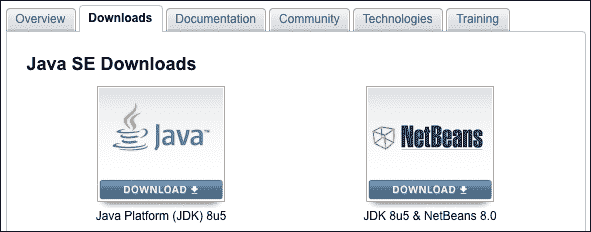

这将带你去最新 JDK 的下载页面。在撰写本文时，这是 Java 8 更新 5。在下载 JDK 之前，你需要接受许可协议。选择下载适用于你操作系统的最新 Java 版本。查看以下截图：

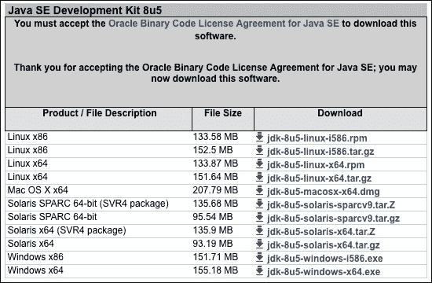

下载时间取决于你的网络速度。

### 在 Linux 上安装 Java

在 Linux 上安装 Java 非常简单。下载完成后，将`tar.gz`文件解压到您选择的安装位置。以下命令将存档提取到您的当前目录：

```java
tar -xzvf jdk-8u5-linux-x64.tar.gz

```

接下来，您需要将路径添加到环境变量中。这可以通过将以下行添加到您的用户配置文件脚本（位于您家目录中的`.profile`文件）来实现：

```java
export JAVA_HOME=/installDir/jdk1.8.0_05
export PATH=$JAVA_HOME/bin:$PATH

```

### 在 Windows 上安装 Java

Windows 用户可以直接运行可执行文件（`.exe`）来启动安装。安装程序的名字取决于操作系统和您的系统架构（32 位或 64 位）；然而，步骤将是相同的——只是名字会变化。在撰写本文时，64 位 Windows 上最新版本的 Java 安装程序名为`jdk-8u5-windows-x64.exe`。

当使用 Windows 时，您应该避免包含空格的安装路径，例如`C:\Program Files`，因为这会导致在引用核心库时出现一些问题。`C:\Software\Java`或简单的`C:\Java`是一个更好的选择。

安装完成后，您需要更新计算机上的几个设置，以便它知道 Java 的位置。最重要的设置是`JAVA_HOME`，它直接被 WildFly 启动脚本引用。

如果您正在运行 Windows XP/2000，请按照以下步骤操作：

1.  右键点击**我的电脑**，从上下文菜单中选择**属性**。

1.  在**高级**选项卡上，点击**环境变量**按钮。

1.  然后，在**系统变量**框中，点击**新建**。

1.  将新变量命名为`JAVA_HOME`，并给出 JDK 安装路径的值；我建议像`C:\Java\jdk1.8.0_05`这样的路径。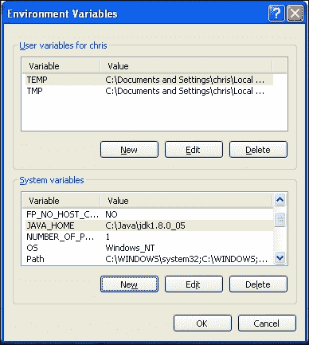

    ### 提示

    **Windows 7 技巧**

    由于 Windows 7 的安全性提高，标准用户必须开启**用户账户控制**（**UAC**）以更改环境变量，并且更改必须通过用户账户完成。在**用户账户**窗口中，在**任务**下选择**更改我的环境变量**。使用**新建**、**编辑**或**删除**按钮来修改环境变量。

1.  现在是时候修改系统的`PATH`变量了。双击`PATH`系统变量。在弹出的框中，导航到**变量值**行的末尾，添加一个分号，然后添加您的 JDK 路径。这将是类似`%JAVA_HOME%\bin`的东西。

## 安装 WildFly 8

WildFly 应用程序服务器可以从 WildFly 网站免费下载，[`www.wildfly.org/downloads/`](http://www.wildfly.org/downloads/)。请查看以下截图：

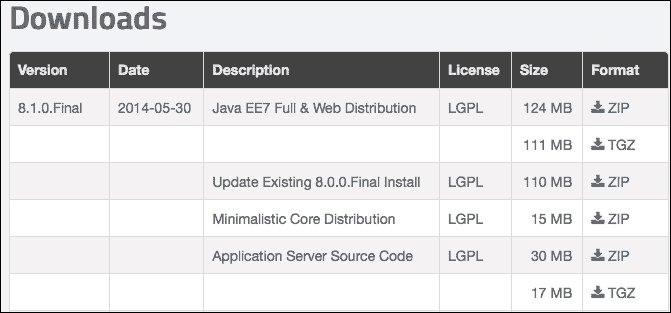

你会注意到有一个选项可以下载一个简约的核心发行版。这个版本是为那些想要使用 WildFly 8 架构构建自己的应用程序运行时环境的开发者准备的。

选择下载完整的 Java EE7 发行版。与 JBoss AS 7 一样，WildFly 不附带安装程序。只需将压缩存档提取到您选择的任何位置即可。

Linux 用户可以使用`tar`或`unzip`命令提取文件（取决于您下载的压缩文件类型）：

```java
tar -xzvf wildfly-8.1.0.Final.tar.gz
unzip wildfly-8.1.0.Final.zip

```

对于使用 Windows 的用户，您可以使用 WinZip 或 WinRAR，注意选择一个不包含空格的文件夹。

### 小贴士

**安全警告**

Unix/Linux 用户应该知道，WildFly 不需要 root 权限，因为 WildFly 使用的默认端口都不低于 1024 的特权端口范围。为了降低用户通过 WildFly 获得 root 权限的风险，请以非 root 用户安装并运行 WildFly。

## 开始启动 WildFly

安装 WildFly 后，进行简单的启动测试以验证您的 Java 配置没有问题是很明智的。要测试您的安装，请转到 WildFly 安装的`bin`目录，并执行以下命令：

+   对于 Linux/Unix 用户：

    ```java
    $ ./standalone.sh

    ```

+   对于 Windows 用户：

    ```java
    > standalone.bat

    ```

以下截图显示了 WildFly 8 的启动控制台：

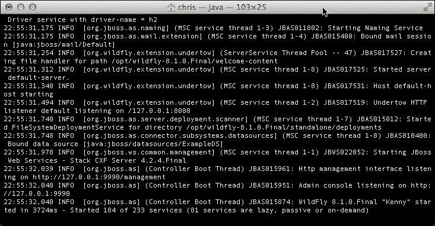

以下命令启动了一个与 JBoss AS 7 之前版本中使用的`run.sh`脚本启动应用程序服务器等效的 WildFly 独立实例。`run.sh`文件仍然位于 WildFly 的`bin`目录中，但它只是一个占位符，不会启动应用程序服务器。

注意应用程序服务器启动有多快。这是由于 WildFly 的模块化架构。在启动时，关键服务并发启动，非关键服务仅在需要时启动，从而实现了极快的启动速度。本地缓存意味着服务器在第二次启动时将更快！

如果您需要自定义应用程序服务器的启动属性，则需要打开并修改`standalone.conf`文件（或 Windows 用户的`standalone.conf.bat`）。此文件包含 WildFly 的内存需求。以下是它的 Linux 核心部分：

```java
if [ "x$JAVA_OPTS" = "x" ]; then
   JAVA_OPTS="-Xms64m -Xmx512m -XX:MaxPermSize=256m -Djava.net.preferIPv4Stack=true"
   JAVA_OPTS="$JAVA_OPTS -Djboss.modules.system.pkgs=$JBOSS_MODULES_SYSTEM_PKGS -Djava.awt.headless=true"
fi
```

### 小贴士

**Java SE 8 用户**

在 Java 8 中，PermGen 已被 Metaspace 取代。如果您使用的是 Java 8，请从`standalone.conf`文件中删除`-XX:MaxPermSize=256m`属性，并将其替换为`-XX:MaxMetaspaceSize=256m`。这将防止在启动时将 VM 警告打印到您的 WildFly 日志中。

默认情况下，应用程序服务器以 64 MB 的最小堆空间内存需求和 512 MB 的最大需求启动。这足以开始使用；然而，如果您需要在上面运行核心 Java EE 应用程序，您可能至少需要 1 GB 的堆空间。更现实地说，根据您的应用程序类型，您可能需要 2 GB 或更多。一般来说，32 位机器无法执行超过 4 GB 空间的过程；然而，在 64 位机器上，处理过程的大小实际上没有限制。

你可以通过将浏览器指向应用服务器的欢迎页面来验证服务器是否可以从网络访问，默认情况下，该页面可以通过以下知名地址访问：`http://localhost:8080`。请查看以下截图：

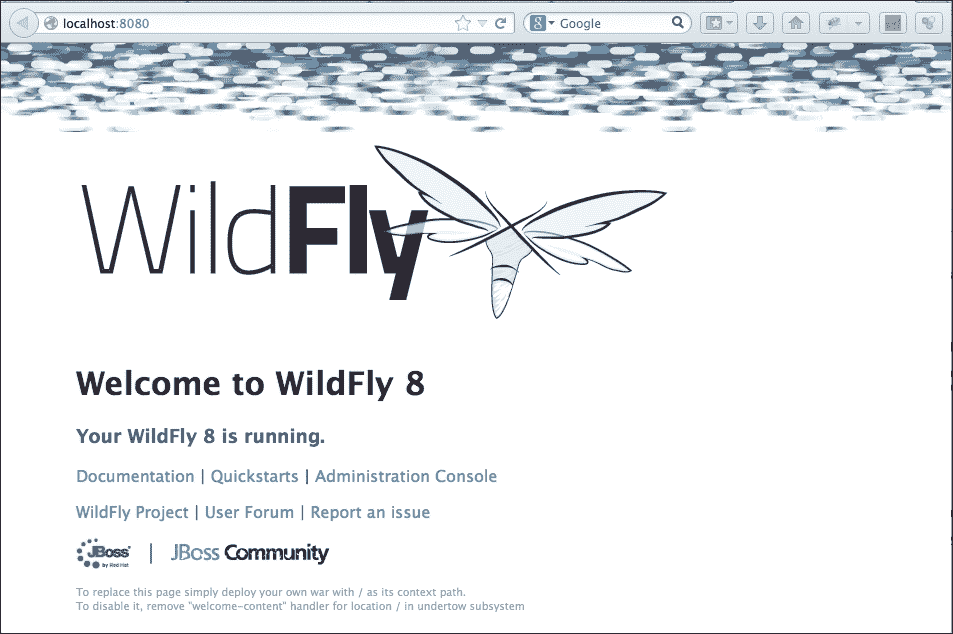

### 使用命令行界面连接到服务器

如果你之前使用过 JBoss AS 7 之前的版本的应用服务器，你可能听说过 `twiddle` 命令行工具，该工具可以查询应用服务器上安装的 MBeans。这个工具在 JBoss AS 7 中被替换，但在 WildFly 中仍然被使用。它的替代品是一个更复杂的界面，称为 **命令行界面**（**CLI**），可以在 `JBOSS_HOME/bin` 文件夹中找到。

### 提示

**关于 JBOSS_HOME 的引用**

尽管 JBoss AS 的社区版本已被重命名为 WildFly，但你将看到启动脚本中的属性仍然使用属性 `JBOSS_HOME` 来引用 WildFly 的安装目录。因此，当我们提到 WildFly 的根安装时，我们将继续使用 `JBOSS_HOME`。 

只需启动 `jboss-cli.sh` 脚本（对于 Windows 用户是 `jboss-cli.bat`），你就可以通过 shell 界面管理应用服务器，如以下截图所示。请注意，服务器需要运行才能通过 CLI 连接。

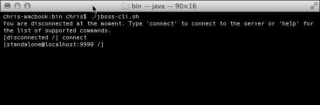

一旦你进入了 shell 会话，如果你不确定可以发出哪些命令，你可以简单地按一下 *Tab* 键来显示所有可能的命令。如果你的命令部分输入，并且只有一个可能的匹配命令，你的命令将会自动完成。那些使用 Linux 的用户会对这种命令行辅助方式感到熟悉。

在前面的截图中，我们刚刚使用 `connect` 命令连接到服务器，默认情况下，该命令使用回环服务器地址，并连接到端口号 9990。

### 注意

CLI 在 第七章 中进行了深入讨论，*使用管理接口*，这是关于服务器管理接口的全部内容。在接下来的几节中，我们将初步了解其基本功能，以便让你熟悉这个强大的工具。

## 停止 WildFly

可能停止 WildFly 的一种最简单的方法是使用 *Ctrl* + *C* 发送中断信号。这应该在发出启动命令的同一控制台窗口中完成，即服务器运行的地方。

然而，如果你的 WildFly 进程是在后台启动的或者运行在另一台机器上（见以下章节），那么你可以使用 CLI 界面立即发出 `shutdown` 命令，如下所示：

```java
[disconnected /] connect
[standalone@localhost:9990 /] shutdown
[disconnected /]

```

### 定位关闭脚本

实际上还有一个选项可以关闭应用程序服务器，这在您需要从脚本中关闭服务器时非常有用。此选项包括将 `--connect` 选项传递给管理外壳，从而关闭交互模式，如下所示：

```java
jboss-cli.sh --connect command=:shutdown       # Unix / Linux
jboss-cli.bat --connect command=:shutdown      # Windows

```

### 在远程机器上停止 WildFly

关闭远程机器上运行的应用程序服务器只需连接并提供服务器的远程地址到 CLI：

```java
[disconnected /] connect 192.168.1.10

[192.168.1.10:9990 /] shutdown

```

### 注意

通过 CLI 远程访问 WildFly 需要身份验证。有关更多信息，请参阅第十章 Chapter 10. Securing WildFly，*Securing WildFly*。这也要求远程 WildFly 安装上的管理界面打开以允许远程连接。这在第七章 Chapter 7. Using the Management Interfaces，*Using the Management Interfaces* 中有详细说明。

## 重启 WildFly

CLI 包含许多有用的命令。其中最有帮助的选项之一是使用 `reload` 命令重新加载所有或部分服务器配置。

当在服务器的 **root** **节点** **路径** 上执行时，WildFly 会重新加载所有服务配置，如下面的命令所示：

```java
[disconnected /] connect

[standalone@localhost:9990 /] reload

```

## 安装 Eclipse 环境

尽管本书的主要重点是 WildFly 应用程序服务器的管理，但我们还关注应用程序打包和部署。因此，我们有时会添加需要安装到您机器上的开发环境的示例。

本书使用的开发环境是 Eclipse。Eclipse 在全球开发者中都很知名，它包含了一个庞大的插件集，建立在其核心功能之上。如果您对其他 IDE 感到舒适，那么请随意使用它，但本书将仅演示 Eclipse。在撰写本书时，只有 Eclipse 和 NetBeans 为 WildFly 提供插件。

因此，让我们转到位于 [`www.eclipse.org/downloads`](http://www.eclipse.org/downloads) 的 Eclipse 下载页面。

从此页面下载最新的企业版。该压缩包包含已安装的所有 Java EE 插件，需要大约 248 MB 的磁盘空间。请查看以下截图：

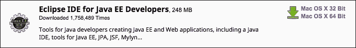

### 提示

如果您使用 Java 8，请确保您下载 Eclipse Luna (4.4) 或 4.3 的修补版本。

下载 Eclipse 后，将其解压缩到您选择的文件夹。提取的文件夹将被称为 `eclipse`。要启动 Eclipse，请导航到 `eclipse` 文件夹并运行：

```java
$ ./eclipse

```

Windows 用户只需双击 `eclipse` 文件夹（带有大、蓝色、圆形 Eclipse 图标的文件夹）中的可执行文件。

### 安装 JBoss tools

下一步是安装 WildFly 8 适配器，它是名为 JBoss tools 的插件套件的一部分。在 Eclipse 中安装新插件非常简单；只需执行以下步骤：

1.  从菜单中，导航到**帮助** | **Eclipse 市场 place**。

1.  然后，搜索您想要安装的插件（在本例中，键入`jboss tools`）。

1.  最后，点击以下截图所示的**安装**按钮：

确保您选择与您的 Eclipse 版本匹配的 JBoss 工具版本，例如 Luna 或 Kepler。在本例中，我们使用 Eclipse Luna，因此我选择了 Luna 版本的 JBoss 工具。如果您只想安装 WildFly 适配器，请选择**JBossAS 工具**。同意条款并点击**确定**。当提示时重启 Eclipse。

您现在可以通过以下步骤在 Eclipse 中设置 WildFly 服务器：

1.  导航到**新建** | **服务器**。

1.  展开**JBoss 社区**节点。

1.  选择以下截图所示的选项，**WildFly 8**：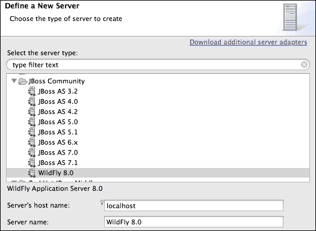

1.  确保您选择已安装的 Java 8 JRE。

1.  将主目录指向 WildFly 根目录，如下截图所示：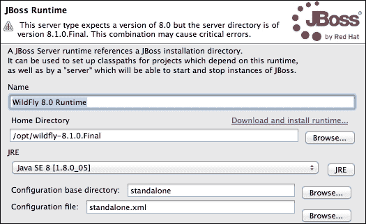

# 探索应用服务器文件系统

现在我们已经完成了所有必要工具的安装，我们将专注于应用服务器的结构。当您浏览应用服务器文件夹时，您首先会注意到其文件系统基本上分为两个核心部分：这种二分法反映了**独立**服务器和**域**服务器之间的区别。

域服务器的概念在应用服务器市场上并不新鲜，然而，它仅在 JBoss AS 7 中作为管理并协调一组应用服务器实例的方式被引入。未配置为域一部分的应用服务器节点被认定为独立服务器。在实践中，独立服务器类似于您在 JBoss AS 7 之前的应用服务器版本中看到的应用服务器单个实例。

我们将在第五章*配置 WildFly 域*中详细讨论域的概念。目前，我们将探索这两种服务器类型的不同文件系统结构。

从宏观角度来看，我们可以看到主要文件系统分为两部分：一部分与域服务器相关，另一部分与独立服务器相关。以下图表展示了应用服务器的树状结构：

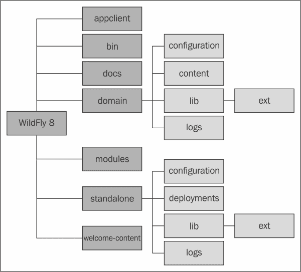

在下一节中，我们将更深入地探讨 WildFly 应用服务器的文件夹结构，剖析其内容并查看其用途。

## bin 文件夹

`bin` 文件夹是您将找到所有启动脚本的地方，例如 `standalone.sh` 和 `domain.sh`。除了启动脚本外，您还可以找到 `standalone.conf`，它可以用于自定义 WildFly 的引导过程。

如您之前所见，`bin` 文件夹还包括 `jboss-cli.sh` 脚本（Windows 用户为 `jboss-cli.bin`），该脚本启动交互式 CLI。您还会找到各种其他有用的脚本，例如 `add-user.sh` 和 `vault.sh`。此文件夹还包含用于生成 Web 服务定义语言及其相应 Java 接口的 Web 服务实用脚本（`wsconsume.sh` 和 `wsprovide.sh`）。

`bin` 目录内有几个子目录。`service` 目录和 `init.d` 目录包含允许您在 Windows 和 Linux 上分别将 WildFly 作为服务安装的程序。

## `docs` 文件夹

`docs` 文件夹包含两个子文件夹，`examples` 和 `schema`。`schema` 文件夹包含配置作为模式使用的所有 `.xsd` 模式定义文件。

`examples` 文件夹包含许多配置示例，从简约的独立示例到 ec2 高可用性示例（HA 表示高可用性，ec2 指的是亚马逊弹性计算云）。

## 域文件夹

下一个文件夹是 `domain` 文件夹，它包含跨越一组文件夹的域结构：

+   `configuration` 文件夹包含所有配置文件：

    +   主要配置文件是 `domain.xml`，它包含域节点使用的所有服务。它还配置了所有服务的套接字绑定接口。

    +   域的关键文件之一是 `host.xml`，它用于定义**主机控制器**（**HC**）。

    +   配置文件夹中包含的最后一个文件是 `logging.properties`，它用于定义**进程控制器**（**PC**）和主机控制器的引导过程日志格式。

+   `content` 文件夹用作存储已部署模块的存储库。

+   `lib` 文件夹托管 `ext` 子文件夹，它用于支持 Java SE/EE 风格的扩展。一些应用程序服务器部署器能够扫描此文件夹以查找由本地类加载器拾取的附加库。尽管如此，此方法不建议使用，并且仅为了符合语言规范而维护。应使用 `modules` 文件夹在 WildFly 中安装您的库。

+   如您所想象，`log` 文件夹包含域的日志输出。默认情况下，每次服务器重启时，该文件都会被截断。

+   `servers` 文件夹包含配置文件中定义的每个服务的一组子文件夹。每个服务器下最有用的目录是 `log` 文件夹，这是单个实例发出日志的位置。

+   `data` 文件夹由应用程序服务器用于存储其运行时数据，例如事务日志。

+   最后，`tmp` 文件夹用于存储服务器写入的临时文件。

## `standalone` 文件夹

如果您以独立模式运行应用程序服务器，这将是在文件系统中您感兴趣的部分。其结构相当类似于 `domain` 文件夹，唯一的例外是没有 `deployment` 文件夹。让我们按顺序进行。就在 `standalone` 文件夹下面，您将找到以下一组子目录：

+   `configuration`

+   `data`

+   `deployments`

+   `lib`

+   `log`

+   `tmp`

这些子目录的内容和使用说明如下：

+   `configuration` 文件夹包含应用程序服务器的配置文件。实际上，应用程序服务器附带了一套不同的配置文件，每个文件使用不同的扩展集。在没有传递任何参数的情况下启动独立启动脚本时，默认将使用 `standalone.xml` 配置文件。

    除了 `standalone.xml` 之外，此文件夹还包含配置引导过程日志的 `logging.properties` 文件。您在此处找到的其他文件是 `mgmt-users.properties` 和 `mgmt-group.properties`，可用于保护管理接口。安全性在第十章，*保护 WildFly*中详细讨论。

+   `data` 文件夹用于存储应用程序服务器的运行时数据，例如事务日志。

+   `deployments` 文件夹是用户可以放置其部署内容（例如，WAR、EAR、JAR 和 SAR 文件）的位置，以便在服务器运行时自动部署。鼓励运行生产系统的用户使用 WildFly 的管理 API 上传和部署部署内容，而不是依赖于定期扫描此目录的部署扫描子系统。有关更多详细信息，请参阅第六章，*应用结构和部署*。

+   `lib` 文件夹托管子文件夹 `ext`，用于定义应用程序服务器的扩展。对于域的 `lib` 路径的考虑也适用于此处。

+   `log` 文件夹包含应用程序服务器独立实例生成的日志。默认日志文件名为 `server.log`，在服务器重启时默认会被截断。这可以在 `standalone.xml` 文件中进行配置。

+   `tmp` 文件夹用于保存 WildFly 编写的临时文件。

## 欢迎内容文件夹

`welcome-content` 文件夹包含默认页面，当您浏览到应用程序服务器的根目录时（`http://localhost:8080`），将加载此页面。从 Web 服务器配置的角度来看，这是 **Web 根上下文**。

## 模块文件夹

在 `modules` 文件夹下，您将找到应用程序服务器的一组库，它们是服务器分发的一部分。

从历史上看，JBoss AS 版本曾以不同的方式管理其库集合。让我们回顾一下，以恢复一些秩序。早期，4.x 版本用于将核心服务器库定义到`JBOSS_HOME/server`库中。此后，每个服务器定义都有其特定的库在`server/<servername>/lib`文件夹中。

这种方法相当简单，然而，它导致了在`default/all`服务器发行版中重复的库的无用激增。

5.x 和 6.x 版本中存在`common/lib`文件夹的概念，这是所有服务器定义中通用模块的主要存储库。每个服务器发行版仍然包含一个`server/<servername>/lib`路径，用于特定于该服务器定义的库。与早期版本相比，核心服务器模块的存储库保持不变，由`JBOSS_HOME/server`组成。

JBoss AS 7 采用了一种更模块化的方法，改进了所有早期方法。这种模块化方法在 WildFly 中保持不变。服务器引导库`jboss-modules.jar`位于应用服务器根目录中。这个单一的存档就是您启动 WildFly 应用服务器内核所需的所有内容。

主要系统模块位于`modules`文件夹下的`system/layers/base`文件夹中。在 WildFly 中，这一变化略有不同，因为在 JBoss AS 7 中，所有模块都是直接在`modules`文件夹中定义的。

下表概述了不同服务器版本中使用的各种方法：

| AS 版本 | 引导库 | 服务器库 |
| --- | --- | --- |
| 4.x | `JBOSS_HOME/server` | `JBOSS_HOME/server/<server>/lib` |
| 5.x 和 6.x | `JBOSS_HOME/server` | `JBOSS_HOME/common/lib`和`JBOSS_HOME/server/<server>/lib` |
| 7.x 和 8.x | `JBOSS_HOME/jboss-modules.jar` | `JBOSS_HOME/modules` |

列出所有模块将占用太多空间，然而，模块存储库布局通常与模块名称相同。例如，`org.jboss.as.ejb3`模块可以在`modules`文件夹的`org/jboss/as/ejb3`子文件夹中找到。这种组织模块的方法确实是有意义的，如果您习惯了 maven 存储库布局结构，您将不会在理解它时遇到问题。

在本章的最后部分，我们将看到模块是如何由应用服务器实际加载的。

## 理解 WildFly 的内核

JBoss AS 7 对内核进行了重新设计。了解模块化内核的细节将有助于您理解书中稍后引入的概念。内核基于两个主要项目，如下所示：

+   **JBoss Modules**：该项目处理容器中资源的类加载。您可以将 JBoss 模块视为在模块化环境中执行应用程序的轻量级引导包装器。

+   **模块化服务容器**（**MSC**）：该项目提供了一种安装、卸载和管理容器使用的服务的方法。MSC 还进一步使资源注入到服务和服务之间的依赖管理成为可能。

以下图显示了 WildFly 服务器内核的基本架构：

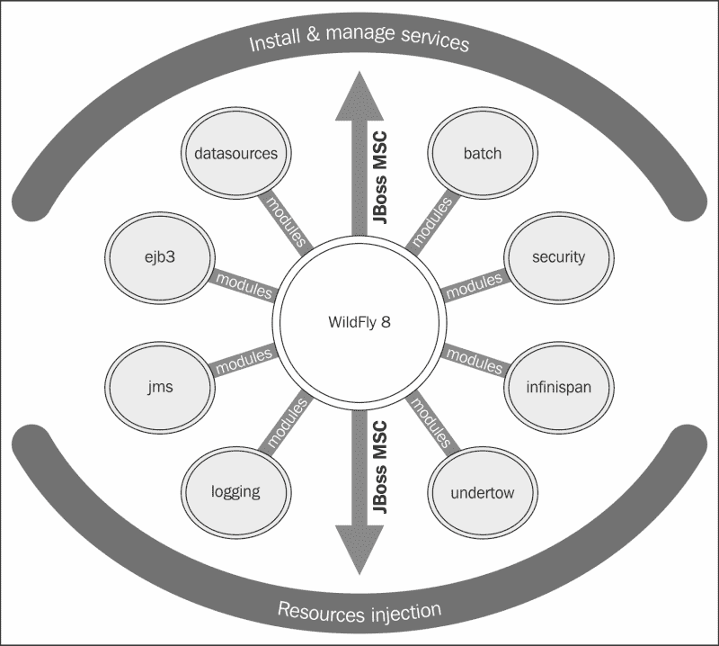

在获得这些信息后，我们现在可以继续加载服务器模块。

## 加载应用程序服务器模块

如果您想了解下一章中讨论的服务器配置，那么了解更多关于 JBoss 模块的知识是至关重要的。本质上，模块只是一个 JAR 文件的包装，但被应用程序容器视为模块。这样做的原因是类加载和依赖管理，因为每个模块都可以被视为一个可插入的单元，如下一图所示。WildFly 有两种不同类型的模块；它们之间的唯一区别是它们的打包方式：

+   静态模块

+   动态模块

看看下面的截图：


使用静态模块是加载模块的最简单方式，它是启动应用程序服务器时的默认模块。静态模块定义在`JBOSS_HOME/modules/system/layers/base`目录中。每个模块都有一个名为`module.xml`的配置文件。以下示例显示了`javax.batch.api`的`module.xml`文件内容：

```java
<module  name="javax.batch.api">
    <resources>
        <resource-root path="jboss-batch-api_1.0_spec-1.0.0.Final.jar"/>
    </resources>
    <dependencies>
        <module name="javax.api"/>
        <module name="javax.enterprise.api"/>
    </dependencies>    
</module>
```

如您所见，模块定义包含两个主要元素，模块中定义的资源（及其路径）和模块的依赖。在这个例子中，主要资源是`jboss-batch-api_1.0_spec-1.0.0.Final.jar`，位于与`module.xml`文件相同的文件夹中。它依赖于另外两个模块，`javax.api`和`javax.enterprise.api`。

定义了`main-class`元素的模块被称为**可执行**的。换句话说，模块名称可以列在命令行上，并且命名模块的`main-class`中的标准静态`main(String[])`方法将被加载并执行。

### 提示

如果您在服务器上部署了多个依赖相同第三方库的应用程序，创建自定义静态模块非常有用。这意味着您不需要部署带有相同捆绑库的多个应用程序。创建自定义静态模块的另一个好处是您可以显式声明对其他静态模块的依赖。模块的安装过程在第三章 *配置企业服务* 中有详细说明，其中我们安装了一个 JDBC 驱动作为模块。

接近模块库的另一种方式是使用动态模块。这可以通过以下两种方式实现：

+   首先，我们可以在 JAR 文件内的`MANIFEST`文件中添加模块信息，例如，在主类`mypackage/MyClass`中：

    ```java
    Dependencies: org.jboss.logging
    ```

+   完成此操作的第二种方式是通过将依赖项添加到`jboss-deployment-structure.xml`文件中，如下面的代码所示：

    ```java
    <jboss-deployment-structure>
      <deployment>
        <dependencies>
          <module name="org.jboss.logging" />
        </dependencies>
      </deployment>
    </jboss-deployment-structure>
    ```

我们将在第六章*应用结构和部署*中更详细地介绍这一点，其中我们解释了类加载。

# 摘要

在本章中，我们概述了随 WildFly 一起提供的最新功能。

我们已经看到 WildFly 由模块化架构组成，并且 WildFly 的内核由两个独立的项目组成：JBoss Modules 和 MSC。

这种模块化架构导致了一个异常轻量级的内核，能够按需加载模块，从而实现更快的启动时间。

应用服务器的物理结构反映了独立服务器和域服务器之间的二分法，前者是一个单节点实例，而后者是一组由域控制器和主机控制器管理的资源。

在下一章中，我们将更深入地探讨如何配置应用服务器的细节，重点关注独立服务器配置文件（`standalone.xml`），它包含核心应用服务器及其上运行的堆栈企业服务的配置。
