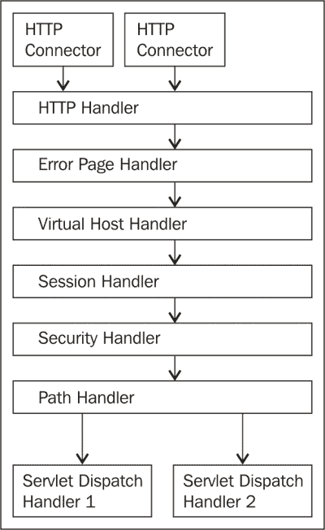
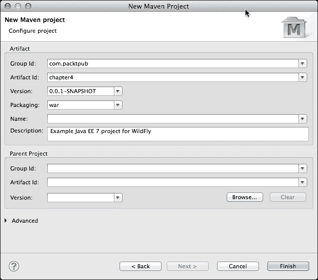
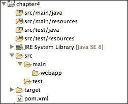
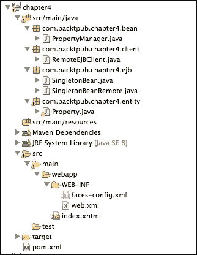
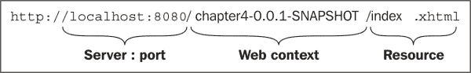
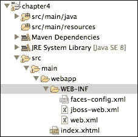
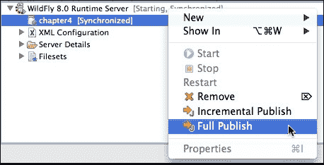
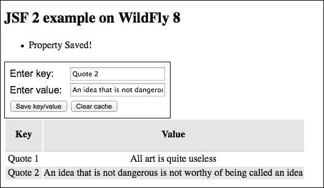
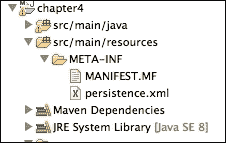

# 第四章. Undertow Web 服务器

在本章中，我们将探讨如何配置 Undertow，这是 WildFly 8 附带的服务器。这将完成我们对独立服务器配置的概述。

然后，我们将通过创建、打包和部署一个示例 Java EE 7 项目来查看典型企业应用程序的结构。它将包括 JavaServer Faces 组件、企业 JavaBeans 和 CDI，并且还将使用**Java 持久化 API**（**JPA**）。这将让你感受到与完整的 Java EE 7 应用程序一起工作的感觉。

到本章结束时，你将了解到：

+   Undertow 的架构

+   Undertow 主机配置

+   服务器静态内容服务

+   Servlet 容器配置

+   JSP 配置

+   会话 cookie 的配置

+   如何创建一个简单的 Web 应用程序

# Undertow 概述

那些使用过 WildFly 先前版本的人会知道，历史上，JBoss 总是包括 Tomcat，或者 Tomcat 的分支（称为 JBoss Web），作为应用程序服务器的 Web 容器。

决定替换 JBoss Web 是因为需要一个新的 Web 容器，它支持新的 Java EE 7 要求，如 WebSocket 和 HTTP 升级。还决定新的 Web 服务器应该是轻量级和灵活的，并且具有更好的性能。结果服务器响应极快，可以扩展到超过一百万个连接，并且具有卓越的吞吐量。

## Undertow 架构

Undertow 是用 Java 编写的，基于**非阻塞输入/输出**API（通常称为**新输入/输出**或简称**NIO**）。通过基于组合的架构和使用流畅的构建器 API 构建，Undertow 可以轻松配置，提供你所需的多或少的函数。通过将处理程序串联起来，你可以构建从简单的 HTTP 处理程序到完整的 Java EE 3.1 容器的任何东西。

组成 Undertow 服务器有三个核心部分：

+   **XNIO 工作实例**：这些实例在 Java NIO 之上形成了一个薄抽象层，提供通道 API、IO 和工作者线程的管理以及 SSL 支持。

+   **监听器**：这些处理传入的连接和底层协议。

+   **处理程序**：这些处理程序串联在一起，为 Undertow 提供主要功能。它们定义了如何处理传入的请求。

以下图示展示了这些组件如何组合在一起以创建 Web 服务器，并演示了处理程序是如何串联在一起的：



## 配置 Undertow

在本节中，我们将探讨如何配置 Undertow 的不同组件。Undertow 是在`standalone.xml`文件中找到的 Undertow 子系统内进行配置的。以下是 Undertow 子系统的摘录：

```java
<subsystem >
    <buffer-cache name="default"/>
    <server name="default-server">
        <http-listener name="default" socket-binding="http"/>
        <host name="default-host" alias="localhost">
            <location name="/" handler="welcome-content"/>
            <filter-ref name="server-header"/>
            <filter-ref name="x-powered-by-header"/>
        </host>
    </server>
    <servlet-container name="default">
        <jsp-config/>
    </servlet-container>
    <handlers>
        <file name="welcome-content" path="${jboss.home.dir}/welcome-content"/>
    </handlers>
    ...
</subsystem>
```

Undertow Web 服务器的大部分配置都在`server`和`servlet-container`元素内进行，这两个元素我们将在下一节中查看。

## 服务器配置

在`server`元素内，您可以配置主机和监听器。配置主服务器实例的属性如下：

| 名称 | 含义 |
| --- | --- |
| `default-host` | 如果请求没有主机头，则使用此虚拟主机 |
| `servlet-container` | 这是将要使用的 servlet 容器，如`servlet-container`元素中配置的 |

### 配置监听器

如我们之前所述，Undertow 由监听器和处理器组成。监听器在`server`元素内进行配置，如下面的代码所示。`standalone.xml`文件中的默认配置只有一个定义的连接器，即 HTTP 连接器：

```java
<server name="default-server">
    <http-listener name="default" socket-binding="http"/>
    <host name="default-host" alias="localhost">
        <location name="/" handler="welcome-content"/>
        <filter-ref name="server-header"/>
        <filter-ref name="x-powered-by-header"/>
    </host>
</server>
```

注意，`socket-binding`属性指向在`socket-binding-group`部分定义的配置：

```java
<socket-binding-group name="standard-sockets" default-interface="public">
    <socket-binding name="http" port="8080"/>
</socket-binding-group>
```

### 备注

WildFly 还支持 AJP 和 HTTPS 连接协议；我们将在第九章负载均衡 Web 应用和第十章保护 WildFly 中分别详细介绍。

在配置监听器时有很多选项。HTTP 监听器元素的属性概述如下：

| 属性 | 描述 | 默认值 |
| --- | --- | --- |
| `allow-encoded-slash` | 当设置为 true 时，此属性允许服务器解码百分号编码的斜杠字符（%2F）。只有当您有一个需要此功能的遗留应用程序时，才启用此选项，因为它可能由于不同服务器对斜杠的不同解释而具有安全影响。 | `false` |
| `always-set-keep-alive` | 此属性确定是否应将`Connection: keep-alive`头添加到所有响应中，即使规范不需要也是如此。 | `true` |
| `buffer-pipelined-data` | 此属性确定对 HTTP 管道请求的响应是否应缓冲并一次性发送。如果 HTTP 管道正在使用且响应较小，这可以提高性能。 | `true` |
| `buffer-pool` | 此属性引用在 I/O 子系统定义的缓冲池，用于内部读取和写入请求。通常，这些缓冲池至少应为 8 KB，除非您处于内存受限的环境中。 | `default` |
| `certificate-forwarding` | 如果此属性启用，则监听器将从`SSL_CLIENT_CERT`属性中获取证书。此属性仅在客户端位于代理后面且代理配置为始终设置这些头时启用。 |  |
| `decode-url` | 此属性确定是否应对 URL 进行解码。如果此属性设置为`false`，则 URL 中的百分号编码字符将保持不变。 | `true` |
| `enabled` | 此属性表示此监听器是否启用 | `true` |
| `max-cookies` | 此属性定义允许的最大 cookie 数量。如果客户端发送的 cookie 数量超过此值，则连接将被关闭。这存在是为了防止基于哈希碰撞的 DOS 攻击。 | `200` |
| `max-header-size` | 此属性定义允许的最大 HTTP 头块大小（以字节为单位）。任何值大于此值的请求头将被关闭。 | `5120` |
| `max-headers` | 此属性定义允许的最大头数。它存在是为了防止基于哈希碰撞的 DOS 攻击。 | `200` |
| `max-parameters` | 此属性定义允许的最大查询或路径参数数量。如果发送的参数更多，则连接将被关闭。它存在是为了防止基于哈希碰撞的 DOS 攻击。 | `1000` |
| `max-post-size` | 此属性定义允许的传入 POST 请求的最大大小。 | `0`（无限） |
| `name` | 此属性定义分配给监听器的名称。 |   |
| `proxy-address-forwarding` | 此属性启用`x-forwarded-host`和类似头，并设置远程 IP 地址和主机名。 |   |
| `redirect-socket` | 当此属性启用时，如果监听器支持非 SSL 请求并且收到需要 SSL 传输的匹配安全约束的请求，则会自动将请求重定向到指定的套接字绑定端口。 |   |
| `socket-binding` | 此属性确定监听器监听的地址和端口。 |   |
| `url-charset` | 此属性定义解码 URL 的字符集。 | `UTF-8` |
| `worker` | 此属性引用在 IO 子系统定义的 XNIO 工作器。正在使用的工作器控制 IO 和阻塞线程池。 | `default` |

### 配置主机

`server`元素内的主机配置对应于虚拟主机，并直接嵌套在`server`元素下，如下面的代码所示。虚拟主机允许您根据运行 WildFly 的机器所知的 DNS 名称对 Web 应用程序进行分组。

```java
<server name="default-server">
    ...
    <host name="default-host" alias="localhost">
        <location name="/" handler="welcome-content"/>
        <filter-ref name="server-header"/>
        <filter-ref name="x-powered-by-header"/>
    </host>
</server>
```

在这里解释了嵌套在主机内的元素：

+   `location`: 此元素定义指向内容的 URL 路径，例如`welcome-content`。

+   `access-log`: 此元素允许您配置访问日志的位置和格式。

+   `filter-ref`: 此元素定义应用于当前主机的过滤器。

+   `single-sign-on`: 此元素允许您配置用于身份验证的 cookie。

可以通过更改默认属性来完全配置访问日志，如下面的代码所示：

```java
<access-log directory="${jboss.server.log.dir}" pattern="common" prefix="access_log" rotate="true" suffix=".log" worker="default"/>
```

`filter-ref`元素通过引用在`filters`元素中定义的过滤器的名称来声明应用的过滤器，如下面的高亮代码所示：

```java
<server name="default-server">
    <host name="default-host" alias="localhost">
        <location name="/" handler="welcome-content"/>
        <filter-ref name="server-header"/>
        <filter-ref name="x-powered-by-header"/>
    </host>
</server>
<filters>
    <response-header name="server-header" header-name="Server" header-value="Wildfly 8"/>
    <response-header name="x-powered-by-header" header-name="X-Powered-By" header-value="Undertow 1"/>
</filters>
```

### 服务器静态内容

您可能不想将所有静态内容与应用程序一起部署。这些可能是图像、PDF 文档或其他类型的文件。您可以配置 Undertow 在本地文件系统中查找这些文件。以下示例展示了如何通过向 Undertow 子系统添加文件处理器和位置来完成此操作：

```java
<server name="default-server">
    <http-listener name="default" socket-binding="http"/>
    <host name="default-host" alias="localhost">
        <location name="/" handler="welcome-content"/>
        <location name="/img" handler="images"/>
    </host>
</server>
<handlers>
    <file name="welcome-content" path="${jboss.home.dir}/welcome-content" directory-listing="true"/>
    <file name="images" path="/var/images" directory-listing="true"/>
</handlers>
```

通过此附加配置，对 `www.yourdomain.com/contextroot/img` 资源的所有请求都将重定向到您的硬盘上的文件系统。

## 配置 servlet 容器

一个 servlet 容器的实例定义在单个 `servlet-container` 元素内。如果您希望有多个 servlet 容器，则可以拥有多个 `servlet-container` 元素；然而，对于大多数配置，一个实例就足够了。`standalone.xml` 中的默认配置如下所示：

```java
<servlet-container name="default">
    <jsp-config/>
</servlet-container>
```

以下表格详细说明了 `servlet-container` 可用的属性：

| 属性 | 描述 | 默认值 |
| --- | --- | --- |
| `allow-non-standard-wrappers` | 此属性放宽了 servlet 规范，该规范要求应用程序仅使用扩展 `ServletRequestWrapper` 和 `ServletResponseWrapper` 类的包装类来包装请求/响应。 | `false` |
| `default-buffer-cache` | 这是默认 servlet 中用于缓存静态资源的缓冲区缓存。 |  |
| `default-encoding` | 这是请求和响应的默认编码。 |  |
| `eager-filter-initialization` | 通过将此属性设置为 `true`，在第一次请求时调用 `web.xml` 文件中定义的过滤器的 init 方法，而不是在服务器启动时调用。 | `false` |
| `ignore-flush` | 此选项忽略 servlet 输出流上的刷新操作。 | `false` |
| `stack-trace-on-error` | 此属性的可用选项为 `all`、`none` 或 `local-only`。`all` 值将显示所有跟踪信息（不应在生产环境中使用），而 `none` 表示不显示堆栈跟踪，`local-only` 表示仅显示来自本地地址的请求，并且没有标题指示请求已被代理。此功能使用 Undertow 错误页面而不是 `web.xml` 中指定的默认错误页面。 | `local-only` |
| `use-listener-encoding` | 此选项使用接收请求的监听器使用的默认编码。 | `false` |

可以向 `servlet-container` 元素添加多个子元素，这将允许您配置您的 JSPs、会话 cookie 和持久会话。

### 配置 JSP

JSP 元素在默认配置中提供。由于没有添加其他属性，因此应用默认配置，如下所示：

```java
<jsp-config 
check-interval="0" 
development="false" 
disabled="false" 
display-source-fragment="true" 
dump-smap="false" 
error-on-use-bean-invalid-class-attribute="false" 
generate-strings-as-char-arrays="false" 
java-encoding="UTF8" 
keep-generated="true" 
mapped-file="true" 
modification-test-interval="4" 
recompile-on-fail="false" 
smap="true" 
source-vm="1.6" 
tag-pooling="true" 
target-vm="1.6" 
trim-spaces="false" 
x-powered-by="true"/>
```

### 配置会话 cookie

您可能会对配置 Undertow 会话 cookie 感兴趣。默认情况下，`standalone.xml` 文件中不包含配置文本，因此您需要将其作为 `servlet-container` 配置的子元素添加：

```java
<servlet-container name="default">
    <jsp-config/>
    <session-cookie name="default" domain="yourdomain.com" http-only="true" max-age="60" secure="true"/>
</servlet-container>
```

`session-cookie`元素的可能的属性在以下表中显示。如果您没有明确设置这些值，则不会设置任何值，因为没有默认值：

| 属性 | 描述 | 默认值 |
| --- | --- | --- |
| `name` | 该属性定义了 cookie 的名称 |   |
| `domain` | 该属性定义了 cookie 的域 |   |
| `comment` | 该属性定义了 cookie 的注释 |   |
| `http-only` | 该属性确定 cookie 是否为 HTTP-only | `true` |
| `secure` | 该属性确定 cookie 是否被标记为安全 | `true` |
| `max-age` | 该属性定义了 cookie 的最大年龄（以分钟为单位） | `0`（无限） |

### 保存会话状态

保存会话允许在服务器重启或应用程序重新部署时存储会话数据。为了启用此功能，您需要将`persistent-sessions`元素添加到配置文件中，如下面的代码所示。此属性应在您的开发环境中使用，而不是在生产环境中使用。

```java
<servlet-container name="default">
    <jsp-config/>
    <persistent-sessions path="/session" relative-to="${jboss.server.tmp.dir}"/>
</servlet-container>
```

### 提示

如果您没有指定`path`变量，则会话仅在重新部署之间持久，而不是在服务器重启之间持久。

## 配置缓冲区缓存

缓冲区缓存用于缓存内容，例如静态文件。缓冲区缓存由一个或多个区域组成，每个区域被分割成更小的缓冲区。以下是一个`buffer-cache`元素的配置示例：

```java
<subsystem >
    <buffer-cache name="default" buffer-size="1024" buffers-per-region="2048" max-regions="10" />
    ...
</subsystem>
```

### 提示

总缓存大小可以通过将缓冲区大小乘以每个区域的缓冲区数量和最大区域数量来计算。在我们的例子中，它将是：

*1024 字节 * 2048 * 10 = 20971520 字节*

# 创建和部署 Web 应用程序

正如您所看到的，应用服务器提供了一个相对直接的方式来配置 Web 容器。为了构建和部署 Web 应用程序，了解如何组织应用程序及其特定的配置文件将是有益的。

WildFly 8 是一个符合 Java EE 7 的应用程序服务器，因此可以用于部署各种 Web 应用程序。构建 Web 应用程序的一种方式是使用**JavaServer Faces**（**JSF**）技术，这是 JSP 技术的演变。它也是企业 Java 的一部分，这意味着 WildFly 默认支持它。WildFly 8 使用 Mojarra 实现支持 JSF 2.2 版本。

### 注意

本例的目的是向您展示如何在 WildFly 8 上创建、配置和部署一个 Java EE 7 应用程序。如果您想了解更多关于各种 Java EE 7 技术，您应该查看 Arun Gupta 创建的许多 Java EE 7 示例，这些示例已经针对 WildFly 进行了配置。GitHub URL 是[`github.com/javaee-samples/javaee7-samples`](https://github.com/javaee-samples/javaee7-samples)。

接下来，我们将创建一个简单的应用程序。这个例子旨在演示如何配置典型企业应用程序中发现的各个企业组件。

# 创建新的 Maven Web 项目

您可以使用多种方式在 Eclipse 中创建 Web 应用程序项目。由于 Maven 是事实上的构建工具，因此在这个例子中使用 Maven 项目结构是有意义的。

让我们从创建项目文件结构开始。转到 **文件** | **新建** | **Maven 项目**，选择 **跳过原型选择**，创建一个简单项目，然后进入下一页。然后，根据以下截图完成工件详情，确保您选择 **war** 作为打包方式：



点击 **完成** 后，Eclipse 将为您的应用程序生成默认的文件夹结构：



我们将使用 JSF 来创建视图。配置 JSF 2.2 Web 应用程序需要非常少的努力。您可以通过以下步骤实现这一点：

1.  创建一个名为 `web.xml` 的文件，并将其放置在您应用程序的 `WEB-INF` 文件夹中。

1.  将 `FacesServlet` 添加到您的 `web.xml` 文件中，并指定将哪些 URL 模式定向到它。

1.  创建一个名为 `faces-config.xml` 的文件，并将其放置在 `WEB-INF` 文件夹中。

### 注意

`FacesServlet` 是一个管理使用 JavaServer Faces 构建用户界面的 Web 应用程序请求处理生命周期的 servlet。

这是完整的 `web.xml` 文件。您可以看到我们指定了 `FacesServlet` 将处理的 URL 模式：

```java
<?xml version="1.0" encoding="UTF-8"?>
<web-app    xsi:schemaLocation="http://xmlns.jcp.org/xml/ns/javaee http://xmlns.jcp.org/xml/ns/javaee/web-app_3_1.xsd" id="WebApp_ID" version="3.1">
  <display-name>Java EE 7 - WildFly 8</display-name>
  <welcome-file-list>
    <welcome-file>index.xhtml</welcome-file>
  </welcome-file-list>
  <context-param>
    <param-name>
      com.sun.faces.enableRestoreView11Compatibility
    </param-name>
    <param-value>true</param-value>
  </context-param>
  <servlet>
    <servlet-name>Faces Servlet</servlet-name>
    <servlet-class>javax.faces.webapp.FacesServlet</servlet-class>
    <load-on-startup>1</load-on-startup>
  </servlet>
  <servlet-mapping>
    <servlet-name>Faces Servlet</servlet-name>
    <url-pattern>*.xhtml</url-pattern>
  </servlet-mapping>
  <context-param>
    <param-name>javax.servlet.jsp.jstl.fmt.localizationContext</param-name>
    <param-value>resources.application</param-value>
  </context-param>
  <listener>
    <listener-class>com.sun.faces.config.ConfigureListener</listener-class>
  </listener>
</web-app>
```

接下来，您将看到一个名为 `faces-config.xml` 的最小化 JSF 配置文件，该文件将被放置在您应用程序的 `WEB-INF` 文件夹中。此文件声明了我们将要使用的 JSF 版本，在我们的例子中是 2.2：

```java
<?xml version="1.0" encoding="UTF-8"?>
<faces-config   xsi:schemaLocation="http://xmlns.jcp.org/xml/ns/javaee http://xmlns.jcp.org/xml/ns/javaee/web-facesconfig_2_2.xsd" version="2.2">
</faces-config>
```

Eclipse 可以为您创建这些配置文件。为此，您需要激活 **JavaServer** **Faces** **Facets**。在您的项目上右键单击，选择 **项目** **属性**。在这里，您将找到一组配置选项，可以在 **项目** **Facets** 选项下自动添加到您的项目中。您可能需要修改文件以确保使用正确的命名空间，并更新 `web.xml` 文件的内容。

接下来，我们需要将项目依赖项添加到 Maven 配置文件 `pom.xml` 中。在项目构建时，Maven 将为您下载和管理所有依赖项。以下代码显示了 `pom.xml` 的完整内容：

```java
<project  
    xsi:schemaLocation="http://maven.apache.org/POM/4.0.0 http://maven.apache.org/xsd/maven-4.0.0.xsd">
    <modelVersion>4.0.0</modelVersion>
    <groupId>com.packtpub</groupId>
    <artifactId>chapter4</artifactId>
    <version>0.0.1-SNAPSHOT</version>
    <packaging>war</packaging>
    <description>Simple Java EE 7 example using WildFly</description>

    <repositories>
        <repository>
            <id>JBoss Repository</id>
            <url>https://repository.jboss.org/nexus/content/groups/public/</url>
        </repository>
    </repositories>

    <dependencies>
        <dependency>
            <groupId>org.jboss.spec</groupId>
            <artifactId>jboss-javaee-7.0</artifactId>
            <version>1.0.1.Final</version>
            <type>pom</type>
            <scope>provided</scope>
        </dependency>
    </dependencies>
    <!-- build plugins removed for brevity -->
</project>
```

### 提示

你会注意到正在使用 JBoss Nexus 仓库而不是 Maven Central。这是因为自从 Java EE 6 以来，JBoss 已经托管了自己的 EE API。这样做的原因是 Java EE 6 中未实现的方法。要了解完整的动机，请导航到[`developer.jboss.org/blogs/donnamishelly/2011/04/29/jboss-java-ee-api-specs-project`](https://developer.jboss.org/blogs/donnamishelly/2011/04/29/jboss-java-ee-api-specs-project)。我建议你使用由 JBoss 提供的版本，因为它与 WildFly 中提供的代码相同。

## 添加 JSF 组件

为了学习如何打包 Java EE 7 应用程序，我们将向你展示如何结合 JSF 组件，例如 JSF 视图与 CDI 和 EJB 等企业组件。

在这个例子中，我们将创建一个简单的缓存系统，该系统使用 EJB 单例在内存中处理缓存。然后，我们向你展示如何将数据持久化到数据库。让我们先向你的动态 Web 项目添加一个名为`index.xhtml`的页面：

```java
<!DOCTYPE html>
<html 

    >

<h:head>
    <link href="main.css" rel="stylesheet" type="text/css" />
</h:head>
<h:body>
    <h2>JSF 2 example on WildFly 8</h2>
    <h:form id="jsfexample">
        <h:messages />
        <h:panelGrid columns="2" styleClass="default">
            <h:outputText value="Enter key:" />
            <h:inputText value="#{manager.key}" />

            <h:outputText value="Enter value:" />
            <h:inputText value="#{manager.value}" />

            <h:commandButton actionListener="#{manager.save}"
                styleClass="buttons" value="Save key/value" />
            <h:commandButton actionListener="#{manager.clear}"
                styleClass="buttons" value="Clear cache" />
        </h:panelGrid>

        <h:dataTable value="#{manager.cacheList}" var="item"
            styleClass="table" headerClass="table-header"
            rowClasses="table-odd-row,table-even-row">
            <h:column>
                <f:facet name="header">Key</f:facet>
                <h:outputText value="#{item.key}" />
            </h:column>
            <h:column>
                <f:facet name="header">Value</f:facet>
                <h:outputText value="#{item.value}" />
            </h:column>
        </h:dataTable>
    </h:form>
</h:body>
</html>
```

### 注意

要了解 JSF，请参考在线教程[`docs.oracle.com/javaee/7/tutorial/doc/jsf-intro.htm`](http://docs.oracle.com/javaee/7/tutorial/doc/jsf-intro.htm)。

以下代码引用了一个名为`manager`的后备 Bean，用于存储和检索键/值对。后备 Bean 是简单的 Java 类，用作 UI 组件的模型。你也会注意到`PropertyManager`类中的`@RequestScoped`注解。

### 提示

当定义后备 Bean 的作用域时，如果你不使用 CDI（这几乎不可能），你应该只使用`javax.faces.bean.RequestScoped`注解。相反，你应该使用`javax.enterprise.context.*`包中的注解，它是上下文和依赖注入框架的一部分。

现在，让我们看看如何编码`PropertyManager`托管 Bean：

```java
package com.packtpub.chapter4.bean;
import java.util.List;
import javax.ejb.EJB;
import javax.enterprise.context.RequestScoped;
import javax.faces.application.FacesMessage;
import javax.faces.context.FacesContext;
import javax.faces.event.ActionEvent;
import javax.inject.Named;
import org.jboss.logging.Logger;
import com.packtpub.chapter4.ejb.SingletonBean;
import com.packtpub.chapter4.entity.Property;

@Named("manager") 
@RequestScoped 
public class PropertyManager { 

    private Logger logger = Logger.getLogger(getClass());

    @EJB 
    private SingletonBean ejb;
    private String key;
    private String value;

    public void save(ActionEvent e) { 
        try { 
            ejb.save(key, value);
            FacesContext.getCurrentInstance().addMessage( 
                    null, 
                    new FacesMessage(FacesMessage.SEVERITY_INFO, 
                            "Property Saved!", null));
        } catch (Exception ex) { 
            logger.error("Error saving property", ex);
            FacesContext.getCurrentInstance().addMessage( 
                    null, 
                    new FacesMessage(FacesMessage.SEVERITY_ERROR, 
                            "Error Saving!", ex.getMessage()));
        }
    }
    public void clear(ActionEvent e) { 
        logger.info("Called clear");
        ejb.deleteAll();
    }
    public List<Property> getCacheList() { 
        return ejb.getProperties();
    }
// getters and setters removed for brevity
}
```

这个类最重要的部分是`@Named`注解。使用`@Named`注解这个类可以让它作为一个 CDI 托管 Bean 被识别。传递给注解的名称定义了如何通过表达式语言（EL）引用这个 Bean。接下来，使用`@EJB`注解将`SingletonBean`注入到类中。

### 注意

你可以在 Java EE 教程中了解更多关于 JSF 托管 Bean 的信息：[`docs.oracle.com/javaee/7/tutorial/doc/jsf-develop.htm`](http://docs.oracle.com/javaee/7/tutorial/doc/jsf-develop.htm)。

## 添加 EJB 层

`SingletonBean`是一个 EJB，它带有特殊的`@javax.ejb.Singleton`注解。带有此类注解的类保证每个应用程序只实例化一次，并且存在于应用程序的生命周期中。在 Java EE 上下文中，单例 Bean 主要用于存储应用程序范围内的共享数据。现在，我们需要创建一个名为`SingletonBean`的新类。这个类的目的是保存和检索键/值对：

```java
package com.packtpub.chapter4.ejb;

import java.util.ArrayList;
import java.util.List;

import javax.annotation.PostConstruct;
import javax.ejb.LocalBean;
import javax.ejb.Remote;
import javax.ejb.Singleton;
import javax.persistence.EntityManager;
import javax.persistence.PersistenceContext;
import javax.persistence.Query;
import javax.persistence.TypedQuery;

import com.packtpub.chapter4.entity.Property;

@Singleton
@LocalBean
public class SingletonBean {

    private List<Property> cache = new ArrayList<>();

    @PostConstruct
    public void initCache() {
        this.cache = queryCache();
        if (cache == null) {
            cache = new ArrayList<Property>();
        }
    }

    public void deleteAll() {
        this.cache.clear();
    }

    public void save(String key, String value) {
        Property property = new Property(key, value);
        this.cache.add(property);
    }

    public List<Property> getProperties() {
        return cache;
    }
}
```

我们需要添加的最后一个类是`Property`，它是一个普通的`JavaBean`类：

```java
package com.packtpub.chapter4.entity;

public class Property {
    private String key;
    private String value;
    // GETTERS & SETTERS omitted for brevity 
}
```

一旦达到这一点，您应该有一个包含以下截图所示内容的项的项目：



## 选择应用程序的 Web 上下文

默认情况下，Web 应用程序从部署在应用程序服务器上的存档名称继承 Web 上下文名称。Maven 使用 artifact ID，后跟版本来命名存档。因此，在我们的示例中，如果我们部署一个名为 `chapter4-0.0.1-SNAPSHOT.war` 的存档，它将可以通过 `chapter4-0.0.1-SNAPSHOT` 的 Web 上下文名称访问，如下面的图像所示：



上下文名称可以修改为更有意义的内容。最简单的方法（不更改存档名称）是在项目的 `WEB-INF` 文件夹中添加一个 `jboss-web.xml` 文件：



此文件的内容将包括由 `context-root` 元素指定的自定义 Web 上下文：

```java
<jboss-web>
  <context-root>chapter4</context-root>
</jboss-web>
```

## 部署 Web 应用程序

一旦您对设置满意，您就可以部署并验证您的应用程序。如果您在 Eclipse 内部部署应用程序，只需右键单击 WildFly 运行时服务器并选择 **添加** **和** **移除** 选项（假设您已按照 第一章 中所示安装了 WildFly 运行时，*安装 WildFly*）。接下来，将 Web 项目添加到已部署项目的列表中。

然后，您可以通过右键单击项目并选择 **完全** **发布** 来部署应用程序：



发布您的应用程序后，您会注意到 Eclipse 会将您的 Web 应用程序存档 (`chapter4-0.0.1-SNAPSHOT.war`) 复制到服务器。它还会创建一个名为 `chapter4-0.0.1-SNAPSHOT.war.dodeploy` 的文件。正如您将在 第六章 中学习到的，*应用程序结构和部署*，默认情况下，展开的存档需要 WildFly 中的一个标记文件来触发部署。Eclipse 知道这一点，并为您创建该文件。

部署成功后，`chapter4-0.0.1-SNAPSHOT.war.dodeploy` 文件将被一个名为 `chapter4-0.0.1-SNAPSHOT.war.deployed` 的标记文件替换，这表明您已成功部署了 Web 应用程序。您可以通过指向 `http://localhost:8080/chapter4/index.xhtml` 上的 `index.xhtml` 页面来验证您的应用程序是否正常工作，如下面的截图所示：



### 将 Web 应用程序部署到根上下文

在我们的例子中，我们展示了如何使用 `jboss-web.xml` 将 Web 应用程序部署到自定义上下文。Web 上下文的一个特殊情况是 `root` 上下文。这通常解析为 `http://localhost:8080`，并由 Web 服务器提供一些欢迎上下文。但是，您可以通过将您的应用程序之一部署到 `root` 上下文来覆盖它。这需要两个简单的步骤：

1.  首先，您需要从您的 Undertow 子系统中删除以下行：

    ```java
    <location name="/" handler="welcome-content"/>
    ```

1.  然后，在您的应用程序中添加一个包含应用程序 `root` 上下文的 `jboss-web.xml` 文件：

    ```java
    <jboss-web>
        <context-root>/</context-root>
    </jboss-web>
    ```

## 添加远程 EJB 客户端

在为远程 EJB 客户端添加任何代码之前，我们需要向 `pom.xml` 添加两个依赖项。这确保了我们的代码将编译并运行而不会出错：

```java
<!-- this is required for a security -->
<dependency>
    <groupId>org.jboss.sasl</groupId>
    <artifactId>jboss-sasl</artifactId>
    <version>1.0.4.Final</version>
    <scope>provided</scope>
</dependency>
<!-- this is required for the RemoteEJBClient.java to compile -->
<dependency>
    <groupId>org.jboss</groupId>
    <artifactId>jboss-ejb-client</artifactId>
    <version>2.0.2.Final</version>
    <scope>provided</scope>
</dependency>
```

为了使用远程客户端测试我们的应用程序，我们需要创建一个指向 EJB 的远程接口：

```java
package com.packtpub.chapter4.ejb;

import java.util.List;
import com.packtpub.chapter4.entity.Property;

public interface SingletonBeanRemote {
    public void deleteAll();
    public void save(String key, String value);
    public List<Property> getProperties();
}
```

该接口的具体实现是 `SingletonBeanRemoteImpl` 类，它具有与我们在早期部分中展示的 `SingletonBean` 类相同的 Java 方法实现：

```java
@Singleton
@LocalBean
@Remote(SingletonBeanRemote.class)
public class  SingletonBean implements SingletonBeanRemote  {
// Bean class unchanged
}
```

EJB 远程调用通过 **Remoting** 框架进行，该框架使用 **简单** **认证** **和安全** **层**（**SASL**）进行客户端-服务器认证。您需要通过向测试客户端添加以下规范来显式设置安全提供程序：

```java
static {
  Security.addProvider(new JBossSaslProvider());
}
```

下一个部分相当棘手。我们需要确定 EJB 的 **Java 命名和目录接口**（**JNDI**）名称，为此我们需要查找远程 EJB。JNDI 名称取决于 EJB 是否有状态或无状态。以下表格概述了 SLSB 和 SFSB 的语法：

| EJB 类型 | JNDI 语法 |
| --- | --- |
| 无状态 EJB | `ejb:<app-name>/<module-name>/<distinct-name>/<bean-name>!<fully-qualified-classname-of-the-remote-interface>` |
| 有状态 EJB | `ejb:<app-name>/<module-name>/<distinct-name>/<bean-name>!<fully-qualified-classname-of-the-remote-interface>?stateful` |

以下表格分别列出这些属性：

| 参数 | 描述 |
| --- | --- |
| `app-name` | 这是应用程序名称，在应用程序已作为企业存档部署的情况下使用。它通常对应于不带 `.ear` 的企业存档名称。由于我们将应用程序打包在 Web 存档中，此参数将不会使用。 |
| `module-name` | 这是包含 EJB 的模块。由于我们将应用程序部署在名为 `chapter4-0.0.1-SNAPSHOT.war` 的文件中，它对应于 `chapter4-0.0.1-SNAPSHOT`。 |
| `distinct-name` | 这是一个可选的名称，可以用来区分不同的 EJB 实现。在我们的例子中未使用。 |
| `bean-name` | 这是 EJB 名称，默认情况下，它是 EJB 实现类的类名，在我们的例子中，是 `SingletonBeanRemoteImpl`。 |
| `fully-qualified-classname-of-the-remote-interface` | 这显然对应于你正在查找的接口的完全限定类名，在我们的例子中，是`com.packtpub.chapter4.ejb.SingletonBeanRemote`。 |

### 注意

请注意，有状态的 EJB 需要在 JNDI 查找名称中添加一个额外的`?stateful`参数。

在了解 JNDI 命名空间的信息后，你将准备好理解客户端代码：

```java
package com.packtpub.chapter4.client;

import java.security.Security;
import java.util.*;
import javax.naming.*;
import org.jboss.ejb.client.*;
import org.jboss.sasl.JBossSaslProvider;
import com.packtpub.chapter4.ejb.SingletonBean;
import com.packtpub.chapter4.ejb.SingletonBeanRemote;
import com.packtpub.chapter4.entity.Property;

public class RemoteEJBClient { 
    static { 
        Security.addProvider(new JBossSaslProvider());
    }
    public static void main(String[] args) throws Exception { 
        testRemoteEJB();
    }
    private static void testRemoteEJB() throws NamingException { 
        final SingletonBeanRemote ejb = lookupEJB();
        ejb.save("entry", "value");
        List<Property> list = ejb.getProperties();
        System.out.println(list);
    }
    private static SingletonBeanRemote lookupEJB() throws NamingException { 

        Properties clientProperties = new Properties();
        clientProperties.put("endpoint.name", "client-endpoint");
        clientProperties.put("remote.connections", "default");
        clientProperties.put("remote.connection.default.port", "8080");
        clientProperties.put("remote.connection.default.host", "localhost");
        clientProperties.put("remote.connectionprovider.create.options.org.xnio.Options.SSL_ENABLED", "false");
        clientProperties.put("remote.connection.default.connect.options.org.xnio.Options.SASL_POLICY_NOANONYMOUS", "false");

        EJBClientConfiguration ejbClientConfiguration = new PropertiesBasedEJBClientConfiguration(clientProperties);
        ContextSelector<EJBClientContext> ejbContextSelector = new ConfigBasedEJBClientContextSelector(ejbClientConfiguration);

        EJBClientContext.setSelector(ejbContextSelector);

        final Hashtable<String, String> jndiProperties =           new Hashtable<>();
        jndiProperties.put(Context.URL_PKG_PREFIXES, "org.jboss.ejb.client.naming");
        final Context context = new InitialContext(jndiProperties);
        final String appName = "";
        final String moduleName = "chapter4-webapp-example-0.0.1-SNAPSHOT";
        final String distinctName = "";

        final String beanName = SingletonBean.class.getSimpleName();
        final String viewClassName = SingletonBeanRemote.class.getName();
        return (SingletonBeanRemote) context.lookup("ejb:" + appName + "/" + moduleName + "/" + distinctName + "/" + beanName + "!" + viewClassName);
    }
}
```

如你所见，远程 EJB 客户端代码的主要复杂性在于 JNDI 查找部分。你可能已经注意到，在突出显示的部分，我们使用名为`Context.URL_PKG_PREFIXES`的属性初始化了 JNDI 上下文，以指定在加载 URL 上下文工厂时要使用的包前缀列表。在我们的例子中，我们将其设置为`org.jboss.ejb.client.naming`，这样 JNDI API 就知道哪些类负责处理`ejb:`命名空间。

### 使用属性文件配置客户端

最后，你可能想知道客户端实际上是如何知道远程 EJB 托管的服务器位置的。这可以通过向客户端类路径中添加以下名为`jboss-ejb-client.properties`的客户端属性文件来解决：

```java
remote.connectionprovider.create.options.org.xnio.Options.SSL_ENABLED=false
remote.connections=default
remote.connection.default.host=localhost
remote.connection.default.port = 8080
remote.connection.default.connect.options.org.xnio.Options.SASL_POLICY_NOANONYMOUS=false
```

在此文件中，你可以指定一组以`remote.connectionprovider.create.options`为前缀的属性，这些属性将在远程连接期间使用。在我们的例子中，我们只是将`org.xnio.Options.SSL_ENABLED`属性设置为`false`，这意味着将使用明文传输来连接客户端和服务器。

`remote.connections`属性用于指定一组一个或多个映射到 EJB 接收器的连接。在我们的例子中，有一个名为`default`的单个远程连接，它映射到`localhost`和远程端口`8080`。

最后，我们需要指定将使用 SASL 匿名连接；否则，如果没有认证，我们的连接将被拒绝。

### 程序化配置客户端

另一种配置客户端连接属性的方法是程序化配置。在这里，我们创建一个`Properties`对象，并用与`jboss-ejb-client.properties`配置文件中相同的键值对填充它。代码中的重要部分用粗体突出显示：

```java
private static SingletonBeanRemote lookupEJB() throws NamingException {
    Properties clientProperties = new Properties();
    clientProperties.put("endpoint.name", "client-endpoint");
    clientProperties.put("remote.connections", "default");
    clientProperties.put("remote.connection.default.port", "8080");
    clientProperties.put("remote.connection.default.host", "localhost");
    clientProperties.put("remote.connectionprovider.
create.options.org.xnio.Options.SSL_ENABLED", "false");
    clientProperties.put("remote.connection.default.
connect.options.org.xnio.Options.SASL_POLICY_NOANONYMOUS", "false");

    EJBClientConfiguration ejbClientConfiguration = new PropertiesBasedEJBClientConfiguration(clientProperties);
        ContextSelector<EJBClientContext> ejbContextSelector = new ConfigBasedEJBClientContextSelector(ejbClientConfiguration);

    EJBClientContext.setSelector(ejbContextSelector);

    final Hashtable<String, String> jndiProperties = new Hashtable<>();
    jndiProperties.put(Context.URL_PKG_PREFIXES, "org.jboss.ejb.client.naming");
    final Context context = new InitialContext(jndiProperties);
    final String appName = "";
    final String moduleName = "chapter4-webapp-example-0.0.1-SNAPSHOT";
    final String distinctName = "";

    final String beanName = SingletonBean.class.getSimpleName();
    final String viewClassName = SingletonBeanRemote.class.getName();
    return (SingletonBeanRemote) context.lookup("ejb:" + appName + "/" + moduleName + "/" + distinctName + "/" + beanName + "!" + viewClassName);
    }
```

## 配置数据持久化

我们现在将通过将键值对存储在关系数据库中而不是保留在内存中来进一步增强我们的应用程序。为此，我们需要创建一个**持久化** **上下文**。再次提醒你，它的目的不是教授数据持久化的理论，而是展示如何在应用程序中配置它。

持久化子系统默认包含在所有服务器配置中：

```java
<extension module="org.jboss.as.jpa"/>
<subsystem ></subsystem>
```

JPA 模块默认情况下不会在应用服务器中加载。然而，一旦应用服务器检测到你的应用程序包含`persistence.xml`或持久化注解，JPA 模块将会自动启动。

因此，让我们将 JPA 的 `persistence.xml` 配置文件添加到我们的项目中，它将引用用于将我们的实体映射到数据库的数据源：

```java
<?xml version="1.0" encoding="UTF-8"?>
<persistence 

    xsi:schemaLocation="http://xmlns.jcp.org/xml/ns/javaee http://xmlns.jcp.org/xml/ns/javaee/persistence/persistence_2_1.xsd"
    version="2.1">
    <persistence-unit name="persistenceUnit" transaction-type="JTA">
        <provider>org.hibernate.jpa.HibernatePersistenceProvider</provider>
        <jta-data-source>java:jboss/datasources/MySqlDS</jta-data-source>  
        <properties>
            <property name="hibernate.dialect" value="org.hibernate.dialect.MySQLDialect" />
        </properties>
    </persistence-unit>
</persistence>
```

此文件的关键属性是持久化单元的 `name`，它将标识其唯一名称，以及 `jta-data-source`，它必须匹配有效的数据源定义。在早期章节中，我们定义了这个绑定到 MySQL 数据库的数据源。

### 注意

`persistence.xml` 文件可以指定 JTA 数据源或非 JTA 数据源。在 Java EE 环境中，你必须使用 JTA 数据源（即使在没有活动事务的情况下读取数据）。

最后，`properties` 元素可以包含底层持久化提供者的任何配置属性。由于 WildFly 使用 Hibernate 作为 EJB 持久化提供者，你可以在其中传递任何 Hibernate 选项。

一旦创建，此文件需要放置在 `source/main/resources` 文件夹的 `META-INF` 文件夹中，如下面的截图所示：



### 注意

**持久化.xml 文件的实际路径**

请注意，当 Maven 构建时，`Eclipse src/main/resources` 目录的内容将被放置在您的 Web 应用程序的 `WEB-INF/classes` 目录中。

## 为 JPA 子系统使用默认数据源

在此示例中，我们是从 `persistence.xml` 文件中引用数据源，因此遵循许多开发者都熟悉的规范方法。

然而，你可以通过在 JPA 子系统中添加 `default-datasource` 元素来为所有 JPA 应用程序选择默认数据源：

```java
<subsystem >
  <jpa default-datasource="java:jboss/datasources/MySqlDS"/>
</subsystem>
```

这样，所有尚未在 `persistence.xml` 文件中定义 `jta-data-source` 元素的 JPA 应用程序将使用主服务器配置文件中配置的默认数据源。

## 配置实体

一旦定义了持久化配置，我们只需要在我们的应用程序中添加 `javax.persistence` 注解到我们的实体类。`@Entity` 注解表示该类将被注册为 JPA 实体：

```java
package com.packtpub.chapter4.entity;
import java.io.Serializable;
import javax.persistence.Column;
import javax.persistence.Entity;
import javax.persistence.Id;

@Entity
public class Property implements Serializable {
    @Id
    @Column(name = "id")
    private String key;
    @Column(name = "value")
    private String value;
    //getters and setters omitted for brevity
}
```

我们的会话 Bean 也需要更改。我们将不再只向内存缓存读写，而是同时写入缓存和数据库，并且只从内存缓存中读取。当应用程序重新启动时，内存缓存将用从数据库查询的数据填充。尽管这并不复杂，但为了演示的目的，这完全是可以接受的：

```java
import java.util.ArrayList;
import java.util.List;
import javax.annotation.PostConstruct;
import javax.ejb.Singleton;
import javax.persistence.*;
import com.packtpub.chapter4.entity.Property;

@Singleton
public class  SingletonBean   {
  private  List<Property> cache;
  @PersistenceContext(unitName = "persistenceUnit")
  private EntityManager em;

  @PostConstruct
  public void initCache(){
    this.cache = queryCache();
    if (cache == null) cache = new ArrayList<Property>();
  }

  public void delete(){
    Query query = em.createQuery("delete FROM 
com.packtpub.chapter4.entity.Property");
    query.executeUpdate();
    this.cache.clear();
  }

  public void put(String key,String value){
    Property p = new Property();
    p.setKey(key);
    p.setValue(value);
    em.persist(p);
    this.cache.add(p);
  }

package com.packtpub.chapter4.ejb;

import java.util.ArrayList;
import java.util.List;

import javax.annotation.PostConstruct;
import javax.ejb.LocalBean;
import javax.ejb.Remote;
import javax.ejb.Singleton;
import javax.persistence.EntityManager;
import javax.persistence.PersistenceContext;
import javax.persistence.Query;
import javax.persistence.TypedQuery;

import com.packtpub.chapter4.entity.Property;

@Singleton 
@LocalBean 
public class SingletonBean { 

    private List<Property> cache = new ArrayList<>();

    @PersistenceContext(unitName = "persistenceUnit")
    private EntityManager em;

    @PostConstruct 
    public void initCache() { 
        this.cache = queryCache();
        if (cache == null) { 
            cache = new ArrayList<Property>();
        }
    }

    public void deleteAll() { 
        Query query = em.createQuery("DELETE FROM Property");
        query.executeUpdate();
    }

    public void save(String key, String value) { 
        Property property = new Property(key, value);
        em.persist(property);
        this.cache.add(property);
    }

    private List<Property> queryCache() { 
        TypedQuery<Property> query = em.createQuery("FROM Property", Property.class);
        List<Property> list = query.getResultList();
        return list;
    }

    public List<Property> getProperties() { 
        return cache;
    }
}
```

以下代码段已被突出显示，以显示代码是如何修改以使用数据持久化的。最相关的部分是 `@javax.persistence.PersistenceContext` 注解，它引用了在 `persistence.xml` 文件中定义的 JPA 上下文。

一旦部署，此应用程序将数据持久化到您的 MySQL 数据库。

## 在其他应用程序存档中配置持久化

在我们的示例中，我们创建了一个由 Web 组件和 EJB 组成的 Java EE 7 应用程序，使用单个 Web 应用程序存档。这是绝对正常且预期的，因为 Java EE 允许在单个 Web 存档中混合和匹配前端组件和后端组件。

您可以部署一个应用程序，其中 Web 层与业务服务层分离。例如，假设您将实体部署在单独的 JAR 文件中；`persistence.xml` 文件的正确位置是在您的 JAR 存档的 `META-INF` 文件夹下。

### 注意

为了确认，如果您将您的 JPA 实体放置在 WAR 文件中，`persistence.xml` 文件应放置在 `WEB-INF/classes/META-INF` 文件夹中。如果您在 Web 应用程序内部将 JPA 实体打包在一个 JAR 文件中，您应将 `persistence.xml` 文件放置在 `META-INF` 文件夹中。

从技术角度讲，如果您在应用程序中有多个 JAR 文件，您可以将 `persistence.xml` 文件部署在单个存档中，并使用 `jarName#unitName` 语法引用持久化单元。例如，此应用程序的持久化单元可以通过以下注解从另一个 JAR 文件中引用：

```java
@PersistenceContext(unitName="wildflyapp.jar#unitName")
```

## 切换到不同的提供商

默认情况下，WildFly 8.1 使用 Hibernate 4.3.5 作为持久化提供者。Hibernate JAR 包含在 `org.hibernate` 路径下的 `modules` 文件夹中。但是，如果您的应用程序需要 Hibernate 的不同版本，例如 3.5，您仍然可以通过在 `pom.xml` 文件中添加依赖项并将作用域设置为 `runtime` 来将 JAR 包捆绑到您的应用程序中：

```java
<dependency>
    <groupId>org.hibernate</groupId>
    <artifactId>hibernate-core</artifactId>
    <version>3.5.0-Final</version>
    <scope>runtime</scope>
</dependency>
```

此外，您需要在 `persistence.xml` 配置文件中将 `jboss.as.jpa.providerModule` 属性设置为 `hibernate3-bundled`。JPA 部署程序将检测到持久化提供者的不同版本，并激活该版本：

```java
<persistence-unit>
    <properties>
        <property name="jboss.as.jpa.providerModule" value="hibernate3-bundled" />
    </properties>
</persistence-unit>
```

### 使用 Jipijapa

您还可以使用 Jipijapa 项目简化切换到不同的 JPA 提供商。如果您使用 Jipijapa，您需要确保您的持久化提供者被包含在 `pom.xml` 文件中的运行时依赖项中，并且您还需要包含正确的 Jipijapa 集成 JAR 文件。要使用 Hibernate 3，您需要在 `pom.xml` 中添加以下依赖项：

```java
<dependency>
  <groupId>org.jipijapa</groupId>
  <artifactId>jipijapa-hibernate3</artifactId>
  <version>1.0.1.Final</version>
</dependency>
```

使用 Jipijapa，您可以轻松切换到 Hibernate 的不同版本，或者切换到不同的 ORM 提供商，例如 EclipseLink 或 OpenJPA。有关使用 Jipijapa 项目的更多详细信息，您可以参考 WildFly 文档，网址为 [`docs.jboss.org/author/display/WFLY8/JPA+Reference+Guide#JPAReferenceGuide-BackgroundontheJipijapaproject`](https://docs.jboss.org/author/display/WFLY8/JPA+Reference+Guide#JPAReferenceGuide-BackgroundontheJipijapaproject)。

# 摘要

在本章中，我们讨论了 Undertow 子系统配置，该配置位于主配置文件中。

Undertow 服务器配置分为两个主要部分：服务器配置，用于配置静态资源，例如 HTML 页面、图像、监听器和主机，以及 Servlet 容器配置，用于配置动态资源，例如 JSP。

然后，我们通过一个示例应用演示了如何在应用服务器上打包和部署 Java EE 7 Web 模块。

然后，我们讨论了 JPA 子系统，并展示了如何将数据持久性添加到初始示例中。我们概述了`persistence.xml`文件的正确位置，该文件必须放置在您的 Web 应用的`WEB-INF/classes/META-INF`文件夹中，或者您的 JAR 文件的`META-INF`文件夹中。

完成应用服务器的独立配置后，我们现在将进入下一章，探讨如何配置应用服务器域。
