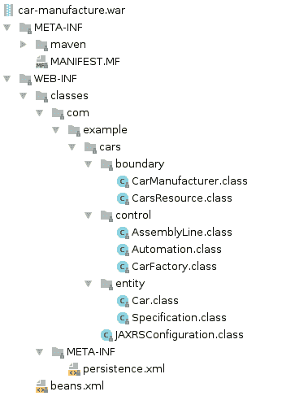
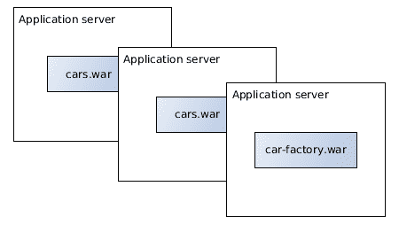

# 轻量级 Java EE

轻量级 Java EE。这甚至可能吗？在过去，J2EE 应用以及特别是应用服务器被认为是一种重量级且繁琐的技术。在一定程度上，这是有道理的。API 的使用相当不便。需要大量的 XML 配置，这最终导致了**XDoclet**的使用，这是一个基于放入 JavaDoc 注释中的元信息生成 XML 的工具。应用服务器的工作也相当繁琐，尤其是在启动和部署时间方面。

然而，自从 Java EE 名称变更以及特别是从版本 6 开始，这些假设已经不再成立。引入了注解，这些注解最初源于 XDoclet 驱动的 JavaDoc 标签。而且已经发生了许多事情来提高生产力和开发者体验。

本章将涵盖以下主题：

+   什么使技术轻量级？

+   为什么 Java EE 标准有助于减少工作量

+   如何选择项目依赖和归档格式

+   零依赖企业应用的优势

+   现代 Java EE 应用服务器

+   每个应用服务器一个应用的方案

# 轻量级企业技术

什么使技术*轻量级*？在容器和云的时代，Java EE 的轻量级、生产力和相关性如何？

轻量级技术的最重要的方面之一是它所提供的生产力和效率。开发团队所花费的时间是宝贵的且昂贵的，因此花费在冗余上的时间越少越好。这包括开发粘合代码、构建项目、编写和执行测试，以及在本地和远程环境中部署软件。理想情况下，工程师可以尽可能多的时间用于实现盈利的业务功能。

因此，技术不应该在业务用例之上增加太多冗余。技术横切关注点当然有必要，但应尽量保持最小化。在前一章中，我们看到了 Java EE 如何使开发者以高效的方式实现业务用例。项目工件构建和部署也应同样旨在最小化所需的时间和精力。

本章和下一章将展示 Java EE 如何支持构建高效的开发工作流程。

# 为什么需要 Java EE 标准？

Java EE 的一个原则是提供高效的企业 API。如前一章中“现代 Java EE 的概念和设计原则”部分所示，最大的优势之一是能够集成不同的标准而无需开发者进行配置。Java EE 的伞形架构要求不同的标准能够良好地协同工作。企业容器必须满足这一要求。软件工程师只需针对 API 进行开发，让应用服务器完成*困难的集成工作*。

按照约定优于配置的方法，使用伞形规范的一部分的不同、集成标准不需要初始配置。如前所述的各个示例所示，Java EE 内部不同标准中产生的技术可以很好地协同工作。我们已经看到了一些示例，例如使用 JSON-B 在 JAX-RS 资源中自动将对象映射到 JSON；通过引入单个注解将 Bean Validation 集成到 JAX-RS 和 HTTP 响应中；将管理 Bean 注入由其他标准定义的实例中，例如 Bean Validation 验证器或 JSON-B 类型适配器；或者在 EJB 中管理跨越 JPA 数据库操作的跨技术事务。

使用一个包含各种可重用技术的伞形标准的替代方案是什么？嗯，引入需要与第三方依赖项手动连接的特定供应商的框架。Java EE API 的最大优点之一是开发者可以直接使用整个技术种类；提供高效集成并节省开发者时间，以便他们可以专注于业务用例。

# 约定优于配置

追求约定优于配置的理念，进一步来说，企业应用可以在没有任何初始配置的情况下进行开发。API 提供了符合大多数用例的默认行为。工程师只有在默认行为不足时才需要付出额外的努力。

这意味着在当今世界，企业项目可以以最小的配置来设置。大量 XML 配置的日子已经过去了。特别是，不提供 Web 前端技术应用可以保持 XML 文件数量最少。

让我们从提供一个 REST 端点的简单应用示例开始，该应用访问数据库和外部系统。REST 端点通过 JAX-RS 集成，JAX-RS 内部使用 servlet 来处理请求。Servlet 传统上是通过位于`WEB-INF`下的`web.xml`部署描述符文件进行配置的。然而，JAX-RS 通过在上一章中展示的`Application`子类和`@ApplicationPath`注解提供了一个快捷方式。这为提供的路径注册了一个 JAX-RS 应用 servlet。在启动时，项目将扫描与 JAX-RS 相关的类，如资源或提供者。在应用启动后，即使没有提供`web.xml`文件，REST 端点也可以处理请求。

管理 Bean 传统上使用`beans.xml`配置文件进行配置。在 Web 归档应用程序中，此文件也位于`WEB-INF`下。如今，它主要用于指定 Bean 发现模式，即默认情况下考虑哪些 CDI Bean。建议配置`bean-discovery-mode`为`all`，而不仅仅是`annotated` Bean。`beans.xml`文件可以覆盖所有类型的 CDI Bean 组合，如拦截器、替代方案、装饰器等。根据 CDI 规范，对于最简单的示例，此文件为空就足够了。

JPA 持久化单元是通过`META-INF`下的`persistence.xml`文件配置的。如前所述，它包含应用程序中使用的数据源定义。通过在领域模型类中添加注解来配置将 JPA 实体映射到数据库表。这种方法将关注点保持在单一位置，并最小化了 XML 的使用。

对于大多数不包含 Web 前端的企业应用程序，这种配置量已经足够。前端技术，如 JSF，通常通过`web.xml`和`faces-config.xml`配置，或者在需要时通过额外的、特定于实现的文件配置。

在过去，供应商特定的配置文件，如`jboss-web.xml`或`glassfish-web.xml`，相当常见。在现代 Java EE 世界中，大多数应用程序不再需要这些解决方案。为了允许可移植性，强烈建议首先使用标准 API 实现功能，只有在合理努力内无法实现时才使用供应商特定的功能。对遗留项目的经验表明，这种方法会导致更好的可管理情况。与供应商特定的功能不同，Java EE 标准保证在未来继续工作。

在应用启动时，容器会扫描可用的类以查找注解和已知类型。管理 Bean、资源、实体、扩展和横切关注点会被发现并适当配置。这种机制对开发者来说是一个巨大的好处。他们不需要在配置文件中显式指定所需的类，而可以依赖服务器的发现；这是控制反转的最佳实践。

# Java EE 项目的依赖管理

企业项目的依赖管理针对的是在 JDK 之上添加的依赖。这包括编译、测试和运行时所需的依赖。在 Java 企业项目中，需要使用带有*provided*依赖范围的 Java EE API。由于 API 在应用服务器上可用，因此不需要包含在打包的归档文件中。因此，提供的 Java EE API 对包大小没有影响。

现实世界的企业项目通常包含比这更多的依赖项。第三方依赖项的典型例子包括日志框架，如**Slf4j**、**Log4j**或**Logback**，JSON 映射框架如**Jackson**，或通用库如**Apache Commons**。这些依赖项存在一些问题。

首先，第三方依赖项通常不提供，这会增加构建物的大小。这听起来可能不是那么有害，但有一些影响我们将在后面看到。添加到最终构建物中的依赖项越多，构建所需的时间就越长。构建系统需要在每次构建项目时将可能很大的依赖项复制到构建物中。正如我们将在第六章“应用开发工作流程”中看到的，项目构建需要尽可能快。添加到包中的每个依赖项都会增加周转时间。

依赖项及其版本的潜在冲突代表了一个更大的挑战。这包括打包依赖项、传递依赖项以及已经存在于应用服务器上的库。例如，日志框架通常已经存在于容器的类路径中，可能版本不同。使用不同版本引入了潜在的问题，即库的聚合。经验表明，通过传递添加的隐式依赖项是这方面的最大挑战。

除了技术原因之外，在轻率地将依赖项引入软件项目之前，还有一些其他方面需要考虑。例如，依赖项许可可能会成为开发向客户发货的软件产品时的问题。不仅公司被允许使用某些依赖项，而且涉及的许可在软件包中也需要相互兼容。满足许可标准的最简单方法是不添加依赖项，至少如果它们没有商业用途的话。工程师在考虑安全方面也应做出类似的考虑，特别是对于为对安全性有高度要求的行业开发的软件。

我曾经参与过一个*消防员*工作，负责更新企业项目的使用框架的版本。该项目包含大量的构建依赖项。随着所有包含的第三方依赖项，项目运行时最终包含了*所有*已知的日志框架。对于 JSON 映射框架也是如此，它们引入了许多版本冲突和运行时依赖项不匹配。这还是在 JSON-B 和 JSON-P 出现之前。我们大部分时间都在配置项目构建，解开并排除项目工件中的传递依赖项。这是使用第三方库时的典型问题。节省项目代码的代价是花费时间和精力配置项目构建，并可能解开依赖项，尤其是如果它们引入了大量传递功能的话。

通过管理构建依赖项，工程师们专注于对业务用例无关紧要的方面。需要问的问题是，当我们引入依赖项的同时，节省一些代码行是否值得。经验表明，在避免重复与轻量级之间的权衡，例如在无依赖项的项目中，往往更倾向于避免重复。一个典型的例子是，为了使用可以用几行代码实现的功能，项目引入了整个 Apache Commons 库。

虽然不重复造轮子，开发可重用的功能版本是良好的实践，但也要考虑其后果。经验表明，引入的依赖项往往被忽视，并且只被有限地利用。其中大部分几乎没有业务价值。

当工程师检查代码质量时，例如使用代码分析工具，还应考虑针对业务用例的依赖项与项目代码的比例，以及*管道*。对于依赖项有一个简单的方法可以应用。在引入第三方依赖项之前，考虑几个问题。添加的功能是否增加了业务价值？它节省了多少项目代码？对最终工件的影响有多大？

例如，假设汽车制造应用程序的一部分用例是使用专有的 Java API 与特定工厂软件进行通信。显然，这种通信对于实现业务目标至关重要，将这个依赖项包含在项目中是非常有意义的。相反，添加不同的日志框架几乎不会提高应用程序的业务价值。此外，第九章*监控、性能和日志*将讨论传统日志的问题。

然而，为了避免不必要地增加构建大小，关键依赖项可以安装在应用程序服务器上，并在项目的构建中声明为提供。

在第一章中，我们看到了共享业务依赖（如共享模型）的困难。理想情况下，应用程序尽可能自给自足。第八章 *微服务和系统架构* 将深入探讨自包含系统和共享无架构的动机。

关于技术依赖，然而，Java EE API 已经包含了大多数企业应用所需的技术。理想情况下，工程师开发零依赖的 Java EE 应用程序，这些应用程序被打包成仅包含相关类的薄部署工件。如果某些用例需要第三方依赖，它们可以安装在容器中。目标是使部署工件具有轻量级的足迹。

对于生产代码，这意味着只包含提供的依赖项，理想情况下，只包含 Java EE API。然而，测试依赖项却是一个不同的情况；软件测试需要一些额外的技术。第七章 *测试* 涵盖了测试范围所需的依赖项。

# 轻量级打包应用程序的方式

零依赖应用程序的方法简化了许多项目构建的担忧。由于没有包含任何依赖项，因此无需管理第三方依赖项的版本或冲突。

这种方法简化了哪些其他方面？无论使用 Gradle 还是 Maven，项目构建在不需要添加任何内容到工件时总是表现出最佳性能。包的大小直接影响构建时间。在零依赖的应用程序的情况下，只包含编译后的类，即只有实际的业务逻辑。因此，生成的构建时间是最小的。所有构建时间都用于编译项目的类、运行测试用例以及将类打包成薄部署工件。采用这种方法构建应该只需几秒钟。是的，几秒钟。一般来说，任何超过 10 秒的项目构建都应该重新考虑。

当然，这条规则对项目构建施加了一定的压力。它自然要求避免包含任何较大的依赖或实现；这些应由应用程序服务器提供。测试运行时间通常是另一个防止快速构建的方面。第七章 *测试* 将阐明如何以有效的方式开发测试。

快速构建是创建零依赖应用程序的一个好处。另一个影响是快速工件传输。构建的工件，如 WAR 或 JAR 文件，通常保存在工件存储库中，以供以后使用，例如**Sonatype Nexus**或**JFrog Artifactory**。如果只涉及少量数据，通过网络传输这些工件会大大加快速度。这适用于所有类型的工件部署。无论构建的存档被发送到何处，较小的体积总是有回报的，尤其是在工作流程经常执行的情况下，例如持续交付。

重新审视实践并剥离所有不提供价值的部分，其目标也针对了应用程序的打包方式。传统上，企业应用程序是以 EAR 文件的形式交付的。这些文件的结构包括一个 Web 存档、一个 WAR 文件和一个或多个企业 JAR 文件。企业 JAR 存档包含了业务逻辑，通常是用 EJB 实现的。Web 存档包含了与业务逻辑通过本地或远程 EJB 进行通信的 Web 服务和前端技术。然而，这种分离并不是必要的，因为所有组件都部署在单个服务器实例上。

在多个子存档中打包几个技术问题不再是必需的。所有业务逻辑以及 Web 服务和横切关注点都打包到一个单一的 WAR 文件中。这极大地简化了项目设置以及构建过程。应用程序不需要在多个层次结构中压缩，只是为了在单个服务器实例上再次解压缩。包含在容器中部署的所需业务代码的 WAR 文件是薄型工件的最佳实现。正因为如此，部署薄型 WAR 文件比相应的 EAR 文件要快。

以下演示了一个典型的薄型 Web 应用程序工件的内容：

部署工件只包含实现业务用例所需的类，没有特定技术的实现，只有最小配置。特别是，不包括库 JAR 文件。

Java EE 平台的架构鼓励轻量级工件。这是因为平台将 API 与实现分离。开发者只针对 API 编程；应用程序服务器实现 API。这使得只发送业务逻辑成为可能，这些业务逻辑包括轻量级工件中的某些方面。除了避免依赖冲突和构建供应商独立解决方案的明显好处外，这种方法还使快速部署成为可能。工件包含的内容越少，容器端需要解包的内容就越少。因此，将企业应用程序打包成一个单一的 WAR 文件是非常推荐的。

在过去的一年里，我们看到了越来越多的兴趣在于将企业应用程序作为*胖*JAR 进行打包，也就是说，将应用程序与其实现一起打包。胖部署工件的方法通常在企业框架，如 Spring 框架中使用。这些方法的背后动机是，所需的依赖项和框架的版本被明确指定，并随业务逻辑一起打包。胖部署工件可以创建为胖 WAR，部署在 servlet 容器上，或者作为独立的、可执行的 JAR 启动。因此，打包为胖 JAR 的 Java EE 应用程序将企业容器与应用程序一起打包在一个可执行的 JAR 中。然而，正如之前所述，如果将第三方依赖项添加到工件中，构建、打包和部署时间将大大增加。

经验表明，将企业实现与应用程序一起明确打包，在大多数情况下不是技术上的原因，而是业务政治上的原因。公司内部对应用程序服务器和 Java 安装缺乏灵活性的运营环境，特别是在版本升级方面，有时迫使开发者寻找解决方案。使用较新技术构建的企业应用程序不能部署在较旧的现有服务器安装上。有时，业务政治上更容易的解决方案是完全忽略现有安装，并直接执行独立的 JAR，这只需要特定的 Java 版本。然而，虽然这些解决方案无疑是合理的，但技术上更合理的解决方案是将应用程序打包到瘦部署工件中。有趣的是，正如我们将在下一章中看到的，在 Linux 容器中打包软件具有两种方法的优势。

另一种有趣的方法允许将整个应用程序作为一个可执行的包进行打包，并保持快速的工作流程进行瘦部署。几个应用程序服务器供应商提供将自定义应用程序容器作为可执行的 JAR 进行打包的解决方案，在启动时将瘦应用程序作为附加参数部署。通过这样做，整个包包括业务逻辑和实现，并作为一个独立的应用程序启动。应用程序仍然与其运行时分离，并打包为所谓的*空*JAR 或 WAR 文件。这种方法在没有使用 Linux 容器的情况下，如果需要这种灵活性，尤其有意义。

作为结论，强烈建议构建瘦部署工件，理想情况下是瘦 WAR 文件。如果出于业务政治原因这种方法不可行，空 JAR 可以提供一个合理的解决方案。然而，正如我们将在下一章中看到的，容器技术，如 Docker，不需要使用可执行 JAR 方法，并提供相同的优势。

# Java EE 应用服务器

除了 API 的生产力之外，还有什么让企业技术变得轻量级？运行时和企业容器呢？

开发者经常抱怨 J2EE 应用服务器运行太慢、使用起来太繁琐、难以操控。安装大小和内存消耗相当高。通常，许多应用程序在服务器实例上并行运行，同时各自重新部署。这种方法有时会引入额外的挑战，例如类加载器层次结构问题。

现代应用服务器远非这种负面形象。大多数应用服务器都针对启动和部署时间进行了大量优化。特别是，服务器内部模块方法，如**开放服务网关倡议**（**OSGi**），通过按需加载所需模块，支持完整的 Java EE API，极大地加快了操作速度。在资源使用方面，与过去相比，应用服务器也取得了很大的进步。现代容器消耗的内存比桌面计算机上运行的浏览器实例要少。例如，一个**Apache TomEE**实例在一秒钟内启动，磁盘上消耗不到 40 兆字节，内存消耗不到 30 兆字节。

管理 bean 的性能开销同样可以忽略不计。实际上，与 CDI 管理 bean 和其他框架，如 Spring 框架相比，无状态 EJBs 表现出最佳结果。这是因为无状态会话 bean 在调用业务方法后会被池化和复用。

此外，应用服务器还管理着连接池和线程池，并允许工程师直接使用这些数据，无需引入自定义指标，从而能够直接从容器中收集统计信息和性能洞察。容器负责提供对这些方面的监控。DevOps 工程师可以直接使用这些数据，而无需引入自定义指标。

除了这些方面，应用服务器还管理着 bean 实例和生命周期、资源以及数据库事务，正如我们在上一章所看到的。

这就是拥有应用容器的意义所在。它执行运行企业应用所需的工作；软件工程师负责处理业务逻辑。容器提供并管理所需资源，并且根据标准被迫提供已部署应用的洞察。由于许多厂商在优化所需技术方面投入了大量努力，资源开销可以保持较低水平。

应用服务器的安装大小仍然比其他企业框架要大一些。截至本书编写时，供应商们正在努力提供更小、按需运行的运行时，以满足应用程序的需求。**MicroProfile** 创新项目包括几个应用服务器供应商，它们定义了与 Java EE 遮罩相补充的附加企业配置文件。这些配置文件也是从 Java EE 标准中组装的。这对于开发者来说是一个非常有趣的方法，因为它不需要在应用程序方面进行任何更改。运行时，即包含的标准集，将根据应用程序的需求进行调整，以满足其业务逻辑。

# 每个应用服务器一个应用程序

传统上，由于安装大小大和启动时间长，应用服务器被用来部署多个，如果不是几十个企业应用程序。服务器实例被多个团队共享，有时是整个公司。这带来了一定的不灵活性，类似于共享应用程序模型。团队不能简单地选择新的 JDK 或服务器版本，或者在没有与其他团队协调的情况下重启或重新配置应用服务器。这自然会阻碍快速和高效的过程，并使持续交付变得复杂。

在团队协作方法、项目和应用程序生命周期方面，因此最简单的方法是在专用应用服务器上部署应用程序。DevOps 团队对其版本、配置和生命周期拥有完全控制权。这种方法简化了流程，避免了与其他团队和技术冲突等潜在问题。部署多个应用程序可能引入的层次化类加载问题也得到了避免。

应用服务器当然代表了一个相当大的结构，仅用于单个应用程序。然而，正如我们之前所看到的，应用服务器的安装大小已经与过去相比有所下降。除此之外，开发者应该更加关注部署实体的尺寸，因为这些是开发工作流程中的移动部分。在持续交付方法中，应用程序可能每天都会被构建和打包多次。项目构建和传输实体的时间越长，周转时间就越长。这会影响每一个构建，并在一天中累积大量的开销。应用服务器并不经常安装和运输。因此，建议将应用程序部署到单个、专用的 Java EE 服务器：

在下一章中，我们将看到容器技术，如 Docker，如何支持这种方法。将应用程序，包括整个堆栈作为容器，直到操作系统，都作为容器运输，鼓励每个应用服务器一个应用程序的方法。

# 摘要

多个 Java EE 标准与约定优于配置方法的无缝集成，最大限度地减少了开发者需要做的样板工作。因此，现代企业应用程序的配置被保持在最低限度。特别是默认约定，适用于大多数企业应用程序，并且只有在需要时才允许覆盖配置，这提高了开发者的生产力。

企业应用程序应尽量减少其依赖性，理想情况下仅依赖于提供的 Java EE API。只有在业务上是必需的，而不是技术上的必需时，才应添加第三方依赖。

Java EE 应用程序应打包为轻量级的 WAR 文件，遵循零依赖的方法。这有助于减少构建和发布应用程序所需的时间。

现代 Java EE 应用程序远非重型 J2EE 运行时的负面形象。它们启动和部署速度快，并试图减少内存影响。虽然应用服务器可能不是最轻量级的运行时，但它们提供了足够的好处，例如集成技术或管理生命周期、连接、事务或线程，否则这些都需要实现。

为了简化应用程序的生命周期和部署，建议每个应用程序服务器部署一个应用程序。这消除了几个潜在挑战，并且完美地适应了现代容器技术世界。下一章将向您展示在云平台时代的这个现代世界，容器技术是什么，以及 Java EE 如何融入这幅画面。
