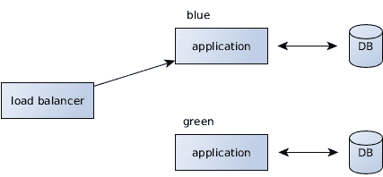
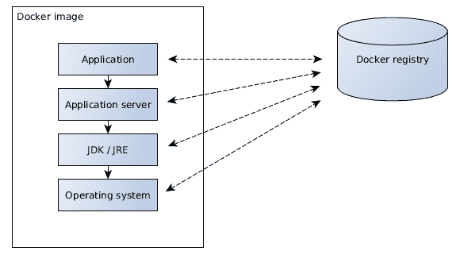
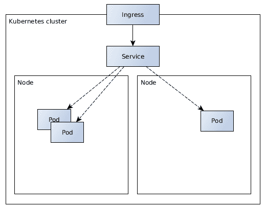

# Java EE 的容器和云环境

过去几年，对容器以及云技术的兴趣很大。绝大多数构建软件的公司至少在考虑将这些环境迁移到这些现代方法。在我最近的所有项目中，这些技术都是讨论的焦点。特别是，引入容器编排技术极大地影响了应用程序的运行方式。

容器技术的益处是什么？为什么公司应该关注云计算？似乎很多这些担忧都被用作流行语，作为一种*银弹*方法。本章将探讨这些技术背后的动机。我们还将看看 Java EE 平台是否为这个新世界做好了准备。

本章将涵盖：

+   基础设施即代码如何支持运营

+   容器技术和编排

+   为什么 Java EE 特别适合这些技术

+   云平台及其动机

+   12 因素，云原生企业应用程序

# 动机与目标

容器、容器编排和云环境背后的动机是什么？为什么我们在这个领域看到如此强劲的动力？

传统上，企业应用程序部署的工作方式如下。应用程序开发者实现了某些业务逻辑并将应用程序构建成一个打包的工件。这个工件被手动部署到由人工管理的应用程序服务器上。在服务器部署或重新配置期间，应用程序通常面临停机时间。

自然地，这种方法是一个相当高风险的过程。人工任务容易出错，并且不能保证每次都以相同的方式进行执行。人类在执行自动化、重复性工作方面相当糟糕。例如安装应用程序服务器、操作系统和服务器等过程，需要精确的文档，特别是为了未来的可重复性。

在过去，操作团队的典型任务是使用票务系统进行订购并手动执行。这样做，服务器安装和配置的风险是将系统转变为不可重复的状态。设置一个与当前环境相同的新环境需要大量的手动调查。

操作任务需要自动化和可重复。安装新的服务器、操作系统或运行时应该始终以完全相同的方式进行执行。自动化流程不仅加快了执行速度，还引入了透明度，揭示了哪些精确步骤已被执行。重新安装环境应该产生与之前完全相同的运行时，包括所有配置和设置。

这也包括应用程序的部署和配置。而不是手动构建和分发应用程序，持续集成服务器负责以自动化、可靠和可重复的方式构建软件。CI 服务器作为软件构建的“黄金真相”来源。在那里产生的工件被部署到所有相关环境中。软件工件在持续集成服务器上构建一次，然后通过集成和端到端测试进行验证，直到最终进入生产环境。因此，部署到生产环境的同一应用程序二进制文件在部署前已经得到了可靠的测试。

另一个非常重要的方面是明确使用软件的版本。这包括所有使用的软件依赖项，从应用程序服务器和 Java 运行时，到操作系统及其二进制文件。重新构建或重新安装软件应每次都产生完全相同的状态。软件依赖项是一个复杂的话题，伴随着许多潜在错误的可能性。应用程序被测试以在具有特定配置和依赖项的特定环境中正常工作。为了确保应用程序按预期工作，它被以在之前已验证的配置中发货。

这个方面也意味着用于验证应用程序行为的测试和预演环境应尽可能接近生产环境。从理论上讲，这个限制听起来是合理的。从经验来看，所使用的环境在软件版本、网络配置、数据库、外部系统、服务器实例数量等方面与生产环境差异很大。为了正确测试应用程序，这些差异应尽可能消除。在“容器”部分，我们将看到容器技术如何在这里提供支持。

# 基础设施即代码

要实现可重复的环境，一个合理的结论是利用**基础设施即代码**（**IaC**）。其理念是所有必需的步骤、配置和版本都明确地定义为代码。这些代码定义直接用于配置基础设施。基础设施即代码可以以程序形式实现，例如脚本，或者以声明方式实现。后一种方法指定了期望的目标状态，并使用额外的工具执行。无论哪种方法被优先考虑，关键是整个环境都作为代码指定，以自动化、可靠和可重复的方式执行，始终产生相同的结果。

无论如何，这种方法意味着将手动步骤保持在最低限度。基础设施即代码最简单的形式是 shell 脚本。脚本应从头到尾执行，无需人工干预。所有 IaC 解决方案都适用同样的原则。

自然地，安装和配置环境的责任从运维团队更多地转向了开发者。由于开发团队对所需的运行时设置了一定的要求，因此所有工程团队共同工作是合理的。这就是 DevOps 运动背后的理念。在过去，操作的心态和方法往往是在应用开发者实现了软件并直接将软件和责任传递给运维团队，而运维团队没有进一步的参与。生产中的潜在错误主要涉及运维团队。这个不幸的过程不仅导致了工程团队之间的紧张关系，而且最终降低了质量。然而，整体目标应该是交付高质量的软件，以满足其目的。

这个目标需要应用开发者的问责制。通过将所有必需的基础设施、配置和软件定义为代码，所有工程团队自然地协同工作。DevOps 旨在实现整个软件团队的问责制。基础设施即代码是一个先决条件，它增加了可重复性、自动化，并最终提高了软件质量。

在“容器”和“容器编排框架”这个主题中，我们将看到所展示的技术是如何实现基础设施即代码（IaC）的。

# 稳定性和生产就绪性

持续交付的实践包括为了提高软件的质量和价值需要做什么。这包括应用程序的稳定性。重新配置和重新部署软件不必导致任何停机时间。新特性和错误修复不必仅在维护窗口期间发布。理想情况下，企业软件可以持续改进并向前发展。

一种*零停机时间*的方法需要一定的努力。为了避免应用程序不可用，至少需要同时存在另一个软件实例。前端需要一个负载均衡器或代理服务器将流量引导到可用的实例。*蓝绿*部署利用了这种技术：



应用程序实例及其数据库由负载均衡器进行复制和代理。涉及的应用程序通常代表不同的软件版本。从*蓝色*路径切换到*绿色*路径，反之亦然，可以立即更改版本，而无需任何停机时间。其他形式的蓝绿部署可以包括多个应用程序实例的场景，这些实例都配置为使用相同的数据库实例。

显然，这种方法并不一定需要使用一些闪亮的新技术。我们过去看到过使用自建解决方案实现零停机时间的蓝绿部署。然而，现代技术支持这些技术，无需太多工程努力即可提高稳定性、质量和生产就绪性。

# 容器

近年来，对**Linux 容器**技术的兴趣日益浓厚。从技术上讲，这种方法并不新颖。像**Solaris**这样的 Linux 操作系统很久以前就支持容器。然而，**Docker**通过提供以统一方式构建、管理和运输容器的功能，在这一技术上实现了突破。

容器和**虚拟机（VMs**）之间的区别是什么？是什么让容器如此有趣？

虚拟机就像计算机中的计算机。它们允许从外部轻松管理运行时，例如快速且理想地以自动化的方式创建、启动、停止和分发机器。如果需要设置新的服务器，可以部署所需类型的蓝图或镜像，而无需每次从头开始安装软件。可以拍摄运行环境的快照以轻松备份当前状态。

在许多方面，容器表现得就像虚拟机。它们与主机以及其他容器分离，在自己的网络和文件系统中运行，并且可能拥有自己的资源。区别在于虚拟机在硬件抽象层上运行，模拟包括操作系统在内的计算机，而容器则直接在主机的内核中运行。与其它内核进程不同，容器通过操作系统功能与系统其他部分分离。它们管理自己的文件系统。因此，容器表现得像独立的机器，但具有原生性能，而没有抽象层的开销。虚拟机的性能自然会因抽象而降低。而虚拟机在操作系统选择上提供了完全的灵活性，容器则始终在相同的内核中运行，因此与宿主操作系统的版本相同。因此，容器不需要携带自己的 Linux 内核，可以最小化到所需的二进制文件。

容器技术，如 Docker，提供了一种统一的方式来构建、运行和分发容器。Docker 将构建容器镜像定义为基础设施即代码（IaC），这再次实现了自动化、可靠性和可重复性。Dockerfile 定义了安装应用程序及其依赖项（例如应用程序容器和 Java 运行时）所需的全部步骤。Dockerfile 中的每一步都对应于在镜像构建时执行的命令。一旦从镜像启动容器，它应该包含完成其任务所需的一切。

容器通常包含一个 Unix 进程，代表一个运行中的服务，例如应用程序服务器、Web 服务器或数据库。如果企业系统由多个运行中的服务器组成，它们将在各自的容器中运行。

Docker 容器的最大优点之一是它们使用 **写时复制** 文件系统。每个构建步骤，以及之后的每个运行中的容器，都在一个分层文件系统上操作，该文件系统不会改变其层，而只是在上面添加新的层。因此，构建的镜像包含多个层。

从镜像创建的容器总是以相同的初始状态启动。运行中的容器可能会作为新的、临时的文件系统层修改文件，一旦容器停止，这些层就会被丢弃。因此，默认情况下，Docker 容器是无状态的运行时环境。这鼓励了可重复性的想法。每个持久行为都需要明确定义。

当重新构建和重新分发镜像时，多个层是有益的。Docker 缓存中间层，并且只重新构建和重新传输已更改的内容。

例如，镜像构建可能由多个步骤组成。首先添加系统二进制文件，然后是 Java 运行时，一个应用程序服务器，最后是我们的应用程序。当对应用程序进行更改并需要新的构建时，只需重新执行最后一步；之前的步骤被缓存。同样，对于通过网络传输镜像也是如此。只有已更改且在目标仓库中尚不存在的层才会实际重新传输。

以下说明了 Docker 镜像的层及其各自的分发：



Docker 镜像要么从头开始构建，即从一个空起点开始，要么基于现有的基础镜像构建。有大量的基础镜像可供选择，包括所有主要的 Linux 发行版，包含包管理器，典型的环境栈以及基于 Java 的镜像。基础镜像是一种在共同基础上构建的方式，并为所有生成的镜像提供基本功能。例如，使用包含 Java 运行时安装的基础镜像是有意义的。如果这个镜像需要更新，例如，为了修复安全问题，所有依赖的镜像都可以重新构建，并通过更新基础镜像版本来接收新内容。正如之前所说，软件构建需要可重复性。因此，我们总是需要为软件工件（如镜像）指定明确的版本。

从先前构建的 Docker 镜像启动的容器需要访问这些镜像。这些镜像通过 Docker 仓库进行分发，例如公开可用的 DockerHub 或公司内部的镜像仓库来分发自己的镜像。本地构建的镜像被推送到这些仓库，并在稍后启动新容器的环境中检索。

# 容器中的 Java EE

结果表明，分层文件系统的方法与 Java EE 将应用程序与运行时分离的方法相匹配。轻量级部署工件仅包含实际的业务逻辑，这部分内容会发生变化，并且每次都需要重建。这些工件部署到一个企业容器上，这个容器不经常改变。Docker 容器镜像是通过逐步、分层构建的。构建企业应用程序镜像包括操作系统基础镜像、Java 运行时、应用程序服务器，最后是应用程序。如果只有应用程序层发生变化，那么只有这一步需要重新执行和重新传输 - 其他所有层只接触一次然后缓存。

轻量级部署工件利用了层的优势，因为只需要重建和重新分配几 KB 的内容。因此，零依赖的应用程序是使用容器的推荐方式。

如前一章所述，每个应用程序服务器部署一个应用程序是有意义的。容器执行单个进程，在这种情况下是包含应用程序的应用程序服务器。因此，应用程序服务器需要在容器中运行的专用容器上运行，这个容器也包含在容器中。应用程序服务器和应用程序都是在镜像构建时添加的。潜在的配置，例如关于数据源、连接池或服务器模块的配置，也是在构建时进行的，通常是通过添加自定义配置文件来实现的。由于容器属于单个应用程序，因此这些组件的配置不会影响其他任何东西。

一旦从镜像启动容器，它应该已经包含完成其工作所需的一切。应用程序以及所有必需的配置必须已经存在。因此，应用程序不再部署到之前运行的容器上，而是在镜像构建时添加，以便在容器运行时存在。这通常是通过将部署工件放入容器的自动部署目录中实现的。一旦配置的应用程序服务器启动，应用程序就会被部署。

容器镜像只构建一次，然后在所有环境中执行。遵循之前可重复工件的想法，在生产中运行的同一样件必须事先进行测试。因此，经过验证的相同 Docker 镜像将被发布到生产环境中。

但如果应用程序在不同的环境中配置不同怎么办？如果需要与不同的外部系统或数据库进行通信怎么办？为了不干扰多个环境，至少使用的数据库实例将不同。在容器中交付的应用程序是从相同的镜像启动的，但有时仍然需要一些变化。

Docker 提供了改变运行容器多个方面的可能性。这包括网络配置、添加卷，即注入位于 Docker 主机上的文件和目录，或添加 Unix 环境变量。环境差异由容器编排从容器外部添加。镜像只为特定版本构建一次，在不同环境中使用和可能修改。这带来了巨大的优势，即这些配置差异不是建模到应用程序中，而是从外部进行管理。这一点对于网络和连接应用程序以及外部系统也是如此，我们将在接下来的章节中看到。

顺便说一句，Linux 容器解决了由于灵活性原因，将应用程序及其实现打包在一起进行运输的商业和政治动机问题。由于容器包含了运行时以及所有必需的依赖项，包括 Java 运行时，因此基础设施只需提供 Docker 运行时即可。所有使用的技术及其版本都是开发团队的责任。

以下代码片段展示了构建企业应用程序`hello-cloud`到**WildFly**基础镜像的`Dockerfile`定义。

```java
FROM jboss/wildfly:10.0.0.Final

COPY target/hello-cloud.war /opt/jboss/wildfly/standalone/deployments/
```

`Dockerfile`指定了特定版本的`jboss/wildfly`基础镜像，该镜像已经包含了 Java 8 运行时和 WildFly 应用程序服务器。它位于应用程序的项目目录中，指向之前由 Maven 构建的`hello-cloud.war`存档文件。WAR 文件被复制到 WildFly 的自动部署目录，并在容器运行时在该位置可用。`jboss/wildfly`基础镜像已经指定了运行命令，即如何运行应用程序服务器，这由`Dockerfile`继承。因此，它不需要再指定命令。在 Docker 构建后，生成的镜像将包含从`jboss/wildfly`基础镜像中的一切，包括*hello-cloud*应用程序。这与从头开始安装 WildFly 应用程序服务器并将 WAR 文件添加到自动部署目录的方法相同。在分发构建的镜像时，只需传输包含薄 WAR 文件的附加层即可。

Java EE 平台的部署模型适合容器世界。将应用程序与企业容器分离利用了 copy-on-write 文件系统的使用，最小化了构建、分发或部署所花费的时间。

# 容器编排框架

让我们从容器抽象层上升一级。容器包括运行特定服务所需的一切，作为无状态、自包含的工件。然而，容器需要被编排以在正确的网络中运行，能够与其他服务通信，并在需要时以正确的配置启动。直接的方法是开发自制的脚本以运行所需的容器。然而，为了实现更灵活的解决方案，同时也能实现生产就绪性，如零停机时间，建议使用容器编排框架。

如**Kubernetes**、**DC/OS**或**Docker Compose**之类的容器编排框架不仅负责运行容器，还要适当地编排、连接和配置它们。对于容器技术同样适用的动机和原则也适用：自动化、可重复性和基础设施即代码（IaC）。软件工程师将期望的目标状态定义为代码，并让编排工具可靠地设置所需的环境。

在深入研究特定的编排解决方案之前，让我们更详细地看看这些基本概念。

编排框架使我们能够将多个容器连接在一起。这通常涉及通过 DNS 使用逻辑名称进行服务查找。如果使用多个物理主机，框架将在这些节点上解析 IP 地址。理想情况下，运行在容器中的应用程序只需连接到外部系统，使用由容器编排解析的逻辑服务名称。例如，一个使用*vehicle*数据库的汽车制造应用程序通过`vehicle-db`主机名进行连接。然后，该主机名通过 DNS 解析，具体取决于应用程序运行的环境。通过逻辑名称连接可以减少应用程序代码中所需的配置，因为配置的连接始终相同。编排只是连接所需的实例。

这适用于所有提供的系统。应用程序、数据库和其他服务器都被抽象为逻辑服务名称，这些名称在运行时被访问和解析。

根据其环境配置容器是编排框架解决的问题的另一个方面。一般来说，建议减少应用程序中所需的配置。然而，有些情况下可能需要一些配置工作。框架的责任是根据具体情况动态注入文件或环境变量，以提供容器配置。

一些容器编排框架提供的生产就绪功能是它们最大的优势之一。应用程序的持续开发会触发新的项目构建，并导致新的容器镜像版本的产生。运行中的容器需要被从这些新版本启动的容器所替换。为了避免停机时间，容器编排使用零停机部署方法来交换运行中的容器。

同样地，容器编排使得通过扩展容器实例的数量来增加工作负载成为可能。在过去，某些应用程序同时运行在多个实例上。如果需要增加实例数量，就必须提供更多的应用程序服务器。在容器世界中，通过简单地启动更多的无状态应用程序容器来实现相同的目标。开发者增加配置的容器副本数；编排框架通过启动更多的容器实例来实现这一变化。

为了在生产环境中运行容器，必须考虑一些编排方面的问题。经验表明，一些公司倾向于构建自己的解决方案，而不是使用既定标准技术。然而，容器编排框架已经很好地解决了这些问题，并且强烈建议至少考虑它们。

# 实现容器编排

我们现在已经看到了容器编排框架所面临的挑战。本节将向您展示**Kubernetes**的核心概念，这是一个最初由 Google 开发来运行其工作负载的解决方案。在撰写本书时，Kubernetes 具有巨大的动力，也是其他编排解决方案（如 RedHat 的**OpenShift**）的基础。我选择这个解决方案是因为它的普及，同时也因为我相信它非常擅长编排工作。然而，重要的点不在于理解所选技术，而在于其背后的动机和概念。

Kubernetes 在节点集群中运行和管理 Linux 容器。Kubernetes 主节点编排工作节点，这些节点执行实际工作，即运行容器。软件工程师通过主节点提供的 API、基于 Web 的 GUI 或命令行工具来控制集群。

运行中的集群由特定类型的所谓资源组成。Kubernetes 的核心资源类型是**pods**、**deployments**和**services**。一个 pod 是一个原子工作负载单元，运行一个或多个 Linux 容器。这意味着应用程序是在 pod 中运行的。

Pod 可以作为独立、单一的资源启动和管理。然而，不直接指定单独的 Pod，而是定义一个部署，封装并管理运行中的 Pod，这样做非常有意义。部署提供了生产就绪功能，如 Pod 的扩展和缩减或滚动更新。它们负责以指定版本可靠地运行我们的应用程序。

系统定义服务以便从集群外部或其他容器内连接到运行中的应用程序。服务提供了上一节中描述的逻辑抽象，它包含了一组 Pod。所有运行特定应用程序的 Pod 都被单个服务抽象，该服务将流量导向活动 Pod。服务路由到活动 Pod 的组合以及管理版本滚动更新的部署使得零停机部署成为可能。应用程序始终通过服务访问，这些服务指向相应的 Pod。

所有核心资源在 Kubernetes **命名空间**内都是唯一的。命名空间封装资源聚合，并可用于建模不同的环境。例如，指向集群外部的系统中的服务可以在不同的命名空间中配置不同。使用外部系统的应用程序始终使用相同的逻辑服务名称，这些名称指向不同的端点。

Kubernetes 支持使用 JSON 或 YAML 文件定义资源作为 IaC。YAML 格式是一种人类可读的数据序列化格式，是 JSON 的超集。它已成为 Kubernetes 中的事实标准。

以下代码片段显示了`hello-cloud`应用程序服务的定义：

```java
---
kind: Service
apiVersion: v1
metadata:
  name: hello-cloud
spec:
  selector:
    app: hello-cloud
  ports:
    - port: 8080
---
```

示例指定了一个服务，该服务将端口`8080`上的流量导向由部署定义的`hello-cloud`Pod。

以下展示了`hello-cloud`部署：

```java
---
kind: Deployment
apiVersion: apps/v1beta1
metadata:
  name: hello-cloud
spec:
  replicas: 1
  template:
    metadata:
      labels:
        app: hello-cloud
    spec:
      containers:
      - name: hello-cloud
        image: docker.example.com/hello-cloud:1
        imagePullPolicy: IfNotPresent
        livenessProbe:
          httpGet:
            path: /
            port: 8080
        readinessProbe:
          httpGet:
            path: /hello-cloud/resources/hello
            port: 8080
      restartPolicy: Always
---
```

部署指定了一个来自给定模板的 Pod，并使用提供的 Docker 镜像。一旦部署创建，Kubernetes 就会尝试通过从镜像启动容器并使用指定的探针测试容器的健康状态来满足 Pod 规范。

容器镜像`docker.example.com/hello-cloud:1`包含了之前构建并分发到 Docker 注册表的商业应用程序。

所有这些资源定义都可以通过使用基于 Web 的 GUI 或 CLI 应用到 Kubernetes 集群。

在创建部署和服务之后，*hello-cloud*应用程序可以通过服务在集群内部访问。要从集群外部访问，需要定义一个路由，例如使用**入口**。入口资源使用特定规则将流量路由到服务。以下是一个示例入口资源，它使`hello-cloud`服务可用：

```java
---
kind: Ingress
apiVersion: extensions/v1beta1
metadata:
  name: hello-cloud
spec:
  rules:
  - host: hello.example.com
    http:
      paths:
      - path: /
        backend:
          serviceName: hello-cloud
          servicePort: 8080
---
```

这些资源现在指定了整个应用，该应用部署到了 Kubernetes 集群中，可以从外部访问，并在集群内部以逻辑服务的形式抽象化。如果其他应用需要与应用通信，它们可以通过 Kubernetes 内部的、可解析的 `hello-cloud` DNS 主机名和端口 `8080` 来实现。

以下图示展示了 *hello-cloud* 应用程序的一个示例设置，其中包含三个副本的 pod，这些 pod 在一个由两个节点组成的 Kubernetes 集群中运行：



除了使用逻辑名称进行服务查找之外，一些应用程序仍然需要额外的配置。因此，Kubernetes 以及其他编排技术都有在运行时动态将文件和环境变量插入容器的可能性。为此，使用了基于键值对的 **配置映射** 概念。配置映射的内容可以作为文件提供，动态挂载到容器中。以下定义了一个示例配置映射，指定了属性文件的内容：

```java
---
kind: ConfigMap
apiVersion: v1
metadata:
  name: hello-cloud-config
data:
  application.properties: |
    hello.greeting=Hello from Kubernetes
    hello.name=Java EE
---
```

配置映射正在被用来将内容作为文件挂载到容器中。配置映射的键将被用作文件名，挂载到一个目录中，其值代表文件内容。pod 定义指定了挂载为卷的配置映射的使用。以下展示了 *hello-cloud* 应用的先前部署定义，使用挂载卷中的 `hello-cloud-config`：

```java
---
kind: Deployment
apiVersion: apps/v1beta1
metadata:
  name: hello-cloud
spec:
  replicas: 1
  template:
    metadata:
      labels:
        app: hello-cloud
    spec:
      containers:
      - name: hello-cloud
        image: docker.example.com/hello-cloud:1
        imagePullPolicy: IfNotPresent
        volumeMounts:
        - name: config-volume
          mountPath: /opt/config
        livenessProbe:
          httpGet:
            path: /
            port: 8080
        readinessProbe:
          httpGet:
            path: /hello-cloud/resources/hello
            port: 8080
      volumes:
      - name: config-volume
        configMap:
          name: hello-cloud-config
      restartPolicy: Always
---
```

部署定义了一个卷，该卷引用了 `hello-cloud-config` 配置映射。该卷挂载到 `/opt/config` 路径，导致配置映射的所有键值对作为文件插入到这个目录中。使用前面演示的配置映射，这将导致一个包含 `hello.greeting` 和 `hello.name` 键条目的 `application.properties` 文件。应用期望在运行时文件位于这个位置。

不同的环境将指定不同的配置映射内容，这取决于所需的配置值。使用动态文件配置应用是一种方法。也有可能注入和覆盖特定的环境变量。以下代码片段也展示了这个例子。当配置值的数量有限时，这种方法是可取的：

```java
# similar to previous example
# ...
        image: docker.example.com/hello-cloud:1
        imagePullPolicy: IfNotPresent
        env:
        - name: GREETING_HELLO_NAME
          valueFrom:
            configMapRef:
              name: hello-cloud-config
              key: hello.name
          livenessProbe:
# ...
```

应用需要配置凭证，例如用于授权外部系统或作为数据库访问。这些凭证最好配置在不同于非关键配置值的地方。除了配置映射之外，Kubernetes 因此还包括了 **机密** 的概念。这些与配置映射类似，也代表键值对，但对人类来说是 Base64 编码的数据。机密及其内容通常不会作为基础设施代码序列化，因为凭证不应拥有无限制的访问权限。

一种常见的做法是使用环境变量在容器中使凭证可访问。以下代码片段展示了如何将秘密 `hello-cloud-secret` 中配置的值包含到 *hello-cloud* 应用程序中：

```java
# similar to previous example
# ...
        image: docker.example.com/hello-cloud:1
        imagePullPolicy: IfNotPresent
        env:
        - name: TOP_SECRET
          valueFrom:
            secretKeyRef:
              name: hello-cloud-secret
              key: topsecret
          livenessProbe:
# ...
```

环境变量 `TOP_SECRET` 是通过引用秘密 `hello-cloud-secret` 中的 `topsecret` 键创建的。这个环境变量在容器运行时可用，可以从运行进程中使用。

一些打包在容器中的应用程序不能仅作为无状态应用程序运行。数据库是这种情况的典型例子。由于容器在其进程退出后会被丢弃，因此它们的文件系统内容也会消失。像数据库这样的服务需要持久状态。为了解决这个问题，Kubernetes 包括 **持久卷**。正如其名所示，这些卷在 Pod 的生命周期之外可用。持久卷动态提供在 Pod 中使用并在其退出后保留的文件和目录。

持久卷由网络附加存储或云存储服务提供支持，具体取决于集群安装。这使得在容器编排集群中运行数据库等存储服务也成为可能。然而，作为一般建议，容器中的持久状态应避免使用。

YAML IaC 定义保存在应用程序仓库的版本控制下。下一章将介绍如何将文件内容应用于 Kubernetes 集群，作为持续交付管道的一部分。

# Java EE 在编排容器中

编排框架在集群环境中编排和集成企业应用程序。它大大减轻了使用应用程序技术的负担。容器编排也极大地简化了配置应用程序和连接外部服务的方式。本节将展示这一点。

# 连接外部服务

客户端控制需要连接以集成外部服务的 URL。传统上，这些 URL 已在文件中配置，可能在各种环境中有所不同。在编排环境中，应用程序可以通过 DNS 使用逻辑名称解析外部服务。以下代码片段展示了如何连接到 *cloud processor* 应用程序：

```java
@ApplicationScoped
public class HelloCloudProcessor {

    private Client client;
    private WebTarget target;

    @PostConstruct
    private void initClient() {
        client = ClientBuilder...
        target = client.target("http://cloud-processor:8080/processor/resources/hello");
    }

    public String processGreeting() {
        ...
    }
}
```

同样的情况也适用于其他 URL，例如数据源定义。应用程序服务器配置可以简单地指向数据库服务的名称，并在运行时使用它解析相应的实例。

# 配置编排应用程序

通过逻辑名称解析服务已经消除了应用程序中的大量配置。由于所有环境中都使用相同的容器镜像，可能需要从编排环境中插入不同的配置。如图中先例所示，Kubernetes 配置映射处理这种情况。"hello-cloud"应用程序期望在运行时，属性文件位于`/opt/config/application.properties`下。因此，项目代码将访问此位置。以下演示了使用 CDI 生产者集成属性文件：

```java
public class HelloGreeter {

    @Inject
    @Config("hello.greeting")
    String greeting;

    @Inject
    @Config("hello.name")
    String greetingName;

    public String processGreeting() {
        return greeting + ", " + greetingName;
    }
}
```

CDI 生产者定义与之前展示的配置示例类似：

```java
@ApplicationScoped
public class ConfigurationExposer {

    private final Properties properties = new Properties();

    @PostConstruct
    private void initProperties() {
        try (InputStream inputStream =
                new FileInputStream("/opt/config/application.properties")) {
            properties.load(inputStream);
        } catch (IOException e) {
            throw new IllegalStateException("Could not init configuration", e);
        }
    }

    @Produces
    @Config("")
    public String exposeConfig(InjectionPoint injectionPoint) {
        Config config = injectionPoint.getAnnotated().getAnnotation(Config.class);
        if (config != null)
            return properties.getProperty(config.value());
        return null;
    }
}
```

`@Config`限定符的定义与第三章中*实现现代 Java 企业应用程序*的先例类似。应用程序将属性文件的内容加载到属性映射中，并使用 CDI 生成配置值。所有受管理的 Bean 都可以注入这些值，这些值来自 Kubernetes 配置映射。

为了实现秘密配置值，Kubernetes 包含了之前展示的秘密概念。一种常见的做法是使用环境变量在容器中使秘密内容可访问。

Java 应用程序使用`System.getenv()`方法来访问环境变量。此功能分别用于秘密和配置映射值。

展示的方法和示例使企业应用程序能够在容器编排集群中部署、管理和配置。它们对于大多数用例来说是足够的。

# 12 要素应用程序和 Java EE

在撰写本书时，**12 要素**应用程序已成为开发**软件即服务**（**SaaS**）应用程序的一种方式。12 要素应用程序方法定义了 12 个软件开发原则。这些原则背后的动机旨在最小化时间和精力，避免软件侵蚀，并拥抱持续交付和云平台。

换句话说，12 要素旨在以现代方式实现企业应用程序。其中一些原则对大多数工程师来说很显然，而其他原则似乎与构建企业应用程序的常见做法相矛盾。

12 要素列表包括：

+   I. 使用版本控制跟踪一个代码库，进行多次部署

+   II. 明确声明并隔离依赖项

+   III. 在环境中存储配置

+   IV. 将后端服务视为附加资源

+   V. 严格分离构建和运行阶段

+   VI. 以一个或多个无状态进程执行应用程序

+   VII. 通过端口绑定导出服务

+   VIII. 通过进程模型进行扩展

+   IX. 通过快速启动和优雅关闭最大化鲁棒性

+   X. 尽可能使开发、测试和生产的相似性最大化

+   XI. 将日志视为事件流

+   XII. 将管理/管理任务作为一次性进程运行

以下解释了每个原则的动机及其在 Java EE 中的实现。

# 在版本控制中跟踪一个代码库，多个部署

这一原则对软件工程师来说听起来相当明显，即声明软件代码应保持在版本控制下，一个仓库，即使是对于多个*部署*。部署与软件实例相关，运行在特定的环境中。因此，单个应用程序的代码库在单个仓库中进行跟踪，而不是每个应用程序或相反，包含所有可能不同环境的规范。

这一原则利用了开发者的生产力，因为所有信息都位于一个仓库下。它对选择的技术无关紧要，因此也支持 Java EE 应用程序。

仓库应包含构建和运行企业应用程序所需的所有源文件。除了 Java 源代码和配置文件外，还包括基础设施即代码。

# 明确声明并隔离依赖

运行应用程序所需的软件依赖及其版本必须明确指定。这不仅包括应用程序编程所依赖的依赖项，例如第三方 API，还包括对 Java 运行时或操作系统的隐式依赖。明确指定所需的版本可以大大减少生产中的兼容性问题。在开发工作流程中，软件版本的组合已经足够测试。在重建二进制文件时版本不同会引入潜在问题。因此，建议明确声明所有软件版本以减少错误概率并实现可重复性。

容器技术通过明确指定所有软件安装步骤简化了这一原则。应明确声明使用的基镜像的版本，以便镜像重建产生相同的结果。因此，应避免使用 Docker 的`latest`标签，而应使用确定的版本。Docker 文件中指定的所有软件安装也应指向明确的版本。带有或没有缓存的 Docker 重建应产生相同的结果。

Java 应用程序使用构建系统指定其依赖项。第一章已经介绍了使用 Maven 和 Gradle 实现可重复构建所必需的内容。在 Java EE 应用程序中，这些依赖项理想情况下应最小化到 Java EE API。

在可能的情况下，建议指定明确的依赖版本，而不仅仅是*最新*版本。只有使用明确版本的软件才能可靠地进行测试。

将依赖项隔离是软件团队分布式开发的一个必要条件。软件工件应通过定义良好的流程，例如工件仓库，可被访问。在软件构建过程中添加的依赖项，无论是否为 Java 运行时安装、Java 工件或操作系统组件，都需要从中央位置分发。例如，**Maven Central**、**DockerHub**或公司内部仓库都支持这种做法。

# 在环境中存储配置

应用程序配置，如数据库、外部系统或凭证等不同环境下的配置，需要在运行时存在。这种配置不应反映在源代码中，而应能够从应用程序外部动态修改。这意味着配置是通过文件、环境变量或其他外部因素检索的。

容器技术和编排框架如前所述支持这些方法。不同环境，如**测试**、**预发布**和**生产**的配置存储在 Kubernetes 配置映射中，并在 Pod 的卷或环境变量中动态使用。

12 个因素原则指出，应用程序“ [...] 应在环境变量中存储配置”。环境变量是插入特定变体的一种直接方式，所有类型的技术都支持。然而，如果配置应用程序涉及大量单个配置值，工程师可能考虑使用容器卷中包含的配置文件。

# 将后端服务视为附加资源

在应用程序中访问的数据库和外部系统被称为**资源**。对于系统来说，一个外部服务或数据库是否是应用程序的一部分不应有任何区别。**资源**应以松散耦合的方式附加到应用程序上。外部系统和数据库应能够被新的实例替换，而不会影响应用程序。

应用程序抽象了访问的外部系统，首先是使用的通信技术。例如，通过 HTTP 或 JDBC 进行通信抽象了实现，并使系统能够被其他系统替换。通过这样做，应用程序仅与其合同耦合：通信协议和定义的模式。JPA、JAX-RS 和 JSON-B 是支持此方法的示例。

容器编排框架将这种方法进一步发展，并将服务抽象为逻辑名称。如前所述，应用程序可以使用服务名称作为主机名，由 DNS 解析。

通常，应用程序开发者应该将系统松散耦合在一起，理想情况下只依赖于协议和模式。在代码级别，后端服务被抽象为独立的组件，例如具有干净接口的单独控件。这样，如果附加资源发生变化，可以最小化更改。

# 严格分离构建和运行阶段

此原则建议将应用程序构建、部署和运行过程分开。这是 Java 企业开发者所熟知的方法。应用程序二进制文件在单独的步骤中构建、部署和运行。软件或配置更改分别在源代码或部署步骤中发生，而不是直接在生产环境中。部署步骤将应用程序二进制文件和潜在配置组合在一起。定义良好的变更和发布管理流程保持企业软件的完整性。

对于绝大多数软件项目，将步骤分开并在持续集成服务器中编排阶段是常见的做法。这是确保可靠性和可重复性的必要条件。第六章，*应用程序开发工作流程*深入探讨了这一主题。

# 将应用程序作为单个或多个无状态进程执行

理想情况下，应用程序作为无状态进程运行，每个用例都是独立执行的，不会影响其他正在运行的进程。潜在状态要么存储在附加资源（如数据库）中，要么被丢弃。因此，比单个请求持续时间长的会话状态违反了这一原则。传统用户会话状态的挑战在于它仅存在于本地应用程序实例中，不可从其他实例访问。在负载均衡器上需要所谓的*粘性会话*是未拥有无状态应用程序的指标。

许多现代技术支持这种方法。例如，具有写时复制的文件系统的 Docker 容器。停止的容器将被丢弃，因此它们的所有状态也将消失。无状态 EJBs 基于类似动机。然而，无状态会话 bean 的实例是池化和重复使用的，因此开发人员需要确保在业务用例调用后没有状态保留。

企业应用程序应该能够在不影响其行为的情况下从头开始重新启动。这也意味着应用程序除了通过定义良好的附加资源外，不共享任何状态。

# 通过端口绑定导出服务

Web 应用程序传统上部署到特定的软件堆栈。例如，Java 企业应用程序部署到企业或 Servlet 容器，而服务器端脚本语言（如 PHP）则在 Web 服务器上运行。因此，应用程序依赖于它们的即时运行时。

12 因素原则建议开发自给自足的应用程序，通过网络端口公开其功能。由于基于 Web 的企业应用程序将通过网络进行通信，因此将服务绑定到端口是最低耦合的方式。

在容器中运行的 Java EE 应用程序支持这种方法，仅导出一个用于与应用程序通信的端口。容器只依赖于 Linux 内核，因此应用程序运行时是透明的。容器编排框架利用这一想法，通过逻辑名称和端口将服务连接到 Pod，如前一个示例所示。Java EE 支持容器使用，因此也支持这一原则。

# 通过进程模型进行扩展

现代应用程序及其环境应在工作负载增加时能够实现可伸缩性。理想情况下，应用程序能够水平扩展，而不仅仅是垂直扩展。区别在于，水平扩展旨在向软件中添加更多单独的、自包含的节点，而垂直扩展则是增加单个节点或进程的资源。然而，垂直扩展是有限的，因为物理节点上的资源不能无限增加。

12 因素应用描述了通过添加更多自包含的、*无共享*进程来向软件中添加并发的程序。工作负载应在多个物理主机之间可分配，通过增加进程数量来实现。进程代表处理系统工作负载的请求或工作线程。

这种方法显示了在无共享方式中实现无状态应用程序的必要性。运行无状态 Java 企业应用程序的容器使系统能够进行扩展。Kubernetes 通过管理副本数量来管理部署中的可伸缩性。

然而，企业应用程序的瓶颈通常是应用程序实例而不是中央数据库。第八章《微服务与系统架构》和第九章《监控、性能和日志》涵盖了分布式系统中的可伸缩性和 Java EE 项目中的一般性能问题。

# 通过快速启动和优雅关闭最大化鲁棒性

第四章，《轻量级 Java EE》已经展示了快速迭代的重要性。12 因素应用的原则要求能够实现速度和弹性的技术。为了快速扩展，软件应在几秒钟内启动，使其能够处理不断增长的工作负载。

应用程序关闭应该优雅地完成正在进行的请求，并妥善关闭所有打开的连接和资源。特别是当关闭信号发生时执行的请求和事务应该被适当地完成，而不是恶意地终止客户端用例。在 Unix 进程方法中，关闭信号以 `SIGTERM` 信号的形式发送。Linux 容器以相同的方式停止，给容器进程一个优雅关闭的机会。当构建容器镜像时，开发者应该注意进程正确处理 Unix 信号，以便在接收到 `SIGTERM` 信号时，应用程序服务器能够优雅地关闭。

Java EE 支持快速启动和优雅关闭。如前所述，现代应用服务器可以在几秒钟内启动和部署应用程序。

由于应用服务器管理着豆类、资源、池化和线程，它们会在 JVM 关闭时妥善关闭资源。开发者不需要自己处理这一方面。管理自定义资源或需要关闭的处理程序，使用预销毁方法来实现适当的关闭。以下是一个使用 JAX-RS 客户端处理程序的客户端控制示例，该处理程序在服务器关闭时被关闭：

```java
@ApplicationScoped
public class CoffeePurchaser {

    private Client client;

    ...

    @PreDestroy
    public void closeClient() {
        client.close();
    }
}
```

平台保证一旦应用服务器关闭，所有管理豆类的预销毁方法都会被调用一次。

# 尽可能保持开发、预发布和生产的相似性

这个 12 要素原则旨在最小化环境之间的差异。

企业应用程序在开发过程的各个环境之间通常存在相当大的差异。有开发环境，可能有几个，例如本地工作站或专用服务器环境，最后是生产环境。这些环境在开发过程中部署的软件工件版本和配置方面存在差异。在环境中同时拥有不同版本的时间跨度越长，这种差异就越大。

团队和人员之间也存在差异。传统上，软件开发者维护自己的开发环境，而运维团队则负责生产环境。这引入了潜在的沟通、流程和使用的技术的差距。

环境之间的技术差异包含最大的风险。与生产环境使用不同工具、技术、外部服务和配置的开发或测试环境，会引入这些差异可能导致错误的风险。软件在这些环境中自动测试，然后再部署到生产环境中。任何未测试的生产差异都可能并最终引入本可以预防的错误。对于在开发或本地环境中交换工具、后端服务或使用的堆栈以轻量级替代品也是同样的情况。

因此，建议尽可能保持环境相似。特别是，容器技术和编排框架高度支持这种方法。正如我们之前看到的，配置、服务和技术的差异被最小化或至少通过环境明确定义。理想情况下，软件景观在开发、测试环境、预生产和生产环境中是相同的。如果不可能实现这一点，服务抽象以及环境管理的配置支持有助于管理差异。

通过持续交付的使用来处理时间和人员差异，这不仅从技术角度，也从组织角度出发。整体的生产时间应尽可能小，以便快速交付特性和错误修复。实施持续交付自然会推动团队和责任的整合。DevOps 运动描述了所有工程师对整体软件的责任。这导致了一种文化，即所有团队都紧密合作或合并成单一的软件工程师团队。

# 将日志视为事件流

企业应用程序传统上会将日志写入磁盘上的日志文件。一些工程师认为，这些信息是了解应用程序最重要的洞察之一。软件项目通常包括配置这些日志文件的内容和格式。然而，将日志数据存储在日志文件中首先只是一个输出格式，通常每行只有一个日志事件。

12 因素应用原则认为，日志应该被视为由应用程序发出的日志事件流。然而，应用程序不应关心路由和将日志文件存储到特定输出格式。相反，它们将日志记录到进程的标准输出。标准输出被运行时环境捕获和处理。

这种方法对于大多数企业开发者来说并不常见，因为所有日志框架、输出格式和工具都存在。然而，在许多服务并行运行的环境中，仍然需要外部捕获和处理日志事件。例如，**Elasticsearch**、**Logstash**和**Kibana**等解决方案已经证明在处理和解析来自多个来源的日志事件复杂情况方面表现良好。将日志事件存储在日志文件中并不一定支持这些方法。

将日志记录到应用程序的标准输出不仅简化了开发，因为路由和存储不再是应用程序的责任。它还减少了对外部依赖的需求，例如日志框架。零依赖应用程序支持这种方法。环境，如容器编排框架，负责捕获和路由事件流。在第九章“监控、性能和日志”中，我们将讨论日志、其必要性和不足之处。

# 将管理/管理任务作为一次性进程运行

这个原则描述了管理或管理任务应该作为独立的短暂进程来执行。理想的技术支持在运行环境中操作的 shell 中的命令执行。

尽管容器封装了 Unix 进程，但它们提供了执行单个命令或打开远程 shell 到容器中的额外功能。因此，工程师可以执行 Java EE 应用服务器提供的管理和行政脚本。然而，在 Java EE 应用程序中，所需的管理和管理任务数量有限。容器运行应用程序服务器进程，该进程自动部署应用程序；不需要进一步的应用程序生命周期管理。

管理任务通常用于调试和故障排除目的。因此，容器和容器编排框架提供了打开远程 shell 到容器或执行一次性命令的可能性。除此之外，第九章“监控、性能和日志”将向您展示收集有关企业应用程序的进一步监控信息所必需的内容。

12 要素的动机是开发无状态、可扩展的企业应用程序，这些应用程序采用持续交付和现代环境平台，优化开发中花费的时间和精力，并试图避免软件侵蚀。12 要素应用程序与其底层系统有一个清晰的合同，并且理想情况下有声明性基础设施定义。

# 云、云原生及其优势

在撰写本书时，对云平台有很大的兴趣。我们目前看到大型公司正在将他们的 IT 基础设施迁移到云服务中。但云平台究竟有哪些好处呢？

首先，我们必须意识到，现代环境不一定必须运行在云平台之上。容器技术和容器编排框架的所有好处都可以通过公司内部基础设施实现。最初，在本地安装 Kubernetes 或 OpenShift 等平台为软件开发团队提供相同的优势。事实上，容器运行时最大的好处之一是抽象容器运行的 环境。那么，为什么云平台对公司来说很有趣呢？

如本书开头所述，软件世界正在比以往任何时候都更快地发展。公司跟上其业务趋势的关键是拥抱敏捷和快速移动。新产品及其新特性的上市时间需要尽可能短。以迭代步骤进行，适应客户需求并持续改进软件满足这一需求。为了实现这一目标，IT 基础设施以及软件工程的各个方面都需要快速和灵活。新环境应通过自动化、可靠和可重复的过程来设置。持续软件交付的相同原则也适用于服务器环境。云平台提供了这种可能性。

想要拥抱敏捷并适应客户需求的公司需要问自己一个问题：*配置新环境需要多长时间？* 这是快速适应的前提。配置全新的环境应该是几分钟内的事情，不应该需要过于复杂的流程，理想情况下不需要人为干预。正如之前所说，在本地实现这样的方法是完全可能的。然而，云服务提供这些好处是现成的，拥有足够的、可扩展的资源。**基础设施即服务**（**IaaS**）或**平台即服务**（**PaaS**）提供的服务可以减轻公司的许多工作负担，使他们能够专注于构建自己的产品。

尽管如此，大型公司在面对云服务时往往持怀疑态度，尤其是在数据安全方面。有趣的是，项目经验表明，当将基础设施环境比较到实际层面时，由复杂企业运营的云平台提供的环境通常比大多数本地环境更安全。云平台提供商投入了大量时间和精力来构建适当的解决方案。特别是将云平台服务与编排解决方案相结合，如 Docker Compose、Kubernetes 或 OpenShift，具有很大的潜力。

有趣的是，公司将其 IT 迁移到云中的主要论点之一是出于经济原因。从经验来看，许多公司希望通过使用云平台来节省成本。实际上，当考虑到将整个迁移和转型过程，包括团队、技术和最重要的是专业知识，都纳入考量时，本地解决方案通常仍然更便宜。然而，云服务的主要优势在于灵活性和快速移动的能力。如果一个 IT 公司维护一个良好的协调景观，包括自动化、可靠和可重复的过程，那么保持并持续改进这种方法是明智的。话虽如此，关于现代环境的问题，与其说是关于是否使用云平台，不如说是关于流程、团队心态和合理的技术。

# 云原生

除了对云技术的兴趣之外，对术语**云原生**也非常感兴趣，它描述了除了遵循 12 要素之外，与云平台有强烈关系的应用程序。云原生和 12 要素应用不是同义词；云原生包括 12 要素，以及其他一些内容。

云原生应用旨在在云 PaaS 服务上运行，利用其所有优势和挑战，拥抱容器技术和弹性可伸缩性。它们旨在提供现代、可扩展、无状态和具有弹性的应用程序，可在现代编排环境中进行管理。与术语*native*所暗示的相反，遵循此方法的应用程序不一定必须作为*green-field*项目来构建，从第一天起就支持云技术。

云原生应用除了 12 要素之外，重要的方面还包括监控和应用健康问题，这可以总结为遥测。企业应用的遥测包括响应性、监控、特定领域的洞察、健康检查和调试。正如我们之前所看到的，容器编排至少支持我们解决最后两个问题：健康检查和调试。运行中的应用程序会被探测，以确定它们是否仍然存活且健康。通过评估日志事件流、连接到运行中的容器或执行进程，可以进行调试和故障排除。

应用程序监控需要由运行中的容器暴露出来。这需要软件开发人员付出更多努力。特定领域的指标需要由业务专家首先定义。这取决于哪些指标对业务部门感兴趣，并且将由应用程序暴露出来。技术指标也来自运行中的应用程序。第九章，*监控、性能和日志*，涵盖了关于现代环境中的监控主题。

12 要素不包括的另一个方面是 API 及其安全性。SaaS 应用程序通过暴露的 API 进行通信，这些 API 必须为其他开发团队所知晓。Web 服务的性质和结构需要在开发过程中进行文档化和协商。这在 HTTP API 没有实现超媒体的情况下尤其如此。应用程序需要了解交换信息的性质和结构——理想情况下，在开发过程的早期就应如此。这还包括身份验证和授权。应用程序开发人员应该意识到在与其他服务通信之前需要解决的网络安全机制。一般来说，在开发之后才考虑安全方面是不明智的。第十章，*安全*，涵盖了关于云环境和集成到 Java EE 应用程序中的这个主题。

为了为所有拥抱云平台的技术构建一个伞状结构，几家软件供应商共同成立了**云原生计算基金会**。它是 Linux 基金会的一部分，代表云原生开源软件的基础。它包含技术，可以编排、管理、监控、跟踪或以其他方式支持在现代环境中运行的容器化**微服务**。截至撰写本书时，Cloud Native Computing Foundation 的技术项目示例包括**Kubernetes**、**Prometheus**、**OpenTracing**或**containerd**。

# 摘要

运营任务需要自动化。设置应用程序环境应始终产生相同的结果，包括安装、网络和配置。容器技术和基础设施即代码通过定义、自动化和分发软件安装和配置来支持这一点。它们满足了快速且可重复地重建软件和系统的必要性。

基础设施即代码定义指定了所需的基础设施及其所有依赖项，作为应用程序代码的一部分，并保持在版本控制之下。这种方法支持 DevOps 运动背后的理念。不仅定义应用程序，还包括其运行时以及所有要求的责任，将不同的团队聚集在一起。所有工程师都应该有责任交付服务于商业目的的高质量软件。

容器技术，如 Docker，提供了一种统一的方式来构建、管理和运输容器。Docker 的写时复制层文件系统使我们能够通过仅重新执行已更改的步骤来最小化构建和发布时间。Java EE 零依赖应用程序通过将应用程序逻辑与其实现分离，鼓励使用容器技术。因此，变化的层只包含业务代码。

容器编排框架，如 Kubernetes，管理容器的生命周期、网络和外部配置。它们负责查找服务，提供生产就绪性，如零停机时间部署，以及扩展和缩减应用程序实例。容器编排支持基础设施即代码定义，这些定义包含应用程序所需的整个运行时环境的配置。

12 因子和云原生方法旨在以最短的时间和最小的努力开发现代企业应用，避免软件侵蚀，并支持持续交付和云平台。12 因子原则针对软件依赖、配置、依赖服务、运行时环境、日志和行政流程。同样，云原生应用旨在构建在云平台上运行良好的企业软件，支持监控、弹性、应用健康和安全。由于这些方法不受特定技术的限制，它们可以使用 Java EE 实现。我们已经看到了遵循这些原则的动机。

下一章将向您展示如何构建基于容器技术的生产力应用开发工作流程。
