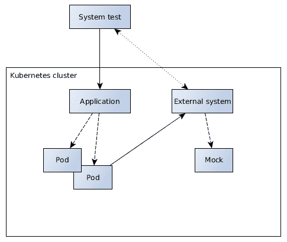

# 测试

如前一章所述，持续交付管道允许开发者以恒定的速度和质量发布软件。为了达到这一质量标准，需要自动化软件测试。从事功能开发的工作者希望确保一切按预期工作。当软件项目发展、变化并可能破坏现有行为时，这一点尤为重要。开发者需要确保没有引入不希望出现的副作用。

理想情况下，构建管道中包含的软件测试足够，无需进一步的手动验证，即可部署到生产环境中。

本章将涵盖以下主题：

+   软件测试的要求

+   不同的测试级别和范围

+   单元测试、组件测试、集成测试、系统测试和性能测试

+   如何在本地运行测试场景

+   如何构建可维护的测试

+   需要的测试技术

# 测试的必要性

测试是确保在后期生产中某个功能以特定方式行为所必需的。在所有类型的制造业务中，测试是过程的一个自然部分。一辆汽车有无数个部件需要独立以及相互依赖地进行测试。没有人愿意驾驶一辆在真实街道上首次进行测试跑车的汽车。

测试模拟生产行为，并在安全环境中验证组件。在测试运行期间损坏的制造部件是积极的事情；它们只是指出了潜在的错误，而且仅仅损失了时间和材料。在生产中损坏的部件可能造成更大的损害。

对于软件测试来说，也是如此。测试失败是积极的事情，最坏的情况是浪费了一些时间和精力，最好的情况是防止潜在的缺陷进入生产。

如前所述，测试需要在尽可能少的人类交互下运行。人类擅长思考合理的测试用例和构建创意测试场景。然而，计算机在执行这些任务方面更胜一筹。在给出明确的验证指令后，计算机也能很好地验证复杂的测试。随着时间的推移，软件变得越来越复杂，手动验证行为所需的努力越来越大，而且随着时间的推移更容易出错。计算机在重复性任务上表现更好，也更可靠。

可靠的自动化软件测试是快速发展的先决条件。自动化测试可以多次执行，验证整个应用程序。构建每天运行多次，每次都执行所有测试——即使只有微小的更改——并允许经过验证的版本投入生产。如果由人类执行测试，这是不可行的。

自动化测试提高了持续交付过程的可靠性和信心。对于直接进入生产的持续部署来说，绝对需要足够的自动化测试场景。当所有提交都是生产部署的潜在候选者时，所有软件行为都必须在事先得到充分验证。没有这种自动化验证，持续部署将不可能实现。

# 优秀测试的要求

当今的软件世界普遍认为测试对工作软件至关重要。但什么是一个好的软件测试？我们必须测试哪些软件组件？更重要的是，我们如何开发精心设计的测试？

通常，测试应满足以下要求：

+   可预测性

+   隔离性

+   可靠性

+   快速执行

+   自动化

+   可维护性

以下描述了这些要求。

# 可预测性

首先，软件测试必须是稳定的、可预测的和可重复的。必须可预测地产生相同的测试用例结果，即通过或失败。有时通过有时失败的测试根本没有任何帮助。它们要么通过提供假阳性结果来分散开发者的注意力，要么通过提供假阴性结果来抑制实际的错误。

需要考虑的情况包括当前时间、时区、地区、随机生成数据以及其他可能干扰的测试的并发执行。测试场景应可预测且明确设置，以便这些情况不会影响结果。如果测试的功能实际上受到这些因素的影响，这是一个需要考虑不同配置的额外测试场景的迹象。

# 隔离性

预测性的要求也与隔离性相关。测试用例必须独立运行，不得影响其他测试。更改和维护测试用例也不应影响其他测试场景。

除了利用可预测性和可维护性之外，隔离测试还对错误的可重复性有影响。复杂的测试场景可能包含许多关注点和责任，这可能会使找到失败测试的根本原因变得困难。然而，具有较小范围的隔离测试可以限制原因的可能性，并使开发者能够更快地找到错误。

企业项目通常具有的几个测试范围，我们将在本章后面看到，也伴随着几个测试隔离层。范围较小的测试，如单元测试，比例如端到端测试运行得更隔离。在不同的范围内编写测试用例，意味着不同的测试隔离层，这当然是有意义的。

# 可靠性

理想情况下，项目的软件测试应可靠地测试所有功能。口头禅应该是：通过测试的软件适合生产使用。这当然是一个值得追求的目标，例如通过持续改进。

使用持续交付和特别是持续部署需要可靠且充足的测试环境。软件测试是生产部署前的最终质量屏障。

通过的可靠测试不应需要任何进一步的交互。因此，如果整体执行成功，它们不应输出冗长的日志。虽然执行过程中发生的事情的详细解释对于失败的测试非常有帮助，但在通过运行中它变得分散注意力。

# 快速执行

如前所述，测试需要快速执行。快速运行的测试是提供快速反馈的开发管道的必要条件。特别是随着测试数量随着时间的推移通过持续改进而增加，保持管道有效率的唯一方法就是保持测试执行时间低。

通常，测试执行花费最多的时间是启动测试技术。特别是使用嵌入式容器的集成测试，消耗了大量的启动时间。实际执行测试所花费的时间在大多数情况下并不是一个大问题。

耗费大量时间的测试与质量持续改进的理念相矛盾。随着项目中新增加的测试用例和场景越多，整体测试执行时间就越长，反馈就越慢。特别是在快速变化的世界中，软件测试需要尽可能快地执行。本章的其余部分将向您展示我们如何实现这一目标，特别是在端到端测试场景方面。

# 自动化

自动化是快速反馈的前提。持续交付管道步骤应尽可能减少人工干预。测试场景也是如此。执行软件测试和验证其结果应完全且可靠地运行，无需人工交互。

测试用例定义了功能的预期行为，并验证结果是否符合预期。然后，测试将可靠地通过，无需额外通知，或者在详细说明的情况下失败。通过测试不应需要任何进一步的人工交互。

尤其是具有大量或复杂测试数据的场景，在自动化测试用例方面代表了一定的挑战。为了处理这个问题，工程师应该以可维护的方式编写测试用例。

# 可维护性

开发测试用例是一回事。在功能发生变化时保持高效且覆盖良好的测试用例是另一回事。测试场景设计不当的挑战在于，一旦生产功能发生变化，测试也需要相应地改变，这需要大量的时间和精力。

编写测试用例需要与生产代码相同的关注和努力。经验表明，如果没有投入这种努力，测试用例中会包含大量的重复和多重责任。与生产代码一样，测试代码也需要重构。

应该能够在不花费太多努力的情况下更改或扩展测试场景。特别是需要更改的测试数据需要有效地表示。

可维护的测试是企业项目的先决条件，这些项目具有适当的测试覆盖率，同时对其业务逻辑的变化具有灵活性。能够适应快速变化的世界需要可调整的测试场景。

# 需要测试的内容

在我们深入探讨如何创建有效、快速、可靠、自动化和可维护的测试用例之前，让我们先看看需要测试哪些资产。这些测试包括代码层测试以及端到端测试。代码层测试基于项目的源代码，通常在开发和构建时执行，而端到端测试则对所有类型的运行应用程序进行操作。

根据测试范围，我们将在下一节中了解，存在不同的测试层，无论是测试操作在类、多个组件、企业应用程序还是整个环境中。在所有情况下，测试对象都需要从外部关注点中隔离出来。测试的本质是在特定条件下验证某些行为。测试对象周围的环境，如测试用例以及使用的组件，必须相应地与测试对象交互。因此，测试用例将控制测试对象。这不仅包括代码级别的测试，还包括模拟和模拟外部系统的端到端测试。

最重要的是，软件测试应该验证业务行为。所有指定的用例都必须执行某些逻辑，这些逻辑在生产部署之前必须经过测试。因此，软件测试应该验证应用程序是否满足业务需求。同时，还需要涵盖特殊情况和边缘情况以及负面测试。

例如，测试身份验证功能不仅需要验证用户能否使用正确的凭据登录，还需要验证他们不能使用错误的凭据登录。这个例子中的一个边缘情况是验证身份验证组件在用户成功登录后立即通知密码即将到期的用户。

除了业务行为之外，还需要测试技术方面和横切组件。需要验证访问的数据库和外部系统以及通信形式，以确保团队的工作效率。这些关注点最好在端到端测试中进行测试。

在所有情况下，测试对象在测试过程中不应被修改，而应按照在生产环境中工作的方式运行。这对于创建不会在以后改变其行为的可靠测试至关重要。对于代码级别的测试，这只需要确保所有相关组件的内容相同。对于端到端测试，这包括整个企业应用程序以及应用程序运行时的安装和配置。

# 测试范围的定义

需要考虑的测试范围和责任有几个。以下将介绍本章剩余部分将涵盖的不同范围。

某些命名，如*集成测试*，在各个企业项目中使用得模糊不清。本子章节定义了用于本书其余部分的统一测试范围名称。

# 单元测试

单元测试验证应用程序单个单元的行为。单元测试通常代表一个类，在某些情况下是一两个相互依赖的类。

单元测试在代码级别上操作。它们通常在开发期间在 IDE 中执行，也是应用程序打包前的构建过程的一部分。单元测试是所有测试范围中执行时间最短的。它们仅执行可以在代码级别上轻松实例化的有限功能。单元的潜在依赖通过模拟或哑类进行模拟。

# 组件测试

组件测试验证一个连贯组件的行为。它们不仅跨越单个单元，而且仍然在代码级别上操作。组件测试旨在将多个组件集成在一起，这验证了相互依赖的行为，而无需设置容器环境。

组件测试的范围是在不运行可能缓慢的模拟环境中的应用程序的情况下提供比单元测试更多的集成。与单元测试类似，它们使用模拟功能来界定和模拟测试边界。不需要嵌入式或远程企业容器。

# 集成测试

对于集成测试代表什么以及如何设计它们，存在很多分歧。目标集成可以在多个级别发生。

我将使用这个术语，因为它在 Java 生态系统中被广泛使用，并且在 Maven 约定中表示。集成测试在代码级别上运行，提供多个单元和组件的集成，并且通常运行一些更复杂或更简单的测试框架。这是与组件测试的主要区别。

集成测试的范围与组件测试相似，也集成多个单元；然而，重点是集成。这种集成更多与技术相关而不是与业务相关。例如，管理豆可以使用 CDI 注入通过限定符或 CDI 生产者获取某些依赖。开发者需要验证 CDI*管道*是否已经正确完成，也就是说，已经使用了正确的注解，而无需将应用程序部署到服务器。

测试框架启动一个嵌入式运行时，该运行时会构建几个组件，并对它们执行代码级别的测试。

然而，组件测试仅关注业务逻辑，并且局限于简单依赖，这些依赖容易在没有复杂容器的情况下解决。一般来说，组件测试更适合测试业务用例，因为它们包含的移动部件较少，运行速度更快。

# 系统测试

“系统测试”一词有时也模糊地使用。在此上下文中，该术语涵盖了所有运行应用程序或整个系统的测试用例，以端到端的方式验证用例。有时分别使用“验收测试”或“集成测试”等术语。然而，本书始终使用“系统测试”一词来指代端到端测试。

系统测试对于验证已部署的应用程序按预期工作非常重要，包括业务逻辑和技术问题。虽然大多数业务逻辑应该已经通过单元和组件测试得到覆盖，但系统测试验证的是整体行为，包括所有外部系统，是否符合预期。这包括功能如何在系统景观中集成和交互。

为了让一个应用程序提供价值，仅仅包含业务逻辑是不够的，还需要考虑如何访问这些逻辑。这需要在端到端的方式下进行验证。

由于本书针对的是后端应用程序，因此在此不考虑 UI 级别测试；这包括 UI 端到端测试以及 UI 响应性测试。开发者通常使用如**Arquillian Graphene**等测试技术来开发 UI 测试。本章中描述的系统测试方法也适用于 UI 级别测试。

# 性能测试

性能测试验证了系统在特定工作负载下的响应性和正确行为方面的非功能性方面。

需要确保应用程序不仅能在实验室条件下提供业务价值，而且在生产环境中也能如此。在生产环境中，系统的负载可能会因应用程序的性质和使用案例而大幅变化。公开可用的应用程序也面临着成为拒绝服务攻击目标的危险。

性能测试是检测由应用程序引起的潜在性能问题的有用工具。例如，这包括资源泄漏、配置错误、死锁情况或缺少超时。将应用程序置于模拟的工作负载下将这些问题暴露出来。

然而，正如我们在第九章“监控、性能和日志记录”中将要看到的，性能测试并不一定有助于预测生产环境的响应性或调整应用程序的性能。它们应该用作防止明显错误的障碍，提供快速的反馈。

在本书的剩余部分，我将使用“性能测试”一词来描述性能测试以及将应用程序置于性能负载下的负载或压力测试。

# 压力测试

与性能测试类似，压力测试旨在将系统置于一定的压力之下，以验证在异常情况下的正确行为。虽然性能测试主要针对应用程序在责任和稳定性方面的性能，但压力测试可以涵盖所有试图使系统崩溃的方面和尝试。

这包括无效调用、忽视通信契约，或来自环境的随机、意外事件。这里列出的测试列表并不全面，并且超出了本书的范围。

然而，为了举几个例子，压力测试可能验证对 HTTP 连接的误用，例如 SYN 洪水、DDoS 攻击、基础设施意外关闭，或者更进一步，所谓的模糊或猴子测试。

创建包含大量压力测试的复杂测试框架实际上超出了大多数项目的范围。然而，对于企业项目来说，包含一些与使用环境相匹配的合理压力测试是有意义的。

# 实现测试

在动机、需求和不同范围之后，让我们更深入地了解一下如何在 Java 企业项目中编写测试用例。

# 单元测试

单元测试验证应用程序各个单元的行为。在 Java EE 应用程序中，这通常涉及单个实体、边界和控制类。

为了对单个类进行单元测试，不需要详尽的测试用例。理想情况下，实例化测试对象并设置最小依赖关系应该足以调用和验证其业务功能。

现代 Java EE 支持这种做法。Java EE 组件，如 EJB 以及 CDI 管理豆，可以通过简单地实例化类以直接方式测试。正如我们之前看到的，现代企业组件代表普通的 Java 对象，包括注解，而不需要扩展或实现技术驱动的超类或接口，即所谓的无接口视图。

这允许测试实例化 EJB 或 CDI 类，并按需将它们连接起来。用于测试案例无关的代理，如注入的控制，被模拟掉。通过这样做，我们定义了测试用例的边界，应该测试什么，以及什么是不相关的。模拟的代理使能够验证测试对象的交互。

模拟对象模拟其实例类型的实际行为。在模拟对象上调用方法通常只会返回虚拟或模拟值。测试对象不知道它们正在与模拟对象通信。模拟对象的行为以及调用方法的验证都在测试场景内进行控制。

# 实现

让我们从对 Java EE 核心组件的单元测试开始。`CarManufacturer` 边界执行某些业务逻辑并调用 `CarFactory` 代理控制：

```java
@Stateless
public class CarManufacturer {
    @Inject
    CarFactory carFactory;

    @PersistenceContext
    EntityManager entityManager;

    public Car manufactureCar(Specification spec) {
        Car car = carFactory.createCar(spec);
        entityManager.merge(car);
        return car;
    }
}
```

由于 EJB 边界是一个普通的 Java 类，它可以在单元测试中实例化和设置。最常用的 Java 单元测试技术是 **JUnit** 与 **Mockito** 用于模拟。以下代码片段展示了汽车制造商测试用例，实例化边界测试对象并使用 Mockito 模拟使用的代理：

```java
import org.junit.Before;
import org.junit.Test;
import static org.assertj.core.api.Assertions.assertThat;
import static org.mockito.ArgumentMatchers.any;
import static org.mockito.Mockito.*;

public class CarManufacturerTest {

    private CarManufacturer testObject;

    @Before
    public void setUp() {
        testObject = new CarManufacturer();
        testObject.carFactory = mock(CarFactory.class);
        testObject.entityManager = mock(EntityManager.class);
    }

    @Test
    public void test() {
        Specification spec = ...
        Car car = ...

        when(testObject.entityManager.merge(any())).then(a -> a.getArgument(0));
        when(testObject.carFactory.createCar(any())).thenReturn(car);

        assertThat(testObject.manufactureCar(spec)).isEqualTo(car);

        verify(testObject.carFactory).createCar(spec);
        verify(testObject.entityManager).merge(car);
    }
}
```

JUnit 框架在测试执行期间一次性实例化 `CarManufacturerTest` 测试类。

`@Before` 方法，这里的 `setUp()`，在每次 `@Test` 方法运行之前都会执行。同样，被 `@After` 注解的方法在每次测试运行之后执行。然而，`@BeforeClass` 和 `@AfterClass` 方法，分别在测试类执行前和执行后只执行一次。

Mockito 方法，如 `mock()`、`when()` 或 `verify()`，分别用于创建、设置和验证模拟行为。模拟对象被指示以某种方式行为。测试执行后，它们可以验证是否对其调用了某些功能。

这确实是一个简单的例子，但它包含了单元测试核心组件的精髓。不需要进一步的自定义测试运行器，也不需要嵌入式容器来验证边界行为的边界。与自定义运行器相比，JUnit 框架可以以非常高的速率运行单元测试。在现代硬件上，数百个这样的例子将很快被执行。启动时间短，其余的只是 Java 代码执行，测试框架的额外开销很小。

一些读者可能已经注意到了 `CarManufacturer` 类的包私有可见性。这是为了提供更好的可测试性，以便能够在实例化类上设置代理。位于与边界相同包中的测试类能够修改其依赖项。然而，工程师可能会认为这违反了边界的封装。从理论上讲，他们是正确的，但一旦组件在企业容器中运行，任何调用者都无法修改引用。引用的对象不是实际的代理，而是一个代理，因此 CDI 实现可以防止误用。当然，可以使用反射或基于构造函数的注入来注入模拟对象。然而，字段注入与在测试用例中直接设置依赖项相结合提供了更好的可读性，同时保持了相同的生产行为。截至目前，许多企业项目已同意使用字段依赖注入和包私有可见性。

另一个讨论点是是否使用自定义 JUnit 运行器，如 `MockitoJUnitRunner`，与自定义模拟注解或如前所述的普通设置方法一起使用。以下代码片段展示了使用自定义运行器的更密集的示例：

```java
import org.junit.runner.RunWith;
import org.mockito.InjectMocks;
import org.mockito.Mock;
import org.mockito.junit.MockitoJUnitRunner;

@RunWith(MockitoJUnitRunner.class)
public class CarManufacturerTest {

    @InjectMocks
    private CarManufacturer testObject;

    @Mock
    private CarFactory carFactory;

    @Mock
    private EntityManager entityManager;

    @Test
    public void test() {
        ...
        when(carFactory.createCar(any())).thenReturn(car);
        ...
        verify(carFactory).createCar(spec);
    }
}
```

使用自定义 Mockito 运行器允许开发者用更少的代码配置测试，并在服务类中定义具有私有可见性的注入。使用如前所述的普通方法提供了更复杂的模拟场景的更多灵活性。然而，确实使用哪种方法来运行和定义 Mockito 模拟是一个口味问题。

参数化测试是 JUnit 的附加功能，用于定义在场景上相似但输入和输出数据不同的测试用例。`manufactureCar()`方法可以用各种输入数据进行测试，从而产生略有不同的结果。参数化测试用例使开发这些场景更加高效。以下代码片段显示了此类测试用例的示例：

```java
import org.junit.runners.Parameterized;

@RunWith(Parameterized.class)
public class CarManufacturerMassTest {

    private CarManufacturer testObject;

    @Parameterized.Parameter(0)
    public Color chassisColor;

    @Parameterized.Parameter(1)
    public EngineType engineType;

    @Before
    public void setUp() {
        testObject = new CarManufacturer();
        testObject.carFactory = mock(CarFactory.class);
        ...
    }

    @Test
    public void test() {
        // chassisColor & engineType
        ...
    }

    @Parameterized.Parameters(name = "chassis: {0}, engine type: {1}")
    public static Collection<Object[]> testData() {
        return Arrays.asList(
                new Object[]{Color.RED, EngineType.DIESEL, ...},
                new Object[]{Color.BLACK, EngineType.DIESEL, ...}
        );
    }
}
```

参数化测试类根据`@Parameters`测试数据方法中的数据实例化和执行。返回集合中的每个元素都会导致单独的测试执行。测试类填充其参数属性，并像往常一样继续文本执行。测试数据包含测试输入参数以及预期值。

这种参数化方法的好处是它允许开发者通过在`testData()`方法中添加另一行来简单地添加新的测试用例。前面的示例显示了使用模拟的参数化单元测试的组合。这种组合仅使用之前描述的纯 Mockito 方法，而不是使用`MockitoJUnitRunner`。

# 技术

这些示例使用 JUnit 4，在撰写本文时，它是使用最广泛的单元测试框架版本。Mockito 用于模拟对象，并为大多数用例提供了足够的灵活性。为了断言条件，这些示例使用**AssertJ**作为测试匹配库。它提供了使用生产方法链调用来验证对象状态的功能。

这些技术作为所需测试方面的示例。然而，这里的重点不是规定某些功能，而是展示针对这些测试要求的具体、合理的选择。提供类似功能和益处的其他技术同样值得推荐。

另一个广泛使用的技术典型示例是 Hamcrest 匹配器作为测试匹配库，或者较少使用的**TestNG**单元测试框架。

到你阅读这篇文章的时候，JUnit 版本 5 已经出现，它提供了一些额外的功能，特别是在动态测试方面。动态测试与参数化测试有类似的动机，通过程序化和动态地定义测试用例。

# 组件测试

组件测试验证一个连贯组件的行为。它们提供了比单元测试更多的集成，而不需要在模拟环境中运行应用程序。

# 动机

为了测试集成，需要验证由几个相互依赖的类表示的连贯功能的行为。组件测试应该尽可能快地运行，同时仍然隔离功能，即测试连贯单元。因此，它们旨在通过集成比单元测试更多的逻辑来提供快速的反馈。组件测试验证业务用例，从边界到涉及的控制。

由于大多数受管理的 Bean 使用相当直接的代理，因此可以进行代码级别的组件测试。注入的类型在大多数情况下可以直接解析，无需接口或限定符，甚至在没有嵌入式容器的情况下也可以实例化和注入。这使得组件测试可以使用与单元测试相同的测试框架来实现。所需的代理和模拟作为测试用例的一部分进行设置。我们想要展示的测试场景从业务用例的开始到注入的控制。

以下示例将检查如何使用一些基本的代码质量实践来实现组件测试，这些实践有助于编写可维护的测试。

# 实现

想象一下在之前“单元测试”部分中展示的整个制造汽车用例需要被测试。使用代理`CarFactory`创建一辆车，然后将其持久化到数据库中。测试持久化层超出了这个测试范围，因此实体管理器将被模拟。

以下代码片段展示了针对制造汽车用例的组件测试：

```java
public class ManufactureCarTest {

    private CarManufacturer carManufacturer;

    @Before
    public void setUp() {
        carManufacturer = new CarManufacturer();
        carManufacturer.carFactory = new CarFactory();
        carManufacturer.entityManager = mock(EntityManager.class);
    }

    @Test
    public void test() {
        when(carManufacturer.entityManager.merge(any())).then(a -> a.getArgument(0));

        Specification spec = ...
        Car expected = ...

        assertThat(carManufacturer.manufactureCar(spec)).isEqualTo(expected);
        verify(carManufacturer.entityManager).merge(any(Car.class));
    }
}
```

上述示例与之前的示例非常相似，唯一的区别是`CarFactory`被实例化，使用了实际的业务逻辑。代表测试用例边界的模拟验证了正确的行为。

然而，尽管这种方法对于简单的用例是有效的，但在更复杂、更接近现实世界的场景中，它有些天真。测试用例的边界正如在测试类中看到的那样，对于`CarFactory`代理来说，要自给自足且不注入更多的控制。当然，所有作为组件测试一部分的相互依赖的单位都可以定义代理。根据测试的性质和用例，这些嵌套代理也需要被实例化或模拟。

这最终会导致在设置测试用例时需要付出很多努力。我们可以利用测试框架功能，如 Mockito 注解在这里。这样做，测试用例会注入所有涉及测试用例的类。开发者指定其中哪些将被实例化或模拟。Mockito 提供了解析引用的功能，这对于大多数用例来说是足够的。

以下代码片段展示了类似场景的组件测试，这次使用了一个具有嵌套依赖项`AssemblyLine`和`Automation`的`CarFactory`代理。这些在测试用例中被模拟：

```java
@RunWith(MockitoJUnitRunner.class)
public class ManufactureCarTest {

    @InjectMocks
    private CarManufacturer carManufacturer;

    @InjectMocks
    private CarFactory carFactory;

    @Mock
    private EntityManager entityManager;

    @Mock
    private AssemblyLine assemblyLine;

    @Mock
    private Automation automation;

    @Before
    public void setUp() {
        carManufacturer.carFactory = carFactory;

        // setup required mock behavior such as ...
        when(assemblyLine.assemble()).thenReturn(...);
    }

    @Test
    public void test() {
        Specification spec = ...
        Car expected = ...

        assertThat(carManufacturer.manufactureCar(spec)).isEqualTo(expected);
        verify(carManufacturer.entityManager).merge(any(Car.class));
    }
}
```

Mockito 的`@InjectMocks`功能尝试使用在测试用例中注入为`@Mock`的模拟对象解析对象引用。这些引用是通过反射设置的。如果边界或控制定义了新的代理，它们至少需要在测试用例中定义为`@Mock`对象，以防止`NullPointerException`。然而，这种方法只部分改善了情况，因为它导致测试类中定义了大量的依赖项。

一个随着组件测试数量不断增长的企事业项目，如果仅采用这种方法，将会引入大量的冗余和重复。

为了使测试代码更简洁并限制这种重复，我们可以为特定的用例场景引入一个测试超类。这个超类将包含所有`@Mock`和`@InjectMock`定义，设置所需的依赖、委派和模拟。然而，这样的测试超类也包含大量的隐式逻辑，这些委派在扩展的测试用例中被定义和使用。这种方法导致测试用例与常用的超类紧密耦合，最终导致测试用例的隐式耦合。

# 委派测试组件

使用委派而不是扩展更为可取。

依赖于所使用组件的模拟和验证逻辑被委派到单独的测试对象中。因此，委派封装并单独管理这种逻辑。

以下代码片段展示了使用定义汽车制造和汽车工厂依赖的组件的测试用例：

```java
public class ManufactureCarTest {

    private CarManufacturerComponent carManufacturer;
    private CarFactoryComponent carFactory;

    @Before
    public void setUp() {
        carFactory = new CarFactoryComponent();
        carManufacturer = new CarManufacturerComponent(carFactory);
    }

    @Test
    public void test() {
        Specification spec = ...
        Car expected = ...

        assertThat(carManufacturer.manufactureCar(spec)).isEqualTo(expected);

        carManufacturer.verifyManufacture(expected);
        carFactory.verifyCarCreation(spec);
    }
}
```

`组件`测试依赖指定了声明的依赖和模拟，包括测试用例的设置和验证行为。其理念是定义可在多个组件测试中复用的组件，连接相似逻辑。

以下代码片段展示了`CarManufacturerComponent`的定义：

```java
public class CarManufacturerComponent extends CarManufacturer {

    public CarManufacturerComponent(CarFactoryComponent carFactoryComponent) {
        entityManager = mock(EntityManager.class);
        carFactory = carFactoryComponent;
    }

    public void verifyManufacture(Car car) {
        verify(entityManager).merge(car);
    }
}
```

该类位于与`CarManufacturer`类相同的包中，但在测试源下。它可以继承边界以添加模拟和验证逻辑。在这个例子中，它依赖于`CarFactory`组件，该组件还提供了额外的测试逻辑：

```java
public class CarFactoryComponent extends CarFactory {

    public CarFactoryComponent() {
        automation = mock(Automation.class);
        assemblyLine = mock(AssemblyLine.class);
        when(automation.isAutomated()).thenReturn(true);
    }

    public void verifyCarCreation(Specification spec) {
        verify(assemblyLine).assemble(spec);
        verify(automation).isAutomated();
    }
}
```

这些组件作为可复用的测试对象，连接特定的依赖并配置模拟行为。它们可以在多个组件测试中复用，并在不影响使用的情况下进行增强。

这些示例旨在提供一个想法，以便编写可维护的测试。对于被复用的组件，应考虑更多的重构方法，例如，使用类似于构建器模式的配置来满足不同情况。本章中关于*维护测试数据和场景*的部分包含了更多关于如何编写可维护的测试代码的信息。

组件测试的优点是它们运行速度与单元测试相当，但又能验证更复杂的集成逻辑。复杂的逻辑通过委派和封装来解决，从而提高可维护性。设置所需的代码和开销有限。

使用组件测试来验证一致的业务逻辑是有意义的。用例调用在业务级别进行测试，而技术低级方面则通过模拟来处理。

# 技术

这些示例再次展示了纯 JUnit 和 Mockito 测试方法。通过一些代码质量实践，当然可以写出可维护的、密集的测试用例，且配置开销有限。

如前所述实现的组件测试是连接使用简单依赖注入的组件的实用方法。如果生产代码使用了 CDI 生产者和限定符，测试组件的注入逻辑将相应地改变。

组件测试旨在验证一致单元的业务用例行为。它们通常不验证技术连接。建议使用集成测试来验证 CDI 注入是否正确使用，例如，在自定义限定符、生产者或作用域方面。

然而，有一些测试技术可以为测试用例提供依赖注入。这些技术的例子包括**CDI-Unit**或更复杂的**Aquillian 测试框架**。使用这些框架的测试用例在容器中运行，无论是嵌入式还是远程，并且能够进一步验证组件的集成。

复杂的测试框架确实提供了更接近企业应用程序的测试用例，但也带来了应用程序启动缓慢的挑战。容器通常在每个测试用例中执行和配置，通常需要几百毫秒或更多时间。这听起来并不多，但随着测试数量的增加，很快就会累积起来。

因此，对于旨在仅验证业务行为的组件测试，更快速、轻量级的方法，如所展示的方法，是更可取的。由于它们的快速特性，组件测试以及单元测试默认情况下在项目构建期间执行。它们应该是验证应用程序业务逻辑的默认方式。

下面的示例展示了使用模拟容器的代码级集成测试。

# 集成测试

组件测试通过隔离和快速测试验证一致的业务逻辑。这些测试不涵盖复杂的 Java EE 集成行为，如注入、自定义限定符、CDI 事件或作用域。

集成测试旨在验证企业系统内组件之间的技术协作。这包括诸如 Java EE 核心组件的配置、与外部系统的通信或持久性等问题。Java EE 组件是否正确注解？JSON-B 映射是否产生所需的 JSON 格式？JPA ORM 映射是否定义得当？

代码级集成测试背后的理念是通过验证正确的集成来提供更快的反馈，而无需构建和部署应用程序到测试环境。

# 嵌入式容器

由于单元测试技术不了解 Java EE 的具体细节，集成测试需要更复杂的测试功能，以容器形式存在。有几种技术可以启动嵌入式容器，并使应用程序的部分功能可用。

以下是一个例子：CDI-Unit。它提供了在 CDI 容器中运行测试用例的功能，进一步使开发者能够增强和修改其配置。CDI-Unit 扫描测试对象的依赖项并相应地配置它们。所需的模拟和特定的测试行为以声明性方式定义。在测试用例中设置了一个管理 Bean，例如汽车制造商边界，包括所有必需的依赖项和模拟。

此方法可以检测配置错误，例如缺少 CDI 注解。以下代码片段展示了与之前的组件测试类似的汽车制造测试，它实例化了边界：

```java
import org.jglue.cdiunit.CdiRunner;

@RunWith(CdiRunner.class)
public class ManufactureCarIT {

    @Inject
    CarManufacturer carManufacturer;

    @Mock
    EntityManager entityManager;

    @Before
    public void setUp() {
        carManufacturer.entityManager = entityManager;
    }

    @Test
    public void test() {
        Specification spec = ...
        Car expected = ...

        assertThat(carManufacturer.manufactureCar(spec)).isEqualTo(expected);
        verify(entityManager).merge(expected);
    }
}
```

自定义 JUnit 运行器检测注入到测试用例中的 Bean，并相应地解析它们。由于 CDI-Unit 只支持 CDI 标准而不支持完整的 Java EE API，测试明确模拟并设置实体管理器。所有其他使用的控制，如汽车工厂、自动化和装配线，都实例化并注入。

CDI-Unit 测试可以增强以服务于更复杂的场景。可以生成在测试范围内使用的 Bean。

然而，这项技术肯定有其局限性。CDI-Unit 有助于快速验证配置和管理 Bean 的协作。

另一种更复杂的应用程序测试技术是 Arquillian。Arquillian 将集成测试用例打包成可部署的存档，管理企业容器，无论是嵌入的还是远程的，并部署、执行和验证测试存档。它使得根据场景增强测试用例以自定义测试行为成为可能。

Arquillian 的优势在于它支持具有完整 Java EE 支持的容器。这使得集成测试可以在更接近生产环境的场景中运行。

以下代码片段展示了将汽车制造商边界部署到由 Arquillian 管理的嵌入式企业容器中的简单示例：

```java
import org.jboss.arquillian.container.test.api.Deployment;
import org.jboss.arquillian.junit.Arquillian;
import org.jboss.shrinkwrap.api.ShrinkWrap;
import org.jboss.shrinkwrap.api.asset.EmptyAsset;
import org.jboss.shrinkwrap.api.spec.WebArchive;

@RunWith(Arquillian.class)
public class ManufactureCarIT {

    @Inject
    CarManufacturer carManufacturer;

    @Deployment
    public static WebArchive createDeployment() {
        return ShrinkWrap.create(WebArchive.class)
                .addClasses(CarManufacturer.class)
                // ... add other required dependencies
                .addAsWebInfResource(EmptyAsset.INSTANCE, "beans.xml");
    }

    @Test
    public void test() {
        Specification spec = ...
        Car expected = ...

        assertThat(carManufacturer.manufactureCar(spec)).isEqualTo(expected);
    }
}
```

此测试用例将创建一个动态 Web 存档，包含边界和所需的代表，并将其部署到嵌入的容器中。测试本身可以注入并调用特定组件的方法。

容器不一定要以嵌入的方式运行，也可以是托管或远程容器。运行时间超过仅测试执行的容器避免了容器启动时间，并可以更快地执行测试。

执行这些集成测试将需要相对较长的时间，但操作更接近生产环境。在应用程序发货之前，将在开发过程中检测到配置不当的管理 Bean。通过包括位于测试范围内的自定义 Bean 定义，Arquillian 的灵活性和定制性使得实际的测试场景成为可能。

然而，这个例子只是略微触及了嵌入式容器测试的功能。可以使用 Arquillian 等测试框架来验证容器配置、通信、持久化和 UI 的集成。在本章的其余部分，我们将看到在模拟或嵌入式环境中运行的集成测试的不足之处。

# 嵌入式数据库

域实体持久化的映射通常使用 JPA 注解定义。在实际服务器部署之前验证此映射可以防止粗心大意造成的错误并节省时间。

为了验证正确的数据库映射，需要一个数据库。除了使用部署环境数据库实例外，嵌入式数据库提供了类似的验证和快速反馈。在 Arquillian 等框架上运行的嵌入式容器测试可以用来访问此功能。然而，对于基本验证，应用程序不需要在容器内运行。

JPA 带有在任意 Java SE 环境中独立运行的可能性。我们可以利用这一点来编写测试用例，将 JPA 配置连接到嵌入式或本地数据库。

想象一个在汽车制造厂制造和组装的汽车部件。汽车部件领域实体使用 JPA 映射如下：

```java
@Entity
@Table(name = "car_parts")
public class CarPart {

    @Id
    @GeneratedValue
    private long id;

    @Basic(optional = false)
    private String order;

    @Enumerated(STRING)
    @Basic(optional = false)
    private PartType type;

    ...
}
```

为了验证正确的持久化，测试实体 Bean 至少应该被持久化并从数据库中重新加载。以下代码片段显示了一个设置独立 JPA 持久化的集成测试：

```java
import javax.persistence.EntityTransaction;
import javax.persistence.Persistence;

public class CarPartIT {

    private EntityManager entityManager;
    private EntityTransaction transaction;

    @Before
    public void setUp() {
        entityManager = Persistence.createEntityManagerFactory("it").createEntityManager();
        transaction = entityManager.getTransaction();
    }

    @Test
    public void test() {
        transaction.begin();

        CarPart part = new CarPart();
        part.setOrder("123");
        part.setType(PartType.CHASSIS);
        entityManager.merge(part);

        transaction.commit();
    }
}
```

由于持久化是独立运行的，没有容器负责处理事务。测试用例以编程方式执行此操作，以及设置实体管理器，使用持久化单元`it`。持久化单元在测试范围的`persistence.xml`中配置。为此测试目的，配置一个本地事务性资源单元就足够了：

```java
<?xml version="1.0" encoding="UTF-8"?>
<persistence version="2.2" 

        xsi:schemaLocation="http://xmlns.jcp.org/xml/ns/persistence
        http://xmlns.jcp.org/xml/ns/persistence/persistence_2_2.xsd">

    <persistence-unit name="it" transaction-type="RESOURCE_LOCAL">
        <class>com.example.cars.entity.CarPart</class>

        <exclude-unlisted-classes>true</exclude-unlisted-classes>
        <properties>
            <property name="javax.persistence.jdbc.url" value="jdbc:derby:./it;create=true"/>
            <property name="javax.persistence.jdbc.driver" value="org.apache.derby.jdbc.EmbeddedDriver"/>
            <property name="javax.persistence.schema-generation.database.action" value="drop-and-create"/>
        </properties>
    </persistence-unit>
</persistence>
```

涉及的实体类，如`CarPart`，必须明确指定，因为没有容器负责处理注解扫描。JDBC 配置指向一个嵌入式数据库，在这种情况下是**Apache Derby**。

企业项目不包括 Java EE 实现，只包括 API。因此，添加了一个 JPA 实现，如**EclipseLink**，以及 Derby 数据库作为测试依赖项。

此集成测试通过在本地验证持久化映射，为配置不匹配和粗心大意造成的错误提供更快的反馈。例如，所示测试用例会失败，因为`CarPart`类型的`order`属性无法映射，因为`order`是保留的 SQL 关键字。解决方案是更改列映射，例如，通过使用`@Column(name = "part_order")`重命名列。

这是在配置持久化时开发者常犯的错误的一个典型例子。防止这些错误（否则在部署时间之前不会被发现），可以提供更快的反馈并节省时间和精力。

当然，这种方法不会发现所有数据库相关的集成不匹配。没有使用容器，并且持久化错误，例如与并发事务相关的错误，在完全的系统测试执行之前不会被发现。尽管如此，它仍然在管道中提供了一个有用的初步验证。

# 运行集成测试

仔细阅读的读者可能已经注意到了集成测试的命名惯例，以 `IT` 结尾表示集成测试。这种命名源于 Maven 的命名惯例，不包括不匹配 `Test` 命名模式的测试类，在 *test* 阶段。以 `IT` 结尾的类将由不同的生命周期插件运行。

这种方法支持开发者构建有效的开发流程，因为代码级别的集成测试不一定要在第一次构建步骤中运行，这取决于它们所需的时间。以 Maven 为例，**Failsafe 插件**在项目构建完成后运行集成测试，使用命令 `mvn failsafe:integration-test failsafe:verify`。

当然，IDE 支持运行以 `Test` 命名的测试以及其他命名约定。

Gradle 并不考虑这种命名结构。为了达到相同的目标，Gradle 项目会使用多组分别执行的测试源代码。

# 代码级别集成测试与系统测试

代码级别的测试，如单元、组件或集成测试，在开发过程中提供快速反馈。它们使开发者能够验证隔离组件的业务逻辑是否按预期工作，以及整体配置是否合理。

# 集成测试的缺点

然而，为了验证应用程序的生产行为，这些测试是不够的。在技术、配置或运行时可能会有差异，最终导致测试用例存在差距。例如，不同版本的 enterprise 容器、整个应用程序部署后配置不匹配、不同的数据库实现或 JSON 序列化差异。

最终，应用程序在生产环境中运行。在相当于生产环境的环境中验证行为是非常有意义的。

当然，建议构建几个测试范围，以便既有具有隔离范围的测试和更快的反馈，也有集成测试。代码级别集成测试的缺点是它们通常需要花费大量时间。

在我过去的项目中，运行容器（如 Arquillian）的集成测试通常负责大部分构建时间，导致构建时间长达 10 分钟以上。这极大地减缓了持续交付管道，导致反馈慢和构建次数减少。为了解决这一不足，尝试在 Arquillian 测试中使用远程或管理的容器。它们将具有比测试运行更长的生命周期，并消除启动时间。

代码层面的集成测试是快速验证应用配置的有用方法，这是单元测试或组件测试无法测试的内容。它们不适合测试业务逻辑。

在模拟环境（如嵌入式容器）上部署整个应用的集成测试提供了一定的价值，但不足以验证生产行为，因为它们并不等同于生产环境。无论在代码层面还是模拟环境中，集成测试往往会减慢整体流程。

# 系统测试的不足

系统测试以端到端的方式测试部署到类似生产环境中的应用程序，提供了最具代表性的验证。由于它们在持续交付管道的较晚阶段运行，因此提供了较慢的反馈。例如，验证 HTTP 端点的 JSON 映射的测试用例在提供反馈给工程师之前会花费更长的时间。

应对和维护复杂的测试场景是一个需要相当多的时间和精力的方面。企业应用程序需要定义和维护测试数据和配置，尤其是在涉及许多外部系统的情况下。例如，验证在汽车制造应用程序中创建汽车的端到端测试需要设置外部关注点，如装配线以及测试数据。管理这些场景涉及一定的努力。

端到端测试试图使用与生产环境类似的外部系统和数据库。这引入了处理不可用或错误环境的挑战。不可用的外部系统或数据库会导致测试失败；然而，应用程序对此测试失败并不负责。这种情况违反了可预测性的要求，即测试不应依赖于提供假阳性的外部因素。因此，建议系统测试模拟测试中不属于测试应用程序的外部系统。这样做可以构建可预测的端到端测试。子章节“系统测试”涵盖了如何实现这种方法。

# 结论

代码层面的单元和组件测试验证了隔离的、特定的业务逻辑。它们提供即时反馈，并防止粗心大意造成的错误。特别是组件测试涵盖了与业务相关的软件单元的集成。

组件测试的界定在于它们在没有模拟容器的情况下运行，以编程方式设置测试用例。集成测试依赖于控制反转，类似于涉及较少开发者努力的连接组件的应用容器。然而，使用单元测试技术以编程方式构建可维护的测试用例最终会导致更有效的测试。在本章的“维护测试数据和场景”部分，我们将看到哪些方法支持我们构建高效的测试用例。

集成测试验证应用程序组件的技术集成以及配置。它们的反馈速度肯定比将应用程序作为管道的一部分部署要快。然而，与生产环境相比，集成测试提供的验证并不充分。

它们非常适合提供对常见错误和粗心大意的初步基本屏障。由于启动集成测试通常需要相当长的时间，因此运行有限数量的测试是非常有意义的。理想情况下，测试框架如 Arquillian 部署到管理或远程容器中，这些容器在单个测试用例之外继续运行。

系统测试以最类似生产的方式验证应用程序的行为。它们提供最终的反馈，即整个企业应用程序是否按预期工作，包括业务和技术方面。为了构建可预测的测试场景，考虑外部因素，如数据库和外部系统，非常重要。

编制测试用例，尤其是复杂的测试场景，需要花费大量的时间和精力。问题是应该在何处投入这种努力最有意义？为了测试业务逻辑，特别是协调一致的组件，建议使用组件测试。集成测试不能提供最终的验证，但仍然需要一定的时间和精力。使用少数几个集成测试以快速获得集成反馈是有意义的，但不应用于测试业务逻辑。开发者还可以找到在多个测试范围内重用创建的场景的方法，例如集成测试和系统测试。

总体目标应该是最大限度地减少创建和维护测试用例所需的时间和精力，最大限度地减少整体管道执行时间，并最大限度地提高应用程序验证覆盖率。

# 系统测试

系统测试是对已部署的企业应用程序进行的。该应用程序包含与生产环境中相同的代码、配置和运行时。测试用例使用外部通信，例如 HTTP，来启动用例。它们验证整体结果，例如 HTTP 响应、数据库状态或与外部系统的通信，是否符合应用程序的预期。

系统测试回答了“测试什么”的问题：与生产环境中运行方式相同的应用程序，排除外部关注点，通过其常规接口访问。外部关注点将被模拟，确保测试的可预测性，并使通信验证成为可能。这取决于场景，所使用的数据库是否被视为应用程序的一部分并按类似方式使用，或者也被模拟。

# 管理测试场景

系统测试场景可能会变得相当复杂，涉及多个关注点，并模糊了实际要测试的实际用例。

为了管理场景的复杂性，首先在不编写实际代码的情况下制定测试用例的流程是有意义的。在注释中定义所需的步骤，或者在纸上先定义，可以很好地概述测试场景的内容。在之后根据合理的抽象层实现实际的测试用例，将导致更易于维护的测试用例，并可能具有可重用的功能。我们将在本子章节的后面通过一个示例来介绍这种方法。

考虑测试数据是很重要的。一个场景承担的责任越多，定义和维护测试数据的复杂度就越高。对在测试用例中常用到的测试数据功能投入一些努力是有意义的。根据应用的性质和其领域，甚至可能有必要为这个定义一个特定的工程师角色。提供可重用的、有效使用的功能可以提供一些缓解；然而，仍然可能至少需要定义和记录常见的测试数据和场景。

最终，忽视测试数据的复杂性是没有帮助的。如果应用领域确实包括复杂的场景，通过省略某些测试用例或推迟测试场景到生产来忽略这种情况，并不能提高应用程序的质量。

为了制作可预测的隔离测试用例，场景应该尽可能无状态和自给自足。测试用例应该有一个类似于生产的起点，而不是依赖于系统的某种状态。它们应该考虑同时运行的其他潜在测试和用途。

例如，创建一辆新车不应假设现有汽车的数量。测试用例不应验证在创建之前所有汽车的列表是否为空，或者之后它只包含创建的汽车。它更验证的是创建的汽车是否是列表的一部分。

同样的原因，应避免系统测试对环境生命周期产生影响。在涉及外部系统的情况下，有必要控制模拟系统的行为。如果可能，这些情况应限制在最小范围内，以便能够并行执行其他场景。

# 模拟外部关注点

系统测试场景以与生产相同的方式使用外部系统。然而，类似于单元测试和组件测试中的模拟对象，系统测试模拟和模拟外部系统。通过这种方式，消除了应用不负责的潜在问题。系统测试在专用环境中运行，例如由容器编排框架提供。测试对象是唯一的应用程序，以与生产相同的方式部署、执行和配置。

模拟的外部系统配置为在应用程序访问时提供预期的行为。类似于模拟对象，它们根据用例验证正确的通信。

对于大多数用例，使用的数据库不会进行模拟。如果需要，测试场景可以管理并填充数据库内容，作为测试生命周期的部分。

容器编排通过将系统抽象为服务来强烈支持这些努力。Pod 镜像可以被其他实现替换，而不会影响被测试的应用程序。模拟的服务可以在运行中的系统测试中访问和配置，定义行为和外部测试数据。



点线说明了作为测试场景一部分的模拟系统的控制和验证。运行中的应用程序将像往常一样使用外部服务，不同之处在于这个服务实际上是由模拟支持的。

# 设计系统测试

系统测试作为持续交付管道中的一个步骤运行。它们连接到测试环境中的运行应用程序，调用业务用例，并验证整体结果。

系统测试案例通常不会影响应用程序的生命周期。应用程序作为 CD 管道的一部分提前部署。如果需要，系统测试可以控制外部模拟的状态和行为以及数据库的内容。

通常来说，将系统测试作为独立的构建项目开发是有意义的，没有任何代码依赖项。由于系统测试从外部访问应用程序，因此不应影响系统的使用方式。系统测试针对应用程序的端点合同进行开发。同样，系统测试不应使用应用程序的一部分类或功能，例如使用应用程序的 JSON 映射类。将技术和系统访问定义为独立的构建项目，可以防止由现有功能引起的不希望出现的副作用。系统测试项目可以位于应用程序项目旁边的同一存储库中。

以下示例将从自顶向下的方法构建系统测试，定义测试场景和适当的抽象层。

汽车制造应用程序的业务用例通过 HTTP 访问。它们涉及外部系统和数据库访问。为了验证汽车的创建，系统测试将连接到运行中的应用程序，就像现实世界的用例一样。

为了管理测试场景，首先使用带有注释作为占位符的逻辑步骤来构建案例，然后在这些抽象层中实现：

```java
public class CarCreationTest {

    @Test
    public void testCarCreation() {

        // verify car 1234 is not included in list of cars

        // create car
        //   with ID 1234,
        //   diesel engine
        //   and red color

        // verify car 1234 has
        //   diesel engine
        //   and red color

        // verify car 1234 is included in list of cars

        // verify assembly line instruction for car 1234
    }
}
```

这些注释代表了在测试创建汽车时执行和验证的逻辑步骤。它们与业务相关，而不是与技术实现相关。

我们将这些注释实现为私有方法，或者更好的是，拥有自己的代理。代理封装了技术问题以及潜在的生命周期行为：

我们定义了`CarManufacturer`和`AssemblyLine`代理，它们抽象了应用程序和代理的访问和行为。它们作为系统测试的一部分定义，与应用程序代码中具有相同名称的管理豆没有关系。系统测试项目代码是独立定义的。它也可以使用不同的技术实现，只要依赖于应用程序的通信接口。

下面的代码片段展示了代理的集成。汽车创建系统测试仅包含与实现相关的业务逻辑，代理实现实际的调用。这利用了可读性和可维护性良好的测试用例。类似的系统测试将重用代理功能：

```java
import javax.ws.rs.core.GenericType;

public class CarCreationTest {

    private CarManufacturer carManufacturer;
    private AssemblyLine assemblyLine;

    @Before
    public void setUp() {
        carManufacturer = new CarManufacturer();
        assemblyLine = new AssemblyLine();

        carManufacturer.verifyRunning();
        assemblyLine.initBehavior();
    }

    @Test
    public void testCarCreation() {
        String id = "X123A345";
        EngineType engine = EngineType.DIESEL;
        Color color = Color.RED;

        verifyCarNotExistent(id);

        String carId = carManufacturer.createCar(id, engine, color);
        assertThat(carId).isEqualTo(id);

        verifyCar(id, engine, color);

        verifyCarExistent(id);

        assemblyLine.verifyInstructions(id);
    }

    private void verifyCarExistent(String id) {
        List<Car> cars = carManufacturer.getCarList();
        if (cars.stream().noneMatch(c -> c.getId().equals(id)))
            fail("Car with ID '" + id + "' not existent");
    }

    private void verifyCarNotExistent(String id) {
        List<Car> cars = carManufacturer.getCarList();
        if (cars.stream().anyMatch(c -> c.getId().equals(id)))
            fail("Car with ID '" + id + "' existed before");
    }

    private void verifyCar(String carId, EngineType engine, Color color) {
        Car car = carManufacturer.getCar(carId);
        assertThat(car.getEngine()).isEqualTo(engine);
        assertThat(car.getColor()).isEqualTo(color);
    }
}
```

这是一个应用程序系统测试的基本示例。例如`CarManufacturer`这样的代理处理低级通信和验证：

```java
public class CarManufacturer {

    private static final int STARTUP_TIMEOUT = 30;
    private static final String CARS_URI = "http://test.car-manufacture.example.com/" +
            "car-manufacture/resources/cars";

    private WebTarget carsTarget;
    private Client client;

    public CarManufacturer() {
        client = ClientBuilder.newClient();
        carsTarget = client.target(URI.create(CARS_URI));
    }

    public void verifyRunning() {
        long timeout = System.currentTimeMillis() + STARTUP_TIMEOUT * 1000;

        while (!isSuccessful(carsTarget.request().head())) {
            // waiting until STARTUP_TIMEOUT, then fail
            ...
        }
    }

    private boolean isSuccessful(Response response) {
        return response.getStatusInfo().getFamily() == Response.Status.Family.SUCCESSFUL;
    }

    public Car getCar(String carId) {
        Response response = carsTarget.path(carId).request(APPLICATION_JSON_TYPE).get();
        assertStatus(response, Response.Status.OK);
        return response.readEntity(Car.class);
    }

    public List<Car> getCarList() {
        Response response = carsTarget.request(APPLICATION_JSON_TYPE).get();
        assertStatus(response, Response.Status.OK);
        return response.readEntity(new GenericType<List<Car>>() {
        });
    }

    public String createCar(String id, EngineType engine, Color color) {
        JsonObject json = Json.createObjectBuilder()
                .add("identifier", id)
                .add("engine-type", engine.name())
                .add("color", color.name());

        Response response = carsTarget.request()
                .post(Entity.json(json));

        assertStatus(response, Response.Status.CREATED);

        return extractId(response.getLocation());
    }

    private void assertStatus(Response response, Response.Status expectedStatus) {
        assertThat(response.getStatus()).isEqualTo(expectedStatus.getStatusCode());
    }

    ...
}
```

测试代理配置在汽车制造测试环境中。此配置可以通过 Java 系统属性或环境变量进行配置，以便使测试可重用于多个环境。

如果代理需要连接到测试用例的生命周期，它可以定义为 JUnit 4 规则或 JUnit 5 扩展模型。

此示例通过 HTTP 连接到一个正在运行的汽车制造应用程序。它可以创建和读取汽车，映射和验证响应。读者可能已经注意到，代理封装了通信内部细节，例如 HTTP URL、状态码或 JSON 映射。其公共接口仅包含与测试场景的业务域相关的类，例如`Car`或`EngineType`。系统测试中使用的域实体类型不必与在应用程序中定义的类型相匹配。出于简单起见，系统测试可以使用不同、更简单的类型，这些类型对于给定的场景是足够的。

# 部署和控制外部模拟

我们刚刚看到了如何将系统测试连接到一个正在运行的企业应用程序。但我们如何控制和管理应用程序用例内部使用的外部系统呢？

可以使用模拟服务器技术，如**WireMock**，来模拟外部系统。WireMock 作为一个独立的 Web 服务器运行，配置为相应地回答特定请求。它像一个代码级别的测试模拟对象，模拟并验证行为。

使用容器编排框架进行系统测试的好处是，服务可以很容易地被模拟服务器所替代。系统测试环境的外部系统基础设施作为代码配置可以包含一个 WireMock Docker 镜像，它将代替实际系统执行。

以下代码片段展示了用于组装线系统的示例 Kubernetes 配置，使用运行中的 Pod 中的 WireMock Docker 镜像：

```java
---
kind: Service
apiVersion: v1
metadata:
  name: assembly-line
  namespace: systemtest
spec:
  selector:
    app: assembly-line
  ports:
    - port: 8080
---
kind: Deployment
apiVersion: apps/v1beta1
metadata:
  name: assembly-line
  namespace: systemtest
spec:
  replicas: 1
  template:
    metadata:
      labels:
        app: assembly-line
    spec:
      containers:
      - name: assembly-line
        image: docker.example.com/wiremock:2.6
      restartPolicy: Always
---
```

系统测试连接到该服务，使用管理 URL 来设置和修改模拟服务器的行为。

以下代码片段展示了使用 WireMock API 控制服务的`AssemblyLine`测试代表的实现：

```java
import static com.github.tomakehurst.wiremock.client.ResponseDefinitionBuilder.okForJson;
import static com.github.tomakehurst.wiremock.client.WireMock.*;
import static java.util.Collections.singletonMap;

public class AssemblyLine {

    public void initBehavior() {
        configureFor("http://test.assembly.example.com", 80);
        resetAllRequests();

        stubFor(get(urlPathMatching("/assembly-line/processes/[0-9A-Z]+"))
                .willReturn(okForJson(singletonMap("status", "IN_PROGRESS"))));

        stubFor(post(urlPathMatching("/assembly-line/processes"))
                .willReturn(status(202)));
    }

    public void verifyInstructions(String id) {
        verify(postRequestedFor(urlEqualTo("/assembly-line/processes/" + id))
                .withRequestBody(carProcessBody()));
    }

    ...
}
```

初始行为指示 WireMock 实例适当地响应 HTTP 请求。在测试用例期间，如果需要表示更复杂的过程和对话，行为也可以被修改。

如果更复杂的测试场景涉及异步通信，如长时间运行的过程，测试用例可以使用轮询等待验证。

定义好的汽车制造商和组装线代表可以在多个测试场景中重复使用。某些情况可能需要互斥地运行系统测试。

在“维护测试数据和场景”部分，我们将看到哪些进一步的方法和途径支持开发者编写可维护的测试用例。

# 性能测试

性能测试验证系统在响应性方面的非功能性需求。它们不验证业务逻辑，而是验证应用程序的技术、实现和配置。

在生产系统中，系统的负载可能会有很大的变化。这对于公开可用的应用程序来说尤其如此。

# 动机

与验证业务行为的测试类似，测试应用程序或其组件是否可能满足生产中的性能预期是有帮助的。动机是防止由于引入的错误而导致的性能大幅下降。

在构建性能测试场景时，考虑应用程序逻辑是很重要的。某些调用比其他调用执行更昂贵的进程。通常，在考虑请求的频率和性质时，在现实的生产场景之后构建性能测试是有意义的。

例如，浏览在线商店的访客与实际执行购买交易的客户之间的比例应该以某种方式反映现实世界。

然而，构建执行昂贵调用测试也是合理的，以检测系统在压力下可能出现的问题。

在第九章“监控、性能和日志记录”中，我们将了解为什么在生产环境之外进行性能测试是探索应用程序极限和潜在瓶颈的糟糕工具。与其投入大量精力来构建复杂的性能测试场景，不如将精力投入到对生产系统技术洞察的投资中。

然而，我们仍将看到一些如何构建简单的负载测试的技术，这些测试将模拟应用程序的压力，以发现明显的问题。

一个合理的尝试是模拟正常负载，增加并发用户数量，并探索应用程序何时变得无响应。如果响应性比早期测试运行更快地下降，这可能会表明存在问题。

# 关键性能指标

关键性能指标提供了关于应用程序在正常行为以及模拟工作负载下的响应性的信息。有几种指标可以直接影响用户，例如响应时间或错误率。这些仪表代表了系统的状态，并将提供关于其在性能测试下行为的洞察。指示的值将根据并发用户数量以及测试场景而变化。

一个有趣的洞察是应用程序的响应时间——包括所有传输在内的响应客户端请求所需的时间。它直接影响所提供服务的质量。如果响应时间低于某个阈值，可能会发生超时，取消并失败请求。延迟时间是服务器接收到请求的第一个字节所需的时间。它主要取决于网络设置。

在性能测试期间，特别有趣的是观察响应时间和延迟时间与平均值的比较。当增加应用程序的负载时，在某个点上应用程序将变得无响应。这种无响应性可能源于各种原因。例如，可用的连接或线程可能已被消耗，可能会发生超时，或者数据库乐观锁定可能失败。请求错误率表示失败请求的比例。

在特定时间间隔内并发用户数量或负载大小会影响应用程序的性能指标，需要在测试结果中考虑。用户数量越多，系统所承受的压力就越大，这取决于请求的性质。这个数字与并发事务的数量相关，在这种情况下是技术事务，它表明应用程序一次可以处理多少事务。

CPU 和内存利用率提供了关于应用程序资源的洞察。虽然这些值并不一定说明应用程序的健康状况，但它们代表了负载模拟期间资源消耗的趋势。

同样，整体吞吐量表示服务器在任何时刻向连接用户传输的总数据量。

关键性能指标提供了关于应用程序响应性的见解。它们有助于在开发过程中积累经验，特别是趋势。这种经验可以用来验证未来的应用程序版本。特别是在技术、实现或配置更改后，性能测试可以指示潜在的性能影响。

# 开发性能测试

设计接近现实世界的性能测试场景是有意义的。性能测试技术应支持不仅能够增加大量用户，还能模拟用户行为的场景。典型的行为可能是，例如，用户访问主页，登录，点击链接到文章，将文章添加到购物车，并执行购买。

可用的性能测试技术有多种。在撰写本文时，最常用的可能是**Gatling**和**Apache JMeter**。

Apache JMeter 执行将应用程序置于负载下的测试场景，并从测试执行中生成报告。它使用基于 XML 的配置，支持多种或自定义通信协议，并且可以用于回放记录的负载测试场景。Apache JMeter 定义了包含所谓采样器和逻辑控制器的测试计划。它们用于定义模拟用户行为的测试场景。JMeter 是分布式的，使用主/从架构，可以从多个方向生成负载。它提供了一个图形用户界面，用于编辑测试计划配置。命令行工具在本地或持续集成服务器上执行测试。

Gatling 提供了一个类似性能测试解决方案，但它以 Scala 编写的程序方式定义测试场景。因此，它在定义测试场景、虚拟用户行为以及测试进展方面提供了很多灵活性。Gatling 还可以记录和重用用户行为。由于测试是程序定义的，因此有许多灵活的解决方案，例如从外部源动态提供案例。所谓的检查和断言用于验证单个测试请求或整个测试案例是否成功。

与 JMeter 不同，Gatling 在单个主机上运行，而不是分布式。

以下代码片段显示了简单 Gatling 模拟的 Scala 定义：

```java
import io.gatling.core.Predef._
import io.gatling.core.structure.ScenarioBuilder
import io.gatling.http.Predef._
import io.gatling.http.protocol.HttpProtocolBuilder
import scala.concurrent.duration._

class CarCreationSimulation extends Simulation {

  val httpConf: HttpProtocolBuilder = http
    .baseURL("http://test.car-manufacture.example.com/car-manufacture/resources")
    .acceptHeader("*/*")

  val scn: ScenarioBuilder = scenario("create_car")
    .exec(http("request_1")
      .get("/cars"))
    .exec(http("request_1")
      .post("/cars")
      .body(StringBody("""{"id": "X123A234", "color": "RED", "engine": "DIESEL"}""")).asJSON
      .check(header("Location").saveAs("locationHeader")))
    .exec(http("request_1")
      .get("${locationHeader}"))

  pause(1 second)

  setUp(
    scn.inject(rampUsersPerSec(10).to(20).during(10 seconds))
  ).protocols(httpConf)
    .constantPauses

}
```

`create_car`场景涉及三个客户端请求，这些请求检索所有汽车，创建一辆汽车，并跟踪创建的资源。场景配置了多个虚拟用户。用户数量从`10`开始，在`10`秒运行时间内增加到`20`用户。

模拟通过命令行触发，并在运行环境中执行。Gatling 提供 HTML 文件格式的测试结果。以下代码片段显示了 Gatling 测试示例的 HTML 输出：


这个例子给出了使用 Gatling 测试可能实现的内容。

由于性能测试应该在一定程度上反映现实用户场景，因此使用现有系统测试场景进行性能测试是有意义的。除了程序定义用户行为外，预先录制的测试运行还可以用于从外部源（如 Web 服务器日志文件）输入数据。

# 见解

执行性能测试的目的与其说是关注*绿色*或*红色*的结果，不如说是从运行中获得见解。测试运行期间收集测试报告和应用程序的行为。这些收集使我们能够获得经验并发现性能的趋势。

虽然性能测试可以独立执行，但它们理想情况下应作为持续交付管道的一部分持续运行。在没有影响管道步骤结果的情况下获得这些见解已经很有帮助了。收集了一些指标后，工程师可以考虑如果测量的性能与通常的预期相比有大幅下降，则将性能运行定义为失败。

这与持续改进的理念相符，或者在这种情况下，避免响应性下降。

# 在本地运行测试

上一章介绍了开发工作流程和持续交付管道。对于现代企业应用程序来说，定义一个有效的管道至关重要。然而，尽管 CI 服务器负责所有构建、测试和部署步骤，软件工程师仍然需要在本地环境中进行构建和测试。

使用适当的测试的持续交付管道充分验证企业应用程序按预期工作。然而，仅依赖管道的不足之处在于工程师在将更改推送到中央存储库之后才会收到反馈。虽然这是持续集成的理念，但在提交更改之前，开发者仍然希望对他们的更改有确定性。

提交包含粗心大意的错误更改会通过不必要的破坏构建来打扰其他团队成员。通过在本地验证提交可以防止易于检测的错误。这当然可以在代码级别的测试中实现，例如单元测试、组件测试和集成测试，这些测试也在本地环境中运行。在提交之前执行代码级别的测试可以防止大多数错误。

当开发技术或横切关注点，如拦截器或 JAX-RS JSON 映射时，工程师在将更改提交到管道之前也希望得到反馈。如前所述，针对实际运行的应用程序进行的系统测试提供了最真实的验证。

对于本地环境，开发者可以编写复杂的集成测试，在嵌入式容器中运行，以获得更快的反馈。然而，正如我们之前所看到的，这需要相当多的时间和精力，并且仍然不能可靠地覆盖所有情况。

使用容器技术使工程师能够在多个环境中运行相同的软件镜像，包括本地环境。主要操作系统都有可用的 Docker 安装。本地机器可以像在生产环境中一样运行 Docker 容器，如果需要，可以设置自定义配置或连接自己的网络。

这使我们能够在本地环境中运行完整的系统测试。虽然这一步不一定需要在开发期间执行，但对于想要验证集成行为的开发者来说很有帮助。

开发者可以在本地执行构建和测试步骤，类似于持续交付管道。通过命令行运行步骤极大地简化了这种方法。Docker `run` 命令使我们能够根据本地主机动态配置卷、网络或环境变量。

为了自动化这个过程，将单独的构建、部署和测试命令组合到 shell 脚本中。

以下代码片段展示了 Bash 脚本执行多个步骤的一个示例。Bash 脚本也可以在 Windows 上通过 Unix 控制台模拟器运行：

```java
#!/bin/bash
set -e
cd hello-cloud/

# build
mvn package
docker build -t hello-cloud .

# deploy
docker run -d \
  --name hello-cloud-st \
  -p 8080:8080 \
  -v $(pwd)/config/local/application.properties:/opt/config/application.properties \
  hello-cloud

# system tests
cd ../hello-cloud-st/
mvn test

# stopping environment
docker stop hello-cloud-st
```

`*hello-cloud*` 应用程序包含在 `hello-cloud/` 子目录中，并使用 Maven 和 Docker 构建。Docker `run` 命令配置了一个自定义属性文件。这与第五章容器和云环境与 Java EE 中展示的编排配置示例类似。

`hello-cloud-st/` 目录包含连接到运行中的应用程序的系统测试。为了将系统测试指向本地环境，可以调整本地机器的 *hosts* 配置。Maven 测试运行执行系统测试。

这种方法使开发者能够在执行在持续交付管道中以及必要时本地执行的完整系统测试中验证行为。

如果系统测试场景需要多个外部系统，它们将作为 Docker 容器同等运行，类似于测试环境。在容器编排环境中运行的应用程序使用逻辑服务名称来解析外部系统。对于作为自定义 Docker 网络一部分的原生运行 Docker 容器，这也是可能的。Docker 在相同网络中运行的容器中解析容器名称。

这种方法用于在本地运行各种服务，特别是运行模拟服务器特别有用。

以下代码片段展示了运行本地测试环境的思想示例：

```java
#!/bin/bash
# previous steps omitted

docker run -d \
  --name assembly-line \
  -p 8181:8080 \
  docker.example.com/wiremock:2.6

docker run -d \
  --name car-manufacture-st \
  -p 8080:8080 \
  car-manufacture

# ...
```

与系统测试示例类似，WireMock 服务器将作为测试用例的一部分进行配置。本地环境需要确保主机名指向相应的 localhost 容器。

对于更复杂的设置，在容器编排集群中运行服务也是有意义的。Kubernetes 或 OpenShift 提供了本地安装选项。容器编排抽象化了集群节点。因此，对于基础设施即代码定义，集群是本地运行、作为单个节点、在本地服务器环境中还是在云中运行，都没有区别。

这使得工程师可以使用与测试环境相同的定义。运行本地的 Kubernetes 安装将 shell 脚本简化为几个`kubectl`命令。

如果在本地安装 Kubernetes 或 OpenShift 太大，可以使用 Docker Compose 等编排替代方案作为轻量级替代品。Docker Compose 还定义了多容器环境和它们的配置在基础设施即代码文件中 - 可通过单个命令执行。它提供了与 Kubernetes 相似的好处。Arquillian Cube 是另一种复杂的编排和运行 Docker 容器的方法。

通过脚本在本地自动化步骤，极大地提高了开发者的生产力。在本地机器上运行系统测试通过提供更快的反馈和更少的干扰来使工程师受益。

# 维护测试数据和场景

测试用例验证当应用程序部署到生产环境时将按预期行为。测试还确保在开发新功能时预期仍然得到满足。

然而，仅仅定义一次测试场景和测试数据是不够的。业务逻辑会随着时间的推移而发展和变化，测试用例需要适应。

# 可维护测试的重要性

对于编写和管理测试用例，创建可维护的测试代码至关重要。随着时间的推移，测试用例的数量会增加。为了在开发过程中保持生产力，需要在测试代码质量上投入一些时间和精力。

对于生产代码，每个工程师都同意代码质量是一个重要要求。由于测试不是运行在生产环境中的应用程序的一部分，它们通常被不同对待。经验表明，开发者很少在测试代码质量上投入时间和精力。然而，测试用例的质量对开发者的生产力有巨大影响。

有一些迹象表明测试编写得不好。

# 缺乏测试质量的迹象

通常来说，过多时间花在测试代码上而不是生产代码上，可能是设计或构建测试不佳的迹象。正在实施或更改的功能会导致一些测试失败。测试代码能有多快适应？需要更改多少测试数据或功能？向现有代码库中添加测试用例有多容易？

被忽略超过非常短时间的失败测试也是测试质量潜在缺陷的指标。如果测试用例在逻辑上仍然相关，它需要被稳定下来并修复。如果它变得过时，它应该被删除。然而，为了节省修复测试用例所需的时间和精力，不应该删除测试，因为当测试场景在逻辑上仍然相关时。

复制粘贴测试代码也应该是一个令人警觉的信号。这种做法在企业项目中相当普遍，尤其是在测试场景的行为略有不同时。复制粘贴违反了**不要重复自己**（**DRY**）原则，并引入了大量重复，使得未来的更改变得昂贵。

# 测试代码质量

虽然生产代码的质量对于保持恒定的开发速度很重要，但测试代码的质量也同样重要。然而，测试通常并没有得到同等的对待。经验表明，企业项目很少投入时间和精力去重构测试代码。

通常，对于高代码质量的做法适用于测试代码，就像它们适用于实时代码一样。某些原则对于测试尤为重要。

首先，DRY 原则当然很重要。在代码层面，这意味着避免重复定义、测试流程以及包含微小差异的代码重复。

对于测试数据，同样的原则也适用。经验表明，使用类似测试数据的多个测试用例场景会诱使开发者使用复制粘贴。然而，这样做一旦测试数据发生变化，就会导致代码库难以维护。

对于断言和模拟验证也是如此。逐个直接在测试方法中应用的断言语句和验证同样会导致重复和维护挑战。

通常，测试代码质量的最大问题是缺少抽象层。测试用例往往包含不同的方面和责任。它们将业务与技术问题混合在一起。

让我给出一个伪代码中编写不良的系统测试的例子：

```java
@Test
public void testCarCreation() {
    id = "X123A345"
    engine = EngineType.DIESEL
    color = Color.RED

    // verify car X123A345 not existent
    response = carsTarget.request().get()
    assertThat(response.status).is(OK)
    cars = response.readEntity(List<Car>)
    if (cars.stream().anyMatch(c -> c.getId().equals(id)))
        fail("Car with ID '" + id + "' existed before")

    // create car X123A345
    JsonObject json = Json.createObjectBuilder()
            .add("identifier", id)
            .add("engine-type", engine.name())
            .add("color", color.name())

    response = carsTarget.request().post(Entity.json(json))
    assertThat(response.status).is(CREATED)
    assertThat(response.header(LOCATION)).contains(id)

    // verify car X123A345
    response = carsTarget.path(id).request().get()
    assertThat(response.status).is(OK)
    car = response.readEntity(Car)
    assertThat(car.engine).is(engine)
    assertThat(car.color).is(color)

    // verify car X123A345 existent

    // ... similar invocations as before

    if (cars.stream().noneMatch(c -> c.getId().equals(id)))
        fail("Car with ID '" + id + "' not existent");
}
```

读者可能已经注意到，理解测试用例需要付出相当大的努力。内联注释提供了一些帮助，但这类注释通常只是代码结构不佳的标志。

然而，这个例子与之前精心制作的系统测试示例相似。

这些测试用例的挑战不仅在于它们更难理解。将多个关注点，无论是技术还是业务驱动的，混合到一个类中，或者甚至是一个方法中，会导致代码重复，并排除可维护性。如果汽车制造服务的有效负载发生变化怎么办？如果测试用例的逻辑流程发生变化怎么办？如果需要编写具有类似流程但不同数据的新的测试用例怎么办？开发者是否需要复制粘贴所有代码并修改少数几个方面？或者如果整体通信从 HTTP 变为其他协议怎么办？

对于测试用例，最重要的代码质量原则是应用适当的抽象层以及委托。

开发者需要问自己这个测试场景有哪些关注点。有测试逻辑流程，验证按照所需步骤创建一辆车。有通信部分，涉及 HTTP 调用和 JSON 映射。可能还涉及外部系统，可能表示为需要控制的模拟服务器。并且需要对这些不同方面进行断言和验证。

这就是为什么我们精心设计了之前的系统测试示例，其中包含多个组件，它们都涉及不同的责任。应该有一个组件用于访问正在测试的应用程序，包括所有所需的通信实现细节。在之前的示例中，这是汽车制造商委托的责任。

类似于装配线委托，为每个涉及的模拟系统添加一个组件是有意义的。这些组件封装了模拟服务器的配置、控制和验证行为。

在测试业务级别进行的验证也应建议外包，无论是私有方法还是委托，具体取决于情况。测试委托可以再次将逻辑封装到更多的抽象层中，如果技术或测试用例需要的话。

所有这些委托类和方法都成为单一的责任点。它们在所有类似的测试用例中都被重用。潜在的变化只会影响责任点，而不会影响测试用例的其他部分。

这需要定义组件之间的清晰接口，这些接口不会泄露实现细节。因此，对于系统测试范围来说，有一个专门的、简单的模型表示是有意义的。这个模型可以简单地直接实现，可能比生产代码具有更少的类型安全性。

一种合理的绿色田野方法，类似于之前的系统测试示例，是从编写注释开始，在向下进行抽象层时不断用代表者替换它们。这从测试逻辑上首先执行的内容开始，其次是实现细节。遵循这种方法自然地避免了业务和技术测试关注点的混合。它还使得支持编写测试技术的集成更简单，例如 **Cucumber-JVM** 或 **FitNesse**。

# 测试技术支持

一些测试技术也支持编写可维护的测试。例如，AssertJ 提供了创建自定义断言的可能性。在我们的测试用例中，汽车需要验证封装在汽车规范中的正确引擎和颜色。自定义断言可以减少测试范围内的整体重复。

以下是一个用于验证汽车的定制 `AssertJ` 断言示例：

```java
import org.assertj.core.api.AbstractAssert;

public class CarAssert extends AbstractAssert<CarAssert, Car> {

    public CarAssert(Car actual) {
        super(actual, CarAssert.class);
    }

    public static CarAssert assertThat(Car actual) {
        return new CarAssert(actual);
    }

    public CarAssert isEnvironmentalFriendly() {
        isNotNull();

        if (actual.getSpecification().getEngine() != EngineType.ELECTRIC) {
            failWithMessage("Expected car with environmental friendly engine but was <%s>",
                    actual.getEngine());
        }

        return this;
    }

    public CarAssert satisfies(Specification spec) {
        ...
    }

    public CarAssert hasColor(Color color) {
        isNotNull();

        if (!Objects.equals(actual.getColor(), color)) {
            failWithMessage("Expected car's color to be <%s> but was <%s>",
                    color, actual.getColor());
        }

        return this;
    }

    public CarAssert hasEngine(EngineType type) {
        ...
    }
}
```

断言在测试范围内可以使用。必须选择正确的 `CarAssert` 类的静态导入以用于 `assertThat()` 方法：

```java
assertThat(car)
        .hasColor(Color.BLACK)
        .isEnvironmentalFriendly();
```

本章中的示例展示了主要使用 Java、JUnit 和 Mockito 编写的测试，除了嵌入式应用程序容器和 Gatling。还有许多其他使用不同框架以及动态 JVM 语言的测试技术。

这个例子中有一个著名的例子是使用 Groovy 的 **Spock 测试框架**。这项技术的动机是编写更简洁、更易于维护的测试。由于 Groovy 或 Scala 等动态 JVM 语言比纯 Java 更简洁，这个想法听起来是合理的。

测试框架，如 Spock，确实可以产生需要最少代码的测试用例。它们利用动态 JVM 语言的功能，例如更宽松的方法名称，如 `def "car X123A234 should be created"()`。Spock 测试还提供了低成本的清晰可读性。

然而，如果关注测试代码质量，所有测试技术都可以编写可读的测试。特别是，可维护性更多的是一个关于精心设计的测试用例和适当的抽象层的问题，而不是使用的技术。一旦测试用例变得相当复杂，技术对可维护性的影响就变得不那么相关了。

在选择测试技术时，团队对该技术的熟悉程度也应考虑。在撰写本文时，企业级 Java 开发者通常对动态 JVM 语言不太熟悉。

然而，测试代码质量应该比使用的技术更重要。将软件工程的良好实践应用于测试应被视为强制性的，使用其他测试框架作为可选的。频繁重构测试用例可以增加测试组件的可维护性和可重用性，从而提高软件项目的质量。

# 摘要

测试需要在模拟环境中验证软件功能。软件测试应该可预测、隔离、可靠、快速，并以自动化的方式进行。为了使项目生命周期更加高效，保持测试的可维护性非常重要。

单元测试验证应用程序单个单元的行为，通常是单个实体、边界或控制类。组件测试验证一致组件的行为。集成测试满足验证 Java EE 组件交互的需求。数据库集成测试使用嵌入式数据库与独立的 JPA 一起验证持久化映射。系统测试验证在真实环境中运行的应用程序。容器编排强烈支持运行带有潜在模拟应用程序的系统测试环境。

在将功能推送到中央仓库之前验证其功能，工程师需要能够在本地环境中运行测试。包含粗心大意的错误更改会通过不必要的破坏构建来打扰其他团队成员。Docker、Docker Compose 和 Kubernetes 也可以在本地环境中运行，使开发者能够事先验证行为。建议编写简单的自动化脚本，包括所需的步骤。

为了实现恒定的开发速度，需要开发可维护的测试用例。一般来说，测试代码应该与生产代码具有相似的质量。这包括重构、适当的抽象层和软件质量。

这些方法实际上比使用动态 JVM 语言引入复杂的测试框架更有帮助。虽然像 Spock 这样的框架确实能够使测试用例易于阅读，但遵循软件工艺的正确实践对整体测试代码质量的影响更为积极，尤其是在测试场景变得复杂时。无论使用什么测试技术，软件工程师都应关注测试代码质量，以保持测试用例的可维护性。

以下章节将涵盖分布式系统和微服务架构的主题。
