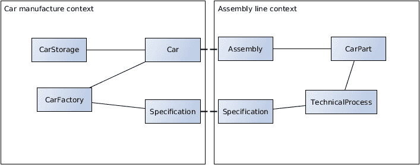
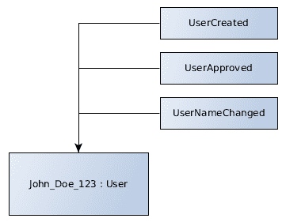
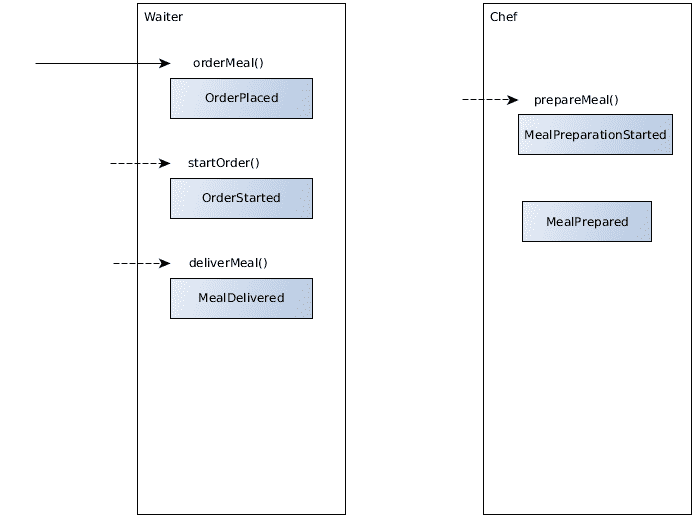
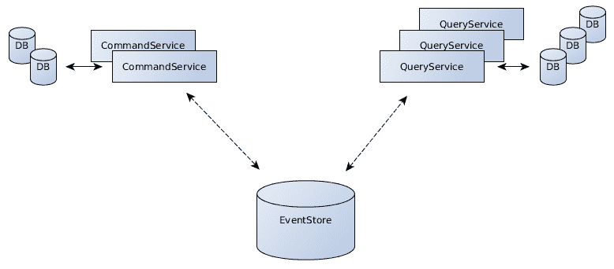
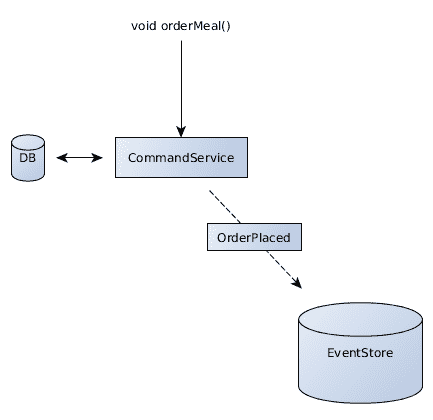
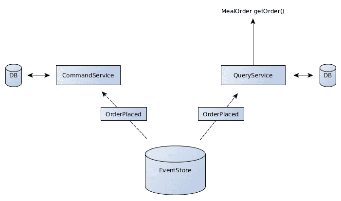
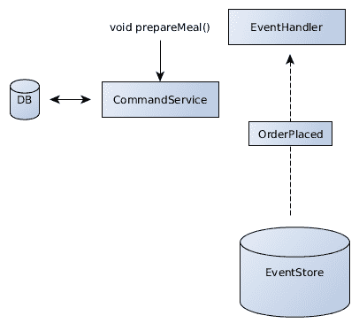
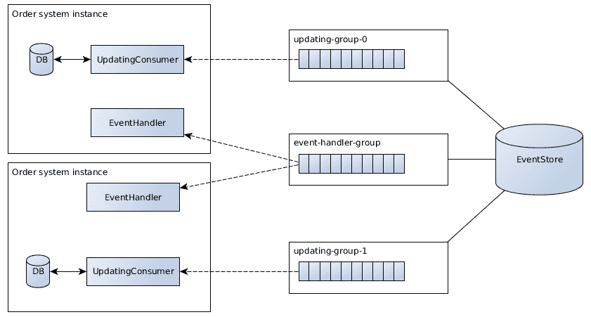

# 微服务和系统架构

前几章介绍了如何使用 Java EE 开发单一的企业应用程序。现代应用程序包含基础设施和配置定义作为代码，使得能够在自动化的方式下创建环境，无论是在本地还是在云平台上。持续交付管道与足够的自动化测试案例一起，使得能够以高质量和高效能交付企业应用程序。现代零依赖 Java EE 方法支持这些努力。

企业系统很少具有单一责任，这些责任可以合理地映射到单一的企业应用程序中。传统上，企业应用程序将商业的多个方面结合到单体应用程序中。问题是，这种构建分布式系统的方法是否可取。

本章将涵盖：

+   分布背后的动机

+   分布式系统的可能性和挑战

+   如何设计相互依赖的应用程序

+   应用程序边界、API 和文档

+   一致性、可扩展性、挑战和解决方案

+   事件溯源、事件驱动架构和 CQRS

+   微服务架构

+   Java EE 如何适应微服务世界

+   如何实现弹性通信

# 分布式系统背后的动机

应该首先询问的第一个问题是分布的需求。设计分布式系统背后有几个技术动机。

典型的企业场景本质上都是分布式的。分布在不同地点的用户或其他系统需要与一个服务进行通信。这需要在网络上发生。

另一个原因是可扩展性。如果一个单一的应用程序达到无法可靠地服务整体客户负载的程度，业务逻辑就需要分布到多个主机上。

类似的推理旨在提高系统的容错性。单一应用程序代表单一故障点；如果单一应用程序不可用，服务将无法被客户端使用。将服务分布到多个位置可以增加可用性和弹性。

同时，也有其他一些不那么技术驱动的动机。一个应用程序代表某些业务责任。在领域驱动设计语言中，它们包含在应用程序的**边界上下文**中。边界上下文包括应用程序的业务关注点、逻辑和数据，并将其与外部关注点区分开来。

与工程师将代码责任聚类到包和模块中一样，在系统规模上构建上下文也肯定是有意义的。一致的业务逻辑和功能作为单独应用程序的一部分被分组到单独的服务中。数据和模式也是边界上下文的一部分。因此，它可以封装到几个数据库实例中，这些实例由相应的分布式应用程序拥有。

# 分布的挑战

在所有这些动机中，尤其是像可扩展性这样的技术动机，为什么工程师不应该将一切分散呢？分散伴随着一定的开销。

通常，系统提炼出的业务逻辑之上的整体开销将乘以涉及的应用程序数量。例如，一个单一、单体应用程序需要一个监控解决方案。分散这个应用程序将导致所有结果应用程序也需要被监控。

# 通信开销

在分布式中，首先，系统之间通信存在一定的开销成本。

技术在单个进程内的通信非常有效。调用应用程序部分的功能几乎没有开销。一旦需要进程间或远程通信，工程师必须定义接口抽象。需要定义和使用 HTTP 等通信协议来交换信息。

这需要一定的时间和努力。应用程序之间的通信需要定义、实现和维护。在单个应用程序中，通信体现在方法调用上。

所需的通信也成为业务用例的担忧。不能再假设某些功能或数据可以无开销地使用。与分布式系统的通信成为应用程序的责任。

# 性能开销

在一开始分散应用程序会降低整体系统的性能。计算机网络比单个主机内的通信要慢。因此，网络总是伴随着一定的性能开销。

性能开销不仅由通信本身引起，还包括同步的需要。在单个进程内的同步已经消耗了一定的处理时间，当涉及到分布式时，这种影响更大。

然而，尽管性能开销存在，但随着应用的扩展，分布式最终会增加系统的整体性能。与单个实例相比，水平扩展总是伴随着一定的性能开销。

# 组织开销

包含多个应用程序的分布式系统当然需要比单个应用程序更多的组织努力。

多个应用程序意味着需要管理的多个部署。部署新版本可能会影响依赖的应用程序。团队需要确保部署的应用程序版本能够良好地协同工作。单一、单体应用程序不受此影响，因为它们在自身内部是一致的。

此外，多个应用在多个项目和存储库中开发，通常由多个开发团队完成。特别是，拥有多个团队需要沟通，不一定是技术上的，而是与人类相关的沟通。与部署应用一样，需要就职责、系统边界和依赖达成一致。

# 如何设计系统景观

在涉及所有这些挑战和开销的情况下，许多场景仍然需要分布式处理。重要的是要提到，分布式系统必须有足够的动机。分布式处理伴随着成本和风险。如果不是必须分布式处理，构建单体应用始终是首选。

现在，让我们来看看如何设计合理的系统景观，以满足业务需求。

# 上下文映射和边界上下文

**边界上下文**定义了应用在业务逻辑、行为和数据所有权方面的职责。所谓的**上下文映射**，如领域驱动设计中所描述的，代表了整个系统景观。它显示了应用的个别职责、上下文和所属关系。因此，边界上下文适合在上下文映射中展示它们之间如何交换信息。

下图显示了*汽车*领域的上下文映射，包括两个边界上下文：



在设计和划分应用之前，考虑系统的不同职责是明智的。一旦记录了系统的上下文映射，通常很快就会出现对应用职责的缺乏清晰性。

上下文映射不仅在项目定义的初期有帮助，而且在业务功能发生变化后重新审视和细化职责时也有帮助。为了防止分布式应用的边界和所属关系分离，建议不时地反思它们。

# 关注点的分离

应该清楚地定义应用程序的职责，并与其他应用程序区分开来。

就像在代码级别一样，几个应用的关注点应该被分离。单一职责原则在这里同样适用。

应用程序的关注点包括所有业务关注点、应用边界和拥有的数据。随着业务逻辑随时间发展和变化，这些关注点应该不时地重新审视。这可能导致应用被分割或合并成单个应用。上下文映射中出现的职责和关注点应在系统的应用中得到反映。

数据和数据所有权是分布式应用的一个重要方面。业务流程，作为边界上下文的一部分，定义了用例中涉及的数据。所有数据是特定应用的关注点，并且仅通过定义的边界进行共享。需要从其他，远程应用负责的数据的用例需要通过远程调用相应的用例来检索信息。

# 团队

当设计分布式系统时，团队和组织结构是其他需要考虑的重要方面，因为截至撰写本书时，软件是由人类开发的。考虑到康威定律，即组织的沟通结构最终会渗透到构建的系统之中，团队应该与系统中的应用类似地进行定义。

或者换句话说，一个应用只由一个团队开发是有意义的。根据责任和规模，一个团队可以潜在地创建多个应用。

再次，与项目代码结构相比，这是水平与垂直模块层叠的类似方法。与业务驱动的模块结构类似，因此团队是垂直组织的，代表着上下文地图的结构。例如，而不是在软件架构、开发或运维上有几个专家团队，将会有汽车制造、装配线和订单管理团队。

# 项目生命周期

由于个人团队参与开发分布式系统，应用将拥有独立的工程生命周期。这包括团队运作的方式，例如，他们如何组织他们的冲刺周期。

部署周期和计划也来自项目生命周期。为了使整个系统保持一致和功能，需要定义对其他应用部署的潜在依赖。这不仅仅针对应用的可用性。

部署的应用版本需要兼容。为了确保这一点，依赖的应用需要在上下文地图中明确表示。当依赖的服务引入更改时，团队将不得不进行沟通。

再次，绘制一个清晰的上下文地图，包含边界上下文，有助于定义相互依赖的应用及其责任。

# 如何设计系统接口

在定义了系统景观的责任之后，需要指定依赖系统的边界。

在前面的章节中，我们看到了各种通信协议及其实现方法。除了实际实现之外，现在的问题是：如何设计应用的接口？在分布式系统中，哪些方面需要考虑？

# API 考虑因素

系统中的应用是基于它们的业务责任划分的。

同样，应用程序的 API 也应代表业务逻辑。公开的 API 代表了某个应用程序包含的业务用例。这意味着业务领域专家可以在没有任何进一步的技术知识的情况下，从 API 中识别出公开的业务用例。

商业用例理想情况下应提供清晰、简洁的接口。调用用例不应需要比作为业务逻辑的一部分更多的技术动机的通信步骤或细节。例如，如果“创建汽车”用例可以作为单一操作调用，那么“汽车制造”应用程序的 API 就不应需要多次调用提供技术细节。

一个 API 应该通过清晰、简洁的接口抽象业务逻辑。

因此，API 应该与应用程序的实现解耦。接口实现应独立于所选技术。这也意味着选择了一种不设置太多约束于所用技术的通信格式。

因此，优先选择基于标准协议（如 HTTP）的技术是有意义的。工程师更有可能了解常用协议，因为它们被各种技术和工具所支持。在 HTTP 网络服务中创建应用程序接口允许在支持 HTTP 的任何技术中开发客户端。

使用标准协议的清晰、简洁接口抽象业务逻辑，也使得在使用的实现、技术和平台上进行更改成为可能。仅公开 HTTP 服务的 Java 企业应用程序可以用其他实现替换其技术，而无需要求依赖的客户端进行更改。

# 接口管理

应用程序接口在开发过程中经常发生变化。

新的商业用例被包含进来，现有的用例被细化。问题是，这些更改如何在 API 中反映出来？

企业应用程序的性质和环境决定了 API 需要有多稳定。如果项目团队负责服务、所有客户端及其生命周期，API 可以引入任意更改，这些更改同时反映在客户端上。如果涉及的应用程序的生命周期由于某种原因相同，情况也是如此。

通常，分布式系统的生命周期并不那么紧密耦合。对于任何其他客户端/服务器模型，或者具有不同生命周期的应用程序，API 不得破坏现有客户端。这意味着 API 是完全向后兼容的，不引入破坏性更改。

# 抗变 API

在设计接口时有一些原则可以防止不必要的中断。例如，引入新的、可选的有效负载数据不应破坏合同。技术应该具有弹性，只要提供所有必要的数据，它就可以继续工作。这与“在所做的事情上保守，在所接受的事情上自由”的想法相符。

因此，在不破坏客户端的情况下，应该能够添加新的、可选的功能或数据。但如果是现有逻辑发生变化呢？

# 破坏业务逻辑

这里需要问的问题是 API 中的破坏性变更对业务用例意味着什么。应用程序的过去行为是否不再有效？客户端是否必须从现在开始停止工作？

这相当于，例如，一个广泛使用的智能手机应用的供应商决定破坏现有版本，并强迫用户更新到其最新版本。在继续使用现有功能方面，这样做可能没有必要性。

如果由于某种原因，现有的用例不能再“原样”使用，应考虑一些额外的、补偿性的业务逻辑。

# 超媒体 REST 和版本控制

超媒体 REST API 可以在这方面提供一些缓解。特别是，超媒体控制提供了通过动态定义资源链接和操作来演进 API 的能力。REST 服务的客户端将适应访问服务的变更，并考虑性地忽略未知的功能。

一个经常建议的可能性是对 API 进行版本控制。这意味着引入不同的操作或资源，例如`/car-manufacture/v1/cars`，其中版本是 API 的标识部分。然而，对 API 进行版本控制与干净接口的理念相矛盾。特别是，由于 REST API 资源代表领域实体，引入多个“版本”的汽车在商业术语上没有意义。汽车实体由其 URI 标识。将 URI 更改以反映业务功能的变化意味着对汽车身份的更改。

有时需要同一领域实体的几个不同表示或版本，例如包含不同属性集的 JSON 映射。通过 HTTP 接口，这可以通过**内容协商**实现，通过定义内容类型参数。例如，可以通过内容类型如`application/json;vnd.example.car+v2`请求同一辆车的不同 JSON 表示，如果相应的服务支持的话。

管理接口是分布式系统的一个相关主题。建议在考虑向后兼容性的情况下提前仔细设计 API。应优先考虑额外的操作，以防止 API 破坏现有功能，而不是破坏客户端的干净接口。

# 记录边界

定义 API 以调用应用程序业务逻辑的应用程序边界需要对其客户端公开，例如系统内的其他应用程序。问题是，需要记录哪些信息？

应用程序的边界上下文是上下文图的一部分。因此，领域责任应该是清晰的。应用程序在其上下文中完成某些业务用例。

这种领域信息需要首先记录。客户端应该了解应用程序提供的内容。这包括用例以及交换的信息和数据所有权。

**汽车制造**应用程序的责任是根据提供的精确规格组装汽车。制造汽车的状态信息由应用程序在整个组装过程中拥有，直到汽车到达生产线末端并准备交付。应用程序可以被轮询以提供有关汽车创建过程的更新状态。

应用程序的领域描述应包含客户端所需的信息，职责明确，但不要过于冗长，仅暴露客户端*需要知道*的内容。

除了业务领域，还需要记录技术方面的内容。客户端应用程序需要针对系统的 API 进行编程。它们需要有关通信协议以及数据格式的信息。

我们在本书的第二章中介绍了几个通信协议及其实现方法。在撰写本文时，最常用的协议之一是 HTTP，以及 JSON 或 XML 内容类型。以 HTTP 为例，需要记录什么内容？

HTTP 端点，尤其是遵循 REST 约束的端点，将领域实体作为资源表示，可以通过 URL 进行定位。首先需要记录可用的 URL。客户端将连接到这些 URL 以执行某些业务用例。例如，`/car-manufacture/cars/<car-id>` URL 将引用由其标识符指定的特定汽车。

需要记录具有详细映射信息的内容类型。客户端需要了解所使用内容类型中的结构和属性。

例如，为了创建汽车而提供的汽车规格包含一个*标识符*、一个*引擎类型*和一个*底盘颜色*。JSON 格式如下所示：

```java
{
    "identifier": "<car-identifier>",
    "engine-type": "<engine-type>",
    "color": "<chassis-color>"
}
```

需要记录类型和可用的值。这将指向业务领域知识，以及引擎类型背后的语义。这一点很重要，即内容类型以及信息的语义都需要进行记录。

在 HTTP 的情况下，需要记录的方面将更多，例如可能需要的头部信息、由网络服务提供的状态码等。

所有这些文档当然取决于所使用的技术和通信协议。然而，业务领域也应该包含在文档中，提供所需的所有上下文。

应用程序的 API 文档是软件项目的一部分。它需要与应用程序一起以特定版本发布。

为了确保文档与应用程序的版本一致，它应该是项目存储库的一部分，位于版本控制之下。因此，强烈建议使用基于文本的文档格式，而不是像 Word 文档这样的二进制格式。轻量级标记语言如**AsciiDoc**或**Markdown**在过去已经证明了自己非常有效。

在项目内直接维护文档，紧邻应用程序的源代码，可以确保创建与开发的服务一致的文档版本。工程师能够一步完成更改。这样做可以防止文档和服务版本出现分歧。

根据通信技术，在记录应用程序边界方面有很多工具支持。例如，对于 HTTP Web 服务，**OpenAPI 规范**与**Swagger**作为文档框架被广泛使用。Swagger 将 API 定义输出为可浏览的 HTML，这使得开发者能够轻松地识别提供的资源及其用法。

然而，使用超媒体 REST 服务消除了服务文档的最大必要性。通过在链接中提供有关哪些资源可用，消除了记录 URL 的需求。实际上，服务器重新获得了如何构造 URL 的控制权。客户端只需输入一个入口点，例如`/car-manufacture/`，然后根据它们的关系遵循提供的超媒体链接。关于汽车 URL 由哪些部分组成的知识仅存在于服务器端，并且明确没有进行文档记录。

这对于超媒体控制尤其如此，它不仅指导客户端访问资源，还提供有关如何消费这些资源的信息。例如，*汽车制造*服务告诉客户端如何执行`create-car`动作：需要向`/car-manufacture/cars`发送 POST 请求，包括一个 JSON 内容类型的请求体，其中包含`identifier`、`engine-type`和`color`属性。

客户需要了解所有关系和动作名称的语义，以及它们的属性和来源。这当然属于客户端逻辑。有关如何消费 API 的所有信息都成为 API 的一部分。因此，设计 REST 服务消除了大量文档的需求。

# 一致性与可扩展性

当然，分布式系统进行通信是必要的。由于计算机网络不能被认为是可靠的，甚至在公司内部网络中也是如此，可靠的通信是必需的。为了确保正确的行为，业务用例需要以可靠的方式进行通信。

在本书的早期，我们介绍了所谓的 CAP 定理，该定理声称分布式数据存储无法保证最多两个指定的约束。系统可以有效地选择它们是否想要保证一致性或水平可扩展性。这极大地影响了分布式世界中的通信。

通常，企业系统在其用例中应该是一致的。业务逻辑应该将整体系统从一个一致状态转换到另一个不同的一致状态。

在分布式系统中，一个整体一致的状态意味着与外部关注点通信的用例必须确保被调用的外部逻辑也遵守一致性。这种方法导致分布式事务。在系统上被调用的用例将以“全有或全无”的方式执行，包括所有外部系统。这意味着需要对所有涉及的分布式功能进行锁定，直到每个分布式应用程序都成功完成其职责。

自然地，这种方法无法扩展。系统是分布式的这一事实要求这种事务编排需要在可能缓慢的网络上进行。这引入了一个瓶颈，导致锁定情况，因为涉及的应用程序必须阻塞并等待相对较长的时间。

一般而言，同步、一致性的通信仅适用于一次不涉及超过两个应用程序的应用程序。性能测试以及生产经验表明，所选的通信场景是否足够好地扩展以适应给定的用例和环境。

使用异步通信的动机是可扩展性。异步通信的分布式系统在定义上不会始终一致。异步通信可以在逻辑层面上发生，其中同步调用仅启动业务逻辑，而不等待一致的结果。

让我们来看看分布式应用程序中异步、最终一致通信背后的动机和设计。

# 事件溯源、事件驱动架构和 CQRS

传统上，企业应用程序是使用基于原子的**创建、读取、更新、删除**（**CRUD**）的模型方法构建的。

系统的当前状态，包括领域实体的状态，反映在关系数据库中。如果一个领域实体被更新，该实体的新状态（包括所有属性）将被放入数据库，而旧状态则消失。

CRUD 方法要求应用程序保持一致性。为了确保领域实体的状态正确反映，所有用例调用都必须以一致的方式进行执行，同步对实体的修改。

# 基于 CRUD 的系统缺点

这种同步也是我们通常构建应用程序的 CRUD 系统的一个缺点。

# 可扩展性

所需的同步防止了系统无限扩展。所有事务都在关系数据库实例上执行，如果系统需要扩展，最终会引入瓶颈。

这最终成为处理大量工作负载或大量用户的情况的挑战。然而，对于绝大多数企业应用程序来说，关系数据库的可扩展性是足够的。

# 竞争事务

基于 CRUD 模型的另一个挑战是处理竞争事务。包括相同领域实体并同时操作的业务用例需要确保实体的最终状态是一致的。

同时编辑用户姓名和更新其账户信用额度不应导致更新丢失。实现必须确保这两个事务的整体结果是仍然一致的。

依赖于乐观锁定的竞争事务通常会导致事务失败。这绝对不是从用户的角度来看的理想情况，但至少保持了一致性，而不是压制一个事务在空间中丢失的情况。

然而，遵循这种方法可能会引起不必要的锁定。从业务理论的角度来看，应该可以同时编辑用户的姓名和账户信用额度。

# 可重现性

由于应用程序只存储其当前状态，所有关于先前状态的历史信息都消失了。状态总是被新的更新覆盖。

这使得很难重现应用程序如何进入当前状态。如果当前状态是从其原始用例调用中错误计算出来的，那么后来就没有可能修复这种情况。

一些场景明确要求可重现性以符合法律条款。因此，一些应用程序包括审计日志，这些日志在信息发生时立即永久写入系统。

# 事件源

事件源是一种解决基于 CRUD（创建、读取、更新、删除）系统可重现性不足的方法。

事件源系统通过过去发生的原子事件来计算系统的当前状态。这些事件代表了单个业务用例的调用，包括调用中提供的信息。

当前状态不是永久持久化的，而是通过依次应用所有事件而产生的。这些事件本身发生在过去，是不可变的。

例如，一个具有其特征的用户是从与其相关的所有事件中计算出来的。依次应用`UserCreated`、`UserApproved`和`UserNameChanged`创建用户当前的表示，直到最近的那个事件：



事件包含自给自足的信息，主要与相应的用例相关。例如，一个`UserNameChanged`事件包含时间戳和用户更改后的名称，而不是其他与用户无关的信息。因此，事件的信息是原子的。

事件永远不会被更改或删除。如果从应用程序中删除了一个领域实体，将会有一个相应的删除事件，例如`UserDeleted`。在应用所有事件后，系统的当前状态将不再包含此用户。

# 优势

事件溯源的应用程序包含所有其信息在原子事件中。因此，完整的记录和上下文，即它是如何进入当前状态的，都是可用的。为了调试目的重现当前状态，所有事件及其对系统的个别修改都可以被视为。

系统发生的一切都被原子存储的事实有几个好处，不仅限于调试目的。

测试可以利用这些信息在系统测试中重放生产系统中发生的一切。然后测试能够重新执行生产中发生的确切业务用例调用。这对于系统和性能测试来说是一个优势。

对于使用原子信息来收集关于应用程序使用情况的洞察的统计也是如此。这使人们能够在应用程序部署后设计用例和洞察。

假设一位经理想知道在应用程序运行两年后的周一创建了多少用户。在基于 CRUD 的系统上，在用例被调用时，该信息必须被显式地持久化。过去未明确请求的用例只能作为新功能添加，并将在未来增加价值。

使用事件溯源，这些功能是可能的。由于系统发生的一切信息都被存储，因此未来开发的使用案例能够操作过去发生的数据。

然而，这些优势当然可以在不需要分布式系统的情况下实现。一个单体、独立的应用程序可以基于事件溯源构建其模型，从中获得相同的优势。

# 最终一致的现实世界

在我们进一步探讨分布式系统的一致性和可伸缩性之前，让我们看看现实世界的一致性是如何的。企业应用程序通常旨在提供完全的一致性。然而，现实世界却是高度分布的，根本不一致。

想象你饿了，想吃一个汉堡。所以你去了餐馆，坐在桌子旁，告诉服务员你想要一个汉堡。服务员会接受你的订单。现在，尽管你的订单已被接受，但这并不一定意味着你将收到你的餐点。点餐的过程并不完全一致。

在这一点上可能会出很多问题。例如，厨师可能会告诉服务员，不幸的是，最后一个汉堡肉饼已经被使用，当天不会再有汉堡了。所以尽管你的订单在事务上已被接受，服务员会回来告诉你订单无法实现。

现在，服务员可能不会要求你离开，而是会向你推荐一道替代菜品。如果你饿了，并且对替代品满意，你最终可能会得到一份餐点。

这就是高度分布式现实世界处理业务用例事务的方式。

如果餐厅以完全一致的方式建模，场景将有所不同。为了确保只有在能够提供准备好的餐点的情况下才接受订单，整个餐厅都需要被锁定。顾客必须等待并保持对话，直到服务员进入厨房并从厨师那里订购餐点。由于在订购后可能会发生许多其他问题，整个订单事务实际上必须阻塞，直到餐点完全准备好。

显然，这种方法是不可行的。相反，现实世界完全是关于协作、意图，并在意图无法实现时最终处理问题。

这意味着实际世界以最终一致的方式运行。最终，餐厅系统将达到一致状态，但并不一定是所有时候，这导致最初接受实际上不可能的订单。

实际世界的过程被表示为意图或**命令**，例如点一份汉堡，以及原子结果或**事件**，例如订单已被接受。随后，事件将导致新的命令，从而产生新的结果或失败。

# 事件驱动架构

现在，回到分布式系统的话题。与餐厅一样，通过分布式事务以一致方式通信的分布式系统将无法扩展。

事件驱动架构解决了这个问题。在这些架构中，通信通过可靠发布和消费的异步事件进行。

通过这样做，一致的业务用例事务被分割成多个、规模更小的、自身一致的事务。这导致整体业务用例最终达到一致。

让我们看看在事件驱动架构中如何表示点汉堡用例的例子。餐厅系统至少由两个分布式应用程序组成，即*服务员*和*厨师*。餐厅应用程序通过监听彼此的事件进行通信。客户端应用程序将与服务员通信，以启动用例：



客户在服务员应用程序中下单，这会触发`OrderPlaced`事件。一旦事件可靠地发布，`orderMeal()`方法的调用就会返回。因此，客户端能够并行执行其他工作。

厨师系统接收到`OrderPlaced`事件并验证订单是否可以使用当前可用的原料。如果订单无法实现，厨师会发出不同的事件，例如`OrderFailedInsufficientIngredients`。在这种情况下，服务员会将订单状态更新为失败。

当餐点准备成功时，服务员会接收到`MealPreparationStarted`事件并更新订单状态，这会导致`OrderStarted`。如果客户询问服务员他们的订单状态，服务员可以相应地回答。

在某个时刻，餐点准备过程将会完成，从而触发一个`MealPrepared`事件，通知服务员送餐。

# 事件驱动架构中的最终一致性

订单用例最终是一致的。可靠地发布事件仍然确保所有客户端最终都会知道他们订单的状态。

如果处理订单不是立即发生，或者由于某些原因订单会失败，这可能是可以接受的。然而，绝不能发生订单因应用程序不可用而丢失在系统中的情况。在发布事件时需要确保这一点。

这里仍然涉及交易，但规模较小，且不涉及外部系统。这样做使得分布式系统能够覆盖事务性用例，同时仍然能够实现水平扩展。

对于像事件驱动架构这样的方法，需要一定的可靠性是一个重要的方面，在设计解决方案和选择技术时应该予以考虑。

# 进入 CQRS

现在让我们结合事件驱动架构和事件溯源背后的动机。

事件驱动架构通过原子事件进行通信。利用这种方法，并通过事件作为系统真相的来源来构建系统（即事件溯源），是有意义的。这样做结合了两种方法的好处，使得系统能够实现水平扩展和事件溯源。

问题是如何对基于事件的域模型的事件驱动应用程序进行建模？以及如何高效地计算并返回域实体的当前状态？

**命令查询责任分离**（**CQRS**）原则描述了如何对这些应用程序进行建模。它是事件驱动架构的结果，并基于事件溯源。

# 原则

如其名所示，CQRS 将命令和查询的责任分开，即写入和读取。

命令通过最终产生事件来改变系统的状态。它不允许返回任何数据。命令要么成功，产生零个或多个事件，要么失败并返回错误。事件产生是可靠的。

查询检索并返回数据，不会对系统产生副作用。它不允许修改状态。

以 Java 代码为例，命令就像一个`void doSomething()`方法，它改变状态。查询就像一个 getter `String getSomething()`，它不会影响系统的状态。这些原则听起来很简单，但它们对系统的架构有一些影响。

命令和查询的责任被分割成几个关注点，使得 CQRS 应用程序可以成为完全独立的、要么写入要么读取的应用程序。那么，如何设计和实现这种方法呢？

# 设计

遵循事件驱动架构，写入和读取系统仅通过事件进行通信。事件通过事件存储或事件中心进行分发。除了产生事件的写入系统和消费事件以更新其内部状态的读取系统之外，没有其他耦合。

下面的代码片段显示了 CQRS 系统的架构：



命令和查询服务从事件存储中消费事件。这是它们之间通信的唯一方式。

所有服务维护一个当前状态表示，该表示反映了领域实体的状态。实体例如是*餐点订单*或*汽车*，包括它们属性的最新状态。这种状态保存在内存中或在数据库中持久化。

这些表示只是使系统能够包含当前状态。黄金真相来源是事件存储中包含的原子事件。

所有应用程序实例通过消费和应用事件存储中的事件来单独更新它们的状态表示。

命令服务包含启动系统更改的业务逻辑。它们在通过其状态表示进行可能的命令验证后，通过事件存储产生事件。

为了使信息流清晰，让我们通过一个示例餐点订单来分析：



客户在命令服务实例中下单。在对其表示进行可能的验证后，命令服务将`OrderPlaced`事件发送到事件存储。如果事件发布成功，`orderMeal()`方法返回。客户可以继续其执行。

命令服务可以为后续检索创建一个餐点标识符，例如，作为一个通用唯一标识符：



事件存储会将事件发布给所有消费者，并相应地更新他们的内部表示。客户端可以使用其标识符在查询服务中访问餐点的状态。查询服务将响应其最新的订单表示。

为了继续订单处理，一个调用潜在后续命令的权威机构也会处理该事件：



事件处理器将监听`OrderPlaced`事件并调用厨师系统的`prepareMeal()`用例。此后续命令可能产生新事件。

“使用 Java EE 实现微服务”这一章节涵盖了如何实现 CQRS 等内容。

# 优点

CQRS 使分布式应用程序不仅能够水平扩展，而且可以在其读写关注点上独立扩展。例如，查询服务的副本可以与命令服务的数量不同。

企业应用程序的读写负载通常分布不均。通常，读操作远高于写操作的数量。在这些情况下，可以独立扩展读实例的数量。在基于 CRUD 的系统，这是不可能的。

另一个优点是，每个服务都可以相应地优化其状态表示。例如，将领域实体持久化存储在关系型数据库中可能不是每个情况的最佳方法。也可以仅在内存中存储表示，并在应用程序启动时重新计算所有事件。关键是写实例和读实例都可以自由选择并优化其表示以适应环境。

这种方法的副作用是，CQRS 还提供了读侧故障转移可用性。如果事件存储不可用，则无法发布新事件，因此无法在系统上调用修改状态的用例。在基于 CRUD 的系统，这相当于数据库宕机。然而，在 CQRS 系统中，至少查询服务仍然可以从其表示中提供最新的状态。

CQRS 系统的状态表示也解决了事件源系统的可伸缩性问题。事件源系统从原子事件计算当前应用程序状态。每次操作调用时执行此操作将随着时间的推移变得越来越慢，因为事件越来越多。命令和查询服务的表示通过持续应用最近的事件消除了这种需求。

# 缺点

构建 CQRS 系统不仅有益，也有缺点。

构建这些系统可能的最大缺点之一是，大多数开发者不熟悉其概念、设计和实现。当这种方法在企业项目中选择时，这将会引入困难。与基于 CRUD 的系统不同，CQRS 将需要额外的培训和专业知识。

与任何分布式系统一样，与 CRUD 方法相比，CQRS 系统中涉及的应用程序自然更多。正如之前在一般分布式系统中所述，这需要一些额外的工作。此外，还需要一个事件存储。

与所展示的示例不同，命令和查询两侧必须在两个或更多独立的应用程序中是强制性的。只要功能仅通过事件存储发布的事件进行通信，两者都可以位于同一应用程序中。例如，这会导致一个服务员和厨师应用程序仍然可以水平扩展。如果不需要单独扩展写入和读取两侧，这是一个合理的权衡。

# 通信

构建 CQRS 系统是实现异步、最终一致通信的一种方法。正如我们在本书中之前所看到的，有许多通信形式，包括同步和异步。

为了使应用程序可伸缩，分布式系统不应依赖于涉及多个系统的同步通信。这会导致分布式事务。

实现具有技术无关、同步通信协议的可伸缩性的一种方法是对逻辑上异步过程进行建模。例如，可以使用 HTTP 等通信协议来触发异步发生的处理，同时调用者立即返回。这引入了最终一致性，但使系统能够扩展。

这还涉及到考虑使分布式系统的应用程序在系统内部和外部通信中是否有所区别。CQRS 通过提供外部接口来实现这一点，例如使用 HTTP，而服务本身通过事件存储进行通信。通过统一协议访问的异步过程建模在这里没有区别。

通常，在设计分布式系统时，建议优先考虑可用性，即可伸缩性，而不是一致性。有许多可能的方法，CQRS 就是其中之一，它结合了异步通信和事件溯源。

以下部分涵盖了自给自足应用程序的必要性。

# 微服务架构

我们看到了分布式系统的动机、挑战和好处，以及一些处理通信和一致性的方法。现在我们将关注分布式应用程序的架构。

# 企业中的数据和技术共享

企业中一个常见的想法是共享和重用技术以及常用的数据。我们之前讨论了共享 Java 模块及其不足。那么，在分布式系统中共享通用技术或数据模型又如何呢？

构成企业系统的多个应用通常使用类似的技术来实现。这对于由单个团队或紧密合作的团队构建的应用来说是很自然的。这样做往往会产生共享在应用中重用的技术的想法。

项目可以使用常用的模块来消除整个系统中的重复。一个典型的做法是共享模型。组织内部可能只有一个模块在所有项目中都被重用。

共享模型引发了一个问题，即是否正在重用潜在的持久化领域实体或传输对象。领域实体在数据库中持久化后甚至可以直接从数据库系统中检索，对吧？

常用的数据库与分布式系统完全矛盾。它们紧密耦合了涉及的应用。模式或技术的变更将应用和项目生命周期焊接在一起。常用的数据库实例阻止了应用的可扩展性。这消除了分布式系统背后的动机。

这同样适用于一般的技术共享。如前几章所示，常用的模块和依赖关系在实现中引入了技术约束。它们将应用耦合起来，限制了它们在变更和生命周期中的独立性。即使这些变更不会影响应用的边界，团队也必须进行沟通和讨论。

从系统上下文图中的领域知识和职责来看，共享数据和技术的意义不大。确实存在一些系统间需要共享技术接触点。

然而，关键在于实现应用，这些应用一方面依赖于其业务职责，另一方面依赖于记录的通信协议。因此，建议选择潜在的重复和独立性，而不是在技术上的耦合。

在系统上下文图中共享其他关注点而不是接触点应该会提醒工程师。应用的不同职责应该清楚地表明常用的模型或数据位于不同的上下文中。各个应用只对其关注点负责。

# 无共享架构

考虑到这些想法，建议构建不共享任何公共技术或数据的程序。它们在通信和业务职责上履行了应用边界合同。

**无共享架构**在技术、潜在使用的库、它们的数据及其模式方面是独立的。它们可以自由选择实现和潜在的持久化技术。

如果分布式系统中应用程序的实现从 Python 更改为 Java，只要其 HTTP 接口的合同仍然满足，就不应该对其他应用程序产生影响。

如果其他应用程序需要数据，这需要在上下文映射中明确定义，要求应用程序通过其业务逻辑接口公开数据。数据库不共享。

无共享架构允许具有独立生命周期的应用程序，这些应用程序除了明确定义的合同外，不依赖任何其他东西。团队可以自由选择技术和项目生命周期。技术和包括数据库在内的数据都属于应用程序。

# 相互依赖的系统

无共享架构最终必须与其他应用程序协作。定义的合同必须满足、记录并传达。

这一点是，无共享架构仅依赖于定义的合同和责任。在业务逻辑发生变化时，合同被重新定义并传达。仅应用程序团队负责如何实现合同。

相互依赖的系统由几个具有良好定义接口的无共享应用程序组成。使用的接口应该是技术无关的，以避免对使用的实现设置约束。

这是微服务架构背后的理念。微服务由几个相互依赖的应用程序组成，这些应用程序实现它们各自的企业责任，并结合起来解决问题。

微服务的名称并不一定说明应用程序的大小。应用程序应由单个开发团队构建。出于组织原因，团队规模不应过大。亚马逊经常引用的一个观点是，整个团队应该能够靠两块披萨生存。

在构建微服务之前，应该考虑分布式系统背后的动机。如果没有实际需要分布式系统，应避免使用。坚持使用具有合理责任的单体应用程序是首选。

通常，构建微服务架构的方法是将责任过大或团队和生命周期分歧的单体应用程序分割成多个部分。这与重构方法类似。将变得过大的类重构为多个代理通常比一开始就尝试引入一个完美的场景更有效。

通常，在考虑业务需求、系统的上下文映射以及他们的开发团队和生命周期时，总是建议这样做。

# 12 因子和云原生应用程序

第五章，*使用 Java EE 的容器和云环境*，介绍了 12 要素和云原生应用程序的方法。它们强烈支持微服务架构。

特别是，通过容器化、无状态和可扩展的企业应用程序原则，可以实现具有相互依赖、分布式应用程序的无共享方法。

12 要素原则和云和容器环境的有效性支持团队以可管理的开销和高生产力开发微服务。

然而，企业系统并不一定需要分布式才能符合 12 要素或云原生原则。这些方法当然也适用于构建单体应用程序。

# 何时使用微服务，何时不使用微服务

近年来，微服务架构在软件行业中受到了一些炒作。

总是随着炒作，工程师应该问自己某些热门词汇背后的东西，以及实施它们是否有意义。总是建议研究新技术和方法。不一定建议立即应用它们。

使用微服务的理由与使用分布式系统的一般理由相同。有技术原因，例如需要独立部署生命周期的应用程序。

同时，也有一些原因是受业务需求以及团队和项目工作模式中的情况驱动的。

可扩展性是微服务架构经常引用的动机。正如我们在事件驱动架构中看到的，单体应用程序无法无限扩展。问题是可扩展性是否真正是一个问题。

有大公司使用单体应用程序处理大量用户的业务逻辑。在考虑将分布式作为缓解扩展问题的手段之前，应该收集性能洞察和统计数据。

工程师应避免仅仅因为相信“银弹”方法而使用微服务架构。这很容易发生在“热门词汇驱动”的会议和对话中，解决方案的选择基于有限的或没有证据支持的要求。微服务当然提供了好处，但也带来了时间和努力上的代价。无论如何，将责任分割到多个应用程序的要求和动机应该是清晰的。

# 使用 Java EE 实现微服务

现在来谈谈如何使用企业 Java 构建微服务。

在各种讨论和会议中，Java EE 被认为对于微服务来说过于**重量级**且笨重。虽然这对于 J2EE 技术和方法确实如此，但 Java EE 提供了现代、精简的企业应用程序开发方式。第四章，*轻量级 Java EE* 和 第五章，*Java EE 与容器和云环境*涵盖了这些方面，特别是在现代环境方面。

Java EE 确实非常适合编写微服务应用程序。容器技术和编排支持该平台，尤其是由于 Java EE 将业务逻辑与实现分离。

# 零依赖应用程序

使用 Java EE 的微服务理想地构建为零依赖应用程序。

薄型 WAR 应用程序部署在现代企业容器中，这些容器可以用于运输。这最小化了部署时间。Java EE 部署工件应仅包含提供的依赖项；如果有合理的需要添加第三方依赖项，它们应安装在应用程序服务器中。容器技术简化了这种方法。

这也符合无共享架构的理念。团队负责特定于应用程序的技术，在这种情况下是包括库在内的应用程序服务器安装。例如 Dockerfile 这样的基础设施代码定义，使开发团队能够以有效的方式完成这项工作。

# 应用服务器

采用这种方法，应用程序服务器以容器形式交付，其中只包含单个应用程序。"一个应用程序对应一个应用程序服务器" 的方法也符合无共享架构的理念。

问题是，如果单个服务器实例只包含一个应用程序，应用服务器是否会引入过多的开销。在过去，存储和内存占用确实很大。

现代应用服务器在这方面有了显著提升。例如，**TomEE** 这样的服务器基于容器，其占用内存仅为 150 MB 及以下，请注意，这包括了服务器、Java 运行时和操作系统。由于动态加载功能，内存消耗也得到了显著改善。

在企业项目中，安装大小通常不是需要关注的问题，尤其是如果它们没有超过所有界限的话。更重要的是构建和交付的工件的大小。应用程序工件，在某些技术中包含数兆字节的依赖项，被构建和传输多次。运行时只在每个环境中安装一次。

如 Docker 这样的容器技术利用分层文件系统，鼓励将组件保持小型化。零依赖应用程序支持这种方法。

让每个持续交付的构建只传输几 KB 的数据，比在基础安装中节省几个 MB 的数据要明智得多。

如果还需要缩小安装大小，一些应用供应商提供定制容器以满足所需标准的方法，特别是 MicroProfile 倡议，它包括多个应用服务器供应商，并定义了精简配置文件。

Java EE 微服务不需要作为独立 JAR 文件分发。相反，在容器中分发的应用程序应利用分层文件系统的使用，并在基础镜像中运行的企业的容器上部署。独立 JAR 文件与此原则相悖。

有可能通过所谓的空 JAR 将独立 JAR 文件与轻量级部署相结合。然而，在使用容器时，这种方法并不是必需的。

# 实现应用边界

让我们继续探讨使用 Java EE 实现应用边界的实现。这实际上是一个比实现问题更系统架构的问题。

微服务之间的通信应使用技术无关的协议。如前所述，Java EE 在 HTTP 和 REST 服务方面都大力支持 HTTP，并使用超媒体。

下一章将介绍 CQRS 系统中使用 Apache Kafka 实现的发布/订阅消息的异步通信。

# 实现 CQRS

在本章的早期，我们看到了事件源、事件驱动架构和 CQRS 背后的动机和概念。CQRS 为创建实现可扩展、最终一致业务用例的分布式应用提供了一种有趣的方法。

在撰写本文时，对 CQRS（Command Query Responsibility Segregation）的兴趣很大，但公司内部对如何使用它的了解却很少。已经出现了一些框架和技术，旨在实现这种方法。然而，CQRS 是一种架构风格，开发 CQRS 系统并不需要特定的框架。

让我们仔细看看一种使用 Java EE 的方法。

# 系统接口

CQRS 系统接口用于系统外部来启动业务用例。例如，客户端访问服务员系统来订购汉堡。

这些接口用于外部，理想情况下使用一种技术无关的协议实现。

对于类似 REST 的 HTTP 服务，这意味着命令服务实现修改资源的 HTTP 方法，例如 POST、DELETE、PATCH 或 PUT。查询服务通常只实现通过 GET 查询的资源。

在我们的例子中，这意味着客户端通过命令服务资源 POST 一个新的餐点订单。同样，餐点订单通过查询服务的 GET 资源检索。

这些 HTTP 接口涉及外部通信。内部应用通过使用事件中心发布的事件进行通信。

# 使用 Apache Kafka 的示例场景

在这个例子中，我将使用 Apache Kafka 作为分布式消息代理，提供高性能和高吞吐量。它是支持发布/订阅方法等多种消息技术的一个例子。

在撰写本文时，Apache Kafka 没有实现所有 JMS 语义。以下示例将使用 Kafka 的供应商特定客户端 API。

Apache Kafka 的发布/订阅方法将消息组织在主题中。它可以配置为启用事务性事件生产者和有序事件消费，这是事件驱动架构需要确保的，以便创建可靠的使用案例。

Kafka 代理是分布式的，并使用所谓的消费者组来管理消息主题和分区。检查 Kafka 的架构超出了本书的范围，建议在选择此技术时进一步查阅其文档。

简而言之，消息被发布到主题中，每个消费者组只消费一次。消费者组包含一个或多个消费者，并保证恰好有一个消费者将处理使用事务性生产者发布的消息。

CQRS 系统需要在多个位置消费消息。对特定主题感兴趣的应用程序将消费消息并更新它们的内部表示。因此，所有这些更新消费者都将收到一个事件。还有使用事件进一步处理业务逻辑的事件处理器。每个主题恰好需要一个事件处理器来处理事件，否则进程可能会多次运行或根本不运行。

因此，Kafka 消费者组的概念被这样使用，即每个应用程序有一个更新消费者组，每个主题有一个事件处理器组。这使所有实例都能接收事件，但可靠地只有一个命令服务来处理业务逻辑。通过这样做，实例能够扩展而不会影响整体系统的结果：



# 集成 Java EE

为了将 Apache Kafka 集群集成到应用程序中，本示例将使用 Kafka 的 Java API。

应用程序连接到 Kafka，在它们的更新消费者和事件处理器中消费消息。发布事件也是如此。

应用的技术应该从应用程序的其他部分封装起来。为了集成事件，开发者可以使用适合此场景的功能：CDI 事件。

# CDI 事件

领域事件包含特定事件的 数据、时间戳以及引用领域实体的标识符。

下面的代码片段展示了抽象的 `MealEvent` 和 `OrderPlaced` 事件的示例：

```java
public abstract class MealEvent {

    private final Instant instant;

    protected MealEvent() {
        instant = Instant.now();
    }

    protected MealEvent(Instant instant) {
        Objects.requireNonNull(instant);
        this.instant = instant;
    }

    ...
}

public class OrderPlaced extends MealEvent {

    private final OrderInfo orderInfo;

    public OrderPlaced(OrderInfo orderInfo) {
        this.orderInfo = orderInfo;
    }

    public OrderPlaced(OrderInfo orderInfo, Instant instant) {
        super(instant);
        this.orderInfo = orderInfo;
    }

    ...
}
```

像这样的领域事件是应用程序的核心。领域实体表示是从这些事件计算出来的。

将其集成到 Kafka 中确保这些事件通过 CDI 触发。它们被观察在相应的功能中，分别更新状态表示或调用后续命令。

# 事件处理器

以下代码片段显示了厨师系统的事件处理器，调用命令服务的功能：

```java
@Singleton
public class OrderEventHandler {

    @Inject
    MealPreparationService mealService;

    public void handle(@Observes OrderPlaced event) {
        mealService.prepareMeal(event.getOrderInfo());
    }
}
```

事件处理器消费事件并将调用后续餐准备用例的边界。`prepareMeal()`方法本身将导致零个或多个事件，在这种情况下，要么是`MealPreparationStarted`，要么是`OrderFailedInsufficientIngredients`：

```java
public class MealPreparationService {

    @Inject
    EventProducer eventProducer;

    @Inject
    IngredientStore ingredientStore;

    public void prepareMeal(OrderInfo orderInfo) {

        // use ingredientStore to check availability

        if (...)
            eventProducer.publish(new OrderFailedInsufficientIngredients());
        else
            eventProducer.publish(new MealPreparationStarted(orderInfo));
    }
}
```

事件生产者将可靠地将事件发布到 Kafka 集群。如果发布失败，整个事件处理必须失败，稍后重试。

# 状态表示

更新状态表示的消费者也消费 CDI 事件。以下代码片段显示了包含餐订单状态表示的 bean：

```java
@Stateless
public class MealOrders {

    @PersistenceContext
    EntityManager entityManager;

    public MealOrder get(UUID orderId) {
        return entityManager.find(MealOrder.class, orderId.toString());
    }

    public void apply(@Observes OrderPlaced event) {
        MealOrder order = new MealOrder(event.getOrderInfo());
        entityManager.persist(order);
    }

    public void apply(@Observes OrderStarted event) {
        apply(event.getOrderId(), MealOrder::start);
    }

    public void apply(@Observes MealDelivered event) {
        apply(event.getOrderId(), MealOrder::deliver);
    }

    private void apply(UUID orderId, Consumer<MealOrder> consumer) {
        MealOrder order = entityManager.find(MealOrder.class, orderId.toString());
        if (order != null)
            consumer.accept(order);
    }
}
```

这个简单的例子代表了关系型数据库中餐订单的状态。一旦新的 CDI 事件到达，订单的状态就会更新。当前状态可以通过`get()`方法检索。

餐订单领域实体通过 JPA 持久化。它包含通过观察 CDI 事件更新的订单状态：

```java
@Entity
@Table("meal_orders")
public class MealOrder {

    @Id
    private String orderId;

    @Embedded
    private MealSpecification specification;

    @Enumerated(EnumType.STRING)
    private OrderState state;

    private MealOrder() {
        // required for JPA
    }

    public MealOrder(OrderInfo orderInfo) {
        orderId = orderInfo.getOrderId().toString();
        state = OrderState.PLACED;

        // define specifications
    }

    public void start() {
        state = OrderState.STARTED;
    }

    public void deliver() {
        state = OrderState.DELIVERED;
    }

    ...
}
```

# 消费 Kafka 消息

消息消费的部分封装了消息中心与整个应用程序的其他部分。它是通过在到达的消息上触发 CDI 事件来集成的。这当然特定于 Kafka API，应被视为一个示例解决方案。

更新消费者通过其消费者组连接到特定的主题。启动单例 bean 确保消费者将在应用程序启动时启动。一个容器管理的执行器服务在其自己的线程中运行事件消费者：

```java
@Startup
@Singleton
public class OrderUpdateConsumer {

    private EventConsumer eventConsumer;

    @Resource
    ManagedExecutorService mes;

    @Inject
    Properties kafkaProperties;

    @Inject
    Event<MealEvent> events;

    @PostConstruct
    private void init() {
        String orders = kafkaProperties.getProperty("topic.orders");

        eventConsumer = new EventConsumer(kafkaProperties,
                ev -> events.fire(ev), orders);

        mes.execute(eventConsumer);
    }

    @PreDestroy
    public void close() {
        eventConsumer.stop();
    }
}
```

应用特定的 Kafka 属性通过 CDI 生产者公开。它们包含相应的消费者组。

事件消费者执行实际的消费：

```java
import org.apache.kafka.clients.consumer.KafkaConsumer;
import java.util.function.Consumer;
import static java.util.Arrays.asList;

public class EventConsumer implements Runnable {

    private final KafkaConsumer<String, MealEvent> consumer;
    private final Consumer<MealEvent> eventConsumer;
    private final AtomicBoolean closed = new AtomicBoolean();

    public EventConsumer(Properties kafkaProperties,
            Consumer<MealEvent> eventConsumer, String... topics) {
        this.eventConsumer = eventConsumer;
        consumer = new KafkaConsumer<>(kafkaProperties);
        consumer.subscribe(asList(topics));
    }

    @Override
    public void run() {
        try {
            while (!closed.get()) {
                consume();
            }
        } catch (WakeupException e) {
            // will wakeup for closing
        } finally {
            consumer.close();
        }
    }

    private void consume() {
        ConsumerRecords<String, MealEvent> records =
                consumer.poll(Long.MAX_VALUE);
        for (ConsumerRecord<String, MealEvent> record : records) {
            eventConsumer.accept(record.value());
        }
        consumer.commitSync();
    }

    public void stop() {
        closed.set(true);
        consumer.wakeup();
    }
}
```

消费的 Kafka 记录会导致新的 CDI 事件。配置的属性分别使用 JSON 序列化和反序列化器来映射领域事件类。

通过 CDI 触发并成功消费的事件被提交到 Kafka。CDI 事件是同步触发的，以确保在提交之前所有进程都可靠地完成。

# 生成 Kafka 消息

事件生产者将领域事件发布到消息中心。这是同步发生的，以确保消息在系统中。一旦传输被确认，`EventProducer#publish`方法的调用返回：

```java
import org.apache.kafka.clients.producer.KafkaProducer;
import org.apache.kafka.clients.producer.Producer;

@ApplicationScoped
public class EventProducer {

    private Producer<String, MealEvent> producer;
    private String topic;

    @Inject
    Properties kafkaProperties;

    @PostConstruct
    private void init() {
        producer = new KafkaProducer<>(kafkaProperties);
        topic = kafkaProperties.getProperty("topics.order");
        producer.initTransactions();
    }

    public void publish(MealEvent event) {
        ProducerRecord<String, MealEvent> record = new ProducerRecord<>(topic, event);
        try {
            producer.beginTransaction();
            producer.send(record);
            producer.commitTransaction();
        } catch (ProducerFencedException e) {
            producer.close();
        } catch (KafkaException e) {
            producer.abortTransaction();
        }
    }

    @PreDestroy
    public void close() {
        producer.close();
    }
}
```

详细介绍 Kafka 生产者 API 超出了本书的范围。然而，需要确保事件可靠地发送。事件生产者 bean 封装了这个逻辑。

这些示例演示了集成 Kafka 的一种可能性。

如前所述，**Java EE 连接器架构**（**JCA**）是将外部关注点集成到应用程序容器的另一种可能性。在撰写本文时，存在一些供应商特定的容器解决方案，它们通过 JCA 集成消息。对于集成 Kafka 等消息中心现有解决方案是一个有趣的替代方案。然而，建议应用程序开发者将技术特定细节封装到单一责任点，并在应用程序中使用标准的 Java EE 功能。

# 应用程序边界

CQRS 系统的应用程序通过事件进行内部通信。外部，可以提供其他协议，如 HTTP。

例如，服务员系统的查询和命令功能通过 JAX-RS 公开。命令服务提供放置餐点订单的功能。它使用事件生产者发布结果事件：

```java
public class OrderService {

    @Inject
    EventProducer eventProducer;

    public void orderMeal(OrderInfo orderInfo) {
        eventProducer.publish(new OrderPlaced(orderInfo));
    }

    void cancelOrder(UUID orderId, String reason) {
        eventProducer.publish(new OrderCancelled(orderId, reason));
    }

    void startOrder(UUID orderId) {
        eventProducer.publish(new OrderStarted(orderId));
    }

    void deliverMeal(UUID orderId) {
        eventProducer.publish(new MealDelivered(orderId));
    }
}
```

`orderMeal()` 方法由 HTTP 端点调用。其他方法由服务员系统的事件处理器调用。它们将导致由事件中心传递的新事件。

在这里不直接触发事件或调用内部功能的原因是，此应用程序位于分布式环境中。可能会有其他服务员系统实例消费事件中心并相应地更新它们的表示。

命令服务包含一个 JAX-RS 资源，用于订购餐点：

```java
@Path("orders")
public class OrdersResource {

    @Inject
    OrderService orderService;

    @Context
    UriInfo uriInfo;

    @POST
    public Response orderMeal(JsonObject order) {
        OrderInfo orderInfo = createOrderInfo(order);
        orderService.orderMeal(orderInfo);

        URI uri = uriInfo...

        return Response.accepted().header(HttpHeaders.LOCATION, uri).build();
    }

    ...
}
```

查询服务公开了餐点订单表示。它从数据库中加载域实体的当前状态，如 `MealOrders` 中所示。查询服务的 JAX-RS 资源使用此功能。

如果服务员系统作为一个单一实例发布，包含命令和查询服务，则可以将这些资源合并。不过，需要确保服务之间不通过事件机制以外的任何方式进行交叉通信。以下代码片段显示了查询服务端点：

```java
@Path("orders")
public class OrdersResource {

    @Inject
    MealOrders mealOrders;

    @GET
    @Path("{id}")
    public JsonObject getOrder(@PathParam("id") UUID orderId) {
        MealOrder order = mealOrders.get(orderId);

        if (order == null)
            throw new NotFoundException();

        // create JSON response
        return Json.createObjectBuilder()...
    }
}
```

这些示例并不全面，但旨在让读者了解将 CQRS 概念和消息中心集成到 Java EE 应用程序中。

# 进一步集成 CQRS 概念

事件源系统的一个好处是，可以重新播放完整的原子事件集，例如，在测试场景中。系统测试针对生产中实际发生的使用案例进行验证。审计日志也是免费的，因为它是应用程序核心的一部分。

此方法还使我们能够更改业务功能并重放某些事件，无论是为了修复错误和纠正行为，还是将事件信息应用于新功能。这使得将新功能应用于事件，仿佛它们从应用程序第一天起就是一部分成为可能。

如果厨师系统添加了持续计算餐食准备平均时间的功能，事件可以被重新投递以重新计算表示。因此，数据库内容将被重置，事件仅重新投递给更新消费者，这导致新的表示被计算并持久化。Kafka 可以显式地重新投递事件。

然而，事件仅用于更新状态表示，在重放期间不会触发新的命令。否则，系统最终会陷入不一致的状态。所展示的示例通过为事件处理器定义一个专用的 Kafka 消费者组来实现这一点，该组不会被重置以重新分配事件给事件处理器。只有更新消费者重新消费事件，以重新计算内部状态表示。

重点是，由于使用了事件溯源，CQRS 系统可以启用更多的用例。捕获和重放事件的可能性，以及包含的上下文和历史信息，使得广泛的应用场景成为可能。

# 分布式时代的 Java EE

微服务架构和分布式系统自然需要涉及多个单一、单体应用程序的通信。根据选择的协议和通信技术，有许多实现 Java EE 通信的方法。

在实现通信时有一些方面需要考虑。例如，参与微服务系统的外部应用程序需要发现服务实例。为了不紧密耦合应用程序和配置，查找服务应该是动态的，而不是配置静态的主机或 IP 地址。

云原生原则的弹性也关系到通信。由于网络可能随时失败，当连接速度减慢或断开时，应用程序的健康状况不应受到影响。应用程序应该保护自己免受潜在错误传播到应用程序中的影响。

# 发现服务

服务发现可以通过多种方式发生，从 DNS 查找到更复杂的场景，其中查找是业务逻辑的一部分，根据情况提供不同的端点。它通常封装了从应用程序关注点中对外部系统的寻址。理想情况下，应用程序逻辑仅命名它需要与之通信的逻辑服务，而实际的查找由外部执行。

这取决于所使用的环境和运行时，企业开发者有哪些可能性。容器技术提供了通过名称链接服务的功能，从而从应用程序中移除了工作和责任。客户端通过链接或服务名称作为主机名进行连接，这些名称由容器技术解析。

这种方法适用于 Docker 容器和容器编排，如 Docker Compose、Kubernetes 或 OpenShift。所有通信问题仅使用逻辑服务名称和端口来建立连接。这也符合 12 因素原则。

由于查找工作是在环境中执行的，因此应用程序只需指定所需的服务名称。这对于所有外部通信都适用，例如 HTTP 连接、数据库或消息中心。第五章，*Java EE 的容器和云环境*展示了这一点的示例。

# 弹性通信

网络通信不可靠，可能以各种方式中断。连接可能会超时，服务可能不可用，响应缓慢，或者提供意外的答案。

为了不让错误传播到应用程序中，通信需要具有弹性。

# 验证响应

首先，这意味着客户端验证和错误处理。与使用的通信技术无关，应用程序不能依赖于外部系统提供未损坏或未简单错误的响应。

这并不意味着客户端必须立即拒绝所有不符合应用程序理解的完美响应。包含比预期更多信息或格式略有不同但仍然可理解的响应，不应导致立即错误。遵循“在行动上保守，在接受上宽容”的原则，包含足够信息以供应用程序执行其工作的消息应被接受。例如，JSON 响应中的额外、未知属性不应导致拒绝映射对象。

# 打破超时和断路

执行同步调用外部系统的客户端会阻塞后续执行，直到外部系统响应。调用可能会失败，减慢执行速度，或者在最坏的情况下，实际上会导致整个应用程序崩溃。在实现客户端时，牢记这一事实至关重要。

首先，客户端连接应始终设置合理的超时时间，正如第三章中类似地展示在*实现现代 Java 企业应用程序*中。超时可以防止应用程序陷入死锁状态。

如前所述，Java EE 拦截器可以用来防止潜在的运行时异常传播到业务逻辑。

所说的**断路器**进一步采取了防止级联失败的方法。它们通过定义错误或超时阈值来确保客户端调用安全，并在失败的情况下防止进一步的调用。断路器方法源于电气工程模型，即建筑物中内置的断路器，通过打开电路来截断连接，以防止进一步的损害。

客户端断路器类似地打开其电路，即阻止进一步的调用，以避免*损害*应用程序或外部系统。断路器通常允许错误和超时在一定范围内发生，然后切断连接一段时间，或者直到电路被手动关闭。

Java EE 应用程序可以通过拦截器实现断路器。它们可以添加复杂的逻辑来决定何时以及如何打开和关闭电路，例如，测量失败次数和超时时间。

以下展示了伪代码中一种可能的断路器方法。拦截器行为被注释到客户端方法中，类似于本书前面展示的客户端拦截器示例：

```java
@Interceptor
public class CircuitBreaker {

    ...

    @AroundInvoke
    public Object aroundInvoke(InvocationContext context) {

        // close circuit after recovery time

        if (circuit.isOpen())
            return null;

        try {
            return context.proceed();
        } catch (Exception e) {

            // record exception
            // increase failure counter
            // open circuit if failure exceeds threshold

            return null;
        }
    }
}
```

类似地，断路器可以测量服务时间，如果服务变得过于缓慢，则打开其电路，除了 HTTP 客户端超时之外。

有一些开源 Java EE 库可用于此目的，例如 Java EE 专家 Adam Bien 的**Breakr**。它取决于技术要求、逻辑的复杂性、何时打开和关闭电路，以及是否需要第三方依赖项。

为了构建零依赖的应用程序，潜在的库应该安装到容器中，而不是与应用程序工件一起分发。

# 隔离舱

船只包含隔离舱，将船体分成几个区域。如果船体在某些位置出现泄漏，只有单个区域被水填满，整个船只可能仍然能够浮起。

**隔离舱**模式将这个想法应用到企业应用程序中。如果应用程序的某些组件失败或由于工作负载而达到容量极限，则其余的应用程序仍然应该能够实现其目的。当然，这高度依赖于业务用例。

一个例子是将业务流程的线程执行与 HTTP 端点分离。应用程序服务器管理一个请求线程池。例如，如果单个业务组件失败并阻止所有传入请求，所有可用的请求线程最终都将被占用。结果是，在其他业务用例中无法调用，因为请求线程不可用。这可能发生在客户端没有实现适当的超时、连接到已关闭的系统并阻止执行的情况下。

使用异步 JAX-RS 资源与专用管理执行器服务可以缓解这个问题。如本书前面所见，JAX-RS 资源可以在单独的、容器管理的线程中调用业务功能，以防止整体执行使用请求线程。多个组件可以使用独立的线程池，这可以防止故障扩散。

由于应用程序服务器负责管理线程，因此应按照 Java EE 标准实现此方法。其理念是定义可注入到所需位置的专用执行器服务。

Adam Bien 开发的开源库 **Porcupine** 使用这种方法创建专用执行器服务，这些服务使用 `ManagedThreadFactory` 定义具有容器管理的线程的线程池。这些专用执行器服务可以适当配置和监控。

以下代码片段展示了批量头模式的一个示例，结合了异步 JAX-RS 资源和专用执行器服务：

```java
import com.airhacks.porcupine.execution.boundary.Dedicated;
import java.util.concurrent.ExecutorService;

@Path("users")
@Produces(MediaType.APPLICATION_JSON)
public class UsersResource {

    @Inject
    @Dedicated("custom-name")
    ExecutorService executor;

    @GET
    public CompletionStage<Response> get() {
        return CompletableFuture
                .supplyAsync(this::getUsers, executor)
                .thenApply(s -> Response.ok(s).build());
    }

    ...
}
```

业务用例在执行器服务提供的托管线程中执行，以便请求线程返回并处理其他请求。这使得即使这部分过载，其他应用程序功能仍能继续运行，并利用 `custom-name` 执行器的所有线程。

以下将检查如何配置自定义执行器服务。

# 握手和推回

另一种以弹性方式通信的方法是 **握手** 和 **背压**。其理念是，负载中的通信伙伴通知另一方，然后另一方退后并减轻负载。在这里，握手意味着调用方有方法询问服务是否可以处理更多请求。背压通过在达到限制时通知客户端或推回请求来减少系统负载。

这两种方法的结合形成了一种弹性且有效的通信形式。

应用程序当前负载状态的信息可以通过 HTTP 资源或通过头部字段提供。客户端随后会考虑这些信息。

一种更直接的方法是在服务器资源完全利用时简单地拒绝客户端请求。建议开发者注意池化行为，例如在执行器服务中，以及它们如何处理队列满的情况。异常情况下，建议终止客户端请求，以避免不必要的超时。

以下示例展示了使用 Porcupine 库的场景。一个业务功能通过专用执行器服务执行，该服务将被配置为终止被拒绝的执行。客户端将立即收到 `503 服务不可用` 的响应，表示当前服务无法处理请求。

JAX-RS 资源与上一个示例类似。`custom-name` 执行器通过专用配置器配置为终止被拒绝的执行。`ExecutorConfigurator` 是 Porcupine 库的一部分。以下展示了自定义配置：

```java
import com.airhacks.porcupine.configuration.control.ExecutorConfigurator;
import com.airhacks.porcupine.execution.control.ExecutorConfiguration;

@Specializes
public class CustomExecutorConfigurator extends ExecutorConfigurator {

    @Override
    public ExecutorConfiguration defaultConfigurator() {
        return super.defaultConfigurator();
    }

    @Override
    public ExecutorConfiguration forPipeline(String name) {
        if ("custom-name".equals(name)) {
            return new ExecutorConfiguration.Builder().
                    abortPolicy().
                    build();
        }
        return super.forPipeline(name);
    }
}
```

由于队列满而被拒绝的执行将导致 `RejectedExecutionException`。此异常通过 JAX-RS 功能映射：

```java
import java.util.concurrent.RejectedExecutionException; @Provider
public class RejectedExecutionHandler
 implements ExceptionMapper<RejectedExecutionException> {

    @Override
    public Response toResponse(RejectedExecutionException exception) {
        return Response.status(Response.Status.SERVICE_UNAVAILABLE)
                .build();
    }
}
```

客户端请求如果超出服务器限制，将立即导致错误响应。客户端调用可以考虑到这一点并采取适当的行动。例如，类似断路器模式的功能可以防止客户端立即进行后续调用。

当构建需要满足**服务级别协议**（**SLA**）的多个服务场景时，背压（Backpressure）是有帮助的。第九章 *监控、性能和日志* 将会涵盖这个主题。

# 更多关于弹性的内容

除了通信的弹性之外，微服务还旨在提高服务质量和服务可用性。应用程序应在出现故障的情况下能够扩展和自我修复。

使用如 Kubernetes 之类的容器编排技术支持这种方法。支持逻辑服务的 Pod 可以扩展以处理更多的负载。服务在容器之间平衡负载。根据集群当前的工作负载，有自动扩展实例上下文的可能性。

Kubernetes 旨在最大化服务正常运行时间。它管理存活性和就绪性探测以检测故障并可能启动新的容器。在部署过程中出现错误时，它将保持当前运行的服务不变，直到新版本能够处理流量。

这些方法由运行时环境管理，不是应用程序的一部分。建议在企业应用程序中尽量减少非功能性、横切关注点。

# 摘要

分布式系统背后有多种动机。尽管在通信、性能和组织方面引入了某些挑战和开销，但分布式往往是必要的。

为了设计系统景观，需要考虑表示个别责任的系统上下文图。建议设计清晰、简洁的应用程序 API，理想情况下使用标准通信协议实现。在引入破坏性变更之前，工程师以及业务专家需要问自己是否有必要强制客户端功能停止工作。同样，API 应该设计得具有弹性，防止不必要的中断，换句话说：*在行动上保守，在接受上宽容*。

构建分布式应用程序的工程师需要意识到一致性和可伸缩性之间的权衡。使用涉及外部系统的同步通信的大多数应用程序可能会足够好地扩展。应避免分布式事务。

为了异步通信，应用程序可以基于事件驱动架构。CQRS 原则结合了事件驱动架构和事件源背后的动机。虽然 CQRS 确实提供了有趣的解决方案，但它只有在需要分布式应用程序的情况下才有意义。

微服务架构之间不共享通用的技术或数据。无共享架构可以自由选择实现和持久化技术。以容器形式打包的零依赖 Java EE 应用非常适合微服务。每个应用服务器一个应用的方案与无共享架构的理念相匹配。Java EE 应用在容器编排框架中运行时，支持开发微服务架构的许多方面，例如服务发现、通过超时进行弹性通信、断路器或防波堤。

下一章将涵盖性能、监控和日志记录的主题。
