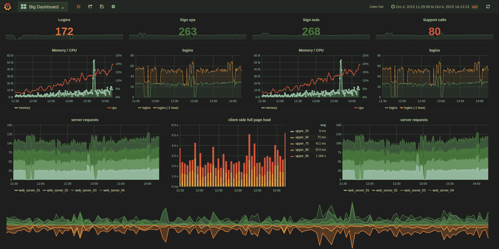
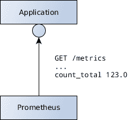
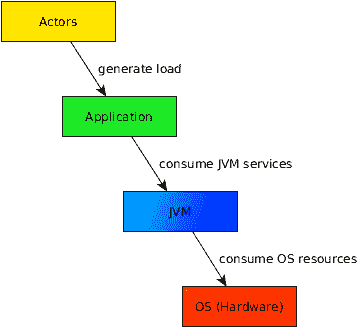
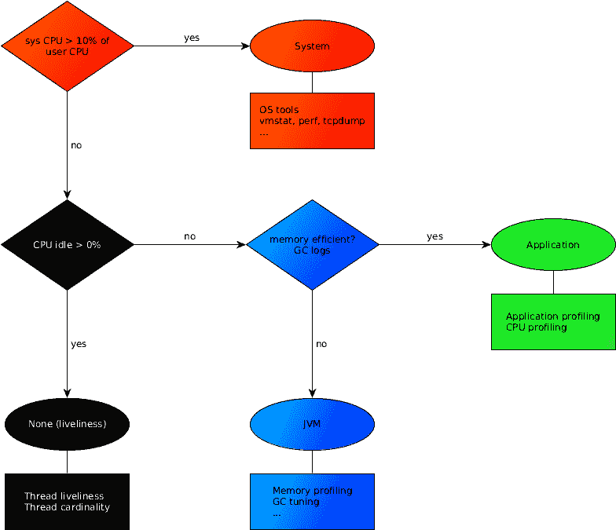
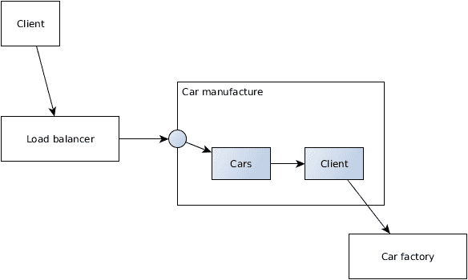
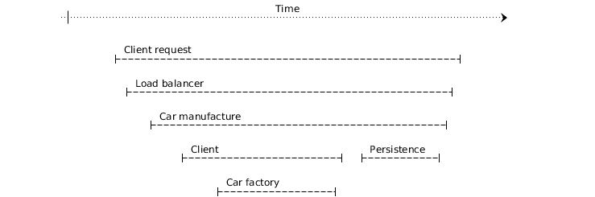

# 第九章：监控、性能和日志记录

我们已经看到了如何使用 Java EE 构建现代、可扩展和有弹性的微服务。特别是关于向微服务添加弹性和技术横切的部分，这是我们希望进一步探讨的主题。

企业应用程序在远离用户的服务器环境中运行。为了提供对系统的洞察，我们需要增加可见性。有多种方法可以实现这一方面的遥测，包括监控、健康检查、跟踪或日志记录。本章涵盖了每种方法的理由以及哪些对企业应用程序是有意义的。

在本章中，我们将涵盖以下主题：

+   商业和技术指标

+   集成 Prometheus

+   如何满足性能需求

+   Java 性能诊断模型

+   监控和采样技术

+   为什么传统的日志记录是有害的

+   在现代世界中监控、日志记录和跟踪

+   性能测试的适用性

# 商业指标

在业务流程中的可见性对于业务相关人员来说至关重要，以便看到并解释企业系统内部发生的事情。与业务相关的指标允许评估流程的有效性。如果没有对流程的可见性，企业应用程序就像一个黑盒。

与业务相关的指标是业务专家的无价资产。它们提供了关于用例如何执行的具体领域信息。显然，哪些指标是有兴趣的取决于领域。

每小时能创建多少辆车？销售了多少篇文章以及金额是多少？转换率是多少？有多少用户参与了电子邮件营销活动？这些都是领域特定关键性能指标的例子。业务专家必须为特定领域定义这些指标。

企业应用程序必须发出来自业务流程中各个点的信息。这种信息的性质取决于实际领域。在许多情况下，业务指标源于执行业务流程期间发生的领域事件。

以每小时创建的汽车数量为例。汽车创建用例发出相应的`CarCreated`领域事件，这些事件被收集以供未来统计。而计算转换率则涉及更多的信息。

业务专家必须定义关键性能指标的含义和来源。定义和收集这些指标成为用例的一部分。发出这些信息是应用程序的责任。

区分业务驱动和技术驱动的指标非常重要。尽管业务指标提供了高价值的见解，但它们直接受到技术指标的影响。一个技术指标示例是服务响应时间，它反过来又受到其他技术指标的影响。子章节*技术指标*将进一步探讨此主题。

因此，业务专家不仅必须关注监控的业务方面，还要关注应用程序响应性的技术影响。

# 收集业务指标

与业务相关的指标允许业务专家评估企业系统的有效性。这些指标为业务领域的特定部分提供了有价值的见解。应用程序负责在其用例中收集与业务相关的指标。

例如，*汽车制造*包执行的业务逻辑可以发出某些指标，例如每小时创建的汽车数量。

从业务角度来看，相关的指标通常源自领域事件。建议在汽车成功制造后，立即在用例中定义和发出领域事件，例如`CarCreated`。这些事件被收集并用于以特定业务指标的形式推导更多信息。

`CarCreated`事件在边界作为 CDI 事件触发，并可以在单独的统计收集器中观察到。以下代码片段展示了作为用例一部分触发的事件：

```java
@Stateless
public class CarManufacturer {

    @Inject
    CarFactory carFactory;

    @Inject
    Event<CarCreated> carCreated;

    @PersistenceContext
    EntityManager entityManager;

    public Car manufactureCar(Specification spec) {
        Car car = carFactory.createCar(spec);
        entityManager.merge(car);
        carCreated.fire(new CarCreated(spec));
        return car;
    }

}
```

边界触发通知成功创建汽车的 CDI 事件。相应的处理与业务流程解耦，并且在此处不涉及任何其他逻辑。该事件将在单独的应用程序作用域 bean 中观察到。同步 CDI 事件可以定义在特定事务阶段进行处理。以下事务观察者确保只有成功的数据库事务被测量：

```java
import javax.enterprise.event.TransactionPhase;

@ApplicationScoped
public class ManufacturingStatistics {

    public void carCreated(@Observes(during =
 TransactionPhase.AFTER_SUCCESS) Specification spec) {
        // gather statistics about car creation with 
        // provided specification
        // e.g. increase counters
    }
}
```

事件信息被收集并进一步处理，以提供业务指标。根据情况，可能需要更多与业务相关的数据。

将相关信息建模为领域事件与业务定义相匹配，并解耦了用例与统计计算。

除了定义领域事件外，根据情况和要求，信息还可以通过横切组件，如拦截器进行收集。在最简单的情况下，指标被仪器化和收集在原语中。应用程序开发人员必须考虑 bean 作用域，以避免因作用域不正确而丢弃收集到的数据。

# 发出指标

度量通常不会在应用程序中持久化，而是在环境中的另一个系统中，例如外部监控解决方案。这简化了度量的实现；企业应用程序将信息保留在内存中并发射指定的度量。外部监控解决方案抓取和处理这些度量。

可以使用几种技术来发射和收集度量。例如，度量可以格式化为自定义 JSON 字符串，并通过 HTTP 端点公开。

作为云原生计算基金会的一部分的监控解决方案，并且截至目前，它具有巨大的动力，是**Prometheus**。Prometheus 是一种监控和警报技术，它抓取、高效存储和查询时间序列数据。它收集通过 HTTP 以特定格式发射的某些服务的数据。Prometheus 在抓取和存储数据方面非常强大。

对于与业务相关的信息和图表，可以在其基础上构建其他解决方案。与 Prometheus 兼容且提供许多吸引人图表可能性的技术是**Grafana**。Grafana 本身不存储时间序列数据，而是使用 Prometheus 等源查询和显示时间序列。

下面的截图显示了 Grafana 仪表板的示例：



仪表板的概念为业务专家提供了可见性，并综合了相关信息。根据需求和动机，相关信息被组合成图表，提供概述和洞察。仪表板提供了根据目标群体查询和自定义时间序列表示的能力。

# 进入 Prometheus

以下示例显示了如何将 Prometheus 集成到 Java EE 中。这是可能的监控解决方案之一，旨在给读者一个如何巧妙地集成与业务相关的度量的想法。

应用程序将以 Prometheus 输出格式发射收集到的度量。Prometheus 实例抓取并存储这些信息，如下面的图所示：



开发者可以实现自定义功能来收集和发射信息，或者使用 Prometheus 的 Client API，该 API 已经包含了几种度量类型。

如下所示，有多个 Prometheus 度量类型：

+   最常用的一个是**计数器**，它代表一个递增的数值。它计算发生的事件。

+   **仪表**是一个上下波动的数值。它可以用来衡量诸如转化率、温度或周转率等值。

+   **直方图**和**摘要**是更复杂的度量类型，用于在桶中对观测值进行采样。它们通常观察度量分布。例如，制造一辆汽车需要多长时间，这些值的变化有多大，以及它们的分布情况如何？

Prometheus 度量有一个名称和标签，标签是一组键值对。时间序列由度量的名称和一组标签来识别。标签可以看作是参数，将整体信息量进行分片。

使用标签的计数器度量表示示例为 `cars_manufactured_total{color="RED", engine="DIESEL"}`。`cars_manufactured_total` 计数器包括由其颜色和发动机类型指定的所有制造汽车的总数。收集的度量可以在以后查询提供的标签信息。

# 使用 Java EE 实现

以下统计实现观察了之前指定的域事件并将信息存储在 Prometheus 计数器度量中：

```java
import io.prometheus.client.Counter;

@ApplicationScoped
public class ManufacturingStatistics {

    private Counter createdCars;

    @PostConstruct
    private void initMetrics() {
        createdCars = Counter.build("cars_manufactured_total",
 "Total number of manufactured cars")
                .labelNames("color", "engine")
                .register();
    }

    public void carCreated(@Observes(during =
            TransactionPhase.AFTER_SUCCESS) Specification spec) {

        createdCars.labels(spec.getColor().name(),
 spec.getEngine().name()).inc();
    }

}
```

计数器度量被创建并注册到 Prometheus 客户端 API。测量的值由汽车的颜色和 `engine` 类型进行限定，这些类型在抓取值时被考虑在内。

为了发出此信息，可以包含 Prometheus servlet 库。这以正确的格式输出所有已注册的度量。监控 servlet 通过 `web.xml` 进行配置。也可以通过访问 `CollectorRegistry.defaultRegistry` 来包含一个 JAX-RS 资源以发出数据。

发出的输出将类似于以下内容：

```java
...
cars_manufactured_total{color="RED", engine="DIESEL"} 4.0
cars_manufactured_total{color="BLACK", engine="DIESEL"} 1.0
```

Java EE 组件，如 CDI 事件，以简洁的方式支持开发者在应用程序中集成域事件度量。在前面的示例中，`ManufacturingStatistics` 类是唯一依赖于 Prometheus API 的点。

强烈建议将 Prometheus 客户端 API 作为单独的容器镜像层包含，而不是包含在应用程序工件中。

监控解决方案抓取并进一步处理提供的信息，以收集所需的业务度量。随着时间的推移抓取制造汽车的计数器会导致每小时创建的汽车数量。此度量可以查询汽车的总数，以及特定颜色和发动机组合。定义业务度量的查询也可以根据需求进行适应和优化。理想情况下，应用程序会发出所需的原子业务相关度量。

# 环境集成

应用程序通过 HTTP 发出业务相关的度量。Prometheus 实例抓取并存储这些数据，并通过查询、图形和外部解决方案（如 Grafana）使其可用。

在容器编排中，Prometheus 实例在集群内部运行。这消除了配置外部可访问监控端点的必要性。Prometheus 与 Kubernetes 集成以发现应用程序实例。由于每个应用程序实例分别发出其监控度量，Prometheus 需要单独访问每个应用程序 pod，从而累积所有实例的信息。

Prometheus 配置存储在配置映射中或作为基础镜像的一部分。实例配置为每*n*秒访问一次应用程序和导出器，以抓取时间序列。有关配置 Prometheus 的详细信息，请参阅其当前文档。

这是将业务监控集成到云原生应用程序中的一种可能解决方案。

建议用业务用例中出现的域事件来表示与业务相关的指标。将所选的监控解决方案集成应从域逻辑中透明地完成，而不应过度依赖供应商。

# 在分布式系统中满足性能要求

响应性是企业应用程序的一个重要非技术性要求。只有当客户端请求能在合理的时间内得到服务时，系统才提供业务价值。

在分布式系统中满足性能要求需要考虑所有参与的应用程序。

企业应用程序通常需要满足**服务水平协议**（**SLA**）。SLA 通常定义了可用性或响应时间的阈值。

# 服务水平协议

为了计算和满足 SLA，考虑哪些流程和应用程序包含在业务用例中非常重要，特别是在同步通信方面。同步调用外部系统的应用程序的性能直接取决于这些调用的性能。如前所述，应避免分布式事务。

根据其本质，只有当所有应用程序都表现良好并协同工作时，才能满足 SLA。每个应用程序都会影响依赖系统的 SLA。这不仅涉及系统中最慢的应用程序，还涉及所有参与的服务。

例如，如果包括对两个应用程序的同步调用，每个应用程序都保证 99.995%的可用性，那么根据定义，达到 99.995%的可用性是不可能的。结果 SLA 是 99.99%，每个参与系统的值相乘。

对于保证响应时间也是如此。每个涉及的系统都会减慢整体响应速度，导致总响应时间是所有 SLA 时间的总和。

# 在分布式系统中实现 SLA

让我们看看如何在分布式系统中实现 SLA 的例子，假设企业应用程序位于一个高性能场景中，其中满足保证响应时间是至关重要的。该应用程序同步与一个或多个提供必要信息的后端系统通信。整个系统需要满足 200 毫秒的 SLA 响应时间。

在这种场景下，后端应用程序通过应用背压和预防性地拒绝无法满足保证 SLA 的请求来支持满足 SLA 时间。这样做，原始应用程序有机会使用可能及时响应的其他后端服务。

为了适当地配置连接池，工程师需要知道后端系统的平均响应时间，这里为 20 毫秒。相应的业务功能通过使用专门的托管执行器服务定义一个专用的线程池。线程池可以单独配置。

配置是通过遵循一些步骤来实现的：工程师配置线程池的最大限制加上最大队列大小，以确保 SLA 时间是平均响应时间的*n*倍。这里的*n*，即`10`，是系统一次将处理的请求数量的最大值，包括最大池大小和最大队列大小限制。任何超出这个数字的请求都会被服务暂时不可用响应立即拒绝。这是基于计算，如果当前处理的请求数量超过*n*，新请求很可能会超过计算出的 200 毫秒的 SLA 时间。

立即拒绝请求听起来像是一种严厉的回应，但通过这样做，客户端应用程序有机会重试不同的后端，而无需在单次调用中浪费整个 SLA 时间。这是一个在多个后端的高性能场景中的案例，其中满足 SLA 具有很高的优先级。

这种场景的实现与上一章中的背压示例类似。如果第一次调用失败，客户端会使用不同的后端作为后备。这隐式地使客户端具有弹性，因为它使用多个后端作为后备。后端服务隐式地应用了隔离舱模式。单个不可用的功能不会影响应用程序的其他部分。

# 解决性能问题

技术指标，如响应时间、吞吐量、错误率或可用时间，表明系统的响应性。只要应用程序的响应性在可接受的范围内，就没有其他指标需要考虑。性能不足意味着系统的服务级别协议（SLA）没有得到满足，也就是说响应时间过高或客户端请求失败。那么问题来了：需要改变什么来改善这种情况？

# 约束理论

如果系统所需的负载增加，理想情况下吞吐量也会增加。约束理论基于这样一个假设，即至少有一个约束将限制系统的吞吐量。因此，约束或瓶颈导致性能下降。

就像链条的强度取决于最薄弱的环节一样，限制性资源限制了系统的整体性能或某些功能的性能。它阻止了应用程序在其他资源未充分利用的情况下处理更多的负载。只有通过增加限制性资源的流量，即消除瓶颈，才能提高吞吐量。如果系统是围绕瓶颈进行优化的，而不是消除它，那么整体系统的响应性不会提高，甚至可能降低。

因此，确定瓶颈至关重要。在针对限制性瓶颈之前，整体性能不会提高。

例如，将更多的 CPU 功率投入到高 CPU 利用率的程序中可能无法帮助实现更好的性能。也许程序表现不佳是因为其他根本原因，而不仅仅是 CPU 不足。

这里重要的是要提到，限制性约束可能位于应用程序之外。在单一、单体应用程序中，这包括硬件和操作系统，以及所有运行进程。如果其他在同一硬件上运行的软件大量使用网络适配器，那么应用程序的网络 I/O 和整体性能也会受到影响，即使根本原因，即限制性约束，不在应用程序的责任范围内。

因此，检查性能问题需要考虑的不仅仅是应用程序本身。在同一硬件上运行的整个进程集都可能影响应用程序的性能，这取决于其他进程如何利用系统资源。

在分布式环境中，性能分析还涉及所有相互依赖的应用程序，以及它们之间的通信。为了确定限制性资源，必须考虑系统的整体情况。

由于应用程序是相互连接的，提高单个系统的响应性将影响其他系统，甚至可能降低整体响应性。再次强调，试图改善错误方面，如围绕瓶颈进行优化，不仅不会提高，反而很可能会降低整体性能。连接到代表瓶颈的外部系统的应用程序，会对外部系统施加一定的压力。如果调整的是应用程序的性能，而不是外部应用程序，那么对后者的负载和压力会增加，这最终会导致整体响应性变差。

在分布式系统中，所有相互依赖的应用程序都涉及其中，这使得解决性能问题变得更加复杂。

# 使用 jPDM 识别性能回归

**Java 性能诊断模型**（**jPDM**）是一个性能诊断模型，它抽象了系统的复杂性。它有助于解释系统的**性能计数器**，从而理解我们为什么经历性能退化的根本原因。

识别性能退化的挑战在于，特定的场景是无数影响因素的结果，其中许多因素是与应用程序外部相关的。jPDM 及其相关方法有助于处理这种复杂性。

在响应性方面，有无数的事情可能会出错，但它们将以有限的方式出错。因此，性能退化可以分类为不同的表现形式。将会有一些典型的问题形式，在无数、不同的场景和根本原因中涌现。为了识别不同的类别，我们将利用诊断模型。

jPDM 识别我们系统的重要子系统、它们的角色、功能和属性。子系统之间相互交互。该模型有助于识别测量子系统活动水平和交互的工具。有助于研究和分析系统及情况的性能、方法和流程，都包含在这个模型中。

# 子系统

Java 应用程序环境中的子系统包括：操作系统（包括硬件）、Java 虚拟机、应用程序和演员。子系统利用它们相应的底层子系统来执行它们的任务。

下图显示了 jPDM 子系统之间是如何相互作用的：



# 演员

演员在广义上是指系统的用户。这包括最终用户、批处理过程或外部系统，具体取决于用例。

通过使用该系统，演员将生成工作负载。演员的特性包括负载因子，即涉及多少用户，以及速度，即用户请求的处理速度。这些特性会影响整体情况，类似于所有其他子系统的特性。

演员本身并不代表性能问题，他们只是使用应用程序。话虽如此，如果系统的性能未达到预期，限制性约束不应在演员中寻找；演员及其生成的工作负载是系统必须处理的情境的一部分。

# 应用程序

企业应用程序包含业务逻辑算法。部分业务用例包括分配内存、调度线程和使用外部资源。

该应用程序将使用框架和 Java 语言功能来实现这一点。它最终直接或间接地使用 JVM 代码和配置，这样应用程序就对 JVM 产生了一定的负载。

# JVM

**Java 虚拟机**（**JVM**）解释并执行应用程序的字节码。它负责内存管理——包括分配以及垃圾回收。为了提高程序的性能，已经实施了许多优化技术，例如 Java HotSpot 性能引擎的**即时编译**（**JIT**）。

JVM 利用操作系统资源来分配内存、运行线程或使用网络或磁盘 I/O。

# 操作系统和硬件

计算机的硬件组件，如 CPU、内存、磁盘和网络 I/O，定义了系统的资源。它们包含某些属性，例如容量或速度。

由于硬件组件代表不可共享的资源，操作系统在进程之间分配硬件。操作系统提供系统级资源并为 CPU 调度线程。

因此，该模型考虑了整个系统，包括硬件。企业应用程序可能不会单独在系统硬件上运行。其他进程使用硬件组件，从而影响应用程序的性能。同时尝试访问网络的多个进程将导致比独立运行每个进程更差的响应性。

# jPDM 实例—生产情况

生产系统中的特定情况是 jPDM 模型的实例。它们包含所有它们的属性、特征和特定的瓶颈。

任何一个子系统的任何变化都会导致具有不同属性和特征的不同情况，从而在模型中产生不同的实例。例如，改变系统负载可能会导致完全不同的瓶颈。

这也是为什么在生产环境之外的环境中进行性能测试可能会导致潜在的不同瓶颈。不同的环境至少有一个不同的操作系统和硬件情况，不一定是在使用的硬件和配置，而是在整个操作系统进程的状态。因此，模拟场景，如性能测试，不允许得出关于瓶颈或性能优化的结论。它们代表了一个不同的 jPDM 实例。

由于我们使用该模型来最终分析性能问题，以下方法只有在存在实际性能问题时才有意义。如果没有问题，即定义的 SLA 得到满足，就没有什么需要调查或采取行动的。

# 分析 jPDM 实例

jPDM 用于协助调查性能回归。模型之外的策略、流程和工具有助于识别限制性约束。

每个子系统都有其独特的属性和资源集，在系统中扮演着特定的角色。我们使用特定的工具来暴露特定的性能指标并监控子系统之间的交互。

回顾约束理论，我们想要调查生产情况中的限制约束，即 jPDM 的一个实例。工具有助于进行调查。在调查中考虑整体系统是很重要的。硬件由所有操作系统进程共享。因此，主导性可能是由单个进程或在该硬件上运行的所有进程的总和引起的。

首先，我们调查 CPU 的主导消费者以及 CPU 的利用率。CPU 消耗模式将引导我们到包含瓶颈的子系统。

为了调查主导消费者，我们使用决策树。它指示 CPU 时间花费在哪里——在内核空间、用户空间还是空闲状态。以下图表显示了决策树：



图中的圆形节点代表 CPU 的主导消费者。颜色代表 jPDM 子系统。遵循决策树将引导我们到包含瓶颈的子系统。确定子系统将性能回归缩小到特定类别。然后我们使用进一步的工具来分析 jPDM 的实例，即实际情况。

由于性能问题可能源于无数的事物，我们需要遵循一个过程来缩小原因。如果我们不遵循一个过程，而是盲目地“窥视和戳探”或猜测，我们不仅会浪费时间和精力，而且可能会错误地将症状识别为实际的限制因素。

CPU 的主导消费者表示 CPU 时间花费在哪里。这是调查情况的重要信息。仅仅查看 CPU 的整体利用率是不够的。仅此信息既不能给我们提供很多关于瓶颈存在与否的证据，也不能帮助我们找到主导消费者。CPU 使用率为 60%并不能告诉我们 CPU 是否是限制资源，也就是说，增加更多的 CPU 是否会提高整体响应速度。需要更详细地分析 CPU 时间。

首先，我们来看 CPU 用户时间和系统时间之间的比率。这表明 CPU 时间是否在内核中花费的时间比预期更长，从而判断操作系统是否是 CPU 的主导消费者。

# 主导消费者 - 操作系统

当操作系统被要求比通常应该工作得更努力时，它主导了 CPU 的消耗。这意味着过多的 CPU 时间被用于资源和管理设备。这包括网络和磁盘 I/O、锁、内存管理或上下文切换。

如果 CPU 系统时间超过用户时间的某个百分比值，操作系统是主导消费者。jPDM 根据分析无数生产情况的经验，将 10%作为阈值值。这意味着如果 CPU 系统时间超过用户时间的 10%，瓶颈包含在操作系统子系统内。

在这种情况下，我们使用操作系统工具进一步调查问题，例如`vmstat`、`perf`、`netstat`等。

例如，一个企业应用程序通过执行大量单独查询检索数据库条目，给操作系统管理所有这些数据库连接带来了很大压力。建立每个网络连接所花费的额外开销最终会主导整个系统，并代表系统中的约束资源。因此，调查这种情况显示了在内核中建立网络连接时花费了大量 CPU 时间。

# 主导消费者 - 无

如果 CPU 时间没有确定操作系统是主导消费者，我们继续遵循决策树并分析 CPU 是否空闲。如果是这种情况，这意味着还有 CPU 时间可用，但无法消耗。

由于我们正在分析 SLA 未满足的情况，即整体系统在给定负载下表现不佳，一个充分饱和的情况将充分利用 CPU。因此，空闲 CPU 时间表明存在活跃性问题。

需要调查的是为什么线程没有被操作系统调度。这可能有多个原因，例如空连接或线程池、死锁情况或响应缓慢的外部系统。线程的状态将指示约束的原因。我们再次使用操作系统工具来调查这种情况。

这种问题类别的一个例子是当同步访问响应缓慢的外部系统时。这将导致等待网络 I/O 的线程无法运行。这与主导操作系统消耗的区别在于，线程不是积极执行工作而是在等待被调度。

# 主导消费者 - JVM

到目前为止，主导消费者不包含在应用程序或 JVM 子系统内。如果 CPU 时间没有过多地花费在内核或空闲，我们开始在 JVM 中进行调查。

由于 JVM 负责内存管理，其性能将指示潜在的内存问题。主要**垃圾收集**（**GC**）日志，以及**JMX**工具帮助调查场景。

内存泄漏会导致内存使用量增加和垃圾收集器运行过度，占用 CPU 资源。不高效的内存使用同样会导致垃圾收集过度。GC 执行最终导致 JVM 成为 CPU 的主导消费者。

这又是为什么遵循 jPDM 决策树流程很重要的另一个例子。性能问题出现在高 CPU 使用率中，尽管在这种情况下实际的瓶颈是内存泄漏。

到目前为止，性能问题的主要原因是与内存相关，主要是由于应用程序日志导致的广泛字符串对象创建。

# 主消费者—应用程序

如果 JVM 分析没有表明内存问题，最终应用程序是 CPU 的主消费者。这意味着应用程序代码本身负责瓶颈。特别是运行复杂算法过多的应用程序过度利用 CPU。

与应用程序相关的分析将导致以下结论：问题起源于应用程序的哪个部分以及问题可能如何解决。这意味着应用程序要么包含次优代码，要么在给定资源下达到了可能的极限，最终需要水平或垂直扩展。

# 结论

解决性能问题的方法是首先通过遵循特定流程来调查情况，尝试通过调查来表征回归。在确定了限制性资源之后，再采取进一步步骤来解决问题。在可能修复了情况之后，需要在生产中进行重复测量。重要的是不要在没有验证这些更改确实提供了预期结果的情况下更改行为或配置。

jPDM 方法通过应用统一的解决流程，不考虑应用程序代码来调查性能回归。

需要哪些工具和指标来应用这种方法？

根据生产中的系统，操作系统自带工具以及与 Java 运行时相关的工具都是有用的。由于所有方面都考虑了操作系统级别的整体系统，而不仅仅是应用程序本身，因此操作系统工具和底层指标比特定于应用程序的工具更有帮助。

然而，应用程序的技术指标，如响应时间或吞吐量，是首先关注的焦点，它们表明了应用程序的服务质量。如果这些指标表明存在性能问题，那么使用底层指标和工具进行调查是有意义的。

下一节将探讨如何收集应用程序的技术指标。

# 技术指标

技术指标表明系统的负载和响应能力。这些指标的典型例子包括响应时间以及吞吐量，通常分别以每秒请求数或事务数的形式收集。它们提供了关于整体系统当前性能的信息。

这些指标最终将对其他与业务相关的指标产生影响。同时，正如我们在上一节中看到的，这些指标只是指标，并且自身受到许多其他技术方面的影响，即 jPDM 子系统的所有属性。

因此，应用程序的性能受到许多技术因素的影响。那么，除了响应时间、吞吐量、错误率和正常运行时间之外，还应该合理收集哪些技术指标呢？

# 技术指标的类型

技术指标主要关注应用程序服务的质量，如响应时间或吞吐量。它们是代表应用程序响应性的指标，可能指出潜在的性能问题。这些信息可以用来创建关于趋势和应用程序高峰的统计数据。

这种洞察增加了及时预见潜在故障和性能问题的可能性。这在技术上等同于对其他方面是黑盒系统的业务洞察。这些指标本身并不能得出关于性能问题的根本原因或约束资源的可靠结论。

低级技术信息包括资源消耗、线程、池化、事务或会话。再次强调，仅凭这些信息并不能直接指导工程师找到潜在的瓶颈。

如前所述，有必要检查在特定硬件上运行的所有内容的整体情况。操作系统信息是最佳的信息来源。为了解决性能问题，操作系统以及应用程序工具都需要考虑这一点。

这并不意味着应用程序或 JVM 运行时发出的技术信息毫无价值。应用程序特定的指标可以帮助解决性能问题。重要的是要记住，仅凭这些指标可能会导致关于系统性能调整时约束资源的错误假设。

# 高频监控与采样

通常，监控的目的是以每秒多次收集的方式收集高频技术指标。这种高频收集的问题在于它严重影响了系统的性能。即使没有性能退化，指标也可能被收集。

正如之前提到的，仅凭应用程序级别的指标，如资源消耗，在识别潜在的性能约束方面帮助不大。同样，收集数据会干扰系统的响应性。

与高频监控相比，建议以较低频率采样指标，例如每分钟仅采样几次。统计总体背后的理论表明，这些少量样本足以代表总体数据。

采样信息应尽可能少地影响应用程序的性能。所有后续的调查、指标查询或计算都应该在带外进行；也就是说，外包给一个不会影响运行应用程序的系统。因此，从存储、查询和显示信息中分离出采样信息的担忧。

# 收集技术指标

应用程序是收集技术指标的好地方，理想情况下是在系统边界处。同样有可能在潜在的代理服务器中收集这些指标。

应用程序服务器已经发出了一些技术相关的指标，例如关于资源消耗、线程、连接池、事务或会话的信息。一些解决方案还提供了 Java 代理，用于采样和发出技术相关的信息。

传统上，应用程序服务器需要通过 JMX 提供技术相关的指标。这个功能是管理 API 的一部分，但在项目中从未被广泛使用。其中一个原因是模型和 API 相当繁琐。

然而，提到 Java EE 应用程序服务器需要收集和提供其资源的数据是有帮助的。容器通过 JMX 发出这些信息。有几种方法可以抓取这些信息。

有所谓的导出器可用，这些应用程序要么作为独立运行，要么作为**Java 代理**运行，它们访问 JMX 信息并通过 HTTP 发出。例如，Prometheus JMX 导出器，它以前面的类似格式导出信息，就是这种方法的例子。这种方法的好处是它不会向应用程序添加依赖项。

Java 代理的安装和配置是在应用程序服务器中完成的，在基本容器镜像层中。这再次强调了容器不应将应用程序的工件与实现细节耦合的原则。

# 边界指标

专门针对应用程序的指标，例如响应时间、吞吐量、正常运行时间或错误率，可以在系统边界处收集。这可以通过拦截器或过滤器来实现，具体取决于情况。与 HTTP 相关的监控可以通过 servlet 过滤器收集，适用于任何基于 servlet 技术的技术，例如 JAX-RS。

以下代码片段显示了一个 servlet 过滤器，它收集了 Prometheus 直方图指标中的响应时间和吞吐量：

```java
import javax.servlet.*;
import javax.servlet.annotation.WebFilter;
import javax.servlet.http.HttpServletRequest;

@WebFilter(urlPatterns = "/*")
public class MetricsCollectorFilter implements Filter {

    private Histogram requestDuration;

    @Override
    public void init(FilterConfig filterConfig) throws ServletException {
        requestDuration = Histogram.build("request_duration_seconds",
 "Duration of HTTP requests in seconds")
                .buckets(0.1, 0.4, 1.0)
                .labelNames("request_uri")
                .register();
    }

    public void doFilter(ServletRequest req, ServletResponse res,
 FilterChain chain) throws IOException, ServletException {
        if (!(req instanceof HttpServletRequest)) {
            chain.doFilter(req, res);
            return;
        }

        String url = ((HttpServletRequest) req).getRequestURI();
        try (Histogram.Timer ignored = requestDuration
 .labels(url).startTimer()) {
            chain.doFilter(req, res);
        }
    }

    @Override
    public void destroy() {
        // nothing to do
    }
}
```

此指标与之前提到的与业务相关的示例类似注册，并通过 Prometheus 输出格式发出。直方图桶收集四个桶中的时间，指定的时间为 0.1、0.4 或 1.0 秒，以及以上所有时间。这些桶配置需要根据 SLA 进行调整。

servlet 过滤器在所有资源路径上都是激活的，并将收集每个路径的统计数据。

# 记录和跟踪

从历史上看，日志在企业应用程序中具有相当高的重要性。我们看到了许多日志框架的实现和关于如何实现合理日志的所谓最佳实践。

日志通常用于调试、跟踪、日志记录、监控和输出错误。一般来说，所有开发者认为相对重要但未向用户明确显示的信息都被放入日志中。在几乎所有情况下，这包括将日志记录到文件中。

# 传统日志的不足

这种在企业项目中非常常见的方法带来了一些问题。

# 性能

传统的日志记录，尤其是广泛使用的日志调用，会创建大量的字符串对象。即使是旨在减少不必要的字符串连接的 API，如**Slf4J**，也会导致高内存率。所有这些对象在使用后都需要进行垃圾回收，这会利用 CPU。

将日志事件存储为字符串消息是一种冗长的信息存储方式。选择不同的格式，主要是二进制格式，将大大减少消息大小，并导致更高效的内存消耗和更高的吞吐量。

存储在缓冲区或直接在磁盘上的日志消息需要与其他日志调用同步。同步日志记录器最终会导致文件在单个调用中写入。所有同时进行的日志调用都需要同步，以确保记录的事件按正确顺序出现。这间接地将原本完全无关的功能耦合在一起，降低了本质上独立的函数的并行性，并对整体性能产生负面影响。随着日志消息数量的增加，由于同步导致的线程阻塞概率也会增加。

另一个问题在于，日志框架通常不会直接将日志消息写入磁盘；相反，它们使用多层缓冲。这种优化技术伴随着一定的管理开销，这并不会改善情况。建议同步文件操作尽可能与最小开销的层一起工作。

位于 NFS 存储上的日志文件会进一步降低整体性能，因为写操作会两次击中操作系统 I/O，涉及文件系统和网络调用。为了管理和持久化日志文件，网络存储通常是首选解决方案，特别是对于需要持久卷的容器编排。

通常，经验表明，日志对应用程序性能的影响最大。这主要是因为字符串日志消息对内存的影响。

# 日志级别

日志解决方案包括通过日志级别指定日志条目的重要性，例如 *debug*、*info*、*warning* 或 *error*。开发者可能会问自己为特定调用选择哪个日志级别。

有几个层级的做法听起来确实合理，因为生产系统可以指定比开发运行更高的日志级别，这样就不会在生产中产生太多数据。

这种情况下的挑战是，在生产环境中，通常在需要时没有可用的调试日志信息。可能需要额外洞察的错误情况没有这方面的信息。包含跟踪信息的调试或跟踪日志级别被关闭。

选择日志级别始终是在关于应包含哪些信息之间进行权衡。在开发中进行调试最好使用实际的调试工具，这些工具连接到正在运行的应用程序，可能是在远程。调试或跟踪日志在生产环境中通常不可用，因此提供的益处很少。

虽然定义多个日志级别可能源于良好的意图，但在生产系统中的实际使用添加的价值很少。

# 日志格式

传统的日志解决方案指定特定的日志布局，该布局将日志消息格式化到生成的日志文件中。应用程序需要管理创建、滚动和格式化与业务逻辑无关的日志文件。

许多企业应用程序都附带第三方日志依赖项，这些依赖项实现了这种功能，但没有任何业务价值。

选择特定的纯文本日志格式是应用程序开发者需要做出的另一个决定。在可由人类和机器读取的日志条目格式和系统性能之间存在着权衡。结果通常是双方都不满意的最差妥协；既难以阅读又对系统性能有巨大影响的字符串日志格式。

选择以最高密度存储信息的二进制格式会更合理。然后，人类可以使用工具使消息可见。

# 数据量

大量日志引入了包含在日志文件中的大量数据。特别是，用于调试和跟踪目的的日志会导致大文件，这些文件难以解析且成本高昂。

通常，解析日志格式会引入不必要的开销。可能具有技术相关性的信息首先以特定格式序列化，只是为了在稍后检查日志时再次解析。

在本子节稍后，我们将看到其他有哪些解决方案。

# 混淆

与不合理检查的异常处理一样，日志会模糊源代码中的业务逻辑。这在许多项目中常见的样板日志模式中尤其如此。

日志语句在代码中占用太多空间，尤其是会吸引开发者的注意力。

一些日志技术，如 Slf4j，提供了以可读方式格式化字符串的功能，同时避免了立即的字符串连接。但是，日志语句仍然添加了与业务问题无关的模糊调用。

如果在横切组件（如拦截器）中添加调试日志语句，情况显然就不太一样了。然而，这些情况大多是为了跟踪目的而添加日志。我们将在下一小节中看到，有更多适合这种需求的解决方案。

# 应用程序的担忧

正如我们在 12 因子应用程序中看到的，选择日志文件和消息格式不是应用程序的担忧。

尤其是那些承诺提供更简单日志解决方案的日志框架，会将技术驱动的第三方依赖项添加到应用程序中；这些依赖项没有直接的业务价值。

如果事件或消息具有业务价值，那么应该优先考虑使用其他解决方案。以下展示了传统日志是如何被误用于这些其他应用程序的担忧。

# 技术选择不当

传统日志，以及它在大多数企业项目中的使用方式，对于更适合使用不同方法处理的问题来说，是一个次优选择。

问题是：开发者到底想记录什么？比如，关于当前资源消耗的指标？或者与业务相关的信息，比如*制造的汽车*？我们应该记录像*由应用程序 A 发起，调用后续应用程序 B 的请求*这样的调试和跟踪信息吗？关于发生的异常呢？

仔细阅读的读者会发现，对于传统日志记录的大多数用例，使用其他方法处理会更好。

如果日志用于调试或调试跟踪应用程序，使用跟踪或调试级别的做法帮助不大。在生产环境中不可用的信息无法重现潜在的错误。然而，在生产环境中记录大量调试或跟踪事件，由于磁盘 I/O、同步和内存消耗，将影响应用程序的响应性。调试与并发相关的错误甚至可能导致不同的结果，因为执行顺序已被修改。

对于调试功能，在开发期间使用实际的调试器功能（如连接到运行中的应用程序的 IDE）更为可取。用于业务动机的日志记录，如我们将在本章后面看到的，最好通过适当的日志记录解决方案来完成。纯文本日志消息当然不是理想的解决方案。选择的技术应尽量减少对应用程序的性能影响。

实现日志记录背后相同动机的另一种方法是引入事件溯源。这使得领域事件成为应用程序核心模型的一部分。

由业务动机驱动的跟踪，这也应该是业务用例的一部分，使用适当的解决方案实现。正如我们将在下一小节中看到的，有更多适合的跟踪解决方案，这些解决方案需要更少的解析，并且性能影响更小。跟踪解决方案还支持跨微服务的信息和请求的整合。

存储在日志消息中的监控信息，通过使用适当的监控解决方案来管理会更好。这种方法不仅性能更佳，而且也是以适当的数据结构发出信息更有效的方式。本章前面看到的例子说明了监控数据和可能的解决方案。

日志记录也传统上被用来输出那些在应用程序中无法适当处理的异常和错误。这可以说是日志记录的唯一合理用途。结合其他可能捕获错误的潜在指标，例如系统边界的错误率计数器，记录的异常可能有助于开发者调查错误。

然而，只有当错误和异常确实与应用程序相关，并且可以由开发者解决时，才应该记录它们。在部署了监控和警报解决方案的情况下，查看日志的需求应表明应用程序存在严重问题。

# 容器化世界的日志记录

12 个因素原则之一是将日志视为事件流。这包括处理日志文件不应是企业应用程序关注点的想法。日志事件应简单地输出到进程的标准输出。

应用程序的运行环境会整合和处理日志流。有针对所有参与应用程序的统一访问解决方案，可以部署到环境中。应用程序部署的运行环境负责处理日志流。**fluentd**，作为云原生计算基金会的一部分，统一了分布式环境中日志事件的访问。

应用程序开发者应尽可能简单地将使用的日志技术视为一种工具。应用程序容器被配置为将所有服务器和应用程序日志事件输出到标准输出。这种方法简化了企业开发者的工作，并使他们能够更多地关注解决实际业务问题。

正如我们所看到的，在传统方式下，应用程序开发者合理可以记录的信息并不多。监控、日志记录或跟踪解决方案，以及事件溯源，可以以更合适的方式解决需求。

与无需复杂日志文件处理的输出到标准输出的日志记录相结合，就没有必要使用复杂的日志框架。这支持零依赖的应用程序，并使开发者能够专注于业务关注点。

因此，建议避免使用第三方日志框架，以及写入传统的日志文件。管理日志轮换、日志条目格式、级别和框架依赖，以及配置的需求，就不再必要了。

然而，以下内容可能对企业开发者来说似乎有些矛盾。

使用 Java 的`System.out`和`System.err`标准输出能力是记录输出的简单、12 因素方法。这直接写入同步输出，而没有不必要的缓冲层。

重要的是要提到，通过这种方法输出数据将不会执行。引入的同步，再次将应用程序中原本独立的各个部分联系在一起。如果将进程的输出抓取并由显卡发出，性能将进一步降低。

将日志记录到控制台仅意味着输出异常，正如 Java 类型的名称所表明的——异常。在其他所有情况下，工程师必须问自己为什么一开始就想输出信息，或者是否有其他更合适的解决方案。因此，记录的错误应表明一个需要工程行动的致命问题。不应期望在生产环境中接收到此日志输出；在这种情况下，性能可能会受到忽视。

为了输出致命错误信息，Java EE 应用程序可以使用 CDI 特性以及 Java SE 8 功能接口来提供统一的日志功能：

```java
public class LoggerExposer {

    @Produces
    public Consumer<Throwable> fatalErrorConsumer() {
        return Throwable::printStackTrace;
    }
}
```

然后，`Consumer<Throwable>`日志记录器可以注入到其他 bean 中，并使用消费者类型的`accept()`方法进行日志记录。如果希望有一个更易读的接口，可以通过`@Inject`注入定义一个薄的日志记录器外观类型，如下所示：

```java
public class ErrorLogger {

    public void fatal(Throwable throwable) {
        throwable.printStackTrace();
    }
}
```

这种方法对于企业开发者来说可能看起来是反直觉的，尤其是在不使用日志框架的情况下进行日志记录。使用复杂的日志框架，该框架用于将输出再次定向到标准输出，引入了开销，最终导致相同的结果。一些开发者可能此时更喜欢使用 JDK 日志。

然而，提供复杂的日志接口，从而给应用程序开发者提供输出各种信息的机会，特别是可读性强的字符串，是适得其反的。这就是为什么代码示例只允许在致命错误情况下输出可抛出类型。

重要的是要注意以下几个方面：

+   应避免传统的日志记录，并使用更适合的解决方案

+   只有那些例外情况，即理想情况下永远不会发生，的致命错误情况才应该被记录

+   建议容器化应用程序将日志事件输出到标准输出

+   应用程序日志和接口应尽可能简单，防止开发者过度使用

# 日志记录

如果需要作为业务逻辑一部分的日志记录，有比使用日志框架更好的方法。日志记录的要求可能是审计法规，例如交易系统的情况。

如果业务逻辑需要日志记录，则应相应地将其视为业务需求。有可用的日志记录技术，它以比传统日志记录更高的密度和更低的延迟同步持久化所需信息。这些解决方案的例子是**Chronicle Queue**，它允许我们以高吞吐量和低延迟存储消息。

应用程序领域可以将信息建模为领域事件，并将其直接持久化到日志记录解决方案中。如前所述，另一种方法是基于事件源模型构建应用程序。审计信息随后已成为应用程序模型的一部分。

# 跟踪

跟踪用于重现特定场景和请求流。它已经在回溯复杂的应用程序过程中很有帮助，但在涉及多个应用程序和实例时尤其有帮助。

然而，重要的是要指出，跟踪系统需要有业务需求，而不是技术需求，类似于日志记录。

跟踪不是调试或性能跟踪系统的良好技术。它将对性能产生一定影响，并且在解决性能回归方面帮助不大。需要优化其性能的相互依赖的分布式应用程序最好仅发出有关其服务质量的信息，例如响应时间。采样技术可以充分收集指示应用程序中性能问题的信息。

然而，让我们看看由业务动机驱动的跟踪，以跟踪涉及的组件和系统。

下面的图显示了涉及多个应用程序实例及其组件的特定请求的跟踪。



跟踪也可以显示在时间轴上，以显示同步调用，如下面的图所示：



跟踪包括有关哪些应用程序或应用程序组件已参与以及单个调用持续了多长时间的信息。

传统上，日志文件已用于此，通过记录每个方法或组件调用的开始和结束，包括一个关联 ID，例如线程标识符。有可能将关联 ID 包含到仅用于单个源请求并随后在后续应用程序中重用和记录的日志中。这导致跟踪跨越多个应用程序。

在日志记录的情况下，跟踪信息是从多个日志文件中累积的；例如，使用如**ELK**堆栈之类的解决方案。跟踪日志通常以横切方式实现；例如，使用日志过滤器和中继器，以免混淆代码。

然而，使用日志文件进行追踪是不推荐的。即使是经历适度负载的企业应用程序也会引入大量的日志条目，这些条目被写入文件。每个请求都需要许多日志条目。

基于文件的 I/O 和所需的日志格式序列化通常对这个方法来说太重了，并且极大地影响了性能。追踪到日志文件格式引入了大量的数据，之后还需要再次解析。

有一些追踪解决方案提供了更好的匹配。

# 现代世界的追踪

在过去几个月和几年中，出现了多个旨在最小化对系统性能影响的追踪解决方案。

**OpenTracing** 是一个标准、供应商中立的追踪技术，它是云原生计算基金会的一部分。它定义了追踪的概念和语义，并支持分布式应用程序的追踪。它由多个追踪技术实现，例如 **Zipkin**、**Jaeger** 或 **Hawkular**。

层次化追踪由多个跨度组成，类似于之前图中所示。一个跨度可以是另一个跨度的子跨度或跟随者。

在前面的例子中，汽车制造组件跨度是负载均衡跨度的一个子跨度。持久化跨度跟随客户端跨度，因为它们的调用是顺序发生的。

OpenTracing API 的跨度包括时间跨度、操作名称、上下文信息，以及可选的标签和日志集合。操作名称和标签与之前在 *进入 Prometheus* 部分中描述的 Prometheus 度量名称和标签有些相似。日志描述了诸如跨度消息等信息。

单个跨度的示例是 `createCar`，带有标签 `color=RED` 和 `engine=DIESEL`，以及日志字段 `message` 的 `Car successfully created`。

以下代码片段展示了在 *汽车制造* 应用程序中使用 OpenTracing Java API 的示例。它支持 Java 的 try-with-resource 功能。

```java
import io.opentracing.ActiveSpan;
import io.opentracing.Tracer;

@Stateless
public class CarManufacturer {

    @Inject
    Tracer tracer;

    public Car manufactureCar(Specification spec) {
        try (ActiveSpan span = tracer.buildSpan("createCar")
                .withTag("color", spec.getColor().name())
                .withTag("engine", spec.getEngine().name())
                .startActive()) {

            // perform business logic

            span.log("Car successfully created");
        }
    }
}
```

创建的跨度开始活动并作为子跨度添加到可能存在的父跨度中。`Tracer` 由一个 CDI 生产者产生，该生产者依赖于特定的 OpenTracing 实现。

显然，这种方法会大量混淆代码，应该将其移动到横切组件，例如拦截器。追踪拦截器绑定可以装饰方法并提取有关方法名称和参数的信息。

根据追踪跨度中包含的所需信息，拦截器绑定可以被增强以提供更多信息，例如操作名称。

以下代码片段展示了使用拦截器绑定以简洁方式添加追踪的业务方法。实现拦截器留给读者作为练习：

```java
@Stateless
public class CarManufacturer {

    ...

    @Traced(operation = "createCar")
    public Car manufactureCar(Specification spec) {
        // perform business logic
    }
}
```

追踪信息通过跨度上下文和载体传递到后续应用程序中。它们使参与的应用程序能够添加自己的追踪信息。

收集的数据可以通过使用的 OpenTracing 实现提取。对于 JAX-RS 资源和服务端客户端等技术，有可用的过滤器和拦截器实现，这些实现可以透明地添加所需的调试信息到调用中，例如使用 HTTP 头。

这种跟踪方式对系统性能的影响远小于传统日志记录。它定义了精确的步骤和系统，这些系统会检测业务逻辑流程。然而，如前所述，需要业务需求来实现跟踪解决方案。

# 典型的性能问题

性能问题伴随着典型的症状，如响应时间变慢或成为更慢，超时，甚至完全不可用的服务。错误率指示了后者。

当性能问题出现时，需要问的问题是实际限制资源，即瓶颈是什么。问题起源于哪里？如前所述，建议工程师遵循一个考虑整体情况（包括硬件和操作系统）的调查过程，以找到限制因素。不应有猜测和过早的决定。

性能问题可能有无数的根本原因。其中大部分源于编码错误或配置错误，而不是实际工作负载超过可用资源。现代应用程序服务器可以处理大量的负载，直到性能成为问题。

然而，经验表明，存在典型的性能问题根本原因。以下将展示最严重的一些。

工程师被指示正确调查问题，而不是遵循所谓的最佳实践和过早优化。

# 日志记录和内存消耗

传统的日志记录，例如将字符串格式的日志消息写入文件，是性能不佳的最常见根本原因。本章已经描述了这些问题及其可行的解决方案。

性能不佳的最大原因是大量字符串对象的创建和随之而来的内存消耗。一般来说，高内存消耗代表了一个主要性能问题。这不仅仅是由日志记录引起的，还包括缓存中的高内存率、内存泄漏或大量对象创建。

由于 JVM 管理内存的垃圾回收，这些高内存率会导致垃圾回收器运行，试图释放未使用的内存。垃圾回收利用 CPU。这种情况不会因为单次回收运行而得到解决，从而导致后续的 GC 执行和 CPU 使用率升高。如果无法释放足够的内存，无论是由于内存泄漏还是高负载和高消耗，这种情况就会发生。即使系统没有因为`OutOfMemoryError`而崩溃，CPU 使用率也可能有效地使应用程序停滞。

垃圾收集日志、堆转储和测量可以帮助调查这些问题。JMX 工具提供了关于内存分布和潜在热点方面的见解。

如果业务逻辑以简洁、直接的方式使用短期对象实现，内存问题就远不太可能发生。

# 过早优化

在企业项目中，经常发生开发者试图在没有适当验证的情况下过早优化应用程序的情况。例如，使用缓存、配置池以及应用程序服务器行为，但在调整前后没有进行足够的测量。

在没有确定性能问题之前，强烈建议不要考虑使用这些优化。在更改设置之前，进行适当的性能采样和测量，以及调查限制性资源，是必要的。

在绝大多数情况下，遵循约定优于配置原则就足够了。这适用于 JVM 运行时以及应用程序服务器。如果开发者采用默认应用程序服务器配置的纯 Java EE 方法，他们不太可能遇到过早优化的问题。

如果技术指标表明当前的方法不足以满足生产工作负载，那么才需要引入变更。此外，工程师应该随着时间的推移验证变更的必要性。技术会变化，之前运行版本中提供补救措施的优化可能不再是最佳解决方案。

约定优于配置的方法以及首先采用默认配置也要求最少的初始努力。

再次，经验表明，许多问题源于在事先没有适当验证的情况下过早引入变更。

# 关系型数据库

关系型数据库通常被视为性能不足的替罪羊。通常，应用程序服务器以多个实例部署，所有实例都连接到单个数据库实例。这是由于 CAP 定理确保一致性的必要条件。

数据库作为一个单一的责任点或失败点，注定会成为瓶颈。然而，工程师必须考虑适当的测量来验证这个假设。

如果指标表明数据库响应速度慢于可接受的范围，那么首先要调查根本原因。如果数据库查询是导致响应缓慢的原因，建议工程师查看执行的查询。是否有大量数据被加载？如果是，所有这些数据都是必要的吗？或者应用程序稍后会对其进行过滤和减少？在某些情况下，数据库查询加载的数据可能比所需的更多。

这也是一个与业务相关的问题，特别是对于检索数据，是否一切都需要。在这种情况下，更具体的数据库查询，如预先过滤结果或大小限制（如分页），可能会有所帮助。

数据库在连接和过滤数据时表现非常出色。在数据库实例中直接执行更复杂的查询通常优于将所有所需数据加载到应用程序的内存中并执行查询。在 Java 中可以定义复杂的嵌套 SQL 查询并在数据库中执行它们。然而，企业应用程序应该避免直接在数据库中使用存储过程来定义业务逻辑查询。与业务相关的逻辑应该位于应用程序中。

一个典型的配置错误是忽略了在查询中使用的相关数据库列的索引。在许多项目中，仅通过定义适当的索引就可以将整体性能提高几个因素。

通常，特定用例的洞察测量通常可以提供关于问题可能起源于哪里的良好见解。

在某些场景中，经常更新数据的查询往往会导致乐观锁定错误。这源于领域实体同时被更新。乐观锁定与其说是技术问题，不如说是业务问题。服务错误率将表明这些问题。

如果业务用例要求实体经常同时更改，开发团队可以考虑将功能更改为基于事件的模型。同样，如前所述，通过引入最终一致性，事件溯源和事件驱动架构消除了这种情况。

如果性能问题纯粹源于工作负载和并发访问，那么最终需要不同的数据模型，例如使用 CQRS 实现的事件驱动架构。然而，通常可以通过其他方式解决这个问题。绝大多数企业应用程序使用关系数据库就可以很好地扩展。

# 通信

大多数与通信相关的性能问题都是由于同步通信引起的。这个领域的大多数问题都源于缺少超时，导致客户端调用无限期地阻塞并造成死锁情况。这种情况发生在没有配置客户端超时并且调用的系统不可用的情况下。

如果配置的超时时间过长，则会发生一个不那么关键但同样不完善的情况。这会导致系统等待时间过长，减慢进程并阻塞线程。

如前所述，为客户端调用配置超时提供了简单但有效的缓解措施。

高响应时间和低吞吐量可能有多个原因。性能分析可以提供关于时间花费在哪里的见解。

还有一些其他潜在的瓶颈，例如有效载荷大小。数据是作为纯文本发送还是作为二进制数据发送，在有效载荷大小上可能会有很大的差异。使用不完善算法或技术的序列化也可能降低响应速度。然而，除非应用程序位于高性能环境中，否则这些担忧通常是可以忽略的。

如果需要多个同步调用，如果可能的话，它们应该并行发生，使用容器管理的线程；例如，由管理执行器服务提供。这样可以避免不必要地使应用程序等待。

通常情况下，应避免跨越多个事务性系统的用例，例如使用分布式事务的数据库。如前所述，分布式事务无法扩展。业务用例应考虑有效地异步处理。

# 线程和池

为了重用线程以及连接，应用程序容器管理池。请求的线程不一定需要创建，而是从池中重用。

池用于控制系统特定部分的负载。选择合适的池大小可以使系统很好地饱和，但防止其过载。这是因为空池会导致挂起或拒绝请求。该池的所有线程和连接已经被充分利用。

通过定义专用的线程池，bulkhead 模式可以防止系统的不同部分相互影响。这限制了资源短缺到一个可能有问题功能。在某些情况下，如遗留系统可能已知会导致问题。作为专用线程池实现的 bulkheads 以及超时配置有助于保持应用程序的健康。

空池可能源于该池当前负载异常高，或者获取的资源比预期的时间长得多。在任何情况下，建议不要简单地增加相应的池大小，而是调查问题根源。描述的调查技术以及 JMX 洞察力和线程转储将帮助您找到瓶颈，以及潜在的编程错误，如死锁、配置不当的超时或资源泄漏。在少数情况下，池的短缺实际上可能源于高负载。

池的大小和配置在应用程序容器中完成。工程师必须在重新配置服务器前后在生产环境中进行适当的性能采样。

# 性能测试

性能测试的挑战在于测试是在模拟环境中运行的。

模拟环境适用于其他类型的测试，例如系统测试，因为某些方面被抽象化。例如，模拟服务器可以模拟与生产环境相似的行为。

然而，与功能测试不同，验证系统的响应性需要考虑环境中的所有因素。最终，应用程序是在实际硬件上运行的，因此硬件以及整体情况都会影响应用程序的性能。在模拟环境中的系统性能永远不会在生产环境中表现得一样。因此，性能测试不是可靠地找到性能瓶颈的方法。

在许多情况下，应用程序在生产环境中的性能可能比性能测试中表现更好，这取决于所有直接和即将到来的影响因素。例如，HotSpot JVM 在高负载下表现更佳。

因此，调查性能限制只能在生产环境中进行。如前所述，jPDM 调查过程，结合应用于生产系统的采样技术和工具，将识别瓶颈。

性能和压力测试有助于发现明显的代码或配置错误，例如资源泄露、严重配置错误、超时缺失或死锁。这些错误将在部署到生产之前被发现。性能测试还可以捕捉到随时间推移的性能趋势，并在整体响应性下降时警告工程师。然而，这可能仅表明潜在问题，但不应该导致工程师过早得出结论。

性能和压力测试只有在相互依赖的应用程序网络中才有意义。这是因为所有涉及的系统和数据库的依赖性和性能影响。设置需要尽可能接近生产环境。

即使如此，结果也不会与生产环境相同。工程师们对此要有清醒的认识。因此，在性能测试之后的性能优化永远不能完全代表真实情况。

对于性能调优来说，重要的是在生产环境中结合调查过程和采样。持续交付技术有助于快速将配置更改应用到生产环境中。然后工程师可以使用采样和性能洞察来查看更改设置是否改善了整体解决方案。再次强调，需要考虑整个系统。仅仅调整单个应用程序而不考虑整个系统可能会对整体情况产生负面影响。

# 摘要

与业务相关的指标可以为企业应用程序提供有价值的见解。这些指标是业务用例的一部分，因此应被视为如此。业务指标最终会受到其他技术指标的影响。因此，建议也要监控这些指标。

约束理论描述了系统中将存在一个或多个限制性约束，这些约束会阻止系统无限增加其吞吐量。因此，为了提高应用程序的性能，需要消除这些限制性约束。jPDM 通过首先找到 CPU 的主消费者，并使用适当的工具进一步调查性能问题，帮助识别这些限制性约束。建议按照这个考虑整体情况的过程来调查潜在的瓶颈，而不是盲目地*窥视和戳探*。

与使用高频监控相比，建议工程师以低频采样技术指标，并查询、计算和调查异常情况。这将对应用程序的性能产生极小的影响。分布式应用程序需要满足服务等级协议（SLAs）。背压方法以及舱壁模式可以帮助实现高度响应和弹性的企业系统。

由于多种原因，包括负面的性能影响，应避免使用传统的日志记录。企业应用程序建议仅在发生致命的意外错误时输出日志事件，这些错误以尽可能直接的方式写入标准输出。对于所有其他动机，如调试、跟踪、日志记录或监控，有更合适的解决方案。

在模拟环境中运行的性能和压力测试可以用来发现应用程序中的明显错误。环境应该尽可能接近生产环境，包括所有涉及的应用程序和数据库。对于任何其他理由，特别是关于应用程序预期性能、瓶颈或优化的声明，性能测试并不有帮助，甚至可能导致错误的假设。

下一章将涵盖应用程序安全性的主题。
