# 第二章。创建你的应用程序架构并使用 SBT 引导

在上一章中，我们学习了函数式编程和 Scala。本章将专注于**简单构建工具**（**SBT**）和 Activator，以便引导复杂的 Scala 和 Play 框架项目。使用 SBT 和 Activator，我们可以执行多个开发任务，例如构建、运行测试和部署应用程序（将在第十章中详细介绍，*扩展*）。让我们开始吧。

在本章中，我们将看到以下主题：

+   SBT 基础--安装、结构和依赖

+   Activator 基础--创建项目

+   我们应用程序的整体架构

# 介绍 SBT

SBT 是构建和打包 Scala 应用程序的终极 Scala 解决方案。SBT 拥有许多插件，如 Eclipse 和 IntelliJ IDEA 项目生成，这在进行 Scala 开发时非常有帮助。SBT 是用 Scala 编写的，以便帮助你构建 Scala 应用程序。然而，如果你愿意，SBT 仍然可以用来构建 Java 应用程序。

SBT 的核心功能如下：

+   基于 Scala 的构建定义

+   增量编译

+   持续编译和测试

+   对 ScalaCheck、Specs、ScalaTest 和 JUnit 等测试库的出色支持

+   REPL 集成

+   并行任务执行

在本章的后面部分，我们将使用 SBT 与 Typesafe Activator 一起引导我们的应用程序。在这样做之前，我们将使用 SBT 来学习为 Scala 应用程序设置构建项目的关键概念。在这本书中，我们将使用 SBT 版本 0.13.11。

# 在 Ubuntu Linux 上安装 SBT

请记住，在安装 SBT 之前，我们需要安装 Java 和 Scala。如果你还没有安装 Java 和 Scala，请回到第一章，*函数式编程、响应式编程和 Scala 简介*，并遵循安装说明。打开终端窗口，并运行以下命令以下载和安装 SBT：

```java
$ cd /tmp
$ wget https://repo.typesafe.com/typesafe/ivy-releases/org.scala- 
sbt/sbt-launch/0.13.11/sbt-launch.jar?
_ga=1.44294116.1153786209.1462636319 -O sbt-launch.jar
$ chmod +x sbt-launch.jar
$ mkdir ~/bin/ && mkdir ~/bin/sbt/
$ mv sbt-launch.jar ~/bin/sbt/
$ cd ~/bin/sbt/
$ touch sbt

```

将以下内容添加到`~/bin/sbt/sbt`文件中：

```java
#!/bin/bash
w

```

保存`~/bin/sbt/sbt`文件后，我们需要使用以下命令给予文件执行权限：

```java
$ chmod u+x ~/bin/sbt/sbt

```

现在，我们需要将 SBT 放入操作系统的路径中，以便在任何 Linux 终端中执行。我们需要通过`PATH`命令将 SBT 导出到`~/.bashrc`文件中。使用你喜欢的编辑器打开`~/.bashrc`文件，并添加以下内容：

```java
export SBT_HOME=~/bin/sbt/
export PATH=$PATH:$SBT_HOME

```

我们需要使用`$ source ~/.bashrc`命令来源文件。

现在，我们可以运行 SBT 并继续安装。当你现在在控制台输入`$ sbt`时，SBT 将下载所有必需的依赖项以运行自身。

# 开始使用 SBT

让我们创建一个名为`hello-world-sbt`的文件夹，并添加以下项目结构：

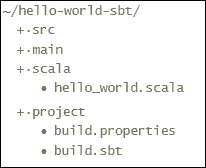

对于`build.properties`，你需要以下内容：

```java
    build.properties 

    sbt.version=0.13.11 

```

对于 `hello_world.scala`，我们将使用以下代码：

```java
    hello_world.scala 

    object SbtScalaMainApp extends App { 
      println("Hello world SBT / Scala App ") 
    } 

```

目前我们将使用一个 SBT DSL。然而，由于 SBT 是用 Scala 编写的，如果我们愿意，我们可以使用`build.scala`格式。在某些情况下，这很方便，因为我们可以使用任何类型的 Scala 代码来使构建更加动态，并重用代码和任务。

我们将设置一些预定义的变量，但是你也可以创建自己的变量，这些变量可以用来避免重复代码。最后，让我们看看`build.sbt`文件的内容如下：

```java
    build.scala 

    name := "hello-world-sbt" 

    version := "1.0" 

    scalaVersion := "2.11.8" 
    scalaVersion in ThisBuild := "2.11.8" 

```

在前面的代码中，我们有应用程序的名称、将在生成的 JAR 文件中使用的版本，以及应用程序和构建过程中使用的 Scala 版本。我们现在准备好构建这个项目，所以打开你的终端并输入 `$ sbt compile`。

这个指令将使 SBT 编译我们的 Scala 代码，你应该会看到以下屏幕上的内容：

```java
$ sbt compile 

```

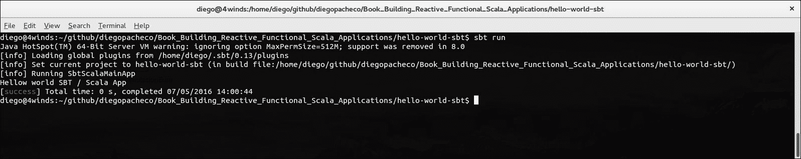

恭喜！SBT 刚刚编译了我们的 Scala 应用程序。现在我们可以使用 SBT 运行应用程序。为了做到这一点，我们只需要输入 `$ sbt run`，如下所示：

```java
$ sbt run 

```

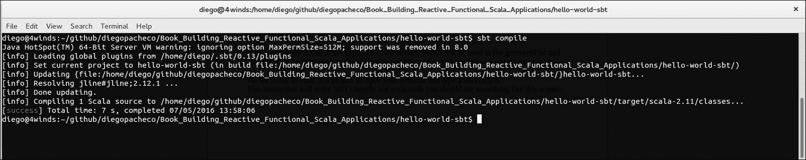

SBT 使得测试和玩 Scala 应用程序变得更容易，因为 SBT 有一个像我们在第一章中玩过的 Scala REPL，*FP、响应式和 Scala 简介*。SBT REPL 使得项目下可能有的所有 Scala 代码在 REPL 中可用。

执行命令 `$ sbt console`。

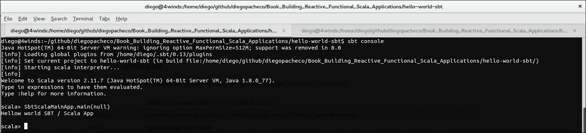

一旦你进入了 REPL，你可以输入任何 Scala 代码。正如你可能已经意识到的，我只是通过 `$ SbtScalaMainApp.main(null)` 直接调用了主 Scala 应用程序。

# 添加依赖项

任何构建工具都允许你解决依赖项。SBT 使用 Ivy / Maven2 模式来解决依赖项。所以，如果你熟悉 Maven2、Gradle 或 Ant/Ivy，你会意识到设置 SBT 依赖项与它们相同，尽管语法不同。依赖项在`build.sbt`文件中定义。没有单元测试就没有 Scala 开发。最受欢迎的测试库之一是 JUnit ([`junit.org/junit4/`](http://junit.org/junit4/))。JUnit 与 Java 和 Scala 项目一起工作。SBT 将下载并将 JUnit 添加到你的 Scala 应用程序`classpath`参数中。我们需要编辑`build.sbt`文件，如下添加 JUnit 作为依赖项：

```java
    build.sbt 
    name := "hello-world-sbt" 

    version := "1.0" 

    scalaVersion := "2.11.7" 
    scalaVersion in ThisBuild := "2.11.7" 

    libraryDependencies += "junit" % "junit" % "4.12" % Test 
    libraryDependencies += "com.novocode" % "junit-interface" % "0.11" 
    % "test" 

    testOptions += Tests.Argument(TestFrameworks.JUnit, "-q", "-v") 

```

如我之前提到的，SBT 使用与 Maven2 / Ivy 相同的模式：组 ID + artifactid + 版本。如果你不知道你想要添加的库的模式，你可以查看以下链接的 Maven 仓库网站（它们还生成 SBT 配置）：[`mvnrepository.com/artifact/junit/junit/4.12`](http://mvnrepository.com/artifact/junit/junit/4.12)。

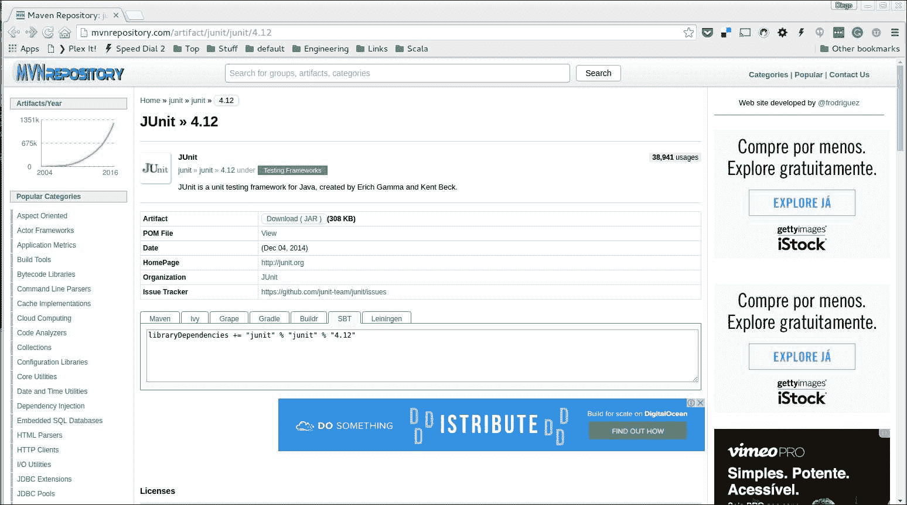

SBT 有依赖项的作用域。我们不希望将 JUnit 作为源代码依赖项的一部分进行分发。这就是为什么在依赖定义后面有 `% Test` 的原因。

保存包含新内容的文件后，您可以运行 `$ sbt compile`。SBT 会为您下载 JUnit 并将 jar 文件存储在位于 `/home/YOUR_USER/.ivy2/cache` 的本地 Ivy 缓存文件中。有了依赖项，我们可以添加更多代码，并使用 SBT 来运行我们的测试，如下所示：

```java
    src/main/scala/calc.scala 
    class Calculator{ 
      def sum(a:Int,b:Int):Int = { 
        return a + b 
      } 
      def multiply(a:Int,b:Int):Int = { 
        return a * b 
      } 
    } 

```

在前面的代码中，我们仅使用 Scala 创建了一个简单直接的计算器，它可以对两个整数进行加法运算，也可以对两个整数进行乘法运算。现在我们可以继续使用 JUnit 进行单元测试。测试需要位于 `src/test/scala/` 文件夹中。看看以下代码：

```java
    src/test/scala/calcTest.scala 

    import org.junit.Test 
    import org.junit.Assert._ 

    class CalcTest { 
      @Test 
      def testSumOK():Unit = { 
        val c:Calculator = new Calculator() 
        val result:Int = c.sum(1,5) 
        assertNotNull(c) 
        assertEquals(6,result) 
      } 

      @Test 
      def testSum0():Unit = { 
        val c:Calculator = new Calculator() 
        val result:Int = c.sum(0,0) 
        assertNotNull(c) 
        assertEquals(0,result) 
      } 

      @Test 
      def testMultiplyOk():Unit = { 
        val c:Calculator = new Calculator() 
        val result:Int = c.multiply(2,3) 
        assertNotNull(c) 
        assertEquals(6,result) 
      } 

      @Test 
      def testMultiply0():Unit = { 
        val c:Calculator = new Calculator() 
        val result:Int = c.multiply(5,0) 
        assertNotNull(c) 
        assertEquals(4,result) 
      } 

    } 

```

好的，现在我们可以使用命令 `$ sbt test` 来运行测试，如下所示：

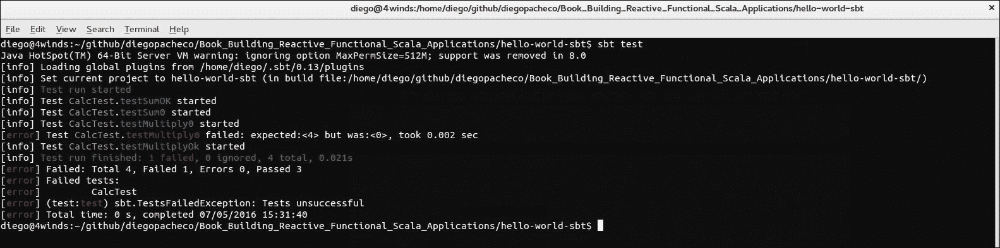

如您在前面的屏幕截图中所见，所有测试都在运行。当我们添加 Java 注解 `@Test` 时，就会创建一个测试，并且它需要是一个公共函数。有一个测试，名为 `testMultiply0`，它失败了，因为它期望结果是 `4`，但是 `5` 乘以 `0` 等于零，所以这个测试是错误的。让我们通过将断言更改为接受零来修复这个方法，如下面的代码所示，然后按照以下方式重新运行 `$sbt test`：

```java
    @Test 
    def testMultiply0():Unit = { 
      val c:Calculator = new Calculator() 
      val result:Int = c.multiply(5,0) 
      assertNotNull(c) 
      assertEquals(0,result) 
    } 

```

`$ sbt test` 会给出以下结果：

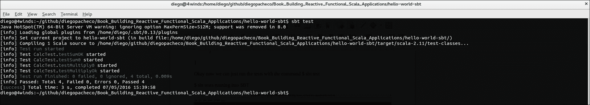

哈喽！所有测试都通过了。默认情况下，SBT 会并行运行所有测试，这对于加快构建时间非常有用 - 没有人喜欢在构建时等待，而 Scala 也不是构建速度最快的科技。但是，如果您想禁用并行测试，可以在 `build.sbt` 中添加以下行：

```java
    parallelExecution in Test := false 

```

# 从 SBT 生成 Eclipse 项目文件

SBT 通过插件可以生成 Eclipse 文件。您可以直接将这些插件添加到您的 `build.sbt` 文件中。然而，有一个更好的解决方案。您可以定义全局配置，这是理想的，因为您不需要在每一个简单的 `build.sbt` 文件中添加。如果您正在处理多个项目，或者您正在处理开源项目，这也非常有意义，因为这是一个个人偏好的问题，人们通常不会对 IDE 文件进行版本控制。

如果存在，请转到以下目录，否则请创建以下目录：`/home/YOUR_USER/.sbt/0.13/plugins`。

现在创建一个包含以下内容的文件 `build.sbt`：

`/home/YOUR_USER/.sbt/0.13/plugins/build.sbt` 全局配置文件

```java
    resolvers += Classpaths.typesafeResolver 
    addSbtPlugin("com.typesafe.sbteclipse" % "sbteclipse-plugin" % 
    "4.0.0") 

```

保存包含此内容的文件后，我们可以通过执行 `$ sbt reload` 来重新加载我们的 SBT 应用程序，或者通过按 ***Ctrl*** + ***D*** 退出 SBT 控制台，然后使用 `$ sbt.` 再次打开 sbt。

```java
$ sbt reload

```

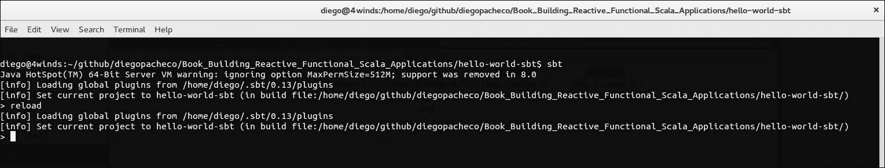

现在我们可以使用命令 `$ eclipse` 来生成 Eclipse 文件。

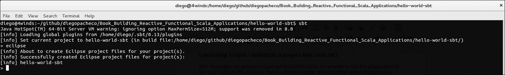

生成完成后，你可以将生成的.project 文件导入到 Eclipse 中。

默认情况下，Eclipse 在生成 Eclipse 项目时不会附加源文件夹。如果你需要源代码（例如 JUnit 这样的第三方依赖项的源代码），你需要在你的`build.sbt`项目中添加额外的行。添加源文件夹通常是一个好主意，否则，没有源代码你无法进行适当的调试。

build.sbt

```java
    EclipseKeys.withSource := true 

```

以下截图显示了导入到 Eclipse 中的 SBT Scala 应用程序：

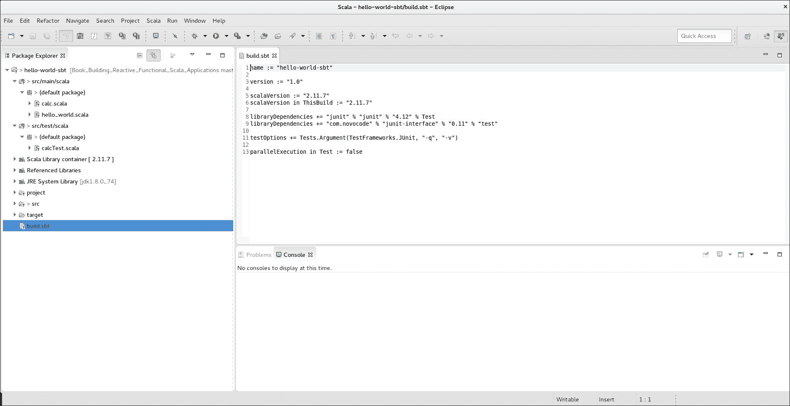

# 应用程序分发

对于本节，我们将尝试三种不同的打包解决方案，如下所示：

+   默认 SBT 打包器

+   SBT assembly 插件

+   SBT 原生打包器

SBT 默认可以生成 jar 文件。通过 SBT 插件，也可以生成 RPMs、DEBs，甚至 Docker 镜像。首先，让我们生成一个可执行的 jar 文件。这是通过 SBT 中的 package 任务完成的。打开你的 SBT 控制台，并运行`$ sbt package`。然而，我们想要生成一个`FAT` jar，这是一个包含应用程序所有其他依赖项（jar 文件）的 jar 文件。为了做到这一点，我们需要使用另一个名为 assembly 的插件。

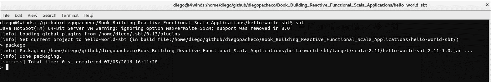

SBT 包可以生成一个 jar 文件，但它不包含依赖项。为了使用 assembly 插件，创建文件`project/assembly.sbt`，并添加以下内容：

```java
    $ project/assembly.sbt 
    addSbtPlugin("com.eed3si9n" % "sbt-assembly" % "0.11.2") 

```

在我们的`build.sbt`中，我们需要导入 assembly 插件，如下所示：

`$ build.sbt`（放入文件顶部）

```java
    import AssemblyKeys._ 
    assemblySettings 

```

现在，我们可以运行`$ sbt assembly`来生成我们的`FAT` jar。

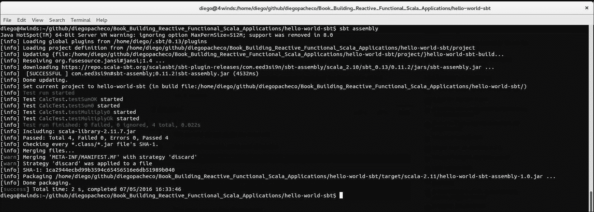

就这样。现在我们可以通过使用命令`java -jar`将其作为一个普通的 Java 应用程序运行，如下所示：

```java
    $ java -jar hello-world-sbt/target/scala-2.11/hello-world-sbt-
    assembly-1.0.jar 

```

# Hello world SBT / Scala App

另有一个用于打包 Scala 应用程序的有用插件，名为`sbt-native-packager`。`sbt-native-packager`可以为 Linux 操作系统生成包，如 DEB 和 RPM 文件。由于这是一个新插件，我们需要在`project/`中创建一个名为`plugins.sbt`的文件，如下所示：

```java
    resolvers += "Typesafe repository" at 
    "http://repo.typesafe.com/typesafe/releases/" 
    addSbtPlugin("com.typesafe.sbt" %% "sbt-native-packager" % "1.0.4") 

```

在你的`build.sbt`的末尾，你需要添加以下行：

```java
    enablePlugins(JavaAppPackaging) 

```

现在，我们可以使用`$ sbt universal:packageBin`或`$ sbt universal:packageZipTarball`来生成带有`sbt-native-packager`的包。

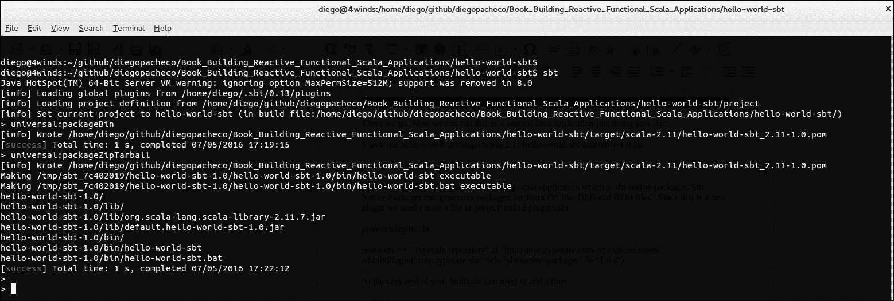

现在我们有了 ZIP 和 TGZ 文件，其中包含你的应用程序，位于`hello-world-sbt/target/universal/`文件夹中。在这个 ZIP/TGZ 文件中，我们有我们的应用程序，以 jar 格式存在，包含所有依赖项；目前我们只有 Scala，但如果更多的话，它们也会在那里。有 SH 和 BAT 脚本，可以在 Linux(SH)和 Windows(BAT)上轻松运行此应用程序。

`sbt-native-packager`还可以制作 Docker 镜像。这很棒，因为这使得将应用程序部署到生产环境更容易。我们的项目已经完全准备好制作 Docker 镜像。我们需要在 Linux 上安装 docker；你可以通过运行以下命令来完成：

```java
sudo apt-get update
sudo apt-get install docker-engine
sudo service docker start
sudo docker run hello-world

```

如果您已成功安装 Docker，您应该会看到以下类似的截图：

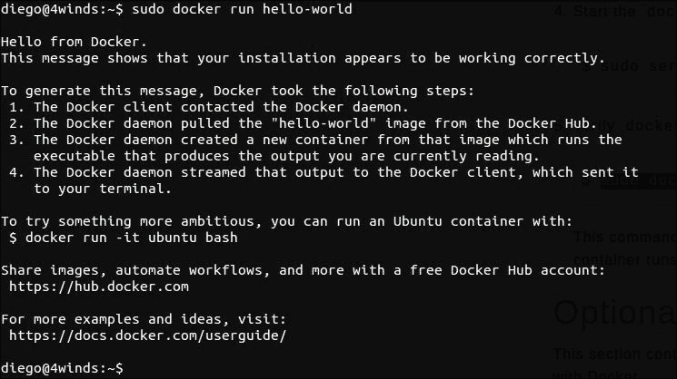

现在，您可以通过运行`$ sbt`，然后使用命令`$ docker:publishLocal`生成您的 docker 镜像。您将看到类似以下输出的内容：

```java
> docker:publishLocal
[info] Wrote /home/diego/github/diegopacheco/Book_Building_Reactive_Functional_Scala_Applications/hello-world-sbt/target/scala-2.11/hello-world-sbt_2.11-1.0.pom
[info] Sending build context to Docker daemon 5.769 MB
[info] Step 1 : FROM java:latest
[info] Pulling repository docker.io/library/java
[info] 31ae46664586: Pulling image (latest) from docker.io/library/java
[info] 31ae46664586: Pulling image (latest) from docker.io/library/java, endpoint: https://registry-1.docker.io/v1/
[info] 31ae46664586: Pulling dependent layers
[info] e9fa146e2b2b: Pulling metadata
[info] Status: Downloaded newer image for java:latest
[info] docker.io/library/java: this image was pulled from a legacy registry. Important: This registry version will not be supported in future versions of docker.
[info] ---> 31ae46664586
[info] Step 2 : WORKDIR /opt/docker
[info] ---> Running in 74c3e354e9fd
[info] ---> d67542bcaa1c
[info] Removing intermediate container 74c3e354e9fd
[info] Step 3 : ADD opt /opt
[info] ---> f6cec2a2779f
[info] Removing intermediate container 0180e167ae2d
[info] Step 4 : RUN chown -R daemon:daemon .
[info] ---> Running in 837ecff2ffcc
[info] ---> 8a261bd9d88a
[info] Removing intermediate container 837ecff2ffcc
[info] Step 5 : USER daemon
[info] ---> Running in 6101bd5b482b
[info] ---> e03f5fa23bdf
[info] Removing intermediate container 6101bd5b482b
[info] Step 6 : ENTRYPOINT bin/hello-world-sbt
[info] ---> Running in 43de9335129c
[info] ---> eb3961f1e26b
[info] Removing intermediate container 43de9335129c
[info] Step 7 : CMD
[info] ---> Running in 302e1fcd0a3d
[info] ---> 04e7872e85fa
[info] Removing intermediate container 302e1fcd0a3d
[info] Successfully built 04e7872e85fa
[info] Built image hello-world-sbt:1.0
[success] Total time: 447 s, completed 07/05/2016 17:41:47
>

```

您可以通过运行命令`$ docker ps:`来确认系统中有一个新的 docker 镜像

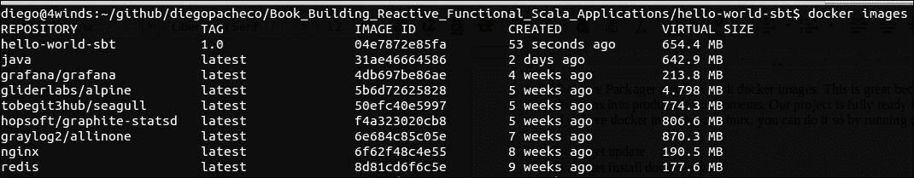

第一张图片是我们通过`sbt-native-packager`插件生成的 Scala 应用程序的 docker 镜像。恭喜！您的 Scala 应用程序正在运行的 docker 容器中。SBT Native Packager 功能强大，使用简单。您可以在官方文档网站上获取更多详细信息([`www.scala-sbt.org/sbt-native-packager/gettingstarted.html`](http://www.scala-sbt.org/sbt-native-packager/gettingstarted.html))。

这些是我们构建专业 Scala 应用程序需要了解的 SBT（Scala Build Tool）的基本知识。SBT 还有许多其他功能和可能性，您可以在[`www.scala-sbt.org/0.13/docs/index.html`](http://www.scala-sbt.org/0.13/docs/index.html)查看。接下来，我们将学习 Typesafe Activator，它是一个围绕 SBT 的包装器，使得与 Play 框架应用程序一起使用变得容易。

# 使用 Activator 引导我们的 Play 框架应用程序

Lightbend（前 Typesafe）还有一个名为 Activator 的工具([`www.lightbend.com/community/core-tools/activator-and-sbt`](https://www.lightbend.com/community/core-tools/activator-and-sbt))，它是在 SBT 之上的包装器。Activator 使得使用 Scala、Akka 和 Play 框架创建响应式应用程序变得更容易。现在不用担心 Play 框架，因为我们将在第三章，*使用 Play 框架开发 UI*中更详细地介绍它。Akka 将在第八章，*使用 Akka 开发聊天*中详细讲解。

让我们下载并安装 Activator，并引导我们的架构。记住，我们需要已经安装 Java 8 和 Scala 2.11。如果您没有 Java 8 或 Scala 2.11，请回到第一章，*函数式编程、响应式编程和 Scala 简介*并安装它们。

首先，您需要从这里下载 activator：[`www.lightbend.com/activator/download`](https://www.lightbend.com/activator/download)

我建议您下载最小包，并让 Activator 为您下载和安装其他依赖项。您可以从这里下载最小包：[`downloads.typesafe.com/typesafe-activator/1.3.10/typesafe-activator-1.3.10-minimal.zip`](https://downloads.typesafe.com/typesafe-activator/1.3.10/typesafe-activator-1.3.10-minimal.zip)。

对于这本书，我们将使用版本 1.3.10。我们需要将`activator/bin`文件夹放入 OS PATH 中。如果你想，你可以使用终端安装 Activator，如下所示：

如果你愿意，你可以使用终端安装 Activator，如下所示：

```java
$ cd /usr/local/
$ wget https://downloads.typesafe.com/typesafe-
activator/1.3.10/typesafe-activator-1.3.10-minimal.zip
$ tar -xzf typesafe-activator-1.3.10-minimal.zip
$ rm -rf typesafe-activator-1.3.10-minimal.zip
$ sudo echo 'export PATH=$PATH:/usr/local/typesafe-activator-
1.3.10-minimal/bin' >> ~/.bashrc
$ source >> ~/.bashrc

```

为了测试你的安装，执行以下命令：

```java
$ activator new ReactiveWebStore

```

上述命令将为你使用 Scala、Akka、Play 框架和 SBT 为你启动一个架构。

Activator 会问你一系列问题，比如你可能想使用哪些模板。有几个模板用于 Java 应用程序、Scala 应用程序、Akka 应用程序和 Play 应用程序。现在，我们将选择选项`6) play-scala`。

第一次运行 Activator 时，可能需要一些时间，因为它将从网络下载所有依赖项。当 Activator 完成后，你应该在你的文件系统中看到一个名为`ReactiveWebStore`的文件夹。

命令`$ activator new ReactiveWebStore`显示以下结果：

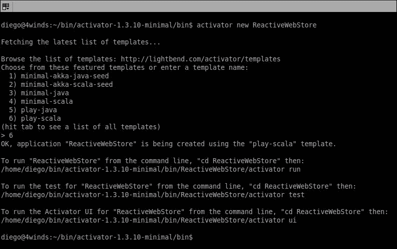

如果你输入`$ ll`到控制台，你应该进入`ReactiveWebStore`文件夹，你也应该看到以下结构：

```java
diego@4winds:~/bin/activator-1.3.10-minimal/bin/ReactiveWebStore$ 
ll
total 52
drwxrwxr-x 9 diego diego 4096 Mai 14 19:03 ./
drwxr-xr-x 3 diego diego 4096 Mai 14 19:03 ../
drwxrwxr-x 6 diego diego 4096 Mai 14 19:03 app/
drwxrwxr-x 2 diego diego 4096 Mai 14 19:03 bin/
-rw-rw-r-- 1 diego diego 346 Mai 14 19:03 build.sbt
drwxrwxr-x 2 diego diego 4096 Mai 14 19:03 conf/
-rw-rw-r-- 1 diego diego 80 Mai 14 19:03 .gitignore
drwxrwxr-x 2 diego diego 4096 Mai 14 19:03 libexec/
-rw-rw-r-- 1 diego diego 591 Mai 14 19:03 LICENSE
drwxrwxr-x 2 diego diego 4096 Mai 14 19:03 project/
drwxrwxr-x 5 diego diego 4096 Mai 14 19:03 public/
-rw-rw-r-- 1 diego diego 1063 Mai 14 19:03 README
drwxrwxr-x 2 diego diego 4096 Mai 14 19:03 test/

```

内容如下解释：

+   **app**：这是 Play 框架应用程序文件夹，我们将在这里进行 Scala Web 开发。

+   **build.sbt**：这是构建文件；如你所见，Activator 为我们生成了 SBT 构建配置。

+   **conf**：这里存放应用程序配置文件，如日志和 Scala/Play 应用程序配置。

+   **project**：这是 SBT 项目文件夹，我们在其中定义 SBT 插件和 SBT 版本。

+   **test**：这里存放我们应用程序的测试源代码。

+   **public**：这里存放静态 HTML 资产，如图片、CSS 和 JavaScript 代码。

+   **bin**：这里存放 Linux/Mac 和 Windows 的 activator 脚本副本。

+   **libexec**：这里存放 Activator jar。这非常有用，因为 Activator 已经将我们的应用程序打包在一起。所以，比如说你将这个应用程序推送到 GitHub - 当有人需要访问这个应用程序并从 GitHub 下载它时，SBT 文件将存在，所以他们不需要从互联网上下载它。这在你在生产环境中配置和部署应用程序时特别有用，本书将在第十章[第十章。扩展]中详细讨论，*扩展*。

# Activator shell

Activator 允许你运行 REPL，就像我们在 Scala 和 SBT 中做的那样。为了获得 REPL 访问权限，你需要在控制台输入以下内容：

$ activator shell


Activator 提供了大量你可以使用的任务。为了了解所有可用的命令，你可以在控制台输入`$ activator help`。

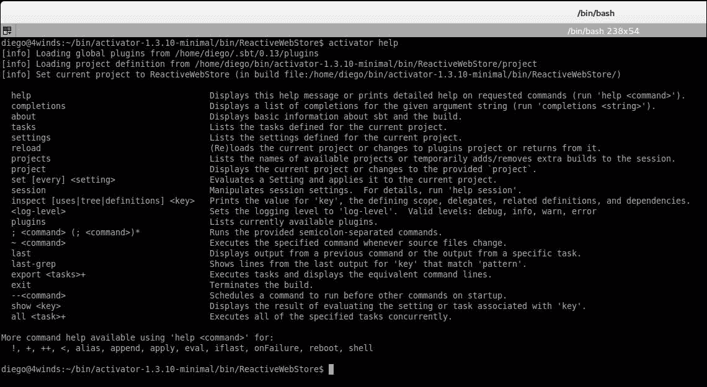

# Activator - 编译、测试和运行

现在我们开始工作吧。我们将使用 Activator 和 SBT 编译、运行测试和运行我们的 Web 应用程序。首先，让我们编译。在控制台输入如下命令：`$ activator compile`。

```java
$ activator compile
diego@4winds:~/bin/activator-1.3.10-minimal/bin/ReactiveWebStore$ 
activator compile
[info] Loading global plugins from /home/diego/.sbt/0.13/plugins
[info] Loading project definition from /home/diego/bin/activator-
1.3.10-minimal/bin/ReactiveWebStore/project
[info] Set current project to ReactiveWebStore (in build 
file:/home/diego/bin/activator-1.3.10-
minimal/bin/ReactiveWebStore/)
[info] Updating {file:/home/diego/bin/activator-1.3.10-
minimal/bin/ReactiveWebStore/}root...
[info] Compiling 14 Scala sources and 1 Java source to 
/home/diego/bin/activator-1.3.10-
minimal/bin/ReactiveWebStore/target/scala-2.11/classes...
[success] Total time: 154 s, completed 14/05/2016 19:28:03
diego@4winds:~/bin/activator-1.3.10-minimal/bin/ReactiveWebStore$

```

现在让我们使用命令 `$ activator test` 来运行我们的测试。

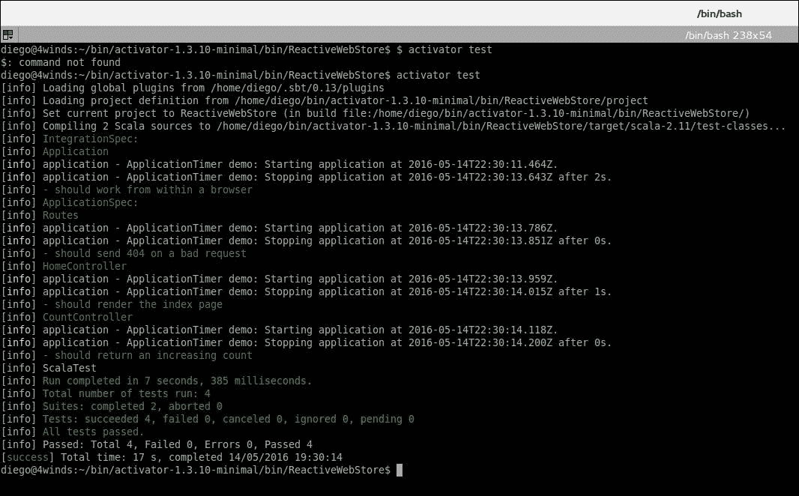

最后，是时候运行你的应用程序了。在控制台输入 `$ activator run`。

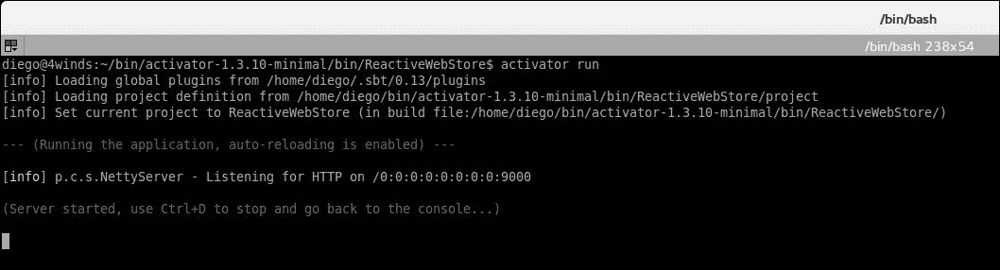

打开你的网页浏览器，并访问 URL：`http://localhost:9000`。

你应该看到以下屏幕：

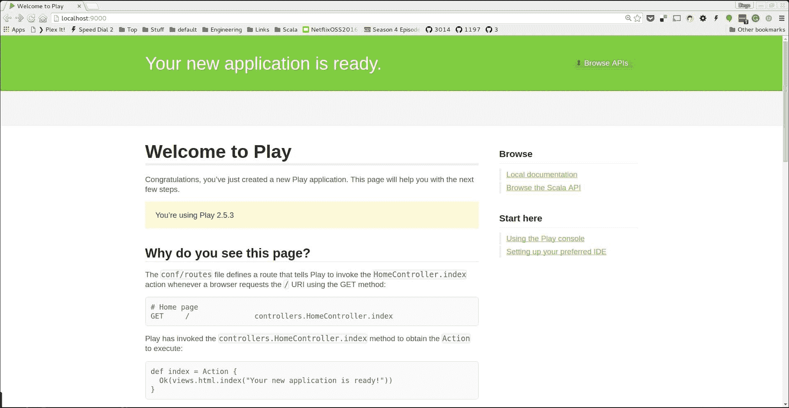

# 摘要

恭喜！你刚刚启动了第一个 Scala / Play 框架。Activator 让我们的生活变得更简单。正如你所见，我们只用了三个命令就能搭建起一个网站并使其运行。你也可以只用 SBT 来做同样的事情，但会花费更多的时间，因为我们需要获取所有依赖项，配置所有源代码结构，并添加一些示例 HTML 和 Scala 代码。多亏了 Activator，我们不需要做任何这些。然而，我们仍然可以按照我们的意愿更改所有的 SBT 文件和配置。Activator 并不紧密绑定到 Scala 或我们的应用程序代码，因为它更像是一个基于模板的代码生成器。

在下一章中，我们将通过添加验证、数据库持久化、使用 RxScala 和 Scala 调用反应式微服务以及更多功能来改进应用程序。
