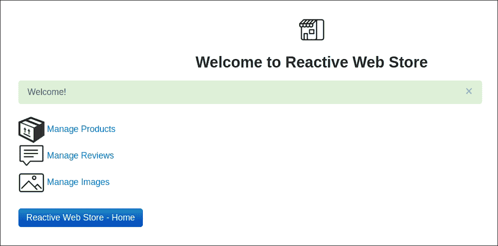
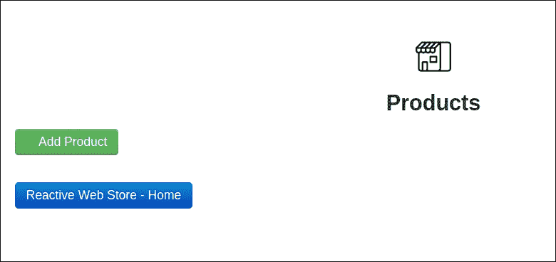
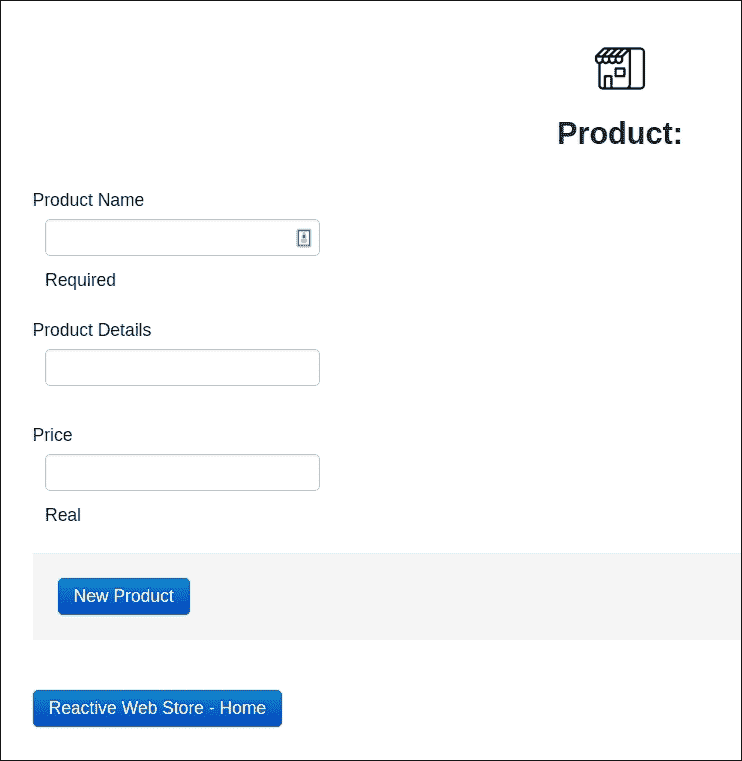
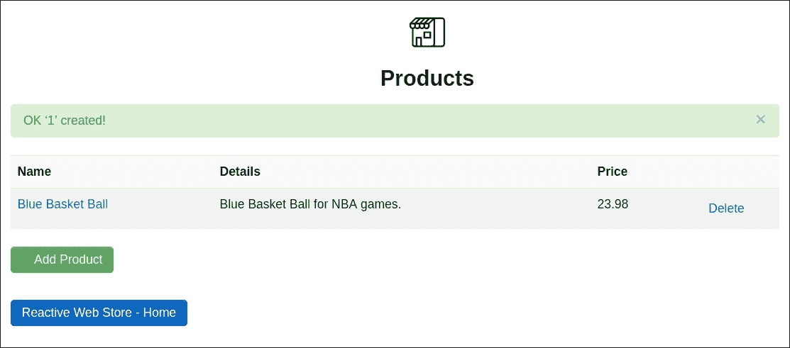
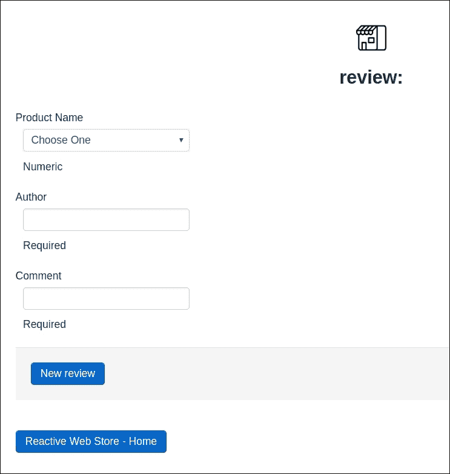
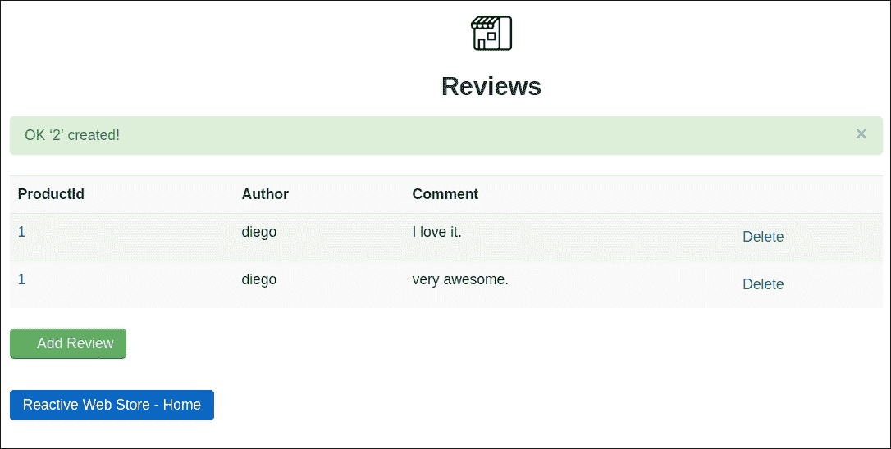
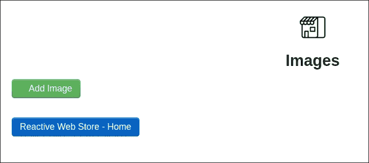
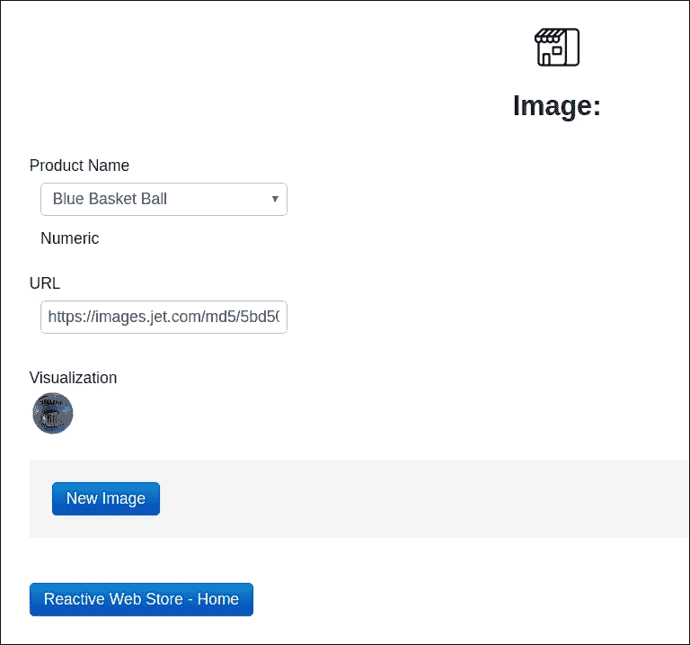
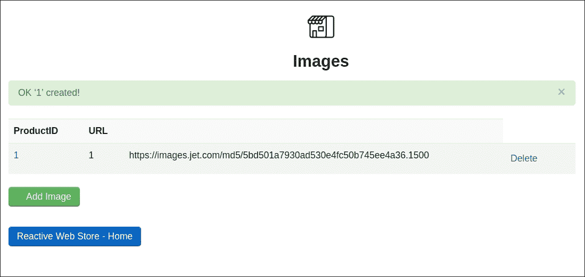

# 第三章：使用 Play 框架开发 UI

在上一章中，我们使用 Activator 对我们的应用程序进行了引导。在本章中，我们将继续使用 Scala 和 Play 框架开发我们的 Web 应用程序。Play 框架非常适合 Web 开发，因为它易于使用，同时非常强大。这是因为它在底层使用了一些顶级的反应式解决方案，如 spray、Akka 和 Akka Stream。对于本章，我们将通过添加验证和内存存储来创建我们反应式 Web 解决方案的一些基本 UI，这样你就可以感受到应用程序在工作。我们将使用一点 CSS 进行样式设计，以及 JavaScript 进行一些简单的可视化。

在本章中，我们将涵盖以下主题：

+   使用 Scala 和 Play 框架进行 Web 开发的基础

+   创建你的模型

+   与视图和验证一起工作

+   与会话作用域一起工作

# 入门

让我们看看`Reactive Web Store`的预览——我们将要构建的应用程序。



目前，我们将构建三个简单的操作——**创建、检索、更新**和**删除**（**CRUD**），以管理产品、产品评论和产品图像。我们将为每个 CRUD 创建模型、控制器、视图和路由。

让我们开始吧。首先，我们需要定义我们的模型。模型需要位于`ReactiveWebStore/app/models`。模型是系统的核心，它们代表实体。我们将在第六章中稍后使用这个实体来存储和检索数据，*使用 Slick 进行持久化*。我们的模型不应该有任何 UI 逻辑，因为我们应该使用控制器来处理 UI 逻辑。

# 创建我们的模型

对于我们的产品模型，我们在`Product.scala`中有一个简单的 Scala case class，如下所示：

```java
    package models 
    case class Product 
    ( var id:Option[Long], 
      var name:String, 
      var details:String, 
      var price:BigDecimal ) 
    { 
      override def toString:String =  
      { 
        "Product { id: " + id.getOrElse(0) + ",name: " + name + ", 
        details: "+ details + ", price: " + price + "}" 
      } 
    } 

```

一个产品可以有一个可选的 ID，一个名称，详细信息和一个价格。我们只是为了简化日志记录而重写`toString`方法。我们还需要定义图像和评论的模型。

以下是从`Review.scala`中获取的评论模型：

```java
    package models 

    case class Review 
    (var id:Option[Long], 
      var productId:Option[Long], 
      var author:String, 
      var comment:String) 
    { 
      override def toString:String = { 
        "Review { id: " + id + " ,productId: " +  
        productId.getOrElse(0) + ",author: " + author + ",comment:  
        " + comment + " }" 
      } 
    } 

```

对于一个评论模型，我们有一个可选的 ID，一个可选的`productId`，一个作者和一个评论。验证将在视图上进行。现在让我们转向图像模型。

图像模型可以在`Image.scala`中找到，如下所示：

```java
    package models 

    case class Image 
    (var id:Option[Long], 
      var productId:Option[Long],  
      var url:String){ 
        override def toString:String = { 
          "Image { productId: " + productId.getOrElse(0) + ",url: "  
          + url + "}" 
        } 
  } 

```

对于图像模型，我们有一个可选的 ID，一个可选的`productId`和图像 URL。

Play 框架负责路由，我们需要在`ReactiveWebStore/conf/routes`中定义路由。请记住，Play 框架将验证所有路由，因此您需要指定有效的包和类。Play 还创建了一个称为反向控制器的东西，我们将在本章后面使用。现在，让我们定义路由。反向控制器由 Play 框架生成，具有与原始控制器相同签名的方法，但它返回`play.api.mvc.Call`而不是`play.api.mvc.Action`。

# 创建路由

Play 框架为产品、图片和评论的 CRUD 操作的路由如下：

```java
    # Routes 
    # This file defines all application routes (Higher priority routes first) 
    # ~~~~ 

    GET / controllers.HomeController.index 
    GET /assets/*file controllers.Assets.at(path="/public", file) 

    # 
    # Complete CRUD for Product 
    # 
    GET /product controllers.ProductController.index 
    GET /product/add controllers.ProductController.blank 
    POST /product/ controllers.ProductController.insert 
    POST /product/:id controllers.ProductController.update(id:Long) 
    POST /product:id/remove controllers.ProductController.remove(id:Long) 
    GET /product/details/:id controllers.ProductController.details(id:Long) 

    # 
    # Complete GRUD for Review 
    # 
    GET /review controllers.ReviewController.index 
    GET /review/add controllers.ReviewController.blank 
    POST /review/ controllers.ReviewController.insert 
    POST /review/:id controllers.ReviewController.update(id:Long) 
    POST /review:id/remove controllers.ReviewController.remove(id:Long) 
    GET /review/details/:id controllers.ReviewController.details(id:Long) 

    # 
    # Complete CRUD for Image 
    # 
    GET /image controllers.ImageController.index 
    GET /image/add controllers.ImageController.blank 
    POST /image/ controllers.ImageController.insert 
    POST /image/:id controllers.ImageController.update(id:Long) 
    POST /image:id/remove controllers.ImageController.remove(id:Long) 
    GET /image/details/:id controllers.ImageController.details(id:Long) 

```

路由的工作原理是这样的--首先，你需要定义一个 REST 动词，例如`GET`、`POST`、`PUT`、`DELETE`，然后你输入一个`PATH`，例如`/image`。最后，你指定哪个控制器函数将处理该路由。现在我们已经设置了路由，我们可以转向控制器。我们将为产品、图片和评论定义控制器。

所有路由遵循相同的逻辑。首先，我们将用户发送到我们列出所有项目的网页（产品、图片、评论）--这由`GET /resource`表示，其中资源可以是图片、产品或评论，例如。为了获取一个特定的资源，通常是通过 ID，我们给出命令`GET /resource (product, review or image)/ID`。`POST /resource`用于执行`UPDATE`。

为了创建一个新项目（产品、评论或图片），模式是`GET /resource/add`和`POST /resource/`。你可能想知道为什么有两个路由来执行插入操作。好吧，那是因为首先我们需要加载网页，其次，当表单提交时，我们需要一个新的路由来处理值。更新操作也有两个路由，原因相同。如果你想`DELETE`一个资源，模式是`POST /resource/ID/remove`。最后，我们有操作细节，它用于显示与特定项目相关的详细信息--模式是`GET /resource/details/ID`。有了六个路由，我们可以为产品、图片、评论或其他任何未来可能添加到该应用程序或您自己的应用程序的资源执行完整的 CRUD 操作。

# 创建我们的控制器

现在，让我们转向之前路由中使用的控制器。控制器需要位于`ReactiveWebStore/app/controllers`。控制器在视图（UI）、模型和服务之间绑定，它们负责业务操作。始终重要的是将 UI 逻辑（通常是特定的）与业务逻辑（通常是更通用的，并且通常更重要）分开。

让我们看一下以下代码中的`ProductController.scala`中的产品控制器：

```java
    @Singleton 
    class ProductController @Inject() (val messagesApi:MessagesApi,val 
    service:IProductService) extends Controller with I18nSupport { 

      val productForm: Form[Product] = Form( 
        mapping( 
          "id" -> optional(longNumber), 
          "name" -> nonEmptyText, 
          "details" -> text, 
          "price" -> bigDecimal 
        )(models.Product.apply)(models.Product.unapply)) 

      def index = Action { implicit request => 
        val products = service.findAll().getOrElse(Seq()) 
        Logger.info("index called. Products: " + products) 
        Ok(views.html.product_index(products)) 
      } 

      def blank = Action { implicit request => 
        Logger.info("blank called. ") 
        Ok(views.html.product_details(None, productForm)) 
      } 

      def details(id: Long) = Action { implicit request => 
        Logger.info("details called. id: " + id) 
        val product = service.findById(id).get 
        Ok(views.html.product_details(Some(id),  
        productForm.fill(product))) 
      } 

      def insert()= Action { implicit request => 
        Logger.info("insert called.") 
        productForm.bindFromRequest.fold( 
          form => { 
            BadRequest(views.html.product_details(None, form)) 
          }, 
        product => { 
          val id = service.insert(product) 
          Redirect(routes.ProductController.index).flashing("success"  
          -> Messages("success.insert", id)) 
        }) 
      } 

      def update(id: Long) = Action { implicit request => 
        Logger.info("updated called. id: " + id) 
        productForm.bindFromRequest.fold( 
          form => { 
            Ok(views.html.product_details(Some(id),  
            form)).flashing("error" -> "Fix the errors!") 
          }, 
          product => { 
            service.update(id,product) 
            Redirect(routes.ProductController.index). 
            flashing("success" -> Messages("success.update",  
            product.name)) 
          }) 
      } 

      def remove(id: Long)= Action { 
        service.findById(id).map { product => 
        service.remove(id) 
        Redirect(routes.ProductController.index).flashing("success" ->  
        Messages("success.delete", product.name)) 
      }.getOrElse(NotFound) 

      } 
    } 

```

`The Play framework uses dependency injection and inversion of control using Google Guice. So, you can see at the top of the controller that we have the annotations `@Singleton` and `@Inject`. Singleton means that Guice will create a single instance of the class to handle all requests. Inject means we are injecting other dependencies into our controller, for instance, we inject `MessagesApi` in order to have the Play framework internalization support for string messages, and `IProductService`, that is, the product service that we will cover later in this chapter.`

`We also need to extend the Play class, `play.api.mvc.Controller`. Each function in a controller needs to return an action. This action could be a view. The Play framework compiles all the views into Scala classes, so you can safely reference them into your controllers code.`

`All business operations are delegated to a trait called `IProductService`, which we will cover later in this chapter. We also log some information using the Logger class. Play Framework uses `Logback` as the default logging solution. Let's take a closer look at each controller function now.`

`The index function calls `IProductService`, and finds all the available products. If there are no products available, it returns an empty sequence, and then calls the product UI passing the collection of products.``

`The blank function renders a blank product form, so the user can have a blank product form on the UI in order to add data (insert operation). Play framework works with form binding. So, in each controller, you need to define how your form looks on the UI. That form mapping is done using `play.api.data.Form`. You can see the mapping on the immutable variable called `productForm`. The mapping is between the view(UI) and the model called product. Keep in mind that the name field is mapped as `NonEmptyText`, which means Play won't accept null or blank values. This is a great future, because we can do validations in a declarative way without having to write code. Price is defined as `BigDecimal`, so Play won't accept text, but only numbers.` 

`The details function retrieves a product using `IProductService`, and redirects to the view. However, before doing the redirect, it binds the data with the form so the UI will load with all the data into the HTML inputs.`

我们还有插入和更新方法。它们都是使用`fold`方法构建的。`fold`方法有左右两个方向，这意味着错误或成功。`fold`函数是从映射表单中调用的，如果没有验证错误，它将向右移动，但如果存在验证错误，它将向左移动。这是一个非常简单和干净的方式来编写`update`和`insert`流程。使用`fold`，我们不需要编写`if`语句。一旦验证通过，我们调用`IProductService`来进行插入或更新，然后我们执行视图的重定向。消息通过作用域传递。Play 有作用域选项——会话或 Flash。会话用于多个请求，值将存储在客户端。Flash 是一个请求作用域，大多数情况下这就是你需要使用的。这里我们使用的是`Flash`作用域，所以它只会在那个特定的请求期间退出。这个功能用于传递**国际化消息**（**i18n**），这是动作的结果。所有 i18n 消息都需要在`ReactiveWebStore/conf/messages`中定义，如下所示：

```java
    success.delete = OK '{0}' deleted! 
    success.insert = OK '{0}' created! 
    success.update = OK '{0}' updated! 
    error.notFound = Nothing Found with ID {0,number,0} 
    error.number = Not a valid number 
    error.required = Missing value here 

```

最后，我们有删除方法。首先，我们需要确保产品存在，所以我们使用`IProductService`进行`findById`，然后我们应用一个映射函数。如果产品不存在，Play 框架有预构建的 HTTP 错误代码消息，如`NotFound`。如果产品存在，我们使用`IProductService`删除它，然后我们通过带有闪烁信息的 UI 进行重定向。现在让我们看看图像和审查控制器。

审查控制器，`ReviewController.scala`，如下所示：

```java
    @Singleton 
    class ReviewController @Inject() 
    (val messagesApi:MessagesApi, 
      val productService:IProductService, 
      val service:IReviewService) 
    extends Controller with I18nSupport { 
      val reviewForm:Form[Review] = Form( 
        mapping( 
          "id" -> optional(longNumber), 
          "productId" -> optional(longNumber), 
          "author" -> nonEmptyText, 
          "comment" -> nonEmptyText 
        )(models.Review.apply)(models.Review.unapply)) 

      def index = Action { implicit request => 
        val reviews = service.findAll().getOrElse(Seq()) 
        Logger.info("index called. Reviews: " + reviews) 
        Ok(views.html.review_index(reviews)) 
      } 

      def blank = Action { implicit request => 
        Logger.info("blank called. ") 
        Ok(views.html.review_details(None,  
          reviewForm,productService.findAllProducts)) 
      } 

      def details(id: Long) = Action { implicit request => 
        Logger.info("details called. id: " + id) 
        val review = service.findById(id).get 
        Ok(views.html.review_details(Some(id),  
        reviewForm.fill(review),productService.findAllProducts)) 
      } 

      def insert()= Action { implicit request => 
        Logger.info("insert called.") 
        reviewForm.bindFromRequest.fold( 
        form => { 
          BadRequest(views.html.review_details(None,  
          form,productService.findAllProducts)) 
      }, 
      review => { 
        if (review.productId==null ||   
        review.productId.getOrElse(0)==0) { 
          Redirect(routes.ReviewController.blank).flashing("error" ->  
          "Product ID Cannot be Null!") 
        }else { 
          Logger.info("Review: " + review) 
          if (review.productId==null ||  
          review.productId.getOrElse(0)==0) throw new  
          IllegalArgumentException("Product  Id Cannot Be Null") 
          val id = service.insert(review) 
          Redirect(routes.ReviewController.index).flashing("success" - 
          > Messages("success.insert", id)) 
        } 
      }) 
    } 

    def update(id: Long) = Action { implicit request => 
      Logger.info("updated called. id: " + id) 
      reviewForm.bindFromRequest.fold( 
        form => { 
          Ok(views.html.review_details(Some(id),  
            form,productService.findAllProducts)).flashing("error" ->  
          "Fix the errors!") 
        }, 
        review => { 
          service.update(id,review) 
          Redirect(routes.ReviewController.index).flashing("success" - 
          >Messages("success.update", review.productId)) 
        }) 
      } 

      def remove(id: Long)= Action { 
        service.findById(id).map { review => 
          service.remove(id) 
          Redirect(routes.ReviewController.index).flashing("success" - 
          >Messages("success.delete", review.productId)) 
        }.getOrElse(NotFound) 
      } 

    } 

```

审查控制器遵循与产品控制器相同的思想和结构。唯一的区别是，这里我们需要注入`IProductService`，因为一个审查需要属于一个产品。然后我们需要使用`IProductService`来执行`findAllProduct`，因为在审查视图中，我们将有一个包含所有可用产品的`SelectBox`。

图像控制器，`ImageController.scala`，如下所示：

```java
    @Singleton 
    class ImageController @Inject() 
    (val messagesApi:MessagesApi, 
      val productService:IProductService, 
      val service:IImageService) 
    extends Controller with I18nSupport { 

      val imageForm:Form[Image] = Form( 
        mapping( 
          "id" -> optional(longNumber), 
          "productId" -> optional(longNumber), 
          "url" -> text 
        )(models.Image.apply)(models.Image.unapply)) 

        def index = Action { implicit request => 
          val images = service.findAll().getOrElse(Seq()) 
          Logger.info("index called. Images: " + images) 
          Ok(views.html.image_index(images)) 
        } 

        def blank = Action { implicit request => 
          Logger.info("blank called. ") 
          Ok(views.html.image_details(None,  
          imageForm,productService.findAllProducts)) 
        } 

        def details(id: Long) = Action { implicit request => 
          Logger.info("details called. id: " + id) 
          val image = service.findById(id).get 
          Ok(views.html.image_details(Some(id),  
          imageForm.fill(image),productService.findAllProducts)) 
        } 

        def insert()= Action { implicit request => 
          Logger.info("insert called.") 
          imageForm.bindFromRequest.fold( 
            form => { 
              BadRequest(views.html.image_details(None, form,  
              productService.findAllProducts)) 
            }, 
            image => { 
              If (image.productId==null ||  
              image.productId.getOrElse(0)==0) { 
                Redirect(routes.ImageController.blank). 
                flashing("error" -> "Product ID Cannot be Null!") 
              }else { 
                if (image.url==null || "".equals(image.url)) image.url  
                = "/assets/images/default_product.png" 
                val id = service.insert(image) 
                Redirect(routes.ImageController.index). 
                flashing("success" -> Messages("success.insert", id)) 
              } 
            }) 
        } 

        def update(id: Long) = Action { implicit request => 
          Logger.info("updated called. id: " + id) 
          imageForm.bindFromRequest.fold( 
            form => { 
              Ok(views.html.image_details(Some(id), form,  
              null)).flashing("error" -> "Fix the errors!") 
            }, 
            image => { 
              service.update(id,image) 
              Redirect(routes.ImageController.index). 
              flashing("success" -> Messages("success.update",  
              image.id)) 
            }) 
        } 

    def remove(id: Long)= Action { 
      service.findById(id).map { image => 
        service.remove(id) 
        Redirect(routes.ImageController.index).flashing("success"  
        -> Messages("success.delete", image.id)) 
      }.getOrElse(NotFound) 
    } 
} 

```

图像审查与`ReviewController`类似工作。我们需要`IProductService`来获取所有服务。

# 与服务一起工作

服务是我们放置业务逻辑的地方。我们将在第六章中查看反应式持久化，*使用 Slick 的持久化*。目前，我们没有数据库来持久化信息，所以，现在我们将进行内存持久化。

首先，我们将定义我们服务的契约。这是我们将在控制器中使用的基本 API。让我们看看`BaseService.scala`中的以下特质：

```java
    package services 

    import java.util.concurrent.atomic.AtomicLong 
    import scala.collection.mutable.HashMap 

    trait BaseService[A] { 

      var inMemoryDB = new HashMap[Long,A] 
      var idCounter = new AtomicLong(0) 

      def insert(a:A):Long 
      def update(id:Long,a:A):Boolean  
      def remove(id:Long):Boolean  
      def findById(id:Long):Option[A]  
      def findAll():Option[List[A]] 
    } 

```

在前面的代码中，我们有一个内存中的可变 `HashMap`，这是我们内存数据库的一部分，我们将在这里存储产品、图片和评论。我们还有一个原子计数器，我们可以用它为我们的模型生成 ID。这是一个使用泛型的特质--正如你所见，这里我们有所有与 `A` 相关的操作，这些将在稍后指定。现在我们可以移动产品、评论和图片的服务实现。

`ProductService.scala` 包如下所示：

```java
    package services 

    import models.Product 
    import javax.inject._ 

    trait IProductService extends BaseService[Product]{ 
      def insert(product:Product):Long 
      def update(id:Long,product:Product):Boolean 
      def remove(id:Long):Boolean 
      def findById(id:Long):Option[Product] 
      def findAll():Option[List[Product]] 
      def findAllProducts():Seq[(String,String)] 
    } 

    @Singleton 
    class ProductService extends IProductService{ 

      def insert(product:Product):Long = { 
        val id = idCounter.incrementAndGet() 
        product.id = Some(id) 
        inMemoryDB.put(id, product) 
        id 
      } 

      def update(id:Long,product:Product):Boolean = { 
        validateId(id) 
        product.id = Some(id) 
        inMemoryDB.put(id, product) 
        true 
      } 

      def remove(id:Long):Boolean = { 
        validateId(id) 
        inMemoryDB.remove(id) 
        true 
      } 

      def findById(id:Long):Option[Product] = { 
        inMemoryDB.get(id) 
      } 

      def findAll():Option[List[Product]] = { 
        if (inMemoryDB.values == Nil ||  
        inMemoryDB.values.toList.size==0) return None 
        Some(inMemoryDB.values.toList) 
      } 

      private def validateId(id:Long):Unit = { 
        val entry = inMemoryDB.get(id) 
        if (entry==null) throw new RuntimeException("Could not find  
        Product: " + id) 
      } 

      def findAllProducts():Seq[(String,String)] = { 
        val products:Seq[(String,String)] = this 
        .findAll() 
        .getOrElse(List(Product(Some(0),"","",0))) 
        .toSeq 
        .map { product => (product.id.get.toString,product.name) } 
        return products 
      } 
    } 

```

在最后的代码中，我们定义了一个名为 `IProductService` 的特质，它通过泛型应用到产品上扩展了 `BaseService`。`ProductService` 包实现了 `IProductService`。在 Scala 中，我们可以在同一个 Scala 文件中有多个类，因此不需要创建不同的文件。

代码非常直接。这里有一个名为 `findAllProducts` 的实用方法，它被评论和图像控制器使用。我们在这里获取内存哈希表上的所有元素。如果没有元素，我们返回一个空产品的列表。然后我们将列表映射到一个元组 `Seq` 上，这是我们在视图（UI）中将要拥有的 `SelectBox` 复选框所必需的。现在让我们继续图像和评论服务，如下所示：

```java
    package services 

    import javax.inject._ 
    import models.Image 
    import scala.collection.mutable.HashMap 
    import java.util.concurrent.atomic.AtomicLong 

    trait IImageService extends BaseService[Image]{ 
      def insert(image:Image):Long 
      def update(id:Long,image:Image):Boolean 
      def remove(id:Long):Boolean 
      def findById(id:Long):Option[Image] 
      def findAll():Option[List[Image]] 
} 

    @Singleton 
    class ImageService extends IImageService{ 

      def insert(image:Image):Long = { 
        val id = idCounter.incrementAndGet(); 
        image.id = Some(id) 
        inMemoryDB.put(id, image) 
        id 
      } 

      def update(id:Long,image:Image):Boolean = { 
        validateId(id) 
        image.id = Some(id) 
        inMemoryDB.put(id, image) 
        true 
      } 

      def remove(id:Long):Boolean = { 
        validateId(id) 
        inMemoryDB.remove(id) 
        true 
      } 

      def findById(id:Long):Option[Image] = { 
        inMemoryDB.get(id) 
      } 

      def findAll():Option[List[Image]] = { 
        if (inMemoryDB.values.toList == null ||  
        inMemoryDB.values.toList.size==0) return None 
        Some(inMemoryDB.values.toList) 
      } 

      private def validateId(id:Long):Unit = { 
        val entry = inMemoryDB.get(id) 
        If (entry==null) throw new RuntimeException("Could not find  
        Image: " + id) 
      } 

    } 

```

在前面的代码中，我们有与 `ProductService` 类似的东西。我们有一个名为 `IImageService` 的特质和 `ImageService` 实现。现在让我们在 `ReviewService.scala` 中实现评论服务，如下所示：

```java
    package services 

    import javax.inject._ 
    import models.Review 
    import scala.collection.mutable.HashMap 
    import java.util.concurrent.atomic.AtomicLong 

    trait IReviewService extends BaseService[Review]{ 
      def insert(review:Review):Long 
      def update(id:Long,review:Review):Boolean 
      def remove(id:Long):Boolean 
      def findById(id:Long):Option[Review] 
      def findAll():Option[List[Review]] 
    } 

    @Singleton 
    class ReviewService extends IReviewService{ 

      def insert(review:Review):Long = { 
        val id = idCounter.incrementAndGet(); 
        review.id = Some(id) 
        inMemoryDB.put(id, review) 
        id 
      } 

      def update(id:Long,review:Review):Boolean = { 
        validateId(id) 
        review.id = Some(id) 
        inMemoryDB.put(id, review) 
        true 
      } 

      def remove(id:Long):Boolean = { 
        validateId(id) 
        inMemoryDB.remove(id) 
        true 
      } 

      def findById(id:Long):Option[Review] = { 
        inMemoryDB.get(id) 
      } 

      def findAll():Option[List[Review]] = { 
        if (inMemoryDB.values.toList == null ||  
        inMemoryDB.values.toList.size==0) return None 
        Some(inMemoryDB.values.toList) 
      } 

      private def validateId(id:Long):Unit = { 
        val entry = inMemoryDB.get(id) 
        If (entry==null) throw new RuntimeException("Could not find  
        Review: " + id) 
      } 
    } 

```

在前面的代码中，我们有 `IReviewService` 特质和 `ReviewService` 实现。我们在服务上也有验证和良好的实践。

# 配置 Guice 模块

我们在控制器中使用了 `@Inject` 注入类。注入是基于特质的；我们需要为注入的特质定义一个具体的实现。Play 框架在 `ReactiveWebStore/app/Module.scala` 位置寻找 Guice 注入。好的，那么让我们定义我们为刚刚创建的三个控制器创建的注入。

Guice 模块在 `Module.scala` 中如下所示：

```java
    import com.google.inject.AbstractModule 
    import java.time.Clock 
    import services.{ApplicationTimer} 
    import services.IProductService 
    import services.ProductService 
    import services.ReviewService 
    import services.IReviewService 
    import services.ImageService 
    import services.IImageService 

    /** 
    * This class is a Guice module that tells Guice how to bind several 
    * different types. This Guice module is created when the Play 
    * application starts. 

    * Play will automatically use any class called `Module` that is in 
    * the root package. You can create modules in other locations by 
    * adding `play.modules.enabled` settings to the `application.conf` 
    * configuration file. 
    */ 
    class Module extends AbstractModule { 

      override def configure() = { 
        // Use the system clock as the default implementation of Clock 
        bind(classOf[Clock]).toInstance(Clock.systemDefaultZone) 
        // Ask Guice to create an instance of ApplicationTimer  
        // when the application starts. 
        bind(classOf[ApplicationTimer]).asEagerSingleton() 
        bind(classOf[IProductService]).to(classOf[ProductService]). 
        asEagerSingleton() 
        bind(classOf[IReviewService]).to(classOf[ReviewService]). 
        asEagerSingleton() 
        bind(classOf[IImageService]).to(classOf[ImageService]). 
        asEagerSingleton() 
      } 
    } 

```

因此，我们只需要为控制器添加 `bind` 与我们的特质，然后指向控制器实现。它们也应该被创建为单例，因为 Play 框架启动我们的应用程序。在这里，你也可以定义任何其他我们的应用程序可能需要的配置或注入。最后的代码定义了三个服务：产品服务、`IReviewService` 和 `IImageService`。

# 与视图（UI）一起工作

Play 框架与一个基于 Scala 的模板引擎 Twirl 一起工作。Twirl 是由 ASP.NET Razor 启发的。Twirl 紧凑且表达性强；你会发现我们可以用更少的代码做更多的事情。Twirl 模板文件是简单的文本文件，然而，Play 框架会编译这些模板并将它们转换为 Scala 类。你可以在 Twirl 中无缝地混合 HTML 和 Scala。

UI 将被编译成一个 Scala 类，这个类可以在我们的控制器中被引用，因为我们可以在视图中进行路由。它的好处是这使得我们的编码方式更安全，因为编译器会为我们进行检查。坏消息是，你需要编译你的 UI，否则你的控制器将找不到它。

在本章前面，我们为产品、图片和评论定义了控制器，并编写了以下代码：

```java
    Ok(views.html.product_details(None, productForm)) 

```

通过前面的代码，我们将用户重定向到一个空白的产品页面，以便用户可以创建新产品。我们还可以将参数传递给 UI。由于它全部是 Scala 代码，你实际上只是在调用一个函数，如下所示：

```java
    val product = service.findById(id).get 
    Ok(views.html.product_details(Some(id), productForm.fill(product))) 

```

在前面的代码中，我们调用服务通过 ID 检索产品，然后将对象传递给 UI，并填写表单。

让我们继续构建我们的应用程序，并为产品、评论和图片创建 UI。由于我们正在进行 CRUD 操作，每个 CRUD 将需要多个模板文件。我们需要以下结构：

+   索引模板

    +   列出所有项目

    +   链接编辑单个项目

    +   删除单个项目的链接

    +   创建新项目的链接

        +   详细模板

            +   用于创建新项目的 HTML 表单

            +   用于编辑现有项目（更新）的 HTML 表单

说到这里，我们将有以下文件：

+   对于产品：

    +   product_index.scala.html

    +   product_details.scala.html

        +   对于图片：

            +   image_index.scala.html

            +   image_details.scala.html

                +   对于评论：

                    +   review_index.scala.html

                    +   review_details.scala.html

为了代码复用，我们将创建另一个文件，包含我们 UI 的基本结构，例如 CSS 导入（CSS 需要位于`ReactiveWebStore\public\stylesheets`），JavaScript 导入，以及页面标题，这样我们就不需要在每个 CRUD 的模板中重复这些内容。这个页面将被称为：`main.scala.html`。

所有的 UI 代码都应该位于`ReactiveWebStore/app/views`。

包含所有 CRUD 操作的 UI 索引的主 Scala 代码在`main.scala.html`中，如下所示：

```java
    @(title: String)(content: Html)(implicit flash: Flash) 

    <!DOCTYPE html> 
      <html lang="en"> 
        <head> 
          <title>@title</title> 
          <link rel="shortcut icon" type="image/png"  
          href="@routes.Assets.at("images/favicon.png")"> 
          <link rel="stylesheet" media="screen"  
          href="@routes.Assets.at("stylesheets/main.css")"> 
          <link rel="stylesheet" media="screen"  
          href="@routes.Assets.at("stylesheets/bootstrap.min.css")"> 
          <script src="img/@routes.Assets.at("javascripts/jquery- 
          1.9.0.min.js")" type="text/javascript"></script> 
          <script src="img/@routes.Assets.at("javascripts/bootstrap.js")"  
          type="text/javascript"></script> 
          <script src="img/@routes.Assets.at("javascripts/image.js")"  
          type="text/javascript"></script> 
        </head> 
        <body> 
          <center><a href='/'></a> 
          <h3>@title</h3></center> 
          <div class="container"> 
            @alert(alertType: String) = { 
              @flash.get(alertType).map { message => 
                <div class="alert alert-@alertType"> 
                  <button type="button" class="close" data- 
                  dismiss="alert">&times;</button> 
                  @message 
                </div> 
              } 
            } 
          @alert("error") 
          @alert("success") 
          @content 
          <a href="/"></a><BR> 
          <button type="submit" class="btn btn-primary"  
          onclick="window.location.href='/'; " > 
          Reactive Web Store - Home 
          </button> 
        </div> 
      </body> 
    </html> 

```

在前面的代码中，首先在最顶部有如下一行：

```java
    @(title: String)(content: Html)(implicit flash: Flash) 

```

这意味着我们定义了此 UI 可以接收的参数。这里我们期望一个字符串标题，它将是页面标题，还有一些 currying 变量。你可以在第一章中了解更多关于 currying 的细节，*FP、响应式和 Scala 简介*。所以在 currying 中，有两件事：第一是 HTML，这意味着你可以将 HTML 代码传递给这个函数，第二，我们有`Flash`，Play 框架会为我们传递。`Flash`用于获取请求之间的参数。

如您所见，在代码的后面我们有`@title`，这意味着我们检索参数的标题，并将其添加到 HTML 中。我们还使用`@alert`打印任何错误消息或验证问题，如果有的话。我们导入 JQuery 和 Twitter Bootstrap，但我们不使用硬编码的路径。相反，我们使用路由器如`@routes.Assets.at`。JavaScript 仍然需要位于`ReactiveWebStore\public\javascripts`。

现在其他模板可以使用`@main(..)`，并且它们不需要任何 JavaScript 或 CSS 的声明。它们可以添加额外的 HTML 代码，这些代码将通过`@content`在之前的代码上渲染。因此，对于产品，内容将是 HTML 产品内容，对于评论和图片也是如此。现在我们可以转向产品的 UI。

产品索引：产品的 UI 索引`product_index.scala.html`

```java
    @(products:Seq[Product])(implicit flash: Flash) 

    @main("Products") { 

      @if(!products.isEmpty) { 
        <table class="table table-striped"> 
          <tr> 
            <th>Name</th> 
            <th>Details</th> 
            <th>Price</th> 
            <th></th> 
          </tr> 
          @for(product <- products) { 
            <tr> 
              <td><a href="@routes.ProductController. 
              details(product.id.get)">@product.name</a></td> 
              <td>@product.details</td> 
              <td>@product.price</td> 
              <td><form method="post" action= 
              "@routes.ProductController.remove(product.id.get)"> 
              <button class="btn btn-link" type="submit"> 
              <i class="icon-trash"></i>Delete</button> 
              </form></td> 
            </tr> 
          } 
        </table> 
      } 
      <p><a href="@routes.ProductController.blank" class= 
      "btn btn-success"><i class="icon-plus icon-white"> 
      </i>Add Product</a></p> 
    } 

```

如您所见，Scala 代码中混合了 HTML。每次需要运行 HTML 时，只需运行它，需要运行 Scala 代码时，需要使用特殊字符`@`。在模板的顶部，您可以看到以下代码：

```java
    @(products:Seq[Product])(implicit flash: Flash) 

```

由于这是最终的 Scala 代码，并且将被编译，我们需要定义这个 UI 模板可以接收哪些参数。在这里，我们期望一个产品序列。还有一个名为`Flash`的 currying 隐式变量，它将由 Play 框架提供，我们将用它来显示消息。我们还有代码`@main("Products") { .. }`。这意味着我们调用主 Scala 模板并添加额外的 HTML——产品 HTML。对于这个产品 UI，我们根据产品序列列出所有产品。如您所见，我们定义了一个 HTML 表格。在列出所有产品之前，我们还验证序列是否为空。

现在我们可以进入`product_details.scala.html`中的产品详情页面，如下所示：

```java
    @(id: Option[Long],product:Form[Product])(implicit flash:Flash) 

    @import play.api.i18n.Messages.Implicits._ 
    @import play.api.Play.current 

    @main("Product: " + product("name").value.getOrElse("")){  

      @if(product.hasErrors) { 
        <div class="alert alert-error"> 
          <button type="button" class="close" data- 
          dismiss="alert">&times;</button> 
          Sorry! Some information does not look right. Could you  
          review it please and re-submit? 
        </div> 
      } 

      @helper.form(action = if (id.isDefined)  
        routes.ProductController.update(id.get) else  
        routes.ProductController.insert)  
      { 
        @helper.inputText(product("name"),    '_label -> "Product  
        Name") 
        @helper.inputText(product("details"), '_label -> "Product  
        Details") 
        @helper.inputText(product("price"),   '_label -> "Price") 
        <div class="form-actions"> 
          <button type="submit" class="btn btn-primary"> 
            @if(id.isDefined) { Update Product } else { New Product } 
          </button> 
        </div> 
      } 

    } 

```

对于这个先前的 UI，在最顶部，我们有以下一行：

```java
    @(id: Option[Long],product:Form[Product])(implicit flash:Flash) 

```

这意味着我们期望一个完全可选的 ID。这个 ID 用于知道我们是在处理插入场景还是更新场景，因为我们使用相同的 UI 来处理插入和更新。我们还获取产品表单，它将通过`ProductController`传递，并且我们接收`Flash`，它将由 Play 框架提供。

我们需要在 UI 上进行一些导入，以便我们可以访问 Play 框架的 i18n 支持。这是通过以下方式完成的：

```java
    @import play.api.i18n.Messages.Implicits._ 
    @import play.api.Play.current 

```

与之前的 UI 一样，我们在主 Scala UI 中渲染这个 UI。因此，我们不需要再次指定 JavaScript 和 CSS。这是通过以下代码完成的：

```java
    @main("Product: " + product("name").value.getOrElse("")){ .. } 

```

接下来，我们检查是否有任何验证错误。如果有，用户在继续之前需要修复这些错误。这是通过以下代码完成的：

```java
    @if(product.hasErrors) { 
      <div class="alert alert-error"> 
        <button type="button" class="close" data- 
        dismiss="alert">&times;</button> 
        Sorry! Some information does not look right. Could you review  
        it please and re-submit? 
      </div> 
    } 

```

现在是创建产品表单的时候了，最终它将被映射到 HTML 输入框。我们通过以下代码来完成：

```java
    @helper.form(action = if (id.isDefined) 
    routes.ProductController.update(id.get) else 
    routes.ProductController.insert) { 
      @helper.inputText(product("name"),    '_label -> "Product Name") 
      @helper.inputText(product("details"), '_label -> "Product  
      Details") 
      @helper.inputText(product("price"),   '_label -> "Price") 
      <div class="form-actions"> 
        <button type="submit" class="btn btn-primary"> 
          @if(id.isDefined) { Update Product } else { New Product } 
        </button> 
      </div> 
    } 

```

`@helper.form` 是 Play 框架提供的一个特殊助手，用于轻松创建 HTML 表单。因此，动作是表单将提交的目标。我们需要在这里做一次 `if` 判断，因为我们需要知道这是一个更新还是一个插入。然后我们使用以下代码将我们的产品模型的所有字段映射到所有这些字段上：

```java
    @helper.inputText(product("name"),    '_label -> "Product Name") 
    @helper.inputText(product("details"), '_label -> "Product Details") 
    @helper.inputText(product("price"),   '_label -> "Price") 

```

记住，产品表单来自产品控制器。对于助手，我们只需要告诉它哪个产品字段对应哪个 HTML 标签，就这样。这将产生以下 UI。

以下图像显示了空的产品索引 UI：



产品详情的插入 UI 表单如下所示：



添加产品后，产品索引 UI 如下所示：



现在我们可以转向审查部分。让我们看看 UI。

`review_index.scala.html` 中的审查索引 UI 如下所示：

```java
    @(reviews:Seq[Review])(implicit flash: Flash) 

    @main("Reviews") { 

      @if(!reviews.isEmpty) { 
        <table class="table table-striped"> 
          <tr> 
            <th>ProductId</th> 
            <th>Author</th> 
            <th>Comment</th> 
            <th></th> 
          </tr> 
          @for(review <- reviews) { 
            <tr> 
              <td><a href="@routes.ReviewController.details 
              (review.id.get)">@review.productId</a></td> 
              <td>@review.author</td> 
              <td>@review.comment</td> 
              <td> 
              <form method="post" action="@routes.ReviewController. 
              remove(review.id.get)"> 
                <button class="btn btn-link" type="submit"><i class= 
                "icon-trash"></i>Delete</button> 
              </form></td> 
            </tr> 
          } 
        </table> 
      } 
      <p><a href="@routes.ReviewController.blank" class="btn btn- 
      success"><i class="icon-plus icon-white"></i>Add Review</a></p> 
    } 

```

所以这里我们有与产品相同的东西。现在让我们看看审查的详情页面。您可以在 `review_details.scala.html` 中找到它。

```java
    @(id: Option[Long],review:Form[Review],products:
    Seq[(String,String)])(implicit flash:Flash) 

    @import play.api.i18n.Messages.Implicits._ 
    @import play.api.Play.current 

    @main("review: " + review("name").value.getOrElse("")){  

      @if(review.hasErrors) { 
        <div class="alert alert-error"> 
          <button type="button" class="close" data- 
          dismiss="alert">&times;</button> 
          Sorry! Some information does not look right. Could you  
          review it please and re-submit? 
        </div> 
      } 

      @helper.form(action = if (id.isDefined)  
      routes.ReviewController.update(id.get) else  
      routes.ReviewController.insert) { 
        @helper.select( 
          field = review("productId"), 
          options = products, 
          '_label -> "Product Name",  
          '_default -> review("productId").value.getOrElse("Choose  
          One")) 
          @helper.inputText(review("author"),     '_label -> "Author") 
          @helper.inputText(review("comment"),    '_label ->  
          "Comment") 
          <div class="form-actions"> 
            <button type="submit" class="btn btn-primary"> 
            @if(id.isDefined) { Update review } else { New review } 
          </button> 
          </div> 
      } 

    } 

```

在这里，在这段最后的代码中，我们几乎拥有与产品相同的所有内容，然而，有一个很大的不同。审查需要与产品 ID 相关联。这就是为什么我们需要有一个产品选择框，它由 `products:Seq[(String,String)]` 提供。这来自 `ReviewController` 代码。这段代码产生了以下 UI。

空的审查索引 UI 如下所示：


插入审查详情 UI 如下所示：



带有审查的审查索引 UI 如下所示：



现在我们可以转向最后一个：图片 UI。图片 UI 与审查 UI 非常相似，因为它也依赖于产品 ID。让我们看看它。

图片索引 UI 在 `image_index.scala.html` 中的代码如下：

```java
    @(images:Seq[Image])(implicit flash:Flash) 
    @main("Images") { 
      @if(!images.isEmpty) { 
        <table class="table table-striped"> 
          <tr> 
            <th>ProductID</th> 
            <th>URL</th> 
            <th></th> 
          </tr> 
          @for(image <- images) { 
            <tr> 
              <td><a href="@routes.ImageController.details 
              (image.id.get)">@image.id</a></td> 
              <td>@image.productId</td> 
              <td>@image.url</td> 
              <td><form method="post" action= 
              "@routes.ImageController.remove(image.id.get)"> 
                <button class="btn btn-link" type="submit"> 
                <i class="icon-trash"></i>Delete</button> 
              </form></td> 
            </tr> 
          } 
        </table> 
      } 
      <p><a href="@routes.ImageController.blank" class= 
      "btn btn-success"><i class="icon-plus icon-white"> 
      </i>Add Image</a></p> 
    } 

    Image Details UI [image_details.scala.html] 

    @(id: Option[Long],image:Form[Image],products:Seq[(String,String)])
    (implicit flash:Flash) 
    @import play.api.i18n.Messages.Implicits._ 
    @import play.api.Play.current 
    @main("Image: " + image("productId").value.getOrElse("")){  
      @if(image.hasErrors) { 
        <div class="alert alert-error"> 
          <button type="button" class="close" data- 
          dismiss="alert">&times;</button> 
          Sorry! Some information does not look right. Could you image  
          it please and re-submit? 
        </div> 
      } 

      @helper.form(action = if (id.isDefined)  
      routes.ImageController.update(id.get) else  
      routes.ImageController.insert) { 
        @helper.select(field = image("productId"), 
          options = products, 
          '_label -> "Product Name",  
          '_default -> image("productId").value.getOrElse("Choose  
          One") 
        ) 
        @helper.inputText(  
          image("url"),  
          '_label       -> "URL", 
          '_placeholder -> "/assets/images/default_product.png", 
          'onchange     -> "javascript:loadImage();" 
        ) 
        Visualization<br> 
        </img> 
        <div class="form-actions"> 
          <button type="submit" class="btn btn-primary"> 
            @if(id.isDefined) { Update Image } else { New Image } 
          </button> 
        </div> 
      } 

    } 

```

这个 UI 模板将创建以下 HTML 页面：

空的图片索引 UI 如下所示：



图片详情的插入 UI 如下所示：



以下是有项的图片索引 UI 的图像：



现在我们有一个完整的运行 UI 应用程序。这里有控制器、模型、视图，以及简单的服务。我们还有所有的验证。

# 摘要

在这一章中，你学习了如何创建控制器、模型、服务、视图（使用 Twirl 模板）、Guice 注入和路由。我们使用了 Play 框架覆盖了 Scala Web 开发的原理。到本章结束时，我们得到了一个运行中的 Play 框架应用程序。

在下一章中，我们将学习更多关于服务的内容。正如你可能意识到的，在本章中我们已经为产品、评论和图片进行了一些简单的服务，但现在我们将继续与服务进行工作。
