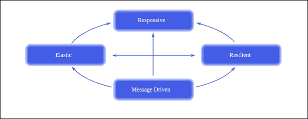
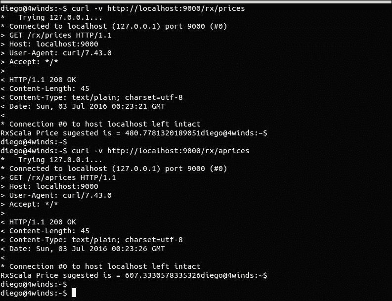
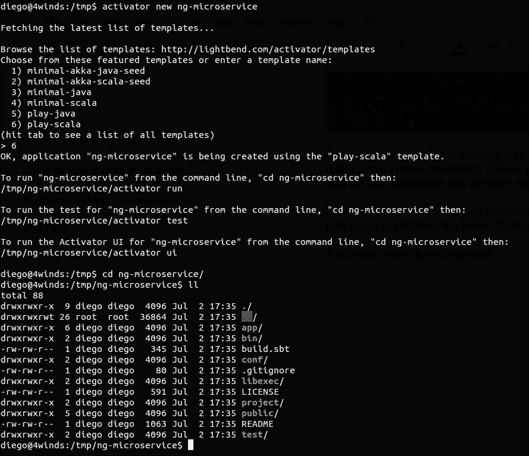
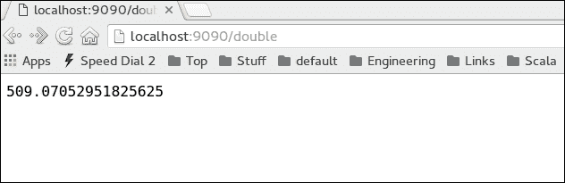
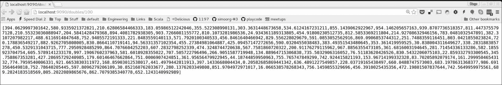
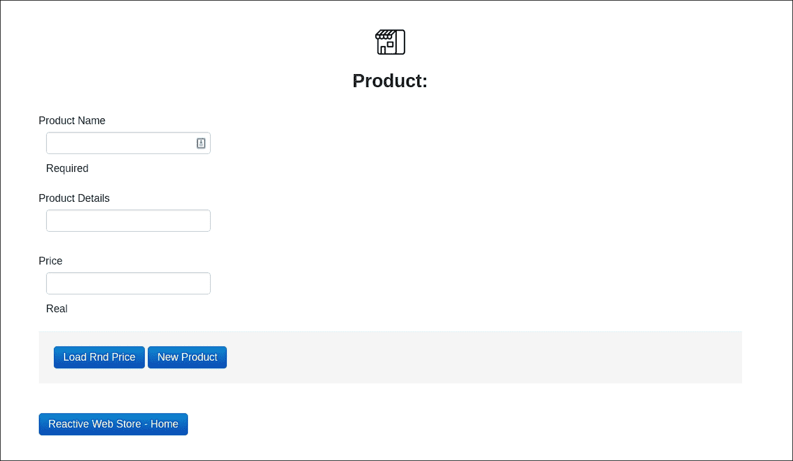
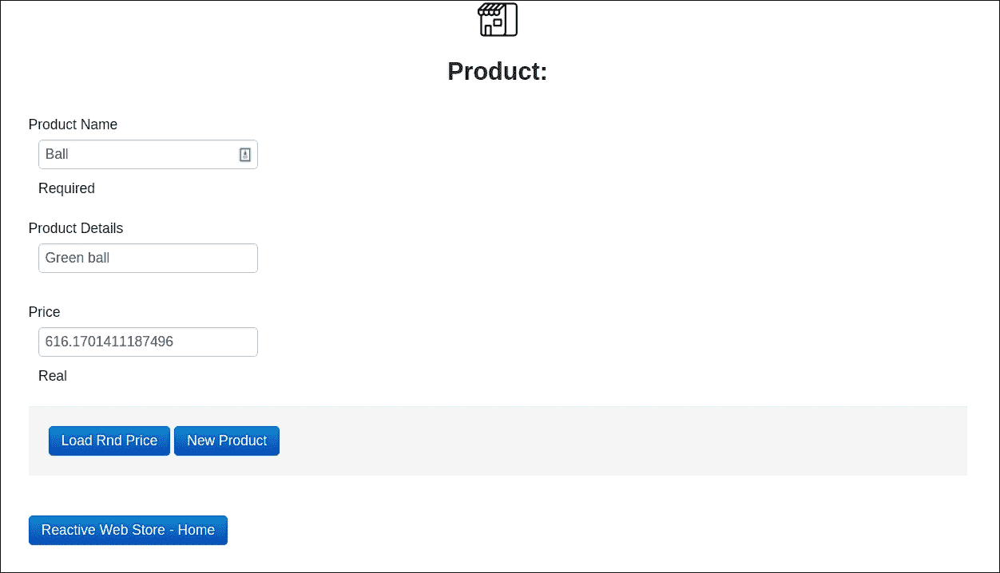

# 第四章 开发反应式后端服务

在上一章中，你学习了如何使用 Activator 引导你的应用程序，我们使用 Scala 和 Play 框架开发了我们的 Web 应用程序。现在我们将进入 RxJava 和 RxScala 的反应式世界。

在本章中，我们将涵盖以下主题：

+   反应式编程原则和反应式宣言

+   理解非阻塞 I/O 的重要性

+   可观测性、函数和 Rx 中的错误处理

+   重构我们的控制器和模型以调用我们的服务

+   将 RxScala 添加到我们的服务中

+   添加日志

# 开始使用反应式编程

现在构建应用程序比以前更难。现在的一切都更加复杂：我们必须在处理器中使用更多的核心，并且我们有了数百台机器的单个服务云原生应用程序。并发编程一直很难，而且它将始终如此，因为建模时间很困难。为了解决这个问题，我们需要有一个反应式架构风格。为了能够处理更多用户并扩展我们的应用程序，我们需要利用异步和非阻塞 I/O。为了帮助我们完成这项任务，我们可以依赖 RxJava 和 RxScala。反应式不仅关乎代码，也关乎架构原则。

反应式宣言很好地捕捉了这些原则，并且有一些技术遵循这些原则以实现完全的反应式。

反应式宣言可以表示如下图：



更多信息，您可以访问[`www.reactivemanifesto.org/`](http://www.reactivemanifesto.org/)。

反应式宣言描述了这种反应式架构/系统看起来是什么样子。基本上，以下是支撑反应式理念的四个核心原则：

+   **响应性**：系统应能够及时响应。换句话说，系统应能够快速检测问题，并有效地处理它们，除了提供快速和一致的反应时间。

+   **弹性**：系统即使在失败后也应保持响应。这是通过复制、隔离和委托（[`en.wikipedia.org/wiki/Delegation_pattern`](https://en.wikipedia.org/wiki/Delegation_pattern)）来实现的。隔离和隔离的想法来自海军工业，并由舱壁模式（[`en.wikipedia.org/wiki/Bulkhead_(partition)`](https://en.wikipedia.org/wiki/Bulkhead_(partition)））定义）。故障被包含在每个组件中。这样做可以确保一个系统的故障不会影响其他系统。恢复委托给另一个系统，而不是客户端。

+   **弹性**：系统应能够增加和减少系统资源。这要求你设计系统时不要有**单点故障**（**SPOF**），并且使用分片和复制进行设计。反应式系统是预测性和成本效益的。

+   **消息驱动**：反应式系统依赖于异步消息传递以确保松散耦合、隔离和位置透明性。通过这样做，我们可以将故障作为消息进行委派。这为我们提供了弹性、负载管理和流量控制。在需要时，甚至可以应用反向压力（也称为节流）。所有这些都应该通过非阻塞通信来完成，以实现更好的资源利用。

好的，让我们在应用中使用 RxScala 将这些原则付诸实践。RxScala 只是 RxJava 的 Scala 包装器，但使用它更好，因为它使代码更具有函数式，而且你不需要创建像`Action1`这样的对象。

在我们的应用中，我们有三个主要资源：产品、评论和图片。所有产品都必须有一个价格，所以我们将使用 Play 框架、RxScala 和 Scala 现在构建一个完全反应式的价格生成器。

首先，我们将在我们的 Play 应用中玩转 RxScala，然后我们将创建一个独立的微服务，对该微服务进行反应式调用，并检索该服务的价格建议。所有数据流转换都使用可观察对象。

让我们在`ReactiveWebStore/conf/routes`创建这个控制器的路由，如下所示：

```java
    # 
    # Services 
    # 
    GET   /rx/prices   controllers.RxController.prices 
    GET   /rx/aprices  controllers.RxController.pricesAsync 

```

这里有两个路由：一个用于常规操作，另一个用于异步操作，它将返回一个 Scala Future。让我们创建一个新的控制器，称为`Rx Controller.scala`。这个控制器需要位于`ReactiveWebStore/app/controller`。 

让我们看看`RxController`，这是我们反应式的 RxScala 简单控制器：

```java
    @Singleton 
    class RxController @Inject()(priceService:IPriceSerice) extends 
    Controller { 
      def prices = Action { implicit request => 
        Logger.info("RX called. ") 
        import ExecutionContext.Implicits.global 
        val sourceObservable = priceService.generatePrices 
        val rxResult = Observable.create { sourceObservable.subscribe  
      } 
      .subscribeOn(IOScheduler()) 
      .take(1) 
      .flatMap { x => println(x) ; Observable.just(x) } 
      .toBlocking 
      .first 
      Ok("RxScala Price suggested is = " + rxResult) 
    } 

      def pricesAsync = Action.async { implicit request => 
        Logger.info("RX Async called. ") 
        import play.api.libs.concurrent.Execution.Implicits. 
        defaultContext 
        val sourceObservable = priceService.generatePrices 
        val rxResult = Observable.create { sourceObservable.subscribe  
        } 
        .subscribeOn(IOScheduler()) 
        .take(1) 
        .flatMap { x => println(x) ; Observable.just(x) } 
        .toBlocking 
        .first 
        Future { Ok("RxScala Price sugested is = " + rxResult) } 
      } 
    } 

```

所以，在第一个名为`prices`的方法中，我们返回一个常规的 Play 框架 Action。我们通过依赖注入接收`IPriceService`。这个`IPriceService`是一个反应式服务，因为它使用了可观察对象。所以我们调用一个方法，`generatePrices`，它将返回`Observable[Double]`。这将是我们计算的数据源，即我们的数据源。继续前进，我们创建一个新的可观察对象，订阅到源可观察对象，然后应用一些转换。例如，我们只取一个元素，然后我们可以使用`flatMap`进行转换。在这个案例中，我们实际上并没有应用转换。我们使用`flatMap`简单地打印我们得到的内容，然后继续链式操作。下一步是调用`toBlocking`，这将阻塞线程直到数据返回。一旦数据返回，我们得到第一个元素，它将是一个 double 类型，然后我们返回`Ok`。

阻塞听起来很糟糕，我们不希望这样。作为替代，我们可以在 Play 框架中使用`async`控制器，它不会阻塞线程并返回一个 Future。所以这是第二种方法，称为`pricesAsync`。这里我们有类似的可观察对象代码。然而，最后我们返回一个非阻塞的 Future。然而，我们调用可观察对象的`toBlocking`，这将阻塞调用，因此使其与之前的方法相同。为了清楚起见，Action 并不坏。默认情况下，Play 框架中一切都是异步的，因为即使你没有返回一个明确的 Future，Play 框架也会为`y`创建一个 promise，并使你编写异步代码。使用 HTTP，你会在某个点阻塞线程。如果你想要从头到尾 100%非阻塞，你需要考虑一个不同的协议，例如 web sockets。

现在我们来看看这个服务。这个服务以及其他服务都需要位于`ReactiveWebStore/apps/services`。首先，我们将创建`trait`来定义服务行为。

## IPriceService - Scala trait

如以下代码所示，我们只定义了一个操作`IPriceService`，即`generatePrices`，它返回`Observable[Double]`。现在的下一步是定义服务实现。这段代码需要位于与之前 trait 相同的 services 文件夹中：

```java
    trait IPriceSerice{ 
      def generatePrices:Observable[Double] 
    } 

```

## PriceService - RxScala PriceService 实现

首先，我们创建`PublishSubject`，这是一种将数据生成到可观察对象中的方法。Scala 有一个很好的方法，使用`Stream.continually`生成无限序列。因此，我们传递一个函数，该函数从 0 到 1,000 生成双随机数。这将永远发生，因为这个计算很昂贵，所以我们将其运行在 Future 中。正确的方法是在`Stream`之后使用一个方法，因为这将完成计算。为了练习的目的，我们暂时保持这种方式。

每个双随机数都通过`onNext`方法发布到`PublishSubject`。现在让我们转到`generatePrices`方法，该方法使用三个可观察对象为我们生成数字。为了清楚起见，当然我们可以在这里做一个更简单的解决方案。然而，我们这样做是为了展示可观察对象的力量以及如何在实践中使用它们。

我们有`Even`和`Odd`可观察对象，它们都订阅了`PublishSubject`，因此它们将接收到无限的双随机数。有一个`flatMap`操作来给数字加`10`。记住，你做的每一件事都需要在可观察对象中完成。所以当你用`flatMap`进行转换时，你总是需要返回一个可观察对象。

最后，我们在`Even`可观察对象上应用过滤函数以获取偶数，在`Odd`可观察对象上获取奇数。所有这些都在并行发生。`Even`和`Odd`可观察对象不会互相等待。

下一步是将两个可观察量合并。我们创建一个空的第三个可观察量，然后将来自`Even`可观察量的无限双数与来自`Odd`可观察量的无限双数合并。现在是将计算限制在只有 10 个数字的时候了。由于异步操作，我们不知道会有多少奇数或偶数。如果你希望控制奇数和偶数的数量，你需要在每个可观察量上应用`take`函数。

最后，我们应用`foldLeft`来求和所有数字并得到总数。然而，当我们这样做时，我们只得到了 90%的数字。这个最后的可观察量是返回给控制器的。这里没有任何阻塞，一切都是异步和反应式的。

你可能想知道为什么`Stream.Continuously`总是生成不同的值。这是因为我们在 Scala 中使用了一个按名调用（Call-by-Name）函数。我们导入了`nextDouble`函数，并传递一个函数而不是函数的值：

```java
    @Singleton 
    class PriceService extends IPriceSerice{ 
      var doubleInfiniteStreamSubject = PublishSubject.apply[Double]() 
      Future { 
        Stream.continually(nextDouble * 1000.0 ).foreach { 
          x => Thread.sleep(1000);  
          doubleInfiniteStreamSubject.onNext(x) 
        } 
      } 
      override def generatePrices:Observable[Double] = { 
        var observableEven = Observable.create {  
        doubleInfiniteStreamSubject.subscribe } 
        .subscribeOn(IOScheduler()) 
        .flatMap { x => Observable.from( Iterable.fill(1)(x + 10) )  
        } 
        .filter { x => x.toInt % 2 == 0 } 
        var observableOdd = Observable.create {  
        doubleInfiniteStreamSubject.subscribe } 
        .subscribeOn(IOScheduler()) 
        .flatMap { x => Observable.from( Iterable.fill(1)(x + 10) )  
        } 
        .filter { x => x.toInt % 2 != 0 } 
        var mergeObservable = Observable 
        .empty 
        .subscribeOn(IOScheduler()) 
        .merge(observableEven) 
        .merge(observableOdd) 
        .take(10) 
        .foldLeft(0.0)(_+_) 
        .flatMap { x => Observable.just( x - (x * 0.9) ) } 
         return mergeObservable 
      } 
    } 

```

我们需要在`Module.scala`中注册这个服务，`Module.scala`位于`ReactiveWebStore/app`默认包中。

## Guice 注入 - Module.scala

你的`Module.scala`文件应该看起来像这样：

```java
    class Module extends AbstractModule { 
      override def configure() = { 
        // Use the system clock as the default implementation of Clock 
        bind(classOf[Clock]).toInstance(Clock.systemDefaultZone) 
        // Ask Guice to create an instance of ApplicationTimer when  
        //the 
        // application starts. 
        bind(classOf[ApplicationTimer]).asEagerSingleton() 
        bind(classOf[IProductService]).to(classOf[ProductService]). 
        asEagerSingleton() 
        bind(classOf[IReviewService]).to(classOf[ReviewService]). 
        asEagerSingleton() 
        bind(classOf[IImageService]).to(classOf[ImageService]). 
        asEagerSingleton() 
        bind(classOf[IPriceSerice]).to(classOf[PriceService]). 
        asEagerSingleton() 
      } 
    } 

```

为了编译和运行前面的代码，我们需要添加一个额外的 SBT 依赖项。打开`build.sbt`，并添加 RxScala。我们还将添加另一个依赖项，即 ws，这是一个用于进行 Web 服务调用的 Play 库。我们将在本章的后面使用它。

你的`build.sbt`应该看起来像这样：

```java

    name := """ReactiveWebStore""" 
    version := "1.0-SNAPSHOT" 
    lazy val root = (project in file(".")).enablePlugins(PlayScala) 
    scalaVersion := "2.11.7" 

    libraryDependencies ++= Seq( 
      jdbc, 
      cache, 
      ws, 
      "org.scalatestplus.play" %% "scalatestplus-play" % "1.5.1" %      
      Test, 
      "com.netflix.rxjava" % "rxjava-scala" % "0.20.7" 
    ) 

    resolvers += "scalaz-bintray" at 
    "http://dl.bintray.com/scalaz/releases" 
    resolvers += DefaultMavenRepository 

```

现在，我们可以使用`activator run`编译并运行这段代码。

我们现在可以使用 CURL 调用调用这个新的路由。如果你愿意，你也可以直接在浏览器中完成。

```java
curl -v http://localhost:9000/rx/prices 
curl -v http://localhost:9000/rx/aprices

```

我们将看到以下结果：



太好了！我们已经让 RxScala 与 Play 框架一起工作。现在，我们将重构我们的代码，使其更加有趣。所以我们将使用 Play 框架创建一个微服务，并将这个随机数生成器外部化到微服务中。

我们需要创建一个新的 Play 框架应用程序。我们将选择选项号`6) play-scala`应用程序模板。打开你的控制台，然后输入以下命令：

```java
$ activator new ng-microservice

```

你将看到以下结果：



让我们在`ng-microservice`上创建路由。这里不会有任何 UI，因为这将是一个微服务。我们需要在`ng-microservice/conf/routes`中添加一个路由：

```java
    # Routes 
    # This file defines all application routes (Higher priority routes 
    first) 
    # ~~~~ 

    GET /double      controllers.NGServiceEndpoint.double 
    GET /doubles/:n  controllers.NGServiceEndpoint.doubles(n:Int) 

```

现在让我们定义控制器。这不是一个常规控制器，因为这个控制器不会提供 UI 视图。相反，它将为微服务消费者提供 JSON。这里我们只有一个消费者，它将是`ReactiveWebStore`。然而，你可以有任意多的消费者，比如其他微服务或甚至是移动应用程序。

## NGServiceEndpoint

对于这个控制器，我们只有两个路由。这些路由是`double`和`doubles`。第一个路由从服务返回一个双精度浮点数，第二个路由返回一个批量生成的双精度浮点数的列表。对于第二个方法，我们获取一个双精度浮点数的列表，并使用 Play 框架的实用库`Json`将这个列表转换为 JSON 格式：

```java
    class NGServiceEndpoint @Inject()(service:NGContract) extends 
    Controller { 
      def double = Action { 
        Ok(service.generateDouble.toString()) 
      } 
      def doubles(n:Int) = Action { 
        val json = Json.toJson(service.generateDoubleBatch(n)) 
        Ok(json) 
      } 
    } 

```

下一步是为微服务创建`trait`。在**面向服务架构**（**SOA**）的术语中，这个`trait`也是服务合同，即微服务提供的功能。

`NGContract.scala`文件应类似于以下内容：

```java
    trait NGContract { 
       def generateDouble:Double 
       def generateDoubleBatch(n:Int):List[Double] 
    } 

```

让我们看看这个微服务的服务实现：

```java
    package services 
    import scala.util.Random 
    import scala.util.Random.nextDouble 
    class NGServiceImpl extends NGContract{ 
      override def generateDouble:Double = { 
        Stream.continually(nextDouble * 1000.0 ) 
        .take(1) 
      } 
      override def generateDoubleBatch(n:Int):List[Double] = { 
        require(n >= 1, "Number must be bigger than 0") 
        val nTimes:Option[Int] = Option(n) 
        nTimes match { 
          case Some(number:Int) => 
          Stream.continually(nextDouble * 1000.0 ) 
          .take(n) 
          .toList 
          case None => 
          throw new IllegalArgumentException("You need provide a valid  
          number of doubles you want.") 
        } 
      } 
    } 

```

这个服务实现没有使用任何 RxScala 代码。然而，它非常函数式。我们在这里实现了两个方法。这些方法是`generateDouble`和`generateDoubleBatch`，它们通过参数接收你希望它为你生成的双精度浮点数的数量。对于第一个操作（`generateDouble`），我们使用`Stream.continually`生成无限随机双精度浮点数，然后我们将这些数字乘以 1,000，然后只取 1 并返回它。

第二个操作非常相似。然而，我们必须添加一些验证以确保双精度浮点数的数量存在。有几种方法可以做到这一点。一种方法是在 Scala 中使用 assert 方法。第二种方法是模式匹配器，它很棒，因为我们不需要编写`if`语句。

这种技术在 Scala 社区中非常常见。因此，我们创建了一个选项，它接受一个数字，然后进行模式匹配。如果有数字存在，将触发`Some`方法，否则将调用`None`。

经过这些验证后，我们可以使用`Stream`生成所需数量的数字。在我们运行代码之前，我们需要定义 Guice 注入。此文件位于默认包`ng-microservice/app/`中：

```java
    class Module extends AbstractModule { 
      override def configure() = { 
        // Use the system clock as the default implementation of Clock 
        bind(classOf[Clock]).toInstance(Clock.systemDefaultZone) 
        bind(classOf[NGContract]).to(classOf[NGServiceImpl]). 
        asEagerSingleton() 
      } 
    } 

```

现在是编译并运行我们的微服务的时候了。由于我们已经在`9000`端口上运行了一个名为`ReactiveWebStore`的 Play 应用程序，如果你直接运行微服务，你会遇到麻烦。为了解决这个问题，我们需要在不同的端口上运行它。让我们为微服务使用`9090`端口。打开控制台，执行命令`$ activator`后跟`$ run 9090`：

```java
ng-microservice$ activator -Dsbt.task.forcegc=false 
[info] Loading global plugins from /home/diego/.sbt/0.13/plugins 
[info] Loading project definition from /home/diego/github/diegopacheco/Book_Building_Reactive_Functional_Scala_Applications/Chap4/ng-microservice/project 
[info] Set current project to ng-microservice (in build file:/home/diego/github/diegopacheco/Book_Building_Reactive_Functional_Scala_Applications/Chap4/ng-microservice/) 
[ng-microservice] $ run 9090 

--- (Running the application, auto-reloading is enabled) --- 

[info] p.c.s.NettyServer - Listening for HTTP on /0:0:0:0:0:0:0:0:9090 

(Server started, use Ctrl+D to stop and go back to the console...)

```

我们可以通过调用我们拥有的两个操作来测试我们的微服务。所以让我们打开网页浏览器并执行它。

在`http://localhost:9090/double`的`double`微服务调用如下：



每次调用此操作时，你都会看到一个不同的随机双精度浮点数。现在我们可以尝试下一个操作：传递给数字的数量。此操作将返回一个包含双精度浮点数的 JSON 格式的列表。

在`http://localhost:9090/doubles/100`的批量`double`微服务调用如下所示：



它工作了！这里有 100 个双精度浮点数。现在我们有一个微服务正在运行，我们可以回到我们的`ReactiveWebStore`并更改我们的 RxScala 代码。我们将创建新的控制器。我们还将更新现有代码以调用我们的新代码，并在 UI 上为用户建议价格，所有这些都在反应式方式下完成。请记住，你需要让`ng-microservice`运行；否则，`ReactiveWebStore`将无法检索双精度浮点数。

# Play 框架和高 CPU 使用率

如果你注意到你的 CPU 使用率高于应有的水平，不要担心；有一个修复方法。实际上，这个问题与 SBT 有关。只需确保在运行 Activator 时，你传递以下参数：

`$ activator -Dsbt.task.forcegc=false`。

回到`ReactiveWebStore`，让我们创建新的路由。打开`ReactiveWebStore/conf/routes`：

```java
    GET   /rnd/double  
    controllers.RndDoubleGeneratorController.rndDouble 
    GET   /rnd/call    controllers.RndDoubleGeneratorController.rndCall 
    GET   /rnd/rx      controllers.RndDoubleGeneratorController.rxCall 
    GET   /rnd/rxbat      
    controllers.RndDoubleGeneratorController.rxScalaCallBatch 

```

一旦我们有了新的路由，我们需要创建新的控制器。这个控制器需要与其他控制器一起位于`ReactiveWebStore/app/controllers`。

## RndDoubleGeneratorController

`RndDoubleGeneratorController`类文件应该看起来像这样：

```java
    @Singleton 
    class RndDoubleGeneratorController @Inject() (service:IRndService)     
    extends Controller { 
      import play.api.libs.concurrent.Execution. 
      Implicits.defaultContext 
      def rndDouble = Action { implicit request => 
        Ok( service.next().toString() ) 
      } 
      def rndCall = Action.async { implicit request => 
        service.call().map { res => Ok(res) } 
      } 
      def rxCall = Action { implicit request => 
        Ok(service.rxScalaCall().toBlocking.first.toString()) 
      } 
      def rxScalaCallBatch = Action { implicit request => 
        Ok(service.rxScalaCallBatch().toBlocking.first.toString()) 
      } 
    } 

```

在前面的控制器中，所有方法都调用服务`IRndService`。`RndService`中的所有操作都调用`ng-microservice`。这里有一些操作变体，我们将在探索服务实现时详细讨论。

这里有一些有趣的事情：例如，对于第二个操作`rndCall`，我们看到使用了`Action.async`，这意味着我们的控制器将返回一个 Future，而这个 Future 来自服务。我们还执行了一个`Map`来将结果转换为`Ok`。

最后一个名为`rxScalaCallBatch`的操作是最有趣的，也是我们将用于我们的 UI 的操作。然而，如果你愿意，你也可以使用其他的，因为它们都返回双精度浮点数，这是很好的。

## IRndService.scala - Scala trait

让我们看看服务定义。首先，我们需要为服务定义一个特质，该特质将定义我们需要的操作：

```java
    trait IRndService { 
      def next():Double 
      def call():Future[String] 
      def rxScalaCall():Observable[Double] 
      def rxScalaCallBatch():Observable[Double] 
    } 

```

## RndService.scala - RndService 实现

现在我们可以转向真正的服务实现了。这需要位于`ReactiveWebStore/app/services`：

```java
    @Singleton 
    class RndService @Inject() (ws: WSClient) extends IRndService { 
      import play.api.libs.concurrent.Execution.Implicits. 
      defaultContext 
      override def next():Double = { 
        val future = ws.url("http://localhost:9090/double").get().map  
        { res => res.body.toDouble } 
        Await.result(future, 5.seconds) 
      } 
      override def call():Future[String] = { 
        ws.url("http://localhost:9090/double").get().map  
        { res => res.body } 
      } 
      override def rxScalaCall():Observable[Double] = { 
        val doubleFuture:Future[Double] =  
        ws.url("http://localhost:9090/double").get().map { x =>  
          x.body.toDouble } 
        Observable.from(doubleFuture) 
      } 
     // Continue ... 

```

为了调用我们的微服务（`ng-microservice`），我们需要注入一个特殊的 Play 框架库`ws`，这是一个用于调用 Web 服务的实用库。我们通过在类定义中添加代码（`ws:WSClient`）来注入它。

当你使用`ws`调用某个东西时，它返回一个 Future。我们需要有 Future 执行器。这就是为什么`defaultContext`的导入非常重要，你不能跳过它。

对于这个方法，正如你所看到的，我们接下来调用我们的微服务`http://localhost:9090/double`以获取一个单独的双精度浮点数。我们映射这个结果，并获取结果的主体，这将是我们需要的双精度浮点数本身。

对于这个方法，我们使用`Await.result`，这将阻塞并等待结果。如果结果在五秒内没有返回，这段代码将失败。

第二个方法名为 `call`，它执行相同的操作，但主要区别是我们没有阻塞服务；相反，我们向控制器返回一个 Future。

最后，最后一个方法名为 `rxScalaCall`，它执行相同的操作：使用 `ws` 库调用我们的微服务。然而，我们返回一个可观测对象。可观测对象很棒，因为它们可以用作 Future。

现在是时候检查最终操作和最有趣的操作了。对于这个相同的类，我们需要添加另一个方法，如下所示：

`RndService.scala` 中的 `rxScalaCallBatch` 方法如下：

```java
    override def rxScalaCallBatch():Observable[Double] = { 
      val doubleInfiniteStreamSubject = PublishSubject.apply[Double]() 
      val future = ws.url("http://localhost:9090/doubles/10") 
      .get() 
      .map { x => Json.parse(x.body).as[List[Double]] } 
      future.onComplete { 
        case Success(l:List[Double]) => l.foreach { e =>  
        doubleInfiniteStreamSubject.onNext(e) } 
        case Failure(e:Exception) =>  
        doubleInfiniteStreamSubject.onError(e) 
      } 
      var observableEven = Observable.create {  
        doubleInfiniteStreamSubject.subscribe } 
      .onErrorReturn { x => 2.0 } 
      .flatMap { x => Observable.from( Iterable.fill(1)(x + 10) ) } 
      .filter { x => x.toInt % 2 == 0 } 
      .flatMap { x => println("ODD: " + x) ; Observable.just(x) } 
      var observableOdd = Observable.create {  
        doubleInfiniteStreamSubject.subscribe } 
        .onErrorReturn { x => 1.0 } 
        .flatMap { x => Observable.from( Iterable.fill(1)(x + 10) ) } 
        .filter { x => x.toInt % 2 != 0 } 
        .flatMap { x => println("EVEN: " + x) ; Observable.just(x) } 
        var mergeObservable = Observable 
        .empty 
        .merge(observableEven) 
        .merge(observableOdd) 
        .take(10) 
        .foldLeft(0.0)(_+_) 
        .flatMap { x => Observable.just( x - (x * 0.9) ) } 
        mergeObservable 
      } 

```

因此，首先我们创建 `PublishSubject` 以便能够为可观测对象生成数据。然后我们调用微服务的 `ws` 方法。现在的主要区别是我们调用批处理操作并排序 10 个双精度浮点数。这段代码发生在 Future 中，所以它是非阻塞的。

我们然后使用 `Map` 函数来转换结果。`ng-microservice` 函数将返回 JSON，因此我们需要将此 JSON 反序列化为 Scala 对象。最后，我们在 Future 结果中运行模式匹配器。如果结果是成功的，这意味着一切正常。因此，对于每个双精度浮点数，我们使用 `PublishSubject` 将其发布到可观测对象中。如果服务已关闭或我们遇到问题，我们将错误发布到下游的可观测对象中。

接下来我们创建三个可观测对象：一个用于奇数，一个用于偶数，第三个将合并前两个并执行额外的计算。我们在 Future 和可观测对象之间进行转换的方式是理想的，因为它是非阻塞的。

在这里，我们有与之前 Rx 控制器相似的代码。主要区别是我们有错误处理，因为 `ng-microservice` 可能永远不会返回，因为它可能已经关闭或根本不起作用。因此，我们需要开始使用回退。良好的回退对于反应式应用程序的错误处理至关重要。回退应该是某种静态的；换句话说，它们不应该失败。

我们提供了两种回退方法：一个用于 `Odd` 可观测对象，另一个用于 `Even` 可观测对象。这些回退是通过设置 `OnErrorReturn` 方法完成的。所以对于偶数，回退是静态的，值为 2，而对于奇数，值为 1。这很好，因为即使出现故障，我们的应用程序仍然可以继续工作。

你可能会意识到这次我们没有使用 `take` 函数。那么这段代码会永远运行吗？不会的，因为 `ng-microservice` 只返回 10 个双精度浮点数。最后，我们将可观测对象合并成一个单一的可观测对象，将所有数字相加，获取值的 90%，然后返回一个可观测对象。

## Module.scala - Guice 注入

现在，将这个新服务连接到 Guice。让我们更改位于 `ReactiveWebStore/apps/Module.scala` 的 Guice `Module.scala`：

```java
    class Module extends AbstractModule { 
      override def configure() = { 
        bind(classOf[Clock]).toInstance(Clock.systemDefaultZone)  
         bind(classOf[ApplicationTimer]).asEagerSingleton() 
         bind(classOf[IProductService]).to(classOf[ProductService]). 
         asEagerSingleton() 
         bind(classOf[IReviewService]).to(classOf[ReviewService]). 
         asEagerSingleton() 
         bind(classOf[IImageService]).to(classOf[ImageService]). 
         asEagerSingleton() 
         bind(classOf[IPriceSerice]).to(classOf[PriceService]). 
         asEagerSingleton() 
         bind(classOf[IRndService]).to(classOf[RndService]). 
         asEagerSingleton() 
      }} 

```

接下来我们需要在 JavaScript 中创建一个 jQuery 函数来调用我们新的控制器。这个函数需要位于 `ReactiveWebStore/public/javascripts`。

下面的代码是 `price.js`，这是一个调用我们控制器的 jQuery 函数：

```java
    /** 
     * This functions loads the price in the HTML component. 
    */ 
    function loadPrice(doc){ 
      jQuery.get( "http://localhost:9000/rnd/rxbat", function(  
      response ) { 
        doc.getElementById("price").value = parseFloat(response) 
      }).fail(function(e) { 
        alert('Wops! We was not able to call  
        http://localhost:9000/rnd/rxba. Error: ' + e.statusText); 
      }); 
    } 

```

我们只有一个名为 `loadPrice` 的函数，它接收一个文档。我们使用 `JQuery.get` 方法调用我们的控制器，并解析响应，将其添加到名为 `price` 的 HTML 文本框中。如果出现问题，我们会通过 alert 弹窗通知用户无法加载价格。

## main.scala.html

我们需要更改位于 `ReactiveWebStore/app/views/main.scala.html` 的 `main.scala` 代码，以便导入一个新的 JavaScript 函数：

```java
    @(title: String)(content: Html)(implicit flash: Flash) 
    <!DOCTYPE html> 
    <html lang="en"> 
      <head> 
        <title>@title</title> 
        <link rel="shortcut icon" type="image/png"  
        href="@routes.Assets.at("images/favicon.png")"> 
        <link rel="stylesheet" media="screen"  
        href="@routes.Assets.at("stylesheets/main.css")"> 
        <link rel="stylesheet" media="screen"  
        href="@routes.Assets.at("stylesheets/bootstrap.min.css")"> 
        <script src="img/@routes.Assets.at("javascripts/jquery- 
        1.9.0.min.js")" type="text/javascript"></script> 
        <script src="img/@routes.Assets.at("javascripts/bootstrap.js")"  
        type="text/javascript"></script> 
        <script src="img/@routes.Assets.at("javascripts/image.js")"  
        type="text/javascript"></script> 
        <script src="img/@routes.Assets.at("javascripts/price.js")"  
        type="text/javascript"></script> 
      </head> 
      <body> 
        <center><a href='/'></a> 
        <h3>@title</h3></center> 
        <div class="container"> 
          @alert(alertType: String) = { 
            @flash.get(alertType).map { message => 
              <div class="alert alert-@alertType"> 
                <button type="button" class="close" data- 
                dismiss="alert">&times;</button> 
                @message 
              </div> 
            } 
          }
          @alert("error") 
          @alert("success") 
          @content 
          <a href="/"></a><BR> 
          <button type="submit" class="btn btn-primary"  
            onclick="window.location.href='/'; " > 
           Reactive Web Store - Home 
          </button> 
        </div> 
      </body> 
    </html> 

```

## product_details.scala.html

最后，我们需要更改我们的产品视图，以便添加一个从控制器加载价格的按钮。让我们更改 `product_details` 视图，位于 `ReactiveWebStore/app/views/product_details.scala.html`：

```java
    @(id: Option[Long],product:Form[Product])(implicit flash:Flash) 
    @import play.api.i18n.Messages.Implicits._ 
    @import play.api.Play.current 
    @main("Product: " + product("name").value.getOrElse("")){ 
      @if(product.hasErrors) { 
        <div class="alert alert-error"> 
          <button type="button" class="close" data- 
          dismiss="alert">&times;</button> 
          Sorry! Some information does not look right. Could you  
          review it please and re-submit? 
        </div> 
      } 

      @helper.form(action = if (id.isDefined)  
      routes.ProductController.update(id.get) else  
      routes.ProductController.insert) { 
        @helper.inputText(product("name"), '_label -> "Product Name") 
        @helper.inputText(product("details"), '_label -> "Product  
        Details") 
        @helper.inputText(product("price"), '_label -> "Price") 
        <div class="form-actions"> 
        <button type="button" class="btn btn-primary"  
        onclick="javascript:loadPrice(document);" >Load Rnd  
        Price</button> 
        <button type="submit" class="btn btn-primary"> 
          @if(id.isDefined) { Update Product } else { New Product } 
        </button> 
        </div> 
      } 
    } 

```

太好了！现在我们有一个按钮，使用 JQuery 从控制器加载数据。你可以看到按钮 `Load Rnd Price` 有一个 `onClick` 属性，它调用我们的 JavaScript 函数。

现在，你需要打开你的控制台，并输入 `$ activator run` 来编译和运行更改，就像我们对 `ReactiveWebStore` 做的那样。

此命令将产生以下结果：

```java
ReactiveWebStore$ activator -Dsbt.task.forcegc=false
[info] Loading global plugins from /home/diego/.sbt/0.13/plugins
[info] Loading project definition from /home/diego/github/diegopacheco/Book_Building_Reactive_Functional_Scala_Applications/Chap4/ReactiveWebStore/project
[info] Set current project to ReactiveWebStore (in build file:/home/diego/github/diegopacheco/Book_Building_Reactive_Functional_Scala_Applications/Chap4/ReactiveWebStore/)
[ReactiveWebStore] $ run
--- (Running the application, auto-reloading is enabled) ---
[info] p.c.s.NettyServer - Listening for HTTP on /0:0:0:0:0:0:0:0:9000
(Server started, use Ctrl+D to stop and go back to the console...)
[info] application - ApplicationTimer demo: Starting application at 2016-07-03T02:35:54.479Z.
[info] play.api.Play - Application started (Dev)

```

因此，打开你的浏览器到 `http://localhost:9000`，并转到产品页面以查看我们的需求功能集成并完美运行。请记住，你需要在一个另一个控制台窗口中让 `ng-microservice` 运行；否则，我们的应用程序将使用静态回退。

新的产品功能将在 `http://localhost:9000/product/add` 上显示，如下面的截图所示：



所以，如果你点击 **Load Rnd Price** 按钮，你会看到类似以下的内容：



如果你查看 activator 控制台中的应用程序日志，你会看到类似以下的内容：

```java
[info] application - ApplicationTimer demo: Starting application at 2016-07-03T02:35:54.479Z.
[info] play.api.Play - Application started (Dev)
[info] application - index called. Products: List()
[info] application - blank called. 
ODD: 722.8017048639501
EVEN: 863.8229024202085
ODD: 380.5549208988492
EVEN: 947.6312814830953
ODD: 362.2984794191124
ODD: 676.978825910585
ODD: 752.7412673916701
EVEN: 505.3293481709368
EVEN: 849.9768444508936
EVEN: 99.56583617819769

```

好的，这就完成了。一切都在运行中！

# 摘要

在本章中，你学习了由 Reactive Manifesto 引导的响应式应用程序的核心原则。你还学习了如何使用 RxScala 创建响应式应用程序。然后我们解释了如何使用 ws 库调用其他内部和外部 Web 服务。然后你学习了如何使用 `Json` 库序列化和反序列化 JSON。继续前进，你学习了如何使用 Play 框架支持创建简单的微服务。

在下一章中，我们将继续构建我们的应用程序，并学习如何使用 JUnit 和 ScalaTest 测试我们的应用程序。
