# 第五章 测试你的应用程序

在到目前为止的章节中，我们使用 Activator 启动了我们的应用程序，使用 Scala 和 Play 框架开发了我们的 Web 应用程序，并使用 RxScala 添加了一个响应式微服务调用以进行数据流计算。现在我们将继续进行单元测试和控制器测试，使用 BDD 和 Play 框架。

在本章中，我们将涵盖以下主题：

+   单元测试原则

+   使用 JUnit 测试 Scala 应用程序

+   行为驱动开发原则

+   使用 ScalaTest 进行测试

+   使用 ScalaTest 测试 Play 框架应用程序

+   在 Activator / SBT 中运行测试

`testingTest`的需求是软件开发的一个基本且非常重要的部分。没有测试，我们无法确保我们的代码是正确的。我们应该对我们产生的几乎所有代码进行测试。有些东西不适合测试，例如，案例类和仅代表结构对象的类，换句话说，没有函数的类。如果你有应用计算、转换和验证的代码，你肯定希望使用良好的代码覆盖率来测试这些代码，这指的是功能或任何重要的代码，而不仅仅是结构性的。

测试覆盖率很重要，因为它允许我们带着信任进行重构（通过减少代码、创建通用代码，甚至删除代码来提高应用程序代码质量）。这是因为，如果你有测试，并且你意外地做错了什么，你的测试会告诉你。这全部关于拥有短周期的反馈。越早越好；你希望尽早、尽可能接近开发地发现你引入的 bug。没有人喜欢在生产中发现那些可以通过简单测试捕获的 bug。

# 单元测试原则

单元测试是你可能应用的最小测试单元。你需要将其应用于类级别。因此，一个单元测试将覆盖你拥有的所有函数的类。但是，等等，一个类通常有依赖项，而这些依赖项可能有其他的依赖项，那么你该如何测试呢？我们需要有模拟，简单的哑对象，它们模拟其他类的行为。这是隔离代码并允许单元测试的重要技术。

## 使代码可测试

单元测试很简单：基本上，我们通过向函数传递参数来调用它，然后检查输出是否与我们的预期相符。这也被称为断言或断言。因此，单元测试是关于断言的。有时，你的代码可能不可测试。例如，假设你有一个没有参数且返回单位的函数。这非常难以测试，因为它意味着函数充满了副作用。如果你还记得我们在第一章中讨论的内容，*函数式编程、响应式编程和 Scala 简介*，这是违反函数式编程原则的。因此，如果我们遇到这种情况，我们需要重构代码，使函数返回某些内容，然后我们才能对其进行测试。

## 隔离和自包含测试

单元测试应该是自包含的，这意味着单元测试中的类不应该依赖于任何特定的执行顺序。假设你有一个包含两个测试函数的单元测试类。因此，每个测试应该一次只测试一个函数，并且这两个函数应该能够以任何顺序运行。否则，测试将变得脆弱，长期维护起来也会很困难。

## 有效的命名

有效的命名是至关重要的。测试函数需要确切地说明测试做了什么。这很重要，因为当测试失败时，更容易找出出错的原因和原因。遵循同样的思路，当你进行断言时，你应该一次只断言一件事情。想象一下，你需要测试一个网络服务是否返回有效的 JSON。这个特定的 JSON 可能有两个字段：名字和姓氏。因此，你将为一个名字进行一次断言，为姓氏进行另一次断言。这样，将更容易理解测试做了什么，以及当测试失败时如何进行故障排除。

## 测试层次

当我们运行测试时，我们通常分层进行。单元测试是基本层；然而，还有其他层次，如控制器测试、集成测试、UI 测试、端到端测试、压力测试，等等。对于这本书，我们将使用 JUnit 和`ScalaTest`，Play 框架的支持，来介绍单元测试、控制器测试和 UI 测试。

# 使用 JUnit 进行测试

如果你来自 Java 背景，你很可能已经使用过 JUnit。你可以使用 Scala 和 Play 框架进行 JUnit 测试。然而，当我们使用 Play 框架创建应用程序时，这并不是最佳实践，因为它更倾向于使用 Scala Spec 进行**行为驱动开发**（**BDD**）测试。对于本章，我们将介绍如何使用 BDD 和 Play 进行各种测试。现在，在我们转向 BDD 之前，让我们看看如何使用 JUnit 进行单元测试。

```java
    @RunWith(classOf[Suite]) 
    @Suite.SuiteClasses(Array(classOf[JunitSimpleTest])) 
    class JunitSimpleSuiteTest 
    class JunitSimpleTest extends PlaySpec with AssertionsForJUnit { 
      @Test def testBaseService() { 
        val s = new ProductService 
        val result = s.findAll() 
        assertEquals(None, result) 
        assertTrue( result != null) 
        println("All good junit works fine with ScalaTest and Play") 
      } 
    } 

```

因此，在前面代码中，我们有一个扩展 `PlaySpec` 并添加了一个名为 `AssertionForJunit` 的特质的类。为什么这里没有经典的 JUnit 类？因为 Play 框架已经设置为运行 Scala 测试，所以这个桥梁允许我们通过 `ScalaTest` Play 框架构造来运行 JUnit。

然后，我们有一个名为 `testBaseServer` 的测试函数，它使用 JUnit 的 `@Test` 注解。在测试方法内部，我们创建一个 `ProductService` 实例，然后调用 `findAll` 函数。

最后，我们有断言将检查结果是否符合我们的预期。因此，我们没有产品，因为我们之前没有插入它们。因此，我们期望响应为 `None`，结果也不应该是 `null`。

您可以使用以下命令在您的控制台中运行此操作：

```java
$ activator "test-only JunitSimpleTest"

```

您将在下一张截图看到结果：

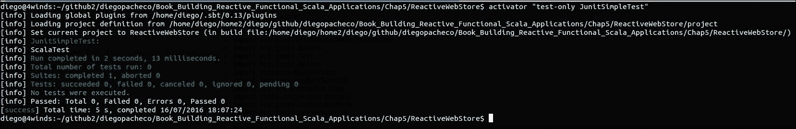

如您所见，我们的测试执行没有任何问题。您也可以在 Eclipse IDE 中使用 Junit 运行此测试和正常测试。您只需右键单击文件，然后选择 **运行方式：Scala Junit 测试**；**，请参考以下截图：

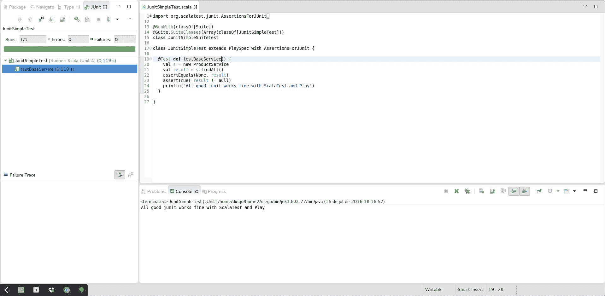

# 行为驱动开发 - BDD

**行为驱动开发** (**BDD**) 是一种敏捷开发技术，它关注开发人员与非技术人员（如业务的产品负责人）之间的互动。这个想法很简单：使用业务使用的相同语言来提取你正在构建的代码最初存在的原因。BDD 最终最小化了技术语言与业务语言之间的翻译，创造了更多协同作用，减少了信息技术与业务之间的噪音。

BDD 测试描述了应用程序需要做什么，以及它的行为。使用业务人员和开发人员之间的结对编程来编写这些测试是非常常见的。`ScalaTest` 是一个 BDD 框架。Play 框架与 `ScalaTest` 集成得很好。让我们现在就开始使用 `ScalaTest` 和 Play 吧。

# MyFirstPlaySpec.scala - 使用 ScalaTest 和 Play 框架的首次 BDD

`MyFirstPlaySpec.scala` 类应包含以下代码：

```java
    class MyFirstPlaySpec extends PlaySpec { 
      "x + 1 " must { 
        "be 2 if x=1 " in { 
          val sum = 1 + 1 
          sum mustBe 2 
        } 
        "be 0 if x=-1 " in { 
          val sum = -1 + 1 
          sum mustBe 0 
        } 
      } 
    } 

```

因此，您创建了一个名为 `MyFirstPlaySpec` 的类，并从 `PlaySpec` 扩展它以获取 Play 框架 `ScalaTest` 支持。然后我们创建了两个测试两个数字之和的函数。在第一个测试中，`1 + 1` 应该等于 `2`，在第二个测试中，`-1 + 1` 应该等于 `0`。当我们执行 `mustBe` 时，它与在 JUnit 中进行断言相同。这里的主要区别是测试在 Spec 上有明确的行为。现在我们可以通过键入以下内容来运行测试：

```java
$ activator "test-only MyFirstPlaySpec"

```

您将看到以下结果：

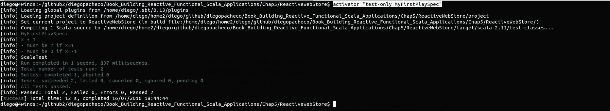

# 使用 Play 框架支持进行测试

现在我们将继续构建我们的应用程序。让我们在我们的应用程序中添加 BDD 测试。我们将开始对你的服务进行测试。我们必须测试`ProductService`、`ImageService`和`ReviewService`。

你的`ProductServiceTestSpec.scala`文件应该包含以下代码：

```java
    class ProductServiceTestSpec extends PlaySpec { 
      "ProductService" must { 
        val service:IProductService = new ProductService 
        "insert a product properly" in { 
          val product = new models.Product(Some(1), 
          "Ball","Awesome Basketball",19.75) 
          service.insert(product) 
        } 
        "update a product" in { 
          val product = new models.Product(Some(1), 
          "Blue Ball","Awesome Blue Basketball",19.99) 
          service.update(1, product) 
        } 
        "not update because does not exit" in { 
          intercept[RuntimeException]{ 
            service.update(333,null) 
          } 
        } 
        "find the product 1" in { 
           val product = service.findById(1) 
           product.get.id mustBe Some(1) 
           product.get.name mustBe "Blue Ball" 
           product.get.details mustBe "Awesome Blue Basketball" 
           product.get.price mustBe 19.99 
        } 
        "find all" in { 
          val products = service.findAll() 
          products.get.length mustBe 1 
          products.get(0).id mustBe Some(1) 
          products.get(0).name mustBe "Blue Ball" 
          products.get(0).details mustBe "Awesome Blue Basketball" 
          products.get(0).price mustBe 19.99 
        } 
        "find all products" in { 
          val products = service.findAllProducts() 
          products.length mustBe 1 
          products(0)._1 mustBe "1" 
          products(0)._2 mustBe "Blue Ball" 
        } 
        "remove 1 product" in { 
          val product = service.remove(1) 
          product mustBe true 
          val oldProduct = service.findById(1) 
          oldProduct mustBe None 
        } 
        "not remove because does not exist" in { 
          intercept[RuntimeException]{ 
            service.remove(-1) 
          } 
        } 
      } 
    } 

```

对于这次测试，我们正在测试`ProductService`中所有可用的公共函数。测试非常直接：我们调用特定的服务操作，例如`findById`，然后我们检查结果以确保所有应该存在的数据都存在。

有一些场景下，服务应该返回一个异常，例如，如果你尝试删除一个不存在的东西。如果你看一下最后一个测试函数`"not remove because does not exist"`，我们应该得到一个异常。然而，服务代码中有一个 bug。运行测试，然后你就会看到它。

## ProductService.scala - 修复代码问题

测试的伟大之处在于：它们可以显示我们代码中的问题，这样我们就可以在代码进入生产环境并影响用户体验之前修复它们。为了修复最后一个测试，我们需要进入`ProductService`类并修复一个方法。这就是我们修复它的方法：

```java
    private def validateId(id:Long):Unit = { 
      val entry = inMemoryDB.get(id) 
      if (entry==null || entry.equals(None)) throw new  
      RuntimeException("Could not find Product: " + id) 
    } 

```

现在一切都准备好了，一切都正常。Play 框架支持使用`intercept`函数测试预期的异常，让我们使用`activator`命令在控制台中运行测试。

```java
$ activator "test-only ProductServiceTestSpec"

```

执行此命令后，我们得到以下结果：

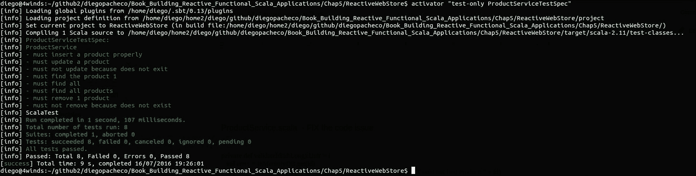

## ImageServiceTestSpec.scala - ImageService 测试

好的，现在我们可以添加`ImageService`的测试，如下所示：

```java
    class ImageServiceTestSpec extends PlaySpec { 
      "ImageService" must { 
        val service:IImageService = new ImageService 
        "insert a image properly" in { 
          val image = new models.Image(Some(1),Some(1), 
          "http://www.google.com.br/myimage") 
          service.insert(image) 
        } 
        "update a image" in { 
          val image = new models.Image(Some(2),Some(1), 
          "http://www.google.com.br/myimage") 
          service.update(1, image) 
        } 
        "not update because does not exist" in { 
          intercept[RuntimeException]{ 
            service.update(333,null) 
          } 
        } 
        "find the image1" in { 
          val image = service.findById(1) 
          image.get.id mustBe Some(1) 
          image.get.productId mustBe Some(1) 
          image.get.url mustBe "http://www.google.com.br/myimage" 
        } 
        "find all" in { 
          val reviews = service.findAll() 
          reviews.get.length mustBe 1 
          reviews.get(0).id mustBe Some(1) 
          reviews.get(0).productId mustBe Some(1) 
          reviews.get(0).url mustBe "http://www.google.com.br/myimage" 
        } 
        "remove 1 image" in { 
          val image = service.remove(1) 
          image mustBe true 
          val oldImage = service.findById(1) 
          oldImage mustBe None 
        } 
        "not remove because does not exist" in { 
          intercept[RuntimeException]{ 
            service.remove(-1) 
          } 
        } 
      } 
    } 

```

所以这些是`ImageService`的 BDD 测试。我们已经覆盖了服务上所有可用的函数。就像在`ProductService`类中一样，我们也有针对不幸场景的测试，在这些场景中我们期望发生异常。

有时候，我们需要调用多个函数来测试特定的函数或特定的测试用例。例如，在`"删除 1 张图片"`中，我们首先删除一张图片。我们的测试用例检查是否存在图片。让我们在 Activator 控制台中运行测试。

```java
$ activator "test-only ImageServiceTestSpec"

```

将获得以下结果：

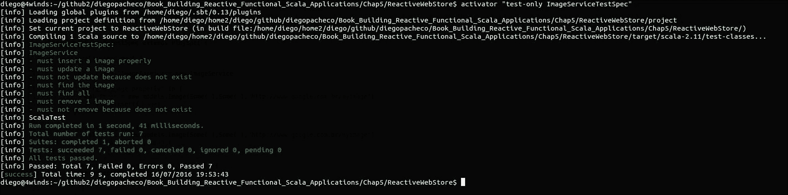

## ReviewServiceTestSpec.scala - ReviewService 测试

接下来，我们需要为审查服务添加测试。这里我们开始。

```java
    class ReviewServiceTestSpec extends PlaySpec { 
      "ReviewService" must { 
        val service:IReviewService = new ReviewService 
        "insert a review properly" in { 
          val review = new  
          models.Review(Some(1),Some(1),"diegopacheco", 
          "Testing is Cool") 
          service.insert(review) 
        } 
        "update a review" in { 
          val review = new models.Review(Some(1),Some(1), 
          "diegopacheco","Testing so so Cool") 
          service.update(1, review) 
        } 
        "not update because does not exist" in { 
          intercept[RuntimeException]{ 
            service.update(333,null) 
          } 
        } 
        "find the review 1" in { 
          val review = service.findById(1) 
          review.get.id mustBe Some(1) 
          review.get.author mustBe "diegopacheco" 
          review.get.comment mustBe "Testing so so Cool" 
          review.get.productId mustBe Some(1) 
        } 
        "find all" in { 
          val reviews = service.findAll() 
          reviews.get.length mustBe 1 
          reviews.get(0).id mustBe Some(1) 
          reviews.get(0).author mustBe "diegopacheco" 
          reviews.get(0).comment mustBe "Testing so so Cool" 
          reviews.get(0).productId mustBe Some(1) 
        } 
        "remove 1 review" in { 
          val review = service.remove(1) 
          review mustBe true 
          val oldReview= service.findById(1) 
          oldReview mustBe None 
        } 
        "not remove because does not exist" in { 
          intercept[RuntimeException]{ 
            service.remove(-1) 
          } 
        } 
      } 
    } 

```

好的，我们已经有了审查服务的测试。我们现在可以运行它们了。

```java
$ activator "test-only ReviewServiceTestSpec"

```

这里是输出结果：

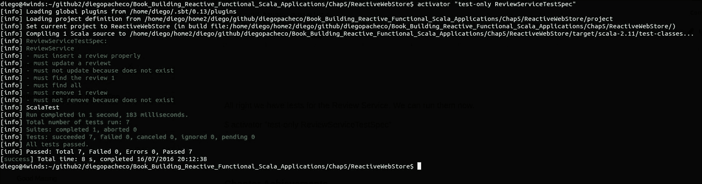

# 测试路由

Play 框架允许我们测试路由。这是好事，因为随着我们的应用程序的增长和代码的重构，我们可以 100%确信我们的路由正在正常工作。路由测试很容易与控制器测试混淆。主要区别在于，在路由测试中，我们应该测试我们是否能够到达路由，仅此而已。在路由测试之后，我们将详细介绍控制器测试。

## RoutesTestingSpec.scala - Play 框架路由测试

你的 `RoutesTestingSpec.scala` 文件应该包含以下代码：

```java
    class RoutesTestingSpec extends PlaySpec with OneAppPerTest { 
      "Root Controller" should { 
        "route to index page" in { 
          val result = route(app, FakeRequest(GET, "/")).get 
          status(result) mustBe OK 
          contentType(result) mustBe Some("text/html") 
          contentAsString(result) must include ("Welcome to Reactive  
          Web Store") 
        } 
      } 
      "Product Controller" should { 
        "route to index page" in { 
          val result = route(app, FakeRequest(GET, "/product")).get 
          status(result) mustBe OK 
          contentType(result) mustBe Some("text/html") 
          contentAsString(result) must include ("Product") 
        } 
        "route to new product page" in { 
          val result = route(app, FakeRequest(GET,  
          "/product/add")).get 
          status(result) mustBe OK 
          contentType(result) mustBe Some("text/html") 
          contentAsString(result) must include ("Product") 
        } 
        "route to product 1 details page page" in {  
          try{ 
            route(app, FakeRequest(GET, "/product/details/1")).get 
            }catch{ 
              case e:Exception => Unit 
            } 
          } 
        } 
        "Review Controller" should { 
          "route to index page" in { 
            val result = route(app, FakeRequest(GET, "/review")).get 
            status(result) mustBe OK 
            contentType(result) mustBe Some("text/html") 
            contentAsString(result) must include ("Review") 
          } 
          "route to new review page" in { 
            val result = route(app, FakeRequest(GET,  
            "/review/add")).get 
            status(result) mustBe OK 
            contentType(result) mustBe Some("text/html") 
            contentAsString(result) must include ("review") 
          } 
          "route to review 1 details page page" in { 
            try{ 
              route(app, FakeRequest(GET, "/review/details/1")).get 
            }catch{ 
              case e:Exception => Unit 
            } 
          } 
        } 
        "Image Controller" should { 
          "route to index page" in { 
            val result = route(app, FakeRequest(GET, "/image")).get 
            status(result) mustBe OK 
            contentType(result) mustBe Some("text/html") 
            contentAsString(result) must include ("Image") 
          } 
          "route to new image page" in { 
            val result = route(app, FakeRequest 
            (GET, "/image/add")).get 
            status(result) mustBe OK 
            contentType(result) mustBe Some("text/html") 
            contentAsString(result) must include ("image") 
          } 
          "route to image 1 details page page" in { 
          try{ 
            route(app, FakeRequest(GET, "/image/details/1")).get 
          }catch{ 
            case e:Exception => Unit  
          } 
        } 
      }  
    } 

```

因此，这里我们有对所有主要控制器的测试，这些控制器是根、产品、评论和图像。`RootController` 是当你访问 `http://localhost:9000` 时的主页控制器。

在 Play 框架中有一个特殊的辅助函数叫做 `route`，它帮助我们测试路由。然后我们使用 `FakeRequest` 将路径传递给路由。我们可以测试路由器将我们的请求路由到的页面的状态码和内容类型。

对于产品、图像和评论控制器，你可以看到我们正在尝试调用一个不存在的项目。这就是为什么我们有 try...catch，因为我们预计那里会发生异常。

```java
$  activator "test-only RoutesTestingSpec"

```

执行前面的命令会产生以下结果：

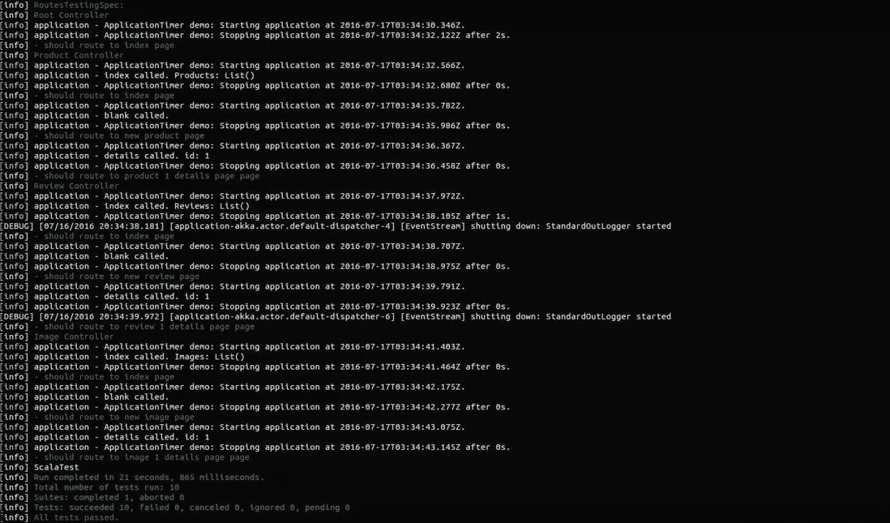

# 控制器测试

我们进行了单元测试，进行了路由测试，现在是添加控制器测试的时候了。控制器测试与路由测试类似，但它们并不相同。例如，我们的控制器总是响应 UI 页面，因此我们预计将为每个方法创建特定的 HTML 页面。Play 框架与 Selenium 集成，Selenium 是一个用于 UI 的测试框架，它允许你模拟网络浏览器，你可以做很多事情，就像一个真实用户点击页面一样。

那么，让我们开始吧。首先，我们将从 `RndDoubleGeneratorControllerTestSpec` 开始。

## RndDoubleGeneratorControllerTestSpec.scala - RndDoubleGeneratorController 测试

`RndDoubleGeneratorControllerTestSpec.scala` 文件应该包含以下代码：

```java
    class RndDoubleGeneratorControllerTestSpec 
    extends PlaySpec  
    with OneServerPerSuite with OneBrowserPerSuite with HtmlUnitFactory 
    { 
      val injector = new GuiceApplicationBuilder() 
      .injector 
      val ws:WSClient = injector.instanceOf(classOf[WSClient]) 
      import play.api.libs.concurrent.Execution. 
      Implicits.defaultContext 
      "Assuming ng-microservice is down rx number should be" must { 
        "work" in { 
          val future = ws.url(s"http://localhost:${port}/rnd/rxbat") 
          .get().map { res => res.body } 
          val response = Await.result(future, 15.seconds) 
          response mustBe "2.3000000000000007" 
        } 
      } 
    } 

```

这个类有一些有趣的东西。例如，我们使用 `GuiceApplicationBuilder` 通过 Google Guice 注入 `WSClient`。其次，我们假设我们在上一章中创建的 `ng-microservice` 已经关闭，因此我们可以预测来自回退的响应。

我们使用 `WSClient` 调用控制器，然后将响应映射回返回的正文内容作为字符串。所以这将是一个异步未来，为了获取结果，我们使用 `Await` 等待五秒钟以等待响应返回。一旦响应返回，我们确保结果是 2.3。如果结果在 15 秒内没有返回，测试将失败。运行以下命令：

```java
$ activator "test-only RndDoubleGeneratorControllerTestSpec"

```

现在，你将看到以下结果：

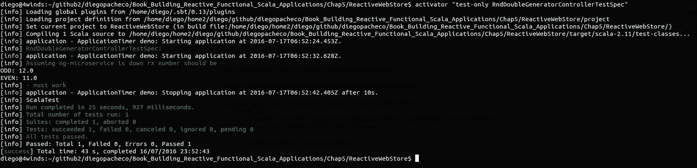

好的，现在我们已经使用 Guice 注入和 `WSClient` Play 框架库完全实现了控制器测试。现在让我们为产品、图像和评论控制器编写控制器测试。

## IntegrationSpec.scala

我们可以测试我们的主页以检查它是否正常。这是一个非常简单的测试，为接下来的测试做好准备。所以，我们开始吧。

```java
    class IntegrationSpec extends PlaySpec with OneServerPerTest with  
    OneBrowserPerTest with HtmlUnitFactory { 

      "Application" should { 
        "work from within a browser" in {  
           go to ("http://localhost:" + port) 
           pageSource must include ("Welcome to Reactive Web Store") 
        } 
      } 
    } 

```

此测试非常简单。我们只需调用主页，并检查它是否包含文本 `欢迎来到 Reactive WebStore`。让我们运行它。

```java
$ activator "test-only IntegrationSpec"

```

运行此测试后的结果显示在下图中：

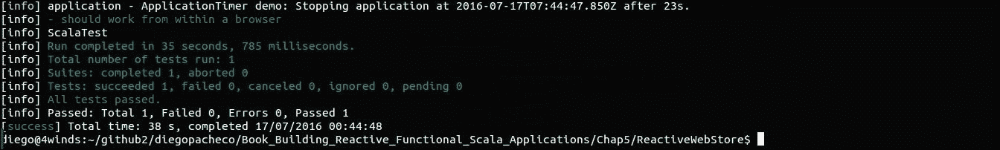

## ProductControllerTestSpec.scala

现在我们将查看产品控制器测试规范：

```java
    class ProductControllerTestSpec extends PlaySpec with 
    OneServerPerSuite with OneBrowserPerSuite with HtmlUnitFactory { 
      "ProductController" should { 
        "insert a new product should be ok" in { 
          goTo(s"http://localhost:${port}/product/add") 
          click on id("name") 
          enter("Blue Ball") 
          click on id("details") 
          enter("Blue Ball is a Awesome and simple product") 
          click on id("price") 
          enter("17.55") 
          submit() 
        } 
        "details from the product 1 should be ok" in { 
          goTo(s"http://localhost:${port}/product/details/1") 
          textField("name").value mustBe "Blue Ball" 
          textField("details").value mustBe "Blue Ball is a Awesome  
          and simple product" 
          textField("price").value mustBe "17.55" 
        } 
        "update product 1 should be ok" in { 
          goTo(s"http://localhost:${port}/product/details/1") 
          textField("name").value = "Blue Ball 2" 
          textField("details").value = "Blue Ball is a Awesome and  
          simple product 2 " 
          textField("price").value = "17.66" 
          submit() 
          goTo(s"http://localhost:${port}/product/details/1") 
          textField("name").value mustBe "Blue Ball 2" 
          textField("details").value mustBe "Blue Ball is a Awesome  
          and simple product 2 " 
          textField("price").value mustBe "17.66" 
        } 
        "delete a product should be ok" in { 
          goTo(s"http://localhost:${port}/product/add") 
          click on id("name") 
          enter("Blue Ball") 
          click on id("details") 
          enter("Blue Ball is a Awesome and simple product") 
          click on id("price") 
          enter("17.55") 
          submit() 
          goTo(s"http://localhost:${port}/product") 
          click on id("btnDelete") 
        } 
      } 
    } 

```

因此，对于产品控制器，我们使用 Selenium Play 框架的支持模拟一个网络浏览器。我们测试基本控制器功能，如插入新产品、特定产品的详细信息以及更新和删除产品。

对于插入，我们使用 `goTo` 转到新产品表单。我们使用 `$port` 作为变量。我们这样做是因为 Play 框架将为我们启动应用程序，但我们不知道它在哪个端口。因此，我们需要使用这个变量来访问产品控制器。

然后，我们使用 `click` 函数点击每个文本字段，并使用 `enter` 函数输入值。填写完整个表单后，我们使用 `submit` 函数提交。

对于详情，我们只需转到产品详情页面，并检查文本字段是否具有我们期望的值。我们使用 `textField.value` 函数来做这件事。

为了检查产品更新功能，我们首先需要更新产品定义，然后进入详情查看我们更改的值是否在那里。

最后，我们测试 `delete` 函数。对于此函数，我们需要点击一个按钮。我们需要设置按钮的 ID 以使其工作。我们需要在我们的 UI 中进行一些小的重构以使 ID 存在。

## product_index.scala.html

您的 `product_index.scala.html` 文件应包含以下代码：

```java
    @(products:Seq[Product])(implicit flash: Flash) 
    @main("Products") { 
      @if(!products.isEmpty) { 
        <table class="table table-striped"> 
          <tr> 
            <th>Name</th> 
            <th>Details</th>  
            <th>Price</th> 
            <th></th> 
          </tr> 
          @for(product <- products) { 
            <tr> 
              <td><a href="@routes.ProductController.details 
              (product.id.get)">@product.name</a></td> 
              <td>@product.details</td> 
              <td>@product.price</td> 
              <td><form method="post" action= 
              "@routes.ProductController.remove(product.id.get)"> 
                <button id="btnDelete" name="btnDelete" class="btn  
                btn-link" type="submit"><i class="icon- 
                trash"></i>Delete</button> 
              </form></td>  
            </tr> 
          } 
        </table> 
      } 
      <p><a href="@routes.ProductController.blank"  
      class="btn btn-success"><i class="icon-plus icon-white"> 
      </i>Add Product</a></p> 
    } 

```

一切准备就绪。现在我们可以使用控制台在我们的 Activators 上运行我们的测试。

```java
$ activator "test-only ProductControllerTestSpec"

```

以下命令显示了以下截图中的结果：

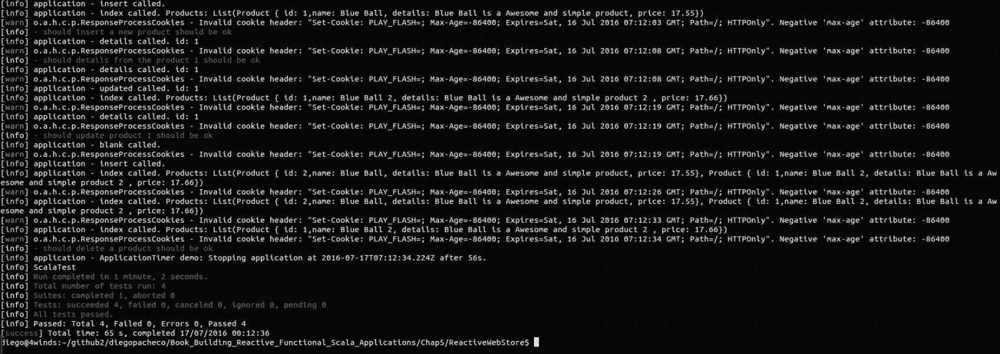

由于此测试实际运行应用程序并模拟网络浏览器调用控制器，此测试可能需要一些时间。现在是我们转向 `ImageController` 测试的时候了。

## ImageControllerTestSpec.scala

您的 `product_index.scala.html` 应包含以下代码：

```java
    class ImageControllerTestSpec extends PlaySpec with OneServerPerSuite with OneBrowserPerSuite with 
    HtmlUnitFactory { 
      "ImageController" should { 
        "insert a new image should be ok" in { 
          goTo(s"http://localhost:${port}/product/add") 
          click on id("name") 
          enter("Blue Ball") 
          click on id("details") 
          enter("Blue Ball is a Awesome and simple product") 
          click on id("price") 
          enter("17.55") 
          submit() 
          goTo(s"http://localhost:${port}/image/add") 
          singleSel("productId").value = "1" 
          click on id("url") 
          enter("http://myimage.com/img.jpg") 
          submit() 
        } 
        "details from the image 1 should be ok" in { 
          goTo(s"http://localhost:${port}/image/details/1") 
          textField("url").value mustBe "http://myimage.com/img.jpg" 
        } 
        "update image 1 should be ok" in { 
          goTo(s"http://localhost:${port}/image/details/1") 
          textField("url").value = "http://myimage.com/img2.jpg" 
          submit() 
          goTo(s"http://localhost:${port}/image/details/1") 
          textField("url").value mustBe "http://myimage.com/img2.jpg" 
        } 
        "delete a image should be ok" in { 
          goTo(s"http://localhost:${port}/image/add") 
          singleSel("productId").value = "1" 
          click on id("url") 
          enter("http://myimage.com/img.jpg") 
          submit() 
          goTo(s"http://localhost:${port}/image") 
          click on id("btnDelete") 
        } 
      } 
    } 

```

首先，我们需要转到产品控制器以插入一个产品；否则，我们无法进行图像操作，因为它们都需要产品 ID。

## image_index.scala.html

您的 `image_index.scala.html` 文件应包含以下代码：

```java
    @(images:Seq[Image])(implicit flash:Flash) 
    @main("Images") { 
      @if(!images.isEmpty) { 
        <table class="table table-striped"> 
          <tr> 
            <th>ProductID</th> 
            <th>URL</th> 
            <th></th> 
          </tr> 
          @for(image <- images) { 
            <tr> 
              <td><a href="@routes.ImageController.details 
              (image.id.get)">@image.id</a></td> 
              <td>@image.productId</td> 
              <td>@image.url</td> 
              <td><form method="post" action= 
              "@routes.ImageController.remove(image.id.get)"> 
                <button id="btnDelete" name="btnDelete" class="btn  
                btn-link" type="submit"><i class="icon- 
                trash"></i>Delete</button></form> 
              </td> 
            </tr> 
          } 
        </table> 
      } 
      <p><a href="@routes.ImageController.blank"  
      class="btn btn-success"><i class="icon-plus icon-white"> 
      </i>Add Image</a></p> 
    } 

```

一切准备就绪。现在我们可以运行 `ImageController` 测试。

```java
$ activator "test-only ImageControllerTestSpec"

```

结果显示在下图中：

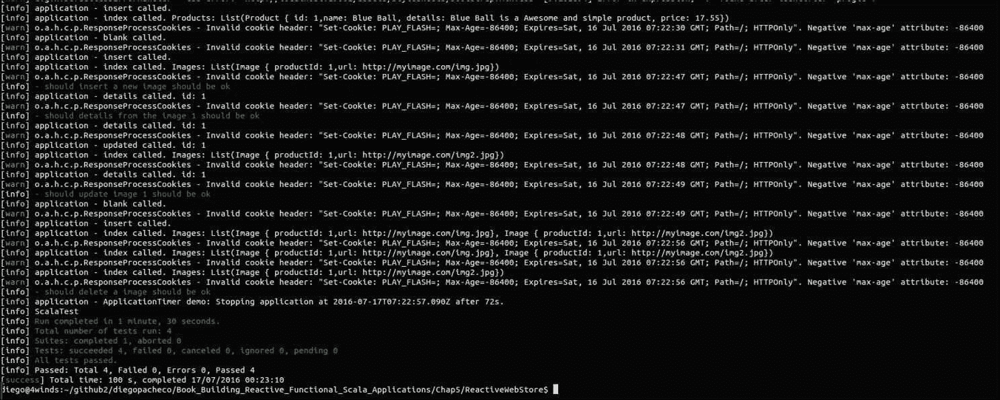

`ImageController` 已通过所有测试。现在我们将转向 `ReviewController` 测试。

## ReviewControllerTestSpec.scala

您的 `ReviewControllerTestSpec.scala` 文件应包含以下代码：

```java
    class ReviewControllerTestSpec extends PlaySpec with OneServerPerSuite with OneBrowserPerSuite 
    with HtmlUnitFactory { 
      "ReviewController" should { 
        "insert a new review should be ok" in { 
          goTo(s"http://localhost:${port}/product/add") 
          click on id("name") 
          enter("Blue Ball") 
          click on id("details") 
          enter("Blue Ball is a Awesome and simple product") 
          click on id("price") 
          enter("17.55") 
          submit() 
          goTo(s"http://localhost:${port}/review/add") 
          singleSel("productId").value = "1" 
          click on id("author") 
          enter("diegopacheco") 
          click on id("comment") 
          enter("Tests are amazing!") 
          submit() 
        } 
        "details from the review 1 should be ok" in { 
          goTo(s"http://localhost:${port}/review/details/1") 
          textField("author").value mustBe "diegopacheco" 
          textField("comment").value mustBe "Tests are amazing!" 
        } 
        "update review 1 should be ok" in { 
          goTo(s"http://localhost:${port}/review/details/1") 
          textField("author").value = "diegopacheco2" 
          textField("comment").value = "Tests are amazing 2!" 
          submit() 
          goTo(s"http://localhost:${port}/review/details/1") 
          textField("author").value mustBe "diegopacheco2" 
          textField("comment").value mustBe "Tests are amazing 2!" 
        } 
        "delete a review should be ok" in { 
          goTo(s"http://localhost:${port}/review/add") 
          singleSel("productId").value = "1" 
          click on id("author") 
          enter("diegopacheco") 
          click on id("comment") 
          enter("Tests are amazing!") 
          submit() 
          goTo(s"http://localhost:${port}/review") 
          click on id("btnDelete") 
          } 
    } 

```

首先，我们需要转到产品控制器以插入一个产品；否则，我们无法进行图像操作，因为它们都需要产品 ID。

对于插入，我们使用 `goto` 转到新产品表单。我们使用 `$port` 作为变量。我们这样做是因为 Play 框架会为我们启动应用程序，但我们不知道在哪个端口，因此我们需要使用这个变量来访问产品控制器。

然后我们使用 `click` 函数点击每个文本字段，并使用 `enter` 函数输入值。填写完整个表单后，我们使用 `submit` 函数提交它。

详细信息，我们只需转到产品详情页面，检查文本字段是否有我们期望的值。我们使用 `textField.value` 函数来完成这个操作。

为了检查产品更新功能，我们首先需要更新产品定义，然后转到详情页面查看我们更改的值是否在那里。

最后，我们测试 `delete` 函数。对于这个函数，我们需要点击一个按钮。我们需要设置按钮的 ID 以使其工作。然后我们在 UI 中进行一些小的重构，以便在那里设置 ID。

## review_index.scala.html

您的 `review_index.scala.html` 文件应包含以下代码：

```java
    @(reviews:Seq[Review])(implicit flash: Flash) 
    @main("Reviews") { 
      @if(!reviews.isEmpty) { 
        <table class="table table-striped"> 
          <tr> 
            <th>ProductId</th> 
            <th>Author</th> 
            <th>Comment</th> 
            <th></th> 
          </tr> 
          @for(review <- reviews) { 
            <tr> 
              <td><a href="@routes.ReviewController. 
              details(review.id.get)">@review.productId</a></td> 
              <td>@review.author</td> 
              <td>@review.comment</td> 
              <td> 
                <form method="post" action="@routes. 
                ReviewController.remove(review.id.get)"> 
                  <button id="btnDelete" name="btnDelete"  
                  class="btn btn-link" type="submit"><i class="icon- 
                  trash"></i>Delete</button> 
                </form> 
              </td> 
            </tr> 
          } 
        </table> 
      } 
      <p><a href="@routes.ReviewController.blank" class="btn btn- 
      success"><i class="icon-plus icon-white"></i>Add Review</a></p> 
    } 

```

最后，我们可以在控制台运行测试。

```java
$ activator "test-only ReviewControllerTestSpec"

```

测试将显示以下输出：

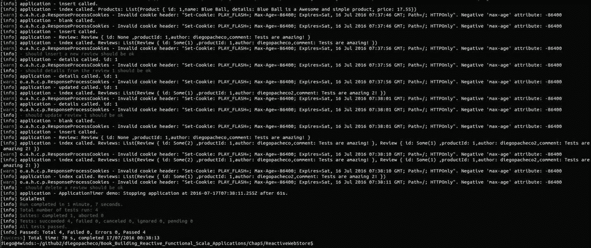

好的，`ReviewController` 已经通过了我们所有的测试。

将测试按类型分开是一个非常好的实践。然而，如果您愿意，您可以将所有测试，如单元测试、控制器测试和路由测试混合在一个单独的文件中。

## ApplicationSpec.scala

您的 `ApplicationSpec.scala` 应包含以下代码：

```java
    class ApplicationSpec extends PlaySpec with OneAppPerTest { 
      "Routes" should { 
        "send 404 on a bad request" in { 
          route(app, FakeRequest(GET, "/boum")).map(status(_)) mustBe  
          Some(NOT_FOUND) 
        } 
      } 
      "HomeController" should { 
        "render the index page" in { 
          val home = route(app, FakeRequest(GET, "/")).get 
          status(home) mustBe OK 
          contentType(home) mustBe Some("text/html") 
          contentAsString(home) must include ("Welcome to Reactive Web  
          Store") 
        } 
      } 
      "RndController" should { 
        "return a random number" in { 
          // Assuming ng-microservice is down otherwise will fail. 
          contentAsString(route(app, FakeRequest(GET,  
          "/rnd/rxbat")).get) mustBe "2.3000000000000007" 
        } 
      } 
    } 

```

我们可以运行这些混合测试，并且它们都会通过。

```java
$ activator "test-only ApplicationSpec"

```

您将看到以下结果：

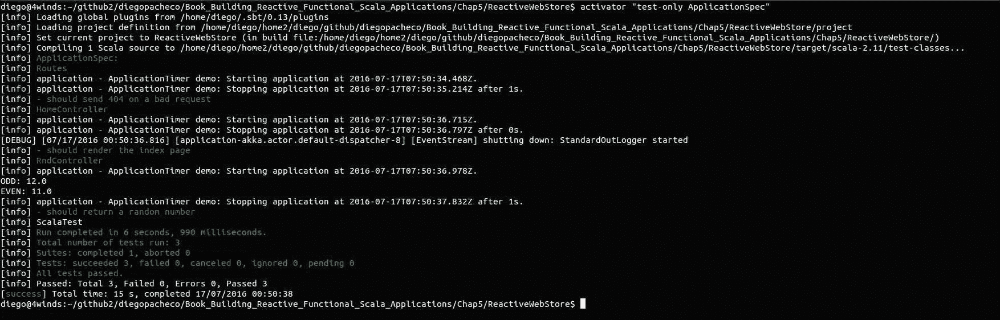

好的，我们几乎完成了。我们只需为名为 `ng-microservice` 的微服务添加一些测试，我们在 第四章 *开发响应式后端服务* 中创建了它。

## NGServiceImplTestSpec.scala

您的 NGServiceImplTestSpec.scala 文件应包含以下代码：

```java
    class NGServiceImplTestSpec extends PlaySpec { 
      "The NGServiceImpl" must { 
        "Generate a Ramdon number" in { 
          val service:NGContract = new NGServiceImpl 
          val double = service.generateDouble 
          assert( double >= 1 ) 
        } 
        "Generate a list of 3 Ramdon numbers" in { 
          val service:NGContract = new NGServiceImpl 
          val doubles = service.generateDoubleBatch(3) 
          doubles.size mustBe 3 
          assert( doubles(0) >= 1 ) 
          assert( doubles(1) >= 1 ) 
          assert( doubles(2) >= 1 ) 
        } 
      } 
    } 

```

因此，在前面代码中，我们有两种方法来测试我们微服务中的两个操作。首先我们生成一个双精度浮点数，然后请求三个双精度浮点数的列表。如您所见，我们只是检查是否从服务中得到了一个正的双精度浮点数，就这样。由于结果不可预测，这是一种很好的测试方式。有时，即使结果可预测，您也想进行这样的测试。为什么？因为这使测试更可靠，而且通常，当我们使用太多的硬编码值时，这些值可能会改变并破坏我们的测试，这可不是什么好事。让我们在控制台运行它。

```java
$  activator "test-only NGServiceImplTestSpec"

```

这里是我们得到的结果：

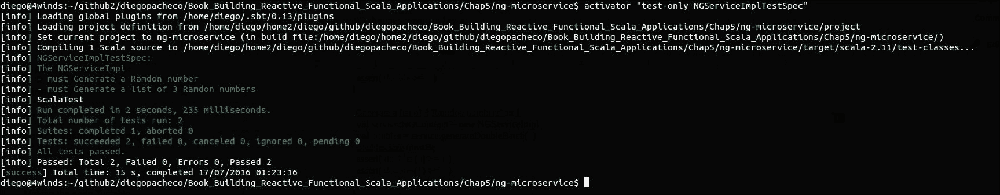

现在，让我们转到控制器，做一些控制器测试。

## NGServiceEndpointControllerTest.scala

您的 `NGServiceEndpointControllerTest.scala` 文件应包含以下代码：

```java
    class NGServiceEndpointControllerTest extends PlaySpec with OneServerPerSuite with 
    OneBrowserPerSuite with HtmlUnitFactory { 
      val injector = new GuiceApplicationBuilder() 
      .injector 
      val ws:WSClient = injector.instanceOf(classOf[WSClient]) 
      import play.api.libs.concurrent.Execution. 
      Implicits.defaultContext 
      "NGServiceEndpointController" must { 
        "return a single double" in { 
          val future = ws.url(s"http://localhost:${port}/double") 
          .get().map { res => res.body } 
          val response = Await.result(future, 15.seconds) 
          response must not be empty 
          assert( new java.lang.Double(response) >= 1 ) 
        } 
        "return a list of 3 doubles" in { 
          val future = ws.url(s"http://localhost:${port}/doubles/3") 
          .get().map { res => res.body } 
          val response = Await.result(future, 15.seconds) 
          response must (not be empty and include ("[") and  
          include ("]")) 
        } 
      } 
    } 

```

在这里，我们必须注入 `WSClient` 库，这样我们就可以调用控制器。这个控制器有两个方法，就像我们之前测试的服务一样。第二个方法返回一个 JSON 结构。然后我们检查 `"["和 "]"`，以确保数组存在，因为这是一个包含三个数字的列表。

我们使用 assert 函数来检查来自控制器的响应，并且要确保一切正常。让我们运行它。

```java
$ activator "test-only NGServiceEndpointControllerTest"

```

参考以下截图查看测试结果：

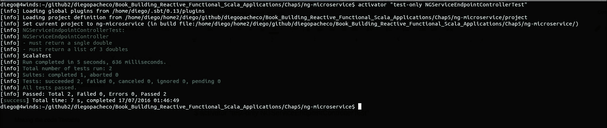

太好了！我们几乎涵盖了所有内容。

在本章中，我们运行了各种各样的测试。我们总是使用命令 `$ activator "test-only xxx"`；这样做的原因是为了节省时间。然而，运行所有测试是非常常见的。你可以在两个项目中都这样做；我们只需要输入 `$ activator test`。

当运行 `ng-microservice` 项目的所有测试时，我们得到以下截图所示的成果：

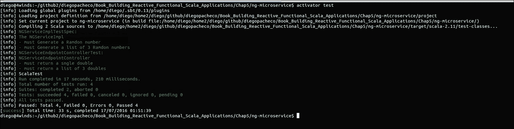

另一方面，运行 `ReactiveWebStore` 项目的所有测试会得到下一张截图所示的成果：

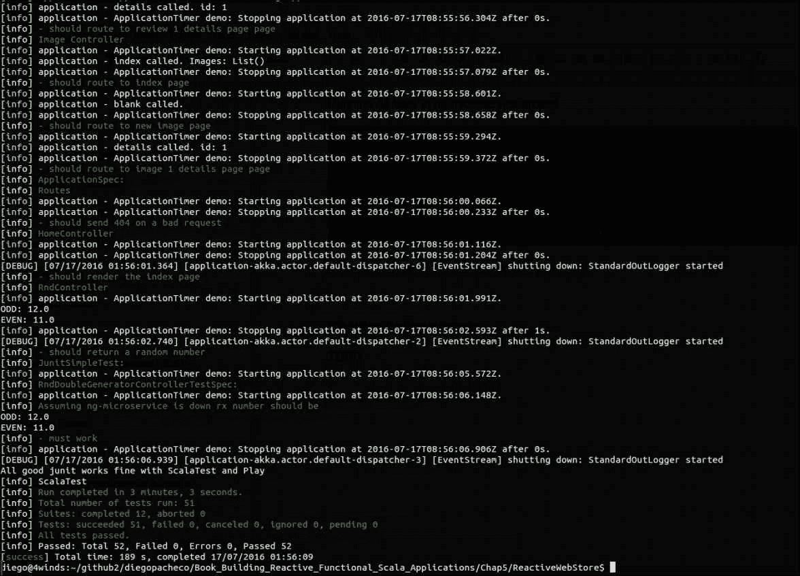

# 摘要

在本章中，你学习了如何进行测试。我们为你的 Scala 和 Play 框架项目添加了几个测试。你还了解了单元测试原则、使用 JUnit 测试 Scala 应用程序、BDD 原则、使用 `ScalaTest` 进行测试、使用 `ScalaTest` 测试 Play 框架应用程序，以及在 Activator / SBT 中运行测试。

在下一章中，你将学习如何使用响应式的 Slick 来了解更多关于持久性的知识。我们还将稍微修改一下测试，以便与数据库一起工作。
