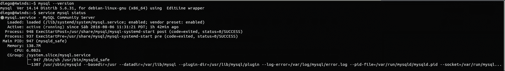
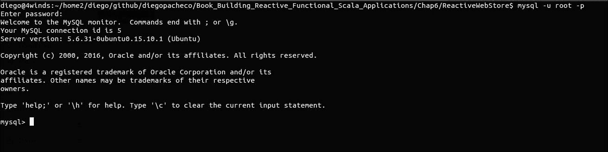
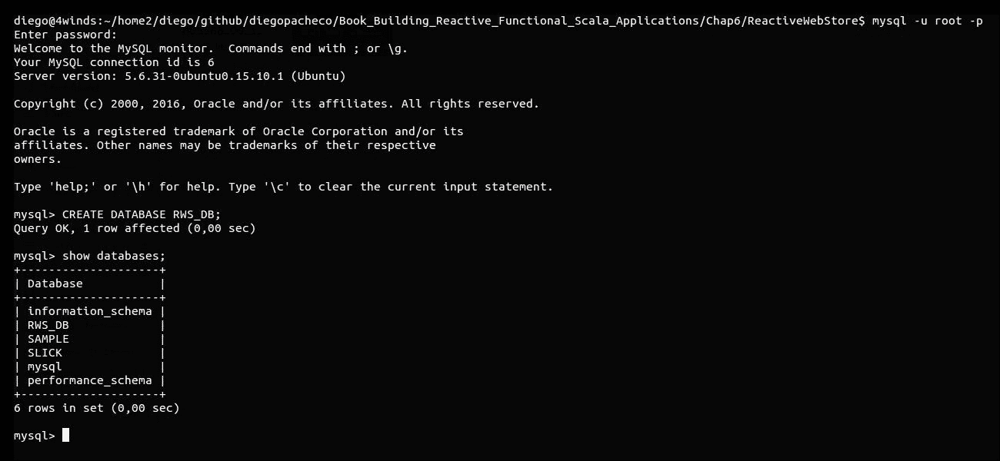
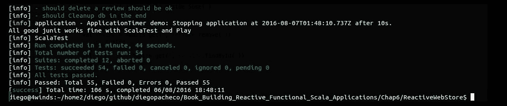
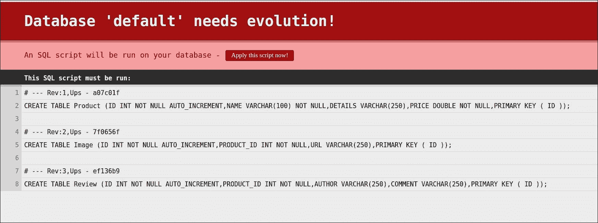
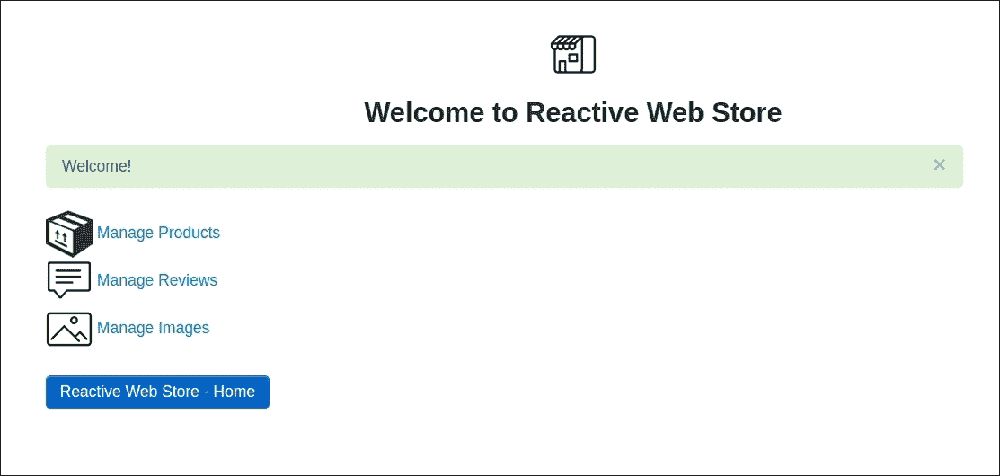

# 第六章. 使用 Slick 的持续改进

在前面的章节中，你学习了如何使用 Activator 启动你的应用程序，我们使用 Scala 和 Play 框架开发了我们的 Web 应用程序，并使用 RxScala 添加了响应式微服务调用以进行数据流计算。我们使用 BDD 和 Play 框架进行了单元测试和控制器测试。

在本章中，你将学习如何实现关系型数据库持久化。到目前为止，我们的应用程序已经运行起来。然而，我们正在使用 HashMap 进行内存持久化。现在我们将升级我们的应用程序以使用适当的持久化。为了实现这一点，我们将使用一个名为 Slick 的响应式数据库持久化框架。

在本章中，我们将涵盖以下主题：

+   使用 Slick 进行数据库持久化的原则

+   在我们的应用程序中处理功能关系映射

+   使用 SQL 支持创建查询

+   使用异步数据库操作改进代码

我们将在我们的应用程序中进行一些重构。逐步地，我们将创建所有必要的表和持久化类，以便 Slick 能够与我们的 Play 框架应用程序一起工作。测试也将进行重构，以便测试应用程序逻辑，并跳过数据库持久化部分。

# 介绍 Slick 框架

**Scala 语言集成连接套件**（**Slick**）是一个 Scala 现代框架，它允许使用与 Scala 集合非常相似的抽象来处理数据。你可以使用 SQL 和 Scala 代码编写数据库查询。用 Scala 代码代替 SQL 更好，因为我们利用了编译器，因此这种方法更不容易出错。此外，代码的维护也变得更简单，因为编译器会帮助你指出代码出错的地方，如果发生这种情况。

Slick 是一个**功能关系映射**（**FRM**）库。那些来自 Java 背景并且熟悉 Hibernate 等**对象关系映射**（**ORM**）框架的人会发现 Slick 有类似的概念。基本上，你创建一个 Scala 类，该类将明确映射到一个关系型表。Slick FRM 理念受到了微软的 LINQ 框架的启发。

Slick 在设计上就是反应式的，并且使用异步非阻塞 I/O 模型工作。使用 Slick，你将拥有以下优势：

+   **弹性**：一个常见问题是数据库和应用程序的负载过重会创建更多的线程，从而使情况变得更糟。Slick 可以解决这个问题，因为它在数据库中排队等待数据库操作。

+   **高效资源利用**：Slick 可以根据活动作业和挂起的数据库会话的数量进行并行调整。Slick 还有清晰的 I/O 和 CPU 密集型代码之间的界限。

# MySQL 设置

我们将使用 Slick 和 MySQL 5.6。然而，Slick 支持其他关系型数据库，如 Oracle、SQL Server、DB2 和 Postgres。首先，我们需要在我们的机器上安装 MySQL。打开控制台，执行以下步骤（对于 Ubuntu Linux、其他操作系统（Windows/Mac）和发行版，请参阅[`dev.mysql.com/downloads/mysql/`](http://dev.mysql.com/downloads/mysql/)）：

```java
$ sudo apt-get install mysql-server -y
$ mysql --version
$ service mysql status

```

在使用`apt-get`安装后，当你运行其他两个命令时，你应该看到如下输出：



MySQL 安装

安装完成后，MySQL 服务器启动并运行，我们可以继续创建数据库。为了实现这一点，我们需要打开 MySQL 控制台。出于开发目的，我没有为 root 用户设置密码。然而，对于生产环境，强烈建议您使用强密码。

执行以下命令：

```java
$ mysql -u root -p

```

这将给出以下输出：



MySQL 控制台

一旦进入 MySQL 控制台，你就可以创建数据库。我们将使用以下命令创建一个名为`RWS_DB`的数据库：

```java
$ CREATE DATABASE RWS_DB; 

```

你将看到以下结果：



你可以输入`$ SHOW DATABASES;`来获取 MySQL 中所有可用数据库的列表。一切准备就绪，我们的数据库已经启动并运行。

# 在我们的 Play 框架应用程序中配置 Slick

首先，我们需要向`build.sbt`文件中添加依赖项。我们需要移除或注释掉名为`JDBC`的库，并添加`play-slick`库和 MySQL Java 驱动。

这可以这样完成：

```java
    name := """ReactiveWebStore""" 
    version := "1.0-SNAPSHOT" 
    lazy val root = (project in file(".")).enablePlugins(PlayScala) 
    scalaVersion := "2.11.7" 
    libraryDependencies ++= Seq(   //jdbc, 
      cache, 
      ws, 
      "org.scalatestplus.play" %% "scalatestplus-play" % "1.5.1" %  
      Test, 
      "com.netflix.rxjava" % "rxjava-scala" % "0.20.7", 
      "com.typesafe.play" %% "play-slick" % "2.0.0", 
      "com.typesafe.play" %% "play-slick-evolutions" % "2.0.0", 
      "mysql" % "mysql-connector-java" % "6.0.3" 
    ) 
    resolvers += "scalaz-bintray" at "http://dl.bintray.com/scalaz/releases" 
    resolvers += DefaultMavenRepository 

```

如前述代码所示，我们注释掉了`JDBC`库，并添加了三个新的依赖项：

```java
    "com.typesafe.play" %% "play-slick" % "2.0.0", 
    "com.typesafe.play" %% "play-slick-evolutions" % "2.0.0", 
    "mysql" % "mysql-connector-java" % "6.0.3" 

```

你可以进入控制台并运行命令`$ activator`、`$ reload`和`$ compile`，以便让 SBT 下载所有新的依赖项。

## 配置数据库连接

Slick 需要配置以访问我们创建的 MySQL 数据库。在`ReactiveWebStore/conf`文件夹下，我们需要编辑`application.conf`文件，并添加以下数据库连接 URL 和设置：

```java
    # Default database configuration 
    slick.dbs.default.driver="slick.driver.MySQLDriver$" 
    slick.dbs.default.db.driver="com.mysql.cj.jdbc.Driver" 
    slick.dbs.default.db.url="jdbc:mysql://127.0.0.1:3306/RWS_DB?
    useUnicode=true&useJDBCCompliantTimezoneShift=
    true&useLegacyDatetimeCode=false&serverTimezone=UTC" 
    slick.dbs.default.db.user="root" 
    slick.dbs.default.db.password="" 

```

# FPM 映射

下一步是在`ReactiveWebStore/app`下的 Scala 代码和 MySQL 表之间创建 FPM 映射，我们将在`dao`下创建一个新的包。DAO 代表**数据库访问对象**（**DAO**），这是一个众所周知的面向对象模式。因此，我们将在这里创建一些 DAO 类。首先，我们将定义一个基特质，它将为每个`dao`包定义行为和代码能力。

我们将从`BaseDao.scala`开始：

```java
    package dao 
    import slick.lifted.TableQuery 
    import scala.concurrent.Future 
    /** 
    * Defines base dao structure every dao should have. 
    */ 
    trait BaseDao[T] { 
      def toTable():TableQuery[_]   
      def findAll():Future[Seq[T]] 
      def remove(id:Long):Future[Int] 
      def insert(o:T):Future[Unit] 
      def update(o:T):Future[Unit] 
      def findById(id:Long):Future[Option[T]] 
    } 

```

我们将拥有三个`dao`包：`ProductDao`、`ImageDao`和`ReviewDao`。每个`dao`都将能够执行操作，但针对不同的 MySQL 表。根据我们刚刚定义的特质，我们将能够执行以下操作：

+   **查找所有**：查找特定表中的所有数据

+   **删除**：通过 ID 删除表中的项

+   **插入**：向表中添加新数据

+   **更新**：更新表中的数据

+   **通过 ID 查找**：通过 ID 获取表中的特定记录

+   **toTable**: 返回该 `dao` 的表 FRM 映射。

## ProductDao

我们将从查看 `ProductDao.scala` 开始：

```java
    package dao 
    trait IProductDao extends BaseDao[Product]{ 
      def findAll(): Future[Seq[Product]] 
      def findById(id:Long): Future[Option[Product]] 
      def remove(id:Long): Future[Int] 
      def insert(p:Product): Future[Unit] 
      def update(p2:Product): Future[Unit] 
    } 
    class ProductDao @Inject() (protected val dbConfigProvider: DatabaseConfigProvider)  
    extends  
    HasDatabaseConfigProvider[JdbcProfile] with IProductDao { 
      import driver.api._   
      class ProductTable(tag: Tag) extends TableProduct { 
        def id = column[Option[Long]]("ID", O.PrimaryKey) 
        def name = columnString 
        def details = columnString 
        def price = columnBigDecimal 
        def * = (id, name, details, price) <> (Product.tupled,  
        Product.unapply _) 
      } 
      override def toTable = TableQuery[ProductTable] 
      private val Products = toTable() 
      override def findAll(): Future[Seq[Product]] =  
      db.run(Products.result)  
      override def findById(id:Long): Future[Option[Product]] =  
      db.run(Products.filter( _.id === id).result.headOption) 
      override def remove(id:Long): Future[Int] =  
      db.run(Products.filter( _.id === id).delete)  
      override def insert(p:Product): Future[Unit] = db.run(Products    
      += p).map { _ => () } 
      override def update(p2:Product) = Future[Unit] { 
        db.run( 
          Products.filter(_.id === p2.id) 
          .map(p => (p.name,p.details, p.price)) 
          .update((p2.name,p2.details,p2.price)) 
        ) 
      } 
    } 

```

这是 `Product` 的 `dao` 实现。这里有很多新的概念，所以让我们一步一步地看看每个步骤。正如你所看到的，有一个名为 `IProductDao` 的特质，它通过泛型从 `BaseDao` 扩展，以指定模型 `Product`。

这个特质对于使用 Guice 进行依赖注入非常重要。对于每个模型，我们将有两个 `dao` 实现：一个使用 Slick 和 MySQL，另一个使用我们之前的 `inMemory` 数据库进行测试。

那里有一个名为 `ProductDao` 的类，它是使用 Slick 的 `dao` 实现。我们需要 Guice 注入一个类，称为 `DatabaseConfigProvider`，它将用于执行数据库操作。`ProductDao` 还需要扩展 `HasDatabaseConfigProvider[JdbcProfile]` 以与数据库一起工作。

我们还需要通过以下命令导入 `driver` api：

```java
Import driver.api._

```

下一步是使用名为 `ProductTable` 的类创建 FRM 映射，它扩展了表，传递了模型，在我们的例子中是一个产品。你还需要宣布 MySQL 表的名称。为了获取表名，我们使用一个伴随对象，我们需要在我们的模型周围创建它。我们这样做是为了避免在所有地方重复 MySQL 表名。

在 `ProductTable` 表中，你可以看到一些函数，如 `id`、`name`、`price` 和 `details`。这些都是 `model.Product` 字段的准确名称。然而，我们必须在右侧添加到 MySQL 表的映射。我们使用一个名为 `column` 的函数来完成，我们传递类型和确切的 MySQL 字段名称。

最后，我们需要运行一个特殊的投影函数 `*` 来传递模型上的所有字段，这些字段被映射到关系数据库中。

现在，我们可以转向 `dao` 操作。正如你所看到的，所有函数都使用 `db.run` 来执行数据访问。这很好，因为，正如你所意识到的，它们返回一个 Future，所以 `dao` 不会阻塞，你可以做其他事情，例如，更多的数据库操作，预优化和验证。

一旦我们有了 `ProductTable` 表，我们可以使用它创建一个 Slick `TableQuery` 来执行数据库操作，就像它们是 Scala 函数一样。为了列出所有可用的产品，我们只需使用这个命令：

```java
db.run(Products.result)

```

就这么简单。这段代码将返回一个 `Future [Seq[Products]]`。我们也可以通过 ID 进行过滤：

```java
db.run(Products.filter( _.id === id).result.headOption)

```

因此，`first _.id` 是数据库中的 `id`，而 `id` 是通过参数传入的。在获取结果后，你可以看到我们调用了另一个名为 `headOption` 的函数，确保我们得到的结果是一个选项。这是一个值得信赖的模式，因为数据可能不在表中，我们避免了得到 `NoSuchElementException`。

移除产品也是相当简单的。我们只需使用以下方法：

```java
db.run(Products.filter( _.id === id).delete)

```

上述代码返回 `Future[Int]`，计算被删除的项目数量。如果记录 ID 在数据库中找不到，结果将是 `0`。我们期望它总是 `1`，因为我们将要按 ID 删除。然而，API 是通用的，如果你比如说按名称或其他字段删除，可能会有多个删除。这就是为什么它是一个 `Int` 而不是一个布尔值。

插入数据也很简单；我们只需给出以下命令：

```java
db.run(Products += p).map { _ => () }

```

如您所见，这是一个非常简单的 `map` 函数，就像我们向列表中添加一个元素一样。此代码返回 `unit`，这意味着没有返回值。然而，我们仍然有一个 Future，所以这段代码不是阻塞的。

要执行更新操作，代码稍微多一点，但最终仍然很简单。

```java
    db.run( 
      Products.filter(_.id === p2.id) 
      .map(p => (p.name,p.details, p.price)) 
      .update((p2.name,p2.details,p2.price)) 
    ) 

```

首先，我们需要应用一个过滤器来选择我们将要更新的记录。我们传递 ID，因为我们只想更新单个记录。然后我们需要应用一个 `map` 函数来选择我们想要更新的字段；最后，我们执行更新，将新值传递给 `update` 函数。

让我们看看产品模型的伴生对象。

下面是 `Models.Product.scala` 的代码：

```java
    object ProductDef{ 
      def toTable:String = "Product" 
    } 

```

如您所见，这是一个简单的辅助伴生对象，用于存储 MySQL 表名。

## ReviewDAO

我们已经完成了 `ProductDao`，现在我们需要转向评论模型并创建评论的 `dao`。我们将执行与产品类似的步骤。

`ReviewDao.scala` 的代码如下：

```java
    package dao 
    trait IReviewDao extends BaseDao[Review]{ 
      def findAll(): Future[Seq[Review]] 
      def findById(id:Long): Future[Option[Review]] 
      def remove(id:Long): Future[Int] 
      def insert(p:Review): Future[Unit] 
      def update(p2:Review): Future[Unit] 
    } 
    class ReviewDao @Inject() (protected val dbConfigProvider: DatabaseConfigProvider)  
    extends HasDatabaseConfigProvider[JdbcProfile] with IReviewDao { 
      import driver.api._ 
      class ReviewTable(tag: Tag) extends TableReview { 
        def id = column[Option[Long]]("ID", O.PrimaryKey)   
        def productId = column[Option[Long]]("PRODUCT_ID") 
        def author = columnString 
        def comment = columnString 
        def * = (id, productId, author,comment) <> (Review.tupled,  
        Review.unapply _) 
      } 
      override def toTable = TableQuery[ReviewTable] 
      private val Reviews = toTable() 
      override def findAll(): Future[Seq[Review]] =  
      db.run(Reviews.result)  
      override def findById(id:Long): Future[Option[Review]] =  
      db.run(Reviews.filter( _.id === id).result.headOption) 
      override def remove(id:Long): Future[Int] =  
      db.run(Reviews.filter( _.id === id).delete) 
      override def insert(r:Review): Future[Unit] =  
      db.run(Reviews += r).map { _ => () } 
      override def update(r2:Review) = Future[Unit] { 
        db.run( 
          Reviews.filter(_.id === r2.id) 
          .map(i => (i.productId,i.author, i.comment)) 
          .update((r2.productId,r2.author,r2.comment)) 
        ) 
      } 
    } 

```

在前面的代码中，我们有我们在 `ProductDao` 中看到的元素。有一个名为 `dao` 的接口，称为 `IReviewDao`，它使用评论模型扩展了 `BaseDao`。我们有 `ReviewDao` 实现，使用 `ReviewTable` FRM 映射。我们还有一个评论模型的伴生对象。

`Review.scala` 的代码如下：

```java
    object ReviewDef{ 
      def toTable:String = "Review" 
    } 

```

## ImageDao

现在我们需要转向我们的最后一个 `dao`，`ImageDao`。像 `ProductDao` 和 `ReviewDao` 一样，我们将通过实现过程来探讨相同的思想和概念。

我们现在将查看 `ImageDao.scala`：

```java
    package dao 
    trait IImageDao extends BaseDao[Image]{ 
      def findAll(): Future[Seq[Image]] 
      def findById(id:Long): Future[Option[Image]] 
      def remove(id:Long): Future[Int] 
      def insert(p:Image): Future[Unit] 
      def update(p2:Image): Future[Unit] 
    } 
    class ImageDao @Inject() (protected val dbConfigProvider: DatabaseConfigProvider)  
    extends    
    HasDatabaseConfigProvider[JdbcProfile]  
    with IImageDao { 
      import driver.api._ 
      class ImageTable(tag: Tag) extends TableImage {  
        def id = column[Option[Long]]("ID", O.PrimaryKey) 
        def productId = column[Option[Long]]("PRODUCT_ID")  
        def url = columnString 
        def * = (id, productId, url) <> (Image.tupled, Image.unapply  
        _) 
      } 
      override def toTable = TableQuery[ImageTable] 
      private val Images = toTable() 
      override def findAll(): Future[Seq[Image]] =  
      db.run(Images.result) 
      override def findById(id:Long): Future[Option[Image]] =  
      db.run(Images.filter( _.id === id).result.headOption) 
      override def remove(id:Long): Future[Int] =  
      db.run(Images.filter( _.id === id).delete) 
      override def insert(i:Image): Future[Unit] =  
      db.run(Images += i).map { _ => () } 
      override def update(i2:Image) = Future[Unit]  
      {db.run( 
        Images.filter(_.id === i2.id)   
        .map(i => (i.productId,i.url))   
        .update((i2.productId,i2.url)) 
      )} 
    } 

```

我们还需要为图片有一个伴生对象辅助器。

`Image.scala` 的代码如下：

```java
    object ImageDef{ 
      def toTable:String = "Image" 
    } 

```

# Slick evolutions

Slick 不会为我们创建表，除非我们创建一个演变。Slick 跟踪数据库状态，并为我们创建和执行 SQL 命令。演变需要位于 `ReactiveWebStore/conf/evolutions/default`，其中 `default` 是我们在 `application.conf` 中配置的数据库名称。演变需要按顺序命名，以便我们可以保持顺序，Slick 可以跟踪更改。现在，我们将为 `ProductDao` 创建一个演变，因为我们需要一个产品表。

以下是与 `1.sql` 命名的代码：

```java
# --- !Ups
CREATE TABLE Product (ID INT NOT NULL AUTO_INCREMENT,NAME VARCHAR(100) NOT NULL,DETAILS VARCHAR(250),PRICE DOUBLE NOT NULL,PRIMARY KEY ( ID ));
# --- !Downs
# drop table "Product";

```

我们还需要对评论和图片进行演变。因此，我们需要为图片创建 `2.sql`，为评论创建 `3.sql`。

以下是与 `2.sql` 命名的代码：

```java
# --- !Ups
CREATE TABLE Image (ID INT NOT NULL AUTO_INCREMENT,PRODUCT_ID INT NOT NULL,URL VARCHAR(250),PRIMARY KEY ( ID ));
# --- !Downs
# drop table "Product";

```

以下是与 `3.sql` 命名的代码：

```java
# --- !Ups
CREATE TABLE Review (ID INT NOT NULL AUTO_INCREMENT,PRODUCT_ID INT NOT NULL,AUTHOR VARCHAR(250),COMMENT VARCHAR(250),PRIMARY KEY ( ID ));
# --- !Downs
# drop table "Review";

```

# 重构服务

我们需要将我们的`dao`包的默认基础特质更改为现在返回 Futures。

让我们从`BaseServices.scala`开始：

```java
    package services 
    import scala.concurrent.Future 
    trait BaseService[A] { 
      def insert(a:A):Future[Unit] 
      def update(id:Long,a:A):Future[Unit] 
      def remove(id:Long):Future[Int] 
      def findById(id:Long):Future[Option[A]] 
      def findAll():Future[Option[Seq[A]]] 
    } 

```

这个最后的实现反映了`dao`包中发生的事情。现在我们可以转到服务实现，并继续我们的重构。

接下来我们看到`ProductService.scala`：

```java
    package services 
    trait IProductService extends BaseService[Product]{ 
      def insert(product:Product):Future[Unit] 
      def update(id:Long,product:Product):Future[Unit] 
      def remove(id:Long):Future[Int] 
      def findById(id:Long):Future[Option[Product]] 
      def findAll():Future[Option[Seq[Product]]] 
      def findAllProducts():Seq[(String,String)] 
    } 
    @Singleton 
    class ProductService  
    @Inject() (dao:IProductDao)  
    extends IProductService{ 
      import play.api.libs.concurrent.Execution.Implicits. 
      defaultContext 
      def insert(product:Product):Future[Unit] = { 
        dao.insert(product); 
      } 
      def update(id:Long,product:Product):Future[Unit] = { 
        product.id = Option(id.toInt) 
        dao.update(product) 
      } 
      def remove(id:Long):Future[Int] = { 
        dao.remove(id) 
      } 
      def findById(id:Long):Future[Option[Product]] = { 
        dao.findById(id) 
      } 
      def findAll():Future[Option[Seq[Product]]] = { 
        dao.findAll().map { x => Option(x) } 
      } 
      private def validateId(id:Long):Unit = { 
        val future = findById(id) 
        val entry = Awaits.get(5, future)   
        if (entry==null || entry.equals(None)) throw new  
        RuntimeException("Could not find Product: " + id) 
      } 
      def findAllProducts():Seq[(String,String)] = { 
        val future = this.findAll() 
        val result = Awaits.get(5, future)   
        val products:Seq[(String,String)] = result 
        .getOrElse(Seq(Product(Some(0),"","",0))) 
        .toSeq 
        .map { product => (product.id.get.toString,product.name) } 
        return products 
      } 
    } 

```

这里有一些更改。首先，我们注入一个`IProductDao`，让 Guice 确定我们需要的正确注入，以便能够使用我们稍后在本章中将要介绍的旧的`in-memory` HashMap 实现进行测试。

变更涉及新的函数签名，使用`Awaits`，以及使用`Seq`而不是`List`。

现在让我们转到`ReviewService.scala`。

```java
    package services 
    trait IReviewService extends BaseService[Review]{ 
      def insert(review:Review):Future[Unit] 
      def update(id:Long,review:Review):Future[Unit] 
      def remove(id:Long):Future[Int] 
      def findById(id:Long):Future[Option[Review]] 
      def findAll():Future[Option[Seq[Review]]] 
    } 
    @Singleton 
    class ReviewService @Inject() (dao:IReviewDao)  
    extends IReviewService{ 
      import play.api.libs.concurrent.Execution. 
      Implicits.defaultContext 
      def insert(review:Review):Future[Unit] = { 
      dao.insert(review);} 
      def update(id:Long,review:Review):Future[Unit] = { 
        review.id = Option(id.toInt) 
        dao.update(review)   
      } 
      def remove(id:Long):Future[Int] = { 
        dao.remove(id) 
      } 
      def findById(id:Long):Future[Option[Review]] = { 
        dao.findById(id) 
      } 
      def findAll():Future[Option[Seq[Review]]] = { 
        dao.findAll().map { x => Option(x) } 
      } 
      private def validateId(id:Long):Unit = { 
        val future = findById(id) 
        val entry = Awaits.get(5, future) 
        if (entry==null || entry.equals(None)) throw new  
        RuntimeException("Could not find Review: " + id) 
      }  
    }     

```

在前述代码中，我们有与产品相同的更改。让我们转到`ImageService.scala`，这是我们最后一个服务。

```java
    package services 
    trait IImageService extends BaseService[Image]{ 
      def insert(image:Image):Future[Unit] 
      def update(id:Long,image:Image):Future[Unit] 
      def remove(id:Long):Future[Int] 
      def findById(id:Long):Future[Option[Image]] 
      def findAll():Future[Option[Seq[Image]]] 
    } 
    @Singleton 
    class ImageService @Inject() (dao:IImageDao)  
    extends IImageService { 
      import play.api.libs.concurrent.Execution. 
      Implicits.defaultContext 
      def insert(image:Image):Future[Unit] = { 
        dao.insert(image) 
      } 
      def update(id:Long,image:Image):Future[Unit] = { 
        image.id = Option(id.toInt) 
        dao.update(image)  
      } 
      def remove(id:Long):Future[Int] = { 
        dao.remove(id) 
      } 
      def findById(id:Long):Future[Option[Image]] = { 
        dao.findById(id) 
      } 
      def findAll():Future[Option[Seq[Image]]] = { 
        dao.findAll().map { x => Option(x) } 
      } 
      private def validateId(id:Long):Unit = { 
        val future = findById(id) 
        val entry = Awaits.get(5, future) 
        if (entry==null ||entry.equals(None) ) throw new  
        RuntimeException("Could not find Image: " + id)  
      } 
    } 

```

我们已经重构了所有服务以使用新的`dao`包实现。下一步是将控制器迁移过来。

# 重构控制器

现在我们已经实现了所有`dao`包与相应的数据库演变。然而，我们的服务期望一个不同的契约，因为我们之前使用的是内存数据库。让我们重构产品控制器：

```java
    package controllers 
    @Singleton 
    class ProductController @Inject() (val messagesApi:MessagesApi,val service:IProductService)  
    extends Controller with I18nSupport { 
      val productForm: Form[Product] = Form( 
        mapping( 
          "id" -> optional(longNumber), 
          "name" -> nonEmptyText, 
          "details" -> text, 
          "price" -> bigDecimal 
        )(models.Product.apply)(models.Product.unapply) 
      ) 
      def index = Action { implicit request => 
        val products = Awaits.get(5,service.findAll()) 
        .getOrElse(Seq())   
        Logger.info("index called. Products: " + products) 
        Ok(views.html.product_index(products)) 
      } 
      def blank = Action { implicit request => 
        Logger.info("blank called. ") 
        Ok(views.html.product_details(None, productForm)) 
      } 
      def details(id: Long) = Action { implicit request => 
        Logger.info("details called. id: " + id) 
        val product = Awaits.get(5,service.findById(id)).get 
        Ok(views.html.product_details(Some(id),  
        productForm.fill(product))) 
      } 
      def insert()= Action { implicit request => 
        Logger.info("insert called.") 
        productForm.bindFromRequest.fold( 
          form => {  
            BadRequest(views.html.product_details(None, form)) 
          }, 
          product => {  
            service.insert(product) 
            Redirect(routes.ProductController.index). 
            flashing("success" -> Messages("success.insert",  
            "new product created")) 
          } 
        ) 
      } 
      def update(id: Long) = Action { implicit request => 
        Logger.info("updated called. id: " + id) 
        productForm.bindFromRequest.fold( 
          form => { 
            Ok(views.html.product_details(Some(id),  
            form)).flashing("error" -> "Fix the errors!") 
          }, 
          product => { 
            service.update(id,product)  
            Redirect(routes.ProductController.index).flashing  
            ("success" -> Messages("success.update", product.name)) 
          } 
        ) 
      } 
      def remove(id: Long)= Action { 
        import play.api.libs.concurrent.Execution. 
        Implicits.defaultContext 
        val result = Awaits.get(5,service.findById(id)) 
        result.map { product => 
          service.remove(id) 
          Redirect(routes.ProductController.index).flashing("success"  
          -> Messages("success.delete", product.name)) 
        }.getOrElse(NotFound) 
      } 
    } 

```

尽管有新的函数签名，前述代码中有两个大的变化。首先，我们从一个名为`Awaits`的类中使用一个名为`get`的实用函数。这是必要的，以便我们等待结果从数据库返回。其次，当我们闪现结果时，我们不再显示`id`，我们只显示一条文本消息。让我们看看`Utils.Awaits.scala`中的`Awaits`实现，如下所示：

```java
    package utils 
    object Awaits { 
      def getT:T = { 
        Await.resultT 
      } 
    } 

```

`Awaits`只是一个简单的实用类，它等待一段时间以获取 Future 结果。我们还需要在`ReviewController`和`ImageController`中添加一些调整。

我们将首先探索`ReviewController.scala`：

```java
    package controllers 
    @Singleton 
    class ReviewController @Inject() 
    (val messagesApi:MessagesApi,val productService:IProductService, 
    val service:IReviewService) 
    extends Controller with I18nSupport { 
      val reviewForm:Form[Review] = Form( 
        mapping( 
          "id" -> optional(longNumber), 
          "productId" -> optional(longNumber), 
          "author" -> nonEmptyText, 
          "comment" -> nonEmptyText 
        )(models.Review.apply)(models.Review.unapply)  
      ) 
      def index = Action { implicit request => 
        val reviews = Awaits.get(5,service.findAll()).getOrElse(Seq()) 
        Logger.info("index called. Reviews: " + reviews) 
        Ok(views.html.review_index(reviews)) 
      } 
      def blank = Action { implicit request => 
        Logger.info("blank called. ") 
        Ok(views.html.review_details(None,  
        reviewForm,productService.findAllProducts)) 
      } 
      def details(id: Long) = Action { implicit request => 
        Logger.info("details called. id: " + id) 
        val review = Awaits.get(5,service.findById(id)).get 
        Ok(views.html.review_details(Some(id),  
        reviewForm.fill(review),productService.findAllProducts)) 
      } 
      def insert()= Action { implicit request => 
        Logger.info("insert called.") 
        reviewForm.bindFromRequest.fold( 
          form => { 
            BadRequest(views.html.review_details(None,  
            form,productService.findAllProducts)) 
          }, 
          review => { 
            if (review.productId==null || review.productId.isEmpty) { 
              Redirect(routes.ReviewController.blank).flashing("error"  
              -> "Product ID Cannot be Null!") 
            }else { 
              Logger.info("Review: " + review) 
              if (review.productId==null ||  
              review.productId.getOrElse(0)==0) throw new  
              IllegalArgumentException("Product Id Cannot Be Null") 
              service.insert(review)   
              Redirect(routes.ReviewController.index). 
              flashing("success" -> Messages("success.insert",  
              "new Review")) 
            } 
          } 
        ) 
      } 
      def update(id: Long) = Action { implicit request => 
        Logger.info("updated called. id: " + id)  
        reviewForm.bindFromRequest.fold( 
          form => { 
            Ok(views.html.review_details(Some(id),  
            form,productService.findAllProducts)). 
            flashing("error" -> "Fix the errors!") 
          }, 
          review => { 
            service.update(id,review)  
            Redirect(routes.ReviewController.index). 
            flashing("success" -> Messages("success.update",  
            review.productId)) 
          } 
        ) 
      } 
      def remove(id: Long)= Action {  
        import play.api.libs.concurrent.Execution. 
        Implicits.defaultContext 
        val result = Awaits.get(5,service.findById(id)) 
        result.map { review => 
          service.remove(id) 
          Redirect(routes.ReviewController.index).flashing("success" - 
          > Messages("success.delete", review.productId)) 
        }.getOrElse(NotFound) 
      } 
    } 

```

对于`ReviewController`，我们进行了与产品相同的更改，即使用`Awaits`和闪现返回的标签。

让我们转到最后的控制器：`ImageController.scala`。

```java
    package controllers 
    @Singleton 
    class ImageController @Inject() 
    (val messagesApi:MessagesApi, 
    val productService:IProductService, 
    val service:IImageService) 
    extends Controller with I18nSupport { 
      val imageForm:Form[Image] = Form( 
        mapping( 
          "id" -> optional(longNumber), 
          "productId" -> optional(longNumber), 
          "url" -> text 
        )(models.Image.apply)(models.Image.unapply) 
      ) 
      def index = Action { implicit request => 
        val images = Awaits.get(5,service.findAll()).getOrElse(Seq()) 
        Logger.info("index called. Images: " + images) 
        Ok(views.html.image_index(images)) 
      } 
      def blank = Action { implicit request => 
        Logger.info("blank called. ") 
        Ok(views.html.image_details(None,  
        imageForm,productService.findAllProducts)) 
      } 
      def details(id: Long) = Action { implicit request => 
        Logger.info("details called. id: " + id) 
        val image = Awaits.get(5,service.findById(id)).get 
        Ok(views.html.image_details(Some(id),  
        imageForm.fill(image),productService.findAllProducts)) 
      } 
      def insert()= Action { implicit request => 
        Logger.info("insert called.") 
        imageForm.bindFromRequest.fold( 
          form => { 
            BadRequest(views.html.image_details(None, form,  
            productService.findAllProducts)) 
          }, 
          image => { 
            if (image.productId==null ||  
            image.productId.getOrElse(0)==0) { 
              Redirect(routes.ImageController.blank).flashing 
              ("error" -> "Product ID Cannot be Null!") 
            }else { 
              if (image.url==null || "".equals(image.url))  
              image.url = "/assets/images/default_product.png" 
              service.insert(image) 
              Redirect(routes.ImageController.index). 
              flashing("success" -> Messages("success.insert",  
              "new image")) 
            } 
          } 
        ) 
      } 
      def update(id: Long) = Action { implicit request => 
        Logger.info("updated called. id: " + id) 
        imageForm.bindFromRequest.fold( 
          form => { 
            Ok(views.html.image_details(Some(id), form,  
            null)).flashing("error" -> "Fix the errors!") 
          }, 
          image => { 
            service.update(id,image) 
            Redirect(routes.ImageController.index).flashing 
            ("success" -> Messages("success.update", image.id)) 
          } 
        ) 
      } 
      def remove(id: Long)= Action { 
        import play.api.libs.concurrent.Execution. 
        Implicits.defaultContext 
        val result = Awaits.get(5,service.findById(id)) 
        result.map { image => 
          service.remove(id) 
          Redirect(routes.ImageController.index).flashing("success"  
          -> Messages("success.delete", image.id)) 
        }.getOrElse(NotFound) 
      } 
    } 

```

# 在 Guice 中配置 DAO 包

我们需要配置我们创建的三个新`dao`包的注入。因此，我们需要在`Module.scala`文件中添加三行。请打开您的 IDE 中的文件，并添加以下内容：

```java
    bind(classOf[IProductDao]).to(classOf[ProductDao]).asEagerSingleton() 
    bind(classOf[IImageDao]).to(classOf[ImageDao]).asEagerSingleton() 
    bind(classOf[IReviewDao]).to(classOf[ReviewDao]).asEagerSingleton 

```

整个文件，`Module.scala`，应该看起来像这样：

```java
    /** 
    * This class is a Guice module that tells Guice how to bind several 
    * different types. This Guice module is created when the Play 
    * application starts. 
    * Play will automatically use any class called `Module` that is in 
    * the root package. You can create modules in other locations by 
    * adding `play.modules.enabled` settings to the `application.conf` 
    * configuration file. 
    */ 
    class Module extends AbstractModule { 
      override def configure() = { 
        // Use the system clock as the default implementation of Clock 
        bind(classOf[Clock]).toInstance(Clock.systemDefaultZone) 
        // Ask Guice to create an instance of ApplicationTimer when  
        //the application starts. 
        bind(classOf[ApplicationTimer]).asEagerSingleton() 
        bind(classOf[IProductService]). 
        to(classOf[ProductService]).asEagerSingleton() 
        bind(classOf[IReviewService]). 
        to(classOf[ReviewService]).asEagerSingleton() 
        bind(classOf[IImageService]). 
        to(classOf[ImageService]).asEagerSingleton() 
        bind(classOf[IPriceSerice]). 
        to(classOf[PriceService]).asEagerSingleton() 
        bind(classOf[IRndService]). 
        to(classOf[RndService]).asEagerSingleton() 
        bind(classOf[IProductDao]). 
        to(classOf[ProductDao]).asEagerSingleton() 
        bind(classOf[IImageDao]). 
        to(classOf[ImageDao]).asEagerSingleton() 
        bind(classOf[IReviewDao]). 
        to(classOf[ReviewDao]).asEagerSingleton() 
      } 
    } 

```

# 重构测试

如你所料，大多数测试现在不再工作。我们在这里也需要进行一些重构。我们将重构我们之前的`dao`使其通用，它将被用于集成测试（端到端测试）。

由于我们将为了端到端测试的目的在内存中创建一个通用的 dao 系统，我们需要稍微改变我们的模型。首先，我们需要为所有模型创建一个基础特质。这是必要的，这样我们就可以将我们的模型视为相等。

让我们看看`models.BaseModel.scala`：

```java
    package models 
    trait BaseModel { 
      def getId:Option[Long] 
      def setId(id:Option[Long]):Unit 
    } 

```

我们还需要让所有模型实现这个新特质。因此，我们需要更改产品、图片和评论的 Scala 代码。这非常简单：我们只需为 `id` 字段添加一个获取器和设置器。您也可以使用 `scala.bean.BeanProperty` 而不是自己编写。

您的 `models.Product.scala` 文件应该看起来像这样：

```java
    package models 
    case class Product 
    ( var id:Option[Long], 
      var name:String, 
      var details:String, 
    var price:BigDecimal ) 
    extends BaseModel{ 
      override def toString:String = { 
        "Product { id: " + id.getOrElse(0) + ",name: " + name + ",  
        details: "+ details + ", price: " + price + "}" 
      } 
      override def getId:Option[Long] = id 
      override def setId(id:Option[Long]):Unit = this.id = id 
    } 
    object ProductDef{ 
      def toTable:String = "Product" 
    } 

```

如前述代码所示，我们扩展了 `BaseModel` 方法，并实现了 `getId` 和 `setId`。我们需要为评论和图片模型做同样的操作。

您的 `models.Review.scala` 文件应该看起来像这样：

```java
    package models 
    case class Review 
    (var id:Option[Long], 
      var productId:Option[Long], 
      var author:String, 
    var comment:String) 
    extends BaseModel{ 
      override def toString:String = { 
        "Review { id: " + id + " ,productId: " +  
          productId.getOrElse(0) + ",author: " + author + ",comment: "  
        + comment + " }" 
      } 
      override def getId:Option[Long] = id  
      override def setId(id:Option[Long]):Unit = this.id = id 
    } 
    object ReviewDef{ 
      def toTable:String = "Review" 
    } 

```

现在我们转到最后一个模型。我们需要在 `Image.scala` 中实现它。

您的 `models.Image.scala` 文件应该看起来像这样：

```java
package models 
case class Image 
(var id:Option[Long],  
  var productId:Option[Long], 
var url:String) 
extends BaseModel { 
  override def toString:String = { 
    "Image { productId: " + productId.getOrElse(0) + ",url: " +  
    url + "}" 
  } 
  override def getId:Option[Long] = id 
  override def setId(id:Option[Long]):Unit = this.id = id 
} 
object ImageDef{ 
  def toTable:String = "Image" 
} 

```

# 通用模拟

现在我们有了创建通用模拟实现并模拟所有 `dao` 包所需的一切。在 `ReactiveWebStore/test/` 位置下，我们将创建一个名为 `mocks` 的包，并创建一个名为 `GenericMockedDao` 的调用。

您的 `GenericMockedDao.scala` 文件应该看起来像这样：

```java
package mocks 
import models.BaseModel 
class GenericMockedDao[T <: BaseModel] { 
  import java.util.concurrent.atomic.AtomicLong 
  import scala.collection.mutable.HashMap 
  import scala.concurrent._ 
  import play.api.libs.concurrent.Execution. 
  Implicits.defaultContext 
  var inMemoryDB = new HashMap[Long,T] 
  var idCounter = new AtomicLong(0) 
  def findAll(): Future[Seq[T]] = { 
    Future { 
      if (inMemoryDB.isEmpty) Seq() 
      inMemoryDB.values.toSeq 
    } 
  } 
  def findById(id:Long): Future[Option[T]] = { 
    Future { 
      inMemoryDB.get(id) 
    } 
  } 
  def remove(id:Long): Future[Int] = { 
    Future { 
      validateId(id) 
      inMemoryDB.remove(id) 
      1 
    } 
  } 
  def insert(t:T): Future[Unit] = { 
    Future { 
      val id = idCounter.incrementAndGet(); 
      t.setId(Some(id)) 
      inMemoryDB.put(id, t) 
      Unit 
    } 
  } 
  def update(t:T): Future[Unit] = { 
    Future { 
      validateId(t.getId.get) 
      inMemoryDB.put(t.getId.get, t) 
      Unit 
    } 
  } 
  private def validateId(id:Long):Unit = { 
    val entry = inMemoryDB.get(id) 
    if (entry==null || entry.equals(None)) throw new  
    RuntimeException("Could not find Product: " + id) 
  } 
} 

```

因此，`GenericMockedDao` 调用期望 `Generic` 参数，这可以是任何继承自 `BaseModel` 的类。然后我们使用内存中的 HashMap 实现和一个计数器来模拟数据库操作。我们在 Futures 中运行所有操作，这样我们就不破坏代码期望的新签名。现在我们可以为每个需要的模型创建三个 `MockedDaos`：产品、评论和图片。

您的 `mocks.ProductMockedDao.scala` 文件应该看起来像这样：

```java
package mocks 
class ProductMockedDao extends IProductDao { 
  val dao:GenericMockedDao[Product] = new  
  GenericMockedDao[Product]() 
  override def findAll(): Future[Seq[Product]] = { 
    dao.findAll() 
  } 
  override def findById(id:Long): Future[Option[Product]] = { 
    dao.findById(id) 
  } 
  override def remove(id:Long): Future[Int] = { 
    dao.remove(id) 
  } 
  override def insert(p:Product): Future[Unit] = { 
    dao.insert(p) 
  } 
  override def update(p2:Product): Future[Unit] = { 
    dao.update(p2) 
  } 
  override def toTable:TableQuery[_] = { 
    null 
  } 
} 

```

如此可见，我们实现了 `IProdutDao` 特质，并将所有操作委托给 `genericMockedDao`。由于所有内容都在内存中，我们不需要实现 `toTable` 函数。评论和图片也需要做同样的操作。

您的 `mocks.ReviewMockedDao.scala` 文件应该看起来像这样：

```java
package mocks 
class ReviewMockedDao extends IReviewDao { 
  val dao:GenericMockedDao[Review] = new  
  GenericMockedDao[Review]() 
  override def findAll(): Future[Seq[Review]] = { 
    dao.findAll() 
  } 
  override def findById(id:Long): Future[Option[Review]] = { 
    dao.findById(id) 
  } 
  override def remove(id:Long): Future[Int] = { 
    dao.remove(id) 
  } 
  override def insert(p:Review): Future[Unit] = { 
    dao.insert(p) 
  } 
  override def update(p2:Review): Future[Unit] = { 
    dao.update(p2) 
  } 
  override def toTable:TableQuery[_] = { 
    null 
  } 
} 

```

就像产品一样，我们将所有操作委托给 `GenericMockedDao`。现在让我们转到最后一个，图片，然后我们可以修复测试。

您的 `mocks.ImageMockedDao.scala` 文件应该看起来像这样：

```java
package mocks 
class ImageMockedDao extends IImageDao { 
  val dao:GenericMockedDao[Image] = new GenericMockedDao[Image]() 
  override def findAll(): Future[Seq[Image]] = { 
    dao.findAll() 
  } 
  override def findById(id:Long): Future[Option[Image]] = { 
    dao.findById(id) 
  } 
  override def remove(id:Long): Future[Int] = { 
    dao.remove(id) 
  } 
  override def insert(p:Image): Future[Unit] = { 
    dao.insert(p) 
  } 
  override def update(p2:Image): Future[Unit] = { 
    dao.update(p2) 
  } 
  override def toTable:TableQuery[_] = { 
    null 
  } 
} 

```

好的，我们现在有了所有需要的模拟。我们可以继续修复测试规范。我们需要修复服务测试和控制器测试。服务测试将使用模拟。然而，控制器测试将使用真实的数据库实现。我们需要为控制器测试使用其他实用工具类。位于测试源文件夹中，我们需要创建一个名为 `utils` 的包。

您的 `utils.DBCleaner.scala` 文件应该看起来像这样：

```java
    package utils 
    object DBCleaner { 
      val pool = Executors.newCachedThreadPool() 
      implicit val ec = ExecutionContext.fromExecutorService(pool) 
      def cleanUp():Unit = { 
        Class.forName("com.mysql.cj.jdbc.Driver") 
        val db =   Database.forURL 
        ("jdbc:mysql://127.0.0.1:3306/RWS_DB?useUnicode= 
        true&useJDBCCompliantTimezoneShift=true&useLegacyDatetimeCode=     
        false&serverTimezone=UTC", 
        "root", "") 
        try{ 
          Await.result( 
            db.run( 
              DBIO.seq( 
                sqlu""" DELETE FROM Product; """, 
                sqlu""" DELETE FROM Image; """, 
                sqlu""" DELETE FROM Review; """, 
                sqlu""" ALTER TABLE Product AUTO_INCREMENT = 1 """, 
                sqlu""" ALTER TABLE Image AUTO_INCREMENT = 1 """, 
                sqlu""" ALTER TABLE Review AUTO_INCREMENT = 1 """ 
              ) 
            ) 
          ,20 seconds) 
        }catch{ 
          case e:Exception => Unit 
        } 
      } 
    } 

```

`DBCleaner` 将连接到真实数据库并执行删除语句以清理所有表数据。在删除表中的所有数据后，我们还需要重置数据库中的序列；否则，我们的测试将不会有我们进行断言所需的可预测性。

如 `db.run` 中所示，我们可以使用 `DBIO.seq`，它允许我们在数据库上执行多个指令。这里我们不是使用 Scala 代码。我们使用纯 SQL 语句，因为我们需要使用非常特定的 MySQL 函数来重置序列。

如果需要，您可以在您的应用程序中使用所有这些功能。如果您需要使用特定的数据库功能，如果您有一个非常复杂的查询，或者有时，因为存在性能问题，这很有用。

我们现在所做的大多数修复都集中在使用 `Awaits` 等待 Future 结果，以及使用我们新的模拟。对于控制器测试，我们需要调用 `DBCleaner` 函数。

# 服务测试

现在，我们将为服务创建测试以测试它们。让我们开始吧。

您的 `ProductServiceTestSpec.scala` 文件应如下所示：

```java
    class ProductServiceTestSpec extends PlaySpec { 
      "ProductService" must { 
        val service:IProductService = new ProductService(new  
        ProductMockedDao) 
        "insert a product properly" in { 
          val product = new models.Product(Some(1),"Ball","Awesome  
          Basketball",19.75) 
          service.insert(product) 
        } 
        "update a product" in { 
          val product = new models.Product(Some(1),"Blue  
          Ball","Awesome Blue Basketball",19.99) 
          service.update(1, product) 
        } 
        "not update because does not exit" in { 
          intercept[RuntimeException]{ 
            service.update(333,null) 
          } 
        } 
        "find the product 1" in { 
          val product = Awaits.get(5, service.findById(1)) 
          product.get.id mustBe Some(1) 
          product.get.name mustBe "Blue Ball" 
          product.get.details mustBe "Awesome Blue Basketball" 
          product.get.price mustBe 19.99 
        } 
        "find all" in { 
          val products = Awaits.get(5, service.findAll()) 
          products.get.length mustBe 1 
          products.get(0).id mustBe Some(1) 
          products.get(0).name mustBe "Blue Ball" 
          products.get(0).details mustBe "Awesome Blue Basketball" 
          products.get(0).price mustBe 19.99 
        } 
        "find all products" in { 
          val products = service.findAllProducts() 
          products.length mustBe 1 
          products(0)._1 mustBe "1" 
          products(0)._2 mustBe "Blue Ball" 
        } 
        "remove 1 product" in { 
          val product = Awaits.get(5, service.remove(1)) 
          product mustBe 1 
          val oldProduct = Awaits.get(5,service.findById(1)) 
          oldProduct mustBe None 
        } 
        "not remove because does not exist" in { 
          intercept[RuntimeException]{ 
            Awaits.get(5,service.remove(-1)) 
          } 
        } 
      } 
    } 

```

如前述代码所示，大多数修复都集中在新的签名以及我们正在使用 Futures 并需要使用 `Awaits` 工具和模拟的事实。我们通过以下代码测试服务而不进行数据库调用：

```java
val service:IProductService = new ProductService(new ProductMockedDao) 

```

我们可以继续到下一个服务，这将是我们将要审查的服务。

您的 `ReviewServiceTestSpec.scala` 文件应如下所示：

```java
    class ReviewServiceTestSpec extends PlaySpec { 
      "ReviewService" must { 
        val service:IReviewService = new ReviewService(new  
        ReviewMockedDao) 
        "insert a review properly" in { 
          val review = new models.Review 
          (Some(1),Some(1),"diegopacheco","Testing is Cool") 
          service.insert(review) 
        } 
        "update a reviewt" in { 
          val review = new models.Review 
          (Some(1),Some(1),"diegopacheco","Testing so so Cool") 
          service.update(1, review) 
        } 
        "not update because does not exist" in { 
          intercept[RuntimeException]{ 
            Awaits.get(5, service.update(333,null)) 
          } 
        } 
        "find the review 1" in { 
          val review = Awaits.get(5,service.findById(1)) 
          review.get.id mustBe Some(1) 
          review.get.author mustBe "diegopacheco" 
          review.get.comment mustBe "Testing so so Cool" 
          review.get.productId mustBe Some(1) 
        } 
        "find all" in { 
          val reviews = Awaits.get(5,service.findAll()) 
          reviews.get.length mustBe 1 
          reviews.get(0).id mustBe Some(1) 
          reviews.get(0).author mustBe "diegopacheco" 
          reviews.get(0).comment mustBe "Testing so so Cool" 
          reviews.get(0).productId mustBe Some(1) 
        } 
        "remove 1 review" in { 
          val review = Awaits.get(5, service.remove(1)) 
          review mustBe 1 
          val oldReview= Awaits.get(5, service.findById(1)) 
          oldReview mustBe None 
        } 
        "not remove because does not exist" in { 
          intercept[RuntimeException]{ 
            Awaits.get(5, service.remove(-1)) 
          } 
        } 
      } 
    } 

```

那就是审查规范服务测试代码。我们应用与产品相同的更改。现在我们需要继续到最后一个服务测试，即图像测试。

您的 `ImageServiceTestSpec.scala` 文件应如下所示：

```java
    class ImageServiceTestSpec extends PlaySpec { 
      "ImageService" must { 
        val service:IImageService = new ImageService(new  
        ImageMockedDao) 
        "insert a image properly" in { 
          val image = new models.Image 
          (Some(1),Some(1),"http://www.google.com.br/myimage") 
          service.insert(image) 
        } 
        "update a image" in { 
          val image = new models.Image 
          (Some(2),Some(1),"http://www.google.com.br/myimage") 
          service.update(1, image) 
        } 
        "not update because does not exist" in { 
          intercept[RuntimeException]{ 
            Awaits.get(5, service.update(333,null)) 
          } 
        } 
        "find the image" in { 
          val image = Awaits.get(5,service.findById(1)) 
          image.get.id mustBe Some(1) 
          image.get.productId mustBe Some(1) 
          image.get.url mustBe "http://www.google.com.br/myimage" 
        } 
        "find all" in { 
          val reviews = Awaits.get(5,service.findAll()) 
          reviews.get.length mustBe 1 
          reviews.get(0).id mustBe Some(1) 
          reviews.get(0).productId mustBe Some(1) 
          reviews.get(0).url mustBe "http://www.google.com.br/myimage" 
        } 
        "remove 1 image" in { 
          val image = Awaits.get(5,service.remove(1)) 
          image mustBe 1 
          val oldImage = Awaits.get(5,service.findById(1)) 
          oldImage mustBe None 
        } 
        "not remove because does not exist" in { 
          intercept[RuntimeException]{ 
            Awaits.get(5,service.remove(-1)) 
          } 
        } 
      } 
    } 

```

我们已经修复了所有服务测试。现在我们需要修复控制器测试。

# 控制器测试

现在让我们修复控制器测试。第一个将是产品控制器。

您的 `ProductControllerTestSpec.scala` 文件应如下所示：

```java
    class ProductControllerTestSpec 
    extends  
    PlaySpec  
    with OneServerPerSuite with OneBrowserPerSuite with HtmlUnitFactory { 
      "ProductController" should { 
        DBCleaner.cleanUp() 
        "insert a new product should be ok" in { 
          goTo(s"http://localhost:${port}/product/add") 
          click on id("name") 
          enter("Blue Ball") 
          click on id("details") 
          enter("Blue Ball is a Awesome and simple product") 
          click on id("price") 
          enter("17.55") 
          submit() 
        } 
        "details from the product 1 should be ok" in { 
          goTo(s"http://localhost:${port}/product/details/1") 
          textField("name").value mustBe "Blue Ball" 
          textField("details").value mustBe "Blue Ball is a Awesome  
          and simple product" 
          textField("price").value mustBe "17.55" 
        } 
        "update product 1 should be ok" in { 
          goTo(s"http://localhost:${port}/product/details/1") 
          textField("name").value = "Blue Ball 2" 
          textField("details").value = "Blue Ball is a Awesome and  
          simple product 2 " 
          textField("price").value = "17.66" 
          submit() 
          goTo(s"http://localhost:${port}/product/details/1") 
          textField("name").value mustBe "Blue Ball 2" 
          textField("details").value mustBe "Blue Ball is a Awesome  
          and simple product 2 " 
          textField("price").value mustBe "17.66" 
        } 
        "delete a product should be ok" in { 
          goTo(s"http://localhost:${port}/product/add") 
          click on id("name") 
          enter("Blue Ball") 
          click on id("details") 
          enter("Blue Ball is a Awesome and simple product") 
          click on id("price") 
          enter("17.55") 
          submit() 
          goTo(s"http://localhost:${port}/product") 
          click on id("btnDelete") 
        } 
        "Cleanup db in the end" in { 
          DBCleaner.cleanUp() 
        } 
      } 
    } 

```

控制器产品测试需要在测试开始时调用 `DBCleaner` 函数以确保数据库处于已知状态；此外，在运行所有测试后，我们还需要清理数据库以确保安全。

我们现在将应用相同的更改以进行审查和图像控制器测试。

您的 `ReviewControllerTestSpec` 文件应如下所示：

```java
    class ReviewControllerTestSpec  
    extends PlaySpec  
    with OneServerPerSuite with OneBrowserPerSuite with HtmlUnitFactory { 
      DBCleaner.cleanUp() 
      "ReviewController" should { 
        "insert a new review should be ok" in { 
          goTo(s"http://localhost:${port}/product/add") 
          click on id("name") 
          enter("Blue Ball") 
          click on id("details") 
          enter("Blue Ball is a Awesome and simple product") 
          click on id("price") 
          enter("17.55") 
          submit() 
          goTo(s"http://localhost:${port}/review/add") 
          singleSel("productId").value = "1" 
          click on id("author") 
          enter("diegopacheco") 
          click on id("comment") 
          enter("Tests are amazing!") 
          submit() 
        } 
        "details from the review 1 should be ok" in { 
          goTo(s"http://localhost:${port}/review/details/1") 
          textField("author").value mustBe "diegopacheco" 
          textField("comment").value mustBe "Tests are amazing!" 
        } 
        "update review 1 should be ok" in { 
          goTo(s"http://localhost:${port}/review/details/1") 
          textField("author").value = "diegopacheco2" 
          textField("comment").value = "Tests are amazing 2!" 
          submit() 
          goTo(s"http://localhost:${port}/review/details/1") 
          textField("author").value mustBe "diegopacheco2" 
          textField("comment").value mustBe "Tests are amazing 2!" 
        } 
        "delete a review should be ok" in { 
          goTo(s"http://localhost:${port}/review/add") 
          singleSel("productId").value = "1" 
          click on id("author") 
          enter("diegopacheco") 
          click on id("comment") 
          enter("Tests are amazing!") 
          submit() 
          goTo(s"http://localhost:${port}/review") 
        click on id("btnDelete")} 
        "Cleanup db in the end" in { 
          DBCleaner.cleanUp() 
        } 
      } 
    } 

```

好的，我们已经修复了审查控制器测试。现在我们可以移动到最后一个控制器测试，即图像测试。

您的 `ImageControllerTestSpec.scala` 文件应如下所示：

```java
    class ImageControllerTestSpec  
    extends PlaySpec  
    with OneServerPerSuite with OneBrowserPerSuite with HtmlUnitFactory { 
      DBCleaner.cleanUp() 
      "ImageController" should { 
        "insert a new image should be ok" in { 
          goTo(s"http://localhost:${port}/product/add") 
          click on id("name") 
          enter("Blue Ball") 
          click on id("details") 
          enter("Blue Ball is a Awesome and simple product") 
          click on id("price") 
          enter("17.55") 
          submit() 
          goTo(s"http://localhost:${port}/image/add") 
          singleSel("productId").value = "1" 
          click on id("url") 
          enter("https://thegoalisthering.files.wordpress.com/2012/01/       
          bluetennisball_display_image.jpg") 
          submit() 
        } 
        "details from the image 1 should be ok" in { 
          goTo(s"http://localhost:${port}/image/details/1") 
          textField("url").value mustBe             
          "https://thegoalisthering.files.wordpress.com/2012/01/       
          bluetennisball_display_image.jpg" 
        } 
        "update image 1 should be ok" in { 
          goTo(s"http://localhost:${port}/image/details/1") 
          textField("url").value =        
          "https://thegoalisthering.files.wordpress.com/2012/01/       
          bluetennisball_display_image2.jpg" 
          submit() 
          goTo(s"http://localhost:${port}/image/details/1") 
          textField("url").value mustBe        
          "https://thegoalisthering.files.wordpress.com/2012/01/      
          bluetennisball_display_image2.jpg" 
        } 
        "delete a image should be ok" in { 
          goTo(s"http://localhost:${port}/image/add") 
          singleSel("productId").value = "1" 
          click on id("url") 
          enter("https://thegoalisthering.files.wordpress.com/2012/01/       
          bluetennisball_display_image.jpg") 
          submit() 
          goTo(s"http://localhost:${port}/image") 
          click on id("btnDelete") 
        } 
        "Cleanup db in the end" in { 
          DBCleaner.cleanUp() 
        } 
      } 
    } 

```

好的，所有的控制器测试现在都已修复。我们可以运行所有测试以再次检查是否一切正常。

运行以下命令：

```java
$ activator test

```

您将得到以下截图所示的输出：



如果您在运行应用程序时遇到问题（下一节将介绍），请应用进化，然后您可以再次运行测试。测试可能需要一些时间，具体取决于您的硬件。

# 运行应用程序

现在是时候使用 `$ activator run` 运行应用程序了。打开您的网络浏览器，并转到 `http://localhost:9000/`。一旦这样做，Play 将检测到应用程序需要进化，并将应用我们拥有的三个进化（`1.sql`、`2.sql` 和 `3.sql`）。然而，您需要点击按钮来应用进化。



在您点击红色按钮后，**立即应用此脚本**，Slick 将创建表格，并将您重定向到应用程序。



# 摘要

有了这些，我们就到达了本章的结尾。你学习了如何使用 Slick 来执行数据库持久化。你还学习了如何进行 FRM 映射，并且我们对应用程序和测试进行了重构，以便它们能够与反应式持久化和 Play 框架一起工作。然后我们解释了如何使用 Scala 代码访问数据库，并使用 SQL 执行操作。

在下一章中，我们将了解更多关于报告的内容，并且我们将使用我们的数据库来根据我们的 Play 框架应用程序生成报告。
