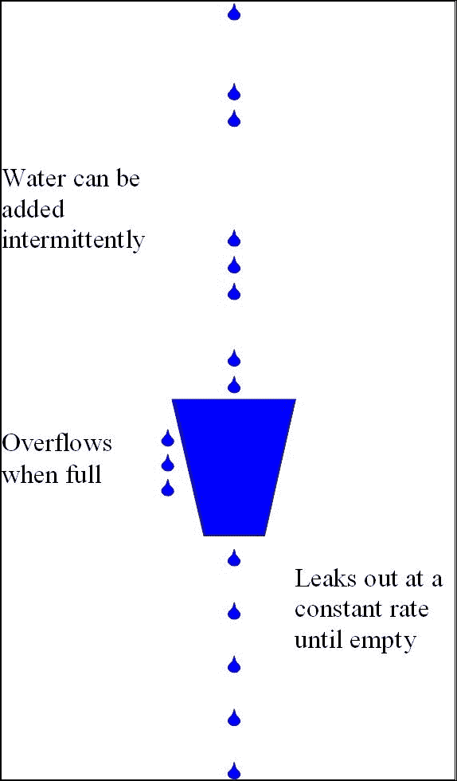

# 第九章：设计你的 REST API

在上一章中，我们使用 Akka 在我们的应用程序中添加了一个新的聊天功能。我们的 Web 应用程序接近完成。本章将在我们的 Play 框架应用程序中添加 REST API。

我们还将使用 Play 框架中的`ws`库创建一个 Scala 客户端来调用我们的 REST API。在本章的后面，我们将添加 Swagger 支持并将 Swagger UI 嵌入到我们的应用程序中。

在本章中，我们将涵盖以下主题：

+   REST 和 API 设计

+   使用 REST 和 JSON 创建我们的 API

+   创建 Scala 客户端

+   添加验证

+   添加回压

+   添加 Swagger 支持

# REST 简介

**表征状态转移**（**REST**）是一种架构风格。它由 Roy Fielding 在他的博士论文中定义。REST 通过 HTTP 1.1 协议使用 HTTP 动词进行，例如`GET`、`POST`、`DELETE`、`PUT`和**统一资源标识符**（**URI**），例如`/users/profile/1`或`sales/cart/add/2`。

REST 架构有以下属性：

+   **简单性**：几乎所有的语言都有库来操作 HTTP URI。

+   **互操作性**：REST 是语言、平台和操作系统无关的。

+   **可扩展和可靠**：因为 REST 基于 HTTP，你可以使用 HTTP 服务器与 HTTP 负载均衡器、HTTP 缓存和 HTTP DNS 一起扩展你的应用程序。

+   **关注点分离**（**SOC**）：因为你有一个 URI，这是你的合同，而不是代码、底层后端或数据库。这意味着你可以更改数据库或语言，而不会影响代码。

+   **客户端**/**服务器**：有一个提供 REST 接口的服务器，以及调用 REST 端点的客户端。

采纳 REST 原则的 Web 服务通常被称为 RESTful。

# REST API 设计

当你使用 REST 时，有一些原则你应该记住，并且这些原则应该为你在进行 API 设计时的设计选择提供指导。

## HTTP 动词设计

这些是 HTTP 中找到的以下动词：

+   `GET`：这通常用于回答查询

+   `PUT`：这通常用于插入数据

+   `POST`：这通常用于更新数据

+   `DELETE`：这通常用于删除数据

为什么我们总是说“通常”？好吧，在大小限制方面有一些例外。例如，对于`GET`动词，我们无法有一个大于 8192 字节或 8 KB 的请求。如果你需要发送更大的有效负载，我们需要使用`POST`动词。

## 统一 API

REST 使用统一的 API。例如，考虑以下代码片段：

```java
    GET          /users/1   = List information about user id 1 
    PUT          /users/1   = Insert user 1 
    POST         /users/1   = Update user 1 
    DELETE       /users/1   =  Delete user 1 
    GET          /users/    = Lists All users 

```

如果我们将资源从用户更改为销售，API 几乎相同。数据检索使用`GET`进行，更新通过`POST`完成，因此这是一个统一的 API。

## 带有 HTTP 状态码的响应

REST 使用 HTTP 1.1 状态码运行错误处理器。例如：

+   **200 -> OK**：这通常与`GET`动词一起使用

+   **201 -> 已创建**：这通常由`PUT/POST`动词使用

+   **204 -> 无内容**：这通常用于`DELETE`动词

+   **400 -> 无效请求**：这通常意味着对 `POST/PUT` 动词的无效请求

+   **404 -> 未找到**：这通常与 `GET` 动词一起使用

+   **500 -> 内部服务器错误 -** **意外服务器错误**：这通常由所有动词使用

## REST API 模式

对于良好的和清晰的 REST API 设计，有一些常见的模式，如下所示：

+   **使用名词；不要使用动词**：通常，你可以使用标准的 URI，例如 `/cars/` 或 `/members/`。你不应该使用 `/getCars/` 或 `getMembers/`，因为你在使用带有动词的 URI，而动词已经说明了动作。

+   **GET 方法不应改变状态**：如果你想改变服务器的状态，你需要使用动词，如 `PUT`、`POST` 或 `DELETE`。`GET` 不应改变服务器的状态，因此可以安全地多次调用 `GET`。这被称为幂等。

+   **优先使用子资源关系**：假设我们有一个名为 `/users/` 的资源，一个用户有项目。始终使用子资源，如 `/users/1/projects/2` 是一个好主意，因为我们有用户和项目之间的关系。

+   **使用 HTTP 头部**：HTTP 头部应该用于序列化、安全性和应用程序需要的所有类型的元数据。HTTP 头部通常用于内容协商。例如，你可能做以下操作：

```java
    HTTP HEADER Content-Type = XML - GET /cars/1  
    HTTP HEADER Content-Type = JSON - GET /cars/1  

```

+   URI 是相同的；然而，根据头部类型，它将以 XML 或 JSON 格式返回数据。

+   **过滤、排序和分页**：有时，你的数据可能很大。提供排序、过滤和分页的机制总是一个好主意，如下所示：

```java
    GET /projects/1/tasks?by=priority             -> Sorting  
    GET /projects/1/tasks?status=done             -> Filter 
    GET /projects/1/tasks?limit=30&offset=5       -> Pagination 

```

## API 版本化

有两种执行 API 版本化的方式。第一种策略是通过对端点进行显式版本化，例如 `/v1/cars`。第二种策略基于元数据，例如 `/cars/`，但此时你需要传递一个 HTTP 头部版本作为 v1。

这两种策略都有优点和缺点。显式版本化更清晰，你总是可以创建一个新版本而不会破坏你的消费者。头部策略更优雅；然而，它可能会变得难以管理。

## 需要避免的一些反模式

在 REST API 设计中存在一些陷阱，但以下事项需要避免：

+   `GET` 动词用于所有事物

+   忽略 HTTP 头部，如 MIME 类型

+   发生错误时返回 200

+   对于无效参数或缺失参数返回 500

# 使用 REST 和 JSON 创建我们的 API

好的，现在是时候为你的 Play 框架应用程序设计一个 REST API 了。我们将创建一个 API 来导出系统中的所有数据。这个 API 将是只读的；然而，如果你愿意，可以添加写操作。

在本章的后面部分，我们将添加一些背压来限制消费者的 API REST 速率，并为我们的 REST API 创建一个 Scala 客户端应用程序。所以，首先，让我们从 Play 框架（服务器）开始。

在我们的 Play 框架应用程序中创建 REST API，我们不需要任何额外的库。我们只需要一个新的控制器和新的路由。此外，我们将利用前几章中编写的代码。

## RestApiContoller

让我们在 `ReactiveWebStore/app/controllers` 中创建一个新的控制器。

### REST API 前端控制器实现

`RestApiController.scala` 文件应类似于以下内容：

```java
    package controllers  
    @Singleton 
    class RestAPIController @Inject() 
    (val productService:IProductService, 
      val reviewService:IReviewService, 
    val imageService:IImageService) extends Controller {  
      import play.api.libs.concurrent.Execution.
      Implicits.defaultContext  
      def listAllProducts = Action { 
        val future = productService.findAll() 
        val products = Awaits.get(5,future) 
        val json = ProductsJson.toJson(products) 
        Ok(json) 
      }  
      def listAllReviews = Action { 
        val future = reviewService.findAll() 
        val reviews = Awaits.get(5,future) 
        val json = ReviewsJson.toJson(reviews) 
        Ok(json) 
      } 
      def processImages = { 
        val future = imageService.findAll() 
        val images = Awaits.get(5,future) 
        val json = ImagesJson.toJson(images) 
        json 
      } 
      def listAllImages = Action { 
        Ok(processImages) 
      }
    } 

```

基本上，这里有三个函数。这些函数列出所有产品、图片和评论。如您在控制器顶部所见，我们正在注入用于产品、图片和评论的三个服务。

所有函数的代码相当直接。首先，我们将调用适当的服务，然后使用 `await` 对象等待结果。一旦我们有了数据，我们将调用一个函数将数据转换为 JSON。

让我们看看这里使用的 JSON 辅助对象。

## JSON 映射

我们的 REST 控制器使用了 JSON 辅助对象将对象映射到 JSON。首先，我们将从 Products JSON 辅助对象开始。

`ProductsJson` 位于 `ReactiveWebStore/app/controllers/Product.scala`：

```java
    object ProductsJson {  
      import play.api.libs.json._ 
      import play.api.libs.json.Reads._ 
      import play.api.libs.functional.syntax._  
      implicit val productWrites: Writes[Product] = ( 
        (JsPath \ "id").write[Option[Long]] and 
        (JsPath \ "name").write[String] and 
        (JsPath \ "details").write[String] and 
        (JsPath \ "price").write[BigDecimal] 
      )(unlift(Product.unapply)) 
      implicit val productReads: Reads[Product] = ( 
        (JsPath \ "id").readNullable[Long] and 
        (JsPath \ "name").read[String] and 
        (JsPath \ "details").read[String] and 
        (JsPath \ "price").read[BigDecimal] 
      )(Product.apply _)  
      def toJson(products:Option[Seq[Product]]) = Json.toJson(products) 
    } 

```

基本上，这里有三个重要的概念。首先，我们有 `productsWrites`，它将 JSON 映射到 `model`，以及用于写入的 `Product`，这同样也被称为反序列化。我们还有一个用于序列化的映射，称为 `productsReads`，它将对象转换为 JSON。

如您所见，我们需要映射模型中存在的所有字段，例如 ID、名称、详情和价格。这种映射必须匹配适当的类型。ID 映射使用 `readNullable`，因为 ID 是可选的。

最后，我们有一个将 JSON 转换为对象的函数，称为 `toJson`，它使用一个名为 JSON 的通用 Play 框架库。让我们转到下一个辅助对象——评论。

`ReviewsJson` 位于 `ReactiveWebStore/app/controllers/Review.scala`，其结构应类似于以下内容：

```java
    object ReviewsJson {  
      import play.api.libs.json._ 
      import play.api.libs.json.Reads._ 
      import play.api.libs.functional.syntax._  
      implicit val reviewWrites: Writes[Review] = ( 
        (JsPath \ "id").write[Option[Long]] and 
        (JsPath \ "productId").write[Option[Long]] and 
        (JsPath \ "author").write[String] and 
        (JsPath \ "comment").write[String] 
      )(unlift(Review.unapply)) 
      implicit val reviewReads: Reads[Review] = ( 
        (JsPath \ "id").readNullable[Long] and 
        (JsPath \ "productId").readNullable[Long] and 
        (JsPath \ "author").read[String] and 
        (JsPath \ "comment").read[String] 
      )(Review.apply _)  
      def toJson(reviews:Option[Seq[Review]]) = Json.toJson(reviews) 
    } 

```

在这里，我们看到了之前在 Products JSON 辅助对象中看到的相同概念。我们有一个用于读取和写入的映射，以及一个将 `model.Review` 转换为 JSON 的函数。让我们转到最后的辅助对象，即 `ImageJson`。

`ImagesJson` 位于 `ReactiveWebStore/app/controllers/Image.scala`，其结构应类似于以下内容：

```java
    object ImagesJson {  
      import play.api.libs.json._ 
      import play.api.libs.json.Reads._ 
      import play.api.libs.functional.syntax._  
      implicit val imagesWrites: Writes[Image] = ( 
        (JsPath \ "id").write[Option[Long]] and 
        (JsPath \ "productId").write[Option[Long]] and 
        (JsPath \ "url").write[String] 
      )(unlift(Image.unapply))     
      implicit val imagesReads: Reads[Image] = ( 
        (JsPath \ "id").readNullable[Long] and 
        (JsPath \ "productId").readNullable[Long] and 
        (JsPath \ "url").read[String] 
      )(Image.apply _)  
      def toJson(images:Option[Seq[Image]]) = Json.toJson(images) 
    } 

```

就像其他两个映射器一样，我们有读取、写入、映射和 `toJson` 函数。我们已经完成了映射器，所以下一步是创建新的路由。

## 配置新路由

我们需要为我们的 REST API 添加以下三个新路由，该 API 位于 `ReactiveWebStore/conf/routes`：

```java
    # 
    # REST API 
    # 
    GET /REST/api/product/all 
    controllers.RestAPIController.listAllProducts 
    GET /REST/api/review/all 
    controllers.RestAPIController.listAllReviews 
    GET /REST/api/image/all controllers.RestAPIController.listAllImages 

```

如您所见，我们已将刚刚创建的所有列表操作进行了映射。

## 使用浏览器测试 API

现在，我们可以运行 `$ activator run` 并使用我们的网络浏览器测试新的 REST API。

访问 `http://localhost:9000/REST/api/product/all`；您应该会看到以下截图类似的内容：


让我们看看评论 API。

前往 `http://localhost:9000/REST/api/review/all`；您应该看到类似于以下截图的结果：


最后，让我们查看 REST API 的图片。

前往 `http://localhost:9000/REST/api/image/all`；您应该看到类似于以下截图的结果：


好的。现在我们将继续使用 REST。我们刚刚完成了服务器；然而，创建一个 REST 客户端来消费这些 REST API 是很重要的。

# 创建 Scala 客户端

首先，您需要创建一个新的项目。进入您的文件系统，创建一个名为 `rest-client` 的文件夹。然后，在 `rest-client` 内创建另一个名为 `project` 的文件夹。在 `project` 内，您需要添加以下两个文件：

+   `build.properties`：此文件包含 SBT 配置，例如版本

+   `Plugins.sbt`：此文件包含 SBT 插件配置

让我们从 `build.properties` 开始：

```java
    sbt.version=0.13.11 

```

如您所见，我们正在配置此项目以使用 SBT 版本 0.13.11。现在，我们可以转到插件文件。

## 配置 plugins.sbt

您的 `plugins.sbt` 文件应该看起来像这样：

```java
    addSbtPlugin("com.typesafe.sbteclipse" % "sbteclipse-plugin" % 
      "2.5.0") 
    addSbtPlugin("com.github.mpeltonen" % "sbt-idea" % "1.6.0") 

```

在这里，我们添加了 Eclipse 和 IntelliJ 的支持。对于这本书，我们使用 Eclipse，但请随意使用您喜欢的任何东西。

在 `project` 文件夹外部，在 `rest-client` 下，我们需要配置 `build.sbt` 文件。

## 配置 build.sbt

您的 `build.sbt` 文件应该看起来像这样：

```java
    name := "rest-client"  
    version := "1.0" 
    scalaVersion := "2.11.7" 
    scalaVersion in ThisBuild := "2.11.7"  
    resolvers += DefaultMavenRepository 
    resolvers += JavaNet1Repository 
    resolvers += "OSSSonatype" at 
    "https://oss.sonatype.org/content/repositories/releases" 
    resolvers += "Sonatype OSS Snapshots" at 
    "https://oss.sonatype.org/content/repositories/snapshots" 
    resolvers += "Sonatype OSS Snapshots" at 
    "https://oss.sonatype.org/content/repositories/snapshots" 
    resolvers += "amateras-repo" at 
    "http://amateras.sourceforge.jp/mvn/"  
    libraryDependencies += "com.typesafe.play" % "play-ws_2.11" % 
    "2.5.6" 
    libraryDependencies += "org.scalatest" % "scalatest_2.11" % "2.2.6" 
    % Test 

```

因此，我们在这里使用 Scala 版本 2.11.7，并且我们只声明了两个依赖项。一个依赖项是用于测试的 `scala-test`，另一个依赖项是 Play 框架的 `ws` 库，我们将使用它来调用我们的 REST API。

让我们也创建两个源文件夹，如下所示：

+   `src/main/scala`：这是 Scala 源代码

+   `src/test/scala`：这是 Scala 测试源代码

好的。现在我们可以运行 `$ sbt clean compile eclipse` 以从网络下载依赖项并创建我们需要的所有 Eclipse 项目文件。


现在，我们可以将此代码导入 Eclipse 并继续下一步。

## Scala 客户端代码

首先，我们需要创建一个 `Factory` 来实例化 `WS` Play 框架库以调用 `webservices`。在 `rest-client/src/main/scala` 位置下，让我们创建一个名为 `client` 的包，并在 `WSFactory.scala` 下添加以下代码：

```java
    package client  
    object WSFactory {  
      import akka.actor.ActorSystem 
      import akka.stream.ActorMaterializer  
      def ws = {  
        implicit val system = ActorSystem() 
        implicit val materializer = ActorMaterializer()  
        import com.typesafe.config.ConfigFactory 
        import play.api._ 
        import play.api.libs.ws._ 
        import play.api.libs.ws.ahc.{AhcWSClient, AhcWSClientConfig} 
        import play.api.libs.ws.ahc.AhcConfigBuilder 
        import org.asynchttpclient.AsyncHttpClientConfig 
        import java.io.File  
        val configuration = Configuration.reference ++ 
        Configuration(ConfigFactory.parseString( 
          """ 
          |ws.followRedirects = true 
        """.stripMargin))  
        val parser = new WSConfigParser(configuration, 
        play.api.Environment.simple(
        new File("/tmp/"), null)) 
        val config = new AhcWSClientConfig(wsClientConfig = 
        parser.parse()) 
        val builder = new AhcConfigBuilder(config) 
        val logging = new 
        AsyncHttpClientConfig.AdditionalChannelInitializer() { 
          override def initChannel(channel: io.netty.channel.Channel): 
          Unit = { 
            channel.pipeline.addFirst("log", new 
            io.netty.handler.logging.LoggingHandler("debug")) 
          }
        }  
        val ahcBuilder = builder.configure() 
        ahcBuilder.setHttpAdditionalChannelInitializer(logging) 
        val ahcConfig = ahcBuilder.build() 
        new AhcWSClient(ahcConfig) 
      }
    } 

```

上述代码仅是技术性的。这些是在 Play 框架外部实例化 WSClient 所需的步骤。如果这个客户端是一个使用 Play 框架的 Web 应用程序，那么会容易得多，因为我们可以直接使用 Google Guice 并注入所需的内容。

您需要记住的主要思想是，您需要使用 Akka 和 ActorSystem 来使用此功能。如您所见，所有这些代码都锁定在一个名为 `ws` 的单个函数中的对象内。

我们需要一个用于处理 Future 的实用类。因为我们使用`ws`库调用 REST API，它返回 Future。所以，让我们创建一个新的包叫做`utils`：

你的`Awaits.scala`文件应该看起来像这样：

```java
    package utils  
    import scala.concurrent.Future 
    import scala.concurrent.duration._ 
    import scala.concurrent.Await  
    object Awaits { 
      def getT:T = { 
        Await.resultT 
      }
    } 

```

前面的代码相当简单。我们使用了`Await`对象，并使用了一个通用的`T`来将结果转换为泛型参数化类型。通过使用这个参数，我们还将接收到在超时前应该等待多少秒。

# 创建我们的 REST 客户端代理

我们现在将进行 REST 调用；然而，我们将创建一个 Scala API。因此，使用我们的`rest-client`的开发者不需要处理 REST，只需执行 Scala 代码。这有很多好处，其中一些如下：

+   **SOC**：我们仍然在 Play 框架和客户端应用之间有职责分离

+   **隔离**：如果 REST API 发生变化，我们将在代理层处理它

+   **抽象**：客户端代码的其余部分只使用 Scala，并且不知道任何关于 REST 或 HTTP 调用的事情

这些技术现在在微服务中非常常见。这些技术也可以被称为驱动程序或厚客户端。现在，我们需要创建三个代理，每个 REST API 上的资源一个，让我们创建一个新的包叫做`proxy`。

你的`ProductProxy.scala`文件应该看起来像这样：

```java
    package proxy  
    import client.WSFactory 
    import utils.Awaits  
    case class Product 
    ( var id:Option[Long], 
      var name:String, 
      var details:String, 
    var price:BigDecimal ) { 
      override def toString:String = { 
        "Product { id: " + id.getOrElse(0) + ",name: " + name + ", 
        details: "+ details + ", price: 
        " + price + "}" 
      }
    }  
    object ProductsJson {  
      import play.api.libs.json._ 
      import play.api.libs.json.Reads._ 
      import play.api.libs.functional.syntax._ 
      implicit val productWrites: Writes[Product] = (  
        (JsPath \ "id").write[Option[Long]] and 
        (JsPath \ "name").write[String] and 
        (JsPath \ "details").write[String] and 
        (JsPath \ "price").write[BigDecimal] 
      )(unlift(Product.unapply)) 
      implicit val productReads: Reads[Product] = ( 
        (JsPath \ "id").readNullable[Long] and 
        (JsPath \ "name").read[String] and 
        (JsPath \ "details").read[String] and 
        (JsPath \ "price").read[BigDecimal] 
      )(Product.apply _)  
      def toJson(products:Option[Seq[Product]]) = Json.toJson(products) 
    }  
    object ProductProxy {  
      import scala.concurrent.Future 
      import play.api.libs.json._ 
      import ProductsJson._  
      val url = "http://localhost:9000/REST/api/product/all" 
      implicit val context = 
      play.api.libs.concurrent.Execution.Implicits.defaultContext  
      def listAll():Option[List[Product]] = { 
        val ws = WSFactory.ws 
        val futureResult:Future[Option[List[Product]]] = 
        ws.url(url).withHeaders("Accept" -> 
        "application/json").get().map( 
          response => 
          Json.parse(response.body).validate[List[Product]].asOpt 
        )  
        val products = Awaits.get(10, futureResult) 
        ws.close 
        products 
      }
    } 

```

在这个代码中，我们有三个主要概念。首先，我们有一个表示产品的`case`类。前面的代码与我们在 Play 框架应用中的代码非常相似。然而，如果你仔细观察，你会发现它要干净得多，因为我们没有围绕持久性的任何元数据。

你可能会想，这是重复的代码！是的，这是完全正确的。重复的代码是解耦的。记住，我们有一个 REST 接口，还有一个在客户端代码其余部分的代理，因此我们至少有两层间接处理，可以应对变化。如果这两个代码库共享相同的类，我们就会有耦合，并且容纳变化的空间会减少。

这里第二个主要概念是映射。我们将接收 JSON，并希望将其转换为我们的`case`类，因此我们将有与在 Play 框架应用中类似的映射。

最后，我们有代理实现。我们将使用我们的工厂实例化 Play 框架的`WS`库，并调用`ws`函数。然后，我们将使用`url`函数传递产品的 REST API URI，并定义一个头以接受 JSON。我们也是使用 HTTP 动词`GET`来做这件事。响应通过`Json.parse`传递`response.body`进行映射。此外，我们将调用验证函数以确保这个 JSON 与我们的`case`类匹配。这种验证很重要，因为这样我们可以确保格式没有改变，并且一切正常。`WS`将返回这个作为 Future，所以我们将使用我们的`Awaits`辅助函数来获取结果。

让我们转到下一个代理，即审查。

您的 `ReviewProxy.scala` 文件应该看起来像这样：

```java
    package proxy  
    import client.WSFactory 
    import utils.Awaits  
    case class Review 
    (var id:Option[Long], 
      var productId:Option[Long], 
      var author:String, 
    var comment:String) 
    { 
      override def toString:String = { 
        "Review { id: " + id + " ,productId: " + productId.getOrElse(0) 
        + ",author: " + author + 
        ",comment: " + comment + " }" 
      } 
    }  
    object ReviewsJson {  
      import play.api.libs.json._ 
      import play.api.libs.json.Reads._ 
      import play.api.libs.functional.syntax._  
      implicit val reviewWrites: Writes[Review] = ( 
        (JsPath \ "id").write[Option[Long]] and 
        (JsPath \ "productId").write[Option[Long]] and 
        (JsPath \ "author").write[String] and 
        (JsPath \ "comment").write[String] 
      )(unlift(Review.unapply))  
      implicit val reviewReads: Reads[Review] = ( 
        (JsPath \ "id").readNullable[Long] and 
        (JsPath \ "productId").readNullable[Long] and 
        (JsPath \ "author").read[String] and 
        (JsPath \ "comment").read[String] 
      )(Review.apply _) 
      def toJson(reviews:Option[Seq[Review]]) = Json.toJson(reviews) 
    }  
    object ReviewProxy { 
      import scala.concurrent.Future 
      import play.api.libs.json._ 
      import ReviewsJson._ 
      val url = "http://localhost:9000/REST/api/review/all" 
      implicit val context = 
      play.api.libs.concurrent.Execution.Implicits.defaultContext 
      def listAll():Option[List[Review]] = { 
        val ws = WSFactory.ws 
        val futureResult:Future[Option[List[Review]]] = 
        ws.url(url).withHeaders("Accept" -> 
        "application/json").get().map( 
          response => 
          Json.parse(response.body).validate[List[Review]].asOpt 
        ) 
        val reviews = Awaits.get(10, futureResult) 
        ws.close 
        reviews 
      }
    } 

```

这里，我们有与产品代理相同的原理，但这次是为了审查。正如您所看到的，我们将调用不同的 URI。现在，让我们转到最后一个代理--`ImageProxy.scala` 文件。

您的 `ImageProxy.scala` 文件应该看起来像这样：

```java
    package proxy  
    import client.WSFactory 
    import utils.Awaits  
    case class Image 
    (var id:Option[Long], 
      var productId:Option[Long], 
    var url:String) 
    { 
      override def toString:String = { 
        "Image { productId: " + productId.getOrElse(0) + ",url: " + url 
        + "}" 
      } 
    }  
    object ImagesJson {  
      import play.api.libs.json._ 
      import play.api.libs.json.Reads._ 
      import play.api.libs.functional.syntax._  
      implicit val imagesWrites: Writes[Image] = ( 
        (JsPath \ "id").write[Option[Long]] and 
        (JsPath \ "productId").write[Option[Long]] and 
        (JsPath \ "url").write[String] 
      )(unlift(Image.unapply))  
      implicit val imagesReads: Reads[Image] = ( 
        (JsPath \ "id").readNullable[Long] and 
        (JsPath \ "productId").readNullable[Long] and 
        (JsPath \ "url").read[String] 
      )(Image.apply _) 
      def toJson(images:Option[Seq[Image]]) = Json.toJson(images) 
    } 
    object ImageProxy { 
      import scala.concurrent.Future 
      import play.api.libs.json._ 
      import ImagesJson._ 
      val url = "http://localhost:9000/REST/api/image/all" 
      implicit val context =  
      play.api.libs.concurrent.Execution.Implicits.defaultContext 
      def listAll():Option[List[Image]] = { 
        val ws = WSFactory.ws 
        val futureResult:Future[Option[List[Image]]] = 
        ws.url(url).withHeaders("Accept" -> 
        "application/json").get().map( 
          response => 
          Json.parse(response.body).validate[List[Image]].asOpt 
        ) 
        val images = Awaits.get(10, futureResult) 
        ws.close 
        images 
      }
    } 

```

就这样。我们与产品和审查有相同的概念。我们已经完成了所有代理。现在，是时候测试我们的代理实现了。最好的方式是通过测试，所以让我们为这三个实现创建 Scala 测试。

## 为代理创建 ScalaTest 测试

在 `/src/test/scala` 源文件夹下，我们需要创建一个名为 `proxy.test` 的包。

您的 `ProductProxtTestSpec.scala` 应该看起来像这样：

```java
    package proxy.test  
    import org.scalatest._ 
    import proxy.ProductProxy  
    class ProductProxtTestSpec extends FlatSpec with Matchers {  
      "A Product Rest proxy " should "return all products" in { 
        val products = ProductProxy.listAll().get 
        products shouldNot(be(null)) 
        products shouldNot(be(empty))  
      }
    } 

```

测试相当简单；我们只需在我们的产品代理中调用 `listAll` 操作，然后添加一些断言以确保结果不是 null。我们还会在控制台显示所有产品。

现在，我们需要为审查代理创建测试，这将与产品类似。

您的 `ReviewProxyTestSpec.scala` 文件应该看起来像这样：

```java
    package proxy.test  
    import org.scalatest._ 
    import proxy.ReviewProxy  
    class ReviewProxyTestSpec extends FlatSpec with Matchers {  
      "A Review REST Proxy " should "return all reviews" in { 
        val reviews = ReviewProxy.listAll().get 
        reviews shouldNot(be(null)) 
        reviews shouldNot(be(empty)) 
        for( r <- reviews){ 
          println(r) 
        }
      }
    } 

```

在这里，我们使用了代理思想来测试审查。我们使用 `listAll` 函数调用代理以获取所有审查。稍后，我们将检查审查是否不为 null。我们将打印所有审查。最后，是时候转到最后一个代理测试--图像代理。

您的 `ImageProxyTestSpec.scala` 应该看起来像这样：

```java
    package proxy.test  
    import org.scalatest._ 
    import proxy.ImageProxy 
    import scala.concurrent.Future 
    import play.api.libs.concurrent.Execution.Implicits.defaultContext 
    import java.util.concurrent.CountDownLatch  
    class ImageProxyTestSpec extends FlatSpec with Matchers {  
      "A Image REST Proxy " should "return all images" in { 
        val images = ImageProxy.listAll().get 
        images shouldNot(be(null)) 
        images shouldNot(be(empty)) 
        for( i <- images){ 
          println(i) 
        }
      }
    } 

```

对于图像代理也是同样的情况。我们已经有所有测试；现在，我们可以运行测试。您需要确保我们的 `ReactiveWebStore` Play 框架应用正在运行。

让我们使用 sbt 运行这个测试：

打开您的控制台，输入 `$ sbt test`


好的，一切正常！我们的下一步将是添加反压。

## 添加反压

反压是汽车行业中的一个众所周知的概念。如今，这个术语在软件工程中也被使用。在汽车世界中，反压是指在一个封闭空间（如管道）中与期望的气体流动方向相反的压力。对于软件工程，它通常与减缓生产者（可以是应用程序、流处理引擎，甚至是用户本身）有关。

当我们执行 REST 时，很容易达到客户端可以饱和服务器的情况。这也可以是一种安全漏洞，也被称为**拒绝服务**（**DOS**）攻击。

有两种架构场景。在第一种场景中，您的 REST API 是内部的，您公司中只有消费者。在第二种场景中，您将 REST API 作为公共 API，使其对整个互联网开放。对于这种情况，您真的应该有反压，也称为节流。

我们可以扩展我们的架构以处理更多用户。我们将在第十章扩展中讨论这一点，以及可扩展性技术。

目前，有几种方法可以应用背压。例如，如果我们的代码是纯 RxScala/RxJava，我们可以在可观察对象上应用背压。更多详情可以在[`github.com/ReactiveX/RxJava/wiki/Backpressure`](https://github.com/ReactiveX/RxJava/wiki/Backpressure)找到。

由于我们正在公开 REST 接口，我们将在控制器上添加背压，因此我们需要创建一个新的类来包含背压代码。

有一些算法用于背压；我们将使用漏桶算法。该算法本身非常简单——只有 30 行 Scala 代码。

### 漏桶算法

漏桶的隐喻相当简单。让我们在下面的图中看看它：



该算法背后的隐喻是基于一个带孔的桶。水流入或滴入桶中，并通过桶的孔泄漏。如果水太多，桶满了，水就会从桶中溢出——换句话说，它将被丢弃。

此算法用于网络编程，也被电信行业所采用。API 管理解决方案也是此算法的应用场景。

此概念允许速率限制约束。我们可以用每时间请求的数量来表示背压速率限制。在这种情况下，时间通常以秒或分钟来衡量，因此我们有每秒请求数（**RPS**）或每分钟请求数（**RPM**）。

你可以用队列来实现这个算法。然而，在我们的实现中，我们不会使用队列；我们将使用时间来控制流量。我们的实现也将是无锁的，或非阻塞的，因为我们不会使用线程或外部资源。

现在是时候用 Scala 编写漏桶算法了。首先，我们将为 `ReactiveWebStore` 应用程序创建此代码。我们需要在 `ReactiveWebStore/app` 位置创建一个新的包。新包的名称将是 `backpressure`。

#### Scala 漏桶实现

你的 `LeakyBucket.scala` 文件应该包含以下内容：

```java
    package backpresurre  
    import scala.concurrent.duration._ 
    import java.util.Date  
    class LeakyBucket(var rate: Int, var perDuration: FiniteDuration) {  
      var numDropsInBucket: Int = 0 
      var timeOfLastDropLeak:Date = null 
      var msDropLeaks = perDuration.toMillis  
      def dropToBucket():Boolean = { 
        synchronized { 
          var now = new Date()  
          if (timeOfLastDropLeak != null) { 
            var deltaT = now.getTime() - timeOfLastDropLeak.getTime() 
            var numberToLeak:Long = deltaT / msDropLeaks  
              if (numberToLeak > 0) { 
                if (numDropsInBucket <= numberToLeak) { 
                  numDropsInBucket -= numberToLeak.toInt 
                } else { 
                numDropsInBucket = 0 
              } 
              timeOfLastDropLeak = now 
            } 
          }else{ 
            timeOfLastDropLeak = now   
          }  
          if (numDropsInBucket < rate) { 
            numDropsInBucket = numDropsInBucket + 1 
            return true; 
          } 
          return false; 
        }
      }
    } 

```

如你所见，我们创建了一个 Scala 类，它接收两个参数：`rate` 和 `perDuration`。速率是一个整数，表示在应用背压之前我们能处理多少个请求。"PerDuration" 是 Scala 的 `FiniteDuration`，可以是任何时间度量，如毫秒、秒、分钟或小时。

此算法跟踪桶中最后滴水的时刻。如你所见，代码是同步的，但这是可以的，因为我们不会调用外部资源或线程。

首先，我们将使用 `new Date()` 获取当前时间。第一次运行算法时，我们将在 `else` 语句上失败，并将当前时间作为最后泄漏的时间。

第二次运行时，它将进入第一个 `If` 语句。然后，我们将计算上一次漏桶和现在之间的差值（diff）。这个差值将除以你在 `perDuration` 上传递的毫秒数。如果差值大于 0，那么我们将泄漏；否则我们丢弃。然后，我们将再次捕获上一次泄漏的时间。

最后，我们将检查掉落率。如果速率较小，我们将增加并返回 true，这意味着请求可以继续进行；否则，我们将返回 false，请求不应继续。

现在我们已经用 Scala 编码了这个算法，我们可以调用我们的一个控制器。我们将在这个图像 REST API 上添加这个背压。

你的 `RestApiController.scala` 应该看起来像这样：

```java
    package controllers  
    class RestAPIController @Inject() 
    (val productService:IProductService, 
      val reviewService:IReviewService, 
      val imageService:IImageService) extends Controller {  
        import 
        play.api.libs.concurrent.Execution.Implicits.defaultContext  
        // REST of the Controller...  
        import scala.concurrent.duration._  
        var bucket = new LeakyBucket(5, 60 seconds)  
        def processImages = { 
          val future = imageService.findAll() 
          val images = Awaits.get(5,future) 
          val json = ImagesJson.toJson(images) 
          json 
        }  
        def processFailure = { 
          Json.toJson("Too Many Requests - Try Again later... ") 
        } 
        def listAllImages = Action { 
          bucket.dropToBucket() match { 
            case true => Ok(processImages) 
            case false => 
            InternalServerError(processFailure.toString()) 
          }
        }
     } 

```

这里，我们将创建一个每分钟五个请求的漏桶。我们有两个函数：一个用于处理调用服务并将对象转换为 JSON 的图像，另一个用于处理失败。`processFailure` 方法将只发送一条消息，说明请求太多，我们现在无法接受请求。

因此，对于 `listAllImages` 函数，我们只需尝试调用漏桶并使用 Scala 模式匹配器来处理适当的响应。如果响应为 true，我们将返回带有 200 HTTP 代码的 JSON。否则，我们将返回 500 内部错误并拒绝该请求。在这里，我们实现了一个全局速率限制器；然而，大多数时候，人们按用户执行此操作。现在，让我们打开网页浏览器并尝试在一分钟内发出超过五个请求。你应该会在 `http://localhost:9000/REST/api/images/all` 看到以下截图：


好的，它工作了！如果你等待一分钟再次发出请求，你会看到流量恢复正常。下一步是添加一个新的客户端测试，因为我们知道如果我们过多地调用我们的 REST API 中的图像，我们将会被节流。

我们需要在 `rest-client` Scala 项目中添加一个额外的测试。为此，我们需要更改 `ImageProxyTestSpec`。

#### 测试背压

你的 `ImageProxyTestSpec.scala` 应该看起来像这样：

```java
    package proxy.test  
    class ImageProxyTestSpec extends FlatSpec with Matchers {  
      // REST of the tests...  
      "A Image REST Proxy " should "suffer backpressure" in { 
        val latch = new CountDownLatch(10) 
        var errorCount:Int = 0 
        for(i <- 1 to 10){ 
          Future{ 
            try{ 
              val images = ImageProxy.listAll().get 
              images shouldNot(be(null)) 
              for( i <- images){ 
                println(i) 
              } 
            }catch{ 
              case t:Throwable => errorCount += 1 
            } 
            latch.countDown() 
          }
        }     
        while( latch.getCount >= 1 ) 
        latch.await() 
        errorCount should be >=5 
      } 
    } 

```

因此，对于这个测试，我们将调用 `ImageProxy` 十次。我们知道并非所有请求都会被服务，因为我们服务器上有背压。在这里，我们可以使用 try...catch 块调用代理，并有一个错误计数器。每次失败，我们都可以增加它。所以，这里，我们预计至少会失败五次。

我们用特性创建代码，因为我们希望请求同时发生。我们需要使用 `CountDownLatch` 函数，这是一个 Java 工具类，它允许我们在所有 Future 完成之前等待。这是通过 `countDown` 函数完成的。每次我们执行 `countdown`，我们都会减少内部计数器。正如你所看到的，我们用十创建了 `CountDownLatch` 函数。

最后，我们有一个`while`循环块来等待，直到计数器有挂起的 Futures。现在我们等待。一旦所有操作都完成，我们可以检查错误计数；它应该至少是五个。就这样。我们已经测试了我们的背压机制，并且一切正常！

现在，是我们转向下一个将在我们的应用程序中实现的功能的时候了：Swagger--我们将为我们的 REST API 添加 Swagger 支持。

## 添加 Swagger 支持

Swagger ([`swagger.io/`](http://swagger.io/)) 是一个简单的 JSON 和 UI 表示工具，用于 REST API。它可以在多种语言中生成代码。它还创建了一份非常棒的文档，这份文档也是一个可运行的 Swagger 代码，允许您从它生成的文档中调用 REST 网络服务。为了使 Swagger 在 Play 框架中运行，我们需要在我们的 Play 框架应用程序中进行一些更改。

首先，我们需要将 Swagger 依赖项添加到`build.sbt`中：

```java
    // Rest of build file...   
    libraryDependencies ++= Seq( 
      // Rest of other deps...  
      "io.swagger" %% "swagger-play2" % "1.5.2-SNAPSHOT" 
    ) 

```

如您所见，我们正在使用快照版本。为什么使用快照版本？目前，它不支持在稳定版本上。为了解决这个依赖项，我们需要使用 Git 并克隆另一个项目。您可以在[`github.com/CreditCardsCom/swagger-play`](https://github.com/CreditCardsCom/swagger-play)获取更多详细信息。基本上，您需要编写如下命令：

```java
$ git clone https://github.com/CreditCardsCom/swagger-play.git
$ cd swagger-play/
$ sbt publishLocal

```

现在，我们需要在`ReactiveWebStore/conf/application.conf`中启用 Swagger。

您的`application.conf`文件应该看起来像这样：

```java
    play.modules { 
      enabled += "play.modules.swagger.SwaggerModule" 
    } 

```

接下来，我们可以更改我们的控制器以添加 Swagger 支持。Swagger 有注解来映射 REST 操作。

您的`RestAPIController.scala`文件应该看起来像这样：

```java
    package controllers  
    @Singleton 
    @Api(value = "/REST/api", description = "REST operations on 
    Products, Images and Reviews. ") 
    class RestAPIController @Inject() 
    (val productService:IProductService, 
      val reviewService:IReviewService, 
      val imageService:IImageService) extends Controller { 
        import 
        play.api.libs.concurrent.Execution.Implicits.defaultContext  
        @ApiOperation( 
          nickname = "listAllProducts", 
          value = "Find All Products", 
          notes = "Returns all Products", 
          response = classOf[models.Product], 
          httpMethod = "GET" 
        ) 
        @ApiResponses(Array( 
          new ApiResponse(code = 500, message = "Internal Server 
          Error"), 
          new ApiResponse(code = 200, message = "JSON response with 
          data") 
        )
      ) 
      def listAllProducts = Action { 
        val future = productService.findAll() 
        val products = Awaits.get(5,future) 
        val json = ProductsJson.toJson(products) 
        Ok(json) 
      }  
      @ApiOperation( 
        nickname = "listAllReviews", 
        value = "Find All Reviews", 
        notes = "Returns all Reviews", 
        response = classOf[models.Review], 
        httpMethod = "GET" 
      ) 
      @ApiResponses(Array( 
        new ApiResponse(code = 500, message = "Internal Server Error"), 
        new ApiResponse(code = 200, message = "JSON response with 
        data") 
      )
      ) 
      def listAllReviews = Action { 
        val future = reviewService.findAll() 
        val reviews = Awaits.get(5,future) 
        val json = ReviewsJson.toJson(reviews) 
        Ok(json) 
      }  
      import scala.concurrent.duration._ 
      var bucket = new LeakyBucket(5, 60 seconds) 
      def processImages = { 
        val future = imageService.findAll() 
        val images = Awaits.get(5,future) 
        val json = ImagesJson.toJson(images) 
        json 
      }  
      def processFailure = { 
        Json.toJson("Too Many Requests - Try Again later... ") 
      }  
      @ApiOperation( 
        nickname = "listAllImages", 
        value = "Find All Images", 
        notes = "Returns all Images - There is throttling of 5 
        reqs/sec", 
        response = classOf[models.Image], 
        httpMethod = "GET" 
      ) 
      @ApiResponses(Array( 
        new ApiResponse(code = 500, message = "Internal Server Error"), 
        new ApiResponse(code = 200, message = "JSON response with 
        data") 
      )
      )  
      def listAllImages = Action { 
        bucket.dropToBucket() match { 
          case true => Ok(processImages) 
          case false => InternalServerError(processFailure.toString()) 
        }
      }
    } 

```

在这里，我们有几个注解。首先，我们在类的顶部有一个`@Api`注解。通过这个注解，我们将定义 REST API 的根路径。然后，对于每个 REST API 操作，我们有`@ApiOperation`和`@ApiResponses`注解。`@ApiOperation`定义了 REST API 本身，您可以在其中定义参数和 HTTP 动词，还可以添加一些注释（文档）。它还可能描述结果；在我们的案例中，它将是模型的 JSON 表示。

就这样！我们已经将控制器映射到 Swagger。下一步是添加 Swagger 的路由。这需要通过在`ReactiveWebStore/conf/routes`中添加新行来完成，如下所示：

```java
    // REST of the other routes..  
    GET     /swagger.json    controllers.ApiHelpController.getResources 

```

## Swagger UI

Swagger 将为我们的 REST API 生成 JSON 响应。可以使用 Swagger UI，它非常棒，为开发者提供了许多便利。我们可以以两种方式与 Swagger UI 一起工作：我们可以将其作为独立应用使用，或者将其嵌入到我们的 Play 框架应用程序中。

我们将采取的策略是在我们的应用程序中嵌入 Swagger UI。如果您有多个 REST API 和多个 Play 应用程序或微服务，拥有独立的 swagger UI 安装是一个好主意。

在之前的步骤中，我们在应用程序中启用了 Swagger。打开您的浏览器并输入 `http://localhost:9000/swagger.json`。您可以遵循 [`swagger.io/swagger-ui/`](http://swagger.io/swagger-ui/) 上的说明。总之，您将得到以下输出：


### 构建 和 安装 Swagger Standalone

现在，我们将下载、构建和安装 Swagger Standalone。让我们通过编写以下代码行开始：

```java
$ sudo apt-get update $ sudo apt-get install nodej $ sudo apt-get install npm 
$ git clone https://github.com/swagger-api/swagger-ui.git $ cd swagger-ui/ $ sudo -E npm install -g $ sudo -E npm run build $ npm run serve $ GOTO: http://localhost:8080/

```

一旦您启动 Swagger UI，您可以在浏览器中看到以下输出：


现在，让我们将 Swagger UI 集成到我们的 Play 框架应用程序中。

我们需要将 `/swagger-ui/dist/` 中的内容复制到我们的 Play 框架应用程序的 `ReactiveWebStore/public` 下。然后，我们将创建一个名为 `swaggerui` 的文件夹。

我们需要编辑一个文件，以便将我们的 swagger JSON URI 放入其中。打开 `ReactiveWebStore/public/swaggerui/index.html` 并将 40 改为以下代码行：

```java
    url = "http://localhost:9000/swagger.json"; 

```

就这样。现在，我们需要从我们的应用程序中创建一个链接来嵌入 Swagger UI。所以，让我们更改 `ReactiveWebStore/app/views/index.scala.html`。

您的 `index.scala.html` 文件应该看起来像这样：

```java
    @(message: String)(implicit flash:Flash)  
    @main("Welcome to Reactive Web Store"){ 
      <div class="row-fluid"> 
        <BR> 
        <div class="span12"> 
          <div class="row-fluid"> 
            <div class="span6"> 
              <a href="/product"> Manage 
              Products</a><BR> 
              <a href="/review"> Manage 
              Reviews</a><BR> 
              <a href="/image"> Manage 
              Images</a><BR> 
            </div> 
            <div class="span6"> 
            <a href="/reports"> Reports </a>
            <BR> 
            <a href="/chat/index_socket"> Chat Room </a>
            <BR> 
            <a href="/assets/swaggerui/index.html"> Swagger REST 
            API </a><BR> 
          </div> 
        </div> 
      </div>             
    </div>} 

```

现在，我们可以使用 `$ activator run` 运行我们的 Play 应用程序。

打开浏览器并访问 `http://localhost:9000/`。您将看到以下截图：


现在，我们可以通过点击 Swagger REST API 链接或直接访问 `http://localhost:9000/assets/swaggerui/index.html` 来打开 Swagger UI。它看起来应该像这样：


如您所见，Swagger UI 非常不错。您可以点击每个操作，并查看更多关于它们如何工作、它们使用的 HTTP 动词以及 URI 的详细信息。有一个 **试试看！** 按钮。让我们点击 **试试看！** 按钮来查看产品，它看起来应该像这样：


如您所见，我们有我们的 JSON 结果，还有一些 CURL 示例。

# 摘要

在本章中，您学习了如何设计 REST API 并更改您的 Play 框架应用程序以支持 Swagger。您使用代理技术创建了一个 Scala 客户端库，以及用于 API 的 Scala 测试。此外，您还介绍了使用漏桶算法的背压。

在下一章，也就是最后一章，您将学习关于软件架构和可伸缩性/弹性技术，例如可发现性、负载均衡器、缓存、Akka Cluster 和亚马逊云。
