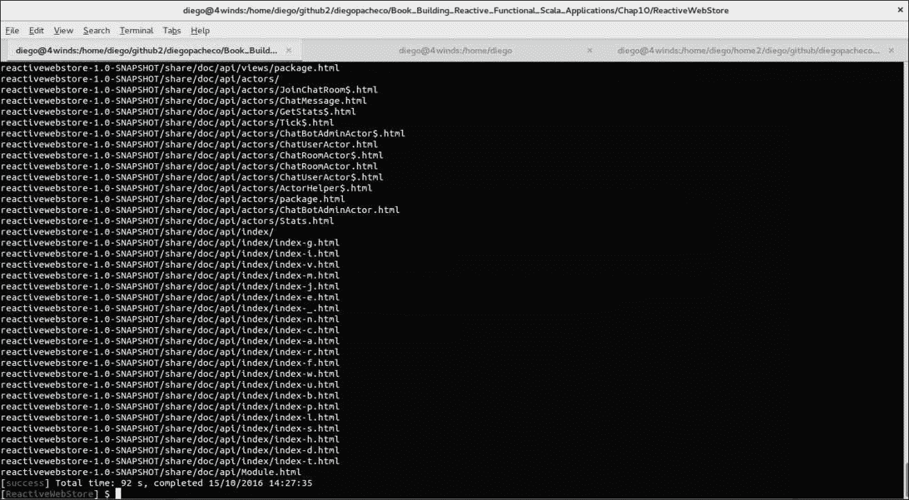
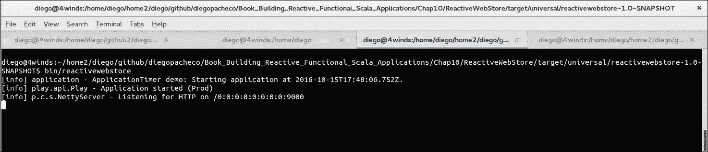
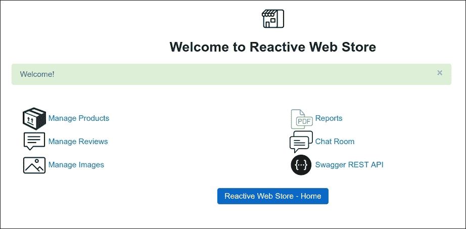
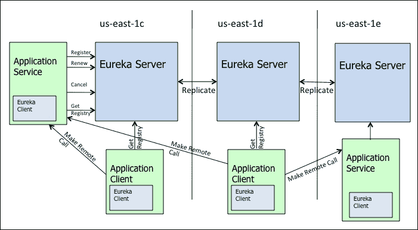
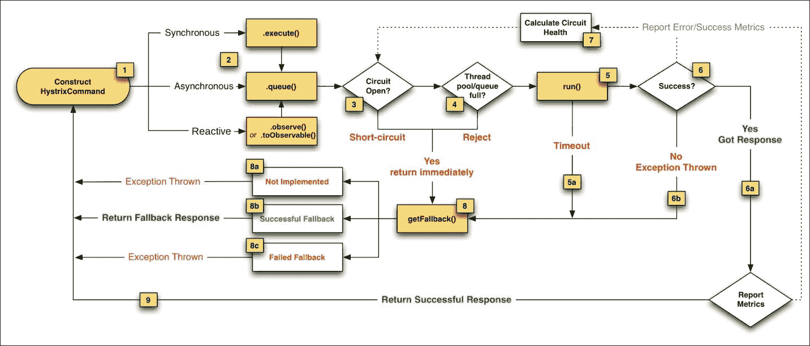
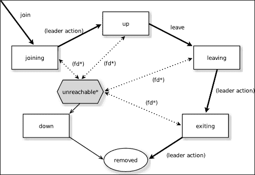

# 第十章。扩展

在前面的章节中，我们构建了一个 Scala 和 Play 框架应用程序。我们使用了 Scala 生态系统中最有效的框架和工具，如 Play 框架和 Akka；我们使用了 Reactive 和函数式编程技术，使用 Futures 和 RxScala。此外，我们使用 Jasper 和 WebSocket 进行聊天。这是最后一章，我们将学习如何部署和扩展我们的应用程序。

在本章中，我们将涵盖以下主题：

+   独立部署

+   架构原则

+   反应式驱动和可发现性

+   中间层负载均衡器、超时、背压和缓存

+   使用 Akka 集群扩展微服务

+   使用 Docker 和 AWS 云扩展基础设施

# 独立部署

在整本书中，我们使用了 Activator 和 SBT 构建和开发工具。然而，当我们谈论生产时，我们不能使用 SBT 或 Activator 运行应用程序；我们需要进行独立部署。

那么，关于标准的 Java Servlet 容器，如 Tomcat 呢？Tomcat 很棒；然而，Play 更棒。你在 Tomcat 上部署应用程序不会获得更好的性能。独立的 Play 使用 Netty，它具有优越的网络堆栈。

为了部署我们的 Jasper 报告应用程序，我们需要做一些小的修改。别担心；这些更改非常简单直接。

# 报告文件夹

我们需要将报告模板（JRXML 文件）从源文件夹移动到公共文件夹。我们为什么需要这样做？因为当我们生成独立部署时，它们不会被包含在应用程序 JAR 文件中。公共文件夹中的内容将被打包并部署到适当的 JAR 文件中。这就是为什么我们需要进行这个更改。

在`ReactiveWebStore/public/`下创建一个名为`reports`的文件夹。然后将所有 JRXML 文件移到那里。

# 更改报告生成器

由于我们的模板将位于 JAR 文件中，我们需要更改加载逻辑以正确获取模板。在`ReactiveWebStore/app/report/`下，我们需要更改`ReportBuilder.scala`，编辑后应如下所示：

```java
    package reports  
    object ReportBuilder {  
      private var reportCache:scala.collection.Map[String,Boolean] = 
      new scala.collection.mutable.HashMap[String,Boolean].empty  
      def generateCompileFileName(jrxml:String): String = 
      "/tmp/report_" + jrxml + "_.jasper"  
      def compile(jrxml:String){ 
        if(reportCache.get(jrxml).getOrElse(true)){ 
          val design:JasperDesign = JRXmlLoader.load( 
            Play.resourceAsStream("/public/reports/" + jrxml)
          (Play.current).get ) 
          JasperCompileManager.compileReportToFile(design, 
          generateCompileFileName(jrxml)) 
          reportCache += (jrxml -> false) 
        } 
      }  
      def toPdf(jrxml:String):ByteArrayInputStream = { 
        try { 
          val os:OutputStream = new ByteArrayOutputStream() 
          val reportParams:java.util.Map[String,Object] = 
          new java.util.HashMap() 
          val con:Connection =     
          DriverManager.getConnection("jdbc:mysql://localhost/RWS_DB?
            user=root&password=&useUnicode=
            true&useJDBCCompliantTimezoneShift=
            true&useLegacyDatetimeCode=false&serverTimezone=UTC") 
          compile(jrxml) 
          val jrprint:JasperPrint = 
          JasperFillManager.fillReport(generateCompileFileName(jrxml),     
          reportParams, con) 
          val exporter:JRPdfExporter = new JRPdfExporter() 
          exporter.setExporterInput(new SimpleExporterInput(jrprint)); 
          exporter.setExporterOutput(
          new SimpleOutputStreamExporterOutput(os)); 
          exporter.exportReport() 
          new ByteArrayInputStream
          ((os.asInstanceOf[ByteArrayOutputStream]).toByteArray()) 
        }catch { 
          case e:Exception => throw new RuntimeException(e) 
          null 
        }
      }
    } 

```

我们所做的主要更改是围绕`compile`函数。现在，我们使用 Jasper JRXmlLoader 从`InputStream`方法加载 Jasper 模板。通过`Play.resourceAsStream`函数提供的`InputStream`方法传递。正如你所见，我们传递了新的路径`/public/reports/`以获取模板。其余的代码基本上与之前执行的一样。

现在我们准备部署。为了做到这一点，我们需要在`activator`上运行一个命令，如下所示：

```java
$ activator universal:packageZipTarball

```

你将看到以下结果：



任务完成后，我们的应用程序将被打包到`ReactiveWebStore/target/universal/`目录中，你将看到一个`reactivewebstore-1.0-SNAPSHOT.tgz`文件。

然后你需要提取文件，你将拥有以下目录：

+   `reactivewebstore-1.0-SNAPSHOT`

+   `bin`: 运行应用的脚本

+   `conf`: 所有配置文件：路由、日志、消息

+   `bib`: 包括第三方依赖的所有 JAR 文件

+   `share`: 关于应用程序的所有文档

# 定义秘密

在我们运行独立应用程序之前，我们需要进行一个额外的更改。我们需要更改默认的秘密。定位到`reactivewebstore-1.0-SNAPSHOT/conf/application.conf`文件。

在`application.conf`文件中将秘密更改为以下内容：

```java
play.crypto.secret = "changeme" 

```

你需要提供一个不同的值。它可以是什么都行，只要你不叫它`changeme`。如果你不更改这个，你的应用程序将无法启动。你可以在[`www.playframework.com/documentation/latest/ApplicationSecret`](http://www.playframework.com/documentation/latest/ApplicationSecret)获取更多信息。

如果你现在只想测试部署，我们可以称它为`playworks`。

现在，我们已经准备好启动应用程序。

# 运行独立部署

为了运行应用程序，我们将使用通用任务生成的脚本。转到`reactivewebstore-1.0-SNAPSHOT`目录，然后运行`$ bin/reactivewebstore`，它看起来可能像这样：



现在，你可以打开浏览器并访问`http://localhost:9000/`。

就这样；我们的应用程序已经启动并运行。请随意测试我们构建的所有功能——它们都正常工作！

它应该看起来像这样：



# 架构原则

可扩展性是处理更多用户、流量和数据的能力；为了实现这一点，我们需要应用一些原则和技术。我们的应用程序已经使用了最现代的技术和工具，如函数式编程、ReactiveX 编程、RxScala、Akka 框架、Play 等。然而，为了实现扩展，我们需要建立一个基础设施，以及其他能够让我们处理更多用户的系统。

一个好的应用程序架构应该围绕以下原则创建：

+   **关注点分离**（**SOC**）（更多详情请见[`en.wikipedia.org/wiki/Separation_of_concerns`](https://en.wikipedia.org/wiki/Separation_of_concerns)）

+   服务导向（SOA/microservices）

+   性能

+   可扩展性/弹性

让我们详细看看这些原则。

## 服务导向（SOA/microservices）

服务导向是关于拥有更高层次的抽象，这也可以称为服务或微服务。SOA 不是关于特定技术，而是关于共享服务、灵活性和内在可操作性等原则。如果你想了解更多关于 SOA 的信息，可以查看[`www.soa-manifesto.org/`](http://www.soa-manifesto.org/)的 SOA 宣言。微服务是 SOA 的一个特定风味，主要区别在于对粒度、自治和隔离的关注。如果你想了解更多关于微服务的信息，你还可以查看[`www.linkedin.com/pulse/soa-microservices-isolation-evolution-diego-pacheco`](https://www.linkedin.com/pulse/soa-microservices-isolation-evolution-diego-pacheco)以及[`microservices.io/`](http://microservices.io/)。

## 性能

正确的算法可以使你的应用程序运行顺畅，而错误的算法可能会让用户有糟糕的体验。性能是通过设计实现的——首先，选择正确的集合集和算法集以及框架集。然而，性能最终需要被测量和调整。你在应用程序中应该进行的性能实践是压力测试。Scala 生态系统中最优秀的压力测试工具是 Gatling。Gatling([`gatling.io/#/`](http://gatling.io/#/))允许你使用一个非常简单但强大的 DSL 在 Scala 中编码。Gatling 专注于 HTTP 和延迟百分位数和分布，这是当今正确的做法。延迟不仅用于性能和可扩展性，而且与用户体验密切相关，因为一切都在线。

## 可扩展性/弹性

可扩展性是我们进行软件架构的主要原因之一，因为无法扩展的架构没有商业价值。我们将继续在本章中讨论可扩展性原则。弹性是指系统在极端不利情况下（如硬件故障或基础设施故障）能够抵抗并保持运行的能力。弹性是一个旧术语。目前，有一个新的、更现代、更准确的原理，称为反脆弱性。这个原理在 Netflix 得到了很好的发展和实际应用。反脆弱性是关于系统和架构能够适应并转移到其他系统和操作模式以保持工作状态的能力。如果你想了解更多关于反脆弱性的信息，你可以访问[`diego-pacheco.blogspot.com.br/2015/09/devops-is-about-anti-fragility-not-only.html`](http://diego-pacheco.blogspot.com.br/2015/09/devops-is-about-anti-fragility-not-only.html)和[`diego-pacheco.blogspot.com.br/2015/11/anti-fragility-requires-chaos.html`](http://diego-pacheco.blogspot.com.br/2015/11/anti-fragility-requires-chaos.html)。

# 可扩展性原则

围绕这些原则构建的架构使得扩展你的应用程序成为可能。然而，我们仍然需要依赖其他原则和技术来扩展它。

存在着几个关于可扩展性的原则和技术，如下所述：

+   垂直和水平扩展（向上和向外）

+   缓存

+   代理

+   负载均衡器

+   节流

+   数据库集群

+   云计算/容器

+   自动扩展

+   反应式驱动器

## 垂直和水平扩展（向上和向外）

你可以添加更多资源，拥有更好的硬件，或者你可以添加更多盒子。这是两种基本的扩展方式。你总是可以改进和调整你的应用程序，以使用更少的资源并从单个盒子中获得更多。最近，在反应式编程方面有一些改进，使用更少的资源并提供了更高的吞吐量。然而，单个盒子在扩展方面总是存在限制，这就是为什么我们总是需要能够向外扩展。

## 缓存

数据库很棒。然而，调用传统数据库会有延迟成本。一个很好的解决方案是拥有内存缓存，你可以将其用作数据子集并从中获得快速检索的好处。Play 框架支持缓存。如果你想了解更多，请查看[`www.playframework.com/documentation/2.5.x/ScalaCache`](https://www.playframework.com/documentation/2.5.x/ScalaCache)。

在缓存方面还有其他选项。现在有很多公司使用内存作为最终的数据存储。为此，你可以考虑使用 Redis ([`redis.io/`](http://redis.io/)) 和 Memcached ([`memcached.org/`](https://memcached.org/)) 等工具。然而，如果你想扩展 Redis 和 Memcached，你需要像 Netflix/Dynomite ([`github.com/Netflix/dynomite`](https://github.com/Netflix/dynomite)) 这样的东西。Dynomite 提供了一个基于 AWS Dynamo 论文的集群，对于 Redis 有以下好处：

+   高吞吐量和低延迟

+   多区域支持（AWS 云）

+   令牌感知

+   一致性哈希

+   复制

+   分片

+   高可用性

### 注意

如果你想了解更多关于 Dynomite 的信息，请查看[`github.com/Netflix/dynomite/wiki`](https://github.com/Netflix/dynomite/wiki)。

## 负载均衡器

负载均衡器是扩展服务器的关键工具。所以，比如说，你拥有 10 个运行我们的 Play 框架应用程序的盒子或 10 个 Docker 容器。我们将在应用程序前面需要一些东西来分发流量。有几个服务器可以完成这项工作，例如 NGINX ([`nginx.org/`](https://nginx.org/)) 和 Apache HTTP 服务器 ([`httpd.apache.org/`](https://httpd.apache.org/))。如果你想扩展你的应用程序，这是最简单的解决方案。配置和更多详细信息可以在[`www.playframework.com/documentation/2.5.x/HTTPServer#Setting-up-a-front-end-HTTP-server`](https://www.playframework.com/documentation/2.5.x/HTTPServer#Setting-up-a-front-end-HTTP-server)找到。

负载均衡器通常是代理服务器。您可以使用它们来支持 HTTPS。如果您愿意，您还可以在 Play 框架上启用 HTTPS ([`www.playframework.com/documentation/2.5.x/ConfiguringHttps`](https://www.playframework.com/documentation/2.5.x/ConfiguringHttps))。请记住，您需要更改 swagger 嵌入式安装，因为我们所有的代码都指向 HTTP 接口。如果您在 AWS 云中进行部署，您需要更改一些配置以转发代理，您可以在[`www.playframework.com/documentation/2.5.x/HTTPServer#Setting-up-a-front-end-HTTP-server`](https://www.playframework.com/documentation/2.5.x/HTTPServer#Setting-up-a-front-end-HTTP-server)找到这些配置。

## 节流

这也被称为背压。我们在第九章“设计您的 REST API”中介绍了节流，您可以在此处获取更多详细信息。第九章。您可以在那里了解更多。然而，主要思想是限制每个用户的请求。这也是确保单个用户不会窃取所有计算资源的一种方式。从安全角度来看，这也非常重要，尤其是对于面向互联网或也称为边缘的服务。另一种保护和拥有这种能力的好方法是使用 Netflix/Zuul ([`github.com/Netflix/zuul`](https://github.com/Netflix/zuul))。

## 数据库集群

有时，问题不在于应用层面，而是在数据库中。当我们谈论可伸缩性时，我们需要能够扩展一切。我们需要为数据库拥有与中端相同的理念。对于数据库，以下工作非常重要：

+   集群

+   索引

+   物化视图

+   数据分区

对于我们的应用程序，我们使用了 MySQL 数据库。以下是一些可以帮助您扩展数据库并应用先前概念的资源：

+   [MySQL 5.7 参考手册 - MySQL 集群常见问题解答](http://dev.mysql.com/doc/refman/5.7/en/faqs-mysql-cluster.html)

+   [MySQL 物化视图](http://www.fromdual.com/mysql-materialized-views)

+   [MySQL 5.7 参考手册 - 优化索引](http://dev.mysql.com/doc/refman/5.7/en/optimization-indexes.html)

+   [MySQL 5.7 参考手册 - 分区](http://dev.mysql.com/doc/refman/5.7/en/partitioning.html)

+   [MySQL 5.7 参考手册 - 分区概述](https://dev.mysql.com/doc/refman/5.7/en/partitioning-overview.html)

## 云计算/容器

在传统数据中心中扩展应用程序总是很困难，因为我们需要硬件就位。这是通过容量规划实践完成的。容量规划很好，可以确保我们不超出预算。然而，正确完成它非常困难。软件难以预测，这是云的一个巨大优势。云只是另一层抽象。硬件和网络变得逻辑化，并且被 API 封装起来。这使得我们可以依赖云的弹性，并在需要时按需扩展我们的应用程序。然而，架构需要为这一时刻做好准备，并使用本章中描述的工具和技术。目前，有几个公共云；最佳选项如下：

+   AWS--亚马逊云([`aws.amazon.com/`](https://aws.amazon.com/))

+   谷歌云([`cloud.google.com/`](https://cloud.google.com/))

+   微软 Azure 云([`azure.microsoft.com/en-us/`](https://azure.microsoft.com/en-us/))

今天，云不再是房间里唯一的巨象。我们还有 Linux 容器，例如 Docker([`www.docker.com/`](https://www.docker.com/))和 LXC([`linuxcontainers.org/`](https://linuxcontainers.org/))。容器提供了另一层抽象，它们可以在云上或本地运行。这使得您的应用程序更加便携，同时也更加经济高效。容器还可以进行扩展。容器的主要优势在于速度和灵活性。与任何公共云中的虚拟化镜像相比，启动容器要快得多。它们也是便携的，可以在任何地方运行。

## 自动扩展

目前，这是云计算最大的资源之一。基本上，您可以定义一个基础镜像，它是一个操作系统的状态，如 Linux，云将根据需求为您创建和销毁实例。这些实例可以通过增加计算资源，如内存、CPU、网络，甚至基于自定义规则来创建。这是实现弹性的关键关注点。如果您想了解更多关于自动扩展的信息，请查看[`aws.amazon.com/autoscaling/`](https://aws.amazon.com/autoscaling/)。

## 关于自动化的注意事项

为了大规模使用所有这些技术和技术，我们需要实现完全自动化([`en.wikipedia.org/wiki/List_of_build_automation_software`](https://en.wikipedia.org/wiki/List_of_build_automation_software))，因为手动处理这一切是不可能的。当我们使用云或容器时，没有其他选择；一切都需要自动化。有几个工具帮助我们实现这一目标，例如 Ansible([`www.ansible.com/`](https://www.ansible.com/))。

## 不要忘记遥测

当你所有的基础设施都到位时，你还需要有监控、警报和适当的仪表板。有许多针对容器和公共云的出色工具，例如 Sensu ([`sensuapp.org/`](https://sensuapp.org/)) 和 Prometheus ([`prometheus.io/`](https://prometheus.io/))。

## 反应式驱动器和可发现性

**反应式驱动器**：我们谈论了很多，也使用 Play 框架和 RxScala 编写了很多反应式代码。然而，为了充分利用 ReactiveX 编程的优势，你需要确保一切都是非阻塞 IO 和反应式的。换句话说，我们需要让所有的驱动器都是反应式的。Slick 很棒，因为它给我们提供了与 MySQL 数据库的反应性。我们将在有驱动器或连接点的任何地方都需要应用相同的原理。现在有很多库正在变得反应式。例如，如果你想使用 Redis 进行缓存，你可以使用 Lettuce ([`github.com/mp911de/lettuce`](https://github.com/mp911de/lettuce))，这是一个反应式库。

当我们与微服务一起工作时，我们往往会有数百个微服务实例。这些微服务将在容器和/或云计算单元上运行。你不能指向特定的 IP，因为代码将不会被管理，也不会在云/容器环境中生存。云/容器基础设施是短暂的，你不知道何时一个实例会被终止。这就是为什么你需要能够在任何时候切换到另一个可用区域或地区。

有一些工具可以帮助我们在代码中应用这些更改。这些工具是 Netflix/Eureka ([`github.com/Netflix/eureka`](https://github.com/Netflix/eureka)) 和 Consul ([`www.consul.io/`](https://www.consul.io/))，甚至是 Apache Zookeeper ([`zookeeper.apache.org/`](https://zookeeper.apache.org/))。Eureka 有一个优势——它更容易使用，并且有围绕 JVM 生态系统的工具，这些工具已经由 Netflix 进行了实战测试。

Eureka 是一个中央注册中心，微服务在这里注册它们的 IP 和元数据。Eureka 有一个 REST API。微服务可以使用 Eureka API 查询和搜索现有应用程序。Eureka 可以在多 VPC/多区域环境中运行。还有其他 JVM 组件，例如 ribbon ([`github.com/Netflix/ribbon`](https://github.com/Netflix/ribbon)) 和 karyon ([`github.com/Netflix/karyon`](https://github.com/Netflix/karyon))，它们可以自动注册和检索 Eureka 信息和元数据。

基于 Eureka 信息，你可以自动执行微服务负载均衡和故障转移至其他可用区域和地区。为什么我要使用 Eureka 而不是 DNS 呢？DNS 用于中间层负载均衡并不是一个好的选择，因为 DNS 不够灵活，超时时间相当长。如果你想了解更多关于可发现性的信息，请查看[`microservices.io/patterns/service-registry.html`](http://microservices.io/patterns/service-registry.html)。



Eureka 概述 - AWS 云上的 Eureka 架构概述

如前图所示，你至少需要在三个**可用区（AZs**）中部署 Eureka 服务器，以确保可用性。然后，Eureka 数据将复制到每个服务器。我们的应用程序或微服务将在 Eureka 中注册，其他应用程序/微服务可以通过 REST 调用检索这些元数据，例如 IP 地址。如果你想了解更多，你可以查看[`github.com/Netflix/eureka/wiki/Eureka-at-a-glance`](https://github.com/Netflix/eureka/wiki/Eureka-at-a-glance)。

# 中间层负载均衡器、超时、背压和缓存

Eureka、Zookeeper 或 Consul 只是方程的一部分。我们仍然需要在客户端上使用一些软件来使用 Eureka 信息，以便进行中间层负载均衡、故障转移和缓存。Netflix 堆栈有一个组件可以做到这一点，称为 Ribbon ([`github.com/Netflix/ribbon`](https://github.com/Netflix/ribbon))。使用 Ribbon，你可以自动从 Eureka 解析微服务 IP，进行重试，并将故障转移到其他可用区（AZ）和地区。Ribbon 有一个缓存概念；然而，它是在预加载的缓存上。

Ribbon 的理念很简单。Ribbon 的伟大之处在于一切都是响应式的，你可以使用 RxJava 和 RxScala 来与该堆栈一起工作。如果你不想使用 Ribbon，你仍然可以使用 Scala 创建一个简单的集成层，并执行相同的关注点，例如负载均衡、故障转移和缓存。

那么，背压怎么办？背压可以使用 RxJava 和 Rxscala 实现，你也将能够在客户端实现它。你可以在 Rx 的[`github.com/ReactiveX/RxJava/wiki/Backpressure`](https://github.com/ReactiveX/RxJava/wiki/Backpressure)上了解更多关于背压的信息。

所以，如果我有了客户端负载均衡、故障转移、缓存和背压功能，我就可以放心了吗？是的，你可以；然而，我们总是可以做得更好。与微服务一起工作并不容易，因为一切都是远程调用，远程调用可能会失败、挂起或超时。如果不妥善管理，这些缺点既困难又危险。还有一个解决方案可以帮助我们解决这个概念；它被称为 Hystrix ([`github.com/Netflix/Hystrix`](https://github.com/Netflix/Hystrix))。

Hystrix 是为 JVM 设计的库，用于延迟和容错保护。乍一看，Hystrix 是任何可能耗时或出错的外部代码的包装器。

Hystrix 具有线程隔离功能，并为每个资源提供专门的线程池。这很好，因为它可以防止你耗尽资源。它有一个名为断路器的执行模式。断路器将防止请求破坏整个系统。此外，它有一个仪表板，我们可以在这里可视化电路，因此，在运行时，我们可以看到正在发生什么。这种能力不仅对于监控非常有用，而且因为它易于故障排除和可视化问题所在。

可以用以下流程图进一步解释：



您想要保护的代码将围绕 Hystrix 命令。这个命令可以在同步或异步编程模型中操作。Hystrix 首先会检查电路是否关闭，这是好的，并且应该如何关闭。然后，它会检查是否有可用的线程来执行该命令，如果有可用的线程，则执行该命令。如果失败，它会尝试获取回退代码，这是在失败情况下您可以提供的第二个选项。这个回退应该是静态的；然而，您可以在后台加载数据，然后在回退时返回。另一个选项是回退到其他可用区域或地区。

下面是 Hystrix 仪表板断路器视图的工作快照：


在前面的图像中，我们可以看到 Hystrix 仪表板的示例，其中我们可以可视化关键信息，例如成功率和错误率以及电路是开启还是关闭。如果您想了解更多关于 Hystrix 仪表板的信息，请查看[`github.com/Netflix/Hystrix/wiki/Dashboard`](https://github.com/Netflix/Hystrix/wiki/Dashboard)。

# 使用 Akka 集群扩展微服务

我们的应用程序也使用了 Akka。为了扩展 Akka，我们需要使用 Akka 集群。Akka 集群允许我们在多台机器上集群化多个 Actor 系统。它有特殊的集群感知 Actor 路由器，我们可以使用这些 Actor 将请求路由到整个集群；更多详细信息可以在[`doc.akka.io/docs/akka/2.4.9/java/cluster-usage.html#Cluster_Aware_Routers`](http://doc.akka.io/docs/akka/2.4.9/java/cluster-usage.html#Cluster_Aware_Routers)找到。

Akka 集群提供了成员协议和生命周期。基本上，当新成员加入或成员离开集群时，我们可以通过集群得到通知。有了这个功能，我们可以围绕这些语义编写可扩展的解决方案。正如我们所知，当成员加入时，我们可以部署更多节点，我们也可以根据需要删除节点。

一个简单的示例是创建一个名为 frontend 的 Actor，当我们看到这个 Actor 时，我们可以在集群中部署三个后端 Actor。如果前端 Actor 离开，我们可以卸载其他 Actor。所有这些逻辑都可以使用 Akka 为我们生成的成员协议和集群事件来实现。前端 Actor 不是一个 UI 或 Web 应用程序，它只是一个接收工作的 Actor。所以，假设我们想要围绕我们的产品目录生成分析。我们可以有一个前端 Actor 接收这个请求并将工作委托给后端 Actor，这些 Actor 将在集群中部署并执行分析工作。

下图是 Akka 集群成员协议的过程视图：



如前图所示，有一组状态。首先，节点正在加入集群；然后节点可以启动。一旦节点启动，它可以离开集群。还有中间状态，例如离开和存在。

Akka 集群为我们提供了许多扩展 Actor 系统的选项。另一个有趣的选项是使用分布式 Pub/Sub 模式。如果你熟悉 JMS 主题，这几乎是一个相同的概念。对于那些不熟悉的人，你可以查看[`doc.akka.io/docs/akka/2.4.9/java/distributed-pub-sub.html`](http://doc.akka.io/docs/akka/2.4.9/java/distributed-pub-sub.html)。

### 注意

如果你想了解更多关于 Akka 集群的信息，你可以查看[`doc.akka.io/docs/akka/2.4.9/common/cluster.html`](http://doc.akka.io/docs/akka/2.4.9/common/cluster.html)。

# 使用 Docker 和 AWS 云扩展基础设施

使用 AWS 云进行扩展非常简单，因为任何时候，只需在 AWS 控制台中简单点击一下，你就可以更改硬件并使用更多的内存、CPU 或更好的网络。向外扩展并不难；然而，我们需要有良好的自动化。扩展的关键原则是拥有具有良好策略的自动扩展组。你可以在[`docs.aws.amazon.com/autoscaling/latest/userguide/policy_creating.html`](http://docs.aws.amazon.com/autoscaling/latest/userguide/policy_creating.html)了解更多信息。

还有其他有趣的服务和组件可以帮助你扩展你的应用程序。然而，你需要记住，这可能会导致耦合。IT 行业正在向容器方向移动，因为它更快，并且易于在其他公共云中部署。

我们也可以使用 Docker 进行扩展，因为有一些集群管理器可以帮助我们扩展我们的容器。目前，有几种解决方案。在功能和成熟度方面，以下是一些更好的解决方案：

+   Docker Swarm ([`docs.docker.com/swarm/overview/`](https://docs.docker.com/swarm/overview/))

+   Kubernetes ([`kubernetes.io/`](http://kubernetes.io/))

+   Apache Mesos ([`mesos.apache.org/`](http://mesos.apache.org/))

**Docker Swarm**：这是一个 Docker 集群。Docker Swarm 非常灵活，并且与其他 Docker 生态系统工具（如 Docker Machine、Docker Compose 和 Consul）集成良好。它可以处理数百个节点，你可以在[`blog.docker.com/2015/11/scale-testing-docker-swarm-30000-containers/`](https://blog.docker.com/2015/11/scale-testing-docker-swarm-30000-containers/)了解更多相关信息。

**Kubernetes**：这是由谷歌创建的，它是一个针对开发自动化、操作和扩展 Docker 容器的完整解决方案。Kubernetes 集群有两个角色，一个是协调集群、调度应用程序并保持应用程序处于所需状态的 master 节点；还有节点，即运行应用程序的工作节点。它可以处理数百个容器并且扩展性非常好。想了解更多关于它的信息，请查看[`blog.kubernetes.io/2016/03/1000-nodes-and-beyond-updates-to-Kubernetes-performance-and-scalability-in-12.html`](http://blog.kubernetes.io/2016/03/1000-nodes-and-beyond-updates-to-Kubernetes-performance-and-scalability-in-12.html)。

**Apache Mesos**：这是由 Twitter 创建的。它非常有趣，因为它可以在本地数据中心或公共云上运行裸金属。Mesos 允许你使用 Docker 容器。如果你想了解更多关于 Mesos 的信息，请查看以下论文：

[`mesos.berkeley.edu/mesos_tech_report.pdf`](http://mesos.berkeley.edu/mesos_tech_report.pdf)

# 摘要

在本章中，你学习了如何将你的 Play 框架应用程序作为独立分发进行部署。此外，你还学习了几个架构原则、技术和工具，以帮助你将应用程序扩展到数千用户。

有了这些，我们也到达了这本书的结尾。希望你喜欢这次旅程。我们使用 Scala、Play Framework、Slick、REST、Akka、Jasper 和 RxScala 构建了一个不错的应用程序。感谢你抽出时间。我祝愿你在 Scala 语言编码生涯中一切顺利。
