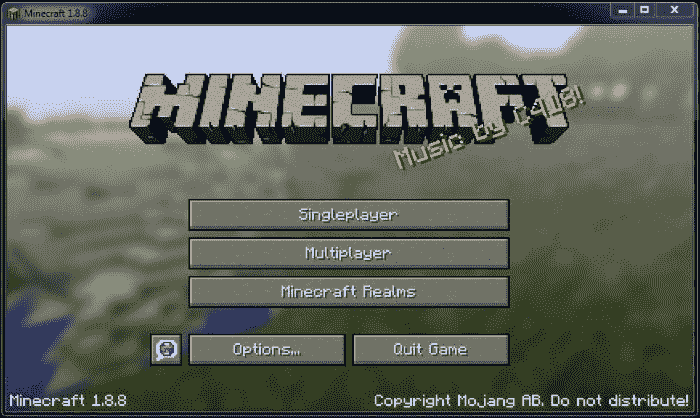
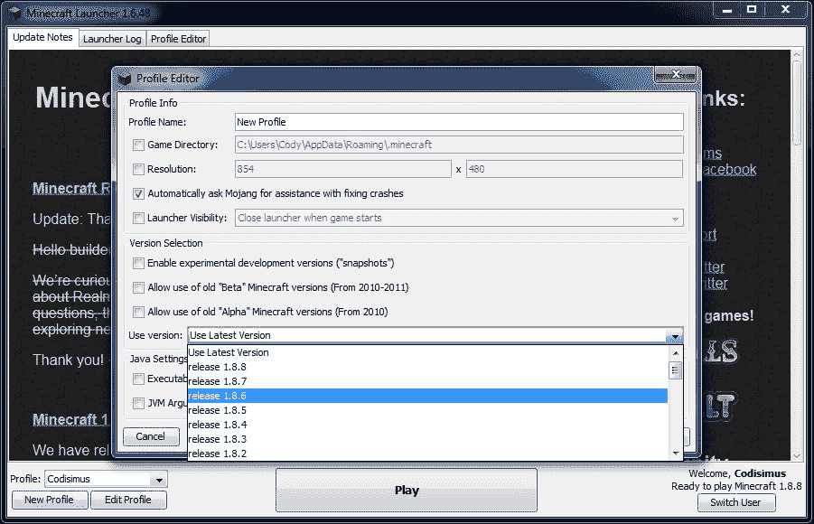
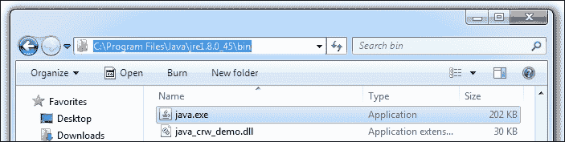
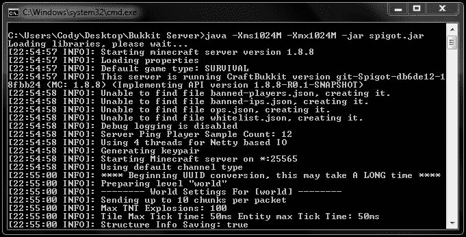
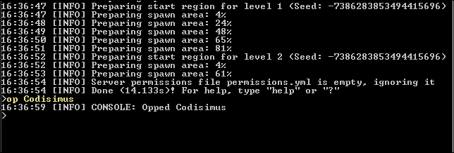
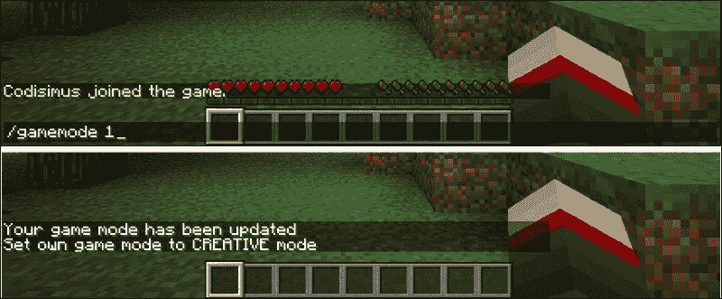
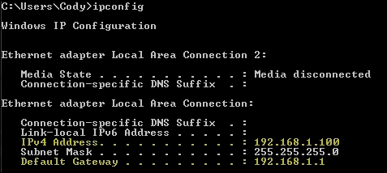

# 第一章：部署 Spigot 服务器

使用 Bukkit API 修改 Minecraft 的第一步是在你的 Windows PC 上安装一个**多人服务器**。一个**多人服务器**本质上与单人 Minecraft 服务器相同，但它允许更多的定制，并且不受限于你家里的网络。**Spigot**是 Minecraft 服务器的修改版本，它将用于加载你创建的**插件**。一个**插件**是一段软件，它可以连接或插入到另一段软件中。这本书中你将开发的代码将以插件的形式存在。这些插件将连接到 Minecraft 代码并改变 Minecraft 的操作方式。我们将设置一个 Spigot 服务器并使用它来测试你将编写的插件。到本章结束时，你的所有朋友都将能够登录到你的修改后的 Minecraft 服务器并一起玩耍。通过完成本章的以下部分，我们将部署一个 Spigot 服务器，它将在后面的章节中进行修改：

+   Spigot 简介

+   安装 Spigot 服务器

+   理解和修改服务器的设置

+   使用控制台和在游戏中的 Minecraft 和 Bukkit 服务器命令

+   端口转发

# Spigot 简介

当你设置自己的服务器并开始创建插件时，你可能会遇到一些对你来说可能全新的术语。这些术语是**Vanilla**、**Bukkit**、**CraftBukkit**和**Spigot**。

**Vanilla**指的是由 Mojang/Microsoft 开发的正常 Minecraft 游戏。Vanilla 服务器是游戏的官方版本。可以从[minecraft.net](http://minecraft.net)下载，通常命名为`minecraft_server.jar`或`minecraft_server.exe`。当前的 vanilla 服务器不支持任何类型的 mod 或插件。这就是 Bukkit 发挥作用的地方。

**Bukkit**是一个帮助我们开发插件的 API。我们将在第二章《学习 Bukkit API》中详细讨论。在此之前，只需知道当你听到*bukkit plugins*这个短语时，它指的是针对 Bukkit API 构建的插件。

Bukkit API 最初是由**CraftBukkit**团队开发的。这引出了下一个术语。**CraftBukkit**是一个修改版的 Minecraft 服务器，它取代了 vanilla 服务器。CraftBukkit 和 vanilla Minecraft 为我们提供了几乎相同的游戏。区别在于 CraftBukkit 具有加载 Bukkit 插件和执行游戏内代码的能力。CraftBukkit 将 Bukkit 方法和变量转换为 Mojang 开发的 Minecraft 代码。CraftBukkit 还包括额外的代码，以帮助插件开发者完成某些任务，例如保存/加载数据、监听服务器事件和安排需要执行的代码。在这本书中，我们将不会过多提及 CraftBukkit，因为它已被一个名为**Spigot**的项目所取代。

**Spigot** 完全替代了原版的 Minecraft 服务器，就像 CraftBukkit 一样。Spigot 是建立在 CraftBukkit 项目之上的。因此，它们共享了很多相同的代码。然而，Spigot 通过其设置提供了更多的可配置性；在许多方面，它运行得更快。Spigot 团队现在维护了所有三个项目，即 Bukkit、CraftBukkit 和 Spigot。你可以使用 CraftBukkit 或 Spigot 来运行服务器，因为 Spigot 团队已经足够友好地提供了这两个选项。我建议运行 Spigot 服务器，原因如前所述。

# 安装新的 Spigot 服务器

我们将从零开始设置这个新的服务器。如果你希望使用现有的世界，你将在创建新的 Spigot 服务器后能够这样做。首先，让我们创建一个名为 `Bukkit Server` 的新空文件夹。我们将从这个新创建的文件夹中运行 Spigot 服务器。

你需要启动新服务器的主体文件是 `spigot.jar`。一个 **JAR** 文件是一个可执行的 Java 文件。Minecraft、Spigot 以及我们将创建的每一个插件都是用 Java 编写的，因此它们都是从 `JAR` 文件中运行的。Spigot 团队会随着 Mojang 发布新的 Minecraft 版本来更新 `spigot.jar` 文件。通常情况下，当你连接到 Minecraft 服务器时，你必须玩的是同一个版本。如果你不确定你的 Minecraft 版本，它会在 Minecraft **客户端**的左下角显示。一个 **客户端** 是你用来玩 Minecraft 的程序，如下面的截图所示：



你可以通过在 Minecraft 启动器中创建一个新的配置文件来选择你想要玩的 Minecraft 版本，如下面的截图所示：



由于法律原因，Spigot 团队不允许你下载 `spigot.jar`。然而，它确实提供了工具和说明，以便你可以自己构建 `JAR` 文件。Spigot 团队通过提供最新的说明以及故障排除指南来不断改进这一过程，指南可以在 [`www.spigotmc.org/threads/buildtools-updates-information.42865/`](https://www.spigotmc.org/threads/buildtools-updates-information.42865/) 找到。本章包括如何获取所需 `JAR` 文件的简化说明。然而，如果你在构建这些 `jar` 文件时遇到问题，请参考 [spigotmc.org](http://spigotmc.org) 上提供的说明。

为了运行构建工具，你需要 Git for Windows。你可以在[`msysgit.github.io/`](http://msysgit.github.io/)下载它。在安装 Git for Windows 时，默认的安装设置将足够。你还需要下载构建工具`JAR`文件，可以在[`hub.spigotmc.org/jenkins/job/BuildTools/lastSuccessfulBuild/artifact/target/BuildTools.jar`](https://hub.spigotmc.org/jenkins/job/BuildTools/lastSuccessfulBuild/artifact/target/BuildTools.jar)找到。创建一个新的文件夹来放置`BuildTools.jar`。将这个文件夹命名为`Spigot Build Tools`。在同一文件夹内创建一个新的文本文件。将这个文本文件命名为`update.txt`。打开这个`text`文件，并写入以下代码行：

```java
"<java bin path>\java.exe" -jar BuildTools.jar
```

`<java bin path>` 应替换为 Java 安装的位置。Java 路径取决于你电脑上安装的 Java 版本。在`Program Files`或`Program Files (x86)`目录中查找`Java`文件夹。`Program Files`目录通常位于主硬盘的根目录，通常是`C:\`。如果你看不到 Java 文件夹，那么你可能需要安装 Java。你可以在[`java.com/download/`](https://java.com/download/)下载它。

一旦你进入`Java`文件夹，你会看到一个或多个 java 安装文件夹，例如`jre7`或`jre8`。打开安装文件夹。如果有多个，请打开版本号较高的一个。在 java 安装文件夹中，打开`bin`目录。在这里你应该能看到`java.exe`，尽管它可能只显示为**java**。从资源管理器窗口的顶部复制路径；这就是 java bin 路径，如下面的截图所示：



如果你安装了 Java 8，那么更新文件中的代码行将类似于以下代码：

```java
"C:\Program Files (x86)\Java\jre1.8.0_45\bin\java.exe" -jar BuildTools.jar
```

### 小贴士

在大多数 PC 上，你可以用 java 变量代替 java.exe 路径。因此，更新文件中的代码行将如下所示：`java -jar BuildTools.jar`

保存文件，并将其重命名为`update.txt`到`update.sh`。如果你看不到文件的`.txt`扩展名，那么你可能需要通过执行以下步骤来调整文件夹选项：

1.  打开上左角的**视图**选项卡

1.  选择**文件夹和搜索选项**

1.  取消选中**隐藏已知文件类型的扩展名**

1.  点击**确定**

现在，您可以将 `update.txt` 重命名为 `update.sh`。通过双击 `update.sh` 来运行它。这将执行构建工具，下载所有代码并应用更改，直到更新完成。这可能需要几分钟的时间。一旦完成，您将拥有 `spigot.jar`、`craftbukkit.jar` 和 `bukkit.jar`。两个服务器 JAR 文件，即 spigot 和 craftbukkit，将位于您放置 `BuildTools.jar` 的 `Spigot Build Tools` 目录中。`bukkit.jar` 文件位于同一文件夹中的 `Bukkit/target` 目录。每个文件都将附加一个版本号，例如 `spigot-1.8.8.jar` 和 `bukkit-1.8.8-R0.1-SNAPSHOT.jar`。请注意这些文件的位置，因为您在本章以及整本书中都需要它们。

### 注意

建议每周运行一次 update.sh 脚本，以确保您拥有 Spigot 的最新版本。

复制 `spigot.jar` 文件并将其放置在您在本段开始时创建的 `Bukkit Server` 文件夹中。为了简化，我们将移除版本号并将文件重命名为 `spigot.jar`。

现在，我们将创建一个批处理文件，每次我们想要启动服务器时都可以双击它。在一个新的文本文档中，输入以下两行：

```java
java -Xms1024M -Xmx1024M -jar spigot.jar
PAUSE
```

`1024` 表示服务器将被允许使用的计算机 RAM 量。如果您想调整服务器使用的 RAM 量，可以更改此数字。`spigot.jar` 是 `spigot.jar` 文件的名字。这个名字必须与您的文件名匹配。我们将文件重命名以排除版本号，这样我们就不需要在每次更新 Spigot 服务器到最新版本时编辑此批处理文件。`java` 表示我们正在使用 Java 运行服务器。如果在接下来的步骤中服务器没有启动，您可能需要将 `java` 替换为之前复制的完整 Java 路径。批处理文件中的其余代码不应让您担心，并且应保持不变。

将文本文档保存为 `Start Server.bat` 并确保它与 `spigot.jar` 在同一文件夹中。现在，您将能够运行服务器。双击您刚刚创建的批处理文件。它将打开命令提示符并开始创建服务器文件。它看起来应该像下面的截图，并应显示您正在使用的 Minecraft 服务器版本：



如果您没有看到**Starting minecraft server**的消息，那么批处理文件可能存在问题。如果之前截图所示的窗口没有出现，请确保批处理文件名为`Start Server.bat`而不是`Start Server.bat.txt`。当您第一次启动服务器时，您将看到一些警告。其中大多数不必担心，因为它们是预期的。然而，您可能会看到一个解释您需要同意 EULA 才能运行服务器的消息。如果您查看`Bukkit Server`文件夹，您现在将看到一个名为`eula.txt`的新文件。打开此文件，将`eula=true`设置为同意条款，这些条款由 Mojang 在[`account.mojang.com/documents/minecraft_eula`](https://account.mojang.com/documents/minecraft_eula)中概述。一旦这样做，您就可以再次启动服务器。这次，您将看到服务器正在加载并生成一个新的世界。

# 设置新服务器

您将看到服务器文件夹中填充了几个文件和文件夹。其中一些文件的作用在本节中解释，但大多数文件目前不应引起您的关注：

+   `plugins`: 此文件夹是您将放置所有希望用于服务器的 Bukkit 插件的文件夹。

+   `world`: 以`world`开头的文件夹，例如`world`、`world_nether`等，包含服务器新世界的所有信息。如果您已经有一个希望使用的 Minecraft 世界，那么请用旧世界文件夹替换这些新文件夹。不要在服务器运行时尝试这样做，因为这会导致问题。

+   `server.properties`: 此文件包含多个选项，允许您更改 Minecraft 服务器的运行方式。您可以使用文本编辑器打开它。有许多设置，其中大多数都很直观。以下列表中我将介绍一些您可能想要修改的设置。要查看属性解释的完整列表，您可以访问[www.minecraftwiki.net/wiki/Server.properties](http://www.minecraftwiki.net/wiki/Server.properties)。更改这些设置将需要您重新启动服务器。

    +   `pvp=true`: `pvp` 属性可以被设置为布尔值。**PvP**（即**玩家对玩家**）决定玩家是否可以攻击并伤害彼此。您可以根据是否希望开启或关闭 PvP 功能，将其设置为`true`或`false`。

    +   `difficulty=1`: 难度属性可以被设置为从`0`到`3`的数字，其中`0`表示*和平*，`1`表示*简单*，`2`表示*普通*，`3`表示*困难*。服务器上的每个人都将在这个难度级别上玩游戏。

    +   `gamemode=0`: 此属性确定玩家将开始哪种游戏模式，其中`0`表示*生存*，`1`表示*创造*，`2`表示*冒险*。

    +   `motd=A Minecraft Server`: **MOTD**（即**每日消息**。当你在 Minecraft 多人服务器列表中查看服务器时，将显示此消息，如下面的截图所示。将此设置为对服务器简短描述是个好主意。例如，可以是`Bukkit 插件测试`。设置新服务器

    +   `online-mode=true`: 可以将此设置为`false`，以允许玩家在离线模式下连接到服务器。如果[`minecraft.net/`](http://minecraft.net/)不可用或你的电脑未连接到互联网，这很有用。在离线模式下运行你的服务器可能会引起安全问题，例如其他玩家登录到你的账户。

+   `bukkit.yml`: 此文件包含许多服务器选项。这些是原版服务器不提供的选项，并且仅在运行修改后的服务器时可用。请注意，此文件是 YMAL（`.yml`）文件，而不是属性文件（`.properties`）。当你打开它时，你会看到两种文件类型格式不同。你首先会看到的是某些行有缩进。你不需要完全理解 YMAL 格式，因为随着我们创建 Bukkit 插件的过程，它将会进一步解释。此文件中有一些设置我将引起你的注意，如下面的列表所示。要查看这些 Bukkit 设置的完整列表，你可以访问[wiki.bukkit.org/Bukkit.yml](http://wiki.bukkit.org/Bukkit.yml)。与`server.properties`一样，更改这些设置将需要你重新启动服务器。

    +   `allow-end: true`: 原版 Minecraft 服务器允许你禁用下界世界的功能。Bukkit 服务器也允许你禁用末地世界。将此设置为`false`以防止玩家前往末地。

    +   `use-exact-login-location: false`: 原版 Minecraft 包含一个功能，该功能将阻止玩家在方块内生成。玩家将生成在方块上方，这样他们在加入服务器时就不会卡住。这可以很容易地被用来爬上玩家通常无法触及的方块。Bukkit 可以通过在玩家注销的确切位置生成玩家来防止这种情况发生。如果你希望防止这种情况，请将此属性设置为`true`。

    +   `spawn-limits`: Bukkit 允许服务器管理员修改在给定**区块**内允许生成的怪物和动物的数量。如果你不熟悉**区块**这个术语，它是从床岩到天空最高点的一组`16 x 16`方块。以下是在 Minecraft 中单个区块的图片；如果你觉得生成的怪物太多（或太少），那么你将想要相应地调整这些值：设置新服务器

    +   `ticks-per: autosave: 0`: 与 vanilla Minecraft 不同，Bukkit 服务器不会定期保存你的玩家/世界数据。自动保存数据可能会防止服务器在崩溃或由于某些原因（如电脑断电）关闭时丢失游戏中所做的更改。vanilla 默认将其设置为`6000`。这个值是以**tick**为单位的。每秒有 20 个**tick**。我们可以用这个数学方法来确定 6,000 个 tick 是多长时间：6000 tick / 20 tick/second = 300 秒，300 秒 / 60 秒/分钟 = 5 分钟。从这个计算中，你应该能够计算出你希望服务器在多长时间后自动保存你的进度。如果你的服务器在保存更改时出现延迟，那么你可能想增加这个数字。设置为`72000`将导致每小时只出现一次延迟。然而，如果服务器在即将保存之前崩溃，你可能会丢失过去一小时所做的任何进度。

+   `spigot.yml:` 这个文件类似于`bukkit.yml`。它包含许多仅在运行 Spigot 服务器时才可用的设置和配置。如果你希望配置这些选项中的任何一个，请参阅文件顶部的文档。

# Minecraft/Bukkit 服务器命令

我们现在已经设置了所有自定义选项。接下来，让我们登录到服务器并查看游戏中的服务器命令。

要登录到你的服务器，你需要知道你电脑的 IP 地址。在本章的后面部分，我们将讨论如何找到这个必要的信息。然而，现在我将假设你将在运行你的服务器的同一台机器上玩 Minecraft。在这种情况下，对于服务器的 IP，只需输入`localhost`。一旦你连接到服务器，你会看到 Spigot 服务器本质上与 vanilla 服务器相同，因为你还没有安装任何插件。服务器运行 Bukkit 的第一个迹象是你将有一些额外的命令可供使用。

Bukkit 继承了所有 Minecraft 服务器命令。如果你曾经玩过 Minecraft 服务器，那么你可能已经使用过其中的一些命令。如果你还没有，我将解释一些有用的命令。这些命令可以输入到**控制台**或游戏内控制台。在这里，“控制台”指的是运行你的服务器的命令提示符。Bukkit 有一个内置的权限系统，它限制了玩家使用特定命令。

如果他们没有必要的权限，他们将无法使用命令。我们将在后面的章节中详细讨论这个问题，但到目前为止，我们将使你的玩家成为**操作员**，或简称**op**。**操作员**自动拥有所有权限，并将能够执行所有将要展示的命令。要成为操作员，将`op`命令输入到控制台，如下所示：

```java
>op <player>

```

将`<player>`替换为你的玩家名称。请参见以下截图中的高亮命令以获取示例：



一旦你被 *Opped*，你就可以测试一些游戏内的服务器命令了。为了正确使用命令，你必须了解命令语法。以下以 `gamemode` 命令为例：

```java
gamemode <0 | 1 | 2 | 3> [player]

```

+   `< >` 表示这是一个必需的参数。

+   `[ ]` 表示这是一个可选参数。对于此命令，如果未包含玩家参数，则将设置你自己的游戏模式。

+   `|` 是表示单词 *或* 的已知符号。因此，`<0 | 1 | 2 | 3>` 表示可以输入 0、1、2 或 3。它们分别代表 *生存模式*、*创造模式*、*冒险模式* 和 *旁观者模式*。

+   参数必须始终按照显示的顺序输入。通常，如果你输入了错误的命令，会出现一条帮助信息，提醒你如何正确使用该命令。

注意，当你发布游戏内命令时，必须以 `/` 开头，但当你从控制台发布命令时，`/` 必须省略。正确使用 `gamemode` 命令将是 `/gamemode 1`，这将把你的游戏模式设置为**创造模式**，如下面的截图所示：



这个命令的另一个示例是 `/gamemode 2 Steve`，这将找到用户名为 `Steve` 的玩家并将他的游戏模式更改为*冒险模式*。

现在你已经了解了命令的基本语法，你可以从以下列表中学习如何使用一些其他有用的服务器命令。其中大部分命令也存在于原版 Minecraft 中。只有少数命令是 Bukkit 服务器特有的：

+   `gamerule <rule> [true | false]`

    这种示例是 `/gamerule mobGriefing false`。

    规则参数可以设置为以下任何一个：

    +   `doMobSpawning`: 这决定了怪物是否会自然生成

    +   `keepInventory`: 这决定了玩家死亡时是否保留他们的物品

    +   `mobGriefing`: 这决定了像爬行者这样的怪物是否可以破坏方块

    +   `doFireTick`: 这决定了火是否应该蔓延

    +   `doMobLoot`: 这决定了怪物是否应该掉落物品

    +   `doDaylightCycle`: 这决定了日夜循环是否生效

+   `give <player> <item> [amount [data]]`

    +   例如，`/give Codisimus wool 3 14` 给 Codisimus 3 红色羊毛。

+   `plugins` (仅适用于 Bukkit)

    +   例如，`/plugin`s 或 /`pl` 显示服务器上安装的所有插件列表。

+   `reload` (仅适用于 Bukkit)

    +   例如，`/reload` 或 `/rl` 禁用所有插件并重新启用它们。此命令用于加载插件的新设置，而无需关闭整个服务器。

+   `spawnpoint [player] [x y z]`

    +   例如，`/spawnpoint` 允许你在死亡时出现在你站立的位置。

+   `stop`

    +   例如，`/stop` 保存你的进度并关闭服务器。这是你应该停止服务器以确保数据保存的方法。如果你只是通过点击 **X** 关闭命令提示符，你将丢失数据。

+   `tell <player> <message>`

    +   例如，`/tell Steve my secret base is behind the waterfall` 发送一条只有 Steve 能看到的消息。请注意，这些消息也会打印到控制台。

+   `time set <day | night>`

    +   例如，`/time set day` 将服务器的时钟设置为 `0`（白天）。

+   `toggledownfall`

    +   例如，`/toggledownfall` 停止或开始降雨/降雪。

+   `tp [player] <targetplayer>`

    +   例如，`/tp Steve Codisimus` 将 Steve 传送到 Codisimus 的位置。

关于这些和其他命令的更多信息，请访问 [minecraft.gamepedia.com/Commands](http://minecraft.gamepedia.com/Commands) 和 [wiki.bukkit.org/CraftBukkit_commands](http://wiki.bukkit.org/CraftBukkit_commands)。前面提到的命令和属性文件给了您很多控制服务器功能的方式。

# 端口转发

当没有其他人可以登录时，自己运行 Minecraft 服务器有什么乐趣呢？我现在将解释如何允许您的朋友连接到您的服务器，这样他们就可以和您一起玩了。为了做到这一点，我们首先需要找到您的 IP 地址。就像您的住所有一个街道地址一样，您的计算机在互联网上也有一个地址。这就是您的朋友将在他们的 Minecraft 客户端中输入以找到您的服务器的地址。要找到 IP 地址，只需在 Google 上搜索 `IP`。在结果顶部将有一条声明， "**您的公共 IP 地址是 XX.XX.XXX.XX**”（X 符号将被数字替换，其总长度可能不同）。您还可以访问 [www.whatismyip.com](http://www.whatismyip.com) 来查找您的 IP 地址。

一旦您有了 IP 地址，尝试使用它来连接到您的服务器，而不是使用 `localhost`。如果您能够连接，那么您的朋友也能做到。如果不能，您将需要采取额外的步骤来允许其他玩家连接到您的服务器。如果您的计算机连接到路由器，情况就是这样。我们必须让路由器知道它应该将其他 Minecraft 玩家指向运行服务器的您的计算机。这个过程称为 **端口转发**。为此，我们首先需要一些额外的信息。

我们需要知道您在本地网络中的计算机的 IP 地址。这个 IP 地址将与我们之前获得的不同。我们还需要知道您路由器的 IP 地址。要获取这些信息，请打开一个新的命令提示符窗口。命令提示符可以在以下路径找到：

`开始菜单/所有程序/附件/命令提示符`

您也可以搜索 `cmd.exe` 来找到它。一旦命令提示符打开，输入以下命令：

```java
>ipconfig

```

然后，按 *Enter* 键。将显示一个屏幕，它将类似于以下截图所示：



在上一张图片中，您要找的两个 IP 地址已经被突出显示。这些数字很可能与这些示例数字非常相似。"**IPv4 地址**" 是您的计算机地址，而 "默认网关**" 是您路由器的地址。请记下这两个 IP 地址。

接下来，我们将登录到您的路由器。在网页浏览器中，输入路由器的 IP 地址，在我们的例子中是 **192.168.1.1**。如果您这样做正确，那么您将看到一个登录表单，要求输入用户名和密码。如果您不知道这些信息，您可以在两个字段中尝试输入 `admin`。如果这不起作用，您将不得不找到默认的用户名和密码，这些信息通常可以在您的路由器提供的文件中找到。这些信息通常也可以通过搜索您的路由器名称以及 "默认登录**" 等术语在网上找到。

一旦我们登录到路由器，我们必须找到包含端口转发设置的区域。世界上有各种各样的路由器品牌和型号，它们都以不同的方式提供此选项。因此，我无法提供如何找到此页面的具体说明。但是，您会想要寻找一个标签，其名称包含 "转发**"、"端口转发**" 或 "应用与游戏**" 等术语。如果您看不到这些选项，请通过探索高级设置来扩大搜索范围。一旦找到正确的页面，您很可能会看到一个类似于以下表格的表格：

| 应用名称 | 外部端口 | 内部端口 | 协议 | IP 地址 |
| --- | --- | --- | --- | --- |
| Bukkit 服务器 | 25565 | 25565 | TCP 和 UDP | 192.168.1.100 |

按照上一张表格所示填写字段。布局和格式当然会根据您的路由器而有所不同，但重要细节是您需要将端口 `25565` 转发到您之前找到的 IP 地址，在我们的例子中是 **192.168.1.100**。确保保存这些新设置。如果您操作正确，那么现在您应该能够通过使用您的公共 IP 地址连接到服务器。

# 摘要

您现在已经在您的 PC 上运行了一个 Spigot 服务器。您可以告诉您的朋友您的 IP 地址，这样他们就可以和您一起在您的新服务器上玩游戏。在本章中，您熟悉了游戏内命令及其使用方法，并且一旦我们编写了插件，您的服务器就可以安装 Bukkit 插件。为了准备编写这些插件，我们首先需要熟悉 Bukkit API 以及如何使用它。
