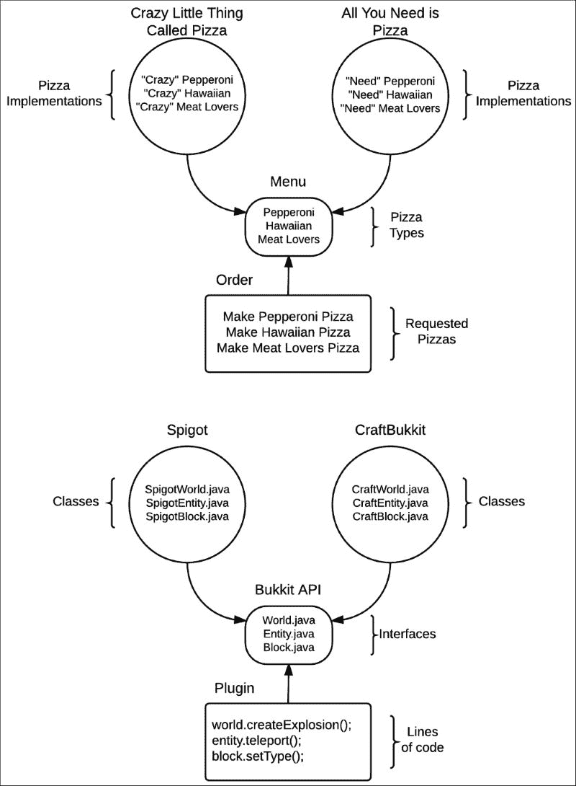
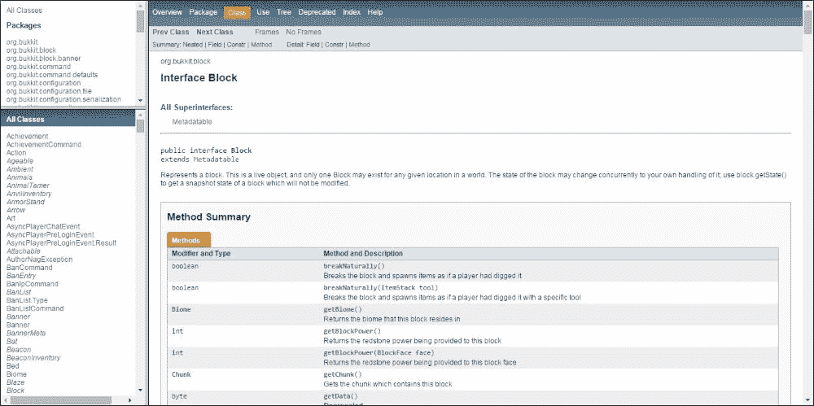
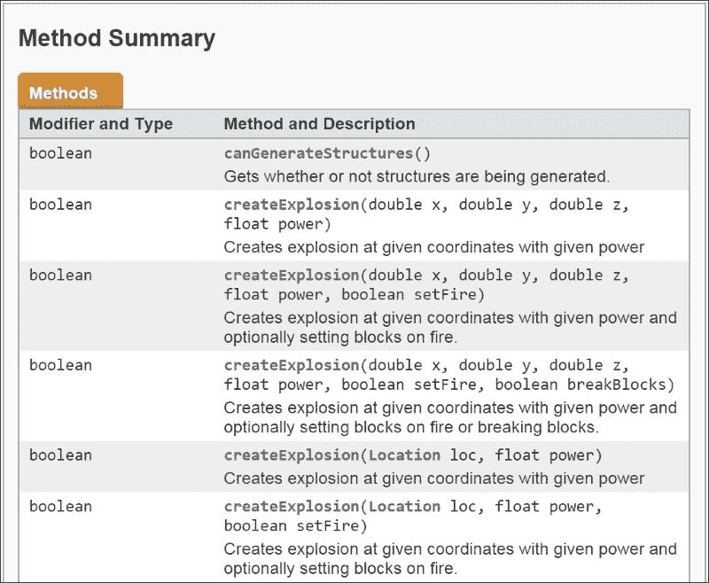
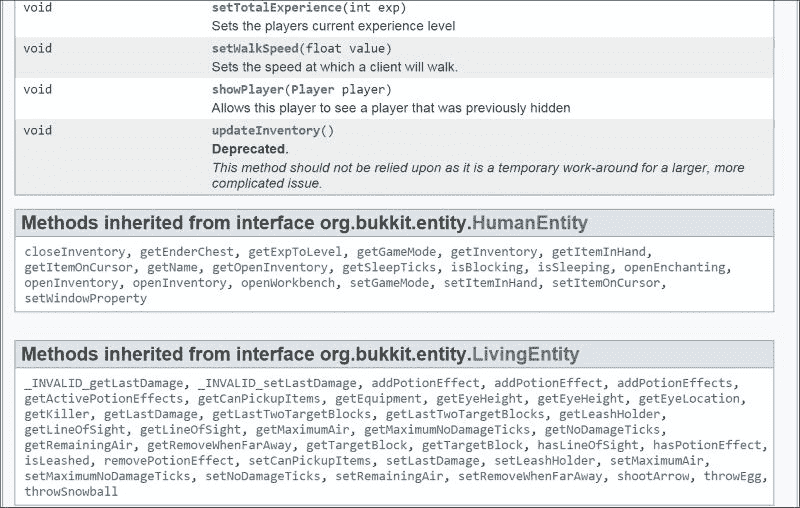

# 第二章：学习 Bukkit API

在本章中，您将了解**Bukkit** **API**，并学习通过为 Spigot 服务器编写插件编程可以完成什么。到本章结束时，您可能会有很多关于插件的想法，您最终将能够自己创建它们。本章将详细介绍以下主题：

+   理解 API 的目的

+   查找 Bukkit API 的文档

+   在 Javadocs 中导航以查找特定信息

+   阅读和理解文档

+   探索和学习 Bukkit API 的功能

# API 简介

**API**代表**应用程序编程接口**。API 帮助控制各种软件组件的使用方式。正如前一章所述，Spigot 将 Minecraft 代码以开发者易于利用的形式包含在内，以便在创建插件时使用。Spigot 包含大量我们不需要访问的代码，以便创建插件。它还包括我们不应篡改的代码，因为这可能会导致服务器变得不稳定。Bukkit 为我们提供了可以用来正确修改游戏并限制对代码其他部分的访问的接口。**接口**本质上是一个类的壳。它包括方法，但方法是空的。Spigot 服务器包含每个接口的类。这些类实现了接口，并用适当的代码填充每个方法。

为了更好地解释这一点，让我们想象 Bukkit API 就像一家披萨店的菜单。菜单包含不同类型的披萨，如意大利辣肠披萨、夏威夷披萨和肉食爱好者披萨。这些菜单项代表 API 中的接口，每个接口都有一个名为`makePizza`的方法。在这个阶段，这些披萨不能吃，因为它们只是一个概念。它们只是菜单上的项目。但假设一家名为“所有你需要的是披萨”的披萨店决定开业，并使用这个菜单或 API。这家披萨店可以代表 CraftBukkit。披萨店为菜单上的每个项目创建食谱。这相当于为三个接口中的每个`makePizza`方法编写代码。因此，这些食谱是实现接口的类。然而，这些类仍然只是一个概念。只有在调用`makePizza`方法时，您才有这个类的实例。这个实例，或对象，将是您可以真正食用的有形披萨。现在，想象另一家名为“疯狂的小东西叫披萨”的披萨店在“所有你需要的是披萨”的对面开业。这家新披萨店将代表 Spigot。“疯狂的小东西叫披萨”使用与“所有你需要的是披萨”完全相同的菜单或 API。然而，它的食谱，或方法的实现，可能不同。

使用这个相同的类比，我们可以看到 API 的好处。作为一个客户，我可以查看菜单并组装一个订单。例如，我想点一个辣味披萨和一个肉食爱好者披萨。由于我的订单是基于菜单，并且两家披萨店都实施了相同的菜单，所以任何一家餐厅都能满足我的订单。同样，开发者基于 Bukkit API 创建插件。**CraftBukkit** 和 **Spigot** 都使用 **Bukkit API**。因此，它们都将支持该插件。以下图表解释了披萨和代码之间的这种关系：

基本上，Bukkit 在插件和 Spigot 服务器之间充当桥梁。随着 Minecraft 中新功能的开发，Spigot 团队会向 API 中添加新的类、方法等，但现有的代码很少改变。这确保了即使 Minecraft/Spigot 发布了新版本，Bukkit 插件仍然可以正确运行数月甚至数年。例如，如果 Minecraft 改变了实体生命值处理的方式，我们不会看到任何差异。

Spigot jar 会通过将更新后的代码填充到 `getHeath` 方法中来处理这种变化。然后，当插件调用 `getHealth` 方法时，它将像更新前一样正常工作。新 Minecraft 功能（如新物品）的添加是 Bukkit API 优秀的另一个例子。假设我们创建了一个给食物添加保质期的插件。要检查一个物品是否是食物，我们将使用 `isEdible` 方法。Minecraft 继续创建新物品。如果这些新物品中有一个是 **南瓜面包**，Spigot 将将该类型物品标记为可食用，因此我们的插件将为其设置保质期。一年后，即使我们不需要更改任何代码，新的食物物品仍然会被赋予保质期。

# Bukkit API 文档

Bukkit API 的文档可以在 [hub.spigotmc.org/javadocs/bukkit/](http://hub.spigotmc.org/javadocs/bukkit/) 找到。你在 第一章 中构建的 Bukkit.jar 文件，*部署 Spigot 服务器* 也包含了 Spigot API，可以在 [hub.spigotmc.org/javadocs/spigot/](http://hub.spigotmc.org/javadocs/spigot/) 找到。Spigot API 是 Bukkit API 的 **超集**，这意味着它包含了在 Bukkit API 中存在的所有类、接口等，以及一些仅属于 Spigot 项目的独特类。如果你想你的插件支持 Spigot 和 CraftBukkit 服务器，那么你将希望使用 Bukkit API 进行开发。如果你选择只支持 Spigot 服务器，那么你可以使用 Spigot API 进行开发。在这本书中，我们将参考 Bukkit API。然而，使用 Spigot API 将产生相同的结果。

# 在 Bukkit API 文档中导航

我们可以通过 Bukkit API 文档来了解我们可以在 Spigot 服务器上修改什么。服务器端插件与客户端模组不同，因为我们使用服务器端插件在游戏中修改的能力有限。例如，我们无法创建新的方块类型，但我们可以让熔岩方块从天空中落下。我们无法让僵尸看起来和听起来像恐龙，但我们可以给僵尸套上绳索，将其名字改为 Fido，并让它不在白天燃烧。大部分情况下，你无法改变游戏的外观，但你可以在功能上做出改变。这确保了所有使用标准 Minecraft 客户端连接到服务器的玩家都将有相同的体验。

为了了解更多我们可以做什么的例子，让我们看看 API 文档的各个页面：

你会看到 API 中的类和接口在**Javadoc**的左下角是可选的。在左上角选择一个包将缩小下面部分的选项。每种类型，如类或接口，都组织在一个包中。这些包有助于将类似的类分组在一起。例如，`Cow`、`Player`和`Zombie`都是实体类型，因此可以在`org.bukkit.entity`包中找到。所以，如果我说`World`接口可以在`org.bukkit.World`找到，那么你就会知道你可以在`org.bukkit`包中找到`World`。了解这一点将帮助你找到你正在寻找的类或接口。你始终可以使用*Ctrl + F*在网页上搜索特定的单词。这有助于在长列表中找到特定的类。

让我们来看看`World`类，看看它有哪些功能。类按字母顺序列出。因此，我们将在`org.bukkit`包的末尾找到**World**类。当你点击`World`类的链接时，所有的方法将在网站主列中的**方法摘要**标题下显示，如下面的截图所示：

`World`对象是服务器上的整个世界。默认情况下，Minecraft 服务器有多个世界，包括主世界、下界世界和末地世界。Spigot 甚至允许你添加额外的世界。`World`类中列出的方法可以应用于特定的世界对象。例如，`Bukkit.getWorlds`方法将给你一个服务器上所有世界的列表；每个都是唯一的。因此，如果你在第一个世界上调用的`getName`方法可能返回`world`，而在第二个世界上调用的相同方法可能返回`world_nether`。

# 理解 Java 文档

让我们看看 `World` 类中包含的一个方法，看看它提供了哪些信息。点击链接查看 `createExplosion(Location loc, float power, boolean setFire)` 方法。你将被带到与以下截图类似的方法描述：

截图解释了该方法每个参数和返回值。此方法需要我们传递三个参数，具体解释如下：

+   爆炸应该发生的位置

+   爆炸应该有多强大

+   是否爆炸应该导致周围的方块着火

如果返回值是 `void`，则该方法不会向我们发送任何信息。在这个例子中，该方法返回一个 `boolean` 值。在阅读文档时，你会了解到返回值表示爆炸是否实际发生。如果另一个插件阻止了爆炸的发生，那么 `createExplosion` 方法将返回 `false`。

# 探索 Bukkit API

现在你已经熟悉了 Bukkit API 文档，我建议你自己浏览一下。你会发现有趣的方法；其中许多方法会激发你制作酷炫插件的灵感。请注意，可能会有额外的链接查看该对象的其他方法。例如，`Player` 是 `**LivingEntity**` 类型的一种。因此，你可以在 `Player` 对象上调用 `**LivingEntity**` 方法。这种继承关系在方法摘要之后显示，如下面的截图所示：

如果你打算尝试想出一个插件的想法，浏览 API 文档肯定会给你一些灵感。我建议阅读以下列出的类页面，因为它们将是你在未来插件中经常使用的类：

| 类 | 包 | 描述 |
| --- | --- | --- |
| `World` | `org.bukkit` | 服务器上的一个世界 |
| `Player` | `org.bukkit.entity` | 在服务器上玩的人 |
| `Entity` | `org.bukkit.entity` | 玩家、怪物、物品、投射物、车辆等 |
| `Block` | `org.bukkit.block` | 世界中的特定块，例如泥土块或箱子 |
| `Inventory` | `org.bukkit.inventory` | 玩家、箱子、熔炉等的库存 |
| `ItemStack` | `org.bukkit.inventory` | 存储在库存中的物品，包括物品的数量 |
| `Location` | `org.bukkit` | 实体或方块的位置 |
| `Material` | `org.bukkit` | 块或物品的类型，例如 `DIRT`、`STONE` 或 `DIAMOND_SWORD` |
| `Bukkit` | `org.bukkit` | 包含许多可以在代码的任何地方调用的有用方法 |

现在你已经了解了如何阅读 Bukkit Java 文档，你可以找到你可能有的各种问题的答案。例如，如果你想找出调用哪些方法来获取名为"world"的世界中`x:20 y:64 z:14`位置的 Block，你会怎么做？

首先，你需要检索正确的`World`对象。你可能检查的第一个地方是 Bukkit 类，如前表所示。你可以检查那里，因为你可以从你的代码的任何地方调用这些方法。另一个选项是查看`World`类的使用情况。这可以通过点击**World**页面顶部的**Use**链接来完成。在那里，你可以看到所有返回`World`对象的方法以及接受`World`对象作为参数的方法。为了帮助你在页面上搜索，请记住你可以使用*Ctrl + F*。搜索*name*将带你到`Bukkit.getWorld`方法，该方法接受世界的名称作为参数并返回实际的`World`对象。

一旦你有了`World`对象，你将想要找到一个方法来获取特定位置的`Block`。你可以导航到世界页面，并使用*Ctrl + F*来搜索*block*、*location*、*x*、*y*或*z*。如果这些都没有帮助你找到有用的方法，那么你总是可以以类似于我们查看 World 使用方式的方式来查看 Block 的使用。无论如何，你都会找到`World.getBlockAt`方法，这个方法可以在你上一步发现的`World`对象上调用。

以下是一些额外的挑战，以指导你在自己探索 Bukkit API 并熟悉它时：

+   你会调用哪个方法来检查一个世界中的时间是什么时候？

+   你会调用哪些方法来向名为 Steve 的玩家发送消息？

+   你会调用哪些方法来检查一个块的材质是否可燃？

+   你会调用哪个方法来检查玩家是否在他们的库存中有钻石？

+   你会调用哪些方法来检查玩家是否持有可食用的物品？

# 摘要

如果你在解决挑战中提到的任何问题或 Bukkit API 的任何其他部分遇到困难，你可以从 Spigot 论坛([www.spigotmc.org/forums](http://www.spigotmc.org/forums))、Spigot 的官方 IRC 频道([www.spigotmc.org/pages/irc](http://www.spigotmc.org/pages/irc))和 Minecraft 论坛([www.minecraftforum.net](http://www.minecraftforum.net))寻求帮助。

你也可以直接联系我或访问我的网站[www.codisimus.com](http://www.codisimus.com)。我总是乐于帮助其他开发者。

你现在拥有了开始编写自己的 Bukkit 插件所需的知识。正如我们在本章中所做的那样，我们将不得不参考文档来查找所需的信息。能够导航并理解 API 文档将加快编码过程。如果你对 API 的某个部分感到不确定，你现在知道如何找到你需要的信息。在下一章中，我们将使用 Bukkit API 来开始编写代码，创建你的第一个 Bukkit 插件。
