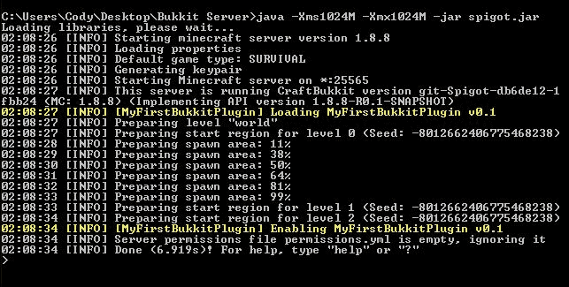
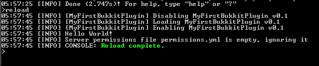
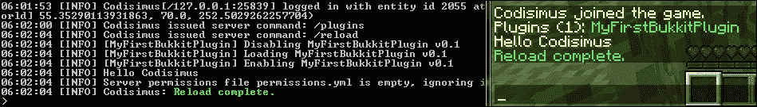
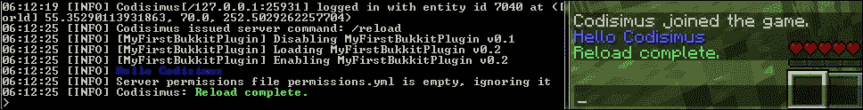
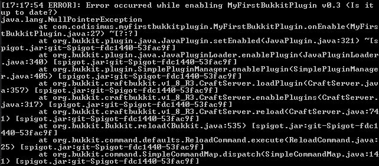
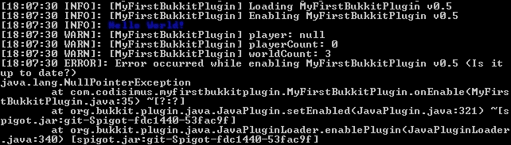
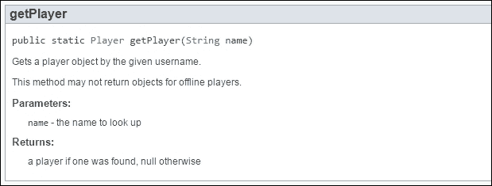

# 第四章。在 Spigot 服务器上测试

Bukkit 插件设计为在 CraftBukkit 或 Spigot 服务器上运行。到目前为止，您有一个 Spigot 服务器和一个简单的插件。完成本章后，您的新插件将安装到您的服务器上。在本章中，您将对插件代码进行修改，并且您将很快看到这些更改在您的服务器上得到反映。这将帮助您更快地开发插件，并允许您在创建新插件时完成更多任务。您还将学习如何调试代码，以便在它不正常工作时进行修复。本章将涵盖以下主题：

+   为您的插件构建 JAR 文件

+   在您的服务器上安装插件

+   测试插件

+   测试插件的最新版本

+   调试代码

# 构建 JAR 文件

为了在服务器上安装插件，我们需要一个 `.jar` 文件。`JAR` 文件是一个 Java 可执行文件。它包含所有编写的代码，这些代码打包在一个 ZIP 文件格式中。这些代码需要被翻译，以便计算机能够理解和运行它。

在 NetBeans 中，有一个单独的按钮，我们可以点击它来构建项目。这将生成我们需要的 `.jar` 文件。让我们在我们的项目中添加一段代码，以便自动将创建的 `.jar` 文件复制到更方便的位置。在 NetBeans 中，点击 **文件** 选项卡以访问项目的 `build.xml 文件`，如下截图所示：


打开 `build.xml` 并在 `import file` 行之后添加以下代码块：

```java
<target name="-post-jar">
  <copy file="${dist.jar}" todir="../Plugin Jars" failonerror="true"/>
</target>
```

这段额外的代码将在 JAR 文件成功构建后执行。它将从 `dist` 目录将 JAR 文件复制到指定的位置。您可以将 `"../Plugin Jars"` 更改为您想要的任何目录。在这里，`..` 表示向上移动一个文件夹。因此，如果您的 NetBeans 项目位于 `C:\Users\Owner\Documents\NetBeansProjects\MyFirstBukkitPlugin`，那么 `.jar` 文件将被复制到 `C\Users\Owner\Documents\NetBeansProjects\Plugin Jars\MyFirstBukkitPlugin.jar`。将此代码添加到每个插件中，将使它们在一个中央文件夹中保持组织。添加此新代码后，您的文件将类似于以下代码片段：

```java
<?xml version="1.0" encoding="UTF-8"?>
<project name="MyFirstBukkitPlugin" default="default" basedir=".">
  <description>Builds, tests, and runs the project MyFirstBukkitPlugin.</description>
  <import file="nbproject/build-impl.xml"/>
  <target name="-post-jar">
    <copy file="${dist.jar}" todir="../Plugin Jars" failonerror="true"/>
  </target>
</project>
```

### 小贴士

在前面的代码中，`failonerror` 被设置为 `true`。这意味着如果 JAR 文件未能复制到指定的位置，构建时将显示错误。这种错误可能表明位置不存在或您权限不足。如果您不想看到这些警告，可以将此值设置为 `false`。

注意，您将在`<!--`和`-->`之间有许多额外的行。这些都是注释，我鼓励您阅读它们，如果您想了解更多关于您可以在`build.xml`文件中添加的内容。一旦保存此文件，您就准备好构建项目了。您可以通过点击锤子图标或使用*F11*快捷键来完成。位于工具栏上的锤子图标看起来如下所示：


如果 NetBeans 无法成功构建 jar 文件，那么您可能代码中存在错误。

这些错误最有可能通过红色线条和灯泡显示出来，正如在第三章*创建您的第一个 Bukkit 插件*中看到的那样。您通常可以通过悬停或点击灯泡来获取帮助。如果您无法这样做，请参考上一章检查您的代码是否正确。如果您仍有疑问，请参考第二章*学习 Bukkit API*以获取帮助。

# 安装插件

新插件的安装相当简单。您需要从您之前在服务器`plugins`文件夹中选择的目录创建`.jar`文件的副本。然后，像往常一样启动您的服务器。您将看到控制台输出通知您插件已加载，如下面的截图所示：



如果您的服务器启动时没有看到`Hello World!`消息，请不要担心。这种行为是正常的，因为在这个时候，永远不会在线有玩家来接收广播的消息。目前，我们只关心上一张截图中突出显示的消息。

每次您对代码进行更改时，您都必须构建一个新的 JAR 文件并安装新版本。要安装新版本，您只需将其复制并粘贴到服务器的`plugin`文件夹中，并覆盖旧文件。这通常可以在不关闭服务器的情况下完成。然而，如果服务器正在运行，您将需要使用`reload`命令来加载新版本。

如果您不希望每次在代码中做出更改时都手动复制`plugin .jar`文件并将其粘贴到服务器的插件文件夹中，那么您可以在`build.xml`中自动化它。除了复制`jar`文件并将其粘贴到`Plugin Jars`目录外，您还可以直接将其复制并粘贴到服务器的`plugins`目录中。为此，添加一个第二个`copy file`标签，并将`todir`设置为您的服务器`plugin`目录。以下代码是示例：

```java
<?xml version="1.0" encoding="UTF-8"?>
<project name="MyFirstBukkitPlugin" default="default" basedir=".">
  <description>Builds, tests, and runs the project MyFirstBukkitPlugin.</description>
  <import file="nbproject/build-impl.xml"/>
  <target name="-post-jar">
    <copy file="${dist.jar}" todir="../ Plugin Jars" failonerror="true"/>
    <copy file="${dist.jar}" todir="C:/Users/Owner/Desktop/Bukkit Server/plugins" failonerror="true"/>
  </target>
</project>
```

再次强调，您应该为每个您想在服务器上自动安装的插件都这样做。

# 测试您的插件

如您所忆，第一个插件的目的在于发现插件何时被加载。通过在控制台中输入以下命令来发出`reload`命令：

```java
>reload

```

您将看到 Spigot 会自动禁用并重新启用插件，如下面的截图所示：



这次，当您的插件被启用时，您将看到**Hello World!**消息。如果正好有一个玩家在线，那么它会向该玩家打招呼。让我们通过登录服务器并在游戏中发出重新加载命令来观察这一点。打开您的 Minecraft 客户端并连接到您的服务器。从游戏中，首先发出以下命令：

```java
/plugins

```

您将看到一个已安装插件的列表。目前，只有一个插件，如下面的截图所示：


现在服务器上有一个玩家，我们可以通过重新加载服务器来测试插件。在游戏中发出以下命令：

```java
/reload

```

注意，在游戏和控制台中，您都会看到**Hello Codisimus**消息，如下面的截图所示，以表明插件按预期工作：



# 测试插件的新版本

插件按预期工作，但总有改进的空间。让我们通过向其中添加代码来继续对这个插件进行工作。

当消息为白色时，玩家可能看不到**hello**消息。我们可以使用`ChatColor Enum`来更改消息的颜色。这个`Enum constants`包含了游戏中支持的所有颜色代码，这样我们就可以轻松地将它们添加到消息中。让我们修改插件并在服务器上安装新修改的版本。选择您喜欢的颜色并将其放在`broadcastToServer`方法中的消息之前，如下面的代码所示：

```java
Bukkit.broadcastMessage(ChatColor.BLUE + msg);
```

在构建新的 JAR 文件之前，将`plugin.yml`中的版本更改为`0.2`以表示这是一个更新版本。每次对代码进行修订时，您都会创建一个新的版本。将版本号更改为反映代码更改将确保新代码将分配一个唯一的版本号。如果您需要知道特定版本的项目中包含的代码更改，这将非常有价值。

使用构建图标或*F11*键构建一个新的 JAR 文件。如果您没有设置`build.xml`来自动执行此操作，请将新版本复制并粘贴到`plugins`文件夹中。再次发出`reload`命令以查看结果，如下面的截图所示：



插件已被重新加载，消息现在已着色。此外，注意当插件被禁用时版本号的变化，以及当它被加载并启用时的变化。这清楚地表明插件的新版本已成功安装在服务器上。

尝试自己进一步扩展这个插件以测试不同的代码。以下列表包含了一些供您挑战的内容：

+   将插件编程为显示世界的实际名称而不是单词**World**。这个挑战的一个提示是你可以获取所有世界的列表，然后使用列表中的第一个世界。请注意，这将广播`Hello world!`，除非你在`server.properties`中重命名了世界。

+   向玩家发送消息，而不是向整个服务器广播消息。

+   如果在线玩家超过一个，向每个玩家发送独特的问候消息。这个提示是你可以使用一个`for`循环。

+   如果没有玩家在线，为每个世界发送独特的问候消息。

# 调试代码

当你开发这个插件以及其他 Bukkit 插件时，你编写的一些代码可能不会按预期工作。这是由于代码中某个地方存在的错误造成的。这些错误被称为**bug**，找到这些 bug 并移除它们的过程称为**调试**。

## 从错误中学习

当你的插件第一次尝试不工作时，不要气馁。即使是经验丰富的程序员也会在他们的代码中遇到 bug。你的软件不完美并不意味着你是一个糟糕的开发者。能够发现 bug 并修复它们是软件开发的重要组成部分。你犯的错误越多，你能从中学到的就越多。以下是一个明显的例子。

有朝一日，你可能会编写一个包含玩家列表的插件。然后你可以编写以下`for`循环来遍历每个玩家并移除那些处于`CREATIVE`模式的玩家：

```java
for (Player player : playerList) {
  if (player.getGameMode() == GameMode.CREATIVE) {
    playerList.remove(player);
  }
}
```

当你测试这段代码时，很可能会发生错误。抛出的错误将是一个`ConcurrentModificationException`方法。异常的名称可能对你来说意义不大，但它将帮助你缩小问题范围。

### 小贴士

开发者不需要知道如何修复每个错误，但他们应该知道在哪里找到有关这些错误的信息，以便他们可以找出如何修复它们。这通常可以在软件的文档或公开的消息板上找到。大多数开发者会记下错误信息，并使用 Google 搜索相关信息。搜索结果通常会是官方文档或遇到相同问题的其他人的帖子。

要了解更多关于错误的信息，你可以搜索`ConcurrentModificationException`；你可能会找到来自 Oracle 的**Javadoc**中的以下声明：

> *"例如，通常不允许一个线程在另一个线程迭代它时修改一个集合。"*

官方的 javadoc 可能很有用。但有时，它们仍然难以理解。幸运的是，存在像[stackoverflow.com](http://stackoverflow.com)这样的网站，允许程序员互相帮助调试代码。如果你查看搜索结果，你会看到指向 Stack Overflow 问题和类似网站的帖子。这些链接非常有帮助，因为通常有像你一样的人遇到了相同的错误。如果你查看其他人的问题和提供的答案，你可以了解为什么会出现这个错误以及如何修复它。

在阅读了与并发修改错误相关的问题后，你最终会了解到，在大多数情况下，异常发生在你尝试在遍历列表或集合时对其进行修改时。你还会发现，为了避免这种情况，你必须使用迭代器。通常，会有如何修复错误的示例。在这种情况下，有关于如何正确使用迭代器从列表中删除对象的解释。如果不存在解释，那么你可以像使用 Bukkit 的 javadoc 一样，在 Oracle 的 javadoc 中研究迭代器。我们可以通过使用迭代器来修复之前的代码，如下所示：

```java
Iterator<Player> itr = playerList.iterator();
while (itr.hasNext()) {
  Player palyer = itr.next();
  if (player.getGameMode() == GameMode.CREATIVE) {
    itr.remove();
  }
}
```

在修复代码中存在的并发修改错误后，你现在已经成为了一名更有经验的程序员。你将知道如何在未来避免这个问题，甚至在过程中学习了如何使用迭代器。

## 当研究不足以解决问题时

有时候，查阅文档和阅读论坛消息不足以修复错误。如**NullPointerException**这样的错误非常常见，可能由多种原因引起。通过研究，你会发现**NullPointerException**发生在你尝试访问一个**null**对象的某个方法或字段时。“null”指的是没有值。因此，null 对象是一个不存在的对象。然而，知道这一点并不总是能帮助你找到确切的哪个对象具有 null 值以及它最初为什么是 null 值。为了帮助找到错误，以下是一些可以遵循的步骤来定位有问题的代码。

### 阅读堆栈跟踪

Java 中的大多数错误都以**堆栈跟踪**的形式呈现。堆栈跟踪会告诉你错误发生之前正在执行的代码行。在 Spigot 服务器上，这些堆栈跟踪将类似于以下截图：



### 小贴士

如果你的服务器托管在其他地方，而你通过在线浏览器工具查看控制台，堆栈跟踪可能会以相反的顺序打印出来。

无论何时你的服务器出现异常，Spigot 都会记录错误以及导致错误的插件。有时，甚至会有错误发生时正在进行的特定事件的详细信息。通过前一个屏幕截图中的堆栈跟踪，我们可以看到错误是由`MyFirstBukkitPlugin` `版本 0.3`引起的。如果版本与你在**IDE**中拥有的版本不匹配，你将想要用插件的最新版本更新服务器。这样，你可以确保服务器上运行的代码与你在 NetBeans 中拥有的代码相同。我们还可以看到异常是在插件被启用时抛出的。在下一行，我们看到具体的错误，即**NullPointerException**。在随后的那一行，我们被告知导致错误的精确代码行。它发生在`MyFirstBukkitPlugin`类的`onEnable`方法中。括号中写着**MyFirstBukkitPlugin.java:27**。这告诉我们错误发生在`MyFirstBukkitPlugin`类的第 27 行，当然是在`onEnable`方法中。堆栈跟踪的前三行对我们最有用。你很少需要查看更后面的行来解释。有时，你甚至看不到堆栈跟踪开头代码中的任何类名。然而，如果你继续查看，你可能会看到熟悉的类和方法名。

现在你已经知道了类名和行号，你可以回过头来看看你的代码，看看你是否注意到为什么你会得到**NullPointerException**。在 NetBeans 中，我可以看到第 27 行的代码如下：

```java
Bukkit.getPlayer("Codisimus").sendMessage("Hello, there are " + Bukkit.getOnlinePlayers().size() + " player(s) online and " + Bukkit.getWorlds().size() + " world(s) loaded.");
```

## 拆分代码

麻烦的行是一行非常长的代码。因此，无法明显看出哪个对象具有空值。如果你发现自己处于类似的情况，我建议你将代码拆分成多行。这将给我们以下代码：

```java
Player player = Bukkit.getPlayer("Codisimus");
int playerCount = Bukkit.getOnlinePlayers().size();
int worldCount = Bukkit.getWorlds().size();
player.sendMessage("Hello, there is " + playerCount + " player(s) online and " + worldCount + " world(s) loaded.");
```

在安装并运行这段新代码后，你应该在控制台中看到相同的错误，但它会指向不同的代码行。使用这段新代码，你现在会看到异常是在第 30 行抛出的，这是前一段代码的最后一行。

## 添加调试信息

在那单行代码中仍然有很多事情在进行。因此，你可能不确定哪个变量是空的。是`player`、`playerCount`还是`worldCount`？如果你需要一些额外的帮助，你可以在代码中添加我们所说的调试信息。这些信息可以将信息打印到控制台日志中，以指示代码中的发生情况。在 Bukkit 插件中记录信息有几种方法。最简单的方法是使用`System.out.println(String string)`方法。然而，更好的做法是利用 Spigot 服务器分配给你的插件的记录器。记录器可以通过`getLogger`方法获取。这个方法在`JavaPlugin`类中。你可以在`onEnable`方法中访问它。这些调试信息将是临时的。因此，你可以使用你喜欢的任何方法。但我确实建议你尝试使用记录器，因为它也会打印出插件信息。在我们的例子中，我们将使用记录器。

现在我们知道了如何打印消息，让我们记录每个变量的值，如下所示：

```java
Player player = Bukkit.getPlayer("Codisimus");int playerCount = Bukkit.getOnlinePlayers().size();int worldCount = Bukkit.getWorlds().size();Logger logger = getLogger();logger.warning("player: " + player);logger.warning("playerCount: " + playerCount);logger.warning("worldCount: " + worldCount);player.sendMessage("Hello, there is " + playerCount + " player(s) online and " + worldCount + " world(s) loaded.");
```

### 小贴士

注意，我们在有问题的代码行之前添加了调试信息。一旦抛出异常，计算机就会停止执行代码。因此，如果调试信息在`sendMessage`调用之后，这些信息将永远不会被打印。



一旦你安装并运行更新后的代码，你将在控制台中看到调试信息：

现在，我们可以清楚地看到`player`有一个`null`值。

## 回顾 Javadoc

如果你回顾一下设置`player`的代码行，然后阅读 Bukkit 的 javadoc，你会了解到`player`的值为 null，因为请求的玩家 Codisimus 不在线。如果玩家找不到，则返回`null`。



正如你所见，代码中的 bug 可能并不正好在堆栈跟踪给出的行。在这种情况下，空值是在几行之前设置的。

## 在理解了问题之后再修复 bug

现在 bug 已经被揭露，我们可以修复它。在**NullPointerException**的情况下，有两种解决方案。不要仅仅因为你可以而简单地以某种方式修复 bug。你应该努力理解 bug 存在的原因以及代码应该如何运行。也许，变量 player 永远不应该有 null 值。如果我知道玩家 Codisimus 总是在线，那么也许，我拼写用户名时犯了错。然而，我们知道 Codisimus 并不总是在线。所以，在这个插件中，玩家变量有时会有 null 值。在这种情况下，我们不想尝试向玩家发送消息，因为这会抛出**NullPointerException**。为了解决这个问题，我们可以在`if`语句中放置代码行，开发者通常称之为 null 检查：

```java
Player player = Bukkit.getPlayer("Codisimus");
int playerCount = Bukkit.getOnlinePlayers().size();
int worldCount = Bukkit.getWorlds().size();
//Logger logger = getLogger();
//logger.warning("player: " + player);
//logger.warning("playerCount: " + playerCount);
//logger.warning("worldCount: " + worldCount);
if (player != null) {
    player.sendMessage("Hello, there is " + playerCount + " player(s) online and " + worldCount + " world(s) loaded.");
}
```

### 小贴士

注意，我已经通过在前面加上 // 将调试信息改为注释，这样这些信息就不会打印到日志中。或者，如果我觉得我永远不会再需要这些行，我也可以完全删除这些行。

现在我们已经添加了空值检查，只有当玩家不为空时，消息才会被发送。

# 摘要

你现在知道如何从 NetBeans 项目创建 JAR 文件。对于你未来将创建的插件，你可以遵循这个简单的流程来安装和运行你的新插件，无论是用于测试还是用于成品。你也知道如何更新已安装在服务器上的插件，并修复代码中暴露的 bug。在接下来的章节中，我们将创建越来越复杂的插件。这一步骤的第一步是为玩家在游戏中执行命令的插件创建命令。
