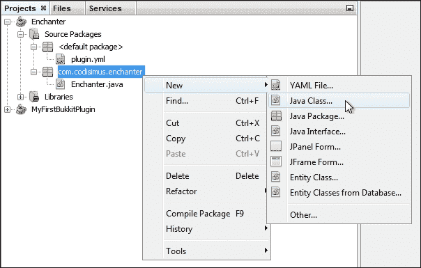
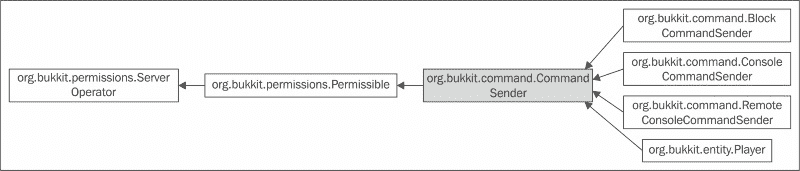

# 第五章。插件命令

Bukkit API 的好处是它已经在其框架中内置了基本功能。作为程序员，我们不需要费心将这些基本功能实现到插件中。在本章中，我们将讨论这些功能之一，即玩家可以执行的在游戏中的命令。这些命令与您已经熟悉的命令类似，例如`/reload`、`/gamemode`或`/give`。我们将创建一个插件来对物品进行**附魔**。在本章结束时，一旦插件完成，您将能够输入`/enchant`来为您手中的物品添加您喜欢的附魔。

命令是玩家与插件通信的最简单方式之一。它们还允许玩家触发插件代码的执行。出于这些原因，大多数插件都将有一些命令。Bukkit 开发团队意识到了这一点，并为我们提供了一个简单的方式来注册命令。通过 Bukkit 注册命令确保插件知道当玩家输入命令时。它还可以防止插件与其他插件的命令发生冲突。以下是我们将涵盖的三个步骤，以向插件添加命令：

+   通知 Bukkit 一个插件将使用一个命令

+   编程插件在有人输入命令时将执行的操作

+   将新编写的代码分配给特定的命令

# 在 plugin.yml 中添加一个命令

按照第三章创建您的第一个 Bukkit 插件中所述的方式创建一个新的 Bukkit 插件，命名为`Enchanter`。或者，您也可以复制现有的项目并修改名称、包等信息以创建一个新的插件。这将消除添加所需库和配置构建脚本的必要性。可以通过以下步骤复制项目：

1.  右键单击您希望复制的项目，然后从菜单中选择**复制…**

1.  设置项目名称。项目位置应保持不变。

1.  打开第四章中讨论的`build.xml`，并将项目的名称更改为步骤 2 中设置的名称。

1.  通过右键单击包并选择**重命名…**在**重构**菜单项中，更新您的新项目中的包，以确保它是唯一的。

1.  如有必要，重命名主类。您还可以删除那些您知道不会再次使用的函数或类。

1.  最后，使用新的插件信息修改`plugin.yml`文件，包括名称、主类、版本和描述。

接下来，我们将通过修改插件的`plugin.yml`文件来通知 Bukkit 我们将使用一个命令。如第二章中所述的*学习 Bukkit API*，Spigot 读取 YAML 文件以找出有关插件所需的所有信息。这些信息包括您的插件将处理的全部命令。每个命令都可以有一个描述、正确的使用消息和别名，这与`rl`是`reload`的别名类似。我们将用于插件的命令将是`enchant`。通常，使用小写字母来表示命令，这样玩家在输入游戏命令时不必担心大小写。以下是在添加`enchant`命令后`plugin.yml`将如何显示的示例代码：

```java
name: Enchanter
version: 0.1
main: com.codisimus.enchanter.Enchanter
description: Used to quickly put enchantments on an item
commands:
  enchant:
    aliases: [e]
    description: Adds enchantments to the item in your hand
    usage: Hold the item you wish to enchant and type /enchant
```

注意这些行的缩进。这种缩进必须是空格，而不是制表符。NetBeans 在您键入时自动缩进必要的行。此外，即使您使用了*Tab*键，NetBeans 也会自动使用空格。在 YAML 文件中，缩进非常重要，因为它决定了键的层次结构。`enchant command`在`commands`下缩进，表示它是插件的命令。`aliases`、`description`和`usage`命令在`enchant`下缩进，表示它们属于`enchant`命令。

### 小贴士

这三个设置的顺序无关紧要，它们是可选的。

如果发生错误或玩家错误地使用命令，将显示使用消息。可以通过发出插件的帮助命令来查看描述消息，即`/help Enchanter`。

对于`aliases`，我们有一个`e`作为值。这意味着如果我们觉得`/enchant`太长难以输入，我们可以输入`/e`。您可能有更多的别名，但它们必须以 YAML 列表格式放置。YAML 文件中的列表可以以两种不同的方式创建。第一种格式涉及通过逗号和空格分隔每个项目，并将整个列表括在方括号中，如下面的代码片段所示：

```java
aliases: [e, addenchants, powerup]
```

第二种格式涉及将每个项目放在新的一行上，该行以连字符和一个空格开始，如下面的代码片段所示：

```java
aliases:
  - e
  - addenchant
  - powerup
```

通常，列表的长度决定了首选的方法。第二种格式在列表很长时更容易阅读。然而，请注意，在连字符之前不要有额外的或缺失的空格，因为这会在程序尝试读取列表时引起问题。一般来说，确保您的列表对齐。有关 YAML 语言的更多信息，请访问[`www.yaml.org/spec/1.2/spec.html`](http://www.yaml.org/spec/1.2/spec.html)。

可以轻松地将多个命令添加到插件中。以下代码是`plugin.yml`文件中包含多个命令的示例：

```java
name: Enchanter
version: 0.1
main: com.codisimus.enchanter.Enchanter
description: Used to quickly put enchantments on an item
commands:
  enchant:
    aliases: [e, addenchants]
    description: Adds enchantments to the item in your hand
    usage: Hold the item you wish to enchant and type /enchant
  superenchant:
    aliases:
      - powerup
  disenchant:
    description: Removes enchantments from the item in your hand
    usage: Hold the item you wish to disenchant and type /disenchant
```

# 编程命令动作

一旦您将命令添加到`plugin.yml`文件中，您就可以开始编写命令将触发的代码。在 NetBeans 项目中创建一个新类。这个新类将被称为`EnchantCommand`。如果您愿意，可以给这个类起其他名字，但请记住，类的名字应该在不打开它的情况下就能让你了解这个类是如何使用的。将这个类放在与`Enchanter`（主插件类）相同的包中，如下面的截图所示：



### 小贴士

请记住，尽管包的结构相似，但您将使用自己的唯一命名空间，而不是`com.codisimus`

这个新类将执行`enchant`命令。因此，它必须实现`CommandExecutor`接口。我们将向类头添加代码来实现这一点。这类似于向`Enchanter`类添加`extends JavaPlugin`。`JavaPlugin`是一个类。因此，我们用我们的类扩展了它。`CommandExecutor`是一个接口，这意味着我们必须实现它。一旦我们在`EnchantCommand`类头中添加了`implements CommandExecutor`，就会有一个灯泡出现，提示我们需要导入`CommandExecutor`类。导入该类，灯泡仍然存在。现在它正在通知我们，因为我们实现了接口，我们必须实现其所有抽象方法。点击灯泡来实现，所需的方法就会出现。这个新方法将在玩家执行`enchant`命令时被调用。该方法提供了以下四个参数：

+   `CommandSender sender`

    +   默认情况下，此命令可以命名为`cs`，但我们将命名为`sender`，因为它容易忘记`cs`代表什么

    +   这是发送命令的人

    +   它可能是一个玩家、控制台、命令方块，甚至是另一个插件创建的定制`CommandSender`接口

+   `命令 cmnd`

    +   这是发送者执行的`命令`对象

    +   我们将不需要这个，因为这个类将仅用于单个命令

+   `字符串别名`

    +   这是发送者输入的别名

    +   例如，它可能是`enchant`、`e`、`addenchant`或`powerup`

+   `String[] args`

    +   这是一个字符串数组

    +   每个字符串都是发送者输入的参数

    +   参数跟在别名后面，并由空格分隔

    +   命令本身不被视为参数

    +   例如，如果他们输入`/enchant knockback 5`，那么`knockback`将是第一个参数（`args[0]`），而`5`将是第二个也是最后一个参数（`args[1]`）

    +   在这一点上，我们不需要担心参数，因为`enchant`命令不需要任何参数

如前所述，有不同类型的`CommandSenders`。以下是为`CommandSender`的继承图：



在这个图中，你可以看到`Player`、`ConsoleCommandSender`以及几个其他类都是`CommandSender`的子类型。增强命令的目的允许玩家增强他们持有的物品。因此，非玩家`CommandSender`对象将不会使用这个命令。在`onCommand`方法中，我们首先写的代码是检查是否有玩家执行了命令。如果我们不执行这个检查，那么当非玩家尝试发出`enchant`命令时，插件将会崩溃。我们将通过使用`if`语句和`instanceof`关键字来检查这一点。相应的代码如下：

```java
if (sender instanceof Player)
```

这段代码可以翻译为以下内容：

`如果命令发送者是玩家`

这个`if`语句将告诉我们是否是玩家发送了命令。如果命令发送者不是玩家，那么我们希望停止执行代码。我们将通过使用`return`关键字来完成这个操作。然而，这个方法的`return`类型是`boolean`。我们必须返回一个`boolean`值，这将告诉 Bukkit 是否需要向命令发送者显示使用信息。通常，对于`onCommand`方法，如果你希望命令没有成功执行，你想要返回`false`。在这种情况下，它并没有。因此，我们将使用`return false;`代码。到目前为止，在方法内部，我们已经构建了以下代码：

```java
if (sender instanceof Player) {
  return false;
}
```

然而，这并不完全正确。这要求 Bukkit 在命令发送者是玩家时返回`false`，但当我们想要返回`false`时，情况正好相反。我们可以通过添加一个感叹号来实现这一点。如果你还不了解，在 Java 中，感叹号是一个`NOT`运算符，可以用来反转`boolean`值。我们将通过反转结果值来纠正之前的代码，如下面的代码所示：

```java
if (!(sender instanceof Player)) {
  return false;
}
```

注意额外的括号。这非常重要。括号允许表达式被分组。我们想要反转由`sender instanceof Player`代码产生的`boolean`值。如果没有括号，我们就会尝试反转发送者对象，这是没有意义的。因此，代码将无法编译。

到目前为止，`EnchantComand`类代码如下：

```java
package com.codisimus.enchanter;

import org.bukkit.command.Command;
import org.bukkit.command.CommandExecutor;
import org.bukkit.command.CommandSender;
import org.bukkit.entity.Player;

/**
 * Enchants the item that the command sender is holding
 */
public class EnchantCommand implements CommandExecutor {

  @Override
  public boolean onCommand(CommandSender sender, Command cmnd,String alias, String[] args) {
    //This command can only be executed by Players
    if (!(sender instanceof Player)) {
      return false;
    }
  }

}
```

现在我们已经处理了非玩家，我们确定`CommandSender`对象是一个玩家。我们希望与`Player`对象而不是`CommandSender`对象一起工作，因为`Player`对象将手中有特定的物品。我们可以通过将`CommandSender`对象*转换为*`Player`来获取`Player`对象。通过转换，我们告诉 Java 我们知道命令发送者实际上是一个`Player`对象，而不是`ConsoleCommandSender`对象或其他子类型。转换是通过以下语法完成的：

```java
Player player = (Player) sender;
```

### 小贴士

如果你还不熟悉转换，我再次建议你学习一些这些编程概念，请访问[codisimus.com/learnjava](http://codisimus.com/learnjava)。

现在我们有了`Player 对象`，我们需要他们所持有的物品。查看[Bukkit API 文档](https://hub.spigotmc.org/javadocs/bukkit/org/bukkit/entity/Player.html)中关于`Player`类的文档，该文档可在[`hub.spigotmc.org/javadocs/bukkit/org/bukkit/entity/Player.html`](https://hub.spigotmc.org/javadocs/bukkit/org/bukkit/entity/Player.html)找到，你可以看到存在一个`getItemInHand`方法，该方法是从`HumanEntity`继承而来的。它将返回`ItemStack`类，这正是我们想要的。这在上面的代码片段中得到了演示：

```java
ItemStack hand = player.getItemInHand();
```

在对这件物品进行任何操作之前，我们必须确保确实有一个物品可以附魔。如果玩家在手中没有物品时运行命令，我们不希望插件崩溃。我们将检查`ItemStack 类`的值是否为`null`以及物品类型是否为`AIR`。在任何情况下，我们都会返回`false`，如下所示，因为命令没有执行：

```java
if (hand == null || hand.getType() == Material.AIR) {
  return false;
}
```

### 小贴士

如果我们在代码中不包含`null`检查（hand == null），我们可能会遇到*Testing on the Spigot Server*中讨论的`NullPointerExceptions 错误`。

现在，我们有了对玩家和他们所持物品的引用。我们的最终目标是附魔这个物品。再次查看 API 文档，我们可以在[`hub.spigotmc.org/javadocs/bukkit/org/bukkit/inventory/ItemStack.html`](https://hub.spigotmc.org/javadocs/bukkit/org/bukkit/inventory/ItemStack.html)找到添加到`ItemStack 类`的几个方法。阅读描述以找出哪个适合我们。

两个方法用于一次性添加多个附魔。我们可能想要添加多个附魔，但为了简化代码，我们将一次只添加一个。剩下的两个方法是`addEnchantment(Enchantment ench, int level)`和`addUnsafeEnchantment(Enchantment ench, int level)`。

### 小贴士

不安全方法的描述中指出：*此方法不安全，将忽略等级限制或物品类型。请自行决定使用。* 提供此警告是因为这些不安全的附魔尚未经过测试，可能会产生不理想的结果。你不应该让这个警告阻止你使用该方法，但在与朋友一起使用之前，你将想要测试附魔，以确保它不会使服务器崩溃。

因此，如果我们选择使用`unsafe`，我们可以创建强大的附魔，例如 10 级的锋利度。没有插件，剑的锋利度限制在 5 级。使用不安全的附魔，我们还可以附魔之前无法附魔的物品，例如带有`KNOCKBACK`或`FIRE_ASPECT`的鱼。现在，你将开始发现所有你可以用插件做的有趣和酷的事情，这些事情在原版游戏中是无法做到的。

从个人经验来看，我发现`KNOCKBACK`附魔相当有趣。在我的例子中，我将`KNOCKBACK`应用到物品上，但你当然可以选择你喜欢的任何附魔。关于附魔的完整列表及其功能，请访问 API 文档[`hub.spigotmc.org/javadocs/bukkit/org/bukkit/enchantments/Enchantment.html`](https://hub.spigotmc.org/javadocs/bukkit/org/bukkit/enchantments/Enchantment.html)或 Minecraft 维基[`minecraft.gamepedia.com/Enchanting#Enchantments`](http://minecraft.gamepedia.com/Enchanting#Enchantments)。Bukkit 警告我们，使用不安全的方法可能会引起问题。为了避免冲突，尽量将附魔等级保持在 10 级或以下。对于大多数附魔，在 10 级之后你甚至可能不会注意到任何区别。我们决定使用`addUnsafeEnchantment(Enchantment ench, int level)`。此方法接受一个`Enchantment`和一个`int`值作为参数。这个`int`值当然是附魔的等级，正如 API 文档中所述。我们已经决定了每个参数应该是什么。我们可以完成以下代码行，如下所示：

```java
hand.addUnsafeEnchantment(Enchantment.KNOCKBACK, 10);
```

为了增加乐趣，我们还将添加`FIRE_ASPECT`附魔，如下面的代码片段所示：

```java
hand.addUnsafeEnchantment(Enchantment.FIRE_ASPECT, 1);
```

到这一点，一切都将成功执行。在我们返回`true`之前，我们应该向玩家发送一条消息，让他们知道一切按计划进行。我们将使用`sendMessage`方法通过以下代码行只向这位玩家发送消息。服务器上的其他人，包括控制台，将看不到这条消息：

```java
player.sendMessage("Your item has been enchanted!");
```

完成的类在以下代码行中显示。记住在编写代码时注释你的代码。以下代码中的某些注释可能看起来不必要，因为代码本身很容易阅读。我们将用术语自文档化来引用此代码。你只需要为可能在未来难以理解或需要澄清的代码留下注释。在你仍在学习的时候，我鼓励你过度使用注释。它们的存在不会造成任何伤害，并且在你需要时可以清楚地解释代码：

```java
package com.codisimus.enchanter;

import org.bukkit.Material;
import org.bukkit.command.Command;
import org.bukkit.command.CommandExecutor;
import org.bukkit.command.CommandSender;
import org.bukkit.enchantments.Enchantment;
import org.bukkit.entity.Player;
import org.bukkit.inventory.ItemStack;

/**
 * Enchants the item that the command sender is holding
 */
public class EnchantCommand implements CommandExecutor {

  @Override
  public boolean onCommand(CommandSender sender, Command cmnd,String alias, String[] args) {
  //This command can only be executed by Players
    if (!(sender instanceof Player)) {
    return false;
  }

  //Cast the command sender to a Player
  Player player = (Player) sender;

  //Retrieve the ItemStack that the Player is holding
  ItemStack hand = player.getItemInHand();

  //Return if the Player is not holding an Item
  if (hand == null || hand.getType() == Material.AIR) {
    return false;
  }

  //Add a level 10 Knockback enchantment
  hand.addUnsafeEnchantment(Enchantment.KNOCKBACK, 10);

  //Add a level 1 Fire Aspect enchantment
  hand.addUnsafeEnchantment(Enchantment.FIRE_ASPECT, 1);

  player.sendMessage("Your item has been enchanted!");
  return true;
  }

}
```

之前的代码实现了 enchant 命令。它验证命令发送者是一个玩家，并且该玩家正在持有物品。然后它将定义的附魔添加到物品上。这完成了在`EnchantCommand`类中需要完成的工作。

# 分配 enchant 命令的执行者

我们几乎准备好开始在服务器上使用这个命令了。唯一剩下的步骤是将我们刚刚编写的类分配给`enchant`命令。这通常被称为注册命令。在`Enchanter`类的`onEnable`方法中，我们将使用`getCommand("enchant")`代码获取`enchant`命令。

### 小贴士

命令的名称必须与`plugin.yml`中的完全一致。这也意味着这段代码只会检索特定于该插件的所有命令。

一旦我们有了附魔命令，我们就可以设置一个新的`EnchantCommand`实例作为该命令的执行者。所有这些都可以在一行中完成，如下面的代码片段所示：

```java
getCommand("enchant").setExecutor(new EnchantCommand());
```

`main`类中您将拥有的所有内容如下所示：

```java
package com.codisimus.enchanter;

import org.bukkit.plugin.java.JavaPlugin;

  /**
  * Enchants the item that the command sender is holding
  */
public class Enchanter extends JavaPlugin {
  @Override
  public void onEnable() {
    //Assign the executor of the enchant command
    getCommand("enchant").setExecutor(new EnchantCommand());
  }
}
```

# 摘要

现在，您有一个可以在自己的服务器上使用的有用插件。您可以像前一章讨论的那样构建这个插件，并将其放在您的服务器上进行测试。尝试使用不同的物品，并观察它是如何工作的。可以创建许多仅通过使用命令来运行的插件。有了这些知识，您有潜力创建大量的插件。您可以尝试一些插件，比如使用`/spawn`命令将您传送到世界的出生点的插件，一个使用`/scare <player>`命令向特定玩家播放 Creepers 嘶嘶声的插件，以及一个使用`/strike <player>`命令用闪电击中玩家的插件，您自己也可以尝试。

### 小贴士

`World`类中有一个名为`strikeLightning`的方法。

对于插件，您将需要使用参数。首先，您需要检查是否给出了正确的参数数量。然后，您需要获取第一个参数，正如本章前面所解释的那样。这个参数将是玩家的名称。`Bukkit`类中有一个方法可以用来根据给定的名称查找玩家。

如果您正在寻找插件灵感，请记住 API 文档是一个很好的灵感来源。此外，人们总是在 Bukkit、Spigot 和 Minecraft 论坛上寻找要制作的插件。在下一章中，我们将通过添加权限来扩展`Enchanter`插件。这将确保只有特权玩家才能使用`enchant`命令对物品进行附魔。
