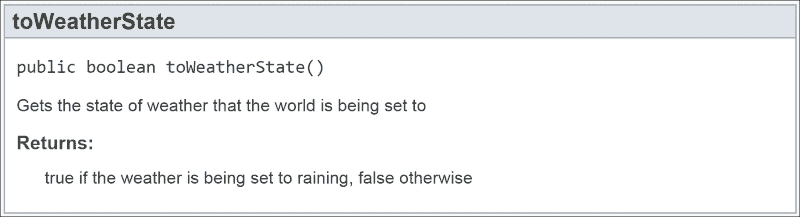

# 第七章. Bukkit 事件系统

到目前为止，您已经知道如何创建一个在执行命令时运行一些代码的插件。这在许多情况下非常有用。然而，有时我们并不想输入命令。我们更希望代码能够自动触发执行。触发器可以是服务器上发生的一个特定事件，例如方块被破坏、爬行者爆炸，或者玩家在聊天中发送消息。Bukkit 事件系统允许开发者监听事件，并根据该事件自动运行一段代码。通过使用 Bukkit 事件系统，您可以自动化服务器，这意味着您在将来维护服务器时的工作量会减少。在本章中，我们将涵盖以下主题：

+   选择一个事件

+   注册事件监听器

+   监听事件

+   取消事件

+   事件之间的通信

+   在事件发生时修改事件

+   在自己身上创建更多插件

# 选择一个事件

Bukkit 提供的所有事件都可以在`org.bukkit.event`包的 API 文档中找到。每个事件都被分类到`org.bukkit.event`包内的各个包中，例如`org.bukkit.event.block`、`org.bukkit.event.player`和`org.bukkit.event.world`。这使得查找所需的事件变得容易。Bukkit 事件的完整列表可以在[`hub.spigotmc.org/javadocs/spigot/org/bukkit/event/class-use/Event.html`](https://hub.spigotmc.org/javadocs/spigot/org/bukkit/event/class-use/Event.html)找到。我鼓励您查看列表，看看您可以监听哪种类型的事件。每个事件都有几个方法，这些方法提供了更多信息，并允许您修改事件。例如，`BlockBreakEvent`提供了获取被破坏的方块和破坏它的玩家的方法。大多数事件也可以取消，如果您不希望事件发生。这在许多情况下都很有用，例如不让新玩家放置 TNT 方块，或者防止怪物生成。

如前所述，监听事件可以帮助自动化你的服务器并减少发送的命令数量。除此之外，它们还可以非常有乐趣去操作。让我们看看一些可以使用 Bukkit 事件系统制作的插件示例。我们提到你可以监听玩家聊天事件并随意修改它。你可以用它来监控消息并屏蔽可能被说出的冒犯性词语。放置 TNT 方块也被提到了。你可以创建一个插件，只有当玩家有`build.tnt`权限节点时才允许他们放置 TNT。还有一个可以取消的`WeatherChangeEvent`类。话虽如此，有许多服务器管理员不喜欢服务器下雨。雨声可能很大，很烦人。管理员会在每次雨开始时发出`/toggledownfall`命令来停止雨。在本章中，我们将创建一个插件，防止雨一开始就下起来。

我们必须做的第一件事是找到我们可以监听的正确事件。为了完成这个任务，我们将查看 Bukkit API 文档。假设我们对 API 不熟悉。因此，我们不确定可以使用哪个事件。我们可以查看事件列表，直到找到正确的一个，但如果你首先找到正确的包，你可能会有更好的运气。雨可能属于两个类别之一，即世界事件或天气事件。雨更有可能被归类为天气。所以，我们首先会查看那里。没有包含“雨”这个词的事件，因为雨被归类在雪里。因此，我们要找的事件是`WeatherChangeEvent`类。如果你没有找到正确的事件来使用，请查看其他包。

### 小贴士

如果你找不到你正在寻找的事件，那么请记住，你可以在 Bukkit/Spigot 论坛上寻求帮助。你也许可以先在论坛上搜索，看看是否有人正在寻找相同的信息。有可能你试图监听的事件根本不存在。请记住，Spigot 项目与 Minecraft 的创作者无关。因此，检测或修改某些事件是不可能的。

现在我们已经找到了事件，我们希望阻止这个事件的发生。查看`WeatherChangeEvent`类的参考页面，我们会看到在这个事件中提供了一些方法。我们将使用`setCancelled`方法来取消事件，并使用`toWeatherState`方法来确保我们只阻止雨开始，而不是停止。

# 注册事件监听器

在决定我们将监听哪个事件之后，是时候开始编程了。创建一个新的项目，如第三章中所述，*创建你的第一个 Bukkit 插件*，并将其命名为`NoRain`。别忘了创建一个`plugin.yml`文件。

为了监听一个事件，你的插件必须有一个注册为`Listener class`的类。在这个项目中，我们只有一个类，名为`NoRain.java`。因此，我们将这个类也作为`Listener`类。类的声明将类似于以下代码行：

```java
public class NoRain extends JavaPlugin implements Listener
```

或者，如果这是一个大型项目，你可以为`Listener class`创建一个类，这类似于`Enchanter`项目有`CommandExecutor`作为单独的类。同样，像`CommandExecutor`一样，`Listener class`将实现一个`interface method`。我们希望实现的`interface method`是`org.bukkit.event.Listener`。

类被声明为`Listener`类，但它还没有在 Bukkit 中注册。为了在监听器中注册所有事件，请在`onEnable`方法中插入以下代码行：

```java
getServer().getPluginManager().registerEvents(this, this);
```

这行代码检索`PluginManager class`并使用它来注册事件。`PluginManager class`用于多个目的，包括处理事件、启用/禁用插件和处理玩家权限。大多数时候，你会用它来注册事件监听器。它有一个`registerEvents`方法，该方法接受一个`Listener`对象和一个`JavaPlugin`对象作为参数。唯一存在的类既是`Listener`也是`JavaPlugin`。因此，我们将`this`对象传递给这两个参数。如果`Listener`类与`main`类分离，那么这行代码将类似于以下代码行：

```java
getServer().getPluginManager().registerEvents(new WeatherListener(), this);
```

这就是`onEnable`方法中所需的所有内容。

# 监听事件

我们接下来要创建的方法是`EventHandler method`。我们将使用`@EventHandler`注解来告诉 Bukkit 哪些方法是事件监听器。创建一个新的方法，该方法只有一个我们选择的事件作为唯一参数：

```java
public void onWeatherChange(WeatherChangeEvent event)
```

该方法必须是`public`的，并且不应该返回任何内容。你可以给这个方法取任何你想要的名称，但大多数程序员会保持名称与事件名称相似。

接下来，我们将指示这个方法处理事件。在方法上方添加以下注解：

```java
@EventHandler
```

在同一行，我们可以修改`EventHandler method`的一些属性。你可能会添加到所有`EventHandler`方法中的一个属性是忽略已取消的事件。将`ignoreCancelled`属性设置为`true`将使方法看起来像这样：

```java
@EventHandler (ignoreCancelled = true)
public void onWeatherChange(WeatherChangeEvent event) {
}
```

如果事件已经被其他插件取消，那么我们不想去麻烦监听它。

另一个属性是事件优先级。通过更改`EventHandler 方法`的优先级，你可以选择在或其他插件之前或之后监听事件。如果`EventHandler 方法`的优先级高于另一个事件，则它将在其他`EventHandler 方法`之后被调用，因此可能会覆盖第一个`EventHandler 方法`所做的任何修改。有六个优先级级别，它们的调用顺序如下：

1.  LOWEST

1.  LOW

1.  NORMAL

1.  HIGH

1.  HIGHEST

1.  MONITOR

因此，具有`LOWEST`优先级的插件首先被调用。想象一下，你有一个保护插件。你不想任何其他插件取消你的取消事件的决定。因此，你会将优先级设置为`HIGHEST`，这样就没有其他插件能够在你的插件之后修改事件。默认情况下，每个`EventHandler 方法`都有一个`NORMAL`优先级。如果你没有修改事件，那么你很可能会想在`MONITOR`级别监听。在修改事件（如取消它）时不应使用`MONITOR`优先级。

我们希望在具有`NORMAL`优先级的插件看到此事件之前取消此事件。因此，让我们将此事件的优先级更改为`LOW`。现在，方法上面的行看起来像以下代码行：

```java
@EventHandler (ignoreCancelled = true, priority = EventPriority.LOW) 
```

# 取消事件

最后，我们希望停止天气变化。为此，我们将调用事件的`setCancelled`方法。此方法接受一个`Boolean`值作为参数。我们希望`canceled`等于`true`。因此，我们将使用`setCancelled(true)`代码，如下所示：

```java
package com.codisimus.norain;

import org.bukkit.event.EventHandler;
import org.bukkit.event.EventPriority;
import org.bukkit.event.Listener;
import org.bukkit.event.weather.WeatherChangeEvent;
import org.bukkit.plugin.java.JavaPlugin;

public class NoRain extends JavaPlugin implements Listener {
  @Override
  public void onEnable() {
    getServer().getPluginManager().registerEvents(this, this);
  }

  @EventHandler (ignoreCancelled = true, priority =EventPriority.LOW)
  public void onWeatherChange(WeatherChangeEvent event) {
    event.setCancelled(true);
  }
}
```

此插件将按原样工作。然而，还有改进的空间。如果服务器世界中已经下雨了怎么办？这个插件将阻止雨永远停止。让我们添加一个`if`语句，以便只有当天气开始时，`WeatherChangeEvent 类`才会被取消。事件提供了一个名为`toWeatherState`的方法，它返回一个`Boolean`值。此方法将返回`true`或`false`，告诉我们天气是开始还是停止。这也在 API 文档中得到了明确说明：



如果`toWeatherState`返回`true`，那么天气开始下雨。这是我们想要取消事件的情况。现在，让我们用 Java 写出同样的事情，如下所示：

```java
if (event.toWeatherState()) {
  event.setCancelled(true);
}
```

添加这个`if`语句后，你应该测试你的插件。在安装插件之前，登录到你的服务器并使用`/toggledownfall`命令来下雨。一旦下雨，安装你新创建的插件并重新加载服务器。此时，雨仍然在下，但你可以通过再次发出`/toggledownfall`命令来停止雨。如果你无法这样做，那么你添加的`if`语句可能是不正确的；复查它以找到你的错误并再次测试。一旦你停止了雨，你可以尝试使用相同的命令再次开始雨。只要代码正确，雨就不会开始。如果雨开始了，那么请验证你的事件监听器是否在`onEnable`方法中被正确注册。还要验证服务器是否启用了正确的插件版本，如第四章中所述，*在 Spigot 服务器上测试*。

# 事件之间的通信

插件完全按照预期工作，但如果我们改变主意，开始怀念雨声怎么办？或者，如果我们的城镇突然起火，必须迅速扑灭怎么办？我们不希望通过拒绝使用`/toggledownfall`命令来限制我们作为管理员的力量。接下来，我们将监听这个命令的发出，并在它被发出时允许天气变化。最终，我们仍然可以手动控制天气，但天气不会自行开始。

让我们再创建另一个`EventHandler`方法。这次，我们将监听控制台命令的发送，以便我们可以设置一个布尔标志，如下所示：

```java
@EventHandler (ignoreCancelled = true, priority = EventPriority.MONITOR)
public void onPlayerCommand(PlayerCommandPreprocessEvent event) {
  //Check if the Player is attempting to change the weather
  if (event.getMessage().startsWith("/toggledownfall")) {
    //Verify that the Player has permission to change the weather
    if (event.getPlayer().hasPermission("minecraft.command.toggledownfall")) {
      //Allow the Rain to start for this occasion
      denyRain = false;
    }
  }
}
```

我们实际上不会对这次活动进行任何修改。因此，活动优先级将被设置为`MONITOR`。我们还想忽略已取消的事件。我们将监听的事件是`PlayerCommandPreprocessEvent`，这个事件会在玩家发出命令时发生，无论这些命令是针对 Minecraft、Bukkit 还是其他插件。我们只关心一个命令，即`/toggledownfall`。因此，第一个`if`语句检查消息是否以`/toggledownfall`开头。如果是一个不同的命令，我们将忽略它。正如事件名称所暗示的，这个事件在命令实际执行之前发生。因此，我们必须验证玩家是否有权运行该命令。该命令的权限节点是`minecraft.command.toggledownfall`。如果这两个条件都满足，那么我们希望在下一个`WeatherChangeEvent`类中允许雨开始。第二个`EventHandler`方法通过使用两个`if`语句并设置一个布尔变量为`false`来完成。

在这一点上，一个灯泡会出现，告诉你找不到 `denyRain` 符号。当你点击灯泡时，你可以选择 `在 com.codisimus.norain.NoRain 中创建字段 denyRain`。这将自动在类中创建一个名为 `denyRain` 的私有变量。注意新代码行的位置。它位于现有方法块之外，但仍在类内部。这很重要，因为它定义了变量的作用域。变量的作用域是它可以被访问的地方。`denyRain` 变量是私有的。因此，其他类，例如来自另一个插件的类，不能修改它。然而，在 `NoRain` 类内部，所有方法都可以访问它。这很有用，因为如果变量是在 `onPlayerCommand` 方法的花括号内声明的，我们就无法从 `onWeatherChange` 方法中看到它。

现在插件知道我们希望在何时允许雨开始，我们必须稍微修改 `onWeatherChange` 方法以允许这种例外。目前，要取消事件，我们将使用 `true` 作为参数调用 `setCancelled` 方法。如果我们传递 `false` 作为参数，那么事件将不会被取消。当我们要取消事件时，`denyRain` 变量等于 `true`。因此，而不是传递 `true` 或 `false`，我们可以传递 `denyRain` 的值。所以，当 `denyRain` 设置为 `false` 时，我们将使用以下代码行调用 `setCancelled`：

```java
event.setCancelled(false);
```

在 `onWeatherChange` 方法的末尾，我们希望将 `denyRain` 的值重置为 `true`。这样，我们可以确保每次发出 `/toggledownfall` 命令时只允许天气改变一次。最终的代码如下：

```java
package com.codisimus.norain;

import org.bukkit.event.EventHandler;
import org.bukkit.event.EventPriority;
import org.bukkit.event.Listener;
import org.bukkit.event.player.PlayerCommandPreprocessEvent;
import org.bukkit.event.weather.WeatherChangeEvent;
import org.bukkit.plugin.java.JavaPlugin;

public class NoRain extends JavaPlugin implements Listener {
  //This is a variable that our two methods will use to "communicate" with each other
  private boolean denyRain = true;

  @Override
  public void onEnable() {
    //Register all of the EventHandlers within this class
    getServer().getPluginManager().registerEvents(this, this);
  }

  @EventHandler (ignoreCancelled = true, priority =EventPriority.LOW)
  public void onWeatherChange(WeatherChangeEvent event) {
    if (event.toWeatherState()) { //Rain is trying to turn on
      //Cancel the event if denyRain is set to true
      event.setCancelled(denyRain);
    }
    //Reset the denyRain value until next time a Player issues the /toggledownfall command
    denyRain = true;
  }

  @EventHandler (ignoreCancelled = true, priority =EventPriority.MONITOR)
  public void onPlayerCommand(PlayerCommandPreprocessEvent event) {
    //Check if the Player is attempting to change the weather
    if (event.getMessage().startsWith("/toggledownfall")) {
      //Verify that the Player has permission to change the weather
      if (event.getPlayer().hasPermission("minecraft.command.toggledownfall")) { 
        //Allow the Rain to start for this occasion
        denyRain = false;
      }
    }
  }
}
```

注意，当我们声明布尔型 `denyRain` 方法时，我们将其初始值设置为 `true`。

这就完成了 `NoRain` 插件。构建 JAR 文件并在你的服务器上测试它。使用这个新版本，你将能够使用 `/toggledownfall` 命令来停止和开始雨。

# 在事件发生时修改事件

Bukkit API 允许程序员做的不仅仅是取消一个事件。根据事件的不同，你可以修改其许多方面。在接下来的项目中，我们将修改僵尸在生成时的属性。每次僵尸生成时，我们将给它 `40` 点生命值，而不是默认的 `20` 点。这将使僵尸更难被杀死。

创建一个新的项目，就像为任何插件做的那样。我们将把这个插件命名为 `MobEnhancer`。类似于我们为 `NoRain` 插件所做的那样，让 `main` 类实现 `Listener` 并在 `onEnable` 方法中添加以下代码行以注册 `EventHandlers` 方法：

```java
getServer().getPluginManager().registerEvents(this, this);
```

对于这个项目，我们将有一个`EventHandler`方法来监听怪物生成。这将是一个`CreatureSpawnEvent`类。这个事件有许多我们可以调用的方法，要么修改事件，要么获取更多关于它的信息。我们只想修改生成的僵尸。因此，我们将首先添加一个`if`语句，检查`EntityType`方法是否为`ZOMBIE`。这是通过以下代码块完成的：

```java
if (event.getEntityType() == EntityType.ZOMBIE) {
}
```

在大括号内，我们将把`Entity class`的健康值改为`40`。我们可以通过调用`event.getEntity()`来检索`Entity`类。一旦我们有了`Entity`类，我们就能够访问许多额外的功能。你可以在 API 文档中查看所有这些方法，该文档可在[`hub.spigotmc.org/javadocs/spigot/org/bukkit/entity/Entity.html`](https://hub.spigotmc.org/javadocs/spigot/org/bukkit/entity/Entity.html)找到。

其中一个方法是`setHealth`。在我们将健康值设置为`40`之前，我们必须设置最大健康值，其值可以是`40`。当实体的最大健康值仍然是`20`时，`Entity class`不能有`40`的健康值。这两行代码将完成此插件。现在的代码看起来是这样的：

```java
package com.codisimus.mobenhancer;

import org.bukkit.entity.EntityType;
import org.bukkit.event.EventHandler;
import org.bukkit.event.Listener;
import org.bukkit.event.entity.CreatureSpawnEvent;
import org.bukkit.plugin.java.JavaPlugin;

public class MobEnhancer extends JavaPlugin implements Listener {
  @Override
  public void onEnable() {
    //Register all of the EventHandlers within this class
    getServer().getPluginManager().registerEvents(this, this);
  }

  @EventHandler
  public void onMobSpawn(CreatureSpawnEvent event) {
    if (event.getEntityType() == EntityType.ZOMBIE) {
      int health = 40;
      event.getEntity().setMaxHealth(health);
      event.getEntity().setHealth(health);
    }
  }
}
```

`MobEnhancer`插件的第一个版本就完成了这个小类。你可以通过在你的服务器上安装它来测试插件。你会注意到僵尸将更难被杀死。

### 小贴士

注意，我们声明了一个名为`health`的局部变量，其类型为`int`，并将其值设置为`40`。或者，我们可以在接下来的两行中简单地写`40`。然而，以这种方式编程健康值允许我们轻松地在将来更改它。我们只需更改一行代码中的数字，而不是两行或更多。此外，你可能已经注意到`setMaxHealth`和`setHealth`方法接受`double`类型的变量。然而，仍然可以将`int`值传递给该方法，因为它将被自动转换为具有值`40.0`的`double`值。

你可以向插件中添加更多代码来修改更多类型实体的健康状态。所有`EntityType`方法的列表可以在 Bukkit API 文档中找到，位于`EntityType`类参考页面，具体网址为[`hub.spigotmc.org/javadocs/spigot/org/bukkit/entity/EntityType.html`](https://hub.spigotmc.org/javadocs/spigot/org/bukkit/entity/EntityType.html)。然而，在下一章中，我们将使此插件可配置，以便更改所有类型`Entity`的生存状态。

# 在你自己的插件中创建更多插件

现在你已经创建了这两个插件，你对如何正确使用事件监听器有了基本的了解。你现在有了创建数百个独特插件所需的知识。你开始所需的一切就是一个酷炫的想法。你为什么不尝试制作本章前面建议的插件之一呢？更多想法，你知道该去哪里找。Bukkit、Spigot 和 Minecraft 论坛或 API 文档都是寻找灵感的绝佳资源。例如，查看事件列表，我看到了`ExplosionPrimeEvent`类，它被描述为“**当实体决定爆炸时调用**”。当爬行者发出每个 Minecraft 玩家都害怕的嘶嘶声时，会调用此事件。当这种情况发生时，你可以向所有附近的玩家发送消息，让他们看起来像爬行者正在和他们说话。首先，你将为这个事件创建一个`EventHandler 方法`。如果你得到的实体不是爬行者，你将想要返回。然后，你将想要获取靠近爬行者的实体（`Entity`类中有一个这样的方法）。对于你得到的每个实体，如果它是一个玩家的实例，就发送给他们以下消息：

`<Creeper> 那个东西真的很棒，你手里拿着的《ItemInHand》。如果它出了什么问题，那就太遗憾了。`

在每条消息中，你将用玩家所持物品的类型替换`<ItemInHand>`。到这个时候，我相信你已经有了一些自己的想法，并且能够将它们实现出来。

你还应该了解关于监听器的一个好处，那就是如何注销它们。你可能永远不需要这样做，但如果你确实想停止修改或取消一个事件，那么你可以在`Listener`类中使用以下代码：

```java
HandlerList.unregisterAll(this);
```

这将注销整个类。所以，如果你只想注销特定的`EventHandler 方法`，那么你应该将它们拆分到单独的类中。对于`NoRain`插件来说，注销监听器不是最佳选择，但如果你在添加`/mobenhancer off`命令时，它可能是有用的。然后，一个`/mobenhancer on`命令可以再次注册监听器，这与我们在`onEnable`方法中所做的方式类似。

# 摘要

我们在本章中制作的两个插件，其全部代码都在一个类中。然而，你可以选择将它们分开到主插件类和监听器类中。在这些小插件中，这并不是必要的。但在更大的项目中，这将使你的代码更加整洁。会有一些差异，比如使用静态变量或将变量传递给另一个类。在下一章中，我们将通过添加配置以及`reload`命令来完成`MobEnhancer`插件。我们将把`Listener`和`CommandExecutor`作为`main`类的一部分。一旦插件完成，我们将回顾同一插件作为三个独立类时的差异。
