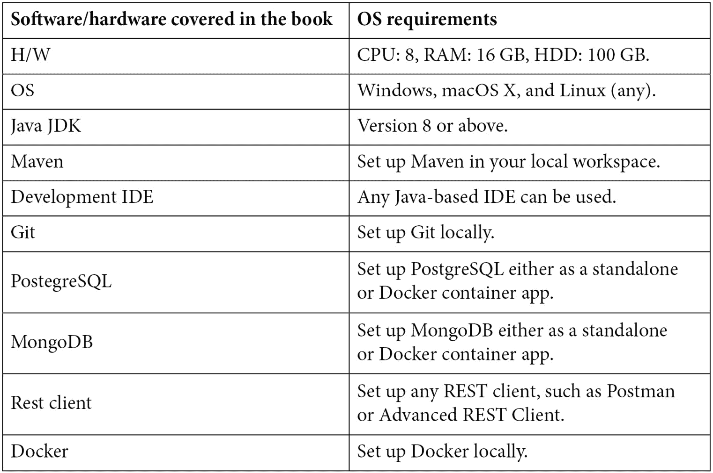

# 前言

Micronaut 是一个基于 JVM 的框架，用于构建轻量级、模块化的应用程序。它是一个快速增长的框架，旨在使创建微服务变得快速且简单。这本书将帮助全栈/Java 开发者使用 Micronaut 构建模块化、高性能和反应式的基于微服务的应用程序。

# 这本书面向谁

这本书是为那些在传统框架（如 Spring Boot）上构建微服务的开发者而写的，他们正在寻找更快的替代方案。需要具备中级 Java 编程知识，以及使用 Java 实现 Web 服务开发的相应知识。

# 这本书涵盖的内容

*第一章*, *使用 Micronaut 框架开始微服务之旅*，从微服务及其设计模式的一些基本概念开始。然后，您将了解 Micronaut 框架以及为什么它是开发微服务的理想框架。稍后，您将通过使用 Maven 和 Gradle 进行 hello-world 项目来亲身体验 Micronaut 框架。

*第二章*, *数据访问工作*，涵盖了与各种数据库和持久化框架一起工作的方面。您将从对象关系映射框架开始，在动手实践 Hibernate 框架的同时，然后深入使用持久化框架（MyBatis）。最后，您还将与非关系型数据库（MongoDB）集成。

*第三章*, *RESTful Web 服务工作*，从数据传输对象和映射器的讨论开始。然后，您将深入了解在 Micronaut 框架中与 RESTful 接口一起工作。稍后，您将了解 Micronaut 的 HTTP 服务器和客户端 API。

*第四章*, *保护 Web 服务*，涵盖了在 Micronaut 框架中保护 Web 端点的一些方法，例如会话认证、JWT 和 OAuth。

*第五章*, *使用事件驱动架构集成微服务*，从事件驱动架构和两种不同的事件发布模型开始：拉模型和推模型。然后，您将深入了解事件流以及如何在宠物诊所应用程序（示例项目）中使用 Apache Kafka 来集成两个微服务。

*第六章*, *测试微服务*，对各种自动化测试进行了探讨——单元测试、服务测试和集成测试，以及如何采用谨慎的自动化测试策略来降低成本并提高微服务的健壮性。

*第七章*，*处理微服务关注点*，涵盖了在微服务上工作时的一些核心关注点，例如分布式配置管理、记录服务 API、服务发现和 API 网关。稍后，您还将探索 Micronaut 框架中的容错机制。

*第八章*，*部署微服务*，涵盖了微服务的构建和部署方面。您将首先使用自动化工具构建容器工件，然后利用 Docker Compose 部署微服务。

*第九章*，*分布式日志、跟踪和监控*，介绍了在微服务中使用分布式日志、分布式跟踪和分布式监控来实现可观察性模式。

*第十章*，*使用 Micronaut 的物联网*，从对物联网和 Alexa 的介绍开始，涵盖 Alexa 基础知识和一个 hello-world 示例。稍后，您将能够在开发宠物诊所应用程序的同时将 Micronaut 与 Alexa 集成。

*第十一章*，*构建企业级微服务*，涵盖了在微服务上工作的最佳实践以及如何构建和扩展企业级微服务。

# 为了充分利用本书



**如果您正在使用本书的数字版，我们建议您亲自输入代码或通过 GitHub 仓库（下一节中提供链接）访问代码。这样做将帮助您避免与代码复制粘贴相关的任何潜在错误。**

# 下载示例代码文件

您可以从 GitHub 下载本书的示例代码文件[`github.com/PacktPublishing/Building-Microservices-with-Micronaut`](https://github.com/PacktPublishing/Building-Microservices-with-Micronaut)。如果代码有更新，它将在现有的 GitHub 仓库中更新。

我们还有其他来自我们丰富的图书和视频目录的代码包，可在[`github.com/PacktPublishing/`](https://github.com/PacktPublishing/)找到。查看它们吧！

# 下载彩色图像

我们还提供了一份包含本书中使用的截图/图表彩色图像的 PDF 文件。您可以从这里下载：[`static.packt-cdn.com/downloads/9781800564237_ColorImages.pdf`](https://static.packt-cdn.com/downloads/9781800564237_ColorImages.pdf)

# 使用的约定

本书使用了多种文本约定。

`文本中的代码`：表示文本中的代码单词、数据库表名、文件夹名、文件名、文件扩展名、路径名、虚拟 URL、用户输入和 Twitter 昵称。以下是一个示例：“遵循这些说明，我们添加了一个`foo-stream`主题并向此主题添加了一条消息。”

代码块设置如下：

```java
@KafkaClient
public interface VetReviewClient {
    @Topic("vet-reviews")
    void send(@Body VetReviewDTO vetReview);
}
```

**粗体**：表示新术语、重要单词或屏幕上看到的单词。例如，菜单或对话框中的单词在文本中显示如下。以下是一个示例：“在 Kafdrop 上查看，我们可以验证来自 pet-clinic-reviews 微服务的事件已流出并添加到**vet-reviews**主题。”

小贴士或重要注意事项

看起来像这样。

# 联系我们

我们始终欢迎读者的反馈。

**一般反馈**：如果您对本书的任何方面有疑问，请在邮件主题中提及书名，并通过 mailto:customercare@packtpub.com 发送邮件给我们。

**勘误**：尽管我们已经尽最大努力确保内容的准确性，但错误仍然可能发生。如果您在这本书中发现了错误，如果您能向我们报告，我们将不胜感激。请访问 [www.packtpub.com/support/errata](http://www.packtpub.com/support/errata)，选择您的书籍，点击勘误提交表单链接，并输入详细信息。

**版权侵权**：如果您在互联网上发现任何形式的我们作品的非法副本，如果您能提供位置地址或网站名称，我们将不胜感激。请通过 mailto:copyright@packt.com 与我们联系，并提供材料的链接。

**如果您有兴趣成为作者**：如果您在某个领域有专业知识，并且您有兴趣撰写或为书籍做出贡献，请访问 [authors.packtpub.com](http://authors.packtpub.com)。

# 分享您的想法

一旦您阅读了《使用 Micronaut 构建微服务》，我们很乐意听到您的想法！请[点击此处直接访问此书的亚马逊评论页面](https://packt.link/r/1800564236)并分享您的反馈。

您的评论对我们和科技社区都很重要，并将帮助我们确保我们提供高质量的内容。
