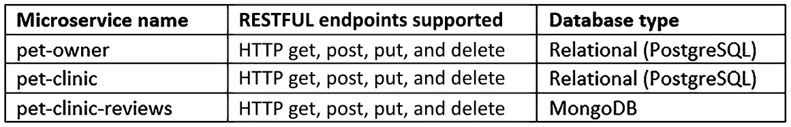
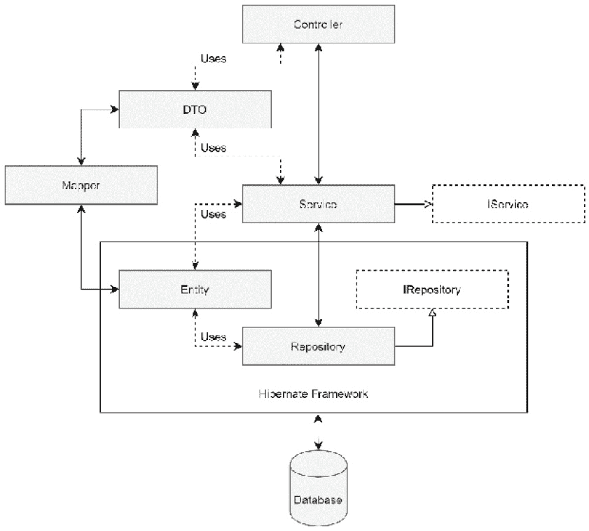
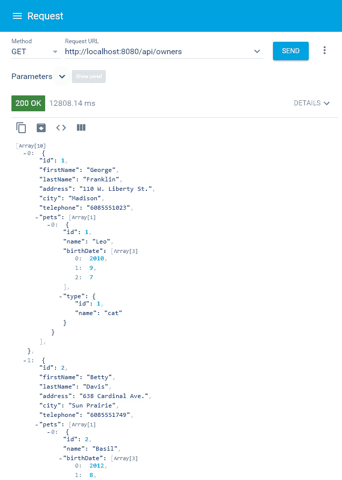
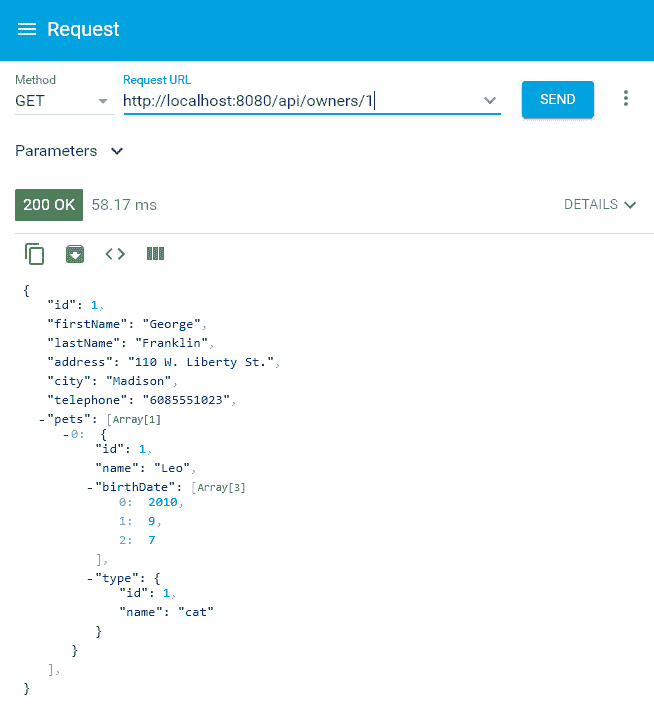
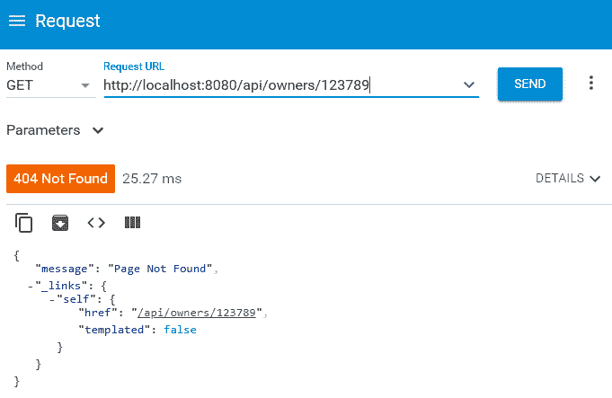
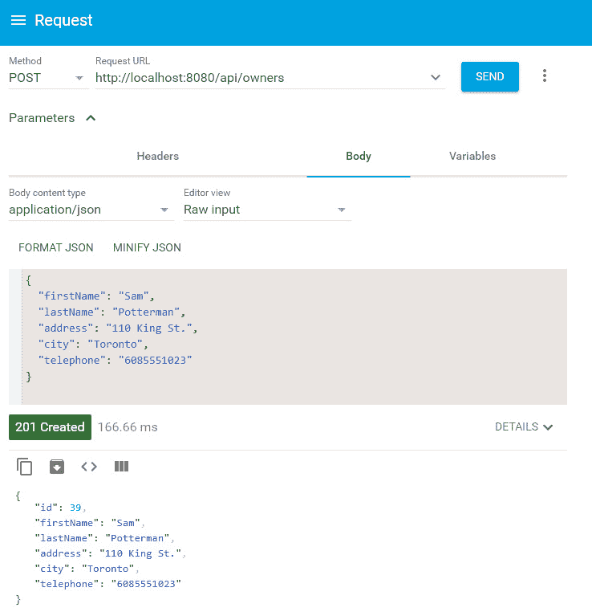
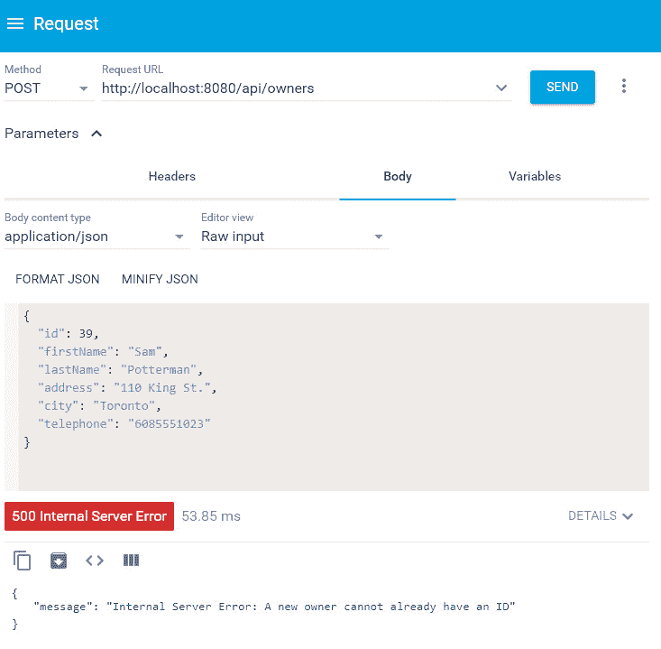
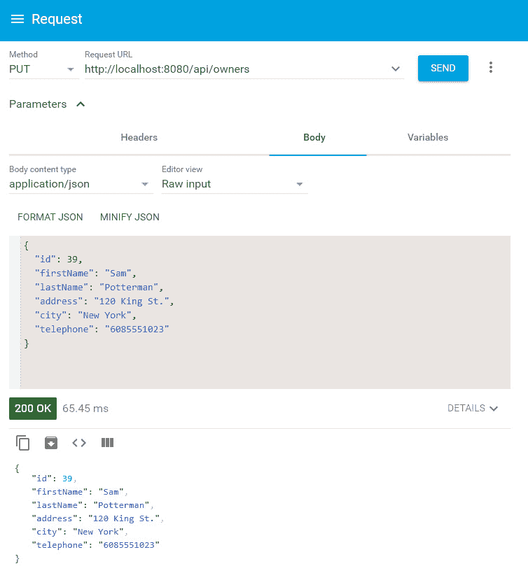
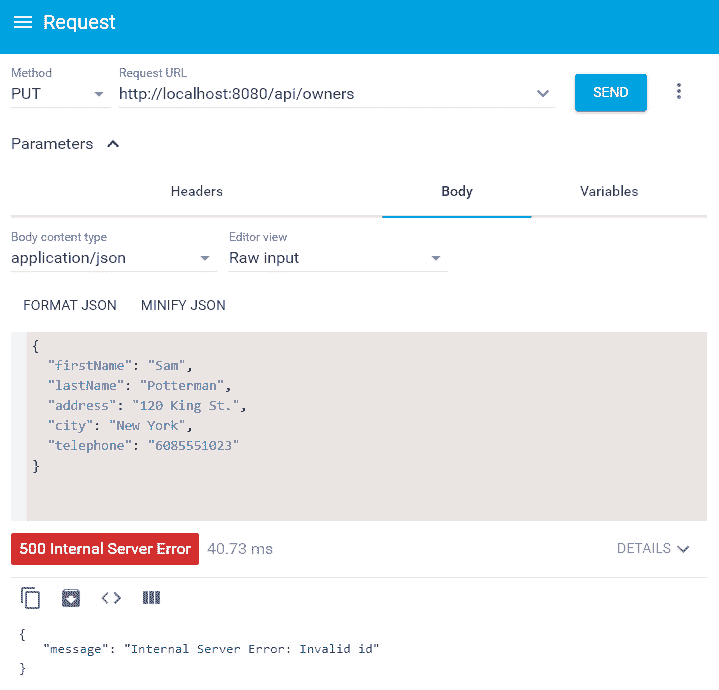
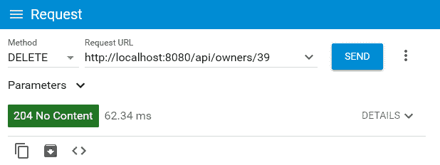

# *第三章*: 在 RESTful Web 服务上工作

在任何微服务开发中，核心方面之一是微服务如何与外部世界接口。`宠物诊所`应用程序。对于这些端点的出站和入站有效载荷，我们将使用 **数据传输对象**（**DTOs**）与 MapStruct 一起映射 DTO 到/从实体。对于实际操作，我们将努力为以下微服务添加 RESTful 端点：

+   `宠物主人`: 通过实际操作为`宠物主人`模式对象添加 HTTP GET、POST、PUT 和 DELETE 端点

+   `宠物诊所`: 通过实际操作为`宠物诊所`模式对象添加 HTTP GET、POST、PUT 和 DELETE 端点

+   `宠物诊所评论`: 通过实际操作为`宠物诊所评论`集合添加 HTTP GET、POST、PUT 和 DELETE 端点

在本章中，我们将深入研究以下主题，以处理上述微服务：

+   在 Micronaut 框架中处理 RESTful 微服务

+   使用 DTOs 作为端点有效载荷

+   为微服务创建 RESTful 端点

+   使用 Micronaut 的 HTTP 服务器 API

+   使用 Micronaut 的 HTTP 客户端 API

到本章结束时，你将具备在 Micronaut 框架中处理 RESTful Web 服务的实际知识。这些知识对于在微服务的网络层工作非常重要。此外，我们还将探讨在 Micronaut 框架中利用 HTTP 服务器对象和客户端对象。

# 技术要求

本章中所有命令和技术说明均在 Windows 10 和 macOS 上运行。本章涵盖的代码示例可在本书的 GitHub 仓库 [`github.com/PacktPublishing/Building-Microservices-with-Micronaut/tree/master/Chapter03`](https://github.com/PacktPublishing/Building-Microservices-with-Micronaut/tree/master/Chapter03) 中找到。

在开发环境中需要安装和设置以下工具：

+   **Java SDK**: 版本 8 或更高（我们使用了 Java 14）。

+   **Maven**: 这不是必需的，只有当你想使用 Maven 作为构建系统时才需要。然而，我们建议在任何开发机器上设置 Maven。下载和安装 Maven 的说明可以在 [`maven.apache.org/download.cgi`](https://maven.apache.org/download.cgi) 找到。

+   **开发 IDE**: 根据您的偏好，可以使用任何基于 Java 的 IDE，但为了编写本章，使用了 IntelliJ。

+   **Git**: 下载和安装 Git 的说明可以在 [`git-scm.com/downloads`](https://git-scm.com/downloads) 找到。

+   **PostgreSQL**: 下载和安装 PostgreSQL 的说明可以在 [`www.postgresql.org/download/`](https://www.postgresql.org/download/) 找到。

+   **MongoDB**：MongoDB Atlas 提供了一个免费的在线数据库即服务，存储空间高达 512 MB。然而，如果您更喜欢本地数据库，则可以在[`docs.mongodb.com/manual/administration/install-community/`](https://docs.mongodb.com/manual/administration/install-community/)找到下载和安装的说明。我们为编写本章使用了本地安装。

+   **REST 客户端**：可以使用任何 HTTP REST 客户端。我们使用了 Advanced REST Client Chrome 插件。

# 在 Micronaut 框架中开发 RESTful 微服务

为了了解 Micronaut 框架中的 RESTful 微服务，我们将继续在 `pet-clinic` 应用程序上工作。以下表格总结了我们将对 `pet-clinic` 应用程序中的每个微服务进行的更改：



表 3.1 – pet-clinic 应用程序中的微服务

在每个微服务中，我们将亲自动手添加 HTTP 端点以对它们拥有的数据对象执行 CRUD 操作。

在我们的动手实践中，我们将关注以下内容：

+   **DTO**：如何使用 DTO 封装 RESTful 端点的出入有效载荷

+   **服务**：服务如何与数据库存储库协调以处理任何控制器请求

+   **控制器**：如何在 Micronaut 框架中为外部世界提供标准的 RESTful 接口

在*第二章*的*数据访问工作*中添加到 *图 2.2*，本章中每个微服务内的组件如下：



图 3.1 – 微服务组件

我们将继续通过遵循控制器-服务-存储库模式来分离关注点。对于服务和控制器之间的通信，我们将探讨 DTO。在涵盖 DTO、服务和最终控制器时，我们将采用自下而上的方式。DTO、映射器、服务和控制器遵循相同的方法，因此，为了使我们的讨论保持专注，我们将以 `pet-owner` 微服务为目标。

在下一节中，我们的焦点将是 DTO。

# 使用 DTO 进行端点有效载荷

DTO 模式起源于企业应用架构，本质上，数据对象聚合和封装要传输的数据。由于在微服务架构中，终端客户端可能需要从不同的持久化资源（如发票数据和用户数据）中获取不同的数据，因此 DTO 模式在限制对微服务的调用以获取所需的数据投影方面非常有效。DTO 也被称为组装对象，因为它们从多个实体类中组装数据。

在本节中，我们将探讨如何实现和映射（到实体）DTO。在后面的章节中，我们将进一步深入探讨使用 DTO 作为在微服务之间有效传输数据的一种机制。我们还将研究 DTO 如何通过组装数据来帮助减少对微服务的调用次数。

## 实现 DTO

要实现一个 DTO，我们将开始定义一个宠物主人的 DTO 类。

打开您首选 IDE 中的 `pet-owner` 微服务项目（在 *第二章*，*处理数据访问* 中创建），将 `com.packtpub.micronaut.service.dto` 包添加到包含所有 DTO 的包中。我们可以定义 `OwnerDTO` 如下：

```java
@Introspected
public class OwnerDTO implements Serializable {
    private Long id;
    private String firstName;
    private String lastName;
    private String address;
    private String city;
    private String telephone;
    private Set<PetDTO> pets = new HashSet<>();
    … getters and setters
}
```

`OwnerDTO` 实现了 `Serializable` 标记接口，以标记 DTO 是可序列化的。此外，在继续我们之前关于组装模式的讨论中，`OwnerDTO` 还将包含一组 `PetDTO` 实例。

按照类似的 POJO 模型，我们可以在 `pet-owner` 微服务中为其他实体定义 DTO，例如在 `com.packtpub.micronaut.service.dto` 包中的 `PetDTO`、`VisitDTO` 和 `PetTypeDTO`。

在下一节中，我们将致力于将这些 DTO 映射到数据库实体。

## 使用 MapStruct 定义映射器

**MapStruct** 是一个代码生成器，它使用注解处理来实现源和目标 Java 类之间的映射。实现的 MapStruct 代码由简单的函数调用组成，因此它是类型安全的且易于阅读的代码。由于我们不需要为这些映射编写代码，MapStruct 在减少源代码体积方面非常有效。

要将 DTO 映射到实体以及反之亦然，我们将在 `pet-owner` 微服务中使用 MapStruct。由于我们使用 Maven，我们不得不在 `pom.xml` 项目中添加以下内容：

```java
...
<properties>
    <org.mapstruct.version>1.3.1.Final</org.mapstruct.version>
</properties>
...
<dependencies>
    <dependency>
        <groupId>org.mapstruct</groupId>
        <artifactId>mapstruct</artifactId>
        <version>${org.mapstruct.version}</version>
    </dependency>
</dependencies>
```

通过将 MapStruct 导入项目，POM 将允许我们利用 MapStruct 工具包。此外，对于 Maven 编译器，我们需要将 MapStruct 添加到 `annotationProcessorPaths`：

```java
...
<build>
    <plugins>
        <plugin>
            <groupId>org.apache.maven.plugins</groupId>
            <artifactId>maven-compiler-plugin</artifactId>
            <configuration>
                …
                <annotationProcessorPaths>
                    <path>
                        <groupId>org.mapstruct</groupId>
                        <artifactId>mapstruct-processor</artifactId>
                        <version>${org.mapstruct.version}</version>
                    </path>
                    <!-- other annotation processors -->
                </annotationProcessorPaths>
    <compilerArgs>
                    <arg>-Amapstruct.defaultComponentModel=jsr330</arg>
                     ….
               </compilerArgs>
            </configuration>
        </plugin>
    </plugins>
</build> 
```

POM 中的注解处理设置将指导 Java 注解处理器为使用 MapStruct 注解标记的任何映射生成源代码。此外，`jsr330` 被指定为 Micronaut 框架（在 Spring 中，通常使用 Spring 模型）中的默认组件模型。

我们将创建一个新的包名为 `com.packtpub.micronaut.service.mapper`，以包含所有映射器接口。为了抽象出一个通用的实体映射器，我们可以声明以下接口：

```java
public interface EntityMapper <D, E> {
    E toEntity(D dto);
    D toDto(E entity);
    List <E> toEntity(List<D> dtoList);
    List <D> toDto(List<E> entityList);
}
```

`EntityMapper` 接口抽象出了对象到对象和列表到列表的转换方法。通过扩展此接口，我们可以轻松定义一个接口来将 `OwnerDTO` 映射到 `Owner` 实体：

```java
@Mapper(componentModel = "jsr330", uses = {PetMapper.class})
public interface OwnerMapper extends EntityMapper<OwnerDTO, Owner> {
    default Owner fromId(Long id) {
        if (id == null) {
            return null;
        }
        Owner owner = new Owner();
        owner.setId(id);
        return owner;
    }
}
```

`OwnerMapper` 接口扩展了 `EntityMapper` 并使用 `PetMapper`。`PetMapper` 用于将一组 `PetDTO` 实例映射到 `Pet` 实体。`PetMapper` 可以使用非常类似的方法定义。

遵循相同的方法，因此我们可以为`Pet`、`Visit`和`PetType`实体分别定义`PetMapper`、`VisitMapper`和`PetTypeMapper`。

到目前为止，我们已经深入探讨了 DTO 及其与相应实体类的映射。在下一节中，我们将专注于与 DTO 相关的服务更改。

## 修改服务以使用 DTO

在*第二章*《数据访问工作》中，为了简化讨论，我们定义了直接使用实体类的方法。由于多种原因，包括我们最终将业务逻辑与数据库实体耦合，或者如果服务方法需要使用多个实体，这可能会变得复杂，因此这种方法不建议使用。简单来说，我们必须通过解耦数据库实体与业务所需的数据对象来分离关注点。

要在业务服务中使用 DTO，我们需要修改抽象接口。`OwnerService`接口可以修改为使用 DTO 如下：

```java
public interface OwnerService {
    OwnerDTO save(OwnerDTO ownerDTO);
    Page<OwnerDTO> findAll(Pageable pageable);
    Optional<OwnerDTO> findOne(Long id);
    void delete(Long id);
}
```

`save()`方法被修改为保存`OwnerDTO`而不是`Owner`实体。同样，`findAll()`和`findOne()`将返回`OwnerDTO`而不是`Owner`。

采用相同的方法，我们可以修改`pet-owner`微服务中其他实体的服务接口，即`PetService`、`PetTypeService`和`VisitService`。

由于我们修改了抽象服务接口，因此我们还需要修改实现类。`OwnerServiceImpl`可以修改为使用 DTO 如下：

```java
@Singleton
@Transactional
public class OwnerServiceImpl implements OwnerService {
    … injections for OwnerRepository and OwnerMapper
    @Override
    public OwnerDTO save(OwnerDTO ownerDTO) {
        Owner owner = ownerMapper.toEntity(ownerDTO);
        owner = ownerRepository.mergeAndSave(owner);
        return ownerMapper.toDto(owner);
    }
    @Override
    @ReadOnly
    @Transactional
    public Page<OwnerDTO> findAll(Pageable pageable) {
        return ownerRepository.findAll(pageable)
                .map(ownerMapper::toDto);
    }
    @Override
    @ReadOnly
    @Transactional
    public Optional<OwnerDTO> findOne(Long id) {
        return ownerRepository.findById(id)
                .map(ownerMapper::toDto);
    }
    @Override
    public void delete(Long id) {
        ownerRepository.deleteById(id);
    }
}
```

`save()`方法将使用`OwnerMapper`在调用存储库方法之前将`OwnerDTO`转换为实体。同样，获取方法将在返回响应之前将`Owner`实体转换回`OwnerDTO`。

采用相同的方法，我们还可以修改`PetServiceImpl`、`PetTypeServiceImpl`和`VisitServiceImpl`。

到目前为止，我们一直关注 DTO 以及如何通过使用 MapStruct 框架将它们映射到实体对象上来轻松使用 DTO。在下一节中，我们将关注与 DTO 相关的服务更改。

# 为微服务创建 RESTful 端点

使用 Micronaut 框架，我们可以创建所有常用的 HTTP 方法，即 GET、PUT、POST 和 DELETE。在核心上，所有 HTTP 关注点都被封装在`io.micronaut.http`包中。此包包含`HttpRequest`和`HttpResponse`接口。这些接口是定义任何 HTTP 端点的基石。使用这些标准实现，我们将在以下章节中涵盖所有 HTTP 方法。

## 创建用于检索资源列表的端点

要创建用于获取资源列表的端点，我们可以首先添加`com.packtpub.micronaut.web.rest`包以包含所有控制器资源。我们将在`pet-owner`微服务的`OwnerResource`控制器中添加一个获取所有所有者的端点：

```java
@Controller("/api")
public class OwnerResource {
    …
    @Get("/owners")
    @ExecuteOn(TaskExecutors.IO)
    public HttpResponse<List<OwnerDTO>> getAllOwners(HttpRequest request, Pageable pageable) {
        log.debug("REST request to get a page of Owners");
        Page<OwnerDTO> page = ownerService.findAll(pageable);
        return HttpResponse.ok(page.getContent()).headers(headers ->
            PaginationUtil.generatePaginationHttpHeaders(headers, UriBuilder.of(request.getPath()), page));
    }
    …
}
```

在这里，我们需要思考以下几点：

1.  `@Controller`：这是一个标记`OwnerResource`为 RESTful 控制器的.stereotype，并在`/api`基本 URL 上公开。

1.  `@Get`：这个注解用于在 HTTP get 上公开`getAllOwners()`方法，相对于 URL`/owners`。

1.  `@ExecuteOn`：这个注解指定在 I/O 线程池上执行此 GET 请求。`@ExecuteOn`注解的值可以是`micronaut.executors`中定义的任何执行器。

1.  `HttpRequest`：`getAllOwners()`接受`HttpRequest`作为输入参数。通常，`HttpRequest`被传递以跟踪和记录详细信息，例如，哪个 IP 地址提交了请求。

1.  `pageable`：这是`io.micronaut.data.model`包中的一个标准接口，通常用于在请求中传递分页信息，例如，`…/api/owners?page=1&size=50&sort=(firstName)`。这种分页信息通常是可选的，并作为查询参数传递。

1.  `HttpResponse`：`getAllOwners()`返回`HttpResponse`，这是一个通用接口，在示例中体现为特定类型的响应。在这个例子中，它返回`List<OwnerDTO>`。

1.  `PaginationUtil`：这是`com.packtpub.micronaut.util`包中的一个自定义类，它生成分页响应。

我们可以在本地运行`pet-owner`服务，默认情况下，它将在端口`8080`上运行。我们可以使用任何 REST 客户端，并访问`http://localhost:8080/api/owners`，我们将得到以下响应：




图 3.2 – 检索所有所有者

如前述截图所示，当我们调用检索所有所有者的端点时，我们没有传递任何分页信息以获取所有所有者。因此，它将从数据库中检索所有所有者和他们的宠物信息。

## 创建用于检索特定资源的端点

要创建用于检索特定资源的端点，我们将在`OwnerResource`中添加一个方法来检索特定所有者，如下所示：

```java
@Get("/owners/{id}")
@ExecuteOn(TaskExecutors.IO)
public HttpResponse<Optional<OwnerDTO>> getOwner(@PathVariable Long id) {
    log.debug("REST request to get Owner : {}", id);
    return ownerService.findOne(id);
}
```

在这里有几个问题需要我们思考：

1.  `@PathVariable`：这个注解用于指定和匹配 HTTP 调用中的路径变量。在上面的例子中，我们传递所有者 ID 作为路径变量。

1.  `Optional`：在这个例子中，我们返回一个可选对象。如果服务可以找到指定 ID 的所有者，则发送`HTTP 200`响应；否则，将回滚为`HTTP 404`。

我们可以在本地运行`pet-owner`服务，默认情况下，它将在端口`8080`上运行。我们可以使用任何 REST 客户端，通过访问`http://localhost:8080/api/owners/1`，我们将得到以下响应：




图 3.3 – 检索特定所有者

`OwnerDTO` 也封装了宠物数据，因此响应负载将检索 ID 为`1`的所有者的完整详细信息。此外，如果向后续的 HTTP 请求传递任何不存在的 ID，则会导致`HTTP 404`：



](img/Figure_3.4_B16585.jpg)

图 3.4 – 获取不存在的所有者

在前面的 API 调用中，我们尝试获取具有 `123789` ID 的所有者，但由于我们没有这个 ID 的所有者，结果是一个 `HTTP 404` 未找到响应。

## 创建插入资源的端点

要创建一个插入资源的端点，我们将向 `OwnerResource` 添加一个 HTTP POST 方法，如下所示：

```java
…
@Post("/owners")
@ExecuteOn(TaskExecutors.IO)
public HttpResponse<OwnerDTO> createOwner(@Body OwnerDTO ownerDTO) throws URISyntaxException {
    if (ownerDTO.getId() != null) {
        throw new BadRequestAlertException("A new owner cannot already have an ID", ENTITY_NAME, "idexists");
    }
    OwnerDTO result = ownerService.save(ownerDTO);
    URI location = new URI("/api/owners/" + result.getId());
    return HttpResponse.created(result).headers(headers -> {
        headers.location(location);
        HeaderUtil.createEntityCreationAlert(headers, applicationName, true, ENTITY_NAME, result.getId().toString());
    });
}
…
```

在这里有几个需要注意的事项：

1.  `@Post`: 使用 `@Post` 注解将 `createOwner()` 公开为 HTTP POST API。

1.  `@ExecuteOn`: 这个注解指定了在 I/O 线程池上执行这个 POST 请求。

1.  `@Body`: `@Body` 注解指定了在 `createOwner()` 方法中的 `ownerDTO` 参数与传入的 HTTP POST 请求体绑定。

1.  `Not null id check`: 使用 `if` 结构，我们快速检查 HTTP 请求体中不包含已定义的 ID 的有效负载。这是一个业务验证的断言，如果它失败，则 API 会抛出一个错误的请求异常。

1.  `HttpResponse.created`: 在愉快的路径场景中，API 将返回 `HTTP 201` 创建。这个响应表示请求已成功执行并且已创建资源。

我们可以在本地启动 `pet-owner` 微服务，并在 REST 客户端中发送以下 HTTP POST 请求：



图 3.5 – 插入所有者

在前面的 HTTP POST 调用中，我们在 HTTP 请求体中传递了一个要插入的所有者对象。正如预期的那样，API 调用成功并返回了一个 `HTTP 201` 创建响应。

此外，如果我们尝试调用这个 HTTP POST 方法来创建一个具有 ID 值的所有者，那么它将失败：



图 3.6 – 再次插入现有所有者

当我们尝试在请求体有效负载中插入具有 ID 值的所有者时，则会抛出一个带有消息 – `内部服务器错误：新的所有者不能已经有 ID` 的 `HTTP 500` 内部服务器错误。

## 创建更新资源的端点

要创建一个更新资源的端点，我们将向 `OwnerResource` 添加一个 HTTP PUT 方法，如下所示：

```java
…
@Put("/owners")
@ExecuteOn(TaskExecutors.IO)
public HttpResponse<OwnerDTO> updateOwner(@Body OwnerDTO ownerDTO) throws URISyntaxException {
    log.debug("REST request to update Owner : {}", ownerDTO);
    if (ownerDTO.getId() == null) {
        throw new BadRequestAlertException("Invalid id", ENTITY_NAME, "idnull");
    }
    OwnerDTO result = ownerService.save(ownerDTO);
    return HttpResponse.ok(result).headers(headers ->
            HeaderUtil.createEntityUpdateAlert(headers, applicationName, true, ENTITY_NAME, ownerDTO.getId().toString()));
}
…
```

在这里有一些值得思考的问题：

1.  `@Put`: `@Put` 注解将 `updateOwner()` 方法公开为 HTTP PUT API。

1.  `@ExecuteOn`: 这个注解指定了在 I/O 线程池上执行这个 PUT 请求。I/O 线程池是一种通过维护等待分配 I/O 请求的线程多数来达到 I/O 并发的机制。

1.  `@Body`: `@Body` 注解指定了在 `createOwner()` 方法中的 `ownerDTO` 参数与传入的 HTTP PUT 请求体绑定。

1.  `Null id check`: 使用 `if` 结构，我们快速检查 HTTP 请求体中不包含具有 null ID 的有效负载。如果 ID 为 null，则 API 会抛出一个错误的请求异常。

1.  `HttpResponse.ok`: 在愉快的路径场景中，API 将返回 `HTTP 200`。这个响应表示请求已成功执行，并且资源已被更新。

我们可以在本地启动 `pet-owner` 微服务，并在 REST 客户端中发送一个 HTTP PUT 请求，如下所示：



图 3.7 – 更新所有者

在 HTTP PUT 请求中，我们请求更新我们刚刚插入的资源。我们正在更新这个资源的地址和城市。正如预期的那样，请求成功执行，并返回了一个 `HTTP 200` 响应。

如果我们尝试使用 null ID 更新资源，那么它将失败：



图 3.8 – 更新不存在的所有者

在之前的 HTTP PUT 请求中，我们尝试使用 null ID 更新一个所有者。抛出了一个带有消息的 `HTTP 500` 内部服务器错误 – `内部服务器错误：无效的 ID`。

## 为删除资源创建一个端点

为了展示删除资源，我们可以在 `OwnerResource` 中添加一个 HTTP DELETE 方法，如下所示：

```java
…
@Delete("/owners/{id}")
@ExecuteOn(TaskExecutors.IO)
public HttpResponse deleteOwner(@PathVariable Long id) {
    log.debug("REST request to delete Owner : {}", id);
    ownerService.delete(id);
    return HttpResponse.noContent().headers(headers -> HeaderUtil.createEntityDeletionAlert(headers, applicationName, true, ENTITY_NAME, id.toString()));
}
…
```

这里有一些值得思考的问题：

1.  `@Delete`: `@Delete` 注解将 `deleteOwner()` 方法公开为 HTTP DELETE API。

1.  `@ExecuteOn`: 这个注解指定在这个 I/O 线程池上执行这个 PUT 请求。

1.  `@PathVariable`: `@PathVariable` 将 `deleteOwner()` 方法中的 ID 参数绑定到 HTTP 请求 URL 中指定的变量。

1.  `HttpResponse.noContent`: 在愉快的路径场景中，API 将返回 `HTTP 204`。这个响应表示请求已成功执行，并且响应体中没有额外的内容。

我们可以在本地启动 `pet-owner` 微服务，并在 REST 客户端中发送一个 HTTP DELETE 请求，如下所示：



图 3.9 – 删除所有者

我们请求删除我们在之前的示例中插入/更新的所有者。正如预期的那样，请求成功，并返回了一个 `HTTP 204` 响应。

到目前为止，我们已经探讨了如何创建所有不同类型的 RESTful 端点。这次讨论为我们使用 Micronaut 的 HTTP 服务器 API 打开了道路。在下一节中，我们将介绍一些利用这些服务器 API 的实际方面。

# 使用 Micronaut 的 HTTP 服务器 API

Micronaut 框架提供了一个基于 Netty 的非阻塞 HTTP 服务器。这些服务器 API 可以用来解决一些有用的微服务需求场景。为了进行实际操作，我们将继续使用 `pet-owner` 微服务。

首先，我们必须在项目的 POM 文件中添加以下 Maven 依赖项：

```java
…
<dependency>
<groupId>io.micronaut</groupId>
<artifactId>micronaut-http-server-netty</artifactId>
<scope>compile</scope>
</dependency>
…
```

这个依赖项应该已经在 `pet-owner` 项目中。在接下来的几节中，我们将探索 HTTP 服务器世界中的几个有用配置。

## 在 Micronaut 框架中绑定 HTTP 请求

在 Micronaut 框架中，我们可以通过几种方式将参数绑定到 HTTP 请求上：

+   `@Body`：如前所述，`@Body`将 HTTP 请求体中的参数绑定到一个参数上。

+   `@CookieValue`：这会将 HTTP 请求中的 cookie 值绑定到一个参数上。

+   `@Header`：这会将 HTTP 请求中的一个头部的参数绑定到一个参数上。

+   `@QueryValue`：这会将 HTTP 请求中的查询参数绑定到一个参数上。

+   `@PathVariable`：这会将 HTTP 请求中的路径绑定到一个参数上。

+   `@Part`：在多部分 HTTP 请求中，这会将参数绑定到一个部分上。

+   `@RequestBean`：这会将任何对象（在 HTTP 请求中）绑定到一个 Java Bean 上。

除了前面的 HTTP 请求绑定之外，Micronaut 框架支持多种 URI 模板。这些模板在创建各种类型的 RESTful 微服务时非常有用。考虑到所有者资源，我们可以在 Micronaut 中支持以下 URI 模板匹配：

![Table 3.2 – URI templates in the Micronaut framework]

![Table 3.2.jpg]

表 3.2 – Micronaut 框架中的 URI 模板

在前面的表格中，我们可以看到各种匹配/限制传入 HTTP 请求的方法以及每种方法可以为特定资源实现什么。在下一节中，我们将讨论如何验证 HTTP 请求中的数据。

## 验证数据

Micronaut 框架支持 JSR 380 Bean 验证以及 Hibernate Bean 验证。默认情况下，Micronaut 项目通常包含一个`micronaut-validation`依赖项，该依赖项基于 JSR 380 标准实现。

使用如`@NotNull`和`@NotEmpty`这样的验证注解，我们可以在处理请求之前验证一个参数/参数是否满足所有验证标准。以下是一些有用的注解：

+   `@NotNull`：这断言参数/参数值不是 null，例如，`@NotNull @PathVariable String ownerId`。

+   `@NotEmpty`：这断言参数不是 null 且不为空。它可以应用于任何`String`、`Collection`或`Map`类型的参数等，例如，`@NotEmpty @PathVariable String ownerId`。

+   `@Min`：这验证注解的属性值大于或等于`value`属性，例如，`@Min(value = 0) Integer offset`。

+   `@Max`：这验证注解的属性值等于或小于`value`属性，例如，`@Max(value =100) Integer offset`。

+   `@Valid`：`@Valid`验证对象图中所有的参数/参数。它递归地扫描对象图中的所有内部`@Valid`使用，并在检查完所有内容后确定最终的验证。

如果任何这些验证未满足，则抛出`javax.validation.ConstraintViolationException`异常。

为了处理约束违反异常以及其他已检查/未检查的异常，我们将在下一节中探讨一些选项。

## 处理错误

Micronaut 框架在整个 HTTP 请求的生命周期中提供了对抛出不同类型异常的良好覆盖，以及处理这些异常。标准异常处理程序可以在`io.micronaut.http.server.exceptions`包中找到。默认情况下，此包内提供了以下处理程序：

+   `ContentLengthExceededHandler`: 这个处理程序通过返回一个`HttpStatus.REQUEST_ENTITY_TOO_LARGE`响应来处理`ContentLengthExceededException`。

+   `ConversionErrorHandler`: 这个处理程序通过返回一个`HttpStatus.BAD_REQUEST`响应来处理`ConversionErrorException`。

+   `HttpStatusHandler`: 这个处理程序通过返回`HttpStatusException`中指定的`HttpStatus`来处理`HttpStatusException`。

+   `JsonExceptionHandler`: 这个处理程序通过返回一个`HttpStatus.BAD_REQUEST`响应来处理`JsonProcessingException`。

+   `UnsatisfiedArgumentHandler`: 这个处理程序通过返回一个`HttpStatus.BAD_REQUEST`响应来处理`UnsatisfiedArgumentException`。

+   `URISyntaxHandler`: 这个处理程序通过返回一个`HttpStatus.BAD_REQUEST`响应来处理`URISyntaxException`。

除了前面提到的标准异常和异常处理程序之外，我们还可以创建我们自己的自定义异常和异常处理程序。

我们可以假设一个假设的`FooException`，它可以由微服务抛出：

```java
public class FooException extends RuntimeException {
…
}
```

`FooException`扩展了`RuntimeException`，这使得它成为一个未检查的异常，我们可以创建`FooExceptionHandler`来处理这个异常：

```java
@Produces
@Singleton 
@Requires(classes = {FooException.class, ExceptionHandler.class})  
public class FooExceptionHandler implements ExceptionHandler<FooException, HttpResponse> { 
    @Override
    public HttpResponse handle(HttpRequest request, FooException exception) {
        JsonError error = new JsonError(exception.getMessage());
        error.path('/' + exception.getArgument().getName());
        error.link(Link.SELF, Link.of(request.getUri()));
        return HttpResponse.status(HttpStatus.INTERNAL_SERVER_ERROR).body(error);
    }
}
```

`FooExceptionHandler` bean 注入强制要求注入`FooException`和`ExceptionHandler`。在代码库的任何地方，如果抛出`FooException`，它将被`FooExceptionHandler`捕获，并返回一个`HttpStatus.INTERNAL_SERVER_ERROR`响应。

## API 版本控制

Micronaut 通过使用`@Version`注解支持 API 版本控制。这个注解可以在控制器或方法级别使用。

默认情况下不支持版本控制，要启用版本控制，我们必须在`application.yml`中进行以下更改：

```java
micronaut:
  application:
    name: Pet-Owner
  router:
    versioning:
      enabled: true
      default-version: 1
…..
```

在配置中，我们已经启用了版本控制，并且默认情况下，如果没有指定版本，则入站请求将由版本`1`的 API 提供服务。

为了展示版本控制，我们将在`pet-owner`微服务的`OwnerResource`的`getOwner()`方法上添加`@Version`：

```java
@Version("1")
@Get("/owners/{id}")
@ExecuteOn(TaskExecutors.IO)
public Optional<OwnerDTO> getOwner(@PathVariable Long id) {
    log.debug("REST request to get Owner : {}", id);
    return ownerService.findOne(id);
}
…
@Version("2")
@Get("/owners/{id}")
@ExecuteOn(TaskExecutors.IO)
public Optional<OwnerDTO> getOwnerV2(@PathVariable Long id) {
    log.debug("REST request to get Owner : {}", id);
    return ownerService.findOne(id);
}
```

`@Version`允许对`getOwner()`方法的多个投影。这个注解在支持事件驱动微服务时非常有用。

要测试这些更改，我们可以在本地运行`pet-owner`并使用高级 REST 客户端调用`getOwner()`：

![Figure 3.10 – 调用一个版本化的 API

![Figure 3.10_B16585.jpg]

图 3.10 – 调用一个版本化的 API

在前面的 HTTP 调用中，我们使用`X-API-VERSION`头指定了版本。根据这个头中指定的值，这个调用将由版本`2`的 API 提供服务。

到目前为止，我们已经探讨了如何在 Micronaut 框架中利用 HTTP 服务器 API。在下一节中，我们将关注 HTTP 客户端方面。

# 使用 Micronaut 的 HTTP 客户端 API

Micronaut 的 HTTP 客户端是一个基于 Netty 的非阻塞客户端，内置了服务发现和负载均衡等云功能。这种自定义实现增强了标准 HTTP 客户端，以适应微服务架构。

为了展示基本的 HTTP 调用，我们将在 `pet-owner` 微服务中为 `OwnerResource` 创建一个 HTTP 客户端。一开始，我们必须在 `pom.xml` 项目中添加 `micronaut-http-client` 依赖项：

```java
…
<dependency>
<groupId>io.micronaut</groupId>
<artifactId>micronaut-http-client</artifactId>
<scope>compile</scope>
</dependency>
…
```

`micronaut-http-client` 封装了所有与 HTTP 客户端相关的 API，例如创建 `RxHttpClient`，执行所有 HTTP 操作，以及处理和响应负载。

接下来，我们将探讨如何利用 `micronaut-http-client` 在我们之前创建的端点上执行各种 HTTP 操作。

## 执行 HTTP PUT 操作

要执行 HTTP PUT 操作，我们可以创建 `OwnerResourceClient`。这个客户端可以打包在 `com.packtpub.micronaut.web.rest.client` 中。

我们可以添加以下方法来执行 HTTP 调用：

```java
public List<OwnerDTO> getAllOwnersClient() throws MalformedURLException {
    HttpClient client = HttpClient.create(new URL("https://" + server.getHost() + ":" + server.getPort()));
    OwnerDTO[] owners = client.toBlocking().retrieve(HttpRequest.GET("/api/owners"), OwnerDTO[].class);
    return List.of(owners);
}
```

`HttpClient.create()` 将创建一个 HTTP 客户端，然后我们使用它来发送 HTTP GET 请求。

## 执行 HTTP POST 操作

要执行 HTTP POST 操作，我们可以向 `OwnerResourceClient` 添加以下方法：

```java
public OwnerDTO createOwnerClient() throws MalformedURLException {
    HttpClient client = HttpClient.create(new URL("https://" + server.getHost() + ":" + server.getPort()));
    OwnerDTO newOwner = new OwnerDTO();
    newOwner.setFirstName("Lisa");
    newOwner.setLastName("Ray");
    newOwner.setAddress("100 Queen St.");
    newOwner.setCity("Toronto");
    newOwner.setTelephone("1234567890");
    return client.toBlocking().retrieve(HttpRequest.POST("/api/owners", newOwner), OwnerDTO.class);
}
```

`HttpClient.create()` 将创建一个 HTTP 客户端，然后我们使用它来发送 HTTP POST 请求。一个所有者对象将被作为请求负载传递。

## 执行 HTTP PUT 操作

要执行 HTTP PUT 操作，我们可以向 `OwnerResourceClient` 添加以下方法：

```java
public OwnerDTO updateOwnerClient() throws MalformedURLException {
    HttpClient client = HttpClient.create(new URL("https://" + server.getHost() + ":" + server.getPort()));
    OwnerDTO owner = new OwnerDTO();
    owner.setId(1L);
    owner.setAddress("120 Queen St.");
    return client.toBlocking().retrieve(HttpRequest.PUT("/api/owners", owner), OwnerDTO.class);
}
```

`HttpClient.create()` 将创建一个 HTTP 客户端，然后我们使用它来发送 HTTP PUT 请求。一个 `owner` 对象将被作为请求负载传递。

## 执行 HTTP DELETE 操作

要执行 HTTP DELETE 操作，我们可以向 `OwnerResourceClient` 添加以下方法：

```java
public Boolean deleteOwnerClient() throws MalformedURLException {
    HttpClient client = HttpClient.create(new URL("https://" + server.getHost() + ":" + server.getPort()));
    long ownerId = 1L;
    HttpResponse httpResponse = client.toBlocking().retrieve(HttpRequest.DELETE("/api/owners" + ownerId), HttpResponse.class);
    return httpResponse.getStatus().equals(HttpStatus.NO_CONTENT);
}
```

`HttpClient.create()` 将创建一个 HTTP 客户端，然后我们使用它来发送 HTTP DELETE 请求。如果请求执行成功，将返回一个无内容消息。

# 摘要

在本章中，我们涵盖了在 Micronaut 应用程序中处理 Web 端点的各个方面。我们从组装器或 DTO 的概念开始，然后深入探讨了如何创建支持基本 CRUD 操作的 restful 端点。我们还实验了 Micronaut 框架中的一些 HTTP 服务器 API。最后，我们专注于 HTTP 客户端方面，并使用 `micronaut-http-client` 创建了一个客户端实用工具。

本章为我们提供了与 Micronaut 框架中 restful 微服务各种实际方面相关的技能。此外，通过探索 HTTP 客户端，我们从头到尾覆盖了这些方面。在开发任何微服务时，这种在 Web 层面上工作的实践经验至关重要。

在下一章中，我们将通过尝试不同的方法和方法来保护 restful 端点，来确保 `pet-clinic` 微服务的 Web 层安全。

# 问题

1.  什么是 DTO？

1.  你如何在 Micronaut 框架中使用 MapStruct？

1.  你如何在 Micronaut 框架中创建一个 RESTful HTTP GET 端点？

1.  你如何在 Micronaut 框架中创建一个 RESTful HTTP POST 端点？

1.  你如何在 Micronaut 框架中创建一个 RESTful HTTP PUT 端点？

1.  你如何在 Micronaut 框架中创建一个 RESTful HTTP DELETE 端点？

1.  Micronaut 框架是如何支持 HTTP 请求绑定的？

1.  我们如何在 Micronaut 框架中验证数据？

1.  我们如何在 Micronaut 框架中对 API 进行版本控制？

1.  Micronaut 框架是如何支持 HTTP 客户端方面的？

1.  我们如何在 Micronaut 框架中创建一个 HTTP 客户端？
