# 第四章: 保护微服务

保护微服务接口以及它们所包含的世界是任何应用程序开发的关键方面。近年来，出现了各种拓扑、工具和框架来解决 Web 服务/微服务的安全方面。在本章中，我们将深入研究微服务中的一些核心和常用安全范式。我们将继续使用上一章的 `pet-clinic` 应用程序。为了实际操作，我们将致力于在 Micronaut 框架中涵盖以下认证策略的同时保护微服务：

+   `pet-owner`: 通过实际操作来保护 `pet-owner` 微服务端点，使用 **会话认证**

+   `pet-clinic`: 通过实际操作来保护 `pet-clinic` 微服务端点，使用 **JWT 认证**

+   `pet-clinic-review`: 通过实际操作来保护 `pet-clinic-review` 微服务端点，使用 **OAuth 认证**

通过上述实际操作练习，我们将在本章中涵盖以下主题：

+   使用 **会话认证**来保护服务端点

+   使用 **JWT 认证**来保护服务端点

+   使用 **OAuth** 来保护服务端点

到本章结束时，您将掌握在 Micronaut 框架中与各种认证策略和本地或云身份提供者一起工作的实用知识。

# 技术要求

本章中所有命令和技术说明均在 Windows 10 和 Mac OS X 上运行。本章涵盖的代码示例可在本书的 GitHub 仓库中找到，地址为 [`github.com/PacktPublishing/Building-Microservices-with-Micronaut/tree/master/Chapter04`](https://github.com/PacktPublishing/Building-Microservices-with-Micronaut/tree/master/Chapter04)。

在开发环境中需要安装和设置以下工具：

+   **Java SDK**: 版本 13 或更高（我们使用了 Java 14）。

+   **Maven**: 这不是必需的，只有当你想使用 Maven 作为构建系统时才需要。然而，我们建议在任何开发机器上设置 Maven。下载和安装 Maven 的说明可以在 [`maven.apache.org/download.cgi`](https://maven.apache.org/download.cgi) 找到。

+   **开发 IDE**: 根据您的偏好，可以使用任何基于 Java 的 IDE，但为了编写本章，使用了 IntelliJ。

+   **Git**: 下载和安装 Git 的说明可以在 [`git-scm.com/downloads`](https://git-scm.com/downloads) 找到。

+   **PostgreSQL**: 下载和安装 PostgreSQL 的说明可以在 [`www.postgresql.org/download/`](https://www.postgresql.org/download/) 找到。

+   **MongoDB**：MongoDB Atlas 提供了一个免费的在线数据库即服务，存储空间高达 512 MB。然而，如果您更喜欢本地数据库，则可以在[`docs.mongodb.com/manual/administration/install-community/`](https://docs.mongodb.com/manual/administration/install-community/)找到下载和安装的说明。我们为本章使用了本地安装。

+   **Rest 客户端**：可以使用任何 HTTP REST 客户端。我们使用了 Advanced REST Client Chrome 插件。

+   **Docker**：有关下载和安装 Docker 的说明可以在[`docs.docker.com/get-docker/`](https://docs.docker.com/get-docker/)找到。

+   **OpenSSL**：有关下载和安装 OpenSSL 的说明可以在[`www.openssl.org/source/`](https://www.openssl.org/source/)找到。

# 在 Micronaut 框架中处理 RESTful 微服务

为了深入了解 Micronaut 框架的安全方面，我们将继续在 `pet-clinic` 应用程序上工作。以下表格总结了我们将对应用程序中的每个微服务进行的安全更改：

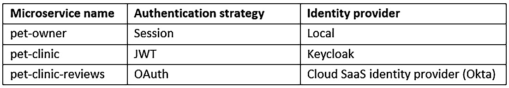

表 4.1 – 在 pet-clinic 应用程序中保护微服务

为了确保微服务中的预期端点，我们将重点关注以下两个关键方面：

+   **身份提供者**：本质上，身份提供者拥有存储和维护数字身份的担忧。此外，它通过使用其存储的数字身份的多数派来验证提交的数字身份，解决任何安全声明。

+   **认证策略**：认证策略将决定微服务如何与身份提供者通信以认证和授权用户请求。

在添加到来自*第三章*，“在 Restful Web 服务上工作”的组件图的基础上，本章中每个微服务的以下内容将发生变化：

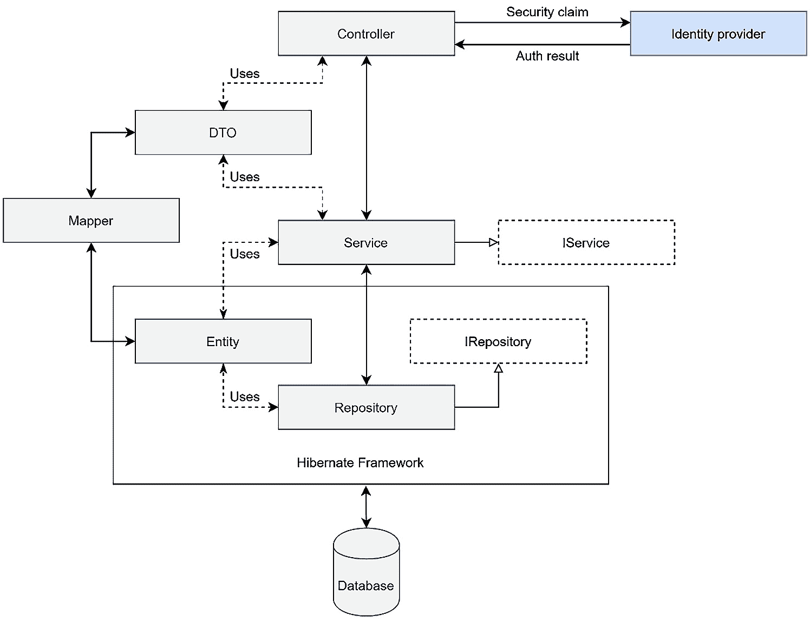

图 4.1 – 微服务组件

我们将坚持我们通常的模式，将关注点分开。我们将在每个微服务中使用一个身份提供者，并与认证策略协同工作。

在下一节中，我们的重点将是介绍 Micronaut 框架为安全考虑提供的现成工具。

# Micronaut 安全基础

为了处理任何安全方面，Micronaut 框架内置了一个 `SecurityFilter` 对象。`SecurityFilter` 对象拦截任何传入的 HTTP 请求，并启动应用程序中配置的认证/授权过程。在以下图中，您可以看到 `SecurityFilter` 对象中授权用户请求的工作流程：

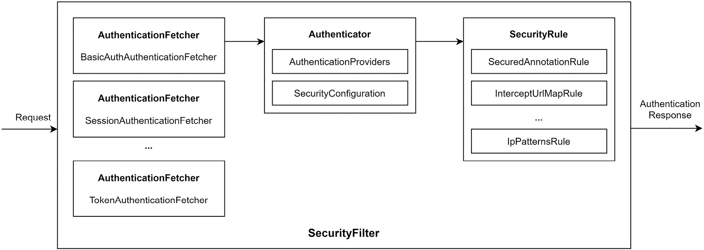

图 4.2 – Micronaut 安全过滤器

Micronaut 的 `SecurityFilter` 有三个基本部分：

+   `AuthenticationFetcher` 将获取用于验证用户请求所需的下游认证器。

+   `Authenticator` 注入配置的认证提供程序和安全配置以验证用户请求。根据认证操作的成功或失败，创建一个 `AuthenticationResponse` 对象。

+   通过 `SecuredAnnotationRule` 或 `IpPatternsRule` 或通过扩展 `AbstractSecurityRule` 创建自己的安全规则。如果请求满足所有安全规则，则安全过滤器将返回成功的 `AuthenticationResponse` 响应；否则，它将返回失败的 `AuthenticationResponse` 响应。

通过利用 `SecurityFilter`，在下一节中，我们将关注如何在 Micronaut 框架中使用会话认证来保护微服务。

# 使用会话认证保护服务端点

在基于会话的认证中，用户状态存储在服务器端。当用户登录到服务器时，服务器启动会话并发出一个会话 ID 作为 cookie。服务器使用会话 ID 从会话共识中唯一标识一个会话。任何后续的用户请求都必须将此会话 ID 作为 cookie 传递以恢复会话：

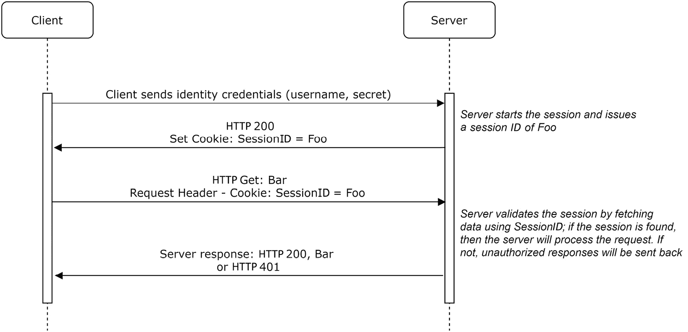

图 4.3 – 基于会话的认证

如前图所示，在基于会话的认证策略中，服务器负责跟踪会话。客户端必须提供一个有效的会话 ID 以恢复会话。

要了解如何使用基于会话的认证来保护微服务，我们将对 `pet-owner` 微服务进行实验。首先，我们需要通过向 `pom.xml` 项目添加以下依赖项来启用安全功能：

```java
<!-- Micronaut security -->
    <dependency>
      <groupId>io.micronaut.security</groupId>
      <artifactId>micronaut-security</artifactId>
    </dependency>
    <dependency>
      <groupId>io.micronaut.security</groupId>
      <artifactId>micronaut-security-session</artifactId>
    </dependency>
…
```

通过导入 `micronaut-security` 和 `micronaut-security-session` 依赖项，我们可以在 `pet-owner` 微服务中利用会话认证工具包。一旦导入这些依赖项，我们接下来需要按照下一个代码块所示配置 `application.properties`：

```java
security:
    enabled: true
    authentication: session
    session:
      enabled: true
    # Auth endpoint
    endpoints:
      login:
        enabled: true
      logout:
        enabled: true
```

如前所述的 `application.properties` 实例，我们将通过将 `enabled` 设置为 `true` 并指定 `session` 作为所需的认证策略来启用安全功能。此外，Micronaut 安全工具包提供了开箱即用的 `LoginController` 和 `LogoutController`。在应用程序属性中，我们已经启用了它们，并且由于我们没有指定这些控制器的自定义路径，它们将分别可在默认指定的路径 `…/login` 和 `…/logout` 上访问。

我们将使用一个基本的本地身份提供程序，该程序将利用应用程序属性来存储用户数据。这非常原始，但有助于简化学习和探索。让我们向 `application.properties` 添加一些用户数据：

```java
identity-store:
  users:
    alice: alice@1
    bob: bob@2
    charlie: charlie@3
  roles:
    alice: ADMIN
    bob: VIEW
    charlie: VIEW
```

我们已添加了三个用户：`alice`、`bob` 和 `charlie`。每个用户也被分配了 `pet-owner` 微服务的角色。

在下一节中，我们将探讨如何实现一个使用配置的应用程序属性进行用户数据操作的认证提供者。

## 实现基本认证提供者

要实现一个基本的身份验证提供者，我们首先将创建一个 `com.packtpub.micronaut.security` 安全包。这个包将包含所有与安全相关的工件。

我们首先将 `IdentityStore` 添加到这个包中：

```java
@ConfigurationProperties("identity-store")
public class IdentityStore {
    @MapFormat
    Map<String, String> users;
    @MapFormat
    Map<String, String> roles;
    public String getUserPassword(String username) {
        return users.get(username);
    }
    public String getUserRole(String username) {
        return roles.get(username);
    }
}
```

`IdentityStore` 类映射到应用程序属性，用于访问用户数据。我们可以利用这个身份存储库来实现认证提供者，如下面的代码片段所示：

```java
@Singleton
public class LocalAuthProvider implements AuthenticationProvider {
    @Inject
    IdentityStore store;
    @Override
    public Publisher<AuthenticationResponse> 
      authenticate(HttpRequest httpRequest, 
      AuthenticationRequest authenticationRequest) {
        String username = 
         authenticationRequest.getIdentity().toString();
        String password = 
         authenticationRequest.getSecret().toString();
        if (password.equals(store.getUserPassword
         (username))) {
            UserDetails details = new UserDetails
             (username, Collections.singletonList
             (store.getUserRole(username)));
            return Flowable.just(details);
        } else {
            return Flowable.just(new 
             AuthenticationFailed());
        }
    }
}
```

`LocalAuthProvider` 通过具体定义 `authenticate()` 方法来实现标准 `AuthenticationProvider` 接口。在 `authenticate()` 方法中，我们简单地检查用户请求中指定的身份和密码是否与身份存储库中的任何用户名和密码匹配。如果我们找到匹配项，则返回 `UserDetails` 对象，否则返回 `AuthenticatonFailed`。

在下一节中，我们将集中讨论如何为 `pet-owner` 端点配置授权。

## 配置服务端点的授权

在微服务的用户需求中，通常会有需要匿名访问以及受保护访问的场景。首先，我们将为 `PetResource` 和 `VisitResource` 提供匿名访问。

在 Micronaut 安全中提供匿名访问有两种方式：

+   使用 `@Secured(SecurityRule.IS_ANONYMOUS)`

+   在应用程序属性中配置 `intercept-url-map`

在接下来的章节中，我们将深入探讨这两种方法。

### 使用 SecurityRule.IS_ANONYMOUS 授予匿名访问

Micronaut 安全内置了一个匿名访问安全规则。为了给整个控制器提供访问权限或将其限制在特定的端点上，我们可以简单地使用 `@Secured` 注解。在 `PetResource` 中，我们通过在控制器级别使用此注解来为所有端点提供匿名访问：

```java
@Controller("/api")
@Secured(SecurityRule.IS_ANONYMOUS)
public class PetResource {
….
}
```

使用 `@Secured(SecurityRule.IS_ANONYMOUS)` 允许对所有 `PetResource` 端点进行匿名访问。我们可以简单地启动服务并尝试访问任何 `PetResource` 端点。您可以使用任何 REST 客户端来调用端点。在下面的屏幕截图中，您将注意到我们如何使用 REST 客户端进行 HTTP GET 调用：

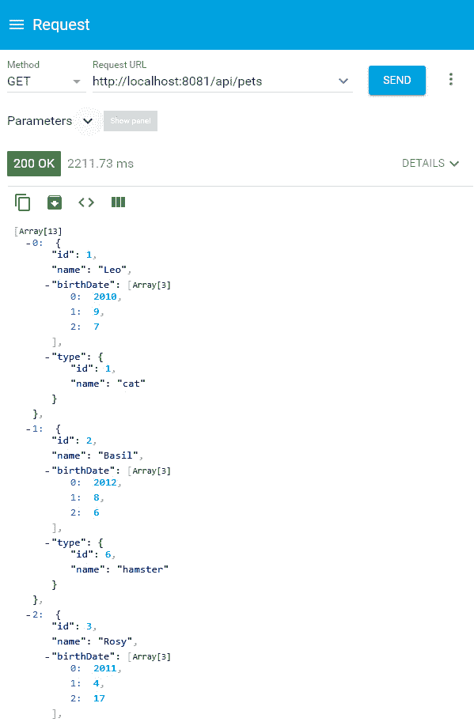

图 4.4 – 对宠物的匿名访问

如前一个屏幕截图所示，我们可以匿名访问 `PetResource`，因为它使用 `@Secured(SecurityRule.IS_ANONYMOUS)` 进行了匿名访问配置。

在下一节中，我们将看到如何使用应用程序属性授予匿名访问。

### 使用应用程序属性授予匿名访问

我们还可以使用应用程序属性配置控制器或控制器中的特定端点的匿名访问。在以下代码片段中，我们正在配置对 `…/api/visits` 端点的匿名访问：

```java
# Intercept rules
    intercept-url-map:
      - pattern: /api/visits
        access: isAnonymous()
```

在应用程序属性中，我们已配置任何用户对`…/api/visits`的请求都应授予匿名访问权限。这将允许所有用户（包括已认证和未认证的用户）访问`VisitResource`。

要快速测试我们能否匿名访问`…/api/vistis`，我们可以尝试对任何`VisitResource`端点进行访问：

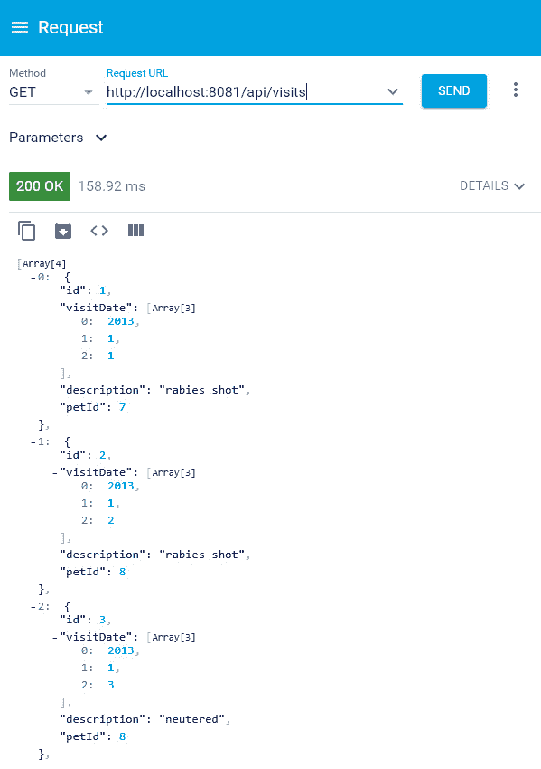

![图 4.5 – 对访问的匿名访问如前一个屏幕截图所示，由于`application.properties`中的`intercept-url-map`配置了匿名访问，我们可以匿名访问`VisitResource`。在下一节中，我们将探讨如何使用先前定义的认证提供者授予安全访问权限。### 使用本地身份提供者授予安全访问权限要授予安全访问权限，我们可以使用`@Secured`注解以及`intercept-url-map`。在这个动手实践的`OwnerResource`中，我们将使用`@Secured`注解定义对`OwnerResource`的安全访问。查看以下代码块：```java@Controller("/api")@Secured(SecurityRule.IS_AUTHENTICATED)public class OwnerResource {…}````OwnerResource`中的所有端点仅授予安全访问权限。如果我们尝试访问任何`…/owners`端点，微服务将返回一个禁止响应，如以下所示：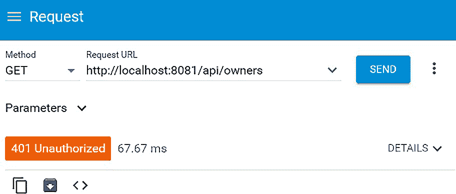

![图 4.6 – 对所有者的未认证访问如前一个屏幕截图所示，如果我们尝试在不指定身份凭证的情况下访问任何所有者端点，微服务将抛出`HTTP 401 Unauthorized`响应。为了成功访问所有者端点，我们需要获取一个会话 cookie。我们可以使用内置的登录控制器进行登录。要登录，只需向`…/login`路径发送带有正确用户名和密码的 POST 请求：```javacurl –v "POST" "http://localhost:8081/login" –H 'Content-Type: application/json; charset=utf-8' –d '{"username":"alice","password":"alice@1"}'```如果请求成功，响应中会发送一个 cookie：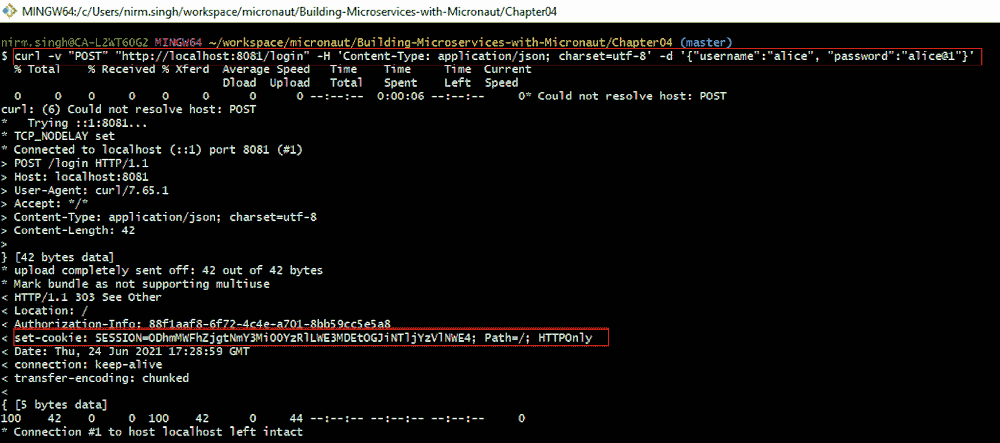

图 4.7 – 获取安全访问的 cookie

如前一个屏幕截图所示，我们将使用正确的用户名和密码向`…/login`发送 POST 请求，服务将返回 cookie 作为响应。

我们可以将此 cookie 传递给对`OwnerResource`的任何请求。在下面的屏幕截图中，我们传递了获取到的 cookie 来对`/api/owners`端点进行 HTTP GET 调用：

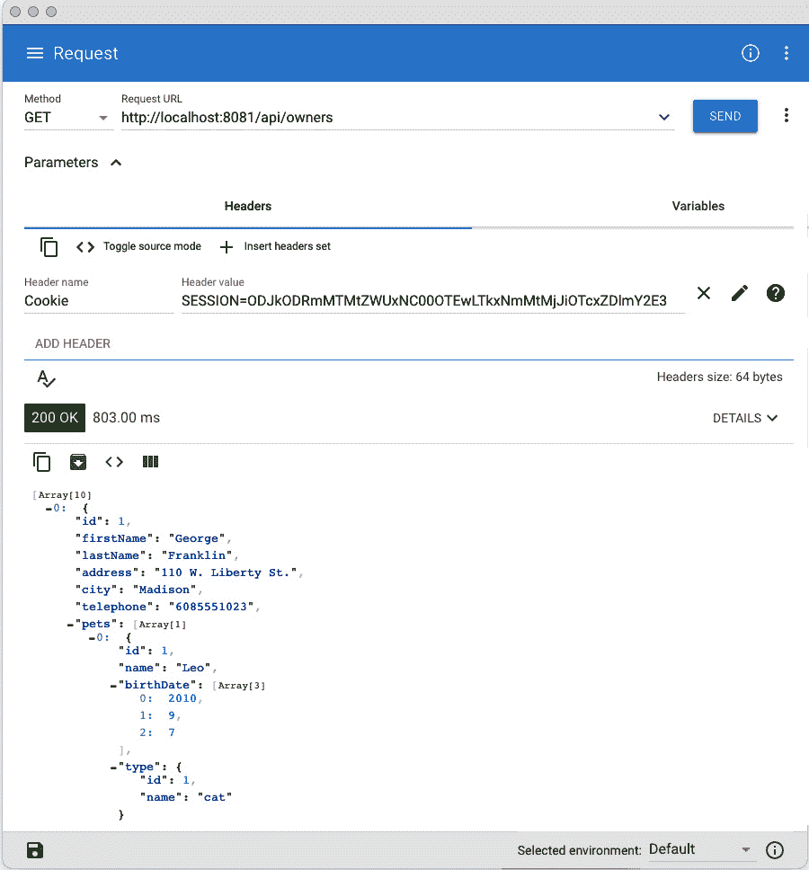

图 4.8 – 使用获取到的 cookie 进行安全访问

由于我们在请求头中传递了获取到的 cookie，服务将提取此 cookie，验证并成功返回`HTTP 200`响应。

到目前为止，我们介绍了如何使用会话认证处理匿名和认证访问场景。在下一节中，我们将深入探讨在 Micronaut 框架中使用**JSON Web Tokens**（JWTs）来保护对微服务的访问。

# 使用 JWT 认证保护服务端点

在基于令牌的身份验证中，用户状态存储在客户端。当客户端登录到服务器时，服务器将用户数据加密成一个带有秘密的令牌，并将其发送回客户端。任何后续的用户请求都必须在请求头中设置此令牌。服务器检索令牌，验证其真实性，并恢复用户会话：

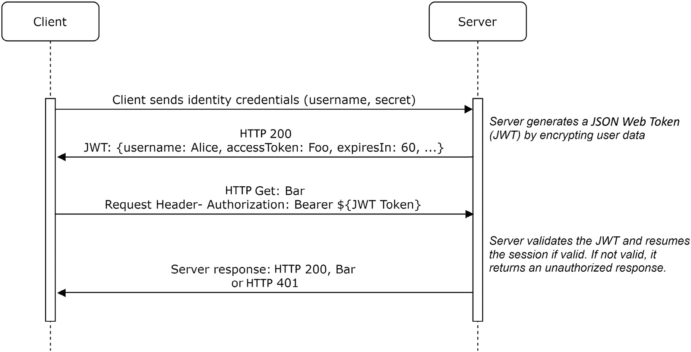

图 4.9 – 基于令牌的身份验证

如前图所示，在基于令牌的身份验证策略中，客户端负责在 JSON Web 令牌中跟踪会话。客户端必须提供一个有效的令牌以恢复会话。

要学习如何使用基于令牌的身份验证来保护微服务，我们将通过一个实际的`pet-clinic`微服务进行操作。首先，我们将使用 Keycloak 设置一个第三方身份提供者。在下一节中，我们将本地设置 Keycloak。

## 设置 Keycloak 作为身份提供者

我们将在本地 Docker 容器中运行 Keycloak 服务器。如果您尚未安装 Docker，您可以参考*技术要求*部分了解如何在您的开发工作区中安装 Docker。要启动本地 Keycloak 服务器，请打开 Bash 终端并运行以下命令：

```java
$ docker run -d --name keycloak -p 8888:8080 -e KEYCLOAK_USER=micronaut -e KEYCLOAK_PASSWORD=micronaut123 jboss/keycloak
```

之后，Docker 将在容器中实例化一个 Keycloak 服务器，并将容器端口`8080`映射到主机操作系统的端口`8888`。此外，它将创建一个密码为`micronaut123`的`micronaut`管理员用户。安装成功后，您可以通过`http://localhost:8888/`访问 Keycloak。在下一节中，我们将开始为微服务设置客户端。

### 在 Keycloak 服务器上创建客户端

要将 Keycloak 用作身份提供者，我们将从设置客户端开始。按照以下说明设置 Keycloak 身份提供者客户端：

1.  访问[`localhost:8888/auth/admin/`](http://localhost:8888/auth/admin/)的**Keycloak 管理员**模块。

1.  提供有效的管理员用户名和密码（在我们的例子中，是`micronaut`和`micronaut123`）。

1.  从左侧导航菜单中选择**客户端**。

1.  提供客户端 ID（您可以跳过其余的输入）。

1.  创建具有提供的客户端 ID 的客户端后，Keycloak 将为客户端打开设置标签页。您必须选择以下截图所示的突出显示的值：


图 4.10 – 在 Keycloak 服务器中创建客户端

Keycloak 服务器将在默认的主域中创建`pet-clinic`客户端。接下来，我们将为这个客户端空间设置一些用户。

### 在客户端空间中设置用户

用户设置将使我们能够将这些身份用作测试用户（当然，稍后，实际用户也可以进行配置）。我们将首先创建角色。对于`pet-clinic`微服务，我们将定义两个角色：`pet-clinic-admin`和`pet-clinic-user`。要创建一个角色，请遵循以下说明：

1.  在主菜单中选择**角色**。

1.  点击**添加角色**按钮。

1.  提供角色名称并点击**保存**按钮。

我们将添加三个用户 – `Alice`（管理员）、`Bob`（用户）和`Charlie`（用户）。要添加用户，请遵循以下说明：

1.  在主菜单中选择**用户**并点击**添加用户**。

1.  提供用户名并保持默认设置。点击**保存**按钮。

1.  用户创建后，前往**凭证**选项卡，指定密码并将**临时**标志更改为**关闭**。点击**重置****密码**按钮。

1.  要配置`user-role`，请前往**角色映射**选项卡并选择所需用户角色。更改将自动保存。

重复前面的说明，将`Alice`设置为`pet-clinic-admin`，`Bob`设置为`pet-clinic-user`，`Charlie`设置为`pet-clinic-user`。

为了从 Keycloak 中公开这些角色数据，我们需要进行以下更改：

1.  从主菜单中选择**客户端作用域**选项。

1.  在列出的选项中选择**角色**。

1.  前往角色的**映射器**选项卡，并选择**领域角色**。

1.  提供以下截图中所突出显示的输入：

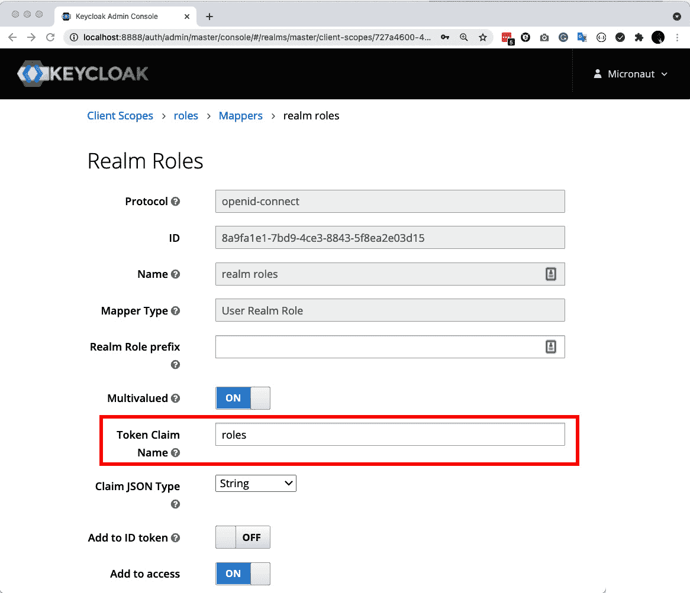

图 4.11 – 配置领域角色映射器

一旦创建了用户并分配了角色，我们就可以继续对`pet-clinic`微服务进行更改。在下一节中，我们将深入了解如何使用 Keycloak 身份提供者的基于令牌的认证来使`pet-clinic`微服务安全。

## 使用基于令牌的认证保护 pet-clinic 微服务

为了保护`pet-clinic`微服务，我们首先需要在`pom.xml`项目中添加以下依赖项来启用安全功能：

```java
<!-- Micronaut security -->
    <dependency>
      <groupId>io.micronaut.security</groupId>
      <artifactId>micronaut-security</artifactId>
      <version>${micronaut.version}</version>
    </dependency>
    <dependency>
      <groupId>io.micronaut.security</groupId>
      <artifactId>micronaut-security-jwt</artifactId>
    <version>${micronaut.version}</version>
    </dependency>
    <dependency>
      <groupId>io.micronaut.security</groupId>
      <artifactId>micronaut-security-oauth2</artifactId>
      <version>${micronaut.version}</version>
    </dependency>
…
```

通过导入`micronaut-security`和`micronaut-security-jwt`依赖项，我们可以在`pet-clinic`微服务中利用令牌认证工具包。我们将使用 OAuth 2 与 Keycloak 服务器集成。一旦导入这些依赖项，我们还需要按照以下方式配置`application.properties`：

```java
security:
    authentication: idtoken
    endpoints:
      login:
        enabled: true
    redirect:
      login-success: /secure/anonymous
    token:
      jwt:
        enabled: true
        signatures.jwks.keycloak:
          url: http://localhost:8888/auth/realms/master/protocol/openid-connect/certs
    oauth2.clients.keycloak:
      grant-type: password
      client-id: pet-clinic
      client-secret: XXXXXXXXX
      authorization:
        url: http://localhost:8888/auth/realms/master/protocol/openid-connect/auth
      token:
        url: http://localhost:8888/auth/realms/master/protocol/openid-connect/token
        auth-method: client_secret_post
```

在应用程序属性中，`client-id`和`client-secret`必须从`KeyCloak`复制。客户端密钥可以通过访问`http://localhost:8888/auth/realms/master/.well-known/openid-configuration`来复制。

在下一节中，我们将重点介绍如何使用配置的基于令牌的认证策略和 Keycloak 身份服务器来授予控制器端点的安全访问权限。

### 使用 KeyCloak 身份提供者授予安全访问权限

为了授予安全访问权限，我们可以使用 `@Secured` 注解以及 `intercept-url-map`。在动手实验中，我们将使用 `@Secured` 注解授予 `VetResource` 的安全访问权限，如下代码片段所示：

```java
@Controller("/api")
@Secured(SecurityRule.IS_AUTHENTICATED)
public class VetResource {
...
}
```

`VetResource` 中的所有端点都只授予安全访问权限。如果我们尝试访问任何 `…/vets` 端点，微服务将返回一个禁止响应：

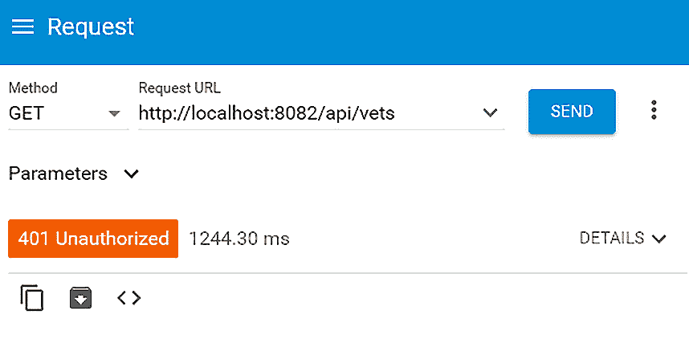

图 4.12 – 未认证访问兽医

如前图所示，如果我们尝试访问任何兽医端点而不指定有效的令牌，微服务将抛出 `HTTP 401 未授权` 响应。

为了成功访问兽医端点，我们需要获取一个有效的 JWT。我们可以使用内置的登录控制器进行登录。要登录，只需向 `…/login` 路径发送带有正确用户名和密码的 POST 请求。如果请求成功，响应中将发送包含 JWT 的 cookie，如下一屏幕截图所示：

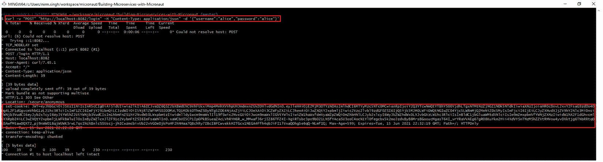

图 4.13 – 获取用于安全访问的 cookie

如屏幕截图所示，我们将使用正确的用户名和密码向 `…/login` 端点发送 POST 请求。服务将使用 KeyCloak 身份提供者授予安全访问权限，并返回包含 JWT 的 cookie。

复制前一个响应中的 JWT 部分。我们可以将此令牌传递给对 `VetResource` 的任何请求。在下面的屏幕截图中，我们正在调用刚刚获取的 JWT 的 `…/vets` 端点：

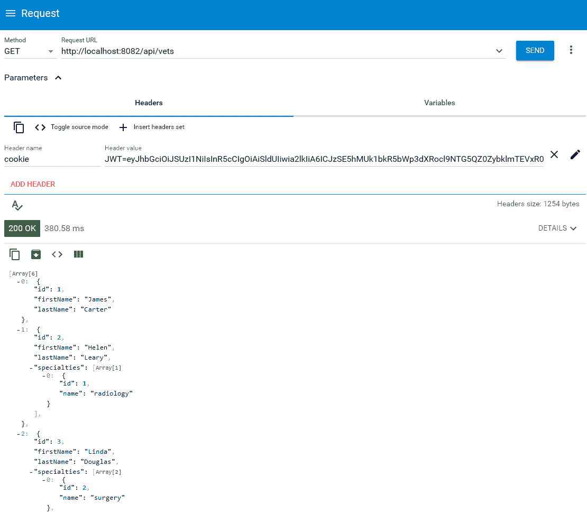

图 4.14 – 使用获取的令牌进行安全访问

由于我们在请求头中传递了有效的令牌，服务将验证此令牌并成功返回 `HTTP 200` 响应。

到目前为止，我们已经探讨了如何使用外部身份提供者的 JWT 来保护微服务。在下一节中，我们将关注如何使用云身份提供者的 OAuth 来实现微服务安全。

# 使用 OAuth 保护服务端点

OAuth 是另一种基于令牌的认证策略。由于其广泛的接受度、对网络安全深度和广度的良好覆盖，以及客户端和服务器端管理用户会话的灵活性，使其成为企业级认证机制。OAuth 规定使用令牌来建立身份，而不是传递用户名和密码。令牌可以从外部身份提供者获取，然后可以将此令牌传递给任何后续请求以恢复会话：

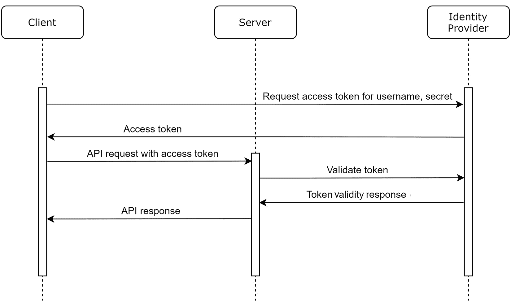

图 4.15 – 使用 OAuth 分离关注点

如前图所示，在基于 OAuth 令牌的认证策略中，客户端从身份提供者获取令牌，并在向服务器发送任何 API 请求时使用此令牌。服务器通过身份提供者验证此令牌以返回适当的响应。

为了了解如何使用 OAuth 和基于云的身份提供者来保护微服务，我们将通过`pet-clinic-review`微服务进行实际操作练习。首先，我们将使用 Okta 设置一个云身份提供者。

## 设置 Okta 作为身份提供者

Okta 是领先的 SaaS 身份管理门户。我们将使用 Okta 作为身份提供者。为了开始，您必须在 Okta 上注册。在[developer.okta.com](http://developer.okta.com)上注册。注册后，Okta 将要求用户确认电子邮件。在电子邮件中，您还将收到一个 Okta 域名，如图中所示：

![Figure 4.16 – Okta 注册确认中的域名]

![Figure_4.16_B16585.jpg]

![Figure 4.16 – Okta 注册确认中的域名]

如图中所示，将为您的开发者账户创建一个 Okta 域名。您必须保存此信息，因为这将用于以后配置 Okta 作为身份提供者。

在下一节中，我们将了解如何在 Okta 上创建应用程序。

### 在 Okta 上创建应用

为了使用 Okta 与您的微服务，您需要在 Okta 上创建一个应用。按照以下说明创建 Okta 上的应用：

1.  登录到[`developer.okta.com/`](https://developer.okta.com/)。

1.  在主页面上，选择**创建 Web 应用程序**。

1.  选择**原生**作为您的平台并点击**下一步**按钮。

1.  提供以下截图中的应用程序设置，并在所有输入都提供后，点击**完成**按钮：![Figure 4.17 – 在 Okta 上创建微服务应用]

    ![Figure 4.17_B16585.jpg]

    ![Figure 4.17 – 在 Okta 上创建微服务应用]

1.  我们将保留大部分输入的默认值。在**允许的授权类型**下，勾选所有复选框。

1.  一旦应用创建成功，编辑**客户端凭证**并选择**使用客户端身份验证**选项以进行**客户端身份验证**。

按照之前的说明创建应用程序后，记下客户端 ID 和客户端密钥。这将在以后使用。接下来，我们将为该应用程序设置一些用户。

### 在客户端空间中设置用户

用户设置将使我们能够将这些身份用作测试用户。我们将添加三个用户 - `Alice`（管理员）、`Bob`（用户）和`Charlie`（用户）。要添加用户，请遵循以下说明：

1.  在主导航栏上，将鼠标悬停在**用户**上，然后选择**人员**。

1.  点击**添加人员**按钮。

1.  提供以下截图中的输入：![Figure 4.18 – 在 Okta 上添加人员（用户）]

    ![Figure 4.18_B16585.jpg]

    ![Figure 4.18 – 在 Okta 上添加人员（用户）]

1.  在密码输入中，选择**由管理员设置**，并且必须保持**用户必须在首次登录时更改密码**未选中。这将允许我们快速使用身份而不重置密码。

重复前面的说明，为`Bob`和`Charlie`设置应用程序用户。一旦用户创建，我们就可以继续对`pet-clinic-reviews`微服务进行更改。

在下一节中，我们将深入探讨如何使`pet-clinic-reviews`安全，但首先让我们先启用 SSL，以便在 HTTPS 上加密通信。

## 在 Micronaut 框架中启用 SSL

如果微服务没有暴露给 HTTPS，任何安全防护措施都将是不完整的。在前面的小节中，我们故意只关注了身份验证和授权，而跳过了 SSL。由于我们将使用通过云提供的第三方身份，建议并在`pet-clinic-reviews`微服务中启用 SSL。

为了启用 SSL，我们需要一个用于 localhost 的 SSL 证书。我们将使用 OpenSSL 创建自签名证书。按照以下说明使用 OpenSSL 创建自签名证书：

1.  打开 Git Bash 终端。

1.  将目录更改为`pet-clinic-reviews`项目的根目录。

1.  在 Git Bash 中运行`winpty openssl req -x509 -newkey rsa:2048 -keyout key.pem -out cert.pem -days 365`。提供正确信息以创建自签名证书。这将创建一个`key.pem`文件和一个`cert.pem`文件在打开的目录中。

1.  要合并密钥和证书文件，请在 Git Bash 中运行`winpty openssl pkcs12 -inkey key.pem -in cert.pem -export -out cert.p12`。

1.  要验证您已创建 P12 文件，请在 Git Bash 中运行`winpty openssl pkcs12 -in cert.p12 -noout -info`。您必须提供用于创建 P12 文件的相同密码。

根据前面的说明，我们可以成功创建一个平台无关的证书。P12 格式因其可以在不同平台和操作系统之间使用而变得流行。接下来，我们将添加此证书到主机操作系统的信任库，以便系统上所有运行的应用程序都可以信任它。按照以下说明将证书添加到信任库：

1.  确定`$JAVA_HOME`。它可以在系统变量中找到。

1.  将刚刚创建的`cert.pem`文件复制到`$JAVA_HOME/jre/lib/security/cacerts`。

1.  以管理员权限打开 Git Bash 终端，并将目录更改为`$JAVA_HOME/jre/lib/security`。

1.  在 Git Bash 终端中运行`winpty keytool -importcert -file cert.pem -alias localhost -keystore $JAVA_HOME/jre/lib/security/cacerts -storepass changeit`。

通过遵循前面的说明，我们将把自签名证书添加到信任库中。这将使系统在通过 SSL 使用此证书时信任它。

我们的定制开发者 Okta 域也可能不被系统信任。我们将遵循类似的说明将 Okta 证书添加到`cacerts`信任库中：

1.  在 Chrome 浏览器中打开一个新的标签页。打开开发者工具。

1.  点击`https://${yourOktaDomain}/oauth2/default/.well-known/oauth-authorization-server?client_id=${yourClientId}`。

1.  在开发者工具中，转到**安全**选项卡并点击**查看证书**。

1.  这将在提示中打开证书。转到此提示的**详细信息**选项卡。

1.  点击**复制文件**并按照说明将证书导出到本地目录。

1.  将刚刚导出的证书复制到`$JAVA_HOME/jre/lib/security/cacerts`。

1.  使用管理员权限打开 Git Bash 终端，并将目录更改为`$JAVA_HOME/jre/lib/security`。

1.  在 Git Bash 终端中运行`winpty keytool -importcert -file okta.cert -alias localhost -keystore $JAVA_HOME/jre/lib/security/cacerts -storepass changeit`。在文件选项中，你必须提供导出的证书名称。

将开发域 Okta 证书添加到系统信任存储库将使我们能够与 Okta 身份提供者通信。在下一节中，我们将深入了解如何使用自签名证书在`pet-clinic-reviews`微服务中启用 SSL。

### 配置 SSL 的应用程序属性

一旦你有了可读的证书，Micronaut 框架提供了一种快速的方法通过配置一些应用程序属性来启用 SSL。对应用程序属性进行以下更改以启用 SSL：

```java
micronaut:
  ssl:
    enabled: true
    key-store:
      type: PKCS12
      path: file:cert.p12
      password: Pass@w0rd
```

为了启用 SSL，我们使用了在上一节中创建的自签名证书。用于安全通信的`8443`。

在下一节中，我们将关注如何使用 Okta 身份提供者配置`pet-clinic-reviews`微服务以使用 OAuth 安全。

## 使用 OAuth 保护`pet-clinic-reviews`微服务

为了保护`pet-clinic`微服务，我们首先需要通过在`pom`项目中添加以下依赖项来启用安全：

```java
<!-- Micronaut security -->
    <dependency>
      <groupId>io.micronaut.security</groupId>
      <artifactId>micronaut-security</artifactId>
    </dependency>
    <dependency>
      <groupId>io.micronaut.security</groupId>
      <artifactId>micronaut-security-jwt</artifactId>
    </dependency>
    <dependency>
      <groupId>io.micronaut.security</groupId>
      <artifactId>micronaut-security-oauth2</artifactId>
    </dependency>
…
```

通过导入`micronaut-security`和`micronaut-security-jwt`依赖项，我们可以在`pet-clinic-reviews`微服务中利用令牌认证和 OAuth 工具包。一旦导入这些依赖项，我们还需要按照以下方式配置`application.properties`：

```java
security:
    authentication: idtoken
    oauth2:
      clients:
        okta:
          client-secret: HbheS-
           q4P6oewQgT7uK58bgMbtHbCwcarzWuHB32
          client-id: 0oa37vkb7Sq23P1kh5d6
          openid:
            issuer: https://dev-
             4962048.okta.com/oauth2/default
    endpoints:
      logout:
        get-allowed: true
```

在应用程序属性中，`client-id`和`client-secret`必须从 Okta 复制。对于发行者，你必须提供你的 Okta 域名在第一部分。你可能只需要更改你的开发域名，但你可以通过访问`https://${yourOktaDomain}/oauth2/default/.well-known/oauth-authorization-server?client_id=${yourClientId}`中的 OAuth 配置来获取有关授权和令牌 URL 的更多信息。

在下一节中，我们将关注如何使用 OAuth 和 Okta 身份服务器授予控制器端点的安全访问权限。

### 使用 Okta 身份提供者授予安全访问权限

为了授予安全访问权限，我们可以使用`@Secured`注解以及`intercept-url-map`。在我们的实际操作示例中，我们将使用`@Secured`注解来授予`VetReviewResource`的安全访问权限：

```java
@Controller("/api")
@Secured(SecurityRule.IS_AUTHENTICATED)
public class VetReviewResource {
    ...
}
```

`VetReviewResource` 中的所有端点都仅授予安全访问权限。如果我们尝试访问任何 `…/vet-reviews` 端点，微服务将返回一个禁止响应。在以下图中，我们尝试未加密地访问 `…/vet-reviews` 端点，服务响应为 `HTTP 401`：

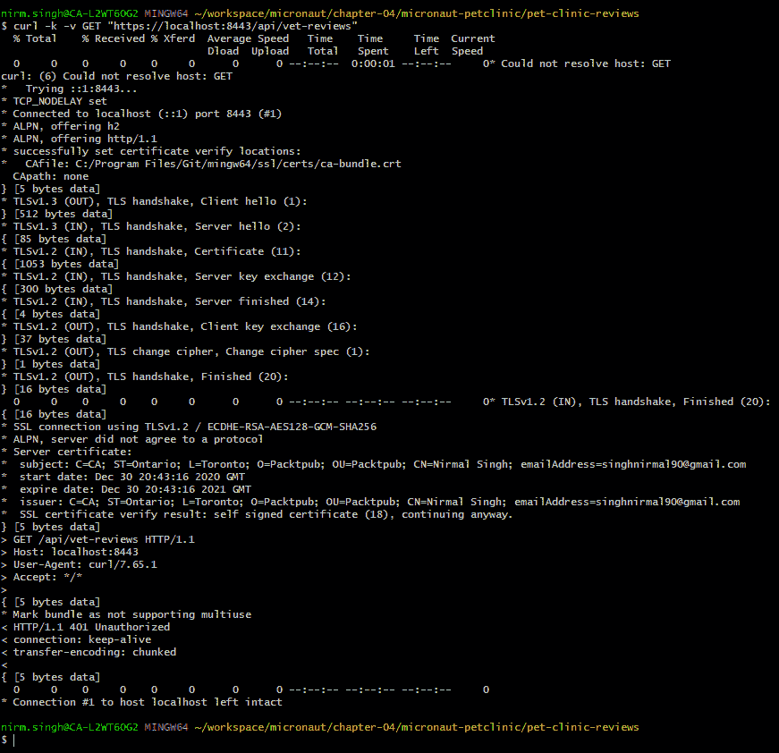

图 4.19 – 未认证访问兽医

如前一个屏幕截图所示，如果我们尝试访问任何未指定有效令牌的 `vet-reviews` 端点，微服务将抛出 `HTTP 401 未授权` 响应。

为了成功访问兽医端点，我们需要获取一个有效的 JWT。我们可以通过访问 Okta 令牌 API 来获取有效令牌。以下是通过调用 Okta 令牌 API 的 `curl` 命令：

```java
curl -k -u client_id:client_secret \
--location --request POST 'https://dev-4962048.okta.com//oauth2/default/v1/token' \
--header 'Accept: application/json' \
--header 'Content-Type: application/x-www-form-urlencoded' \
--data-urlencode 'grant_type=password' \
--data-urlencode 'username=Alice' \
--data-urlencode 'password=Pass@w0rd' \
--data-urlencode 'scope=openid'
```

在之前的 `curl` 命令中，你必须提供正确的 `client_id` 和 `client_secret`、`POST` URL 和用户凭据。如果一切验证成功，令牌 API 将返回一个载体令牌和 ID 令牌。复制返回的访问令牌。我们可以将此令牌传递给对 `VetReviewResource` 的任何请求，以实现安全通信：

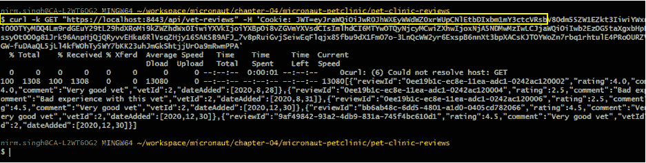

图 4.20 – 使用获取的令牌进行安全访问

由于我们在请求头中传递了一个有效令牌，该服务将验证此令牌并成功返回 `HTTP 200` 响应。

在本节中，我们学习了 OAuth 安全性，并进行了实验。为了使 `pet-clinic-reviews` 服务端点安全，我们使用了 OAuth 和 Okta 作为第三方身份提供者。

# 摘要

在本章中，我们探讨了在 Micronaut 框架中保护微服务的各种方法。我们的旅程从深入研究会话身份验证策略开始，然后探讨了使用外部 Keycloak 身份服务器进行的基于令牌的身份验证。最后，我们使用基于云的身份提供者 OAuth 来保护微服务。此外，我们还启用了 SSL，以确保通过 HTTPS 进行服务通信的安全。

本章为你提供了一套实用的技能集，用于在 Micronaut 框架中使用各种身份验证策略来保护微服务，以及如何与本地或外部（云）身份提供者协同工作。

在下一章中，我们将探讨如何使用事件驱动架构集成不同的微服务。

# 问题

1.  Micronaut 框架中有哪些不同的身份验证策略？

1.  Micronaut 中的安全过滤器是什么？

1.  你如何在 Micronaut 框架中设置基于会话的身份验证？

1.  Micronaut 框架中的 `@Secured` 注解是什么？

1.  Micronaut 框架中的 `intercept-url-maps` 是什么？

1.  你如何在 Micronaut 框架中设置基于令牌的身份验证？

1.  你如何在 Micronaut 框架中设置 JWT 身份验证？

1.  你如何在 Micronaut 框架中与 Keycloak 集成？

1.  你如何在 Micronaut 框架中设置 OAuth 认证？

1.  你如何在 Micronaut 框架中与 Okta 集成？

1.  你如何在 Micronaut 框架中启用 SSL？
