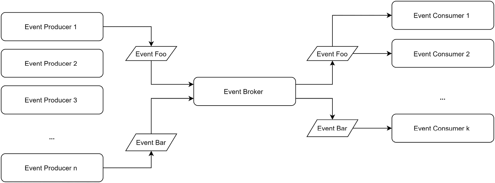
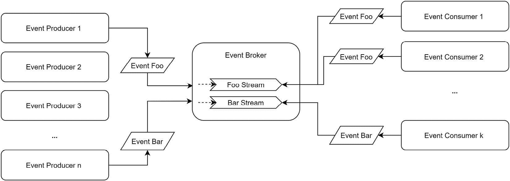
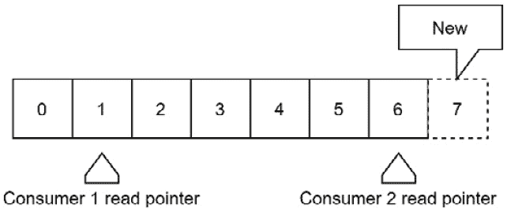
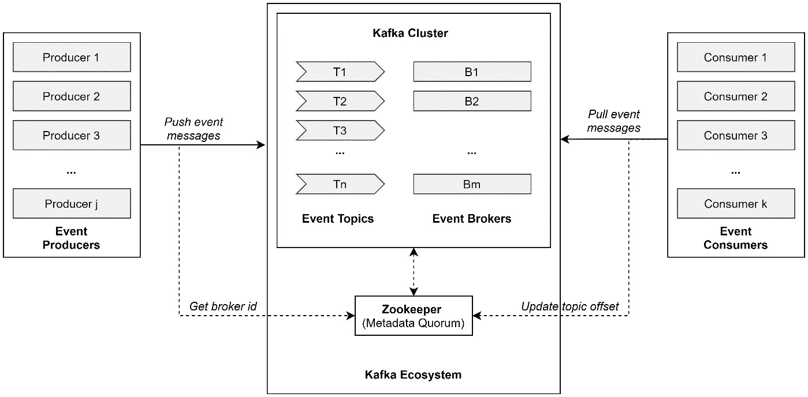
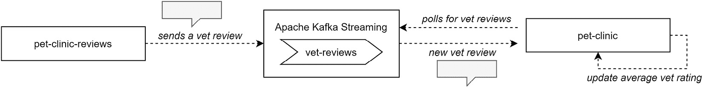
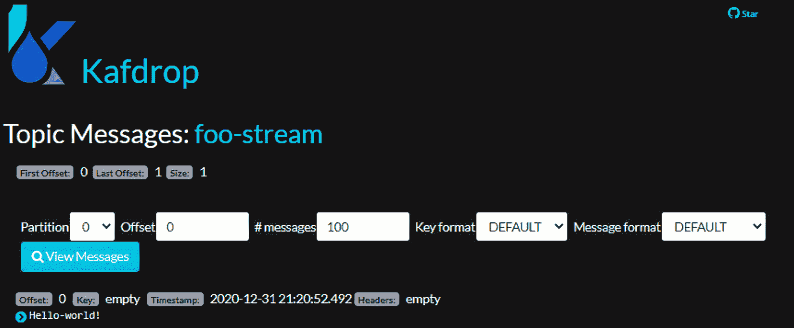
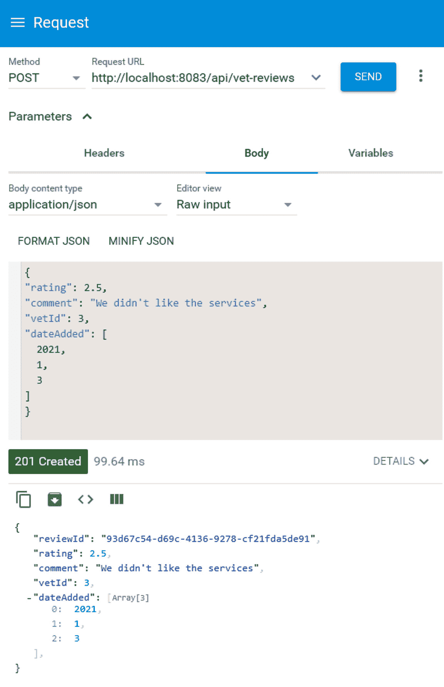
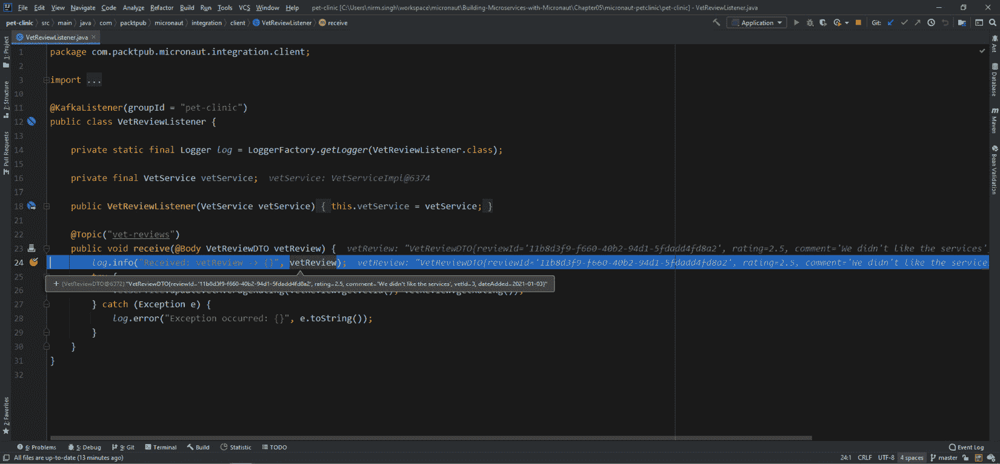

# 第五章: 使用事件驱动架构集成微服务

微服务架构的本质是将单体分解为解耦或松耦合的微服务。这种分解成微服务的结果是，我们将每个微服务拥有的用户和/或业务关注点分开。然而，对于整个应用程序来说，所有微服务需要通过相互交互来执行和响应用户请求，共同工作。事件驱动架构在解决这些微服务间的交互方面越来越受欢迎。

在本章中，我们将探讨如何在 Micronaut 框架中实现事件驱动架构。我们将深入研究以下主题：

+   理解事件驱动架构

+   使用 Apache Kafka 生态系统进行事件流

+   使用事件流集成微服务

到本章结束时，读者将掌握关于事件驱动架构以及如何在 Micronaut 框架中实现事件流代理以集成应用程序微服务的高级知识。

# 技术要求

本章中的所有命令和技术说明都是在 Windows 10 和 macOS 上运行的。本章涵盖的代码示例可在书籍的 GitHub 仓库 https://github.com/PacktPublishing/Building-Microservices-with-Micronaut/tree/master/Chapter05 中找到。

以下工具需要在开发环境中安装和设置：

+   **Java SDK**: Java SDK 版本 13 或更高（我们使用了 Java 14）。

+   **Maven**: 这不是必需的，只有当您想使用 Maven 作为构建系统时才需要。然而，我们建议在所有开发机器上设置 Maven。有关下载和安装 Maven 的说明可以在 [`maven.apache.org/download.cgi`](https://maven.apache.org/download.cgi) 找到。

+   **开发 IDE**: 根据您的偏好，可以使用任何基于 Java 的 IDE，但为了本章节的目的，使用了 IntelliJ。

+   **Git**: 有关下载和安装 Git 的说明可以在 [`git-scm.com/downloads`](https://git-scm.com/downloads) 找到。

+   **PostgreSQL**: 有关下载和安装的说明可以在 [`www.postgresql.org/download/`](https://www.postgresql.org/download/) 找到。

+   **MongoDB**: MongoDB Atlas 提供了高达 512 MB 存储空间的免费在线数据库即服务。然而，如果您更喜欢本地数据库，则可以在 [`docs.mongodb.com/manual/administration/install-community/`](https://docs.mongodb.com/manual/administration/install-community/) 找到有关下载和安装的说明。在编写本章节时，我们使用了本地安装。

+   **REST 客户端**: 可以使用任何 HTTP REST 客户端。我们使用了 **高级 REST 客户端**（**ARC**）Chrome 插件。

+   **Docker**: 有关下载和安装 Docker 的说明可以在 https://docs.docker.com/get-docker/ 找到。

# 理解事件驱动架构

事件驱动架构在连接不同的微服务中起着至关重要的作用。在我们深入了解如何实现事件驱动交互系统之前，让我们先了解其基本原理。

以下是在任何事件驱动架构实现中的核心关键组件：

+   **事件**：事件仅仅是系统状态的变化，需要被追踪。在微服务架构中，一个微服务可能会创建或检测数据状态的变化，这可能值得其他服务注意。这种状态变化以事件的形式进行沟通。

+   **事件生产者**：事件生产者是任何正在创建或检测状态变化并为系统中的其他组件/服务生成事件的微服务或组件。

+   **事件消费者**：事件消费者是任何消费事件的微服务或组件。有趣的是，这种事件消费可能会触发该组件生成另一个事件。

+   **事件代理**：事件代理在所有生产者和消费者之间充当中间人。它维护一个元数据共识以跟踪事件。

这些关键组件共同实现了一个事件驱动架构。广义上讲，有两种实现策略——**发布/订阅**（也称为事件消息）和**事件流**。要了解更多关于这些策略的信息，让我们深入了解以下章节。

## 事件驱动架构中的事件消息或发布/订阅模型

**发布/订阅**模型是一个**基于推送**的模型。在基于推送的模型中，事件发布由事件生产者拥有，事件从生产者推送并发送到消费者。以下是在发布/订阅实现中的关键组件：

+   **事件生产者**：任何正在创建或检测状态变化的组件都会生成一个事件并将其发布到事件代理。

+   **事件代理**：事件代理将接收生成的事件并将其推送到所有必需的事件队列。这些事件队列由事件消费者订阅。因此，事件通过代理被推送到事件消费者。

+   **事件消费者**：事件消费者将接收事件并执行所需操作。它也可能生成一个新的事件（或多个事件）。

    这在以下图中表示：



图 5.1 – 发布/订阅模型

如前图所示，当**事件生产者 1**生成**事件 Foo**时，它被推送到**事件代理**。**事件代理**进一步将此事件推送到**事件消费者 1**和**事件消费者 2**。

因此，总的来说，对于由**事件生产者 n**生成的**事件 Bar**，**事件代理**将其推送到**事件消费者 k**。

在发布/订阅模型中，一旦事件被产生并通过事件代理传达给消费者，事件消费者必须立即执行必要的操作，因为一旦事件被消费，它就会消失。事件消费者永远无法回到历史事件。这种模型有时也被称为**事件消息模型**。

## 事件驱动架构中的事件流

一个**事件流**模型是一个基于**拉取**的模型。在拉取模型中，事件消费者负责获取事件。在事件流实现中，关键组件将如下操作：

+   **事件生产者**：任何创建或检测状态变化的组件都会生成事件并将其发送到事件代理。

+   **事件代理**：事件代理将接收生成的事件，并通过将事件放入事件流来广播事件。

+   **事件消费者**：事件消费者持续监控事件代理上的一个或多个事件流。当新事件被推送到事件流时，消费者获取事件并执行所需的操作。

    参考以下图表：



图 5.2 – 事件流模型

如前图所示，当**事件生产者 1**生成**事件 Foo**时，它将事件推送到**事件代理**，并将它放入**Foo 流**。**事件消费者 1**和**事件消费者 2**从**Foo 流**中获取事件。**事件 Bar**由**事件消费者 k**从**Bar 流**中获取。

在事件流模型中，当事件消费者从事件流中获取数据时，他们可以获取事件流的任何偏移量。这甚至使事件消费者能够访问历史事件。如果你向系统中添加了一个新的消费者，它可能还没有接触过系统的最新状态，并且可能首先开始处理历史事件，这尤其有用。出于这些原因，事件流通常比事件消息更受欢迎。

在下一节中，我们将开始使用流行的事件流堆栈进行实际的事件流操作。

# Apache Kafka 生态系统中的事件流

Apache Kafka 是业界领先的事件流系统。在 Apache Kafka 生态系统中，以下是一些关键组件：

+   **事件主题**：事件主题由属于特定类别的不可变、有序消息流组成。每个事件主题可能有一个或多个分区。分区是支持 Apache 中多并发索引存储。Apache Kafka 每个主题至少保留一个分区，并根据指定（在主题创建时）或需求添加更多分区。当新消息发布到主题时，Apache Kafka 决定将使用哪个主题分区来附加消息。每个主题将最新消息附加到末尾。这在下图中显示：



图 5.3 – Apache Kafka 主题结构

如前图所示，当新消息发布到流中时，它被附加到末尾。事件消费者可以自由选择读取哪个主题偏移量。当**消费者 1**从第一个偏移量读取时，**消费者 2**从第六个偏移量读取。

+   **事件代理**：事件代理是一个门面，提供了写入或读取事件主题（s）的接口。Apache Kafka 通常有主代理和从代理。对于主题，主代理将服务所有写入请求。如果主代理失败，那么从代理将作为主代理介入。

+   **Kafka 集群**：如果 Apache Kafka 的法定多数由多个事件代理组成，那么它被称为集群。在集群中，每个代理通常会领导一个不同的主题，并且可能作为其他主题的从属代理。

+   **事件生产者**：生产者将事件消息发布到主题流。生产者将与 Apache Kafka 生态系统交互，以了解应使用哪个代理将事件消息写入主题流。如果代理失败或添加了新的代理，Apache Kafka 将通知所需的生产者。

+   **事件消费者**：消费者从主题流中读取事件消息。事件消费者将与 Apache Kafka 生态系统交互，以了解应使用哪个代理从主题流中读取。此外，Apache Kafka 会跟踪每个事件消费者的主题偏移量，以便正确地恢复事件消费。

+   **Zookeeper**：Zookeeper 维护 Apache Kafka 生态系统的元数据法定多数。它本质上维护了所有代理的信息，包括事件生产者和消费者。它还跟踪每个事件消费者的主题偏移量。

在以下图中，我们可以看到 Apache Kafka 生态系统中的各种组件以及它们在事件流中的交互方式：



图 5.4 – Apache Kafka 生态系统

在前面的图中，Apache Kafka 生态系统一览无余。对于每个事件主题，至少将有一个主事件代理和一个或多个从事件代理。领导者（主）和从属代理的信息由 Zookeeper 维护。当事件生产者推送消息时，代理会将消息写入所需的主题流。同样，当事件消费者拉取消息时，事件代理将从所需的主题流中检索消息。Zookeeper 为所有事件消费者维护每个主题的偏移量信息。

在下一节中，我们将深入了解如何在宠物诊所应用程序中使用 Apache Kafka 生态系统进行事件流。

# 使用事件流集成微服务

为了学习和进行动手练习，我们将在宠物诊所应用程序中实现一个简单的事件流场景。考虑以下图：



图 5.5 – 宠物诊所应用程序中的事件流

在上述图中，每当有新的兽医审查时，**pet-clinic-reviews** 微服务将审查发送到 **Apache Kafka Streaming**。Apache Kafka 将审查追加到 **vet-reviews** 主题流。而且，由于 **pet-clinic** 微服务正在持续监控 **vet-reviews** 主题流，它将获取追加到主题的任何新审查并相应地更新平均评分。这是一个简单的图，但有助于集中学习关键目标。

在下一节中，我们将开始设置本地 Docker 中的 Apache Kafka 生态系统，以了解更多关于 Apache Kafka 流的信息。

## 本地设置 Apache Kafka 生态系统

要本地设置 Apache Kafka 生态系统，我们将使用 Docker。所有必需组件和配置的 `docker-compose` 文件可以在章节的 GitHub 工作空间下的 `resources` 中找到：[`github.com/PacktPublishing/Building-Microservices-with-Micronaut/blob/master/Chapter05/micronaut-petclinic/pet-clinic-reviews/src/main/resources/kafka-zookeeper-kafdrop-docker/docker-compose.yml`](https://github.com/PacktPublishing/Building-Microservices-with-Micronaut/blob/master/Chapter05/micronaut-petclinic/pet-clinic-reviews/src/main/resources/kafka-zookeeper-kafdrop-docker/docker-compose.yml)。

执行以下步骤以安装和设置 Apache Kafka：

1.  从上述网址下载 `docker-compose` 文件。

1.  打开 GitBash 终端。

1.  将目录更改到您放置 `docker-compose` 文件的位置。

1.  在 GitBash 终端中运行 `docker-compose up` 命令。

按照以下说明操作后，Docker 将安装 Zookeeper、Apache Kafka 和 Kafdrop。Kafdrop 是一个直观的 Apache Kafka 管理 GUI。在下一节中，我们将验证它们的安装。

### 测试 Apache Kafka 生态系统设置

要测试 Apache Kafka 生态系统是否成功安装，请执行以下步骤：

1.  打开 GitBash 终端并运行以下命令：

    ```java
    winpty docker exec -it kafka bash
    ```

1.  将目录更改到 **opt/bitnami/kafka/bin/**。

1.  在 GitBash 终端中运行以下命令以添加一个主题流：

    ```java
    command ./kafka-topics.sh --bootstrap-server kafka:9092 --create --partitions 3 --replication-factor 1 --topic foo-stream
    ```

1.  要向主题添加消息，请在 GitBash 终端中运行以下命令：

    ```java
    command ./kafka-console-producer.sh --broker-list kafka:9092 --topic foo-stream
    ```

1.  将出现一个终端提示符，输入 `hello-world!`，然后按 *Enter*。

1.  按 *Ctrl* + *D*，这将成功将事件添加到主题。

通过遵循这些说明，我们添加了一个 `foo-stream` 主题并向此主题添加了一条消息。要查看此主题流，我们可以在浏览器窗口中打开 `http://localhost:9100/`。请参阅以下屏幕截图：



图 5.6 – Kafdrop 显示 foo-stream 主题消息

Kafdrop 提供了一个直观的 GUI，用于查看和管理所有 Apache Kafka 流。在上一张屏幕截图中，我们可以看到刚刚创建的 **foo-stream** 中的消息。

到目前为止，我们已经在 Docker 化的环境中本地设置了 Apache Kafka 生态系统，在下一节中，我们将使用此设置在 `pet-clinic-reviews` 和 `pet-clinic` 微服务中进行实际的事件流处理。我们将首先在 `pet-clinic-reviews` 微服务中进行必要的更改。

## 在 pet-clinic-reviews 微服务中实现事件生产者客户端

我们将开始对 `pet-clinic-reviews` 微服务进行必要的更改，以便它可以将兽医评论流式传输到 Apache Kafka。对于这个实际练习，我们将保持简单。因此，我们将跳过安全设置，并从 *第三章* *在 RESTful Web 服务上工作* 的代码库继续。

执行以下步骤以查看结果：

1.  首先，我们需要在 `pom.xml` 项目中添加 Kafka 依赖项：

    ```java
    <!-- Kafka -->
        <dependency>
          <groupId>io.micronaut.kafka</groupId>
          <artifactId>micronaut-kafka</artifactId>
        </dependency>
    …
    ```

    通过导入 `micronaut-kafka` 依赖项，我们可以在 `pet-clinic-reviews` 微服务中利用 Kafka 工具包。

1.  一旦导入依赖项，我们接下来需要按照以下方式配置 `application.properties`：

    ```java
    micronaut:
      application:
        name: PetClinicReviews
      server:
        port: 8083
    kafka:
      bootstrap:
        servers: localhost:9094
    ```

    如前所述的 `application.properties` 中提到的，我们将为 `pet-clinic-reviews` 微服务修复端口 `8083` 并通过提供 Bootstrap 服务器详细信息来配置 Kafka 连接。

1.  接下来，我们将在 `pet-clinic-reviews` 微服务中创建一个 Kafka 客户端，该客户端可以向 `vet-reviews` 主题发送消息。首先创建一个包，`com.packtpub.micronaut.integration.client`。此包将包含所需的客户端，并且在未来可能包含更多与服务集成相关的工件。我们现在将 `VetReviewClient` 添加到这个包中：

    ```java
    @KafkaClient
    public interface VetReviewClient {
        @Topic("vet-reviews")
        void send(@Body VetReviewDTO vetReview);
    }
    ```

    `VetReviewClient` 被注解为 `@KafkaClient`。使用 `@KafkaClient` 注解，我们可以将 `VetReviewClient` 注入为 Kafka 客户端。此外，只需简单地使用 `@Topic("vet-reviews")`，我们就可以将消息（甚至不需要创建主题）发送到 `vet-reviews` 主题流。

到目前为止，我们已经配置了应用程序属性并创建了一个简单的 Kafka 客户端。在下面的代码中，我们将对 `VetReviewResource` 中的 `createVetReview()` 进行修改，以便在发布新的兽医评论时向主题流发送消息：

```java
@Post("/vet-reviews")
@ExecuteOn(TaskExecutors.IO)
public HttpResponse<VetReviewDTO> createVetReview(@Body VetReviewDTO vetReviewDTO) throws URISyntaxException {
    log.debug("REST request to save VetReview : {}", vetReviewDTO);
    if (vetReviewDTO.getReviewId() != null) {
        throw new BadRequestAlertException("A new vetReview cannot already have an ID", ENTITY_NAME, "idexists");
    }
    VetReviewDTO result = vetReviewService.save(vetReviewDTO);
    /** Stream to other services */
    vetReviewClient.send(result);
    URI location = new URI("/api/vet-reviews/" + result.getReviewId());
    return HttpResponse.created(result).headers(headers -> {
        headers.location(location);
        HeaderUtil.createEntityCreationAlert(headers, applicationName, true, ENTITY_NAME, result.getReviewId());
    });
}
```

从前面的代码中，我们可以看到我们可以简单地注入 `VetReviewClient` 到 `VetReviewResource`。在 `createVetReview()` 中，当兽医评论成功插入时，我们可以使用 `VetReviewClient` 将消息发送到 `vet-reviews` 流。

在本节中，我们介绍了 `pet-clinic-reviews` 微服务中的事件生产者。在下一节中，我们将通过调用 HTTP `POST` 端点来创建新的兽医评论来验证此事件生产者。

### 在 pet-clinic-reviews 微服务中测试事件生产者

要测试刚刚创建的事件生产者，请在本地上启动 `pet-clinic-reviews` 微服务并访问 HTTP `POST` 端点。在下面的屏幕截图中，我们使用 REST 客户端调用 `vet-reviews` HTTP `POST` 端点以创建审查：

![图 5.7 – 为测试事件生产者创建审查]

![img/Figure_5.7_B16585_Fixed.jpg]

图 5.7 – 为测试事件生产者创建审查

如前一个屏幕截图所示，当我们提交一个创建新审查的请求时，它将持久化审查并将审查流出到 Apache Kafka。可以通过访问 `http://localhost:9100/` 上的 Kafdrop 来验证此事件消息。这是屏幕输出的内容：

![图 5.8 – 新增的 vet-reviews 流审查]

![img/Figure_5.8_B16585_Fixed.jpg]

图 5.8 – 新增的 vet-reviews 流审查

如在 Kafdrop 中所见，我们可以验证来自 `pet-clinic-reviews` 微服务的事件被流出到并添加到 `vet-reviews` 主题中。

在本节中，我们验证了 `pet-clinic-reviews` 微服务中的事件生产者。在下一节中，我们将探讨如何在 Micronaut 框架中实现事件消费者。

## 在 pet-clinic 微服务中实现事件消费者客户端

在本节中，我们将在 `pet-clinic` 微服务中实现一个事件消费者，以便它可以消费 `vet-reviews` 主题中的流消息。

首先，我们需要在 `pom.xml` 项目中添加一个 Kafka 依赖。这可以通过以下代码展示：

```java
<!-- Kafka -->
    <dependency>
      <groupId>io.micronaut.kafka</groupId>
      <artifactId>micronaut-kafka</artifactId>
    </dependency>
…
```

导入 `micronaut-kafka` 将使我们能够利用 Kafka 消费者工具包。一旦导入依赖项，我们还需要按照以下方式配置 `application.properties`：

```java
micronaut:
  application:
    name: Pet-Clinic
  server:
    port: 8082
kafka:
  bootstrap:
    servers: localhost:9094
```

如前述代码所述，我们将为 `pet-clinic` 微服务固定端口 `8082` 并通过提供 Bootstrap 服务器详细信息来配置 Kafka 连接。

接下来，为了包含所有 Kafka 集成工件，我们将创建一个 `com.packtpub.micronaut.integration` 包。由于我们将从 `vet-reviews` 主题流中消费，我们将 `VetReviewDTO` 添加到 `com.packtpub.micronaut.integration.domain` 包中。

一些开发者提倡将 DTOs 保留在共享仓库中，以便在所有微服务中重用。然而，将所有 DTOs 放在拥有微服务下有利于更好的封装。此外，可能存在某些情况下，如 `VetReviewDTO`，可以在一个微服务中假定所需的对象定义，而在另一个微服务中则不同。

我们将在 `com.packtpub.micronaut.integration.client` 包中创建一个 Kafka 监听器，以利用 `micronaut-kafka` 工具包。请参考以下代码块：

```java
@KafkaListener(groupId = "pet-clinic")
public class VetReviewListener {
    private static final Logger log =  LoggerFactory.getLogger(VetReviewListener.class);
    private final VetService vetService;
    public VetReviewListener(VetService vetService) {
        this.vetService = vetService;
    }
    @Topic("vet-reviews")
    public void receive(@Body VetReviewDTO vetReview) {
        log.info("Received: vetReview -> {}", vetReview);
        try {
            vetService.updateVetAverageRating(vetReview.getVetId(), vetReview.getRating());
        } catch (Exception e) {
            log.error("Exception occurred: {}", e.toString());
        }
    }
}
```

从前面的代码中，我们可以看到我们使用 `@KafkaListener` 注解创建了 `VetReviewListener`。在 `@KafkaListener` 注解中，我们传递了 `groupId`。为 Kafka 监听器分配一个组 ID 将其添加到消费者组中。当存在多个针对主题流的消费者服务时，这可能是必需的，以便 Kafka 生态系统可以为每个消费者维护一个隔离的偏移量。使用 `@Topic("vet-reviews")` 允许 `VetReviewListener` 接收来自 `vet-reviews` 流的任何流式输出消息。当 `VetReviewListener` 接收到任何消息时，它会在 `VetService` 中调用 `updateVetAverageRating()`。在以下代码片段中，我们在 `VetService` 中添加了此方法，以便在向 `pet-clinic-reviews` 微服务添加新的评论时更新兽医的平均评分：

```java
public void updateVetAverageRating(Long id, Double rating) throws Exception {
    log.debug("Request to update vet rating, id: {}, rating: {}", id, rating);
    Optional<VetDTO> oVetDTO = findOne(id);
    if (oVetDTO.isPresent()) {
        VetDTO vetDTO = oVetDTO.get();
        Double averageRating = vetDTO.getAverageRating() != null ? vetDTO.getAverageRating() : 0D;
        Long ratingCount = vetDTO.getRatingCount() != null ? vetDTO.getRatingCount() : 0L;
        Double newAvgRating = ((averageRating * ratingCount) + rating) / (ratingCount + 1);
        Long newRatingCount = ratingCount + 1;
        vetRepository.updateVetAverageRating(id, newAvgRating, newRatingCount);
    }
}
```

从前面的代码中，我们可以看到 `updateVetAverageRating()` 方法检索最后存储的评分。如果最后存储的评分是 `null`，它假定其为 `0`。在任何情况下，它都会添加新的评分并确定新的平均评分。一旦确定了平均评分，就会通过调用存储库来将评分信息持久化到数据库中。

在本节中，我们探讨了如何在 `pet-clinic` 微服务中实现事件消费者。在下一节中，我们将通过创建一个新的兽医评论来验证此事件消费者。

### 在 pet-clinic 微服务中测试事件消费者

为了测试刚刚创建的事件消费者，我们可以启动 `pet-clinic`（事件消费者）和 `pet-clinic-reviews`（事件生产者）微服务。一旦 `pet-clinic-reviews` 微服务启动，添加一个新的兽医评论。在以下屏幕截图中，您可以看到我们正在使用 HTTP REST 客户端发布兽医评论：



图 5.9 – 添加新的兽医评论以测试事件消费者

在对 `vet-reviews` 资源的 `POST` 请求中，我们添加了一个极低的评分。`pet-clinic-reviews` 微服务成功执行了请求，并返回了一个 `HTTP 201` 响应，为提交的评论分配了一个评论 ID。

如以下屏幕截图所示，在 `pet-clinic` 微服务中，如果我们向 `VetReviewListener` 中设置一个调试点，我们可以验证 Kafka 主题流正在发送新的兽医评论的消息：



图 5.10 – 事件消费者接收的事件消息

如前一张截图所示，当 `pet-clinic-reviews` 微服务产生一个事件消息时，它被 `pet-clinic` 微服务接收。这是使用事件驱动架构将这些两个微服务集成的魔力。并且这种模式可以扩展到各种不同的场景中集成微服务，例如一个服务向多个微服务发送消息或链式事件消息，或者编排复杂的微服务集成。

在本节中，我们验证了 `pet-clinic` 微服务中的事件消费者，以确保当新的兽医评论添加到 `pet-clinic-reviews` 时，`pet-clinic` 从 `vet-reviews` 主题流中接收评论信息。

# 摘要

在本章中，我们首先介绍了事件驱动架构的一些基础知识，讨论了两种不同的事件发布模型，即 pub/sub 和事件流。我们讨论了每个模型的核心组件，以及使用每个模型的优缺点。

由于事件流更适合宠物诊所应用程序，我们深入探讨了使用 Apache Kafka 生态系统的事件流。为了实际操作练习，我们使用 Apache Kafka 主题流集成了 `pet-clinic-reviews` 和 `pet-clinic` 微服务。我们通过创建一个新的兽医评论并接收 `pet-clinic` 微服务中的评分来验证集成，以更新兽医的平均评分。

本章为您提供了对事件驱动架构的坚实基础理解，以及如何在 Micronaut 框架中实现事件流系统的实用技能集。

在下一章中，我们将探讨如何使用 Micronaut 框架中的内置以及第三方工具来自动化质量测试。

# 问题

1.  什么是事件驱动架构？

1.  事件驱动架构中的 pub/sub 模型是什么？

1.  什么是事件流？

1.  描述构成 Apache Kafka 生态系统的各种组件。

1.  如何在 Docker 中设置 Apache 生态系统？

1.  如何使用事件流在 Micronaut 框架中集成微服务？

1.  在 Micronaut 框架中如何实现事件消费者？

1.  在 Micronaut 框架中如何实现事件生产者？
