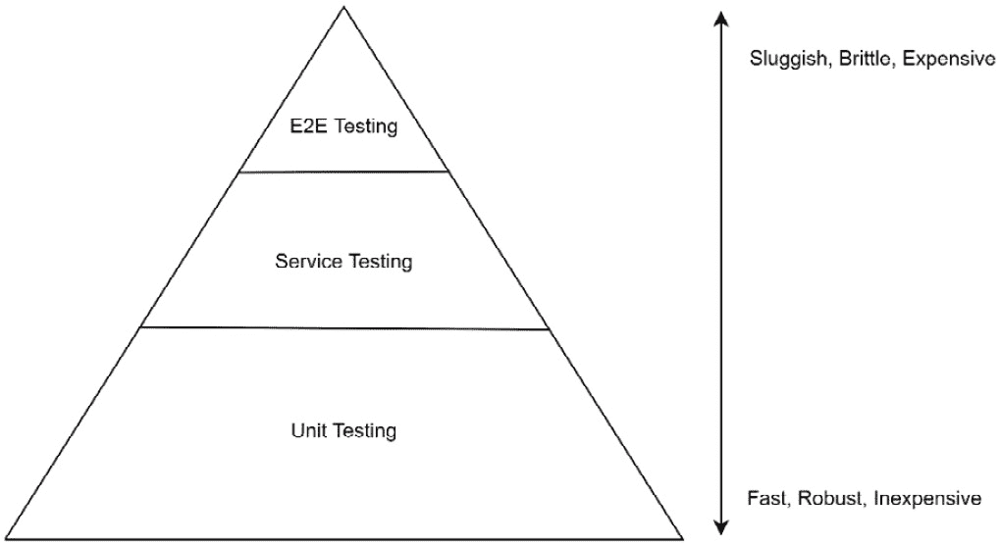

# 第六章：测试微服务

在一个相当简单的定义中，**软件测试**是验证产生的软件应用程序是否按预期工作。自从编程语言和软件开发初期以来，已经建立了良好的先例来确保它们**按预期工作**。几乎所有编程语言（除了某些脚本语言）都有强大的编译器来在编译时捕获异常。尽管编译时检查是一个好的开始，但它们不能验证软件应用程序在运行时是否会按预期运行。为了安心，软件开发团队会执行各种类型的测试来验证软件应用程序将按预期工作。随着分布式组件数量的增加，任何测试练习都会成倍增加，简单来说，测试单体应用程序比分布式应用程序要容易得多。为了节省时间和减少交付特性的周转时间，自动化不同级别的测试是高效的。

在本章中，我们将探讨如何在不同级别的微服务中自动化测试。我们将深入以下主题：

+   理解测试金字塔

+   Micronaut 框架中的单元测试

+   Micronaut 框架中的服务测试

+   使用测试容器进行集成测试

到本章结束时，您将掌握在微服务不同级别自动化测试的实用知识。

# 技术要求

本章中所有命令和技术说明均在 Windows 10 和 macOS 上运行。本章涵盖的代码示例可在本书的 GitHub 上找到，地址为[`github.com/PacktPublishing/Building-Microservices-with-Micronaut/tree/master/Chapter06`](https://github.com/PacktPublishing/Building-Microservices-with-Micronaut/tree/master/Chapter06)。

以下工具需要在开发环境中安装和设置：

+   **Java SDK**版本 13 或更高（我们使用了 Java 14）

+   **Maven**：这是可选的，只有当你想使用 Maven 作为构建系统时才需要。然而，我们建议在任何开发机器上设置 Maven。下载和安装 Maven 的说明可以在[`maven.apache.org/download.cgi`](https://maven.apache.org/download.cgi)找到。

+   **开发 IDE**：根据您的偏好，可以使用任何基于 Java 的 IDE，但为了编写本章，使用了 IntelliJ。

+   **Git**：下载和安装的说明可以在[`git-scm.com/downloads`](https://git-scm.com/downloads)找到。

+   **PostgreSQL**：下载和安装的说明可以在[`www.postgresql.org/download/`](https://www.postgresql.org/download/)找到。

+   **MongoDB**: MongoDB Atlas 提供了高达 512 MB 存储空间的免费在线数据库服务。然而，如果您更喜欢本地数据库，可以在[`docs.mongodb.com/manual/administration/install-community/`](https://docs.mongodb.com/manual/administration/install-community/)找到下载和安装的说明。我们使用本地安装来编写这一章节。

+   **REST 客户端**：可以使用任何 HTTP REST 客户端。我们使用了 Advanced REST Client Chrome 插件。

+   **Docker**：有关下载和安装 Docker 的说明，请参阅[`docs.docker.com/get-docker/`](https://docs.docker.com/get-docker/)。

# 理解测试金字塔

测试金字塔是一个易于理解不同测试类型相对性能、成本和健壮性的概念。以下图表显示了测试金字塔中的各种测试类型以及所需的努力：



图 6.1 – 测试金字塔

如前图所示，单元测试快速、健壮且成本低，而当我们接近金字塔的顶部时，测试变得缓慢、脆弱且昂贵。尽管所有类型的测试都是验证应用程序是否按预期工作所必需的，但良好的平衡对于降低成本、提高健壮性和速度至关重要。简单来说，要有大量的单元测试、一定数量的服务测试和非常少的端到端测试。这将确保以更快的速度和更低的成本保证质量。

在下一节中，我们将从单元测试开始自动化测试之旅。

# Micronaut 框架中的单元测试

在面向对象的范式下，一个对象可以具有多种行为。这些行为由它们的方法定义。有效的单元测试一次探测一个对象的行为。这并不意味着测试一个方法，因为方法可以通过不同的执行路径（如果方法有分叉的控制流）改变其行为。因此，本质上，单元测试一次将探测一个方法的单个执行路径。迭代地，我们可以添加更多的单元测试来探测相同或不同方法中的其他执行路径。这种自下而上的方法依赖于在较小、隔离的级别验证行为，以确保整个应用程序按预期工作。

要执行单元测试，需要隔离。本质上，我们需要隔离对象的行为（我们想要测试的行为），同时忽略对象与系统内其他对象/组件的交互。为了实现这种隔离，我们在单元测试中有各种机制：

+   **模拟**：模拟是一个创建测试替身的操作，其中测试框架将根据对象的类定义创建一个模拟/虚拟对象（编译时）。为了隔离主题对象与其他交互对象的交互，我们可以简单地模拟交互对象。当对主题对象执行单元测试时，它将跳过与其他对象的交互。

+   **监视**：通过监视，我们通过探测对象的实际实例（运行时）创建一个测试替身。监视对象将只是与真实对象相同，除了任何存根。存根用于定义一个虚拟调用，以便监视对象可以正常执行，但当调用与存根定义匹配时，它将执行由存根定义的虚拟行为。

虽然模拟和监视可以帮助隔离行为，但有时主题对象可能没有与其他对象交互，因此不需要测试替身。在下一节中，我们将从如何在 Micronaut 框架中使用 JUnit 5 实现单元测试开始。

## 使用 JUnit 5 进行单元测试

为了学习如何在 Micronaut 框架中实现单元测试，我们将从*第五章*，*使用事件驱动架构集成微服务*继续代码库。我们将继续使用宠物-所有者微服务，并确保你已经将以下依赖项添加到项目的`pom.xml`文件中：

```java
    <dependency>
      <groupId>org.junit.jupiter</groupId>
      <artifactId>junit-jupiter-api</artifactId>
      <scope>test</scope>
    </dependency>
    <dependency>
      <groupId>org.junit.jupiter</groupId>
      <artifactId>junit-jupiter-engine</artifactId>
      <scope>test</scope>
    </dependency>
    <dependency>
      <groupId>io.micronaut.test</groupId>
      <artifactId>micronaut-test-junit5</artifactId>
      <scope>test</scope>
    </dependency>
```

通过导入前面的 JUnit 依赖项，我们可以在宠物-所有者微服务中利用 JUnit 和 Micronaut 测试工具包。

接下来，我们将在`com.packtpub.micronaut.util`中创建一个`TestUtil`类，它可以封装一些基本的测试方法：

```java
public final class TestUtil {
    public static <T> void equalsVerifier(Class<T> clazz) 
     throws Exception {
        T domainObject1 = 
         clazz.getConstructor().newInstance();
        assertThat(domainObject1.toString()).isNotNull();
        assertThat(domainObject1).isEqualTo(domainObject1);
        assertThat(domainObject1.hashCode()).isEqualTo(domainObject1.hashCode());
        // Test with an instance of another class
        Object testOtherObject = new Object();
        assertThat(domainObject1).isNotEqualTo(testOtherObject);
        assertThat(domainObject1).isNotEqualTo(null);
        // Test with an instance of the same class
        T domainObject2 = 
         clazz.getConstructor().newInstance();
        assertThat(domainObject1).isNotEqualTo(domainObject2);
        /* HashCodes are equals because the objects are not persisted yet */
        assertThat(domainObject1.hashCode()).isEqualTo(domainObject2.hashCode());
    }
}
```

在`TestUtil`中，我们添加了`equalsVerifier()`方法，该方法可以验证两个对象是否相等。此方法接受一个类类型作为输入参数，以对测试对象的不同条件进行断言。

在下一节中，我们将探讨如何对领域对象进行单元测试。

### 单元测试领域对象

领域对象在宠物-所有者微服务中简单来说就是一个`Owner`类。在下面的代码片段中，我们创建了一个`OwnerTest`类来断言两个所有者实例的相等性：

```java
public class OwnerTest {
    @Test
    public void equalsVerifier() throws Exception {
        TestUtil.equalsVerifier(Owner.class);
        Owner owner1 = new Owner();
        owner1.setId(1L);
        Owner owner2 = new Owner();
        owner2.setId(owner1.getId());
        assertThat(owner1).isEqualTo(owner2);
        owner2.setId(2L);
        assertThat(owner1).isNotEqualTo(owner2);
        owner1.setId(null);
        assertThat(owner1).isNotEqualTo(owner2);
    }
}
```

`OnwerTest`类包含一个测试方法`equalsVerifier()`。使用`org.junit.jupiter.api.Test`注解将其标记为测试方法。为了验证预期的行为，我们使用断言语句。同样，我们可以在宠物-所有者微服务中为其他领域对象定义测试类。

在下一节中，我们将对映射器对象进行单元测试。

### 单元测试映射器对象

我们在宠物-所有者微服务中的映射器对象很简单，我们可以使用`@Test`注解为`OwnerMapper`类创建一个基本的测试。在下面的代码片段中，`OwnerMapperTest`正在对`OwnerMapper`中的`fromId()`方法进行单元测试：

```java
public class OwnerMapperTest {
    private OwnerMapper;
    @BeforeEach
    public void setUp() {
        ownerMapper = new OwnerMapperImpl();
    }
    @Test
    public void testEntityFromId() {
        Long id = 1L;
        assertThat(ownerMapper.fromId(id).getId()).
         isEqualTo(id);
        assertThat(ownerMapper.fromId(null)).isNull();
    }
}
```

`OwnerMapperTest` 类包含一个测试方法 `testEntityFromId()`。为了验证预期的行为，我们使用了 `assert` 语句。同样，我们还可以为宠物-所有者微服务中的其他映射对象定义测试类。

到目前为止，我们为不需要任何测试替身的领域和映射对象编写了简单的单元测试。在下一节中，我们将探讨如何使用模拟来创建所需的测试替身。

### 在单元测试中使用模拟

如前所述，模拟测试框架将基于类定义创建一个测试替身。这些测试替身在单元测试中调用其他对象的方法的对象时非常有用。

为了了解单元测试中的模拟，我们将对宠物诊所微服务中的 `VetService` 类进行工作。让我们看看宠物诊所微服务中的 `VetServiceImpl`：

```java
@Singleton
public class VetServiceImpl implements VetService {
    private final VetRepository;
    private final SpecialtyRepository;
    private final VetMapper;
    private final SpecialtyMapper;
    public VetServiceImpl(VetRepository, 
     SpecialtyRepository, VetMapper, SpecialtyMapper 
     specialtyMapper) {
        this.vetRepository = vetRepository;
        this.specialtyRepository = specialtyRepository;
        this.vetMapper = vetMapper;
        this.specialtyMapper = specialtyMapper;
    }
    …
}
```

`VetService` 在构造函数中实例化了 `VetRepository`、`SpecialtyRepository`、`VetMapper` 和 `SpecialtyMapper`。这些实例化的对象随后在 `VetService` 方法中使用。为了对 `VetService` 对象进行单元测试，我们需要为这些交互对象定义模拟对象。

让我们创建 `VetServiceTest` 来封装 `VetService` 的单元测试。在这个测试类中，我们将使用 `@MockBean` 注解模拟一些交互对象：

```java
@MicronautTest
class VetServiceTest {
    @Inject
    private VetRepository;
    @Inject
    private SpecialtyRepository;
    @Inject
    private VetMapper;
    @Inject
    private SpecialtyMapper;
    @Inject
    private VetService;
    /** Mock beans */
    @MockBean(VetRepositoryImpl.class)
    VetRepository vetRepository() {
        return mock(VetRepository.class);
    }
    @MockBean(SpecialtyRepositoryImpl.class)
    SpecialtyRepository specialtyRepository() {
        return mock(SpecialtyRepository.class);
    }
    …
}
```

`VetServiceTest` 类被 `@MicronautTest` 注解标记。它将测试类作为一个实际的 Micronaut 应用程序运行，具有完整的应用程序上下文，从而避免了生产代码和测试代码之间的人工分离。

为了注入交互对象，我们使用了 `@Inject` 注解。`@Inject` 将应用程序上下文中的一个 bean 注入到类中。此外，使用 `@MockBean` 注解，我们正在覆盖 `VetRepository` 和 `SpecialtyRepository` 的运行时 bean。`@MockBean` 将在应用程序上下文中用模拟对象替换实际对象。

我们可以轻松地使用这些测试替身模拟在编写 `VetService` 方法的单元测试：

```java
@Test
public void saveVet() throws Exception {
    // Setup Specialty
    Long specialtyId = 100L;
    SpecialtyDTO = createSpecialtyDTO(specialtyId);
    Specialty = specialtyMapper.toEntity(specialtyDTO);
    // Setup VetDTO
    Long vetId = 200L;
    VetDTO = createVetDTO(vetId);
    vetDTO.setSpecialties(Set.of(specialtyDTO));
    Vet = vetMapper.toEntity(vetDTO);
    // Stubbing
    when(vetRepository.save(any(Vet.class))).thenReturn
     (vetId);
    when(specialtyRepository.findByName(anyString())).
      thenReturn(specialty);
    doNothing().when(vetRepository).saveVetSpecialty
     (anyLong(), anyLong());
    when(vetRepository.findById(anyLong())).thenReturn
     (vet);
    // Execution
    VetDTO savedVetDTO = vetService.save(vetDTO);
    verify(vetRepository, times(1)).save(any(Vet.class));
    verify(specialtyRepository, 
     times(1)).findByName(anyString());
    verify(vetRepository, times(1)).saveVetSpecialty
     (anyLong(), anyLong());
    verify(vetRepository, times(1)).findById(anyLong());
    assertThat(savedVetDTO).isNotNull();
    assertThat(savedVetDTO.getId()).isEqualTo(vetId);
    assertThat(savedVetDTO.getSpecialties()).isNotEmpty();
    assertThat(savedVetDTO.getSpecialties().size()).
      isEqualTo(1);
    assertThat(savedVetDTO.getSpecialties().stream().
     findFirst().orElse(null).getId()).isEqualTo
     (specialtyId);
}
```

在前面的代码片段中，你可以看到我们是如何为模拟的 `VetRepository` 和 `SpecialtyRepository` 类定义存根的。通常，模拟存根的形式为 `when(object.methodCall()).thenReturn(result)`，除非是 void 方法调用，此时为 `doNothing().when(object).methodCall()`。

理想情况下，在模拟存根之后跟随 `verify()` 语句是谨慎的。`verify()` 将确认在执行单元测试期间确实调用了所需的方法调用。

在下一节中，我们将探讨另一种使用间谍创建测试替身的方法。

### 在单元测试中使用间谍

正如我们之前讨论的，在测试框架上间谍将基于类的实际运行时对象创建一个测试双胞胎。虽然模拟创建了一个完整的真实对象测试双胞胎，但在间谍中，我们可以控制测试双胞胎是部分还是完整的。在间谍对象中，我们可以存根一些方法调用，同时保持其他方法调用为真实。在这种情况下，单元测试将进行模拟和真实调用。因此，间谍为我们提供了更多控制权，以确定我们想要伪造的内容。

为了了解单元测试中的间谍技术，我们将在 pet-clinic 微服务中处理 `SpecialtyService` 类。让我们看看 pet-clinic 微服务中的 `SpecialtyServiceImpl`：

```java
public class SpecialtyServiceImpl implements SpecialtyService {
    private final SpecialtyRepository;
    private final SpecialtyMapper;
    public SpecialtyServiceImpl(SpecialtyRepository 
    specialtyRepository, SpecialtyMapper specialtyMapper) {
        this.specialtyRepository = specialtyRepository;
        this.specialtyMapper = specialtyMapper;
    }
    …
}
```

`SpecialtyService` 在构造函数中实例化了 `SpecialtyRepository` 和 `SpecialtyMapper`。这些实例化的对象随后在 `SpecialtyService` 方法中使用。为了对 `SpecialtyService` 对象进行单元测试，我们需要为这些交互对象定义一些间谍。

让我们创建 `SpecialtyServiceTest` 来封装 `SpecialtyService` 的单元测试。在这个测试类中，我们将使用 `@MockBean` 注解和 JUnit 中的 `spy()` 方法来间谍一些交互对象：

```java
@MicronautTest
class SpecialtyServiceTest {
    @Inject
    private SpecialtyRepository;
    @Inject
    private SpecialtyMapper;
    @Inject
    private SpecialtyService;
    @MockBean(SpecialtyRepositoryImpl.class)
    SpecialtyRepository specialtyRepository() {
        return spy(SpecialtyRepository.class);
    }
    …
}
```

`SpecialtyServiceTest` 类被 `@MicronautTest` 注解，它将测试类作为实际的 Micronaut 应用程序运行，具有完整的应用程序上下文。

使用 `@MockBean` 注解，我们正在覆盖 `SpecialtyRepository` 的运行时 Bean。`@MockBean` 将在应用程序上下文中用间谍对象替换实际对象。在间谍 `SpecialtyRepository` 对象上，我们可以轻松定义一些在测试方法中执行而不是实际调用的存根：

```java
@Test
public void saveSpecialty() throws Exception {
    // Setup Specialty
    Long specialtyId = 100L;
    SpecialtyDTO = createSpecialtyDTO(specialtyId);
    Specialty = specialtyMapper.toEntity(specialtyDTO);
    // Stubbing
    doReturn(100L).when(specialtyRepository).save(any
     (Specialty.class));
    doReturn(specialty).when(specialtyRepository).findById
     (anyLong());
    // Execution
    SpecialtyDTO savedSpecialtyDTO = 
       specialtyService.save(specialtyDTO);
    verify(specialtyRepository, 
      times(1)).save(any(Specialty.class));
    verify(specialtyRepository, 
      times(1)).findById(anyLong());
    assertThat(savedSpecialtyDTO).isNotNull();
    assertThat(savedSpecialtyDTO.getId()).isEqualTo
       (specialtyId);
}
```

在前面的代码片段中，你可以看到我们是如何为间谍 `SpecialtyRepository` 实例定义存根的。通常，间谍存根的形式为 `doReturn(result).when(object).methodCall()`，除非是 void 方法调用，此时为 `doNothing().when(object).methodCall()`。

再次提醒，在间谍存根之后跟随 `verify()` 语句是明智的。这些语句将确认在执行单元测试时是否执行了期望的方法调用。

到目前为止，我们已经学习了使用模拟和间谍进行单元测试的各种方法。在下一节中，我们将探讨如何在 Micronaut 框架中执行服务测试。

# Micronaut 框架中的服务测试

**服务测试**是单元测试的下一级。通过测试微服务中的所有端点，并对所有其他微服务重复此过程，我们可以确保所有服务都按预期从边缘到边缘工作。它将质量检查提升到下一个层次。话虽如此，正如我们之前讨论的，当我们向上移动到测试金字塔时，测试用例变得更加脆弱、昂贵和缓慢，因此，我们需要在高级别上不过度测试之间建立良好的平衡。

要了解我们如何在 Micronaut 框架中执行服务测试，我们将继续使用 pet-clinic 微服务。在接下来的几节中，我们将进入测试服务的所有 REST 端点。我们将使用 `@Order` 注解来建立套件中测试的执行顺序。一个有序的测试套件可以帮助从头开始并最终清理。在以下示例中，我们将创建、获取、更新，最后删除资源。

### 创建测试套件

为了测试 `VetResource` 端点，让我们创建一个 `VetResourceIntegrationTest` 类。这个套件将封装所有快乐和不快乐的集成测试：

```java
@MicronautTest(transactional = false)
@Property(name = "micronaut.security.enabled", value = "false")
@TestInstance(TestInstance.Lifecycle.PER_CLASS)
@TestMethodOrder(MethodOrderer.OrderAnnotation.class)
public class VetResourceIntegrationTest {
    @Inject
    private VetMapper;
    @Inject
    private VetRepository;
    @Inject
    private SpecialtyRepository;
    @Inject @Client("/")
    RxHttpClient client;
    …
}
```

在前面的代码片段中，有几个值得思考的点：

+   `transactional = false` 确保套件在没有事务的情况下运行。

+   `@Property` 注解覆盖了应用程序配置。在我们的情况下，我们禁用了安全。

+   `TestInstance.Lifecycle.PER_CLASS` 启动实例并保持整个套件的应用程序上下文。您可以在测试方法级别使用 `@TestInstance(TestInstance.Lifecycle.PER_METHOD)` 实例化测试对象和应用程序上下文。

+   JUnit 中的 `@TestMethodOrder` 注解用于定义测试套件中每个测试方法的执行顺序。

+   **@Inject @Client**：此注解注入了一个反应式 HTTP 客户端（内置在 Micronaut 中），用于对资源端点执行 RESTful 调用。

在设置好测试套件后，我们可以进行服务测试。在接下来的几节中，我们将介绍测试方法中的所有 REST 调用。

### 测试创建端点

`VetResource` 有一个用于创建新 `Vet` 的 POST 端点。它接受请求体中的 `VetDTO`。让我们使用 HTTP 客户端创建一个兽医：

```java
@Test
@Order(1)
public void createVet() throws Exception {
    int databaseSizeBeforeCreate = 
     vetRepository.findAll().size();
    VetDTO = vetMapper.toDto(vet);
    // Create the Vet
    HttpResponse<VetDTO> response = 
     client.exchange(HttpRequest.POST("/api/vets", vetDTO), 
     VetDTO.class).blockingFirst();
    assertThat(response.status().getCode()).isEqualTo
      (HttpStatus.CREATED.getCode());
    // Validate the Vet in the database
    List<Vet> vetList = (List<Vet>) 
      vetRepository.findAll();
    assertThat(vetList).hasSize(databaseSizeBeforeCreate + 
     1);
    Vet testVet = vetList.get(vetList.size() - 1);
    // Set id for further tests
    vet.setId(testVet.getId());
    assertThat(testVet.getFirstName()).isEqualTo
     (DEFAULT_FIRST_NAME);
    assertThat(testVet.getLastName()).isEqualTo
     (DEFAULT_LAST_NAME);
}
```

在前面的测试中，我们正在创建一个 `VetDTO` 对象，并使用 HTTP 客户端调用 POST 端点。为了使反应式客户端返回可观察对象并执行伪同步调用，我们使用了 `blockingFirst()`。它阻塞线程直到可观察对象发出一个项，然后返回可观察对象发出的第一个项。最后，我们断言以确认预期的与实际的行为。

### 测试 `GET` 端点

在接下来的测试中，我们在 POST 端点服务测试中创建了一个新的兽医。我们可以仅利用持久化的兽医来测试 `GET` 端点：

```java
@Test
@Order(3)
public void getAllVets() throws Exception {
    // Get the vetList w/ all the vets
    List<VetDTO> vets = client.retrieve(HttpRequest.GET
      ("/api/vets?eagerload=true"), 
      Argument.listOf(VetDTO.class)).blockingFirst();
    VetDTO testVet = vets.get(vets.size() - 1);
    assertThat(testVet.getFirstName()).isEqualTo
      (DEFAULT_FIRST_NAME);
    assertThat(testVet.getLastName()).isEqualTo
      (DEFAULT_LAST_NAME);
}
@Test
@Order(4)
public void getVet() throws Exception {
    // Get the vet
    VetDTO testVet = 
      client.retrieve(HttpRequest.GET("/api/vets/" + 
      vet.getId()), VetDTO.class).blockingFirst();
    assertThat(testVet.getFirstName()).isEqualTo
      (DEFAULT_FIRST_NAME);
    assertThat(testVet.getLastName()).isEqualTo
      (DEFAULT_LAST_NAME);
}
```

在前面的测试中，我们正在测试两个端点，`getVet()` 和 `getAllVets()`。为了使反应式客户端返回结果，我们使用了 `blockingFirst()` 操作符。虽然 `getAllVets()` 将返回兽医列表，但 `getVet()` 只会返回所需的兽医对象。

### 测试更新端点

为了测试 `update` 端点，我们将利用创建的端点服务测试中持久化的兽医资源，因此，在 `create` 和 `GET` 调用之后使用一个顺序：

```java
@Test
@Order(6)
public void updateVet() throws Exception {
    int databaseSizeBeforeUpdate = 
      vetRepository.findAll().size();
    // Update the vet
    Vet updatedVet = vetRepository.findById(vet.getId());
    updatedVet
        .firstName(UPDATED_FIRST_NAME)
        .lastName(UPDATED_LAST_NAME);
    VetDTO updatedVetDTO = vetMapper.toDto(updatedVet);
    @SuppressWarnings("unchecked")
    HttpResponse<VetDTO> response = 
     client.exchange(HttpRequest.PUT("/api/vets", 
       updatedVetDTO), VetDTO.class)
        .onErrorReturn(t -> (HttpResponse<VetDTO>) 
       ((HttpClientResponseException) 
        t).getResponse()).blockingFirst();
    assertThat(response.status().getCode()).isEqualTo
      (HttpStatus.OK.getCode());
    // Validate the Vet in the database
    List<Vet> vetList = (List<Vet>) 
     vetRepository.findAll();
    assertThat(vetList).hasSize(databaseSizeBeforeUpdate);
    Vet testVet = vetList.get(vetList.size() - 1);
    assertThat(testVet.getFirstName()).isEqualTo
      (UPDATED_FIRST_NAME);
    assertThat(testVet.getLastName()).isEqualTo
      (UPDATED_LAST_NAME);
}
```

在前面的测试中，我们测试了`updateVet()`端点。我们首先获取了持久化的 vet，然后更新了名字和姓氏，在调用更新端点之前。最后，我们断言以确认实际行为符合预期行为。

### 测试删除端点

要测试`delete`端点，我们将利用在早期端点调用中持久化的 vet 资源。因此，我们将在`create`、`GET`和`update`调用之后使用一个订单：

```java
@Test
@Order(8)
public void deleteVet() throws Exception {
    int databaseSizeBeforeDelete = 
     vetRepository.findAll().size();
    // Delete the vet
    @SuppressWarnings("unchecked")
    HttpResponse<VetDTO> response = 
     client.exchange(HttpRequest.DELETE("/api/vets/"+ 
     vet.getId()), VetDTO.class)
        .onErrorReturn(t -> (HttpResponse<VetDTO>) 
        ((HttpClientResponseException) 
        t).getResponse()).blockingFirst();
    assertThat(response.status().getCode()).isEqualTo
     (HttpStatus.NO_CONTENT.getCode());
    // Validate the database is now empty
    List<Vet> vetList = (List<Vet>) 
     vetRepository.findAll();
    assertThat(vetList).hasSize
      (databaseSizeBeforeDelete - 1);
}
```

在前面的测试中，我们测试了`deleteVet()`端点。我们传递了之前持久化的`vetId`。在成功调用服务后，我们通过比较服务调用前后的数据库大小来断言以确认实际行为符合预期行为。

套件中的测试订单确保我们始终从头开始，并在完成套件中的所有测试后将其清理干净。与在测试方法级别设置和清理相比，这种模式对于服务测试既有优点也有缺点。您可以根据分析应用程序需求和是否使用套件设置和清理或测试方法级别来选择和选择一种模式。

在下一节中，我们将探索`Testcontainers`在集成测试中的精彩世界。

# 使用 Testcontainers 进行集成测试

`Testcontainers`是一个 Java 库，它优雅地将测试世界与 Docker 虚拟化相结合。使用`Testcontainers`库，我们可以设置、实例化和注入任何 Docker 容器到测试代码中。这种方法为执行集成测试开辟了许多途径。在测试套件或测试方法设置中，我们可以启动一个 Docker 化的数据库、Kafka 或邮件服务器或任何集成应用程序，执行集成测试，并在清理中销毁 Docker 化的应用程序。使用这种模式，我们接近生产环境，同时不会对环境产生任何测试后的副作用。

要了解我们如何使用`Testcontainers`库，我们将在与 MongoDB 集成的 pet-clinic-reviews 微服务上进行实验。在下一节中，我们将开始设置 Micronaut 应用程序中的`Testcontainers`。

## 在 Micronaut 应用程序中设置 Testcontainers

要在 pet-clinic-reviews 微服务中使用`Testcontainers`，请在项目的`pom.xml`文件中添加以下依赖项：

```java
   <!-- Test containers -->
    <dependency>
      <groupId>org.testcontainers</groupId>
      <artifactId>junit-jupiter</artifactId>
      <version>1.15.2</version>
      <scope>test</scope>
    </dependency>
    <dependency>
      <groupId>org.testcontainers</groupId>
      <artifactId>mongodb</artifactId>
      <version>1.15.2</version>
      <scope>test</scope>
    </dependency>
```

通过导入一个 MongoDB 风格的测试容器，我们将能够利用 MongoDB Docker 工具包。在导入所需的`Testcontainers`依赖项后，让我们设置一个抽象类，它可以提供集成测试所需的任何应用程序容器：

```java
public class AbstractContainerBaseTest {
    public static final MongoDBContainer 
     MONGO_DB_CONTAINER;
    static {
        MONGO_DB_CONTAINER = new MongoDBContainer
          (DockerImageName.parse("mongo:4.0.10"));
        MONGO_DB_CONTAINER.start();
    }
}
```

在`AbstractContainerBaseTest`中，我们配置并启动 Docker 中的 MongoDB 实例。这个容器的静态性质将简化访问并避免在测试套件或测试方法级别启动太多实例。`Testcontainers`优雅地，用最少的代码拉取 MongoDB Docker 镜像，启动它，并使其运行。

在下一节中，我们将使用 `Testcontainers` 为 `VetReviewRepository` 编写集成测试。

## 使用 Testcontainers 编写集成测试

在前一节中，我们介绍了如何使用 `Testcontainers` 创建 Docker 化的 MongoDB。我们将继续使用 Docker MongoDB 实例来测试 `VetReviewRepository`。让我们从测试套件和测试方法设置开始：

```java
@Testcontainers
@TestInstance(TestInstance.Lifecycle.PER_CLASS)
@TestMethodOrder(MethodOrderer.OrderAnnotation.class)
class VetReviewRepositoryIntegrationTest extends AbstractContainerBaseTest {
    private VetReviewRepository;
    @BeforeAll
    void init() {
        ApplicationContext context = 
         ApplicationContext.run(
            PropertySource.of("test", Map.of
             ("mongodb.uri", 
             MONGO_DB_CONTAINER.getReplicaSetUrl()))
        );
        vetReviewRepository = 
         context.getBean(VetReviewRepository.class);
    }
    @BeforeEach
    public void initTest() {
        if (!MONGO_DB_CONTAINER.isRunning()) {
            MONGO_DB_CONTAINER.start();
        }
    }
    …
}
```

在测试套件设置中，我们正在覆盖 MongoDB 的应用程序属性。此外，我们从应用程序上下文中获取 `VetReviewRepository` 实例。这将确保我们注入的是与 Docker 化的 MongoDB 通信的仓库实例。在测试方法设置中，我们确保在执行测试方法之前 MongoDB 容器正在运行。由于我们在测试套件和测试方法级别进行了设置，让我们继续编写集成测试：

```java
@Test
@Order(1)
public void saveVetReview() {
    VetReview = new VetReview();
    String reviewId = UUID.randomUUID().toString();
    vetReview.setReviewId(reviewId);
    vetReview.setVetId(1L);
    vetReview.setRating(3D);
    vetReview.setDateAdded(LocalDate.now());
    vetReview.setComment("Good vet");
    vetReviewRepository.save(vetReview);
    VetReview savedVetReview = 
       vetReviewRepository.findByReviewId(reviewId);
    assertThat(savedVetReview).isNotNull();
    assertThat(savedVetReview.getReviewId()).isEqualTo
       (reviewId);
}
```

在 `saveVetReview()` 测试中，我们创建一个新的兽医评审并调用 `VetReviewRepository` 来持久化这个评审。最后，我们通过获取并比较值来断言兽医评审已成功持久化。我们在测试套件中使用 `@Order` 模式，以便后续测试可以确保清理。

在本节中，我们探讨了如何通过启动数据库或其他服务组件的 Docker 实例来简化集成测试。我们通过创建 MongoDB 测试容器实现了 `VetReviewRepository` 的集成测试。

# 摘要

我们从测试金字塔开始，在单元测试、服务测试和集成测试的自动化测试中找到一个良好的平衡。我们首先介绍了单元测试的一些基础知识，例如利用模拟和间谍来编写单元测试。然后我们深入探讨了如何在 Micronaut 框架中使用响应式 HTTP 客户端编写服务测试以测试各种 RESTful 端点。最后，我们探索了集成测试的激动人心的世界，我们使用 `Testcontainer` 在测试环境中实例化 MongoDB。

本章为您提供了对 Micronaut 框架中不同级别测试（如单元、服务或集成）的深入理解。在细微而灵活的理论讨论之后，我们通过一些实用的示例来增强您在 Micronaut 框架中自动化测试的实践技能。

在下一章中，我们将探讨如何在 Micronaut 框架中处理微服务架构问题。

# 问题

1.  单元测试是什么？

1.  单元测试中的模拟是什么？

1.  我们如何在 Micronaut 框架中使用 JUnit 进行模拟？

1.  单元测试中的间谍活动是什么？

1.  我们如何在 Micronaut 框架中使用 JUnit 进行间谍活动？

1.  我们如何在 Micronaut 框架中编写服务测试？

1.  测试容器是什么？

1.  我们如何在 Micronaut 框架中使用测试容器？

1.  你如何在 Micronaut 框架中编写集成测试？
