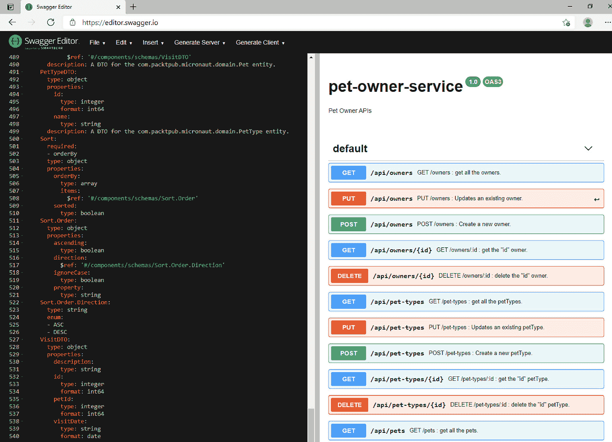

# 第七章：处理微服务问题

任何微服务架构的实施如果没有处理一些基本的微服务问题都是不完整的，例如**配置管理**、**API 文档**、**服务发现**、**API 网关**和**容错**。迄今为止，我们关注的是微服务的分解之旅，例如如何在模块化微服务中分离关注点。为了实现无缝和统一的应用访问，我们需要微服务集成并暴露一个聚合接口。聚合接口使上游消费者能够像与单个微服务交互一样与后端微服务交互。

实施微服务的一个关键好处是容错性。如按需扩展、回退和断路器等容错机制使微服务无处不在且稳健。

在本章中，我们将探讨处理和实施以下微服务问题的方法：

+   外部化应用程序配置

+   记录服务 API 文档

+   实施服务发现

+   实施 API 网关

+   实施容错机制

到本章结束时，你将具备在 Micronaut 框架中处理和实施这些关键微服务问题的实际知识。

# 技术要求

本章中所有命令和技术说明均在 Windows 10 和 macOS 上运行。本章涵盖的代码示例可在本书的 GitHub 仓库中找到，网址为[`github.com/PacktPublishing/Building-Microservices-with-Micronaut/tree/master/Chapter07`](https://github.com/PacktPublishing/Building-Microservices-with-Micronaut/tree/master/Chapter07)。

需要在开发环境中安装和设置以下工具：

+   **Java SDK**版本 13 或更高（我们使用了 Java 14）。

+   **Maven** – 这不是必需的，只有当你想使用 Maven 作为构建系统时才需要。然而，我们建议在任何开发机器上设置 Maven。有关下载和安装 Maven 的说明，请参阅[`maven.apache.org/download.cgi`](https://maven.apache.org/download.cgi)。

+   **开发 IDE** – 根据您的偏好，可以使用任何基于 Java 的 IDE，但为了编写本章，我们使用了 IntelliJ。

+   **Git** – 有关下载和安装的说明，请参阅[`git-scm.com/downloads`](https://git-scm.com/downloads)。

+   **PostgreSQL** – 有关下载和安装的说明，请参阅[`www.postgresql.org/download/`](https://www.postgresql.org/download/)。

+   **MongoDB** – MongoDB Atlas 提供了一个免费在线数据库即服务，存储空间高达 512 MB。然而，如果您更喜欢本地数据库，则有关下载和安装的说明，请参阅[`docs.mongodb.com/manual/administration/install-community/`](https://docs.mongodb.com/manual/administration/install-community/)。我们为本章的编写使用了本地安装。

+   **REST 客户端** – 可以使用任何 HTTP REST 客户端。我们使用了 Advanced REST Client Chrome 插件。

+   **Docker** – 有关下载和安装 Docker 的说明，请参阅[`docs.docker.com/get-docker/`](https://docs.docker.com/get-docker/)。

# 外部化应用程序配置

无论微服务应用的大小和复杂性如何，维护每个服务的配置设置的任务似乎是与微服务一起工作的最关键方面之一。解耦服务配置回到了我们之前关于分离关注点的讨论。在前面的章节中，我们看到了如何使用`application.properties`文件来处理服务配置。尽管这比在生产代码中硬编码这些配置要好，但这仍然不够。

任何微服务的关键要求之一是敏捷性。一个理想的微服务应该能够灵活且快速地应对用户需求的变化，以及处理代码缺陷或网络问题。话虽如此，每个企业应用都需要满足特定的合规性和审计要求，这意味着开发者通常不能直接将工作区中的代码工件部署到生产环境中。如果配置与服务代码逻辑解耦，那么我们可以轻松地构建一次（不包含配置）的工件，并将其部署到多个环境中（每个环境都可以启动自己的配置）。

在下一节中，我们将深入了解如何在 Micronaut 框架中管理分布式服务配置。

## 使用分布式配置管理来外部化配置

Micronaut 为`pet-owner`微服务提供了开箱即用的功能。

### 在 Consul 中实现配置存储

我们将使用 Docker 化的 Consul 实例。按照以下说明在 Docker 中安装和运行 Consul：

1.  确保 Docker 应用正在您的 workspace/environment 中运行。然后打开一个 bash 终端（我使用的是 Git Bash）并运行以下命令：

    ```java
    docker run -d --name consul -p 8500:8500 consul
    ```

1.  等待 Docker 下载并安装**Consul**。

上述命令将启动一个单节点 Consul 实例，并在端口`8500`上公开。我们可以通过访问`http://localhost:8500/`的 Consul 网页界面来验证安装。

现在，要创建 Consul 中的配置存储，请按照以下说明操作：

1.  打开`http://localhost:8500/`并从顶部标题中选择**键/值**。

1.  点击**创建**按钮。

1.  在**键或文件夹**输入框中输入`config/pet-owner/application.yml`。

1.  在文本区域中添加`pet-owner`的`application.properties`：

    ```java
    micronaut:
      application:
        name: pet-owner
      router:
        static-resources:
          swagger:
            paths: classpath:META-INF/swagger
            mapping: /swagger/**
    datasources:
      default:
        url: "jdbc:postgresql://localhost:5432/postgres"
        username: postgres
        password: postgres
        driverClassName: org.postgresql.Driver
    jpa:
      default:
        entity-scan:
          packages:
            - com.packtpub.micronaut.domain
        properties:
          hibernate:
            show_sql: false
            dialect: org.hibernate.dialect.PostgreSQL95Dialect
            enable_lazy_load_no_trans: true
    ```

通过遵循前面的步骤，我们已经在 Consul 中为`pet-owner`微服务设置了一个键值存储。

将这些属性备份到`pet-owner 资源`文件夹是一个好习惯，因为 Docker 化的 Consul 实例在重启时可能会丢失配置。

我们可以通过导航到`pet-owner application.yml`文件来查看配置：

![Figure 7.1 – Managing the pet-owner configurations in Consul![Figure 7.1 – Pet-owner microservice loading the service configurations from Consul at bootupFigure 7.1 – Managing the pet-owner configurations in Consul 如*图 7.1*所示，我们可以在 Consul 中轻松地查看/修改应用程序配置。我们有选择将`application.yml`文件（如果您想从头开始）。现在，让我们深入了解在`pet-owner`微服务中需要进行的更改，以将其与 Consul 配置管理集成。### 将 pet-owner 微服务与 Consul 配置管理集成要将`pet-owner`微服务与 Consul 集成，我们需要将以下依赖项添加到`pom.xml`项目中：```java<dependency>   <groupId>io.micronaut</groupId>   <artifactId>micronaut-discovery-client</artifactId></dependency>```通过导入`micronaut-discover-client`依赖项，我们可以利用开箱即用的服务发现功能（我们将在本章后面介绍）以及与 Consul 的集成。我们还需要在`pet-owner`微服务的资源目录中添加一个新的`bootstrap.yml`文件。Bootstrap YAML 将在启动时通知服务从外部资源加载（或引导）应用程序属性。为此，请将以下配置添加到`bootstrap.yml`文件中：```javamicronaut:  application:    name: pet-owner  config-client:    enabled: trueconsul:  client:    config:      enabled: true      format: yaml      defaultZone: «${CONSUL_HOST:localhost}:${CONSUL_PORT:8500}»      path: "config/pet-owner/"    registration:      enabled: true```所有与 Consul 服务器相关的配置都以前缀关键字`consul`开头。以下是一些值得思考的配置：+   `8500`。+   `application.yml`在 Consul 服务器上的相对路径。这些在`bootstap.yml`中的更改将启用从 Consul 服务器加载`pet-owner`微服务的配置。我们可以通过运行`pet-owner`微服务来验证所做的更改。当启动时，它应该与 Consul 同步以加载配置：![Figure 7.2 – Pet-owner microservice loading the service configurations from Consul at bootup![Figure 7.2 – Pet-owner microservice loading the service configurations from Consul at bootupFigure 7.2 – Pet-owner microservice loading the service configurations from Consul at bootup 当我们启动 pet-owner 微服务时，`bootstap.yml`将通知服务从 Consul 服务器加载配置。`micronaut-discover-client`依赖项中的内置组件将与 Consul 同步并加载此外部配置。到目前为止，你已经学会了如何使用 Micronaut 进行分布式配置管理。在下一节中，我们将使用 Micronaut 框架实现 API 文档。# 记录服务 API 在微服务架构中，API 文档尤为重要，因为它可以直观地访问 API 信息，因为一个应用程序可以有多个微服务，每个微服务运行多个 API 端点。`pet-owner`微服务。## 使用 Swagger 记录 pet-owner 服务端点要在`pet-owner`微服务中开始使用 Swagger，我们首先需要将以下依赖项导入到`pom.xml`项目中：```java<!-- Swagger --><dependency>  <groupId>io.swagger.core.v3</groupId>  <artifactId>swagger-annotations</artifactId>  <version>${swagger.version}</version>  <scope>compile</scope></dependency>```通过导入前面的依赖项，我们可以在提示属性部分利用`swagger.version`。我们还需要修改注解处理，以便注解处理器可以在编译时生成 Swagger 工件。将以下路径添加到`maven-compiler-plugin`注解处理路径中：```java<path>  <groupId>io.micronaut.openapi</groupId>  <artifactId>micronaut-openapi</artifactId>  <version>2.3.1</version></path>```将`micronaut-openapi`添加到注解处理路径中，将使`maven-compile`能够为项目构建 Swagger 工件。一旦你对项目提示进行了更改，请将以下注解添加到主类中：```java@OpenAPIDefinition(    info = @Info(        title = "pet-owner-service",        version = "1.0",        description = "Pet Owner APIs"    ))@Singletonpublic class Application {…}```使用`@OpenAPIDefinition`注解将在生成的源中创建一个具有`<title>-<version>.yml`模式的 Swagger 工件。在我们的例子中，当我们构建项目时，它将创建`pet-owner-service-1.0.yml` Swagger 工件：

图 7.3 – 生成的 Swagger 工件

如*图 7.3*所示，Swagger 将在目标文件夹中创建`pet-owner-service-1.0.yml`工件。生成的纯文本工件可以在 Swagger 编辑器中打开，网址为[`editor.swagger.io/`](https://editor.swagger.io/)：



图 7.4 – 在编辑器中审查 Swagger YAML

使用 Swagger 编辑器审查生成的 YAML 非常直观。它提供了一个简单的用户界面，包括尝试 API 调用的选项。尽管 Micronaut 提供了一个生成 Swagger UI 视图的机制，但它非常新，需要很多更改。因此，使用标准的 Swagger 编辑器是一个更简单、更快捷的选择。

当我们有多支产品团队在独立微服务上工作时，API 文档就非常有用。此外，如果一个微服务暴露给最终用户，它就是了解服务端点的首选资源。继续我们的合并之旅，在下一节中，我们将为`pet-clinic`应用中的所有微服务实现服务发现。

# 实现服务发现

在传统的单体架构中，如果一个应用程序有多个服务，那么这些服务通常运行在固定且众所周知的位置（例如 URL 或端口）。这种对“众所周知”的理解被耦合到代码逻辑中，以实现服务间调用。消费者服务将调用另一个服务，要么在代码级别，要么使用硬编码的远程网络调用。

相比之下，微服务通常在虚拟化或容器化环境中运行，IP 端口是动态分配的。为了便于服务间调用，我们实现了服务发现。在服务发现模式中，所有微服务都将将自己的运行实例注册到服务发现中，然后客户端（即上游客户端或另一个服务）将与服务发现同步以获取所需服务的网络位置。此外，服务发现将对所有已注册服务进行持续的健康检查。在下一节中，我们将在 Micronaut 框架中使用 Consul 实现服务发现。

## 使用 Consul 实现服务发现

要启用服务发现，您需要在`pom.xml`项目文件中导入以下依赖项。我们已将其添加到`pet-owner`微服务中；现在也将其添加到`pet-clinic`和`pet-clinic-reviews`微服务中：

```java
<!-- Service discovery -->
    <dependency>
      <groupId>io.micronaut</groupId>
      <artifactId>micronaut-discovery-client</artifactId>
    </dependency>
```

一旦将`micronaut-discovery-client`导入到服务中，我们就可以利用其服务发现功能。

为了与 Consul 同步服务，请在`pet-clinic`和`pet-clinic-reviews`微服务中进行以下更改：

```java
consul:
  client:
    registration:
      enabled: true
```

通过这些更改，我们使`pet-clinic`和`pet-clinic-reviews`微服务能够注册到 Consul 服务发现中。Micronaut 的`micronaut-discovery-client`实现已经包含了所需的工具，因此我们不需要进行任何代码更改。为了验证所有服务都已注册到 Consul，只需运行服务，它们将自动以它们的应用程序名称注册，如下面的屏幕截图所示：

注意

如果你正在使用`pet-clinic`和`pet-clinic-reviews`微服务，那么在服务启动之前启动 Apache Kafka 的 Docker 容器。


图 7.5 – 宠物诊所应用服务发现

在成功启动后，所有微服务都将将自己的实例注册到 Consul 服务发现中。我们可以在 Consul 的**服务**屏幕上查看正在运行的服务。

虽然服务发现通过集中运行时元数据（主要是网络位置）将所有服务统一在一起，但它仍然为上游消费者留下了一个缺口，因为我们还没有一个统一的接口。在下一节中，我们将为`pet-clinic`应用程序实现一个 API 网关，它将为所有客户端提供一个统一的接口。

# 实现 API 网关

为了进一步讨论 *微服务架构* 中的动态网络位置，我们现在将关注 API 网关。API 网关是一个编排服务，旨在为所有服务提供统一、无处不在的访问。尽管我们可以在后端运行多个微服务，但 API 网关可以为上游消费者提供一个统一的接口来访问它们。对于上游消费者来说，API 网关看起来是后端运行的唯一服务。在收到客户端请求后，API 网关将使用服务发现来确定调用哪个服务实例。

为了了解如何实现 API 网关，我们将向 `pet-clinic` 应用程序添加一个 API 网关服务。由于这个微服务是一个编排服务，我们可以将其称为 `pet-clinic-concierge`。网关服务之后的系统组件将如 *图 7.6* 所示：


图 7.6 – 带有服务发现和 API 网关的宠物诊所应用程序

在前面的图中，我们可以看到 `pet-clinic` 应用程序。`pet-clinic-concierge` 服务将实现 API 网关，任何服务消费者都将调用网关（而不是服务或服务发现），网关将通过与服务发现同步来确定服务实例。图中的双线连接器显示了实际服务请求如何在 `pet-clinic` 应用程序内部执行。

在下一节中，我们将深入了解如何在 `pet-clinic-concierge` 服务中实现 API 网关。

## 实现 API 网关服务

为了了解我们如何在 Micronaut 中实现 API 网关，我们将创建一个新的服务项目，名为 `pet-clinic-concierge`。要生成样板代码，请按照以下说明操作：

1.  通过访问 [`micronaut.io/launch/`](https://micronaut.io/launch/) 打开 **Micronaut Launch**。

1.  从 **应用程序类型** 下拉菜单中选择 **Micronaut 应用程序**。

1.  从 **Java 版本** 下拉菜单中选择 **Java 13**。

1.  在 **基础包** 输入框中输入 `com.packtpub.micronaut`。

1.  在 **名称** 输入框中输入 `pet-clinic-concierge`。

1.  从 **功能** 多选选项中选择以下功能：

    **config-consul discovery-consul**

    **http-client**

    **netflix-hystrix**

    **netflix-ribbon**

    **openapi**

1.  点击 **生成项目** 按钮，并选择 **下载 Zip** 选项。

Micronaut Launch 现在将为 `pet-clinic-concierge` 服务生成样板代码。在 Micronaut Launch 中，我们选择了发现和 OpenAPI，因此样板代码已经启用了这些功能并进行了配置。在下一节中，我们将探讨在 `pet-clinic-concierge` 服务中实现统一服务外观。

### 实现 API 网关的统一服务外观

首先，我们需要复制所有的`pet-clinic-concierge`服务。这些 DTO 将在实现所有`pet-clinic`服务的客户端中使用。复制`pet-clinic-concierge`项目中的所有 DTO。然后我们可以定义所有 RESTful 服务的客户端。

在下一节中，我们将专注于定义`pet-owner`微服务的客户端。

#### 访问宠物主资源

要访问`pet-owner`资源，我们将在`com.packtpub.micronaut.web.rest.client.petowner`包下创建客户端。对于`pet-owner`微服务中的每个资源控制器，我们将声明一个 HTTP 客户端接口。以下是为`OwnerResource`声明的客户端接口：

```java
@Client(id = "pet-owner")
public interface OwnerResourceClient {
    @Post("/api/owners")
    HttpResponse<OwnerDTO> createOwner(@Body OwnerDTO 
     ownerDTO);
    @Put("/api/owners")
    HttpResponse<OwnerDTO> updateOwner(@Body OwnerDTO 
     ownerDTO);
    @Get("/api/owners")
    HttpResponse<List<OwnerDTO>> getAllOwners(HttpRequest 
     request, Pageable pageable);
    @Get("/api/owners/{id}")
    Optional<OwnerDTO> getOwner(@PathVariable Long id);
    @Delete("/api/owners/{id}")
    HttpResponse deleteOwner(@PathVariable Long id);
}
```

`@Client`注解将实现一个具体的客户端。这个客户端将集成 Consul 服务实例的`pet-owner`服务。我们需要声明`OwnerResource`中公开的所有 RESTful 方法及其相对路径。

尽管在构建后我们将有一个具体的`OwnerResourceClient`，我们仍然需要将`OwnerResourceClient`中的各种 RESTful 方法映射到本地控制器。然后这个控制器将被暴露为上游消费者的服务外观。对于`OwnerResourceClient`，我们可以创建`OwnerResourceClientController`如下：

```java
@Controller("/api")
public class OwnerResourceClientController {
    @Inject
    OwnerResourceClient ownerResourceClient;
    @Post("/owners")
    public HttpResponse<OwnerDTO> createOwner(OwnerDTO 
     ownerDTO) {
        return ownerResourceClient.createOwner(ownerDTO);
    }
    @Put("/owners")
    HttpResponse<OwnerDTO> updateOwner(@Body OwnerDTO 
      ownerDTO) {
        return ownerResourceClient.updateOwner(ownerDTO);
    }
    @Get("/owners")
    public HttpResponse<List<OwnerDTO>> 
     getAllOwners(HttpRequest request, Pageable pageable) {
        return ownerResourceClient.getAllOwners(request, 
         pageable);
    }
    @Get("/owners/{id}")
    public Optional<OwnerDTO> getOwner(@PathVariable Long 
     id) {
        return ownerResourceClient.getOwner(id);
    }
    @Delete("/owners/{id}")
    HttpResponse deleteOwner(@PathVariable Long id) {
        return ownerResourceClient.deleteOwner(id);
    }
}
```

在`OwnerResourceClientController`中，我们正在注入`OwnerResourceClient`。任何发送到`OwnerResourceClientController`的请求都将传递给客户端，然后客户端将调用一个`pet-owner`服务实例（在同步 Consul 服务发现之后）进行进一步处理。同样，你可以为`pet-owner`微服务中的其他资源实现`Clients`和`Controllers`。

接下来，我们将实现`pet-clinic`资源的服务外观。

#### 访问宠物诊所资源

要访问`pet-clinic`资源，我们将在`com.packtpub.micronaut.web.rest.client.petclinic`包下创建客户端。对于`pet-clinic`微服务中的每个资源控制器，我们将声明一个 HTTP 客户端接口。以下是为`VetResource`声明的客户端接口：

```java
@Client(id = "pet-clinic")
public interface VetResourceClient {
    @Post("/api/vets")
    HttpResponse<VetDTO> createVet(@Body VetDTO vetDTO);
    @Put("/api/vets")
    HttpResponse<VetDTO> updateVet(@Body VetDTO vetDTO);
    …
}
```

`@Client`注解将使用服务发现中的`pet-clinic`服务实例实现一个具体的客户端。为了在服务外观上公开这些方法，我们将实现`VetResourceClientController`：

```java
@Controller("/api")
public class VetResourceClientController {
    @Inject
    VetResourceClient vetResourceClient;
    @Post("/vets")
    public HttpResponse<VetDTO> createVet(VetDTO vetDTO) {
        return vetResourceClient.createVet(vetDTO);
    }
    @Put("/vets")
    public HttpResponse<VetDTO> updateVet(VetDTO vetDTO) {
        return vetResourceClient.updateVet(vetDTO);
    }
    …
}
```

我们正在将`VetResourceClient`注入到`VetResourceClientController`中，因此任何发送到控制器的请求都将传递给客户端，然后客户端将调用一个`pet-clinic`服务实例进行进一步处理。

在下一节中，我们的重点将是实现`pet-clinic-reviews`的服务外观。

#### 访问宠物诊所评论资源

对于访问`pet-clinic-reviews`资源，你将在`com.packtpub.micronaut.web.rest.client.petclinicreviews`包下创建客户端。我们将首先声明一个`VetReviewResource`的客户端接口：

```java
@Client(id = "pet-clinic-reviews")
public interface VetReviewResourceClient {
    @Post("/api/vet-reviews")
    HttpResponse<VetReviewDTO> createVetReview(@Body 
      VetReviewDTO vetReviewDTO);
    @Put("/api/vet-reviews")
    HttpResponse<VetReviewDTO> updateVetReview(@Body 
     VetReviewDTO vetReviewDTO);
    …
}
```

`@Client` 注解将实现一个具体的客户端，使用服务发现中的 `pet-clinic-reviews` 服务实例。为了在服务外观上公开这些方法，我们将实现 `VetReviewResourceClientController`：

```java
@Controller("/api")
public class VetReviewResourceClientController {
    @Inject
    VetReviewResourceClient vetReviewResourceClient;
    @Post("/vet-reviews")
    public HttpResponse<VetReviewDTO> 
     createVetReview(VetReviewDTO vetReviewDTO) {
        return vetReviewResourceClient.createVetReview
         (vetReviewDTO);
    }
    @Put("/vet-reviews")
    public HttpResponse<VetReviewDTO> 
     updateVetReview(VetReviewDTO vetReviewDTO) {
        return vetReviewResourceClient.updateVetReview
         (vetReviewDTO);
    }
    …
}
```

在这里，我们将 `VetReviewResourceClient` 注入到 `VetReviewResourceClientController` 中，并将进入控制器的请求传递给客户端，我们将在 `pet-clinic-reviews` 服务实例上调用该客户端以进行进一步处理。

在下一节中，我们将重点关注处理与微服务相关的容错问题。

# 实现容错机制

在微服务环境中，故障和失败是不可避免的。随着分布式组件数量的增加，每个组件内部的故障以及由它们交互产生的故障数量也在增加。任何微服务应用程序都必须为这些不幸的情况内置弹性。在本节中，我们将探讨和实现 Micronaut 框架中处理故障和失败的不同方法。

## 利用内置机制

Micronaut 是一个云原生框架，并具有内置的错误和故障处理能力。本质上，其容错性是由 `@Retryable` 和 `@CircuitBreaker` 注解驱动的，这些注解可以在任何 HTTP 客户端中使用。

### 在 HTTP 客户端使用 @Retryable

**@Retryable** 是一种简单但有效的容错机制——简单来说，它用于在出现故障时再次尝试。这些尝试可以在固定延迟后再次进行，并且可以继续进行，直到服务响应或没有更多尝试为止。

要使用 `@Retryable`，我们只需在客户端声明上添加注解。我们可以在 `OwnerResource` 上使用 `@Retryable` 如下所示：

```java
@Retryable(attempts = "5", delay = "2s", multiplier = "1.5", maxDelay = "20s")
@Client(id = "pet-owner")
public interface OwnerResourceClient {
  …
}
```

通过在 `OwnerResourceClient` 上使用 `@Retryable`，您可以在所有方法上启用容错性。如果 `pet-owner` 微服务关闭，则 `OwnerResourceClient` 将尝试最多五次建立通信。我们可以使用以下设置配置 `@Retryable`：

+   **尝试次数**：这表示客户端可以尝试的最大重试次数。默认为 3 次尝试。

+   **延迟**：这表示重试之间的延迟，默认为 1 秒。

+   **乘数**：这指定了用于计算延迟的乘数，默认为 1.0。

+   **最大延迟**：这指定了最大整体延迟，默认为空。如果指定，任何重试尝试将在达到最大延迟限制时停止。

`@Retryable` 非常适合处理暂时性的故障，但对于持续时间较长的故障，我们需要使用断路器模式。在下一节中，我们将看到如何在 Micronaut 框架中使用断路器。

### 在 HTTP 客户端使用 @CircuitBreaker

正如我们讨论的，在高度分布的系统，如微服务中，失败是不可避免的。在微服务架构中，如果一个服务崩溃，有一个防御机制可以帮助避免在服务恢复健康之前，通过更多的请求来拥挤服务流量。这个机制被称为 **断路器**。在正常情况下，电路是打开的，接受请求。在失败实例中，计数器会增加，直到达到指定的阈值。达到阈值后，电路进入关闭状态，服务将立即响应错误，避免任何超时。断路器有一个内部轮询机制来确定服务的健康状态，如果服务再次健康，则电路将回到打开状态。

我们可以简单地使用 Micronaut 内置的注解来指定 HTTP 客户端上的断路器。让我们在 `PetResourceClient` 中实现一个断路器：

```java
@Client(id = "pet-owner")
@CircuitBreaker(delay = "5s", attempts = "3", multiplier = "2", reset = "300s")
public interface PetResourceClient {
    @Post("/api/pets")
    HttpResponse<PetDTO> createPet(@Body PetDTO petDTO);
    @Put("/api/pets")
    HttpResponse<PetDTO> updatePet(@Body PetDTO petDTO);
    …
}
```

在前面的断路器实现中，如果 `PetResource` 端点失败，那么 `PetResourceClient` 将尝试五次，第一次尝试等待 3 秒，后续尝试的等待时间将是前一次的两倍。五次尝试后，如果服务仍然没有响应，那么电路将进入关闭状态。它将在 5 分钟的重置间隔后再次尝试访问，以检查服务是否已经健康。

#### 使用 @Fallback 为 HTTP 客户端

在断路器实现的常见情况下，通常会有 **Feign 客户端** 或 **回退**。当电路关闭时，而不是引发服务器错误，回退实现可以处理请求并正常响应。这在实际服务调用可能返回回退也可以返回的结果时尤其有效。

在以下 `PetResourceClient` 中断路器的示例中，我们可以创建一个简单的回退机制，当电路关闭时，它会处理传入的请求：

```java
@Fallback
public class PetResourceFallback implements PetResourceClient {
    @Override
    public HttpResponse<PetDTO> createPet(PetDTO petDTO) {
        return HttpResponse.ok();
    }
    @Override
    public HttpResponse<PetDTO> updatePet(PetDTO petDTO) {
        return HttpResponse.ok();
    }
    @Override
    public HttpResponse<List<PetDTO>> 
      getAllPets(HttpRequest request, Pageable pageable) {
        return HttpResponse.ok();
    }
    @Override
    public Optional<PetDTO> getPet(Long id) {
        return Optional.empty();
    }
    @Override
    public HttpResponse deletePet(Long id) {
        return HttpResponse.noContent();
    }
}
```

`PetResourceFallback` 为所有 `PetResource` 端点提供了默认实现，当 `PetResource` 不可访问时，它将提供一个优雅的响应。在这个例子中，我们从所有端点返回一个空响应。你可以调整实现，创建一个所需的默认响应。

# 摘要

在本章中，你学习了如何在 Micronaut 框架中处理各种微服务问题。我们通过使用 Consul 外部化应用程序配置来启动这次旅程，并了解了为什么在微服务中需要分布式配置管理。然后，我们深入探讨了如何使用 OpenAPI 和 Swagger 自动化 API 文档。稍后，我们讨论了服务发现和 API 网关，并在宠物诊所应用程序中实现了这些功能。

最后，我们探讨了容错的需求以及如何在 Micronaut 框架中简单地使用内置机制来构建微服务应用程序的弹性。

本章为你提供了处理与服务发现、API 网关和容错相关的各种微服务问题的所有第一手知识。本章通过在 `pet-clinic` 应用程序中添加这些方面，采用了实用的方法。

在下一章中，你将探索部署 `pet-clinic` 微服务应用程序的各种方法。

# 问题

1.  分布式配置管理是什么？

1.  你如何在 Consul 中实现配置存储？

1.  你如何在 Micronaut 框架中使用 Swagger 自动化 API 文档的生成过程？

1.  服务发现是什么？

1.  你如何在 Micronaut 框架中实现服务发现？

1.  在微服务架构中，API 网关是什么？

1.  你如何在 Micronaut 框架中实现 API 网关？

1.  Micronaut 中的 `@Retryable` 是什么？

1.  Micronaut 中的 `@CircuitBreaker` 是什么？

1.  你如何在 Micronaut 框架中实现断路器？

1.  你如何在 Micronaut 中实现回退机制？
