# 第十章：使用 Micronaut 的物联网

**物联网**（**IoT**）是发展最快的科技之一。它是一个由设备或事物组成的网络。这些设备具有与传感器或软件相同的性能，并且可以通过互联网与其他设备通信。设备或事物可以来自各个领域，包括灯泡、门锁、心跳监测器、位置传感器以及许多可以启用传感器的设备。这是一个具有互联网功能的智能设备或事物生态系统。物联网在各个领域都有趋势。以下是一些热门领域的几个例子：

+   家庭自动化

+   制造和工业应用

+   医疗和医学科学

+   军事和防御

+   汽车、交通和物流

除了这些领域，在本章中，我们还将学习以下主题：

+   物联网基础

+   与 Micronaut Alexa 技能一起工作

到本章结束时，您将熟练掌握有关 Micronaut 集成的物联网的先前方面。

# 技术要求

本章中所有的命令和技术说明都可以在 Windows 10 和 macOS 上运行。本章中的代码示例可以在本书的 GitHub 仓库中找到，地址为[`github.com/PacktPublishing/Building-Microservices-with-Micronaut/tree/master/Chapter10/`](https://github.com/PacktPublishing/Building-Microservices-with-Micronaut/tree/master/Chapter10/).

以下工具需要在开发环境中安装和设置：

+   **Java SDK**：版本 13 或更高（我们使用了 Java 14）。

+   **Maven**：这是可选的，仅当您希望使用 Maven 作为构建系统时才需要。然而，我们建议在任何开发机器上设置 Maven。有关下载和安装 Maven 的说明可以在[`maven.apache.org/download.cgi`](https://maven.apache.org/download.cgi)找到。

+   **开发 IDE**：根据您的偏好，可以使用任何基于 Java 的 IDE，但为了编写本章，我们使用了 IntelliJ。

+   **Git**：有关下载和安装 Git 的说明可以在[`git-scm.com/downloads`](https://git-scm.com/downloads)找到。

+   **PostgreSQL**：有关下载和安装 PostgreSQL 的说明可以在[`www.postgresql.org/download/`](https://www.postgresql.org/download/)找到。

+   **MongoDB**：MongoDB Atlas 提供高达 512 MB 存储空间的免费在线数据库即服务（DBaaS）。然而，如果您希望使用本地数据库，则可以在[`docs.mongodb.com/manual/administration/install-community/`](https://docs.mongodb.com/manual/administration/install-community/)找到下载和安装 MongoDB 的说明。我们使用本地安装来编写本章。

+   **REST 客户端**：可以使用任何 HTTP REST 客户端。在本章中，我们使用了 Advanced REST Client Chrome 插件。

+   **Docker**: 有关下载和安装 Docker 的说明可在[`docs.docker.com/get-docker/`](https://docs.docker.com/get-docker/)找到。

+   **亚马逊**: 您需要一个亚马逊账户来使用 Alexa，您可以在[`developer.amazon.com/alexa`](https://developer.amazon.com/alexa)上设置账户。

# 物联网基础

**物联网**是一个设备或事物的网络。这些事物可以是任何东西——它可以是佩戴健康监测器的人类，佩戴地理定位传感器的宠物，带有轮胎压力传感器的汽车，具有语音/视觉功能的电视，或智能扬声器。物联网还可以在云中使用高级**机器学习**（**ML**）和**人工智能**（**AI**）功能来提供更高级的服务。物联网可以通过数据收集和自动化使事物变得智能。以下图表说明了物联网：

![Figure 10.1 – 物联网 (IoT)

![Figure 10.1 – 物联网 (IoT)

图 10.1 – 物联网 (IoT)

这些设备或事物具有互联网功能并且相互连接，因此它们充当一个生态系统。这个生态系统可以收集、发送并根据从其他事物获取的数据采取行动。例如，当您到达家时，您可以打开家中的灯光。

物联网为个人、企业和组织提供了显著的好处。物联网可以通过在两个系统或设备之间无缝传输数据来减少手动工作和干预。物联网设备在消费市场中的重要性日益增加，无论是作为锁、门铃、灯泡、扬声器、电视、医疗产品还是健身系统。物联网现在主要通过语音启用的生态系统访问，例如 Google Home、Apple Siri、Amazon Alexa、Microsoft Cortana、Samsung Bixby 等。物联网有许多积极方面；然而，在安全和隐私问题上也有一些缺点。

现在我们已经了解了物联网及其应用的基础知识，让我们了解 Alexa 技能的基础。

# 在 Alexa 技能的基础知识上工作

Alexa 是一种基于云的语音识别服务，可在亚马逊和第三方设备制造商的数百万台设备上使用，例如电视、蓝牙扬声器、耳机、汽车等。您可以使用 Alexa 构建基于交互式语音的请求-响应应用程序。

Alexa 可以集成到各种应用程序中。Alexa 还具有屏幕功能，可以直观地显示响应，Echo Show 是一款带有显示屏的 Alexa 扬声器。以下图表说明了亚马逊 Alexa 架构：

![Figure 10.2 – 亚马逊 Alexa 架构

![Figure 10.2 – 亚马逊 Alexa 架构

图 10.2 – 亚马逊 Alexa 架构

用户可以说出设备的唤醒词**Alexa**，并执行操作。例如，要查找您当前位置的天气，您可以说*Alexa，当前天气是什么？*，您将收到如下响应：*您当前位置的天气是 28 度*。Alexa 技能就像应用一样，您可以使用特定设备的 Alexa 应用来启用或禁用技能。技能是基于语音的 Alexa 功能。

Alexa 可以做以下事情：

+   设置闹钟。

+   播放来自 Spotify、Apple Music 或 Google Music 的音乐。

+   创建待办事项列表并将项目添加到购物清单中。

+   查看天气。

+   检查您的日历。

+   阅读新闻简报。

+   查看银行账户。

+   在餐厅点餐。

+   在互联网上查事实。

这些只是 Alexa 能做的许多事情中的一部分。现在，让我们继续了解更多的 Alexa。

## Alexa 技能基础

拥有任何基于语音的助手或工具的用户可以使用唤醒词来打开技能或应用。例如，使用 Google Home，我们使用*Hey Google*或*OK Google*，对于 Apple Siri，我们使用*Hey Siri*或*Siri*，而对于 Amazon Alexa，我们使用*Alexa*。这个唤醒词可以被替换为*Amazon*，*Echo*或*computer*。所有 Alexa 技能都是基于语音交互模型设计的；也就是说，您可以说的短语来让技能做您想要的事情，例如*Alexa，打开灯光*或*Alexa，当前温度是多少？*

Alexa 支持以下两种类型的语音交互模型：

+   **预构建的语音交互模型**：Alexa 为您定义了每个技能的短语。

+   **自定义语音交互模型**：您定义用户可以说的短语来与您的技能交互。

对于我们的工作示例代码，我们将使用自定义语音交互模型。以下图表说明了使用自定义语音交互模型打开技能的过程：

![Figure 10.3 – 打开技能

![img/Figure_10.3_B16585.jpg]

![img/Figure_10.3_B16585.jpg]

现在我们已经了解了唤醒词，紧随其后的短语是**启动词**，然后是**调用名称**。对于我们的示例应用**宠物诊所**，启动词将是**打开**，后面跟着调用**宠物诊所**。

以下图表说明了话语和意图之间的关系：

![Figure 10.4 – 打开技能

![img/Figure_10.4_B16585.jpg]

图 10.4 – 打开技能

话语是用户对 Alexa 说的话，用以传达他们想要做什么，例如*打开灯光*，*当前温度是多少？*等等。用户可以用不同的方式说出同样的话，例如*查找温度*，*当前温度*，*室外温度*，*[位置]的温度*，而 Alexa 将提供预构建的话语和相关请求作为自定义语音交互模型的一部分。这个话语列表可以映射到一个请求或意图。

以下图表展示了带有**唤醒词**、**启动**、**调用名称**、**语音**和**意图**的自定义语音交互模型：

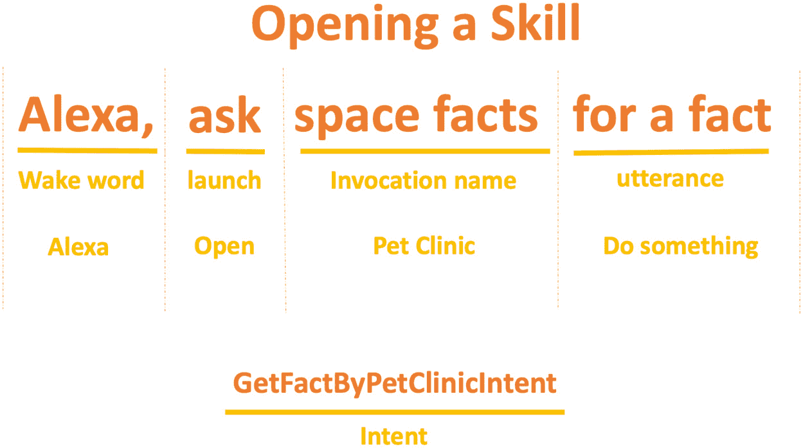

图 10.5 – 打开技能 – 宠物诊所

对于我们的代码示例，我们将使用序列*Alexa，打开宠物诊所*和*Alexa，查找附近的宠物诊所*。在这里，唤醒词是**Alexa**，启动词是**打开**，调用名称是**宠物诊所**。语音可以是**找到最近的宠物诊所**。我们还可以有其他语音变体，例如**找到宠物诊所**。所有这些语音都可以映射到**GetFactByPetClinicIntent**。我们将在本章的下一节学习关于意图的内容。

## 意图的概述

Alexa 语音设计的基本原理之一是意图。意图捕捉了最终用户想要通过语音执行的事件。意图代表了由用户的语音请求触发的动作。Alexa 中的意图在称为**意图模式**的 JSON 结构中指定。内置的意图包括**取消**、**帮助**、**停止**、**导航回家**和**回退**。有些意图是基本的，例如帮助，技能应该有一个帮助意图。

以下图表展示了 Alexa 开发者控制台中的内置意图：

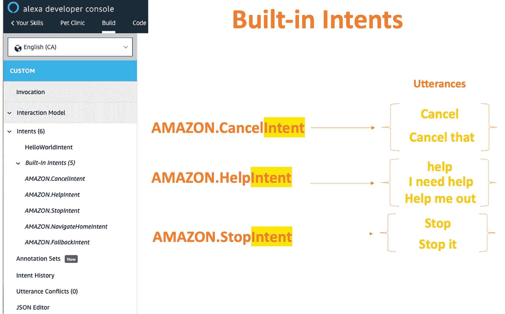

图 10.6 – 内置意图

如果我们有一个登录网站，该网站有用户名和密码字段以及一个提交按钮，在 Alexa 技能世界中将会有一个提交意图。然而，一个很大的不同之处在于用户可以用不同的方式说出“提交”；例如，*提交*、*提交它*、*确认*、*好*、*获取*、*继续*等等。这些表达相同意思的不同方式被称为**语音**。每个意图都应该包括一个语音列表；也就是说，用户可能说出以调用这些意图的所有内容。意图可以有称为**槽位**的参数，这些内容在本章中不会讨论。

现在我们已经通过涵盖语音、意图和内置意图学习了 Alexa 技能的基础，让我们创建我们的第一个功能性的 Alexa 技能。

## 您的第一个 HelloWorld Alexa 技能

要开始创建我们的 Alexa 技能，我们必须导航到[`developer.amazon.com/`](https://developer.amazon.com/)，选择**Amazon Alexa**，然后点击**创建 Alexa 技能**。这将打开 Alexa 开发者控制台。如果您没有 Amazon 开发者账户，您可以免费创建一个。以下屏幕截图展示了**创建技能**屏幕：

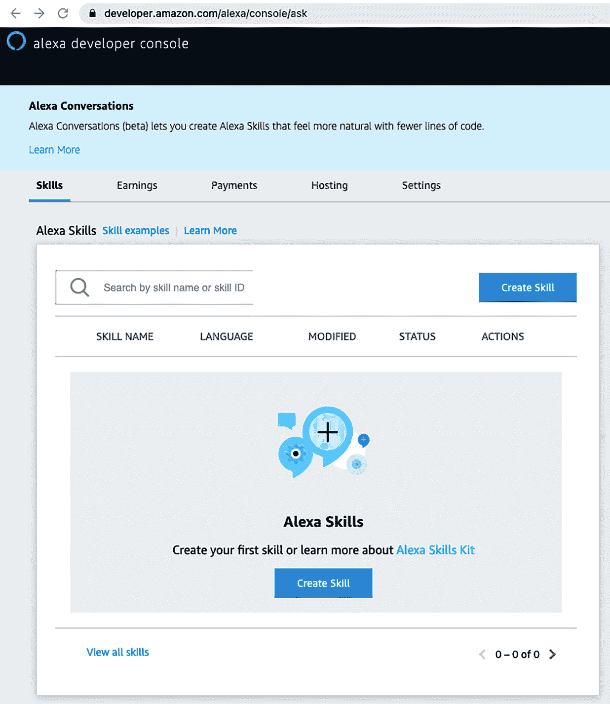

图 10.7 – 创建技能屏幕

在前面的屏幕截图中，你可以看到如何创建一个名为`宠物诊所`的新技能名称，选择一个要添加到你的技能选项中的模型，并选择一个托管你的技能后端资源的方法，称为`自行提供`。选择一个要添加到你的技能中的模板，称为`从头开始创建`。

通过使用自定义语音交互模型，我们了解到我们需要创建和配置我们的唤醒词、启动词、调用名称、语句和意图。唤醒词为设备配置，对所有技能都是相同的，因此我们不需要更改它。在我们的配置中，我们将配置代码启动、调用、语句和意图。以下图表说明了开发 Alexa 技能的基本原理：

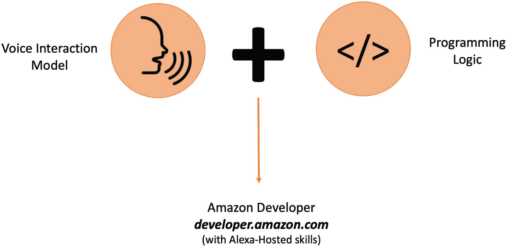


图 10.8 – Alexa 技能

Alexa 技能基于 **语音交互模型** 和 **编程逻辑**。编程逻辑可以使用 Node.js、Java、Python、C# 或 Go 创建。这种编程逻辑允许我们连接到 Web 服务、微服务、API 和接口。有了这个，您可以调用 Alexa 技能的互联网可访问端点。以下图表说明了技能开发者控制台：

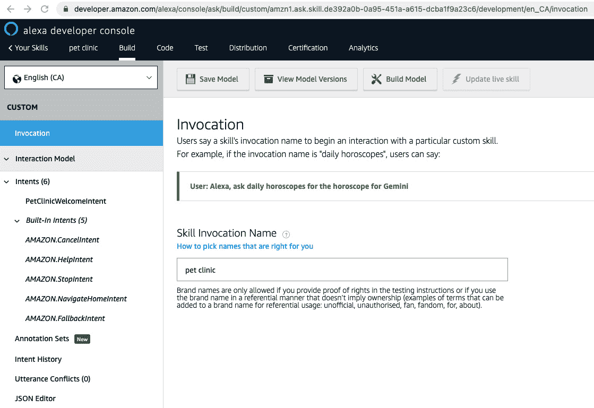


图 10.9 – Alexa 技能

我们可以将 `pet clinic` 设置并保存。您还可以选择 `HelloWorldIntent` 意图并将其重命名为 `PetClinicWelcomeIntent`。在意图中将有示例语句列出，您可以手动修改或使用 JSON 编辑器并从本书的 GitHub 仓库复制 `alexa_petclinic_intent_schema.json` 代码。以下代码说明了意图的 JSON 架构：

```java
{
  "interactionModel": {
    "languageModel": {
      "invocationName": "pet clinic",
      "intents": [
        {
          "name": "AMAZON.CancelIntent",
          "samples": [
            "cancel"
          ]
        ………………………
        {
          "name": "PetClinicWelcomeIntent",
          "slots": [],
          "samples": [
            "find near by pet clinics",
            "find pet clinics"
          ]
        }
      ],
      "types": []
    }
  }
}
```

您可以使用 JSON 配置文件配置意图的调用名称和示例语句。

一旦您已将 JSON 文件复制到 Alexa 开发者控制台的 JSON 编辑器中，请点击 **保存模型** 然后点击 **构建模型和评估模型**。

注意

上述配置是 GitHub 上本章文件夹中的示例。实际架构可以从 GitHub 复制。

一旦构建了模型，请在 Alexa 开发者控制台中点击 **测试** 并启用技能测试过程。现在，我们需要开发我们的后端代码以进行响应。

使用您最喜欢的 IDE 创建一个 Maven Java 项目。以下依赖项对于此项目是必需的：

```java
<dependencies>
    <dependency>
        <groupId>com.amazon.alexa</groupId>
        <artifactId>ask-sdk</artifactId>
        <version>2.20.2</version>
    </dependency>
</dependencies>
```

我们将使用亚马逊的 `ask-sdk` 进行我们的后端 Java 开发。您也可以使用 Gradle 配置依赖项。以下代码展示了示例 Gradle 配置：

```java
dependencies {
    compile 'com.amazon.alexa:alexa-skills-kit:1.1.2'
}
```

我们需要为所有意图创建一个 Java 类。在我们的 JSON 架构中，我们已定义了 `CancelIntent`、`HelpIntent`、`StopIntent`、`NavigateHomeIntent`、`FallbackIntent` 和 `PetClinicWelcomeIntent` 意图。对于每个意图，我们需要创建一个处理器；例如，`PetClinicWelcomeIntent` 应该有 `PetClicWelcomeIntentHandler`。处理器名称将被添加到每个意图名称的末尾。我们还必须创建一个额外的处理器，该处理器在 JSON 架构中尚未配置，称为 `LaunchRequestHandler`。这是每次启动技能时都会触发的第一个意图。以下代码说明了 `LaunchRequestHandler`：

```java
public class LaunchRequestHandler implements RequestHandler {
    @Override
    public boolean canHandle(HandlerInput handlerInput) {
        return handlerInput.matches
        (requestType(LaunchRequest.class));
    }
    @Override
    public Optional<Response> handle(HandlerInput 
     handlerInput) {
        String speechText = "Welcome to Pet Clinic, You can 
         say find near by Pet Clinics";
        return handlerInput.getResponseBuilder()
                .withSpeech(speechText)
                .withSimpleCard("PetClinic", speechText)
                .withReprompt(speechText)
                .build();
    }
}
```

`LaunchRequestHandler` 将覆盖当技能启动时的处理方法以及响应语音消息。这已在代码块中定义。在代码中，我们有一个语音文本响应“欢迎来到宠物诊所，您可以说出查找附近的宠物诊所”，以及 `PetClinic` 的标题。

现在我们已经创建了处理程序（`CancelandStopIntentHandler`、`HelpIntentHandler`、`LaunchRequestHandler`、`PetClinicWelcomeIntentHandler` 和 `SessionEndedRequestHandler`），我们需要创建 `StreamHandler`。`StreamHandler` 是 AWS Lambda 函数的入口点。所有由最终用户发送到 Alexa、调用您的技能的请求都将通过此类传递。您需要在端点中配置从 Amazon Alexa 开发者控制台复制的技能 ID。请参考以下代码：

```java
public class PetClinicStreamHandler extends SkillStreamHandler {
    private static Skill getSkill() {
        return Skills.standard()
                .addRequestHandlers(
                        new CancelandStopIntentHandler(),
                        new 
                         PetClinicWelcomeIntentHandler(),
                        new HelpIntentHandler(),
                        new LaunchRequestHandler(),
                        new SessionEndedRequestHandler())
                .withSkillId("amzn1.ask.skill.de392a0b-
                 0a95-451a-a615-dcba1f9a42c6")
                .build();
    }
    public PetClinicStreamHandler() {
        super(getSkill());
    }
}
```

通过这样，我们已经了解了如何使用流处理器以及如何调用意图处理器。让我们学习技能 ID 的使用，这是您可以获取有关技能 ID 信息的地方。以下截图说明了技能 ID 在开发者控制台中的位置：

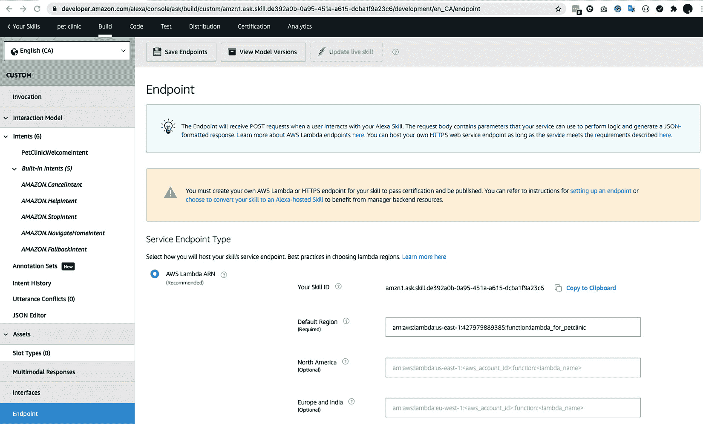

Figure 10.10 – 端点技能 ID 和默认区域

技能 ID 可在 Alexa 开发者控制台的 `.jar` 文件中找到，该文件包含代码的依赖项。您可以通过执行 `mvn assembly:assembly -DdescriptorId=jar-with-dependencies package` 命令来创建 `.jar` 文件。此 `.jar` 文件将位于目标目录中，如图所示：

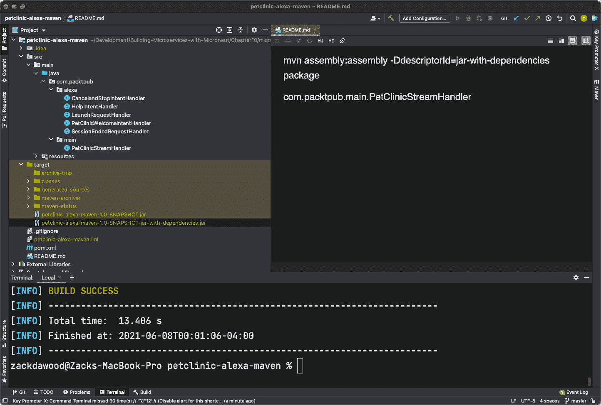

Figure 10.11 – Maven JAR 文件位置

下一步是创建 Amazon Lambda 函数，这是我们后端服务代码。

导航到 [`console.aws.amazon.com/lambda/`](https://console.aws.amazon.com/lambda/) 创建一个函数。将函数命名为 `lambda_for_petclinic`，设置选项为 `从头开始创建作者`，并将运行时设置为 `Java 11`。用户界面如图所示：

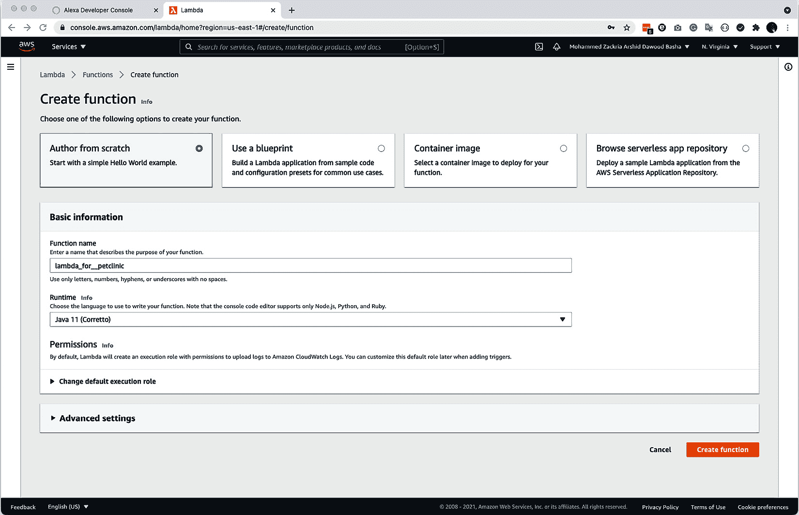

Figure 10.12 – Alexa 创建函数屏幕

下一步是创建触发器，将 **触发器配置** 设置为 **Alexa Skills Kit**，如下面的截图所示。您需要从 Alexa 开发者控制台的 **端点** 屏幕中复制 Alexa **技能 ID**。同时，您还需要从 Lambda 开发者控制台复制 **函数 ARN**（**Amazon Resource Name**）属性到 Alexa 技能开发者控制台的 **端点** 屏幕中。以下截图说明了 AWS Lambda 函数的 ARN 位置：

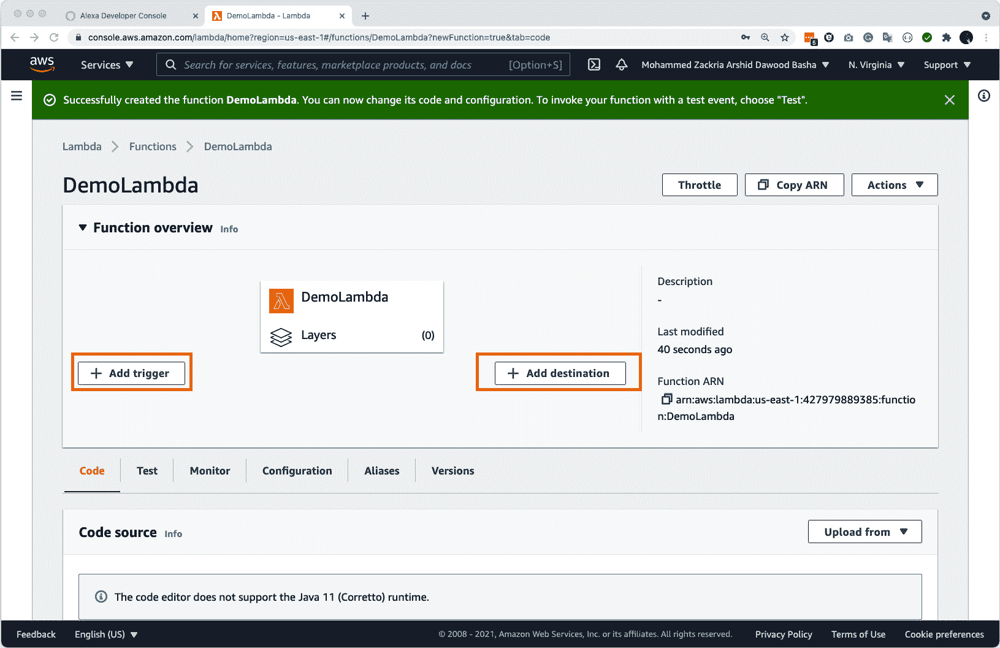

Figure 10.13 – AWS 函数 ARN

**函数 ARN**值必须从 Alexa 开发者控制台的**端点**屏幕复制到**默认区域**部分或到特定位置的区域，如图*图 10.10*所示。图*图 10.10*中显示的技能 ID 应复制到 AWS Lambda 触发器屏幕，如图所示：


图 10.14 – AWS Lambda – 添加触发器

一旦添加了必要的技能 ID 和`.jar`文件，以及任何依赖项（`petclinic-Alexa-maven-1.0-SNAPSHOT-jar-with-dependencies.jar`），到 Lambda 函数中。

以下截图说明了将`.jar`文件上传到 Amazon Lambda 函数的过程：

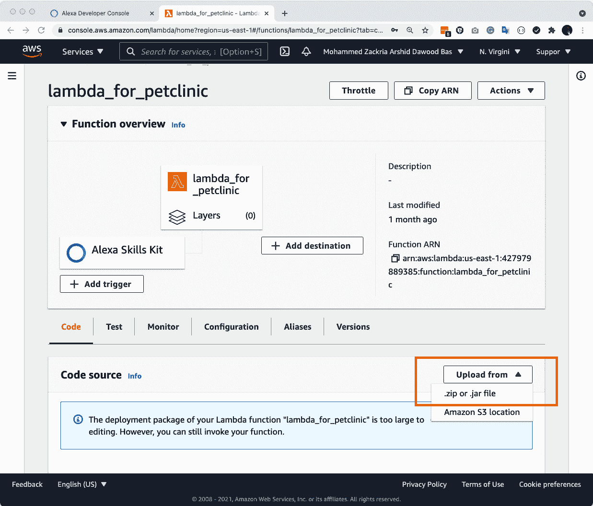

图 10.15 – 将代码上传到 Amazon Lambda

现在我们已经创建了第一个 Alexa 技能并上传了必要的代码，让我们来测试一下。

## 测试您的代码

最后和最终的过程是使用 Amazon Alexa 模拟器测试代码，该模拟器位于开发者控制台中。以下截图说明了如何请求 Alexa 模拟器：

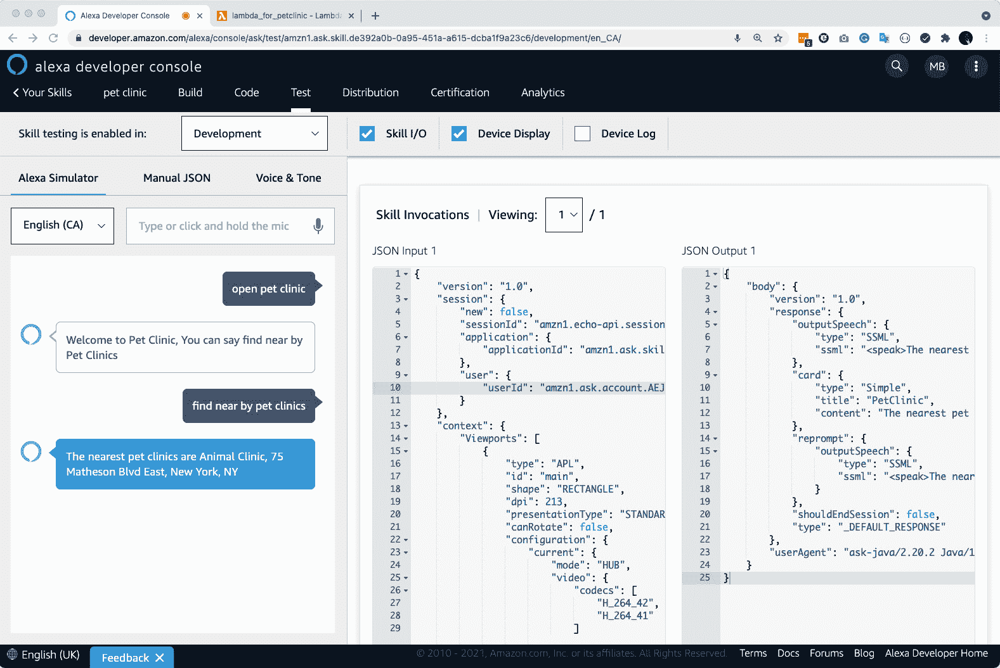

图 10.16 – Alexa 模拟器请求/响应

请求/响应测试界面接受文本或语音。您可以在其中键入或说出“打开宠物诊所”和“查找附近的宠物诊所”。您应该能够在**JSON 输出 1**部分看到 Java 代码的响应。一旦您看到了响应，这意味着我们已经成功创建了第一个带有请求和响应的基本物联网宠物诊所示例。

我们将在下一节中将 Micronaut 和 Alexa 集成。您可以在本书的 GitHub 存储库中找到`petclinic-alexa-maven`项目的完整工作示例。

# 将 Micronaut 与 Alexa 集成

正如我们在前一节中讨论的，在本节中，我们将开始了解如何将 Micronaut 与 Alexa 集成。Micronaut 提供了各种扩展，支持`micronaut-function-aws-alexa`模块，包括支持使用 Micronaut 构建 Alexa 技能。Micronaut Alexa 支持可以通过**AlexaFunction**连接您的 Alexa 应用程序，并支持以下类型的依赖注入：

+   `com.amazon.ask.dispatcher.request.handler.RequestHandler`

+   `com.amazon.ask.dispatcher.request.interceptor.RequestInterceptor`

+   `com.amazon.ask.dispatcher.exception.ExceptionHandler`

+   `com.amazon.ask.builder.SkillBuilder`

Micronaut 的`aws-alexa`模块简化了我们使用 Java、Kotlin 或 Groovy 开发 Alexa 技能的方式。以下代码是`aws-alexa`模块的 Java Maven 依赖项：

```java
<dependency>
    <groupId>io.micronaut.aws</groupId>
    <artifactId>micronaut-aws-alexa</artifactId>
</dependency>
```

正如我们在前面的章节中学到的，Micronaut 使用 Java 注解。为了改变任何 Alexa Java 处理器，使其能够与 Micronaut 一起工作，我们只需要添加必要的`@Singleton`注解；即`javax.inject.Singleton`。以下是一个带有`Singleton`注解的示例`LaunchRequestHandler`：

```java
@Singleton
public class LaunchRequestHandler implements RequestHandler {
    @Override
    public boolean canHandle(HandlerInput handlerInput) {
        return handlerInput.matches
          (requestType(LaunchRequest.class));
    }
    @Override
    public Optional<Response> handle(HandlerInput 
     handlerInput) {
        String speechText = "Welcome to Pet Clinic, You can 
         say find near by Pet Clinics";
        return handlerInput.getResponseBuilder()
                .withSpeech(speechText)
                .withSimpleCard("PetClinic", speechText)
                .withReprompt(speechText)
                .build();
    }
}
```

在 Micronaut 的帮助下，你可以轻松地对你的意图进行单元测试。这是因为 `@MicronautTest` 注解提供了无缝的单元测试功能。在这里，我们可以将处理程序注入到单元测试用例中。Micronaut 框架利用 Amazon 的 `LaunchRequest` 类来完成以下操作：

```java
@MicronautTest
public class LaunchRequestIntentHandlerTest {
    @Inject
    LaunchRequestHandler handler;
    @Test
    void testLaunchRequestIntentHandler() {
        LaunchRequest request = 
         LaunchRequest.builder().build();
        HandlerInput input = HandlerInput.builder()
                .withRequestEnvelope
                     (RequestEnvelope.builder()
                        .withRequest(request)
                        .build()
                ).build();
        assertTrue(handler.canHandle(input));
        Optional<Response> responseOptional = 
          handler.handle(input);
        assertTrue(responseOptional.isPresent());
        Response = responseOptional.get();
        assertTrue(response.getOutputSpeech() instanceof 
         SsmlOutputSpeech);
        String speechText = "Welcome to Pet Clinic, You can 
         say find near by Pet Clinics";
        String expectedSsml = "<speak>" + speechText + 
          "</speak>";
        assertEquals(expectedSsml, ((SsmlOutputSpeech) 
         response.getOutputSpeech()).getSsml());
        assertNotNull(response.getReprompt());
        assertNotNull(response.getReprompt()
          .getOutputSpeech());
        assertTrue(response.getReprompt().getOutputSpeech() 
         instanceof SsmlOutputSpeech);
        assertEquals(expectedSsml,((SsmlOutputSpeech) 
          response.getReprompt().getOutputSpeech())
          .getSsml());
        assertTrue(response.getCard() instanceof 
          SimpleCard);
        assertEquals("PetClinic", ((SimpleCard) 
          response.getCard()).getTitle());
        assertEquals(speechText, ((SimpleCard) 
         response.getCard()).getContent());
        assertFalse(response.getShouldEndSession());
    }
```

你可以在本书的 GitHub 仓库中找到 `petclinic-alexa-micronaut-maven` 项目的完整工作示例。你可以在处理程序中连接到网络服务或后端数据库，发送请求并接收响应。以下图表展示了 Alexa 技能与后端集成的设计：

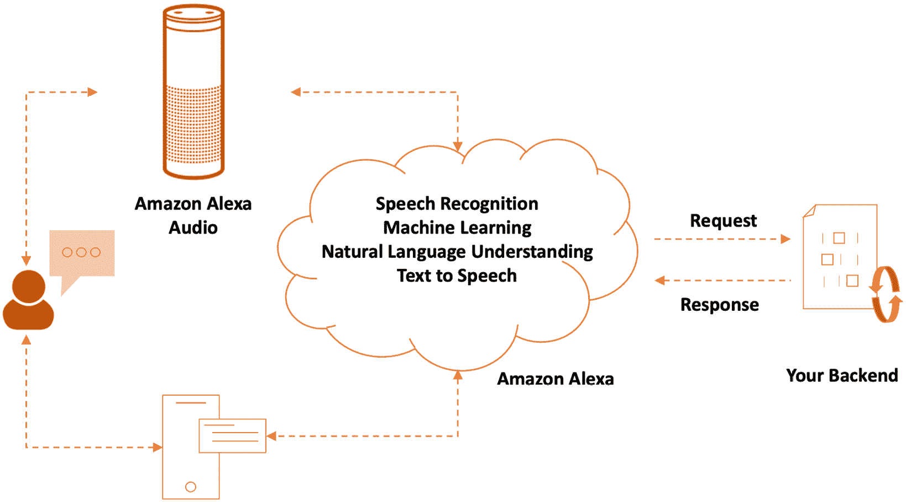

图 10.17 – 带自定义后端的 Alexa 技能

如以下代码片段所示，你的 `speechText`：

```java
    @Override
    public Optional<Response> handle(HandlerInput 
       handlerInput) {
        speechText =  service.getPetClinicLocation();
        return handlerInput.getResponseBuilder()
                .withSpeech(speechText)
                .withSimpleCard("PetClinic", speechText)
                .withReprompt(speechText)
                .build();
    }
```

可以从微服务调用中添加 `speechText` 处理方法，并可以从数据库或服务中检索信息。

现在我们已经将 Micronaut 与 Alexa 集成，我们可以使用语音和 Micronaut 微服务来控制物联网设备。

# 摘要

在本章中，我们探讨了如何使用物联网和 Amazon Alexa 的基础知识。然后，我们深入研究了创建 Micronaut 微服务并将其与 Amazon Alexa 集成的过程。通过这种集成，我们可以使用语音和 Micronaut 微服务来控制物联网设备。

本章增强了你在物联网中的 Micronaut 微服务之旅。它使你获得了物联网和 Amazon Alexa 的第一手知识。Micronaut 还支持 **语音合成标记语言** (**SSML**) 和闪报。

在下一章中，我们将把我们所学的所有主题结合起来，通过构建企业级微服务、查看 OpenAPI、扩展 Micronaut 以及深入构建企业级微服务，将事物提升到新的水平。

# 问题

1.  物联网是什么？

1.  列举一些物联网设备。

1.  什么是 Alexa 技能？

1.  什么是 Alexa 意图？

1.  Alexa 支持哪些编程语言？

1.  默认启动处理程序类的名称是什么？

1.  你需要对你的注解处理程序进行哪一项更改，以便它们与 Micronaut 兼容？
