# 第十一章：构建企业级微服务

我们已经到达了使用 Micronaut 学习动手微服务的最后阶段。我们的旅程现在已进入最终阶段；在前几章中，我们在 Micronaut 的动手实践方面获得了大量知识。现在，我们必须将所有这些知识串联起来，使用 Micronaut 构建我们企业级的微服务。正如我们从前面的章节中已经了解到的，以下是一些使用 Micronaut 的好处：

+   基于 JVM 的现代全栈框架

+   易于测试的微服务

+   为无服务器应用程序构建

+   反应式堆栈

+   最小内存占用和启动时间

+   云原生框架

+   多语言支持（Java、Groovy、Kotlin）

在本章中，我们将涵盖以下主题：

+   将所有内容整合在一起

+   架构企业级微服务

+   理解 Micronaut 的 OpenAPI

+   实施 Micronaut 的微服务

到本章结束时，您将熟练掌握构建、设计和扩展企业级微服务。

# 技术要求

本章中的所有命令和技术说明都可以在 Windows 10 和 Mac OS X 上运行。本章中的代码示例可以在本书的 GitHub 仓库中找到，地址为 [`github.com/PacktPublishing/Building-Microservices-with-Micronaut/tree/master/Chapter11/micronaut-petclinic`](https://github.com/PacktPublishing/Building-Microservices-with-Micronaut/tree/master/Chapter11/micronaut-petclinic)。

以下工具需要在您的开发环境中安装和设置：

+   **Java SDK**：版本 8 或更高（我们使用了 Java 13）。

+   **Maven**：这是可选的，仅当您希望使用 Maven 作为构建系统时才需要。然而，我们建议在所有开发机器上设置 Maven。下载和安装 Maven 的说明可以在 [`maven.apache.org/download.cgi`](https://maven.apache.org/download.cgi) 找到。

+   **开发 IDE**：根据您的偏好，可以使用任何基于 Java 的 IDE，但在这章中，我们使用了 IntelliJ。

+   **Git**：下载和安装 Git 的说明可以在 [`git-scm.com/downloads`](https://git-scm.com/downloads) 找到。

+   **PostgreSQL**：下载和安装 PostgreSQL 的说明可以在 [`www.postgresql.org/download/`](https://www.postgresql.org/download/) 找到。

+   **MongoDB**：MongoDB Atlas 提供免费的在线数据库即服务，最多 512 MB 的存储空间。但是，如果您希望使用本地数据库，则可以在 [`docs.mongodb.com/manual/administration/install-community/`](https://docs.mongodb.com/manual/administration/install-community/) 找到下载和安装 MongoDB 的说明。我们在编写本章时使用了本地安装。

+   **REST 客户端**：可以使用任何 HTTP REST 客户端。在本章中，我们使用了 Advanced REST Client Chrome 插件。

+   **Docker**：下载和安装 Docker 的说明可以在[`docs.docker.com/get-docker/`](https://docs.docker.com/get-docker/)找到。

+   **Amazon**：为 Alexa 创建一个 Amazon 账户：[`developer.amazon.com/alexa`](https://developer.amazon.com/alexa)。

## 将所有内容整合在一起

让我们回顾一下到目前为止所有章节中学到的内容。在*第一章*《使用 Micronaut 框架开始微服务之旅》中，我们开始使用 Micronaut 框架来探讨微服务。在那里，我们学习了微服务及其演变：微服务设计模式。我们学习了为什么 Micronaut 是开发微服务的最佳选择，并创建了我们的第一个 Micronaut 应用程序。在*第二章*《数据访问工作》中，我们学习了如何进行数据访问。

我们开始了我们的第一个宠物诊所、宠物主人以及宠物诊所评论的 Micronaut 项目。我们学习了如何使用 Micronaut 框架集成持久化层，以及如何使用对象关系映射 Hibernate 框架与关系型数据库集成。我们在 PostgreSQL 中创建了我们的 Micronaut 后端数据库，定义了实体之间的关系，映射了实体之间的关系，并创建了数据访问存储库。我们还通过在数据库中使用 Micronaut 进行插入/创建、读取/检索、更新和删除操作来创建了基本的 CRUD 操作。之后，我们使用 MyBatis 框架集成了关系型数据库。我们还探索了 MongoDB 和 Micronaut 的 NoSQL 数据库功能。

在*第三章*《使用 Micronaut 进行 RESTful Web 服务开发》中，我们学习了如何使用 Micronaut 进行 RESTful Web 服务的开发。我们为宠物诊所、宠物主人以及宠物诊所评论的 Micronaut 项目添加了 RESTful Web 服务功能。我们学习了数据传输对象、端点有效负载、映射结构、RESTful 端点、HTTP 服务器 API、验证数据、处理错误、API 版本控制和 HTTP 客户端 API。我们使用 GET、POST、PUT 和 DELETE 在服务上执行了 RESTful 操作。在*第四章*《保护微服务》中，我们学习了如何保护微服务。通过启用安全方面，我们创建了一个具有安全功能的 RESTful 微服务的工作示例。我们通过使用会话认证来保护服务端点、实现基本认证提供者、配置授权、授予未经授权和安全的访问、使用 JWT 认证、在 Docker 中设置 Keycloak、使用 OAuth、设置 Okta 身份提供者以及启用 Micronaut 框架中的 SSL，学习了 Micronaut 安全的基础知识。

在 *第五章*《使用事件驱动架构集成微服务》中，我们学习了如何使用事件驱动架构集成微服务。我们学习了事件驱动架构的基础知识、Apache Kafka 的事件流以及如何在宠物诊所评论微服务中实现事件生产者和事件消费者客户端。在第 *第六章*《测试微服务》中，我们掌握了使用 Micronaut 测试微服务。我们学习了在 Micronaut 框架中使用 JUnit 5 进行单元测试的基础知识、模拟测试、服务测试、可用的测试套件以及使用测试 Docker 容器进行的集成测试。

在*第七章*《处理微服务问题》中，我们学习了如何处理微服务问题。我们学习了外部化应用程序配置、分布式配置管理、使用 Swagger 记录服务 API、实现服务发现、使用 Consul 创建服务发现、实现 API 网关服务以及使用断路器和回退实现容错机制。在第 *第八章*《部署微服务》中，我们学习了如何部署微服务。我们学习了构建容器工件、使用 Jib 容器化、部署容器工件、使用 `docker-compose` 以及部署多服务应用程序。

在 *第九章*《分布式日志、跟踪和监控》中，我们学习了分布式日志、跟踪和监控。我们还学习了日志生产者、调度器、存储和可视化器。我们实现了 Elasticsearch、Logstash 和 Kibana。之后，我们在 Docker 中设置了 ELK，与一些 Micronaut 微服务集成，并在 Micronaut 中实现了分布式跟踪。最后，我们在 Docker 中设置了 Prometheus 和 Grafana。在第 *第十章*《使用 Micronaut 的物联网》中，我们学习了使用 Micronaut 的物联网。我们学习了物联网、Alexa 技能、太空事实、话语、意图、您的第一个 Alexa 技能、语音交互模型、将 Micronaut 与 Alexa、AWS、AlexaFunction 集成以及使用 Micronaut 测试 AlexaFunction。

总结来说，我们学习了创建企业应用程序所需的所有构建块，包括数据库、Web 服务、容器、部署、测试、配置、监控、事件驱动架构、安全和物联网。本书中涵盖的所有工作示例都可在本书的 GitHub 仓库中找到。

以下图表提供了本书所有章节的总结：

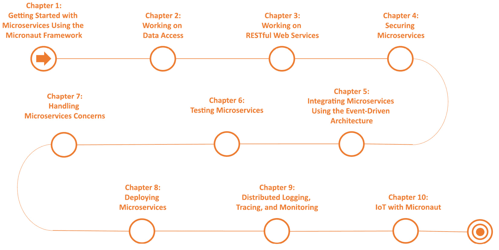

图 11.1 – 整合所有内容 – 章节路线图

通过这些，我们已经了解了创建 Micronaut 微服务的基础。现在，我们已经熟悉了 Micronaut、必要的开发工具、测试、数据库、事件驱动架构、分布式日志、跟踪、监控和物联网，我们拥有了创建企业级微服务所需的所有知识和技能。我们将在下一节学习如何架构企业级微服务。

# 架构企业级微服务

实施企业级微服务需要组织内多个利益相关者的理解和动力。你需要计划和分析微服务是否适合当前的问题。如果是的话，那么你必须设计、开发、部署、管理和维护该服务。

在开始使用微服务之前，让我们了解一下何时不应使用它们。问问自己以下问题：

+   你的团队是否了解微服务？

+   你的业务是否足够成熟以采用微服务？

+   你是否有敏捷的 DevOps 实践和基础设施？

+   你是否有可扩展的本地或云基础设施？

+   你是否有使用现代工具和技术的支持？

+   你的数据库是否准备好去中心化？

+   你是否得到了所有利益相关者的支持？

如果你对这些问题中的每一个都回答“是”，那么你可以适应并部署微服务。部署微服务最困难的部分是你的数据和基础设施。传统上，应用程序被设计成大型的单体应用，与去中心化、松散耦合的微服务相比。当你架构微服务时，你需要在各个阶段应用多种技术。以下图表展示了部署企业级微服务的阶段：

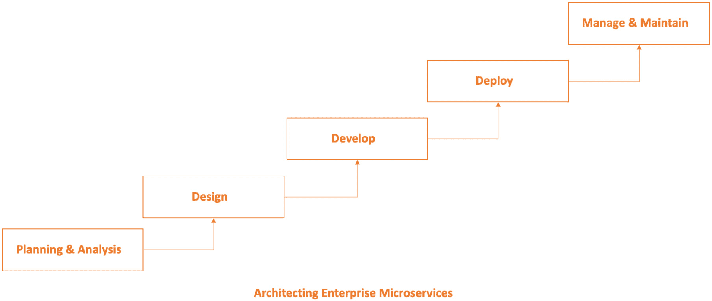

图 11.2 – 架构和部署企业级微服务的阶段

我们将在以下各节中查看这些各个阶段。

## 规划和分析

在你可以为企业的微服务创建架构之前，你需要分析它是否符合你的要求。你也可以只为应用程序的一部分实现微服务。

从传统的单体架构过渡到微服务可能是一个耗时且复杂的过程。然而，如果规划得当，它可以无缝部署。让所有利益相关者支持这一点至关重要，这可以在规划和分析阶段实现。团队成员对微服务的了解也是至关重要的，并且是成功的关键因素。

## 设计

在设计阶段，你可以使用我们在*第一章*“使用 Micronaut 框架开始微服务之旅”中学到的设计模式。设计模式是针对重复出现的业务或技术问题的可重用和经过验证的解决方案。以下是我们在这本书中迄今为止探索的设计模式：

+   按业务能力分解

+   按领域/子领域分解

+   API 网关模式

+   链式微服务模式

+   每个服务一个数据库

+   命令查询责任分离模式

+   服务发现模式

+   断路器模式

+   日志聚合模式

设计模式是持续演进的。始终检查行业中的新模式，并评估它们是否适合您的解决方案。在设计微服务时，下一个重要的考虑领域是安全性。我们在*第四章*“保护微服务”中学习了关于保护微服务的内容。在这里，我们学习了评估身份验证策略、安全规则、基于权限的访问、OAuth 和 SSL。

在设计时需要考虑的其他因素包括检查应用程序中的隐私特定标准，例如**HIPAA**（即**健康保险可携带性和责任法案**）、**通用数据保护条例**（**GDPR**）、**个人信息保护与电子文件法案**（**PIPEDA**）、银行法等。检查加密标准，例如静态加密和传输加密，您的数据在传输前是否加密，或者您的数据是否已存储并加密。检查当前使用的安全协议版本，并应用最新稳定、受支持的版本补丁。数据保留策略是设计微服务时需要考虑的另一个领域。您需要存储数据多长时间，数据存档策略是什么？此外，一些国家有关于数据存储的法规，请检查要求，并在设计时考虑它们。

## 开发

开发是实现微服务的一个重要阶段。始终使用最新稳定、受支持的版本进行开发。使用 Micronaut 框架进行自动化测试。在各个级别进行测试，例如单元测试、服务测试和集成测试。在*第六章*“测试微服务”中，我们学习了关于测试微服务的内容。在这里，我们了解到您应该始终使用容器或云基础设施来模拟真实世界环境，以及在测试期间使用模拟和监视概念。

如果为每个服务创建单独的版本控制策略，则可以将服务存储在具有所需配置和日志的单独存储库中。确保您同步开发、QA、UAT 和 PROD 环境，并在开发的不同阶段拥有相同的基础设施。在开发过程中，如果您想支持旧版本的微服务，请考虑向后兼容性。为每个微服务保留单独的数据库以发挥其最大潜力。

## 部署

当涉及到部署时，你应该使用自动化工具和技术，并利用快速应用部署策略。我们在*第八章*“部署微服务”中学习了如何部署微服务。使用容器、虚拟机、云、Jib 和 Jenkins 等工具，并高效地使用基础设施——不要过度分配。最后，确保你有一个专门的微服务 DevOps 策略，以促进**持续集成**和**持续交付**（**CI/CD**）。

## 管理和维护

维护多个微服务至关重要且复杂。你应该使用分布式日志、跟踪和监控来监控你的应用程序，正如我们在*第九章*“分布式日志、跟踪和监控”中学到的。使用 Elasticsearch、Logstash、Kibana、Prometheus 和 Grafana 等工具来做到这一点。使用 Sonar DevSecOps 监控代码库的健康状况，并定期检查代码中的安全漏洞。你应该经常更新技术的版本、操作系统和工具。此外，实时监控你的 CPU 使用率、内存占用和存储空间。

最后，在运行时扩展你的基础设施以避免硬件过度使用。我们将在接下来的章节中讨论如何扩展 Micronaut。

现在我们已经知道了如何架构微服务，让我们更深入地了解 Micronaut 的 OpenAPI。

# 理解 Micronaut 的 OpenAPI

API 是机器之间相互交互的通用语言。拥有 API 定义确保了存在一个正式的规范。所有 API 都应该有一个规范，这可以提高开发效率并减少交互问题。规范充当文档，帮助第三方开发人员或系统轻松理解服务。Micronaut 在编译时支持 OpenAPI（Swagger）YAML。我们曾在*第七章*中了解到这一点，*处理微服务关注点*。**OpenAPI 倡议**（**OAI**）之前被称为**Swagger 规范**。它用于创建描述、生成、消费和可视化 RESTful Web 服务的机器可读接口文件。**OAI**现在是一个促进供应商中立描述格式的联盟。OpenAPI 也被称为*公共 API*，它公开发布给软件开发人员和公司。Open API 可以用 REST API 或 SOAP API 实现。RESTful API 是行业中最流行的 API 格式。OpenAPI 必须具备强大的加密和安全措施。这些 API 可以是公开的或私有的（封闭的）。公开的 OpenAPI 可以通过互联网访问；然而，私有的 OpenAPI 只能在防火墙或 VPN 服务内的内网中访问。Open API 生成准确的文档，例如所有必需的元信息、可重用组件和端点详细信息。**OpenAPI 规范**（**OAS**）有几个版本；当前版本是 3.1。

您可以在[`www.openapis.org/`](https://www.openapis.org/)了解更多关于 OpenAPI 的信息。

现在我们已经了解了 Micronaut 的 OpenAPI，让我们来了解如何在企业中扩展 Micronaut。

## Micronaut 的扩展

在设计和实施企业应用程序时，需要规划扩展能力。使用微服务的最大优点之一是可扩展性。Micronaut 服务的扩展是设计中的一个关键因素。这不仅仅是处理量的问题——它还涉及到以最小的努力进行扩展。Micronaut 使得识别扩展问题并解决每个微服务级别的挑战变得更加容易。Micronaut 微服务是单一用途的应用程序，可以组合起来构建大型企业级软件系统。运行时扩展是现代化企业的一个关键因素。

有三种扩展类型：*x*轴、*y*轴和*z*轴扩展。以下图表说明了 x 轴（水平扩展）和 y 轴（垂直扩展）：

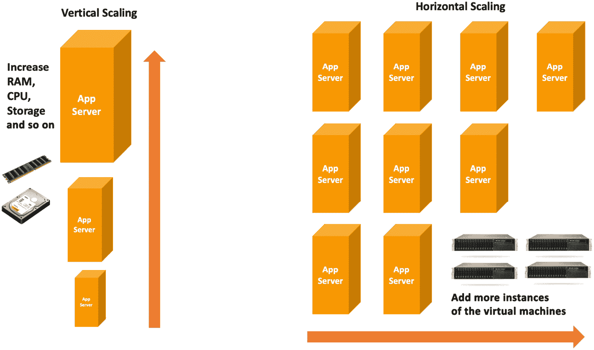

图 11.3 – 垂直扩展与水平扩展

水平扩展也称为 x 轴扩展。在水平扩展中，我们通过创建新的服务器或虚拟机来扩展；服务的整个基础设施都会进行扩展。例如，如果有 10 个服务在一个虚拟机中运行，如果其中一个服务需要额外的容量，我们需要添加一个包含 10 个服务的虚拟机。如果你分析这个场景，你会看到会有未使用的服务器容量，因为只有一个服务需要额外的 CPU，而不是 10 个。然而，这种扩展类型提供了基础设施的无限制扩展。

垂直扩展也称为 y 轴扩展。在垂直扩展中，我们通过向现有服务器添加容量来扩展。容量通过添加额外的 CPU、存储和 RAM 来扩展。例如，如果有 10 个服务在一个虚拟机中运行，如果其中一个服务需要额外的容量，如 RAM 和 CPU，我们需要向同一个虚拟机添加额外的 RAM 和 CPU。这是水平扩展和垂直扩展之间的基本区别。然而，垂直扩展有一个限制：它不能超过特定的限制。以下图表展示了 x 轴（水平扩展）和 z 轴（微服务水平扩展）：

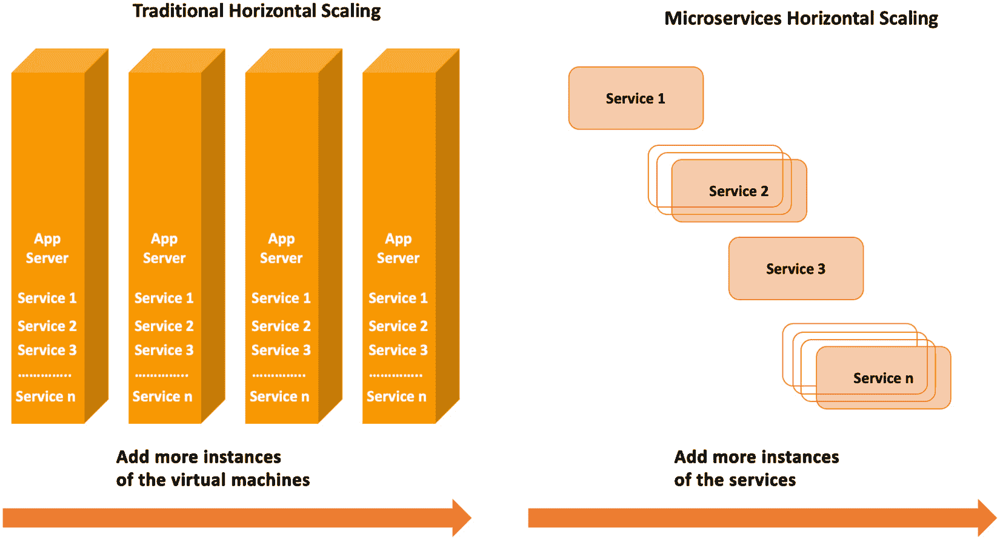

图 11.4 – 传统水平扩展与微服务水平扩展对比

微服务水平扩展也称为 z 轴扩展。这几乎与传统水平扩展相同。例如，如果有 10 个服务在一个微服务容器环境中运行，如果其中一个服务需要额外的容量，我们需要添加一个微服务容器环境，而不是 10 个。如果你分析这个场景，你会看到这是对可用容量的最优化使用。这种扩展类型允许你按需多次扩展基础设施，并且是最具成本效益的方法。它的性能比非扩展环境要好得多。你可以使用容器和云基础设施进行扩展。自动扩展的功能非常强大，对于微服务来说非常实用。

现在我们已经学习了微服务的扩展，接下来让我们实现具有我们所学所有功能的的企业级微服务。

# 实现 Micronaut 的微服务

现在，让我们实现本章所学的内容。你可以使用本章 GitHub 仓库中的代码。我们将使用本书中涵盖的四个项目——宠物诊所、宠物主人、宠物评论和礼宾服务。我们还将使用 Zipkin 容器镜像进行分布式跟踪、Prometheus 进行指标和监控，以及`elk`容器镜像用于 Elasticsearch、Logstash 和 Kibana。

以下截图展示了本书 GitHub 仓库中我们将要使用的项目列表：

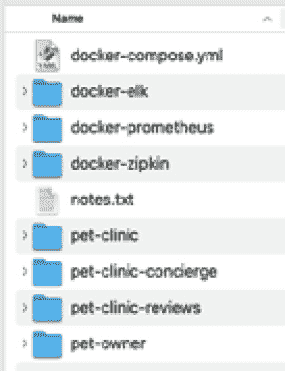

图 11.5 – 我们实现项目的 GitHub 项目

按照以下步骤操作：

1.  第一步是设置 Keycloak。请参阅 *第四章*，*保护微服务*，*设置 Keycloak 作为身份提供者* 和 *在 Keycloak 服务器上创建客户端* 部分。

    可以运行以下命令来创建 Keycloak Docker 镜像：

    ```java
    8888: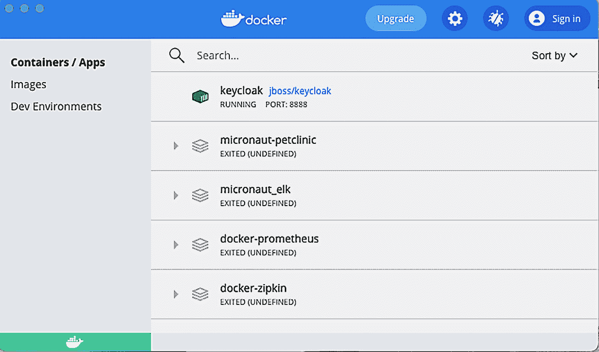Figure 11.6 – Docker Keycloak running 
    ```

1.  一旦 Keycloak 启动并运行，需要从 `pet clinic` 用户复制客户端密钥，并且客户端应该已经设置好。有关更多信息，请参阅 *第四章*，*保护微服务*。

1.  在 Keycloak 中更改超时设置。转到 **Keycloak** 控制台 | **客户端** | **设置** | **高级设置**。建议测试示例代码时使用 **15 分钟**。

    以下屏幕截图说明了 Keycloak **访问** **令牌有效期**的位置：

    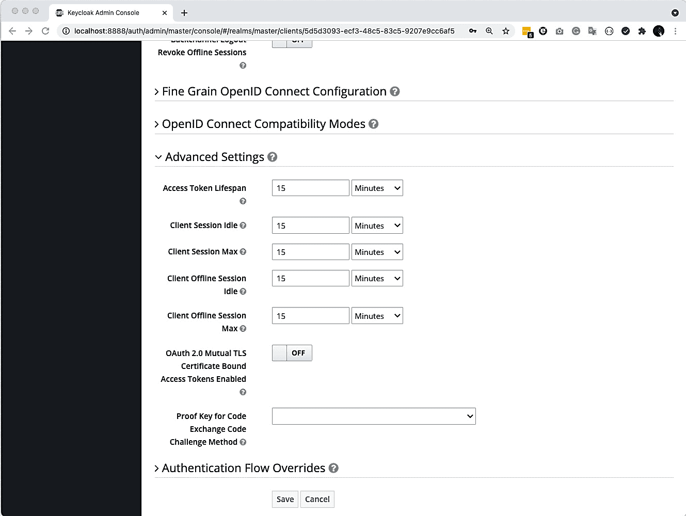

    图 11.8 – Keycloak 访问令牌有效期

1.  需要将密钥复制，以便在 `pet-clinic`、`pet-owner`、`pet-clinic-reviews` 和 `pet-clinic-concierge` 项目中替换。YAML 应用程序配置文件 `client-secret` 需要从 Keycloak 密钥更新，如前一张截图所示。以下是需要更新的文件：

    ```java
    Chapter11/micronaut-petclinic/pet-clinic-reviews/src/main/resources/application.yml
    Chapter11/micronaut-petclinic/pet-owner/src/main/resources/application.yml
    Chapter11/micronaut-petclinic/pet-clinic/src/main/resources/application.yml
    Chapter11/micronaut-petclinic/pet-clinic-concierge/src/main/resources/application.yml 
    ```

    以下屏幕截图说明了需要替换客户端密钥 ID 的示例 `.yaml` 文件配置：

    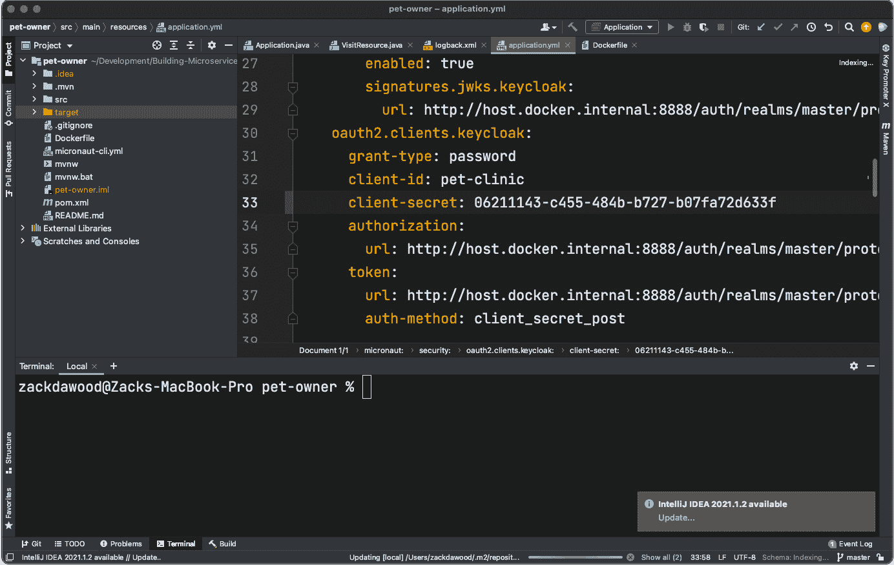

    图 11.9 – Keycloak 门户 – 应用 YAML 文件中的客户端密钥

1.  一旦所有客户端密钥都已更新，请在所有四个项目（`pet-clinic-concierge`、`pet-clinic-reviews`、`pet-clinic` 和 `pet-owner`）中执行 Maven Docker 构建。以下 Maven 命令为每个项目创建 Docker 镜像：

    ```java
    pet-clinic and pet-reviews. Refer to *Chapter 02, Working on Data Access* for more details.
    ```

1.  检查 Docker 设置资源。您需要 4 个 CPU 和至少 6 GB 的内存。转到 **Docker** 设置 | **资源** | **高级**：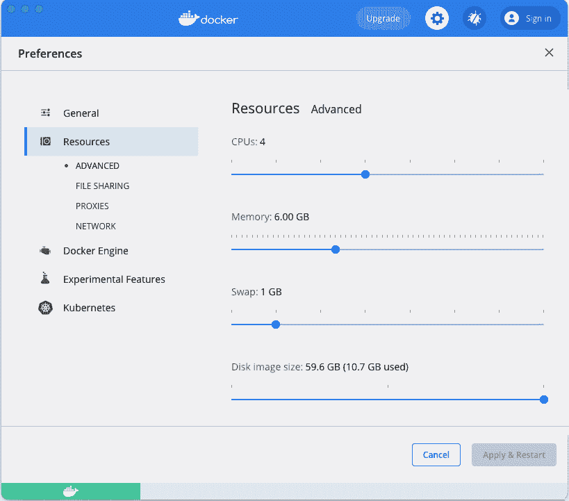

    图 11.10 – Docker CPU 和内存设置

1.  创建 Docker 镜像后的下一步是创建 Kafka、Zipkin、Prometheus 和 ELK 的 `docker-compose`。在终端或控制台中执行以下命令以创建 Docker 镜像：

    ```java
    Chapter11/micronaut-petclinic/docker-zipkin/docker-compose.yml
    ```

    这就是文件的工作方式：

    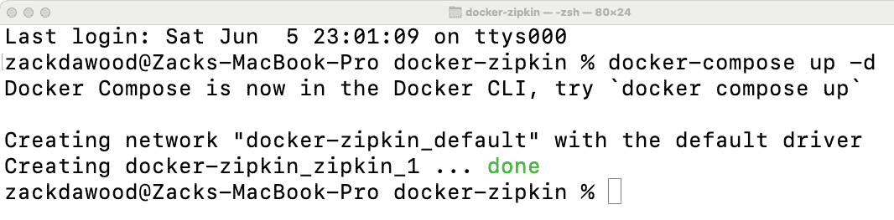

    ```java
    Chapter11/micronaut-petclinic/docker-prometheus/docker-compose.yml
    ```

    这就是文件的工作方式：

    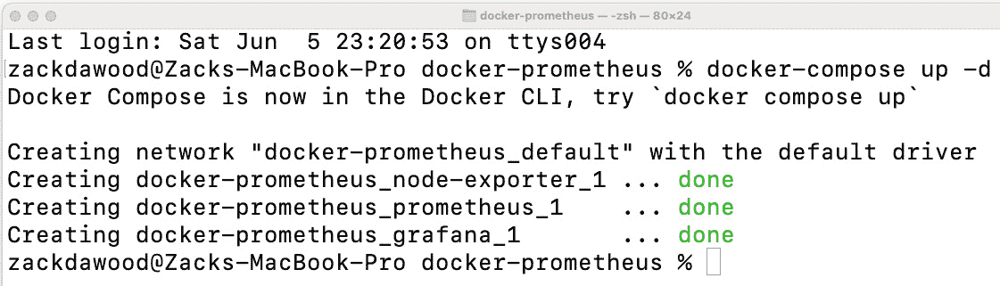

    ```java
    Chapter11/micronaut-petclinic/docker-prometheus/docker-elk
    ```

    这就是文件的工作方式：

    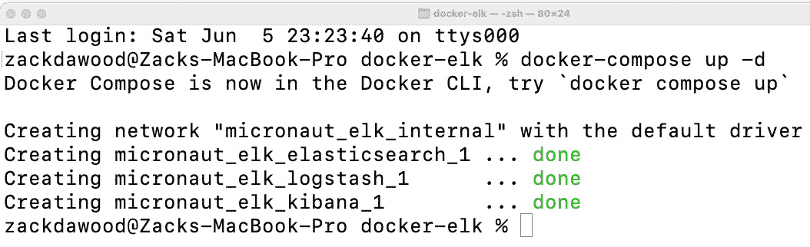

    ```java
    Chapter11/micronaut-petclinic/docker-compose.yml
    ```

    现在，这是文件的工作方式：

    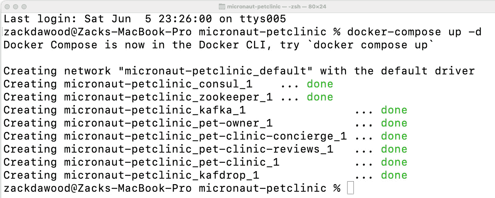

    图 11.15 – Docker Compose Micronaut pet clinic

    注意，安全配置保护了使用 Keycloak 的所有项目，除了 `pet-clinic-reviews`：

    +   `pet-clinic-concierge`: 使用 Keycloak 保护

    +   `pet-clinic`: 使用 Keycloak 保护

    +   `pet-owner`: 使用 Keycloak 保护

    +   `pet-clinic-reviews`: 未受保护

1.  在测试应用之前，检查所有应用是否都在 Docker 容器中运行。以下截图展示了成功在 Docker 容器中运行的应用：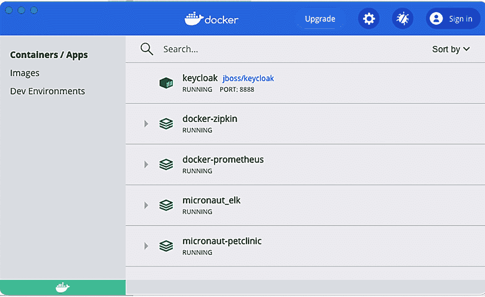

    图 11.16 – 运行所有必需应用的 Docker 容器

1.  现在所有项目都在 Docker 中运行，让我们测试 URL 的集成。你可以从 API 网关调用所有服务，如下所示：

    +   `pet-owner`: `http://localhost:32584/api/owners`

    +   `pet-clinic`: `http://localhost:32584/api/vets`

    +   `pet-clinic-reviews`: `http://localhost:32584/api/vet-reviews `

        一旦你在 Docker 中运行了应用，你需要通过在 Keycloak 上调用以下 API 来获取安全令牌：

        ```java
        curl -L -X POST 'http://localhost:8888/auth/realms/master/protocol/openid-connect/token' \
        -H 'Content-Type: application/x-www-form-urlencoded' \
        --data-urlencode 'client_id=pet-clinic' \
        --data-urlencode 'grant_type=password' \
        --data-urlencode 'client_secret=PUT_CLIENT_SECRET_HERE' \
        --data-urlencode 'scope=openid' \
        --data-urlencode 'username=alice' \
        --data-urlencode 'password=alice'
        ```

        备注

        `PUT_CLIENT_SECRET_HERE` 必须替换为 Keycloak 凭据的秘密。

        现在，这是控制台中的请求看起来像这样：

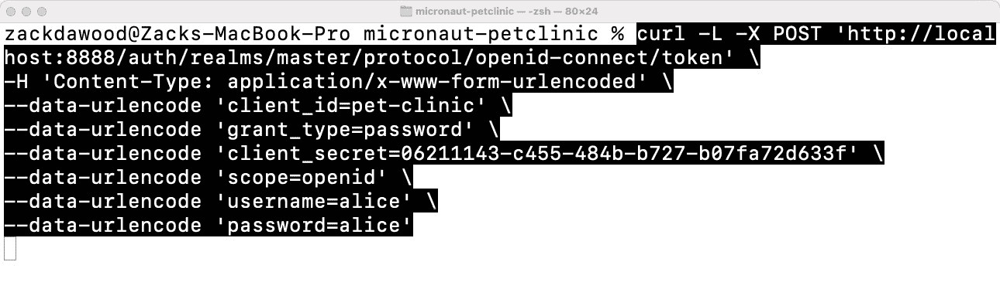

图 11.17 – 获取 JWT 的 curl 请求

然后，我们可以检查 `curl` 请求返回访问令牌：

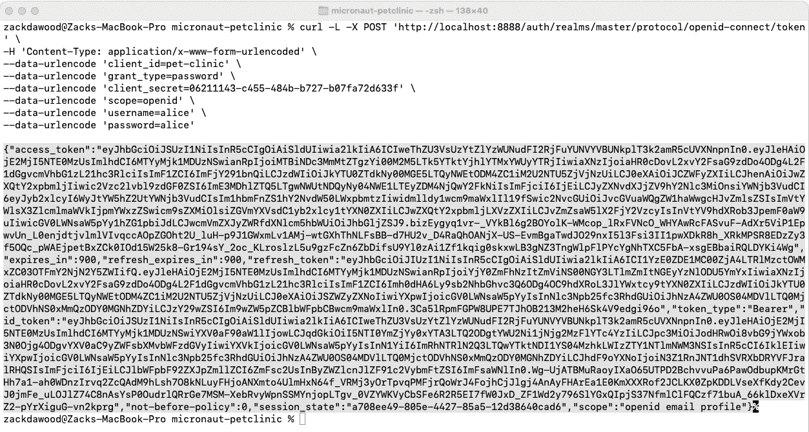

图 11.18 – JWT 的 curl 响应

1.  使用 JSON 格式化工具复制和格式化 JSON 响应。格式化响应中的 `access_token` 属性值必须复制，并将此值作为 JWT 传递，如下所示：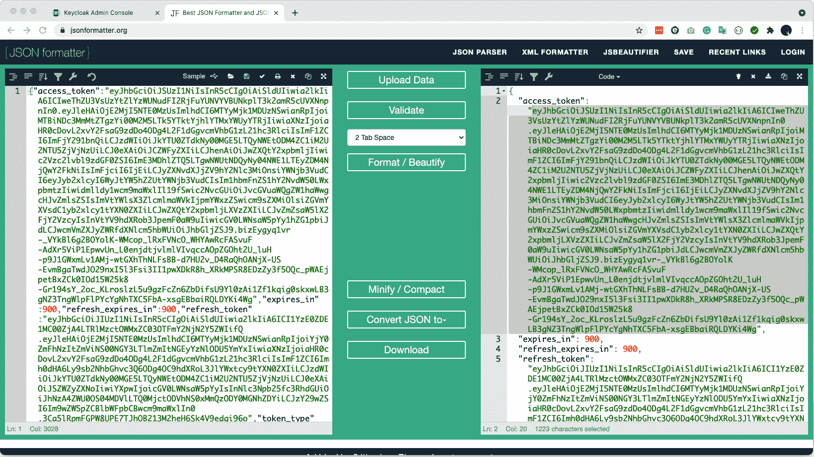

    图 11.19 – JWT 的 curl 响应

1.  一旦你收到 `curl` 的响应，你可以复制 `access_token` 值。`access_token` 可以作为请求头中的值传递，如下面的截图所示：

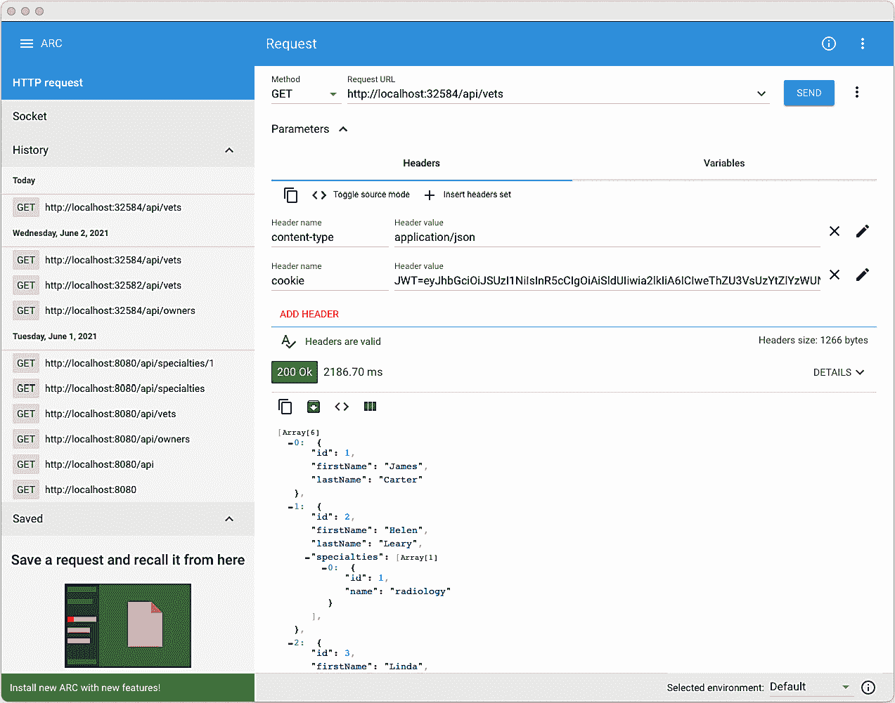

图 11.20 – vets API 的 REST 响应

现在，我们必须使用以下链接测试所有应用 URL 及其集成：

+   `http://localhost:32584/`.

+   `http://localhost:8500/ui/dc1/services`。这将启动 Consul，如截图所示：

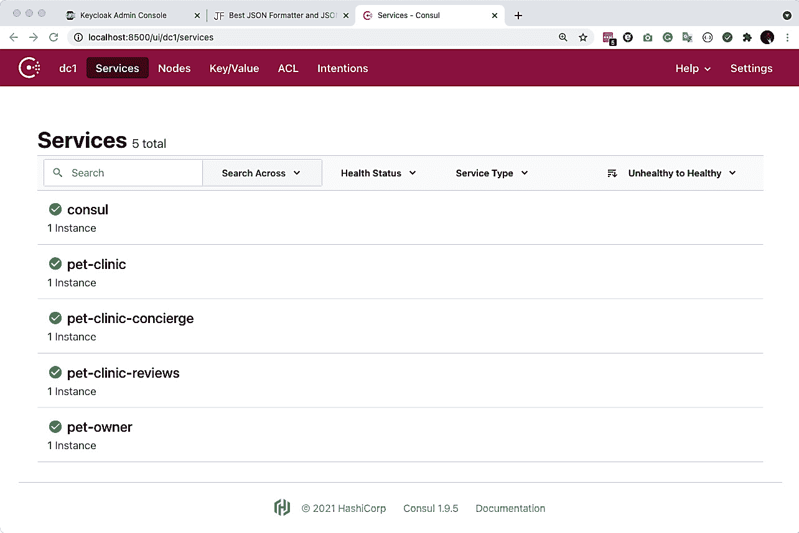

图 11.21 – vets API 的 REST 响应

+   `http://localhost:5601/app/kibana`. 这将启动如以下截图所示的 Kibana 日志门户：

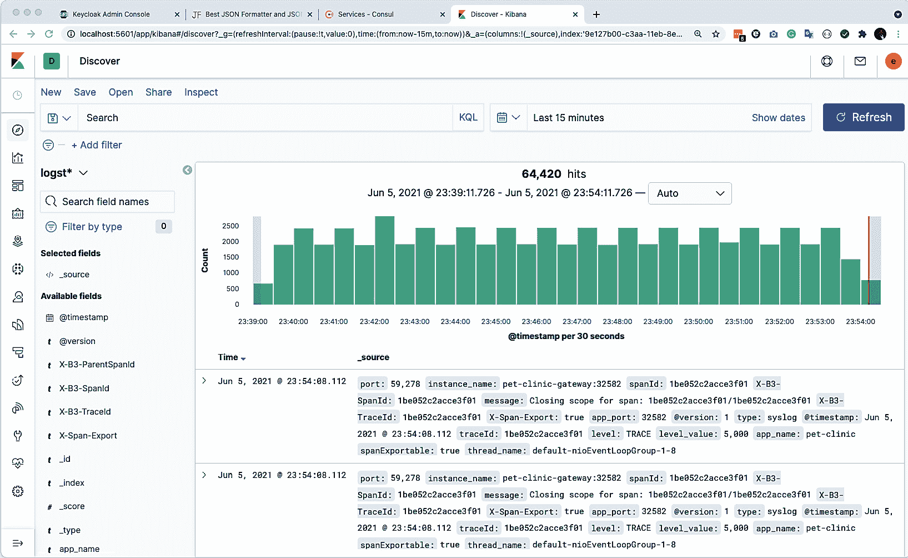

图 11.22 – Kibana 日志门户

备注

Kibana 的默认用户名是 `elastic`，密码是 `changeme`。

+   `http://localhost:3000/?orgId=1`. 这将启动 Grafana 监控工具。配置仪表板的详细步骤可以在*第九章*，*分布式日志、跟踪和监控*中找到：

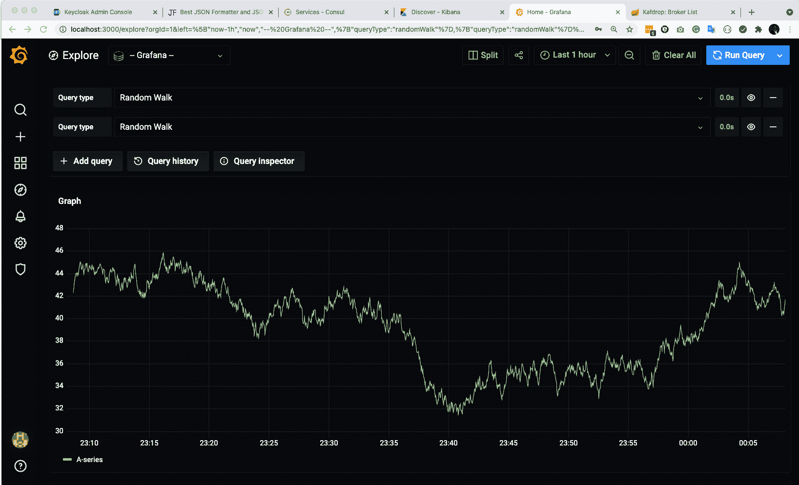

图 11.23 – 使用 Grafana 进行分布式监控

备注

Prometheus，默认用户名为 `admin`，密码为 `pass`。

+   `http://localhost:9411/zipkin/`。以下截图展示了 Zipkin 分布式跟踪的用户界面：

![Figure 11.24 – 使用 Zipkin 进行分布式跟踪

![img/Figure_11.24_B16585.jpg]

图 11.24 – 使用 Zipkin 进行分布式跟踪

+   `http://localhost:8888/auth/` 是将启动 Keycloak 的身份提供者，而 Keycloak 是身份提供者。

+   `http://localhost:9100/`。在这里，你可以使用 Kafdrop 查看集群：

![Figure 11.25 – Kafdrop 集群视图

![img/Figure_11.25_B16585.jpg]

图 11.25 – Kafdrop 集群视图

总体而言，我们已经测试了从网关到分布式监控、跟踪、日志记录和搜索的集成所有功能。有了这些，我们就完成了这一章。在本节中，我们学习了如何在生产中实现微服务。

# 摘要

在本章中，我们将前几章所学的内容综合起来。然后，我们深入探讨了构建企业级微服务的架构。我们还学习了微服务的扩展、不同类型的扩展及其优势。

本章增强了你的 Micronaut 微服务知识，以便你可以创建生产就绪的应用程序。它为你提供了所有必要的技能和专业知识。我们从微服务的基础开始，现在我们有了使用 Micronaut 创建企业级微服务的知识。我们希望你喜欢与我们一起学习的旅程。

# 问题

1.  在设计微服务时，你应该考虑哪些因素？

1.  列举一些设计模式。

1.  在微服务的设计阶段，你应该考虑哪些因素？

1.  在微服务的开发阶段，你应该考虑哪些因素？

1.  列举一些在部署阶段使用的工具。

1.  列举一些在管理和维护阶段使用的工具。

1.  有哪些不同的扩展类型？

1.  在微服务架构中使用了哪种类型的扩展？
