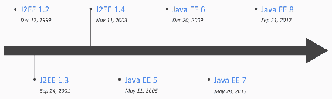
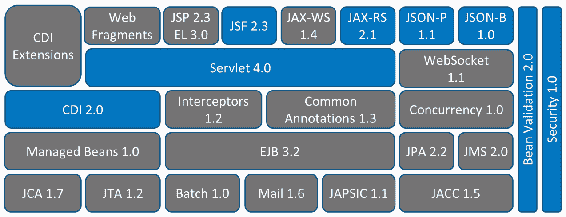
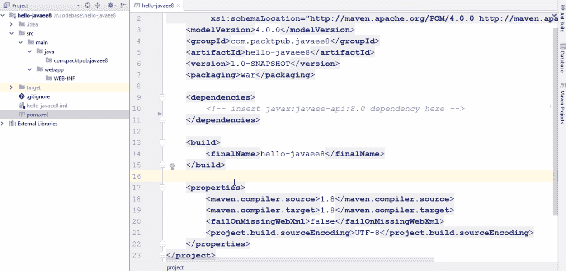
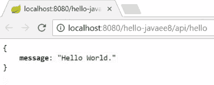
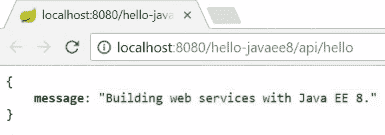
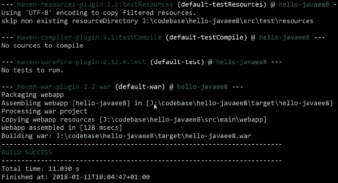
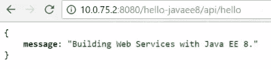
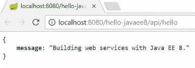

# 开始使用 Java EE 8

在本章的第一部分，你将了解为什么 Java EE 是一个构建轻量级、最前沿微服务的优秀平台。你将学习 Java EE 8 的不同 API 的最新进展，重点关注与微服务更相关的 API。然后，你将学习如何使用 Java EE 8 开发、构建、运行和打包你的第一个微服务。

本章包括以下部分：

+   为什么 Java EE 是微服务的良好平台？

+   Java EE 8 的新特性是什么？

+   开始使用 Java EE 8 微服务

+   使用 Docker 容器化 Java EE 8 微服务

# 技术要求

你需要基本的编程技能和一些 Java 知识。除此之外，你还需要一台装有现代操作系统的计算机，例如 Windows 10、macOS 或 Linux。我们将使用 Maven 3.5 作为我们的构建工具，并使用 Payara Server 作为我们的应用服务器。对于 Java 8 应用服务器，你需要 Docker for Windows、Mac 或 Linux，一个支持 Java EE 8 的 IDE，例如 IntelliJ，以及一个 REST 客户端，例如 Postman 或 SoapUI。

# 为什么 Java EE 是微服务的良好平台？

好吧，这就是问题所在，为什么？简短的答案是简单的：因为 Java EE 8 是目前最轻量级的企业框架。让我给你提供一些更多细节。首先，Java EE 是一个行业标准。它由一个供应商中立的委员会开发，由于 Java EE 已经存在几年了，所以广泛的知识已经存在。Java EE 由几个规范组成，这些规范有非常紧密的集成。此外，Java EE 采用了一种约定配置编程模型，这意味着你不再需要繁琐的 XML 描述符；只需添加几个注解即可完成。对于你将要开发的大多数服务，你将不需要任何外部依赖项，这导致部署工件很薄。最后，你还有现代应用服务器的可用性，这些服务器适合云时代。

# Java EE 版本历史

如果你查看 Java EE 版本历史，你可以在[`en.wikipedia.org/wiki/Java_Platform,_Enterprise_Edition`](https://en.wikipedia.org/wiki/Java_Platform,_Enterprise_Edition)找到它，你会发现自从 1999 年 12 月 12 日 J2EE 1.2 首次发布以来，我们已经走了很长的路。如果你查看以下图表的右侧，你可以看到 Java EE 8 于 2017 年 9 月 21 日发布，这意味着我们有 18 年的经验和 18 年的社区构建的知识。因此，它肯定是一个非常成熟且稳定的 API，一直在持续改进：



Java EE 版本历史

# Java EE 8 概述

在以下图中，您可以查看当前状态的 Java EE 8 概览，这里有大量的 API 可以编程使用，应该能满足任何企业级 Web 服务开发的绝大多数需求。您有 JPA 用于持久化，JMS 用于消息传递，结构良好的 JAX-WS 用于 Web 服务，JAX-RS 用于 REST 服务，以及许多其他可用于您现代企业级应用开发的 API：



Java EE 8 概述

您所需的所有代码如下，这是唯一的依赖项；这是 Java EE 8 API 的 Maven 依赖项，并且没有外部依赖项。您只需要 Java EE 8 和 Java 8；这导致生成的工件非常薄，从而加快了您的日常开发和部署周期，并且因为您有这些薄的 WAR 文件，这使得它非常适合 Docker：

```java
        <dependency>
            <groupId>javax</groupId>
            <artifactId>javaee-api</artifactId>
            <version>8.0</version>
            <scope>provided</scope>
        </dependency>
```

现在有些人说 Java EE 8，特别是应用服务，不应该放入 Docker 容器中，但那些沉重的时代已经过去了；现代应用服务器非常轻量级，看看 Payara 服务器或 WildFly Swarm，或者可能是 Open Liberty 或 Apache TomEE，以及其他各种应用服务器。这些服务器非常轻量级，并且肯定适合在 Docker 容器中运行。我希望到现在您已经相信 Java EE 8 确实是目前最轻量级的企业级框架。在下一节中，我们将查看 Java EE 8 的新特性。

# Java EE 8 的新特性是什么？

在本节中，我们将探讨 Java EE 8 的不同 API 和最新进展，重点关注与微服务相关的 API。我们将查看 JSR 370，即 JAX-RS 2.1；JSR 367，即 JSON 绑定；以及 JSR 374，即 JSON 处理的 Java API。

我们在“Java EE 8 概述”部分看到了 Java EE 8 中的不同 API。蓝色的是新增或改进的 API。我们看到 CDI 已升级到 2.0 版本，主要关注异步事件，Servlet API 已升级到 4.0 版本，增加了 HTTP2 支持。JSF 2.3，这是一个用于构建服务器端 UI 的 API，旧的 JSF 实例管理模型已被移除，并且已完全集成到 CDI 中。在上一个章节的图例右侧，您可以看到 Bean Validation API，它已升级到 2.0 版本。它与 CDI 紧密集成，并已重新设计以完全支持 Java 8 特性，如流和 lambda 表达式。还有一个全新的安全 API 用于云安全和过去的安全，增加了标准化的授权、认证机制和 API。在这里，我们想关注 JAX-RS 2.1、JSON-P 1.1 和 JSON-B 1.0。

让我们开始使用 JAX-RS 2.1。首先，它改善了与 CDI 的集成，因此所有的资源 bean 都得到了适当的 CDI 管理。它还与 JSON-B 紧密集成，用于 JSON 序列化，以及与 JSON-P 集成，用于 JSON 处理。此外，还添加了服务器端事件以实现推送通知。它们支持非阻塞 I/O，以及所有提供者，例如 JAX-RS 的过滤器拦截器。还有一个改进的 JAX-RS，它是一个支持完成阶段的同步客户端 API。如果您查看 Java API for JSON Processing，它已更新到版本 1.1 以支持 JSON Pointer 和 JSON Patch。它允许您编辑和转换您的 JSON 对象模型中的操作，并且 API 已更新以与 Java SE 8 功能一起工作，例如 lambda 和流。

新兴的 JSON-B，即 JSON 绑定 1.0 API，是转换 JSON 到 Java 对象以及反向转换的新标准方法。长期以来，我们已有 JSON-B 来执行同样的 XML 转换，而 JSON-B 就是用于 JSON 转换的 API。JSON-B 利用 JSON-P 并提供在其之上的转换层。它为将现有的 Java 类转换为 JSON 提供了默认的映射算法。通过使用 Java 注解，映射可以高度自定义，并且你可以插入不同的 JSON-B 运行时来将 Java 对象转换为 JSON 以及从 JSON 转换回来，例如 Jackson。这些都是与 Java EE 8 相关的最相关的 API，尤其是在开发 Web 服务方面。在下一节中，我们将开始学习 Java EE 8 微服务开发。

# 开始使用 Java EE 8 微服务

在本节中，我们将查看以下内容：

+   如何开发、构建和运行您的第一个 Java-EE-8 驱动的微服务

+   基本 Web 服务开发所需的 Java EE 8 依赖项

+   任何基于 JAX-RS 的 Web 服务的基本组件

+   使用 Payara Server 5 部署瘦 WAR 工件

让我们开始并深入代码。我已经准备好了我的 IDE 和一个原始的 Maven 项目框架。您在这里看到的是一个非常基础的 POM 文件：



然而，还有一些事情需要补充；首先，我们需要定义 Java EE 8 API 所需的依赖项。让我们来做这件事：

```java
        <dependency>
            <groupId>javax</groupId>
            <artifactId>javaee-api</artifactId>
            <version>8.0</version>
            <scope>provided</scope>
        </dependency>
```

我们指定`version`为`8.0`。我们还应该为这个定义适当的`scope`，在这种情况下是`provided`，因为 Java EE 8 API 将在以后由我们的应用服务器提供，并且我们已经完成了我们的依赖项。接下来，我们应该将一个`beans.xml`描述符添加到我们的 Web 应用的`WEB-INF`目录中：

```java
<?xml version="1.0" encoding="UTF-8"?>
<beans 

       xsi:schemaLocation="http://xmlns.jcp.org/xml/ns/javaee
                      http://xmlns.jcp.org/xml/ns/javaee/beans_1_1.xsd"
       bean-discovery-mode="all">
</beans>
```

我们这样做就完成了，接下来是什么？嗯，接下来我们应该启动我们的 JAX-RS 应用程序。现在让我们创建一个名为 `JAXRSConfiguration` 的类。名字实际上并不重要。重要的是这个类从 `Application` 基类扩展。记住在选择 `Application` 时 `javax.ws.rs.core` 包。同样重要的是您需要指定 `@ApplicationPath` 注解。这将是我们 REST API 可以访问的基础路径，因此我们称之为 `"api"`：

```java
package com.packtpub.javaee8;

import javax.ws.rs.ApplicationPath;
import javax.ws.rs.core.Application;

/**
 * Configures a JAX-RS endpoint.
 */
@ApplicationPath("api")
public class JAXRSConfiguration extends Application {
}
```

一旦我们启动了 JAX-RS，缺少的就是一个合适的 REST 资源。让我们创建一个名为 `HelloWorldResouce` 的类。我们使用了 `@Path` 注解，这将是我们可以在其下访问的资源路径。我们将称之为 `"hello"`。接下来，我们创建一个方法，一旦调用，将产生适当的响应，我们称之为 `helloWorld`。我们在这里使用适当的 `Response`。我们使用 `@GET` 注解来注释它，因为我们稍后将会发出 `GET` 请求，并且我们说它产生 `MediaType.APPLICATION_JSON`。然后我们返回 `Response.ok`，其中 `ok` 是当我们调用 `build` 时的 HTTP 响应状态 200。那么应该使用什么作为响应呢？我们将使用 `Map<String, String>` 作为我们的响应，并返回带有 `message` 键和 `Hello World` 值的 `singletonMap`：

```java
package com.packtpub.javaee8;

import javax.ws.rs.GET;
import javax.ws.rs.Path;
import javax.ws.rs.Produces;
import javax.ws.rs.core.MediaType;
import javax.ws.rs.core.Response;
import java.util.Map;

import static java.util.Collections.singletonMap;

/**
 * The REST resource implementation class.
 */
@Path("hello")
public class HelloWorldResource {
    @GET
    @Produces(MediaType.APPLICATION_JSON)
    public Response helloWorld() {
        Map<String, String> response = singletonMap("message", 
          "Building Web Services with Java EE 8.");
        return Response.ok(response).build();
    }
}
```

我们应该已经有一个非常简单的运行中的微服务。现在让我们将其部署到我们的 Payara Server 5 并运行它。我们将部署 WAR 文件，它已经被构建；您可以看到它已经被部署，部署耗时 5.1 毫秒。

让我们检查我们的浏览器。您应该看到 "Hello World." 消息，如下面的截图所示：



如果您不相信我，让我们只需将这里的值修改为 `"Building Web Services with Java EE 8."`。我们再次部署并更新我们的工件。新版本已经部署。让我们回到我们的浏览器中检查我们是否得到了适当的响应消息，如下面的截图所示：



本节内容到此结束；在下一节中，我将向您展示如何将您的 Java EE 8 微服务容器化。

# 容器化 Java EE 8 微服务

在本节中，我们将探讨如何使用 Docker 容器化和运行我们的 Java EE 8 微服务。我们将学习如何编写基本的 Dockerfile，我们还将看到如何使用 Payara Server 完整版和 Payara Server 微版构建和运行 Docker 镜像。让我们再次打开我们的 IDE，回到上一节中的微服务项目；这里缺少的是 `Dockerfile`，因此让我们创建一个。

现在的问题是：我们应该使用什么基础镜像？在使用 Payara 时，我们有两个基本选项：您可以使用完整的服务器镜像或 Payara 微版。让我们首先使用 Payara 的完整版本。`Dockerfile` 将如下所示：

```java
FROM payara/server-full:5-SNAPSHOT

COPY target/hello-javaee8.war $DEPLOY_DIR
```

在前面的 `Dockerfile` 中，我们提到我们正在使用 `payara/server-full`。我们需要使用正确的版本，在我们的例子中这是版本 `5-SNAPSHOT`，然后将我们的微服务的 `hello-javaee8.war` 文件复制到生成的镜像的正确位置。我们需要从 `target/hello-javaee8.war` 发出 `COPY` 命令，然后将其复制到部署目录，应该就是这样，让我们看看是否成功。我们打开控制台，确保我们处于正确的目录。我们检查一切是否打包得很好，为此我们调用 `mvn package` 以确保 WAR 文件处于正确的状态。如果是这样，你将看到我的东西在编译时运行，没有测试，WAR 文件是最新的：



我们使用 `-t` 构建 Docker，它指定了我们想要使用的标签，我们通过调用 `hello-javaee8` 并给它一个版本号，`1.0` 来做这件事：

```java
>docker build -t hello-javaee8:1.0 .
```

使用以下命令，让我们看看服务器是否启动：

```java
>docker run -it -p 8080:8080 hello-javaee8:1.0
```

我们将容器的端口 `8080` 映射到我们的 Docker 主机。你将看到 Payara GlassFish 服务器正在控制台中启动——这应该只需要几秒钟——然后我们应该看到我们的应用程序已部署。为了检查我们可以访问我们的 Web 服务，点击以下截图所示的 IP 地址。这是我的 Docker 主机端口 `8080` 的 IP 地址，我们可以访问我们的服务，这是成功的：



现在让我们停止它并删除此 `Dockerfile` 的内容。我想向你展示如何使用 Payara micro 版本。首先，我们需要更改 `FROM`。为此，我们使用这个镜像的不同基础标签（`payara/micro:5-SNAPSHOT`），然后将 `hello-javaee8.war` 文件复制到这个基础镜像的正确位置。接下来，我们将我们的 WAR 文件复制到 `target` 目录，并将其放置到 `/opt/payara/deployments`。这是 micro 版本基础容器的默认 `deployments` 目录。`Dockerfile` 应该如下所示：

```java
FROM payara/micro:5-SNAPSHOT

COPY target/hello-javaee8.war /opt/payara/deployments
```

切换回控制台并再次运行 Docker 构建命令：

```java
>docker build -t hello-javaee8:1.0 .
```

再次启动容器：

```java
>docker run -it -p 8080:8080 hello-javaee8:1.0
```

你可以看到控制台输出已改变，这次我们使用的是 Payara micro 运行时。这需要几秒钟来启动我们的 Web 服务，几秒钟后应该就完成了。我们可以看到我们的 `REST 端点` 可用。让我们再次检查。我们进入我们的管理控制台，可以看到我们有一个正在运行的容器。尝试从浏览器调用 Web 服务，如下面的截图所示：



我们可以看到一切运行正常，并且我们已经有一个正在运行的 Docker 化的 Web 服务版本。

# 摘要

在本章中，我们讨论了 Java EE 以及它是一个构建现代和轻量级 Web 服务的优秀平台的事实。我们查看了一下 Java EE 8 的不同 API 以及最新的进展，重点关注与微服务更相关的 API，例如 JAX-RS、JSON-B 和 JSON-P。然后我们开发了、构建并运行了我们的 Java EE 8 微服务，并将其本地部署到 Payara 服务器上。在最后一节中，我们使用 Docker 容器化和运行了我们的 Java EE 8 微服务。

在下一章中，我们将深入探讨使用相关的 JAX-RS API 构建同步 Web 服务和客户端。
