# 构建 Synchronous Web 服务和客户端

在本章中，我们将深入了解使用 Java EE 8 构建同步微服务的细节。我们将学习如何使用基本的 JAX-RS 注解实现服务器端 REST API，实现嵌套 REST API 的子资源定位器，并使用 HTTP 状态码和异常映射器进行异常处理。你还将学习如何使用 JAX-RS 客户端 API 实现客户端，最后，我们将探讨 Java EE 网络服务的不同测试策略。

本章将涵盖以下部分：

+   使用 JAX-RS 实现基本 REST API

+   使用子资源

+   JAX-RS 中的错误处理

+   使用 Java EE 8 实现网络服务客户端

+   测试 Java EE 8 网络服务

到本章结束时，我们将实现一个小型库微服务，该服务提供书籍、作者和借阅的 REST API。我们将实现库客户端作为一个独立的应用程序，并使用 Jersey 测试框架和 Test Containers 框架来测试我们的 REST API。

# 使用 JAX-RS 实现基本 REST API

在本节中，我们将探讨如何使用基本的 JAX-RS 注解实现 REST 资源。我会向你展示如何在 JAX-RS 资源实现中注入和使用 CDI 容器，并展示如何正确使用 HTTP 方法来模拟 CRUD 语义，当然我们将在 Docker 容器中运行我们的网络服务：

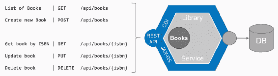

本节的概念视图

我们将实现一个 REST API 来获取书籍列表，这样我们就能创建新的书籍，通过 ISBN 获取书籍，更新书籍，以及删除书籍。

我们将创建一个基本的项目骨架，并准备一个简单的类，称为 `BookResource`，我们将使用它来实现我们书籍的 CRUD REST API。所以首先，我们需要使用适当的注解来注解我们的类。我们将使用 `@Path` 注解来指定书籍 API 的路径，即 `"books"`，并创建一个 `@RequestScoped` 的 CDI 容器。现在，为了实现我们的业务逻辑，我们想要使用另一个 CDI 容器，因此我们需要将其注入到这个容器中。这个其他 CDI 容器被称为 `bookshelf`，我们将使用常规的 CDI `@Inject` 注解来获取对 `bookshelf` 的引用。接下来，我们想要实现一个方法来获取所有书籍的列表，让我们来做这件事。你在这里看到的是我们有一个 `books` 方法，它被 `@GET` 注解，并产生 `MediaType.APPLICATION_JSON`，返回一个 JAX-RS 响应。你可以看到我们构建了一个 `ok` 的响应，即 HTTP 200；作为主体，我们使用 `bookshelf.findAll`，这是一个书籍集合，然后我们构建响应。`BookResource.java` 文件应该如下所示：

```java
@Path("books")
@RequestScoped
public class BookResource {

    @Inject
    private Bookshelf bookshelf;

    @GET
    @Produces(MediaType.APPLICATION_JSON)
    public Response books() {
        return Response.ok(bookshelf.findAll()).build();
    }
```

接下来，我们想要实现一个`GET`消息来获取特定的书籍。为了做到这一点，我们再次有一个`@GET`注解的方法，但这次我们有一个`@Path`注解，带有`"/{isbn}"`参数。为了获取这个参数，即所谓的`isbn`，我们使用`@PathParam`注解来传递值。我们使用`bookshelf`通过 ISBN 查找我们的书籍，并使用 HTTP 状态码 200，即`ok`返回找到的书籍：

```java
    @GET
    @Path("/{isbn}")
    public Response get(@PathParam("isbn") String isbn) {
        Book book = bookshelf.findByISBN(isbn);
        return Response.ok(book).build();
    }
```

接下来，我们想要创建书籍。为了创建某些内容，按照惯例，我们使用 HTTP `POST`作为方法。我们消费应用程序 JSON，并期望得到书籍的 JSON 结构，我们使用`bookshelf.create`与`book`参数一起调用，然后我们使用`UriBuilder`来构造新创建的`book`的 URI；这也是一个惯例。然后我们使用`Response.created`返回这个 URI，这与 HTTP 状态码`201`相匹配，我们将调用`build()`来构建最终的响应：

```java
    @POST
    @Consumes(MediaType.APPLICATION_JSON)
    public Response create(Book book) {
        if (bookshelf.exists(book.getIsbn())) {
            return Response.status(Response.Status.CONFLICT).build();
        }

        bookshelf.create(book);
        URI location = UriBuilder.fromResource(BookResource.class)
                .path("/{isbn}")
                .resolveTemplate("isbn", book.getIsbn())
                .build();
        return Response.created(location).build();
    }
```

接下来，我们将实现现有书籍的更新方法。为了更新内容，再次按照惯例使用 HTTP 方法`PUT`。我们通过指定位置来更新，再次使用`@Path`参数，其值为`"/{isbn}"`。我们在`update`方法参数中给出这个`isbn`的引用，并准备好我们书籍的 JSON 结构。我们使用`bookshelf.update`来更新书籍，并在最后返回状态码`ok`：

```java

    @PUT
    @Path("/{isbn}")
    public Response update(@PathParam("isbn") String isbn, Book book) {
        bookshelf.update(isbn, book);
        return Response.ok().build();
    }
```

最后，我们将实现删除消息，正如你所预期的，我们在已识别的 ISBN 路径上使用 HTTP 方法`DELETE`。在这里，我们再次使用`@PathParam`注解，我们调用`bookshelf.delete`，如果一切顺利，我们返回`ok`：

```java
    @DELETE
    @Path("/{isbn}")
    public Response delete(@PathParam("isbn") String isbn) {
        bookshelf.delete(isbn);
        return Response.ok().build();
    }
```

这是我们对书籍资源的 CRUD 实现。我告诉过你们，我们将使用 Docker 容器和 Payara Server 微版来运行一切。我们将把我们的 WAR 文件复制到`deployments`目录，然后我们就可以启动运行了：

```java
FROM payara/micro:5-SNAPSHOT

COPY target/library-service.war /opt/payara/deployments
```

让我们看看我们的 REST 客户端（Postman）上是否一切运行正常。

首先，我们获取书籍列表。如你所见，这按预期工作：

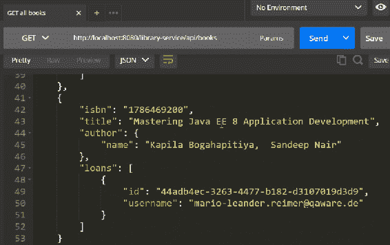

如果我们想要创建一本新书，我们发出`POST`和创建新书籍请求，你会看到一个状态码 OK 200。我们通过使用`GET 新书籍`来获取新书籍；这就是我们刚刚创建的书籍，如以下截图所示：

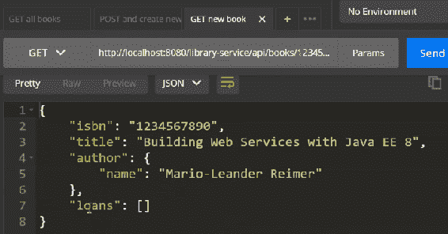

我们可以通过使用“更新新书籍”来更新书籍，我们将得到状态码 OK 200。我们可以再次使用`GET 新书籍`来获取更新后的书籍；我们得到更新后的标题，如以下截图所示：

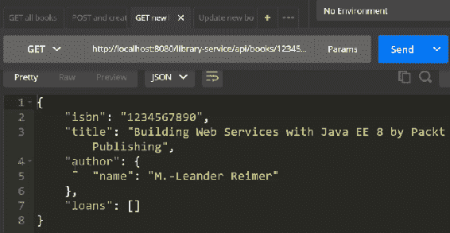

最后，我们可以删除书籍。当我们再次获取书籍列表时，我们新创建的书籍不再包含在书籍列表中。

在下一节中，我们将探讨如何使用子资源和子资源定位器。

# 使用子资源

在本节中，我们将探讨如何实现简单的子资源定位器方法。我们将看看如何从根资源获取 CDI 子资源实例，以及我们将探讨如何从根资源传递上下文信息到子资源：

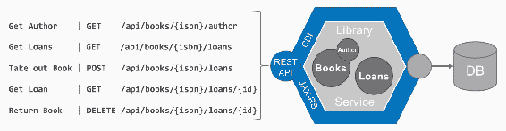

本节的概念视图

书籍有作者，并且可以被借出。在本节中，我们将提供特定的 REST 端点来获取书籍的作者和书籍的借阅详情。我们已经准备了项目的骨架，如下面的截图所示：

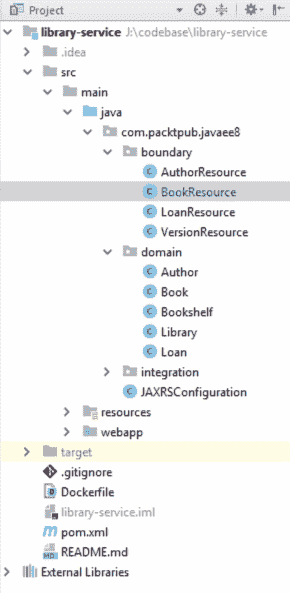

让我们从作者开始。在`BookResource.java`中添加一个资源定位器方法。资源定位器方法是一个简单的只使用`@Path`注解的方法。在这种情况下，我们使用`@Path("/{isbn}/author")`。资源定位器方法的`return`类型是另一个资源。在这种情况下，它是`AuthorResource`定位器方法。因此，我们创建了`AuthorResource`定位器：

```java
    @Path("/{isbn}/author")
    public AuthorResource author(@PathParam("isbn") String isbn) {
        Book book = bookshelf.findByISBN(isbn);
        return new AuthorResource(book);
    }
```

它生成`APPLICATION_JSON`。我们在构造函数中获取我们书籍的引用。接下来在这个子资源中，我们可以再次添加常用的`GET`、`POST`或`PUT`注解的 HTTP 方法。在这种情况下，我们有一个注解的`GET`方法，它获取我们书籍的作者：

```java
@Produces(MediaType.APPLICATION_JSON)
public class AuthorResource {
    private final Book book;

    AuthorResource(Book book) {
        this.book = book;
    }

    @GET
    public Author get() {
        return book.getAuthor();
    }
}
```

对于简单的资源来说，这非常直接，但如果我们想使用 CDI 注入呢？如果我们想这么做，我们需要采取不同的方法。首先，我们需要获取`ResourceContext`的引用；确保你使用的是正确的。通过使用这个`ResourceContext`，我们可以获取一个完全 CDI 注入的引用。再次，我们使用`@Path`注解，返回`loanResource`，这次我们使用了`LoanResource.class`中的`context.getResource`。这返回了一个完全注入的`loanResource`实例：

```java
@RequestScoped
public class BookResource {

    @Inject
    private Bookshelf bookshelf;
    @Context
    private ResourceContext context;

    @Path("/{isbn}/loans")
    public LoanResource loans(@PathParam("isbn") String isbn) {
        LoanResource loanResource =     
        context.getResource(LoanResource.class);
        loanResource.setIsbn(isbn);

        return loanResource;
    }
}

```

然后，我们使用`@Path("/{isbn}")`参数填充`LoanResource`。现在，重要的一点是：因为我们做了这件事，你真的需要确保这个实例是`@RequestScoped`。这是因为我们传递了`isbn`，在这里你可以实现我们需要的常规 REST 资源方法`LoanResource`。

在这个例子中，例如，我们将获取特定的贷款，我们可以返回一本书，我们可以借出一本书来创建一笔贷款。

如果我们切换到 REST 客户端（Postman），并想通过使用 GET book author 请求来获取书籍作者，点击发送后，只返回作者信息，如下面的截图所示：

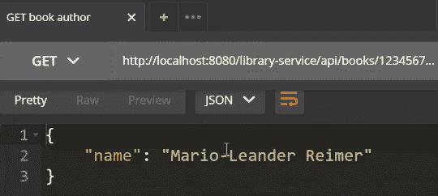

我们可以获取贷款列表，如下面的截图所示：

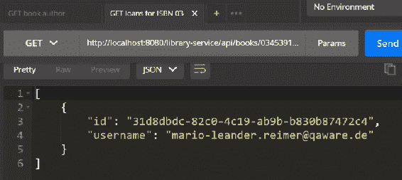

我们可以删除一笔贷款，这意味着这本书已经被归还，我们还可以添加新的贷款等等。

在下一节中，我们将介绍如何在 JAX-RS 中执行错误处理。

# JAX-RS 中的错误处理

在本节中，我们将通过使用适当的 HTTP 状态码以 RESTful 方式处理用户和服务器端错误，例如，对于无效和格式错误的请求，使用 HTTP 状态码 400 Bad Request，如果找不到某些内容，则使用状态 404 Not Found，如果发生意外情况，则使用 HTTP 状态码 500 Internal Server Error。我们还将看到如何使用`WebApplicationException`及其子类来模拟错误处理，最后我们将实现自定义的`ExceptionMappers`来处理运行时异常并返回自定义错误响应：

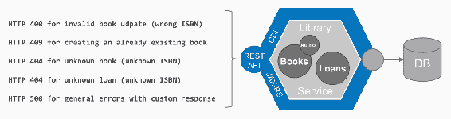

本节的概念视图

在本节中，我们将从概念上做以下事情：我们将通过几个 HTTP 状态码扩展我们的库微服务，例如，如果你发布了一个无效的书籍更新，则为 HTTP 400，对于创建已存在的书籍，为 409，对于未知书籍和借阅，为 404，对于具有自定义响应的一般错误，为 HTTP 状态码 500。

让我们切换到我们的 IDE，并再次回到`BookResource`。在这里，我们还没有对适当的错误处理给予太多关注。例如，在`bookshelf.create(book)`中，我们看到我们没有检查书籍是否已经存在。最简单的方法是在做任何工作之前进行检查。为此，我们使用`bookshelf`来检查书籍——更准确地说，是书籍的 ISBN——是否已经存在，如果存在，我们返回一个自定义状态码，并将状态设置为`CONFLICT`，即 409，错误响应将立即返回。这是最基本的错误处理形式，通过返回带有适当状态码的响应：

```java
    @POST
    @Consumes(MediaType.APPLICATION_JSON)
    public Response create(Book book) {
        if (bookshelf.exists(book.getIsbn())) {
            return Response.status(Response.Status.CONFLICT).build();
        }
```

对于`update`来说，我们也应该检查更新的 ISBN 是否与书的 ISBN 相匹配。我们在这里可以再次设置适当的状态码，在这种情况下是`BAD_REQUEST`，状态码为 400：

```java
 @PUT
 @Path("/{isbn}")
 public Response update(@PathParam("isbn") String isbn, Book book) {
 if (!Objects.equals(isbn, book.getIsbn())) {
            // return    
            Response.status(Response.Status.BAD_REQUEST).build();
```

还有其他方法可以做到这一点。你可以选择的一个不同方法是抛出一个`WebApplicationException`，它是 JAX-RS 的一部分。你给出一个原因，并给出一个状态码，再次是`BAD_REQUEST`。对于最常见的`WebApplicationException`类型，有预定义的子类；在这个`WebApplicationException`中，你可以看到有几个子类可用，并且已经有一个`BadRequestException`。

让我们使用`BadRequestException`代替，这样就完成了。这个`BadRequestException`会自动为我们设置状态码为 400：

```java
    @PUT
    @Path("/{isbn}")
    public Response update(@PathParam("isbn") String isbn, Book book) {
        if (!Objects.equals(isbn, book.getIsbn())) {
            // throw new WebApplicationException(
            "ISBN must match path parameter.", 
            Response.Status.BAD_REQUEST);
            throw new BadRequestException(
            "ISBN must match path parameter.");
        }
```

当然，还有许多其他可能发生的异常，例如自定义运行时异常和持久性异常，可能会抛出我们的 JPA 提供者。那么我们如何处理这些异常呢？最方便的方法是有一个`PersistenceExceptionMapper`实现。创建一个类并实现`ExceptionMapper`，并使用你想要处理的异常作为泛型类型。在这种情况下，是`PersistenceException`。

你需要做的第一件事是使用`@Provider`注解对其进行注释。完成这个步骤后，你可以实现自定义转换逻辑，将`PersistenceException`映射到实际的`Response`和期望的 HTTP 状态码。例如，如果异常是`EntityNotFoundException`的实例，我们将返回 404，即`NOT_FOUND`。在发生其他任何情况时，我们希望返回一个自定义的错误响应结构。在这种情况下，我们使用一个普通的`Map`，一个`HashMap`，并可能设置一个`code`和一个`type`。我们包括`message`，并将`Response`返回为`INTERNAL_SERVER_ERROR`，状态码为 500，并使用`type`作为`MediaType.APPLICATION_JSON`：

```java
@Provider
public class PersistenceExceptionMapper implements ExceptionMapper<PersistenceException> {
    @Override
    public Response toResponse(PersistenceException exception) {
        if (exception instanceof EntityNotFoundException) {
            return Response.status(Status.NOT_FOUND).build();
        } else {
```

```java
            Map<String, String> response = new HashMap<>();
            response.put("code", "ERR-4711");
            response.put("type", "DATABASE");
            response.put("message", exception.getMessage());

            return Response.status(Status.INTERNAL_SERVER_ERROR)
                    .entity(response)
                    .type(MediaType.APPLICATION_JSON).build();
        }
    }
}
```

如果我们切换到我们的 REST 客户端，我们就可以看到这些功能在实际中的运用。如果我们收到一本未知书籍，这应该会触发实体 404 `NOT_FOUND`异常，这是我们期望的结果。例如，如果我们对一个书籍发出错误的更新请求，我们期望 HTTP 状态码 400 Bad Request，如下截图所示：

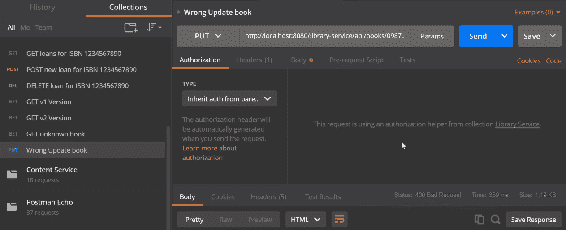

这就是错误处理的内容。

在下一节中，我们将讨论使用 Java EE 8 实现 Web 服务客户端。

# 使用 Java EE 8 实现 Web 服务客户端

在本节中，我们将探讨 JAX-RS 客户端 API 以及如何实现 Web 服务客户端。我将向您展示如何设置和配置一个 JAX-RS 客户端实例。我们将使用`WebTarget`及其构建器来指定请求行为，解析 URI 模板参数，在响应处理中进行调用，并使用`GenericType`实现来获取未反序列化的类型集合：

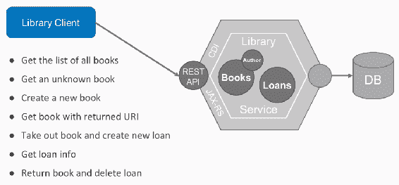

本节的概念视图

到目前为止，我们已经实现了我们的小型图书馆服务，它通过 REST API 支持书籍、作者和借阅。然后我们将实现一个图书馆客户端，这是一个独立客户端，用于获取书籍列表、未知书籍、创建书籍、获取带有返回 URI 的书籍等等。

让我们切换到我们的 IDE。我们将创建一个名为`LibraryServiceClient`的小类，这是我们独立的应用程序。我们首先需要做的是激活一些依赖项。最重要的是，我们希望使用`jersey-client`依赖项，我们还将使用`jersey-media-json-binding`依赖项。这是实现我们的独立应用程序所必需的：

```java
    <dependency>
        <groupId>org.glassfish.jersey.core</groupId>
        <artifactId>jersey-client</artifactId>
        <version>${jersey.version}</version>
        <scope>test</scope>
    </dependency>
    <dependency>
        <groupId>org.glassfish.jersey.inject</groupId>
        <artifactId>jersey-hk2</artifactId>
        <version>${jersey.version}</version>
        <scope>test</scope>
    </dependency>
    <dependency>
        <groupId>org.glassfish.jersey.media</groupId>
        <artifactId>jersey-media-json-binding</artifactId>
        <version>${jersey.version}</version>
        <scope>test</scope>
    </dependency>
```

我们需要做的第一件事是构建一个 JAX-RS 客户端实例，我们使用 `ClientBuilder` 来完成这个任务。在这里，当我们使用 `ClientBuilder.newBuilder` 时，我们指定了如 `connectTimeout` 和 `readTimeout` 等参数，我们还注册了 `JsonBindingFeature`，然后最后在构建器上调用 `build()` 方法。一旦我们有了 `client`，我们就可以用它来构建所谓的 `WebTarget`。`WebTarget` 基本上是我们将要与之通信的端点。我们使用 `client.target` 并提到 `localhost:8080`，因为我们的服务在本地运行在 `localhost:8080`。我们给出 `path("/library-service/api")`，这是我们的 REST API 的根：

```java
public class LibraryServiceClient {

    private static final Logger LOGGER = Logger.getAnonymousLogger();

    public static void main(String[] args) {
        // construct a JAX-RS client using the builder
        Client client = ClientBuilder.newBuilder()
                .connectTimeout(5, TimeUnit.SECONDS)
                .readTimeout(5, TimeUnit.SECONDS)
                .register(JsonBindingFeature.class)
                .build();

        // construct a web target for the library service
        WebTarget api = client
          .target("http://localhost:8080")
          .path("/library-service/api");
```

要获取书籍列表，我们可以使用这个 `WebTarget` 进行调用，在这里导入一些东西。我们做的是使用 `api.path("/books").request`，接受 `MediaType.APPLICATION_JSON`，然后我们获取一个书籍列表。因为这是一个泛型类型的列表，我们需要使用 `GenericType` 构造。

然后，我们创建一个 `GenericType` 子类，并将 `List<Book>` 指定为 `GenericType` 参数。如果我们想获取一本书，可能是一本未知的书呢？如果我们获取到一本未知的书，我们期望状态码为 404。同样，我们使用 `api.path("/books").path("/{isbn}")`；这是一个 `path` 参数。因此，我们使用特定的参数和值来解析模板。我们使用 `request`、`accept` 和 `get()`。通过调用 `get()`，我们只获取实际的 `response`，在 `response` 中，我们使用 `getStatus()`，它是 `404`：

```java
        LOGGER.log(Level.INFO, "Get list of books.");
        List<Book> books =  api.path("/books").request()
          .accept(MediaType.APPLICATION_JSON).get(bookList());
        books.forEach(book -> LOGGER.log(Level.INFO, "{0}", book));

        LOGGER.log(Level.INFO, "Get unknown book by ISBN.");
        Response response = api.path("/books")
          .path("/{isbn}").resolveTemplate("isbn", "1234567890")
          .request().accept(MediaType.APPLICATION_JSON).get();
        assert response.getStatus() == 404;
    private static GenericType<List<Book>> bookList() {
        return new GenericType<List<Book>>() {
        };
    }
}
```

如果我们想要创建书籍，我们可以以类似的方式完成。同样，我们创建一个新的书籍，在这里我们使用 `api.path("/books").requestMediaType.APPLICATION_JSON`，这指定了我们的有效负载的内容类型。我们使用 `post(Entity.json(book))` 并期望状态码为 201。如果您想要获取刚刚创建的书籍，我们可以做的是获取 `response` 的 `URI`。我们获取位置，然后再次使用客户端针对目标 URI，我们 `request()`，我们接受 `MediaType.APPLICATION_JSON`，并获取 `Book` 类的 POJO。在这种情况下，我们自动获取反序列化的书籍：

```java
        LOGGER.log(Level.INFO, "Creating new {0}.", book);
        response = api.path("/books")
          .request(MediaType.APPLICATION_JSON)
          .post(Entity.json(book));
        assert response.getStatus() == 201;

```

```java
        URI bookUri = response.getLocation();
        LOGGER.log(Level.INFO, "Get created book with URI {0}.", 
          bookUri);
        Book createdBook = client.target(bookUri)
          .request().accept(MediaType.APPLICATION_JSON)
          .get(Book.class);
        assert book.equals(createdBook);
```

这就是 JAX-RS 客户端 API 的基本工作原理。最后但同样重要的是，您不应该忘记关闭客户端（`client.close()`）以释放任何资源。如果您愿意，可以进行一些清理。也许我们想要删除之前创建的书籍。我们需要以下代码来删除书籍：

```java
        LOGGER.log(Level.INFO, "Delete book with URI {0}.", bookUri);
        response = client.target(bookUri).request().delete();
        assert response.getStatus() == 200;

        client.close();
    }
```

这一节的内容就到这里。在下一节，我们将讨论测试 Java EE 8 网络服务。

# 测试 Java EE 8 网络服务

在本节中，我们将探讨 Java EE 8 网络服务的不同测试策略。我们将讨论使用纯单元测试和模拟测试简单的 CDI 组件，使用 Jersey 测试框架测试 REST 资源，以及我们将看到如何使用 Test Containers 框架进行黑盒集成测试。

到目前为止，我们通过提供书籍、作者和借阅的 REST API 来实现我们的图书馆服务库。我们还实现了图书馆客户端。在本节中，我们将讨论测试。你可以在下面的图中看到测试金字塔。在底部是单元测试。中间层是服务层测试。

在最高层，你有 UI 层测试。Java EE 中的单元测试非常简单；你可以使用你的标准测试框架，如 JUnit 测试，并且你可能使用 Mojito 或其他模拟框架来模拟任何依赖项：

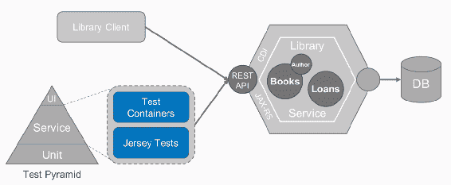

本节的概念视图

我们在这里不会关注单元测试。Java EE 中真正令人愉快的是我们可以如何进行服务级别测试。有两个框架：

+   Jersey Test Framework

+   Test Containers 框架

让我们同时使用它们。

# Jersey Test Framework

让我们从**Jersey Test Framework**开始。我们将切换到我们的 IDE，为了使用 Jersey Test Framework，你需要添加一个简单的依赖项，如下所示：

```java
    <dependency>
        <groupId>org.glassfish.jersey.test-  
          framework.providers</groupId>
        <artifactId>jersey-test-framework-provider-
          grizzly2</artifactId>
        <version>${jersey.version}</version>
        <scope>test</scope>
    </dependency>
```

Jersey 提供了几个测试提供者；在这种情况下，我们将使用`grizzly2`提供者。要使用这个测试框架，你需要做什么？首先，你需要实现一个测试类，比如`VersionResourceTest`，并且你需要让它继承`JerseyTest`超类。接下来你需要做的是重写`configure`方法，在这里你做的是构建一个`ResourceConfig`，并传递你想要测试的资源。在我们的例子中，我们想要测试`VersionResource`：

```java
public class VersionResourceTest extends JerseyTest {

    @Override
    protected Application configure() {
        ResourceConfig config = new  
          ResourceConfig(VersionResource.class);
```

下一步你可以做的是配置用于测试我们资源的客户端。这里的客户端实际上是我们在上一节中使用过的同一个，即`JsonBindingFeature`，一旦你完成了这个，你就可以实现实际的测试：

```java
    @Override
    protected void configureClient(ClientConfig config) {
        // for JSON-B marshalling
        config.register(JsonBindingFeature.class);
    }
```

如果我们要测试`v1`资源，我们可以做的是指定目标版本为`v1`。我们使用`request`和`target`，然后在返回的`response`上，我们可以指定我们通常的断言。然后，断言响应状态码为 200，并且字符串类型的实体包含字符串`"v1.0"`：

```java
    @Test
    public void v1() {
        Response response = target("/version/v1").request().get();
        assertThat(response.getStatus(), is(200));
        assertThat(response.readEntity(String.class), is("v1.0"));
    }
```

现在，让我们运行我们的测试。你可以看到这里，测试实际上启动了一个小的`grizzly`服务器，它部署了我们的资源，然后它实际上对资源发起了 HTTP 请求。这些都是适当的集成测试：

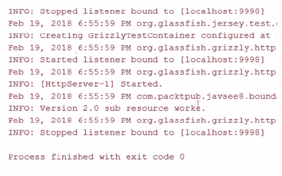

# Test Containers

让我们来看看下一个测试框架，它被称为**Test Containers**。我们需要添加以下两个依赖项来激活 Test Containers 框架：

```java
        <dependency>
            <groupId>org.testcontainers</groupId>
            <artifactId>testcontainers</artifactId>
            <version>1.5.1</version>
            <scope>test</scope>
        </dependency>
        <dependency>
            <groupId>org.slf4j</groupId>
            <artifactId>slf4j-simple</artifactId>
            <version>1.7.25</version>
            <scope>test</scope>
        </dependency>
```

Test Containers 背后的理念非常简单。由于我们无论如何都要在 Docker 容器中部署我们的 Web 服务，为什么不在测试期间也使用 Docker 容器呢？您需要添加的只是一个`@ClassRule`。我们创建`GenericContainer`，将其传递给`Dockerfile`，传递给我们要打包的 WAR 文件（`library-service.war`），我们可以指定一个`Wait`策略，一个`LogConsumer`，并暴露端口。所有这些代码所做的就是在测试开始时启动一个 Docker 容器：

```java
    @ClassRule
    public static GenericContainer container = 
      new GenericContainer(new ImageFromDockerfile()
            .withFileFromFile("Dockerfile", 
              new File(basePath(), "Dockerfile"))
            .withFileFromFile("target/library-service.war", 
              new File(basePath(), 
              "target/library-service.war")))
            .waitingFor(Wait.forHttp("
              /library-service/api/application.wadl")
                    .withStartupTimeout(Duration.ofSeconds(90)))
            .withLogConsumer(new Slf4jLogConsumer(
              LoggerFactory.getLogger(
              LibraryServiceContainerTest.class)))
            .withExposedPorts(8080)
            .withExtraHost("localhost", "127.0.0.1");
```

在`setUp`阶段，我们可以做的是像之前做的那样设置一个 JAX-RS 客户端实例，一旦我们有了客户端，我们就可以针对容器 URI 设置一个网络目标。我们可以请求我们的服务容器的 IP 地址和映射端口，一旦我们有了网络`target`，我们就可以使用 JAX-RS 客户端 API 与我们的微服务进行交互：

```java
    @Before
    public void setUp() {
        client = ClientBuilder.newBuilder()
                .connectTimeout(5, TimeUnit.SECONDS)
                .readTimeout(5, TimeUnit.SECONDS)
                .register(JsonBindingFeature.class)
                .build();

        String uri = String.format("http://%s:%s/library-service/api",
                container.getContainerIpAddress(),   
                  container.getMappedPort(8080));
        api = client.target(uri);
    }
```

现在，从您的控制台运行以下命令：

```java
>mvn integration-test
```

这所做的基本上是运行单元测试和集成测试。首先，Surefire 插件测试我们的版本资源，我们看到一切都在启动，它运行其他单元测试，打包 WAR 文件。Failsafe 插件将运行我们的容器集成测试。它将创建并启动容器；这可能需要相当长的时间。您可以在下面的屏幕截图中看到测试已成功完成：

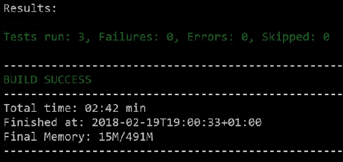

# 摘要

让我们总结一下本章所学的内容。我们查看了一些基本的 JAX-RS 注解，以便实现具有 CRUD 功能的 REST API。我们使用了顶级资源定位器来优雅地建模嵌套 REST API。我们使用了 HTTP 状态码和异常映射来进行错误处理。我们使用了 JAX-RS 服务客户端 API 来实现 Web 服务客户端。最后，我们探讨了使用几种方法测试基于 Java EE 8 的 Web 服务。我希望你喜欢这一章。在下一章中，我们将讨论使用 JSON-B 和 JSON-P 进行内容序列化。
