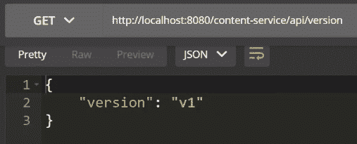
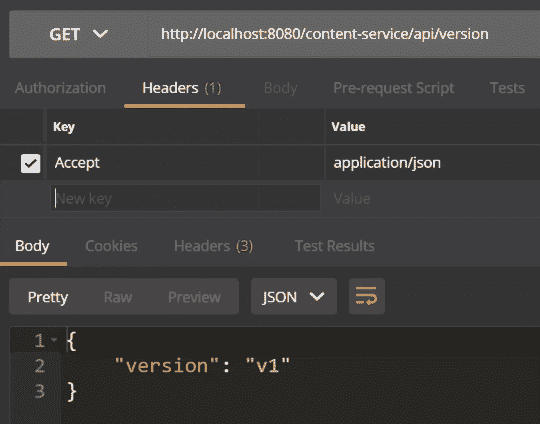
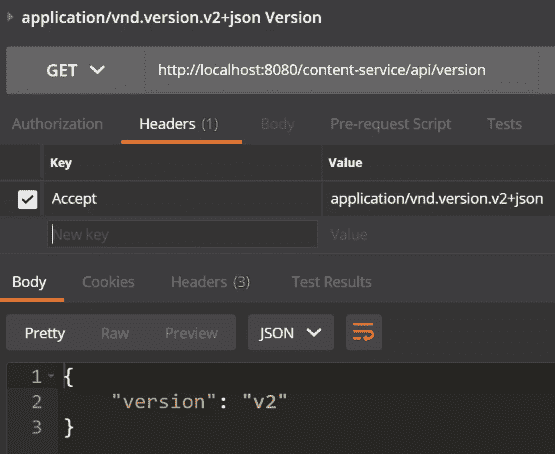
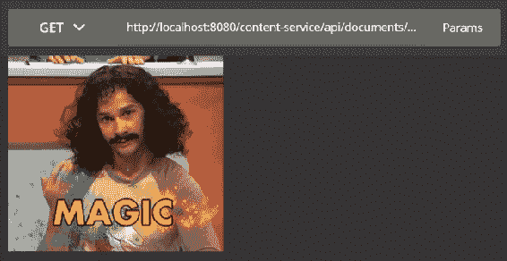
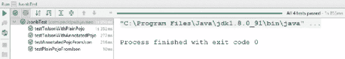
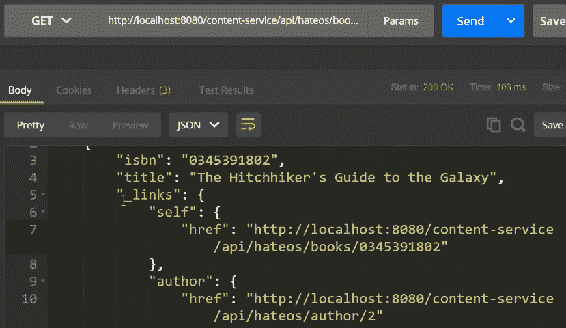
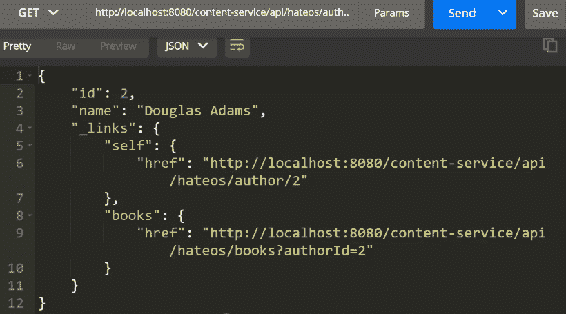
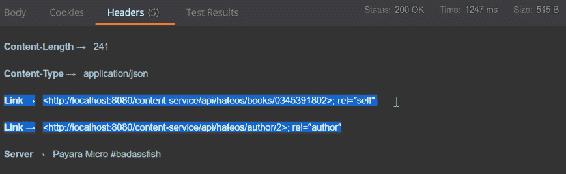

# 使用 JSON-B 和 JSON-P 进行内容序列化

在本章中，我们将重点关注 Web 服务的数据结构和有效载荷。您将学习如何正确使用内容类型和内容协商来为您的 Web 服务，如何使用新的 JSON-B API 进行简单的数据绑定，如何使用 JSON-P API 进行非常灵活的 JSON 处理，以及如何使用它来实现由超媒体驱动的 REST API。

本章将涵盖以下主题：

+   内容类型和内容协商简介

+   使用 JSON-B 进行简单数据绑定

+   使用 JSON-P 进行灵活的 JSON 处理

+   实现由超媒体驱动的 REST API

# 内容类型和内容协商简介

在本节中，我们将探讨如何使用`@Produces`和`@Consumes`注解来指定内容类型。我们还将了解使用自定义内容类型进行 API 版本控制，使用服务器质量因子进行智能内容协商，以及如何提供和上传二进制内容。

让我们切换到代码并打开我们的 IDE。让我们看看我们准备的小型 REST 服务。如您所知，您可以使用`@Produces`或`@Consumes`注解来指定您的 REST 服务将作为内容类型消费什么，以及您的 REST 服务将产生什么内容类型。我们在这里做的是指定`application/json`。这是我们通常做的事情。我们实现这个方法并返回一个包含状态码`ok`的简单`Map`。使用 JAX-RS，我们将确保这个`Map`被序列化为正确的 JSON：

```java
    @GET
    @Produces("application/json")
    public Response v1() {
        Map<String, String> version = 
          Collections.singletonMap("version", "v1");
        return Response.ok(version).build();
    }
```

如果我们想实现这个的第二版，我们可以通过实现名为`v2`的方法并返回不同的内容来实现：

```java
    @GET
    @Produces("application/json")
    public Response v2() {
        Map<String, String> version =    
          Collections.singletonMap("version", "v2");
        return Response.ok(version).build();
    }
```

现在，这里将无法正确工作，因为我们有两种方法产生相同的内容类型。我们可以做的是指定一个自定义的`MediaType`。我们将指定`MediaType v1`和`MediaType v2`的类型为`"application"`，并且我们将使用自定义子类型。我们有一个子类型用于版本一和 JSON 格式（`"vnd.version.v1+json"`），另一个子类型用于版本二和 JSON 格式（`"vnd.version.v2+json"`）：

```java
public class VersionResource {

    /**
     * MediaType implementation for the version resource in v1.
     */
    public static final MediaType V1 = new MediaType(
 "application", "vnd.version.v1+json");

```

```java
    /**
     * MediaType implementation for the version resource in v2.
     */
    public static final MediaType V2 = new MediaType(
 "application", "vnd.version.v2+json");
```

我们可以使用这些自定义内容类型`v1`和`v2`。既然这样，我们就有了使用内容类型的`v1`和`v2`的 API 版本。如果我们使用 API 版本，这就是它应该的样子。`v1`支持应用 JSON，也支持 JSON 格式的`v1`内容类型：

```java
    @GET
    @Produces({"application/json, 
      "application/vnd.version.v1+json"})
    public Response v1() {
        Map<String, String> version = 
          Collections.singletonMap("version", "v1");
        return Response.ok(version).build();
    }
```

如何让客户端指定或知道它接受哪种内容类型？基本上，他们可以为此特定内容类型指定接受头。如果他们没有指定，我们指定一个称为**服务器质量**的因子，即`qs`，`qs=0.75`和`qs=1`。如果客户端没有指定内容类型，`"application/vnd.version.v1+json"`将始终获胜，因为它具有更高的因子：

```java
    @GET
    @Produces({"application/json; qs=0.75", 
      "application/vnd.version.v1+json; qs=1.0"})
```

让我们来看看如何使用二进制内容。我们将准备两种方法：提供 JPEG 图像和 GIF 图像。我们只需打开一个文件并将文件发送回去：

```java
    @GET
    @Path("/me.jpg")
    @Produces("image/jpeg")
    public Response jpg() {
        String path = context.getRealPath("/me.jpg");
        return Response.ok(new File(path))
                .header("Content-Disposition", "attachment; 
                  filename=me.jpg")
                .build();
    }

```

```java
    @GET
    @Path("/magic.gif")
    @Produces("image/gif")
    public Response gif() {
        String path = context.getRealPath("/magic.gif");
        return Response.ok(new File(path)).build();
    }
```

我们还可以实现并上传一个机制，使用 HTTP `POST`方法。我们将消费`MULTIPART_FORM_DATA`。当你用一个名为`"file"`的参数引用表单，它是一个输入流以获取文件名时，你也可以引用`@FormDataParam`并使用`FormDataContentDisposition`：

```java
    @POST
    @Consumes(MediaType.MULTIPART_FORM_DATA)
    public Response upload(
      @FormDataParam("file") InputStream inputStream,
      @FormDataParam("file") FormDataContentDisposition fileInfo) {

        String fileName = fileInfo.getFileName();
        saveFile(inputStream, fileName);

        URI uri = uriInfo.getBaseUriBuilder()
          .path(DocumentsResource.class)
          .path(fileName).build();
        return Response.created(uri).build();
    }
```

现在，让我们打开我们的 REST API。我们不指定任何内容；我们只发送版本号并接收`"v1"`，这是默认设置：



我们还得到了`"v1"`，因为我在这里明确设置了 Accept 头：



要获得`"v2"`，我们必须指定包含`application/vnd.version.v2+json`内容类型的 Accept 头：



最后，我们可以看到 GIF 图像和 JPEG 的提供也是正常工作的。我们可以请求一个 GIF 图像，正如你所看到的，我们有内容类型的魔力：



在下一节中，我们将讨论使用 JSON-B 的简单数据绑定。

# 使用 JSON-B 的简单数据绑定

在本节中，我们将探讨如何使用 JSON-B 进行 JSON 和 POJO 数据结构的序列化和反序列化，如何在 POJO 上使用 JSON-B 注解，例如`@JsonbProperty`、`@JsonbNumberFormat`、`@JsonbDateFormat`、`@JsonbTransient`和`@JsonbPropertyOrder`，以及最后如何显式创建`JsonbConfig`和`Jsonb`实例使用`JsonbBuilder`。

让我们开始并切换到代码。我们将创建一个`JsonResource`类。这是我们基本的 REST 资源，我们想要实现我们的基本方法，从 POJO 返回 JSON 结构，以及从 JSON 结构反序列化我们的 POJO。

第一部分很简单；首先，我们实现一个基本的`@GET`方法。我们称之为`marshall`，它返回一个`JsonbPojo`。`JsonbPojo`是一个简单的 POJO 对象：它是一个简单的类。我们将使用`@Produces`应用 JSON 和 JAX-RS，Java EE 8 将确保这个 POJO 使用 JSON-B 正确地序列化为 JSON：

```java
@Produces(MediaType.APPLICATION_JSON)
public class JsonbResource {
    @GET
    public JsonbPojo marshall() {
        return jsonbPojo;
    }
```

反序列化也是如此。假设我们想要将一个`JsonbPojo`通过这个 REST 资源`POST`。在类级别上，我们确保使用`@Consumes`应用 JSON。如果你向这个 REST 资源`POST`一个合适的 JSON，JAX-RS 和 Java EE 8 将确保这个 JSON 结构被反序列化和反序列化为`JsonbPojo`：

```java
    @POST
    public void unmarshall(JsonbPojo pojo) {
        LOGGER.log(Level.INFO, "Default Unmarshalled {0}", pojo);
        this.jsonbPojo = pojo;
    }
```

如果你不喜欢默认的序列化，你可以自己处理序列化，使用`jsonb`实例。它提供了一个名为`toJson`的方法，你可以传递给任何对象，它将返回一个字符串作为输出，反之亦然。你可以这样说，它期望 JSON 字符串作为第一个参数，最终 POJO 的类作为第二个参数。如果你一切顺利，你会收到反序列化的对象：

```java
    @GET
    @Path("/custom")
    public String marshallCustom() {
        return jsonb.toJson(customJsonbPojo);
    }
```

让我们更详细地看看如何使用这个`jsonb`。在这里，我们将准备简单的单元测试。我们总能做的是创建并使用 JSON-B 独立，而不需要任何 JAX-RS 资源。你应该做的一件事是使用`JsonbConfig`并确保我们导入那里的一切。我们将创建一个新的`JsonbConfig`，在这个`JsonbConfig`上，我们可以设置几个参数。例如，你可以指定一个属性排序策略，其中我们使用`LEXICOGRAPHICAL`。你也可以在任何情况下指定`REVERSE`和`ANY`。我们可以指定是否要序列化 null 值，使用属性命名策略，在这种情况下，`LOWERCASE_CASE_WITH_DASHES`，我们可以指定生成的 JSON 是否格式化，可以指定默认的日期格式，可以指定如何处理二进制数据，并且可以指定全局区域设置。使用`jsonbConfig`非常直接；我们使用 JSON-B 构建器（`JsonbBuilder`）并调用其上的`create`方法，并传递`create`（`jsonbConfig`）：

```java
    @Before
    public void setUp() throws Exception {
        JsonbConfig jsonbConfig = new JsonbConfig()
                .withPropertyOrderStrategy(
                  PropertyOrderStrategy.LEXICOGRAPHICAL)
                .withNullValues(true)
                .withPropertyNamingStrategy(PropertyNamingStrategy
                   .LOWER_CASE_WITH_DASHES)
                .withFormatting(false)
                .withDateFormat("dd.MM.yyyy", Locale.GERMANY)
                .withBinaryDataStrategy(BinaryDataStrategy.BASE_64)
                .withLocale(Locale.GERMANY);

        jsonb = JsonbBuilder.create(jsonbConfig);
    }
```

一旦我们获得了这个 JSON-B 实例，在测试方法中，我们使用`jsonb.toJson(pojo)`并从 JSON 中获得字符串 JSON-B。传递字符串数据和想要转换成的类，`pojo`将被返回：

```java
    @Test
    public void testToJsonWithPlainPojo() {
        PlainPojo pojo = PlainPojo.create();
        String json = jsonb.toJson(pojo);
        assertThat(json).isEqualTo(PLAIN_POJO_JSON);
    }
```

这适用于普通的 POJO 以及未被特别注解的 POJO。如果我们想覆盖这些默认配置，我们可以像之前一样使用`@JsonbPropertyOrder`注解我们的 POJO。例如，为了指定非常明确的属性顺序，我们可以使用`@JsonbProperty`来给它一个不同的名称，使用`@JNumberFormat`来指定要使用的数字格式，使用`@JsonbDateFormat`来指定不同的日期，或者使用`@JsonbTransient`，这告诉 JSON-B 在序列化和反序列化过程中忽略这个属性：

```java
    @JsonbPropertyOrder(value = {"message", 
      "answerToEverything", "today"})
    public static class AnnotatedPojo {
        @JsonbProperty(value = "greeting", nillable = true)
        public String message;

        @JsonbNumberFormat("#,##0.00")
        public Integer answerToEverything;

        @JsonbDateFormat("MM/dd/yyyy")
        public LocalDate today;

        @JsonbTransient
        public BigDecimal invisible = BigDecimal.TEN;
```

让我们运行这个测试。我们的测试应该如以下截图所示，希望是绿色的：



在本节中，我们看到了使用 JSON-B 实际上非常简单直接。在下一节中，我们将讨论使用 JSON-P 的灵活 JSON 处理。

# 使用 JSON-P 进行灵活的 JSON 处理

在本节中，我们将探讨使用 JSON-P 构建器来构建 JSON 数组和对象。我们将看到如何在 REST 资源中使用 JSON-P 进行序列化和反序列化数据，如何使用 JSON 指针访问 JSON 结构，并更详细地看看 JSON Patch 和 JSON Diff 如何修改 JSON 结构。我们还将使用`@PATCH`注解和`application/json-patch+json`内容类型在我们的 REST 资源中应用补丁，所以接下来有很多内容。

让我们开始吧。像往常一样，我们准备一个小型的 REST 资源作为模板来开始。我们首先做的事情是使用相关的构建器创建 JSON 和 JSON 对象的数组，所以让我们来做这件事：

```java
    public void testJsonBuilder() {
        JsonArray values = Json.createArrayBuilder()
                .add(Json.createObjectBuilder()
                        .add("aString", "Hello Json-P 1")
                        .add("aInteger", 42)
                        .add("aBoolean", false)
                        .add("aNullValue", JsonValue.NULL)
                        .build())
```

在这里，我们使用 `createArrayBuilder` 创建一个数组构建器，并使用 `add` 方法添加 JSON 对象。在这里，你可以使用 `Json.createObjectBuilder` 获取一个对象构建器。在这个对象构建器上，我们然后调用不同的 `add` 方法来添加一个字符串、一个整数、一个布尔值或者可能使用特殊的 `JsonValue` 添加一个 null 值。就是这样。使用这两个构建器，你可以相当容易地创建复杂的 JSON 结构。

我们该如何处理这个呢？我们首先做的事情是返回 `jsonArray`；这实际上是非常直接的。你可以明确并直接返回这个 `jsonArray` 以进行序列化。为此，我们将生成一个 `APPLICATION_JSON` 作为我们的内容类型，JAX-RS 将确保我们的 `jsonArray` 被序列化和打包到相应的 JSON 结构中：

```java
@Produces(MediaType.APPLICATION_JSON) 
   @GET
    public JsonArray marshall() {
        return jsonArray;
    }
```

如果我们想使用 JSON-P 反序列化数据，情况也是一样的。我们将消费 `APPLICATION_JSON`，获取基本为 `jsonBody` 的 `InputStream`，然后我们将使用 `JsonReader`。在这里，我们将从 `InputStream` 使用 `Json.CreateReader(jsonBody)` 获取一个 `JsonReader`，并在 `reader` 上读取数组：

```java
    @POST
    @Consumes(MediaType.APPLICATION_JSON)
    public void unmarshall(InputStream jsonBody) {
        JsonReader reader = Json.createReader(jsonBody);
        this.jsonArray = reader.readArray();

        LOGGER.log(Level.INFO, "Unmarshalled JSON-P {0}.", jsonArray);
    }
```

让我们看看 JSON-P 中还有什么。首先，有 JSON 指针。让我们来看看 JSON 指针。假设我们有一个简单的 JSON 结构。在这个测试中，我们将使用一个字符串创建一个读取器，并从读取器获取一个 `JsonObject` 和一个 `JsonArray`：

```java
    @Test
    public void testJsonPointer() {
        JsonReader jsonReader = Json.createReader(new StringReader("
          {\"aString\":\"Hello Json-P\",\"arrayOfInt\":[1,2,3]}"));
        JsonObject jsonObject = jsonReader.readObject();
        JsonArray jsonArray = jsonObject.getJsonArray("arrayOfInt");
```

如果我们想通过索引访问数组值怎么办？为此，我们使用 JSON 指针。我们将使用 `Json.createPointer`，并且使用这个注解基本上指定了我们想要引用的路径和值的索引。我们还将创建一个 `jsonPointer`，并在 `jsonPointer` 上设置 `getValue` 并传递 `JsonObject`：

这样做，我们将得到一个 `jsonValue`，我们可以做的是检查 `JsonNumber` 和 `jsonArray` 实例的值是否正确：

```java
        // access an array value by index
        JsonPointer jsonPointer = Json.createPointer("/arrayOfInt/1");
        JsonValue jsonValue = jsonPointer.getValue(jsonObject);
        assertThat(jsonValue).isInstanceOf(JsonNumber.class);
        assertThat(jsonValue).isEqualTo(jsonArray.get(1));
```

我们还可以使用 JSON 指针替换数组中的对象，例如，或者在 JSON 结构中。我们使用 `jsonPointer.replace`，给它原始的 `jsonObject`，并指定我们想要用 `createValue(42)` 替换指针值的新的 `createValue(42)` 值：

```java
        // replace the array value by index
        jsonObject = jsonPointer.replace(jsonObject, 
          Json.createValue(42));
        jsonArray = jsonObject.getJsonArray("arrayOfInt");
        assertThat(jsonArray.getInt(1)).isEqualTo(42);
```

我们还可以使用 JSON 指针从 JSON 的结构中删除内容。在这里，我们可以在 `remove(jsonObject)` 上使用 JSON 指针，并返回一个新的 JSON 对象。如果我们检查 JSON 数组，其大小将小于之前：

```java
        // remove the array value by index
        jsonObject = jsonPointer.remove(jsonObject);
        jsonArray = jsonObject.getJsonArray("arrayOfInt");
        assertThat(jsonArray.size()).isEqualTo(2);
    }
```

关于 JSON-P 的另一件事是 JSON Patch。我们首先创建一个 JSON 对象，一个 `jsonReader`，传递一个字符串，并从读取器中读取对象。我们将创建一个 `JsonPatch`。为此，我们将使用 `createPatchBuilder`，在 `patch` 中我们想要说的是，请将元素 `"/aString"` 替换为 `"Patched Json-P."` 值，并请从 `"/arrayOfInt/1"` 中删除它。因此，你可以使用 JSON Patch 来指定修改操作，例如替换、删除和向 JSON 结构中添加值。在 `patch` 上，我们调用 `apply` 方法，并将其作为参数传递给我们要应用补丁的 JSON 结构。这将返回一个新的和修改后的 JSON 对象。在这里，我们可以确保修改是正确完成的：

```java
    @Test
    public void testJsonPatch() {
        JsonReader jsonReader = Json.createReader(
          new StringReader("{\"aString\":
            \"Hello Json-P\",\"arrayOfInt\":[1,2,3]}"));
        JsonObject jsonObject = jsonReader.readObject();

        JsonPatch patch = Json.createPatchBuilder()
                .replace("/aString", "Patched Json-P.")
                .remove("/arrayOfInt/1")
                .build();

        jsonObject = patch.apply(jsonObject);
        assertThat(jsonObject.getString("aString"))
          .isEqualTo("Patched Json-P.");
        assertThat(jsonObject.getJsonArray("arrayOfInt")
          .size()).isEqualTo(2);
    }
```

另一件相当不错的事情是 JSON Diff 功能。假设我们有一个 `source` 和一个 `target` 对象。如你所见，它们都有一种相似之处——都有一个名为 `"aString"` 的元素，但值不同。我们接下来要做的是创建一个 `diff`，比如 `Json.createDiff(source, target)`，我们得到的是一个 `JsonPatch`，它描述了需要应用到 `source` 上的必要更改，以便我们可以得到 `target` 对象。如果我们查看我们的 JSON Diff，我们可以看到所需的所有操作只是一个 `replace` 操作。对于以下路径，我们对 `"/aString"` 做同样的操作，我们需要将 `"value"` 替换为 `"xyz"`。如果我们将这个补丁应用到 `source` 对象上，我们得到 `target` 对象，我们通过将 `diff` 应用到 `source` 上来实现这一点。我们得到一个新的对象，并断言 `source` 等于 `target`：

```java
    @Test
    public void testJsonDiff() {
        JsonObject source = Json.createObjectBuilder()
          .add("aString", "abc").build();
        JsonObject target = Json.createObjectBuilder()
          .add("aString", "xyz").build();

        JsonPatch diff = Json.createDiff(source, target);
        JsonObject replace = diff.toJsonArray().getJsonObject(0);
        assertThat(replace.getString("op")).isEqualTo("replace");
        assertThat(replace.getString("path")).isEqualTo("/aString");
        assertThat(replace.getString("value")).isEqualTo("xyz");

        source = diff.apply(source);
        assertThat(source).isEqualTo(target);
    }
```

你也可以在你的 JAX-RS 资源中使用 JSON Patch。为此，我们必须使用以下两个注解。首先，我们使用 `@PATCH` 并指定 `@Consumes` 的媒体类型为 `APPLICATION_JSON_PATCH_JSON`。我们发送的结构是一个 `JsonArray`，然后从该 `JsonArray` 中创建一个 `jsonPatch`，我们可以用它来应用到我们的数据结构中：

```java
    @PATCH
    @Consumes(MediaType.APPLICATION_JSON_PATCH_JSON)
    public void patch(JsonArray jsonPatchArray) {
        LOGGER.log(Level.INFO, "Unmarshalled JSON-P Patch {0}.", 
          jsonPatchArray);

        JsonPatch jsonPatch = Json.createPatchBuilder(jsonPatchArray)
          .build();
        this.jsonArray = jsonPatch.apply(jsonArray);
        LOGGER.log(Level.INFO, "Patched {0}.", jsonArray);
    }
}
```

这一部分涵盖了 JSON-P 的内容很多。在下一节中，我们将使用我们迄今为止所学的内容来实现一个超媒体驱动的 REST API。

# 实现超媒体驱动的 REST API

在本节中，我们将探讨如何使用超媒体（带有链接和 URI）遍历 REST 资源。我们将看到如何使用 JSON-P 构建超媒体启用的 JSON 结构。我们将使用 `@Context` 和 `UriInfo` 对象来程序化地构建资源 URI。我们还将查看如何在 HTTP 响应中设置带有 URI 的链接头。

让我们开始吧，切换到我们的 IDE。我们将准备一个资源，这个资源将提供书籍和作者；它们都是独立的 REST 资源。显然，书籍是由作者写的，所以我们应该能够从书籍导航到作者，反之亦然。这就是我们可以使用超媒体的地方。

导航到我们的书籍资源。在这里，我们有为特定书籍提供的方法。首先，我们将获取书籍，然后我们可以为这本书构造 URI。`createBookResourceUri` 是用于引用这本书的 URI：

```java
        @GET
        @Path("/{isbn}")
        public Response book(@PathParam("isbn") String isbn) {
            Book book = books.get(isbn);
            URI bookUri = createBookResourceUri(isbn, uriInfo);
            URI authorUri = createAuthorResourceUri(book
              .authorId, uriInfo);
            return null;
        }
```

我们还想要为这本书构造作者 URI。如果您查看这里的一个方法，您会看到我们使用`uriInfo`对象，并从中获取一个基本 URI 构建器。然后，我们使用`path`方法来实际构建最终的 URI。使用这些`path`方法，我们可以从资源的`@Path`注解和资源方法中构建路径：

```java
    static URI createAuthorResourceUri(Integer authorId, 
      UriInfo uriInfo) {
        return uriInfo.getBaseUriBuilder()
                .path(HateosResource.class)
                .path(HateosResource.class, "author")
                .path(AuthorResource.class, "author")
                .build(authorId);
    }
```

在最终结果中，我们有一个引用实际资源的 URI：

```java
            URI authorUri = createAuthorResourceUri(book
              .authorId, uriInfo);
```

接下来，我们要做的是从`bookUri`创建一个 JSON 对象，这正是超媒体发挥作用的地方。让我们看看它们。我们将使用 JSON-P 创建一个对象构建器，并向其中添加`"isbn"`和`"title"`。然而，这里缺少一个部分，这个部分使得最终的超媒体启用 JSON 结构。我们将添加一个额外的对象，称为`"_links"`，这是一个 JSON 对象，它包含两个其他 JSON 对象，分别称为`"self"`和`"author"`。`"self"`描述了 REST 资源的 URI 本身，在这种情况下是书籍类型。然后，我们指定`"author"`，并给它一个指向`authorUri`的`"href"`属性：

```java
        private JsonObject asJsonObject(Book book, URI bookUri, 
          URI authorUri) {
            return Json.createObjectBuilder()
                    .add("isbn", book.isbn)
                    .add("title", book.title)
                    .add("_links", Json.createObjectBuilder()
                            .add("self", Json.createObjectBuilder()
                                    .add("href", bookUri.toString()))
                            .add("author", Json.createObjectBuilder()
                                    .add("href", 
                                      authorUri.toString())))
                    .build();
        }
```

最后，我们返回 JSON 对象，在`response`对象上，您也可以设置 HTTP 链接头，这样您就有两种选择。您可以在 HTTP `response`中指定链接头，或者嵌入 URI，这在这里添加了一个链接 JSON 结构。我们已经完成了书籍。

我们几乎可以对作者做同样的事情；这段代码几乎是复制粘贴的。这遵循相同的程序：我们获取作者，然后为作者和书籍构造 URI。我们在将要嵌入`"self"`链接的 JSON 对象中构建我们的 JSON 对象，`"self"`是`"books"`本身，并为`booksUri`做同样的事情。最后，您返回这个 JSON 对象的响应，我们还可以嵌入`link` HTTP 头。

现在，让我们测试这个 API。打开我们的 Postman，对书籍列表发出`GET`请求。在这里，您将看到书籍有一个标题，它还包含一个链接列表。对于`"self"`，这是书籍本身，对于`"author"`，我们得到书籍的作者，如下面的截图所示：



让我们点击书籍，即`"self"`中存在的 URI，以获取这本书的特定信息。如您所见，这返回了一个单独的书籍结构。如果您想导航到作者，我们可以使用作者链接。在这里，我们有这本书的作者，如下面的截图所示：



如果我们想获取这位作者所写的书籍列表，我们可以使用`"books"`链接，该链接从这位作者的 ID 获取所有书籍，如前一张截图所示。

如果你想要再次查看这本书，你可以从这两本书中进行导航。你还可以在这里的头部看到，我们有两个链接，一个是作者的链接，另一个是书籍本身的链接：



# 摘要

让我们总结一下本章所学的内容。首先，我们探讨了如何在我们的 Web 服务中使用自定义内容类型和内容协商。接下来，我们了解了 JSON-B 以及如何使用它来轻松地将你的 POJOs 与 JSON 进行数据绑定。我们还探讨了 JSON-P，这是一种非常灵活的 JSON 处理方式，以及如何使用 JSON-P 创建 JSON 结构和回溯这些结构。然后，我们研究了如何使用 JSON Pointers、JSON Patch 和 JSON Diff 进行更灵活的 JSON 处理，最后，我们探讨了使用 JSON-P 和`UriInfo`实现具有超媒体功能的 REST API。

在下一章中，我们将讨论构建异步 Web 服务。
