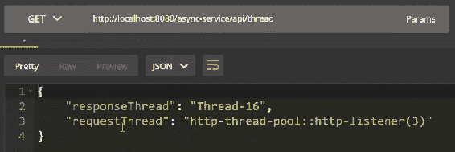
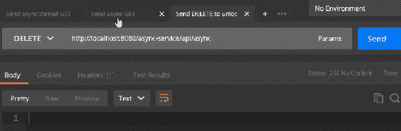
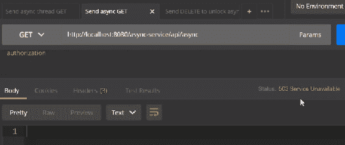
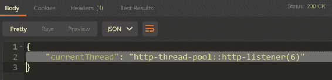
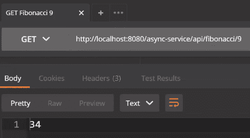
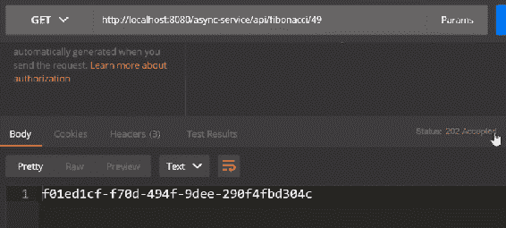
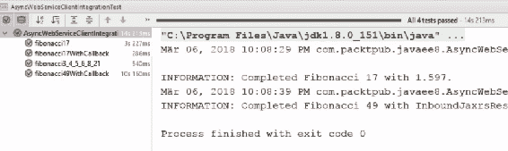

# 构建异步 Web 服务

在本章中，我们将讨论异步处理的动机和原因。然后，我们将看到使用 JAX-RS 的基本异步 Web 服务实现。然后，我们将探讨使用`ManagedExecutorService`和服务器端回调来改进我们的实现。最后，我们将使用异步 JAX-RS API 客户端进行 REST 调用，并探讨异步处理的好处和用例。

本章包括以下部分：

+   异步处理的好处和用例

+   实现异步 Web 服务

+   使用`ManagedExecutorService`和服务器端回调

+   实现异步 Web 服务客户端

# 异步处理的好处和用例

在本节中，我们将探讨异步请求处理的动机和原因以及为什么这对您很重要。我需要告诉您的是，*免费午餐结束了！并发很重要*。

让我们看看以下图表：


我们可以看到处理器上的晶体管数量一直在增加；然而，自 2004 年以来，时钟速度基本上保持不变。这意味着您需要更并发才能获得更多速度，我们通常通过使用线程来实现这一点。

默认情况下，服务器上的请求处理通常以同步模式工作，这意味着每个请求都在单个 HTTP 线程中处理。这是我们习惯的；我们有一个线程，并在其中执行请求响应。不幸的是，线程非常昂贵，所以在高负载和大量并发连接的情况下，有很多浪费的资源，服务器扩展得并不好。幸运的是，我们有异步处理选项。

# 基本思想

异步处理的基本思想是使用不同的线程池来分离我们的请求 I/O 线程和请求处理线程。这基本上让我们的 I/O 线程在处理不同线程上的处理时接收新的连接。

# 目标

最终目标是通过对或减少上下文切换的使用来节省内存并提高我们应用程序的性能，我们还可以通过基本上将请求 I/O 与请求处理分离来提高吞吐量。

这些是主要动机和原因。在下一节中，我们将讨论实现异步 Web 服务。

# 实现异步 Web 服务

在本节中，我们将探讨实现异步 REST 资源。我们将看到`@Suspended`注解和`AsyncResponse`类的基本用法。我们将查看在另一个线程中处理和恢复`AsyncResponse`实例，并且我们还将讨论异步响应的基本超时处理。

让我们开始并切换到代码。像往常一样，我们准备了一些模板以开始。首先，我想向你展示异步资源的基本结构——看看签名。你所需要做的就是实现一个至少有一个参数使用`@Suspended`注解的`public void`方法。作为类型，它使用由 JAX-RS API 提供的`AsyncResponse`类：

```java
    @GET
    public void calculate(@Suspended final AsyncResponse 
      asyncResponse) {
```

让我们从实现开始。

我们想在单独的线程中做一些重量级的处理。首先，我们将启动一个新线程，并在该线程中进行计算。为了模拟一些重量级的处理，我们将让它休眠三秒钟，然后产生一些输出。为此，我们返回请求线程（`requestThreadName`）。我们还需要当前线程的名称，我们使用`getCurrentThreadName`来获取它：

```java
        asyncResponse.setTimeout(5, TimeUnit.SECONDS);

        final String requestThreadName = getCurrentThreadName();

        new Thread(() -> {
            try {
                // simulate heavy processing here
                TimeUnit.SECONDS.sleep(3);
            } catch (InterruptedException e) {
                LOGGER.log(Level.WARNING, "Could not wait for 3s.", e);
            }
            final String responseThreadName = getCurrentThreadName();
```

最后，我们从`requestThread`和`responseThread`构建一个`response`：

```java
            Map<String, String> response = new HashMap<>();
            response.put("requestThread", requestThreadName);
            response.put("responseThread", responseThreadName);

            asyncResponse.resume(Response.ok(response)
              .build());
        }).start();
    }
```

这是异步 REST 资源的结构基础。我们启动一个新线程，处理它，构建一个`response`，最后，我们在`response`上调用`resume`方法。

为了稍微复杂一些，我们可以使用`BlockingQueue`，并且有一个名为`lock`的方法，它接受带有`@Suspended`注解的异步响应。我们希望将异步响应保存到队列中：

```java
    private LinkedBlockingQueue<AsyncResponse> responses = 
      new LinkedBlockingQueue<>();

    @GET
    public void lock(@Suspended final AsyncResponse asyncResponse) 
      throws InterruptedException {
        String currentThreadName = getCurrentThreadName();
        LOGGER.log(Level.INFO, "Locking {0} with thread {1}.", 
          new Object[]{asyncResponse, currentThreadName});

        responses.put(asyncResponse);
```

在`AsyncResource`类中，我们有一个`unlock`方法，我们想在当前锁定响应上恢复处理。我们从队列中获取`asyncResponse`——这将从队列中拉出异步响应——然后我们在`response`上调用`resume`方法。这将基本上恢复之前锁定的请求：

```java
    @DELETE
    public Response unlock() {
        String currentThreadName = getCurrentThreadName();
        AsyncResponse asyncResponse = responses.poll();

```

```java
        if (asyncResponse != null) {
            LOGGER.log(Level.INFO, "Unlocking {0} with thread {1}.", 
              new Object[]{asyncResponse, currentThreadName});
            asyncResponse.resume(Response.ok(Collections.singletonMap(
              "currentThread", currentThreadName)).build());
        }

        return Response.noContent().build();
    }
```

最后，我们想添加一些超时行为，并且我们可以在`asyncResponse`上设置一个特定的超时。如果超时被超过，将返回 HTTP 403 状态码：

```java
        asyncResponse.setTimeout(5, TimeUnit.SECONDS);
        asyncResponse.setTimeoutHandler((response) -> {
            responses.remove(response);
            response.resume(Response.status(Response.Status
              .SERVICE_UNAVAILABLE).build());
        });
```

如果你想测试这个，切换到你的 REST 客户端。首先，我们向 API 线程发送一个`GET`请求，然后我们实现它。正如我们所看到的，`"requestThread"`是`http-listener(3)`，而`"responseThread"`是另一个完全不同的线程：



对于异步`GET`请求，我们做同样的事情；我们发出一个`GET`请求，这将导致阻塞。我们调用解锁（`DELETE`）方法，并得到如以下截图所示的 204 无内容：



如果我们切换到已经发出的`GET`请求，我们会得到 503 服务不可用，因为在这种情况下我们等待时间过长，如以下截图所示：



现在，如果我们调用`DELETE`方法和`GET`方法，我们会看到`"currentThread"`是`http-listener(6)`，如以下截图所示：



这节的内容就到这里。

在下一节中，我们将看到如何使用`ManagedExecutorService`和服务器端回调。

# 使用`ManagedExecutorService`和服务器端回调

在本节中，我们将探讨使用`ManagedExecutorService`实例进行异步请求处理。我将向你展示如何使用`CompletableFuture`来运行和恢复异步请求。我们将讨论使用`TimeoutHandler`实例进行细粒度计时器控制，并且我们将使用`CompletionCallback`和`ConnectionCallback`实例来进一步控制请求处理。

让我们开始并切换到代码。像往常一样，我们准备一个模板项目开始。我们首先想做的事情是使用一个`ManagedExecutorService`实例。因此，我们将把这个实例注入到我们的 REST 资源中：

```java
@Resource
private ManagedEcecutorService executorService;
```

然后，我们想使用这个`ManagedExecutorService`实例来进行一些重处理，比如处理斐波那契数。我们将使用`ManagedExecutorService`实例并调用它的`execute`方法。在这个`execute`方法中，我们调用`asyncResponse.resume`来恢复异步响应，并提供`Response`，在我们的例子中是请求的斐波那契数：

```java
        executorService.execute(() -> {
            asyncResponse.resume(Response.ok(fibonacci(i)).build());
            LOGGER.log(Level.INFO, "Calculated Fibonacci for {0}.", 
              asyncResponse);
        });
```

我们还能做什么呢？我们应该提供并指定要使用的超时时间，就像我们在第三章，“使用 JSON-B 和 JSON-P 进行内容打包”中看到的那样。在这种情况下，我们指定了 10 秒的超时时间。我们还想指定特定的超时行为，因为我们可能不希望在这种情况下用 HTTP 状态码 503 来回答。由于我们想指定不同的东西，我们可以使用一个`setTimeoutHandler`实例。我们将`setTimeoutHandler`注册在异步响应上，如果超时触发，我们将使用 HTTP 状态码 202 恢复响应，这是可接受的，我们只需发送一个随机的`UUID`：

```java
        asyncResponse.setTimeout(10, TimeUnit.SECONDS);
        asyncResponse.setTimeoutHandler((r) -> {
            r.resume(Response.accepted(UUID.randomUUID()
              .toString()).build()); //sending HTTP 202 (Accepted)
        });
```

我们还可以注册额外的回调。有两种类型的回调：

+   `CompletionCallback`

+   `ConnectionCallback`

我们将详细探讨这两种类型。

# `CompletionCallback`

`CompletionCallback`是第一个回调。当请求完成时，JAX-RS 运行时会调用它。你需要实现的方法只有一个，即`onComplete`。在出错的情况下，你会收到`throwable`错误和`"Completed processing."`参数，我们可以在其中执行所需的逻辑：

```java
    static class LoggingCompletionCallback implements 
      CompletionCallback {

        @Override
        public void onComplete(Throwable throwable) {
            LOGGER.log(Level.INFO, "Completed processing.", throwable);
        }
    }
```

# `ConnectionCallback`

可选支持的第二种回调类型是`ConnectionCallback`。在这里，你可以指定一个自定义实现。目前，你需要实现的方法只有一个，即`onDisconnect`方法，它接收实际的`AsyncResponse`。如果客户端提前连接，这个方法会被调用。根据 JSR 339，对`ConnectionCallback`的支持是可选的：

```java
    static class LoggingConnectionCallback implements 
      ConnectionCallback {

        @Override
        public void onDisconnect(AsyncResponse disconnected) {
            LOGGER.log(Level.INFO, "Client disconnected on {0}.", 
              disconnected);
        }
```

# 注册回调

一旦我们实现了这两个回调，你就可以将它们注册到异步响应上。你可以调用`asyncResponse.register`并将这些回调的类传递给它：

```java
        asyncResponse.register(LoggingCompletionCallback.class);
        asyncResponse.register(LoggingConnectionCallback.class);
```

# `CompletableFuture`

最后，我们可以使用`CompletableFuture`作为使用那些异步 REST API 的替代语法糖。再次强调，这里我们使用一个`ManagedExecutorService`实例。接下来，我们想要做的是使用`CompletableFuture`来异步运行斐波那契计算，然后应用`asyncResponse::resume`方法。代码如下。使用`CompletableFuture`，我们调用`runAsync`方法，使用提供的`executorService`运行斐波那契计算，然后应用`asyncResponse::resume`方法：

```java
    @GET
    @Path("/{i}")
    public void completable(@Suspended final AsyncResponse 
      asyncResponse, @PathParam("i") final int i) {
        CompletableFuture
                .runAsync(() -> fibonacci(i), executorService)
                .thenApply(asyncResponse::resume);
    }
```

让我们看看这是如何在实际中运行的。让我们切换到我们的 REST 客户端。首先，我们调用 9 的斐波那契数，即 34，如下截图所示：



同样适用于 17 的斐波那契数，即 1,597，等等。42 的斐波那契数稍微长一些，因为它是一个非常长的数字。我们可以看到，如果我们调用 49 的斐波那契数会发生什么；这是一个非常大的数字，它应该触发 10 秒的超时——我们期望得到 202 已接受的状态码，您可以看到这里，并且我们得到一个随机的 UUID 响应：



在下一节中，我们将讨论实现异步 Web 服务客户端的方法。

# 实现异步 Web 服务客户端

在本节中，我们将探讨异步 JAX-RS 客户端 API 的基本用法。我们使用`InvocationCallback`实例来响应完成和失败的调用。我们还将看到如何使用`CompletableFuture`进行异步客户端请求的调用链。

让我们开始并切换到代码。像往常一样，我们准备了一个小模板项目来开始。我们将使用 JUnit 测试来展示 JAX-RS 客户端 API。我们将设置 JAX-RS `client`实例和 JAX-RS `webTarget`实例，用于之前实现的自异步服务 API。如您所记，在上一节中，我们使用了斐波那契数计算的异步方式。我们将使用异步 JAX-RS 客户端 API 重写测试，针对我们的 REST API。

让我们打开`AsyncWebServiceClientIntegrationTest`类并开始我们的测试；第一个测试应该相当简单。我们想要构建一个异步请求，我们像以前一样这样做。我们使用`webTarget.path`并请求`TEXT_PLAIN_TYPE`。现在来真正不同的一点：我们调用`.async()`方法，然后调用`.get(Long.class)`。如您所见，这个调用的返回类型是`Future<long>`。让我们将其重命名为`fibonacci`并在其上调用`assertEquals`方法：

```java
    @Test
    public void fibonacci17() throws Exception {
        Future<Long> fibonacci = webTarget.path("/fibonacci/17")
          .request(MediaType.TEXT_PLAIN_TYPE).async()
          .get(Long.class);
        assertEquals(1597, (long) fibonacci.get());

    }
```

这基本上就是使用异步 API 的所有内容，尽管还有一些其他内容。您可以使用`get`注册调用回调，以便在完成和失败事件上接收通知。然后，我们将看到如何实现这些回调。如您所见，我们不再像之前那样为实际的`(Long.class)`类型调用`get`，而是调用`InvocationCallback<Long>`的`get`。我们可以为成功的执行实现`completed`方法，为失败实现`failed`方法。再次强调，我们将为斐波那契数返回`Future<Long>`，然后我们可以在这个`Future`上调用`get`方法：

```java
    @Test
    public void fibonacci17WithCallback() throws Exception {
        Future<Long> fibonacci = webTarget.path("/fibonacci/17")
          .request(MediaType.TEXT_PLAIN_TYPE).async()
          .get(new InvocationCallback<Long>() {
            @Override
            public void completed(Long aLong) {
                LOGGER.log(Level.INFO, 
                  "Completed Fibonacci 17 with {0}.", aLong);
            }

            @Override
            public void failed(Throwable throwable) {
                LOGGER.log(Level.WARNING, 
                  "Completed Fibonacci 17 with error.", throwable);
            }
        });
        assertEquals(1597, (long) fibonacci.get());
    }
```

最后，我们将看到如何使用`CompletableFuture`进行调用链。这很有趣，因为我们可以使用`CompletableFuture`流畅 API 链式调用几个 JAX-RS 客户端调用。想象一下，我们想要计算斐波那契数 3、4、5、6、8 和 21，并且在一个链式调用中完成所有这些。这可能看起来是这样的：

```java
    @Test
    public void fibonacci3_4_5_6_8_21() throws Exception {

        CompletableFuture<Long> fibonacci =
                Futures.toCompletable(webTarget.path("/fibonacci/{i}")
                  .resolveTemplate("i", 3)
                        .request(MediaType.TEXT_PLAIN_TYPE)
                           .async().get(Long.class))
                        .thenApply(i -> webTarget
                           .path("/fibonacci/{i}")
                           .resolveTemplate("i", i + 2)
                                .request(MediaType.TEXT_PLAIN_TYPE)
                                  .get(Long.class))
                        .thenApply(i -> webTarget
                          .path("/fibonacci/{i}")
        ...
        ...
        ...
        assertEquals(10946, (long) fibonacci.get());
    }
```

如您所见，我们执行了第一次调用，并使用了`.async()`方法，它返回`Future`。我们将这个`Future`转换为`CompletableFuture`，然后在接下来的调用中，我们使用`thenApply`，我们将对下一个进行同样的操作，以此类推。这最终将进行七次调用。

让我们运行这个测试以确保一切准备就绪并且测试能够编译。我们可以看到前三个已经成功；`Fibonacci49WithCallback`应该得到一个 202，然后我们就完成了。

这就是 JAX-RS 异步行 API 背后的所有魔法，如下面的截图所示：



输出显示异步测试运行成功

# 摘要

在本章中，我们讨论了发光 Web 服务的动机和好处，以及它们如何最终节省内存并提高我们 REST API 的性能和吞吐量。然后，我们讨论了`@Suspended`注解和`AsyncResponse`类的基本用法。我们学习了如何使用`TimeoutHandler`和服务器端回调实例进行细粒度控制。然后，我们使用了`ManagedExecutorService`和`CompletableFuture`来添加一些语法糖。最后，我们讨论了异步 JAX-RS 客户端 API 的用法。

在下一章，我们将讨论使用服务器发送事件。
