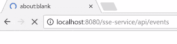
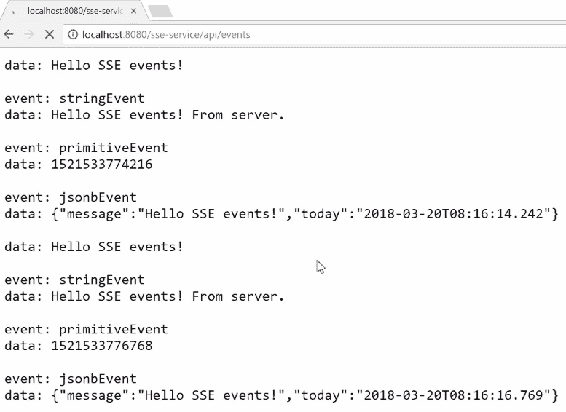
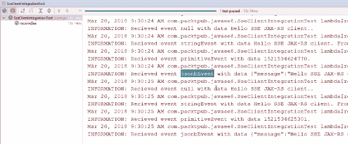
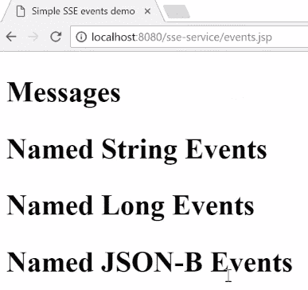
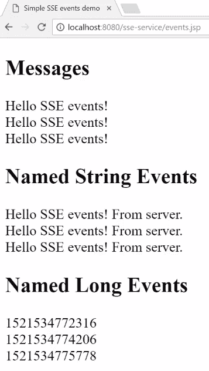
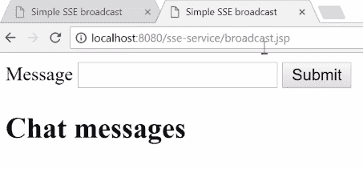
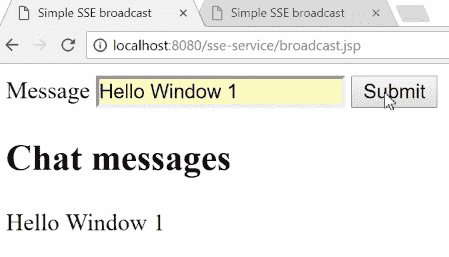
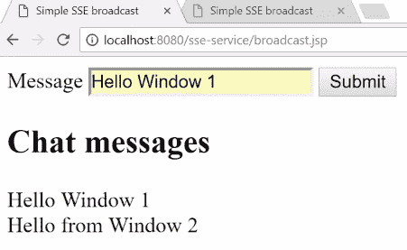
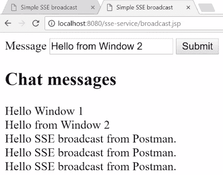

# 第五章：使用服务器发送事件（SSEs）

在本章中，我们将探讨 **服务器发送事件**（**SSE**）。我们将查看一些使用场景的特点，然后我们将使用 JAX-RS 在服务器端实现和发送简单的 SSE。接下来，我们将使用 JAX-RS 引擎 HTML 实现 SSE，最后我们将查看发送和接收服务器发送的广播事件，以实现类似简单 HTML 聊天客户端的功能。

本章包括以下部分：

+   什么是 SSEs？

+   在服务器端实现 SSE

+   实现 SSE REST 客户端

+   实现和发送 SSE 广播

# 什么是 SSEs？

在本节中，我们将探讨 SSEs，并查看一些其使用场景。然后，我们将使用 JAX-RS 在服务器端实现和发送一个简单的 SSE。接下来，我们将使用 JAX-RS 和 HTML 在客户端实现 SSE。最后，我们将查看发送和接收服务器发送的广播事件，以实现类似简单 HTML 聊天客户端的功能。

我们将探讨 SSEs（服务器发送事件），它们是什么，以及一些使用场景。我们还将查看与其他相关技术（如 WebSockets、轮询和长轮询）的一些区别。

那么，SSEs（服务器发送事件）究竟是什么呢？它们是一个非常简单的基于 HTTP 的 API，专门用于推送通信，目前 SSEs 已在大多数最新的浏览器中实现，如 Firefox、Chrome、Safari 和 Opera。不幸的是，SSEs 目前在 Internet Explorer 或 Edge 中尚未实现。

SSE 允许您从服务器向客户端发送简单的文本数据。一个重要的事情是：SSEs 在通信中是单向的。您可能会想，“嘿，我过去使用过轮询和长轮询，它们似乎做的是同一件事。”主要区别在于，使用轮询和长轮询时，是客户端偶尔尝试加载新数据。而使用 SSE，不是客户端轮询，而是服务器始终向客户端推送数据。

您可能之前听说过 WebSockets，但 WebSockets 是一个完全不同的东西。首先，它们是基于 TCP 的。它们在客户端和服务器之间提供了一个全双工的通信链路。使用 WebSocket，客户端可以始终向服务器发送数据，服务器也可以始终向客户端发送数据。在 SSE 中，您可以将事件流想象成非常简单的文本数据。文本数据必须使用 UTF-8 编码。在事件流中，我们可以发送简单的消息并对这些消息进行编码。这些消息甚至可以是 JSON 格式，或者您可能只能发送纯字符串或原始数据。事件流中的消息由一对换行符（`"\n"`）分隔。

记住：SSEs 是简单的推送通信机制，您可以从服务器向客户端发送事件流，而无需客户端轮询。

在下一节中，我们将查看使用 JAX-RS 在服务器端实现 SSE。

# 在服务器端实现 SSE

在本节中，我们将探讨使用 text/event-stream 媒体类型打开 SSE 接收器。我们将发送简单的数据和 JSON 数据事件。最后，我们将关闭并断开之前打开的 SSE 接收器。

让我们开始吧，深入代码，打开我们的 IDE。像往常一样，我们准备一个小模板来开始。打开`EventsResource.java`文件。我们首先需要做的是实现事件流的打开。我们可以通过实现一个普通的 HTTP `@GET`方法来实现，但首先需要处理的是参数，这是我们传递类型为`SseEventSink`的`@Context`。

这是我们可以稍后用来向客户端发送事件的对象。您还可以看到`@Produces`注解，这是我们使用`text/event-stream`作为`MediaType`的地方。这是用来指定 SSE 的特殊媒体类型：

```java
    @GET
    @Produces(MediaType.SERVER_SENT_EVENTS)
    public void openEventStream(
      @Context final SseEventSink eventSink) {
        this.eventSink = eventSink;
    }
```

一旦我们打开了 SSE 事件流，我们就可以实现事件的发送。首先，我们从一个简单的`@POST`方法开始。同样，请注意第二个参数，它是一个类型为`Sse`的`@Context`对象。我们稍后使用这个`Sse`接口来构建新的事件。让我们通过事件流发送第一个简单的事件。我们这样做是通过使用`sse`上下文，并使用字符串`message`构建一个`newEvent`，然后我们在`eventSink`上使用`send`方法，并将它发送到`event`：

```java
    @POST
    public void sendEvent(String message, @Context Sse sse) {
        final SseEventSink localSink = eventSink;
        if (localSink == null) return;

        // send simple event
        OutboundSseEvent event = sse.newEvent(message);
        localSink.send(event);
```

我们还可以发送命名的事件，这可以为您的事件赋予一些名称。同样，我们使用`sse`上下文来构建一个`newEvent`。在这里我们可以看到我们给它取了一个名字（`stringEvent`），并且将`message`作为数据传递。同样，我们使用了`localSink`和`send`方法来发送这个`event`：

```java
        // send simple string event
        OutboundSseEvent stringEvent = sse.newEvent(
          "stringEvent", message + " From server.");
        localSink.send(stringEvent);
```

这也适用于其他原始数据。也许我们想要发送当前时间的毫秒数。如您所见，`sse`上下文中也有一个`newEventBuilder`可用。我们使用`sse.newEventBuilder`、`name`和`data`，并在其上调用`build`方法。然后我们按照如下方式调用`send`方法：

```java
        // send primitive long event using builder
        OutboundSseEvent primitiveEvent = sse.newEventBuilder()
                .name("primitiveEvent")
```

```java
                .data(System.currentTimeMillis()).build();
        localSink.send(primitiveEvent);
```

最后，我们还可以发送 JSON 事件。例如，我们有一个简单的 POJO 实现，使用了`@JsonbPropertyOrder`注解：

```java
    @JsonbPropertyOrder({"time", "message"})
    public static class JsonbSseEvent {
        String message;
        LocalDateTime today = LocalDateTime.now();
        public JsonbSseEvent(String message) {
            this.message = message;}
        public String getMessage() {
            return message;}
        public void setMessage(String message) {
            this.message = message;}
        public LocalDateTime getToday() {
            return today;}
        public void setToday(LocalDateTime today) {
            this.today = today;}
    }
}
```

让我们将其发送出去。我们使用了`newEventBuilder`，给它一个`name`，并传递我们 POJO 的一个实例作为`data`。我们可以指定这个事件的`mediaType`，在我们的例子中是 application JSON。我们可以使用`.build`并将其发送到事件流：

```java
        // send JSON-B marshalling to send event
        OutboundSseEvent jsonbEvent = sse.newEventBuilder()
                .name("jsonbEvent")
                .data(new JsonbSseEvent(message))
                .mediaType(MediaType.APPLICATION_JSON_TYPE)
                .build();
        localSink.send(jsonbEvent);
    }
```

发送事件就是这样。我们最后需要做的是关闭事件流。我们可以使用 HTTP 的`DELETE`方法来做这件事。如果我们对这个资源调用 HTTP `DELETE`，我们可以在`eventSink`上简单地调用一个`close`方法，然后我们就完成了：

```java
    @DELETE
    public void closeEventStream() throws IOException {
        final SseEventSink localSink = eventSink;
        if (localSink != null) {
            this.eventSink.close();
        }
        this.eventSink = null;
    }
```

让我们对其进行测试。打开浏览器并导航到`GET`端点。正如我们所见，这个调用不会返回，因为它正在等待事件，如下面的截图所示：



现在，我们打开 Postman 发送一些事件，点击几次“发送”。让我们回到我们的浏览器。正如我们所看到的，我们的事件已经到达，如下面的截图所示：



这就是客户端实现服务和事件的所有内容。

在下一节中，我们将讨论实现服务和事件 REST 客户端以及 HTTP 客户端。

# 实现 SSE REST 客户端

在本节中，我们将探讨如何注册 JAX-RS 客户端实例以接收 SSE。我们将向 SSE 服务端点发送消息，并希望在 JAX-RS 客户端中接收这些消息。最后，我们将看看如何使用 JSP 实现一个简单的 HTML 客户端。

在本节中，我们需要涵盖很多内容。让我们开始，并切换到我们的 IDE。像往常一样，我们将准备一个模板项目以开始。我们需要做的是实现一个小型的 JUnit 集成测试，我们可以将其用作我们的 JAX-RS 客户端。在`setUp`方法中，我们将首先构建一个执行器（你很快就会看到我们为什么需要它）。为了做到这一点，我们将使用 JAX-RS 的`clientBuilder`并构建一个`newBuilder`。我们将指定`connectTimeout`和`readTimeout`并调用`.build`：

```java
    @Before
    public void setUp() {
        client = ClientBuilder.newBuilder()
                .connectTimeout(5, TimeUnit.SECONDS)
                .readTimeout(30, TimeUnit.SECONDS)
                .build();

        executorService = Executors.newSingleThreadScheduledExecutor();
    }
```

剩下的就是我们需要构造并打开我们的 REST 端点的`webTarget`。我们在这里做的是使用`client`，在这种情况下，我们将`target`指定为`localhost:8080`，并在`events`端点中实现`path`，就像我们在*在服务器端实现 SSE*部分所做的那样：

```java
        webTarget = client.target("http://localhost:8080")
                    .path("/sse-service/api/events");
```

在`tearDown`方法中，我们关闭客户端并调用`executorService`：

```java
    @After
    public void tearDown() {
        client.close();
        executorService.shutdown();
    }
```

让我们实现接收 SSE。首先，我们需要发送一些稳定的事件 SSE，这样我们就可以尝试实现一个事件循环。我们向一个端点发送消息，并接收发送的消息。这就是我们使用`executorService`的原因。因此，在`executorService`中，我们偶尔每 500 毫秒发送一次事件。我们使用`executorService.scheduleWithFixedDelay`和`webTarget.requests`，我们调用`post`，并向我们的 JAX-RS 端点输入一些纯文本数据。正如你所看到的，我们有`250`毫秒的初始延迟，并且每`500`毫秒就做一次：

```java
    @Test
    public void receiveSse() throws Exception {

        executorService.scheduleWithFixedDelay(() -> {
            webTarget.request().post(Entity.entity(
              "Hello SSE JAX-RS client.", 
              MediaType.TEXT_PLAIN_TYPE));
        }, 250, 500, TimeUnit.MILLISECONDS);
```

现在来到了有趣的部分：让我们接收这些事件。首先，我们需要做的是获取一个`SseEventSource`。我们使用`SseEventSource.target`，给它我们之前构造的`webTarget`，然后调用`.build`。这给了我们一个`SseEventSource`的实例。让我们与`eventSource`进行交互。我们首先需要做的是注册一个处理程序，每当收到事件时都会被调用。为了做到这一点，我们使用`eventSource.register`，我们只做的是记录事件名称并读取事件的资料。剩下的事情就是我们需要开始接收这些事件。为了做到这一点，我们需要在`eventSource`上调用`open`方法。为了确保这个测试不会立即返回，我们在里面放了一个`5`秒的袖子：

```java
        try (SseEventSource eventSource = SseEventSource
          .target(webTarget).build()) {
            eventSource.register((e) -> LOGGER.log(Level.INFO, 
                    "Recieved event {0} with data {1}.",
                    new Object[]{e.getName(), e.readData()}));
            eventSource.open();

            TimeUnit.SECONDS.sleep(5);
        }
    }
```

让我们看看这行不行。我们将构建并运行这个集成测试，这需要一些时间来编译。我们可以看到它正在接收 `JsonbEvent`，一个简单的消息，一个 `primitiveEvent`，以及我们刚刚期望的 `stringEvent`，如下面的截图所示：



集成测试输出的事件

这就是使用 JAX-RS 客户端发送和接收 SSE 的全部内容。让我们再看一点，那就是关于如何使用纯 HTML 和 JSP 消费这些 SSE。我们将准备一个小型的 JSP 展示，由于大多数现代浏览器都支持这个功能，这将是一个很好的展示。首先，你需要添加一些 JavaScript，并且需要打开 `EventSource`。在 JavaScript 中，你可以通过 `new EventSource` 来打开 `EventSource`，我们给它我们的 `events` 端点的端点。为了接收普通未命名的事件，我们必须使用 `onmessage`。我们在 `source.onmessage` 中注册 `function` 并将 `event.data` 附加到我们在文件开头定义的 `div` 标签：

```java
<h2>Messages</h2>
<div id="messages"></div>
<script>
    if (typeof(EventSource) !== "undefined") {
        var source = new EventSource(
          "http://localhost:8080/sse-service/api/events");
        source.onmessage = function (event) {
            document.getElementById("messages").innerHTML += 
              event.data + "<br>";
        };
```

对于任何命名的事件，我们都需要以稍微不同的方式进行操作。在这里，我们必须使用一个不同的方法，即在我们的 `source` 上使用 `addEventListener` 方法。我们为 `"sringEvent"`、`"primitiveEvent"` 和 `jsonEvent` 注册 `addEventListener`。我们将从事件接收到的数据附加到我们在 JSP 文件顶部定义的 `div` 标签：

```java
<script>
    if (typeof(EventSource) !== "undefined") {
        var source = new EventSource(
           "http://localhost:8080/sse-service/api/events");
        source.onmessage = function (event) {
            document.getElementById("messages")
            .innerHTML += event.data + "<br>";
        };
    ...
    ...
        source.addEventListener("jsonbEvent", function (e) {
            document.getElementById("jsonbEvents")
            .innerHTML += e.data + "<br>";
        }, false);
    } else {
        document.getElementById("jsonbEvents").innerHTML = 
        "Sorry, your browser does not support server-sent events...";
    }
```

现在，让我们打开一个浏览器并访问 URL (`localhost:8080/sse-service/events.jsp`)。这就是我们简单的 UI 应该看起来像的样子：



我知道这看起来不太美观，但它确实完成了任务。在后台，我们已经打开了到我们服务器的 SSE 通道。如果我们打开 Postman 并开始 `POST` 一些事件，然后回到我们的浏览器页面，我们可以看到这些事件将出现，如下面的截图所示：



我们通过发送它们三次来调用这些事件，你可以看到这里有三条不同的消息。

这一节就到这里。在下一节中，我们将讨论实现和发送 SSE 广播。

# 实现和发送 SSE 广播

在本节中，我们将探讨创建 SSE 广播器实例。我们将使用这个 SSE 广播器注册 SSE 事件接收器，然后我们将向所有已注册的接收器广播事件。最后，我们将实现一个简单的基于 SSE 的 HTML 聊天功能。

在这一节中有很多内容需要介绍。让我们开始并打开我们的 IDE。像往常一样，为了开始，我们将准备一个小型的骨架项目。首先，我们将实现`BroadcastResource`类，这是发送 SSE 广播的服务器端。我们有一些事情要做。我们将注入 SSE `@Context`，我们需要用它来构造新的事件。接下来，我们需要初始化一个 SSE 广播器。为此，我们将使用我们刚刚注入的`@Context`并定义一个`SseBroadcaster`，这样它就是主要的实例。我们还将使用一个`@PostConstruct`初始化器来创建一个`newBroadcaster`，使用`sse`上下文：

```java
    @Context
    private Sse sse;
    private SseBroadcaster sseBroadcaster;

    @PostConstruct
    public void initialize() {
        sseBroadcaster = sse.newBroadcaster();
    }
```

我们接下来需要实现的是将 SSE 事件接收器注册到这个广播器上。我们将为此实现一个简单的`@GET`方法，但请记住它被注解为媒体类型`text/event-stream`。我们只需要调用`sseBroadcaster.register`方法并传入`sseEventSink`实例：

```java
    @GET
    @Produces(MediaType.SERVER_SENT_EVENTS)
    public void fetch(@Context SseEventSink sseEventSink) {
        sseBroadcaster.register(sseEventSink);
    }
```

最后缺失的部分是我们需要能够广播并发送 SSE 事件。我们在这里定义了一个`POST`方法，我们可以使用它来消费一个 HTML 表单（`APPLICATION_FORM_URLENCODED`）和名为`"message"`的`@FormParam`。我们使用这个来构造一个出站 SSE 事件（`OutboundSseEvent`），就像我们在前面的部分所做的那样。我们通过使用`sse.newEvent`，给它一个名字，并传递`message`，然后我们使用`sseBroadcaster`实例上的`broadcast`方法来广播事件，并返回`noContent`：

```java
    @POST
    @Consumes(MediaType.APPLICATION_FORM_URLENCODED)
    public Response broadcast(@FormParam("message") String message) {
        OutboundSseEvent broadcastEvent = sse.newEvent(
          "message", message);
        sseBroadcaster.broadcast(broadcastEvent);
        return Response.noContent().build();
    }
```

服务器端的操作就到这里。让我们快速看一下 HTML 端。同样，我们将会使用一个非常简单的纯 JSP 文件，就像我们在前面的部分所做的那样。我们将构造一个`EventSource`并为我们的消息注册一个事件监听器（`addEventListener`）。就是这样，只有一个小的细节缺失——我们需要一个简单的`form`来向我们的`BroadcastResource`发送消息：

```java
<form action="/sse-service/api/broadcast" method="post">
    Message <input type="text" name="message"/>
    <input type="submit" value="Submit"/>
</form>
```

让我们来测试一下。我们将打开几个浏览器实例来查看我们的超级酷炫的 HTML 聊天客户端：



让我们输入`Hello Window 1`并点击提交，如下所示：



我们期望在第二个窗口中看到这条消息。你应该在第二个窗口中看到相同的消息。从第二个窗口，我们将输入一条消息`Hello from Window 2`并点击提交。现在，如果我们切换到第一个窗口的标签页，我们应该能够看到从第二个窗口发送的`Hello from Window 2`消息，如下所示：



你可能会认为这是伪造的，但事实并非如此。让我们打开 Postman 并使用它来向这个广播资源发送消息。如果你查看头部信息，我们已经有了一个之前提到的`Content-Type`，在`Body`标签下有一个`message`。我们将使用 Postman 发送这些事件，我们期望在浏览器窗口中看到这条消息。让我们点击一次，也许两次，也许三次。然后让我们切换回我们的浏览器，你将看到来自 Postman 的“Hello SSE 广播”，如下面的截图所示：



这证明了我们已经验证了这是一个在多个客户端类型上工作的真实广播。

# 摘要

这就是本章的全部内容。那么，我们探讨了什么？首先，我们必须查看服务和事件的用例，并讨论了 SSE 是什么以及其他相关技术。接下来，我们使用 JAX-RS 在服务器端实现了服务事件的发送。然后，我们查看使用 JAX-RS 客户端 API 以及 HTML 实现 SSE 客户端和接收这些事件。最后，我们在服务器端实现了 SSE 广播的发送，并实现了一个小的 HTML 聊天客户端。

在下一章和最后一章中，我们将探讨高级 REST API。
