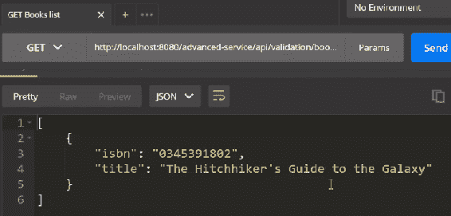
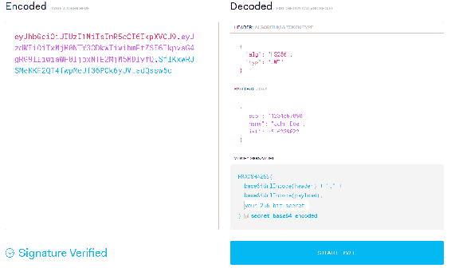
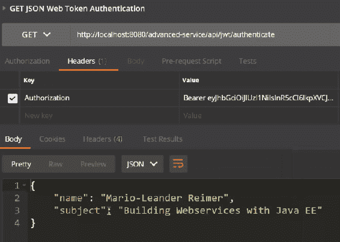
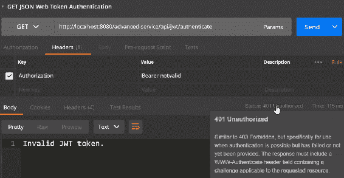
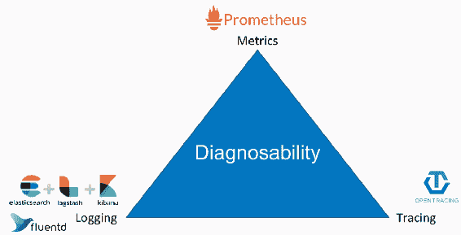

# 高级 REST API

在本章中，我们将探讨如何使用合同和验证向 REST API 添加设计。然后，我们将学习如何使用 JSON Web Tokens 进行身份验证。最后，我们将探索可诊断性，即 REST API 的日志记录、指标和跟踪。在本章中，我们将涵盖以下主题：

+   应用设计规范——添加验证

+   使用 JSON Web Tokens 进行身份验证

+   可诊断性——日志记录、指标和跟踪

# 应用设计规范——添加验证

在本节中，我们将探讨如何使用 Javax 验证注解向 `@PathParam` 注解添加验证。我们将添加使用 Javax 验证注解的验证 POJO 和 `POST` 主体。我将向您展示如何发送 HTTP 404 状态码以表示错误和无效的请求。

让我们切换到我们的 IDE。像往常一样，我们将准备一个小型模板项目以开始。我们创建了一个 `BookResource`，类似于在上一章 第五章，*使用服务器发送事件 (SSEs)* 中创建的。不过，有一件事是缺失的：没有告诉 API ISBN 是有效的。让我们假设我们想要为 ISBN 添加一个验证，并确保它总是 10 个字符长，并且只包含数字。当然，我们可以手动编写这个程序，但有一个更好的方法。

相反，我们可以使用 Javax 验证来实现这一点。让我们通过添加 `@Pattern` 注解来完成它。如果你在 IDE 中悬停在 `@Pattern` 注解上，你会看到这个注解来自 Javax 验证约束包。我们想使用 `@Pattern` 来表示我们想要一个只包含 `[0-9]` 的正则表达式（`regexp`），并且它需要是 10 位长；这就是在这种情况下验证 ISBN 所需要的一切：

```java
    @GET
    @Path("/{isbn}")
    public Response book(@PathParam("isbn") @Pattern(
      regexp = "[0-9]{10}") String isbn) {
        Book book = Optional.ofNullable(books.get(isbn))
                    .orElseThrow(NotFoundException::new);
        return Response.ok(book).build();
    }
```

我们有 `@POST` 方法来创建一个新的书籍，并且我们不确定发送的书籍是否有效。首先，我们添加一个 Javax 验证 (`@Valid`) 注解。在这种情况下，我们使用 `@Valid`，它将验证指向 `Book` 类内的注解：

```java
    @POST
    @Consumes(MediaType.APPLICATION_JSON)
    public Response create(@Valid Book book, 
      @Context UriInfo uriInfo) {
        books.put(book.isbn, book);

        URI uri = uriInfo.getBaseUriBuilder()
          .path(BooksResource.class).path(book.isbn).build();
        return Response.created(uri).build();
    }
```

`Book` 类有一个 `isbn` 和一个 `title`，但没有 Javax 验证注解。ISBN 应该是有效的 ISBN，标题既不能为空也不能为空白。我们为 `title` 添加了 `@NotBlank` 和 `@NotNull` 注解，为 `isbn` 添加了 `@Pattern`：

```java
public static class Book {

        @Pattern(regexp = "[0-9]{10}")
        private String isbn;
        @NotNull
        @NotBlank
        private String title;
```

让我们进行测试。让我们打开我们的 Postman 客户端并尝试 GET Books 列表 API。我们在这里看到我们返回了一本书：



现在，让我们尝试获取一个无效 ISBN 的书籍并看看会发生什么；点击 GET Invalid Book API (`http://localhost:8080/advanced/books/4711`)。你会在我们传递的 URI 中看到 `4711`，这不是一个有效的 ISBN，因为它不是 10 位长。如果我们发送这个请求，我们期望服务器会返回一个错误请求；这告诉我们我们发送的请求是不有效的。如果我们请求一个有效的书籍（GET Valid Book），我们得到状态码 200 OK，这意味着第一次验证是有效的。

让我们通过请求 POST 新有效书籍来创建一个新的有效书籍；我们可以看到它有一个有效的 ISBN——10 位长——和一个标题。我们发送这个请求，并得到状态码 201 Created，如下截图所示：


现在，让我们通过请求 POST 无效书籍来创建一个无效的书籍。看看 Body；你会看到一个空的`title`和一个无效的`isbn`：

```java
{
    "isbn": "1234560".
    "title": ""
}
```

如果我们发送这个请求，我们会得到 400 Bad Request；服务器将不接受任何不符合我们验证注释的无效书籍。

在下一节中，我们将查看使用 JSON Web Tokens 进行身份验证。

# 使用 JSON Web Tokens 进行身份验证

在本节中，我们将查看使用 Auth0 库解码**JSON Web Tokens**（**JWTs**）。我们将了解如何实现和使用`ContainerRequest`和`ContainerResponse`过滤器来处理我们的 REST 资源的 JWT 身份验证。最后，我们将在我们的 REST 资源中注入和使用解码后的 JWT。

让我们开始吧。如果你访问 JWT 网站（[`jwt.io/`](https://jwt.io/)），你可以找到关于 JWT 的相关信息。在调试器下，你可以看到 JWT 的样子。我们可以看到在编码部分下的令牌——它由一个 HEADER、PAYLOAD 和一个 VERIFY SIGNATURE 组成。这个 JWT 使用对称加密来生成签名。因此，这个值将随后通过 HTTP 授权头传输：



如同往常，我们准备一个小型模板项目以开始。首先，我们激活一个第三方库，该库是处理 JWT 和解码所必需的。我们通过在 POM 文件中添加以下依赖项来完成此操作：

```java
    <dependency>
        <groupId>com.auth0</groupId>
        <artifactId>java-jwt</artifactId>
        <version>3.3.0</version>
    </dependency>
```

接下来，我们需要实现`ContainerResponse`和`ContainerRequest`过滤器；我们在`JwtAuthzVerifier`类中这样做。我们让`JwtAuthzVerifier`类实现`ContainerRequestFilter`和`ContainerResponseFilter`：

```java
@Provider
public class JwtAuthzVerifier implements ContainerRequestFilter, ContainerResponseFilter {
```

让我们实现这两个方法。我们需要实现`filter`。要做到这一点，我们需要从`requestContext`中提取授权头，然后解码 bearer 令牌（`decodeBearerToken`）：

```java
    @Override
    public void filter(ContainerRequestContext requestContext) {
        try {
            String header = getAuthorizationHeader(requestContext);
            decodeBearerToken(header);
        }
```

要获取请求头，我们使用`ContainerRequestContext`并提取`AUTHORIZATION_HEADER`：

```java
    private String getAuthorizationHeader(
      ContainerRequestContext requestContext) {
        return requestContext.getHeaderString(AUTHORIZATION_HEADER);
    }
```

一旦我们有了这个，我们就可以解码 bearer 令牌。这就是我们将使用 Auth0 库的地方。我们提供了一些验证代码，这基本上是针对所使用的库进行编程。最后，在响应中，我们将丢弃解码后的 JWT：

```java
    private void decodeBearerToken(String authorization) {
        String token = extractJwtToken(authorization);
        Verification verification = 
          JWT.require(getSecret()).acceptLeeway(1L);
        DecodedJWT jwt = verify(token, verification);
        decodedJWT.set(jwt);
    }
```

几乎就是这样，但还有一些事情需要补充。我们需要在`@ApplicationScoped`下注释`@Provider`。我们还需要一个激活的注释，所以我们调用`@JwtAuthz`：

```java
@ApplicationScoped
@JwtAuthz
@Provider
```

让我们看看`@JwtAuthz`注解。到目前为止，这是一个非常基础的注解，但我们需要一个特殊的注解。我们需要`@NameBinding`注解。基本上，这个注解将注解的`@Provider`绑定，我们在`JwtAuthzVerifier`类中已经做到了这一点。在这种情况下，我们可以在`TYPE`上放置`@Target`注解，即 REST 资源或 REST 方法：

```java
@NameBinding
@Retention(RetentionPolicy.RUNTIME)
@Target({ElementType.TYPE, ElementType.METHOD})
public @interface JwtAuthz {
}
```

接下来，我们需要激活我们的资源和验证器。让我们跳转到`AuthenticationResource`和最后的最后。我们需要为这个资源激活我们的 JWT 过滤器。我们通过在资源上直接使用`@JwtAuthz`注解来实现这一点：

```java
@Path("/jwt")
@JwtAuthz
public class AuthenticationResource {
```

然后我们注入解码后的 JWT：

```java
    @Inject
    private DecodedJWT decodedJWT;
```

最后，我们添加一个`authenticate`方法。我们获取解码 JWT 的声明（`decodedJWT.getClaims()`）。我们构建一个`response`并回显`name`和`subject`声明：

```java
    @GET
    @Path("/authenticate")
    public Response authenticate() {
        Map<String, Claim> claims = decodedJWT.getClaims();

        JsonObject response = Json.createObjectBuilder()
                .add("name", claims.get("name").asString())
                .add("subject", claims.get("sub").asString())
                .build();

        return Response.ok(response).build();
    }
}
```

让我们切换到我们的 REST 客户端。如果你想访问这个资源，请访问我们的`authenticate`资源路径。在这里，我们准备了一个`Authorization`头，在值中使用`Bearer`作为令牌类型，后面跟着编码格式的 JSON Web Token。当我们发送这个请求时，我们应该期望得到 200 OK 状态。你应该能看到解码后的`name`和`subject`声明：



假设我们将`Authorization`头的值更改为`Bearer notvalid`。如果我们发送这个请求，我们应该得到 401 未授权和`Invalid JWT token.`消息。我们刚刚使用简单的 JWT 身份验证保护了我们的 REST API：



在下一节中，我们将讨论可诊断性，并将日志、指标和跟踪添加到你的 REST API 中。

# 可诊断性 – 日志、指标和跟踪

在本节中，我们将探讨如何使用 Jersey 的日志功能添加请求和响应日志。我们将查看使用 MicroProfile 1.2 API 添加指标和健康端点。最后，我们将看看如何使用`OpenTracing` API 和 Jaeger 来包含跟踪。

在我们开始之前，让我们快速看一下可诊断性的三角形。当涉及到开发 Web 服务和分布式应用时，可诊断性非常重要。当人们谈论指标时，你可能听说过 Prometheus；当涉及到日志时，你可能听说过 Fluentd；而对于跟踪，OpenTracing 是当前最先进的 API。确保你查看这些技术和它们的堆栈。

让我们探索一个小型 Web 服务的可诊断性三角形：



可诊断性三角形

让我们打开集成开发环境（IDE）开始吧。打开 POM 文件并添加一些依赖项。我们想要启用的第一个依赖项是`jersey.core`或`jersey-common`依赖项。这是日志功能和日志过滤器所在的位置：

```java

    <dependency>
        <groupId>org.glassfish.jersey.core</groupId>
        <artifactId>jersey-common</artifactId>
        <version>2.26</version>
        <scope>provided</scope>
    </dependency>
```

要为每个请求启用请求和响应日志，我们激活`JAXRSConfiguration`类中的`LoggingFeature`：

```java
        classes.add(MetricsResource.class);
        classes.add(LoggingFeature.class);

        return classes;
    }
```

如果你在我们 IDE 中悬停在`LoggingFeature`上，你可以看到它来自`jersey-common`模块；通常这已经提供了，所以我们不需要编写它——不需要添加额外的依赖。我们最后要做的就是修改`LoggingFeature`。在这里，我们添加一些额外的属性，然后我们就完成了：

```java
        properties.put(LoggingFeature.LOGGING_FEATURE_LOGGER_NAME,   
          "RequestLogger");
        properties.put(LoggingFeature.LOGGING_FEATURE_LOGGER_LEVEL, 
          Level.INFO.getName());
```

这将记录每个请求和每个响应到你的日志文件中。小心；它将生成一些非常庞大的日志。接下来，我们看看如何使用 MicroProfile API 添加指标和健康检查。

让我们切换到我们的 POM 并激活 MicroProfile API。由于我们使用 Payara micro edition，这些 API 对我们也是可用的。有健康检查、指标、容错（如果你需要的话）以及 JWT 认证（如果你不想自己实现的话）的 API。我们需要在我们的 POM 文件中添加以下依赖项（整个代码可以在[`github.com/PacktPublishing/Building-RESTful-Web-Services-with-Java-EE-8`](https://github.com/PacktPublishing/Building-RESTful-Web-Services-with-Java-EE-8)找到）：

```java

    <dependency>
        <groupId>org.eclipse.microprofile.health</groupId>
        <artifactId>microprofile-health-api</artifactId>
        <version>1.0</version>
        <scope>provided</scope> 
    </dependency>
    ...
    ...
    <dependency>
        <groupId>org.eclipse.microprofile.jwt</groupId>
        <artifactId>microprofile-jwt-auth-api</artifactId>
        <version>1.0</version>
        <scope>provided</scope>
    </dependency>
```

让我们去`MetricsResource`添加一些指标。这实际上非常简单。想象一下，你有一个 REST 资源，你感兴趣的是`POST`请求的调用耗时。为此，你可以添加`@Timed`注解。我们指定`unit`为`"milliseconds"`，MicroProfile 将确保每次调用都会计时：

```java
    @POST
    @Path("/timed")
    @Timed(displayName = "Timed invocation", unit = "milliseconds")
```

如果你只想计数调用，那就更容易了。为此，我们可以使用`@Counted`注解：

```java
    @POST
    @Path("/counted")
    @Counted(monotonic = true)
```

最后，如果你对当前绝对值感兴趣，可以使用`@Gauge`：

```java
    @Gauge(displayName = "Gauge invocation", unit = "seconds")
    public long gauge() {
        return poolSize.get();
```

所以`@Counted`、`@Gauge`和`@Timed`是你可以使用的三个指标注解。

也许我们还想添加一些健康检查，因为一个好的微服务应该提供健康检查。我们可以指定一个`@ApplicationScoped`的 bean。我们使用`@Health`注解它，它实现了`HealthCheck`；这来自 MicroProfile API。然后我们实现我们的基本健康检查逻辑：

```java
public class EverythingOkHealthCheck implements HealthCheck {
    @Override
    public HealthCheckResponse call() {
        return HealthCheckResponse
                .named("everythingOk")
                .up()
                .withData("message", "Everything is OK!")
                .build();
    }
}
```

最后一件事情是跟踪——这是一个非常复杂的问题。我想向你展示如何将跟踪添加到你的 Web 服务中。首先，我们添加跟踪 API，然后我们添加 Jaeger 作为跟踪实现。我们还使用一个特殊的注解将 OpenTracing 添加到 JAX-RS 2：

```java

    <dependency>
        <groupId>io.opentracing</groupId>
        <artifactId>opentracing-api</artifactId>
        <version>0.31.0</version>
    </dependency>
    <dependency>
        <groupId>com.uber.jaeger</groupId>
        <artifactId>jaeger-core</artifactId>
        <version>0.25.0</version>
    </dependency>
    <dependency>
        <groupId>io.opentracing.contrib</groupId>
        <artifactId>opentracing-jaxrs2</artifactId>
        <version>0.1.3</version>
    </dependency>
```

这些是所需的依赖项。之后我们只需要激活 tracer。这只需要几行代码。我们从环境构造一个跟踪`Configuration`。我们使用`GlobalTracer`注册这个`Configuration`和`getTracer`：

```java
@WebListener
public class OpenTracingContextInitializer implements ServletContextListener {
    @Override
    public void contextInitialized(ServletContextEvent sce) {
        Configuration configuration = Configuration.fromEnv();
        GlobalTracer.register(configuration.getTracer());
    }
}
```

让我们看看我们的 Web 服务看起来像什么。

打开 Postman 并发出一些请求，例如 POST Timed Metric 和 POST Counted Metric。POST Timed Metric 调用`@Timed`请求。POST Counted Metric 调用`@Counted`请求；我们调用这个请求几次。

我们调用 GET 指标端点，这是 MicroProfile 实现自动提供的。我们发布我们的指标，我们可以看到我们的自定义指标，例如 `MetricsResource.gauge`、`MetricsResource.timed` 和 `MetricsResource.timed`。

如果我们不想使用 JSON 而想使用 Prometheus，我们可以通过调用 Prometheus 指标 GET 请求来实现。我们可以看到自动提供的 Prometheus 指标数据。

您还可以调用 GET 健康检查请求来查看一切是否正常，我们应该在 Postman 中获得以下 Body：

```java
{
    "outcome": "UP"/
    "checks": [
        {
            "name": "everythingOk",
            "state": "UP",
            "data": {
                "message": "Everything is OK"
            }
        }
    ]
}
```

一切正常，我们已经完成了。

# 摘要

在本章中，我们探讨了使用 Javax 验证来验证 REST API 参数和有效载荷。我们学习了如何将 JWT 验证添加到 REST 服务中，并手动解码 JSON Web Tokens。最后，我们讨论了使用 Jersey、MicroProfile 和其他开源组件添加、记录、指标和跟踪。
