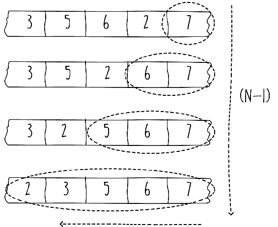
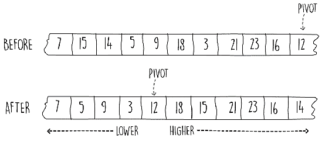
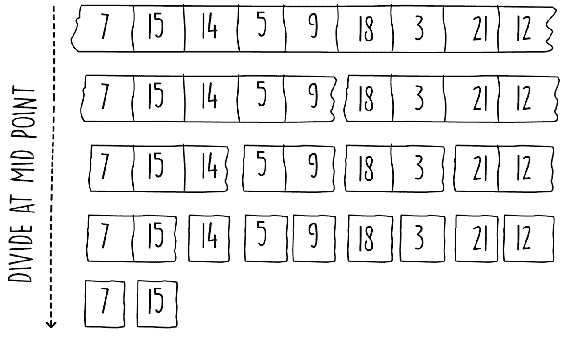
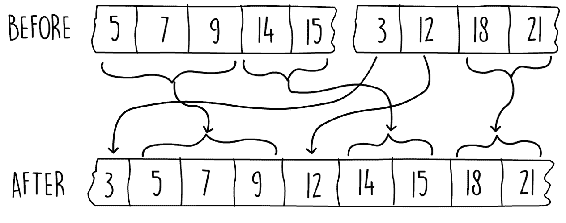
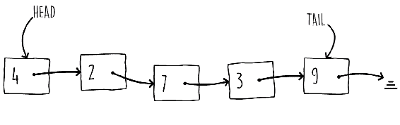
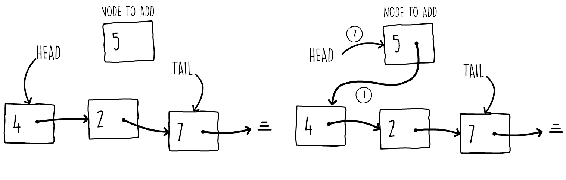
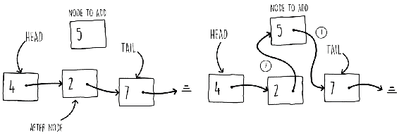
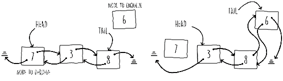
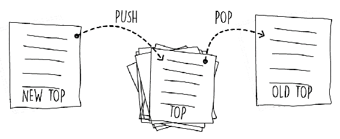
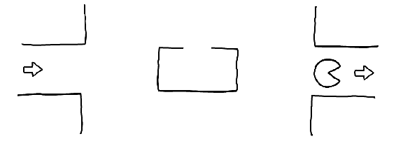

# 排序算法和基本数据结构

在上一章中，我们看到了如何通过使用排序算法来改进交集问题。这在许多问题中都很常见。如果数据是有序的，就可以开发出更有效的算法。在本章中，我们将首先探讨三种排序技术，即冒泡排序、快速排序和归并排序。稍后，我们将学习使用基本数据结构组织数据的不同方法。

到本章结束时，你将能够：

+   描述冒泡排序的工作原理

+   使用快速排序实现更快的排序

+   描述归并排序

+   构建链表数据结构

+   实现队列

+   描述栈数据结构

# 介绍冒泡排序

冒泡排序是现有最简单的排序算法。该技术涉及多次遍历输入数组并交换相邻的无序元素。该技术被称为冒泡排序，因为排序后的列表“冒泡”从列表的尾部向上移动。

# 理解冒泡排序

所有排序算法都接受一个元素列表并返回它们按顺序排列。每种算法之间的主要区别在于排序的方式。冒泡排序通过交换相邻元素来实现，这会将排序后的元素推向列表的末尾。

*Snippet 2.1* 展示了冒泡排序的伪代码。该算法涉及三个简单的任务，包括反复遍历列表进行排序、比较相邻元素，并在第一个元素大于第二个元素时交换它们。

我们需要对数组进行多少次遍历才能使我们的列表排序？结果是，为了保证我们的列表排序，我们需要对列表进行 *(n - 1)* 次遍历，其中 *n* 是我们数组的长度。我们将在下一节中展示为什么需要 *(n - 1)* 次遍历，但这是冒泡排序具有 *O(n²)* 时间复杂性的主要原因，因为我们处理 *n* 个元素 *n - 1* 次。

冒泡排序的伪代码如下：

```java
bubbleSort(array)
  n = length(array)
  for (k = 1 until n)
    for (j = 0 until -1)
      if(array[j] > array[j + 1])
        swap(array, j, j + 1)  
```

Snippet 2.1: 冒泡排序伪代码

*Snippet 2.1* 中的交换函数使用一个临时变量交换了两个数组指针 `j` 和 `j+1` 的值。

# 实现冒泡排序

要在 Java 中实现冒泡排序，请按照以下步骤操作：

1.  在 Java 中将 *Snippet 2.1* 中显示的伪代码应用于。创建一个类和一个方法，接受一个要排序的数组，如下所示：

```java
 public void sort(int[] numbers) 
```

1.  该算法的稍微棘手的部分是交换逻辑。这通过将一个要交换的元素分配给一个临时变量来实现，如 *Snippet 2.2* 所示：

```java
public void sort(int[] numbers) {
  for (int i = 1; i < numbers.length; i++) {
    for (int j = 0; j < numbers.length - 1; j++) {
      if (numbers[j] > numbers[j + 1]) {
        int temp = numbers[j];
        numbers[j] = numbers[j + 1];
        numbers[j + 1] = temp;
      }
    }
  }
}  
```

Snippet 2.2: 冒泡排序解决方案。源类名：BubbleSort

前往 [`goo.gl/7atHVR`](https://goo.gl/7atHVR) 访问代码。

虽然冒泡排序非常容易实现，但它也是现有最慢的排序方法之一。在下一节中，我们将探讨如何略微提高该算法的性能。

# 改进冒泡排序

我们可以采用两种主要技术来提高冒泡排序的性能。重要的是要认识到，尽管这两种策略在平均情况下都提高了冒泡排序的整体性能；在最坏的情况下，算法仍然具有相同的较差的运行时间复杂度 *O(n²)*。

我们可以对原始冒泡排序的第一个小改进是利用事实，即一个已排序的“气泡”正在列表的末尾构建。我们每进行一次遍历，就会在这个气泡的末尾部分添加另一个项目。这就是为什么需要 *(n - 1)* 次遍历的原因。

这也在 *图 2.1* 中显示。在这个图中，显示在虚线圆圈中的项目已经排在了正确的位置：



图 2.1：列表末尾形成气泡

我们可以利用这个事实，所以我们不会尝试对这个气泡内的元素进行排序。我们可以通过稍微修改我们的 Java 代码来实现这一点，如 *代码片段 2.3* 所示。在内循环中，我们可以在到达列表末尾之前停止处理，直到 `numbers.length - i`。为了简洁起见，在 *代码片段 2.3* 中，我们将交换逻辑替换为以下方法：

```java
public void sortImprovement1(int[] numbers) {
  for (int i = 1; i < numbers.length; i++) {
    for (int j = 0; j < numbers.length - i; j++) {
      if (numbers[j] > numbers[j + 1]) {
        swap(numbers, j, j + 1);
      }
    }
  }
}  
```

代码片段 2.3：冒泡排序改进 1\. 源类名：BubbleSort

前往 [`goo.gl/vj267K`](https://goo.gl/vj267K) 访问代码。

如果我们给冒泡排序算法一个已排序的列表，我们仍然会在它上面进行多次遍历而不修改它。我们可以通过在数组内部列表完全排序时截断外循环来进一步改进算法。我们可以通过检查在上一次遍历过程中是否进行了任何交换来检查数组是否已排序。这样，如果我们给我们的方法一个已经排序的列表，我们只需要在数组上执行一次遍历，然后保持它不变。这意味着现在最佳情况是 *O(n)*，尽管最坏情况保持不变。

# 实现冒泡排序改进

我们需要通过减少遍历次数来改进冒泡排序算法。

执行此操作的步骤如下：

1.  修改冒泡排序方法，使其在内部循环遍历后数组未发生变化时停止排序。

1.  如果将外部的 for 循环改为 while 循环，并保持一个标志来指示在遍历数组时是否交换了任何元素，那么解决方案可以很容易地开发出来。这在下述代码片段中显示：

```java
public void sortImprovement2(int[] numbers) {
  int i = 0;
  boolean swapOccured = true;
  while (swapOccured) {
     swapOccured = false;
     i++;
     for (int j = 0; j < numbers.length - i; j++) {
          if (numbers[j] > numbers[j + 1]) {
              swap(numbers, j, j + 1);
              swapOccured = true;
          }
     }
  }
}  
```

代码片段 2.4：冒泡排序改进 2\. 源类名：BubbleSort

前往 [`goo.gl/HgVYfL`](https://goo.gl/HgVYfL) 访问代码。

在本节中，我们看到了一些关于如何改进冒泡排序算法的简单技巧。在接下来的章节中，我们将探讨一些其他排序技术，它们的性能比冒泡排序快得多。

# 活动：在 Java 中实现选择排序

**场景**

通过想象你有两个列表，A 和 B，来更好地理解选择排序。最初，我们有一个包含所有未排序元素的列表 A，而列表 B 为空。想法是使用 B 来存储排序后的元素。算法通过从 A 中找到最小的元素并将其移动到 B 的末尾来工作。我们继续这样做，直到 A 为空而 B 为满。而不是使用两个单独的列表，我们可以只使用相同的输入数组，但保持一个指针来将数组分成两部分。

在现实生活中，这可以通过想象你如何排序一副牌来解释。使用洗好的牌，你可以逐张检查牌，直到找到最低的牌。你将这张牌放在一边作为新的第二堆。然后，你寻找下一张最低的牌，一旦找到，你就把它放在第二堆的底部。你重复这个过程，直到第一堆为空。

解决方案的一种方法是在先使用两个数组（A 和 B，在先前的描述中）编写伪代码。然后，通过使用交换方法将排序后的列表（数组 B）存储在相同的输入数组中。

**目标**

在 Java 中实现选择排序

**先决条件**

+   在以下类中实现排序方法，该类可在 GitHub 存储库的以下路径找到：

    [`github.com/TrainingByPackt/Data-Structures-and-Algorithms-in-Java/blob/master/src/main/java/com/packt/datastructuresandalg/lesson2/activity/selectionsort/SelectionSort.java`](https://github.com/TrainingByPackt/Data-Structures-and-Algorithms-in-Java/blob/master/src/main/java/com/packt/datastructuresandalg/lesson2/activity/selectionsort/SelectionSort.java)

+   `sort`方法应该接受一个整数数组并对其进行排序

如果你已经设置了你的项目，你可以通过运行以下命令来运行此活动的单元测试：

**`gradlew test --tests com.packt.datastructuresandalg.lesson2.activity.selectionsort*`**

**完成步骤**

1.  使用数组索引指针将输入数组分成两部分

1.  `sort`方法应该接受一个整数数组并对其进行排序

1.  遍历数组的未排序部分以找到最小值

1.  然后将最小项交换，以便它可以添加到排序部分的末尾

# 理解快速排序

快速排序是冒泡排序的一个重大改进。这种排序技术是由英国计算机科学家托尼·豪尔开发的。算法主要分为三个步骤：

1.  选择一个枢轴

1.  对列表进行分区，使得枢轴左边的元素小于枢轴的值，而右边的元素大于枢轴的值

1.  分别对左部和右部重复步骤 1 和 2

由于快速排序需要递归，我们将从这个部分开始，给出递归的一个例子。稍后，我们将看到快速排序算法中的分区是如何工作的，最后，我们将把递归技术用于最终部分。

# 理解递归

递归是算法设计者的一项非常有用的工具。它允许你通过解决相同问题的较小实例来解决大问题。递归函数通常具有以下组件的通用结构：

+   *一个或多个停止条件*：在特定条件下，它会停止函数再次调用自身

+   *一个或多个递归调用*：这是指一个函数（或方法）调用自身

在下一个示例中，我们将选择前一章中看到的二分查找问题，并将算法改为递归方式。考虑在 第一章 中讨论的二分查找问题，*算法和复杂性*，如 *Snippet 1.7* 所列。实现是迭代的，也就是说，它循环直到找到项或 `end` 参数等于或大于 `start` 变量。以下代码片段显示了如何将此方法转换为递归函数的伪代码：

```java
binarySearch(x, array, start, end)
  if(start <= end)
    mid = (end - start) / 2 + start
    if (array[mid] == x) return true 
    if (array[mid] > x) return binarySearch(x, array, start, mid - 1)
    return binarySearch(x, array, mid + 1, end)
  return false  
```

Snippet 2.5: 递归二分查找伪代码

实际上，递归二分查找中有两个停止条件。如果函数在中间找到搜索项，或者起始数组指针大于结束指针，意味着未找到该项，则停止递归链。可以通过检查任何不涉及进一步递归调用的返回路径来轻松找到停止条件。

# 实现递归二分查找

在 Java 中实现递归二分查找，我们将遵循以下步骤：

1.  使用如 *Snippet 2.5* 所示的伪代码实现递归二分查找函数。

1.  提供另一个方法，其签名只包含搜索项和排序数组作为输入。然后，该方法将使用适当的值调用递归函数，如下所示：

```java
 public boolean binarySearch(int x, int[] sortedNumbers) 
```

**输出**

以下代码显示了进行初始调用和递归函数的附加方法：

```java
public boolean binarySearch(int x, int[] sortedNumbers, int start,
int end) {
  if (start <= end) {
    int mid = (end - start) / 2 + start;
    if (sortedNumbers[mid] == x) return true;
    if (sortedNumbers[mid] > x)
    return binarySearch(x, sortedNumbers, start, mid - 1);
    return binarySearch(x, sortedNumbers, mid + 1, end);
  }
return false;}  
```

Snippet 2.6: 递归二分查找。源类名：BinarySearchRecursive

访问代码请前往 [`goo.gl/pPaZVZ`](https://goo.gl/pPaZVZ)。

递归是任何开发者的基本工具，我们将在本书的许多部分中使用它。在本节中，我们实现了一个二分查找的示例。在下一节中，我们将探讨快速排序算法中的分区是如何工作的。

# 快速排序分区

分区是我们重新排列数组的进程，使得值小于我们的枢轴的元素被移动到枢轴的左侧，而值较大的元素被移动到右侧（见 *图 2.2*）。我们可以用多种方式来做这件事。在这里，我们将描述一个易于理解的方案，称为 **Lomuto 分区**。

看看这个图：



图 2.2：数组分区前后的情况

存在许多其他方案。Lomuto 方案的一个缺点是，当它用于已排序的列表时，性能并不很好。原始的 Hoare 分区方案性能更好，它通过从两端处理数组来实现。原始的 Hoare 方案由于交换次数较少，性能更好，尽管当使用已排序的列表作为输入时，它也可能会遭受性能缓慢的问题。Lomuto 和 Hoare 方案都会导致非稳定排序。稳定排序意味着如果两个或多个元素具有相同的键值，它们将按照输入顺序出现在排序输出中。还有其他方案可以使快速排序变得稳定，但它们会使用更多的内存。

为了更好地理解这种分区方案，最好将其简化为以下五个简单的步骤：

1.  选择数组的最右侧元素作为枢轴。

1.  从左侧开始，找到下一个大于枢轴的元素。

1.  将此元素与下一个小于枢轴元素的元素交换。

1.  重复步骤 2 和 3，直到不再可能进行交换。

1.  将第一个大于枢轴值的元素与枢轴本身交换。

为了使用提到的步骤执行高效的分区，我们可以使用两个指针，一个指向第一个大于枢轴值的元素，另一个用于搜索小于枢轴值的值。

在以下代码中，这些是分别命名为 `x` 和 `i` 的整数指针。算法首先选择输入数组中的最后一个项目作为枢轴。然后它使用变量 `i` 从左到右单次遍历数组。如果当前正在处理的 `i` 位置的元素小于枢轴，则 `x` 增加，并交换。使用这种技术，变量 `x` 要么指向一个大于枢轴的值，要么 `x` 的值与 `i` 相同，在这种情况下，交换不会修改数组。一旦循环退出，我们执行最后一步，将第一个大于枢轴值的元素与枢轴本身交换。代码如下：

```java
private int partition(int[] numbers, int start, int end) {
  int pivot = numbers[end];
  int x = start - 1;
  for (int i = start; i < end; i++) {
    if (numbers[i] < pivot) {
      x++;
      swap(numbers, x, i);
    }
  }

  swap(numbers, x + 1, end);
  return x + 1;
}  
```

片段 2.7：快速排序的分区。源类名：QuickSort

前往 [`goo.gl/vrStai`](https://goo.gl/vrStai) 访问代码。

# 活动：理解分区方法

**场景**

为了更好地理解 *片段 2.7* 中使用的分区方法，请一步一步地使用示例进行操作。

**目标**

为了理解 Lomuto 分区是如何工作的。

**完成步骤**

1.  通过递增变量 `x` 和 `i` 的值，为数组中的每个元素运行 *片段 2.7* 中提到的代码的干运行。

1.  在假设列表的最后一个元素作为枢轴的情况下完成以下表格：

| **i** | **数组** | **x** |
| --- | --- | --- |
| `-` | `[4, 5, 33, 17, 3, 21, 1, 16]` | `-1` |
| `0` | `[4, 5, 33, 17, 3, 21, 1, 16]` | `0` |
| `1` |  |  |
| `2` | `[4, 5, 33, 17, 3, 21, 1, 16]` | `1` |
| `3` |  |  |
| `4` | `[4, 5, 3, 17, 33, 21, 1, 16]` | `2` |
| `5` |  |  |
| `6` |  |  |
| `7` |  |  |
| 最终 | `[4, 5, 3, 1, 16, 21, 17, 33]` | `3` |

表 2.1：划分方法的步骤

在本节中，我们了解了快速排序中的划分是如何工作的。在下一节中，我们将通过将其包含在完整的快速排序算法中来使用划分方法。

# 整合所有内容

快速排序属于一种称为分而治之的算法类别。在本书中，我们将看到这个类别中的许多其他示例，我们将在第四章*算法设计范式*中详细介绍分而治之。现在，重要的是要知道，分而治之算法持续将问题划分为更小的部分，直到问题足够小，变得容易解决。这种划分可以通过递归轻松实现。

在快速排序中，我们持续以这种方式递归地划分数组，直到问题足够小，我们可以轻松解决它。当数组只有一个元素时，解决方案很简单：数组保持完全不变，因为没有东西需要排序。这是我们的递归算法的停止条件。当数组包含一个以上的元素时，我们可以继续划分我们的数组，并使用我们在上一节中开发的划分方法。

此外，还有一种非递归的快速排序算法，它使用堆栈数据结构，尽管编写起来稍微复杂一些。我们将在本章的后面讨论堆栈和列表。

以下代码片段显示了完整快速排序的伪代码。就像大多数递归函数一样，代码首先检查停止条件。在这种情况下，我们通过确保起始数组指针小于结束来检查数组是否至少有两个元素。伪代码如下：

```java
quickSort(array, start, end)
  if(start < end)
    p = partition(array, start, end)
    quickSort(array, start, p - 1)
    quickSort(array, p + 1, end)  
```

片段 2.8：递归快速排序伪代码

当数组中至少有两个元素时，我们调用划分方法。然后，使用枢轴的最后一个位置（由划分方法返回），我们递归地对左部分进行快速排序，然后对右部分进行快速排序。

这是通过使用`(start, p - 1)`和

`(p + 1, end)`，不包括`p`，即枢轴的位置。

理解快速排序工作原理的技巧是意识到，一旦我们对数组执行了划分调用，返回位置（枢轴）的元素就不再需要在数组中移动了。这是因为其右侧的所有元素都更大，左侧的所有元素都更小，所以枢轴处于正确的最终位置。

# 实现快速排序

要在 Java 中实现快速排序，请按照以下步骤操作：

1.  在 Java 中实现*片段 2.8*中显示的伪代码，调用*片段 2.7*中显示的划分方法。

1.  以下代码显示了 Java 中的递归实现，使用了上一节中开发的划分方法：

```java
private void sort(int[] numbers, int start, int end) {
  if (start < end) {
    int p = partition(numbers, start, end);
      sort(numbers, start, p - 1);
      sort(numbers, p + 1, end);
  }
}  
```

代码片段 2.9：快速排序的解决方案。源类名：Quicksort

在本节中，我们描述了快速排序算法，它比我们在上一节中看到的冒泡排序算法快得多。平均而言，该算法的性能为 *O(n log n)*，比冒泡排序的 *O(n²)* 有很大改进。然而，在最坏的情况下，该算法仍然以 *O(n²)* 的性能运行。快速排序的最坏情况输入取决于所使用的分区方案类型。在本节讨论的 Lomuto 方案中，最坏情况发生在输入已经排序的情况下。在下一节中，我们将考察另一种排序算法，其最坏运行时间复杂度为 *O(n log n)*。

# 使用归并排序

尽管快速排序平均来说非常快，但它仍然具有理论上的最坏时间复杂度 *O(n²)*。在本节中，我们将考察另一种排序算法，称为 **归并排序**，其最坏时间复杂度为 *O(n log n)*。与快速排序类似，归并排序属于分治算法类别。

归并排序可以总结为以下三个简单步骤：

1.  在中间分割数组

1.  分别递归排序每个部分

1.  将两个已排序的部分合并在一起

在下一节中，我们将逐步开发前面的步骤，每次都慢慢构建我们对归并排序工作原理的理解。

尽管归并排序在理论上比快速排序快，但在实践中，一些快速排序的实现可能比归并排序更高效。此外，归并排序大约使用 *O(n)* 的内存，而快速排序是 *O(log n)*。

# 分解问题

在前一节中，我们看到了如何使用递归技术将问题分解成更小的多个问题，直到解决方案变得容易解决。归并排序使用了相同的方法。我们递归技术的基例与快速排序相同。这是当数组只有一个元素长时。当要排序的数组只包含一个项目时，数组已经是排序好的。

*图 2.3* 展示了归并排序数组分割的过程。在每一步中，我们找到数组的中间点并将数组分成两部分。然后我们分别递归地对分割数组的左右部分进行排序。一旦要排序的总元素数等于一，我们就可以停止递归调用，如下面的图所示：



*图 2.3* 展示归并排序算法的分割步骤

# 实现归并排序

我们需要完成归并排序算法的伪代码。

记住归并排序的递归部分与我们在前一节中看到的快速排序算法非常相似，完成以下代码中的伪代码：

```java
mergeSort(array, start, end)
  if(_____________)
    midPoint = _________
    mergeSort(array, _____, _____)
    mergeSort(array, _____, _____)
    merge(array, start, midPoint, end)  
```

代码片段 2.10：递归归并排序伪代码练习

归并排序的伪代码可以完成如下：

```java
mergeSort(array, start, end)
  if(start < end)
    midPoint = (end - start) / 2 + start
    mergeSort(array, start, midPoint)
    mergeSort(array, midPoint + 1, start)
    merge(array, start, midPoint, end) 
```

代码片段 2.11：递归归并排序伪代码解决方案

归并排序算法与快速排序算法属于同一类算法；然而，它们的运行时间和空间复杂度不同。归并排序不是从枢轴位置分割数组，而是始终在数组的中点进行分割。这与二分搜索的过程类似，导致*log[2] n*次数组分割。在下一节中，我们将介绍归并排序算法的合并部分，即将分割数组的两个不同部分合并成一个排序好的数组。

# 合并问题

你如何将两个排序列表合并成一个排序列表？这是`merge()`函数的任务，该函数位于前一个部分伪代码的末尾。这个过程在*图 2.4*中展示。合并两个排序列表比从头开始排序更容易。

这与我们在第一章，“算法与复杂度”中看到的交集问题类似。

我们可以使用两个指针和一个空数组在线性时间内进行合并，如下面的图所示：



图 2.4：合并两个排序数组前后的情况

由于分割数组的两部分都是排序好的，所以合并它们很容易。一个有用的类比是回想一下，当我们看到第一章，“算法与复杂度”中的交集问题时，一旦输入数组都是排序好的，问题就变得容易多了。这里可以使用类似的算法。

```java
copyArray() function simply takes in a source array as a first argument and copies it to the target array, that is, the second argument. It makes use of the start variable as a pointer, indicating where to place the first element of the source array onto the target one. The pseudocode is as follows:
```

```java
merge(array, start, middle, end)
  i = start
  j = middle + 1
  arrayTemp = initArrayOfSize(end - start + 1)
  for (k = 0 until end-start)
    if (i <= middle && (j > end || array[i] <= array[j]))
      arrayTemp[k] = array[i]
      i++
    else
      arrayTemp[k] = array[j]
      j++
  copyArray(arrayTemp, array, start)  
```

代码片段 2.12：归并排序的合并伪代码

在归并排序的合并部分，我们创建一个临时数组，其大小等于两个数组部分的总和。然后我们对这个数组进行单次遍历，通过从两个输入列表（由起始、中间和结束指针表示）中选择最小的项，一次填充临时数组中的一个项目。从其中一个列表中选取一个项目后，我们前进该列表的指针，并重复此过程，直到合并完成。

我们可以使用各种 Java 工具来实现*代码片段 2.12*末尾的`copyArray()`函数。我们可以简单地实现一个`for`循环并自己实现`copy()`函数。或者，我们可以利用 Java 的流并在一行中写入复制。可能最简单的方法是使用`System.arrayCopy()`函数。

归并排序在理论上是最快的排序算法之一。其速度的缺点是它消耗更多的内存，尽管一些实现可以在原地执行合并步骤以节省内存。

为了比较，我们在下表中展示了多种排序技术及其运行时间和内存性能：

| **算法名称** | **平均情况** | **最坏情况** | **内存** | **稳定性** |
| --- | --- | --- | --- | --- |
| 冒泡排序 | *O(n²)* | *O(n²)* | *O(1)* | 稳定 |
| 选择排序 | *O(n²)* | *O(n²)* | *O(1)* | 不稳定 |
| 插入排序 | *O(n²)* | *O(n²)* | *O(1)* | 稳定 |
| 快速排序 | *O(n log n)* | *O(n²)* | *O(1)* | 不稳定 |
| 合并 | *O(n log n)* | *O(n log n)* | *O(n)* | 稳定 |
| 堆 | *O(n log n)* | *O(n log n)* | *O(1)* | 不稳定 |

表 2.2：排序算法

# 活动：在 Java 中实现归并排序

**场景**

归并排序是一种最快的排序技术。它在许多库和 API 中使用。在这个活动中，我们将用 Java 编写一个算法来对数组进行归并排序。

**目标**

要使用本节中显示的伪代码在 Java 中实现完整的归并排序算法。

**先决条件**

要解决此活动，您必须实现以下类中找到的方法，该类可在以下 GitHub 存储库路径处的书籍中找到：

[`github.com/TrainingByPackt/Data-Structures-and-Algorithms-in-Java/blob/master/src/main/java/com/packt/datastructuresandalg/lesson2/activity/mergesort/MergeSort.java`](https://github.com/TrainingByPackt/Data-Structures-and-Algorithms-in-Java/blob/master/src/main/java/com/packt/datastructuresandalg/lesson2/activity/mergesort/MergeSort.java)

如果您已设置好项目，可以通过运行以下命令来运行此活动的单元测试：

**`gradlew test --tests com.packt.datastructuresandalg.lesson2.activity.mergesort*`**

**完成步骤**

1.  从`mergeSort`方法开始，该方法将数组分成两部分，递归地对两部分进行排序，然后合并结果

1.  然后，实现合并方法，该方法将拆分数组的两端合并到另一个空间

1.  合并完成后，将新数组复制到输入数组的位置

# 开始使用基本数据结构

数据结构是一种组织数据的方式，以便它对于您试图解决的问题可以高效地访问。选择正确的数据结构将取决于您试图解决的问题类型（决定了您访问数据的方式）、您需要组织的数据量以及您用于存储数据的介质（内存、磁盘等）。

我们已经看到并使用了一个数据结构的例子。在前面的章节中，我们已经广泛使用了数组。数组是最基本的数据结构。它们通过索引访问您的数据，并且大小固定（也称为静态）。这与其他动态数据结构形成对比，这些数据结构可以根据需要增长并腾出更多空间来存储数据。

# 数据结构介绍

更正式地说，数据结构是数据元素的组织，是一组可以应用于数据的功能（如添加、删除和搜索）以及不同数据元素之间的任何关系。以下表格显示了某些数据结构提供的常见操作：

| **操作** | **类型** | **描述** |
| --- | --- | --- |
| `search(key)` | 非修改 | 给定特定值的键，如果可以找到，将返回存储在数据结构中的值。 |
| `size()` | 非修改 | 数据结构中存储的值的总数。 |
| `add(value)` | 修改 | 在数据结构中插入一个值。 |
| `update(key, value)` | 修改 | 使用提供的键和值更新现有条目。 |
| `delete(value)` | 修改 | 从数据结构中删除数据项。 |
| `minimum()` | 非修改 | 仅由有序数据结构支持的运算，将返回具有最小键的值。 |
| `maximum()` | 非修改 | 仅由有序数据结构支持的运算，将返回具有最小键的值。 |

表 2.3：数据结构的一些常见操作

在本节中，我们将看到各种类型的动态数据结构。我们将从链表开始，链表优化了动态增长，但在搜索时较慢。然后，我们将使用这些链表在顶部实现其他数据结构，例如队列和栈。

# 链表结构

链表是一系列数据项的列表，其中每个项如果存在的话，只知道列表中的下一个项。*图 2.5* 展示了这样一个例子。图中的每个框代表一个用于存储所需数据项的容器。这个容器，称为节点，包含我们的数据值和指向列表中下一个节点的指针。如图所示，列表前面的节点称为列表的头部，而列表的最后一个项称为尾部。

为这些节点存储单独的指针，以便于访问数据结构：



图 2.5：链表示例

与数组相比，使用链表的优点是链表可以动态增长。当使用数组时，你在开始时分配空间，该空间保持固定。如果你分配了过多的空间而空间未被使用，你正在浪费资源。另一方面，如果你使数组太小，数据可能无法容纳。然而，在链表中，空间不是固定的。随着你添加更多数据，结构会动态增长，当你删除数据时，它会缩小，释放内存空间。

使用面向对象的语言，例如 Java，我们可以使用独立的节点实例来模拟链表，这些节点实例连接在一起以构建我们的链表。以下代码展示了我们如何在 Java 类中模拟链表节点。

该类包含一个自引用，因此我们可以像 *图 2.5* 中所示的那样以列表方式链接多个节点。

```java
public class LinkedListNode<V> {
  private V value;
  private LinkedListNode<V> next;  
  public LinkedListNode(V value, LinkedListNode<V> next) {
    this.value = value;
    this.next = next;
  }
  public Optional<LinkedListNode<V>> getNext() {
    return Optional.ofNullable(next);
  }
} 
```

碎片 2.13：链表节点类，为了简洁省略了获取器和设置器。源类名称：Linkedlistnode

前往 [`goo.gl/SAefic`](https://goo.gl/SAefic) 访问代码。

注意我们如何使用 Java 的可选类（而不是返回 null 指针）来表示是否存在对下一个节点的链接。链表的尾节点将始终有一个空的 optional。我们还利用泛型来模拟我们想要存储的数据类型。这样，我们可以保持结构尽可能通用，以便它可以用于任何数据类型。

`Optional`类是在 Java 8 中引入的，以便能够表示可选值而不是使用 null。

# 将链表转换为双向链表结构

我们需要修改 Java 节点类以支持双向链表结构。

双向链表是一种链表，其中每个节点都包含对下一个和前一个节点的引用。将*片段 2.13*中的代码修改为支持这一点。

以下代码展示了这一解决方案：

```java
public class DblLinkedListNode<V> {
  private V value;
  private DblLinkedListNode<V> next;
  private DblLinkedListNode<V> previous;
  public DblLinkedListNode(V value,
  DblLinkedListNode<V> next,
  DblLinkedListNode<V> previous) {
    this.value = value;
    this.next = next;
    this.previous = previous;
  }
} 
```

片段 2.14：双向链表节点类，省略了 getters 和 setters 以节省空间。源类名：Dbllinkedlistnode

前往[`goo.gl/oJDQ8g`](https://goo.gl/oJDQ8g)访问代码。

在双向链表中，头节点将有一个 null 的前一个指针，而尾节点将有一个 null 的下一个指针。

在本节中，我们看到了如何使用类、泛型和可选引用来模拟链表节点。在下一节中，我们将看到如何实现一些链表操作。

# 链表操作

在我们能够使用任何链表操作之前，我们需要初始化数据结构并将其标记为空。从概念上讲，这是当列表头指向空时。我们可以在 Java 中通过在构造函数中添加此逻辑来实现这一点。

以下代码片段展示了这一点。注意，我们再次使用泛型来保存我们想要存储在链表中的项的类型：

```java
public class LinkedList<V> {
  private LinkedListNode<V> head;
  public LinkedList() {
    head = null;
  }
}  
```

片段 2.15：使用构造函数初始化链表数据结构。源类名：Linkedlist

前往[`goo.gl/vxpkRt`](https://goo.gl/vxpkRt)访问代码。

我们如何从链表头部添加和删除项目？在链表中添加节点需要两个指针重新分配。在新节点上，你将下一个指针设置为指向头指针所分配的任何内容。然后，你将头指针设置为指向这个新创建的节点。这个过程在*图 2.6*中展示。从列表头部删除是相反的过程。你将头指针设置为指向旧头节点的前一个指针。为了完整性，你可以将这个下一个指针设置为指向空：



图 2.6：向列表头部添加节点

要在列表中定位一个项目，我们需要遍历整个列表，直到我们找到我们正在搜索的项目或到达列表的末尾。这可以通过从头指针开始，并始终跟随节点的下一个指针来实现，直到你找到你正在寻找的值的节点或没有更多的节点。例如，下一个指针是一个 null。

```java
addFront() and deleteFront() operations for a linked list. For the addFront() method, we simply create a new node with its next pointer set as the current head pointer. Then, we assign the head to the new node. Notice in the delete method how we make use of Java's Optional objects. If the head pointer is null, it will stay null and we don't change anything. Otherwise, we flatten it to the next pointer. Finally, we set the first node's next pointer as null. This last step is not necessary since the orphaned node will be garbage collected; however, we're including it for completeness.
```

代码如下：

```java
public void addFront(V item) {
  this.head = new LinkedListNode<>(item, head);
}
public void deleteFront() {
  Optional<LinkedListNode<V>> firstNode = Optional.
  ofNullable(this.head);
  this.head = firstNode.flatMap(LinkedListNode::getNext).
  orElse(null);
  firstNode.ifPresent(n -> n.setNext(null));
}  
```

代码片段 2.16：从链表的前端添加和删除。源类名：Linkedlist

前往[`goo.gl/D5NAoT`](https://goo.gl/D5NAoT)访问代码。

```java
Optional methods. We start a while loop from the head pointer and keep on moving to the next node as long as there is a node present and that node doesn't contain the item we're looking for. We then return the last pointer, which can be an empty optional or a node containing a match:
```

```java
public Optional<LinkedListNode<V>> find(V item) {
  Optional<LinkedListNode<V>> node = Optional.ofNullable(this.head);
```

```java

  while (node.filter(n -> n.getValue() != item).isPresent()) {
    node = node.flatMap(LinkedListNode::getNext);
  }
  return node;
}  
```

代码片段 2.17：从链表的前端添加和删除。源类名：Linkedlist

前往[`goo.gl/6pQm3T`](https://goo.gl/6pQm3T)访问代码。链表上的`find()`方法具有最差的运行时间复杂度*O(n*)。这种情况发生在匹配项位于列表末尾或者项根本不在列表中时。

在前面的例子中，我们展示了如何将项添加到列表的头部。我们如何将这个操作插入到链表的任意位置？*图 2.7*展示了如何分两步进行：



图 2.7：在列表的任意位置添加节点

*代码片段 2.18*展示了如何进行此操作。这是一个名为`addAfter()`的 Java 方法，接受一个节点和一个要插入的项。该方法在`aNode`参数之后添加一个包含项的节点。实现遵循*图 2.7*中显示的步骤。

```java
public void addAfter(LinkedListNode<V> aNode, V item) {
  aNode.setNext(new LinkedListNode<>(item, aNode.getNext().orElse(null)));
}  
```

代码片段 2.18：`addAfter`操作的解决方案方法。源类名：Linkedlist

前往[`goo.gl/Sjxc6T`](https://goo.gl/Sjxc6T)访问此代码。

# 活动：遍历链表

**场景**

我们有一个包含一些元素的链表，我们需要构建一个形式为`[3,6,4,2,4]`的字符串。如果列表为空，则应输出`[]`。

**目标**

为遍历链表编写 Java 代码。

**完成步骤**

1.  在`LinkedList`类中编写一个`toString()`方法，如下所示：

```java
public String toString() {
}  
```

1.  使用`while`循环遍历链表。

在本节中，我们看到了如何实现链表中找到的各种操作。这种数据结构将成为我们将用来模拟队列和栈的基本工具。链表也将在本书更后面的更高级算法中得到广泛的应用。

# 队列

队列是抽象数据结构，旨在模拟现实生活中的队列工作方式。它们在各种应用中被广泛使用，例如资源分配、调度、排序等。它们通常使用双链表实现，尽管存在许多其他实现。队列通常包含两个操作；一个`enqueue`操作，其中项被添加到队列的尾部，以及一个相反的`dequeue`操作，其中项从队列的前端被移除。这两个操作使得这种数据结构的操作模式为**先进先出**（**FIFO**）。

我们可以使用双链表实现一个高效的队列。这使我们能够通过从链表头部移除项来实现`dequeue`操作。`enqueue`操作简单地将项添加到链表的尾部。*图 2.8*展示了这两个操作是如何执行的：



图 2.8：使用双链表进行入队和出队

要使用双链表作为基本数据结构来出队一个元素，我们只需将头部移动到列表中的下一个元素，并通过将前一个指针指向空来解除旧头部的链接。在尾部入队是一个三步过程。将新节点的先前指针指向当前尾部，然后将当前尾部的下一个指针指向新节点，最后将尾部移动到新节点。这两个操作的伪代码如下所示：

```java
dequeue(head)
  if (head != null)
    node = head
    head = head.next
    if (head != null) head.previous = null
    return node.value
  return null
enqueue(tail, item)
  node = new Node(item)
  node.previous = tail
  if (tail != null) tail.next = node
  if (head == null) head = node
  tail = node  
```

代码片段 2.19：使用双链表进行入队和出队。源类名：Queue

# 从队列中添加和删除元素

要在 Java 中实现 `enqueue()` 和 `dequeue()` 方法，请按照以下步骤操作：

1.  使用双链表实现前述代码中的 dequeue 和 enqueue 伪代码。遵循以下代码片段中的结构和方法签名：

```java
public class Queue<V> {
  private DblLinkedListNode<V> head;
  private DblLinkedListNode<V> tail;
  public void enqueue(V item)
  public Optional<V> dequeue()
} 
```

代码片段 2.20：练习类结构和方法签名

1.  `enqueue()` 方法可以按照以下代码所示实现：

```java
public void enqueue(V item) {
  DblLinkedListNode<V> node = new DblLinkedListNode<>(item, null, tail);
  Optional.ofNullable(tail).ifPresent(n -> n.setNext(node));
  tail = node;
  if(head == null) head = node;
}  
```

代码片段 2.21：练习类结构和方法签名。源类名：Queue

前往 [`goo.gl/FddeYu`](https://goo.gl/FddeYu) 访问 `dequeue()` 方法的代码。

队列是具有 FIFO 排序的动态数据结构。在下一节中，我们将探讨另一种具有不同排序的数据结构，称为栈。

# 栈

栈通常也使用链表实现，其工作方式与队列不同。它们不是 FIFO 排序，而是具有 **后进先出**（**LIFO**）排序（见 *图 2.9*）。它们有两个主要操作，称为 push，它将一个项添加到栈顶，以及 pop，它从栈顶移除并返回一个项。像队列一样，栈在许多算法中都有广泛的应用，例如深度优先搜索遍历、表达式评估等：



图 2.9：在纸张栈上的 push 和 pop 操作

要模拟一个栈，使用一个简单的链表就足够了。链表的头部可以用来引用栈顶。每次我们需要在栈顶添加某个元素时，我们都可以使用在前几节中开发的 `addFront()` 方法。实现的不同之处仅在于弹出操作返回栈顶的可选项。以下代码片段中的 Java 实现显示了 push 和 pop 操作。注意，弹出操作返回一个可选值，如果栈不为空，则该值被填充。

由于我们只需要从列表的一端进行操作，因此使用单向链表就足以模拟栈。对于队列，我们需要修改链表的头部和尾部，因此使用双链表更有效率。以下代码显示了 `push()` 和 `pop()` 方法的实现：

```java
public void push(V item) {
  head = new LinkedListNode<V>(item, head);
}
public Optional<V> pop() {
  Optional<LinkedListNode<V>> node = Optional.ofNullable(head);
  head = node.flatMap(LinkedListNode::getNext).orElse(null);
  return node.map(LinkedListNode::getValue);
}  
```

代码片段 2.22：Java 中的 push 和 pop 操作。源类名：Stack

访问[`goo.gl/uUhuqg`](https://goo.gl/uUhuqg)以获取代码。

# 反转字符串

我们需要使用栈数据结构来反转字符串。

按照以下步骤进行：

1.  要反转字符串，将输入字符串的每个字符推入栈中，然后逐个弹出所有字符，构建一个反转的字符串。方法签名可以如下所示：

```java
public String reverse(String str) 
```

1.  以下代码展示了如何使用栈数据结构来反转字符串：

```java
public String reverse(String str) {
  StringBuilder result = new StringBuilder();
  Stack<Character> stack = new Stack<>();
  for (char c : str.toCharArray())
  stack.push(c);
  Optional<Character> optChar = stack.pop();
  while (optChar.isPresent()) {
    result.append(optChar.get());
    optChar = stack.pop();
  }
  return result.toString();
} 
```

Snippet 2.23: 反转字符串解决方案。源类名：StringReverse

访问[`goo.gl/UN2d5U`](https://goo.gl/UN2d5U)以获取代码。

栈数据结构在计算机科学中广泛用于许多算法。在本节中，我们看到了如何使用链表动态实现它们。在下一节中，我们将看到如何使用数组以静态方式模拟栈和队列。

# 使用数组模拟栈和队列

栈和队列不一定需要是动态的。如果你知道你的数据需求是固定大小的，你可能希望有一个更简洁的实现。使用数组方法来模拟栈和队列可以保证你的数据结构只会增长到一定的大小。使用数组的另一个优点是，如果你可以接受静态数据结构，数组方法在内存效率上更高。静态数据结构的缺点是，队列或栈只能增长到最初分配的数组的最大固定大小。

使用数组实现栈首先需要初始化一个具有固定大小的空数组。然后，我们需要保持一个指向栈顶的索引指针，最初指向零。当我们向栈中推入项目时，我们将项目放置在这个索引处，并将指针递增一个。当我们需要弹出元素时，我们减少这个指针的值并读取值。这个过程在以下代码中展示：

```java
public StackArray(int capacity) {
  array = (V[]) new Object[capacity];
}
public void push(V item) {
  array[headPtr++] = item;
}
public Optional<V> pop() {
  if (headPtr > 0) return Optional.of(array[--headPtr]);
  else return Optional.empty();
}  
```

Snippet 2.24: 使用数组而不是链表实现栈。源类名：Stackarray

访问[`goo.gl/T61L33`](https://goo.gl/T61L33)以获取代码

使用数组实现队列需要更多的思考。队列的困难在于结构从两端都被修改，因为它从尾部增长，从头部缩小。

当我们入队和出队队列的内容时，它似乎正在向数组的右侧移动。我们需要处理当内容达到数组末尾时会发生什么。为了使队列在数组中工作，我们只需让我们的数据在边缘环绕（想想*吃豆人*，*图 2.10*）：



图 2.10：数组环绕类比

```java
mod operator. When the pointer is larger or equal to the size of the array, it wraps around and starts again from zero. The same happens on the dequeue method, where we access and increment the head pointer in a similar fashion. The following code demonstrates it:
```

在*Snippet 2.25*中的实现没有在入队另一个项目之前检查循环缓冲区是否已满。在下一节中，将此检查作为练习给出。

```java
public void enqueue(V item) {
  array[tailPtr] = item;
  tailPtr = (tailPtr + 1) % array.length;
}
public Optional<V> dequeue() {
  if (headPtr != tailPtr) {
    Optional<V> item = Optional.of(array[headPtr]);
    headPtr = (headPtr + 1) % array.length;
    return item;
  } else return Optional.empty();
}  
```

Snippet 2.25: 使用数组进行入队和出队。源类名：QueueArray

访问[`goo.gl/LJuYz9`](https://goo.gl/LJuYz9)以获取此代码。

# 数组中的安全入队

我们需要编写一个安全的 `enqueue()` 方法，当队列满时将失败。

完成步骤：

1.  修改前面代码中显示的入队和出队方法，以便入队返回一个布尔值，当队列满且无法接受更多元素时为 `false`。

1.  按照以下方式实现方法签名：

```java
public boolean enqueueSafe(V item)
public Optional<V> dequeueSafe()  
```

1.  以下 *代码片段 2.26* 提供了 `enqueueSafe()` 方法的实现，当队列满时返回一个布尔值：

```java
private boolean full = false;
public boolean enqueueSafe(V item) {
  if (!full) {
    array[tailPtr] = item;
    tailPtr = (tailPtr + 1) % array.length;
    this.full = tailPtr == headPtr;
    return true;
  }
  return false;
}  
```

代码片段 2.26：安全的入队和出队解决方案。源类名：QueueArray

前往 [`goo.gl/cBszQL`](https://goo.gl/cBszQL) 获取 `dequeueSafe()` 方法实现的代码。

我们已经看到如何使用静态数组结构而不是使用动态链表来实现队列和栈。这具有每个元素消耗更少内存的优点，因为链表必须存储指向其他节点的指针。然而，这以结构大小有限为代价。

# 活动：评估后缀表达式

**场景**

我们习惯于用 *1 + 2 * 3* 的形式编写数学表达式。这种表示法称为 **中缀**。使用中缀表示法，运算符始终位于两个运算符之间。还有一种不同的表示法称为后缀，其中运算符位于操作数之后。以下表格显示了此类表达式的示例：

| **中缀表达式** | **后缀表达式** |
| --- | --- |
| 1 + 2 | 1 2 + |
| 1 + 2 * 3 | 1 2 3 * + |
| (1 + 2) * 3 | 1 2 + 3 * |
| 5 + 4 / 2 * 3 | 5 4 2 / 3 * + |

**目标**

实现一个算法，该算法接受一个后缀字符串，评估它，并返回结果。

**先决条件**

+   在可用的类中实现以下方法

    以下路径的 GitHub 书籍仓库：

    [`github.com/TrainingByPackt/Data-Structures-and-Algorithms-in-Java/blob/master/src/main/java/com/packt/datastructuresandalg/lesson2/activity/postfix/EvalPostfix.java`](https://github.com/TrainingByPackt/Data-Structures-and-Algorithms-in-Java/blob/master/src/main/java/com/packt/datastructuresandalg/lesson2/activity/postfix/EvalPostfix.java)

```java
 public double evaluate(String postfix) 
```

+   假设运算符和操作数总是由空格分隔，例如 *"5 2 +"*。输入字符串将类似于前面表格中显示的示例。

如果你已经设置了项目，可以通过运行以下命令来运行此活动的单元测试：

**`gradlew test --tests com.packt.datastructuresandalg.lesson2.activity.postfix*`**

如果你使用本节学习的一种数据结构，解决方案会变得简单得多。

**完成步骤**

1.  使用栈数据结构来解决这个问题

1.  从左到右开始处理表达式

1.  如果遇到数字操作数，将其推入栈中

1.  如果遇到运算符，从栈中弹出两个项目并相应地执行操作（加法、减法等），然后将结果推回栈中

1.  一旦处理完整个表达式，结果应该位于栈顶

# 概述

在本章中，我们为即将到来的更复杂章节奠定了基础。在前几节中，我们看到了一个简单问题，如排序，可以有多个解决方案，它们都具有不同的性能特性。我们探索了三种主要实现，即冒泡排序、快速排序和归并排序。

在后面的章节中，我们介绍了数据结构，并研究了链表、队列和栈的各种实现和使用案例。我们还看到了一些数据结构如何作为构建块，在它们之上构建更复杂的数据结构。在下一章，我们将研究哈希表和二叉树，这两种重要且广泛使用的数据结构。
