# 第三章：哈希表和二叉搜索树

在上一章中，我们通过查看数组、链表、队列和栈等数据结构来介绍数据结构的概念。在本章中，我们将使用一些这些基本结构来构建更复杂的数据结构。我们将从查看哈希表开始，这是一种用于快速键值查找的有用数据结构。在章节的第二部分，我们将学习一种支持范围查询的更复杂的数据结构，称为二叉树。

到本章结束时，你将能够：

+   描述哈希表的工作原理

+   实现两种处理哈希冲突的主要技术

+   描述不同的哈希选择

+   解释二叉树的术语、结构和操作

+   展示各种树遍历技术

+   定义平衡二叉搜索树

# 介绍哈希表

能够在集合中插入、搜索，并可选择性删除元素的数据结构称为**数据字典**。通常，使用的数据类型是键值对关联，我们插入键值对，但使用键来搜索以获取值。

哈希表为我们提供了一种快速的数据结构来组织这些键值对并实现我们的数据字典。由于快速查找和在内存数据存储中的易用性，它们在广泛的领域中非常有用。插入和搜索操作的平均运行时间复杂度为*O(1)*。

# 理解哈希表

让我们通过一个示例问题来帮助我们理解哈希表的需求。想象你是一名教师，负责一个最多容纳 30 名学生的班级。学生们每天坐在指定的课桌旁。为了使你的生活更轻松，你决定为每个课桌分配一个从 1 到 30 的连续编号。然后你使用这个编号来识别每个学生，并在输入课桌编号后使用你自行开发的程序调出学生的记录（见*图 3.1*）。这样，你可以快速查找学生的姓名、出生日期、笔记和考试历史等详细信息：

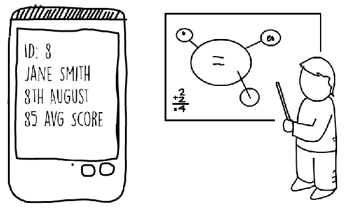

图 3.1：显示编号为八的课桌学生的记录的应用程序

在这个问题中，可以使用一个简单的数组来在内存中存储所有学生的记录。数组的每个位置可以包含一个学生记录。这将允许你使用*index = deskNumber - 1*的策略直接访问数组。如果在某一年你拥有的学生数量较少，并且不是所有的课桌都被占用，你将在相应的数组索引处放置 null。这种解决方案在*图 3.2*中显示。

这是一个直接寻址的示例，其中每个学生的记录都是通过一个键（课桌号）访问的。这种解决方案只能在可能的键范围足够小，可以放入直接在内存中的数组时使用：

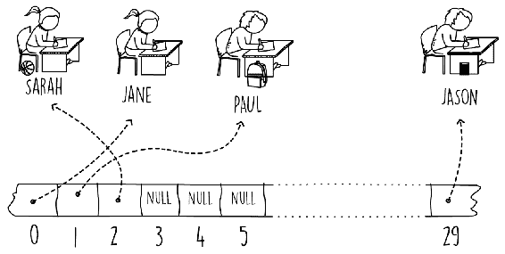

图 3.2：直接寻址的示例

为了帮助我们确定我们使用内存的效率，我们可以测量负载因子。负载因子是一个简单的指标，显示我们的数据结构被充分利用的程度。当班级达到最大容量时，数组中的所有元素都将包含一个记录。我们说我们的数据结构的负载因子是 1（或 100%）。例如，如果只有 15 名学生中的 30 个空间注册了特定年份，则负载因子为 0.5（50%）。较低的负载因子值意味着我们正在低效使用并浪费内存。

现在，让我们将我们的例子扩展到包括一个班级，甚至整个学校，而不仅仅是教授一个班级，你现在已经被提升为整个学校的校长。在这个新的职位上，你想要为目前注册的每个人保存学生记录。你还想存储任何不再在学校的学生的历史记录。你决定使用国家身份证或护照号码作为唯一标识每个学生的键。假设这是一所美国或欧盟的学校，国家身份证或护照号码通常由九位或更多的数字组成。

由于我们的输入范围相当大，直接处理这个问题将非常不切实际。

由于美国护照号码（或国家身份证）通常是九位数字，我们不得不构建一个巨大的数组来存储任何可能的数字。对于一个九位数字的范围，数组的大小将是 1,000,000,000。假设每个指针是四字节，这个数组本身就会消耗近 4 GB！这个例子中的负载因子也会非常低。大多数数组将是空的，因为学校只有几千名现任和往届学生。

我们仍然可以将学生的记录存储在一个容量为几千的数组中。我们需要的只是找到一种方法将我们的输入键范围压缩到我们的数组索引范围内。本质上，这意味着将我们的九位数字护照映射到一个四位的数字。这项工作可以通过所谓的哈希函数来完成。哈希函数将接受一个键（我们的护照号码）并返回一个位于我们数组大小内的数组索引（见*图 3.3*）。

我们说哈希函数将我们的输入键宇宙映射到我们选择的哈希范围，在这个例子中是数组大小：

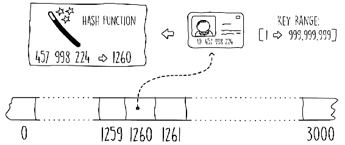

图 3.3：使用哈希函数

使用哈希函数使我们能够使用一个更小的数组，并节省大量内存。然而，有一个问题。由于我们正在将更大的键空间强制压缩到更小的空间中，存在多个键映射到同一个哈希数组索引的风险。这被称为**冲突**；我们有一个键哈希到已经填满的位置。如何处理冲突的策略以及哈希函数的选择构成了我们的哈希表。以下代码片段显示了一个 Java 接口，它定义了我们的哈希表 API。我们将在本章的后续部分逐步实现这个接口：

```java
public interface HashTable<K,V> {
  void put(K key,V value);
  Optional<V> get(K key);
  void remove(K key);
}  
```

代码片段 3.1：Hashtable 接口。源类名：Hashtable

访问[`goo.gl/FK1q6k`](https://goo.gl/FK1q6k)以获取此代码。

在 Java 中，类`java.util.Hashtable`和`java.util.HashMap`都实现了`HashTable`接口。这两个类的主要区别在于`HashMap`是非同步的，并允许 null 值。

在本节中，我们首先通过查看一个示例场景介绍了直接寻址。随后，我们将问题扩展到更大的键空间，展示了在这种情况下如何使用哈希表。在下一节中，我们将看到处理哈希表碰撞的两种常见解决方案。

# 处理链式碰撞

当两个键在我们的数组中哈希到同一个槽位时，我们该怎么办？覆盖数组中的元素不是一种选择，因为这会导致记录丢失。处理碰撞的一个常见技术是称为**链式**。在这个解决方案中，哈希表数据存储在实际数组之外。

链式背后的思想是，我们哈希数组中的每个条目都有一个指向其自己的链表的指针。我们添加到哈希表中的任何项目都存储在这些链表中。最初，数组中的每个条目都被初始化为包含一个空链表。每次我们在哈希表中插入特定数组槽位时，我们都会将其插入到与该位置关联的链表头部。这样，我们可以支持哈希碰撞。在已经占用的数组槽位上进行的另一个插入操作将导致其链表头部出现一个新项目。"图 3.4"展示了两个具有不同键的条目被哈希到同一个数组槽位的例子，导致这两个记录存储在链表中：

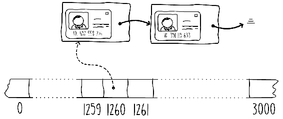

图 3.4：使用链表在单个哈希槽中链接多个条目

搜索特定键需要首先定位数组槽位，然后逐个遍历链表，寻找所需键，直到找到匹配项或到达链表末尾。"代码片段 3.2"展示了搜索（`get`）和插入（`put`）。删除（`remove`）操作可以通过代码片段后面的 URL 找到。我们使用 Java 的链表集合来实现这个哈希表。在构造函数中，数组使用给定的容量初始化，并且每个元素都填充了一个空链表。

使用 Java 的链表集合，我们可以在`get(key)`方法中搜索键时使用 Java 的 lambda 表达式。在搜索时，我们尝试将键与链表中的键匹配，并且只有在找到匹配项时才返回可选值。

使用 lambda 表达式还可以使我们通过仅调用带有键匹配谓词的`removeif()`方法（通过代码片段后面的 URL 可以找到删除操作）以干净的方式实现`delete`操作：

```java
public void put(K key, V value) {
  int hashValue = hashProvider.hashKey(key, array.length);
  array[hashValue].addFirst(new Pair<>(key, value));
}
public Optional<V> get(K key) {
  int hashValue = hashProvider.hashKey(key, array.length);
  return array[hashValue].stream()
    .filter(keyValue -> keyValue.getKey().equals(key))
    .findFirst()
    .map(Pair::getValue);
}  
```

代码片段 3.2：链式哈希表。源类名：ChainedHashTable

访问此代码请前往 [`goo.gl/mrzQfY`](https://goo.gl/mrzQfY)。

在 *片段 3.2* 中显示的搜索操作（`get()` 方法）的最佳运行复杂度对于包含 *n* 个项目的哈希表是当没有冲突时，结果是 *O(1)*，而最坏的情况是有 n 个冲突，结果是 *O(n)*。

在 *片段 3.2* 中显示的 `HashProvider` 接口简单地提供了一个实现哈希函数的方法。当我们在下一节探索不同的哈希技术时，我们将实现此接口。链式哈希表的时间复杂度取决于我们的链表有多长。最佳情况是当我们插入哈希表中的每个项目都散列到不同的槽位时，也就是说，没有冲突。在最佳情况下，当每个链表只包含一个项目时，我们有 *O(1)* 的运行时间，并且可以直接访问任何项目。

最坏的情况是另一个极端，即每个项目都散列到相同的值，导致一个包含 n 个项目的链表。当这种情况发生时，性能下降到 *O(n)* 的时间来搜索所需的关键字。这是因为我们需要遍历 *n* 个节点的链表来搜索所需的关键字。

这种最坏的时间复杂度 *O(n)* 适用于所有哈希表，而不仅仅是链式哈希表。然而，平均而言，如果选择了正确的哈希函数，哈希表的运行性能可以接近 *O(1)*。

链式哈希表没有负载限制。即使在没有任何槽位为空的情况下，我们仍然可以通过继续向链表追加来向哈希表添加更多项目。这意味着链式哈希表的负载因子可以超过 1 的值。

链式哈希表是最流行的冲突解决实现方式。这是因为它们易于实现，提供了良好的性能，并且与一些其他技术不同，允许哈希表结构动态扩展，超过 *1* 的负载因子。在下一节中，我们将讨论另一种处理冲突的解决方案，称为 **开放寻址**。

# 使用开放寻址处理冲突

在前一节中，我们看到了如何使用每个数组位置的链表来处理冲突。链式哈希表将不断增长，没有任何负载限制。开放寻址只是处理哈希冲突的另一种方法。在开放寻址中，所有项目都存储在数组本身中，使得结构静态，最大负载因子限制为 *1*。这意味着一旦数组满了，就不能再添加任何项目。使用开放寻址的优点是，由于你不需要使用链表，你可以节省一点内存，因为你不需要存储任何指针引用。

然后，你可以使用这额外的内存来拥有一个更大的数组，并存储更多的键值对。要在开放地址哈希表中插入，我们首先对键进行哈希处理，然后将项目插入到哈希槽中，就像正常哈希表一样。如果槽位已被占用，我们搜索另一个空槽，并将项目插入其中。我们搜索另一个空槽的方式被称为**探测序列**。

一种简单的策略，如*图 3.5*所示，是通过查看下一个可用的槽位来搜索。这被称为**线性探测**，我们从哈希值处的数组索引开始，继续增加索引一个单位，直到找到一个空槽。在搜索键时也需要使用相同的探测技术。我们从哈希槽开始，继续前进，直到匹配到键或遇到一个空槽：

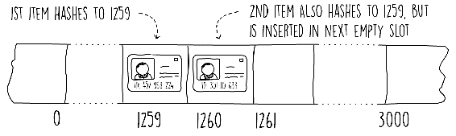

图 3.5：开放地址中的线性探测

下面的代码片段展示了线性探测插入的伪代码。在这个代码中，我们在找到哈希值后，通过增加指针一个单位，继续寻找一个空槽。

一旦我们到达数组的末尾，我们使用*模数*运算符将其绕回到开始。这种技术与我们在实现基于数组的栈时使用的技术类似。我们停止增加数组指针，要么当我们找到一个 null 值（空槽），要么当我们回到起点，这意味着哈希表已满。一旦我们退出循环，我们就存储键值对，但前提是哈希表没有满。

伪代码如下：

```java
insert(key, value, array)
  s = length(array)
  hashValue = hash(key, s)
  i = 0
  while (i < s and array[(hashValue + i) mod s] != null)
    i = i + 1
  if (i < s) array[(hashValue + i) mod s] = (key, value)  
```

3.3 节片段：使用线性探测插入的伪代码

搜索键的操作与插入操作类似。我们首先需要从键中找到哈希值，然后以线性方式搜索数组，直到我们遇到键、找到一个 null 值或遍历数组的长度。

如果我们要从我们的开放、地址哈希表中删除项，我们不能简单地从数组中删除条目并将其标记为 null。如果我们这样做，搜索操作将无法检查所有可能的位置，这些位置可能已经找到了键。这是因为搜索操作一旦找到 null 就会停止。

一种解决方案是在每个数组位置添加一个标志，表示已删除项目，但未将条目设置为 null。搜索操作可以修改为继续过去标记为已删除的条目。插入操作也需要更改，以便如果它遇到标记为已删除的条目，它将在该位置写入新项目。

线性探测有一个称为**聚类**的问题。这发生在一系列非空槽位连续出现时，会降低搜索和插入性能。一种改进的方法是使用称为**二次探测**的技术。这种策略与线性探测类似，但我们在使用二次公式*h + (ai + bi²)*探测下一个空槽位，其中*h*是初始哈希值，*a*和*b*是常数。*图 3.6*显示了使用*a = 0*和*b = 1*时线性探测和二次探测之间的差异。该图显示了两种技术探索数组的顺序。

在二次探测中，我们将*3.3 节代码片段*改为检查以下数组索引：

```java
 array[(hashValue + a*i + b*i²) mod s] 
```


图 3.6 线性探测与二次探测的比较

虽然二次探测减少了聚类的效果，但它有一个称为**次级聚类**的问题。然而，这仍然会降低性能。此外，常数*a*和*b*以及数组大小需要仔细选择，以便探测可以探索整个数组。

在开放寻址哈希表中使用的另一种探测策略被称为**双重哈希**。这利用另一个哈希函数来确定从初始哈希值开始的步长偏移。在双重哈希中，我们使用表达式*h + ih'(k)*来探测数组，其中*h*是哈希值，*h'(k)*是对键应用的一个辅助哈希函数。探测机制与线性探测类似，我们从*i*为零开始，每次冲突时增加一。这样做会导致每*h'(k)*步探测数组。双重哈希的优势在于探测策略在每次键插入时都会改变，从而减少了聚类的可能性。

在双重哈希中，必须注意确保整个数组被探索。这可以通过各种技巧实现。例如，我们可以将数组大小设置为偶数，并确保辅助哈希函数只返回奇数。

# 执行线性探测搜索操作

这里的目的是为线性探测中的搜索操作开发伪代码。

执行以下步骤：

1.  编写类似于*3.3 节代码片段*的伪代码以显示搜索操作。如果键在哈希表中找不到，则操作应返回 null。搜索函数的签名如下：

```java
 search(key, array)  
```

1.  可以按照以下方式开发伪代码：

```java
search(key, array)
s = length(array)
hashValue = hash(key, s)
i = 0
while (i < s and array[(hashValue + i) mod s] != null
  and array[(hashValue + i) mod s].key != key)
  i = i + 1
keyValue = array[(hashValue + i) mod s]
if (keyValue != null && keyValue.key == key) 

```

```java
  return keyValue.value
else return null 

```

3.4 节代码片段：使用线性探测的搜索操作的伪代码

在本节中，我们看到了另一种处理哈希冲突的方法，即保持所有项目在数组本身中，节省内存，但限制了结构的静态性。在下一个小节中，我们将详细介绍一些可用的各种哈希函数。

# 余数和乘法哈希函数

对于哈希表，哈希函数将特定键的空间映射到一个更小的数字范围。更正式地说，哈希函数*f*将特定数据类型的键映射到固定区间*[0,..., N - 1]*中的整数。我们说*f(x)*对*x*的值进行哈希。

哈希函数只能接受数值数据类型。为了使我们能够在更复杂的数据类型上使用哈希表，我们通常需要将这些类型转换为数值表示。这种转换因数据类型的不同而不同。例如，一个字符可以转换为它的 UTF-8（或 ASCII）数值等效。转换整个字符串可以通过分别转换每个字符然后使用一种策略将字符组合成一个值来完成。

在 Java 中，`hashCode()`方法将对象转换为数值表示，这可以由哈希函数使用。它在对象类中存在，可以通过自定义实现来重写。

有许多技术可以帮助我们将广泛的键映射到更小的键集中。一个理想的哈希函数是那种将冲突减少到最小程度的函数。换句话说，当使用一个好的哈希函数时，每个键填充我们数组中任何槽位的概率都是相同的。在实践中，除非我们知道输入分布，否则找到理想的哈希函数是非常困难的。

实现哈希函数的一个简单技术被称为**余数法**。哈希函数简单地接受任何数值键，将其除以表大小（数组大小），并使用得到的余数作为哈希值。这个值然后可以用来作为数组的索引。

以下代码展示了如何使用取模运算符在 Java 中实现余数哈希方法：

```java
public int hashKey(Integer key, int tableSize) {
  return key % tableSize;
}  
```

代码片段 3.5：余数法。源类名：RemainderHashing

访问[`goo.gl/wNyWWX`](https://goo.gl/wNyWWX)以获取此代码。

如果在选择适当的表大小时不小心，余数方法可能会导致许多冲突。再次考虑本节开头给出的例子，我们使用学生的护照或国家身份证号来识别学校中的学生。为了演示这个问题，我们使用了一个大小为 1,000 个元素的基于数组的哈希表。碰巧的是，在该学校所在的国家，护照号码的最后四位代表护照持有人的出生年份。

在这个场景中使用余数方法时，所有同一年出生的学生都会哈希到相同的值，导致哈希表上发生大量冲突。

选择一个更好的表大小是使用一个素数，理想情况下不要太接近 2 的幂。例如，在我们的例子中，1,447 是一个不错的选择，因为它既不太接近 1,024 或 2,048（2 的 10 次方和 2 的 11 次方），也是素数。使用这个值作为我们的示例表大小将减少冲突。

使用余数方法限制了我们对哈希表大小的选择（以减少冲突的机会）。为了解决这个问题，我们可以使用不同的哈希技术，称为**乘法方法**。在这个方法中，我们将键乘以一个常数双值，*k*，在范围*0 < k < 1*内。然后我们从结果中提取分数部分，并将其乘以我们哈希表的大小。

然后哈希值是这个结果的下界：

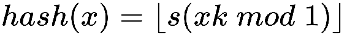

其中：

+   *k* 是介于 0 和 1 之间的十进制数

+   *s* 是哈希表的大小

+   *x* 是键

# 实现哈希表的乘法方法

目标是开发一个 Java 代码，用于实现哈希表的乘法方法。

执行以下步骤：

1.  实现一个类，其中包含一个方法，该方法接受一个整数并使用本节中所示的乘法方法返回哈希值。常数*k*作为类的构造函数传入。方法签名应该是：

```java
 int hashKey(int key, int tableSize) 
```

1.  以下代码显示了乘法哈希函数的实现：

```java
private double k;
public MultiplicationHashing(double k) {
  this.k = k;
}
public int hashKey(Integer key, int tableSize) {
  return (int) (tableSize * (k * key % 1));
}  
```

片段 3.6：乘法方法的解决方案。源类名：MultiplicationHashing。

前往 [`goo.gl/xJ7i1b`](https://goo.gl/xJ7i1b) 访问此代码。

在本节中，我们看到了两种基本的计算哈希值的技术，即余数方法和乘法方法。这两种策略在哈希表中都得到了广泛的应用。

在下一节中，我们将检查另一种机制，称为**通用哈希**。

# 通用哈希

乘法哈希和余数哈希方法都存在一个共同的弱点。如果攻击者知道我们哈希函数的细节（表大小和任何常数值），他/她可以设计一个输入键序列，导致每个项目都发生冲突，将我们的哈希表变成链表，并减慢我们的程序。为了解决这个问题，可以使用一种称为通用哈希的哈希技术。

通用哈希通过在执行开始时从通用哈希函数集中选择一个随机函数来工作。这使得攻击者难以猜测所使用的哈希技术的确切工作方式。通过使用这种技术，相同的键序列将在每次执行中产生不同的哈希值序列。

一组大小为*n*的哈希函数*H*，其中每个函数将键的集合∪映射到固定范围*0, s)*，对于所有成对，其中*a*, *b ∈ ∪*，*a ≠ b*，且*h(a) = h(b)*，*h ∈ H*的概率小于或等于*n/s*。

我们可以通过使用两个整数变量*i*在范围*[1, p)*内，和*j*在范围*[0, p)*内来构造我们的通用哈希函数集，其中*p*是大于输入键宇宙可能值的任何值的质数。然后我们可以使用以下方法从这个集合中生成任何哈希函数：

![

其中*s*是哈希表的大小，*x*是键。

```java
BigInteger class to work out the hash key. This is needed because multiplying a long Java numeric type with a large integer might result in a big enough value that exceeds the maximum capacity of a Java long. The choice of p in this method is such that any integer key input will always have a smaller value, since in Java an integer only has a maximum value of *2**31*:
```

```java
public UniversalHashing() {
  j = BigInteger.valueOf((long) (Math.random() * p));
  i = BigInteger.valueOf(1 + (long) (Math.random() * (p -  1L))); 
}
public int hashKey(Integer key, int tableSize) {
  return i.multiply(BigInteger.valueOf(key)).add(j)
    .mod(BigInteger.valueOf(p))

```

```java
    .mod(BigInteger.valueOf(tableSize))
    .intValue();
}  
```

3.7 节片段：整数键的通用哈希。源类名：UniversalHashing

前往 [`goo.gl/5Kv7qG`](https://goo.gl/5Kv7qG) 访问此代码。

Java 通过 `Object.hashcode()` 方法提供了哈希表和内置的哈希机制。因此，要实现一个与 Java 现有的 `hashcode()` 方法集成的通用哈希表非常困难，因为前述代码中的 `i` 和 `j` 变量必须在不同对象之间共享，这些对象被插入到同一个表中。

更多信息和关于为什么选择大于键素数的数学证明，请参阅 Carter 和 Wegman 的 *通用哈希函数类*，*计算机与系统科学杂志*：[`doi.org/10.1016/0022-0000(79)90044-8`](https://doi.org/10.1016/0022-0000(79)90044-8)。

通用哈希提供了良好的结果，最小化了冲突，并且由于函数参数是随机选择的，因此对恶意攻击具有免疫力。

# 活动：实现开放寻址

**场景**

我们被要求开发一个算法，使用开放寻址技术从哈希表中搜索和删除数据。

**目标**

使用线性探测实现开放寻址哈希表

**先决条件**

为了解决此活动，你必须实现 GitHub 上以下 URL 中提供的类中的方法：

[`github.com/TrainingByPackt/Data-Structures-and-Algorithms-in-Java/blob/master/src/main/java/com/packt/datastructuresandalg/lesson3/activity/openaddressing/OpenAddrHashTable.java`](https://github.com/TrainingByPackt/Data-Structures-and-Algorithms-in-Java/blob/master/src/main/java/com/packt/datastructuresandalg/lesson3/activity/openaddressing/OpenAddrHashTable.java)

如果你已经设置了项目，你可以通过运行以下单元测试来运行此活动的以下测试：

`**gradlew test --tests com.packt.datastructuresandalg.lesson3.activity.openaddressing***`

**完成步骤**

1.  研究第 3.3 节和第 3.4 节中显示的伪代码

1.  在 Java 中实现它们

1.  创建一个容器类，该类将持有哈希表中的键和值

1.  在此容器上设置一个标志，以指示项目已删除

1.  在插入操作中使用此标志，如果它被删除则覆盖它

# 开始使用二叉搜索树

像哈希表一样，二叉搜索树是用于组织键值对并实现数据字典操作的快速查找数据结构。除了提供插入、搜索和删除操作外，二叉树还支持高效的查询，例如查找最小值和最大值、后继和前驱。当使用平衡二叉搜索树时，插入和搜索操作的最坏情况时间复杂度为 *O(log n)*。这比哈希表的最坏情况时间复杂度 *O(n)* 有很大的理论改进。

# 二叉树结构

二叉树的结构由一系列通过指针连接在一起的节点组成。*图 3.8*展示了节点之间的基本关系。每个节点最多可以有两个子节点，一个左子节点和一个右子节点。

每个节点（除了顶级节点）恰好有一个父节点：

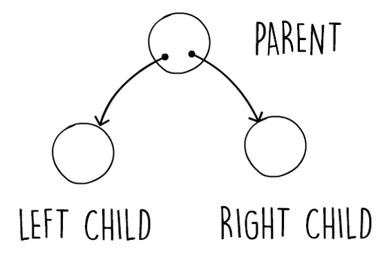

图 3.8：展示简单的二叉树关系

*图 3.9*展示了应用于二叉树的更多术语。在这个图中，我们还展示了二叉树节点可以通过显示存储不同形状的节点来持有数据项。顶级节点被称为根节点。在树结构中，根节点是唯一没有父节点的节点。没有子节点的节点被称为叶子节点。树的高度是从根节点到最远叶子节点所需跳跃的数量。该图展示了一个高度为 2 的树的示例。

树的高度是一个重要的度量，因为它会影响性能。树越浅（高度越小），树结构的表现力越强。

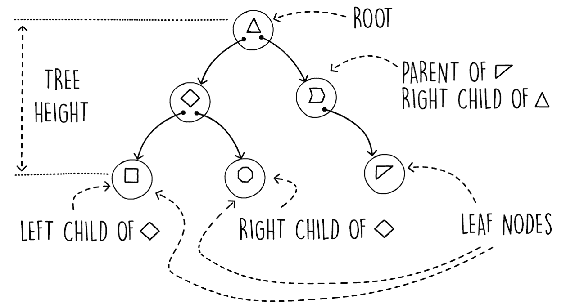

图 3.9：二叉树术语

与链表类似，二叉树结构是通过指针和节点对象来建模的。在链表节点中，我们只有一个指向下一个节点的指针。同样，在二叉树节点中，我们有两个指针，每个指针链接到一个子节点。这些是左子节点指针和右子节点指针。下面的代码片段展示了如何使用 Java 类来建模二叉树节点：

```java
public class BinaryTreeNode<K,V> {
  private BinaryTreeNode<K,V> left;
  private BinaryTreeNode<K,V> right;
  private K key;
  private V value;
  public BinaryTreeNode(K key, V value) {
    this.key = key;
    this.value = value;
  } 
```

代码片段 3.8：二叉树节点类。为了简洁，省略了一些 getter 和 setter 方法。源类名：BinaryTreeNode

前往 [`goo.gl/D6Jvo2`](https://goo.gl/D6Jvo2) 访问此代码。

因此，我们可以有一个表示二叉树本身的另一个类，其中将实现操作。这个类只需要持有根节点的指针，因为任何节点都可以从根节点开始，通过导航向下到达。在下面的代码片段中，我们展示了声明二叉树的接口：

```java
public interface BinaryTree<K,V> {
  void put(K key,V value);
  Optional<V> get(K key);
} 
```

代码片段 3.9：二叉树接口。源类名：BinaryTree。

前往 [`goo.gl/jRcLhu`](https://goo.gl/jRcLhu) 访问此代码。

在本节中，我们介绍了二叉树的结构和术语。然后我们学习了如何使用 Java 类来建模每个节点。在下一节中，我们将通过介绍二叉搜索树并实现插入和搜索操作来继续构建这些概念。

# 二叉搜索树操作

二叉搜索树是数据以有序方式组织的普通二叉树。考虑我们在上一节中遇到的问题，即学校使用护照号码作为键来保存学生的记录。*图 3.10*展示了如何在二叉树中组织数据的示例。

注意在每个节点，左子节点的键总是小于它自己的键。另一方面，右子节点的键更大。如图所示，根节点有一个左子节点，其键的值小于根键。另一方面，右子节点的键的值大于根。

这条规则在整个树中重复出现。在二叉搜索树中，左子节点总是比父节点具有更小的键，而右子节点将具有更大的键。利用这个二叉搜索树的属性，我们可以在树结构上创建高效的操作：

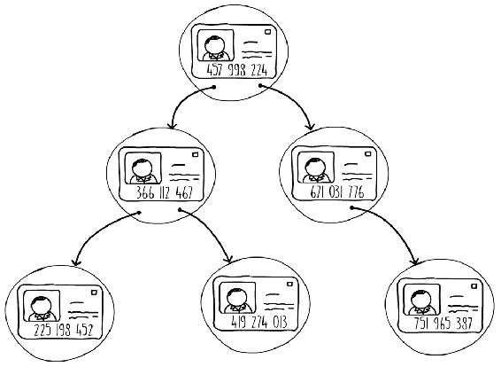

图 3.10：二叉搜索树的示例

由于这个简单的规则，树表现出重要的属性。例如，注意所有是根节点左子节点后代的节点都具有比根节点更小的键。这个属性对树中的任何节点都有效。一个节点的左子树上的所有键总是具有更小的键，反之亦然。

在二叉搜索树中进行搜索需要我们遵循一些简单的指令。我们从根节点开始，在每一个节点，我们问自己：“<q class="pcalibre5 pcalibre4 calibre33">我们要找的键是否等于、小于还是大于这个节点的键？</q>”如果键相等，我们就完成了，并且我们已经找到了我们的节点。如果键小于，我们跟随左子节点指针，否则我们跟随右子节点。我们重复这一步骤，直到找到我们的键或遇到一个*null 子节点指针*。

二叉搜索树的另一个重要属性是能够轻松地找到树中的最大和最小键。在二叉树中找到最大键很容易。概念上，这是最右边的节点。这可以通过从根节点开始，并且总是选择右子节点，直到没有更多的右子节点可以选择来实现。对于最小键，这个逻辑是相反的（选择左子节点）。

以下代码片段显示了搜索实现。在这个实现中，我们使用递归的力量来执行搜索。我们首先通过检查根节点是否为 null 来检查树是否为空。如果存在根节点，我们比较键并返回值或递归搜索子节点。为了比较键，我们假设提供的键实现了可比较接口。使用 Java 的可选扁平映射使我们的实现更加简洁：

```java
public Optional<V> get(K key) {
  return Optional.ofNullable(root).flatMap(n -> get(key, n));
}
private Optional<V> get(K key, BinaryTreeNode<K, V> node) {
  if (((Comparable) key).compareTo(node.getKey()) == 0)
    return Optional.of(node.getValue());
  else if (((Comparable) key).compareTo(node.getKey()) < 0)
    return node.getLeft().flatMap(n -> get(key, n));
  else
    return node.getRight().flatMap(n -> get(key, n));
} 
```

碎片 3.10：二叉搜索树搜索操作。源类名：SimpleBinaryTree。

前往[`goo.gl/xE2GvH`](https://goo.gl/xE2GvH)访问此代码。

Java 中，在可比较接口中的`objectA.compareTo(objectB)`方法返回一个负整数、零或正整数，这取决于`objectA`是小于、等于还是大于`objectB`。因此，以下语句：

```java
((Comparable) key).compareTo(node.getKey()) < 0 
```

概念上等同于以下内容：

```java
key < node.getKey()
```

在二叉树中插入的逻辑与搜索操作相同。我们从根节点开始，继续寻找需要创建新节点的地方。这将在下一个代码片段中展示。像搜索操作一样，这个 Java 实现也是递归的。如果根节点不存在，我们只需创建一个新的，否则我们根据键值的值递归地通过选择左子节点或右子节点来插入键值对。

我们有三个递归调用的停止条件，如下所述：

+   当*键值*等于节点上的键值时，我们简单地覆盖条目

+   当*左子节点不存在*时，我们创建一个新的节点，包含键值对

+   当*右子节点不存在*时，我们创建一个新的节点，包含键值对

以下代码演示了二叉搜索树的插入操作：

```java
if (((Comparable) key).compareTo(node.getKey()) == 0) {
  node.setKey(key);
  node.setValue(value);
} else if (((Comparable) key).compareTo(node.getKey()) <0) {
  if (node.getLeft().isPresent())
    put(key, value, node.getLeft().get());
  else
    node.setLeft(new BinaryTreeNode<>(key, value));
} else {
  if (node.getRight().isPresent())
    put(key, value, node.getRight().get());
  else
    node.setRight(new BinaryTreeNode<>(key, value));
}
```

代码片段 3.11：二叉搜索树插入操作。源类名：SimpleBinaryTree

前往 [`goo.gl/hHpeiP`](https://goo.gl/hHpeiP) 访问此代码。

二叉树删除需要将子树结构与多种模式匹配，并对每种情况执行不同的操作。在某些情况下，它要求你将子树与被删除节点的父节点连接起来，这可能相当复杂。因此，删除算法超出了本书的范围。有关删除操作的信息，你可以参考以下来源：

+   *《计算机程序设计艺术，第 3 卷：排序与搜索》，作者 Donald Knuth*。

+   Paul E. Black, "binary search tree", in Dictionary of *Algorithms and Data Structures* [online], Vreda Pieterse and Paul E. Black, eds. January 26, 2015\. 可在 [`www.nist.gov/dads/HTML/binarySearchTree.html`](https://www.nist.gov/dads/HTML/binarySearchTree.html) 获取。

# 在二叉树中搜索最小键值

目标是在 Java 中实现一个方法来搜索二叉树中的最小键值。

执行以下步骤：

1.  向二叉树实现中添加以下签名的函数：

```java
 public Optional<K> minKey()  
```

1.  该方法需要找到树中的最小键值并返回它。如果树为空，它应返回一个空的可选对象。

1.  在二叉搜索树中寻找最小值需要我们始终跟随左子节点，直到我们到达一个没有左子指针的节点。以下代码演示了这一点：

```java
public Optional<K> minKey() {
  return Optional.ofNullable(root).map(this::minKey);
}
private K minKey(BinaryTreeNode<K, V> node) {
  return node.getLeft().map(this::minKey).orElse(node.getKey());
}  
```

代码片段 3.12：最小键值操作。源类名：SimpleBinaryTree。

前往 [`goo.gl/YbZz6i`](https://goo.gl/YbZz6i) 访问此代码。

在本节中，我们介绍了二叉搜索树，并探讨了如何使用它们来组织键值对。我们还看到了如何使用二叉搜索树进行简单的范围查询，例如查找最大和最小键值。在下一节中，我们将学习所有不同的方法来遍历二叉搜索树。

# 遍历二叉搜索树

遍历二叉树是逐个节点地遍历树并对其中的数据进行某种操作（如打印键值对）的过程。有两种主要的技术来执行树遍历：深度优先搜索和广度优先搜索，分别称为 DFS 和 BFS。

在深度优先搜索中，算法沿着树节点的路径向下搜索，直到无法再前进。一旦无法再前进，它就会回溯并发现任何剩余的未探索分支。以下代码展示了递归实现。在这个遍历方法中，根据动作在方法中执行的位置，会产生不同的输出序列。

在**前序**执行中，我们一旦发现新节点就立即执行操作。另一方面，**后序**执行是在一个节点的两个子节点都已被探索并且即将回溯时进行的。**中序**执行是在处理左子节点之后但在处理右子节点之前进行的。当使用中序遍历时，二叉搜索树中的键将按升序处理：

```java
public void printDfs() {
  Optional.ofNullable(root).ifPresent(this::printDfs);
}
private void printDfs(BinaryTreeNode<K, V> node) {
  //System.out.println("PREORDER " + node.getKey());
  node.getLeft().ifPresent(this::printDfs);
  System.out.println("INORDER " + node.getKey());
  node.getRight().ifPresent(this::printDfs);
  //System.out.println("POSTORDER " + node.getKey());
}  
```

代码片段 3.13：深度优先搜索。源类名：SimpleBinaryTree

前往[`goo.gl/xMzkbE`](https://goo.gl/xMzkbE)访问此代码。

在广度优先搜索遍历中，算法逐层探索二叉树，从左到右。遍历从根节点开始，以叶节点结束。一个示例二叉树的输出显示在*图 3.11*中。为了实现二叉树的 BFS 遍历，我们可以使用初始化为包含根节点的队列。然后，当队列不为空时，我们读取队列上的第一个节点，处理它，并将左子节点首先然后是右子节点添加到队列中：

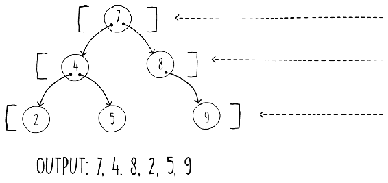

图 3.11：二叉树上的广度优先搜索

我们如下展示其伪代码：

```java
breadthFirstSearch(root)
  if (root != null)
    queue = createQueue()
    enqueue(queue, root)
    while (not isEmpty(queue))
      node = dequeue(queue)
      process(node)
      if (node.left != null) enqueue(queue, node.left)
      if (node.right != null) enqueue(queue, node.right)  
```

代码片段 3.14：广度优先搜索的伪代码

如果我们将队列替换为栈，*代码片段 3.14*中显示的算法将从广度优先搜索变为非递归的深度优先搜索。实际上，实现非递归 DFS 的方法是利用栈。

# 活动：在 Java 中实现 BFS

**场景**

我们被要求编写代码来实现一个算法，该算法逐层、从左到右搜索二叉树。遍历从根节点开始，以叶节点结束。

**目标**

在 Java 中应用 BFS 遍历。

**完成步骤**

1.  在 Java 中实现前面代码中显示的算法。

1.  使用 Java `LinkedList`集合实现伪代码中显示的队列。方法签名应如下所示：

```java
 public void printBfs() 
```

在本节中，我们学习了各种遍历二叉树的方法以及每种策略产生的不同排序。我们还看到了这些算法可以以递归和迭代的方式实现。在下一节中，我们将讨论一种更严格的二叉搜索树类型，确保我们的数据结构即使在最坏输入情况下也能保持良好的性能。

# 平衡二叉搜索树

二叉搜索树的性能与其高度成正比。这是因为搜索和插入操作从根节点开始，逐个节点向下进行，每个步骤都进行键比较。树越高，需要的步骤就越多。因此，如果我们确定二叉树相对于其输入的最大可能高度，我们就可以找出最坏情况下的运行复杂度。

如果我们在二叉树中插入键，总是添加到父节点的右子节点，最终得到的树类似于图 3.12 左侧所示的树。在这个图中，每个节点只使用了右子指针。我们得到一个高度为*n*的树，其中*n*是我们数据结构中添加的项目数量。当键输入模式有序时，我们会得到这种单侧树。

在图 3.12 所示的示例中，我们首先插入 5 作为根节点，然后添加 7 作为右子节点，接下来是 12 作为下一个右子节点，以此类推。总是插入递增的数字会导致下一个节点在右侧。这种输入模式使得我们的二叉搜索树操作（搜索、插入和删除）在最坏情况下的运行时间为*O(n)*：

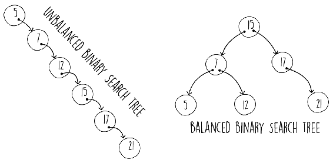

图 3.12：不平衡与平衡的二叉树

如果我们从一个大数字开始并每次都减小它，结果也会类似。我们最终得到图 3.12 左侧所示的树的镜像。

当键插入顺序为"1,2,3,4,5,6,7"时，在正常二叉搜索树中进行 BFS 遍历的输出将与输入顺序相同，即"1,2,3,4,5,6,7"。我们在每次插入时都会创建一个新的右子节点。由于 BFS 遍历是逐级处理的，从根节点开始，遍历输出与输入相同。

在图 3.12 的右侧，我们展示了另一个包含相同键的二叉树。这个二叉树已经通过重构而变得较短。请注意，这个树仍然是有效的，也就是说，左子节点总是有一个小于其父节点的键，反之亦然。一个平衡的二叉树的高度大约为*log[2]n*。

如果我们能够在每次插入时以*O(log n)*或更好的时间复杂度重新平衡二叉搜索树，那么插入和搜索的最坏情况运行时间性能也将是*O(log n)*。

幸运的是，存在各种算法可以在你执行插入操作时自动平衡树结构。以下是一些最常见的算法：

+   AVL 树

+   红黑树

+   AA 树

所有这些算法都会检查在关键插入时二叉树是否遵循特定的平衡规则。如果由于插入新节点，树变得不平衡，则自平衡算法启动并重新结构化一些节点以保持树平衡。重新平衡节点的技术依赖于树旋转，在特定条件下，一些父节点和子节点会旋转。重要的是，这些修改在最坏情况下也以 *O(log n)* 的复杂度执行，这意味着在二叉树上的插入和搜索的最坏运行时间复杂度都是 *O(log n)*。在本节中，我们将检查树旋转，因为它们是大多数自平衡树的基本操作。

更多关于自平衡树的信息，您可以参考以下资源：

*计算机程序设计艺术*，*第 3 卷：排序与搜索*，由**唐纳德·克努特**著。

Paul E. Black, "*红黑树*", 在 *算法与数据结构词典* [在线], Vreda Pieterse 和 Paul E. Black 编著. 2015 年 4 月 13 日\. 可在以下链接中找到：[`www.nist.gov/dads/HTML/redblack.html`](https://www.nist.gov/dads/HTML/redblack.html).

*图 3.13* 展示了左右旋转的示例。注意正在旋转的节点（右旋转中的节点 5 和左旋转中的节点 9）最终成为新的父节点。重要的是，子指针重新分配的数量是恒定的。在树旋转后，二叉搜索树的性质仍然有效，即，左子指针始终指向一个较小的键，该键指向其父节点，反之亦然。这意味着我们可以执行任意数量的这些树旋转，我们的二叉搜索树仍然有效：

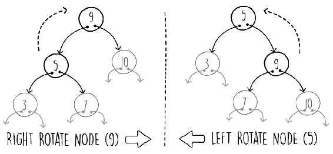

图 3.13：左右树旋转

*片段 3.15* 展示了我们在 Java 中如何执行右旋转。该方法接受需要旋转的顶层节点（*图 3.13* 中的节点 5）及其父节点。该方法需要父节点，因为它必须重新分配其子指针。在树节点上执行相反的右旋转是以下方法的镜像：

```java
public void leftRotate(BinaryTreeNode<K, V> nodeX,
 BinaryTreeNode<K, V> parent) {
  BinaryTreeNode<K, V> nodeY = nodeX.getRight().get();
  nodeX.setRight(nodeY.getLeft().orElse(null));
  if (parent == null)
    this.root = nodeY;
  else if (parent.getLeft().filter(n -> n == nodeX).isPresent())
    parent.setLeft(nodeY);
  else
    parent.setRight(nodeY);
    nodeY.setLeft(nodeX);
} 
```

片段 3.15：左树旋转的 Java 实现。源类名：SimpleBinaryTree

访问[`goo.gl/Ts3JBu`](https://goo.gl/Ts3JBu)以获取此代码。

# 应用右树旋转

目标是在 Java 中实现右树旋转。

将 *片段 3.15* 修改为使方法执行右树旋转而不是左树旋转。以下代码显示了所需的修改：

```java
public void rightRotate(BinaryTreeNode<K, V> nodeX,
 BinaryTreeNode<K, V> parent) {
  BinaryTreeNode<K, V> nodeY = nodeX.getLeft().get();
  nodeX.setLeft(nodeY.getRight().orElse(null));
  if (parent == null)
    this.root = nodeY;
  else if (parent.getRight().filter(n -> n == nodeX).isPresent())
    parent.setRight(nodeY);
  else
    parent.setLeft(nodeY);
    nodeY.setRight(nodeX);
} 
```

片段 3.16：右树旋转的 Java 实现。源类名：SimpleBinaryTree

访问[`goo.gl/KKDWUa`](https://goo.gl/KKDWUa)以获取此代码。

右旋是左旋的精确镜像。只需将所有左引用更改为右引用，反之亦然。

在本节中，我们看到了如何通过使用树旋转来平衡数据结构，从而提高二叉搜索树的性能。这使得树保持较短的长度，运行时间复杂度为*O(log n)*。

# 活动：在以中序遍历树时检索元素的后续节点

**场景**

我们需要编写一个方法，该方法接受一个键作为参数，返回在二叉搜索树中找到的下一个中序键。如果作为参数给出的键未找到，则该方法应返回下一个中序键。如果二叉树为空或所有存储的键都小于参数，则返回值应为空。例如，使用存储在二叉搜索树中的集合{10, 13, 52, 67, 68, 83}：

+   输入 13 的结果为 52

+   输入 67 的结果为 68

+   输入 55 的结果为 67

+   输入 5 的结果为 10

+   输入 83 的结果为`Optional.empty`

+   输入 100 的结果为`Optional.empty`

+   在空二叉树上输入任何值的结果为`Optional.empty`

中序后继者和前驱者算法有许多应用。例如，假设你需要在某个体育赛事中保持一个排行榜，而你只想显示前三名运动员。如果你将数据存储在二叉搜索树中，你可以找到最大键，然后计算出下一个两个前驱节点。

解决方案需要具有*O(log n)*的运行时间复杂度。

**目标**

当树以中序遍历的方式检索一个元素的后续节点。

**先决条件**

实现以下方法，该方法在`InOrderSuccessorBinaryTree`类中提供，该类扩展了`SimpleBinaryTree`类，可在以下链接在 GitHub 上找到：

[`github.com/TrainingByPackt/Data-Structures-and-Algorithms-in-Java/blob/master/src/main/java/com/packt/datastructuresandalg/lesson3/activity/inordersuccessor/InOrderSuccessorBinaryTree.java`](https://github.com/TrainingByPackt/Data-Structures-and-Algorithms-in-Java/blob/master/src/main/java/com/packt/datastructuresandalg/lesson3/activity/inordersuccessor/InOrderSuccessorBinaryTree.java)

```java
 public Optional<K> inOrderSuccessorKey(K key) 
```

如果你已经设置了你的项目，你可以通过运行以下命令来运行此活动的单元测试：

`gradlew test --tests com.packt.datastructuresandalg.lesson3.activity.inordersuccessor*`

**完成步骤**

1.  首先使用非递归搜索操作找到键值等于或小于输入的第一个节点

1.  意识到中序后继者只能位于两个地方之一，要么是这个节点的父节点，要么是这个节点右子树（如果有）的最小键（键值最小的节点）

# 摘要

在本章中，我们研究了实现数据字典操作中最常用的两种数据结构。哈希表提供了快速的内存插入和查找操作。此外，二叉树还赋予我们执行各种范围查询的能力，例如后继、前驱、最小值和最大值。在本章中，我们看到了这两种数据结构的示例以及这些操作的实现。
