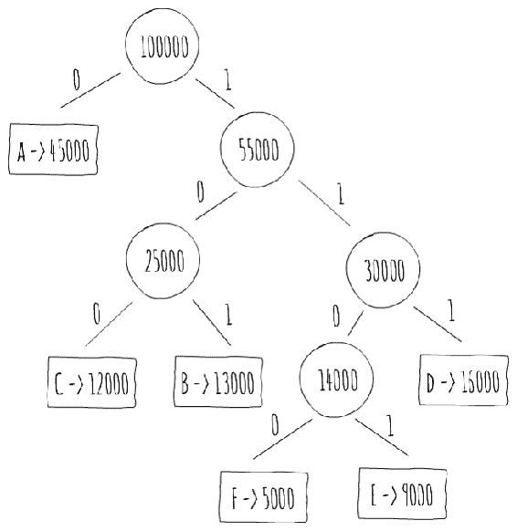

# 算法设计范式

在上一章中，我们学习了哈希表和二叉搜索树。在这一章中，我们将探讨算法设计范式。这些设计模式可以被视为激发一类算法设计的通用方法或方法。

正如算法是比计算机程序更高层次的抽象一样，算法设计范式是比算法更高层次的抽象。在设计算法时，选择算法范式是一个重要的决定。

本章将重点介绍以下三个算法范式：

+   贪心

+   分治

+   动态规划

通过熟悉这些更高层次的抽象，你可以在设计算法时做出更明智的决定。

在前一章中，我们遇到了归并排序和快速排序算法，它们是分治范式的例子。正如其名所示，这两个算法都将输入*分割*成更小的部分，然后递归地解决（*征服*）。

显然，还有更多的算法设计范式，但这三个已经涵盖了广泛的问题范围。本书中未讨论的其他范式包括回溯和剪枝搜索。甚至还有一些范式专注于计算机科学的特定分支。计算几何中的扫描线算法就是这类范式的例子。

到本章结束时，你将能够：

+   描述贪心、分治和动态规划算法范式

+   分析使用描述的范式解决的常见问题

+   列出每个范式要解决的问题的性质

+   解决一些解释每个范式适用性的知名问题

# 介绍贪心算法

算法通常经过一系列步骤，其中每个步骤你都有一个选择集。贪心算法，正如其名所示，在每个步骤都遵循局部最优的启发式方法，希望达到全局最优。为了更好地理解我们所说的这个，让我们引入一个问题。

# 活动选择问题

彼得是一个充满活力的人，通常在给定的一天里有很多事情要做。然而，由于他想做的事情很多，他通常无法在一天内完成所有的事情。他通常在醒来后写下他必须做的事情的清单，包括它们的时间范围。然后，看着这个清单，他制定了一天的计划，试图尽可能多地安排活动。

由于他是一个充满活力的人，他通常会快速完成这个过程，发现自己一天中做的活动比可能做的要少。你能帮助他根据他的日程表最大化他一天内能做的事情的数量吗？彼得的一个日程表示例如下表所示：

| **ID** | **Activity** | **Time Span** |
| --- | --- | --- |
| 1 | 整理他的房间 | 10:00 - 12:00 |
| 2 | 去参加摇滚音乐会 | 20:00 - 23:00 |
| 3 | 在当地俱乐部下棋 | 17:00 - 19:00 |
| 4 | 洗澡 | 10:00 - 10:30 |
| 5 | 和朋友吃晚餐 | 19:00 - 20:30 |
| 6 | 玩文明 VI | 21:30 - 23:00 |
| 7 | 和朋友吃午餐 | 12:30 - 13:30 |
| 8 | 去电影院 | 20:00 - 22:00 |
| 9 | 在公园骑自行车 | 17:00 - 19:30 |
| 10 | 去海滩 | 16:00 - 19:00 |
| 11 | 去图书馆 | 15:00 - 17:00 |

表 4.1：彼得的时间表

这被称为**活动选择问题**。问题是要安排几个相互竞争的活动，这些活动需要使用一个共同的资源（在这种情况下是彼得），目标是选择一个最大数量的相互兼容活动集合。

换句话说，我们正在尝试找到彼得在一天内可以执行的最大活动集合。每个活动 (*a[i]*) 都有一个开始时间 (*s[i]*) 和一个结束时间 (*f[i]*). 如果两个活动 *a[i]* 和 *a[j]* 的区间 (*s[i]*, *f[i]*) 和 (*s[j]*, *f[j]*) 不重叠，例如，*s[i] ≥ f[j]* 或 *s[j] ≥ f[i]*，则认为这两个活动是兼容的。

观察彼得的日程安排，并将开始和结束时间转换为一天开始以来的分钟数，我们可以得到以下表格。要将时间转换为一天开始以来的分钟数，我们将小时数乘以 60 并加上分钟数。例如，`activity 1` 从 10:00 到 12:00\. 10:00 是从一天开始以来的 *600 (10*60 + 0)* 分钟，12:00 是从一天开始以来的 *720 (12*60 + 0)* 分钟：

| **ai** | 1 | 2 | 3 | 4 | 5 | 6 | 7 | 8 | 9 | 10 | 11 |
| --- | --- | --- | --- | --- | --- | --- | --- | --- | --- | --- | --- |
| **si** | 600 | 1200 | 1020 | 600 | 1140 | 1290 | 750 | 1200 | 1020 | 960 | 900 |
| **fi** | 720 | 1380 | 1140 | 630 | 1230 | 1380 | 810 | 1320 | 1170 | 1140 | 1020 |

表 4.2：彼得活动的开始和结束时间

对于这个例子，子集 *{a[1], a[3], a[5], a[6]}* 包含相互兼容的活动，因为它们的执行时间不重叠。它不是一个最大子集（也就是说，我们可以找到一个包含更多活动数量的集合），因为子集 *{a[3], a[4], a[5], a[6], a[7], a[11]}* 更大（注意活动的顺序是 *a[4]*, *a[7]*, *a[11]*, *a[3]*, *a[5]* 和 *a[6]*）。实际上，它是一个更大的相互兼容活动子集。它不是唯一的：另一个可能更大的子集是 *{a[1], a[7], a[11], a[3], a[5], a[6]}*。

我们应该如何解决这个问题，以找到最大数量的相互兼容活动集合？结果是我们应该进行贪心选择。这意味着在算法的每一步中，从我们还可以执行的活动集合中，我们应该选择一个贪心选择。

贪心选择可能不是立即的，但你可以直观地认为我们应该选择尽可能让彼得可以参加更多其他活动的活动。

我们可以有两种方法来解决这个问题，如下所示：

+   总是选择开始时间最早的活动；然而，我们可以选择一个在所有其他活动之后结束的活动。

+   选择耗时最少的活动；然而，我们可以有一个小的活动与两个或更多非重叠活动重叠（例如，活动 *[1, 4)*，*[3, 5)* 和 *[4, 8)*）。

因此，这两种方法都不适用。

从我们能够选择的活动集合中，我们必须选择第一个完成的活动，因为那将是使彼得能够尽可能多地参与后续活动的活动。如果我们按完成时间对活动进行排序，那么我们就可以始终选择第一个与彼得最后选择的活动兼容的活动。

# 解决活动选择问题

如前所述，用 Java 实现贪心算法以解决活动选择问题。

解决活动选择问题的算法的一个可能的实现如下：

```java
Collections.sort(sortedActivities, (o1, o2) -> Integer.signum(o1.finish - o2.finish));
if (sortedActivities.size() > 0)
  selected.add(sortedActivities.get(0));
for (int i = 1; i < sortedActivities.size(); i++)
  if (sortedActivities.get(i).start >= selected.get(selected.size() - 1).finish)
    selected.add(sortedActivities.get(i));
```

导航至 [`goo.gl/xYT2Ho`](https://goo.gl/xYT2Ho) 以访问完整的代码。

在按完成时间对活动排序后，算法的选择部分运行在 *O(n)* 时间内。由于我们无法在 *O(n)* 时间内排序，因此该算法的整体复杂度受排序算法的复杂度限制。如前几章所见，我们可以以 *O(nlog(n))* 的时间进行排序，因此这是我们为活动选择问题设计的算法的运行时间复杂度。算法看起来不错，但我们如何确保它总是到达最优解呢？

# 贪心算法的成分

每个贪心算法都有两个基本成分是共通的。它们如下：

+   最优子结构属性

+   贪心选择属性

# 最优子结构属性

使用贪心方法解决优化问题的第一步是描述最优解的结构。如果问题内的一个最优解包含子问题的最优解，则问题表现出最优子结构属性。

直观上，我们可以认为活动选择问题表现出最优子结构属性，即如果我们假设一个给定的活动属于一个最大尺寸的相互兼容活动集合，那么我们只需从在活动开始之前完成并且在该活动结束后开始的活动中选择最大尺寸的相互兼容活动集合。这两个集合也必须是兼容活动的最大集合，以便它们可以展示这个问题的最优子结构。

形式上，我们可以证明活动选择问题表现出最优子结构。假设我们按完成时间的单调递增顺序对活动集合进行排序，那么以下对于活动 *i* 和 *j* 可以成立：

*f[i] ≤ f[j] if i ≤ j*

而 *f[i]* 表示活动 *i* 的完成时间。

假设我们用 *S[ij]* 表示活动集合，这些活动在活动 *a[i]* 完成后开始，并在活动 *a[j]* 开始前完成。因此，我们希望找到 *S[ij]* 中相互兼容的最大活动集。

假设集合是 *A[ij]*，并包括活动 *a[k]*。通过将 *a[k]* 包含在最优解中，我们剩下两个子问题，即在该集合 *S[ik]* 和集合 *S[kj]* 中找到相互兼容的最大活动子集，这可以表示如下：

*A[ij] = A[ik] ∪ {a[k]} ∪ A[kj]*

因此，在 *S[ij]* 中相互兼容的最大活动集的大小由以下公式给出：

*|A[ij]| = |A[ik]| + |A[kj]| + 1*

如果我们能在 *S[kj]* 中找到一个相互兼容的活动集 *A'[kj]*，其中 *|A'[kj]| > |A[kj]|*，那么我们可以在 *S[ij]* 的子问题的最优解中使用 *A'[kj]* 来代替 *A[kj]*。但这样，我们就会得到与假设 *A[ij]* 是最优解相矛盾的东西：

*|A[ik]| + |A'[kj]| + 1 > |A[ik]| + |A[kj]| + 1 = |A[ij]|*

# 贪婪选择属性

在寻找问题的可能解时，我们通常考虑各种解，我们称之为解空间。

当试图找到问题的最佳解时，我们通常对全局最优解感兴趣，即从所有可能解的整个集合中的最优解。

然而，解空间可以表现出其他最优解。也就是说，我们可以有局部最优解，它们是在可能解的小邻域内的最优解。

贪婪选择属性表明，从一个局部最优解我们可以达到全局最优解，而不必重新考虑已经做出的决策。

在彼得的活动选择问题中，我们通过总是从可用活动集中选择最早完成时间的活动来应用贪婪选择。

直观上，我们可以认为这个问题在以下意义上表现出贪婪选择属性：如果我们有一个最大尺寸的子集，并且用完成时间更早的活动替换该子集中的活动，我们总是剩下最大尺寸的子集，这使得总是选择最早完成时间的安全。

可以证明贪婪选择总是某些最优解的一部分。

让我们尝试证明，对于任何非空子问题 *S[k]*，如果 *a[m]* 是 *S[k]* 中完成时间最早的活动，那么 *a[m]* 包含在 *S[k]* 的某个相互兼容的最大尺寸活动子集中。

为了证明这一点，让我们假设以下情况：

+   *A[k]* 是 *S[k]* 中相互兼容的最大尺寸活动子集

+   *a[j]* 是 *A[k]* 中完成时间最早的活动

如果 *a[j] = a[m]*，我们就完成了。如果 *a[j] != a[m]*，我们可以尝试将 *a[j]* 在 *A[k]* 中替换为 *a[m]*，产生集合 *A'[k] = A[k] - {a[k]} ∪ {a[m]}*。

我们可以安全地这样做，因为*A[k]*中的活动是互斥的。*a[j]*是*A[k]*中第一个完成的活动，且*f[m] <= f[j]*。

由于*|A'[k]| = |A[k]|*，我们得出结论，*A'[k]*是*S[k]*相互兼容活动的最大子集，并且它包括*a[m]*。

直觉通常帮助我们决定贪心算法是否产生最优解，而无需正式证明最优子结构和贪心选择属性。我们还将在本章中介绍算法设计的另一种范式，即动态规划，它也要求问题表现出最优子结构属性。如果你不确定贪心算法是否适用于给定的问题，因为贪心选择，你总是可以构建一个动态规划解决方案来获得一些见解。

# Huffman 编码

为了更深入地了解贪心算法，让我们看看另一个可以用贪心算法解决的问题。

Huffman 码代表了一种有效地压缩数据的方法。数据被认为是字符序列。Huffman 的贪心算法使用一个表，其中包含每个字符的频率，以构建表示每个字符作为二进制字符串的最佳方式。

为了说明这一点，假设我们有一个包含 100,000 个字符的数据文件，我们希望以压缩的形式存储它。数据文件中每个字符的频率如下表所示：

| **字符** | a | b | c | d | e | f |
| --- | --- | --- | --- | --- | --- | --- |
| **频率** | 45,000 | 13,000 | 12,000 | 16,000 | 9,000 | 5,000 |

表 4.3：数据文件中每个字符的频率

有多种方式来表示这些信息。为了本问题的目的，让我们假设我们想要设计一种二进制字符码，其中每个字符都由一个唯一的二进制字符串（我们将其称为**码字**）表示。一个选项是使用固定长度的码（例如，每个字符都由相同大小的码字表示）。如果我们选择这样做，我们需要三个位来表示每个六个字符，如下表所示：

| **字符** | a | b | c | d | e | f |
| --- | --- | --- | --- | --- | --- | --- |
| **频率** | 45,000 | 13,000 | 12,000 | 16,000 | 9,000 | 5,000 |
| **码字** | 000 | 001 | 010 | 011 | 100 | 101 |

表 4.4：每个字符的码字

使用这种方法，我们需要 3,00,000 位来编码整个字符序列。我们能做得更好吗？

可变长度的码比固定长度的码要好得多。由于我们希望最小化压缩位序列的大小，我们希望给频率高的字符分配短的码字，给频率低的字符分配长的码字。以下表格显示了该字符序列的一个可能的码：

| **字符** | a | b | c | d | e | f |
| --- | --- | --- | --- | --- | --- | --- |
| **频率** | 45,000 | 13,000 | 12,000 | 16,000 | 9,000 | 5,000 |
| **码字** | 0 | 101 | 100 | 111 | 1101 | 1100 |

表 4.5：字符序列的可能码

与 3,00,000 位相比，此码只需要 2,24,000 位来表示字符序列。使用此码，我们可以节省大约 28%的空间。我们提出的码也是此序列的最优字符码，正如我们将看到的。

# 构建霍夫曼码

在我们开始研究解决这个问题的算法之前，我们应该介绍一个叫做**前缀码**的概念。前缀码是一种码，其中没有码字也是其他码字的前缀。正如你所看到的提出的可变长度码，我们必须确保没有码字也是其他码字的前缀，因为我们想将码字连接起来，并在之后无歧义地解码。

例如，使用前面显示的代码，我们将字符串`abc`编码为`0101100`。由于没有码字是其他码字的前缀，解码大大简化了，因为我们能够识别初始码字，将其翻译，然后对编码序列的剩余部分重复此过程。

对于解码来说，一个方便的前缀码表示是一个二叉树，其叶子节点是原始数据序列中的字符。对于所提出的可变长度码，我们有以下二叉树：



图 4.1：前缀码的表示

一个字符的二进制码字是从根节点到该字符的路径，沿着每条边的二进制位进行。注意，每个节点还持有其子树下字符的频率。这样的树也有一些有趣的性质。一个最优前缀码的树恰好有*|C|*个叶子节点，*C*是从中抽取字符的字母表。内部节点的数量恰好是*|C| - 1*。我们还知道，在序列中对特定字符进行编码所需的位数等于该字符频率乘以持有该字符的叶子的深度。因此，对整个字符序列进行编码所需的位数仅仅是所有字母表中的字符这些值的总和。

如果我们可以构建这样的树，我们就可以计算出一个最优前缀码。大卫·A·霍夫曼发明了一个贪婪算法来构建最优前缀码，称为**霍夫曼码**。其基本思想是自底向上构建树。我们开始时只有一个叶子节点，每个字符一个。然后我们重复地将两个频率最低的节点合并，直到只剩下一个节点，这个节点就是树的根节点。

# 开发使用霍夫曼编码生成码字的算法

要实现一个算法，使用 Java 构建生成数据文件中字符二进制码字的树：

1.  使用优先队列存储具有字符频率的节点。

1.  重复地将两个频率最低的节点合并，直到只剩下一个节点。该算法的源代码如下：

```java
for (int i = 0; i < N - 1; i++) {
  Node n = new Node();
  n.left = pq.remove();
  n.right = pq.remove();
  n.frequency = n.left.frequency + n.right.frequency;
  pq.add(n);
}
```

代码片段 4.2：霍夫曼码。源类名：Huffman

前往 [`goo.gl/indhgT`](https://goo.gl/indhgT) 访问完整的代码。

我们使用优先队列来存储我们的节点，这使得提取具有最少频率的节点非常高效 *(O(logn))*。优先队列类似于队列或栈，但每个元素都有一个与之相关的额外 **优先级**。具有更高优先级的元素先于具有较低优先级的元素服务。优先队列通常使用堆实现，通常提供 *O(1)* 的时间来找到具有更高优先级的元素，*O(logn)* 的时间来插入一个元素，以及 *O(logn)* 的时间来移除具有更高优先级的元素。

为了分析霍夫曼算法的运行时间，让我们将其分解为步骤。我们首先遍历频率映射中的每个字符，并构建一个节点，稍后将其插入到优先队列中。在优先队列中插入一个节点需要 *O(logn)* 的时间。由于我们遍历每个字符，创建和最初填充优先队列需要 *O(nlogn)* 的时间。第二个 for 循环恰好执行 *n-1* 次。每次，我们从优先队列中执行两次移除操作，每次移除都需要 *O(logn)* 的时间。整个 for 循环需要 *O(nlogn)* 的时间。因此，我们有两个步骤，每个步骤都需要 *O(nlogn)* 的时间，这使我们对于一组 *n* 个字符的总运行时间为 *O(nlogn)*。

# 活动：实现计算埃及分数的贪婪算法

**场景**

对于这个活动，我们将构建一个贪婪算法来计算埃及分数。每个正分数都可以表示为唯一单位分数的和。如果一个分数的分子是 1 且分母是正整数，那么这个分数就是一个单位分数。例如，*1/3* 就是一个单位分数。这种表示，例如，唯一单位分数的和，被称为埃及分数，因为古埃及人曾使用它。

例如，*2/3* 的埃及分数表示为 *1/2 + 1/6*。*6/14* 的埃及分数表示为 *1/3 + 1/11 + 1/231*。

**目标**

如前所述，实现一个计算埃及分数的贪婪算法。

**先决条件**

+   实现 `EgyptianFractions` 类的 `build` 方法，该方法返回埃及分数表示的分母列表，按升序排列，可在 GitHub 上找到：

    [`github.com/TrainingByPackt/Data-Structures-and-Algorithms-in-Java/blob/master/src/main/java/com/packt/datastructuresandalg/lesson4/activity/egyptian/EgyptianFractions.java`](https://github.com/TrainingByPackt/Data-Structures-and-Algorithms-in-Java/blob/master/src/main/java/com/packt/datastructuresandalg/lesson4/activity/egyptian/EgyptianFractions.java)

+   假设分母总是大于分子，并且返回的分母总是适合一个 Long。

为了验证你的解决方案是否正确，请在命令行中运行 `./gradlew test`。

**完成步骤**

1.  检查分子是否能整除分母而不留下余数，并且我们只剩下一个分数。

1.  如果不是，找到可能的最大单位分数，从原始分数中减去它，然后对剩余的分数进行递归。

在本节中，我们通过活动选择问题作为运行示例，介绍了算法设计中的贪婪范式。我们介绍了问题必须观察的两个属性，以便最优地通过贪婪算法解决：最优子结构和贪婪选择。为了获得对贪婪算法适用性的直观理解，我们后来探讨了两个可以用贪婪方法解决的问题：霍夫曼编码和埃及分数。

# 开始使用分而治之算法

在第二章，*排序算法和基本数据结构*中，我们介绍了其他排序算法，包括归并排序和快速排序。这两种算法的一个特点是它们将问题分解为子问题，这些子问题是相同问题的较小实例，递归地解决每个子问题，然后将子问题的解合并到原始问题的解中。这种策略构成了分而治之范式的基础。

# 分而治之方法

在分而治之方法中，我们递归地解决问题，在递归的每一级应用以下三个步骤：

+   **分解**问题为多个子问题，这些子问题是相同问题的较小实例。

+   **解决**子问题通过递归地解决它们。最终，子问题的大小足够小，可以以直接的方式解决。

+   **合并**子问题的解到原始问题的解中。

当一个子问题足够大，可以递归解决时，我们称之为**递归情况**。当一个子问题变得足够小，以至于递归不再必要，我们说我们已经达到了**基本情况**。通常，除了解决与原始问题不同的子问题外，还要解决主要问题的较小实例的子问题。解决这些问题被认为是合并步骤的一部分。

在第二章，*排序算法和基本数据结构*中，我们看到了归并排序的时间复杂度为*O(nlogn)*。我们还可以看到归并排序的最坏情况运行时间*T(n)*可以用以下递归关系来描述：


这种类型的递归经常出现，并表征分而治之算法。如果我们将递归推广到以下形式：


其中 *a >= 1, b > 1* 且 *f(n)* 是一个给定的函数，我们得到了创建子问题的分治算法的最坏情况运行时间的递归公式，每个子问题的规模是原始问题规模的 *1/b*，并且合并步骤总共需要 *f(n)* 的时间。

当涉及到分治算法时，提出这种递归通常更容易，但推导运行时间复杂度却更难。幸运的是，至少有三种方法可以提供这些递归的 **O** 界限：替换法、递归树法和主定理。对于本书的目的，我们将只关注主定理。

# 主定理

主定理提供了一种解决以下形式递归的方法：

*T(n) = aT(n/b) + f(n)*

其中：

*a >= 1* 和 *b > 1* 是常数，*f(n)* 是一个渐进正函数

主定理由三个情况组成，这将使你能够非常容易地解决这类递归。在我们深入探讨这三个情况之前，重要的是要注意，递归实际上并没有很好地定义，因为 *n/b* 可能不是一个整数。无论我们是用 *n/b* 除法的下取整还是上取整来替换它，都不会影响递归的渐进行为。

大 O 符号描述了一个函数增长率的渐进上界。也有其他符号用来描述函数增长率的界限。

对于主定理的目的，我们关注的是大-theta 符号 (*Ө*) 和大-omega 符号 (*Ω*)。

大-theta 符号描述了一个函数增长率的渐进紧界。它被称为紧界，因为运行时间被限制在常数因子之上和之下。它比 *O(n)* 的界限更紧。

当我们说一个算法是 *O(f(n))* 时，我们的意思是随着 *n* 的增大，算法的运行时间最多与 *f(n)* 成正比。

当我们说一个算法是 *Ө(f(n))* 时，我们的意思是随着 *n* 的增大，算法的运行时间与 *f(n)* 成正比。

大-omega 符号描述了一个函数增长率的渐进下界。当我们说一个算法是 *Ω(f(n))* 时，我们的意思是随着 *n* 的增大，算法的运行时间至少与 *f(n)* 成正比。

在明确了所有必要的符号之后，我们可以按照以下方式从类型 *T(n) = aT(n/b) + f(n)* 的递归中推导出渐进界限：

1.  *如果 f(n) = O(n^(log[b])^(a-∈)) 对于某个常数 *∈ > 0*，那么 *T(n) = θ(n^(log[b])^a) = O(n^(log[b])^a)*

1.  如果 *f(n) = θ(n^(log[b])^a)*，那么 *T(n) = θ(n^(log[b])^a log(n)) = O(n^(log[b])^a log(n))*

1.  如果对于某个常数 *∈ > 0*，有 *f(n) = Ω(n^(log[b])^(a+∈))*, 并且对于某个常数 *c < 1* 和所有足够大的 *n*，有 *a f(n/b) ≤ c f(n)*，那么 *T(n) = T(n) = θ(f(n)) = O(f(n))*

注意，在这三种情况下，我们都是在比较函数 *f(n)* 与函数 n^(log[b])^a。这个函数通常被称为 **临界指数**。

我们可以直观地看出，两个函数中较大的那个决定了递归的解。

在 *case 2* 中，函数的大小相同，所以我们乘以一个对数因子。

另一种看待这个问题的方式是，在 *case 1* 中，分割和重新组合问题的工怍被子问题所淹没；在 *case 2* 中，分割和重新组合问题的工怍与子问题相当；在 *case 3* 中，分割和重新组合问题的工怍支配了子问题。

为了练习使用主方法，让我们看看一些例子。

对于第一种情况，让我们考虑以下内容：


对于这个递归，我们有 *a = 9*，*b = 3*，*f(n) = n*，因此我们得到 *n^(log[b])^a = n^(log[3])**⁹ = θ(n²)*。由于 *f(n) = Ω(n^(log[4])**^(3+∈))*，其中 *∈* 为 1，我们可以应用主定理的 *case 1* 并得出结论 *T(n) = O(n²)*。

对于第二种情况，让我们考虑以下内容：


对于这个递归，我们有 *a = 2*，*b = 2*，*f(n) = 10n*，因此我们得到 *n^(log[b])**⁹ = n^(log[2])**² = O(n)*。由于 *f(n) = O(n)*，我们可以应用主定理的 *case 2* 并得出结论 *T(n) = O(nlogn)*。

对于第三种和最后一种情况，让我们考虑以下内容：


对于这个递归，我们有 *a = 3*，*b = 4*，*f(n) = nlog(n)*，因此我们得到 *n^(log[b])**^a = n^(log[4])**³ = O(n^(0.793))*. 由于 *f(n) = Ω(n^(log[4])**^(3+∈))*，其中 *∈* 大约为 *0.2*，只要 *f(n)* 满足条件，我们就可以应用 *case 3*。

对于足够大的 *n*，我们有 *af(n/b) = 3(n/4)log(n/4) <= (3/4)nlogn (对于 c = 3/4)*。因此，*T(n) = O(nlogn)*。

# 最接近的点对问题

既然我们已经知道了什么是划分和征服算法的特征，并且熟悉了从递归中推导界限的主方法，让我们看看一个可以通过划分和征服方法解决的问题。

我们将要研究的问题是平面上最接近点对的问题。我们给定平面上 *n* 个点的数组，并希望找出这个数组中最接近的点对。回想一下，两点 *p* 和 *q* 之间的距离由以下公式给出：


我们的第一种方法可能是计算每对之间的距离并返回最小的，这样运行时间复杂度为 *O(n²)*。以下代码片段实现了这个算法：

```java
PointPair bruteForce(List<Point> points) {
  PointPair best = new PointPair(points.get(0), points.get(1));
  for (int i = 2; i < points.size(); i++) {
    for (int j = i - 1; j >= 0; j--) {
      PointPair candidate = new PointPair(points.get(i), points.get(j));
      if (candidate.distance() < best.distance())
        best = candidate;
    }
  }
  return best;
}
```

代码片段 4.3：最接近点对的暴力算法。源类名：ClosestPairOfPoints

前往 [`goo.gl/FrRW3i`](https://goo.gl/FrRW3i) 访问此代码。

提出的算法解决了这个问题，但我们可以通过使用划分和征服方法做得更好。该算法利用了一个预处理步骤，在这个步骤中，它按 *x* 坐标对输入数组进行排序。然后，它继续如下操作：

1.  **划分**数组为两半

1.  **递归地**在两个子数组中找到最小的距离（**征服**）

1.  **合并**结果，通过取两半的最小距离，并额外考虑成对的情况，使得一对中的一个点来自左子数组，另一个点来自右子数组

方法看起来很简单，除了合并部分。在找到左子数组和右子数组的最近距离*d*后，我们有了此子问题的最小距离的上界。因此，我们只需要考虑*x*坐标比中间垂直线近于*d*的点。然后我们可以按*y*坐标对这些点进行排序，并在条带中找到最小的距离，如图所示：


图 4.2：计算最近点对的方法

以下代码片段计算条带中的最小距离，考虑到目前为止计算的最小距离：

```java
Collections.sort(sortedPoints, (o1, o2) -> Integer.signum(o1.y - o2.y));
for (int i = 0; i < points.size(); i++) {
  for (int j = i + 1; j < points.size() &&
    (points.get(j).y - points.get(i).y) < best.distance(); j++) {
     PointPair candidate = new PointPair(points.get(i), points.get(j));
     if (candidate.distance() < best.distance())
       best = candidate;
  }
}
```

4.4 节代码片段：计算中间条带中点对之间的最小距离。源类名：ClosestPairOfPoints

访问[`goo.gl/PwUrTc`](https://goo.gl/PwUrTc)以获取完整代码。

观察此代码，它似乎有*O(n²)*的时间复杂度，这并没有真正改进我们的暴力方法。然而，可以通过几何方法证明，对于条带中的每个点，最多需要检查其后的七个点。这由于排序步骤，将此步骤的运行时间降低到*O(nlogn)*。

您可以参考[`people.csail.mit.edu/indyk/6.838-old/handouts/lec17.pdf`](http://people.csail.mit.edu/indyk/6.838-old/handouts/lec17.pdf)以获取先前问题的几何证明。

如果我们按*y*坐标对初始输入进行排序，并保持*x*排序数组上的点和*y*排序数组上的点之间的关系，我们可以在此步骤中将运行时间有效降低到*O(n)*。

```java
bestWithStrip() method:
```

```java
PointPair bestSoFar = bl;
if (br.distance() < bl.distance())
  bestSoFar = br;
List<Point> strip = new ArrayList<>();
for (int i = 0; i < N; i++) {
  if (Math.abs(points.get(i).x - midPoint.x) < bestSoFar.distance())
      strip.add(points.get(i));
}
return bestWithStrip(strip, bestSoFar);
```

4.5 节代码片段：划分和征服算法寻找最近点对的合并步骤

在平面上。源类名：ClosestPairOfPoints

访问[`goo.gl/wyQkBc`](https://goo.gl/wyQkBc)以获取此代码。

提出的算法将所有点分为两个集合，并递归地解决两个子问题。在划分后，它在*O(n)*时间内找到条带，并在*O(n)*时间内找到最近点（我们假设在此步骤中不需要排序的改进）。因此，*T(n)*可以表示为*T(n) = 2T(n/2) + O(n) + O(n) = 2T(n/2) + O(n)*，这是一个*O(nlogn)*的上界，比暴力方法更好。

# 活动：解决最大子数组问题

**场景**

创建一个算法来解决最大子数组问题。找到输入数组中具有最大和的非空、连续子数组。您可以在以下图中看到一个带有最大子数组的示例数组：


测试子数组起始和结束索引所有组合的*O(n²)*暴力算法是显而易见的。尝试使用分治算法解决这个问题。

**目标**

为了设计并实现一个算法，以比*O(n²)*的暴力算法更好的运行时间来解决最大子数组问题，采用分治方法。

**先决条件**

+   你需要在源代码中实现`MaximumSubarray`类的`maxSubarray()`方法，该方法返回输入数组最大子数组的值之和。代码可在以下路径找到：

    [`github.com/TrainingByPackt/Data-Structures-and-Algorithms-in-Java/blob/master/src/main/java/com/packt/datastructuresandalg/lesson4/activity/maxsubarray/MaximumSubarray.java`](https://github.com/TrainingByPackt/Data-Structures-and-Algorithms-in-Java/blob/master/src/main/java/com/packt/datastructuresandalg/lesson4/activity/maxsubarray/MaximumSubarray.java)

+   假设总和总是适合存储在 int 类型中，并且输入数组的最大大小为 100,000。

该源代码附带了一个用于此类的测试套件，因此为了验证你的解决方案是否正确，请在命令行中运行`./gradlew test`。

**完成步骤**

分治方法建议我们将子数组尽可能平均地分成两个子数组。这样做之后，我们知道最大子数组必须恰好位于以下三个位置之一：

+   完全位于左子数组中

+   完全位于右子数组中

+   跨越中点

由于那些子问题是原始问题的较小实例，因此左部和右部的最大子数组是递归给出的。

找到一个跨越中点的最大子数组。

存在一个运行时间为*O(n)*的甚至更快的动态规划算法来解决最大子数组问题。该算法被称为 Kadane 算法。动态规划将在下一节中探讨。

在第二部分，我们介绍了算法设计的分治范式。我们正式化了分治算法所经历的步骤，并展示了如何使用主定理将递归关系转换为运行时间复杂度界限。为了获得对分治算法适用性的直观理解，我们探讨了在平面上寻找最近点对的问题。

# 理解动态规划

在贪婪算法和分治之后，我们将把注意力转向动态规划。动态规划是一种算法设计范式，它也试图通过结合子问题的解决方案来解决优化问题。与分治不同，子问题必须表现出最优子结构，动态规划才能适用。

# 动态规划问题的要素

为了动态规划适用，一个优化问题必须有两个关键要素：最优子结构和重叠子问题。

# 最优子结构

最优子结构是我们介绍贪婪算法时已经讨论过的内容。回想一下，如果问题的最优解包含子问题的最优解，则问题表现出最优子结构。在尝试发现问题的最优子结构时，存在一个常见的模式，可以解释如下：

+   证明该问题的解包括做出一个选择，这个选择会留下一个或多个待解决的问题。这个选择可能并不明显，并且可能需要尝试许多选择（与贪婪方法相反，在贪婪方法中，只做出一个最优选择）。

+   假设你被给出了导致最优解的选择，确定后续的子问题。

+   证明问题最优解中使用的子问题的解本身必须是最优的

+   通常，这里使用 *cut-and-paste* 技术在这里。通过假设每个子问题的解不是最优的，如果从非最优解中 *cut out* 并 *paste in* 一个最优解，就会产生一个比原始问题更好的解决方案，这与假设原始问题的解决方案是最优的相矛盾。

# 重叠子问题

另一个优化问题必须具备的、使动态规划适用的条件是子问题的空间应该 **小**。因此，该问题的递归算法应该反复解决相同的子问题。通常，不同子问题的总数是输入大小的多项式。如果一个递归算法反复访问相同的问题，则称它具有重叠子问题。因此，动态规划算法通常缓存子问题的解以避免重复计算相同的解。

# 0-1 背包问题

为了展示动态规划解决方案，我们将探讨使该问题可以通过此技术解决的问题的性质，我们将查看 **0-1 背包** 问题。

你被给出了 *n* 个项目的权重和价值。你必须将这些项目放入容量为 *W* 的背包中，以获得背包的最大价值。你不能分割一个项目。你可以选择它或不选择它（因此具有 *0-1* 属性）。

换句话说，你被给出了两个数组，*values[0...n-1]* 和 *weights[0...n-1]*，分别代表与 n 个项目相关的值和权重。你想要找到 *values[]* 的最大值子集，使得该子集的权重之和小于或等于 *W*。

解决这个问题的第一个直接方法是考虑所有项目的子集，并计算所有子集的总权重和总价值，只考虑那些总权重小于 *W* 的子集。为了考虑所有项目的子集，我们可以观察到每个项目有两种选择：要么它包含在最优子集中，要么它不包含。因此，从 *n* 个项目中可以获得的最大值是两个值中的最大值：

1.  通过*n-1*个物品和*W*重量获得的最大值（即它们不包括最优解中的*n^(th)*项）

1.  第*n*个物品的价值加上通过*n-1*个物品和*W*重量获得的最大值减去第*n^(th)*个物品的重量（例如，包括第*n^(th)*个物品）

基于之前的观察，我们已经展示了**0-1 背包问题**的最优子结构属性。

# 使用递归解决 0-1 背包问题

编写一个代码来解决通过实现递归方法来解决的**0-1 背包问题**。

记住，这是一个递归自顶向下的方法，因此它反复计算相同的子问题，导致指数级的运行时间复杂度(2^n)。以下代码片段使用递归方法解决这个问题：

```java
public int recursiveAux(int W, int weights[], int values[], int n) {
  if (n == 0 || W == 0)
    return 0;
  if (weights[n - 1] > W)
    return recursiveAux(W, weights, values, n - 1);
  return Math.max(values[n - 1] +
   recursiveAux(W - weights[n - 1], weights, values, n - 1),
   recursiveAux(W, weights, values, n - 1));
 }
```

代码片段 4.6：0-1 背包问题的递归解决方案。源类名：Knapsack

前往[`goo.gl/RoNb5L`](https://goo.gl/RoNb5L)访问此代码。

以下树形图显示了*n*和*W*的递归，输入*values[] = {10, 20, 30}*和*weights[] = {1, 1, 1}*：


图 4.3：显示 N 和 W 的递归树

由于问题再次被评估，这具有重叠子问题的属性。当我们对一个具有重叠子问题属性的问题采用递归自顶向下的方法时，我们可以通过修改程序来保存每个子问题的结果（在数组或哈希表中）来改进事情。程序现在首先检查是否已经解决了子问题。如果是，则返回保存的值；如果不是，则计算、存储并返回它。据说递归程序已经被记忆化，它记得之前计算过的结果。因此，这种方法通常被称为带有记忆化的自顶向下方法。以下代码片段将上一个代码片段调整为使用记忆化：

```java
public int topDownWithMemoizationAux(int W, int weights[], int values[], int n, int[][] memo) {
  if (n == 0 || W == 0)
    return 0;
  if (memo[n][W] == -1) {
    if (weights[n - 1] > W)
      memo[n][W] = topDownWithMemoizationAux(W, weights, values, 
                   n - 1, memo);
    else
      memo[n][W] = Math.max(
        values[n - 1] + topDownWithMemoizationAux(W - weights[n - 1], 
        weights, values, n - 1, memo),
        topDownWithMemoizationAux(W, weights, values, n - 1, memo));
  }
  return memo[n][W];
}
```

代码片段 4.7：0-1 背包问题的自顶向下带记忆化方法。源类名：Knapsack

前往[`goo.gl/VDEZ1B`](https://goo.gl/VDEZ1B)访问此代码。

通过应用记忆化，我们将算法的运行时间复杂度从指数级(*2^n*)降低到二次级(*n*W*)。也可以使用自底向上的方法来解决这个问题。

自底向上方法的使用通常取决于子问题的某种自然的大小概念。我们必须按大小对子问题进行排序，并按顺序解决它们，从小到大，这样我们就可以确保在需要时已经计算了较小子问题的解决方案。

自底向上的方法通常与自顶向下的方法具有相同的渐进运行时间，但它通常具有更好的常数因子，因为它在过程调用中具有更少的开销。以下代码片段展示了解决**0-1 背包问题**的自底向上方法：

```java
public int topDownWithMemoizationAux(int W, int weights[], 
  int values[], int n, int[][] memo) {
    if (n == 0 || W == 0)
      return 0;
      if (memo[n][W] == -1) {
        if (weights[n - 1] > W)
          memo[n][W] = topDownWithMemoizationAux(W, weights,
            values, n - 1, memo);
        else
          memo[n][W] = Math.max(
            values[n - 1] +
            topDownWithMemoizationAux(W - weights[n - 1], 
            weights, values, n - 1, memo), 
            topDownWithMemoizationAux(W, weights,
            values, n - 1, memo));
      }
      return memo[n][W];
}  
```

前往[`goo.gl/bYyTs8`](https://goo.gl/bYyTs8)访问此代码。

# 最长公共子序列

现在，让我们看看另一个可以通过动态规划算法解决的问题。我们现在感兴趣的问题是最长公共子序列问题。

子序列和子字符串之间的区别在于，子字符串是一个连续的子序列。例如，*[a, d, f]*是*[a, b, c, d, e, f]*的子序列，但不是子字符串。*[b, c, d]*是子字符串，也是*[a, b, c, d, e, f]*的子序列。

我们感兴趣的是通过计算两个给定序列之间的**最长公共子序列**（**LCS**）来找出这两个序列之间的相似性。两个给定序列，*S[1]*和*S[2]*，的公共子序列，*S[3]*，是一个其元素在*S*和*S[2]*中出现的顺序相同，但不一定是连续的序列。这个问题通常适用于寻找不同生物体的 DNA 相似性。

例如，如果我们有两个链，*S[1]*和*S[2]*，如下所示：

*S[1] = ACCGGTCGAGTGCGCGGAGCCGGCCGAA*

*S[2] = GTCGTTCGGAATGCCGTTGCTCTGTAAAA*

然后，那两个之间的最长公共链，让我们称它为 S[3]，如下所示：

*S[3] = GTCGTCGGAAGCCGGCCGAA*


图 4.4：计算最长公共子序列

这个问题可以通过动态规划来解决。如果我们采取暴力方法，我们可以枚举*S[1]*的所有子序列，并检查每个子序列是否也是*S[2]*的子序列，同时跟踪我们找到的最长子序列。

然而，如果*|S[1]| = m*，那么*S[1]*有*2m*个子序列，这使得对于长序列来说不切实际。**LCS**展示了最优子结构属性。

使其变得明显的一种方式是从前缀的角度思考。让我们假设我们有两个以下序列：

*X = {x[1], x[2]… x[m]}*

*Y = {y[1], y[2]… y[n]}*

让*Z*是任何可以表示如下形式的*X*和*Y*的 LCS：

*Z = {z[1], z[2]… z[k]}*

然后，可能出现以下情况：

1.  如果*x[m] = y[n]*，那么*z[k] = x[m] = y[n]*，因此*Z[k]-1*是*X[m]-1*和*Y[n]-1*的 LCS

1.  如果*x[m] != y[n]*，那么*z[k] != x[m]*意味着*Z*是*X[m]-1*和*Y*的 LCS

1.  如果*x[m] != y[n]*，那么*z[k] != y[n]*意味着*Z*是*X*和*Yn-1*的 LCS

这告诉我们，两个序列的最长公共子序列（LCS）包含了这两个序列的前缀的 LCS，展示了最优子结构属性。如果我们定义*c[i][j]*为序列*X[i]*和*Y[j]*的 LCS 的长度，那么我们可以得到以下递归公式，它指导我们找到以下问题的动态规划解决方案：


看到递归关系，重叠子问题的属性立即显现出来。

要找到*X*和*Y*的 LCS，我们可能需要找到*X*和*Y[n-1]*以及*X[m-1]*和*Y*的 LCS，但每个这些都有找到*X[m-1]*和*Y[n-1]*的 LCS 的问题。许多其他子问题共享子子问题。

使用这个递归关系，以自底向上的方式（我们已准备好子问题的解决方案），我们可以生成以下动态规划算法来计算两个字符串的最长公共子序列的长度：

```java
public int length(String x, String y) {
  int m = x.length();
  int n = y.length();
  int[][] c = new int[m + 1][n + 1];
  for (int i = 1; i <= m; i++) {
    for (int j = 1; j <= n; j++) {
      if (x.charAt(i - 1) == y.charAt(j - 1))
        c[i][j] = c[i - 1][j - 1] + 1;
      else
        c[i][j] = Math.max(c[i - 1][j], c[i][j - 1]);
    }
  }
  return c[m][n];
}
```

代码片段 4.9：使用动态规划算法计算两个字符串的最长公共子序列的长度。源代码类名：LongestCommonSubsequence

前往 [`goo.gl/4TdNVQ`](https://goo.gl/4TdNVQ) 访问此代码。

如果我们跟踪在 *c* 矩阵上的每一步的**方向**（向上或向左），并且考虑到我们只有在 *x[i] = y[j]* 时才向最优子序列添加新字符，那么我们也可以计算最长公共子序列，而不仅仅是它的长度。

我们在这本书中不涵盖这个问题的解决方案。如果你对此感兴趣，LCS 问题的维基百科页面有关于其实施的详细说明：[`en.wikipedia.org/wiki/Longest_common_subsequence_problem`](https://en.wikipedia.org/wiki/Longest_common_subsequence_problem)。

# 活动内容：零钱兑换问题

**场景**

在这个活动中，我们将构建一个动态规划算法来解决零钱兑换问题。给定一个值，*N*，如果我们想将其拆分为硬币，并且我们有无限供应的每种面值的硬币，*S={S[1], S[2], …, S[m]}*，我们有多少种方法可以做到？硬币的顺序不重要。对于 *N = 4* 和 *S = {1, 2, 3}*，有四种解决方案：*{1, 1, 1, 1}*, *{1, 1, 2}*, *{2, 2}*, 和 *{1, 3}*，所以结果应该是四个。

**目标**

使用动态规划算法解决前面描述的零钱兑换问题。

**先决条件**

你需要实现 `CoinChange` 类的 `ways()` 方法，该方法返回使用一组硬币产生给定兑换金额 *N* 的方法数。它可在以下路径找到：

[`github.com/TrainingByPackt/Data-Structures-and-Algorithms-in-Java/blob/master/src/main/java/com/packt/datastructuresandalg/lesson4/activity/coinchange/CoinChange.java`](https://github.com/TrainingByPackt/Data-Structures-and-Algorithms-in-Java/blob/master/src/main/java/com/packt/datastructuresandalg/lesson4/activity/coinchange/CoinChange.java)。

该类的源代码附带了一个测试套件，因此为了验证你的解决方案是否正确，请在命令行中运行 `./gradlew test`。

**完成步骤**

1.  在遍历硬币 *S[m]* 时，为了计算解决方案的数量，我们可以将解决方案分为两个集合：

    +   不包含任何硬币 *S[m]*

    +   至少包含一个 *S[m]*

1.  如果 *w[i][j]* 计算使用硬币 *S[j]* 及以下面值的硬币来兑换 *i* 的方法数，那么我们有以下递归关系：


在这个第三部分和最后一部分中，我们介绍了算法设计中的动态规划范式，以*0-1*背包问题和最长公共子序列问题为例。我们介绍了问题必须观察的两个属性，以便通过动态规划算法最优解决：最优子结构和重叠子问题，并展示了学生如何识别这些属性。我们还看到了动态规划算法中自顶向下（带有记忆化）和自底向上的方法之间的区别。

# 摘要

在本章中，我们讨论了三种不同的算法设计范式。我们看到了所有这些范式的示例问题，并讨论了如何识别问题是否可能通过给定的范式之一来解决。在下一章中，我们将重点关注一些使用这里介绍范式的字符串匹配算法。
