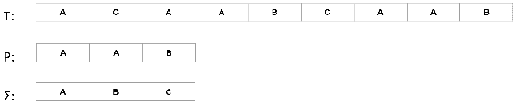

# 字符串匹配算法

字符串匹配算法在文本编辑程序中相当常见。这类程序通常需要找到文本中所有模式的匹配项，其中文本通常是正在编辑的文档，而模式是用户提供的单词。由于文本编辑程序旨在响应，因此拥有高效的算法来解决字符串匹配问题是基本的。

到本章结束时，你将能够：

+   列出常见的字符串匹配算法

+   解决字符串匹配问题

+   设计一个简单的算法来解决字符串匹配问题

+   实现 Boyer-Moore 字符串搜索算法以在文献中进行字符串搜索

# 简单搜索算法

字符串匹配问题有两个输入，如下：

+   长度为*n*的数组*T[1, 2, ...n]* 

+   长度为*m (<= n)*的数组*P[1, 2, ...m]* 

`T`和`P`的元素来自相同的有限字母表（通常称为∑）。

例如，我们可能在二进制字符串中搜索，在这种情况下，我们的字母表是*{0, 1}*，或者我们可能在小写字母的字符串中搜索，在这种情况下，我们的字母表是*{a, b… z}*。

以下图表表示了这个术语：



图 5.1：文本数组 T、模式数组 P 和有限字母表∑的表示

字符数组`P`和`T`通常被称为“字符字符串”。我们感兴趣的是在文本`T`中找到模式`P`的匹配项。

如果我们可以将模式`P`与文本`T`对齐，使得`P`中的所有字符都与`T`中的字符匹配，我们就说模式`P`在文本`T`中出现。在对齐时，我们需要将模式`P`向右移动零次或多次。

因此，在字符串匹配问题中，我们感兴趣的是模式`P`在文本`T`中出现的有效位移。我们说模式`P`在文本`T`中以位移`s`出现，如果模式`P`在文本`T`中的位置`s + 1`开始出现。换句话说，我们需要将`P`从文本`T`的起始位置向右移动`s`次，以找到匹配项。本质上，字符串匹配问题旨在找到模式`P`在给定文本`T`中出现的所有有效位移。

除了文本编辑程序之外，还有两个常见的例子，即寻找 DNA 序列中的模式和寻找与互联网搜索引擎查询相关的网页。

既然我们已经形式化了字符串匹配问题，让我们看看解决它的简单算法。

# 实现简单搜索

正如我们描述的字符串匹配问题，我们说我们感兴趣的是找到模式`P`在给定文本`T`中出现的所有有效位移。如果我们直接将这个概念转化为算法，我们就能得到简单的字符串匹配算法。

# 在 Java 中开发字符串匹配算法

目标是编写 Java 代码以应用简单的字符串匹配算法。

我们需要构建朴素字符串匹配算法。对于此算法，我们需要返回文本 `T` 中模式 `P` 发生的所有有效起始位置（或位移）。

执行以下步骤：

1.  实现 `NaiveStringMatching` 类的 `match()` 方法，

    在以下路径的 GitHub 上可用：

    [`github.com/TrainingByPackt/Data-Structures-and-Algorithms-in-Java/blob/master/src/main/java/com/packt/datastructuresandalg/lesson5/activity/naivestringmatching/NaiveStringMatching.java`](https://github.com/TrainingByPackt/Data-Structures-and-Algorithms-in-Java/blob/master/src/main/java/com/packt/datastructuresandalg/lesson5/activity/naivestringmatching/NaiveStringMatching.java)

1.  重复将模式 `P` 沿文本 `T` 移动，匹配其中的所有字符与 `T` 中对齐的字符。

1.  当发生匹配时，记录在 `T` 中匹配的索引。

朴素字符串匹配算法的实现几乎是问题声明的直接翻译。我们想要遍历 `P` 的所有可能的位移，并通过比较 `P` 的每个元素与 `T` 中相应位移的元素来检查哪些是有效的。

该问题的可能解决方案如下片段所示：

```java
for (int i = 0; i < n - m + 1; i++) {
  boolean hasMatch = true;
  for (int j = 0; j < m; j++) {
    if (P.charAt(j) != T.charAt(i + j)) {
      hasMatch = false;
      break;
    }
  }
  if (hasMatch)
  shifts.add(i);
}  
```

第 5.1 节片段：朴素字符串匹配问题的解决方案。源类名：solution.NaiveStringMatching

前往 [`goo.gl/PmEFws`](https://goo.gl/PmEFws) 访问此代码。

# 简化朴素搜索算法

朴素搜索算法需要 *O((n - m + 1)m)* 的时间，这是最坏情况下的紧界。我们可以想象一个朴素搜索算法的最坏情况，如果我们有一个字符 a 重复 *n* 次的文本字符串，即一个（例如 *a5 = "aaaaa"*），和模式 am（对于 *m <= n*）。在这种情况下，我们必须执行内循环 *m* 次来验证位移。

如果我们知道模式 `P` 中的所有字符都不同，则可以改进朴素搜索算法。在这种情况下，每当验证位移失败，因为 *P[j]* 不匹配 *T[i + j]* 时，我们不需要回溯。相反，我们可以在 *(i + j)* 上开始验证下一个位移，从而将算法的运行时间降低到 *O(n)*。

例如，如果 *P = "abcd"* 且 *T = "abcaabcd"*，当 *i = 0* 和 *j = 3* 时，我们发现一个不匹配 *('a' != 'd')*。我们不需要重复进行 *i = 1* 的比较，我们可以从 *i = 3* 开始，因为我们确信在 *i = 0* 和 *i = 3* 之间没有其他 a（记住 `P` 的所有字符都是不同的）。这些关于模式 `P` 的观察结果是 Boyer-Moore 算法的基础。

在本节中，我们介绍了字符串匹配问题，并使用朴素算法解决了它。在下一节中，我们将介绍一个更有效的算法来解决此问题——Boyer-Moore 算法。

# 开始使用 Boyer-Moore 字符串搜索算法

Boyer-Moore 字符串搜索算法由 Robert S. Boyer 和 J. Strother Moore 于 1977 年提出，并在朴素搜索算法的基础上，通过智能地跳过文本的某些部分来提高其运行时间。

算法的一个关键特性是它从右向左匹配模式，而不是从左向右匹配，利用其优势的几个位移规则来提高其运行时间。为了理解这些规则的效果，让我们从我们的朴素搜索算法构建 Boyer-Moore 算法。

我们首先修改模式上的匹配，使其从右向左操作。以下代码演示了这一点：

```java
for (int j = m - 1; j >= 0; j--) {
  if (P.charAt(j) != T.charAt(i + j)) {
    hasMatch = false;
    break;
  }
} 
```

段 5.2：修改段 5.1 的内循环以使算法从右向左操作 C

以朴素字符串匹配算法为基础，让我们看看一些规则，这些规则允许我们智能地跳过某些位移。

# 坏字符规则

坏字符规则的想法是识别模式中的字符和文本中的字符之间的不匹配，以便我们可以安全地跳过某些位移。为了识别坏字符的出现，让我们看看以下表格中的示例：

| **i** | 0 | 1 | 2 | 3 | **4** | **5** | 6 | 7 | 8 | 9 | 10 | 11 | 12 | 13 | 14 | 15 | 16 |
| --- | --- | --- | --- | --- | --- | --- | --- | --- | --- | --- | --- | --- | --- | --- | --- | --- | --- |
| **T** | H | C | B | *B* | **A** | **H** | C | C | A | B | A | H | A | H | B | C | C |
| **P** | A | B | A | *H* | **A** | **H** |  |  |  |  |  |  |  |  |  |  |  |

表 5.1：识别坏字符

在表 5.1 中提供的示例中，我们成功匹配了后缀*A*H*，但随后遇到了一个坏字符，因为*B != H*。每当这种情况发生时，我们都可以确定，只有从下一个解决这个不匹配的位移开始，才能找到有效的位移。这意味着我们可以将`P`位移，直到以下任一条件成立：

+   不匹配被转换为匹配

+   模式移动过不匹配的字符

当模式在不匹配字符的左侧有与文本中的字符匹配的字符时，我们可以将不匹配转换为匹配。否则，我们必须将模式移动到不匹配字符之后。在表 5.1 中提供的示例中，我们在*P[1]*处还有一个*B*，因此我们可以将*P*位移，直到*P[1]*与*T[3]*对齐，如下所示：

| **i** | 0 | 1 | 2 | 3 | 4 | 5 | 6 | 7 | 8 | 9 | 10 | 11 | 12 | 13 | 14 | 15 | 16 |
| --- | --- | --- | --- | --- | --- | --- | --- | --- | --- | --- | --- | --- | --- | --- | --- | --- | --- |
| **T** | H | C | B | B | A | H | C | C | A | B | A | H | A | H | B | C | C |
| **P** |  |  | A | B | A | H | A | *H* |  |  |  |  |  |  |  |  |  |

表 5.1.1：使用坏字符规则跳过位移

我们已经安全地跳过了对*1*位移的检查。现在，我们第一个字符就出现了不匹配。让我们尝试应用坏字符规则。首先，让我们看看是否可以将不匹配转换为匹配。

不幸的是，这是不可能的，因为字符*C*在*P*中不存在。在这种情况下，我们将模式位移到不匹配的字符之后，如下所示：

| **i** | 0 | 1 | 2 | 3 | 4 | 5 | 6 | 7 | 8 | 9 | 10 | 11 | 12 | 13 | 14 | 15 | 16 |
| --- | --- | --- | --- | --- | --- | --- | --- | --- | --- | --- | --- | --- | --- | --- | --- | --- | --- |
| **T** | H | C | B | B | A | H | C | C | **A** | **B** | **A** | **H** | **A** | **H** | B | C | C |
| **P** |  |  |  |  |  |  |  |  | **A** | **B** | **A** | **H** | **A** | **H** |  |  |  |

表 5.1.2：模式在错配字符之后移动

我们成功跳过了检查五个移位，并到达了一个有效的移位。

不良字符规则将帮助我们优化朴素字符串匹配算法，但前提是我们能够高效地找到正确的移位次数。假设我们能够访问一个二维数组 *[1...m][1...e]*，其中 *e* 是我们字母表的大小。为了方便，让我们称这个数组为 left，并假设 *left[i][j]* 给出字符 *j* 在 *P* 中的最接近索引 *k*，使得 *k < i*，或者如果字符 *j* 在 *P* 中没有找到到 *i* 左边的索引，则为 *-1*。如果我们能够构建这样的数组，我们就可以通过考虑可能更大的跳过（由 left 中的信息给出）来改进我们的朴素字符串搜索算法。以下代码片段展示了我们如何使用 left 数组来改进我们的朴素字符串搜索算法：

```java
int skip;
for (int i = 0; i < n - m + 1; i += skip) {
  skip = 0;
  for (int j = m - 1; j >= 0; j--) {
    if (P.charAt(j) != T.charAt(i + j)) {
      skip = Math.max(1, j - left[j][T.charAt(i + j)]);
     break;
    }
  }
  if (skip == 0) {
    shifts.add(i);
    skip = 1;
  }
}  
```

5.3 片段：使用不良字符规则改进跳过

前往 [`goo.gl/cCYnfp`](https://goo.gl/cCYnfp) 访问此代码。

我们剩下填充 `left` 数组，这将在下一个活动中完成。

# 活动：实现不良字符规则

**场景**

我们必须预处理字符串 *P* 来构建允许我们高效使用不良字符规则的 `left` 数组。回想一下，*left[i][j]* 应该返回以下之一：

+   最大的索引 *k*，使得 *k <= i* 且 *P[k] == j*

+   *-1*，如果 *j* 在 *P* 中未找到

**目标**

构建一个允许我们高效使用不良字符规则的数组的步骤。

**完成步骤**

1.  实现 `BadCharacterRule` 类中 `match()` 方法的注释部分，该类可在 GitHub 上的以下路径找到：

    [`github.com/TrainingByPackt/Data-Structures-and-Algorithms-in-Java/blob/master/src/main/java/com/packt/datastructuresandalg/lesson5/activity/badcharacterrule/BadCharacterRule.java`](https://github.com/TrainingByPackt/Data-Structures-and-Algorithms-in-Java/blob/master/src/main/java/com/packt/datastructuresandalg/lesson5/activity/badcharacterrule/BadCharacterRule.java)

1.  假设字符串 *P* 和 *T* 的字母表仅由英语字母表的小写字母组成。

# 良好后缀规则

良好后缀规则提供了一种补充方法来增强我们搜索有效移位的搜索。为了确定何时可以使用良好后缀规则，让我们看看以下表格中给出的示例：

| **i** | 0 | 1 | 2 | 3 | 4 | 5 | 6 | 7 | 8 | 9 | 10 | 11 | 12 | 13 | 14 | 15 | 16 | 17 |
| --- | --- | --- | --- | --- | --- | --- | --- | --- | --- | --- | --- | --- | --- | --- | --- | --- | --- | --- |
| **T** | A | A | B | A | B | A | B | A | C | B | A | C | A | B | B | C | A | B |
| **P** | A | A | C | C | A | C | C | A | C |  |  |  |  |  |  |  |  |  |

表 5.2：良好后缀规则的说明

当我们在匹配了 *P* 的后缀但发现不匹配的情况下使用良好后缀规则，并将 *t* 作为匹配的后缀时，我们可以尝试通过执行以下任一情况来找到解决不匹配的下一个移动：

+   在 *P* 中找到左侧的另一个 *t* 出现

+   找到与 *t* 的后缀匹配的 *P* 的前缀

+   将 *P* 移动到 *t* 之后

考虑到情况 1，我们可以尝试将 *P* 向右移动三位，以对齐 *P* 中其他 *t* 的出现（从 *P[4]* 开始）。正如我们所看到的，*t* 出现左侧的字母（在 *P[3]*）是 *C*，这与引起不匹配的字母完全相同。因此，我们应该始终尝试找到一个 *t*，它在左侧跟随的字符与引起不匹配的字符不同。忽略 *t* 左侧字符的良好的后缀规则变体被称为弱良好后缀规则。

良好后缀规则考虑了 *t* 左侧的字符，也称为强良好后缀规则。

如果我们无法在 *P* 中找到另一个 *t* 出现，那么我们可以用这个规则做的最好的事情就是找到一个与 *t* 的后缀匹配的 *P* 的前缀，进入案例 2。*表 5.3* 说明了这种情况：

| **i** | 0 | 1 | 2 | 3 | 4 | 5 | 6 | 7 | 8 | 9 | 10 |
| --- | --- | --- | --- | --- | --- | --- | --- | --- | --- | --- | --- |
| **T** | A | *A* | **B** | **A** | **B** | A | B | A | C | B | A |
| **P** | A | B | **B** | **A** | **B** |  |  |  |  |  |  |

表 5.3：寻找与 T 的后缀匹配的 P 的前缀

在这种情况下，我们在 *P[1]* 处找到了一个不匹配，但我们无法找到它左侧的另一个 *BAB* 出现。然而，我们可以找到一个与 *t AB* 的后缀匹配的 *AB* 的前缀，并将 *P* 移动，以便这些对齐。

每当我们既找不到另一个出现位置，也找不到 *t* 的前缀时，我们就只能将 *P* 在 *T* 中移动到 *t* 之后。

良好后缀规则的实现也需要对 *P* 进行一些预处理。为了理解必要的预处理，我们需要引入边界和正确前缀以及后缀的概念。字符串 *S* 的一个前缀是 *S* 的一个子串，它出现在 *S* 的开头。字符串 *S* 的一个正确前缀是不同于 *S* 的前缀（考虑到 *S* 总是 *S* 的前缀）。

字符串 *S* 的一个后缀是出现在 *S* 结尾的子串。字符串 *S* 的一个正确后缀是不同于 *S* 的后缀（考虑到 *S* 总是 *S* 的后缀）。边界是给定字符串的一个子串，它既是正确前缀也是正确后缀。例如，给定字符串 *ccacc*，有两个边界：*c* 和 *cc*。*cca* 不是一个边界。

良好后缀规则的预处理步骤分为两个步骤：一个用于规则的案例 1，另一个用于案例 2。

在情况 1 中，匹配后缀是模式后缀的边界。例如，如果 *P = AACCACCAC* 并且我们有 *t = AC*（*P* 的后缀），那么我们需要找到一个后缀 *P*，它以 *AC* 为前缀（构成后缀的边界）。字符串 *ACCAC* 是 *P* 的后缀，并且以 *AC* 为边界。

因此，我们需要找到模式后缀的边界。但是，即使找到了它们，我们还需要能够将给定的边界映射到具有该边界的最短后缀，这样我们才能相应地移动。此外，为了遵循强良好后缀规则，边界不能被与导致不匹配的相同符号向左扩展。

情况 1 的预处理算法如下所示：

```java
int i = m, j = m + 1;
int[] f = new int[m + 1];
int[] s = new int[m + 1];
f[i] = j;
while (i > 0) {
  while (j <= m && P.charAt(i - 1) != P.charAt(j - 1)) {
    if (s[j] == 0)
      s[j] = j - i;
      j = f[j];
  }
  i--; j--;
  f[i] = j;
}
```

代码片段 5.4：良好后缀规则情况 1 的预处理算法。源类名：GoodSuffixRule

访问 [`goo.gl/WzGuVG`](https://goo.gl/WzGuVG) 以获取此代码。

为了更好地理解情况 1 的预处理算法，在算法的相关步骤上添加一些 `println` 语句，并使用一些示例输入运行它。您可以使用字符串 `ABBABAB`，其输出显示在 *表 5.4* 中。

```java
f, whose entries *f[i]* contain the starting position of the widest border of the suffix of the pattern that starts at position *i*. *f[m]* is equal to *m + 1*, as the empty string has no border. The idea behind the previously shown preprocessing algorithm is to compute each border by checking whether a shorter border that is already known can be extended to the left by the same symbol. The array *s* is used to store shift distances; we can save entries in array *s* whenever we can't extend a border to the left (when *P[i - 1] != P[j - 1]*), provided that *s[j]* is not already occupied.
```

为了更好地理解这个算法产生的结果，让我们看看字符串 *ABBABAB* 的输出，如下表所示：

| **i** | 0 | 1 | 2 | 3 | 4 | 5 | 6 | 7 |
| --- | --- | --- | --- | --- | --- | --- | --- | --- |
| **P** | A | B | B | A | B | A | B |  |
| **f** | 5 | 6 | 4 | 5 | 6 | 7 | 7 | 8 |
| **s** | 0 | 0 | 0 | 0 | 2 | 0 | 4 | 1 |

表 5.4：对于字符串 ABBABAB 的良好后缀规则情况 1 的预处理算法输出

后缀 *BABAB* 的最宽边界从 *2* 开始，是 *BAB*，从 *4* 开始，因此 *f[2] = 4*。后缀 *AB* 的最宽边界从 *5* 开始，是空字符串，从 *7* 开始。因此，*f[5] = 7*。最宽边界为 *BAB* 的后缀 *BABAB* 不能向左扩展（因为 *P[1] != P[3]*）。因此，*BAB* 的移位距离匹配后发生不匹配，即 *s[4] = 4 - 2 = 2*。后缀 *BABAB* 还有一个边界 *B*，也不能向左扩展，这确保了 *s[6] = 6 - 2 = 4*。从位置 *6* 开始的后缀 *B* 的边界为空字符串，从位置 *7* 开始；因此，*s[7] = 7 - 6 = 1*，这对应于如果没有匹配时的移位距离。

在情况 2 中，匹配后缀的模式后缀出现在模式的开头，这构成了模式的边界。因此，模式可以移动到其最宽边界允许的最大范围。对于情况 2 的预处理步骤，我们需要为每个后缀找到包含在该后缀中的模式的最宽边界。我们可以基于之前计算出的 *f* 数组来完成这项工作。以下代码片段说明了这一点：

```java
j = f[0];
for (i = 0; i <= m; i++) {
  if (s[i] == 0)
  s[i] = j;
  if (i == j)
  j = f[j];
} 
```

代码片段 5.5：良好后缀规则情况 2 的预处理算法。源类名：GoodSuffixRule

访问 [`goo.gl/ckoTu6`](https://goo.gl/ckoTu6) 以获取此代码。

模式的最宽边界存储在*f[0]*中。对于情况 2 的预处理算法的想法是使用该值，直到模式短于*f[0]*，在这种情况下，我们使用模式的下一个更宽的边界*(f[j])*。

将好后缀情况与朴素搜索算法集成可以让我们改进跳过的执行，如下面的代码所示：

```java
for (i = 0; i < n - m + 1; i += skip) {
  boolean hasMatch = true;
  skip = 0;
  for (j = m - 1; j >= 0; j--) {
    if (P.charAt(j) != T.charAt (i + j)) {
      skip = s[j + 1];
      hasMatch = false;
      break;
    }
  }
  if (hasMatch) {
    shifts.add(i);
    skip = s[0];
  } 
}  
```

Snippet 5.6: 仅使用好后缀规则的 Boyer-Moore 算法。源类名：Goodsuffixrule

前往[`goo.gl/1uCgeh`](https://goo.gl/1uCgeh)访问此代码。

# Boyer-Moore 算法的应用

Boyer-Moore 算法通常与一个或两个坏字符和好后缀规则一起使用。当与两个规则一起使用时，要发生的位移是规则产生的最大位移。Boyer-Moore 算法在平均情况下改进了朴素搜索算法，但在最坏情况下仍然是*O(nm)*（这种情况与上一节中描述的情况相同，即模式和文本中都有重复的字符组）。

# 实现 Boyer-Moore 算法

目标是用 Java 编写代码以实现 Boyer-Moore 算法。

我们需要将坏字符规则与好后缀规则集成以产生完整的 Boyer-Moore 算法。这里的想法是使用在每个情况下给出更好（或最大）位移的规则。

执行以下步骤：

1.  实现`BoyerMoore`类的`match()`方法，该方法可用

    在以下路径上：

    [`github.com/TrainingByPackt/Data-Structures-and-Algorithms-in-Java/blob/master/src/main/java/com/packt/datastructuresandalg/lesson5/activity/boyermoore/BoyerMoore.java`](https://github.com/TrainingByPackt/Data-Structures-and-Algorithms-in-Java/blob/master/src/main/java/com/packt/datastructuresandalg/lesson5/activity/boyermoore/BoyerMoore.java)

1.  将代码片段合并并更改跳过逻辑以选择两种规则的最好者。

以下代码片段展示了如何将组合匹配实现为一个解决方案：

```java
for (i = 0; i < n - m + 1; i += skip) {
  skip = 0;
  boolean hasMatch = true;
  for (j = m - 1; j >= 0; j--) {
    if (P.charAt(j) != T.charAt(i + j)) {
      hasMatch = false;
      skip = Math.max(s[j + 1], j - left[j]
      [T.charAt(i + j)]);
      break;
    }
  }
  if (hasMatch) {
    shifts.add(i);
    skip = s[0];
  } 
}  
```

Snippet 5.7: Boyer-Moore 算法的实现。源类：BoyerMoore

前往[`goo.gl/71mXd6`](https://goo.gl/71mXd6)访问此代码。

在本节中，我们介绍了 Boyer-Moore 算法作为对朴素搜索算法的改进。通过预处理模式以跳过不必要的位移，我们可以降低字符串匹配算法的平均运行时间复杂度。在下一节中，我们将列出一些其他字符串匹配算法，列出它们的适用性，但不会深入其实现细节。

# 介绍其他字符串匹配算法

尽管 Boyer-Moore 字符串搜索算法是实际字符串搜索文献的标准基准，但还有其他字符串匹配算法也适合不同的目的。在本小节中，我们介绍了以下三个最著名的算法：

+   Rabin-Karp

+   Knuth-Morris-Pratt

+   Aho-Corasick

然而，仅提供 Rabin-Karp 的实现。

# Rabin-Karp

在 1987 年，理查德·M·卡普和迈克尔·O·拉宾提出了一种字符串匹配算法，该算法在实际应用中表现良好，并能将字符串匹配推广到一组模式。Rabin-Karp 算法在其预处理阶段需要*O(m)*时间，其最坏情况运行时间是*O((n - m + 1)m)*，与 Boyer-Moore 算法相似。

为了更好地介绍 Rabin-Karp 算法，让我们假设我们的字母表∑仅由十进制数字组成*(∑ = {0, 1, 2, 3, 4, 5, 6, 7, 8, 9})*，这样我们就可以将*个字符的字符串视为长度为*k*的十进制数。因此，字符串 12345 对应于数字 12345。给定一个模式*P[0...m]*和文本中的子串*T[i...i + m]*，如果我们将这两个字符串转换为它们对应的十进制数，那么我们就有数字*p*和*t[i]*，那么*p = t[i]*仅当*P[0...m] = T[i...i + m]*，因此*i*仅是一个有效的位移，如果*p = t[i]*。

如果我们能在*O(m)*时间内计算 p，并在*O(n - m + 1)*时间内计算所有 t[i]值，那么我们就可以通过将 p 与每个 t[i]值进行比较，在*O(n)*时间内确定所有有效的位移。这个问题在于当*p*和*t[i]*太大而无法处理时。如果数字太大，那么我们可以使用模*q*来处理它们，对于合适的模数*q*。

让我们稍后再考虑选择合适的模数*q*。我们如何将此推广到处理其他字母表？例如，如果我们想使用不是十进制数字的字符怎么办？

考虑到，在我们的原始字母表中，要将字符串 12345 转换为数字，我们会执行操作*10⁴*1+10³*2+10²*3+10¹*4+10⁰*5*。如果我们有一个 D 进制字母表*{0, 1… d - 1}*，那么我们可以使用相同的策略，但将 10 替换为*d*。另一个需要考虑的是，当我们已经计算了*t[i]*并想要计算*t[i+1]*时，我们可以简单地移除最左边的数字，将所有内容向左移动，并添加最新的数字，即*t[i+1] = ((t[i] - T[i]*d[m-1])*d + T[i + 1]) % q*。

最后一个需要考虑的是，使用模*q*并不完美。*t[i] = p (mod q)*并不一定意味着*t[i] = p*。但如果*t[i] != p* *(mod q)*，那么*t[i] != p*。因此，我们可以将其用作快速启发式测试，以排除无效的位移。

# 应用 Rabin-Karp 算法

此处的目标是开发一个 Java 代码，以实现 Rabin-Karp 算法，用于匹配一组具有十进制数字的字母字符集中的字符串。

执行以下步骤：

1.  将文本和模式字符串转换为数字。

1.  使用 if 和 for 循环来计算匹配字符的数量。

1.  将所有内容组合起来以实现 Rabin-Karp 算法。以下*片段 5.9*显示了算法的预计算部分：

```java
long q = BigInteger.probablePrime(31, new  Random()).longValue();
// Precompute d^(m-1) % q for use when removing leading digit
long dm = 1;
for (int i = 1; i <= m - 1; i++)
  dm = (d * dm) % q;
// Precompute p and t0
long ph = 0;
long th = 0;
for (int i = 0; i < m; i++) {
  ph = (d * ph + P.charAt(i)) % q;
  th = (d * th + T.charAt(i)) % q;
} 
```

片段 5.9：Rabin-Karp 算法的实现。源类名：RabinKarp

访问[`goo.gl/w7yzPA`](https://goo.gl/w7yzPA)以获取此代码。

在之前的实现中，我们选择*q*为一个大的质数（使用`BigInteger` API）。我们这样做是为了有一个好的哈希函数，并避免*p = t[i]*比较中的大多数误报。这与我们在第三章中看到的哈希表余数方法中的类似技术。

尽管这超出了本书的范围，但 Rabin-Karp 算法很好地推广到在相同文本中查找一组模式。为此，它经常用于剽窃检测。

# Knuth–Morris–Pratt

**Knuth-Morris-Pratt**（**KMP**）算法是由唐纳德·克努特和瓦奥恩·普拉特在 1970 年构思的单模式字符串搜索算法，由詹姆斯·H·莫里斯独立提出，三人于 1977 年共同发表。与 Boyer-Moore 算法相比，KMP 算法利用了这样一个观察：当发生不匹配时，模式包含足够的信息来确定下一次匹配可能开始的位置。

它与 Boyer-Moore 算法类似，因为它能够有效地跳过不必要的比较。KMP 算法的时间复杂度为*O(n)*。

# Aho–Corasick

Aho-Corasick 算法是由阿尔弗雷德·V·阿霍和玛格丽特·J·科拉斯克发明的一种字符串搜索算法。类似于 Rabin-Karp 算法的扩展版本，它能够在输入文本中匹配字典（单词集合）中的元素。其背后的思想是构建一个有限状态机，能够同时匹配字典中的所有字符串。算法的时间复杂度是字符串长度、搜索文本长度以及输出匹配次数的总和。如果*n*是搜索文本的长度，*m*是字典中所有单词长度的总和，*z*是文本中单词的总出现次数。

因此，Aho-Corasick 算法的时间复杂度为*O(n + m + z*)。在本小节中，我们探讨了三种其他著名的字符串匹配算法。我们没有深入探讨它们的细节，但已经看到了它们在除了 Boyer-Moore 算法解决的问题之外的其他问题上的适用性。特别是，我们注意到有一些算法专门用于在文本中查找一组模式。

在 1979 年，Zvi Galil 引入了一个重要的优化，称为 Galil 规则，通过跳过已知匹配的部分来加快每次移位时的比较速度。使用 Galil 规则，Boyer-Moore 算法在最坏情况下实现了线性时间复杂度。

# 摘要

在本章中，我们介绍了字符串匹配问题。我们从朴素搜索算法开始，通过使用 Boyer 和 Moore 提出的规则对其进行了改进。我们看到了这些规则如何提高我们算法的平均运行时间复杂度。我们还探索了一些其他字符串匹配算法，而没有对这些算法的细节进行过多讨论。在下一章中，我们将探讨图及其应用。
