# 图、素数和复杂度类

图问题在计算机科学中非常常见，它们的应用渗透到许多现实生活中的应用。所有可以用实体及其关系表示的事物最终都可以用图来建模。我们在社交媒体上如何与朋友互动，路线规划应用如何找到最短路径，以及电子商务网站如何提供推荐都是用图建模的问题示例。

图是由一组对象组成的结构，其中某些对象对之间存在关系。这些对象由顶点的数学抽象（有时也称为节点）来表示，而成对关系由边的数学抽象（有时也称为弧）来表示。

边可以是有向的或无向的。一个有向边是指与它相关联有方向的边。由有向边组成的图称为有向图。由无向边组成的图称为无向图。在有向边中，通常将边的起点称为头，将终点称为尾。在有向图中，一个顶点的出度是指与它相邻的头边的数量。一个顶点的入度是指与它相邻的尾边的数量。

*图 6.1* 给出了一个包含六个节点和八条边的有向图的示例，如下所示：

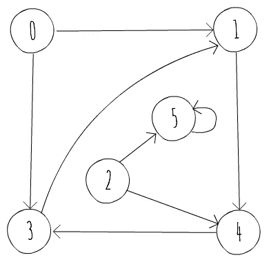

图 6.1：一个有向图

*图 6.2* 给出了一个包含五个节点和七条边的无向图的示例，如下所示：

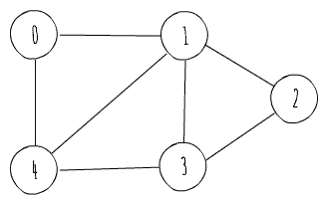

图 6.2：一个无向图

在我们深入探讨如何在计算机程序中表示图之前，描述图算法的运行时间通常是如何表征的是非常重要的。如前所述，一个图，*G*，可以看作是一组顶点和边，即 *G = (V, E)*。因此，输入的大小通常以顶点数（*|V|*）和边数（*|E|*）来衡量。所以，而不是仅仅依赖于单个输入大小 *N*，图算法的运行时间通常指的是 *|V|* 和 *|E|*。在大的 O 表示法中，通常使用 *V* 来表示 *|V|*，使用 *E* 来表示 *|E|*。例如，运行时间与顶点数乘以边数成比例的算法被称为运行时间 *O(VE)*。

# 表示图

在计算机程序中通常有两种标准方式来表示图 *G = (V, E)*：

+   作为邻接表的集合

+   作为邻接矩阵

你可以使用这两种方式来表示有向和无向图。我们将首先查看邻接表表示法。

# 邻接表表示法

图的邻接表表示由一个包含 *|V|* 个列表的数组组成，每个列表对应于 *V* 中的一个顶点。对于 *V* 中的每个顶点 *u*，都有一个包含所有顶点 *v* 的列表，使得在 *E* 中存在连接 *u* 和 *v* 的边。*图 6.3* 展示了 *图 6.1* 中有向图的邻接表表示：

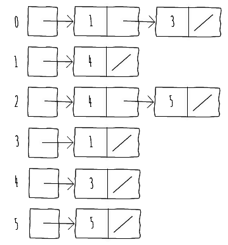

图 6.3：图 6.1 中有向图的邻接表表示

对于无向图，我们遵循类似的策略，并构建邻接表，就像它是一个有向图，其中每对顶点 *u* 和 *v* 之间有两个边，分别是 *(u, v)* 和 *(v, u)*。

*图 6.4* 展示了 *图 6.2* 中的无向图的邻接表表示：

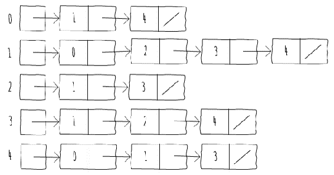

图 6.4：图 6.2 中无向图的邻接表表示

如果 *G* 是一个有向图，所有邻接表长度的总和是 *|E|*，因为每条边构成邻接表中的一个单独节点。

如果 *G* 是一个无向图，所有邻接表长度的总和是 *2*|E|*，因为每条边 *(u, v)* 出现两次，即一次在 *u* 的邻接表中，一次在 *v* 的邻接表中。

对于这两种类型的图，邻接表表示具有需要与 *O(V + E)* 相等的内存量的特性。

以下代码片段展示了如何使用 Java 中的邻接表表示创建图：

```java
public class AdjacencyListGraph {
  ArrayList<Integer>[] adj;
  public AdjacencyListGraph(int nodes) {
    this.adj = new ArrayList[nodes];
    for (int i = 0; i < nodes; i++)
    this.adj[i] = new ArrayList<>();
  }
  public void addEdge(int u, int v) {
    adj[u].add(v);
  }
}  
```

片段 6.1：图的邻接表表示实现。源类名：Adjacencylistgraph

前往 [`goo.gl/Jrb2jH`](https://goo.gl/Jrb2jH) 访问此代码。

对于加权图，即每条边都有一个相关权重的图，这是很常见的。邻接表表示足够健壮，可以支持不同的图变体，因为我们可以在邻接表中存储不同的边表示。

我们可以在邻接表中存储不同的边表示，因为我们存储了边本身，从而允许自定义表示。

# 编写 Java 代码向有向图添加权重

目标是修改 `AdjacencyListGraph` 类的实现以支持边的权重。

步骤应该是以下这些：

1.  理解 *片段 6.1* 展示了如何实现邻接表表示

1.  修改实现方式，以便数组列表可以存储权重

```java
ArrayList<Edge>[] adj;
public AdjacencyListWeightedGraph(int nodes) {  
  this.adj = new ArrayList[nodes];
  for (int i = 0; i < nodes; i++)
  this.adj[i] = new ArrayList<>();
}
public void addEdge(int u, int v, int weight) {
  this.adj[u].add(new Edge(u, v, weight));
}  
```

片段 6.2：加权图的邻接表表示实现。源类名：Adjacencylistweightedgraph

前往 [`goo.gl/uoazxy`](https://goo.gl/uoazxy) 访问此代码。

# 邻接矩阵表示

图的邻接表表示法提供了一种紧凑的方式来表示稀疏图，例如那些*|E|*远小于*|V|²*的图。尽管这种表示法对许多算法（我们将在后面讨论）很有用，但它不支持一些特性。例如，无法快速判断两个给定的顶点之间是否存在边。为了确定*u*和*v*是否相连，必须遍历*u*的邻接表以找到连接到*v*的边。由于*u*的邻接表最多有*E*条边，这个过程的时间复杂度为*O(E)*。一种替代的表示法是邻接矩阵表示法，它以使用更多内存的代价来弥补这一缺点。

加权图邻接表表示法的主要缺点是我们无法快速确定给定的边*(u, v)*是否存在于图中。

在这种表示法中，图*G = (V, E)*由一个*|V| x |V|*矩阵*A = (a[ij])*表示，其中*a[ij]*等于*1*如果存在边*(i, j)*，否则为*0*。以下表格展示了*图 6.1*的有向图的邻接矩阵表示法：

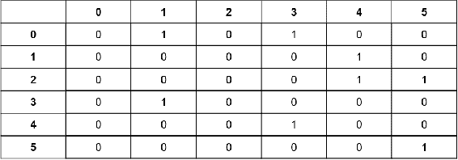

表 6.1：*图 6.1*的有向图的邻接矩阵表示法

以下表格展示了*图 6.2*的无向图的邻接矩阵表示法：

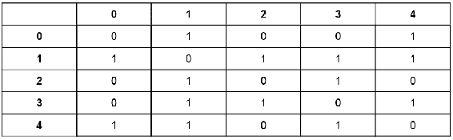

表 6.2：*图 6.2*的无向图的邻接矩阵表示法

图的邻接矩阵表示法需要*O(V²)*的内存，与图中边的数量无关。在无向图的邻接矩阵表示法中需要注意的一点是，矩阵沿主对角线是对称的，因为*(u, v)*和*(v, u)*代表同一条边。因此，无向图的邻接矩阵是其自身的转置*(A = A^T)*。利用这种对称性，可以将存储图所需的内存几乎减半，因为不需要每个顶点的数组大小为*V*。如果*i*跟踪*V*中顶点的索引，那么随着*i*的增加，*array[i]*的大小可以减少一个。

以下代码展示了如何在 Java 中使用邻接矩阵表示法创建一个图：

```java
public class AdjacencyMatrixGraph {
  int[][] adj;
  public AdjacencyMatrixGraph(int nodes) {
    this.adj = new int[nodes][nodes];
  }
  public void addEdge(int u, int v) {
    this.adj[u][v] = 1;
  }
}  
```

程序片段 6.3：有向图邻接矩阵表示法的实现。源代码类名：AdjacencyMatrixGraph

前往[`goo.gl/EGyZJj`](https://goo.gl/EGyZJj)访问此代码。

邻接矩阵表示也足够健壮，可以支持不同的图变体。例如，为了支持加权图，可以在 *a[ij]* 中存储边的权重，而不仅仅是存储一个。邻接表表示在空间效率上至少与邻接矩阵表示一样，但邻接矩阵更简单，因此当图相对较小或密集时，它们可能更可取。如前所述，稀疏图是指 *|E|* 远小于 *|V|²* 的图，而密集图是指 *|E|* 接近 *|V|²* 的图。对于稀疏图，邻接表表示更节省内存。对于密集图，邻接矩阵表示更适合，因为它可能由于列表指针而占用更少的内存。

# 活动：构建加权无向图的邻接矩阵表示

**场景**

为社交网站创建一个用于加权无向图的邻接矩阵。

**目标**

编写一个 Java 代码来实现加权无向图的邻接矩阵表示。

**先决条件**

对于这个活动，你必须实现位于以下 URL 的 `AdjacencyMatrixWeightedUndirected` 类的 `addEdge()` 和 `edgeWeight()` 方法：

[`github.com/TrainingByPackt/Data-Structures-and-Algorithms-in-Java/blob/master/src/main/java/com/packt/datastructuresandalg/lesson6/activity/weightedundirected/AdjacencyMatrixWeightedUndirected.java`](https://github.com/TrainingByPackt/Data-Structures-and-Algorithms-in-Java/blob/master/src/main/java/com/packt/datastructuresandalg/lesson6/activity/weightedundirected/AdjacencyMatrixWeightedUndirected.java)

这些方法应该添加一条边并返回两个顶点之间的边权重。

**完成步骤**

1.  开始在每个矩阵的单元格中存储边的权重。由于我们处理的是无向图，所以 *(u, v)* 和 *(v, u)* 都指代同一条边，因此我们需要相应地更新两者。

1.  也可以不重复权重分配。我们只需小心，在引用那条边时始终选择 *(u, v)* 或 *(v, u)* 中的一个。一个可能的策略是始终使用 *(min(u, v), max(u, v))*. 使用该策略，我们也不需要存储完整的矩阵，从而节省一些空间。

在本节中，我们学习了两种不同的方式在计算机程序中表示图。我们简要地考察了每种表示的优点和缺点，并在接下来的章节中我们将探讨它们在实现图算法时的有用性。

# 图的遍历

图上的一个常见活动是以给定顺序访问图中的每个顶点。我们将首先介绍广度优先搜索，然后是深度优先搜索。这两种技术都是许多重要图算法的原型，我们将在后面的循环检测和单源最短路径的 Dijkstra 算法中看到。

# 广度优先搜索

给定一个图*G = (V, E)*和一个源顶点 s，广度优先搜索系统地探索*G*的边，以发现从*s*可达的每个顶点。在此过程中，它计算从*s*到每个可达顶点的最小边数，这使得它适合解决无权图或所有边都具有相同权重的图上的单源最短路径问题。

**广度优先搜索**（**BFS**）之所以命名为 BFS，是因为它在搜索前沿的宽度上均匀地扩展了已发现和未发现顶点之间的边界。从这个意义上说，算法首先探索距离*s*为*k*的顶点，然后再发现距离*k + 1*的顶点。为了跟踪进度，广度优先搜索将每个顶点标识为未发现、已发现或已扩展。所有顶点最初都是未发现的。顶点在第一次遇到搜索时被发现，当所有相邻的顶点都被发现时，它被扩展。

BFS 构建一个以源顶点*s*为根的广度优先树。每当搜索在已发现的顶点*u*的外向边扫描时发现一个未发现的顶点*v*，顶点*v*和边**(u, v)**将被添加到树中。因此，*u*成为广度优先树中*v*的父节点。由于一个顶点最多被发现一次，它最多有一个父节点。

为了说明这一点，让我们看一下以下表中从*图 6.1*的定向图开始的广度优先搜索的运行，起始节点为 2：

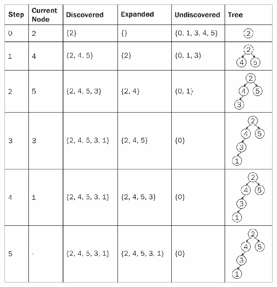

表 6.3：在图 6.1 中，从节点 2 开始的 BFS 运行

从广度优先树中可以得出很多见解。例如，从根到树中给定节点的路径是从这两个顶点之间的最短路径（以边数计）。另一个需要注意的事项是，不在广度优先树中的顶点（例如 0）是从根顶点不可达的。

我们之前看到了如何在树上执行广度优先搜索。图上的 BFS 与之类似，但我们需要跟踪已探索的节点，以免陷入循环。为了实现广度优先搜索，我们将假设我们的图使用邻接表表示。

我们将给图中的每个顶点附加某些属性，这将允许我们引导搜索并在以后构建广度优先树。我们还将使用一个先进先出队列（在第二章中介绍，*排序算法和基本数据结构*）来管理已发现的顶点集。以下代码片段说明了广度优先搜索的实现：

```java
Queue<Integer> q = new LinkedList<>();
q.add(start);
while (!q.isEmpty()) {
  int current = q.remove();
  for (int i = 0; i < this.adj[current].size(); i++) {
    int next = this.adj[current].get(i);
    if (!visited[next]) {
      visited[next] = true;
      parent[next] = current;
      q.add(next);
    }
  }
}  
```

代码片段 6.4：广度优先搜索的实现。源类名：BFS.Graph

前往[`goo.gl/VqrQWM`](https://goo.gl/VqrQWM)访问此代码。

让我们专注于 BFS 函数的实现。我们首先初始化几个辅助数组：`parent` 和 `visited`。第一个数组将保存 `parent[i]`，表示在广度优先树中节点 `i` 的父节点。第二个数组将告诉我们 `visited[i]`，表示顶点 `i` 是否已被发现。我们首先发现起始节点并将其添加到队列中。队列将保持那些已发现但尚未扩展的顶点。因此，当队列中仍有元素时，我们将取其第一个元素，遍历其相邻顶点，并发现那些尚未被发现的顶点，将它们添加到队列中。

当队列变为空时，我们确信已经扩展了从起始顶点可达的所有顶点。

在之前的实现中，我们在 `bfs()` 函数中返回了广度优先树的父节点数组，这使得我们可以重建路径。如果不需要，你只需返回路径的大小，或者从广度优先搜索遍历中提取的任何其他信息即可。

在 `bfs()` 方法中，我们确信每个顶点最多入队和出队一次。因此，队列操作的总时间复杂度是 *O(V)*。出队每个顶点后，我们扫描其邻接表。由于我们每个顶点最多出队一次，我们最多扫描每个邻接表一次。由于所有邻接表长度的总和是 *O(E)*，扫描邻接表的总时间复杂度是 *O(E)*。因此，BFS 程序的初始化时间是 *O(V)*，总运行时间是 *O(V + E)*，其运行时间与 *G* 的邻接表表示的大小成线性关系。

正如我们将在后面的章节中看到的，BFS 程序是许多重要图算法的原型。

# 深度优先搜索

给定一个图 *G = (V, E)* 和一个源顶点 s，深度优先搜索通过尽可能地在图中“深入”来探索图的边。**深度优先搜索**（**DFS**）探索与最近发现的顶点 *v* 相邻且其头节点也相邻的未探索边。一旦 *v* 的所有边都被探索过，搜索将“回溯”以探索边，离开从 *v* 被发现的那个顶点。这个过程会一直持续到从原始源顶点可达的所有顶点都被发现。

如果还有未发现的顶点，那么 DFS 会从中选择一个作为新的源点，并从该源点重复搜索。虽然 BFS 限制自己只考虑从单个源点可达的顶点，而 DFS 考虑多个源点可能看起来有些奇怪，但背后的原因与这些搜索的应用有关。

BFS 通常用于查找最短路径距离，而 DFS 经常被用作其他算法的子程序，我们将在探索循环检测问题时看到这一点。

与 BFS 类似，当我们扫描已发现顶点的邻接表时发现顶点 *v*，我们记录其父属性。由于我们提到我们探索不同的来源，DFS 产生的父子图与广度优先树不同，它是一个森林（即一组树）。

为了说明这一点，让我们看看以下表格中从 *node 2* 开始的 DFS 对 *Figure 6.1* 的有向图的运行情况：

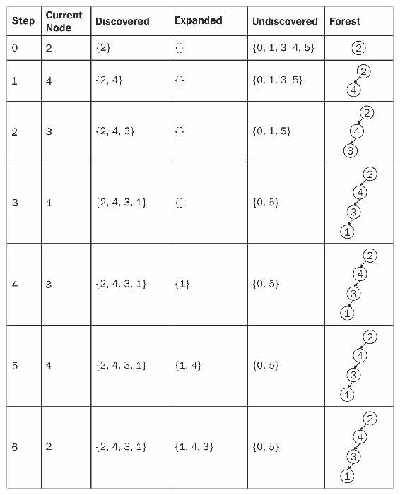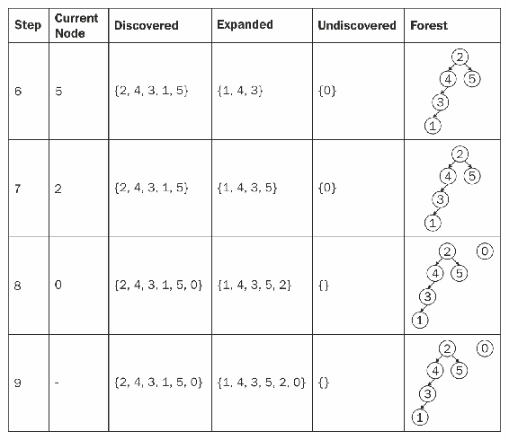

Table 6.4：从节点 2 开始对 Figure 6.1 的有向图执行 DFS 的运行情况

注意，DFS 的结果可能取决于顶点检查的顺序。在前面的例子中，我们从 2 开始，总是先访问顶点邻接表中的编号最小的顶点。如果我们从顶点 0 开始，我们将得到不同的森林。在实践中，我们通常可以使用任何具有等效结果的 DFS 结果。

我们之前看到了如何在树上执行 DFS。图上的 DFS 类似，但我们需要跟踪已探索的节点，以避免陷入循环。

为了实现 DFS，我们将假设我们的图使用邻接表表示。我们将为图中的每个顶点附加某些属性，这将允许我们引导搜索并在以后构建深度优先森林。以下代码片段说明了深度优先搜索的实现：

```java
public void dfsVisit(int u, boolean[] visited, int[] parent) {
  visited[u] = true;
  for (int i = 0; i < adj[u].size(); i++) {
    int next = adj[u].get(i);
    if (!visited[next]) {
      parent[next] = u;
      dfsVisit(next, visited, parent);
    }
  }
} 
```

Snippet 6.5: 深度优先搜索的实现。源类名：dfs.Graph。

前往 [`goo.gl/saZYQp`](https://goo.gl/saZYQp) 访问此代码。

DFS 过程通过将所有顶点初始化为未访问状态，并将它们的父设置为 *-1*（表示它们没有父节点）来工作。然后，我们找到第一个未发现的顶点并访问它。在每次访问中，我们首先记录顶点为已访问，然后遍历其邻接表。在那里，我们在寻找尚未发现的顶点。一旦找到，我们就访问它。查看前面的实现，我们看到 DFS 内部的循环时间复杂度为 *O(V)*，因为它们为图中的每个顶点运行。我们还可以看到`dfsVisit()`方法对每个顶点恰好调用一次。在`dfsVisit()`执行过程中，扫描邻接表的循环执行时间与顶点邻接表的大小成比例。由于我们之前提到`dfsVisit()`对每个顶点恰好调用一次，循环中花费的总时间与所有邻接表大小的总和成比例，即 *O(E)*。因此，DFS 的总运行时间为 *O(V + E)*。

在 DFS 方法中，我们返回父数组，但此例程的返回类型通常根据使用 DFS 的更通用算法试图实现的大任务而调整。我们将在下一节中看到 DFS 如何适应我们的特定需求。

# 循环检测

DFS 的一个有用应用是确定一个图是否是无环的（即不包含环）。为了做到这一点，根据 DFS 生成的深度优先森林定义四种类型的边非常重要。它们如下：

+   **树边**：它们是深度优先森林中的边。一条边只有在首次发现一个顶点时被探索时才能成为树边。

+   **回边**：它们是连接深度优先树中一个顶点到其祖先的边。自环（可能出现在有向图中）是回边。

+   **前向边**：它们是不属于深度优先树但连接深度优先树中一个顶点及其后代的边。因此，前向边是在执行 DFS 时未使用的边，但它们在深度优先树中连接顶点 *u* 和 *v*，前提是 *v* 是树中 *u* 的后代。

+   **交叉边**：它们是所有其他边。它们可以在同一深度优先树中的顶点之间，也可以在不同深度优先树中的顶点之间。因此，它们是在执行深度优先搜索时未使用的边，但连接了在同一树中不共享祖先关系的顶点或不同树中的顶点。

在对边进行分类后，可以证明一个有向图是无环的当且仅当 DFS 不会产生回边。如果深度优先搜索产生回边 *(u, v)*，则顶点 *v* 是深度优先森林中顶点 *u* 的祖先。因此，*G* 包含从 *v* 到 *u* 的路径，并且 *(u, v)* 完成了环。此算法可推广到无向图。在无向图中，如果我们找到一个回边 *(u, v)* 且 *v* 不是深度优先森林中 *u* 的父节点，那么我们就在一个环中。

# 活动：使用 BFS 寻找迷宫的出口最短路径

**场景**

我们的游戏迷宫是一个 *H* 乘以 *W* 的矩形，由一个大小为 *H* 的 *W* 大小字符串数组表示。字符串中的每个字符可以是 '**#**' 或 '**.**'。 '**#**' 代表墙壁，我们不能穿越，而 '.' 代表空地，我们可以穿越。迷宫的边缘总是填充着 '**#**'，除了一个代表出口的方块。例如，以下是一个有效的迷宫：

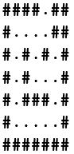

当提供起始点 *(i, j)*（其中 *(0, 0)* 是左上角点，*(H, W)* 是右下角点）时，找到走出迷宫的总步数。

**目标**

使用 BFS 寻找给定迷宫的出口最短路径。

**先决条件**

+   在源代码中实现 `Maze` 类的 `distToExit()` 方法，该方法返回从该点到迷宫出口的整数距离。它可在以下网址找到：

    [`github.com/TrainingByPackt/Data-Structures-and-Algorithms-in-Java/blob/master/src/main/java/com/packt/datastructuresandalg/lesson6/activity/maze/Maze.java`](https://github.com/TrainingByPackt/Data-Structures-and-Algorithms-in-Java/blob/master/src/main/java/com/packt/datastructuresandalg/lesson6/activity/maze/Maze.java)

+   假设提供给 `distToExit()` 的点是有效的（也就是说，它们不在墙壁内）

+   记住，我们只能沿四个基本方向（北、南、东、西）移动

    东，和西）

**完成步骤**

1.  将迷宫表示编码为图表示

1.  应用前一小节中展示的 BFS 实现（对距离进行微小修改），或者你可以边走边构建图

1.  由于你知道对于给定的顶点最多有四个外向边，因此边走边计算它们的位子

在本节中，我们介绍了两种不同的图遍历方法——**广度优先搜索**（**BFS**）和**深度优先搜索**（**DFS**）。我们看到了如何使用 BFS 在无权图中找到单源最短路径，以及如何使用 DFS 在图中找到环。在下一节中，我们将探讨两种不同的算法来找到图中的最短路径。

# 计算最短路径

最短路径是两个顶点之间的路径，使得构成该路径的边的权重之和最小化。最短路径问题在现实世界中有很多应用，从在地图应用中查找方向到最小化解决谜题的移动。

在本节中，我们将探讨两种不同的策略来计算最短路径：一种是从单个源点到图中每个其他顶点的最短路径，另一种是在图中找到所有顶点对之间的最短路径。

# 单源最短路径：Dijkstra 算法

当我们探索 BFS 时，我们看到它能够解决无权图或边具有相同（正）权重的图的最短路径问题。如果我们处理的是带权图呢？我们能做得更好吗？我们将看到 Dijkstra 算法在 BFS 中提出的思想上提供了改进，并且它是一个解决单源最短路径问题的有效算法。使用 Dijkstra 算法的一个限制是边的权重必须是正的。这通常不是一个大问题，因为大多数图用具有正权重的边来表示实体。尽管如此，还有一些算法能够解决负权值的问题。由于负边的使用场景较少见，这些算法超出了本书的范围。

Dijkstra 算法由 Edsger W. Dijkstra 在 1956 年构思，它维护一个集合 *S*，其中包含从源 *s* 到其最终最短路径权重的顶点已经确定。该算法反复选择具有最小最短路径估计的顶点 *u*，将其添加到集合 *S* 中，并使用该顶点的向外边缘来更新尚未在集合 *S* 中的顶点的估计。为了看到这一过程，让我们考虑 *图 6.5* 的有向图：

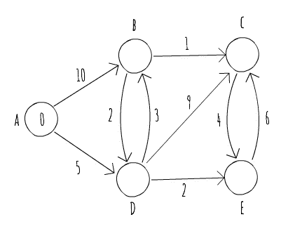

图 6.5：一个示例加权有向图

该图由五个顶点（*A*、*B*、*C*、*D* 和 *E*）和 10 条边组成。我们感兴趣的是找到从顶点 *A* 开始的最短路径。请注意，A 已经标记为 *0*，这意味着从 *A* 到 *A* 的当前距离为零。其他顶点还没有与它们关联的距离。通常使用无穷大作为尚未看到的节点距离的起始估计。以下表格显示了 Dijkstra 算法在 *图 6.5* 图上的运行情况，标识了当前被选中的顶点以及它如何更新尚未在集合 *S* 中的顶点的估计：

| **步骤** | **说明** |
| --- | --- |
| 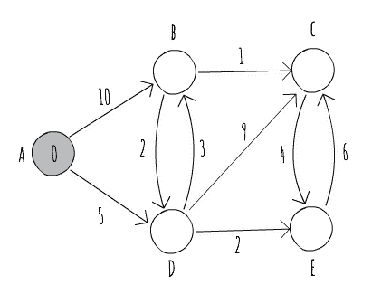 | 顶点 *A* 是具有最低估计权重的顶点，因此它被选中作为下一个顶点，其边缘将被考虑以改进当前的估计。 |
| 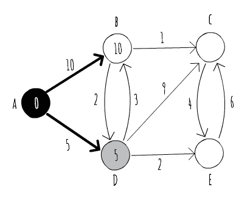 | 我们使用从顶点 *A* 出发的向外边缘来更新顶点 *B* 和 *D* 的估计。之后，我们将 *A* 添加到集合 *S* 中，避免重复访问它。在尚未访问的边缘中，现在具有最低估计的是 *D*，它将被选中进行访问。请注意，我们也用粗体标记了属于我们估计最短路径的边缘。 |
| 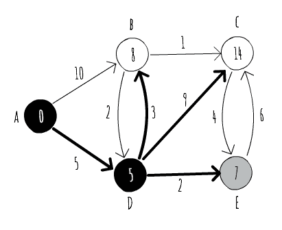 | 通过探索从顶点 *D* 出发的向外边缘，我们能够改进顶点 *B* 的估计，因此我们相应地更新它，并现在考虑不同的边缘来寻找最短路径。我们还能够发现顶点 *C* 和 *E*，它们成为下一个要访问的潜在候选者。由于 *E* 具有较短的估计权重，我们接下来访问它。 |
| 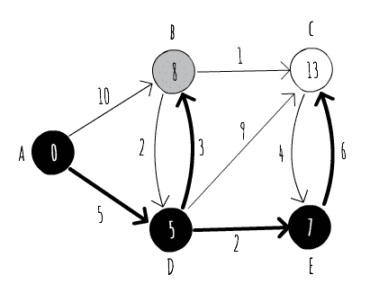 | 使用从顶点 *E* 出发的向外边缘，我们能够改进顶点 *C* 的估计，现在将 *B* 作为下一个要访问的顶点。请注意，那些属于集合 *S* 的顶点（如图中黑色所示）已经计算了最短路径。它们内部的价值是从 *A* 到它们的短路径的权重，你可以跟随粗体边缘来构建最短路径。 |
| 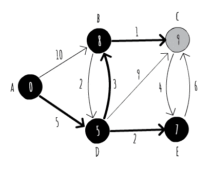 | 从顶点 *B*，我们能够再次改进到顶点 *C* 的最短路径估计。由于顶点 *C* 是唯一尚未在集合 *S* 中的顶点，因此它是下一个被访问的顶点。 |
| 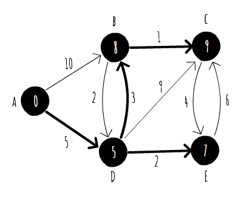 | 由于顶点 *C* 没有指向尚未在 *S* 中的顶点的出边，我们得出算法运行的结论，并成功计算了从 *A* 到图中每个其他顶点的最短路径。 |

表 6.5：Dijkstra 算法在图 6.5 的加权有向图上的运行

现在我们已经看到了 Dijkstra 算法的一次运行，让我们尝试将其放入代码中并分析其运行时间性能。我们将使用邻接表表示我们的图，因为它有助于我们探索给定顶点的出边。以下代码片段显示了 Dijkstra 算法的一种可能实现，如之前所述：

```java
while (!notVisited.isEmpty()) {
  Vertex v = getBestEstimate(notVisited);
  notVisited.remove(v);
  visited.add(v);
  for (Edge e : adj[v.u]) {
    if (!visited.contains(e.v)) {
      Vertex next = vertices[e.v];
      if (v.distance + e.weight < next.distance) {
        next.distance = v.distance + e.weight;
        parent[next.u] = v.u;
      } 
    }
  } 
}  
```

6.6 段：Dijkstra 算法的实现。源类名：Dijkstra

前往 [`goo.gl/P7p5Ce`](https://goo.gl/P7p5Ce) 访问此代码。

Dijkstra 方法首先初始化两个集合：

+   一个用于已访问顶点

+   一个用于未访问顶点

已访问顶点的集合对应于我们之前命名为 *S* 的集合，我们使用未访问顶点的集合来跟踪要探索的顶点。

我们然后初始化每个顶点的估计距离等于 `Integer.MAX_VALUE`，代表我们用例中的“无穷大”值。我们还使用一个父数组来跟踪最短路径中的父顶点，这样我们就可以稍后从源顶点重新创建路径。

主循环对每个顶点运行，直到我们还有未访问的顶点。对于每次运行，它选择要探索的“最佳”顶点。在这种情况下，“最佳”顶点是到目前为止未访问顶点中距离最小的顶点（`getBestEstimate()` 函数简单地扫描 `notVisited()` 集合中的所有顶点，以找到满足要求的顶点）。

然后，它将顶点添加到已访问顶点的集合中，并更新未访问顶点的估计距离。当我们没有更多顶点要访问时，我们通过递归访问父数组来构建我们的路径。

分析前一个实现的运行时间，我们可以看到有一个与图中顶点数量成正比的初始化步骤，因此以 *O(V)* 运行。

算法的主体循环对每个顶点运行一次，因此它至少被限制在 *O(V)*。在主体循环内部，我们确定下一个要访问的顶点，然后扫描其邻接表以更新估计距离。更新距离所需的时间与 *O(1)* 成正比，并且由于我们只扫描每个顶点的邻接表一次，所以我们花费的时间与 *O(E)* 成正比，更新估计距离。我们剩下选择下一个要访问的顶点所需的时间。不幸的是，`getBestEstimate()` 方法需要扫描所有未访问的顶点，因此它被限制在 *O(V)*。因此，我们实现 Dijkstra 算法的总运行时间是 *O(V²+E)*。

尽管我们实现中的某些部分看起来难以优化，但看起来在选择下一个要访问的顶点时，我们可以做得更好。如果我们能够访问一个能够按较低估计距离排序我们的顶点并且提供高效插入和删除操作的数据结构，那么我们就可以减少在 `getBestEstimate` 方法中花费的 *O(V)* 时间。

在第四章 *算法设计范式* 中，我们简要讨论了在霍夫曼编码（Huffman coding）中使用的名为优先队列（priority queue）的数据结构，这正是我们这项工作所需要的。以下代码片段实现了一个更高效的迪杰斯特拉算法版本，使用了优先队列：

```java
PriorityQueue<Node> pq = new PriorityQueue<>();
pq.add(new Node(source, 0));
while (!pq.isEmpty()) {
  Node v = pq.remove();
  if (!vertices[v.u].visited) {
    vertices[v.u].visited = true;
    for (Edge e : adj[v.u]) {
      Vertex next = vertices[e.v];
      if (v.distance + e.weight < next.distance) {
        next.distance = v.distance + e.weight;
        parent[next.u] = v.u;
        pq.add(new Node(next.u, next.distance));
      }
    }
  } 
} 
```

代码片段 6.7：使用优先队列实现迪杰斯特拉算法。源类名：DijkstraWithPQ

前往 [`goo.gl/3rtZCQ`](https://goo.gl/3rtZCQ) 访问此代码。

在这个第二个实现中，我们不再保留已访问和未访问顶点的集合。相反，我们依赖于一个在运行算法时将存储我们的距离估计的优先队列。

因此，当我们从一个给定的顶点探索向外延伸的边时，如果我们能够改进我们的距离估计，我们就会向优先队列中添加一个新的条目。

从我们的优先队列中添加或删除一个元素需要 *O(logN)* 时间，其中 *N* 是队列中的元素数量。请注意，我们可以在优先队列中插入相同的顶点多次。这就是为什么我们在扩展其边之前检查我们是否已经访问过它。

由于我们将访问具有较短估计距离的顶点的实例，因此可以安全地忽略其后的那些。然而，这意味着我们的优先队列操作不受 *O(logV)* 的限制，而是 *O(log E)*（假设存在一个连通图）。

因此，这个实现的总体运行时间是 *O((V + E)logE)*。通过使用具有更好渐近界限的优先队列实现（例如斐波那契堆），我们仍然可以改进这个运行时间，但其实现超出了本书的范围。

关于迪杰斯特拉算法的最后一件事是它如何借鉴了 BFS（算法结构非常类似于迪杰斯特拉算法，但我们最终使用的是优先队列而不是普通队列）的想法，并且它是一个非常好的贪婪算法的例子：迪杰斯特拉算法通过做出局部最优的选择（例如，它选择具有最小估计距离的顶点）来达到全局最优。

# 所有对最短路径：弗洛伊德-沃舍尔算法（Floyd-Warshall Algorithm）

有时候，可能需要计算图中所有顶点对之间的最短路径。例如，我们可能对构建一个距离表感兴趣。实现这一目标的一种方法是对图中的每个顶点执行单源最短路径算法。如果你使用迪杰斯特拉算法（Dijkstra's algorithm）来做这件事，我们最终得到的运行时间是 *O(V*(V + E)logE)*。

在本小节中，我们将探讨一个能够在 *O(V³)* 时间内解决所有对最短路径问题的算法，其实施简单而优雅。

我们即将研究的一种算法，通常被称为 Floyd-Warshall 算法，由 Robert Floyd 在 1962 年以当前形式发表。然而，从本质上讲，它遵循 Bernard Roy 在 1959 年和 Stephen Warshall 在 1962 年发表的同种思想。

该算法使用邻接矩阵表示法，并遵循动态规划方法。其基本思想是，当我们试图计算顶点 *i* 和顶点 *j* 之间的最短路径距离时，我们尝试使用一个中间顶点，*k*。我们想要使用一个中间顶点，以便从 *i* 到 *k* 和从 *k* 到 *j* 的路径可以缩短当前计算出的 *i* 和 *j* 之间的最短路径。如果我们找到这样的顶点，那么我们迄今为止能够计算出的 *i* 和 *j* 之间的最佳路径必须经过 *k*。我们所需做的只是，对于每个 *k*，查看使用它是否可以改善 *i* 和 *j* 之间的最短路径，对于所有可能的 *i* 和 *j*。

为了在实践中看到这一点，让我们使用我们用来说明 Dijkstra 算法的 *图 6.5* 的有向图。*图 6.5* 的邻接矩阵表示如下表格：

|  | **A** | **B** | **C** | **D** | **E** |
| --- | --- | --- | --- | --- | --- |
| **A** | 0 | 10 | ∞ | 5 | ∞ |
| **B** | ∞ | 0 | 1 | 2 | ∞ |
| **C** | ∞ | ∞ | 0 | ∞ | 4 |
| **D** | ∞ | 3 | 9 | 0 | 2 |
| **E** | ∞ | ∞ | 6 | ∞ | 0 |

表 6.6：图 6.5 的有向图的邻接矩阵表示

邻接矩阵表示法是 Floyd-Warshall 算法的起点，我们遍历它，直到我们只剩下一个矩阵，该矩阵表示每对顶点之间最短路径的权重。为了做到这一点，让我们从顶点 *A* 开始，将其视为最短路径的中间顶点。不幸的是，顶点 *A* 没有内向边，这意味着它不能用作最短路径的中间顶点。使用顶点 *B*，我们可以改善从 *A* 到 *C* 的距离（10 + 1 < ∞），并且我们可以用它从 *A* 到 *D*，但不会改善整体距离。我们还可以用它来改善从 *D* 到 *C* 的距离（3 + 1 < 9）。因此，在考虑 *B* 作为中间顶点后，我们剩下以下表格的距离矩阵：

|  | **A** | **B** | **C** | **D** | **E** |
| --- | --- | --- | --- | --- | --- |
| **A** | 0 | 10 | 11 | 5 | ∞ |
| **B** | ∞ | 0 | 1 | 2 | ∞ |
| **C** | ∞ | ∞ | 0 | ∞ | 4 |
| **D** | **∞** | 3 | 4 | 0 | 2 |
| **E** | ∞ | ∞ | 6 | ∞ | 0 |

表 6.7：考虑 B 作为中间顶点后的距离矩阵

现在，我们将查看顶点 *C*。使用顶点 *C*，我们可以改善从 *A* 到 *E*（11 + 4 < ∞）和从 *B* 到 *E*（1 + 4 < ∞）的距离：

|  | **A** | **B** | **C** | **D** | **E** |
| --- | --- | --- | --- | --- | --- |
| **A** | 0 | 10 | 11 | 5 | 15 |
| **B** | ∞ | 0 | 1 | 2 | 5 |
| **C** | ∞ | ∞ | 0 | ∞ | 4 |
| **D** | ∞ | 3 | 4 | 0 | 2 |
| **E** | ∞ | ∞ | 6 | ∞ | 0 |

表 6.8：考虑 C 作为中间顶点后的距离矩阵

使用顶点*D*，我们可以改善从*A*到*B*（5 + 3 < 10）、从*A*到*C*（5 + 4 < 11）、从*A*到*E*（5 + 2 < 15）以及从*B*到*E*（2 + 2 < 5）的距离：

|  | **A** | **B** | **C** | **D** | **E** |
| --- | --- | --- | --- | --- | --- |
| **A** | 0 | 8 | 9 | 5 | 7 |
| **B** | ∞ | 0 | 1 | 2 | 4 |
| **C** | ∞ | ∞ | 0 | ∞ | 4 |
| **D** | ∞ | 3 | 4 | 0 | 2 |
| **E** | ∞ | ∞ | 6 | ∞ | 0 |

表 6.9：考虑 D 作为中间顶点后的距离矩阵

使用顶点*E*，我们无法改善任何距离，因此*表 6.9*已经包含了所有顶点对之间最短路径的权重。实现 Floyd-Warshall 算法非常简单，如下代码片段所示：

```java
public void run() {
  for (int k = 0; k < adj.length; k++) {
    for (int i = 0; i < adj.length; i++) {
      if (adj[i][k] >= Integer.MAX_VALUE)
        continue;
      for (int j = 0; j < adj.length; j++) {
        if (adj[k][j] >= Integer.MAX_VALUE)
          continue;
        adj[i][j] = Math.min(adj[i][j], adj[i][k] + adj[k][j]);
      }
    }
  }
}  
```

碎片 6.8：Floyd-Warshall 算法的实现。源类名：FloydWarshall

前往[`goo.gl/SQxdL2`](https://goo.gl/SQxdL2)访问此代码。

观察实现过程，*O(V³)*的时间复杂度变得明显。Floyd-Warshall 算法的一个替代方案是对图中的每个顶点运行 Dijkstra 算法（这样我们最终会得到所有成对的最短路径）。鉴于其复杂度接近于对稠密图多次应用 Dijkstra 算法，Floyd-Warshall 算法在实践中经常被使用。

# 活动：改进 Floyd-Warshall 算法以重建最短路径

**场景**

改进 Floyd-Warshall 算法，以便在运行算法后能够使用前驱矩阵重建两个给定节点之间的最短路径。

**目标**

使用前驱矩阵构建两个顶点之间的最短路径。

**先决条件**

前驱矩阵用于计算两个给定顶点之间的最短路径。前驱矩阵的每个单元格*P[ij]*应该是空的（表示*i*和*j*之间没有路径），或者等于某个索引*k*（表示顶点*k*是*i*和*j*之间最短路径中的前驱顶点）。因此，每当使用中间顶点时，我们需要更新我们的前驱矩阵。

实现 Floyd-Warshall 类的`run()`方法，该方法应计算当前图的最短路径并填充路径矩阵，该矩阵随后在`path()`方法中使用，以返回两个给定顶点之间的路径。该方法可在以下 URL 找到：

[`github.com/TrainingByPackt/Data-Structures-and-Algorithms-in-Java/blob/master/src/main/java/com/packt/datastructuresandalg/lesson6/activity/floydwarshall/FloydWarshall.java`](https://github.com/TrainingByPackt/Data-Structures-and-Algorithms-in-Java/blob/master/src/main/java/com/packt/datastructuresandalg/lesson6/activity/floydwarshall/FloydWarshall.java)

**完成步骤**

1.  将 Floyd-Warshall 算法的*碎片 6.8*中的实现进行修改，以更新路径矩阵

1.  使用它来重建路径，类似于我们在迪杰斯特拉算法实现中之前所展示的

在本节中，我们介绍了最短路径问题，并探讨了两种不同的算法来解决它：一个用于单源最短路径（迪杰斯特拉算法），另一个用于所有对最短路径（弗洛伊德-沃舍尔算法）。我们展示了不同的迪杰斯特拉算法实现如何影响其运行时间。对于这两个算法，我们也展示了如何分别使用父数组和中继矩阵重建最短路径。

# 算法中的素数

素数是一个大于 1 的自然数，其唯一的因数是 1 和它本身。

素数在算术基本定理中扮演着非常重要的角色：每个大于 1 的自然数要么是素数，要么是素数的乘积。如今，数论算法被广泛使用，主要归功于基于大素数的加密方案。大多数这些加密方案都是基于这样一个事实：我们可以高效地找到大素数，但我们不能高效地分解这些大素数的乘积。正如之前所看到的，素数在哈希表的实现中扮演着重要的角色。

# 埃拉托斯特尼筛法

埃拉托斯特尼筛法是一个简单而古老的算法，用于找到给定限制内的所有素数。如果我们想找到所有小于等于*N*的素数，我们首先创建一个从*2*到*N*（2，3，4，5…N）的连续整数列表，最初未标记。让我们用*p*来表示最小的未标记数。然后，我们选择比最后一个*p*更大的最小的未标记数*p*。在第一次迭代中，*p*将是 2。之后，通过*p*的增量，我们在列表中标记从*2p*到*Mp*的元素，使得*Mp <= N.*

我们重复此策略，直到无法在列表中标记更多数字为止。在运行结束时，所有未标记的数字都是素数。很容易看出，所有未标记的数字都是我们找不到除数（除了数字本身和 1）的数字，因此是素数。

# 素数分解

素数分解是确定给定数的素数因子。为这个计算上困难的问题构建一个通用算法是非常困难的。一个常用的通用算法，用于分解素数，在第一章，*算法与复杂性*中介绍。其基本思想是遍历可能的因数，尝试除以该数。

从 2 开始；当数字能被 2 整除时，继续除以它，并将 2 添加到因数列表中。之后，数字必须是奇数，因此开始一个循环，检查从 3 到数字的平方根的可能因数。

由于我们已经涵盖了偶数，你可以在循环中执行 2 的增量（一旦检查了 2，就没有必要检查 4、6、8 等等）。一旦找到合适的除数，将数字添加到因子列表中，并除以它直到可能为止。在这个步骤结束时，如果我们剩下大于 2 的数字，那么它是一个质数，因此也是它自己的质因数。

# 活动：实现埃拉托斯特尼筛法

**场景**

实现埃拉托斯特尼筛法算法以找到给定限制范围内的所有质数。

**目标**

开发一个 Java 代码来实现埃拉托斯特尼筛法。

**先决条件**

+   实现 `SieveOfEratosthenes` 类的 `isPrime()` 方法，该方法应返回 `true` 如果数字是质数，否则返回 `false`。它可在以下 URL 找到：

    [`github.com/TrainingByPackt/Data-Structures-and-Algorithms-in-Java/blob/master/src/main/java/com/packt/datastructuresandalg/lesson7/activity/sieve/SieveOfEratosthenes.java`](https://github.com/TrainingByPackt/Data-Structures-and-Algorithms-in-Java/blob/master/src/main/java/com/packt/datastructuresandalg/lesson7/activity/sieve/SieveOfEratosthenes.java)

+   考虑在类构造函数中构建筛子。

# 图中的其他概念

在本章中，我们介绍了表示和遍历图的方法，并探讨了最短路径算法。图也是解决一些尚未提到的某些问题的最优数据结构。本节旨在介绍其中的一些。

# 最小生成树

图的最小生成树是连接图中所有顶点的边集 *E* 的一个子集，它没有循环，并且具有最小的总边权重。因为它中的每两个顶点都恰好由一条路径连接，所以它是一个树。

为了理解最小生成树的应用，考虑一个电信公司进入新社区的问题。该公司希望连接所有房屋，但同时也希望最小化使用的电缆长度以降低成本。解决该问题的一种方法是通过计算一个图的最小生成树，该图的顶点是社区的房屋，房屋之间的边根据它们之间的距离进行加权。

有许多算法可以解决最小生成树问题。其中最著名的是普里姆（Prim）和克鲁斯卡尔（Kruskal）算法。

普里姆算法是一种贪心算法，它反复选择连接某些尚未包含在生成树中的边与某些已包含在生成树中的边的较小权重的边。其运行时间取决于实现方式，但可能实现 *O(VlogE)* 的运行时间。它可以类似于迪杰斯特拉算法实现。我们从一个任意选择的顶点开始，将其作为树的一部分。所有连接到这个“起始”顶点的边都被添加到一个按边权重排序的候选边集合中。当我们仍然需要向树中添加顶点时，我们从候选边列表中选择具有较小权重的边，该边连接到一个尚未包含在树中的顶点，然后对新顶点重复此过程。

克鲁斯卡尔算法也是一种使用并查集数据结构的贪心算法。并查集数据结构，或称为集合归并查找数据结构，是一种跟踪被划分为若干个非重叠子集的元素的数据结构。它提供了一种高效的方法来合并两个集合并检查两个元素是否属于同一个集合。

克鲁斯卡尔算法的思想是将森林（例如，一组树）减少到一棵树，使用并查集数据结构来跟踪树。我们从一个顶点开始，每个顶点有一棵树，只包含一个顶点。当我们有多个树时，我们选择连接两个不同树的具有最小权重的边（我们不希望产生循环），并将这两棵树合并在一起。最后，结果树将是总边权重最小化的树。克鲁斯卡尔算法的运行时间也是 *O(VlogE)*。

# A* 搜索

A* 搜索算法是在解决路径查找问题时非常常见的一种算法。它也解决了最短路径问题，通过引入启发式方法来增强迪杰斯特拉算法。启发式是一种对给定成本的实用估计，不保证是最优或完美的，但对于立即目标或引导搜索是足够的。其基本思想是，当将此启发式添加到已计算出的节点估计距离时，可以引导搜索朝向目标，并避免访问某些顶点。

例如，如果我们使用欧几里得距离（例如，两点之间的直线距离）从我们的位置到给定迷宫的出口，我们可以引导搜索朝那个方向进行，避免访问某些不必要的位置。

# 最大流

一些有向加权图可以看作是流网络。在流网络中，边权重代表容量，每条边接收的流量不能超过边的容量。边上的标签代表边的已用容量和总容量。最大流试图在考虑单个源（初始流量开始的地方）和单个汇（流量结束的地方）的情况下，在网络中找到最大可行流。最大流问题允许解决相关问题，如成对分配。有各种算法可以解决最大流问题。其中最著名的三个是 Ford-Fulkerson 算法、Edmonds-Karp 算法和 Dinic 算法。

Ford-Fulkerson 算法背后的思想是在流网络中反复寻找增广路径。增广路径是仍然有可用容量的路径。虽然可以找到增广路径，但可以通过路径的容量添加流量，并重复此过程。Ford-Fulkerson 算法的运行时间是*O(Ef)*，其中*f*是图的流的最大值。Edmonds-Karp 算法通过始终选择最短的增广路径来改进 Ford-Fulkerson 算法。Edmonds-Karp 算法的运行时间复杂度是*O(VE²)*，与最大流值无关。Dinic 算法在*O(V²E)*时间内运行，也基于最短增广路径，但使用了一些使其更适合稀疏图的概念。

# 理解问题的复杂度类别

到目前为止介绍的所有算法几乎都在多项式时间内运行（例如，对于大小为*n*的输入，它们的最坏情况下运行时间是常数*k*的*O(n^k)*）。然而，有些问题根本无法解决，或者还没有找到多项式时间算法。

一个无法解决的问题的例子是停机问题。停机问题是从计算机程序和输入的描述中确定程序是否会完成运行或继续无限运行的问题。艾伦·图灵证明了对于所有（程序，输入）对，不存在解决停机问题的通用算法。

通常将可以用多项式时间算法解决的问题（例如，那些最坏情况下运行时间为常数*k*的*O(n^k)*）称为“可解的”或“简单的”，而需要超多项式时间算法解决的问题（例如，其运行时间不受任何多项式的上界限制）称为“不可解的”或“困难的”。

存在一类称为**NP-完全**（**NPC**）的问题，还没有人找到解决它们的算法。然而，还没有人能够证明对于它们中的任何一个，都不存在多项式时间算法。

另一类问题被称为**NP**问题，其解决方案可以在多项式时间内验证。这意味着，给定一个问题及其一个可能的解决方案，可以在多项式时间内验证该解决方案是否正确。

P 类中的所有问题也都在 NP 类中。NPC 包括属于 NP 类和 NP-hard 类的问题。一个问题是 NP-hard，如果解决它的算法可以被转换成解决 NP 问题的算法。

理论计算机科学中最深奥的未解研究问题之一是 P 是否真的与 NP 不同（例如，*P != NP*）。

NPC 问题的例子如下：

+   在图中找到最长路径

+   在图中找到一条路径，该路径访问所有顶点恰好一次（称为哈密顿路径）

一个常见的 NP-hard 问题示例是在图中找到一条路径，该路径访问所有顶点恰好一次并返回起点。这个问题包括找到最小权重的哈密顿回路，通常描述为旅行商问题，因为它模拟了需要访问所有城市并返回家乡的旅行商的问题。

# 摘要

在本章中，我们介绍了图，正式化了它们的定义，并展示了在计算机程序中用两种不同的方式表示它们。之后，我们探讨了遍历图的方法，将它们作为构建更复杂算法的基石。然后，我们研究了两种在图中找到最短路径的不同算法。

在本书的结尾，我们为好奇的学生提供了自学指南。数据结构和算法的世界是广阔的，需要一种数学推理能力，这需要一些学习和实践。然而，对于软件工程师来说，生活中最有成就感的事情之一就是想出巧妙的算法来解决复杂问题。
