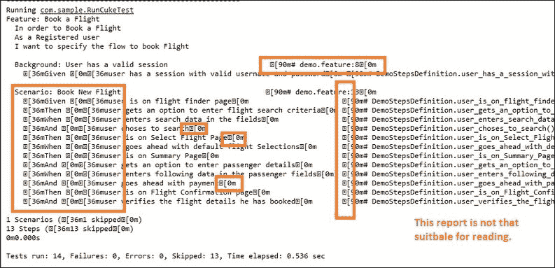

# 第四章 配置 Cucumber

在本章中，我们将探讨以下食谱：

+   将 Cucumber 与 JUnit 集成

+   覆盖 Cucumber 选项

+   运行严格和运行干燥

+   配置 Cucumber 控制台输出

+   将 Cucumber 输出定向到文件

+   配置命名约定

# 简介

当我们谈论使用 Cucumber 进行行为驱动开发时，我们经常谈论 Feature 文件、场景、背景和粘合代码（Step Definitions）。毫无疑问，在你理解前面提到的概念之前，你将无法实现 Cucumber，但一个真正重要且在日常 Cucumber 生活中非常有用的领域是配置 Cucumber。

在本章中，我们将从将 Cucumber 与 JUnit 集成开始，然后开始了解我们可以使用 `@CucumberOptions` 注解进行的不同配置。

# 将 Cucumber 与 JUnit 集成

到目前为止，我们已从 Eclipse 或终端运行 Cucumber 测试，但如何使用自动化框架与 Cucumber 一起工作？

我们如何将 Cucumber 与 JUnit 框架集成？让我们在下一节中看看。

## 如何做…

我们需要在 `CucumberOptions` 包中创建一个具有空体和 `@RunWith` 注解的 Java 类。这个类应该看起来像这样：

```java
package com.CucumberOptions;

import org.junit.runner.RunWith;
import Cucumber.api.junit.Cucumber;

@RunWith(Cucumber.class)
public class RunCukeTest {
}
```

## 它是如何工作的…

Cucumber 随带一个 JUnit 运行器，`Cucumber.api.junit.Cucumber` 类。这个类告诉 JUnit 调用 `Cucumber JUnit 运行器`。它将搜索 Feature 文件并运行它们，以 JUnit 理解的格式将输出返回给 JUnit。将此类作为任何 JUnit 测试类执行将运行与该类同一包中的所有 Feature。

### 注意

`JUnit` 类的名称无关紧要，并且该类应该是空的。

# 覆盖 Cucumber 选项

有时，根据需求，我们可能希望覆盖默认的 Cucumber 行为，例如报告或项目结构等。我们可以通过终端配置 Cucumber，但大多数情况下我们使用 JUnit 运行 Cucumber。那么我们如何配置 Cucumber 与 JUnit 运行器，让我们在下一节中看看。

## 如何做…

1.  将 `@CucumberOptions` 添加到 `RunCuckeTest.java` 类中，并导入 `Cucumber.api.CucumberOptions`。`RunCukeTest.java` 的更新代码应该看起来像这样：

    ```java
    package com.CucumberOptions;

    import org.junit.runner.RunWith;
    import Cucumber.api.CucumberOptions;
    import Cucumber.api.junit.Cucumber;

    @RunWith(Cucumber.class)
    @CucumberOptions(  
    //your Cucumber Options code goes here
    )
    public class RunCukeTest {
    }
    ```

1.  现在，让我们指定我们的 Feature 文件和 Step Definitions 所在的配置文件以及使用的 Tags。这是 `RunCukeTest.java` 代码应该看起来像这样：

    ```java
    package com.CucumberOptions;

    import org.junit.runner.RunWith;
    import Cucumber.api.CucumberOptions;
    import Cucumber.api.junit.Cucumber;

    @RunWith(Cucumber.class)
    @CucumberOptions(  
     Features = "src/test/java/com/Features",
     glue = "com.StepDefinitions",
     Tags = { "~@wip","~@notImplemented","@sanity" }
        )
    public class RunCukeTest {
    }
    ```

    参考截图以获得更多清晰度：

    

## 它是如何工作的…

`@CucumberOptions` 注解提供了与 Cucumber 终端行相同的选项。例如，我们可以指定 Feature 文件和 Step Definitions 的路径。

可用的不同选项如下：

| 元素 | 目的 | 默认 |
| --- | --- | --- |
| `dryRun` | true（跳过粘合代码的执行） | FALSE |
| `strict` | true（如果有未定义或挂起的步骤，将失败执行） | FALSE |
| `Features` | 这些是 Feature 文件的路径 | {} |
| `glue` | 这表示在哪里查找粘合代码（步骤定义和钩子） | {} |
| `Tags` | 这表示 Features 中哪些标签应该执行 | {} |
| `monochrome` | 这表示是否使用单色输出 | FALSE |
| `plugin` | 这表示声明使用哪些格式化程序（s）以及一些其他选项 | {} |

让我们了解在这个配方中我们使用的选项：

+   **Features**: 此选项用于指定 Feature 文件的路径。当 Cucumber 开始执行时，它会查找在 **FEATURE** 选项中提到的路径/文件夹中的 `.Feature` 文件。在 **FEATURE** 选项中提到的路径中，具有 `.Feature` 扩展名的任何文件都将被执行。

+   **Glue**: **GLUE** 选项用于指定步骤定义和粘合代码的位置。每当 Cucumber 遇到步骤时，Cucumber 都会在 **GLUE** 选项中提到的文件夹中所有文件内寻找步骤定义。这也适用于钩子。

+   **Tags**: 此选项帮助您决定在 Features 中哪些标签应该执行，或者换句话说，哪些标签不应该执行。例如，在我们的代码中，任何被标记为 `@sanity` 的场景都将被执行，而任何被标记为 `@wip` 的场景将不会被执行，因为 `@wip` 标签之前有 `~`。任何标签前的 `~` 都告诉 Cucumber 跳过带有该标签的场景/Feature。

    ### 注意

    接受多个值的选项以列表的形式接受。在先前的表中，这些选项在默认列中已被标记为 `{}`。

# 运行严格和运行干燥

当 Cucumber 项目变得很大时，保持系统完整性变得非常重要。不应该发生添加/修改场景会破坏系统的情况。那么，如何快速检查所有步骤是否都有相关的步骤定义（而不执行这些步骤定义中的代码）？让我们在接下来的部分中了解这一点。

## 如何操作…

1.  将 `dryRun` 选项添加到 `@CucumberOptions` 并将其值设置为 `true`。

1.  将 `strict` 选项添加到 `@CucumberOptions` 并将其值设置为 `false`。

1.  将 `monochrome` 选项添加到 `@CucumberOptions` 并将其值设置为 `true`。

这就是我们的 `RunCukeTest.Java` 类应该看起来像：

```java
package com.CucumberOptions;

import org.junit.runner.RunWith;
import Cucumber.api.CucumberOptions;
import Cucumber.api.junit.Cucumber;

@RunWith(Cucumber.class)
@CucumberOptions(  
    Features = "src/test/java/com/Features",
    glue = "com.StepDefinitions",
    Tags = { "~@wip","~@notImplemented","@sanity" },
 dryRun = true,
 strict = false,
 monochrome = true
    )
public class RunCukeTest {
}
```

## 工作原理…

让我们了解 `dryRun` 和 `chrome`：

+   **dryRun**: 如果将 `dryRun` 选项设置为 `true`，Cucumber 只会检查所有步骤是否都有相应的步骤定义，并且步骤定义中提到的代码不会执行，反之亦然。

    这用于验证我们是否为每个步骤定义了步骤定义。考虑如果有人向项目中添加了新的场景，并希望检查他是否遗漏了任何步骤定义。他将`dryRun`选项设置为`true`并运行所有场景。Cucumber 会检查所有场景的匹配步骤定义，而不执行步骤定义之间的代码，并返回结果。与 Cucumber 在步骤定义中执行代码相比，这种技术可以节省大量时间。

+   **严格模式**: 如果将`strict`选项设置为`false`，并且在执行时 Cucumber 遇到任何未定义/挂起的步骤，那么 Cucumber 不会使执行失败，并且会跳过未定义的步骤，构建成功。控制台输出如下所示：

    如果选项设置为`true`，并且在执行时，如果 Cucumber 遇到任何未定义/挂起的步骤，那么 Cucumber 将使执行失败，并将未定义的步骤标记为失败。控制台输出如下所示：

    

+   **单色模式**: 如果将`monochrome`选项设置为`false`，那么控制台输出将不如预期那样易于阅读。当`monochrome`选项设置为`false`时的输出如下所示：

    当将`monochrome`选项设置为`true`时，输出如下所示：

    

# 配置 Cucumber 控制台输出

当我们执行 Cucumber 场景时，它会在终端或 Eclipse 控制台中生成输出。该输出有一个默认行为，我们也可以根据需要配置该输出。那么我们如何修改默认行为呢？让我们在下一节中看看。

## 如何操作…

1.  将`plugin`选项添加到`@CucumberOptions`中，并将其值设置为`{"progress"}`。这是`@CucumberOptions`代码的示例：

    ```java
    @CucumberOptions(  
        Features = "src/test/java/com/Features",
        glue = "com.StepDefinitions",
        Tags = { "~@wip","~@notImplemented","@sanity" },
        dryRun = false,
        strict = true,
        monochrome = true,
     plugin = { "progress" }
        )
    ```

1.  如果我们现在通过终端运行场景，我们的输出将如下所示：

1.  与`progress`插件相比，我们也可以使用`pretty`插件，它的输出比`progress`插件更详细。代码如下所示：

    ```java
    @CucumberOptions(  
      Features = "src/test/java/com/Features",
      glue = "com.StepDefinitions",
      Tags = { "~@wip","~@notImplemented","@sanity" },
      dryRun = false,
      strict = true,
      monochrome = true,
     plugin = { "pretty" }
    )
    ```

1.  输出如下所示：

1.  如果我们更关注每个步骤定义所花费的时间，那么我们应该使用`usage`插件。这是`@CucumberOptions`代码的示例：

    ```java
    @CucumberOptions(  
        Features = "src/test/java/com/Features",
        glue = "com.StepDefinitions",
        Tags = { "~@wip","~@notImplemented","@sanity" },
        dryRun = false,
        strict = true,
        monochrome = true,
     plugin = { "usage" }
        )
    ```

1.  输出将如下所示：

1.  如果你期望某些场景会失败，并且想要重新运行失败的场景，那么只有在这种情况下才使用`Rerun`插件。这是`@CucumberOptions`代码的示例：

    ```java
    @CucumberOptions(  
        Features = "src/test/java/com/Features",
        glue = "com.StepDefinitions",
        Tags = { "~@wip","~@notImplemented","@sanity" },
        dryRun = false,
        strict = true,
        monochrome = true,
     plugin = { "rerun" }
        )
    ```

1.  输出如下所示：

## 工作原理

让我们了解在前面的步骤中使用到的不同插件：

+   **进度**：这是 Cucumber 的默认插件，每个步骤产生一个字符。每个字符代表每个步骤的状态：

    +   `.` 表示通过

    +   `U` 表示未定义

    +   `-` 表示跳过（或场景概述步骤）

    +   `F` 表示失败

+   **pretty**：这是一个更详细的插件，包含有关哪个步骤匹配哪个步骤定义、参数和步骤位置等信息。

+   **用法**：这将按平均执行时间对步骤定义进行排序。`用法` 插件的输出对于快速找到代码中的慢速部分非常有用，同时也是获取步骤定义概览的好方法。

+   **重试**：此插件输出失败的场景位置，以便可以直接用于下一次执行。如果所有场景都通过，则 `重试` 插件不会产生任何内容。

# 将 Cucumber 输出定向到文件

Cucumber 将业务逻辑与代码集成，因此我们的重点是业务而不是代码。相同的理念也体现在 Cucumber 报告中。Cucumber 报告更多地关注业务实用性，而不是与更多图表相关。

强大的自动化框架生成非常好的详细报告，可以与所有利益相关者共享。根据需求有多种报告选项可供使用。让我们在下一节中查看如何广泛使用报告。

## 如何做…

1.  对于 HTML 报告，请在 `@CucumberOptions` 插件选项中添加 `html:target/Cucumber`。以下是 `@CucumberOptions` 代码的示例：

    ```java
    @CucumberOptions(  
        Features = "src/test/java/com/Features",
        glue = "com.StepDefinitions",
        Tags = { "~@wip","~@notImplemented","@sanity" },
        dryRun = false,
        strict = true,
        monochrome = true,
     plugin = { "progress",
     "html:target/Cucumber"
            }
        )
    ```

1.  对于 JSON 报告，请在 `@CucumberOptions` 插件选项中添加 `json:target_json/Cucumber.json`。以下是 `@CucumberOptions` 代码的示例：

    ```java
    @CucumberOptions(  
        Features = "src/test/java/com/Features",
        glue = "com.StepDefinitions",
        Tags = { "~@wip","~@notImplemented","@sanity" },
        dryRun = false,
        strict = true,
        monochrome = true,
     plugin = { "pretty",
     "json:target_json/Cucumber.json"
            }
        )
    ```

1.  对于 JUnit 报告，请在 `@CucumberOptions` 插件选项中添加 `junit:target_json/Cucumber_junit.xml`。以下是 `@CucumberOptions` 代码的示例：

    ```java
    @CucumberOptions(  
        Features = "src/test/java/com/Features",
        glue = "com.StepDefinitions",
        Tags = { "~@wip","~@notImplemented","@sanity" },
        dryRun = false,
        strict = true,
        monochrome = true,
     plugin = { "pretty",
     "junit:target_json/Cucumber_junit.xml"
            }
        )
    ```

## 如何工作…

默认情况下，插件输出被重定向到 `STDOUT`，如果我们想将输出存储到文件格式，我们需要将输出重定向到该文件。语法如下：

```java
FORMAT : <<filepath>>
```

让我们详细了解每个输出：

+   **HTML**：这将生成一个位于格式化器本身提到的位置的 HTML 报告。以下是 HTML 文件的外观：

+   **JSON**：此报告包含来自 Gherkin 源的 JSON 格式的所有信息。此报告旨在通过第三方工具（如 Cucumber Jenkins）进行后处理，转换为另一种可视化格式。以下是 JSON 报告的外观：

+   **JUnit**：此报告生成与 Apache Ant 的 `junitreport` 任务类似的 XML 文件。这种 XML 格式被大多数持续集成服务器理解，它们将使用它来生成可视化报告。以下是 JUnit 报告的外观：

# 配置命名约定

由于 Cucumber 可以用多种语言实现，具有多种语言知识和背景的开发者可以在同一个项目上工作。因此，有时团队可能难以管理命名约定，例如下划线或驼峰命名法。

Cucumber 允许团队选择命名约定。根据命名约定，Cucumber 为步骤定义生成方法名。让我们在下一节看看它是如何实现的。

## 如何做…

1.  如果您想使用驼峰命名法，那么请将以下代码添加到`@CucumberOptions`中：

    ```java
    snippets=SnippetType.CAMELCASE
    ```

1.  如果您想使用下划线，那么请将以下代码添加到`@CucumberOptions`中。

    ```java
    snippets=SnippetType.UNDERSCORE
    ```

1.  这就是`RunCukeTest.Java`代码的样子：

    ```java
    package com.CucumberOptions;

    import org.junit.runner.RunWith;
    import Cucumber.api.CucumberOptions;
    import Cucumber.api.SnippetType;
    import Cucumber.api.junit.Cucumber;

    @RunWith(Cucumber.class)
    @CucumberOptions(  
        Features = "src/test/java/com/Features",
        glue = "com.StepDefinitions",
        Tags = { "~@wip","~@notImplemented","@sanity" },
        dryRun = false,
        strict = true,
        monochrome = true,
        plugin = { "pretty",
               "junit:target_junit/Cucumber.xml"
             },
     Snippets = SnippetType.CAMELCASE
        )
    public class RunCukeTest {
    }
    ```

## 如何工作…

让我们详细了解一下`Snippets`选项：

**片段**：此选项是键入的，因此您需要使用提供的其中一个常量，即`SnippetType.CAMELCASE`或`SnippetType.UNDERSCORE`。请记住导入`Cucumber.api.SnippetType`。默认选项是下划线。如果我们选择驼峰命名法，步骤定义的建议如下所示：


