# 第五章。运行 Cucumber

在本章中，我们将介绍以下食谱：

+   将 Cucumber 与 Maven 集成

+   从终端运行 Cucumber

+   从终端覆盖选项

+   将 Cucumber 与 Jenkins 和 GitHub 集成

+   并行运行 Cucumber 测试用例

# 简介

为了成功实施任何测试框架，强制要求测试用例能够以多种方式运行，以便不同能力水平的人能够按需使用。因此，现在我们将关注运行 Cucumber 测试用例。运行 Cucumber 的方式有多种，例如将其与 Maven 集成并在终端中运行；我们还可以通过将 Cucumber 与 Jenkins 集成来远程运行 Cucumber。

在本章中，我们还将介绍如何通过 Cucumber、Maven 和 JUnit 的组合并行运行 Cucumber 测试用例的高级主题。

# 将 Cucumber 与 Maven 集成

Maven 相比其他构建工具有很多优势，例如依赖项管理、众多插件以及运行集成测试的便利性。因此，让我们也将我们的框架与 Maven 集成。Maven 将允许我们的测试用例以不同的方式运行，例如从终端运行、与 Jenkins 集成以及并行执行。

我们如何与 Maven 集成？让我们在下一节中找出答案。

## 准备工作

我假设我们已经了解了 Maven 的基础知识（Maven 的基础知识不在此书的范围之内）。请按照以下说明在您的系统上安装 Maven 并创建一个示例 Maven 项目。

1.  我们首先需要在我们的系统上安装 Maven。因此，请遵循以下博客上的说明：

    对于 Windows 系统：

    [`www.mkyong.com/maven/how-to-install-maven-in-windows/`](http://www.mkyong.com/maven/how-to-install-maven-in-windows/)

    对于 Mac 系统：

    [`www.mkyong.com/maven/install-maven-on-mac-osx/`](http://www.mkyong.com/maven/install-maven-on-mac-osx/)

1.  我们还可以按照本博客上提到的说明安装 Maven Eclipse 插件：

    [`theopentutorials.com/tutorials/eclipse/installing-m2eclipse-maven-plugin-for-eclipse/`](http://theopentutorials.com/tutorials/eclipse/installing-m2eclipse-maven-plugin-for-eclipse/)

1.  要将 Maven 项目导入 Eclipse，请遵循本博客上的说明：

    [`www.tutorialspoint.com/maven/maven_eclispe_ide.htm`](http://www.tutorialspoint.com/maven/maven_eclispe_ide.htm)

## 如何实现...

由于这是一个 Maven 项目，我们将更改 `pom.xml` 文件以添加 Cucumber 依赖项。

1.  首先，我们将声明一些自定义属性，这些属性将用于管理依赖项版本：

    ```java
    <properties>
        <junit.version>4.11</junit.version>
        <cucumber.version>1.2.2</cucumber.version>
        <selenium.version>2.45.0</selenium.version>
        <maven.compiler.version>2.3.2</maven.compiler.version>
    </properties>
    ```

1.  现在，我们将添加 Cucumber-JVM 的依赖项，其作用域为测试：

    ```java
    <!—- Cucumber-java-->
      <dependency>
        <groupId>info.cukes</groupId>
        <artifactId>cucumber-java</artifactId>
        <version>${cucumber.version}</version>
        <scope>test</scope>
      </dependency>
    ```

1.  现在我们需要添加 Cucumber-JUnit 的依赖项，其作用域为测试。

    ```java
    <!-— Cucumber-JUnit -->
      <dependency>
        <groupId>info.cukes</groupId>
        <artifactId>cucumber-junit</artifactId>
        <version>${cucumber.version}</version>
        <scope>test</scope>
      </dependency>
    ```

    就这样！我们已经集成了 Cucumber 和 Maven。

## 它是如何工作的...

通过遵循这些步骤，我们已经创建了一个 Maven 项目并添加了 Cucumber-Java 依赖项。目前，这个项目只有一个 `pom.xml` 文件，但这个项目可以用于添加不同的模块，例如特性文件和步骤定义。

使用属性的优势在于我们确保依赖项版本在 `pom.xml` 文件的一个地方声明。否则，我们会在多个地方声明依赖项，可能会导致依赖项版本不一致。

Cucumber-Java 依赖项是 Cucumber 不同构建块所需的主要依赖项。**Cucumber-JUnit** 依赖项用于 Cucumber JUnit 运行器，我们在运行 Cucumber 测试用例时使用它。

# 从终端运行 Cucumber

现在我们已经将 Cucumber 与 Maven 集成，从终端运行 Cucumber 将不会是问题。从终端运行任何测试框架都有其自身优势，例如覆盖代码中提到的运行配置。

那么，我们如何在终端运行 Cucumber 测试用例呢？让我们在下一节中找出答案。

## 如何操作…

1.  打开命令提示符并 `cd` 到项目根目录。

1.  首先，让我们从命令提示符中运行所有 Cucumber 场景。由于这是一个 Maven 项目，并且我们已经添加了 Cucumber 测试范围依赖项，并且所有特性也添加到了测试包中，请在命令提示符中运行以下命令：

    ```java
    mvn test

    ```

    这是输出：

    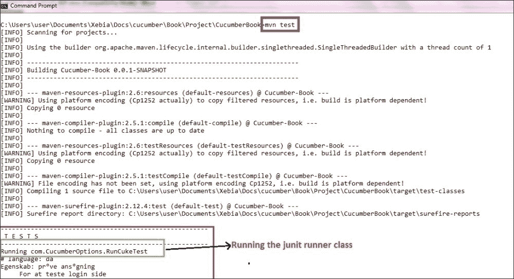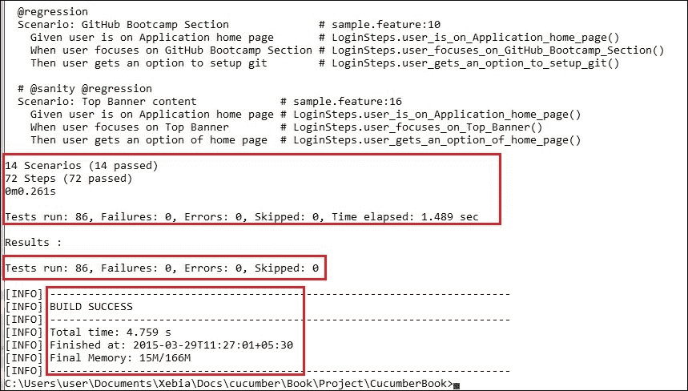

1.  之前的命令运行了 JUnit 运行器类中提到的所有内容。然而，如果我们想覆盖运行器中提到的配置，则需要使用以下命令：

    ```java
    mvn test –DCucumber.options="<<OPTIONS>>"

    ```

1.  如果你需要这些 Cucumber 选项的帮助，请在命令提示符中输入以下命令并查看输出：

    ```java
    mvn test -Dcucumber.options="--help"

    ```

    这是输出：

    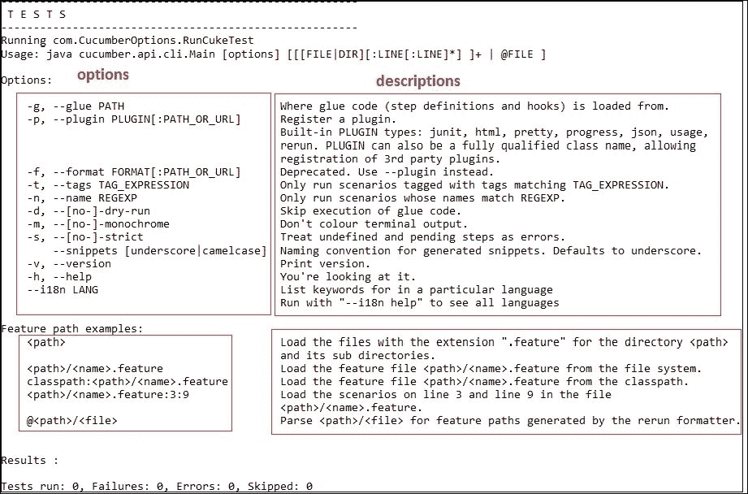

## 如何工作…

`mvn test` 使用 Cucumber 的 JUnit 运行器运行 Cucumber 特性。`RunCukesTest` 类上的 `@RunWith` (`Cucumber.class`) 注解告诉 JUnit 启动 Cucumber。Cucumber 运行时解析命令行选项以确定要运行哪个特性、粘合代码的位置、要使用的插件等。当你使用 JUnit 运行器时，这些选项是从你的测试上的 `@CucumberOptions` 注解生成的。

# 从终端覆盖选项

当需要覆盖 JUnit 运行器中提到的选项时，我们需要从终端使用 `Dcucumber.options`。让我们看看一些实际例子。

## 如何操作…

1.  如果我们想通过指定文件系统路径来运行场景，请运行以下命令并查看输出：

    ```java
    mvn test -Dcucumber.options="src/test/java/com/features/sample.feature:5"

    ```

    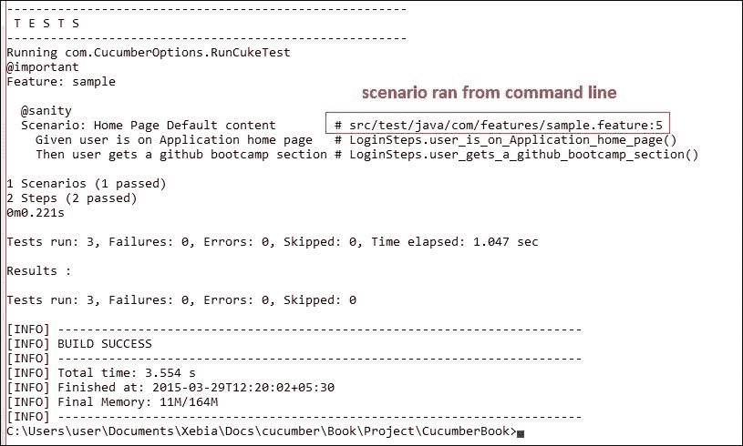

    在前面的代码中，"`5`" 是特性文件中场景开始的行号。

1.  如果我们想通过标签运行测试用例，那么我们运行以下命令并注意输出：

    ```java
    mvn test -Dcucumber.options="--tags @sanity"

    ```

    以下是指令的输出：

    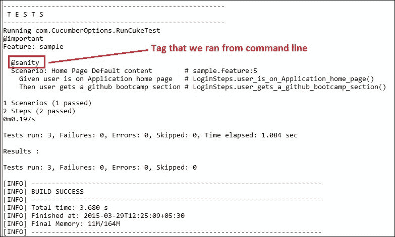

1.  如果我们想要生成不同的报告，可以使用以下命令，并查看在指定位置生成的 JUnit 报告：

    ```java
    mvn test -Dcucumber.options="--plugin junit:target/cucumber-junit-report.xml"

    ```

    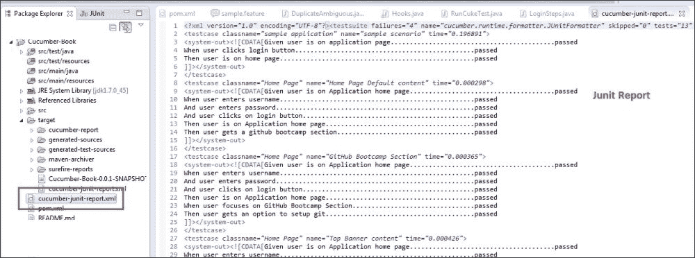

## 工作原理…

当您使用 `-Dcucumber.options` 覆盖选项时，您将完全覆盖在您的 `@CucumberOptions` 中硬编码的任何选项。此规则有一个例外，那就是 `--plugin` 选项。它不会覆盖，而是会添加一个插件。

# 将 Cucumber 与 Jenkins 和 GitHub 集成

要远程调度测试用例执行，我们将我们的测试框架与 Jenkins 集成。Jenkins 作为开源、免费、易于使用，可以按计划时间运行或触发事件后的构建等，具有许多优点。因此，我们的 Cucumber 测试用例也应在 Jenkins 上运行变得非常重要。我们将在下一章中详细探讨这一点。

## 准备工作

1.  在本地机器上安装和运行 Jenkins 不在本书的讨论范围内。我假设您已经有一个本地或远程 Jenkins 设置就绪，并且可以通过 URL 访问 Jenkins。如果您需要有关设置的任何帮助，请遵循博客中提到的步骤 [`wiki.jenkins-ci.org/display/JENKINS/Installing+Jenkins`](https://wiki.jenkins-ci.org/display/JENKINS/Installing+Jenkins)。

1.  我们还需要将我们的项目上传到 GitHub。再次提醒，将项目提交到 GitHub 不在本书的讨论范围内，但如果您需要任何帮助，可以参考 [`help.github.com/articles/set-up-git/`](https://help.github.com/articles/set-up-git/) 中提到的说明。

1.  GitHub 项目 URL 是 [`github.com/ShankarGarg/CucumberBook.git`](https://github.com/ShankarGarg/CucumberBook.git)，可以用来下载我们至今一直在使用的项目。

## 如何操作…

1.  在任何浏览器中通过 URL `http://localhost:8080/jenkins/` 打开 Jenkins（如果您本地没有运行 Jenkins，请将 localhost 替换为机器的 IP 地址）。

1.  前往 Jenkins 仪表板，点击 **新建项目**：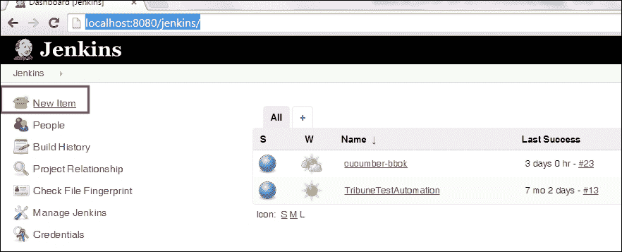

1.  输入我们想要创建的作业的名称，并选择 **构建 Maven 项目** 选项。点击 **确定**。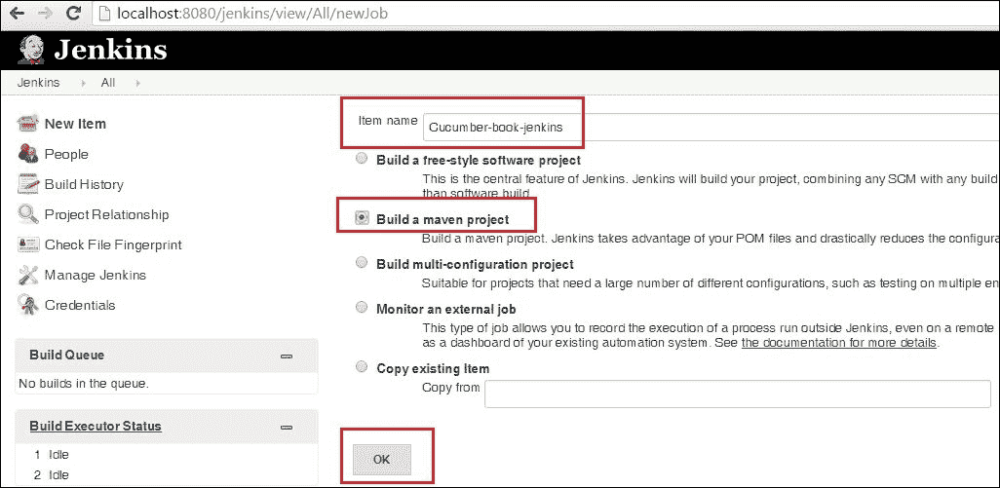

1.  现在，输入项目的 **描述**：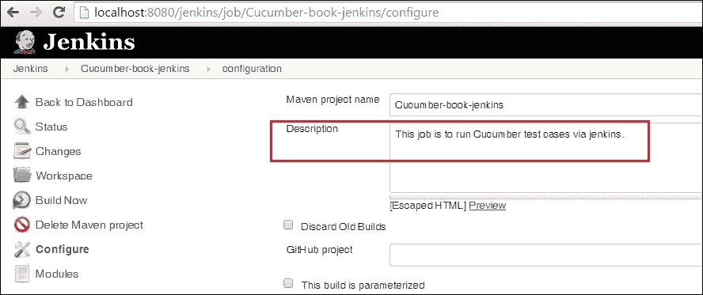

1.  然后，通过在 **源代码管理** 中选择 **Git** 选项并输入 **仓库 URL** [`github.com/ShankarGarg/CucumberBook.git`](https://github.com/ShankarGarg/CucumberBook.git) 和 **凭据** 来输入 Git 详细信息。保持本节中的其他选项为默认设置。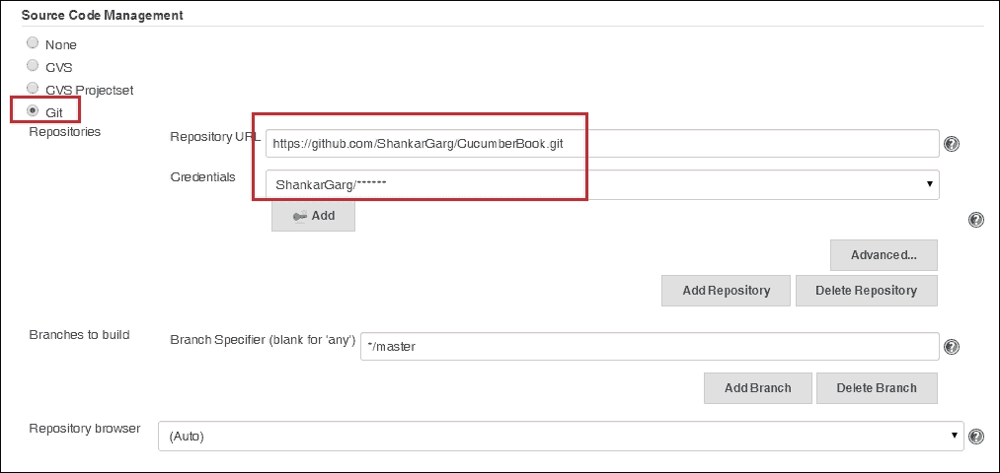

1.  现在，我们来到 **构建** 部分。由于我们选择了 Maven 项目，`Root POM` 会自动显示。我们需要指定我们想要运行的 goal，在我们的例子中是 `test`：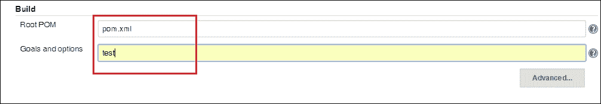

1.  保持所有其他选项为默认设置，并点击 **保存**。

1.  现在，点击**立即构建**来运行项目。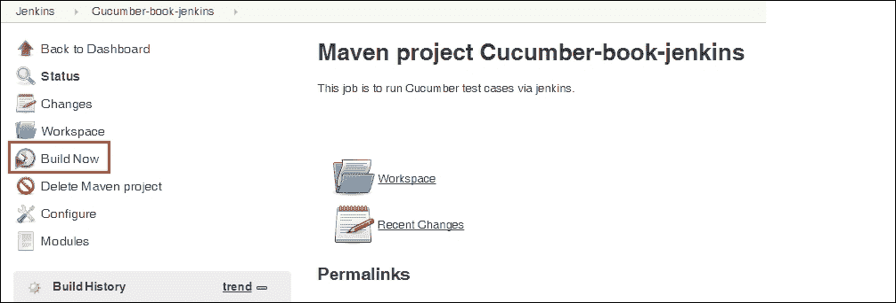

1.  一旦你点击**立即构建**，就会立即触发构建。你可以看到构建号和时间戳。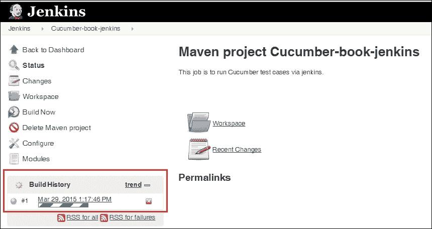

1.  点击构建上的时间戳。然后点击**控制台输出**。只是验证输出以确保测试用例是否已运行：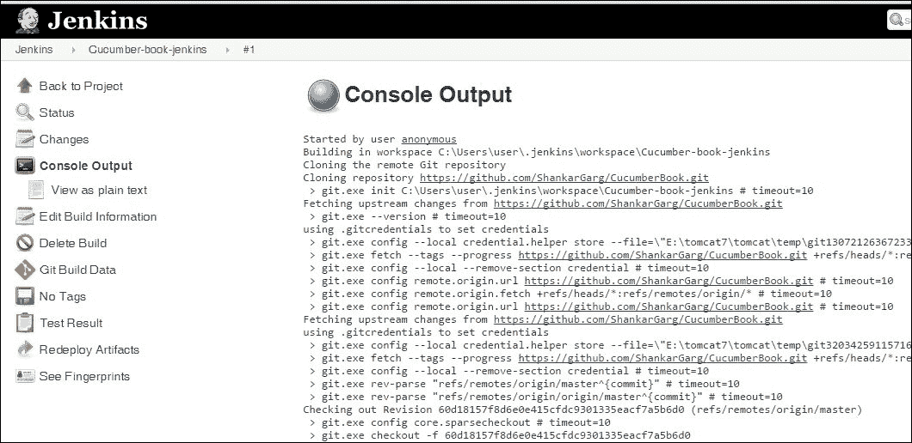

## 它是如何工作的...

由于我们已经将 Maven 与 Cucumber 集成，Jenkins 的集成基本上就是使用 Jenkins 运行 Maven 项目。Jenkins 默认自带 Maven 插件（当我们选择项目类型为**构建 Maven 项目**时，大多数设置都在那时处理好了）构建部分预先填充了`pom.xml`，我们只需提及目标为测试。

Jenkins 也预先安装了 GitHub 插件，我们只需提及 GitHub URL 和凭证。因此，每次构建项目时，Jenkins 都会从 GitHub 获取最新代码，然后运行测试用例。

# 并行运行 Cucumber 测试用例

并行运行测试用例是良好自动化框架的一个非常常见且必需的实践。默认情况下，Cucumber 没有这样的选项或设置。然而，由于 Cucumber 可以与 Maven 和 JUnit 集成，使用这两个工具，我们可以并行运行 Cucumber 情景。

在这个菜谱中，我们将并行运行两个情景，对于网络自动化，这意味着同时打开两个浏览器。那么我们如何实现这一点呢？让我们在下一节中了解。

## 如何做到这一点...

1.  我们创建了一个包含两个情景的特征文件。我们的目标是并行运行这两个情景。这只是为了演示目的，你可以为*n*个情景实现相同的方法。

    这两个情景都将与两个不同的标签相关联，以便可以使用这些标签运行。关注以下代码中高亮显示的标签；我们的特征文件应该看起来像这样：

    ```java
    Feature: sample

      @sanity
      Scenario: Home Page Default content
        Given user is on Application home page
        Then user gets a GitHub bootcamp section

      @regression
      Scenario: GitHub Bootcamp Section
        Given user is on Application home page
        When user focuses on GitHub Bootcamp Section
        Then user gets an option to setup git
    ```

1.  现在，我们也应该为这个特征文件准备好步骤定义。为了专注于这个菜谱的主要目标，我将代码保持在步骤定义中的占位符。以下是我们步骤定义的样子：

    ```java
    @Given("^user is on Application home page$")
      public void user_is_on_Application_home_page()  {

        System.out.println("application home");
      }

    @Then("^user gets a GitHub bootcamp section$")
      public void user_gets_a_ GitHub_bootcamp_section()  {

        System.out.println("bootcamp section");
      }

    @When("^user focuses on GitHub Bootcamp Section$")
      public void user_focuses_on_GitHub_Bootcamp_Section()  {

        System.out.println("focus on GitHub");

      }

    @Then("^user gets an option to setup git$")
      public void user_gets_an_option_to_setup_git()  {

        System.out.println("git section");
      }
    ```

1.  下一步是编写运行者，以确保测试用例并行运行。在这个方向上的第一步是有一个`RunCukeTest.java`类，它将专门运行与`@sanity`标签关联的情景。`RunCukeTest`的代码如下：

    ```java
    package com.CucumberOptions;

    import org.junit.runner.RunWith;

    import cucumber.api.CucumberOptions;
    import cucumber.api.junit.Cucumber;

    @RunWith(Cucumber.class)
    @CucumberOptions(
        features = "src/test/java/com/features",
        glue = "com.StepDefinitions",
        tags = { "@sanity" },
        dryRun = false,
        strict = true,
        monochrome = true,
        plugin = { "pretty",
          "html:target/cucumber_sanity.html"
          }
        )
    public class RunCukeTest {
    }
    ```

1.  现在，我们需要再写一个运行标记为`@regression`的情景的运行者。关注以下代码中高亮的部分；`RunCukeParallelTest.java`的代码将如下所示：

    ```java
    package com.CucumberOptions;

    import org.junit.runner.RunWith;

    import cucumber.api.CucumberOptions;
    import cucumber.api.junit.Cucumber;

    @RunWith(Cucumber.class)
    @CucumberOptions(
        features = "src/test/java/com/features",
        glue = "com.StepDefinitions",
        tags = { "@regression" },
        dryRun = false,
        strict = true,
        monochrome=true,
        plugin = { "pretty",
          "html:target/cucumber_regression.html"
        }
        )
    public class RunCukeParallelTest {
    }
    ```

1.  最后一步是确保这两个 Runner 类并行运行。我们将通过修改`pom.xml`文件来实现这一点。我们将添加 Maven Surefire 插件的配置，这将使 Runner 类并行运行。以下是我们要添加到现有`pom.xml`文件中的内容：

    ```java
    <build>
      <plugins>
        <plugin>
          <groupId>org.apache.maven.plugins</groupId>
          <artifactId>maven-compiler-plugin</artifactId>
          <version>2.5.1</version>
          <configuration>
            <encoding>UTF-8</encoding>
            <source>1.7</source>
            <target>1.7</target>
          </configuration>
        </plugin>
        <plugin>
        <groupId>org.apache.maven.plugins</groupId>
        <artifactId>maven-surefire-plugin</artifactId>
        <version>2.14</version>
        <configuration>
          <skip>true</skip>
        </configuration>
          <executions>
            <execution>
            <id>acceptance-test</id>
            <phase>integration-test</phase>
            <goals>
              <goal>test</goal>
            </goals>
            <configuration>
              <skip>false</skip>
              <forkCount>2</forkCount>
              <reuseForks>false</reuseForks>
              <argLine>-Duser.language=en</argLine>
              <argLine>-Xmx1024m</argLine>
              <argLine>-XX:MaxPermSize=256m</argLine>
              <argLine>-Dfile.encoding=UTF-8</argLine>
              <useFile>false</useFile>
              <includes>
                <include>**/*Test.class</include>
              </includes>
              <testFailureIgnore>true</testFailureIgnore>
            </configuration>
            </execution>
          </executions>
        </plugin>
      </plugins>
    </build>
    ```

1.  我们还将添加 Selenium 的依赖项，以便我们可以编写调用 Selenium Webdriver 实例的代码。这段代码如下：

    ```java
    <!-- Selenium -->
    <dependency>
      <groupId>org.seleniumhq.selenium</groupId>
      <artifactId>selenium-firefox-driver</artifactId>
      <version>${selenium.version}</version>
    </dependency>
    <dependency>
      <groupId>org.seleniumhq.selenium</groupId>
      <artifactId>selenium-support</artifactId>
      <version>${selenium.version}</version>     
    </dependency>
    ```

1.  我们将创建一个名为`DriverFactory.java`的另一个类，用于添加 Selenium 代码，它将有一个调用 Firefox 浏览器的函数。这个类看起来是这样的：

    ```java
    package com.cucumber.automation.utils;

    import java.net.MalformedURLException;
    import java.util.concurrent.TimeUnit;

    import org.openqa.selenium.WebDriver;
    import org.openqa.selenium.firefox.FirefoxDriver;
    import org.openqa.selenium.support.ui.WebDriverWait;

    public class DriverFactory {

      public static WebDriver driver = null;
      public static WebDriverWait waitVar = null;

      public static String baseURL = "https://github.com/";

      /**
      *  This function is to invoke Selenium Webdriver
      * 
      * @throws MalformedURLException
      * @throws InterruptedException
      */
      public void createDriver() throws MalformedURLException, InterruptedException {

        driver = new FirefoxDriver();

        driver.manage().window().maximize();
        driver.manage().timeouts().implicitlyWait(15, TimeUnit.SECONDS);

        driver.get(baseURL);

        waitVar = new WebDriverWait(driver, 15);
      }

      /**
      * This function is to close driver instance
      */
      public void teardown() {
        driver.quit();
      }
    }
    ```

1.  我们将更新`hooks.java`文件，添加`createDriver()`函数，以便在每个 Scenario 之前调用 Firefox。代码将如下所示：

    ```java
    @Before
    public void taggedHookMethod1() throws InterruptedException 
    {
      System.out.println("inside hook");
      DriverFactory.createDriver();
    }
    ```

1.  打开终端，使用`cd`命令进入项目根目录。要调用我们放在`pom.xml`文件中的 Maven 配置，请运行以下命令：

    ```java
    mvn integration-test

    ```

    这是前面命令的输出：

    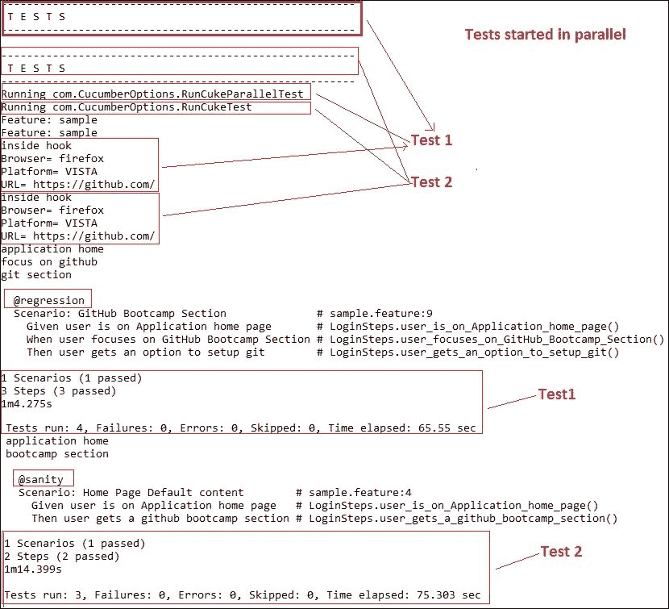

## 它是如何工作的…

Maven surefire 插件将根据配置标签中的`forkcount`标签值运行配置标签中提到的`include`标签中的类。所以所有以`Test`结尾的 Java 类（即我们的`RunCukeTest`和`RunCukeParallelTest` JUnit Runner 类）将在不同的线程中并行执行。由于这两个类是 JUnit Runner 类，它们将调用带有`@sanity`标签的 Scenarios 的执行，并在不同的线程上执行带有`@regression`标签的 Scenarios。
