# 第一部分. 模块 1

> **面向 Java 开发者的 Clojure**
> 
> *平滑地从 Java 过渡到最广泛使用的基于 JVM 的函数式语言 – Clojure*

# 第一章. Clojure 入门

欢迎来到 Clojure 的世界！如果你在这里，你可能对 Lisp 或 Clojure 有点了解，但你并不真正了解这个世界的运作方式。

我们将通过将每个功能与您从 Java 已知的内容进行比较来了解 Clojure。你会发现有列表、映射和集合，就像在 Java 中一样，但它们是不可变的。要处理这些类型的集合，你需要不同的方法；不同的范式。

这就是我们在这本书中试图达成的目标，给你提供一种不同的方法来解决问题。我们希望你在日常生活中使用 Clojure，但如果你不这样做，我们希望你在解决问题的方法上采用一种新的方式。

在本章中，我们将涵盖以下主题：

+   了解 Clojure

+   安装 Leiningen

+   使用 **读取-评估-打印循环** (**REPL**)

+   安装和使用 Cursive Clojure

+   Clojure 的简单语法

+   Clojure 的数据类型及其与 JVM 数据类型的关系

+   函数的特殊语法

# 了解 Clojure

在开始学习 Clojure 之前，你应该了解一些它的特性和它与 Java 共同之处。

Clojure 是一种从 Lisp 继承了许多特性的编程语言。你可能会把 Lisp 视为那种充满括号的奇怪编程语言。你需要记住的是，Clojure 选择拥抱函数式编程。这使得它与当前的主流编程语言非常不同。你将了解不可变数据结构以及如何编写不改变变量值的程序。

你还会发现 Clojure 是一种动态编程语言，这使得它比使用静态类型语言更容易、更快地编写程序。还有使用 REPL 的概念，这是一个允许你连接到正在运行的环境并动态更改代码的工具。这是一个非常强大的工具。

最后，你会发现你可以将 Clojure 转换为你喜欢的任何东西。你可以创建或使用静态类型系统，并将语言弯曲成你喜欢的样子。一个很好的例子是 `core.typed` 库，它允许你指定类型信息，而无需向编译器添加支持。

# 安装 Leiningen

我们习惯于拥有某些工具来帮助我们构建代码，例如 Ant、Maven 和 Gradle。

在 Clojure 生态系统内，依赖和构建管理的既定标准是 Leiningen（亲切地以短篇小说《莱宁根对抗蚂蚁》命名，我推荐阅读[`en.wikipedia.org/wiki/Leiningen_Versus_the_Ants`](http://en.wikipedia.org/wiki/Leiningen_Versus_the_Ants)）；Leiningen 力求让 Java 开发者感到熟悉，它从 Maven 中汲取了最佳想法，如：约定优于配置。它还从 Ant 中汲取了灵感，如自定义脚本和插件。

安装它非常简单，让我们看看如何在 Mac OS X 上使用 bash 作为默认 shell 进行安装（在 Linux 上的安装应该相同）。

你也应该已经安装并配置了 Java 7 或 8 在你的路径中。

你可以在 Leiningen 项目的页面上查看详细的说明[`leiningen.org/`](http://leiningen.org/)。如果你想将 Leiningen 安装起来并运行，你需要做以下事情：

```java
curl -O https://raw.githubusercontent.com/technomancy/leiningen/stable/bin/lein
# The next step just set up the lein script in your path, you can do it any way you wish
mv lein ~/bin
echo "export PATH=$PATH:~/bin/">> ~/.bashrc
source ~/.bashrc
# Everything should be running now, let's test it
lein help

```

第一次运行`lein`命令时，它会从互联网下载所有需要的文件。这使得分发你的代码变得非常容易，你甚至可以将`lein`脚本包含在你的项目中，使其他开发者更容易上手，唯一真正的要求是 JDK。

# 使用 REPL

Clojure（以及 Lisp）的主要优势之一是交互式开发，REPL 是交互式编程可以实现的基石，它允许你连接到一个正在运行的运行 Clojure 的 VM，并实时执行或修改代码。

有一个关于 NASA 如何能够在 100 亿美元硬件上调试和纠正一个 100 亿英里外的错误的故事（[`www.flownet.com/gat/jpl-lisp.html`](http://www.flownet.com/gat/jpl-lisp.html)）。

我们在 Clojure 和 Leiningen 中也有同样的能力，调用它非常简单，你只需要一个命令：

```java
lein repl

```

运行前面的命令后，你会得到以下结果：

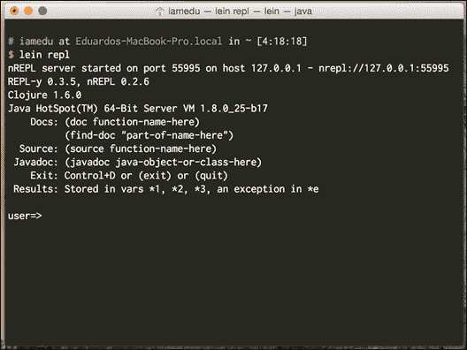

让我们更详细地了解一下，正如我们所见，我们正在运行以下程序：

+   Java 8

+   Clojure 1.6.0

我们还可以获得一些关于如何查看文档、`source`、`Javadoc`和之前错误的良好建议。

## nREPL 协议

有一个特别需要注意的事情是 nREPL 协议；有一天它可能会赋予我们进入运行在 100 亿英里外的机器的能力。

当你启动你的 REPL 时，你看到的第一件事是：

```java
nREPL server started on port 55995 on host 127.0.0.1 - nrepl://127.0.0.1:55995
REPL-y 0.3.5, nREPL 0.2.6

```

它所表达的意思是有一个 Clojure 进程在端口`55995`上运行 nREPL 服务器。我们通过一个非常简单的客户端连接到它，这个客户端允许我们与 Clojure 进程进行交互。

真正有趣的部分是你可以像连接本地主机一样轻松地连接到远程主机；让我们尝试通过简单地输入以下命令将 REPL 附加到同一个进程：

```java
lein repl :connect localhost:55995

```

大多数 IDE 都与 Clojure 有很好的集成，其中大多数都使用这个确切的机制，作为稍微智能一点的客户端。

## Hello world

现在我们已经进入了 REPL 内部，（任意一个），让我们尝试编写我们的第一个表达式，继续并输入：

```java
"Hello world"
```

你应该从 REPL 得到一个返回值，显示`Hello world`，这实际上不是一个程序，而是 REPL 打印阶段的`Hello world`值。

现在我们尝试编写我们的第一个 Lisp 形式：

```java
(println "Hello world")
```

这个第一个表达式看起来与我们习惯的不同，它被称为 S 表达式，这是 Lisp 的标准方式。

在 S 表达式中，有几个需要注意的事项：

+   它们是列表（因此得名，Lisp）

+   列表中的第一个元素是我们想要执行的操作，其余的是该操作的参数（一个、两个、三个）。

因此，我们要求打印字符串`Hello world`，但如果我们仔细观察输出，如以下截图所示，有一个我们未预期的`nil`：

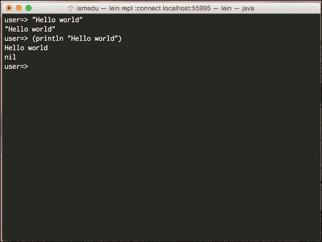

原因是`println`函数在打印`Hello world`后返回值`nil`（Clojure 的 null 等价物）。

### 注意

在 Clojure 中，一切都有值，REPL 会始终为你打印它。

## REPL 实用工具和约定

正如我们所见，Leiningen nREPL 客户端打印帮助文本；但它是如何工作的？让我们探索一些其他实用工具。

尝试使用以下表格中的每个来了解它们的功能：

| 函数 | 描述 | 示例 |
| --- | --- | --- |
| `doc` | 打印函数的`docstring` | (`doc println`) |
| `source` | 打印函数的源代码，它必须用 Clojure 编写 | (`source println`) |
| `javadoc` | 在浏览器中打开类的`javadoc` | (`javadoc java.lang.Integer`) |

让我们看看这些函数是如何工作的：

```java
user=> (javadoc java.util.List)
;; Should open the javadoc for java.util.List

user=> (doc doc)
-------------------------
clojure.repl/doc
([name])
Macro
  Prints documentation for a var or special form given its name
nil

user=> (source doc)
(defmacro doc
"Prints documentation for a var or special form given its name"
  {:added "1.0"}
  [name]
  (if-let [special-name ('{& fn catch try finally try} name)]
    (#'print-doc (#'special-doc special-name))
    (cond
      (special-doc-map name) `(#'print-doc (#'special-doc '~name))
      (find-ns name) `(#'print-doc (#'namespace-doc (find-ns '~name)))
      (resolve name) `(#'print-doc (meta (var ~name))))))
nil
```

你在这里看到的是与`doc`函数相关的元数据；Clojure 具有存储每个函数或`var`使用的元数据的能力。大多数 Clojure 核心函数都包括文档字符串和函数的源代码，这在你的日常工作中将非常有用。

除了这些函数外，我们还可以轻松访问 REPL 中最近三个值和最近发生的异常，让我们来看看：

```java
user=> 2
2
user=> 3
3
user=> 4
4
user=> (* *1 *2 *3) ;; We are multiplying over here the last three values
24 ;;We get 24!
user=> (/ 1 0) ;; Let's try dividing by zero
ArithmeticException Divide by zero clojure.lang.Numbers.divide (Numbers.java:156)
user=> *e
#<ArithmeticException java.lang.ArithmeticException: Divide by zero>

user=> (.getMessage *e)
"Divide by zero"
```

### 注意

`*e`让你访问实际的 Java 异常对象，因此你可以在运行时分析和内省它。

你可以想象使用这种方式执行和内省代码的可能性，但我们的工具呢？我们如何使用它与集成开发环境（IDE）结合使用？

让我们看看如何创建一个新的 Clojure 项目，我们将使用命令行中的 Leiningen 来理解发生了什么。

# 创建新项目

Leiningen 可以帮助我们使用模板创建新项目，有各种各样的模板可供选择，你可以在 Maven 中构建和分发自己的模板。

最常见的模板类型包括：

+   创建`jar`库（默认模板）

+   创建命令行应用程序

+   创建 Clojure 网络应用程序

让我们创建一个新的 Clojure 命令行应用程序并运行它：

```java
lein new app getting-started
cd getting-started
lein run
# Hello, world!

```

## 项目结构

Leiningen 与其他 Java 开发工具类似；它使用类似的约定，并允许在`project.clj`文件中进行大量自定义。

如果你熟悉 Maven 或 Gradle，你可以将其视为`pom.xml`或`build.gradle`。

以下截图显示了项目结构：

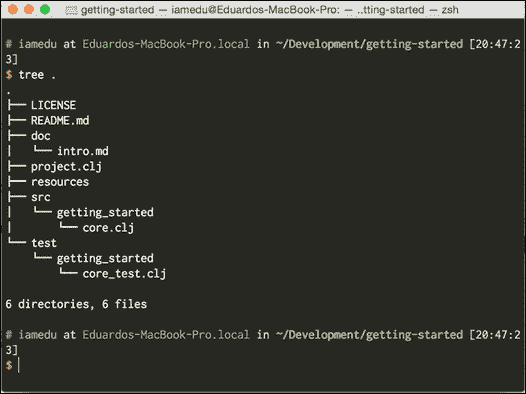

如前一个截图所示，有四个主要文件夹：

+   `resources`: 它包含所有应该在类路径中的内容，例如文件、图像、配置文件、属性文件和其他在运行时需要的资源。

+   `src`: 您的 Clojure 源文件；它们的排序方式与 `classpath` 非常相似。

+   `dev-resources`: 在开发中应该在 `classpath` 中的所有内容（当您运行 Leiningen 时）。您可以在这里覆盖您的“生产”文件，并添加测试运行所需的文件。

+   `test`: 您的测试；这段代码不会被打包，但每次您执行 Leiningen 测试时都会运行。

## 创建独立应用程序

一旦您的项目创建完成，您就可以轻松地构建和运行一个 Java 独立命令行应用程序，现在让我们试试：

```java
lein uberjar
java -jar target/uberjar/getting-started-0.1.0-SNAPSHOT-standalone.jar
# Hello, World!

```

如您所见，创建独立应用程序非常简单，并且与使用 Maven 或 Gradle 非常相似。

# 使用 Cursive Clojure

Java 已经有一些很棒的工具可以帮助我们提高生产力和编写更高质量的代码，我们不应该忘记这些工具。根据您的 IDE，有几个 Clojure 插件。请从以下表格中查看它们：

| IDE | Plugins |
| --- | --- |
| IntelliJ | Cursive Clojure, La Clojure |
| NetBeans | NetBeans Clojure（与 NetBeans 7.4 兼容） |
| Eclipse | CounterClockwise |
| Emacs | Cider |
| VIM | vim-fireplace, vim-leiningen |

许多编写真实 Clojure 代码的人使用 Emacs，我实际上喜欢使用 vim 作为我的主要开发工具，但请放心，本书中我们将主要使用 IntelliJ + Cursive Clojure。

## 安装 Cursive Clojure

您可以在他们的网站上查看 Cursive 的完整文档（[`cursiveclojure.com/`](https://cursiveclojure.com/)），它仍在开发中，但相当稳定，并且在编写 Clojure 代码时非常有帮助。

我们将使用最新的 IntelliJ Community Edition 版本，在撰写本文时是版本 14。

您可以从这里下载 IntelliJ：[`www.jetbrains.com/idea/download/`](https://www.jetbrains.com/idea/download/)。

安装 Cursive Clojure 非常简单，您需要为 IntelliJ 添加一个仓库。您可以在以下位置找到您特定 IntelliJ 版本的说明：[`cursiveclojure.com/userguide/`](https://cursiveclojure.com/userguide/)。

在您安装了 Cursive Clojure 之后，我们就准备出发了。

现在，我们准备将入门项目导入到 Cursive Clojure 中。

### 注意

Cursive Clojure 目前不支持在 IDE 内创建 Leiningen 项目；然而，导入它们的支持非常好。

这是您将如何操作：

1.  点击**文件**。

1.  导入项目。

1.  查找您的项目。

1.  打开文件夹或 `project.clj` 文件。

1.  在 IDE 中遵循**下一步**操作。

现在，我们准备出发了，您可以使用 Cursive Clojure 作为您的主要开发工具。在您的 IDE 中还有更多的事情要做，但我建议您自己查找它们；它们很重要，并且会很有用：

+   了解如何执行项目

+   了解如何执行测试

+   打开一个连接到某个项目的 REPL。

+   执行一些给定代码的关键绑定（在 REPL 中运行光标前的形式）

+   执行给定文件的关键绑定（在 REPL 中加载文件）

Clojure 编程的一个重要部分是它可以在运行时修改和重新评估代码。检查你当前版本 Clojure 的手册，并查看结构编辑部分 ([`cursiveclojure.com/userguide/paredit.html`](https://cursiveclojure.com/userguide/paredit.html))。这是 Clojure IDE 中的最有用功能之一，并且是 Clojure 语法的一个直接后果。

我建议你检查手册中的其他功能。我强烈建议检查 Cursive Clojure 手册，它包括每个功能如何工作的动画。

你会经常使用最后两个键绑定，所以正确设置它们很重要。有关键绑定的更多信息，请参阅 [`cursiveclojure.com/userguide/keybindings.html`](https://cursiveclojure.com/userguide/keybindings.html)。

# 开始使用 Clojure 代码和数据

现在我们深入探讨 Clojure 的语法，它与其他语言非常不同，但实际上要简单得多。Lisps 有一个非常规则的语法，规则很少。正如我们之前所说的，Clojure 代码由 S-表达式组成，而 S-表达式只是列表。让我们看看一些列表的示例，以便熟悉 Lisp 中的列表。

```java
(1 2 3 4)
(println "Hello world")
(one two three)
("one" two three)
```

所有的这些都是列表，但并不是所有的都是有效代码。记住，只有第一个元素是函数的列表才能被认为是有效表达式。所以，这里只有以下可以被认为是有效表达式：

```java
(println "Hello world")
(one two three)
```

如果 `println` 和 `one` 被定义为函数。

让我们看看一段 Clojure 代码，以最终解释一切是如何工作的。

```java
(defn some-function [times parameter]
"Prints a string certain number of times"
  (dotimes [x times]
    (println parameter)))
```

## Clojure 中的列表

Clojure 是基于“形式”或列表的。在 Clojure 中，就像每个 Lisp 一样，表示列表的方式是使用括号，所以这里有一些在上一个代码中的列表示例：

```java
(println parameter)
(dotimes [x times] (println parameter))
(defn some-function [times parameter] (dotimes [x times] (println parameter)))
```

列表是 Clojure 中的一个数据类型，它们也是表达代码的方式；你将在以后了解将代码表达为数据的所有好处。第一个好处是它非常简单，你可以做的任何事都必须以列表的形式表达！让我们看看一些其他可执行代码的示例：

```java
(* 1 2 3)
(+ 5 9 7)
(/ 4 5)
(- 2 3 4)
(map inc [1 2 3 4 5 6])
```

我鼓励你将所有内容都写入 REPL，这样你就能很好地理解正在发生的事情。

## Clojure 中的操作

在 Clojure 中，`MOST` 的可执行形式都有这种结构：

```java
(op parameter-1parameter-2 ….)
```

`op` 是要执行的操作，后面跟着所有需要的参数，让我们用这种新的视角分析我们之前的形式：

```java
(+ 1 2 3)
```

我们要求使用参数 `1`、`2` 和 `3` 执行 `+`（加法）操作。预期结果是 `6`。

让我们分析一些更复杂的东西：

```java
(map inc [1 2 3 4 5 6])
```

在这里，我们要求使用两个参数执行 `clojure.core/map` 函数：

+   `inc` 是一个函数名，它接受一个数字并将其增加

+   `[1 2 3 4 5 6]` 是一个数字集合

Map 将`inc`函数应用于传递的集合的每个成员，并返回一个新的集合，我们期望的是一个包含`[2 3 4 5 6 7]`的集合。

## Clojure 中的函数

现在让我们检查一下函数定义本质上与前面两种形式是如何相同的：

```java
(defn some-function [times parameter]
"Prints a string certain number of times"
  (dotimes [x times]
    (println parameter)))
```

`defn`是我们所请求的操作。它有几个参数，例如：

+   `some-function`是我们正在定义的函数的名称

+   `[times parameter]`是参数的集合

+   `"打印指定次数的字符串"`是文档字符串，它实际上是一个可选参数

+   `(dotimes [x times] (println parameter))`是当调用`some-function`时执行的函数体

`defn`调用一个函数以使其存在。在这段代码执行后，`some-function`存在于当前命名空间中，你可以使用定义的参数来使用它。

`defn`实际上是用 Clojure 编写的，并支持一些不错的东西。现在让我们定义一个`multi-arity`函数：

```java
(defn hello
  ([] (hello "Clojure"))
  ([name] (str "Hello " name)))
```

在这里，我们定义了一个有两个主体的函数，其中一个没有参数，另一个有一个参数。实际上，理解正在发生的事情相当简单。

尝试更改项目中`core.clj`文件的源代码，类似于以下示例：

```java
(ns getting-started.core
  (:gen-class))

(defn hello
  ([] (hello "Clojure"))
  ([name] (str "Hello " name)))

(defn -main
"I don't do a whole lot ... yet."
  [& args]
  (println "Hello, World!")
  (println (hello))
  (println (hello "Edu")))
```

现在运行它，你会得到三个不同的 Hello 输出。

如你所见，Clojure 有一个非常规则的语法，即使对于新手来说有点奇怪，但实际上相当简单。

这里，我们使用了一些尚未适当介绍的数据类型；在下一节中，我们将查看它们。

# Clojure 的数据类型

现在是你所知道的关于 Java 的一切发挥作用的时候了；甚至你之前看到的列表形式也实现了`java.util.List`接口。Clojure 被设计成可嵌入的，并且与宿主平台有很好的集成，因此你可以使用你已知的所有关于 Java 类型和对象的知识是自然而然的事情。

Clojure 中有两种数据类型：标量和集合。

## 标量

在每种语言中，你都需要原始类型；你在日常生活中使用它们，因为它们代表数字、字符串和布尔值。在 Clojure 世界中，这些原始类型被称为标量。

Clojure 有几个非常有趣的数据类型，如比例和关键字。在下面的表中，你可以了解不同的标量类型，它们与 Java 的比较以及如何使用每个类型的简单示例。

| Clojure 数据类型 | Java 数据类型 | 示例 | 描述 |
| --- | --- | --- | --- |
| 字符串 | 字符串 | "This is a string""This is a multiline string" | 字符串；在 Clojure 中，你可以使用多行字符串而不会出现问题 |
| 布尔 | 布尔 | truefalse | 文字布尔值 |
| 字符 | 字符 | `\c``\u0045 ;; Unicode char 45 E` | 字符值，它们是`java.lang.Character`实例，你可以定义 Unicode 字符 |
| 关键字 | Java 中不存在 | `:key``:sample``:some-keyword` | 它们会自我评估，通常用作键。它们也是查找自己在映射中的函数。 |
| 数字 | 数字会自动处理为 `BigDecimal`、`BigInteger` 或根据需要使用较低精度 | `42N ;;大整数``42 ;;long``0.1M ;;BigDecimal` | 记住 Java 数字权衡很重要，如果精度很重要，你应该始终使用大数和 `bigintegers`。 |
| 比率 | Java 中不存在 | `22/7` | Clojure 提供了出色的数值精度；如果需要，它可以保留比率并执行精确操作。使用比率时的权衡是速度。 |
| 符号 | Java 中不存在 | some-name | 符号是 Clojure 中的标识符，与 Java 中的变量名非常相似。 |
| nil | null | nil | 空值 |
| 正则表达式 | `java.util.regex.Pattern` | `#"\d"` | 正则表达式，在 Clojure 中，你可以免费使用语法来定义正则表达式，但最终它是一个普通的 Java 正则表达式模式 |

## 集合数据类型

在 Clojure 中有两种类型的集合：顺序集合和关联集合。顺序集合是可以迭代的，例如列表。关联集合是映射、集合以及可以通过特定索引访问的内容。Clojure 的集合与 Java 完全兼容，甚至可以实现 `java.util` 接口，如 `java.util.List` 和 `java.util.Map`。

Clojure 中集合的一个主要特征是它们是不可变的；它有很多好处，我们稍后会看到。

让我们看看 Clojure 中可用的每种集合数据类型的特征，并借助一个示例（在 Clojure 中）及其描述与 Java 进行比较。

| Clojure 数据类型 | Java 数据类型 | 示例 | 描述 |
| --- | --- | --- | --- |
| `List` | `List` | `(1 2 3 4 5)` | 一个简单的列表，注意列表前的引号字符，如果你没有指定它，Clojure 会尝试将形式评估为指令 |
| `Vector` | `Array` | `[1 2 3 4 5]` | 它是 Clojure 中的主要工作马，它类似于数组，因为你可以以随机顺序访问元素 |
| `Set` | `HashSet` | `#{1 2 3 4}` | 一个普通的 Java 哈希集 |
| `Map` | `HashMap` | `{:key 5 :key-2 "red"}` | Clojure 的映射 |

# 摘要

如您所见，Clojure 拥有一个成熟且不断发展的开发环境。您可以以与在正常 Java 开发中相似的方式设置命令行工具和您的 IDE。

我们还了解了一些关于 Clojure 的常规语法、其数据类型以及它们与 Java 自身数据类型之间关系的内容。

总体来说，你现在应该对以下内容感到舒适：

+   Lisp 语法

+   从头创建 Leiningen 项目

+   运行和打包您的代码

+   将 Leiningen 项目导入 IntelliJ

+   使用 REPL

+   了解 Clojure 类型与 Java 类型之间的关系

在下一章中，我们将了解如何组织我们的代码以及这种组织如何利用 Java 包的优势。

# 第二章：命名空间、包和测试

现在我们已经安装了 Clojure 和 IntelliJ。

作为一名 Java 开发者，您习惯于以类作为组织的最小单元进行工作。Clojure 有着非常不同的感觉，并为您提供不同的工具来组织您的代码。

首先，您应该记住，代码和数据是分开的；您没有一个具有属性和在这些属性上工作的函数的最小单元。您的函数可以作用于您希望使用的任何数据结构，只要您遵循函数的工作规则。

在本章中，我们将开始编写一些简单的函数来展示函数和数据分离的工作方式，并查看 Clojure 为我们提供的工具来实现这种分离。

在本章中，我们将涵盖以下主题：

+   与类路径和 Java 包相比，命名空间是如何工作的

+   单元测试

+   更多 Clojure 示例和语法

# Clojure 中的命名空间

Clojure 命名空间可能对您来说很熟悉，作为一名 Java 开发者，这有一个非常好的原因，它们与 Java 的包和类路径有着非常深的关系。

首先，让我们回顾一下我们从 Java 中学到的知识。

## Clojure 中的包

Java 代码是按包组织的，Java 中的一个包是一个命名空间，它允许您将一组类似类和接口分组在一起。

您可以将包想象成您电脑中的一个文件夹。

以下是一些在 Java 编程中经常使用的常见包：

+   `java.lang`：Java 的本地内容，包括基本类型（整数、长整型、字节、布尔型、字符、字符串、数字、短整型、浮点型、void 和类），基本线程原语（可运行、线程），异常的基本原语（可抛出、错误、异常），基本异常和错误（`NoSuchMethodError`、`OutOfMemoryError`、`StackOverflowError`等）以及运行时访问类，如 runtime 和 system。

+   `java.io`：这个包包括输入和输出的原语，如控制台、文件、读取器、输入流和写入器。

+   `java.util`：这是除了`java.lang`之外最常用的包之一。它包括经典的数据结构（映射、集合、列表）以及这些数据结构的常见实现。此包还包括属性工具、从各种输入资源读取的扫描仪、`ServiceLoader`从`classloader`加载自定义服务、UUID 生成器、计时器等实用工具。

+   `java.util.logging`：日志实用工具，您通常使用它们来提供不同级别的警报，从调试到严重情况。

+   `java.text`：这些是管理文本、日期和数字的语言无关的实用工具。

+   `javax.servlet`：这包括创建 Web 应用和在标准 Web 容器中部署的原语。

这些包中的每一个都包含几个相关的功能，特别是`java.lang`包尤为重要，因为它包含了所有的 Java 核心类型，如字符串、长整型和整型。`java.lang`包中的所有内容都可以在所有地方自动使用。

`java.lang`包不仅提供了代码组织，还提供了访问安全性。如果你还记得 Java，有三个安全访问级别：

+   私有的

+   公共的

+   受保护的

在包的情况下，我们关注的是受保护的访问级别。同一包中的类允许同一包中的其他类访问其受保护的属性和方法。

在运行时分析包也有方法，但它们很复杂，而且能做的事情非常有限。

包是在 Java 的类路径和类加载器的顶部实现的。

# 类路径和类加载器

Java 被设计成模块化的，为此它需要一种轻松加载你的代码的方法。这个答案就是类加载器，类加载器允许你从类路径的每个条目中读取资源；你可以将类路径资源视为类似于文件系统的一个分层结构。

类加载器只是一个条目列表；每个条目可以是文件系统中的一个目录或一个 JAR 文件。此时，你也应该知道 JAR 文件只是 zip 文件。

类加载器将每个条目视为一个目录（JAR 文件只是压缩的目录），并且它会在每个目录中查找文件。

这里有很多概念需要记住，让我们尝试总结一下：

+   JAR 文件是 ZIP 文件；它们可能包含多个类、属性、文件等。

+   类路径是一个条目列表；每个条目都是一个 JAR 文件或系统目录。

+   类加载器在类路径的每个条目中查找资源，所以你可以将类路径资源视为类路径中所有目录的组合（重复的资源不会被覆盖）

如果你还不熟悉类加载器如何在类路径条目中查找资源，这是一个一般的过程；让我们想象一下，你想要加载一个类：`test.Test`，接下来会发生什么？

1.  你告诉 JVM 你想加载`test.Test`。

1.  JVM 知道要查找`test`/`Test.class`文件。

1.  它开始在类路径的每个条目中查找它。

1.  如果资源是一个 ZIP 文件，它“解压”目录。

1.  它在代表条目的目录中查找资源。

如果你看到默认的类路径资源，你可能会看到一些东西，例如：

```java
java:
    lang:
        String.class
        ….
    io:
        IOException.class
        …
    util:
        List.class
```

重要的是要注意，类路径中的每个条目不仅存储类文件，实际上可以存储任何类型的资源，存储配置文件，如`.properties`或`.xml`是很常见的。

没有任何规定你不能在类路径资源中存储其他东西，比如图片、mp3 甚至代码！你可以像从文件系统运行时一样读取和访问类路径资源中的任何内容。唯一不能做的是修改类路径资源的内 容（至少不是通过一些神秘的魔法）。

## 回到 Clojure 的命名空间

现在我们已经简要回顾了 Java 中包和类路径的工作方式，是时候回到 Clojure 了。你应该明白，Clojure 试图使托管平台透明；这意味着几件非常重要的事情：

+   你可以用 Java 的类路径做的任何事情，你同样可以用 Clojure 来做（你可以读取配置文件、图片等）。

+   命名空间使用类路径的方式与 Java 使用包的方式相同，这使得它们容易理解。尽管如此，不要低估它们，Clojure 的命名空间声明可能更加复杂。

让我们实际操作一下，玩一玩命名空间。

### 玩转命名空间

让我们创建一个新的 Playground，为了创建它，请使用以下命令：

```java
lein new app ns-playground

```

你可以用 IntelliJ 打开这个项目，就像我们在第一章中做的那样，*Clojure 入门*。

让我们详细看看为我们创建的内容：


这个项目结构看起来与 Java 项目类似，我们有：

+   `resources`: 这些是非源文件，它们被添加到类路径中

+   `src`: 我们的源代码

+   `test`: 我们的测试代码

`src` 和 `test` 中的代码已经结构化为命名空间：通过快速查看，我们可以说命名空间的名称是 `ns_playground`。让我们检查源代码：

```java
(ns ns-playground.core
  (:gen-class))

(defn -main
"I don't do a whole lot ... yet."
  [& args]
  (println "Hello, World!"))
;; Code for src/ns_playground/core.clj
```

### 小贴士

`:gen-class` 被添加在这里是为了创建一个 Java 类，并允许 Java 解释器启动静态 main 方法。如果你不打算创建一个独立程序，则不需要它。

我们可以看到，在顶部使用了 (`ns ns-playground.core`) 这种形式，正如你可能猜到的，这就是在 Clojure 中声明命名空间的方式。

如果你足够细心，你会注意到一些奇怪的地方；命名空间有一个破折号，而不是像文件夹那样的下划线。

有一些原因导致了这种情况：

+   Clojure 像大多数 Lisp 变量名一样，可以包含破折号（实际上，这是命名变量的首选风格，与 Java 中的驼峰式命名相反）。

+   Clojure 中的每个命名空间都表示为一个包含多个 Java 类的包。命名空间用作 Java 包的名称，正如你所知，破折号在类或包名称中是不被接受的；因此，每个文件名和文件夹名都必须使用短破折号。

### 小贴士

由于 Lisp 的特性，你可以在变量名中使用破折号（它们将在编译时转换为下划线）。实际上，这是命名变量的推荐方式。在 Clojure 中（以及大多数 Lisp），`some-variable-name` 比 `someVariableName` 更符合习惯用法。

## 创建一个新的命名空间

让我们创建一个新的命名空间；在 Cursive Clojure 中，这样做很容易，只需右键点击`ns_playground`包，然后转到**新建** | **Clojure 命名空间**，它会要求你输入一个名称，我们可以将其命名为`hello`。

这将创建一个包含以下内容的`hello.clj`文件：

```java
(ns ns-playground.hello)
```

如你所见，命名空间创建相当简单；你可以通过两个简单的步骤手动完成：

1.  创建一个新文件；它不必遵循包命名规范，但这有助于保持你的代码顺序，并且是一种事实上的做法。

1.  添加你的命名空间声明。

就这些！虽然命名空间定义可能会变得相当复杂，因为它是你定义你希望导入的 Java 包、命名空间或你打算使用的这些命名空间中的函数的地方。但通常你只会使用这些功能的一个子集。

### 小贴士

请记住，Clojure 中的命名空间通常由一个单独的文件表示。

对于你的初始命名空间，我建议你考虑以下两种能力：

| `:import` | 允许你从你希望使用的包中导入 Java 类 |
| --- | --- |
| `:require` | 允许你引入你希望使用的任何 Clojure 命名空间 |

`require`和`import`的语法都很简单，在我们实际使用它们之前，让我们看看几个例子。

让我们从`import`选项开始：

```java
(:import java.util.List)
```

你会注意到这和你在 Java 中能做的是相似的，我们在这里导入的是`List`接口。

Clojure 的好之处在于它允许你做一些更具体的事情。让我们看看如何一次性导入两个类：

```java
(:import [java.util ArrayList HashMap])
```

你可以将这个扩展到你想要使用的类的数量。

`require`选项使用类似的语法，并在其基础上构建更多。让我们检查从一个命名空间中引入单个函数：

```java
(:require [some.package :refer [a-function another-function]])
```

如你所见，这是熟悉的，有趣的部分在于当你开始导入所有内容时：

```java
(:require [some.package :refer [:all]])
```

你也可以为你的包内的所有内容使用自定义名称：

```java
(:require [some.package :as s])

;; And then use everything in the package like this:

(s/a-function 5)
```

或者，你甚至可以组合不同的关键字：

```java
(:require [some.package :as s :refer [a-function]])
```

让我们尝试一下我们刚刚学到的东西，使用以下代码：

```java
(ns ns-playground.hello
  (:import [java.util Date]))

(def addition +)

(defn current-date []
"Returns the current date"
  (new Date))

(defn <3 [love & loved-ones]
"Creates a sequence of all the {loved-ones} {loved} loves"
  (for [loved-one loved-ones]
    (str love " love " loved-one)))

(defn sum-something [something & nums]
"Adds something to all the remaining parameters"
  (apply addition something nums))

(def sum-one (partial sum-something 1))
```

### 注意

你必须已经注意到了`<3`和`sum-something`函数的参数中的`&`运算符；这允许这些函数接收任意数量的参数，我们可以像这样调用它们：（`sum-something 1 2 3 4 5 6 7 8`）或（`sum-something`）。它们被称为**可变参数**函数。在 Java 中，你会把这个特性称为**varargs**。

一切看起来都很不错，但我们还没有看到如何从其他包中引入和使用这些函数。让我们写一个测试来看看这是如何完成的。

## 在 REPL 上使用命名空间

通过使用 REPL 来玩转命名空间是一个很好的方法，我们也会从中获得更好地了解它的好处。

由于我们将要玩转命名空间，我们需要了解一些函数，这些函数将帮助我们在不同命名空间之间移动并引入其他命名空间。函数如下所示：

| 函数 | 描述 | 示例用法 |
| --- | --- | --- |
| `in-ns` | 将`*ns*`设置为名为符号的命名空间，如果需要则创建它。 | (`in-ns 'ns-playground.core`) |
| `require` | 加载`libs`，跳过任何已加载的。 | (`require '[clojure.java.io :as io]`) |
| `import` | 对于`class-name-symbols`中的每个名称，将名称到由`package.name`命名的类的映射添加到当前命名空间。 | (`import java.util.Date`) |
| `refer` | 指向`ns`的所有公共`vars`，受过滤器约束。 | (`refer 'clojure.string :only '[capitalize trim]`) |

让我们进入我们的 IntelliJ 的 REPL 窗口。我们可以使用`*ns*`指令检查我们所在的命名空间。现在让我们试试：

```java
*ns*
=> #<Namespace ns-playground.core>
```

假设我们需要在`ns-playground.hello`命名空间内执行代码并测试代码，我们可以使用`in-ns`函数来完成：

```java
(in-ns 'ns-playground.hello)
=> #<Namespace ns-playground.hello>
```

我们想知道`str`做了什么，它似乎接收了三个字符串：

```java
(str "Hello""""world")
=>"Hello world"
```

现在我们尝试一下`for`形式：

```java
(for [el ["element1""element2""element3"]] el)
=> ("element1""element2""element3")

(for [el ["element1""element2""element3"]]
  (str "Hello " el))
=> ("Hello element1""Hello element2""Hello element3")
```

`for`宏接受一个项目集合，并返回一个新的惰性序列，将`for`的主体应用于每个元素。

了解这一点后，理解`<3`函数很容易，让我们试试：

```java
(<3 "They""tea")
=> ("They love tea")

(clojure.repl/doc <3)
ns-playground.hello/<3
([& loved-ones])
  Creates a sequence of all the {loved-ones} {loved} loves
```

我们已经使用 REPL 测试了一些简单的函数，但现在让我们尝试测试其他一些东西，比如从类路径中读取属性文件。

我们可以在资源文件夹中添加一个`test.properties`文件，内容如下：

```java
user=user
test=password
sample=5
```

记住要重启 REPL，因为类路径中某些部分内容的变化对正在运行的 REPL 是不可见的。

让我们尝试以输入流的形式读取我们的属性文件，我们可以使用`clojure.java.io`命名空间来完成它，并且我们可以像下面这样进行检查：

```java
(require '[clojure.java.io :as io])
(io/resource "test.properties")
=> #<URL file:/Users/iamedu/Clojure4Java/ns-playground/resources/test.properties>
(io/input-stream (io/resource "test.properties"))
=> #<BufferedInputStream java.io.BufferedInputStream@2f584e71>
;; Let's now load it into a properties object
(import [java.util Properties])
=> java.util.Properties
(def props (Properties.)) ;; Don't worry about the weird syntax, we will look it soon.
=> #'ns-playground.core/props
(.load props (io/input-stream (io/resource "test.properties")))
props
=> {"user""user", "sample""5", "test""password"}
```

我们现在可以定义我们的读取属性函数，我们可以将其输入到 REPL 中：

```java
(defn read-properties [path]
  (let [resource (io/resource path)
        is (io/input-stream resource)
        props (Properties.)]
    (.load props is)
    (.close is)
    props))
=> #'ns-playground.core/read-properties
(read-properties "test.properties")
=> {"user""user", "sample""5", "test""password"}
```

### 注意

`let`形式允许我们创建局部'变量'，而不是直接在代码中使用(`io/resource path`)。我们可以创建一个引用一次并在代码中使用它。它允许我们使用更简单的代码，并且对对象有一个单一的引用。

最后，我们可以重新定义`hello`命名空间以包含我们检查的所有内容，例如：

```java
(ns ns-playground.hello
  (:require [clojure.java.io :as io])
  (:import [java.util Date Properties]))

(def addition +)

(defn current-date []
"Returns the current date"
  (new Date))

(defn <3 [love & loved-ones]
"Creates a sequence of all the {loved-ones} {loved} loves"
  (for [loved-one loved-ones]
    (str love " love " loved-one)))

(defn sum-something [something & nums]
"Adds something to all the remaining parameters"
  (apply addition something nums))

(defn read-properties [path]
  (let [resource (io/resource path)
        is (io/input-stream resource)
        props (Properties.)]
    (.load props is)
    props))

(def sum-one (partial sum-something 1))
```

记住要在`import`中包含`Properties`类，并为`clojure.java.io`定义`:require`关键字。

# Clojure 中的测试

Clojure 已经内置了单元测试支持，实际上 Leiningen 已经为我们创建了一个测试；让我们现在看看它。

打开`test/ns_playground/core_test.clj`文件，你应该能看到以下代码：

```java
(ns ns-playground.core-test
  (:require [clojure.test :refer :all]
            [ns-playground.core :refer :all]))
(deftest a-test
  (testing "FIXME, I fail."
(is (= 0 1))))
```

再次，正如你所看到的，我们正在使用`:require`来包含`clojure.test`和`ns-playground.core`包中的函数。

### 注意

记住，`:refer :all`的工作方式与 Java 中的`char import static clojure.test.*`类似。

## 命令行测试

让我们首先学习如何运行这些测试。从命令行，你可以运行：

```java
lein test

```

你应该得到以下输出：

```java
lein test ns-playground.core-test

lein test :only ns-playground.core-test/a-test

FAIL in (a-test) (core_test.clj:7)
FIXME, I fail.
expected: (= 0 1)
  actual: (not (= 0 1))

Ran 1 tests containing 1 assertions.
1 failures, 0 errors.
Tests failed.
```

我们看到有一个测试失败，我们稍后会回到这个问题；现在，让我们看看如何在 IntelliJ 中测试。

## IntelliJ 中的测试

首先，我们需要一个新的 REPL 配置。您可以像在上一章中学到的那样做。您只需要遵循以下步骤：

1.  右键单击 `project.clj` 文件并选择 **为 ns-playground 创建 REPL**，如图所示：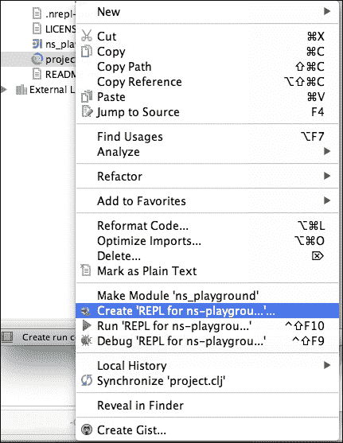

1.  然后在下一个对话框中点击 **确定**。

1.  之后，您应该通过右键单击 `project.clj` 文件并选择 **为 ns-playground 运行 REPL** 来再次运行 REPL。

1.  之后，您可以运行任何测试，只需打开您的测试文件，然后在 REPL 中的当前 NS 中选择 **工具** | **运行测试**。您应该会看到以下截图类似的内容：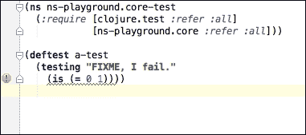

1.  如您所见，它表示您的测试目前正在失败。让我们修复它并再次运行我们的测试。将 `(is (= 0 1))` 行更改为 `(is (= 1 1))`。

1.  现在，让我们尝试对我们之前定义的函数进行一些实际的测试；如果您现在不能理解所有代码，请不要担心，您不需要这样做：

    ```java
    (ns ns-playground.hello-test
      (:import [java.util Date])
      (:require [clojure.test :refer :all]
                [ns-playground.hello :as hello :refer [<3]]
                [ns-playground.core :refer :all]))

    (defn- lazy-contains? [col element]
      (not (empty? (filter #(= element %) col))))

    (deftest a-test
      (testing "DONT FIXME, I don't fail."
        (is (= 42 42))))

    (deftest current-date-is-date
      (testing "Test that the current date is a date"
        (is (instance? Date (hello/current-date)))))

    (deftest check-loving-collection
      (testing "Check that I love clojure and you"
        (let [loving-seq (<3 "I""Clojure""you""doggies""chocolate")]
          (is (not (lazy-contains? loving-seq "I love Vogons")))
          (is (lazy-contains? loving-seq "I love Clojure"))
          (is (lazy-contains? loving-seq "I love doggies"))
          (is (lazy-contains? loving-seq "I love chocolate"))
          (is (lazy-contains? loving-seq "I love you")))))
    ```

### 注意

我们不能在这里使用 Clojure 的内容函数，因为它具有不同的功能。它会在映射中查找键。

运行测试，您会看到所有内容都正确通过，但这里发生了很多事情，让我们一点一点地过一遍：

```java
(ns ns-playground.core-test
  (:import [java.util Date])
  (:require [clojure.test :refer :all]
            [ns-playground.hello :as hello :refer [<3]]
            [ns-playground.core :refer :all]))
```

这是命名空间声明，让我们列出它所做的一切：

+   它声明了 `ns-playground.core-test` 包。

+   它导入了 `java.util.Date` 类。

+   它使得 `clojure.test` 命名空间中的所有内容在当前命名空间中可用，如果我们处于 Java 中，我们可能会使用 `import static clojure.test.*` 来获得类似的效果。我们可以通过使用 `:refer :all` 关键字来实现这一点。

+   它使得 `ns-playground.hello` 命名空间中的所有内容都可以通过 hello 快捷方式访问，但我们需要在 `ns-playground.hello` 中定义的每个函数或值前加上 hello 前缀，并且它还使得 `<3` 函数可以在没有前缀的情况下使用。为了生成别名并使所有内容都可以通过 `hello` 别名访问，我们使用 `:as` 关键字，然后传递一个向量给 `:refer` 以包含某些元素。

+   它使得 `ns-playground.core` 命名空间中的所有内容在当前命名空间中可用。我们通过使用 `:refer :all` 关键字来实现这一点。

    ```java
    (defn- lazy-contains? [col element]
      (not (empty? (filter #(= element %) col))))
    ```

这是名为 `lazy-contains?` 的函数的声明，它是一个 `boolean` 函数，在 Clojure 中通常将其称为谓词。

### 注意

包含问号的函数名称可能对您来说看起来有些不自然。在 Clojure 和 Lisp 中，您可以在函数名称中使用问号，并且对于返回布尔值的函数来说，这样做是常见的。

它接收两个参数：`col` 和 `element`。

函数的实际主体看起来有点复杂，但实际上非常简单。每次您遇到一个看起来与上一节中提到的类似的函数时，请尝试从内向外阅读它。最内层部分如下：

```java
#(= element %)
```

这是编写只有一个参数的匿名函数的简短方式。如果我们想写另一个函数，该函数将其参数与`element`比较，而不使用语法糖，我们可以用以下方法实现：

```java
(fn [e1]
  (= element e1))
```

这是一个匿名函数，换句话说，它是一个没有名字的函数，但它像其他任何函数一样工作；当我们回到函数式编程时，我们将了解更多关于匿名函数的内容。

我们的匿名函数是以下形式的参数：

```java
(filter #(= element %) col)
```

这个新形式过滤了集合`col`，并返回一个只包含通过测试的元素的新集合。让我们看看我们使用了预定义的 Clojure 函数`even?`的例子：

```java
;; This returns only the even numbers in the collection
(filter even? [1 2 3 4])
;;=> (2 4)
```

我们现在的过滤器函数返回集合中通过`#(= element %)`测试的每个元素。因此，我们得到与传递给`lazy-contains?`的元素相等的每个元素。

我们接着询问是否没有任何元素等于`col`中的`element`，其形式如下：

```java
(empty? (filter #(= element %) col))
```

但我们想知道是否有某个元素等于`element`，所以最后我们否定前面的形式：

```java
(not (empty? (filter #(= element %) col)))
```

想象一下，如果你必须用 Java 编写这个（并且我要求将匹配元素的每个元素添加到列表中），你将得到类似的东西：

```java
List<T> filteredElements = new ArrayList<T>();
for(T e1 : col) {
    if(e1 == element) {
        filteredElements.add(e1);
    }
}
return !filteredElements.isEmpty();
```

有一个很大的区别，它更冗长，要理解它我们需要在脑海中“运行”算法。这被称为命令式编程，Clojure 允许我们进行命令式编程以及函数式编程，这是一种声明式编程。当你习惯了，你会发现它比循环更容易推理。

### 注意

交互式编程意味着向计算机描述每一步应该如何执行。声明式编程只是要求一个结果，而不提供如何实现它的细节。

实际测试很简单理解：

```java
(deftest current-date-is-date
  (testing "Test that the current date is a date"
    (is (instance? Date (hello/current-date)))))
```

这个测试检查当前日期返回一个`java.util.Date`实例，`is`形式像 Java 断言指令一样工作：

```java
(deftest check-loving-collection
  (testing "Check that I love clojure and you"
    (let [loving-seq (<3 "I""Clojure""you""doggies""chocolate")]
      (is (not (lazy-contains? loving-seq "I love Vogons")))
      (is (lazy-contains? loving-seq "I love Clojure"))
      (is (lazy-contains? loving-seq "I love doggies"))
      (is (lazy-contains? loving-seq "I love chocolate"))
      (is (lazy-contains? loving-seq "I love you")))))
```

这个测试检查`<3`函数，它检查返回的集合包含`I love Clojure`、`I love doggies`、`I love chocolate`和`I love you`，并且不应该包含`I love Vogons`。

这个测试很容易理解。可能不太容易理解的是`<3`函数，我们将使用 REPL 来探讨它。

# 摘要

在这一章中，我们了解了一些我们可以用来更好地管理我们的代码的实用工具，并且有一些 Clojure 日常代码的更多示例。特别是：

+   Clojure 命名空间的工作原理及其与 Java 包的关系

+   使用 Leiningen 和 Cursive Clojure 编写和执行离线单元测试

+   深入 Clojure 交互式开发工作流程和一点 Clojure 思维模式

+   编写非常简单的函数并测试它们

在下一章中，我们将学习 Java 互操作性，这样我们就可以开始在 Clojure 代码中使用我们已知的熟悉类和库。

我们还将学习如何从 Java 中使用 Clojure，这样你就可以开始在日常 Java 项目中使用它。

# 第三章。与 Java 交互

我们对如何组织代码以及它与 Java 中的包的关系有一些了解。现在，你当然需要使用你已有的旧 Java 代码和所有已知的库；Clojure 鼓励一种新的编程思考方式，它还允许你使用所有已经生成的依赖和代码。

Clojure 是一种**Java 虚拟机**（**JVM**）语言，因此它与大多数 Java 依赖项和库兼容；你应该能够使用所有工具。你也应该能够使用 Java-only 程序与 Clojure 程序一起使用，这需要一些自定义编码，但最终你可以在项目的正确位置使用 Clojure。

要能够做到这一点，我们得学习：

+   使用 Maven 依赖项

+   在 Clojure 代码库中使用普通的 Java 类

+   关于 Clojure 语言的一些更多信息，特别是`let`语句和解构

+   为你的 Clojure 代码创建 Java 接口

+   从其他 Java 项目中使用 Java 接口

# 使用 Maven 依赖项

假设我们想要编写一个图像处理程序；这是一个非常简单的程序，应该能够创建缩略图。我们的代码库大部分是用 Clojure 编写的，所以我们希望也在 Clojure 中编写这个程序。

有许多 Java 库旨在处理图像，我们决定使用 imgscalr，它非常易于使用，看起来它也存在于 Maven Central ([`search.maven.org/`](http://search.maven.org/))。

让我们创建一个新的 Leiningen 项目，如下所示：

```java
lein new thumbnails

```

现在，我们需要编辑缩略图项目的`project.clj`文件：

```java
(defproject thumbnails "0.1.0-SNAPSHOT"
  :description "FIXME: write description"
  :url "http://example.com/FIXME"
  :license {:name "Eclipse Public License"
            :url "http://www.eclipse.org/legal/epl-v10.html"}
  :dependencies [[org.clojure/clojure "1.6.0"]])
```

你可以添加类似于以下代码的`imgscalr`依赖项：

```java
(defproject thumbnails "0.1.0-SNAPSHOT"
  :description "FIXME: write description"
  :url "http://example.com/FIXME"
  :license {:name "Eclipse Public License"
            :url "http://www.eclipse.org/legal/epl-v10.html"}
  :dependencies [[org.clojure/clojure "1.6.0"]
                 [org.imgscalr/imgscalr-lib "4.2"]])
```

如你所见，你只需要将依赖项添加到`:dependencies`向量中，依赖项会自动从以下位置解析：

+   Maven Local

+   Maven Central

+   Clojars

### 注意

Maven Local 指向你的本地 Maven 仓库，该仓库位于`~/.m2`文件夹中。如果你愿意，你可以使用 Leiningen 的`:local-repo`键来更改它。

你可以添加自己的仓库，比如说你需要添加**jcenter**（Bintray 的 Java 仓库），你可以这样做，如下所示：

```java
(defproject thumbnails "0.1.0-SNAPSHOT"
  :description "FIXME: write description"
  :url "http://example.com/FIXME"
  :license {:name "Eclipse Public License"
            :url "http://www.eclipse.org/legal/epl-v10.html"}
  :dependencies [[org.clojure/clojure "1.6.0"]
                 [org.imgscalr/imgscalr-lib "4.2"]]
  :repositories [["jcenter" "http://jcenter.bintray.com/"]])
```

### 注意

Leiningen 支持一系列选项来配置你的项目，更多详细信息，你可以查看 Leiningen 官方仓库中的示例：[`github.com/technomancy/leiningen/blob/master/sample.project.clj`](https://github.com/technomancy/leiningen/blob/master/sample.project.clj)。

为了下载依赖项，你必须执行以下代码：

```java
lein deps

```

### 小贴士

你不需要每次想要下载依赖项时都执行`lein deps`，你可以这样做来强制下载，但 Leiningen 会在需要时自动下载它们。

你可以通过运行以下命令来检查当前的依赖项：

```java
lein deps :tree

```

你会得到类似以下的内容：

```java
 [clojure-complete "0.2.3" :scope "test" :exclusions [[org.clojure/clojure]]]
 [org.clojure/clojure "1.6.0"]
 [org.clojure/tools.nrepl "0.2.6" :scope "test" :exclusions [[org.clojure/clojure]]]
 [org.imgscalr/imgscalr-lib "4.2"]
```

这列出了你的当前依赖树。

# Clojure 互操作语法

Clojure 被设计成一种托管语言，这意味着它可以在不同的环境或运行时中运行。一个重要的哲学方面是 Clojure 不会试图阻碍你的原始宿主；这允许你利用你对底层平台的了解来获得优势。

在这个例子中，我们正在使用 Java 平台。让我们看看我们需要了解的基本中断语法。

## 创建对象

在 Clojure 中创建对象有两种方式；例如，让我们看看如何创建`java.util.ArrayList`的一个实例。

```java
(def a (new java.util.ArrayList 20))
```

在这里，我们使用`new`特殊形式，正如你所见，它接收一个符号（类的名称`java.util.ArrayList`）并且在这种情况下它是一个整数。

符号`java.util.ArrayList`代表`classname`，任何 Java 类名都可以在这里使用。

接下来，你可以传递任意数量的参数（包括`0`个参数）。下一个参数是构造函数的参数。

让我们看看可用于创建对象的另一种特殊语法：

```java
(def a (ArrayList.))
```

这里的不同之处在于我们有一个尾随的点；我们更喜欢看到这种语法，因为它更短。

## 调用实例方法

一旦我们创建了对象，我们就可以调用实例方法。这类似于我们调用 Clojure 函数的方式，使用特殊的点形式。

如果我们想在新建的列表中添加一个元素，我们必须这样做，如下所示：

```java
(. add a 5)
```

这种语法可能看起来有点奇怪；以下是这种语法是如何形成的：

```java
(. instance method-name args*)
```

与创建对象时我们拥有的两种不同选项类似，我们还有另一种方法来做这件事：

```java
(.method-name instance args*)
```

你可能会认为这更熟悉，因为以点开头的方法名类似于我们编写 Java 方法调用的方式。

## 调用静态方法或函数

能够调用方法和创建对象给我们带来了巨大的力量，通过这个简单的结构，我们获得了大量的力量；现在我们可以使用大多数 Java 标准库以及自定义库。

然而，我们仍然需要一些其他的东西；其中最重要的一项是调用静态方法。静态方法的感觉类似于 Clojure 函数，没有`this`实例，你可以像调用正常的 Clojure 函数一样调用它们。

例如，如果我们想从`Collections`类中获取一个`emptyMap`，我们可以这样做，如下所示：

```java
(java.util.Collections/emptyMap)
```

你可以将静态方法视为函数，将类视为命名空间。这并不完全正确，但这个心理模型将帮助你轻松理解它。

## 访问内部类

在使用 Java-Clojure 互操作时，另一个常见的疑问是如何访问内部类。

假设你想使用`java.util.AbstractMap.SimpleEntry`类来表示映射中的一个条目。

你可能会认为我们必须做一些类似这样的事情：

```java
(java.util.AbstractMap.SimpleEntry. "key" "value")
```

这就是你通常在编写 Java 时所做的，但在 Clojure 中，你可能需要做一些类似这样的事情：

```java
(java.util.AbstractMap$SimpleEntry. "key" "value")
```

我们在这里看到的是实际上是一个暴露的实现细节；如果你查看 JAR 文件中的类或你的类路径中的类，你会看到精确的文件名`AbstractMap$SimpleEntry`，如下面的截图所示：

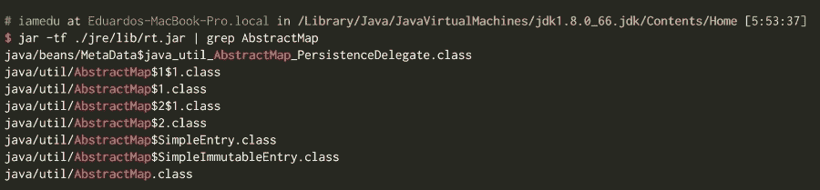

这是你需要记住的，总是用父类（或更准确地说，包含类）的前缀和美元符号来前缀内部类（在这种情况下为`java.util.AbstractMap`）。

# 编写简单的图像命名空间

现在，让我们编写一些 Clojure 代码并在`src/thumbnails/image.clj`中创建一个文件。

让我们尝试用 Clojure 的方式来做这件事。首先，写下命名空间声明并评估它：

```java
(ns thumbnails.image
  (:require [clojure.java.io :as io])
  (:import [javax.imageio ImageIO]
           [java.awt.image BufferedImageOp]
           [org.imgscalr Scalr Scalr$Mode]))
```

现在，打开一个 REPL 并编写以下代码：

```java
(def image-stream (io/input-stream "http://imgs.xkcd.com/comics/angular_momentum.jpg"))(def image (ImageIO/read image-stream))
image
(.getWidth image)
```

现在我们有一个图像实例，你可以在 REPL 中调用所有的 Java 方法。这是 Clojure 的核心概念之一，你可以在真正编写代码之前通过 REPL 来玩耍并检查你的代码，你可以以交互式的方式进行，如下所示：

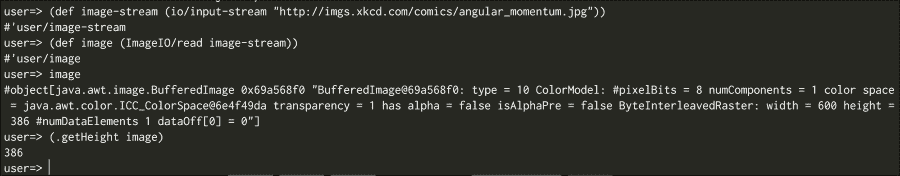

最后，我们希望坚持以下内容：

```java
(ns thumbnails.image
  (:require [clojure.java.io :as io])
  (:import [javax.imageio ImageIO]
           [java.awt.image BufferedImageOp]
           [org.imgscalr Scalr Scalr$Mode]))

(defn load-image [image-stream]
  (ImageIO/read image-stream))

(defn save-image [image path]
  (ImageIO/write image "PNG" (io/output-stream path)))

(defn image-size [image]
  [(.getWidth image) (.getHeight image)])

(defn generate-thumbnail [image size]
  (Scalr/resize image Scalr$Mode/FIT_TO_WIDTH size (into-array BufferedImageOp [])))

(defn get-image-width [image-path]
  (let [image (load-image image-path)
        [w _] (image-size image)]
    w))
```

### 小贴士

你可以看到，在这段代码中，我们使用了内部类语法，`Scalr$Mode`。`Mode`实际上不是一个类，而是一个`enum`，你可以为所有其他内部类型使用相同的语法。

代码很简单，它与你已经看到的非常相似；我们将通过两种方式来探讨这些差异。

你可以导入以下类：

+   `javax.imageio.ImageIO`

+   `java.awt.image.BufferedImageOp`

+   `org.imgscalr.Scalr`

+   `org.imgscalr.Scalr.Mode`

你必须小心处理`Mode`类，因为它是一个内部类（它位于另一个类中），Clojure 使用特殊的名称`Scalr$Mode`。

### 小贴士

当导入内部类时，你必须小心命名过程，在 Java 中，你将使用名称：`org.imgscalr.Scalr.Mode`；在 Clojure 中，你使用名称：`org.imgscalr.Scalr$Mode`。`load-image`、`save-image`和`image-size`函数是自我解释的，而`generate-thumbnail`函数也很简单；然而，它有一个特殊的细节，它将以下内容作为最后一个参数调用：

```java
(into-array BufferedImageOp [])
```

如果你查看 ImageScalr javadoc（[`javadox.com/org.imgscalr/imgscalr-lib/4.2/org/imgscalr/Scalr.Mode.html`](http://javadox.com/org.imgscalr/imgscalr-lib/4.2/org/imgscalr/Scalr.Mode.html)），你可以看到`resize`方法有几个重载实现；其中大多数都有`varargs`参数作为它们的最后一个参数。在 Clojure 中，你必须将这些`varargs`参数声明为数组。

# 编写测试

现在你已经编写了图像处理代码，现在是编写测试的好时机。

让我们检查一下是否可以生成缩略图。在测试中创建一个新的`thumbnails.thumbnail-test`命名空间。

记住，如果你创建了文件，它必须命名为`test/thumbnails/thumbnail_test.clj`。

向其中添加以下内容：

```java
(ns thumbnails.thumbnail-test
  (:require [clojure.test :refer :all]
            [clojure.java.io :as io]
            [thumbnails.image :refer :all]))

(deftest test-image-width
  (testing "We should be able to get the image with"
    (let [image-stream (io/input-stream "http://imgs.xkcd.com/comics/angular_momentum.jpg")
          image (load-image image-stream)]
      (save-image image "xkcd-width.png")
      (is (= 600 (get-image-width (io/input-stream "xkcd-width.png")))))))

(deftest test-load-image
  (testing "We should be able to generate thumbnails"
    (let [image-stream (io/input-stream "http://imgs.xkcd.com/comics/angular_momentum.jpg")
          image (load-image image-stream)
          thumbnail-image (generate-thumbnail image 50)]
      (save-image thumbnail-image "xkcd.png")
      (is (= 50 (get-image-width (io/input-stream "xkcd.png")))))))
```

在这里，我们使用了一些未知的功能，例如`let`形式和结构化。我们将在下一节中更详细地了解这些内容。

## `let` 语句

Clojure 给我们一个 `let` 语句来命名事物；它允许我们做类似于其他语言中变量声明的类似事情。

请记住，我们实际上并没有以 Java 中相同的方式创建变量。在 Java 中，每次我们声明变量时，我们都会声明我们想要为后期存储某些内容保留一定量的内存；它可以是一个原始值的值或对象的内存位置。我们在这里所做的只是命名一个值。这是一个有用的局部作用域，可以编写更干净、更容易理解的代码。让我们看看它是如何工作的：

```java
(let [x 42] x)
```

这是我们能写的最简单的 `let` 语句，它和直接写 `42` 完全一样。然而，我们可以写一些更复杂的，比如这个：

```java
(let [x 42
      y (* x x)]
  (println "x is " x " and y " y))
```

这看起来很直观；为了给 `42` 和 `y` 赋值，我们正在将 `42` 乘以 `42` 的值赋给它们。最后，我们打印 `x is 42 and y 1764`。这里需要注意的是两件事：

+   我们可以在 `let` 语句中使用之前定义的值；例如，我们在定义 `y` 时使用 `x`。

+   `let` 语句创建了一个作用域，我们无法在 `let` 语句之外使用 `x` 或 `y`。

`let` 语句甚至可以嵌套，我们可以做类似于以下示例的事情：

```java
(let [x 42]
  (let [y (* x x)]
    (println "x is " x " and y " y)))
```

这有点复杂，因为我们打开了一个不必要的括号组，并且写了更多的代码；然而，它允许我们看到词法作用域是如何工作的。

让我们看看另一个有趣的例子：

```java
(let [x 42]
  (let [y (* x x)]
    (let [x 41]
      (println "x is " x " and y " y))))
```

在这里，我们用 `41` 隐藏了 `x` 的值，而且这些不是变量。我们并没有改变内存区域，我们只是在新的 *X* 值上创建了一个新的作用域。

回到我们的测试，`let` 语句以以下代码开始：

```java
image (load-image image-path)
```

这一点很容易理解，但下一行可能有点困难：

```java
[w _] (image-size image)
```

这看起来相当奇怪；我们将 (`image-size image`) 的值赋给 `[w _]`，但 `[w _]` 不是一个符号名！

这里发生的事情是，我们正在使用一个称为解构的机制来分解 (`image-size image`) 的结果，并只使用我们感兴趣的信息，在这种情况下是图像的宽度。

解构是 Clojure 的一个关键特性，它几乎可以在符号绑定发生的任何地方使用，例如：

+   `let` 表达式

+   函数参数列表

解构有助于编写更简洁的代码，但如果你不习惯这样做，可能会觉得有点奇怪。让我们在下一节深入探讨这个问题。

# Clojure 中的解构

解构是 Clojure 中一个在其他 Lisp 语言中不常见的特性；其想法是允许你在代码实际上没有增加价值的情况下编写更简洁的代码（例如，从列表中获取第一个元素或从函数中获取第二个参数），并只关注对你重要的事情。

为了更好地理解这一点，让我们看看解构如何帮助你的一个示例：

```java
(let [v [1 2 3]] [(first v) (nth v 2)]) ;; [1 3]
```

前面的代码有什么问题？实际上没有什么问题，但你需要开始思考 `v` 是什么，`v` 的第一个值是什么，`nth` 函数做什么，以及 `v` 从哪个索引开始。

我们可以这样做：

```java
(let [[f s t] [1 2 3]] [f t]) ;; [1 3]
```

一旦你习惯了解构，你就会发现你不需要考虑如何获取你需要的元素。在这种情况下，我们直接从我们的向量中访问第一个、第二个和第三个元素，并使用这三个元素中的第一个和第三个。通过良好的命名，这可以变得更加简单。

让我们现在深入探讨解构是什么。

有两种类型的解构：

+   **按顺序解构**：它允许我们将顺序数据结构拆分，并将你感兴趣的值直接绑定到符号上

+   **关联解构**：它允许我们将映射拆分，并将你感兴趣的键引用值直接绑定到符号上

## 按顺序解构

通过一些示例，按顺序解构应该很容易理解；让我们看看：

```java
(let [[f s] [1 2]] f) ;; 1
(let [[f s t] [1 2 3]] [f t]) ;; [1 3]
(let [[f] [1 2]] f);; 1
(let [[f s t] [1 2]] t);; nil
(let [[f & t [1 2]] t);; (2)
(let [[f & t [1 2 3]] t);; (2 3)
(let [[f & t [1 2 3]] t);; (2 3)
(let [[f & [_ t]] [1 2 3]] [f t])
```

在这些示例中，按照惯例，我们用 `f` 表示第一个，`s` 表示第二个，`t` 表示第三个，而 `a` 表示其他所有。

同样的解构思想和语法也可以用于函数参数，如下一个示例所示：

```java
(defn func [[f _ t]]
  (+ f t))
(func [1 2 3]) ;; 4
```

### 注意

在这里我们使用符号 `_`，在 Clojure 中有一个惯例，即当你对某个值不感兴趣且未来不需要使用它时，可以使用 `_` 符号。在上一个示例中，我们对 `func` 函数的第二个参数不感兴趣。

如您所见，它让我们能够编写更简洁的代码，只关注重要的部分，即算法或业务。

## 关联解构

我们已经看到了按顺序解构，它允许通过索引获取序列的某些元素。在 Clojure 中，还有关联解构，它允许你仅获取你感兴趣的映射中的键。

再次，一个例子胜过千言万语：

```java
(let [{a-value a} {: a-value  5}] a-value) ;; 5
(let [{a-value :a c-value :c} {:a 5 :b 6 :c 7}] c-value) ;; 7
(let [{:keys [a c]} {:a 5 :b 6 :c 7}] c) ;; 7
(let [{:syms [a c]} {'a 5 :b 6 'c 7}] c) ;; 7
(let [{:strs [a c]} {:a 5 :b 6 :c 7 "a" 9}] [a c]) ;; [9 nil]
(let [{:strs [a c] :or {c 42}} {:a 5 :b 6 :c 7 "a" 9}] [a c]) ;; [9 42]
```

### 小贴士

将符号视为映射的键可能感觉有些奇怪，但重要的是要记住这个特性；它可能在某个时候派上用场。

如您所见，这也很简单，但我们还有更多选项：

+   我们可以引用一些键并将它们分配一个名称，就像第一个和第二个示例中那样。

+   我们可以引用关键字键，就像第三个示例中那样

+   我们可以引用字符串键，就像第四个示例中那样。

+   我们可以使用 `:or` 关键字定义默认值！

解构是 Clojure 中最常用的特性之一，它允许你编写非常简洁的代码。

回到我们的测试代码，现在应该很容易理解 `get-image-width` 函数：

```java
(defn get-image-width [image-path]
  (let [image (load-image image-path)
        [w _] (image-size image)]
    w))
```

如您所见，它将图像值设置为加载的图像，然后计算宽度，只获取宽度并返回该值。

我们现在可以理解 `test-load-image` 测试：

```java
 (deftest test-load-image
  (testing "We should be able to generate thumbnails"
    (let [image-stream    (io/input-stream "http://imgs.xkcd.com/comics/angular_momentum.jpg")
          image           (load-image image-stream)
          thumbnail-image (generate-thumbnail image 50)]
      (save-image thumbnail-image "xkcd.png")
      (is (= 50 (get-image-width (io/input-stream "xkcd.png")))))))
```

它只是初始化一个`image-stream`值，然后从这个流中加载一个图像并生成缩略图。最后，它加载生成的缩略图并检查图像宽度为 50px。

现在我们已经编写了测试，并且我们确信一切正常工作，我们可以从 Clojure 项目使用我们的小型库，但如果我们想从一个纯 Java（或 groovy，或 scala）项目中使用它会发生什么呢？

# 将你的代码暴露给 Java

如果你希望能够从其他 JVM 语言中使用 Clojure 代码，在 Clojure 中，你可以通过几种方式做到这一点：

+   你可以生成新的 Java 类，并像通常一样使用它们；它可以实现某些接口或从某些其他类扩展

+   你可以即时生成一个代理，这样你可以用很少的代码和努力实现一些框架要求的契约（以类或接口的形式）

+   你可以使用`clojure.java.api`包直接从 Java 调用 Clojure 函数

### 注意

你可以在以下位置找到更多关于如何工作的信息：[`www.falkoriemenschneider.de/a__2014-03-22__Add-Awesomeness-to-your-Legacy-Java.html`](http://www.falkoriemenschneider.de/a__2014-03-22__Add-Awesomeness-to-your-Legacy-Java.html)。

让我们看看我们如何定义一个 Java 类。

创建一个名为`thumbnails.image-java`的新命名空间，并编写以下代码：

```java
(ns thumbnails.image-java
  (:require [thumbnails.image :as img])
  (:gen-class
    :methods [[loadImage [java.io.InputStream] java.awt.image.BufferedImage]
              [saveImage [java.awt.image.BufferedImage String] void]
              [generateThumbnail [java.awt.image.BufferedImage int] java.awt.image.BufferedImage]]
    :main false
    :name thumbnails.ImageProcessor))

(defn -loadImage [this image-stream]
  (img/load-image image-stream))

(defn -saveImage [this image path]
  (img/save-image image path))

(defn -generateThumbnail [this image size]
  (img/generate-thumbnail image size))
```

这段代码与我们之前看到的 Clojure 代码非常相似，只是多了`gen-class`指令和以减号开始的函数名。

让我们更详细地回顾一下`gem-class`：

```java
(:gen-class
    :methods [[loadImage [java.io.InputStream] java.awt.image.BufferedImage]
              [saveImage [java.awt.image.BufferedImage String] void]
              [generateThumbnail [java.awt.image.BufferedImage int] java.awt.image.BufferedImage]]
    :main false
    :name thumbnails.ImageProcessor)
```

当 Clojure 编译器看到这个时，它会生成类的字节码，但它需要从关键字那里得到一点帮助来知道如何生成类。

+   名称键定义了类的名称，它是一个符号

+   主要键定义了此类是否应该有一个主方法

+   方法键定义了所有方法和它们的签名，它是一个包含三个部分的向量：`[methodName [parameterTypes] returnType]`

方法被实现为以`(`字符开始的函数，前缀可以通过前缀键更改。

你还需要告诉 Clojure 预先编译这个类，在 Leiningen 中可以通过`:aot`实现，转到你的`project.clj`文件，并添加一个`:aot`键，以向量形式指定要编译的命名空间或命名空间；如果你希望所有内容都预先编译，可以使用特殊的`:all`值。

最后，你应该有一个类似这样的结果：

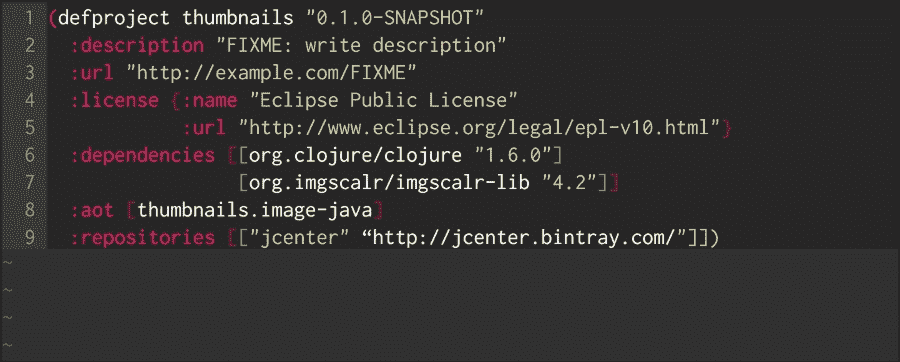

### 小贴士

如果你希望所有代码都预先编译，你可以在`project.clj`中使用`:aot :all`。

现在，我们可以将我们的库安装到我们的 Maven 本地仓库中。转到命令行并运行：

```java
$ lein install

```

你将得到类似于以下截图的输出：

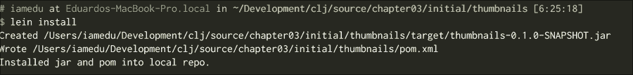

现在，你已经准备好了；你应该在你的 Maven 本地仓库中有一个`thumbnails:thumbnails:0.1.0-SNAPSHOT`依赖项。

## 从 Groovy 进行测试

为了看到这如何与几种 JVM 语言一起工作，我们将使用 Groovy 和 Gradle 进行测试。我们同样可以轻松地使用 Java 和 Maven。记住，你可以从代码包中获取源代码，这样你就不需要了解这里发生的所有事情。

这里有两个文件；在 `build.gradle` 文件中，我们指定我们想要使用我们的本地 Maven 仓库，并指定我们的依赖项，如下所示：

```java
apply plugin: 'java'
apply plugin: 'groovy'

repositories {
  jcenter()
  mavenLocal()
}

dependencies {
  compile "thumbnails:thumbnails:0.1.0-SNAPSHOT"
  testCompile "org.spockframework:spock-core:0.7-groovy-2.0"
}
```

然后，我们可以编写我们的测试，如下面的代码所示：

```java
package imaging.java

import thumbnails.ImageProcessor
import spock.lang.*

class ImageSpec extends Specification {
  def "Test we can use imaging tools"() {
    setup:
      def processor = new ImageProcessor()
      def imageStream = getClass().getResourceAsStream("/test.png")

    when:
      def image = processor.loadImage(imageStream)
      def thumbnail = processor.generateThumbnail(image, 100)

    then:
      thumbnail.getWidth() == 100
  }
}
```

你可以运行测试：

```java
gradle test
```

如你所见，从 Java、Groovy 或甚至 Scala 运行你的代码非常简单。还有其他方法可以将 Clojure 与 Java 一起使用，特别是如果你想要实现一个接口或动态生成一个类的话。

# 代理和 reify

有时候，当你与 Java 库交互时，你必须向某个方法发送特定 Java 类的实例；编写一个类不是最佳选择，你最好在运行时创建一个符合某些框架期望的合约的实例。我们有两个选项来做这件事：

+   **代理**：它允许你实现一个 Java 接口或从某个超类扩展。实际上，它创建了一个新对象，当需要时调用你的 Clojure 函数

+   **Reify**：Reify 允许你实现接口和 Clojure 协议（我们稍后会看到）。它不能扩展类。它的性能比代理更好，应该尽可能使用。

让我们看看一个最小示例：

```java
(import '(javax.swing JFrame JLabel JTextField JButton)
        '(java.awt.event ActionListener)
        '(java.awt GridLayout))
(defn sample []
  (let [frame (JFrame. "Simple Java Integration")
        sample-button (JButton. "Hello")]
    (.addActionListener
     sample-button
     (reify ActionListener
            (actionPerformed
             [_ evt]
             (println "Hello world"))))
    (doto frame
      (.add sample-button)
      (.setSize 100 40)
      (.setVisible true))))
(sample)
```

### 提示

`doto` 是一个宏，允许我们在一个实例上调用多个方法；你可以将其视为分别调用所有方法的一种方式。它与 Java Beans！配合得很好。

打开一个 REPL 并编写代码；它应该显示一个带有按钮的窗口，当点击按钮时（在终端中）会打印 `Hello world`：

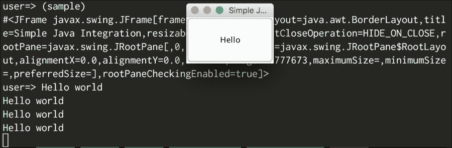

如果你熟悉 Swing，那么你知道 `JButton` 的 `addActionListener` 需要一个回调，即 `ActionListener` 的实例，我们使用 `reify` 函数创建这个实例。

在 Java 代码中，你可能通常会做类似于以下代码的事情：

```java
button.addActionListener(new ActionListener() {
  public void actionPerformed(ActionEvent e) {
    System.out.println("Hello world")'
  }
})
```

我们称这为匿名类，它本质上与函数式语言中的闭包相同。在先前的例子中，代码被替换为 reify：

```java
  (reify ActionListener
            (actionPerformed
             [_ evt]
             (println "Hello world")))
```

`reify` 语句接收你正在实现的接口以及你按列表出的所有方法。在这种情况下，我们只实现了 `actionPerformed` 以接收动作事件。

这是结构：

```java
(reify InterfaceOrProtocol
  (method [self parameter-list]
    method-body)
  (method2 [self parameter-list]
    method-body))
```

这创建了一个 `ActionListener` 的实例，你可以用相同的方式与 servlets、threads、collections、lists 或任何其他由任何人定义的 Java 接口一起使用。

在这里，你需要记住的一件特别的事情是，你需要在方法实现中始终将 `self` 作为第一个参数添加；它取代了在 Java 中工作的 `this` 关键字。

# 概述

在本章中，你通过一些新的原语获得了 Clojure 的很多功能。

如你所见，有 plenty of ways to interact with your current codebase；特别是，你现在可以：

+   从 Clojure 使用 Java 代码

+   从 Java 使用 Clojure 代码

+   通过创建遵守其契约的对象来重用 Java 框架

考虑到我们所有的这些新工具，我们现在准备好处理更多概念和稍微复杂一些的集合和数据结构。

# 第四章：集合和函数式编程

我们现在已经习惯了在 Clojure 程序中使用 Java 代码，我们也知道如何通过 Java API 公开我们的 Clojure 程序。然而，我们需要更深入地了解 Clojure 及其真正的本质，即函数式编程。

在本章中，我们将涵盖以下主题：

+   函数式编程基础

+   持久性集合

+   顺序和关联集合

+   序列抽象

+   集合类型

+   将函数式编程应用于集合

# 函数式编程基础

这是一个你可以在很多不同地方读到的话题，似乎每个人都有自己关于函数式编程是什么的看法。然而，在几乎每个定义中，你都会找到一个共同点，这与你从函数式编程中获得的好处相关，例如：

+   更容易的重用代码

+   函数更容易测试

+   函数更容易推理

为了获得这些好处，你需要考虑以下事项：

+   你应该将函数视为一等公民

+   函数应该最小化副作用（它们不应该改变任何状态）

+   函数应该只依赖于它们的参数（这被称为引用透明性）

让我们看看 Java 中两个函数（或方法）的例子，以说明即使在 Java 中，你也可以从编写无副作用和上下文依赖的函数中获得好处。

```java
public void payRent(BigDecimal amount) {
  User user = getCurrentUser();
  if(user.payAmount != amount) {
    System.out.println("Cannot pay");
  } else {
    user.money -= amount;
  }
}
```

假设你必须测试前面的函数；你可能会遇到一些问题：

1.  你需要知道如何获取当前用户；你可能需要模拟数据库或会话存储。或者在最坏的情况下，你可能需要一个真实的会话存储服务。

1.  你如何知道某物是否已支付？

现在，看看这个其他例子：

```java
public boolean payRent(User user, BigDecimal amount, ValidateStrategy strategy) {
  if(strategy.validatePayment(user, amount)) {
    user.money -= amount;
    return true;
  } else {
    return false;
  }
}
```

上述代码更容易测试；你可以以任何方式创建用户实例，并且使用`ValidateStrategy`类（或接口），你可以做你需要做的任何事情。

最后，你得到的不是副作用，而是一个返回值，表示操作是否可行。这样你就不需要模拟，并且可以在不同的上下文中重用它。

既然我们已经看到了函数式编程的一些共同点，让我们来看看 Clojure 在函数式编程方面的价值主张：

+   函数是一等公民或值。就像整数或字符串一样，你可以在运行时创建它们，传递它们，并在其他函数中接收它们。

+   函数是值，数据结构也是值；它们不能像 Java 中那样被修改，它们是一个固定值，就像整数是一个固定值一样。

+   不可变数据结构非常重要，它们允许编写安全和简单的多线程代码。

+   惰性（数据结构的惰性）允许延迟评估直到需要时，只执行你必须执行的操作。

# 持久集合

Clojure 最重要的特性之一是集合是持久的。这并不意味着它们是持久到磁盘的，这意味着你可以有多个集合的历史版本，并且有保证，更新或在这些版本中查找任何内容都将具有相同的努力（复杂度）。你只需很少的额外内存就能得到所有这些。

为什么？实际上很简单。Clojure 在几个不同的数据结构之间共享一个公共结构。如果你向一个数据结构添加一个元素，Clojure 会共享两个结构之间的公共部分，并跟踪差异。

让我们用一个例子来看看我们的意思：

```java
(def sample-coll [:one :two :three])
(def second-sample-coll (conj sample-coll :four))
(def third-sample-coll (replace {:one 1} sample-coll))

sample-coll ;; [:one :two :three]
second-sample-coll ;; [:one :two :three :four]
third-sample-coll ;; [1 :two :three :four]
```

正如你所见，当你将新项目`conj`到一个集合中，或者甚至替换它的一些元素时，你并没有改变原始集合，你只是在生成一个新的版本。

### 注意

在 Clojure 中，你可以使用`conj(conjoin)`作为一个动词。这意味着以高效的方式将新元素添加到集合中。

这个新版本不会以任何方式修改你之前拥有的任何集合。

这与常见的命令式语言的工作方式有很大不同，乍一看可能像是一个坏主意，但 Clojure 使用高效的算法，给我们带来了一些优势，特别是：

+   相同集合的不同版本共享公共部分，使我们能够使用很少的内存。

+   当集合的一部分不可见时，它会被垃圾回收。

你从这得到的是与可变集合相似的内存使用量。记住，在空间和时间上都有成本，但对于大多数用例来说可以忽略不计。

你为什么要有一个不可变的数据集合？主要优势是它们很容易理解；将它们传递给函数不会改变它们，当你编写并发代码时，没有其他线程会修改你的集合，你也不需要担心显式处理锁。

# Clojure 中的集合类型

Clojure 中有三种类型的集合：计数集合、顺序集合和关联集合。它们不是互斥的，这意味着一个集合可能是任何一种。

让我们看看每种类型：

+   **计数集合**：计数集合是一个知道其大小在常数时间内的集合。它不需要遍历其元素来获取计数。

+   **顺序集合**：顺序集合可以顺序遍历；这是您在处理列表时最常用的方法。最容易想到的类比是 Java 的列表，您可以使用 for 循环或迭代器遍历它。在 Clojure 中，向量、列表和惰性序列都是顺序集合。

+   **关联集合**：关联集合可以通过键来访问；映射是这里的首选。我们说过一个集合可以是任何类型；Clojure 的向量也可以用作关联集合，每个元素索引都可以用作键。您可以将其视为一个键为 0、1、2、3 等的映射。

Clojure 有一些函数可以告诉我们给定的集合是否为每种类型，顺序的还是关联的。正如您所猜想的，向量对两者都返回 true。以下是一些函数：

| 函数名称 | 列表 | 向量 | 映射 | 惰性序列 | 集合 |
| --- | --- | --- | --- | --- | --- |
| counted? | true | true | true | false | true |
| sequential? | true | true | false | true | false |
| associative? | false | true | true | false | false |

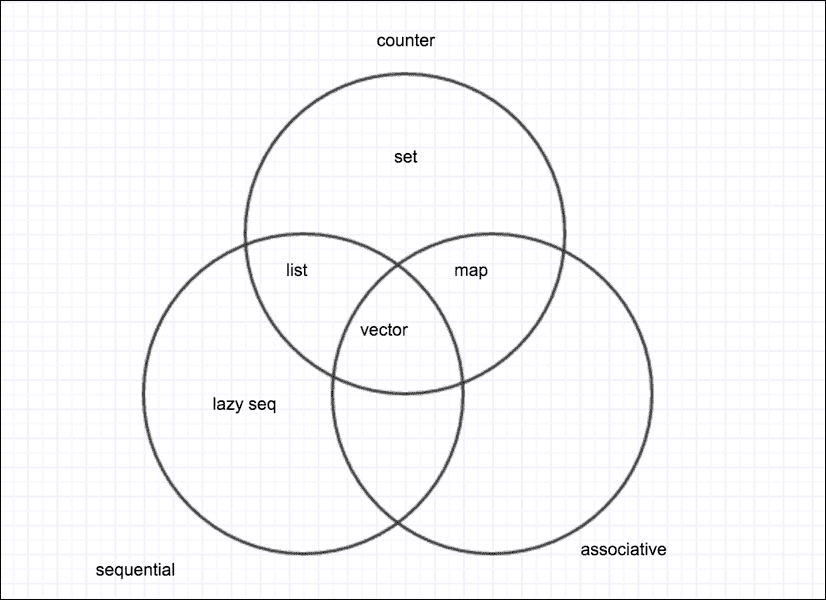

在之前的表格和图中，您可以看到我们考虑了**集合**，如您所见，它既不是顺序的也不是关联的。

我们应该考虑另一个属性；一个集合是否计数。这意味着一个集合知道它有多少个元素。列表、向量、映射和集合都是计数的；惰性序列不是计数的，因为它们是即时生成的，甚至可能是无限序列。

我们将在本章后面的部分学习更多关于所有这些序列的内容。

# 序列抽象

Clojure 有一些独特的特性使其与其他 Lisp 不同；其中之一就是序列抽象。您可以将其视为集合遵守的接口。Clojure 有一个标准的函数 API，您可以使用序列。以下是一些这些函数的示例：

+   `distinct`函数：此函数返回一个序列，只包含原始序列中的每个元素一次：

    ```java
    (def c [1 1 2 2 3 3 4 4 1 1])
    (distinct c) ;; (1 2 3 4)
    ```

+   `take`函数：此函数从原始序列中取出一定数量的元素：

    ```java
    (take 5 c) ;; (1 1 2 2 3)
    ```

+   `map`函数：此函数将函数应用于序列中的每个元素，并创建一个包含这些元素的新序列：

    ```java
    (map #(+ % 1) c) ;; (2 2 3 3 4 4 5 5 2 2)
    ```

这里有趣的部分是，这些函数接收并返回序列，并且您可以组合它们。这可以在以下代码中看到：

```java
 (->> c
  (distinct)
  (take 5)
  (reverse)) ;; (4 3 2 1)

;; This is known as a threading macro, it applies distinct, then take 5 then reverse to the
;; collection c so this is the same as writing:
;; (reverse (take 5 (distinct c))) but much more readable
```

这些只是接受并返回序列的一些函数，但还有更多您可以直接使用。唯一的假设是您的序列参数可以响应三个函数：

+   `first`：此函数返回序列的第一个元素

+   `rest`：此函数返回另一个序列，包含除了第一个元素之外的所有元素

+   `cons`：这个函数接收两个参数，一个项和另一个`seq`，然后返回一个新的`seq`，其中包含第二个参数中的所有项

### 注意

你会发现你更频繁使用的函数之一是`seq`函数，它可以转换任何集合为序列，甚至 Java 原生的数组和实现了`java.util.Iterable`接口的对象。其主要用途之一是测试集合是否为空。

# Clojure 中的特定集合类型

现在你已经了解了 Clojure 的一般集合特性和序列抽象，现在是了解 Clojure 的具体集合实现的好时机。

## 向量

向量是 Clojure 的工作马；与 map 一起，它是使用最多的集合。不要害怕它们；它们与 Java 的`java.util.Vector`无关。它们只是一系列有序值，如列表或数组。

它们具有以下特性：

+   它们是不可变的

+   它们可以按顺序访问

+   它们是结合的（它们是它们索引的映射，这意味着它们的键是 0、1、2 等等）

+   它们是计数的，意味着它们具有有限的大小

+   它们具有随机访问，因此你可以几乎以恒定的时间访问任何元素（使用 nth 函数）

+   `conj`函数将给定元素附加到它们上

### 小贴士

nth 函数允许我们获取任何`seq`的第 n 个元素，但你不应不加考虑地使用它。它没有问题处理向量，并且以恒定时间返回，但与列表一起使用时，它需要线性时间，因为它必须遍历所有集合以找到你请求的元素。尽量只与向量一起使用它。

它们具有字面语法；你可以使用方括号定义一个向量，如下所示：

```java
[42 4 2 3 4 4 5 5]
```

除了字面语法之外，还有一个你可以用来构建向量的函数。`vec`函数可以从传递给它的任何序列中构建一个向量：

```java
(vec (range 4)) ;; [0 1 2 3]
```

向量另一个重要的好处是它们被用于函数参数声明和`let`绑定。

看一下以下示例：

```java
(def f [some-param & some-other-params] …)

(let [one 1 two (f p p-2 p-3)] …)
```

正如你所见，函数中的参数被定义为向量，与`let`绑定相同。

关于 Lisp 的主要抱怨之一是它们使用太多的括号，Clojure 在这些结构中使用向量而不是括号的决策受到欢迎，这使得代码更容易阅读。

有几种方法可以访问向量的某个元素：

+   **将向量用作函数**：向量可以用作其键的函数；我们还没有讨论 map，但你会看到这是因为它们是结合的：

    ```java
    (def v [42 24 13 2 11 "a"])
    (v 0) ;; 42
    (v 99) ;; java.lang.IndexOutOfBoundsException
    ```

+   **nth 函数**：`nth`函数可以接收一个额外的参数来指示当索引未找到时，它可以像下面这样使用：

    ```java
    (nth v 0) ;; 42
    (nth v 99 :not-found) ;; :not-found
    (nth v 99) ;; java.lang.IndexOutOfBoundsException
    ```

+   **get 函数**：`get`函数可以接收一个额外的参数来指示当索引未找到时，它像下面这样使用。需要注意的是，与 nth 不同，`get`不能用于序列：

    ```java
    (get v 0) ;; 42
    (get v 99 :not-found) ;; :not-found
    (get v 99) ;; nil
    ```

你几乎总是应该使用向量；特别是，如果你想做以下任何一项，没有其他方法可行：

+   你需要随机访问一个集合（无论是修改还是访问它）

+   你需要向集合的尾部添加元素

## 列表

列表在其他 Lisp 中是最重要的集合类型。在 Clojure 中，它们用于表示代码，但它们的功能几乎仅限于这一点。

Clojure 中的列表是单链表；正如你所想象的那样，这意味着它们不适合随机访问（你需要遍历列表直到到达想要的索引）。话虽如此，你仍然可以使用列表作为 API 中每个函数的序列。

让我们列出它们的属性：

+   它们是不可变的

+   它们可以按顺序访问

+   它们不是关联的

+   它们是有计数的，意味着它们有有限的大小

+   它们不应该以随机顺序访问。如果你想得到第 99 个元素，那么 Clojure 将不得不访问前 98 个元素才能得到第 99 个。

+   `conj` 函数将给定元素添加到其前面

你可以使用与上一章中看到的一样解构列表。你不应该害怕使用第一个函数（甚至可以使用带有小索引的 nth）。

### 小贴士

列表有其用例，随着你学习的深入，你可能会在某些地方（如宏）感到舒适地使用它们，但作为一个经验法则，尽量使用向量。

## 映射

地图可能是所有语言中最重要的一种集合类型。在 Clojure 中，它们也非常重要。

映射是键值对的集合，这意味着你可以通过键访问或存储一个元素。我们一直称这种类型的集合为关联集合。在 Clojure 中，键可以是任何类型的值，甚至是函数、列表、集合、向量或其他映射。

### 排序映射和哈希映射

Clojure 中有两种映射类型，每种类型都有其自身的优点。

+   **哈希映射**：它们是 Clojure 中最常用的映射形式；映射的文本语法创建了这种类型的映射。它们具有几乎恒定的查找时间，这使得它们在大多数场景中都非常快且可用。它们的缺点是你不能按顺序访问它们。你可以创建它们，如下所示：

    ```java
    {:one 1 :two 2}
    (hash-map :one 1 :two 2)
    ```

+   **排序映射**：如果你需要能够以特定顺序访问映射的键值对，那么你必须使用排序映射。排序映射的缺点是查找时间**不是**常数，这意味着它们通过键访问会稍微慢一些。然而，当你需要按键的顺序遍历映射时，这是唯一的方法。这里的一个强约束是键之间必须是可比较的。排序映射可以创建，如下所示：

    ```java
    (sorted-map :sample 5 :map :6) ;; {:sample 5, :map 6}
    (sorted-map-by > 1 :one 5 :five 3 :three) ;; {5 :five, 3 :three, 1 :one}
    ```

### 小贴士

可比较的对象是实现了`compareTo`接口的对象。

### 常见属性

关联对象，包括映射具有以下属性：

+   它们是它们键的函数：

    ```java
    (def m #{:one 1 :two 2 :three 3})
    (m :one) ;; 1
    (m 1) ;; nil
    ```

+   它们可以与关联解构一起使用：

    ```java
    (let [{:keys [a b c d]} #{:a 5}]
      [a b]) ;
    ; [:a nil]
    ```

+   你可以使用`get`函数访问：

    ```java
    (get m :one) ;; 1
    (get m 1) ;; nil
    (get m 1 :not-found) ;; :not-found
    ```

你可以使用`seq`函数将一个映射转换为`seq`；你将得到一个序列，其中每个元素都是一个表示映射中键值对的向量：

```java
(seq {:one 1 42 :forty-two :6 6}) ;; ([:one 1] [:6 6] [42 :forty-two])
(doseq [[k v] (seq {:one 1 42 :forty-two :6 6})]
  (println k v))
;; :one 1
;; :6 6
;; 42 :forty-two
```

`Doseq`类似于 Java 的 for-each 循环。它对序列中的每个元素执行主体。

它的工作方式如下：`(doseq [x sequence] ;;`。这与 let 语句的工作方式相同，如果需要，你可以使用解构：

```java
    (body-that-uses x))
```

## 集合

Clojure 集合是唯一元素的集合。你可以把它们看作是数学集合，因此 Clojure 有并集、交集和差集等操作。

让我们看看集合的性质：

+   它们是不可变的

+   它们是关联的（它们的键是它们的元素）

+   它们是计数的，这意味着它们有有限的大小

+   它们的元素是唯一的（最多包含一次）

### 有序集合和哈希集合

集合有两种类型：哈希集合和有序集合。

+   **哈希集合**：除了我们之前看到的属性外，哈希集合是无序的。它们使用哈希映射作为后端实现。

+   **有序集合**：除了我们之前看到的属性外，有序集合是有序的。它们可以用作所有期望有序`seq`的函数的参数。它们可以按顺序访问：

    ```java
    (doseq [x (->> (sorted-set :b :c :d)
                            (map name))]
        (println x))
    ;; b
    ;; c
    ;; d
    ```

你也可以无问题地反转它们，过滤它们，或者像向量或列表一样映射它们。

### 常见属性

集合是关联的，这给了它们一些映射的性质：

+   它们是它们元素的函数：

    ```java
    (#{:a :b :c :d} :a);; :a
    (#{:a :b :c :d} :e);; nil
    ```

+   它们可以与映射解构一起使用：

    ```java
    (let [{:keys [b]} #{:b}] b);; :b
    (let [{:keys [c]} #{:b}] b);; nil
    (let [{:keys [c]} (sorted-set :b)] c);; nil
    (let [{:keys [b]} (sorted-set :b)] b);; :b
    ```

+   可以使用`get`函数来访问它们的元素：

    ```java
    (get #{:a :b :c :d} :e :not-found) ;; :not-found
    (get #{:a :b :c :d} :a) ;; :a
    (get #{:a :b :c :d} :e) ;; nil
    ```

### 并集、差集和交集

如果你记得数学集合，你就会知道你可以对它们执行以下三个主要操作：

+   **并集**（`union a b`）：并集包括`a`和`b`中的所有元素

+   **差集**（`difference a b`）：差集是`a`中所有不在`b`中的元素

+   **交集**（`intersection a b`）：它只包括`a`和`b`中都有的元素

这里有一些例子：

```java
(def a #{:a :b :c :d :e})
(def b #{:a :d :h :i :j :k})

(require '[clojure.set :as s])

(s/union a b) ;; #{:e :k :c :j :h :b :d :i :a}
(s/difference a b) ;; #{:e :c :b}
(s/intersection a b) ;; #{:d :a}
```

## 将函数式编程应用于集合

现在我们对集合的工作方式有了更好的理解，我们就有了更好的基础来理解函数式编程以及如何充分利用它。

这需要一种不同的思维方式来解决问题，你应该保持开放的心态。

你可能发现所有这些集合中有一个非常奇怪的特性：*它们是不可变的*。

这确实是一件相当奇怪的事情；如果你习惯了 Java，你怎么可能不添加或从列表或集合中删除元素来编写程序？

这怎么可能呢？在 Java 中，我们习惯于编写`for`和`while`循环。我们习惯于每一步都修改变量。

我们如何处理不可变的数据结构？让我们在接下来的章节中找出答案。

### 命令式编程模型

软件行业长期以来一直使用单一软件范式；这个范式是命令式编程模型。

在命令式范式中，你必须告诉计算机在每一步要做什么。你负责内存的工作方式，是运行在单核还是多核上，如果你想使用多核，你需要确保正确地改变程序状态并避免并发问题。

让我们看看你将如何以命令式风格计算阶乘：

```java
int factorial(int n) {
    int result = 1;
    for (int i = 1; i <= n; i++) {
        result *= i;
    }
    return result;
}
```

你正在创建一个可变的结果和一个可变的变量`i`。每次你通过将其赋值为`i + 1`来改变变量`i`的值。你可以通过乘以`i`来改变结果。计算机只是执行你的命令，比较、加法和乘法。这就是我们所说的命令式编程模型，因为你需要告诉计算机它需要执行的精确命令。

由于各种原因，这在过去一直工作得很好，例如：

+   内存大小的严格限制迫使程序员尽可能高效地使用内存

+   考虑单个执行线程及其逐步执行的方式更容易

当然，也有一些缺点。代码很容易变得复杂，世界已经改变；多年前存在的约束已经消失。此外，今天的大多数计算机都有多个 CPU。使用共享可变状态的多线程是负担。

这使得思考变得复杂。即使在单线程程序中我们也会遇到麻烦；想想看，以下代码的结果会是什么？

```java
List l = new ArrayList();
doSomething(l);
System.out.println(l.size());
```

是`0`吗？你不可能知道，因为`doSomething`方法通过引用获取列表，并且可以在你不知道的情况下添加或删除东西。

现在，想象一下你有一个多线程程序和一个可以被任何线程修改的单个`List`。在 Java 世界中，你必须了解`java.util.concurrent.CopyOnWriteArrayList`，并且你需要了解其实现细节，以便知道何时使用它以及何时不使用它。

即使有了这些结构，思考多线程代码仍然困难。你仍然需要考虑信号量、锁、同步器等等。

在简单情况下，命令式世界可能容易，但它并不简单。整个行业已经意识到这一点，并且有许多新的语言和技术从其他地方汲取了灵感。Java 8 有流式 API，它包括 lambda 块，本质上就是函数。所有这些想法都是从函数式世界借鉴来的。

### 函数式范式

解决问题的思考方式有很多种；特别是，函数式范式最近变得很重要。这并不是什么新鲜事；Lisp 自从 1958 年构思以来就支持这种编程方式。它可能直到最近才变得强大，因为它需要一种更抽象的思维方式。

为了让你更好地理解，让我们看看几个函数式编程看起来与以下代码相似示例：

```java
(map str [1 2 3 4 5 6]) ;; ("1" "2" "3" "4" "5" "6")

(defn factorial [n]
  (reduce * (range 1 (inc n))))

(factorial 5) ;; 120
```

如你所见，它看起来相当不同；在第一种情况下，我们将`str`函数传递给另一个名为`map`的函数。

在第二种情况下，我们将`*`函数传递给另一个名为`reduce`的函数。在这两种情况下，我们使用函数，就像传递一个列表或一个数字一样，它们是**第一级公民**。

函数式编程中的一个重要区别是你不需要告诉机器如何做事。在第一种情况下，map 遍历向量并将`str`函数应用于每个元素，将其转换为字符串的`seq`。你不需要递增索引，你只需要告诉 map 你想要应用于每个元素的函数。

在阶乘的情况下，有一个接收`*`和一个从`1`到`n`的`seq`的`reduce`函数。

它只是工作，你不需要告诉它如何做任何事情，只需要告诉它你想要做什么。

`map`和`reduce`都是**高阶函数**，因为它们接受函数作为参数；它们也是高级抽象。

### 注意

高阶函数是那些接受函数作为参数、返回函数作为结果，或者两者都做的函数。

你需要在一个更高级的抽象层面上思考，你不在乎事情是如何真正完成的，只在乎它完成了工作。

这带来了一些好处，如果某个时候映射的实现变成了多线程，你只需要更新版本，就可以准备出发了！

### 函数式编程和不可变性

你可能也注意到了，函数式编程使得使用不可变结构成为必要，因为你不能在每一步中更改某些或所有状态；你只能描述你想要基于某个其他集合创建新集合的方式，然后获取它。Clojure 的高效集合使得在最小内存使用的情况下共享集合的片段成为可能。

不可变性还有一些其他好处：

+   你可以与任何你想分享的数据结构，因为你确定没有人会更改你的副本。

+   调试更简单，因为你可以用一些不可变值而不是可变状态来测试程序。当你得到一个值时，你可以找出哪个函数返回了你得到的值；没有多个地方会修改集合供你检查。

+   并发编程更简单；再次确定没有人可以更改你的副本，即使在其他并发运行的线程中，这也使得对程序的推理更简单。

### 懒惰

Clojure 还支持序列转换的惰性求值。让我们看看`range`函数：

```java
(def r (range))
```

当运行此函数不带参数时，你正在创建一个从`0`开始的无限序列。

这是一个无限序列；那么为什么 Clojure 的 REPL 会自动返回？

Clojure 不会在需要之前计算集合值，因此为了获取一个值，你必须做些什么，比如这样：

```java
(take 1 r);; (0)
(take 5 r);; (0 1 2 3 4)
```

### 小贴士

如果你尝试在 REPL 中打印一个无限序列，它将会冻结。

在这里，Clojure 首先解析集合 `r` 中的一个元素，然后解析五个元素，因为它需要在 REPL 中打印它们。

### 小贴士

惰性评估仅适用于集合和序列处理。其他操作（如加法、方法调用等）是立即执行的。

有趣的是，你可以通过将函数如 filter 和 map 应用到某个集合上来定义一个新的惰性集合。

例如，让我们获取一个包含所有奇数的新的集合：

```java
(def odd-numbers (filter odd? r))
(take 1 odd-numbers)  ;; (1)
(take 2 odd-numbers)  ;; (1 3)
(take 3 odd-numbers)  ;; (1 3 5)
```

现在，`odd-numbers` 是一个奇数的无限序列，我们刚刚请求了其中的三个。每当一个数字已经被计算，它就不会再次被计算。让我们稍微改变一下我们的集合，以便理解它是如何工作的：

```java
(defn logging-odd? [number]
    (println number) ;; This is terrible, it is a side effect and a source for problems
                     ;; Clojure encourages you to avoid side effects, but it is pragmatic
                     ;; and relies on you knowing what you are doing
    (odd? number))

(def odd-numbers (filter logging-odd? r))

(take 1 odd-numbers)
;; 0
;; 1
;; 2
;; 3
;; 4
;; 5
;; 6
;; 7
;; 8
;; 9
;; 10
;; 11
;; 12
;; 13
;; 14
;; 15
;; 16
;; 17
;; 18
;; 19
;; 20
;; 21
;; 22
;; 23
;; 24
;; 25
;; 26
;; 27
;; 28
;; 29
;; 30
;; 31
;; => (1)

(take 1 odd-numbers)
;; => (1)

(take 2 odd-numbers)
;; => (1 3)

(take 3 odd-numbers)
;; => (1 3 5)

(take 4 odd-numbers)
;; => (1 3 5 7)

(take 10 odd-numbers)
;; => (1 3 5 7 9 11 13 15 17 19)
```

正如你所见，一些数字首先被计算；你不应该期望或依赖于在特定时间预先计算特定数量的元素。

此外，请注意，当我们请求相同数量的元素时，计算不会再次执行，因为它已经被缓存。

# 摘要

在 Clojure 中，集合和函数式编程是非常强大的工具，允许我们使用完全不同的编程范式。

到目前为止，我们已经学到了以下内容：

+   不可变集合的机制以及 Clojure 中每种集合类型最适合做什么

+   序列抽象以及许多 Clojure 函数如何使用这种抽象在集合上工作

+   函数式编程如何使我们能够编写更简单的程序，这些程序在并行环境中表现更好，并帮助我们通过惰性节省资源

在随后的章节中，我们将学习其他新的 Clojure 功能，这些功能为我们提供了比 Java 提供的更新、更强大的实现多态的方法。

# 第五章。多态方法和协议

现在我们对 Clojure 的工作方式有了更好的理解；我们理解了如何使用不可变数据结构执行简单操作，但我们缺少一些可以使我们的生活更加容易的功能。

如果你已经是一名 Java 程序员一段时间了，你可能会想到多态及其在 Java 中的特定风味。

多态是我们能够重用代码的概念之一。它赋予我们与不同对象使用相同 API 交互的能力。

Clojure 有一个强大的多态范式，它允许我们编写简单的代码，创建与尚未存在的类型交互的代码，并在程序员编写代码时以它未设计的方式扩展代码。

为了帮助我们在 Clojure 中实现多态，我们有两个重要的概念，我们将在本章中介绍：

+   多态方法

+   协议

每个都有其自己的用例和它最擅长的事情；我们将在下一节中探讨它们。

我们将通过回顾我们从 Java 中已经了解的知识来学习这些不同的概念，然后我们将从 Clojure 中学习类似的概念，这些概念给我们带来了更多的力量。

# Java 中的多态

Java 严重使用多态，其集合 API 基于它。Java 中多态的最好例子可能是以下这些类：

+   `java.util.List`

+   `java.util.Map`

+   `java.util.Set`

我们知道，根据我们的用例，我们应该使用这些数据结构的一个特定实现。

如果我们更喜欢使用有序集，我们可能会使用 TreeSet。

如果我们需要在并发环境中使用 Map，我们将使用 `java.util.concurrent.ConcurrentHashMap`。

美妙的是，你可以使用 `java.util.Map` 和 `java.util.Set` 接口来编写你的代码，如果你需要更改到另一种类型的 Set 或 Map，因为条件发生了变化或有人为你创建了一个更好的集合版本，你不需要更改任何代码！

让我们看看 Java 中多态的一个非常简单的例子。

假设你有一个形状层次结构；它可能看起来像以下代码：

```java
package shapes;

public interface Shape {
  public double getArea();
}

public class Square implements Shape {
  private double side;
  public Square(double side) {
this.side = side;
  }

  public double getArea() {
    return side * side;
  }

}

public class Circle implements Shape {
  private double radius;
  public Circle(double radius) {
this.radius = radius;
  }

  public double getArea() {
    return Math.PI * radius * radius;
  }

}
```

你肯定已经意识到了这个概念的力量，你现在可以计算一组图形的所有面积的总和，如下所示：

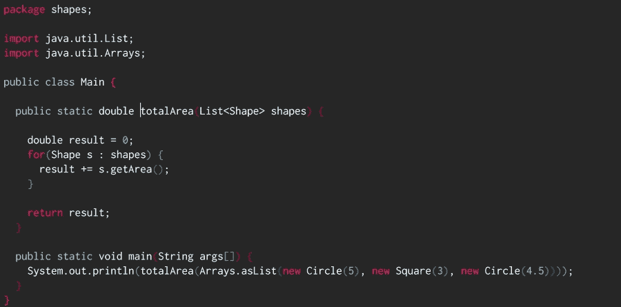

`totalArea` 方法不关心你传递给它的具体形状类型，你可以添加新的形状类型，例如矩形或梯形。现在，你的相同代码将能够处理新的数据类型。

现在，使用相同的 Java 代码库，假设你想要向你的形状接口添加一个新函数，比如一个简单的 `getPerimeter` 方法。

这看起来相当简单；你将不得不修改实现 Shape 接口的所有类。我确信你多次遇到过当你无法访问基源时的问题。解决方案是围绕你的 Shape 对象编写包装器，但这引入了更多的类和偶然的复杂性。

Clojure 有它自己对多态的想法，它更简单但也很强大；实际上，你可以用一个非常简单的方法解决周长问题。

解决这个问题的方法之一是使用多方法；让我们看看它们是如何工作的。

# Clojure 中的多方法

多方法类似于接口，它们允许你编写一个通用合同，然后一个函数族可以用特定的实现来满足该接口。

它们非常灵活，正如你将看到的，它们让你能够非常精细地控制对特定数据对象将要调用哪个函数。

多方法由三个部分组成：

+   函数（或方法）声明

+   分派函数

+   函数的每种可能实现

多方法最有趣的特点之一是，你可以在不围绕现有对象编写包装器的情况下为现有类型实现新函数。

多方法声明与接口的工作方式相同；您为多态函数定义一个公共契约，如下所示：

```java
(defmulti name docstring? attr-map? dispatch-fn& options)
```

`defmulti` 宏定义了您的多方法的契约，它由以下部分组成：

+   多方法的名称

+   可选的 `doctstring`（这是文档字符串）

+   属性映射

+   `dispatch-fn` 函数

### 注意

对于每块内容，都会调用 `dispatch` 函数；它生成一个分派键，稍后将其与函数实现中的键进行比较。当分派键与函数实现中的键匹配时，调用该函数。

`dispatch` 函数接收与您正在调用的函数相同的参数，并返回一个用于确定应分派请求的函数的分派键。

每个实现函数都必须定义一个分派键，如果它与 `dispatch` 函数的结果匹配，则执行此函数。

一个例子应该可以澄清：

```java
(defmultiarea :shape)

(defmethodarea :square [{:keys [side]}] (* side side))

(area {:shape :square :side 5})
;;=> 25
```

在这里，我们定义了一个名为 `area` 的多方法；`defmulti` 语句具有以下结构：

```java
(defmultifunction-name dispatch-function)
```

在这种情况下，多方法被命名为 `area`，而 `dispatch` 函数是 `:shape` 关键字。

### 注意

记住，关键字可以用作在映射中查找自己的函数。所以，例如，(`:shape {:shape :square}`) 的结果是 `:square`。

之后，我们定义一个方法，如下所示：

```java
(defmethodfunction-name dispatch-key [params] function-body)
```

注意，`dispatch-key` 总是调用 `dispatch-function` 并以 `params` 作为参数的结果。

最后，让我们看看调用，`(area {:shape :square :side 5})`，这是在调用一个多方法。首先发生的事情是我们调用分派函数 `:shape`，如下所示：

```java
(:shape {:shape :square :side 5})
;; :square
```

现在 `:square` 函数是分派键，我们需要寻找具有该分派键的方法；在这种情况下，我们定义的唯一方法就是它。因此，函数被执行，我们得到 `25` 的结果。

为正方形和圆形添加面积和周长非常简单，让我们检查一下实现：

```java
(defmethodarea :circle [{:keys [radius]}]
(* Math/PI radius radius))

(defmultiperimeter :shape)

(defmethodperimeter :square [{:keys [side]}] (* side 4))

(defmethodperimeter :circle [{:keys [radius]}] (* 2 Math/PI radius))
```

现在，我们用很少的努力就定义了如何计算圆和正方形的周长和面积，而且无需定义一个非常严格的对象层次结构。然而，我们才刚刚开始揭示多方法的力量。

### 注意

关键字可以有命名空间，这有助于您更好地组织代码。有两种方式可以定义命名空间关键字，例如 `:namespace/keyword` 和 `::keyword`。当使用 `::` 符号时，使用的命名空间是当前命名空间。所以如果您在 REPL 中写 `::test`，您将定义 `:user/test`。

让我们尝试另一个例子，将以下代码复制到您的 REPL 中：

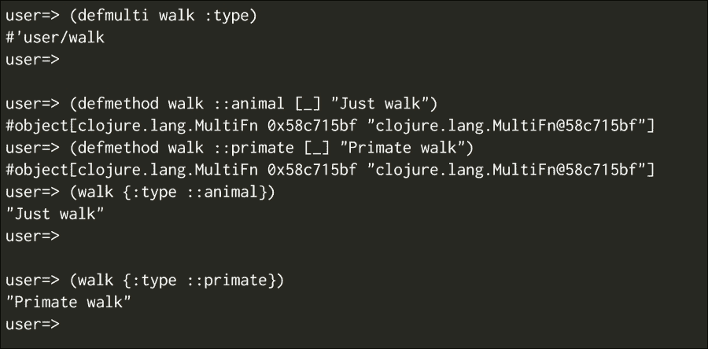

如您所见，它的工作方式正如您所期望的那样。然而，让我们看看如何创建一个关键字层次结构，使其比这更灵活一些。

## 关键字层次结构

您可以声明一个关键字从另一个关键字派生，然后响应其他分派键，为此您可以使用 `derive` 函数：

```java
(derive ::hominid ::primate)
```

### 提示

在定义关键字层次结构时，你必须使用命名空间关键字。

在这里，你声明`::hominid`键是从`::animal`键派生出来的，你现在可以使用`::hominid`作为`::animal`；让我们看看现在的情况：

```java
(walk {:type ::hominid})
;; Primate Walk
```

在定义层次结构时，我们确实会遇到一些问题，例如，如果相同的关键字从两个冲突的关键字派生出来会发生什么？让我们试一试：

```java
(derive ::hominid ::animal)

(walk {:type ::hominid})
;;java.lang.IllegalArgumentException: Multiple methods in multimethod 'walk' match dispatch value: :boot.user/hominid -> :boot.user/animal and :boot.user/primate, and neither is preferred
```

我们得到一个错误，说有两个方法匹配分发值。由于我们的 hominid 既从 animal 派生，又从 primate 派生，它不知道该解析哪个。

我们可以用以下方式明确地解决这个问题：

```java
(prefer-method walk ::hominid ::primate)
(walk {:type ::hominid})
; Primate walk
```

现在，一切工作正常。我们知道在调用带有 hominid 键的 walk 多方法时，我们更喜欢解析为灵长类动物。

你也可以定义一个更具体的方法，仅针对`hominid`键：

```java
(defmethodwalk ::hominid [_] "Walk in two legs")

(walk {:type ::hominid})
;; Walk in two legs
```

派生层次结构可能会变得有些复杂，我们可能需要一些函数来检查关系。Clojure 有以下函数来处理类型层次结构。

+   `isa?`

+   `parents`

+   `descendants`

+   `underive`

### isa?

`isa`函数检查一个类型是否从另一个类型派生，它既与 Java 类一起工作，也与 Clojure 关键字一起工作。

用例子来说明很简单：

```java
(isa? java.util.ArrayListjava.util.List)
;;=> true

(isa? ::hominid ::animal)
;;=> true

(isa? ::animal ::primate)
;;=> false
```

### parents

`parent`函数返回一个类型的父集，它们可能是 Java 或 Clojure 关键字：

```java
(parents java.util.ArrayList)
;;=> #{java.io.Serializablejava.util.Listjava.lang.Cloneablejava.util.RandomAccessjava.util.AbstractList}

(parents ::hominid)
#{:user/primate :user/animal}
```

### descendants

如你所想，`descendants`函数返回`passd`关键字的子集；重要的是要记住，在这种情况下，只允许 Clojure 关键字：

```java
(descendants ::animal)
;;=> #{:boot.user/hominid}
```

### underive

如你所想，`underive`函数打破了两个类型之间的关系，它只与 Clojure 关键字一起工作：

```java
(underive ::hominid ::animal)
;;=> (isa? ::hominid ::animal)
```

这个函数通常在开发时间使用，并且允许你以非常简单和动态的方式玩转你的类型层次结构。

## 按需分发函数

到目前为止，我们使用关键字作为分发函数，但你可以使用任何你喜欢的函数，并且可以传递任意数量的参数。让我们看看一些例子：

```java
(defn dispatch-func [arg1 arg2]
  [arg2 arg1])
```

这是一个简单的函数，但它展示了两个重要的事实：

+   `dispatch`函数可以接收多个参数

+   `dispatch`键可以是任何东西，不仅仅是关键字

让我们看看我们如何使用这个`dispatch`函数：

```java
(defmulti sample-multimethod dispatch-func)
;; Here we are saying that we want to use dispatch-func to calculate the dispatch-key

(defmethod sample-multimethod [:second :first] [first second] [:normal-params first second])
(defmethod sample-multimethod [:first :second] [first second] [:switch-params second first])

(sample-multimethod :first :second)
;;=> [:normal-params :first: second]

(sample-multimethod :second :first)
;; =>[:switch-params :first: second]
```

我们对`dispatch`函数有了更深入的了解；现在你知道你可以实现任何`dispatch`函数，你就可以非常精细地控制哪个函数会被调用以及何时调用。

让我们再看一个例子，这样我们就可以最终完全理解这个概念：

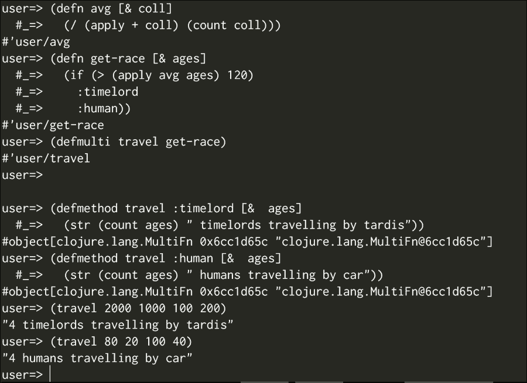

现在，多方法的真正力量变得明显。你现在有一种定义多态函数的临时方法，它有定义类型层次结构和执行自己的逻辑以确定最终要调用的函数的可能性。

# Clojure 中的协议

多方法只是 Clojure 中实现多态性的一个选项，还有其他方法可以实现多态函数。

协议更容易理解，它们可能感觉更类似于 Java 接口。

让我们尝试使用协议定义我们的形状程序：

```java
(defprotocol Shape
  "This is a protocol for shapes"
  (perimeter [this] "Calculates the perimeter of this shape")
  (area [this] "Calculates the area of this shape"))
```

在这里，我们定义了一个协议，它被称为 shaped，并且实现此协议的所有内容都必须实现以下两个函数：`perimeter`和`area`。

实现协议有多种方式；一个有趣的特点是，你甚至可以在没有访问 Java 源代码的情况下，无需重新编译任何内容，将 Java 类扩展为实现协议。

让我们从创建一个实现该类型的记录开始。

## Clojure 中的记录

记录的工作方式与映射完全一样，但如果你坚持使用预定义的键，它们会更快。定义一个记录类似于定义一个类，Clojure 事先知道记录将有哪些字段，因此它可以即时生成字节码，使用记录的代码会更快。

让我们定义一个`Square`记录，如下所示：

```java
(defrecord Square [side]
  Shape
  (perimeter [{:keys [side]}] (* 4 side))
  (area [{:keys [side]}] (* side side)))
```

在这里，我们正在定义`Square`记录，并且它具有以下属性：

+   它只有一个字段，`size`；这将作为一个只有边键的映射来工作。

+   它实现了`Shape`协议

让我们看看如何实例化一个记录以及我们如何使用它：

```java
(Square. 5)
;;=> #user/Square{:size 5}

(def square (Square. 5))

(let [{side :side} square] side)
;;=> 5

(let [{:keys [side]} square] side)
;;=> 5

(doseq [[k v] (Square. 5)] (println k v))
;; :side 5
```

正如你所见，它的工作方式与映射完全一样，你甚至可以将其与事物关联：

```java
(assoc (Square. 5) :hello :world)
```

做这件事的缺点是，我们不再有定义记录字段时拥有的性能保证；尽管如此，这仍然是一种为我们的代码提供一些结构的好方法。

我们仍然需要检查我们如何使用我们的周长和面积函数，这很简单。让我们看看：

```java
(perimeter square)
;;=> 20

(area square)
;;=> 25
```

只是为了继续这个例子，让我们定义`Circle`记录：

```java
(defrecord Circle [radius]
  Shape
  (perimeter [{:keys [radius]}] (* Math/PI 2 radius))
  (area [{:keys [radius]}] (* Math/PI radius radius)))

(def circle (Circle. 5))

(perimeter circle)
;;=> 31.41592653589793

(area circle)
;;=> 78.53981633974483
```

其中一个承诺是我们将能够扩展我们的现有记录和类型，而无需触及当前代码。好吧，让我们遵守这个承诺，并检查如何扩展我们的记录而无需触及现有代码。

假设我们需要添加一个谓词来告诉我们一个形状是否有面积；然后我们可以定义下一个协议，如下所示：

```java
(defprotocolShapeProperties
  (num-sides [this] "How many sides a shape has"))
```

让我们直接进入扩展类型，这将帮助我们为我们的旧协议定义`num-sides`函数。注意，使用`extend-type`，我们甚至可以为现有的 Java 类型定义函数：

```java
(extend-type Square
ShapeProperties
  (num-sides [this] 4))

(extend-type Circle
ShapeProperties
  (num-sides [this] Double/POSITIVE_INFINITY))

(num-sides square)
;;=> 4

(num-sides circle)
;;=> Infinity
```

当你为 Java 类型扩展协议时，协议变得更加有趣。让我们创建一个包括一些列表结构函数的协议：

```java
(defprotocolListOps
  (positive-values [list])
  (negative-values [list])
  (non-zero-values [list]))

(extend-type java.util.List
ListOps
  (positive-values [list]
    (filter #(> % 0) list))
  (negative-values [list]
    (filter #(< % 0) list))
  (non-zero-values [list]
    (filter #(not= % 0) list)))
```

现在你可以使用正数、负数和`non-zero-values`与从`java.util.List`扩展的任何东西一起使用，包括 Clojure 的向量：

```java
(positive-values [-1 0 1])
;;=> (1)

(negative-values [-1 0 1])
;;=> (-1)

(no-zero-values [-1 0 1])
;;=> (-1 1)
```

扩展`java.util.List`可能并不那么令人兴奋，因为你可以将这三个定义为函数，并且它们以相同的方式工作，但你可以用这种机制扩展任何自定义的 Java 类型。

# 摘要

现在我们对 Clojure 的方式有了更好的理解，并且当我们需要多态性时，我们有了更好的把握。我们了解到，当需要多态函数时，我们有几个选项：

+   如果我们需要一个高度定制的分派机制，我们可以实现多方法

+   如果我们需要定义复杂的继承结构，我们可以实现多方法

+   我们可以实现一个协议并定义一个实现该协议的自定义类型

+   我们可以定义一个协议并使用我们的自定义函数扩展现有的 Java 或 Clojure 类型

Clojure 的多态非常强大。它允许您扩展已存在的 Clojure 或 Java 类型的函数；感觉就像向接口添加方法。最好的事情是您不需要重新定义或重新编译任何东西。

在下一章中，我们将讨论并发——Clojure 的关键特性之一。我们将了解身份和值的理念以及这些关键概念如何使编写并发程序变得更容易。

# 第六章. 并发

编程已经发生了变化，在过去，我们只需依赖计算机每年变得更快。这变得越来越困难；因此，硬件制造商正在采取不同的方法。现在，他们正在将更多的处理器嵌入到计算机中。如今，看到只有或四个核心的手机并不罕见。

这需要一种不同的软件编写方式，其中我们能够明确地在其他进程中执行一些任务。现代语言正在努力使这项任务对现代开发者来说可行且更容易，Clojure 也不例外。

在本章中，我们将通过回顾 Clojure 的核心概念和原语来了解 Clojure 如何使您能够编写简单的并发程序；特别是，我们需要理解 Clojure 嵌入到语言中的身份和值的概念。在本章中，我们将涵盖以下主题：

+   使用您的 Java 知识

+   Clojure 的状态和身份模型

+   承诺

+   期货

+   软件事务内存和 refs

+   原子

+   代理

+   验证器

+   观察者

# 使用您的 Java 知识

了解 Java 以及熟悉 Java 的线程 API 给您带来了很大的优势，因为 Clojure 依赖于您已经知道的工具。

在这里，您将了解如何使用线程，并且可以将这里看到的一切扩展到执行其他服务。

在继续之前，让我们创建一个新的项目，我们将将其用作所有测试的沙盒。

如下截图所示创建它：

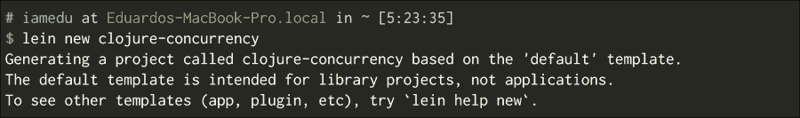

修改`clojure-concurrency.core`命名空间，使其看起来类似于以下代码片段：

```java
(ns clojure-concurrency.core)

(defn start-thread [func]
  (.start (Thread. func)))
```

这里很容易理解正在发生的事情。我们正在创建一个带有我们的函数的线程，然后启动它；这样我们就可以在 REPL 中使用它，如下所示：

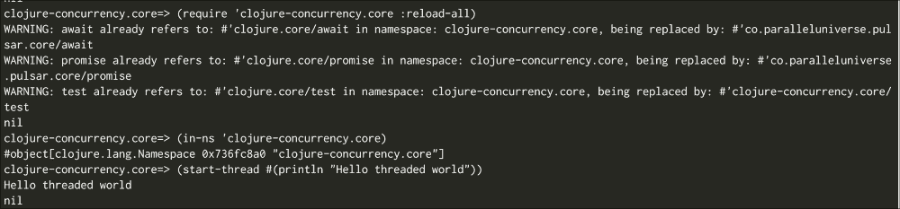

### 小贴士

`java.lang.Thread`有一个构造函数，它接收一个实现可运行接口的对象。您可以直接传递一个 Clojure 函数，因为 Clojure 中的每个函数都实现了可运行和可调用接口。这意味着您也可以在 Clojure 中透明地使用执行器！

我们将看到`nil`和`Hello threaded world`的值以任意顺序出现。`nil`值是启动线程返回的值。

`Hello threaded world`是来自另一个线程的消息。有了这个，我们现在有了了解和理解 Clojure 中线程工作方式的基本工具。

# Clojure 的状态和身份模型

Clojure 对并发有非常强烈的看法，为了以更简单的方式理解它，它重新定义了状态和身份的含义。让我们来探讨 Clojure 中这些概念的含义。

当谈论 Java 中的状态时，你可能想到的是你的 Java 类属性值。Clojure 中的状态与 Java 类似，它指的是对象的值，但有一些非常重要的区别，这允许更简单的并发。

在 Clojure 中，身份是一个可能在时间上具有不同值的实体。考虑以下例子：

+   我有一个身份；我会继续是这一特定个体，我的观点、想法和外观可能会随时间而改变，但我始终是同一个具有相同身份的个体。

+   你有一个银行账户；它有一个特定的号码，由特定的银行运营。你账户中的金额会随时间变化，但它始终是同一个银行账户。

+   考虑一个股票代码（例如 GOOG），它在股市中标识一支股票；与其相关的价值会随时间变化，但其身份不会改变。

**状态**是身份在某个时间点所采取的值。它的一个重要特征是不可变性。状态是身份在某个给定时间点的值的快照。

因此，在先前的例子中：

+   你现在的身份、你的感受、你的外表以及你的想法是你的当前状态

+   你目前在银行账户中的钱是其当前状态

+   GOOG 股票的价值是其当前状态

所有这些状态都是不可变的；无论你明天是谁，无论你赢了多少或花了多少，这个事实都是真实的，并且始终是真实的，即在特定的时刻，你处于某种状态。

### 小贴士

Clojure 的作者 Rich Hickey 是一位出色的演讲者，他有很多演讲，其中解释了 Clojure 背后的思想和哲学。在其中一个演讲（Are We There Yet?）中，他非常详细地解释了状态、身份和时间这个概念。

现在我们来解释 Clojure 中的两个关键概念：

+   **身份**：在你的一生中，你有一个单一的身份；你永远不会停止成为你自己，即使你在整个一生中都在不断变化。

+   **状态**：在生活的任何时刻，你都是一个特定的人，有喜好、厌恶和某些信念。我们称这种在生活某一时刻的存在方式为状态。如果你看生活中的一个特定时刻，你会看到一个固定的值。没有任何事情会改变你在那个时刻的样子。那个特定的状态是不可变的；随着时间的推移，你会有不同的状态或值，但每个状态都是不可变的。

我们利用这一事实来编写更简单的并发程序。每当你想与一个身份进行交互时，你查看它并获取其当前值（一个时间快照），然后使用你所拥有的进行操作。

在命令式编程中，你通常有一个保证你拥有最新的值，但很难保持其一致性状态。原因在于你依赖于共享的可变状态。

共享的可变状态是为什么你需要使用同步代码、锁和互斥锁的原因。它也是复杂程序和难以追踪的 bug 的原因。

现在，Java 正在从其他编程语言中吸取教训，现在它有了允许更简单并发编程的原语。这些想法来自其他语言和新的想法，所以你有一天可能会在其他主流编程语言中看到与这里所学相似的概念。

没有保证你总能获得最新的值，但不用担心，你只需换一种思维方式，并使用 Clojure 提供的并发原语即可。

这与你在现实生活中工作的方式类似，当你为朋友或同事做某事时，你不知道他们具体发生了什么；你与他们交谈，获取当前事实，然后去工作。在你做这件事的时候，有些事情需要改变；在这种情况下，我们需要一个协调机制。

Clojure 有各种这样的协调机制，让我们来看看它们。

# 承诺

如果你是一名全栈 Java 开发者，你很可能在 JavaScript 中遇到过承诺。

承诺是简单的抽象，不会对你提出严格的要求；你可以使用它们在另一个线程、轻量级进程或任何你喜欢的地方计算结果。

在 Java 中，有几种方法可以实现这一点；其中之一是使用未来（`java.util.concurrentFuture`），如果你想得到更类似于 JavaScript 的承诺的实现，有一个叫做**jdeferred**（[`github.com/jdeferred/jdeferred`](https://github.com/jdeferred/jdeferred)）的很好的实现，你可能之前已经使用过。

从本质上讲，承诺只是你可以提供给调用者的一个承诺，调用者可以在任何给定时间使用它。有两种可能性：

+   如果承诺已经得到履行，调用将立即返回

+   如果不是，调用者将阻塞，直到承诺得到履行

让我们看看一个例子；记得使用`clojure-concurrency.core`包中的`start-thread`函数：

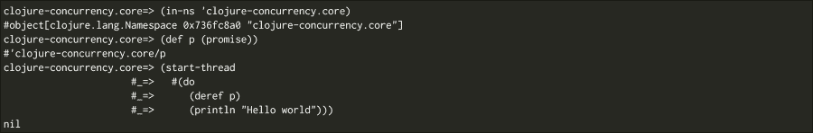

### 小贴士

承诺只计算一次并缓存。所以一旦计算完成，你就可以随意多次使用它们，没有运行时成本！

让我们在这里停下来分析代码，我们正在创建一个名为`p`的承诺，然后我们启动一个线程执行两件事。

它试图从 `p`（`deref` 函数试图从承诺中读取值）获取一个值，然后打印 `Hello world`。

我们现在还看不到 `Hello world` 消息；相反，我们会看到一个 `nil` 值。那是什么原因呢？

启动线程返回 `nil` 值，现在发生的事情正是我们最初描述的；`p` 是承诺，我们的新线程将阻塞它，直到它获得一个值。

为了看到 `Hello world` 消息，我们需要交付承诺。现在让我们这么做：

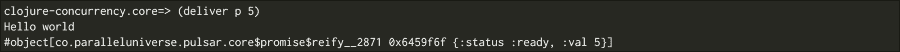

如您所见，我们现在得到了 `Hello world` 消息！

正如我说的，没有必要使用另一个线程。现在让我们在 REPL 中看看另一个例子：

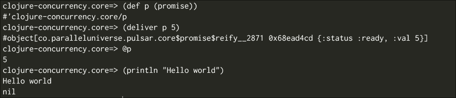

### 小贴士

您可以使用 `@p` 而不是 `deref p`，这对本章中的每个身份也适用。

在这个例子中，我们不会创建单独的线程；我们创建承诺，交付它，然后在同一线程中使用它。

如您所见，承诺是一种极其简单的同步机制，您可以选择是否使用线程、执行器服务（这实际上是线程池）或某些其他机制，例如轻量级线程。

让我们看看 Pulsar 库是如何创建轻量级线程的。

## Pulsar 和轻量级线程

创建线程是一个昂贵的操作，并且它会消耗 RAM 内存。为了知道在 Mac OS X 或 Linux 上创建线程消耗了多少内存，请运行以下命令：

```java
java -XX:+PrintFlagsFinal -version | grep ThreadStackSize

```

您在这里看到的内容将取决于您使用的操作系统和 JVM 版本，在 Mac OS X 上使用 Java 1.8u45，我们得到以下输出：

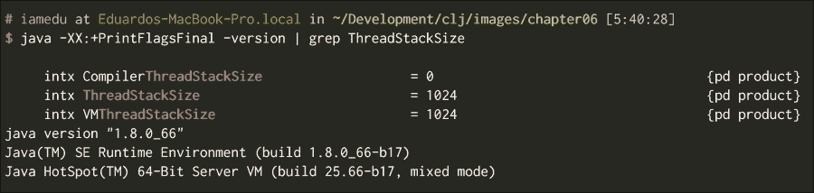

我正在为每个线程获取 1024 千字节的堆栈大小。我们能做些什么来提高这些数字？其他语言，如 Erlang 和 Go，一开始就创建几个线程，然后使用这些线程执行任务。能够挂起特定任务并在同一线程中运行另一个任务变得很重要。

在 Clojure 中有一个名为 **Pulsar** 的库（[`github.com/puniverse/pulsar`](https://github.com/puniverse/pulsar)），它是一个名为 **Quasar** 的 Java API 的接口（[`github.com/puniverse/quasar`](https://github.com/puniverse/quasar)）。

为了支持 Pulsar，从版本 0.6.2 开始，您需要做两件事。

+   将 `[co.paralleluniverse/pulsar "0.6.2"]` 依赖项添加到您的项目中

+   将一个仪器代理添加到您的 JVM 中（在 `project.clj` 中添加 `adding :java-agents [[co.paralleluniverse/quasar-core "0.6.2"]]`）

仪器代理应该能够挂起线程中的函数，然后将其更改为其他函数。最后，您的 `project.clj` 文件应该看起来类似于：

```java
 (defproject clojure-concurrency "0.1.0-SNAPSHOT"
  :description "FIXME: write description"
  :url "http://example.com/FIXME"
  :license {:name "Eclipse Public License"
            :url "http://www.eclipse.org/legal/epl-v10.html"}
            :dependencies [[org.clojure/clojure "1.6.0"]
            [co.paralleluniverse/pulsar "0.6.2"]]
  :java-agents [[co.paralleluniverse/quasar-core "0.6.2"]])
```

让我们用 Pulsar 的轻量级线程（称为 fibers）编写我们的最后一个使用承诺的例子。

Pulsar 在 `co.paralleluniverse.pulsar.core` 包中提供了自己的承诺，并且可以用作 `clojure.core` 中承诺的直接替换：

```java
 (clojure.core/use 'co.paralleluniverse.pulsar.core)
(def p1 (promise))
(def p2 (promise))
(def p3 (promise))
(spawn-fiber #(clojure.core/deliver p2 (clojure.core/+ @p1 5)))
(spawn-fiber #(clojure.core/deliver p3 (clojure.core/+ @p1 @p2)))
(spawn-thread #(println @p3))
(clojure.core/deliver p1 99)
;; 203
```

这个例子更有趣一些，我们使用了 Pulsar 的两个函数：

+   `spawn-fiber`：这个函数创建一个轻量级线程，如果你想在单个程序中创建数千个纤程，你可以这样做。它们创建成本低，只要你小心编程，不应该会有太多问题。

+   `span-thread`：这是 Pulsar 的`start-thread`版本，它创建一个真实线程并运行它。

在这个特定的例子中，我们在两个纤程中计算`p2`和`p3`，然后在线程中计算`p3`。此时，所有东西都在等待我们提供`p1`的值；我们使用`deliver`函数来完成它。

Pulsar 有其他非常有趣的功能，允许更简单的并行编程，如果你感兴趣，请查看文档。在本章的最后部分，我们将探讨`core.async`。Pulsar 有一个基于`core.async`的接口，如果你喜欢，可以使用它。

# 期货

如果你已经使用 Java 一段时间了，你可能知道`java.util.concurrent.Future`类，这是 Clojure 对期货的实现，它与 Java 非常相似，只是稍微简单一些。它的接口和用法几乎与承诺相同，但有一个非常重要的区别，当使用期货时，所有操作都会自动在不同的线程中运行。

让我们看看使用期货的一个简单示例，在任何 REPL 中执行以下操作：

```java
(def f (future (Thread/sleep 20000) "Hello world"))
(println @f)
```

你的 REPL 应该冻结 20 秒，然后打印`Hello world`。

### 提示

期货也是缓存的，所以你只需要为计算成本付费一次，然后你可以根据需要多次使用它们。

初看之下，期货似乎比承诺要简单得多。你不需要担心创建线程或纤程，但这种方法也有其缺点：

+   你的灵活性较低；你只能在预定义的线程池中运行期货。

+   如果你的期货运行时间过长，你需要小心，因为隐含的线程池有可用的线程数量。如果它们都忙碌，一些任务将最终排队等待。

`Futures`有其用例，如果你有非常少的处理器密集型任务，如果你有 I/O 密集型任务，也许使用带有纤程的承诺是个好主意，因为它们允许你保持处理器空闲，以便并发运行更多任务。

# 软件事务内存和 refs

Clojure 最有趣的功能之一是**软件事务内存**（**STM**）。它使用**多版本并发控制**（**MVCC**），其工作方式与数据库非常相似，实现了一种乐观并发控制的形式。

### 注意

MVCC 是数据库用于事务的；这意味着事务内的每个操作都有自己的变量副本。在执行其操作后，它检查在事务期间是否有任何使用的变量发生了变化，如果有，则事务失败。这被称为乐观并发控制，因为我们持乐观态度，我们不锁定任何变量；我们让每个线程做其工作，认为它会正确工作，然后检查它是否正确。在实践中，这允许更高的并发性。

让我们从最明显的例子开始，一个银行账户。

现在让我们编写一些代码，进入 REPL 并输入：

```java
(def account (ref 20000))
(dosync (ref-set account 10))
(deref account)

(defn test []
  (dotimes [n 5]
    (println n @account)
    (Thread/sleep 2000))
  (ref-set account 90))

(future (dosync (test)))
(Thread/sleep 1000)
(dosync (ref-set account 5))
```

尝试同时编写`future`和`dosync`函数，以确保得到相同的结果。

这里只有三行代码，但发生了很多事情。

首先，我们定义一个`ref (account)`；refs 是事务中的管理变量。它们也是我们看到的 Clojure 身份概念的第一个实现。请注意，账户现在是一个身份，它在其生命周期中可能具有多个值。

我们现在修改其值，我们在事务内进行此操作，因为 refs 不能在事务之外修改；因此，`dosync`块。

最后，我们打印账户，我们可以使用(`deref` account)或`@account`，就像我们对承诺和未来所做的那样。

Refs 可以从任何地方读取，不需要它在事务内。

现在我们来看一个更有趣的东西，将下面的代码写入或复制到 REPL 中：

```java
(def account (ref 20000))

(defn test []
  (println "Transaction started")
  (dotimes [n 5]
    (println n @account)
    (Thread/sleep 2000))
  (ref-set account 90))

(future (dosync (test)))
(future (dosync (Thread/sleep 4000) (ref-set account 5)))
```

如果一切顺利，你应该得到一个类似于以下屏幕截图的输出：

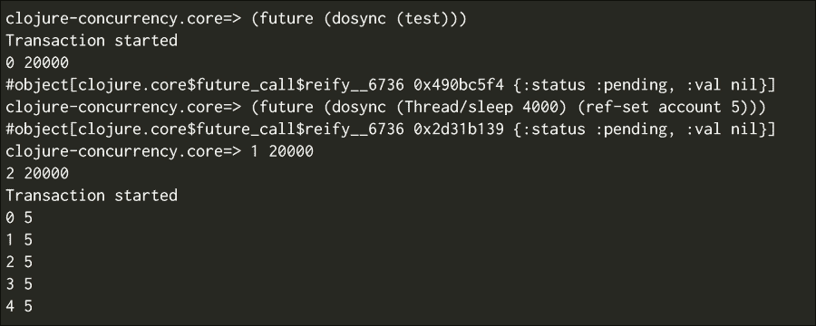

这可能看起来有点奇怪，发生了什么？

第一笔交易使用账户的当前值开始其过程，而另一笔交易在第一笔交易完成之前修改了账户的值；Clojure 意识到这一点，然后重新启动第一笔交易。

### 小贴士

你不应该在事务中执行有副作用的函数，因为没有保证它们只会执行一次。如果你需要做类似的事情，你应该使用代理。

这是事务工作的第一个例子，但使用`ref-set`通常不是一个好主意。

让我们看看另一个例子，将资金从账户*A*转移到账户*B*的经典例子：

```java
(def account-a (ref 10000))
(def account-b (ref 2000))
(def started (clojure.core/promise))

(defn move [acc1 acc2 amount]
  (dosync
    (let [balance1 @acc1
           balance2 @acc2]
      (println "Transaction started")
      (clojure.core/deliver started true)
      (Thread/sleep 5000)
      (when (> balance1 amount)
        (alter acc1 - amount)
        (alter acc2 + amount))
      (println "Transaction finished"))))

(future (move account-a account-b 50))
@started
(dosync (ref-set account-a 20))
```

这是事务工作方式的更好例子；你可能看到类似于以下屏幕截图的内容：

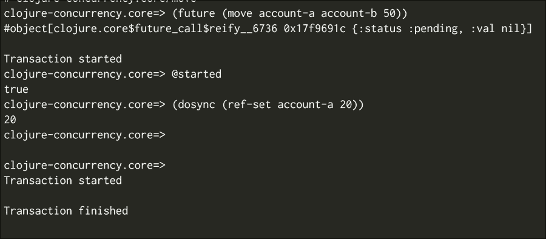

首先，你需要理解`alter`函数的工作方式；它很简单，它接收：

+   需要修改的 ref

+   需要应用的功能

+   额外的参数

因此，这个函数：

```java
(alter ref fun arg1 arg2)
```

转换为类似以下内容：

```java
(ref-set ref (fun @ref arg1 arg2))
```

这是修改当前值的推荐方式。

让我们一步一步地描述一下这里正在发生的事情：

1.  我们定义了两个账户，余额分别为 10000 和 2000。

1.  我们尝试将 500 个单位从第一个账户移动到第二个账户，但首先我们休眠 5 秒钟。

1.  我们通过承诺宣布我们已经开始交易。当前线程继续运行，因为它正在等待已启动的值。

1.  我们将账户-a 的余额设置为 20。

1.  第一笔交易意识到某些东西已经改变并重新启动。

1.  交易正在进行并已在此完成。

1.  没有发生任何事情，因为新的余额不足以移动 50 个单位。

最后，如果你检查余额，比如`[@account-a @account-b]`，你会看到第一个账户有 20，第二个账户有 2000。

有另一个你应该考虑的使用案例；让我们检查以下代码：

```java
(def account (ref 1000))
(def secured (ref false))
(def started (promise))

(defn withdraw [account amount secured]
  (dosync
    (let [secured-value @secured]
      (deliver started true)
      (Thread/sleep 5000)
      (println :started)
      (when-not secured-value
        (alter account - amount))
      (println :finished))))

(future (withdraw account 500 secured))
@started
(dosync (ref-set secured true))
```

想法是，如果`secured`设置为 true，你不应该能够提取任何钱。

如果你运行它并检查`@account`的值，你会发现即使在将`secured`的值更改为 true 之后，仍然发生了提款。为什么会有这种情况？

原因是，交易只检查你在交易中修改的值或你读取的值；在这里，我们在修改之前读取了受保护的值，所以交易没有失败。我们可以通过以下代码让交易更加小心：

```java
 (ensure secured)
;; instead of
@secured

(def account (ref 1000))
(def secured (ref false))
(def started (promise))

(defn withdraw [account amount secured]
  (dosync
    (let [secured-value (ensure secured)]
      (deliver started true)
      (Thread/sleep 5000)
      (println :started)
      (when-not secured-value
        (alter account - amount))
      (println :finished))))

(future (withdraw account 500 secured))
@started
(dosync (ref-set secured true))
```

几乎发生了同样的事情。有什么区别？

有一个细微的差别，第二笔交易必须等到第一笔交易完成后才能完成。如果你仔细观察，你会注意到你无法在另一个交易运行之后修改受保护的值。

这类似于一个锁；虽然不是最好的主意，但在某些情况下很有用。

# 原子

我们现在已经看到了在 Clojure 中如何使用承诺、未来和交易。现在我们将看到原子。

尽管 STM 非常有用且强大，但你会发现实际上它并不常用。

原子是 Clojure 在并发编程中的一个重要工具。

你可以把原子看作是修改单个值的交易。你可能想知道，那有什么好处？想象一下，你有很多事件想要存储在一个单一的向量中。如果你习惯于 Java，你可能知道使用`java.util.ArrayList`包肯定会出问题；因为你几乎肯定会丢失数据。

在那种情况下，你可能想使用`java.util.concurrent`包中的一个类，你如何在 Clojure 中保证没有数据丢失？

这很简单，原子来拯救！让我们尝试以下代码：

```java
(clojure.core/use 'co.paralleluniverse.pulsar.core)
(def events (atom []))
(defn log-events [count event-id]
  (dotimes [_ count]
    (swap! events conj event-id)))
(dotimes [n 5]
  (spawn-fiber #(log-events 500 n)))
```

我们再次使用 Pulsar 及其轻量级线程。在这里，我们定义了一个事件原子和一个`log-events`函数。

`log-events`执行了给定次数的`swap!`。

`Swap!`与它接收到的`alter`函数类似：

+   它应该修改的原子

+   它应用于原子的函数

+   额外的参数

在这种情况下，它给原子提供了来自以下内容的新值：

```java
(conj events event-id)
```

然后，我们创建了五个纤维，每个纤维向事件原子添加 500 个事件。

运行此代码后，我们可以检查每个纤维的事件数量如下：

```java
(count (filter #(= 0 %) @events))
;; 500
(count (filter #(= 1 %) @events))
;; 500
(count (filter #(= 2 %) @events))
;; 500
(count (filter #(= 3 %) @events))
;; 500
(count (filter #(= 4 %) @events))
;; 500
```

如您所见，我们每个纤维有 500 个元素，没有数据丢失，并且使用 Clojure 的默认数据结构。不需要为每个用例使用特殊的数据结构，锁或互斥量。这允许有更高的并发性。

当你修改一个原子时，你需要等待操作完成，这意味着它是同步的。

# 代理

如果你不在乎某些操作的结果？你只需要触发某物然后忘记它。在这种情况下，代理是你需要的。

代理也在单独的线程池中运行，有两个函数可以用来触发代理：

+   `send`：这将在隐式线程池中执行你的函数

+   `send-off`：这试图在一个新线程中执行你的函数，但有一个变化，它将重用另一个线程

如果你想在事务中引起副作用，代理是最佳选择；因为，它们只会在事务成功完成后执行。

它们以非常简单的方式工作，以下是一个示例用法：

```java
(def agt (agent 0))
(defn sum [& nums]
  (Thread/sleep 5000)
  (println :done)
  (apply + nums))
(send agt sum 10) ;; You can replace send with send-off
                  ;; if you want this to be executed in a different thread
@agt
```

如果你复制并粘贴确切的上一段代码，你会看到一个`0`然后是一个`:done`消息，如果你检查`@agt`的值，那么你会看到值`10`。

代理是执行给定任务并在不同线程中修改一些值的良好方式，其语义比未来或手动修改另一个线程中的值更简单。

## 验证器

我们已经看到了主要的并发原语，现在让我们看看一些适用于所有这些的实用工具。

我们可以定义一个验证器来检查某个函数的新值是否可取；你可以为 refs、atoms、agents 甚至 vars 使用它们。

`validator`函数必须接收一个值，如果新值有效则返回`true`，否则返回`false`。

让我们创建一个简单的`validator`来检查新值是否小于`5`：

```java
(def v (atom 0))
(set-validator! v #(< % 5))
(swap! v + 10)

;; IllegalStateException Invalid reference state  clojure.lang.ARef.validate (ARef.java:33)
```

我们遇到了一个异常。原因是新值（`10`）无效。

你可以无问题地添加`4`：

```java
(swap! v + 4)
;; 4
```

小心使用验证器和代理，因为你可能不知道何时发生异常：

```java
(def v (agent 0))
(set-validator! v #(< % 5))
(swap! v + 10)
;; THERE IS NO EXCEPTION
```

## 监视器

与验证器类似，也存在监视器。监视器是当 Clojure 的身份获得新值时执行的函数。一个重要的问题是监视器运行的线程。监视器在监视实体相同的线程中运行（如果你向代理添加监视器，它将在代理的线程中运行），它将在代理代码执行之前运行，所以你应该小心，并使用旧值和新值而不是使用`deref`读取值：

```java
(def v (atom 0))
(add-watch v :sample (fn [k i old-value new-value] (println (= i v) k old-value new-value)))
(reset! v 5)
```

`add-watch`函数接收：

+   应该监视的 ref、atom、agent 或 var

+   将要传递给监视函数的键

+   一个有四个参数的函数：键、引用本身、旧值和新值

执行前面的代码后，我们得到：

```java
true :sample 0 5
```

# core.async

`core.async` 是另一种并发编程的方式；它使用轻量级线程和通道的概念在它们之间进行通信。

## 为什么使用轻量级线程？

轻量级线程被用于像 go 和 Erlang 这样的语言中。它们擅长在单个进程中运行成千上万的线程。

轻量级线程与传统线程之间有什么区别？

传统线程需要预留内存。这也需要一些时间。如果你想要创建几千个线程，你将为每个线程使用相当数量的内存；请求内核这样做也需要时间。

轻量级线程与它们的区别是什么？要拥有几百个轻量级线程，你只需要创建几个线程。不需要预留内存，轻量级线程只是一个软件概念。

这可以通过大多数语言实现，Clojure 通过使用 `core.async` 添加了一级支持（不改变语言本身，这是 Lisp 力量的体现）！让我们看看它是如何工作的。

有两个概念你需要记住：

+   **Goblocks**：它们是轻量级线程。

+   **通道**：通道是 goblocks 之间通信的一种方式，你可以把它们看作是队列。Goblocks 可以向通道发布消息，其他 goblocks 可以从它们那里获取消息。就像有队列的集成模式一样，也有通道的集成模式，你将发现类似广播、过滤和映射的概念。

现在，让我们分别玩一玩它们，这样你可以更好地理解如何为我们的程序使用它们。

## Goblocks

你将在 `clojure.core.async` 命名空间中找到 goblocks。

Goblocks 非常容易使用，你需要 go 宏，然后你会做类似这样的事情：

```java
(ns test
  (:require [clojure.core.async :refer [go]]))

(go
  (println "Running in a goblock!"))
```

它们类似于线程；你只需要记住你可以自由地创建 goblocks。在单个 JVM 中可以有成千上万的运行中的 goblocks。

## 通道

你实际上可以使用任何你喜欢的东西在 goblocks 之间进行通信，但建议你使用通道。

通道有两个主要操作：放置和获取。让我们看看如何做：

```java
 (ns test
  (:require [clojure.core.async :refer [go chan >! <!]]))

(let [c (chan)]
  (go (println (str "The data in the channel is" (<! c))))
  (go (>! c 6)))
```

就这些！！看起来很简单，正如你所见，我们使用通道时主要有三个主要功能：

+   `chan`：这个函数创建一个通道，通道可以在缓冲区中存储一些消息。如果你想使用这个功能，你应该只将缓冲区的大小传递给 `chan` 函数。如果没有指定大小，通道只能存储一条消息。

+   `>!`：put 函数必须在 goblock 中使用；它接收一个通道和你要发布到它的值。如果通道的缓冲区已满，这个函数会阻塞。它将阻塞，直到从通道中消耗掉一些内容。

+   `<!`: 这个取函数；这个函数必须在 goblock 内部使用。它接收你从中取通道。它是阻塞的，如果你在通道中没有发布任何东西，它将停车直到有数据可用。

你可以用很多其他函数与通道一起使用，现在让我们添加两个你可能会很快用到的相关函数：

+   `>!!`: 阻塞 put 操作与`put`函数工作方式完全相同；除了它可以从任何地方使用。注意，如果通道无法接收更多数据，此函数将阻塞从它运行的那个线程。

+   `<!!`: 阻塞工作方式与`take`函数完全相同，除了你可以从任何地方使用它，而不仅仅是 goblocks 内部。只需记住，它会在有数据可用之前阻塞运行它的线程。

如果你查看`core.async` API 文档([`clojure.github.io/core.async/`](http://clojure.github.io/core.async/))，你会找到相当多的函数。

其中一些看起来与给你类似队列功能的函数相似，让我们来看看`broadcast`函数：

```java
(ns test
  (:require [clojure.core.async.lab :refer [broadcast]]
            [clojure.core.async :refer [chan <! >!! go-loop]])

(let [c1 (chan 5)
      c2 (chan 5)
      bc (broadcast c1 c2)]
  (go-loop []
    (println "Getting from the first channel" (<! c1))
    (recur))
  (go-loop []
    (println "Getting from the second channel" (<! C2))
    (recur))
  (>!! bc 5)
  (>!! bc 9))
```

使用这种方式，你可以同时发布到多个通道，如果你想要将多个进程订阅到单个事件源，并且有大量的关注点分离，这会很有帮助。

如果你仔细观察，你也会在那里找到熟悉的函数：`map`、`filter`和`reduce`。

### 备注

根据`core.async`的版本，其中一些函数可能已经不再存在。

为什么这些函数在这里？这些函数是用来修改数据集合的，对吧？

原因是已经投入了大量努力来使用通道作为高级抽象。

想法是将通道视为事件集合，如果你这样想，就很容易看出你可以通过映射旧通道的每个元素来创建一个新的通道，或者你可以通过过滤掉一些元素来创建一个新的通道。

在 Clojure 的最近版本中，通过转换器，抽象变得更加明显。

## 转换器

转换器是一种将计算与输入源分离的方法。简单来说，它们是将一系列步骤应用于序列或通道的方法。

让我们看看一个序列的例子：

```java
(let [odd-counts (comp (map count)
                       (filter odd?))
      vs [[1 2 3 4 5 6]
          [:a :c :d :e]
          [:test]]]
  (sequence odd-counts vs))
```

`comp`感觉与线程宏类似，它组合函数并存储计算的步骤。

有趣的部分是我们可以使用相同的奇数转换与通道，例如：

```java
(let [odd-counts (comp (map count)
                       (filter odd?))
      input (chan)
      output (chan 5 odd-counts)]
  (go-loop []
    (let [x (<! output)]
      (println x))
      (recur))
  (>!! input [1 2 3 4 5 6])
  (>!! input [:a :c :d :e])
  (>!! input [:test]))
```

# 摘要

我们已经检查了核心 Clojure 的并发编程机制，如你所见，它们感觉很自然，并且建立在已经存在的范式之上，如不可变性。最重要的想法是一个身份和值是什么；我们现在知道我们可以有以下的值作为标识符：

+   引用

+   原子

+   代理

我们也可以使用 defer 函数或`@`快捷键获取它们的值快照。

如果我们想要使用一些更原始的东西，我们可以使用 promises 或 futures。

我们也看到了如何使用线程或 Pulsar 的纤维。Clojure 的许多原语并不特定于某种并发机制，因此我们可以使用任何并行编程机制与任何类型的 Clojure 原语一起使用。

# 第七章。Clojure 中的宏

在本章中，我们将了解 Clojure 最复杂的设施之一：宏。我们将学习它们的作用、如何编写它们以及如何使用它们。这可能会有些挑战，但也有一些好消息。你应该意识到一些来自你 Java 语言知识的工具可以帮助你更好地理解宏。我们将通过与其他 JVM 语言的比较逐步进行，最终我们将编写一些宏并理解我们已经在使用它们了。

我们将学习以下主题：

+   理解 Lisp 的基础思想

+   宏作为代码修改工具

+   修改 Groovy 代码

+   编写你的第一个宏

+   调试你的第一个宏

+   宏在现实世界中的应用

# Lisp 的基础思想

Lisp 与你过去所知的大相径庭。根据保罗·格雷厄姆的说法，有九个想法使 Lisp 与众不同（这些想法自 1950 年代后期以来一直存在），它们是：

1.  条件语句（记住，我们谈论的是 1950 年代至 1960 年代）

1.  函数作为一等公民

1.  递归

1.  动态类型

1.  垃圾回收

1.  程序作为表达式序列

1.  符号类型

1.  Lisp 的语法

1.  整个语言始终都在那里：在编译时，在运行时——始终如此！

### 注意

如果可能的话，阅读保罗·格雷厄姆的论文《书呆子的复仇》(*Revenge of the Nerds* ([`www.paulgraham.com/icad.html`](http://www.paulgraham.com/icad.html)))，其中他谈论了 Lisp，它为什么与众不同，以及为什么这种语言很重要。

这些想法即使在 Lisp 时代之后也依然繁荣；其中大部分现在都很常见（你能想象一个没有条件语句的语言吗？）。但最后几个想法正是让我们这些 Lisp 爱好者喜欢其语法的理由（我们将在本章中完全理解它们的含义）。

常见语言正在尝试以略有不同的方法实现相同的目标，而你作为一个 Java 开发者，可能已经看到了这一点。

# 宏作为代码修改工具

宏的第一个也是最常见用途之一是能够修改代码；它们在代码级别上工作，正如你将看到的。我们为什么要这样做呢？让我们通过一些你更熟悉的东西来尝试理解这个问题——Java。

## 修改 Java 代码

你是否曾经使用过 AspectJ 或 Spring AOP？你是否曾经遇到过使用 ASM 或 Javassist 等工具的问题？

你可能已经在 Java 中使用过代码修改。这在 Java EE 应用程序中很常见，但并不明显。（你有没有想过 `@Transactional` 注解在 Java EE 或 Spring 应用程序中做什么？）

作为开发者，我们试图自动化我们能做的一切，那么我们怎么能忽略我们自己的开发工具呢？

我们已经尝试创建在运行时修改字节码的方法，这样我们就不必记得打开和关闭资源，或者我们可以解耦依赖关系并实现依赖注入。

如果你使用 Spring，你可能知道以下用例：

+   `@Transactional` 注解修改注解的方法以确保你的代码被数据库事务包裹

+   `@Autowired` 注解寻找所需的 bean 并将其注入到注解的属性或方法中

+   `@Value` 注解寻找配置值并将其注入

你可能还能想到其他几个修改类工作方式的注解。

这里重要的是你要理解我们为什么要修改代码，你可能已经知道一些实现它的机制，包括 AspectJ 和 Spring AOP。

让我们看看在 Java 世界中是如何实现的；这就是 Java 中一个方面的样子：

```java
package macros.java;

public aspect SampleJavaAspect {
pointcutanyOperation() : execution(public * *.*(..));

    Object around() : anyOperation() {
System.out.println("We are about to execute this " + thisJoinPointStaticPart.getSignature());
       Object ret = proceed();
       return ret;
    }
}
```

Aspect 具有优势，你可以修改任何你喜欢的代码而不必触及它。这也存在一些缺点，因为你可以以原始作者没有预料到的方式修改代码，从而引发错误。

另一个缺点是你有一个极其有限的行动范围；你可以在某些代码周围包装你的修改或在之前或之后执行某些操作。

生成此代码的库非常复杂，它们可以在运行时或编译时创建你的对象的代理或修改字节码。

如你所想，有很多你必须注意的事情，任何事都可能出错。因此，调试可能很复杂。

## 在 Groovy 中修改代码

Groovy 已经走得更远，它为我们提供了更多解决方案和更多类似宏的功能。

自从 Groovy 1.8 以来，我们已经得到了很多 AST 转换。AST 代表什么？它代表**抽象语法树**——听起来很复杂，对吧？

在解释所有这些之前，让我们看看它们中的一些功能。

### `@ToString` 注解

`@ToString` 注解生成一个简单的`toString`方法，其中包含有关对象类及其属性值的信息。

### `@TupleConstructor` 注解

`@TupleConstructor` 创建了一个构造函数，能够一次性接受你类中的所有值。以下是一个示例：

```java
@TupleConstructor
class SampleData {
int size
  String color
boolean big
}

new SampleData(5, "red", false") // We didn't write this constructor
```

### `@Slf4j` 注解

`@Slf4j` 注解将一个名为 log 的日志实例添加到你的类中，默认情况下，你可以这样做：

```java
log.info'hello world'
```

这可以在不手动声明日志实例、类名等的情况下完成。你可以用这种类型的注解做很多事情，但它们是如何工作的呢？

现在，AST 是什么，它与 Clojure 宏有什么关系？想想看，它实际上与它们有很大关系。

要回答最后一个问题，你必须稍微了解一些编译器的工作原理。

我们都知道机器（您的机器、JVM、Erlang BEAM 机器）无法理解人类代码，因此我们需要一个过程将开发者编写的内容转换为机器能理解的内容。

这个过程最重要的步骤之一是创建一个语法树，类似于以下图示：

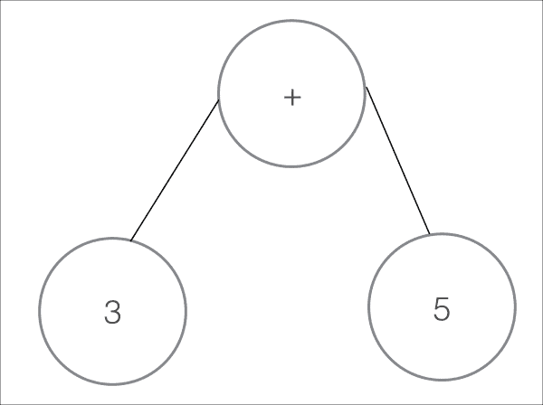

这是以下表达式的一个非常简单的例子：

```java
3 + 5
```

这棵树就是我们所说的抽象语法树。让我们看看一个稍微复杂一点的树的例子，比如下面的这段代码：

```java
if(a > 120) {
  a = a / 5
} else {
  a = 1200 
}
```

因此，这棵树看起来会像以下图示：

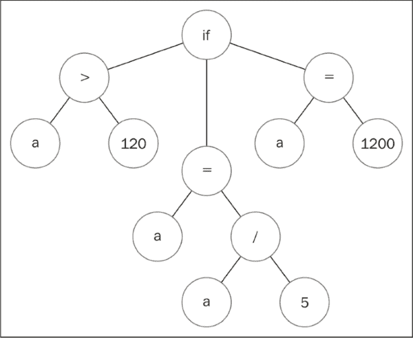

如您所见，这个图示仍然相当直接，您可能能理解如何从这样的结构中执行代码。

Groovy 的 AST 转换是一种干预这种生成代码的方法。

如您所想象，这是一个更强大的方法，但现在您正在与编译器生成的代码打交道；这种可能的缺点是代码的复杂性。

让我们以 `@Slf4j` AST 的代码为例进行检查。它应该相当简单，对吧？它只是添加了一个日志属性：

```java
            private Expression transformMethodCallExpression(Expression exp) {
MethodCallExpressionmce = (MethodCallExpression) exp;
                if (!(mce.getObjectExpression() instanceofVariableExpression)) {
                    return exp;
                }
VariableExpressionvariableExpression = (VariableExpression) mce.getObjectExpression();
                if (!variableExpression.getName().equals(logFieldName)
                        || !(variableExpression.getAccessedVariable() instanceofDynamicVariable)) {
                    return exp;
                }
                String methodName = mce.getMethodAsString();
                if (methodName == null) return exp;
                if (usesSimpleMethodArgumentsOnly(mce)) return exp;

variableExpression.setAccessedVariable(logNode);

                if (!loggingStrategy.isLoggingMethod(methodName)) return exp;

                return loggingStrategy.wrapLoggingMethodCall(variableExpression, methodName, exp);
            }
```

### 注意

您可以在 [`github.com/groovy/groovy-core/blob/master/src/main/org/codehaus/groovy/transform/LogASTTransformation.java`](https://github.com/groovy/groovy-core/blob/master/src/main/org/codehaus/groovy/transform/LogASTTransformation.java) 检查完整的代码，它也包含在本章的代码包中。

这看起来一点也不简单。这只是一个片段，看起来仍然非常复杂。这里发生的事情是，您必须处理 Java 字节码格式和编译器复杂性。

这里，我们应该记住保罗·格雷厄姆关于 Lisp 语法提出的第 8 点。

让我们在 Clojure 中编写最后一个代码示例：

```java
(if (> a 120)
  (/ a 5)
  1200)
```

这段代码有点特别：它感觉非常类似于 AST！这不是巧合。实际上，在 Clojure 和 Lisp 中，您直接编写 AST。这是使 Lisp 成为一个非常简单的语言的特征之一；您直接编写计算机能理解的内容。这可能会帮助您更好地理解代码是数据，数据是代码的原因。

想象一下，如果您能够像修改程序中的任何其他数据结构一样修改 AST 会怎样。但是您可以，这正是宏的作用！

# 编写您的第一个宏

现在您已经清楚地理解了宏的工作原理和它们的作用，让我们开始使用 Clojure 进行操作。

让我给您出一个挑战：在 Clojure 中编写一个 `unless` 函数，它的工作方式如下：

```java
(def a 150)

(my-if (> a 200)
  (println"Bigger than 200")
  (println"Smaller than 200"))
```

让我们试一试；也许可以用以下这样的语法：

```java
(defn my-if [cond positive negative]
  (if cond
    positive
    negative))
```

您知道如果您编写了这段代码然后运行会发生什么吗？如果您测试它，您将得到以下结果：

```java
Bigger than 200
Smaller than 200
Nil
```

这里发生了什么？让我们稍作修改，以便我们得到一个值，我们可以理解正在发生的事情。让我们以不同的方式定义它，并返回一个值，以便我们看到一些不同：

```java
      (def a 500)
(my-if (> a 200)
  (do
    (println"Bigger than 200")
    :bigger)
  (do
    (println"Smaller than 200")
    :smaller))
```

我们将得到以下输出：

```java
Bigger than 200
Smaller than 200
:bigger
```

这里发生了什么？

当你向函数传递参数时，在函数的实际代码运行之前，所有内容都会被评估，所以在这里，在你函数的主体运行之前，你执行了两个`println`方法。之后，`if`运行正确，你得到了`:bigger`，但我们仍然得到了`if`的正负情况输出。看起来我们的代码没有正常工作！

我们该如何解决这个问题？使用我们当前的工具，我们可能需要编写闭包并将`my-if`代码修改为接受函数作为参数：

```java
(defn my-if [cond positive negative]
  (if cond
    (positive)
    (negative)))

      (def a 500)
(my-if (> a 200)
  #(do
    (println"Bigger than 200")
    :bigger)
  #(do
    (println"Smaller than 200")
    :smaller))
```

这可行，但有几个缺点：

+   现在代码有很多限制（两个子句现在都应该作为函数）

+   它不适用于每个单一的情况

+   这非常复杂

为了解决这个问题，Clojure 给了我们宏。让我们看看它们是如何工作的：

```java
(defmacro my-if [test positive negative]
  (list 'if test positive negative))

(my-if (> a 200)
  (do
    (println"Bigger than 200")
    :bigger)
  (do
    (println"Smaller than 200")
    :smaller))
```

输出将是这样的：

```java
;; Bigger than 200
;; :bigger
```

这很棒！它工作了，但发生了什么？为什么我们使用宏，为什么它有效？

### 注意

宏不是正常的 Clojure 函数；它们应该生成代码，并应该返回一个 Clojure 形式。这意味着它们应该返回一个我们可以用作正常 Clojure 代码的列表。

宏返回将在以后执行的代码。这就是保罗·格雷厄姆列表中的第九点发挥作用的地方：你始终拥有整个语言。

在 C++中，你有一个称为宏的机制；当你使用它时，与实际的 C++代码相比，你可以做的非常有限的事情。

在 Clojure 中，你可以按任何你想要的方式操作 Clojure 代码，你在这里也可以使用完整的语言！由于 Clojure 代码是数据，操作代码就像操作任何其他数据结构一样简单。

### 注意

宏在编译时运行，这意味着在运行代码时，没有宏的痕迹；每个宏调用都被替换为生成的代码。

# 调试你的第一个宏

现在，正如你所想象的，由于使用宏时事情可能会变得复杂，应该有一种方法可以调试它们。我们有两个函数来完成这个任务：

+   `macroexpand`

+   `macroexpand-1`

它们之间的区别与递归宏有关。没有规则告诉你你不能从宏中使用宏（整个语言始终都在那里，记得吗？）。如果你想完全遍历任何宏，你可以使用`macroexpand`；如果你想向前迈出一小步，你可以使用`macroexpand-1`。

它们都显示了宏调用生成的代码；这就是当你编译 Clojure 代码时发生的事情。

尝试这个：

```java
(macroexpand-1
'(my-if (> a 200)
    (do
      (println"Bigger than 200")
      :bigger)
    (do
      (println"Smaller than 200")
      :smaller)))

;; (if (> a 200) (do (println"Bigger than 200") :bigger) (do (println"Smaller than 200") :smaller))
```

宏的内容不外乎如此；你现在对它们有了很好的理解。

然而，你将遇到许多常见问题，以及解决这些问题的工具，你应该了解它们。让我们看看。

## 引用、语法引号和 unquote

正如你所见，`my-if`宏在其中使用了 quote：

```java
(defmacro my-if [test positive negative]
  (list 'if test positive negative))
```

这是因为你需要`if`符号作为结果形式的第一个元素。

在宏中，引用非常常见，因为我们需要构建代码而不是即时评估它。

在宏中还有一种非常常见的引用类型——语法引用，它使得编写与最终要生成的代码类似的代码变得更容易。让我们改变我们宏的实现，如下所示：

```java
(defmacro my-if [test positive negative]
  '(if test positive negative))

(macroexpand-1
'(my-if (> a 200)
    (do
      (println"Bigger than 200")
      :bigger)
    (do
      (println"Smaller than 200")
      :smaller)))

;; (if clojure.core/test user/positive user/negative)
```

让我们看看这里会发生什么。首先，`(if test positive negative)`看起来比我们之前使用的`list`函数要漂亮得多，但使用`macroexpand-1`生成的代码看起来相当奇怪。发生了什么？

我们刚刚使用了一种不同的引用形式，它允许我们引用完整的表达式。它做了一些有趣的事情。正如你所见，它将参数更改为完全限定的`var`名称（`clojure.core/test`、`user/positive`、`user/negative`）。这是你将来会感激的事情，但现在你不需要这个。

你需要的是 test、positive 和 negative 的值。你如何在宏中获取它们？

使用语法引号，你可以使用 unquote 操作符来请求对某些内容进行内联评估，如下所示：

```java
(defmacro my-if [test positive negative]
(if ~test ~positive ~negative))
```

让我们再次尝试宏展开并看看我们得到什么：

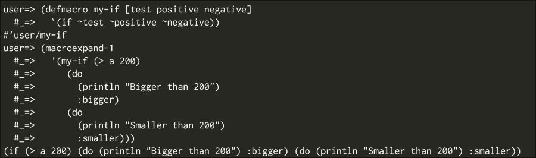

## Unquote splicing

在宏中还有一些其他情况变得很常见。让我们想象我们想要重新实现`>`函数作为宏，并保留比较多个数字的能力；那会是什么样子？

可能的第一次尝试可能如下所示：

```java
(defmacro>-macro [&params]
  '(> ~params))

(macroexpand'(>-macro 5 4 3))
```

上述代码的输出如下：

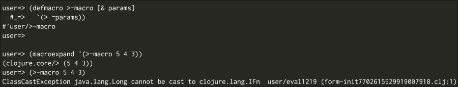

你在这里看到问题了吗？

问题在于我们试图将值列表传递给`clojure.core/>`，而不是传递值本身。

这可以通过一种称为**unquote splicing**的方法轻松解决。Unquote splicing 接受一个向量或参数列表，并像使用函数或宏上的`as`参数一样展开它。

它是这样工作的：

```java
(defmacro>-macro [&params]
  '(> ~@params)) ;; In the end this works as if you had written
                 ;; (> 5 4 3)

(macroexpand'(>-macro 5 4 3))
```

上述代码的输出如下：

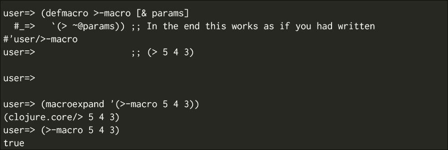

你几乎每次在宏的参数数量可变时都会使用 unquote splicing。

## gensym

生成代码可能会很麻烦，我们最终会发现一些常见问题。

看看你是否能在以下代码中找到问题：

```java
(def a-var"hello world")

(defmacro error-macro [&params]
  '(let [a-var"bye world"]
     (println a-var)))

;; (macroexpand-1 '(error-macro))
;; (clojure.core/let [user/a-var user/"bye user/world"] (clojure.core/println user/a-var))
```

这是在生成代码时常见的问题。你覆盖了另一个值，Clojure 甚至不允许你运行这个，并显示如下截图：

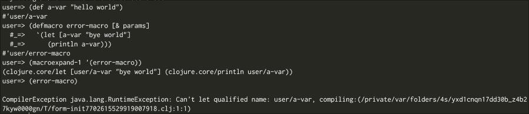

但别担心；还有另一种确保你没有破坏你的环境的方法，那就是`gensym`函数：

```java
(defmacro error-macro [&params]
  (let [a-var-name (gensym'a-var)]
    `(let [~a-var-name "bye world"]
       (println ~a-var-name))))
```

`gensym`函数在宏每次运行时都会创建一个新的`var-name`，这保证了没有其他`var-name`会被它覆盖。如果你现在尝试宏展开，你会得到以下结果：

```java
(clojure.core/let [a-var922"bye world"] (clojure.core/println a-var922))
```

以下截图是前面代码的结果：

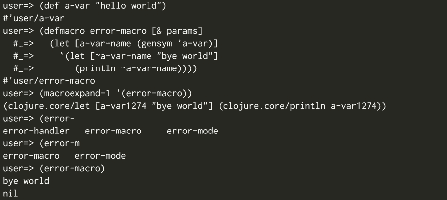

# 现实世界中的宏

你想知道宏被广泛使用的时候吗？想想 `defn`；更重要的是，这样做：

```java
(macroexpand-1 '(defn sample [a] (println a)))

;; (def sample (clojure.core/fn ([a] (println a))))
```

你知道吗，`defn` 是 `clojure.core` 中的一个宏，它创建一个函数并将其绑定到当前命名空间中的 `var` 吗？

Clojure 中充满了宏；如果你想看看一些示例，你可以查看 Clojure 核心，但你可以用宏做什么呢？

让我们看看一些有趣的库：

+   `yesql`: `yesql` 库是代码生成的一个非常有趣的示例。它从 SQL 文件中读取 SQL 代码并相应地生成 Clojure 函数。在 GitHub 上的 `yesql` 项目中查找 `defquery` 和 `defqueries` 宏；这可能会非常有启发性。

+   `core.async`: 如果你熟悉 `go` 语言和 `goroutines`，你可能会希望在 Clojure 语言中也有相同的功能。这并不是必要的，因为你完全可以自己提供它们！`core.async` 库就是 Clojure 中的 `goroutines`，它作为一个库提供（不需要进行神秘的语言更改）。这是一个宏强大功能的绝佳例子。

+   `core.typed`: 使用宏，你甚至可以改变 Lisp 的动态特性。`core.typed` 库是一个允许你为 Clojure 代码定义类型约束的努力；在这里宏被广泛使用以生成样板代码和检查。这可能是更复杂的事情。

# 参考文献

如果你需要进一步参考，你可以查看以下列表。有整本书致力于宏这个主题。我特别推荐两本：

+   掌握 Clojure 宏 ([`pragprog.com/book/cjclojure/`](https://pragprog.com/book/cjclojure/))。

+   Let over Lambda ([`letoverlambda.com/`](http://letoverlambda.com/)).它讨论了常见的 Lisp，但知识非常宝贵。

# 摘要

你现在已经理解了宏的强大功能，并且对它们的工作方式有了非常强的掌握，但当我们谈到宏时，我们只是触及了冰山一角。

在本章中，我们学习了以下内容：

+   宏的工作原理基础

+   在 Groovy 中修改你的代码

+   宏与 Java 世界中其他工具的关系

+   编写你自己的宏

我相信你到目前为止已经享受了使用 Clojure 的过程，并且向前看，我建议你继续阅读和探索这个惊人的语言。
