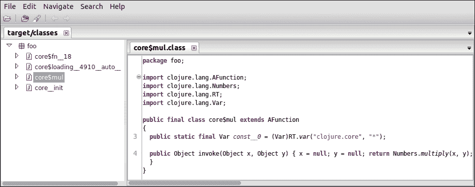
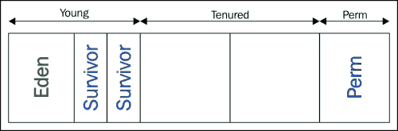
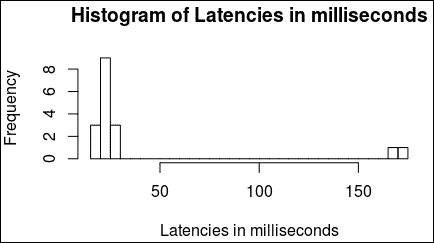
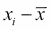
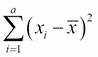
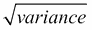
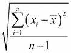
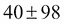
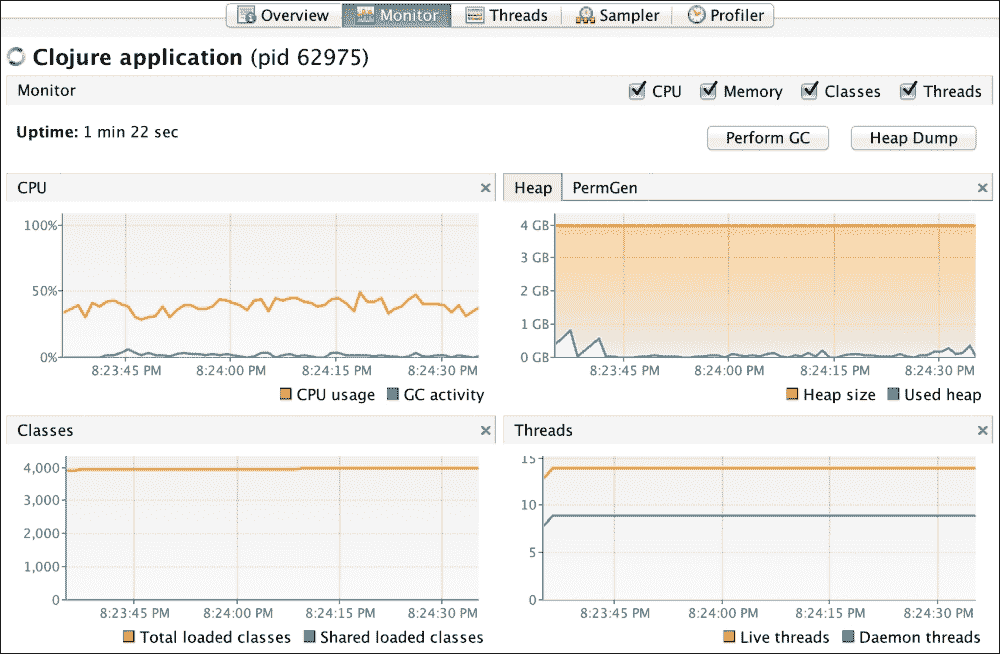

# 第二部分。模块 2

> **《Clojure 高性能编程，第二版》**
> 
> *成为在 Clojure 1.7.0 中编写快速且高性能代码的专家*

# 第一章。设计性能

Clojure 是一种安全、函数式编程语言，它为用户带来了巨大的力量和简洁性。Clojure 也是动态和强类型化的，并且具有非常好的性能特性。自然地，计算机上进行的每一项活动都有相应的成本。构成可接受性能的因素因用例和工作负载而异。在当今世界，性能甚至成为几种类型应用程序的决定性因素。我们将从性能的角度讨论 Clojure（它运行在**JVM**（**Java 虚拟机**）上），以及其运行环境，这正是本书的目标。

Clojure 应用程序的性能取决于各种因素。对于给定的应用程序，理解其用例、设计、实现、算法、资源需求和与硬件的匹配，以及底层软件能力是至关重要的。在本章中，我们将研究性能分析的基础，包括以下内容：

+   通过用例类型对性能预期进行分类

+   概述分析性能的结构化方法

+   一份术语表，通常用于讨论性能方面

+   每个程序员都应该知道的性能数字

# 用例分类

不同类型的用例的性能需求和优先级各不相同。我们需要确定各种类型用例的可接受性能构成。因此，我们将它们分类以识别其性能模型。在细节上，对于任何类型的用例，都没有一成不变的性能秘方，但研究它们的普遍性质肯定是有帮助的。请注意，在现实生活中，本节中列出的用例可能相互重叠。

## 面向用户的软件

面向用户的软件性能与用户的预期紧密相关。差异可能有好几毫秒，对用户来说可能不明显，但与此同时，等待几秒钟以上可能不会受到欢迎。在正常化预期的一个重要元素是通过提供基于持续时间的反馈来吸引用户。处理此类场景的一个好主意是在后台异步启动任务，并从 UI 层轮询它以生成基于持续时间的用户反馈。另一种方法是对用户逐步渲染结果，以平衡预期。

预期并非用户界面性能的唯一因素。常见的技巧，如数据分阶段或预计算，以及其他一般优化技术，可以在很大程度上改善性能方面的用户体验。请记住，所有类型的用户界面都归属于此类用例范畴——网页、移动网页、图形用户界面、命令行、触摸、语音控制、手势……无论你叫它什么。

## 计算和数据处理任务

非平凡的密集型计算任务需要相应数量的计算资源。所有 CPU、缓存、内存、计算算法的效率和并行化都会涉及到性能的确定。当计算与网络分布或从磁盘读取/分阶段到磁盘结合时，I/O 密集型因素就会发挥作用。这类工作负载可以进一步细分为更具体的用例。

### CPU 密集型计算

CPU 密集型计算受限于执行它所花费的 CPU 周期。循环中的算术处理、小矩阵乘法、判断一个数是否为**梅森素数**等，都会被认为是 CPU 密集型工作。如果算法复杂度与迭代/操作次数*N*相关，例如*O(N)*，*O(N²)*等，那么性能取决于*N*的大小以及每一步所需的 CPU 周期数。对于可并行化的算法，可以通过分配多个 CPU 核心给任务来提高此类任务的性能。在虚拟硬件上，如果 CPU 周期是突发性的，性能可能会受到影响。

### 内存密集型任务

内存密集型任务受限于内存的可用性和带宽。例如，大文本处理、列表处理等。例如，在 Clojure 中，如果`coll`是一个由大映射组成的大序列，那么`(reduce f (pmap g coll))`操作将是内存密集型的，即使我们在这里使用`pmap`并行化操作。请注意，当内存成为瓶颈时，更高的 CPU 资源无法帮助，反之亦然。内存不可用可能迫使你一次处理更小的数据块，即使你有足够的 CPU 资源可用。如果你的内存最大速度是*X*，而你的算法在单个核心上以速度*X/3*访问内存，那么你的算法的多核性能不能超过当前性能的三倍，无论你分配多少 CPU 核心给它。内存架构（例如，SMP 和 NUMA）对多核计算机的内存带宽有贡献。与内存相关的性能也受页面错误的影响。

### 缓存密集型任务

当一个任务的速度受可用缓存量限制时，它就是缓存受限的。当一个任务从少量重复的内存位置检索值时，例如一个小矩阵乘法，这些值可能会被缓存并从那里获取。请注意，CPU（通常是）有多个缓存层，当处理的数据适合缓存时，性能将达到最佳，但当数据不适合缓存时，处理仍然会发生，但速度会慢一些。可以使用**缓存无关**算法最大限度地利用缓存。当并发缓存/内存受限线程的数量高于 CPU 核心数时，很可能会在上下文切换时清空指令流水线和缓存，这可能导致性能严重下降。

### 输入/输出边界任务

如果依赖的 I/O 子系统运行得更快，那么**输入/输出**（**I/O**）边界任务会运行得更快。磁盘/存储和网络是数据处理中最常用的 I/O 子系统，但它可以是串行端口、USB 连接的卡片阅读器或任何 I/O 设备。I/O 边界任务可能消耗很少的 CPU 周期。根据设备速度、连接池、数据压缩、异步处理、应用缓存等，可能会有助于性能。I/O 边界任务的一个显著方面是，性能通常取决于等待连接/查找的时间以及我们进行的序列化程度，而与其他资源关系不大。

在实践中，许多数据处理工作负载通常是 CPU 受限、内存受限、缓存受限和 I/O 受限任务的组合。这种混合工作负载的性能实际上取决于在整个操作期间 CPU、缓存、内存和 I/O 资源的均匀分布。只有当某个资源变得过于繁忙，以至于无法为另一个资源让路时，才会出现瓶颈情况。

## 在线事务处理

**在线事务处理**（**OLTP**）系统按需处理业务交易。它们可以位于用户界面 ATM 机、销售点终端、网络连接的票务柜台、ERP 系统等系统之后。OLTP 系统以低延迟、可用性和数据完整性为特征。它们运行日常业务交易。任何中断或故障都可能对销售或服务产生直接和立即的影响。这些系统预计将被设计为具有弹性，而不是从故障中延迟恢复。当性能目标未指定时，您可能希望考虑优雅降级作为策略。

要求 OLTP 系统回答分析查询是一个常见的错误，它们并不是为此优化的。一个有经验的程序员了解系统的能力，并根据需求提出设计更改是可取的。

## 在线分析处理

**在线分析处理**（**OLAP**）系统旨在短时间内回答分析查询。它们通常从 OLTP 操作中获取数据，并且其数据模型针对查询进行了优化。它们基本上提供数据合并（汇总）、钻取和切片切块，以用于分析目的。它们通常使用可以即时优化即席分析查询的特殊数据存储。对于此类数据库来说，提供类似交叉表的功能非常重要。通常，OLAP 立方体用于快速访问分析数据。

将 OLTP 数据输入到 OLAP 系统中可能涉及工作流和多阶段批量处理。这些系统的性能关注点是高效处理大量数据，同时处理不可避免的故障和恢复。

## 批量处理

**批量处理**是指预定义任务的自动化执行。这些通常是批量作业，在非高峰时段执行。批量处理可能涉及一个或多个作业处理阶段。通常，批量处理与工作流自动化结合使用，其中一些工作流步骤是在线执行的。许多批量处理作业处理数据阶段，并为下一阶段的处理准备数据。

批量作业通常针对最佳计算资源利用率进行优化。由于对降低某些特定子任务的延迟需求很少或适中，这些系统倾向于优化吞吐量。许多批量作业涉及大量的 I/O 处理，并且通常分布在集群上。由于分布，处理作业时优先考虑数据局部性；也就是说，数据和处理应该是本地的，以避免在读写数据时的网络延迟。

# 性能的有序方法

实际上，非平凡应用程序的性能很少是巧合或预测的结果。对于许多项目来说，性能不是一种选择（它更是一种必需品），这就是为什么今天这更加重要。容量规划、确定性能目标、性能建模、测量和监控是关键。

调整设计不良的系统以实现性能，如果不说实际上不可能，那么至少比从一开始就设计良好的系统要困难得多。为了达到性能目标，在应用程序设计之前应该知道性能目标。性能目标用延迟、吞吐量、资源利用率和工作负载等术语来表述。这些术语将在本章下一节中讨论。

资源成本可以根据应用场景来识别，例如浏览产品、将产品添加到购物车、结账等。创建代表用户执行各种操作的工作负载配置文件通常是有帮助的。

**性能建模**是检查应用设计是否支持性能目标的一种现实检验。它包括性能目标、应用场景、约束、测量（基准结果）、工作负载目标，如果有的话，还有性能基线。它不是测量和负载测试的替代品，而是使用这些来验证模型。性能模型可能包括性能测试用例，以断言应用场景的性能特征。

将应用程序部署到生产环境中几乎总是需要某种形式的**容量规划**。它必须考虑今天的性能目标和可预见的未来的性能目标。它需要了解应用程序架构，以及外部因素如何转化为内部工作负载。它还需要对系统提供的响应性和服务水平的了解。通常，容量规划在项目早期进行，以减轻配置延迟的风险。

# 性能词汇表

在性能工程中，有几个术语被广泛使用。理解这些术语非常重要，因为它们构成了性能相关讨论的基础。这些术语共同构成了一个性能词汇表。性能通常通过几个参数来衡量，每个参数都有其作用——这样的参数是词汇表的一部分。

## 延迟

**延迟**是指单个工作单元完成任务所需的时间。它并不表示任务的顺利完成。延迟不是集体的，它与特定的任务相关联。如果两个类似的工作`j1`和`j2`分别耗时 3 毫秒和 5 毫秒，它们的延迟将如此处理。如果`j1`和`j2`是不同的任务，这就没有区别。在许多情况下，类似工作的平均延迟被用于性能目标、测量和监控结果。

延迟是衡量系统健康状况的重要指标。高性能系统通常依赖于低延迟。高于正常水平的延迟可能由负载或瓶颈引起。在负载测试期间测量延迟分布很有帮助。例如，如果超过 25%的类似工作，在相似负载下，其延迟显著高于其他工作，那么这可能是值得调查的瓶颈场景的指标。

当一个名为`j1`的任务由名为`j2`、`j3`和`j4`的较小任务组成时，`j1`的延迟不一定是`j2`、`j3`和`j4`各自延迟的总和。如果`j1`的任何子任务与另一个任务并发，`j1`的延迟将小于`j2`、`j3`和`j4`延迟的总和。I/O 受限的任务通常更容易出现更高的延迟。在网络系统中，延迟通常基于往返到另一个主机，包括从源到目的地的延迟，然后返回源。

## Throughput（吞吐量）

**吞吐量**是在单位时间内完成的成功任务或操作的数量。在单位时间内执行的最顶层操作通常属于同一类型，但延迟可能不同。那么，吞吐量告诉我们关于系统的什么信息？它是系统执行的速度。当你进行负载测试时，你可以确定特定系统可以执行的最大速率。然而，这并不能保证结论性的、整体的和最大性能速率。

吞吐量是决定系统可扩展性的因素之一。较高层次任务的吞吐量取决于并行生成多个此类任务的能力，以及这些任务的平均延迟。吞吐量应在负载测试和性能监控期间进行测量，以确定峰值吞吐量和最大持续吞吐量。这些因素有助于系统的规模和性能。

## Bandwidth（带宽）

**带宽**是指通信通道上的原始数据速率，以每秒一定数量的比特来衡量。这包括不仅包括有效载荷，还包括执行通信所需的所有开销。一些例子包括：Kbits/sec，Mbits/sec，等等。大写 B，如 KB/sec 表示字节，即每秒千字节。带宽通常与吞吐量进行比较。虽然带宽是原始容量，但对于同一系统，吞吐量是成功任务完成率，这通常涉及往返。请注意，吞吐量是指涉及延迟的操作。为了在给定的带宽下实现最大吞吐量，通信/协议开销和操作延迟应尽可能小。

对于存储系统（如硬盘、固态硬盘等），衡量性能的主要方式是**IOPS**（每秒输入输出），它是通过传输大小乘以的，表示为每秒字节数，或者进一步表示为 MB/sec，GB/sec 等等。IOPS 通常用于顺序和随机工作负载的读写操作。

将一个系统的吞吐量映射到另一个系统的带宽可能会导致处理两个系统之间的阻抗不匹配。例如，一个订单处理系统可能执行以下任务：

+   与磁盘上的数据库进行交易

+   将结果通过网络发送到外部系统

根据磁盘子系统的带宽、网络的带宽以及订单处理的执行模型，吞吐量可能不仅取决于磁盘子系统和网络的带宽，还取决于它们当前的负载情况。并行性和流水线是增加给定带宽吞吐量的常见方法。

## 基准和基准测试

**性能基准**，或简称为基准，是参考点，包括对已知配置中良好定义和理解的性能参数的测量。基准用于收集我们可能稍后为另一个配置基准测试的相同参数的性能测量。例如，收集“在 50 个并发线程负载下 10 分钟内的吞吐量分布”是我们可以使用作基准和基准测试的这样一个性能参数。基准与硬件、网络、操作系统和 JVM 配置一起记录。

**性能基准测试**，或简称为基准测试，是在各种测试条件下记录性能参数测量的过程。基准测试可以由性能测试套件组成。基准测试可能收集从小到大的数据量，并且可能根据用例、场景和环境特性而持续不同的时间。

基准是某个时间点进行的基准测试的结果。然而，基准与基准无关。

## 性能分析

**性能分析**，或简称为分析，是对程序在运行时执行的分析。程序可能由于各种原因表现不佳。分析器可以分析和找出程序各部分的执行时间。可以在程序中手动放置语句以打印代码块的执行时间，但随着您尝试迭代地改进代码，这会变得非常繁琐。

分析器对开发者非常有帮助。根据分析器的工作原理，主要有三种类型——仪器化、采样和基于事件的。

+   **基于事件的性能分析器**：这些分析器仅适用于选定的语言平台，并在开销和结果之间提供良好的平衡；Java 通过 JVMTI 接口支持基于事件的性能分析。

+   **仪器化分析器**：这些分析器在编译时或运行时修改代码以注入性能计数器。它们本质上是侵入性的，并增加了显著的性能开销。然而，您可以使用仪器化分析器非常选择性地分析代码区域。

+   **采样分析器**：这些分析器在“采样间隔”暂停运行时并收集其状态。通过收集足够的样本，它们可以了解程序大部分时间花在了哪里。例如，在 1 毫秒的采样间隔下，分析器在一秒钟内会收集 1000 个样本。采样分析器也适用于执行速度超过采样间隔的代码（即，代码可能在两次采样事件之间执行几个工作迭代），因为暂停和采样的频率与任何代码的整体执行时间成比例。

分析的目的不仅仅是测量执行时间。有能力的分析器可以提供内存分析、垃圾回收、线程等方面的视图。这些工具的组合有助于找到内存泄漏、垃圾回收问题等。

## 性能优化

简而言之，**优化**是在性能分析之后增强程序资源消耗的过程。性能不佳的程序的症状可以从高延迟、低吞吐量、无响应、不稳定、高内存消耗、高 CPU 消耗等方面观察到。在性能分析期间，一个人可以对程序进行性能分析，以确定瓶颈并通过观察性能参数逐步调整性能。

更好和合适的算法是优化代码的全方面好方法。CPU 密集型代码可以通过计算成本更低的操作进行优化。缓存密集型代码可以尝试使用更少的内存查找来保持良好的命中率。内存密集型代码可以使用自适应内存使用和保守的数据表示来存储在内存中，以进行优化。I/O 密集型代码可以尝试尽可能少地序列化数据，并且操作批处理将使操作更少地聊天，从而提高性能。并行性和分布式是其他，整体上好的提高性能的方法。

## 并发与并行性

我们今天使用的绝大多数计算机硬件和操作系统都提供了并发性。在 x86 架构中，对并发的硬件支持可以追溯到 80286 芯片。**并发**是指在同一台计算机上同时执行多个进程。在较老的处理器中，并发是通过操作系统内核的上下文切换来实现的。当并发部分由硬件并行执行而不是仅仅切换上下文时，这被称为**并行性**。并行性是硬件的特性，尽管软件堆栈必须支持它，你才能在你的程序中利用它。我们必须以并发的方式编写你的程序，以利用硬件的并行性特性。

虽然并发是利用硬件并行性和加快操作的自然方式，但值得记住的是，如果并发显著高于硬件支持的并行度，可能会将任务调度到不同的处理器核心，从而降低分支预测并增加缓存未命中。

在较低级别，使用进程/线程、互斥锁、信号量、锁定、共享内存和进程间通信来实现并发。JVM 对这些并发原语和线程间通信有出色的支持。Clojure 既有低级也有高级并发原语，我们将在并发章节中讨论。

## 资源利用率

**资源利用率**是指应用程序消耗的服务器、网络和存储资源。资源包括 CPU、内存、磁盘 I/O、网络 I/O 等。可以从 CPU 密集型、内存密集型、缓存密集型和 I/O 密集型任务的角度分析应用程序。资源利用率可以通过基准测试和测量特定吞吐量下的利用率来得出。

## 工作负载

**工作负载**是指应用程序需要完成的工作量量化。它包括总用户数、并发活跃用户数、交易量、数据量等。处理工作负载时应考虑负载条件，例如数据库当前持有的数据量、消息队列的填充程度、I/O 任务的积压情况以及更多。

# 每个程序员都应该知道的延迟数字

随着时间的推移，硬件和软件都取得了进步。各种操作的延迟使事情变得有对比性。以下表格展示了 2015 年的延迟数字，经加州大学伯克利分校的 Aurojit Panda 和 Colin Scott 许可复制([`www.eecs.berkeley.edu/~rcs/research/interactive_latency.html`](http://www.eecs.berkeley.edu/~rcs/research/interactive_latency.html))。每个程序员都应该知道的延迟数字如下所示：

| 操作 | 2015 年所需时间 |
| --- | --- |
| L1 缓存引用 | 1ns (纳秒) |
| 分支预测错误 | 3 ns |
| L2 缓存引用 | 4 ns |
| 互斥锁锁定/解锁 | 17 ns |
| 使用 Zippy(Zippy/Snappy: [`code.google.com/p/snappy/`](http://code.google.com/p/snappy/))压缩 1KB | 2μs (1000 ns = 1μs: 微秒) |
| 在商品网络上发送 2000 字节 | 200ns（即 0.2μs） |
| SSD 随机读取 | 16 μs |
| 同一数据中心内的往返 | 500 μs |
| 从 SSD 顺序读取 1,000,000 字节 | 200 μs |
| 磁盘寻道 | 4 ms (1000 μs = 1 ms) |
| 从磁盘顺序读取 1,000,000 字节 | 2 ms |
| 数据包往返 CA 到荷兰 | 150 ms |

前面的表格显示了计算机中的操作及其因操作而产生的延迟。当 CPU 核心在 CPU 寄存器中处理一些数据时，它可能需要几个 CPU 周期（以 3 GHz CPU 为例，每纳秒运行 3000 个周期），但一旦它必须回退到 L1 或 L2 缓存，延迟就会慢数千倍。前面的表格没有显示主内存访问延迟，大约为 100 纳秒（根据访问模式而变化）——大约是 L2 缓存的 25 倍。

# 概述

我们学习了深入思考性能的基础知识。我们了解了常见的性能词汇，以及性能方面可能变化的用例。通过查看不同硬件组件的性能数据，我们得出了性能优势如何达到应用中的结论。在下一章中，我们将深入探讨各种 Clojure 抽象的性能方面。

# 第二章：Clojure 抽象

Clojure 有四个基本理念。首先，它被建立为一个函数式语言。它不是纯函数式（如纯粹函数式），但强调不可变性。其次，它是一种 Lisp 方言；Clojure 足够灵活，用户可以在不等待语言实现者添加新特性和结构的情况下扩展语言。第三，它是为了利用并发来应对新一代挑战而构建的。最后，它被设计为托管语言。截至目前，Clojure 的实现存在于 JVM、CLR、JavaScript、Python、Ruby 和 Scheme 上。Clojure 与宿主语言无缝融合。

Clojure 在抽象方面非常丰富。尽管语法本身非常简洁，但抽象是细粒度的，大多数是可组合的，并且旨在以最简单的方式解决广泛的问题。在本章中，我们将讨论以下主题：

+   非数值标量的性能特性

+   不可变性和纪元时间模型通过隔离铺平了性能的道路

+   持久数据结构和它们的性能特性

+   惰性及其对性能的影响

+   临时数据结构作为高性能、短期逃生通道

+   其他抽象，如尾递归、协议/类型、多方法等

# 非数值标量和内联

Clojure 中的字符串和字符与 Java 中的相同。字符串字面量是隐式内联的。内联是一种只存储唯一值在堆中并在需要的地方共享引用的方法。根据 JVM 供应商和您使用的 Java 版本，内联数据可能存储在字符串池、Permgen、普通堆或堆中标记为内联数据特殊区域。当不使用时，内联数据会像普通对象一样受到垃圾回收。请看以下代码：

```java
user=> (identical? "foo" "foo")  ; literals are automatically interned
true
user=> (identical? (String. "foo") (String. "foo"))  ; created string is not interned
false
user=> (identical? (.intern (String. "foo")) (.intern (String. "foo")))
true
user=> (identical? (str "f" "oo") (str "f" "oo"))  ; str creates string
false
user=> (identical? (str "foo") (str "foo"))  ; str does not create string for 1 arg
true
user=> (identical? (read-string "\"foo\"") (read-string "\"foo\""))  ; not interned
false
user=> (require '[clojure.edn :as edn])  ; introduced in Clojure 1.5
nil
user=> (identical? (edn/read-string "\"foo\"") (edn/read-string "\"foo\""))
false
```

注意，Clojure 中的 `identical?` 与 Java 中的 `==` 是相同的。字符串池化的好处是对于重复的字符串没有内存分配的开销。通常，运行在 JVM 上的应用程序在字符串处理上花费相当多的时间。因此，当有机会同时处理重复字符串时，将它们池化是有意义的。如今，大多数 JVM 实现都有一个非常快的池化操作；然而，如果你使用的是较旧版本，你应该测量 JVM 的开销。

字符串池化的另一个好处是，当你知道两个字符串标记被池化时，你可以使用 `identical?` 比较它们以进行相等性检查，比非池化字符串标记更快。等价函数 `=` 首先检查相同的引用，然后再进行内容检查。

Clojure 中的符号总是包含池化字符串引用，因此从给定字符串生成符号几乎与池化字符串一样快。然而，从同一字符串创建的两个符号不会是相同的：

```java
user=> (identical? (.intern "foo") (.intern "foo"))
true
user=> (identical? (symbol "foo") (symbol "foo"))
false
user=> (identical? (symbol (.intern "foo")) (symbol (.intern "foo")))
false
```

关键字基于其实现建立在符号之上，并设计为与 `identical?` 函数一起用于等价性。因此，使用 `identical?` 比较关键字进行相等性检查会更快，就像与池化字符串标记一样。

Clojure 越来越多地被用于大量数据处理，这包括文本和复合数据结构。在许多情况下，数据要么以 JSON 或 EDN（[`edn-format.org`](http://edn-format.org)）格式存储。在处理此类数据时，你可以通过池化字符串或使用符号/关键字来节省内存。记住，从此类数据中读取的字符串标记不会自动池化，而从 EDN 数据中读取的符号和关键字则会不可避免地池化。当你处理关系型数据库或 NoSQL 数据库、Web 服务、CSV 或 XML 文件、日志解析等情况时，可能会遇到这种情况。

池化与 JVM 的垃圾回收（**GC**）相关联，而垃圾回收又与性能密切相关。当你不池化字符串数据并允许重复存在时，它们最终会在堆上分配。更多的堆使用会导致 GC 开销。池化字符串有一个微小但可测量且即时的性能开销，而 GC 往往是不可预测且不清晰的。在大多数 JVM 实现中，GC 性能并没有像硬件性能提升那样以相似的比例增长。因此，通常，有效的性能取决于防止 GC 成为瓶颈，这在大多数情况下意味着最小化它。

# 身份、值和历法时间模型

Clojure 的一个主要优点是其简单的设计，这导致了可塑性和美丽的可组合性。用符号代替指针是一种存在了几十年的编程实践。它已经在几个命令式语言中得到广泛应用。Clojure 剖析了这个概念，以揭示需要解决的核心问题。以下小节将说明 Clojure 的这一方面。

我们使用逻辑实体来表示值。例如，`30`这个值如果没有与逻辑实体关联，比如`age`，就没有意义。逻辑实体`age`在这里是身份。现在，尽管`age`代表一个值，但这个值可能会随时间改变；这引出了`状态`的概念，它代表某个时间点的身份值。因此，`状态`是时间的函数，并且与我们在程序中执行的操作有因果关系。Clojure 的力量在于将身份与其在特定时间保持为真的值绑定在一起，并且身份与其后来可能代表的任何新值保持隔离。我们将在第五章 *并发* 中讨论状态管理。

## 变量和修改

如果你之前使用过命令式语言（C/C++、Java 等），你可能熟悉变量的概念。**变量**是对内存块的一个引用。当我们更新其值时，我们实际上是在更新存储值的内存位置。变量继续指向存储旧版本值的那个位置。所以，本质上，变量是存储值位置的别名。

一点分析就能揭示变量与读取或修改其值的进程之间有着强烈的联系。每一次修改都是一个状态转换。读取/更新变量的进程应该了解变量的可能状态，以便理解该状态。你在这里看到问题了吗？它混淆了身份和状态！在处理变量时，在时间上引用一个值或状态是不可能的——除非你完全控制访问它的进程，否则值可能会随时改变。可变模型无法容纳导致其状态转换的时间概念。

可变性的问题并不止于此。当你有一个包含可变变量的复合数据结构时，整个数据结构就变得可变了。我们如何在不破坏可能正在观察它的其他进程的情况下修改它？我们如何与并发进程共享这个数据结构？我们如何将这个数据结构用作哈希表中的键？这个数据结构什么也没传达。它的意义可能会随着修改而改变！我们如何将这样的事物发送给另一个进程，而不补偿可能以不同方式修改它的时间？

不可变性是函数式编程的一个重要原则。它不仅简化了编程模型，而且为安全和并发铺平了道路。Clojure 在整个语言中支持不可变性。Clojure 还支持通过并发原语实现快速、面向变动的数据结构以及线程安全的状态管理。我们将在接下来的章节中讨论这些主题。

## 集合类型

Clojure 中有一些集合类型，它们根据其属性进行分类。以下维恩图根据集合是否计数（`counted?` 返回 `true`）、是否关联（`associative?` 返回 `true`）或是否顺序（`sequential?` 返回 `true`）来描述这种分类：


之前的图示展示了不同类型的数据结构所共有的特性。顺序结构允许我们对集合中的项目进行迭代，计数结构的项数可以随时间保持恒定，而关联结构可以通过键来查找相应的值。**CharSequence** 框展示了可以转换为 Clojure 序列的 Java 字符序列类型（使用 `seq charseq`）。

# 持久数据结构

正如我们在上一节中注意到的，Clojure 的数据结构不仅不可变，而且可以在不影响旧版本的情况下产生新值。操作以这种方式产生新值，使得旧值仍然可访问；新版本的产生符合该数据结构的复杂度保证，并且旧版本和新版本都继续满足复杂度保证。这些操作可以递归地应用，并且仍然可以满足复杂度保证。Clojure 提供的这种不可变数据结构被称为 **持久数据结构**。它们是“持久”的，即当创建新版本时，旧版本和新版本在值和复杂度保证方面都“持续”存在。这与数据的存储或持久性无关。对旧版本的更改不会妨碍与新版本一起工作，反之亦然。两个版本都以类似的方式持续存在。

在启发 Clojure 持久数据结构实现的出版物中，其中两种是众所周知的。Chris Okasaki 的 *Purely Functional Data Structures* 对持久数据结构和惰性序列/操作的实施产生了影响。Clojure 的持久队列实现是从 Okasaki 的 *Batched Queues* 中改编的。Phil Bagwell 的 *Ideal Hash Tries*，尽管是为可变和命令式数据结构设计的，但被改编用于实现 Clojure 的持久映射/向量/集合。

## 构建较少使用的数据结构

Clojure 支持列表、向量、集合和映射的知名字面语法。以下列表展示了创建其他数据结构的较少使用的方法：

+   映射 (`PersistentArrayMap` 和 `PersistentHashMap`):

    ```java
    {:a 10 :b 20}  ; array-map up to 8 pairs
    {:a 1 :b 2 :c 3 :d 4 :e 5 :f 6 :g 7 :h 8 :i 9}  ; hash-map for 9 or more pairs
    ```

+   排序映射 (`PersistentTreeMap`):

    ```java
    (sorted-map :a 10 :b 20 :c 30)  ; (keys ..) should return sorted
    ```

+   排序集合 (`PersistentTreeSet`):

    ```java
    (sorted-set :a :b :c)
    ```

+   队列 (`PersistentQueue`):

    ```java
    (import 'clojure.lang.PersistentQueue)
    (reduce conj PersistentQueue/EMPTY [:a :b :c :d])  ; add to queue
    (peek queue)  ; read from queue
    (pop queue)  ; remove from queue
    ```

如您所见，诸如 `TreeMap`（按键排序）、`TreeSet`（按元素排序）和 `Queue` 这样的抽象应该通过调用它们各自的 API 来实例化。

## 复杂度保证

以下表格给出了 Clojure 中各种持久数据结构复杂度保证（使用大 O 符号）的摘要：

| 操作 | 持久列表 | 持久哈希映射 | 持久数组映射 | 持久向量 | 持久队列 | 持久树映射 |
| --- | --- | --- | --- | --- | --- | --- |
| `count` | O(1) | O(1) | O(1) | O(1) | O(1) | O(1) |
| `conj` | O(1) |   |   | O(1) | O(1) |   |
| `first` | O(1) |   |   | O(<7) | O(<7) |   |
| `rest` | O(1) |   |   | O(<7) | O(<7) |   |
| `doseq` | O(n) | O(n) | O(n) | O(n) | O(n) |   |
| `nth` | O(n) |   |   | O(<7) | O(<7) |   |
| `last` | O(n) |   |   | O(n) | O(n) |   |
| `get` |   | O(<7) | O(1) | O(<7) | O(<7) | O(log n) |
| `assoc` |   | O(<7) | O(1) | O(<7) |   | O(log n) |
| `dissoc` |   | O(<7) | O(1) | O(<7) |   | O(log n) |
| `peek` |   |   |   | O(1) | O(1) |   |
| `pop` |   |   |   | O(<7) | O(1) |   |

**列表**是一种顺序数据结构。它为计数和与第一个元素相关的内容提供常数时间访问。例如，`conj` 将元素添加到头部并保证 *O(1)* 复杂度。同样，`first` 和 `rest` 也提供 *O(1)* 保证。其他所有内容都提供 *O(n)* 复杂度保证。

持久哈希映射和向量在底层使用 32 个分支因子的 trie 数据结构。因此，尽管复杂度是 *O(log* *[32]* *n)*，但只有 2³²个哈希码可以放入 trie 节点中。因此，log[32] 2³²，结果是 `6.4` 并且小于 `7`，是最坏情况下的复杂度，可以认为是接近常数时间。随着 trie 的增长，由于结构共享，要复制的部分成比例地变得很小。持久哈希集实现也是基于哈希映射的；因此，哈希集与哈希映射具有相同的特征。在持久向量中，最后一个不完整的节点放置在尾部，这总是可以从根直接访问。这使得使用 `conj` 到末尾的操作是常数时间操作。

持久性树映射和树集基本上是分别按顺序排列的映射和集合。它们的实现使用红黑树，通常比哈希映射和哈希集更昂贵。持久性队列在底层使用持久性向量来添加新元素。从持久性队列中删除一个元素需要从向量中移除头部 `seq`，该向量是从添加新元素的位置创建的。

算法在数据结构上的复杂度并不是其性能的绝对度量。例如，使用哈希表涉及计算 hashCode，这并不包括在复杂度保证中。我们应该根据实际用例来选择数据结构。例如，我们应该在什么情况下使用列表而不是向量？可能是在我们需要顺序或 **后进先出** (**LIFO**) 访问时，或者当为函数调用构造 **抽象语法树** (**AST**) 时。

### O(<7) 表示接近常数时间

你可能知道，**大 O** 表示法用于表达任何算法效率的上限（最坏情况）。变量 *n* 用于表示算法中的元素数量。例如，在一个排序的关联集合上的二分搜索，如排序向量，是对数时间，即 *O(log* *[2]* *n*) 或简单地 *O(log n*) 算法。由于 Java 集合中最多可以有 2³²（技术上由于有符号正整数，为 2³¹）个元素，且 log[2] 2³² 是 32，因此二分搜索在最坏情况下可以是 *O(≤32)*。同样，尽管持久集合的操作是 O(log[32] n)，但在最坏情况下实际上最多是 O(log[32] 2³²)，即 *O(<7)*。请注意，这比对数时间低得多，接近常数时间。这意味着即使在最坏的情况下，持久集合的性能也不是很糟糕。

## 持久数据结构的连接

尽管持久数据结构具有出色的性能特性，但两个持久数据结构的连接一直是一个线性时间 *O(N)* 操作，除了最近的一些发展。截至 Clojure 1.7，`concat` 函数仍然提供线性时间连接。在 **core.rrb-vector** 贡献项目中正在进行对 **Relaxed Radix Balanced** (**RRB**) 树的实验工作 ([`github.com/clojure/core.rrb-vector`](https://github.com/clojure/core.rrb-vector))，这可能提供对数时间 *O(log N)* 连接。对细节感兴趣的读者应参考以下链接：

+   RRB-trees 论文在 [`infoscience.epfl.ch/record/169879/files/RMTrees.pdf`](http://infoscience.epfl.ch/record/169879/files/RMTrees.pdf)

+   Phil Bagwell 的演讲在 [`www.youtube.com/watch?v=K2NYwP90bNs`](http://www.youtube.com/watch?v=K2NYwP90bNs)

+   Tiark Rompf 在 [`skillsmatter.com/podcast/scala/fast-concatenation-immutable-vectors`](http://skillsmatter.com/podcast/scala/fast-concatenation-immutable-vectors) 的演讲

# 序列和惰性

|   | *"一个序列就像一个逻辑游标。" |   |
| --- | --- | --- |
|   | --*Rich Hickey* |

**序列**（通常称为**seqs**）是按顺序消费一系列数据的一种方式。与迭代器类似，它们允许用户从头部开始消费元素，并逐个实现一个元素。然而，与迭代器不同，序列是不可变的。此外，由于序列只是底层数据的视图，它们不会修改数据的存储结构。

使序列与众不同的地方在于，它们本身不是数据结构；相反，它们是对数据流的数据抽象。数据可能由算法或与 I/O 操作连接的数据源产生。例如，`resultset-seq`函数接受一个`java.sql.ResultSet` JDBC 实例作为参数，并以`seq`的形式产生惰性实现的数据行。

Clojure 数据结构可以通过`seq`函数转换为序列。例如，（`seq [:a :b :c :d]`）返回一个序列。对空集合调用`seq`返回 nil。

序列可以通过以下函数进行消费：

+   `first`：这个函数返回序列的头部。

+   `rest`：这个函数返回移除头部后的剩余序列，即使它是空的。

+   `next`：这个函数返回移除头部后的剩余序列或空，如果它是空的。

## 惰性

Clojure 是一种严格的（即“惰性”的对立面）语言，可以在需要时显式地利用惰性。任何人都可以使用`lazy-seq`宏创建一个惰性评估的序列。一些 Clojure 对集合的操作，如`map`、`filter`等，都是有意为之的惰性操作。

**惰性**简单地说，就是值在真正需要时才计算。一旦值被计算，它就会被缓存，以便任何未来的值引用都不需要重新计算。值的缓存称为**记忆化**。惰性和记忆化常常是相辅相成的。

### 数据结构操作中的惰性

惰性和记忆化结合使用，可以形成一个极其有用的组合，以保持函数式算法的单线程性能与其命令式对应物相当。例如，考虑以下 Java 代码：

```java
List<String> titles = getTitles();
int goodCount = 0;
for (String each: titles) {
  String checksum = computeChecksum(each);
  if (verifyOK(checksum)) {
    goodCount++;
  }
}
```

从前面的代码片段中可以看出，它具有线性时间复杂度，即*O(n)*，整个操作都在单次遍历中完成。与之相当的 Clojure 代码如下：

```java
(->> (get-titles)
  (map compute-checksum)
  (filter verify-ok?)
  count)
```

现在，既然我们知道`map`和`filter`是惰性的，我们可以推断 Clojure 版本也具有线性时间复杂度，即*O(n)*，并且在一个遍历中完成任务，没有显著的内存开销。想象一下，如果`map`和`filter`不是惰性的，那么复杂度会是什么？需要多少次遍历？不仅仅是 map 和 filter 各自都只进行了一次遍历，即*O(n)*，每个；在最坏的情况下，它们各自会占用与原始集合一样多的内存，因为需要存储中间结果。

在强调不可变性的函数式语言 Clojure 中，了解惰性和缓存的重要性非常重要。它们是持久数据结构中**摊销**的基础，这涉及到关注复合操作的整体性能，而不是微观分析其中每个操作的性能；操作被调整以在最重要的操作中更快地执行。

另一个重要的细节是，当惰性序列被实现时，数据会被缓存并存储。在 JVM 上，所有以某种方式可达的堆引用都不会被垃圾回收。因此，结果就是，整个数据结构除非你丢失序列的头部，否则会一直保留在内存中。当使用局部绑定处理惰性序列时，确保你不会从任何局部变量中持续引用惰性序列。当编写可能接受惰性序列（s）的函数时，注意任何对惰性`seq`的引用都不应该超出函数执行的寿命，无论是以闭包或其他形式。

### 构建惰性序列

现在我们已经了解了惰性序列是什么，让我们尝试创建一个重试计数器，它应该只返回重试可以执行次数的次数。这在上面的代码中有所展示：

```java
(defn retry? [n]
  (if (<= n 0)
    (cons false (lazy-seq (retry? 0)))
    (cons true (lazy-seq (retry? (dec n))))))
```

`lazy-seq`宏确保栈不被用于递归。我们可以看到这个函数会返回无限值。因此，为了检查它返回的内容，我们应该限制元素的数量，如下面的代码所示：

```java
user=> (take 7 (retry? 5))
(true true true true true false false)
```

现在，让我们尝试以模拟的方式使用它：

```java
(loop [r (retry? 5)]
  (if-not (first r)
    (println "No more retries")
    (do
      (println "Retrying")
      (recur (rest r)))))
```

如预期，输出应该打印`Retrying`五次，然后打印`No more retries`并退出，如下所示：

```java
Retrying
Retrying
Retrying
Retrying
Retrying
No more retries
nil
```

让我们再举一个更简单的例子来构建一个惰性序列，它从指定的数字倒数到零：

```java
(defn count-down [n]
  (if (<= n 0)
    '(0)
    (cons n (lazy-seq (count-down (dec n))))))
```

我们可以如下检查它返回的值：

```java
user=> (count-down 8)
(8 7 6 5 4 3 2 1 0)
```

惰性序列可以无限循环而不会耗尽栈，当与其他惰性操作一起工作时可能会很有用。为了在节省空间和性能之间保持平衡，消费惰性序列会导致元素以 32 的倍数分块。这意味着即使它们是顺序消费的，惰性序列也是以 32 的块大小实现的。

#### 自定义分块

默认的块大小 32 可能不是所有惰性序列的最佳选择——当你需要时可以覆盖分块行为。考虑以下片段（改编自 Kevin Downey 在[`gist.github.com/hiredman/324145`](https://gist.github.com/hiredman/324145)的公开 gist）：

```java
(defn chunked-line-seq
  "Returns the lines of text from rdr as a chunked[size] sequence of strings.
  rdr must implement java.io.BufferedReader."
  [^java.io.BufferedReader rdr size]
  (lazy-seq
    (when-let [line (.readLine rdr)]
      (chunk-cons
        (let [buffer (chunk-buffer size)]
          (chunk-append buffer line)
          (dotimes [i (dec size)]
            (when-let [line (.readLine rdr)]
              (chunk-append buffer line)))
  (chunk buffer))
(chunked-line-seq rdr size)))))
```

根据前面的片段，用户可以传递一个块大小，该大小用于生成惰性序列。较大的块大小在处理大型文本文件时可能很有用，例如在处理 CSV 或日志文件时。你会在片段中注意到以下四个不太为人所知的函数：

+   `clojure.core/chunk-cons`

+   `clojure.core/chunk-buffer`

+   `clojure.core/chunk-append`

+   `clojure.core/chunk`

虽然 `chunk-cons` 是分块序列中 `clojure.core/cons` 的等价物，但 `chunk-buffer` 创建一个可变的分块缓冲区（控制分块大小），`chunk-append` 将一个项目追加到可变分块缓冲区的末尾，而分块将可变分块缓冲区转换为不可变分块。

`clojure.core` 命名空间中列出了与分块序列相关的几个函数，如下所示：

+   `chunk`

+   `chunk-rest`

+   `chunk-cons`

+   `chunk-next`

+   `chunk-first`

+   `chunk-append`

+   `chunked-seq?`

+   `chunk-buffer`

这些函数没有文档说明，所以我鼓励你研究它们的源代码以了解它们的功能，但我建议你不要对未来 Clojure 版本中它们的支持做出任何假设。

#### 宏和闭包

通常，我们定义一个宏，以便将代码参数体转换为闭包并将其委托给函数。请看以下示例：

```java
(defmacro do-something
  [& body]
  `(do-something* (fn [] ~@body)))
```

当使用此类代码时，如果主体将局部变量绑定到惰性序列，它可能比必要的保留时间更长，这可能会对内存消耗和性能产生不良影响。幸运的是，这可以很容易地修复：

```java
(defmacro do-something
  [& body]
  `(do-something* (^:once fn* [] ~@body)))
```

注意 `^:once` 提示和 `fn*` 宏，这使得 Clojure 编译器清除闭包引用，从而避免问题。让我们看看这个例子（来自 Alan Malloy 的 [`groups.google.com/d/msg/clojure/Ys3kEz5c_eE/3St2AbIc3zMJ`](https://groups.google.com/d/msg/clojure/Ys3kEz5c_eE/3St2AbIc3zMJ)）：

```java
user> (let [x (for [n (range)] (make-array Object 10000))
      f (^:once fn* [] (nth x 1e6))]  ; using ^:once
        (f))
#<Object[] [Ljava.lang.Object;@402d3105>
user> (let [x (for [n (range)] (make-array Object 10000))
            f (fn* [] (nth x 1e6))]         ; not using ^:once
        (f))
OutOfMemoryError GC overhead limit exceeded
```

前述条件的体现取决于可用的堆空间。这个问题很难检测，因为它只会引发 `OutOfMemoryError`，这很容易被误解为堆空间问题而不是内存泄漏。作为预防措施，我建议在所有关闭任何可能惰性序列的情况下使用 `^:once` 与 `fn*`。

# 转换器

Clojure 1.7 引入了一个名为转换器的新抽象，用于“可组合的算法转换”，通常用于在集合上应用一系列转换。转换器的想法源于**减少函数**，它接受形式为 (`result, input`) 的参数并返回 `result`。减少函数是我们通常与 `reduce` 一起使用的。**转换器**接受一个减少函数，将其功能包装/组合以提供额外的功能，并返回另一个减少函数。

`clojure.core` 中处理集合的函数已经获得了一个 `arity-1` 变体，它返回一个转换器，即 `map`、`cat`、`mapcat`、`filter`、`remove`、`take`、`take-while`、`take-nth`、`drop`、`drop-while`、`replace`、`partition-by`、`partition-all`、`keep`、`keep-indexed`、`dedupe` 和 `random-sample`。

考虑以下几个示例，它们都做同样的事情：

```java
user=> (reduce ((filter odd?) +) [1 2 3 4 5])
9
user=> (transduce (filter odd?) + [1 2 3 4 5])
9
user=> (defn filter-odd? [xf]
         (fn
           ([] (xf))
           ([result] (xf result))
           ([result input] (if (odd? input)
                               (xf result input)
                               result))))
#'user/filter-odd?
user=> (reduce (filter-odd? +) [1 2 3 4 5])
9
```

在这里，（`filter odd?`）返回一个 transducer——在第一个例子中，transducer 包装了 reducer 函数 `+`，以返回另一个组合的减少函数。虽然我们在第一个例子中使用普通的 `reduce` 函数，但在第二个例子中，我们使用接受 transducer 作为参数的 `transduce` 函数。在第三个例子中，我们编写了一个 transducer `filter-odd?`，它模拟了（`filter odd?`）的行为。让我们看看传统版本和 transducer 版本之间的性能差异：

```java
;; traditional way
user=> (time (dotimes [_ 10000] (reduce + (filter odd? (range 10000)))))
"Elapsed time: 2746.782033 msecs"
nil
;; using transducer
(def fodd? (filter odd?))
user=> (time (dotimes [_ 10000] (transduce fodd? + (range 10000))))
"Elapsed time: 1998.566463 msecs"
nil
```

## 性能特征

transducers 的关键点在于每个转换可以允许多么正交，同时又是高度可组合的。同时，转换可以在整个序列上同步进行，而不是每个操作都产生懒加载的块序列。这通常会导致 transducers 有显著的性能优势。当最终结果太大而无法一次性实现时，懒加载序列仍然会很有用——对于其他用例，transducers 应该能够适当地满足需求并提高性能。由于核心函数已经被彻底改造以与 transducers 一起工作，因此，在大多数情况下，用 transducers 来建模转换是有意义的。

# Transients

在本章早期，我们讨论了不可变性的优点和可变性的陷阱。然而，尽管可变性在本质上是不安全的，但它也具有非常好的单线程性能。现在，如果有一种方法可以限制局部上下文中的可变操作，以提供安全性保证，那将等同于结合性能优势和局部安全性保证。这正是 Clojure 提供的称为 **transients** 的抽象。 

首先，让我们验证它是安全的（仅限于 Clojure 1.6）：

```java
user=> (let [t (transient [:a])]
  @(future (conj! t :b)))
IllegalAccessError Transient used by non-owner thread  clojure.lang.PersistentVector$TransientVector.ensureEditable (PersistentVector.java:463)
```

如前所述，在 Clojure 1.6 之前，一个线程中创建的 transient 不能被另一个线程访问。然而，在 Clojure 1.7 中允许这种操作，以便 transducers 能够与 `core.async` ([`github.com/clojure/core.async`](https://github.com/clojure/core.async)) 库良好地协同工作——开发者应在跨线程的 transient 上保持操作一致性：

```java
user=> (let [t (transient [:a])] (seq t))

IllegalArgumentException Don't know how to create ISeq from: clojure.lang.PersistentVector$TransientVector  clojure.lang.RT.seqFrom (RT.java:505)
```

因此，transients 不能转换为 seqs。因此，它们不能参与新持久数据结构的生成，也不能从执行范围中泄漏出来。考虑以下代码：

```java
(let [t (transient [])]
  (conj! t :a)
  (persistent! t)
  (conj! t :b))
IllegalAccessError Transient used after persistent! call  clojure.lang.PersistentVector$TransientVector.ensureEditable (PersistentVector.java:464)
```

`persistent!` 函数将 `transient` 永久转换为等效的持久数据结构。实际上，transients 只能用于一次性使用。

在`persistent`和`transient`数据结构之间（`transient`和`persistent!`函数）的转换是常数时间，即它是一个*O(1)*操作。可以从未排序的映射、向量和集合中创建瞬态。修改瞬态的函数有：`conj!`、`disj!`、`pop!`、`assoc!`和`dissoc!`。只读操作，如`get`、`nth`、`count`等，在瞬态上按常规工作，但像`contains?`这样的函数以及暗示序列的函数，如`first`、`rest`和`next`，则不行。

## 快速重复

函数`clojure.core/repeatedly`允许我们多次执行一个函数，并产生一个结果序列的懒序列。Peter Taoussanis 在他的开源序列化库**Nippy**（[`github.com/ptaoussanis/nippy`](https://github.com/ptaoussanis/nippy)）中编写了一个瞬态感知的变体，它性能显著更好。它在他的许可下被复制，如下所示（注意，函数的 arity 与`repeatedly`不同）：

```java
(defn repeatedly*
  "Like `repeatedly` but faster and returns given collection type."
  [coll n f]
  (if-not (instance? clojure.lang.IEditableCollection coll)
    (loop [v coll idx 0]
      (if (>= idx n)
        v
        (recur (conj v (f)) (inc idx))))
    (loop [v (transient coll) idx 0]
      (if (>= idx n)
        (persistent! v)
        (recur (conj! v (f)) (inc idx))))))
```

# 性能杂项

除了我们在本章前面看到的重大抽象之外，Clojure 还有一些其他较小但同样非常关键的性能部分，我们将在本节中看到。

## 禁用生产环境中的断言

断言在开发过程中非常有用，可以捕获代码中的逻辑错误，但它们在运行时会产生开销，你可能希望在生产环境中避免。由于`assert`是一个编译时变量，断言可以通过将`assert`绑定到`false`或在使用代码之前使用`alter-var-root`来静默。不幸的是，这两种技术都使用起来很麻烦。Paul Stadig 的名为**assertions**的库（[`github.com/pjstadig/assertions`](https://github.com/pjstadig/assertions)）通过通过命令行参数`-ea`到 Java 运行时启用或禁用断言，帮助解决这个特定用例。

要使用它，你必须将其包含在你的 Leiningen `project.clj`文件中作为依赖项：

```java
:dependencies [;; other dependencies…
                            [pjstadig/assertions "0.1.0"]]
```

你必须使用这个库的`assert`宏而不是 Clojure 自己的，因此应用程序中的每个`ns`块都应该看起来像这样：

```java
(ns example.core

  (:refer-clojure :exclude [assert])

  (:require [pjstadig.assertions :refer [assert]]))
```

在运行应用程序时，你应该将`-ea`参数包含到 JRE 中，以启用断言，而排除它则意味着在运行时不进行断言：

```java
$ JVM_OPTS=-ea lein run -m example.core
$ java -ea -jar example.jar
```

注意，这种用法不会自动避免依赖库中的断言。

## 解构

**解构**是 Clojure 的内置迷你语言之一，并且可以说是开发期间的一个顶级生产力提升器。这个特性导致将值解析以匹配绑定形式的左侧。绑定形式越复杂，需要完成的工作就越多。不出所料，这会有一点性能开销。

通过使用显式函数在紧密循环和其他性能关键代码中展开数据，可以轻松避免这种开销。毕竟，这一切都归结于让程序工作得少，做得多。

## 递归和尾调用优化（TCO）

函数式语言有与递归相关的尾调用优化概念。因此，当递归调用处于尾位置时，它不会占用递归的栈空间。Clojure 支持一种用户辅助的递归调用形式，以确保递归调用不会耗尽栈空间。这有点像命令式循环，但速度极快。

在执行计算时，在紧密循环中使用 `loop-recur` 而不是迭代合成数字可能非常有意义。例如，我们想要将 0 到 1,000,000 之间的所有奇数相加。让我们比较一下代码：

```java
(defn oddsum-1 [n]  ; using iteration
  (->> (range (inc n))
    (filter odd?)
    (reduce +)))
(defn oddsum-2 [n]  ; using loop-recur
  (loop [i 1 s 0]
    (if (> i n)
      s
      (recur (+ i 2) (+ s i)))))
```

当我们运行代码时，我们得到了有趣的结果：

```java
user=> (time (oddsum-1 1000000))
"Elapsed time: 109.314908 msecs"

250000000000
user=> (time (oddsum-2 1000000))
"Elapsed time: 42.18116 msecs"

250000000000
```

`time` 宏作为性能基准工具远非完美，但相对数值表明了一种趋势——在随后的章节中，我们将探讨 *Criterium* 库以进行更科学的基准测试。在这里，我们使用 `loop-recur` 不仅是为了更快地迭代，而且我们还能通过只迭代大约其他示例一半的次数来改变算法本身。

### 迭代提前结束

在对集合进行累积时，在某些情况下，我们可能希望提前结束。在 Clojure 1.5 之前，`loop-recur` 是唯一的方法。当使用 `reduce` 时，我们可以使用 Clojure 1.5 中引入的 `reduced` 函数做到这一点，如下所示：

```java
;; let coll be a collection of numbers
(reduce (fn ([x] x) ([x y] (if (or (zero? x) (zero? y)) (reduced 0) (* x y))))
             coll)
```

在这里，我们乘以集合中的所有数字，并在发现任何数字为零时，立即返回结果零，而不是继续到最后一个元素。

函数 `reduced?` 帮助检测何时返回了已减少（reduced）的值。Clojure 1.7 引入了 `ensure-reduced` 函数，将非减少值装箱为减少值。

## 多方法与协议的比较

**多方法** 是一个针对分派函数返回值的泛型分派（polymorphic dispatch）的出色表达抽象。与多方法关联的分派函数在运行时维护，并在调用多方法时被查找。虽然多方法在确定分派时提供了很多灵活性，但与协议实现相比，性能开销实在太高。

协议（`defprotocol`）在 Clojure 中使用 reify、记录（`defrecord`）和类型（`deftype`、`extend-type`）实现。这是一个大讨论话题——既然我们在讨论性能特性，那么只需说协议实现基于多态类型进行分派，并且比多方法快得多就足够了。协议和类型通常是 API 的实现细节，因此它们通常由函数来呈现。

由于多方法（multimethods）的灵活性，它们仍然有其位置。然而，在性能关键代码中，建议使用协议（protocols）、记录（records）和类型（types）。

## 内联

众所周知，宏在调用位置处内联展开，避免了函数调用。因此，这带来了一点点性能上的好处。还有一个`definline`宏，允许你像写正常宏一样编写一个函数。它创建了一个实际函数，该函数在调用位置处被内联：

```java
(def PI Math/PI)
(definline circumference [radius]
  `(* 2 PI ~radius))
```

### 注意

注意，JVM 也会分析其运行的代码，并在运行时进行自己的代码内联。虽然你可以选择内联热函数，但这种技术已知只能提供适度的性能提升。

当我们定义一个`var`对象时，每次使用它时都会查找其值。当我们使用指向`long`或`double`值的`:const`元数据定义`var`对象时，它从调用位置处内联：

```java
(def ^:const PI Math/PI)
```

当适用时，这已知可以提供相当的性能提升。请看以下示例：

```java
user=> (def a 10)
user=> (def ^:const b 10)
user=> (def ^:dynamic c 10)
user=> (time (dotimes [_ 100000000] (inc a)))
"Elapsed time: 1023.745014 msecs"
nil
user=> (time (dotimes [_ 100000000] (inc b)))
"Elapsed time: 226.732942 msecs"
nil
user=> (time (dotimes [_ 100000000] (inc c)))
"Elapsed time: 1094.527193 msecs"
nil
```

# 摘要

性能是 Clojure 设计的基础之一。Clojure 中的抽象设计用于简单性、强大性和安全性，同时牢记性能。我们看到了各种抽象的性能特征，以及如何根据性能用例做出抽象决策。

在下一章中，我们将看到 Clojure 如何与 Java 互操作，以及我们如何提取 Java 的力量以获得最佳性能。

# 第三章。依赖 Java

由于 Clojure 托管在 JVM 上，Clojure 的几个方面确实有助于理解 Java 语言和平台。这种需求不仅是因为与 Java 的互操作性或理解其实现，还因为性能原因。在某些情况下，Clojure 默认可能不会生成优化的 JVM 字节码；在另一些情况下，你可能希望超越 Clojure 数据结构提供的性能——你可以通过 Clojure 使用 Java 替代方案来获得更好的性能。本章讨论了 Clojure 的这些方面。在本章中，我们将讨论：

+   检查从 Clojure 源生成的 Java 和字节码

+   数值和原始类型

+   与数组一起工作

+   反射和类型提示

# 检查 Clojure 代码的等效 Java 源代码

检查给定 Clojure 代码的等效 Java 源代码可以提供对它可能如何影响性能的深入了解。然而，除非我们将命名空间编译到磁盘上，否则 Clojure 在运行时只生成 Java 字节码。当使用 Leiningen 进行开发时，只有`project.clj`文件中`:aot`向量下的选定命名空间被输出为包含字节码的编译`.class`文件。幸运的是，有一种简单快捷的方法可以知道 Clojure 代码的等效 Java 源代码，那就是通过 AOT 编译命名空间，然后使用 Java 字节码反编译器将字节码反编译成等效的 Java 源代码。

有几个商业和开源的 Java 字节码反编译器可用。我们将在这里讨论的一个开源反编译器是 **JD-GUI**，您可以从其网站下载（[`jd.benow.ca/#jd-gui`](http://jd.benow.ca/#jd-gui)）。请使用适合您操作系统的版本。

## 创建一个新的项目

让我们看看如何从 Clojure 生成等效的 Java 源代码。使用 Leiningen 创建一个新的项目：`lein new foo`。然后编辑 `src/foo/core.clj` 文件，添加一个 `mul` 函数来找出两个数字的乘积：

```java
(ns foo.core)

(defn mul [x y]
  (* x y))
```

## 将 Clojure 源代码编译成 Java 字节码

现在，要将 Clojure 源代码编译成字节码并以 `.class` 文件的形式输出，请运行 `lein compile :all` 命令。它将在项目的 `target/classes` 目录中创建 `.class` 文件，如下所示：

```java
target/classes/
`-- foo
    |-- core$fn__18.class
    |-- core__init.class
    |-- core$loading__4910__auto__.class
    `-- core$mul.class
```

您可以看到 `foo.core` 命名空间已被编译成四个 `.class` 文件。

## 将 .class 文件反编译成 Java 源代码

假设您已经安装了 JD-GUI，反编译 `.class` 文件就像使用 JD-GUI 应用程序打开它们一样简单。



检查 `foo.core/mul` 函数的代码如下：

```java
package foo;

import clojure.lang.AFunction;
import clojure.lang.Numbers;
import clojure.lang.RT;
import clojure.lang.Var;

public final class core$mul extends AFunction
{
  public static final Var const__0 = (Var)RT.var("clojure.core", "*");

  public Object invoke(Object x, Object y) { x = null; y = null; return Numbers.multiply(x, y);
  }
}
```

从反编译的 Java 源代码中很容易理解，foo.core/mul 函数是 foo 包中 core$mul 类的一个实例，它扩展了 clojure.lang.AFunction 类。我们还可以看到，方法调用（Object, Object）中的参数类型是 Object 类型，这意味着数字将被装箱。以类似的方式，您可以反编译任何 Clojure 代码的类文件来检查等效的 Java 代码。如果您能结合对 Java 类型以及可能的反射和装箱的了解，您就可以找到代码中的次优位置，并专注于要改进的地方。

## 不进行局部变量清除的 Clojure 源代码编译

注意方法调用中的 Java 代码，其中说 `x = null; y = null;` ——代码是如何丢弃参数，将它们设置为 null，并实际上将两个 null 对象相乘的呢？这种误导性的反编译是由于局部变量清除引起的，这是 Clojure JVM 字节码实现的一个特性，在 Java 语言中没有等效功能。

从 Clojure 1.4 开始，编译器支持 `:disable-locals-clearing` 键，这是在 `project.clj` 文件中无法配置的 `clojure.core/*compiler-options*` 动态变量。因此，我们无法使用 `lein compile` 命令，但我们可以使用 `lein repl` 命令启动一个 **REPL** 来编译类：

```java
user=> (binding [*compiler-options* {:disable-locals-clearing true}] (compile 'foo.core))
foo.core
```

这将在本节前面看到的相同位置生成类文件，但不会出现 `x = null; y = null;`，因为省略了局部变量清除。

# 数字、装箱和原始类型

**数值**是标量。关于数值的讨论被推迟到本章，唯一的原因是 Clojure 中数值实现的强大 Java 基础。自 1.3 版本以来，Clojure 已经确定使用 64 位数值作为默认值。现在，`long` 和 `double` 是惯用的默认数值类型。请注意，这些是原始 Java 类型，而不是对象。Java 中的原始类型导致高性能，并在编译器和运行时级别具有多个优化。局部原始类型在栈上创建（因此不会对堆分配和 GC 贡献），可以直接访问而无需任何类型的解引用。在 Java 中，也存在数值原始类型的对象等价物，称为 **包装数值**——这些是分配在堆上的常规对象。包装数值也是不可变对象，这意味着不仅 JVM 在读取存储的值时需要解引用，而且在需要创建新值时还需要创建一个新的包装对象。

显然，包装数值比它们的原始等价类型要慢。当使用 `-server` 选项启动 Oracle HotSpot JVM 时，它会积极内联那些包含对原始操作调用的函数（在频繁调用时）。Clojure 在多个级别自动使用 **原始数值**。在 `let` 块、`loop` 块、数组以及算术运算（`+`、`-`、`*`、`/`、`inc`、`dec`、`<`、`<=`、`>`、`>=`）中，会检测并保留原始数值。以下表格描述了原始数值及其包装等价类型：

| 原始数值类型 | 包装等价类型 |
| --- | --- |
| byte（1 字节） | `java.lang.Byte` |
| short（2 字节） | `java.lang.Short` |
| int（4 字节） | `java.lang.Integer` |
| float（4 字节） | `java.lang.Float` |
| long（8 字节） | `java.lang.Long` |
| double（8 字节） | `java.lang.Double` |

在 Clojure 中，有时你可能会发现数值作为包装对象传递或从函数返回，这是由于运行时缺乏类型信息所致。即使你无法控制此类函数，你也可以强制转换值以将其视为原始类型。`byte`、`short`、`int`、`float`、`long` 和 `double` 函数从给定的包装数值值创建原始等价类型。

Lisp 传统之一是提供正确的 ([`en.wikipedia.org/wiki/Numerical_tower`](http://en.wikipedia.org/wiki/Numerical_tower)) 算术实现。当发生溢出或下溢时，低类型不应截断值，而应提升到更高类型以保持正确性。Clojure 遵循此约束，并通过素数 ([`en.wikipedia.org/wiki/Prime_(symbol)`](http://en.wikipedia.org/wiki/Prime_(symbol))) 函数：`+'`、`-'`、`*'`、`inc'` 和 `dec'` 提供自动提升。自动提升以牺牲一些性能为代价提供正确性。

Clojure 中也有任意长度或精度的数值类型，允许我们存储无界数值，但与原始类型相比性能较差。`bigint`和`bigdec`函数允许我们创建任意长度和精度的数值。

如果我们尝试执行任何可能产生超出其最大容量的原始数值的操作，该操作将通过抛出异常来保持正确性。另一方面，当我们使用素数函数时，它们会自动提升以提供正确性。还有另一组称为未检查操作的操作，这些操作不检查溢出或下溢，可能返回不正确的结果。

在某些情况下，它们可能比常规和素数函数更快。这些函数包括`unchecked-add`、`unchecked-subtract`、`unchecked-multiply`、`unchecked-divide`、`unchecked-inc`和`unchecked-dec`。我们还可以通过使用`*unchecked-math*`变量来启用常规算术函数的未检查数学行为；只需在您的源代码文件中包含以下内容：

```java
(set! *unchecked-math* true)
```

在算术中，一个常见的需求是用于在自然数除法后找到商和余数的除法。Clojure 的`/`函数提供有理数除法，产生一个比例，而`mod`函数提供真正的模除法。这些函数比计算除法商和余数的`quot`和`rem`函数要慢。

# 数组

除了对象和原始类型之外，Java 还有一种特殊的集合存储结构类型，称为**数组**。一旦创建，数组在无需复制数据的情况下不能增长或缩小，需要创建另一个数组来存储结果。数组元素在类型上始终是同质的。数组元素类似于可以对其进行修改以保存新值的位置。与列表和向量等集合不同，数组可以包含原始元素，这使得它们成为一种非常快速的存储机制，没有 GC 开销。

数组通常构成可变数据结构的基础。例如，Java 的`java.lang.ArrayList`实现内部使用数组。在 Clojure 中，数组可用于快速数值存储和处理、高效算法等。与集合不同，数组可以有一个或多个维度。因此，您可以在数组中布局数据，如矩阵或立方体。让我们看看 Clojure 对数组的支持：

| 描述 | 示例 | 备注 |
| --- | --- | --- |
| 创建数组 | `(make-array Integer 20)` | 类型为（装箱）整数的数组 |
|   | `(make-array Integer/TYPE 20)` | 基本类型整数的数组 |
|   | `(make-array Long/TYPE 20 10)` | 基本类型长整数的二维数组 |
| 创建原始数组 | `(int-array 20)` | 大小为 20 的原始整数数组 |
|   | `(int-array [10 20 30 40])` | 由向量创建的基本整数数组 |
| 从集合创建数组 | `(to-array [10 20 30 40])` | 可序列的数组 |
|   | `(to-array-2d [[10 20 30][40 50 60]])` | 从集合中创建二维数组 |
| 克隆数组 | `(aclone (to-array [:a :b :c]))` |   |
| 获取数组元素 | `(aget array-object 0 3)` | 获取二维数组中索引 [0][3] 的元素 |
| 修改数组元素 | `(aset array-object 0 3 :foo)` | 在一个二维数组中设置 obj :foo 在索引 [0][3] |
| 修改原始数组元素 | `(aset-int int-array-object 2 6 89)` | 在二维数组中索引 [2][6] 设置值为 89 |
| 获取数组长度 | `(alength array-object)` | `alength` 比 count 快得多 |
| 遍历数组 | `(def a (int-array [10 20 30 40 50 60]))``(seq``(amap a idx ret``(do (println idx (seq ret))``(inc (aget a idx)))))` | 与 map 不同，`amap` 返回一个非惰性数组，在遍历数组元素时速度更快。注意，`amap` 只有在正确类型提示的情况下才更快。有关类型提示，请参阅下一节。 |
| 遍历数组 | `(def a (int-array [10 20 30 40 50 60]))``(areduce a idx ret 0``(do (println idx ret)``(+ ret idx)))` | 与 reduce 不同，`areduce` 在遍历数组元素时速度更快。注意，reduce 只有在正确类型提示的情况下才更快。有关类型提示，请参阅下一节。 |
| 转换为原始数组 | `(ints int-array-object)` | 与类型提示一起使用（见下一节） |

与 `int-array` 和 `ints` 一样，也有其他类型的函数：

| 数组构造函数 | 原始数组转换函数 | 类型提示（不适用于 vars） | 通用数组类型提示 |
| --- | --- | --- | --- |
| boolean-array | booleans | `^booleans` | `^"[Z"` |
| byte-array | bytes | `^bytes` | `^"[B"` |
| short-array | shorts | `^shorts` | `^"[S"` |
| char-array | chars | `^chars` | `^"[C"` |
| int-array | ints | `^ints` | `^"[I"` |
| long-array | longs | `^longs` | `^"[J"` |
| float-array | floats | `^floats` | `^"[F"` |
| double-array | doubles | `^doubles` | `^"[D"` |
| 对象数组 | –– | `^objects` | `^"[Ljava.lang.Object"` |

数组之所以受到青睐，主要是因为性能，有时也因为互操作性。在为数组添加类型提示和使用适当的函数处理它们时，应特别小心。

# 反射和类型提示

有时，由于 Clojure 是动态类型的，Clojure 编译器无法确定要调用某个方法的对象类型。在这种情况下，Clojure 使用 **反射**，这比直接方法分派慢得多。Clojure 的解决方案是称为 **类型提示** 的东西。类型提示是一种用静态类型注解参数和对象的方法，以便 Clojure 编译器可以生成用于高效分派的字节码。

知道在哪里放置类型提示的最简单方法是打开代码中的反射警告。考虑以下确定字符串长度的代码：

```java
user=> (set! *warn-on-reflection* true)
true
user=> (def s "Hello, there")
#'user/s
user=> (.length s)
Reflection warning, NO_SOURCE_PATH:1 - reference to field length can't be resolved.
12
user=> (defn str-len [^String s] (.length s))
#'user/str-len
user=> (str-len s)
12
user=> (.length ^String s)  ; type hint when passing argument
12
user=> (def ^String t "Hello, there")  ; type hint at var level
#'user/t
user=> (.length t)  ; no more reflection warning
12
user=> (time (dotimes [_ 1000000] (.length s)))
Reflection warning, /private/var/folders/cv/myzdv_vd675g4l7y92jx9bm5lflvxq/T/form-init6904047906685577265.clj:1:28 - reference to field length can't be resolved.
"Elapsed time: 2409.155848 msecs"
nil
user=> (time (dotimes [_ 1000000] (.length t)))
"Elapsed time: 12.991328 msecs"
nil
```

在前面的代码片段中，我们可以清楚地看到，使用反射的代码与不使用反射的代码在性能上有很大的差异。在处理项目时，你可能希望所有文件都开启反射警告。在 Leiningen 中可以轻松实现。只需在你的 `project.clj` 文件中添加以下条目：

```java
:profiles {:dev {:global-vars {*warn-on-reflection* true}}}
```

这将在你通过 Leiningen 在开发工作流程中开始任何类型的调用时自动开启反射警告，例如 REPL 和测试。

## 原始类型数组

回忆一下上一节中关于 `amap` 和 `areduce` 的例子。如果我们开启反射警告运行它们，我们会收到警告说它们使用了反射。让我们给它们添加类型提示：

```java
(def a (int-array [10 20 30 40 50 60]))
;; amap example
(seq
 (amap ^ints a idx ret
    (do (println idx (seq ret))
      (inc (aget ^ints a idx)))))
;; areduce example
(areduce ^ints a idx ret 0
  (do (println idx ret)
    (+ ret idx)))
```

注意，原始数组提示 `^ints` 在变量级别上不起作用。因此，如果你定义了变量 `a`，如下所示，它将不起作用：

```java
(def ^ints a (int-array [10 20 30 40 50 60]))  ; wrong, will complain later
(def ^"[I" a (int-array [10 20 30 40 50 60]))  ; correct
(def ^{:tag 'ints} a (int-array [10 20 30 40 50 60])) ; correct
```

这个符号表示整数数组。其他原始数组类型有类似的类型提示。请参考前面的章节了解各种原始数组类型的类型提示。

## 基本类型

原始局部变量的类型提示既不是必需的，也不允许。然而，你可以将函数参数作为原始类型进行类型提示。Clojure 允许在函数中最多有四个参数可以进行类型提示：

```java
(defn do-something
  [^long a ^long b ^long c ^long d]
  ..)
```

### 注意

封装箱可能会导致某些情况下的对象不是基本类型。在这种情况下，你可以使用相应的原始类型强制转换它们。

## 宏和元数据

在宏中，类型提示的工作方式与其他代码部分不同。由于宏是关于转换**抽象语法树**（**AST**），我们需要有一个心理图来表示转换，并且我们应该在代码中添加类型提示作为元数据。例如，如果 `str-len` 是一个用于查找字符串长度的宏，我们使用以下代码：

```java
(defmacro str-len
  [s]
  `(.length ~(with-meta s {:tag String})))
;; below is another way to write the same macro
(defmacro str-len
  [s]
  `(.length ~(vary-meta s assoc :tag `String)))
```

在前面的代码中，我们通过将类型 `String` 标记到符号 `s` 上来改变其元数据，在这种情况下，它恰好是 `java.lang.String` 类。对于数组类型，我们可以使用 `[Ljava.lang.String` 来表示字符串对象的数组，以及其他类似情况。如果你尝试使用之前列出的 `str-len`，你可能会注意到这仅在将字符串绑定到本地变量或变量时才有效，而不是作为字符串字面量。为了减轻这种情况，我们可以将宏编写如下：

```java
(defmacro str-len
  [s]
  `(let [^String s# ~s] (.length s#)))
```

在这里，我们将参数绑定到一个带有类型提示的 gensym 本地变量上，因此在对它调用 `.length` 时不会使用反射，并且不会发出任何反射警告。

通过元数据进行的类型提示也适用于函数，尽管符号不同：

```java
(defn foo [] "Hello")
(defn foo ^String [] "Hello")
(defn foo (^String [] "Hello") (^String [x] (str "Hello, " x)))
```

除了前面代码片段中的第一个例子外，它们都被类型提示为返回 `java.lang.String` 类型。

### 字符串连接

Clojure 中的`str`函数用于连接和转换为字符串标记。在 Java 中，当我们编写`"hello" + e`时，Java 编译器将其转换为使用`StringBuilder`的等效代码，在微基准测试中比`str`函数快得多。为了获得接近 Java 的性能，在 Clojure 中我们可以使用一个类似的机制，通过宏直接使用 Java 互操作来避免通过`str`函数的间接操作。**Stringer** ([`github.com/kumarshantanu/stringer`](https://github.com/kumarshantanu/stringer))库采用了相同的技巧，在 Clojure 中实现快速字符串连接：

```java
(require '[stringer.core :as s])
user=> (time (dotimes [_ 10000000] (str "foo" :bar 707 nil 'baz)))
"Elapsed time: 2044.284333 msecs"
nil
user=> (time (dotimes [_ 10000000] (s/strcat "foo" :bar 707 nil 'baz)))
"Elapsed time: 555.843271 msecs"
nil
```

这里，Stringer 在编译阶段也积极地连接了字面量。

## 杂项

在类型（如`deftype`）中，可变实例变量可以可选地注解为`^:volatile-mutable`或`^:unsynchronized-mutable`。例如：

```java
(deftype Counter [^:volatile-mutable ^long now]
  ..)
```

与`defprotocol`不同，`definterface`宏允许我们为方法提供返回类型提示：

```java
(definterface Foo
  (^long doSomething [^long a ^double b]))
```

`proxy-super`宏（在`proxy`宏内部使用）是一个特殊情况，你不能直接应用类型提示。原因是它依赖于`proxy`宏自动创建的隐式`this`对象。在这种情况下，你必须显式地将`this`绑定到一个类型：

```java
(proxy [Object][]
  (equals [other]
    (let [^Object this this]
      (proxy-super equals other))))
```

类型提示对于 Clojure 的性能非常重要。幸运的是，我们只需要在需要时进行类型提示，而且很容易找出何时需要。在许多情况下，类型提示带来的收益会超过代码内联的收益。

# 使用数组/数值库以提高效率

你可能已经注意到在前面的章节中，当处理数值时，性能很大程度上取决于数据是否基于数组和原始类型。为了实现最佳效率，程序员可能需要在计算的各个阶段都非常细致地将数据正确地强制转换为原始类型和数组。幸运的是，Clojure 社区的高性能爱好者们很早就意识到了这个问题，并创建了一些专门的开源库来减轻这个问题。

## HipHip

**HipHip**是一个 Clojure 库，用于处理原始类型数组。它提供了一个安全网，即它严格只接受原始数组参数来工作。因此，静默传递装箱的原始数组作为参数总是会导致异常。HipHip 宏和函数很少需要在操作期间进行类型提示。它支持原始类型的数组，如`int`、`long`、`float`和`double`。

HipHip 项目可在[`github.com/Prismatic/hiphip`](https://github.com/Prismatic/hiphip)找到。

在撰写本文时，HipHip 的最新版本是 0.2.0，支持 Clojure 1.5.x 或更高版本，并标记为 Alpha 版本。HipHip 为所有四种原始数据类型的数组提供了一套标准的操作：整数数组操作在命名空间 `hiphip.int` 中；双精度数组操作在 `hiphip.double` 中；等等。所有操作都为相应类型提供了类型提示。在相应命名空间中，`int`、`long`、`float` 和 `double` 的所有操作基本上是相同的，除了数组类型：

| 类别 | 函数/宏 | 描述 |
| --- | --- | --- |
| 核心函数 | `aclone` | 类似于 `clojure.core/aclone`，用于原始数据类型 |
|   | `alength` | 类似于 `clojure.core/alength`，用于原始数据类型 |
|   | `aget` | 类似于 `clojure.core/aget`，用于原始数据类型 |
|   | `aset` | 类似于 `clojure.core/aset`，用于原始数据类型 |
|   | `ainc` | 将数组元素按指定值增加 |
| 等价的 hiphip.array 操作 | `amake` | 创建新数组并用表达式计算出的值填充 |
|   | `areduce` | 类似于 `clojure.core/areduce`，带有 HipHip 数组绑定 |
|   | `doarr` | 类似于 `clojure.core/doseq`，带有 HipHip 数组绑定 |
|   | `amap` | 类似于 `clojure.core/for`，创建新数组 |
|   | `afill!` | 类似于前面的 `amap`，但覆盖数组参数 |
| 数学运算 | `asum` | 使用表达式计算数组元素的总和 |
|   | `aproduct` | 使用表达式计算数组元素乘积 |
|   | `amean` | 计算数组元素的平均值 |
|   | `dot-product` | 计算两个数组的点积 |
| 查找最小/最大值，排序 | `amax-index` | 在数组中找到最大值并返回索引 |
|   | `amax` | 在数组中找到最大值并返回它 |
|   | `amin-index` | 在数组中找到最小值并返回索引 |
|   | `amin` | 在数组中找到最小值并返回它 |
|   | `apartition!` | 数组的三向划分：小于、等于、大于枢轴 |
|   | `aselect!` | 将最小的 `k` 个元素收集到数组的开头 |
|   | `asort!` | 使用 Java 内置实现就地排序数组 |
|   | `asort-max!` | 部分就地排序，将前 `k` 个元素收集到末尾 |
|   | `asort-min!` | 部分就地排序，将最小的 `k` 个元素收集到顶部 |
|   | `apartition-indices!` | 类似于 `apartition!`，但修改索引数组而不是值 |
|   | `aselect-indices!` | 类似于 `aselect!`，但修改索引数组而不是值 |
|   | `asort-indices!` | 类似于 `asort!`，但修改索引数组而不是值 |
|   | `amax-indices` | 获取索引数组；最后 `k` 个索引指向最大的 `k` 个值 |
|   | `amin-indices` | 获取索引数组；前 `k` 个索引指向最小的 `k` 个值 |

要在 Leiningen 项目中包含 HipHip 作为依赖项，请在 `project.clj` 中指定：

```java
:dependencies [;; other dependencies
               [prismatic/hiphip "0.2.0"]]
```

以下是如何使用 HipHip 的一个示例，让我们看看如何计算数组的归一化值：

```java
(require '[hiphip.double :as hd])

(def xs (double-array [12.3 23.4 34.5 45.6 56.7 67.8]))

(let [s (hd/asum xs)] (hd/amap [x xs] (/ x s)))
```

除非我们确保 `xs` 是原始双精度浮点数数组，否则 HipHip 在类型不正确时会抛出 `ClassCastException`，在其他情况下会抛出 `IllegalArgumentException`。我建议您探索 HipHip 项目，以获得更深入的使用见解。

## 基础数学运算

我们可以将 `*warn-on-reflection*` 设置为 true，让 Clojure 在调用边界处使用反射时警告我们。然而，当 Clojure 必须隐式使用反射进行数学运算时，唯一的办法是使用分析器或将 Clojure 源代码编译成字节码，然后使用反编译器分析装箱和反射。这就是 `primitive-math` 库发挥作用的地方，它通过产生额外的警告和抛出异常来帮助。

`primitive-math` 库可在 [`github.com/ztellman/primitive-math`](https://github.com/ztellman/primitive-math) 找到。

截至撰写本文时，`primitive-math` 的版本为 0.1.4；您可以通过编辑 `project.clj` 文件将其作为依赖项包含到您的 Leiningen 项目中，具体方法如下：

```java
:dependencies [;; other dependencies
               [primitive-math "0.1.4"]]
```

以下是如何使用它的代码示例（回想一下 *将 .class 文件反编译成 Java 源代码* 部分的示例）：

```java
;; must enable reflection warnings for extra warnings from primitive-math
(set! *warn-on-reflection* true)
(require '[primitive-math :as pm])
(defn mul [x y] (pm/* x y))  ; primitive-math produces reflection warning
(mul 10.3 2)                        ; throws exception
(defn mul [^long x ^long y] (pm/* x y))  ; no warning after type hinting
(mul 10.3 2)  ; returns 20
```

虽然 `primitive-math` 是一个有用的库，但它解决的问题大多已由 Clojure 1.7 的装箱检测功能处理（参见下一节 *检测装箱数学*）。然而，如果您无法使用 Clojure 1.7 或更高版本，此库仍然很有用。

### 检测装箱数学

**装箱数学**难以检测，是性能问题的来源。Clojure 1.7 引入了一种方法，当发生装箱数学时警告用户。这可以通过以下方式进行配置：

```java
(set! *unchecked-math* :warn-on-boxed)

(defn sum-till [n] (/ (* n (inc n)) 2))  ; causes warning
Boxed math warning, /private/var/folders/cv/myzdv_vd675g4l7y92jx9bm5lflvxq/T/form-init3701519533014890866.clj:1:28 - call: public static java.lang.Number clojure.lang.Numbers.unchecked_inc(java.lang.Object).
Boxed math warning, /private/var/folders/cv/myzdv_vd675g4l7y92jx9bm5lflvxq/T/form-init3701519533014890866.clj:1:23 - call: public static java.lang.Number clojure.lang.Numbers.unchecked_multiply(java.lang.Object,java.lang.Object).
Boxed math warning, /private/var/folders/cv/myzdv_vd675g4l7y92jx9bm5lflvxq/T/form-init3701519533014890866.clj:1:20 - call: public static java.lang.Number clojure.lang.Numbers.divide(java.lang.Object,long).

;; now we define again with type hint
(defn sum-till [^long n] (/ (* n (inc n)) 2))
```

当使用 Leiningen 时，您可以通过在 `project.clj` 文件中添加以下条目来启用装箱数学警告：

```java
:global-vars {*unchecked-math* :warn-on-boxed}
```

`primitive-math` 中的数学运算（如 HipHip）是通过宏实现的。因此，它们不能用作高阶函数，并且因此可能与其他代码组合不佳。我建议您探索该项目，看看哪些适合您的程序用例。采用 Clojure 1.7 通过装箱警告功能消除了装箱发现问题。

# 依赖 Java 和本地代码

在少数情况下，由于 Clojure 缺乏命令式、基于栈的、可变变量，这可能导致代码的性能不如 Java，我们可能需要评估替代方案以提高其性能。我建议您考虑直接用 Java 编写此类代码以获得更好的性能。

另一个考虑因素是使用原生操作系统功能，例如内存映射缓冲区（[`docs.oracle.com/javase/7/docs/api/java/nio/MappedByteBuffer.html`](http://docs.oracle.com/javase/7/docs/api/java/nio/MappedByteBuffer.html)）或文件和不受保护的操作（[`highlyscalable.wordpress.com/2012/02/02/direct-memory-access-in-java/`](http://highlyscalable.wordpress.com/2012/02/02/direct-memory-access-in-java/)）。请注意，不受保护的操作可能具有潜在风险，通常不建议使用。这些时刻也是考虑将性能关键代码用 C 或 C++ 编写，然后通过 **Java 本地接口**（**JNI**）访问它们的时机。

## Proteus – Clojure 中的可变局部变量

Proteus 是一个开源的 Clojure 库，允许您将局部变量视为局部变量，从而使其在局部作用域内仅允许非同步修改。请注意，此库依赖于 Clojure 1.5.1 的内部实现结构。**Proteus** 项目可在 [`github.com/ztellman/proteus`](https://github.com/ztellman/proteus) 找到。

您可以通过编辑 `project.clj` 将 Proteus 包含为 Leiningen 项目的依赖项：

```java
:dependencies [;;other dependencies
               [proteus "0.1.4"]]
```

在代码中使用 Proteus 很简单，如下面的代码片段所示：

```java
(require '[proteus :as p])
(p/let-mutable [a 10]
  (println a)
  (set! a 20)
  (println a))
;; Output below:
;; 10
;; 20
```

由于 Proteus 只允许在局部作用域中进行可变操作，以下代码会抛出异常：

```java
(p/let-mutable [a 10 add2! (fn [x] (set! x (+ 2 x)))]
  (add2! a)
  (println a))
```

可变局部变量非常快，在紧密循环中可能非常有用。Proteus 在 Clojure 习惯用法上是非传统的，但它可能在不编写 Java 代码的情况下提供所需的性能提升。

# 摘要

由于 Clojure 具有强大的 Java 互操作性和基础，程序员可以利用接近 Java 的性能优势。对于性能关键代码，有时有必要了解 Clojure 如何与 Java 交互以及如何调整正确的旋钮。数值是一个需要 Java 互操作以获得最佳性能的关键领域。类型提示是另一个重要的性能技巧，通常非常有用。有几个开源的 Clojure 库使程序员更容易进行此类活动。

在下一章中，我们将深入探讨 Java 之下，看看硬件和 JVM 堆栈如何在我们获得性能中发挥关键作用，它们的限制是什么，以及如何利用对这些理解的使用来获得更好的性能。

# 第四章。主机性能

在前面的章节中，我们注意到了 Clojure 与 Java 的互操作性。在本章中，我们将更深入地探讨，以更好地理解内部结构。我们将触及整个堆栈的几个层次，但我们的主要焦点将是 JVM，特别是 Oracle HotSpot JVM，尽管有多个 JVM 供应商可供选择（[`en.wikipedia.org/wiki/List_of_Java_virtual_machines`](http://en.wikipedia.org/wiki/List_of_Java_virtual_machines)）。在撰写本文时，Oracle JDK 1.8 是最新的稳定版本，早期 OpenJDK 1.9 构建也已可用。在本章中，我们将讨论：

+   从性能角度来看，硬件子系统是如何工作的

+   JVM 内部结构的组织以及它与性能的关系

+   如何测量堆中各种对象占用的空间量

+   使用 Criterium 对 Clojure 代码进行延迟分析

# 硬件

有各种硬件组件可能会以不同的方式影响软件的性能。处理器、缓存、内存子系统、I/O 子系统等，根据用例的不同，都有不同程度的影响。在接下来的章节中，我们将探讨这些方面的每一个。

## 处理器

自 1980 年代末以来，微处理器一直采用流水线和指令级并行性来提高其性能。在 CPU 级别处理指令通常包括四个周期：**取指令**、**解码**、**执行**和**写回**。现代处理器通过并行运行这些周期来优化它们——当一条指令正在执行时，下一条指令正在被解码，再下一条正在被取，依此类推。这种风格被称为**指令流水线**。

实际上，为了进一步加快执行速度，阶段被细分为许多更短的阶段，从而导致了更深的超级流水线架构。流水线中最长阶段的长度限制了 CPU 的时钟速度。通过将阶段细分为子阶段，处理器可以以更高的时钟速度运行，每个指令需要更多的周期，但处理器仍然在每个周期内完成一条指令。由于现在每秒有更多的周期，尽管每个指令的延迟现在更高，但我们仍然在每秒吞吐量方面获得了更好的性能。

### 分支预测

即使处理器遇到条件`if-then`形式的指令，也必须提前取指令和解码。考虑一个 Clojure 表达式(`if (test a) (foo a) (bar a)`)的等价物。处理器必须选择一个分支来取指令和解码，问题是它应该取`if`分支还是`else`分支？在这里，处理器对要取/解码的指令进行猜测。如果猜测是正确的，就像往常一样，这是一个性能提升；否则，处理器必须丢弃取/解码过程的结果，并从另一个分支重新开始。

处理器使用片上分支预测表来处理分支预测。它包含最近的代码分支和每个分支两个比特，指示分支是否被采取，同时也容纳了单次未采取的情况。

今天，分支预测对于处理器的性能至关重要，因此现代处理器专门分配硬件资源和特殊的预测指令来提高预测准确性并降低误预测的代价。

### 指令调度

高延迟指令和分支通常会导致指令流水线中的空周期，称为**停顿**或**气泡**。这些周期通常通过指令重排来完成其他工作。指令重排通过乱序执行在硬件级别实现，通过编译时指令调度（也称为**静态指令调度**）在编译器级别实现。

处理器在执行乱序执行时需要记住指令之间的依赖关系。这种成本可以通过使用重命名寄存器来在一定程度上减轻，其中寄存器值存储到/从内存位置加载，可能在不同物理寄存器上，这样它们可以并行执行。这需要乱序处理器始终维护指令及其使用的寄存器的映射，这使得它们的设计复杂且功耗大。除了一些例外，今天几乎所有高性能 CPU 都具有乱序设计。

良好的编译器通常对处理器有极高的了解，并且能够通过重新排列处理器指令来优化代码，从而在处理器指令流水线中减少气泡。一些高性能 CPU 仍然只依赖于静态指令重排而不是乱序指令重排，从而节省芯片面积——节省的面积用于容纳额外的缓存或 CPU 核心。低功耗处理器，如 ARM 和 Atom 系列，使用顺序设计。与大多数 CPU 不同，现代 GPU 使用具有深流水线的顺序设计，这通过非常快的上下文切换得到补偿。这导致 GPU 具有高延迟和高吞吐量。

### 线程和核心

通过上下文切换、硬件线程和核心实现并发性和并行性在当今非常普遍，并且我们已经将它们视为实现我们程序的规范。然而，我们应该理解为什么我们最初需要这样的设计。我们今天编写的绝大多数现实世界代码在指令级并行性方面没有超过适度范围。即使基于硬件的乱序执行和静态指令重排，每个周期也真正并行执行的指令不超过两个。因此，另一个潜在的指令来源是除了当前运行的程序之外的程序，这些程序可以被流水线和并行执行。

管道中的空闲周期可以被分配给其他正在运行的程序，这些程序假设还有其他当前正在运行且需要处理器注意力的程序。**同时多线程**（**SMT**）是一种硬件设计，它使得这种并行成为可能。英特尔在其某些处理器中实现了名为**HyperThreading**的 SMT。虽然 SMT 将单个物理处理器呈现为两个或更多逻辑处理器，但真正的多处理器系统每个处理器执行一个线程，从而实现同时执行。多核处理器每个芯片包含两个或更多处理器，但具有多处理器系统的特性。

通常，多核处理器的性能显著优于 SMT 处理器。SMT 处理器的性能可能会根据使用案例而变化。在代码高度可变或线程不竞争相同硬件资源的情况下，性能达到峰值，而当线程在相同处理器上缓存绑定时，性能则会下降。同样重要的是，有些程序本身并不是天生并行的。在这种情况下，如果没有在程序中显式使用线程，可能很难使它们运行得更快。

## 内存系统

理解内存性能特性对于了解我们编写的程序可能产生的影响非常重要。数据密集型且天生并行的程序，如音频/视频处理和科学计算，主要受限于内存带宽，而不是处理器。除非增加内存带宽，否则增加处理器不会使它们更快。考虑另一类程序，如 3D 图形渲染或主要受限于内存延迟但不是内存带宽的数据库系统。SMT 对于这类程序非常适用，在这些程序中，线程不竞争相同的硬件资源。

内存访问大致占处理器执行的所有指令的四分之一。代码块通常以内存加载指令开始，其余部分取决于加载的数据。这会导致指令停滞，并防止大规模的指令级并行。更糟糕的是，即使是超标量处理器（每时钟周期可以发出多个指令）也最多只能在每个周期发出两个内存指令。构建快速内存系统受限于自然因素，如光速。它影响信号往返到 RAM。这是一个自然的硬限制，任何优化都只能绕过它。

处理器和主板芯片组之间的数据传输是导致内存延迟的因素之一。这个问题通过使用**更快的前端总线**（**FSB**）来抵消。如今，大多数现代处理器通过在芯片级别直接集成内存控制器来解决这个问题。处理器与内存延迟之间的显著差异被称为**内存墙**。由于处理器时钟速度达到功率和热量限制，近年来这一现象已经趋于平稳，但尽管如此，内存延迟仍然是一个重大问题。

与 CPU 不同，GPU 通常实现持续的高内存带宽。由于延迟隐藏，它们在高数值计算工作负载期间也利用带宽。

### **缓存**

为了克服内存延迟，现代处理器在处理器芯片上或靠近芯片的地方放置了一种非常快速的内存。缓存的目的就是存储最近使用过的内存数据。缓存有不同的级别：**L1**缓存位于处理器芯片上；**L2**缓存比 L1 大，且比 L1 远离处理器。通常还有一个**L3**缓存，它比 L2 更大，且比 L2 更远离处理器。在英特尔的 Haswell 处理器中，L1 缓存的大小通常是 64 千字节（32 KB 指令加 32 KB 数据），L2 每个核心 256 KB，L3 是 8 MB。

虽然内存延迟非常糟糕，幸运的是缓存似乎工作得非常好。L1 缓存比访问主内存要快得多。在现实世界的程序中报告的缓存命中率是 90%，这为缓存提供了强有力的论据。缓存就像是一个内存地址到数据值块的字典。由于值是一块内存，因此相邻内存位置的缓存几乎没有额外的开销。请注意，L2 比 L1 慢且大，L3 比 L2 慢且大。在英特尔的 Sandybridge 处理器上，寄存器查找是瞬时的；L1 缓存查找需要三个时钟周期，L2 需要九个，L3 需要 21 个，而主内存访问需要 150 到 400 个时钟周期。

### **互连**

处理器通过两种类型的架构的互连与内存和其他处理器进行通信：**对称多处理**（**SMP**）和**非一致性内存访问**（**NUMA**）。在 SMP 中，总线通过总线控制器将处理器和内存互连。总线充当广播设备。当处理器和内存银行数量较多时，总线往往会成为瓶颈。与 NUMA 相比，SMP 系统在构建成本上更低，但扩展到大量核心更困难。在 NUMA 系统中，处理器和内存的集合通过点到点的方式连接到其他类似的处理器和内存组。每个这样的组被称为一个节点。节点的本地内存可以被其他节点访问，反之亦然。英特尔公司的**HyperTransport**和**QuickPath**互连技术支持 NUMA。

## **存储和网络**

存储和网络是除了处理器、缓存和内存之外最常用的硬件组件。许多现实世界应用程序往往是 I/O 密集型而不是执行密集型。这样的 I/O 技术正在不断进步，市场上可供选择的组件种类繁多。考虑这些设备应基于具体的使用案例的性能和可靠性特征。另一个重要标准是了解它们在目标操作系统驱动程序中的支持情况。当前存储技术大多基于硬盘和固态硬盘。网络设备和协议的适用性根据业务用例而大相径庭。I/O 硬件的详细讨论超出了本书的范围。

# Java 虚拟机

Java 虚拟机是一个以字节码为导向、具有垃圾回收功能的虚拟机，它指定了自己的指令集。指令有等效的字节码，由 **Java 运行时环境**（**JRE**）解释和编译为底层操作系统和硬件。对象通过符号引用来引用。JVM 中的数据类型在所有平台和架构上的 JVM 实现中都是完全标准化的，作为一个单一的规范。JVM 还遵循网络字节序，这意味着在不同架构上的 Java 程序之间的通信可以使用大端字节序进行。**Jvmtop**（[`code.google.com/p/jvmtop/`](https://code.google.com/p/jvmtop/)) 是一个方便的 JVM 监控工具，类似于 Unix-like 系统中的 top 命令。

## 即时编译器

**即时编译器**（**JIT**）是 JVM 的一部分。当 JVM 启动时，JIT 编译器对正在运行的代码几乎一无所知，因此它只是简单地解释 JVM 字节码。随着程序的持续运行，JIT 编译器开始通过收集统计数据和分析调用和字节码模式来分析代码。当方法调用次数超过某个阈值时，JIT 编译器会对代码应用一系列优化。最常见的优化是内联和本地代码生成。最终和静态方法和类是内联的绝佳候选者。JIT 编译并非没有代价；它占用内存来存储分析过的代码，有时它还必须撤销错误的推测性优化。然而，JIT 编译几乎总是被长期代码执行所摊销。在罕见的情况下，如果代码太大或者由于执行频率低而没有热点，关闭 JIT 编译可能是有用的。

JRE 通常有两种类型的 JIT 编译器：客户端和服务器。默认使用哪种 JIT 编译器取决于硬件和平台类型。客户端 JIT 编译器是为客户端程序（如命令行和桌面应用程序）设计的。我们可以通过使用 `-server` 选项启动 JRE 来调用服务器 JIT 编译器，它实际上是为服务器上运行的长运行程序设计的。服务器中 JIT 编译的阈值高于客户端。两种类型 JIT 编译器的区别在于，客户端针对的是低延迟，而服务器假设运行在高资源硬件上，并试图优化吞吐量。

Oracle HotSpot JVM 中的 JIT 编译器会观察代码执行以确定最频繁调用的方法，这些方法是热点。这些热点通常只是整个代码的一小部分，可以低成本地关注和优化。**HotSpot JIT** 编译器是懒惰和自适应的。它是懒惰的，因为它只编译那些超过一定阈值的、被调用的方法到原生代码，而不是它遇到的全部代码。编译到原生代码是一个耗时的过程，编译所有代码将是浪费的。它是自适应的，因为它会逐渐增加对频繁调用代码编译的积极性，这意味着代码不是只优化一次，而是在代码重复执行的过程中多次优化。当一个方法调用超过第一个 JIT 编译器的阈值后，它就会被优化，计数器重置为零。同时，代码的优化计数设置为 1。当调用再次超过阈值时，计数器重置为零，优化计数增加；这次应用更积极的优化。这个过程会一直持续到代码不能再被优化为止。

HotSpot JIT 编译器执行了许多优化。其中一些最显著的优化如下：

+   **内联**：方法内联——非常小的方法、静态和最终方法、最终类中的方法以及只涉及原始数值的小方法是最适合内联的候选者。

+   **锁消除**：锁定是一个性能开销。幸运的是，如果锁对象监视器无法从其他线程访问，则可以消除锁。

+   **虚拟调用消除**：通常，程序中一个接口只有一个实现。JIT 编译器消除虚拟调用，并用类实现对象上的直接方法调用替换它。

+   **非易失性内存写入消除**：对象中的非易失性数据成员和引用不一定能被除当前线程外的其他线程看到。这个标准被用来不在内存中更新这样的引用，而是通过原生代码使用硬件寄存器或栈。

+   **原生代码生成**：JIT 编译器为频繁调用的方法及其参数生成原生代码。生成的原生代码存储在代码缓存中。

+   **控制流和局部优化**：JIT 编译器经常重新排序和拆分代码以提高性能。它还分析控制流的分支，并根据这些分析优化代码。

很少有理由禁用 JIT 编译，但可以通过在启动 JRE 时传递`-Djava.compiler=NONE`参数来实现。默认的编译阈值可以通过传递`-XX:CompileThreshold=9800`到 JRE 可执行文件来更改，其中`9800`是示例阈值。`XX:+PrintCompilation`和`-XX:-CITime`选项使 JIT 编译器打印 JIT 统计信息和 JIT 花费的时间。

## 内存组织

JVM 使用的内存被划分为几个部分。作为基于栈的执行模型，JVM 的一个内存段是栈区。每个线程都有一个栈，其中栈帧以**后进先出**（**LIFO**）的顺序存储。栈包括一个**程序计数器**（**PC**），它指向 JVM 内存中当前正在执行的指令。当调用一个方法时，会创建一个新的栈帧，其中包含局部变量数组和操作数栈。与传统栈不同，操作数栈包含加载局部变量/字段值和计算结果的指令——这种机制也用于在调用之前准备方法参数以及存储返回值。栈帧本身可能分配在堆上。要检查当前线程中栈帧的顺序，最简单的方法是执行以下代码：

```java
(require 'clojure.repl)
(clojure.repl/pst (Throwable.))
```

当线程需要的栈空间超过 JVM 能提供的空间时，会抛出`StackOverflowError`。

堆是对象和数组分配的主要内存区域，它被所有 JVM 线程共享。堆的大小可能是固定的或可扩展的，这取决于启动 JRE 时传递的参数。尝试分配比 JVM 能提供的空间更多的堆空间会导致抛出`OutOfMemoryError`。堆上的分配受垃圾回收的影响。当一个对象不再通过任何引用可达时，它将被垃圾回收，值得注意的是，弱、软和虚引用除外。由非强引用指向的对象在 GC（垃圾回收）中花费的时间更长。

方法区在逻辑上是堆内存的一部分，包含诸如字段和方法信息、运行时常量池、方法代码和构造函数体等类结构。它是所有 JVM 线程共享的。在 Oracle HotSpot JVM（至版本 7）中，方法区位于一个称为**永久代**的内存区域。在 HotSpot Java 8 中，永久代被一个称为**元空间**的本地内存区域所取代。


JVM 包含了提供给 Java API 实现和 JVM 实现的本地代码和 Java 字节码。每个线程堆栈维护一个独立的本地代码调用栈。JVM 堆栈包含 Java 方法调用。请注意，Java SE 7 和 8 的 JVM 规范并不暗示存在本地方法栈，但对于 Java SE 5 和 6，则存在。

## HotSpot 堆和垃圾回收

Oracle HotSpot JVM 使用代际堆。三个主要代是 **年轻**、**持久**（旧）和 **永久**（仅限于 HotSpot JDK 1.7）。随着对象在垃圾回收中存活，它们从 **伊甸园**移动到 **幸存者**，再从 **幸存者**移动到 **持久**空间。新实例在 **伊甸园**段分配，这是一个非常便宜的操作（和指针增加一样便宜，比 C 的 `malloc` 调用更快），如果它已经有足够的空闲空间。当伊甸园区域没有足够的空闲空间时，会触发一次小垃圾回收。这次操作会将 **伊甸园**中的活动对象复制到 **幸存者**空间。在相同操作中，活动对象在 **幸存者-1**中检查，并复制到 **幸存者-2**，从而只保留 **幸存者-2**中的活动对象。这种方案保持 **伊甸园**和 **幸存者-1**为空且无碎片，以便进行新的分配，这被称为 **复制收集**。



在年轻代达到一定的存活阈值后，对象会被移动到持久/旧代。如果无法进行小垃圾回收，则会尝试进行大垃圾回收。大垃圾回收不使用复制，而是依赖于标记-清除算法。我们可以使用吞吐量收集器（**序列**、**并行**和 **并行老**）或低延迟收集器（**并发**和 **G1**）来处理旧代。以下表格显示了一个非详尽的选项列表，用于每个收集器类型：

| 收集器名称 | JVM 标志 |
| --- | --- |
| 序列 | -XX:+UseSerialGC |
| 并行 | -XX:+UseParallelGC |
| 并行压缩 | -XX:+UseParallelOldGC |
| 并发 | -XX:+UseConcMarkSweepGC-XX:+UseParNewGC-XX:+CMSParallelRemarkEnabled |
| G1 | -XX:+UseG1GC |

之前提到的标志可以用来启动 Java 运行时。例如，在以下命令中，我们使用并行压缩垃圾回收器启动具有 4 GB 堆的服务器 JVM：

```java
java \
  -server \
  -Xms4096m -Xmx4096m \
  -XX:+UseParallelOldGC XX:ParallelGCThreads=4 \
  -jar application-standalone.jar
```

有时，由于多次运行完全垃圾回收，持久空间可能变得非常碎片化，以至于可能无法将对象从幸存者空间移动到持久空间。在这些情况下，会触发带有压缩的完全垃圾回收。在此期间，由于完全垃圾回收正在进行，应用程序可能看起来没有响应。

## 测量内存（堆/栈）使用情况

JVM 性能下降的一个主要原因是垃圾回收。当然，了解我们创建的对象如何使用堆内存以及如何通过降低足迹来减少对垃圾回收的影响是很有帮助的。让我们检查对象表示如何导致堆空间。

在 64 位 JVM 上，每个（未压缩的）对象或数组引用都是 16 字节长。在 32 位 JVM 上，每个引用都是 8 字节长。由于 64 位架构现在越来越普遍，64 位 JVM 更有可能在服务器上使用。幸运的是，对于高达 32GB 的堆大小，JVM（Java 7）可以使用压缩指针（默认行为），其大小仅为 4 字节。Java 8 虚拟机可以通过压缩指针访问高达 64GB 的堆大小，如下表所示：

|   | 未压缩 | 压缩 | 32 位 |
| --- | --- | --- | --- |
| 引用（指针） | 8 | 4 | 4 |
| 对象头部 | 16 | 12 | 8 |
| 数组头部 | 24 | 16 | 12 |
| 超类填充 | 8 | 4 | 4 |

此表说明了不同模式下的指针大小（经 Attila Szegedi 许可复制：[`www.slideshare.net/aszegedi/everything-i-ever-learned-about-jvm-performance-tuning-twitter/20`](http://www.slideshare.net/aszegedi/everything-i-ever-learned-about-jvm-performance-tuning-twitter/20))。

在前一章中，我们看到了每种原始类型占用多少字节。让我们看看在压缩指针（常见情况）下，64 位 JVM（堆大小小于 32GB）中复合类型的内存消耗情况：

| Java 表达式 | 64 位内存使用 | 描述（b = 字节，内存字大小的 8 的倍数近似值） |
| --- | --- | --- |
| `new Object()` | 16 字节 | 12 字节头部 + 4 字节填充 |
| `new byte[0]` | 16 字节 | 12 字节 `obj` 头部 + 4 字节 `int` 长度 = 16 字节数组头部 |
| `new String("foo")` | 40 字节（内部化字面量） | 12 字节头部 + (12 字节数组头部 + 6 字节字符数组内容 + 4 字节长度 + 2 字节填充 = 24 字节) + 4 字节哈希 |
| `new Integer(3)` | 16 字节（装箱的整型） | 12 字节头部 + 4 字节 `int` 值 |
| `new Long(4)` | 24 字节（装箱的长整型） | 12 字节头部 + 8 字节 `long` 值 + 4 字节填充 |
| `class A { byte x; }``new A();` | 16 字节 | 12 字节头部 + 1 字节值 + 3 字节填充 |
| `class B extends A {byte y;}``new B();` | 24 字节（子类填充） | 12 字节引用 + (1 字节值 + 7 字节填充 = 8 字节) 用于 A + 1 字节用于 `y` 的值 + 3 字节填充 |
| `clojure.lang.Symbol.intern("foo")``// clojure 'foo` | 104 字节（40 字节内部化） | 12 字节头部 + 12 字节命名空间引用 + (12 字节名称引用 + 40 字节内部化字符) + 4 字节 `int` 哈希 + 12 字节元数据引用 + (12 字节 `_str` 引用 + 40 字节内部化字符) - 40 字节内部化 `str` |
| `clojure.lang.Keyword.intern("foo")``// clojure :foo` | 184 字节（由工厂方法完全内部化） | 12 字节引用 + (12 字节符号引用 + 104 字节内部化值) + 4 字节 `int` 哈希 + (12 字节 `_str` 引用 + 40 字节内部化 `char`) |

通过比较由同一给定字符串创建的符号和关键字所占用的空间，可以证明尽管关键字相对于符号有轻微的开销，但关键字是完全内部化的，这将提供更好的内存消耗和随时间进行的垃圾回收保护。此外，关键字作为弱引用进行内部化，这确保了当内存中没有关键字指向内部化值时，它将被垃圾回收。

### 确定程序工作负载类型

我们经常需要确定程序是 CPU/缓存绑定、内存绑定、I/O 绑定还是竞争绑定。当一个程序是 I/O 或竞争绑定时，CPU 使用率通常较低。你可能需要使用分析器（我们将在第七章性能优化中看到，*性能优化*)来确定线程是否因为资源竞争而陷入停滞。当一个程序是 CPU/缓存或内存绑定时，CPU 使用率可能不是瓶颈来源的明确指标。在这种情况下，你可能想要通过检查程序中的缓存缺失来进行有根据的猜测。在 Linux 系统上，工具如**perf** ([`perf.wiki.kernel.org/`](https://perf.wiki.kernel.org/))、**cachegrind** ([`valgrind.org/info/tools.html#cachegrind`](http://valgrind.org/info/tools.html#cachegrind))和**oprofile** ([`oprofile.sourceforge.net/`](http://oprofile.sourceforge.net/))可以帮助确定缓存缺失的数量——更高的阈值可能意味着程序是内存绑定的。然而，由于 Java 的 JIT 编译器需要预热才能观察到有意义的行为，因此使用这些工具与 Java 结合并不简单。项目**perf-map-agent** ([`github.com/jrudolph/perf-map-agent`](https://github.com/jrudolph/perf-map-agent))可以帮助生成你可以使用`perf`实用程序关联的方法映射。

## 解决内存效率低下问题

在本章前面的部分，我们讨论了未经检查的内存访问可能成为瓶颈。截至 Java 8，由于堆和对象引用的工作方式，我们无法完全控制对象布局和内存访问模式。然而，我们可以关注频繁执行的代码块，以减少内存消耗，并尝试在运行时使它们成为缓存绑定而不是内存绑定。我们可以考虑一些降低内存消耗和访问随机性的技术：

+   JVM 中的原始本地变量（如 long、double、boolean、char 等）是在栈上创建的。其余的对象是在堆上创建的，并且只有它们的引用存储在栈上。原始变量具有较低的开销，并且不需要内存间接访问来访问，因此推荐使用。

+   以顺序方式在主内存中布局的数据比随机布局的数据访问更快。当我们使用一个大的（比如说超过八个元素）持久映射时，存储在 tries 中的数据可能不会在内存中顺序布局，而是在堆中随机布局。此外，键和值都会被存储和访问。当你使用记录（`defrecord`）和类型（`deftype`）时，它们不仅为它们内部的字段布局提供数组/类语义，而且它们不存储键，与常规映射相比，这非常高效。

+   从磁盘或网络读取大量内容可能会由于随机内存往返而对性能产生不利影响。在第三章《依赖 Java》中，我们简要讨论了内存映射字节数组缓冲区。你可以利用内存映射缓冲区来最小化堆上的碎片化对象分配/访问。虽然像`nio`([`github.com/pjstadig/nio/`](https://github.com/pjstadig/nio/))和`clj-mmap`([`github.com/thebusby/clj-mmap`](https://github.com/thebusby/clj-mmap))这样的库帮助我们处理内存映射缓冲区，`bytebuffer`([`github.com/geoffsalmon/bytebuffer`](https://github.com/geoffsalmon/bytebuffer))和`gloss`([`github.com/ztellman/gloss`](https://github.com/ztellman/gloss))则让我们能够处理字节数组缓冲区。还有其他抽象，如 iota([`github.com/thebusby/iota`](https://github.com/thebusby/iota))，它帮助我们以集合的形式处理大文件。

由于内存瓶颈是数据密集型程序中潜在的性能问题，降低内存开销在很大程度上有助于避免性能风险。了解硬件、JVM 和 Clojure 实现的低级细节有助于我们选择适当的技巧来解决内存瓶颈问题。

# 使用 Criterium 测量延迟

Clojure 有一个叫做`time`的小巧的宏，它会评估传递给它的代码的主体，然后打印出所花费的时间，并简单地返回值。然而，我们可以注意到，执行代码所需的时间在不同的运行中变化很大：

```java
user=> (time (reduce + (range 100000)))
"Elapsed time: 112.480752 msecs"
4999950000
user=> (time (reduce + (range 1000000)))
"Elapsed time: 387.974799 msecs"
499999500000
```

与此行为差异相关的有几个原因。当 JVM 冷启动时，其堆段为空，并且对代码路径一无所知。随着 JVM 的持续运行，堆开始填满，GC 模式开始变得明显。JIT 编译器有机会分析不同的代码路径并进行优化。只有在经过相当多的 GC 和 JIT 编译轮次之后，JVM 的性能才变得不那么不可预测。

Criterium ([`github.com/hugoduncan/criterium`](https://github.com/hugoduncan/criterium)) 是一个 Clojure 库，用于在机器上科学地测量 Clojure 表达式的延迟。关于其工作原理的摘要可以在 Criterium 项目页面上找到。使用 Criterium 最简单的方法是使用 Leiningen。如果你只想在 REPL 中使用 Criterium，而不是将其作为项目依赖项，请将以下条目添加到`~/.lein/profiles.clj`文件中：

```java
{:user {:plugins [[criterium "0.4.3"]]}}
```

另一种方法是在`project.clj`文件中包含`criterium`：

```java
:dependencies [[org.clojure/clojure "1.7.0"]
               [criterium "0.4.3"]]
```

完成文件编辑后，使用`lein repl`启动 REPL：

```java
user=> (require '[criterium.core :as c])
nil
user=> (c/bench (reduce + (range 100000)))
Evaluation count : 1980 in 60 samples of 33 calls.
             Execution time mean : 31.627742 ms
    Execution time std-deviation : 431.917981 us
   Execution time lower quantile : 30.884211 ms ( 2.5%)
   Execution time upper quantile : 32.129534 ms (97.5%)
nil
```

现在，我们可以看到，在某个测试机器上，平均而言，该表达式花费了 31.6 毫秒。

## Criterium 和 Leiningen

默认情况下，Leiningen 以低级编译模式启动 JVM，这导致它启动更快，但会影响 JRE 在运行时可以执行的优化。为了在服务器端用例中使用 Criterium 和 Leiningen 进行测试时获得最佳效果，请确保在`project.clj`中覆盖默认设置，如下所示：

```java
:jvm-opts ^:replace ["-server"]
```

`^:replace`提示使 Leiningen 用`:jvm-opts`键下提供的值替换其默认设置。你可能需要根据需要添加更多参数，例如运行测试的最小和最大堆大小。

# 摘要

软件系统的性能直接受其硬件组件的影响，因此了解硬件的工作原理至关重要。处理器、缓存、内存和 I/O 子系统具有不同的性能行为。Clojure 作为一种托管语言，理解宿主（即 JVM）的性能特性同样重要。Criterium 库用于测量 Clojure 代码的延迟——我们将在第六章测量性能中再次讨论 Criterium。在下一章中，我们将探讨 Clojure 中的并发原语及其性能特性。

# 第五章. 并发

并发是 Clojure 的主要设计目标之一。考虑到 Java 的并发编程模型（与 Java 的比较是因为它是 JVM 上的主导语言），它不仅太低级，而且如果不严格遵循模式，很容易出错，甚至可能自食其果。锁、同步和无保护变异是并发陷阱的配方，除非极端谨慎地使用。Clojure 的设计选择深刻影响了以安全和函数式方式实现并发模式的方式。在本章中，我们将讨论：

+   硬件和 JVM 级别的低级并发支持

+   Clojure 的并发原语——原子、代理、refs 和 vars

+   Java 内置的并发特性是安全的，并且与 Clojure 一起使用很有用

+   使用 Clojure 特性和 reducers 进行并行化

# 低级并发

没有显式的硬件支持，无法实现并发。我们在前几章讨论了 SMT 和多核处理器。回想一下，每个处理器核心都有自己的 L1 缓存，几个核心共享 L2 缓存。共享的 L2 缓存为处理器核心提供了一个快速机制来协调它们的缓存访问，消除了相对昂贵的内存访问。此外，处理器将写入内存的操作缓冲到一个称为**脏写缓冲区**的东西中。这有助于处理器发布一系列内存更新请求，重新排序指令，并确定写入内存的最终值，称为**写吸收**。

## 硬件内存屏障（fence）指令

内存访问重排序对于顺序（单线程）程序性能很有用，但对于并发程序来说却很危险，因为一个线程中内存访问的顺序可能会破坏另一个线程的预期。处理器需要同步访问的手段，以便内存重排序要么被限制在代码段中，这些代码段不关心，要么在可能产生不良后果的地方被阻止。硬件通过“内存屏障”（也称为“fence”）提供这种安全措施。

在不同的架构中发现了多种内存屏障指令，具有不同的性能特征。编译器（或 JVM 中的 JIT 编译器）通常了解它在上面运行的架构上的 fence 指令。常见的 fence 指令有读、写、获取和释放屏障等。屏障不保证最新的数据，而是只控制内存访问的相对顺序。屏障导致在屏障对发出它的处理器可见之前，将写缓冲区刷新完毕。

读写屏障分别控制读和写的顺序。写操作通过写缓冲区进行；但读操作可能发生顺序混乱，或者来自写缓冲区。为了保证正确的顺序，使用获取和释放块/屏障。获取和释放被认为是“半屏障”；两者结合（获取和释放）形成一个“全屏障”。全屏障比半屏障更昂贵。

## Java 支持和 Clojure 的等效功能

在 Java 中，内存屏障指令是通过高级协调原语插入的。尽管 fence 指令的运行成本很高（数百个周期），但它们提供了一个安全网，使得在关键部分内访问共享变量是安全的。在 Java 中，`synchronized`关键字标记一个“关键部分”，一次只能由一个线程执行，因此它是一个“互斥”工具。在 Clojure 中，Java 的`synchronized`的等价物是`locking`宏：

```java
// Java example
synchronized (someObject) {
    // do something
}
;; Clojure example
(locking some-object
  ;; do something
  )

```

`locking` 宏建立在两个特殊形式 `monitor-enter` 和 `monitor-exit` 之上。请注意，`locking` 宏是一个低级和命令式的解决方案，就像 Java 的 `synchronized` 一样——它们的使用不被认为是 Clojure 的惯用法。特殊形式 `monitor-enter` 和 `monitor-exit` 分别进入和退出锁对象的“监视器”——它们甚至更低级，不建议直接使用。

测量使用此类锁定代码的性能的人应该意识到其单线程与多线程延迟之间的差异。在单个线程中锁定是廉价的。然而，当有两个或更多线程争夺同一对象监视器的锁时，性能惩罚就开始显现。锁是在称为“内在”或“监视器”锁的对象监视器上获得的。对象等价性（即当 `=` 函数返回 true 时）永远不会用于锁定目的。确保从不同线程锁定时对象引用是相同的（即当 `identical?` 返回 true 时）。

通过线程获取监视器锁涉及一个读屏障，这会使得线程局部缓存的、相应的处理器寄存器和缓存行无效。这迫使从内存中重新读取。另一方面，释放监视器锁会导致一个写屏障，将所有更改刷新到内存中。这些操作成本高昂，会影响并行性，但它们确保了所有线程的数据一致性。

Java 支持一个 `volatile` 关键字，用于类中的数据成员，它保证了在同步块之外对属性的读写不会发生重排序。值得注意的是，除非一个属性被声明为 `volatile`，否则它不能保证在所有访问它的线程中都是可见的。Clojure 中 Java 的 `volatile` 对应的元数据是我们在 第三章 中讨论的 `^:volatile-mutable`，即 *依赖 Java*。以下是一个 Java 和 Clojure 中 `volatile` 的示例：

```java
// Java example
public class Person {
    volatile long age;
}
;; Clojure example
(deftype Person [^:volatile-mutable ^long age])
```

读取和写入 `volatile` 数据需要分别使用读获取或写释放，这意味着我们只需要一个半屏障来单独读取或写入值。请注意，由于半屏障，读取后跟写入的操作不保证是原子的。例如，`age++` 表达式首先读取值，然后增加并设置它。这使得两个内存操作，这不再是半屏障。

Clojure 1.7 引入了一套新的函数来支持可变数据，这些函数是：`volatile!`、`vswap!`、`vreset!` 和 `volatile?`。这些函数定义了可变（可变）数据并与之交互。然而，请注意，这些函数不与 `deftype` 中的可变字段一起工作。以下是如何使用它们的示例：

```java
user=> (def a (volatile! 10))
#'user/a
user=> (vswap! a inc)
11
user=> @a
11
user=> (vreset! a 20)
20
user=> (volatile? a)
true
```

对 volatile 数据的操作不是原子的，这就是为什么即使创建 volatile（使用 `volatile!`）也被认为可能是危险的。一般来说，volatile 可能适用于读取一致性不是高优先级但写入必须快速的场景，例如实时趋势分析或其他此类分析报告。volatile 在编写有状态转换器（参考第二章, *Clojure 抽象*)时也非常有用，作为非常快速的状态容器。在下一小节中，我们将看到其他比 volatile 更安全（但大多数情况下更慢）的状态抽象。

# 原子更新和状态

读取数据元素，执行一些逻辑，然后用新值更新，这是一个常见的用例。对于单线程程序，这没有任何后果；但对于并发场景，整个操作必须作为一个原子操作同步执行。这种情况如此常见，以至于许多处理器在硬件级别使用特殊的比较和交换（CAS）指令来支持它，这比锁定要便宜得多。在 x86/x64 架构上，这个指令被称为 CompareExchange (CMPXCHG)。

不幸的是，可能存在另一个线程更新了变量，其值与正在执行原子更新的线程将要比较的旧值相同。这被称为“ABA”问题。一些其他架构中发现的“Load-linked”（LL）和“Store-conditional”（SC）等指令集合提供了没有 ABA 问题的 CAS 的替代方案。在 LL 指令从地址读取值之后，SC 指令将更新地址为新值，只有当地址自 LL 指令成功以来未被更新时，SC 指令才会执行。

## Java 中的原子更新

Java 有许多内置的无锁、原子、线程安全的比较和交换抽象用于状态管理。它们位于 `java.util.concurrent.atomic` 包中。对于布尔型、整型和长整型等原始类型，分别有 `AtomicBoolean`、`AtomicInteger` 和 `AtomicLong` 类。后两个类支持额外的原子加减操作。对于原子引用更新，有 `AtomicReference`、`AtomicMarkableReference` 和 `AtomicStampedReference` 类用于任意对象。还有对数组的支持，其中数组元素可以原子性地更新——`AtomicIntegerArray`、`AtomicLongArray` 和 `AtomicReferenceArray`。它们易于使用；以下是一个示例：

```java
(import 'java.util.concurrent.atomic.AtomicReference)
(def ^AtomicReference x (AtomicReference. "foo"))
(.compareAndSet x "foo" "bar")
(import 'java.util.concurrent.atomic.AtomicInteger)
(def ^AtomicInteger y (AtomicInteger. 10))
(.getAndAdd y 5)
```

然而，在哪里以及如何使用它则取决于更新点和代码中的逻辑。原子更新并不保证是非阻塞的。原子更新不是 Java 中锁的替代品，而是一种便利，仅当范围限制为对一个可变变量的比较和交换操作时。

## Clojure 对原子更新的支持

Clojure 的原子更新抽象称为 "atom"。它底层使用 `AtomicReference`。对 `AtomicInteger` 或 `AtomicLong` 的操作可能比 Clojure 的 `atom` 略快，因为前者使用原语。但由于它们在 CPU 中使用的比较和交换指令，它们都不太便宜。速度实际上取决于突变发生的频率以及 JIT 编译器对代码的优化程度。速度的好处可能不会在代码运行了几十万次之后显现出来，并且原子频繁突变会增加重试的延迟。在实际（或类似实际）负载下测量延迟可以提供更好的信息。以下是一个使用原子的示例：

```java
user=> (def a (atom 0))
#'user/a
user=> (swap! a inc)
1
user=> @a
1
user=> (compare-and-set! a 1 5)
true
user=> (reset! a 20)
20
```

`swap!` 函数在执行原子更新方面提供了一种与 `compareAndSwap(oldval, newval)` 方法明显不同的风格。当 `compareAndSwap()` 比较并设置值时，如果成功则返回 true，如果失败则返回 false，而 `swap!` 则会持续在一个无限循环中尝试更新，直到成功。这种风格是 Java 开发者中流行的模式。然而，与更新循环风格相关的潜在陷阱也存在。随着更新者的并发性提高，更新的性能可能会逐渐下降。再次，原子更新的高并发性引发了一个问题：对于使用案例来说，是否真的有必要进行无协调的更新。《compare-and-set!` 和 `reset!` 则相当直观。

传递给 `swap!` 的函数必须是无副作用的（即无副作用），因为在竞争期间它会在循环中多次重试。如果函数不是无副作用的，副作用可能会在重试的次数内发生。

值得注意的是，原子不是“协调”的，这意味着当原子被不同的线程并发使用时，我们无法预测操作它的顺序，也无法保证最终结果。围绕原子的代码应该考虑到这种约束来设计。在许多场景中，由于缺乏协调，原子可能不是最佳选择——在设计程序时要注意这一点。原子通过额外的参数支持元数据和基本验证机制。以下示例说明了这些功能：

```java
user=> (def a (atom 0 :meta {:foo :bar}))
user=> (meta a)
{:foo :bar}
user=> (def age (atom 0 :validator (fn [x] (if (> x 200) false true))))
user=> (reset! age 200)
200
user=> (swap! age inc)
IllegalStateException Invalid reference state  clojure.lang.ARef.validate (ARef.java:33)
```

第二个重要的事情是，原子支持对其添加和删除监视。我们将在本章后面讨论监视。

### 使用原子条带化进行更快的写入

我们知道，当多个线程试图同时更新状态时，原子会出现竞争。这意味着当写入操作不频繁时，原子具有很高的性能。有些用例，例如度量计数器，需要快速且频繁的写入，但读取较少，可以容忍一些不一致性。对于此类用例，我们不必将所有更新都指向单个原子，而可以维护一组原子，其中每个线程更新不同的原子，从而减少竞争。从这些原子中读取的数据不能保证一致性。让我们开发一个这样的计数器示例：

```java
(def ^:const n-cpu (.availableProcessors (Runtime/getRuntime)))
(def counters (vec (repeatedly n-cpu #(atom 0))))
(defn inc! []
  ;; consider java.util.concurrent.ThreadLocalRandom in Java 7+
  ;; which is faster than Math/random that rand-int is based on
  (let [i (rand-int n-cpu)]
    (swap! (get counters i) inc)))
(defn value []
  (transduce (map deref) + counters))
```

在前面的示例中，我们创建了一个名为 `counters` 的向量，其大小与计算机中 CPU 核心的数量相同，并将每个元素初始化为初始值为 0 的原子。名为 `inc!` 的函数通过从 `counters` 中随机选择一个原子并增加 1 来更新计数器。我们还假设 `rand-int` 在所有处理器核心之间均匀分布地选择原子，因此我们几乎零竞争。`value` 函数简单地遍历所有原子，将它们的 `deref`'ed 值相加以返回计数器值。此示例使用 `clojure.core/rand-int`，它依赖于 `java.lang.Math/random`（由于 Java 6 支持）来随机找到下一个计数器原子。让我们看看在使用 Java 7 或更高版本时如何优化：

```java
(import 'java.util.concurrent.ThreadLocalRandom)
(defn inc! []
  (let [i (.nextLong (ThreadLocalRandom/current) n-cpu)]
    (swap! (get counters i) inc)))
```

在这里，我们 `import` `java.util.concurrent.ThreadLocalRandom` 类，并定义 `inc!` 函数使用 `ThreadLocalRandom` 来选择下一个随机原子。其他一切保持不变。

# 异步代理和状态

虽然原子是同步的，但代理是 Clojure 中实现状态变化的异步机制。每个代理都与一个可变状态相关联。我们向代理传递一个函数（称为“操作”），并可选地传递额外的参数。此函数由代理排队在另一个线程中处理。所有代理共享两个公共线程池——一个用于低延迟（可能为 CPU 密集型、缓存密集型或内存密集型）作业，另一个用于阻塞（可能为 I/O 相关或长时间处理）作业。Clojure 提供了 `send` 函数用于低延迟操作，`send-off` 用于阻塞操作，`send-via` 用于在用户指定的线程池上执行操作，而不是预配置的线程池之一。所有 `send`、`send-off` 和 `send-via` 都立即返回。以下是它们的用法：

```java
(def a (agent 0))
;; invoke (inc 0) in another thread and set state of a to result
(send a inc)
@a  ; returns 1
;; invoke (+ 1 2 3) in another thread and set state of a to result
(send a + 2 3)
@a  ; returns 6

(shutdown-agents)  ; shuts down the thread-pools
;; no execution of action anymore, hence no result update either
(send a inc)
@a  ; returns 6
```

当我们检查 Clojure（截至版本 1.7.0）的源代码时，我们可以发现低延迟动作的线程池被命名为 `pooledExecutor`（一个有界线程池，初始化为最大 '2 + 硬件处理器数量' 线程），而高延迟动作的线程池被命名为 `soloExecutor`（一个无界线程池）。这种默认配置的前提是，CPU/缓存/内存绑定动作在默认线程数的有界线程池上运行最优化。I/O 绑定任务不消耗 CPU 资源。因此，可以同时执行相对较多的此类任务，而不会显著影响 CPU/缓存/内存绑定作业的性能。以下是访问和覆盖线程池的方法：

```java
(import 'clojure.lang.Agent)
Agent/pooledExecutor  ; thread-pool for low latency actions
Agent/soloExecutor  ; thread-pool for I/O actions
(import 'java.util.concurrent.Executors)
(def a-pool (Executors/newFixedThreadPool 10))  ; thread-pool with 10 threads
(def b-pool (Executors/newFixedThreadPool 100)) ; 100 threads pool
(def a (agent 0))
(send-via a-pool a inc)  ; use 'a-pool' for the action
(set-agent-send-executor! a-pool)  ; override default thread-pool
(set-agent-send-off-executor! b-pool)  ; override default pool
```

如果一个程序通过代理执行大量 I/O 或阻塞操作，限制为这些动作分配的线程数量可能是有意义的。使用 `set-agent-send-off-executor!` 覆盖 `send-off` 线程池是限制线程池大小的最简单方法。为了隔离和限制代理上的 I/O 动作，可以使用 `send-via` 与各种 I/O 和阻塞操作适当大小的线程池。

## 异步、排队和错误处理

向代理发送动作会立即返回，而不会阻塞。如果代理尚未忙于执行任何动作，它会通过将触发动作执行的队列操作入队，在相应的线程池中“反应”。如果代理正在忙于执行另一个动作，新动作将简单地入队。一旦从动作队列中执行了动作，队列将检查是否有更多条目，并触发下一个动作（如果找到）。这个触发动作的整个“反应”机制消除了需要消息循环和轮询队列的需要。这之所以可能，是因为控制了指向代理队列的入口点。

动作在代理上异步执行，这引发了如何处理错误的疑问。错误情况需要通过一个显式、预定义的函数来处理。当使用默认的代理构造，如 `(agent :foo)` 时，代理在没有错误处理程序的情况下创建，并在发生任何异常时挂起。它缓存异常，并拒绝接受更多动作。在代理重启之前，它会在发送任何动作时抛出缓存的异常。可以使用 `restart-agent` 函数重置挂起的代理。这种挂起的目的是安全和监督。当异步动作在代理上执行并突然发生错误时，它将需要关注。查看以下代码：

```java
(def g (agent 0))
(send g (partial / 10))  ; ArithmeticException due to divide-by-zero
@g  ; returns 0, because the error did not change the old state
(send g inc)  ; throws the cached ArithmeticException
(agent-error g)  ; returns (doesn't throw) the exception object
(restart-agent g @g)  ; clears the suspension of the agent
(agent-error g)  ; returns nil
(send g inc)  ; works now because we cleared the cached error
@g  ; returns 1
(dotimes [_ 1000] (send-off g long-task))
;; block for 100ms or until all actions over (whichever earlier)
(await-for 100 g)
(await g)  ; block until all actions dispatched till now are over
```

有两个可选参数 `:error-handler` 和 `:error-mode`，我们可以在代理上配置这些参数以获得对错误处理和挂起的更精细控制，如下代码片段所示：

```java
(def g (agent 0 :error-handler (fn [x] (println "Found:" x))))  ; incorrect arity
(send g (partial / 10))  ; no error encountered because error-handler arity is wrong
(def g (agent 0 :error-handler (fn [ag x] (println "Found:" x))))  ; correct arity
(send g (partial / 10))  ; prints the message
(set-error-handler! g (fn [ag x] (println "Found:" x)))  ; equiv of :error-handler arg
(def h (agent 0 :error-mode :continue))
(send h (partial / 10))  ; error encountered, but agent not suspended
(send h inc)
@h  ; returns 1
(set-error-mode! h :continue)  ; equiv of :error-mode arg, other possible value :fail
```

## 为什么你应该使用代理

正如“原子”实现只使用比较和交换而不是锁定一样，底层的“代理”特定实现主要使用比较和交换操作。代理实现仅在事务中调度动作（将在下一节中讨论）或重新启动代理时使用锁。所有动作都在代理中以串行方式排队和调度，无论并发级别如何。串行性质使得可以独立且无竞争地执行动作。对于同一代理，永远不会同时执行多个动作。由于没有锁定，对代理的读取（`deref`或`@`）永远不会因为写入而被阻塞。然而，所有动作都是相互独立的——它们的执行没有重叠。

实现甚至确保了执行一个动作会阻塞队列中后续的动作。尽管动作是在线程池中执行的，但同一代理的动作永远不会并发执行。这是一个出色的排序保证，也由于其串行性质而扩展了自然的协调机制。然而，请注意，这种排序协调仅限于单个代理。如果一个代理的动作发送动作给两个其他代理，它们不会自动协调。在这种情况下，你可能想使用事务（将在下一节中介绍）。

由于代理区分低延迟和阻塞作业，作业将在适当的线程池中执行。不同代理上的动作可以并发执行，从而最大限度地利用线程资源。与原子不同，代理的性能不会因高竞争而受阻。事实上，对于许多情况，由于动作的串行缓冲，代理非常有意义。一般来说，代理非常适合高容量 I/O 任务，或者在操作顺序在高竞争场景中提供优势的情况下。

## 嵌套

当一个代理动作向同一代理发送另一个动作时，这就是嵌套的情况。如果代理没有参与 STM 事务（将在下一节中介绍），这本来就不会有什么特别之处。然而，代理确实参与了 STM 事务，这给代理的实现带来了一定的约束，需要对动作进行第二层缓冲。目前，可以说嵌套发送被排队在代理的线程局部队列中，而不是常规队列。线程局部队列仅对执行动作的线程可见。在执行动作时，除非出现错误，否则代理会隐式调用相当于`release-pending-sends`函数的功能，该函数将动作从第二级线程局部队列转移到正常动作队列。请注意，嵌套只是代理的实现细节，没有其他影响。

# 协调的事务引用和状态

在前面的部分中，我们看到了原子提供了原子读取和更新操作。如果我们需要在两个或更多原子之间执行原子读取和更新操作怎么办？这显然提出了一个协调问题。某个实体必须监视读取和更新的过程，以确保值不被破坏。这就是 ref 提供的——一个基于 **软件事务内存**（**STM**）的系统，它负责在多个 refs 之间执行并发原子读取和更新操作，以确保要么所有更新都通过，要么在失败的情况下，没有任何更新。像原子一样，在失败的情况下，refs 会从零开始重试整个操作，使用新的值。

Clojure 的 STM 实现是粗粒度的。它在应用级对象和聚合（即聚合的引用）上工作，范围仅限于程序中的所有 refs，构成了“Ref 世界”。对 ref 的任何更新都只能以同步方式发生，在事务中，在 `dosync` 代码块内，在同一线程中。它不能跨越当前线程。实现细节揭示了在事务的生命周期内维护了一个线程局部事务上下文。一旦控制达到另一个线程，相同的上下文就不再可用。

与 Clojure 中的其他引用类型一样，对 ref 的读取永远不会因为更新而被阻塞，反之亦然。然而，与其他引用类型不同，ref 的实现不依赖于无锁自旋，而是内部使用锁、低级等待/通知、死锁检测和基于年龄的抢占。

`alter` 函数用于读取和更新一个 ref 的值，而 `ref-set` 用于重置值。大致来说，对于 refs 来说，`alter` 和 `ref-set` 类似于原子操作中的 `swap!` 和 `reset!`。就像 `swap!` 一样，`alter` 接受一个无副作用的函数（和参数），并且可能在竞争期间重试多次。然而，与原子不同，不仅 `alter`，而且 `ref-set` 和简单的 `deref` 也可能在竞争期间导致事务重试。以下是一个如何使用事务的非常简单的例子：

```java
(def r1 (ref [:a :b :c]))
(def r2 (ref [1 2 3]))
(alter r1 conj :d)  ; IllegalStateException No transaction running...
(dosync (let [v (last @r1)] (alter r1 pop) (alter r2 conj v)))
@r1  ; returns [:a :b]
@r2  ; returns [1 2 3 :c]
(dosync (ref-set r1 (conj @r1 (last @r2))) (ref-set r2 (pop @r2)))
@r1  ; returns [:a :b :c]
@r2  ; returns [1 2 3]
```

## Ref 特性

Clojure 在事务中维护了 **原子性**、**一致性**和**隔离性**（**ACI**）。这与许多数据库提供的 ACID 保证中的 A、C 和 I 相重叠。原子性意味着事务中的所有更新要么全部成功完成，要么全部不完成。一致性意味着事务必须保持一般正确性，并应遵守验证设置的约束——任何异常或验证错误都应回滚事务。除非共享状态受到保护，否则对它的并发更新可能导致多步事务在不同步骤中看到不同的值。隔离性意味着无论更新多么并发，事务中的所有步骤都将看到相同的值。

Clojure 引用使用一种称为**多版本并发控制（MVCC**）的技术来为事务提供**快照隔离**。在 MVCC 中，不是锁定（可能会阻塞事务），而是维护队列，以便每个事务都可以使用自己的快照副本进行，这个副本是在其“读点”拍摄的，独立于其他事务。这种方法的主要好处是，只读事务外的操作可以无冲突地通过。没有引用冲突的事务可以并发进行。在与数据库系统的粗略比较中，Clojure 引用隔离级别在事务外读取引用时为“读取已提交”，而在事务内默认为“可重复读”。

## 引用历史和事务中解引用操作

我们之前讨论过，对一个引用的读和更新操作都可能导致事务重试。事务中的读操作可以配置为使用引用历史，这样快照隔离实例就被存储在历史队列中，并由事务中的读操作使用。默认情况下，不使用历史队列，这可以节省堆空间，并在事务中提供强一致性（避免数据陈旧）。

使用引用历史可以降低由于读冲突导致的交易重试的可能性，从而提供弱一致性。因此，它是一种性能优化的工具，但以一致性为代价。在许多场景中，程序不需要强一致性——如果我们知道权衡利弊以及我们的需求，我们可以适当选择。Clojure 引用实现中的快照隔离机制由自适应历史队列支持。历史队列会动态增长以满足读请求，并且不会超过为引用设置的极限。默认情况下，历史记录是禁用的，因此我们需要在初始化时指定它，或者稍后设置。以下是如何使用历史的示例：

```java
(def r (ref 0 :min-history 5 :max-history 10))
(ref-history-count r)  ; returns 0, because no snapshot instances are queued so far
(ref-min-history r)  ; returns 5
(ref-max-history r)  ; returns 10
(future (dosync (println "Sleeping 20 sec") (Thread/sleep 20000) (ref-set r 10)))
(dosync (alter r inc))  ; enter this within few seconds after the previous expression
;; The message "Sleeping 20 sec" should appear twice due to transaction-retry
(ref-history-count r)  ; returns 2, the number of snapshot history elements
(.trimHistory ^clojure.lang.Ref r)
(ref-history-count r)  ; returns 0 because we wiped the history
(ref-min-history r 10)  ; reset the min history
(ref-max-history r 20)  ; reset the max history count
```

最小/最大历史限制与数据陈旧窗口的长度成比例。它还取决于更新和读操作之间的相对延迟差异，以确定在给定主机系统上最小历史和最大历史的工作范围。可能需要一些尝试和错误才能得到正确的范围。作为一个粗略的估计，读操作只需要足够的 min-history 元素来避免事务重试，因为在一次读操作期间可以有那么多更新。max-history 元素可以是 min-history 的倍数，以覆盖任何历史超限或欠限。如果相对延迟差异不可预测，那么我们必须为最坏情况规划 min-history，或者考虑其他方法。

## 事务重试和闯入

事务可以在以下五种不同的状态之一内部运行——运行中、提交中、重试、已杀死和已提交。事务可能因各种原因而被杀死。异常是杀死事务的常见原因。但是，让我们考虑一个特殊情况，即事务多次重试，但似乎没有成功提交——解决方案是什么？Clojure 支持基于年龄的抢占，其中较旧的事务会自动尝试中止较新的事务，以便较新的事务稍后重试。如果抢占仍然不起作用，作为最后的手段，在达到 10,000 次重试尝试的硬性限制后，事务将被杀死，然后抛出异常。

## 使用 ensure 提高事务一致性

Clojure 的事务一致性在性能和安全之间取得了良好的平衡。然而，有时我们可能需要 **可序列化** 的一致性来保留事务的正确性。具体来说，在面临事务重试的情况下，当事务的正确性依赖于 ref 的状态，在事务中，ref 在另一个事务中同时被更新时，我们有一个称为“写偏斜”的条件。维基百科上关于写偏斜的条目 [`en.wikipedia.org/wiki/Snapshot_isolation`](https://en.wikipedia.org/wiki/Snapshot_isolation) 描述得很好，但让我们看看一个更具体的例子。假设我们想要设计一个具有两个引擎的飞行模拟系统，并且系统级约束之一是不要同时关闭两个引擎。如果我们将每个引擎建模为一个 ref，并且某些机动确实需要我们关闭一个引擎，我们必须确保另一个引擎是开启的。我们可以使用 `ensure` 来做到这一点。通常，当需要维护跨 ref 的一致性关系（不变性）时，需要 `ensure`。这不能通过验证函数来确保，因为它们只有在事务提交时才会发挥作用。验证函数将看到相同的值，因此无法提供帮助。

可以使用同名的 `ensure` 函数来解决写偏斜问题，该函数本质上防止其他事务修改 ref。它类似于锁定操作，但在实践中，当重试代价高昂时，它提供了比显式的读取和更新操作更好的并发性。使用 `ensure` 非常简单——`(ensure ref-object)`。然而，由于它在事务期间持有的锁，它可能在性能上代价高昂。使用 `ensure` 管理性能需要在重试延迟和由于确保状态而丢失的吞吐量之间进行权衡。

## 使用交换操作减少事务重试次数

交换操作与它们应用顺序无关。例如，从事务 t1 和 t2 中递增计数器引用 c1 将产生相同的效果，无论 t1 和 t2 提交它们的变化的顺序如何。引用对事务中交换的函数有特殊的优化——`commute`函数，它与`alter`（相同的语法）类似，但具有不同的语义。像`alter`一样，`commute`函数在事务提交期间原子性地应用。然而，与`alter`不同，`commute`不会因为竞争而导致事务重试，并且没有关于`commute`函数应用顺序的保证。这实际上使得`commute`在作为操作结果返回有意义值时几乎无用。在事务中，所有的`commute`函数都会在事务提交时使用事务引用的最终值重新应用。

事务只确保发送给代理的变化在事务提交发生前被排队。正如我们所见，交换操作（commute）减少了竞争，从而优化了整体事务吞吐量的性能。一旦我们知道一个操作是交换的，并且我们不会以有意义的方式使用它的返回值，那么在决定是否使用它时几乎没有什么权衡——我们只需继续使用它。实际上，考虑到引用事务，以交换为设计考虑的程序设计不是一个坏主意。

## 代理可以参与交易

在上一节关于代理的部分，我们讨论了代理如何与排队的变化函数协同工作。代理还可以参与引用事务（ref transactions），从而使得在事务中结合使用引用和代理成为可能。然而，代理并不包含在“引用世界”中，因此事务作用域不会扩展到代理中变化函数的执行。

在早期关于代理的部分的*嵌套*子节中，讨论了第二层线程局部队列。这个线程局部队列在事务期间用于持有发送给代理的变化，直到提交。线程局部队列不会阻塞发送给代理的其他变化。事务之外的变化永远不会在线程局部队列中缓冲；相反，它们被添加到代理中的常规队列中。

代理参与交易提供了一个有趣的设计角度，其中协调的以及独立/顺序的操作可以被作为工作流程进行流水线处理，以实现更好的吞吐量和性能。

## 嵌套事务

Clojure 事务具有嵌套意识，并且组合良好。但是，为什么需要嵌套事务呢？通常，独立的代码单元可能有自己的低粒度事务，而高级别代码可以利用这些事务。当高级别调用者本身需要将操作包装在事务中时，就会发生嵌套事务。嵌套事务有自己的生命周期和运行状态。然而，外部事务可以在检测到失败时取消内部事务。

“引用世界”快照的`ensure`和`commute`在嵌套事务的所有（即外部和内部）级别之间共享。因此，内部事务被视为在外部事务内部进行的任何其他引用更改操作（类似于`alter`、`ref-set`等）。监视和内部锁定实现由各自的嵌套级别处理。内部事务中的竞争检测会导致内部事务以及外部事务的重新启动。所有级别的提交最终都会在最外层事务提交时作为一个全局状态生效。尽管监视在每个单独的事务级别上都有跟踪，但最终在提交时生效。仔细观察嵌套事务实现可以看出，嵌套对事务性能的影响很小或没有。

## 性能考虑

Clojure 引用可能是迄今为止实现的最复杂的引用类型。由于其特性，特别是其事务重试机制，在高度竞争的场景中，这种系统可能会有良好的性能可能并不立即明显。

理解其细微差别和最佳使用方式将有所帮助：

+   我们在事务中不使用具有副作用的变化，除非可能将 I/O 变化发送到代理，其中变化被缓冲直到提交。因此，根据定义，我们不会在事务中执行任何昂贵的 I/O 工作。因此，这项工作的重试成本也会很低。

+   事务的更改函数应该尽可能小。这降低了延迟，因此重试的成本也会更低。

+   任何没有至少与另一个引用同时更新的引用不需要是引用——在这种情况下原子就足够好了。现在，引用只有在组中才有意义，它们的竞争直接与组大小成正比。在事务中使用的小型引用组会导致低竞争、低延迟和高吞吐量。

+   交换函数提供了在不产生任何惩罚的情况下提高事务吞吐量的好机会。识别这些情况并考虑交换进行设计可以帮助显著提高性能。

+   引用非常粗粒度——它们在应用聚合级别工作。通常，程序可能需要更细粒度地控制事务资源。这可以通过引用条带化来实现，例如 Megaref ([`github.com/cgrand/megaref`](https://github.com/cgrand/megaref))，通过提供关联引用的受限视图，从而允许更高的并发性。

+   在高竞争场景中，如果事务中的引用组大小不能小，考虑使用代理，因为它们由于序列性质而没有竞争。代理可能不是事务的替代品，但我们可以使用由原子、引用和代理组成的管道来减轻竞争与延迟的担忧。

引用和事务具有复杂的实现。幸运的是，我们可以检查源代码，并浏览可用的在线和离线资源。

# 动态变量绑定和状态

在 Clojure 的引用类型中，第四种是动态变量。自从 Clojure 1.3 以来，所有变量默认都是静态的。必须显式声明变量以使其成为动态的。一旦声明，动态变量就可以在每线程的基础上绑定到新的值。不同线程上的绑定不会相互阻塞。以下是一个示例：

```java
(def ^:dynamic *foo* "bar")
(println *foo*)  ; prints bar
(binding [*foo* "baz"] (println *foo*))  ; prints baz
(binding [*foo* "bar"] (set! *foo* "quux") (println *foo*))  ; prints quux
```

由于动态绑定是线程局部的，因此在多线程场景中使用可能会很棘手。动态变量长期以来一直被库和应用作为传递给多个函数使用的通用参数的手段所滥用。然而，这种风格被认为是一种反模式，并受到谴责。通常，在反模式动态中，变量会被宏包装以在词法作用域中包含动态线程局部绑定，这会导致多线程和懒序列出现问题。

那么，如何有效地使用动态变量呢？动态变量查找比查找静态变量更昂贵。即使是传递函数参数，在性能上也要比查找动态变量便宜得多。绑定动态变量会产生额外的开销。显然，在性能敏感的代码中，最好根本不使用动态变量。然而，在复杂或递归调用图场景中，动态变量可能非常有用，以持有临时的线程局部状态，在这些场景中，性能并不重要，而且不会被宣传或泄露到公共 API 中。动态变量绑定可以像堆栈一样嵌套和展开，这使得它们既吸引人又适合此类任务。

# 验证和监视引用类型

变量（静态和动态）、原子、引用和代理提供了一种验证作为状态设置值的途径——一个接受新值作为参数的`validator`函数，如果成功则返回逻辑值为真，如果出错则抛出异常/返回逻辑值为假（假和 nil 值）。它们都尊重验证函数返回的结果。如果成功，更新将通过，如果出错，则抛出异常。以下是声明验证器并将其与引用类型关联的语法：

```java
(def t (atom 1 :validator pos?))
(def g (agent 1 :validator pos?))
(def r (ref 1 :validator pos?))
(swap! t inc)  ; goes through, because value after increment (2) is positive
(swap! t (constantly -3))  ; throws exception
(def v 10)
(set-validator! (var v) pos?)
(set-validator! t (partial < 10)) ; throws exception
(set-validator! g (partial < 10)) ; throws exception
(set-validator! r #(< % 10)) ; works
```

验证器在更新引用类型时会导致实际失败。对于变量和原子，它们通过抛出异常简单地阻止更新。在代理中，验证失败会导致代理失败，需要代理重启。在引用内部，验证失败会导致事务回滚并重新抛出异常。

观察引用类型变化的另一种机制是“观察者”。与验证器不同，观察者是被动的——它在更新发生后才会被通知。因此，观察者不能阻止更新通过，因为它只是一个通知机制。对于事务，观察者仅在事务提交后调用。虽然只能对一个引用类型设置一个验证器，但另一方面，可以将多个观察者与一个引用类型关联。其次，在添加观察时，我们可以指定一个键，这样通知就可以通过键来识别，并由观察者相应处理。以下是使用观察者的语法：

```java
(def t (atom 1))
(defn w [key iref oldv newv] (println "Key:" key "Old:" oldv "New:" newv))
(add-watch t :foo w)
(swap! t inc)  ; prints "Key: :foo Old: 1 New: 2"
```

与验证器一样，观察者是在引用类型的线程中同步执行的。对于原子和引用，这可能没问题，因为通知观察者的同时，其他线程可以继续进行它们的更新。然而，在代理中，通知发生在更新发生的同一线程中——这使得更新延迟更高，吞吐量可能更低。

# Java 并发数据结构

Java 有几个可变数据结构，旨在用于并发和线程安全，这意味着多个调用者可以同时安全地访问这些数据结构，而不会相互阻塞。当我们只需要高度并发访问而不需要状态管理时，这些数据结构可能非常适合。其中一些采用了无锁算法。我们已经在*原子更新和状态部分*讨论了 Java 原子状态类，所以这里不再重复。相反，我们只讨论并发队列和其他集合。

所有这些数据结构都位于`java.util.concurrent`包中。这些并发数据结构是根据 JSR 133 "Java 内存模型和线程规范修订"（[`gee.cs.oswego.edu/dl/jmm/cookbook.html`](http://gee.cs.oswego.edu/dl/jmm/cookbook.html)）的实现定制的，该实现首次出现在 Java 5 中。

## 并发映射

Java 拥有一个可变的并发哈希表——`java.util.concurrent.ConcurrentHashMap`（简称 CHM）。在实例化类时，可以可选地指定并发级别，默认为 16。CHM 内部将映射条目分区到哈希桶中，并使用多个锁来减少每个桶的竞争。读取操作永远不会被写入操作阻塞，因此它们可能过时或不一致——这种情况通过内置的检测机制得到解决，并发出锁以再次以同步方式读取数据。这是针对读取操作远多于写入操作的场景的优化。在 CHM 中，所有单个操作几乎都是常数时间，除非由于锁竞争陷入重试循环。

与 Clojure 的持久映射相比，CHM 不能接受`null`（`nil`）作为键或值。Clojure 的不可变标量和集合自动适合与 CHM 一起使用。需要注意的是，只有 CHM 中的单个操作是原子的，并表现出强一致性。由于 CHM 操作是并发的，聚合操作提供的致性比真正的操作级致性要弱。以下是我们可以使用 CHM 的方式。CHM 中的单个操作提供了更好的致性，因此是安全的。聚合操作应保留在我们知道其致性特征和相关权衡时使用：

```java
(import 'java.util.concurrent.ConcurrentHashMap)
(def ^ConcurrentHashMap m (ConcurrentHashMap.))
(.put m :english "hi")                    ; individual operation
(.get m :english)                           ; individual operation
(.putIfAbsent m :spanish "alo")    ; individual operation
(.replace m :spanish "hola")         ; individual operation
(.replace m :english "hi" "hello")  ; individual compare-and-swap atomic operation
(.remove m :english)                     ; individual operation
(.clear m)    ; aggregate operation
(.size m)      ; aggregate operation
(count m)    ; internally uses the .size() method
;; aggregate operation
(.putAll m {:french "bonjour" :italian "buon giorno"})
(.keySet m)  ; aggregate operation
(keys m)      ; calls CHM.entrySet() and on each pair java.util.Map.Entry.getKey()
(vals m)       ; calls CHM.entrySet() and on each pair java.util.Map.Entry.getValue()
```

`java.util.concurrent.ConcurrentSkipListMap`类（简称 CSLM）是 Java 中另一种并发可变映射数据结构。CHM 和 CSLM 之间的区别在于 CSLM 始终提供具有 O(log N)时间复杂度的排序视图。默认情况下，排序视图具有键的自然顺序，可以通过在实例化 CSLM 时指定 Comparator 实现来覆盖。CSLM 的实现基于跳表，并提供导航操作。

`java.util.concurrent.ConcurrentSkipListSet`类（简称 CSLS）是基于 CSLM 实现的并发可变集合。虽然 CSLM 提供映射 API，但 CSLS 在行为上类似于集合数据结构，同时借鉴了 CSLM 的功能。

## 并发队列

Java 内置了多种可变和并发内存队列的实现。队列数据结构是用于缓冲、生产者-消费者风格实现以及将这些单元管道化以形成高性能工作流程的有用工具。我们不应将它们与用于批量作业中类似目的的持久队列混淆，这些队列用于高吞吐量。Java 的内存队列不是事务性的，但它们只为单个队列操作提供原子性和强一致性保证。聚合操作提供较弱的致性。

`java.util.concurrent.ConcurrentLinkedQueue` (CLQ) 是一个无锁、无等待的无界“先进先出” (FIFO) 队列。FIFO 表示一旦元素被添加到队列中，队列元素的顺序将不会改变。CLQ 的 `size()` 方法不是一个常数时间操作；它取决于并发级别。以下是一些使用 CLQ 的示例：

```java
(import 'java.util.concurrent.ConcurrentLinkedQueue)
(def ^ConcurrentLinkedQueue q (ConcurrentLinkedQueue.))
(.add q :foo)
(.add q :bar)
(.poll q)  ; returns :foo
(.poll q)  ; returns :bar
```

| 队列 | 阻塞？ | 有界？ | FIFO？ | 公平性？ | 备注 |
| --- | --- | --- | --- | --- | --- |
| CLQ | 否 | 否 | 是 | 否 | 无等待，但 size() 不是常数时间 |
| ABQ | 是 | 是 | 是 | 可选 | 容量在实例化时固定 |
| DQ | 是 | 否 | 否 | 否 | 元素实现了 Delayed 接口 |
| LBQ | 是 | 可选 | 是 | 否 | 容量是灵活的，但没有公平性选项 |
| PBQ | 是 | 否 | 否 | 否 | 元素按优先级顺序消费 |
| SQ | 是 | – | – | 可选 | 它没有容量；它充当一个通道 |

在 `java.util.concurrent` 包中，`ArrayBlockingQueue` (ABQ)，`DelayQueue` (DQ)，`LinkedBlockingQueue` (LBQ)，`PriorityBlockingQueue` (PBQ) 和 `SynchronousQueue` (SQ) 实现了 `BlockingQueue` (BQ) 接口。它的 Javadoc 描述了其方法调用的特性。ABQ 是一个固定容量的 FIFO 队列，由数组支持。LBQ 也是一个 FIFO 队列，由链表节点支持，并且可以选择性地有界（默认为 `Integer.MAX_VALUE`）。ABQ 和 LBQ 通过阻塞在满容量时的入队操作来生成“背压”。ABQ 支持可选的公平性（但会有性能开销），按照访问它的线程的顺序。

DQ 是一个无界队列，接受与延迟相关的元素。队列元素不能为 null，并且必须实现 `java.util.concurrent.Delayed` 接口。元素只有在延迟过期后才能从队列中移除。DQ 可以非常有助于在不同时间安排元素的处理。

PBQ 是无界且阻塞的，同时允许根据优先级从队列中消费元素。元素默认具有自然排序，可以通过在实例化队列时指定 Comparator 实现来覆盖。

SQ 实际上根本不是一个队列。相反，它只是生产者或消费者线程的一个屏障。生产者会阻塞，直到消费者移除元素，反之亦然。SQ 没有容量。然而，SQ 支持可选的公平性（但会有性能开销），按照线程访问它的顺序。

Java 5 之后引入了一些新的并发队列类型。自从 JDK 1.6 以来，在 `java.util.concurrent` 包中，Java 有 **BlockingDeque**（**BD**）和 **LinkedBlockingDeque**（**LBD**）作为唯一可用的实现。BD 通过添加 **Deque**（**双端队列**）操作来构建在 BQ 之上，即从队列两端添加元素和消费元素的能力。LBD 可以用一个可选的容量（有限制）来实例化，以阻塞溢出。JDK 1.7 引入了 **TransferQueue**（**TQ**）和 **LinkedTransferQueue**（**LTQ**）作为唯一实现。TQ 以一种方式扩展了 SQ 的概念，即生产者和消费者阻塞一个元素队列。这将通过保持它们忙碌来更好地利用生产者和消费者线程。LTQ 是 TQ 的无限制实现，其中 `size()` 方法不是一个常数时间操作。

## Clojure 对并发队列的支持

我们在 第二章 *Clojure 抽象* 中较早地介绍了持久队列。Clojure 有一个内置的 `seque` 函数，它基于 BQ 实现（默认为 LBQ）来暴露预写序列。这个序列可能是惰性的，预写缓冲区控制要实现多少个元素。与块序列（块大小为 32）不同，预写缓冲区的大小是可控制的，并且可能在所有时间都充满，直到源序列耗尽。与块序列不同，32 个元素的块不会突然实现。它是逐渐和平稳地实现的。

在底层，Clojure 的 `seque` 使用代理在预写缓冲区中填充数据。在 `seque` 的 2 参数版本中，第一个参数应该是正整数，或者是一个 BQ（ABQ、LBQ 等）的实例，最好是有限制的。

# 线程的并发

在 JVM 上，线程是事实上的基本并发工具。多个线程生活在同一个 JVM 中；它们共享堆空间，并竞争资源。

## JVM 对线程的支持

JVM 线程是操作系统线程。Java 将底层 OS 线程包装为 `java.lang.Thread` 类的实例，并在其周围构建一个 API 来处理线程。JVM 上的线程有多个状态：新建、可运行、阻塞、等待、定时等待和终止。线程通过覆盖 `Thread` 类的 `run()` 方法或通过将 `java.lang.Runnable` 接口的实例传递给 `Thread` 类的构造函数来实例化。

调用一个 `Thread` 实例的 `start()` 方法将在新线程中启动其执行。即使 JVM 中只有一个线程运行，JVM 也不会关闭。调用带有参数 `true` 的 `setDaemon(boolean)` 方法将线程标记为守护线程，如果没有其他非守护线程正在运行，则可以自动关闭。

所有的 Clojure 函数都实现了`java.lang.Runnable`接口。因此，在新的线程中调用函数非常简单：

```java
(defn foo5 [] (dotimes [_ 5] (println "Foo")))
(defn barN [n] (dotimes [_ n] (println "Bar")))
(.start (Thread. foo5))  ; prints "Foo" 5 times
(.start (Thread. (partial barN 3)))  ; prints "Bar" 3 times
```

`run()`方法不接受任何参数。我们可以通过创建一个不需要参数的高阶函数来解决这个问题，但内部应用参数`3`。

## JVM 中的线程池

创建线程会导致操作系统 API 调用，这并不总是个低成本的操作。通常的做法是创建一个线程池，这些线程可以被回收用于不同的任务。Java 内置了对线程池的支持。名为`java.util.concurrent.ExecutorService`的接口代表了线程池的 API。创建线程池最常见的方式是使用`java.util.concurrent.Executors`类中的工厂方法：

```java
(import 'java.util.concurrent.Executors)
(import 'java.util.concurrent.ExecutorService)
(def ^ExecutorService a (Executors/newSingleThreadExecutor))  ; bounded pool
(def ^ExecutorService b (Executors/newCachedThreadPool))  ; unbounded pool
(def ^ExecutorService c (Executors/newFixedThreadPool 5))  ; bounded pool
(.execute b #(dotimes [_ 5] (println "Foo")))  ; prints "Foo" 5 times
```

之前的例子等同于我们在前一小节中看到的原始线程的例子。线程池也能够帮助跟踪新线程中执行函数的完成情况和返回值。ExecutorService 接受一个`java.util.concurrent.Callable`实例作为参数，用于启动任务的几个方法，并返回`java.util.concurrent.Future`以跟踪最终结果。

所有的 Clojure 函数也实现了`Callable`接口，因此我们可以像下面这样使用它们：

```java
(import 'java.util.concurrent.Callable)
(import 'java.util.concurrent.Future)
(def ^ExecutorService e (Executors/newSingleThreadExecutor))
(def ^Future f (.submit e (cast Callable #(reduce + (range 10000000)))))
(.get f)  ; blocks until result is processed, then returns it
```

这里描述的线程池与我们在前面的代理部分简要看到的线程池相同。当不再需要时，线程池需要通过调用`shutdown()`方法来关闭。

## Clojure 并发支持

Clojure 有一些巧妙的内置功能来处理并发。我们已经在前面的小节中讨论了代理，以及它们如何使用线程池。Clojure 还有一些其他并发特性来处理各种用例。

### 未来

在本节前面，我们看到了如何使用 Java API 启动新线程，执行函数，以及如何获取结果。Clojure 有一个内置的支持称为“futures”，可以以更平滑和集成的方式完成这些事情。futures 的基础是`future-call`函数（它接受一个无参数函数作为参数），以及基于前者的宏`future`（它接受代码体）。两者都会立即启动一个线程来执行提供的代码。以下代码片段说明了与 future 一起工作的函数以及如何使用它们：

```java
;; runs body in new thread
(def f (future (println "Calculating") (reduce + (range 1e7))))
(def g (future-call #(do (println "Calculating") (reduce + (range 1e7)))))  ; takes no-arg fn
(future? f)                  ; returns true
(future-cancel g)        ; cancels execution unless already over (can stop mid-way)
(future-cancelled? g) ; returns true if canceled due to request
(future-done? f)         ; returns true if terminated successfully, or canceled
(realized? f)               ; same as future-done? for futures
@f                              ; blocks if computation not yet over (use deref for timeout)
```

`future-cancel`的一个有趣方面是，它有时不仅可以取消尚未开始的任务，还可以中止那些正在执行中的任务：

```java
(let [f (future (println "[f] Before sleep")
                (Thread/sleep 2000)
                (println "[f] After sleep")
                2000)]
  (Thread/sleep 1000)
  (future-cancel f)
  (future-cancelled? f))
;; [f] Before sleep  ← printed message (second message is never printed)
;; true  ← returned value (due to future-cancelled?)
```

之前的情况发生是因为 Clojure 的`future-cancel`以这种方式取消 future：如果执行已经启动，它可能会被中断，导致`InterruptedException`，如果没有显式捕获，则简单地终止代码块。注意来自 future 中执行代码的异常，因为默认情况下，它们不会被详细报告！Clojure 的 future 使用“solo”线程池（用于执行可能阻塞的操作），这是我们之前在讨论 agents 时提到的。

### Promise

Promise 是计算结果的占位符，该计算可能已经发生或尚未发生。Promise 不直接与任何计算相关联。根据定义，promise 不暗示计算何时可能发生，因此实现 promise。

通常，promise 起源于代码的一个地方，由知道何时以及如何实现 promise 的代码的其他部分实现。这种情况通常发生在多线程代码中。如果 promise 尚未实现，任何尝试读取值的操作都会阻塞所有调用者。如果 promise 已经实现，那么所有调用者都可以读取值而不会被阻塞。与 future 一样，可以使用`deref`带有超时地读取 promise。

这里有一个非常简单的例子，展示了如何使用 promise：

```java
(def p (promise))
(realized? p)  ; returns false
@p  ; at this point, this will block until another thread delivers the promise
(deliver p :foo)
@p  ; returns :foo (for timeout use deref)
```

Promise 是一个非常强大的工具，可以作为函数参数传递。它可以存储在引用类型中，或者简单地用于高级协调。

# Clojure 并行化和 JVM

我们在第一章 *设计性能* 中观察到，并行性是硬件的函数，而并发性是软件的函数，由硬件支持辅助。除了本质上纯粹是顺序的算法之外，并发性是促进并行性和提高性能的首选方法。不可变和无状态数据是并发的催化剂，因为没有可变数据，线程之间没有竞争。

## Moore's law

在 1965 年，英特尔联合创始人戈登·摩尔观察到，集成电路每平方英寸的晶体管数量每 24 个月翻一番。他还预测这种趋势将持续 10 年，但实际上，它一直持续到现在，几乎半个世纪。更多的晶体管导致了更多的计算能力。在相同面积内晶体管数量更多，我们需要更高的时钟速度来传输所有晶体管的信号。其次，晶体管需要变得更小以适应。大约在 2006-2007 年，电路能够工作的时钟速度达到了大约 2.8GHz，这是由于散热问题和物理定律。然后，多核处理器诞生了。

## Amdahl's law

多核处理器自然需要分割计算以实现并行化。从这里开始出现冲突——原本设计为顺序运行的程序无法利用多核处理器的并行化特性。程序必须进行修改，以便在每一步找到分割计算的机会，同时考虑到协调成本。这导致了一个限制，即程序的速度不能超过其最长的顺序部分（*竞争*，或*串行性*），以及协调开销。这一特性被 Amdahl 定律所描述。

## 通用可扩展性定律

尼尔·冈瑟博士的通用可扩展性定律（USL）是 Amdahl 定律的超集，它将*竞争（α）*和*一致性（β）*作为量化可扩展性的第一类关注点，使其非常接近现实并行系统的可扩展性。一致性意味着协调开销（延迟）在使并行程序的一部分结果可供另一部分使用时的协调。虽然 Amdahl 定律表明竞争（串行性）会导致性能水平化，但 USL 表明，性能实际上随着过度并行化而下降。USL 用以下公式描述：

C(N) = N / (1 + α ((N – 1) + β N (N – 1)))

在这里，C(N)表示根据并发源（如物理处理器或驱动软件应用的用户）的相对容量或吞吐量。α表示由于共享数据或顺序代码引起的竞争程度，而β表示维护共享数据一致性所承受的惩罚。我鼓励您进一步研究 USL（[`www.perfdynamics.com/Manifesto/USLscalability.html`](http://www.perfdynamics.com/Manifesto/USLscalability.html)），因为这是研究并发对可扩展性和系统性能影响的重要资源。

## Clojure 对并行化的支持

依赖于变异的程序不能在不创建可变状态竞争的情况下并行化其部分。它需要协调开销，这使情况变得更糟。Clojure 的不可变特性更适合并行化程序的部分。Clojure 还有一些结构，由于 Clojure 考虑了可用的硬件资源，因此适合并行化。结果是，操作针对某些用例场景进行了优化。

### pmap

`pmap`函数（类似于`map`）接受一个函数和一个或多个数据元素集合作为参数。该函数应用于数据元素中的每一个，使得一些元素由函数并行处理。并行化因子由`pmap`实现选择，在运行时选择大于可用处理器总数的值。它仍然以惰性方式处理元素，但实现因子与并行化因子相同。

查看以下代码：

```java
(pmap (partial reduce +)
        [(range 1000000)
         (range 1000001 2000000)
         (range 2000001 3000000)])
```

要有效地使用 `pmap`，我们必须了解它的用途。正如文档所述，它适用于计算密集型函数。它针对 CPU 密集型和缓存密集型工作进行了优化。高延迟和低 CPU 任务，如阻塞 I/O，与 `pmap` 不太匹配。另一个需要注意的陷阱是 `pmap` 中使用的函数是否执行了大量的内存操作。由于相同的函数将在所有线程中应用，所有处理器（或核心）可能会竞争内存互连和子系统带宽。如果并行内存访问成为瓶颈，由于内存访问的竞争，`pmap` 无法真正实现并行操作。

另一个关注点是当多个 `pmap` 操作并发运行时会发生什么？Clojure 不会尝试检测并发运行的多 `pmap`。对于每个新的 `pmap` 操作，都会重新启动相同数量的线程。开发者负责确保并发 `pmap` 执行产生的程序的性能特征和响应时间。通常，当延迟原因是首要考虑时，建议限制程序中运行的并发 `pmap` 实例数量。

### pcalls

`pcalls` 函数是用 `pmap` 构建的，因此它借鉴了后者的属性。然而，`pcalls` 函数接受零个或多个函数作为参数，并并行执行它们，将调用结果作为列表返回。

### pvalues

`pvalues` 宏是用 `pcalls` 构建的，因此它间接共享 `pmap` 的属性。它的行为类似于 `pcalls`，但它接受零个或多个在并行中使用 `pmap` 评估的 S-表达式，而不是函数。

## Java 7 的 fork/join 框架

Java 7 引入了一个名为 "fork/join" 的新并行框架，该框架基于分治和窃取工作调度算法。使用 fork/join 框架的基本思路相当简单——如果工作足够小，则直接在同一线程中执行；否则，将工作分成两部分，在 fork/join 线程池中调用它们，并等待结果合并。

这样，工作会递归地分成更小的部分，例如倒置树，直到最小部分可以仅用单个线程执行。当叶/子树工作返回时，父工作将所有子工作的结果合并，并返回结果。

Fork/join 框架是用 Java 7 实现的，它是一种特殊的线程池；请查看 `java.util.concurrent.ForkJoinPool`。这个线程池的特殊之处在于它接受 `java.util.concurrent.ForkJoinTask` 类型的作业，并且每当这些作业阻塞，等待子作业完成时，等待作业使用的线程被分配给子作业。当子作业完成其工作后，线程被分配回阻塞的父作业以继续。这种动态线程分配的方式被称为“工作窃取”。Fork/join 框架可以从 Clojure 内部使用。`ForkJoinTask` 接口有两个实现：`java.util.concurrent` 包中的 `RecursiveAction` 和 `RecursiveTask`。具体来说，`RecursiveTask` 可能对 Clojure 更有用，因为 `RecursiveAction` 是为与可变数据一起工作而设计的，并且其操作不返回任何值。

使用 fork-join 框架意味着选择将作业拆分成批次的批次大小，这是并行化长时间作业的一个关键因素。批次大小过大可能无法充分利用所有 CPU 核心；另一方面，批次大小过小可能会导致更长的开销，在父/子批次之间进行协调。正如我们将在下一节中看到的，Clojure 集成了 Fork/join 框架以并行化 Reducer 的实现。

# 使用 Reducer 的并行性

Reducer 是 Clojure 1.5 中引入的一种新抽象，未来版本中可能会对 Clojure 的其余实现产生更广泛的影响。它们描绘了在 Clojure 中处理集合的另一种思考方式——关键概念是打破集合只能顺序、惰性或产生序列处理的观念，以及更多。摆脱这种行为的保证一方面提高了进行贪婪和并行操作的可能性，另一方面则带来了约束。Reducer 与现有集合兼容。

例如，对常规的 `map` 函数的敏锐观察揭示，其经典定义与产生结果时的机制（递归）、顺序（顺序）、惰性（通常）和表示（列表/序列/其他）方面紧密相关。实际上，这大部分定义了“如何”执行操作，而不是“需要做什么”。在 `map` 的情况下，“需要做什么”就是将函数应用于其集合参数的每个元素。但由于集合类型可以是各种类型（树状结构、序列、迭代器等），操作函数无法知道如何遍历集合。Reducer 将操作中的“需要做什么”和“如何做”部分解耦。

## 可约性、Reducer 函数、缩减变换

集合种类繁多，因此只有集合本身知道如何导航自己。在 reducers 模型的基本层面上，每个集合类型的内部“reduce”操作可以访问其属性和行为，以及返回的内容。这使得所有集合类型本质上都是“可还原”的。所有与集合一起工作的操作都可以用内部“reduce”操作来建模。这种操作的新建模形式是一个“reducing 函数”，通常是一个接受两个参数的函数，第一个参数是累加器，第二个是新输入。

当我们需要在集合的元素上叠加多个函数时，它是如何工作的？例如，假设我们首先需要“过滤”、“映射”，然后“减少”。在这种情况下，使用“转换函数”来建模 reducer 函数（例如，对于“过滤”），作为另一个 reducer 函数（对于“映射”）的建模方式，这样在转换过程中添加功能。这被称为“减少转换”。

## 实现可还原集合

虽然 reducer 函数保留了抽象的纯洁性，但它们本身并没有什么用处。在名为`clojure.core.reducers`的命名空间中的 reducer 操作，类似于`map`、`filter`等，基本上返回一个包含 reducer 函数在内的可还原集合。可还原集合并不是实际实现的，甚至不是懒实现的——而只是一个准备好的实现方案。为了实现一个可还原集合，我们必须使用`reduce`或`fold`操作之一。

实现可还原集合的`reduce`操作是严格顺序的，尽管与`clojure.core/reduce`相比有性能提升，这是因为减少了堆上的对象分配。实现可还原集合的`fold`操作可能是并行的，并使用“reduce-combine”方法在 fork-join 框架上。与传统的“map-reduce”风格不同，使用 fork/join 的 reduce-combine 方法在底层进行减少，然后通过减少的方式再次合并。这使得`fold`实现更加节省资源，性能更优。

## 可折叠集合与并行性

通过`fold`进行的并行减少对集合和操作施加了某些约束。基于树的集合类型（持久化映射、持久化向量和持久化集合）适合并行化。同时，序列可能无法通过`fold`并行化。其次，`fold`要求单个 reducer 函数应该是“结合律”，即应用于 reducer 函数的输入参数的顺序不应影响结果。原因是`fold`可以将集合的元素分割成可以并行处理的段，而它们可能合并的顺序是事先不知道的。

`fold` 函数接受一些额外的参数，例如“组合函数”和用于并行处理的分区批量大小（默认为 512）。选择最佳分区大小取决于工作负载、主机能力和性能基准测试。某些函数是可折叠的（即可以通过 `fold` 并行化），而其他则不是，如下所示。它们位于 `clojure.core.reducers` 命名空间中：

+   **可折叠**：`map`、`mapcat`、`filter`、`remove` 和 `flatten`

+   **不可折叠**：`take-while`、`take` 和 `drop`

+   **组合函数**：`cat`、`foldcat` 和 `monoid`

Reducers 的一个显著特点是，只有在集合是树类型时才能并行折叠。这意味着在折叠它们时，整个数据集必须加载到堆内存中。这导致在系统高负载期间内存消耗增加。另一方面，对于此类场景，一个惰性序列是一个完全合理的解决方案。在处理大量数据时，使用惰性序列和 Reducers 的组合来提高性能可能是有意义的。

# 概述

并发和并行性在多核时代对性能至关重要。有效利用并发需要深入了解其底层原理和细节。幸运的是，Clojure 提供了安全且优雅的方式来处理并发和状态。Clojure 的新特性“reducers”提供了一种实现细粒度并行化的方法。在未来的几年里，我们可能会看到越来越多的处理器核心，以及编写利用这些核心的代码的需求不断增加。Clojure 将我们置于应对这些挑战的正确位置。

在下一章中，我们将探讨性能测量、分析和监控。

# 第六章。测量性能

根据预期的和实际的表现，以及是否存在测量系统，性能分析和调整可能是一个相当复杂的过程。现在我们将讨论性能特性的分析以及测量和监控它们的方法。在本章中，我们将涵盖以下主题：

+   测量性能和理解结果

+   根据不同目的进行性能测试

+   监控性能和获取指标

+   分析 Clojure 代码以识别性能瓶颈

# 性能测量和统计

测量性能是性能分析的基础。正如我们在这本书中之前提到的，我们需要根据各种场景来测量几个性能参数。Clojure 内置的 `time` 宏是一个用于测量执行代码体所花费时间的工具。测量性能因素是一个更为复杂的过程。测量的性能数值之间可能存在关联，我们需要进行分析。使用统计概念来建立关联因素是一种常见的做法。在本节中，我们将讨论一些基本的统计概念，并使用这些概念来解释如何通过测量的数据获得更全面的视角。

## 一份微小的统计学术语入门指南

当我们有一系列定量数据，例如相同操作的延迟（在多次执行中测量）时，我们可以观察到许多事情。首先，也是最明显的，是数据中的最小值和最大值。让我们用一个示例数据集来进一步分析：

| 23 | 19 | 21 | 24 | 26 | 20 | 22 | 21 | 25 | 168 | 23 | 20 | 29 | 172 | 22 | 24 | 26 |
| --- | --- | --- | --- | --- | --- | --- | --- | --- | --- | --- | --- | --- | --- | --- | --- | --- |

### 中位数，第一四分位数，第三四分位数

我们可以看到，这里的最低延迟是 19 毫秒，而最高延迟是 172 毫秒。我们还可以观察到这里的平均延迟大约是 40 毫秒。让我们按升序排序这些数据：

| 19 | 20 | 20 | 21 | 21 | 22 | 22 | 23 | 23 | 24 | 24 | 25 | 26 | 26 | 29 | 168 | 172 |
| --- | --- | --- | --- | --- | --- | --- | --- | --- | --- | --- | --- | --- | --- | --- | --- | --- |

前一个数据集的中心元素，即第九个元素（值为 23），被认为是数据集的**中位数**。值得注意的是，中位数比**平均数**或**均值**更能代表数据的中心。左半部分的中心元素，即第五个元素（值为 21），被认为是**第一四分位数**。同样，右半部分的中心值，即第 13 个元素（值为 26），被认为是数据集的**第三四分位数**。第三四分位数与第一四分位数之间的差称为**四分位距（IQR）**，在本例中为 5。这可以通过以下**箱线图**来表示：


箱线图突出了数据集的第一四分位数、中位数和第三四分位数。如您所见，两个“异常值”延迟数（168 和 172）异常高于其他数值。中位数在数据集中不表示异常值，而均值则表示。



直方图（之前显示的图表）是另一种显示数据集的方式，我们将数据元素分批处理在**时间段**内，并展示这些时间段的**频率**。一个时间段包含一定范围内的元素。直方图中的所有时间段通常大小相同；然而，当没有数据时，省略某些时间段并不罕见。

### 百分位数

**百分位数**用参数表示，例如 99 百分位数，或 95 百分位数等。百分位数是指所有指定百分比的数值都存在的值。例如，95 百分位数意味着数据集中第 *N* 个值，使得数据集中 95%的元素值低于 *N*。作为一个具体的例子，我们之前在本节中讨论的延迟数据集的 85 百分位数是 29，因为总共有 17 个元素，其中 14 个（即 17 的 85%）其他元素在数据集中的值低于 29。四分位数将数据集分成每个 25%元素的块。因此，第一个四分位数实际上是 25 百分位数，中位数是 50 百分位数，第三个四分位数是 75 百分位数。

### 方差和标准差

数据的分布范围，即数据元素与中心值的距离，为我们提供了对数据的进一步洞察。考虑第 *i* 个偏差作为第 *i* 个数据集元素值（在统计学中称为“变量”值）与其均值的差；我们可以将其表示为。我们可以用以下方式表示其“方差”和“标准差”：

方差 = ，标准差（σ）=  = 

标准差用希腊字母“sigma”表示，或简单地表示为“s”。考虑以下 Clojure 代码来确定方差和标准差：

```java
(def tdata [23 19 21 24 26 20 22 21 25 168 23 20 29 172 22 24 26])

(defn var-std-dev
  "Return variance and standard deviation in a vector"
  [data]
  (let [size (count data)
        mean (/ (reduce + data) size)
        sum (->> data
                 (map #(let [v (- % mean)] (* v v)))                 (reduce +))
        variance (double (/ sum (dec size)))]
    [variance (Math/sqrt variance)]))

user=> (println (var-std-dev tdata))
[2390.345588235294 48.89116063497873]
```

您可以使用基于 Clojure 的平台 Incanter([`incanter.org/`](http://incanter.org/))进行统计分析。例如，您可以在 Incanter 中使用`(incanter.stats/sd tdata)`来找到标准差。

**经验法则**说明了数据集元素与标准差（SD）之间的关系。它指出，数据集中所有元素的 68.3%位于均值一个（正或负）标准差的范围内，95.5%的所有元素位于均值的两个标准差范围内，而 99.7%的所有数据元素位于均值的三个标准差范围内。

观察我们最初开始讨论的延迟数据集，从均值的一个标准差是(范围 -9 到 89)包含 88%的所有元素。从均值的两个标准差是范围 -58 到 138)包含相同 88%的所有元素。然而，从均值的三个标准差是(范围 -107 到 187)包含 100%的所有元素。经验法则所陈述的内容与我们的结果之间存在不匹配，因为经验法则通常适用于具有大量元素的均匀分布数据集。

## 理解 Criterium 输出

在第四章中，我们介绍了 Clojure 库*Criterium*来测量 Clojure 表达式的延迟。以下是一个基准测试结果的示例：

```java
user=> (require '[criterium.core :refer [bench]])
nil
user=> (bench (reduce + (range 1000)))
Evaluation count : 162600 in 60 samples of 2710 calls.
             Execution time mean : 376.756518 us
    Execution time std-deviation : 3.083305 us
   Execution time lower quantile : 373.021354 us ( 2.5%)
   Execution time upper quantile : 381.687904 us (97.5%)

Found 3 outliers in 60 samples (5.0000 %)
low-severe 2 (3.3333 %)
low-mild 1 (1.6667 %)
 Variance from outliers : 1.6389 % Variance is slightly inflated by outliers
```

我们可以看到，结果中包含了一些我们在本节前面讨论过的熟悉术语。高平均值和低标准差表明执行时间的变化不大。同样，下四分位数（第一个）和上四分位数（第三个）表明它们与平均值并不太远。这一结果意味着代码在响应时间方面相对稳定。Criterium 重复执行多次以收集延迟数值。

然而，为什么 Criterium 试图对执行时间进行统计分析？如果我们简单地计算平均值，会有什么遗漏呢？实际上，所有执行的响应时间并不总是稳定的，响应时间的显示往往存在差异。只有在正确模拟负载下运行足够的时间，我们才能获得关于延迟的完整数据和其它指标。统计分析有助于了解基准测试是否存在问题。

## 指导性能目标

我们在第一章中仅简要讨论了性能目标，*设计性能*，因为那次讨论需要参考统计概念。假设我们确定了功能场景和相应的响应时间。响应时间应该保持固定吗？我们可以限制吞吐量以优先考虑规定的响应时间吗？

性能目标应指定最坏情况的响应时间，即最大延迟、平均响应时间和最大标准差。同样，性能目标还应提及最坏情况的吞吐量、维护窗口吞吐量、平均吞吐量和最大标准差。

# 性能测试

性能测试需要我们知道我们将要测试什么，我们想要如何测试，以及为测试执行设置什么环境。有几个需要注意的陷阱，例如缺乏接近真实硬件和生产使用的资源、类似的操作系统和软件环境、测试用例的代表性数据的多样性等等。测试输入的多样性不足可能导致单调分支预测，从而在测试结果中引入“偏差”。

## 测试环境

对测试环境的担忧始于生产环境的硬件代表。传统上，测试环境硬件是生产环境的缩小版。在非代表性硬件上进行的性能分析几乎肯定会歪曲结果。幸运的是，近年来，得益于通用硬件和云系统，提供与生产环境相似的测试环境硬件并不太难。

网络和存储带宽、用于性能测试的操作系统和软件当然应该与生产环境相同。同样重要的是要有一个能代表测试场景的“负载”。负载可以有多种组合，包括请求的并发性、请求的吞吐量和标准偏差、数据库或消息队列中的当前人口水平、CPU 和堆使用情况等。模拟一个代表性的负载是很重要的。

测试通常需要对执行测试的代码部分进行相当多的工作。务必将其开销降至最低，以免影响基准测试结果。在可能的情况下，使用除测试目标之外的系统来生成请求。

## 要测试的内容

任何非平凡系统的实现通常涉及许多硬件和软件组件。对整个系统中的某个特定功能或服务进行性能测试时，需要考虑它与各个子系统的交互方式。例如，一个 Web 服务调用可能会触及多个层次，如 Web 服务器（请求/响应打包和解包）、基于 URI 的路由、服务处理程序、应用程序-数据库连接器、数据库层、日志组件等。仅测试服务处理程序将是一个严重的错误，因为这并不是 Web 客户端将体验到的性能。性能测试应该在系统的外围进行，以保持结果的现实性，最好有第三方观察者。

性能目标规定了测试的标准。测试不需要的内容可能是有用的，尤其是在测试并发运行时。运行有意义的性能测试可能需要一定程度的隔离。

## 测量延迟

执行一段代码所获得的延迟可能因每次运行而略有不同。这需要我们多次执行代码并收集样本。延迟数字可能会受到 JVM 预热时间、垃圾收集和 JIT 编译器启动的影响。因此，测试和样本收集应确保这些条件不会影响结果。Criterium 遵循这种方法来产生结果。当我们以这种方式测试非常小的代码片段时，它被称为**微基准测试**。

由于某些操作的延迟在运行期间可能会变化，因此收集所有样本并将它们分成出现频率的时期和频率，形成直方图是很重要的。在测量延迟时，最大延迟是一个重要的指标——它表示最坏情况的延迟。除了最大值之外，99 百分位和 95 百分位的延迟数字也很重要，以便从不同角度看待问题。实际上收集延迟数字比从标准偏差中推断它们更重要，正如我们之前提到的，经验法则仅适用于没有显著异常值的高斯分布。

异常值在测量延迟时是一个重要的数据点。异常值的比例越高，表明服务可能存在退化的可能性。

### 比较延迟测量

当评估用于项目的库或提出针对某些基线的替代解决方案时，比较延迟基准测试有助于确定性能权衡。我们将检查基于 Criterium 的两个比较基准测试工具，称为 Perforate 和 Citius。两者都使得按上下文分组运行 Criterium 基准测试变得容易，并且可以轻松查看基准测试结果。

Perforate ([`github.com/davidsantiago/perforate`](https://github.com/davidsantiago/perforate)) 是一个 Leiningen 插件，允许定义目标；一个目标（使用 `perforate.core/defgoal` 定义）是一个具有一个或多个基准的常见任务或上下文。每个基准都是使用 `perforate.core/defcase` 定义的。截至版本 0.3.4，一个示例基准代码可能看起来像以下代码片段：

```java
(ns foo.bench
  (:require [perforate.core :as p]))

(p/defgoal str-concat "String concat")
(p/defcase str-concat :apply
  [] (apply str ["foo" "bar" "baz"]))
(p/defcase str-concat :reduce
  [] (reduce str ["foo" "bar" "baz"]))

(p/defgoal sum-numbers "Sum numbers")
(p/defcase sum-numbers :apply
  [] (apply + [1 2 3 4 5 6 7 8 9 0]))
(p/defcase sum-numbers :reduce
  [] (reduce + [1 2 3 4 5 6 7 8 9 0]))
```

你可以在 `project.clj` 中声明测试环境，并在定义目标时提供设置/清理代码。Perforate 提供了从命令行运行基准测试的方法。

Citius ([`github.com/kumarshantanu/citius`](https://github.com/kumarshantanu/citius)) 是一个提供对 clojure.test 和其他调用形式的集成钩子的库。它比 Perforate 施加更严格的约束，并为基准测试提供额外的比较信息。它假设每个测试套件中有一个固定数量的目标（案例），其中可能有多个目标。

截至 0.2.1 版本，一个示例基准代码可能看起来像以下代码片段：

```java
(ns foo.bench
  (:require [citius.core :as c]))

(c/with-bench-context ["Apply" "Reduce"]
  {:chart-title "Apply vs Reduce"
   :chart-filename "bench-simple.png"}
  (c/compare-perf
    "concat strs"
    (apply str ["foo" "bar" "baz"])
    (reduce str ["foo" "bar" "baz"]))
  (c/compare-perf
    "sum numbers"
    (apply + [1 2 3 4 5 6 7 8 9 0])
    (reduce + [1 2 3 4 5 6 7 8 9 0])))
```

在前一个例子中，代码运行基准测试，报告比较摘要，并绘制平均延迟的条形图。

### 并发情况下的延迟测量

当我们使用 Criterium 对一段代码进行基准测试时，它仅使用单个线程来确定结果。这为我们提供了关于单线程结果的公平输出，但在许多基准测试场景中，单线程延迟远非我们所需要的。在并发情况下，延迟往往与单线程延迟有很大差异。特别是当我们处理*有状态*对象（例如，从 JDBC 连接池中绘制连接，更新共享内存状态等）时，延迟很可能会随着竞争程度成比例变化。在这种情况下，了解代码在不同并发级别下的延迟模式是有用的。

在前一个子节中讨论的 Citius 库支持可调的并发级别。考虑以下共享计数器实现的基准测试：

```java
(ns foo.bench
  (:require
    [clojure.test :refer [deftest]]
    [citius.core :as c])
  (:import [java.util.concurrent.atomic AtomicLong]))

(def a (atom 0))
(def ^AtomicLong b (AtomicLong. 0))

(deftest test-counter
  (c/with-bench-context ["Atom" "AtomicLong"] {}
    (c/compare-perf "counter"
      (swap! a unchecked-inc) (.incrementAndGet b))))

;; Under Unix-like systems run the following command in terminal:
;; CITIUS_CONCURRENCY=4,4 lein test
```

当我在第四代四核英特尔酷睿 i7 处理器（Mac OSX 10.10）上运行这个基准测试时，在并发级别 04 的平均延迟是并发级别 01 平均延迟的 38 到 42 倍。由于在许多情况下，JVM 用于运行服务器端应用程序，因此在并发下的基准测试变得尤为重要。

## 测量吞吐量

吞吐量以时间单位表示。粗粒度吞吐量，即收集了很长时间的吞吐量数字，可能隐藏了吞吐量实际上是分批而不是均匀分布的事实。吞吐量测试的粒度取决于操作的特性。批量处理可能处理数据爆发，而网络服务可能提供均匀分布的吞吐量。

### 平均吞吐量测试

尽管 Citius（截至版本 0.2.1）在基准测试结果中显示了外推的吞吐量（每秒，每线程），但由于各种原因，这个吞吐量数字可能并不能很好地代表实际的吞吐量。以下是一个简单的吞吐量基准测试工具的构建方法，从辅助函数开始：

```java
(import '[java.util.concurrent ExecutorService Executors Future])
(defn concurrently
  ([n f]
    (concurrently n f #(mapv deref %)))
  ([n f g]
    (let [^ExecutorService
          thread-pool (Executors/newFixedThreadPool n)
          future-vals (transient [])]
      (dotimes [i n]
        (let [^Callable task (if (coll? f) (nth f i) f)
              ^Future each-future (.submit thread-pool task)]
          (conj! future-vals each-future)))
      (try
        (g (persistent! future-vals))
        (finally
          (.shutdown thread-pool))))))

(defn call-count
  []
  (let [stats (atom 0)]
    (fn
      ([] (deref stats))
      ([k] (if (identical? :reset k)
             (reset! stats 0)
             (swap! stats unchecked-inc))))))

(defn wrap-call-stats
  [stats f]
  (fn [& args]
    (try
      (let [result (apply f args)]
        (stats :count)
        result))))

(defn wait-until-millis
  ([^long timeout-millis]
    (wait-until-millis timeout-millis 100))
  ([^long timeout-millis ^long progress-millis]
    (while (< (System/currentTimeMillis) timeout-millis)
      (let [millis (min progress-millis
                     (- timeout-millis (System/currentTimeMillis)))]
        (when (pos? millis)
          (try
            (Thread/sleep millis)
            (catch InterruptedException e
              (.interrupt ^Thread (Thread/currentThread))))
          (print \.)
          (flush))))))
```

现在我们已经定义了辅助函数，让我们看看基准测试代码：

```java
(defn benchmark-throughput*
  [^long concurrency ^long warmup-millis ^long bench-millis f]
  (let [now        #(System/currentTimeMillis)
        exit?      (atom false)
        stats-coll (repeatedly concurrency call-count)
        g-coll     (->> (repeat f)
                     (map wrap-call-stats stats-coll)
                     (map-indexed (fn [i g]
                                    (fn []
                                      (let [r (nth stats-coll i)]
                                        (while (not (deref exit?))
                                          (g))
                                        (r)))))
                     vec)
        call-count (->> (fn [future-vals]
                          (print "\nWarming up")
                          (wait-until-millis (+ (now) warmup-millis))
                          (mapv #(% :reset) stats-coll) ; reset count
                          (print "\nBenchmarking")
                          (wait-until-millis (+ (now) bench-millis))
                          (println)
                          (swap! exit? not)
                          (mapv deref future-vals))
                     (concurrently concurrency g-coll)
                     (apply +))]
    {:concurrency concurrency
     :calls-count call-count
     :duration-millis bench-millis
     :calls-per-second (->> (/ bench-millis 1000)
                         double
                         (/ ^long call-count)
                         long)}))

(defmacro benchmark-throughput
  "Benchmark a body of code for average throughput."
  [concurrency warmup-millis bench-millis & body]
  `(benchmark-throughput*
    ~concurrency ~warmup-millis ~bench-millis (fn [] ~@body)))
```

现在我们来看看如何使用工具测试代码的吞吐量：

```java
(def a (atom 0))
(println
  (benchmark-throughput
    4 20000 40000 (swap! a inc)))
```

此工具仅提供简单的吞吐量测试。要检查吞吐量模式，您可能希望将吞吐量分配到滚动固定持续时间窗口中（例如，每秒吞吐量）。然而，这个主题超出了本文的范围，尽管我们将在本章后面的*性能监控*部分中提及它。

## 负载、压力和耐久性测试

测试的一个特点是每次运行只代表执行过程中的一个时间片段。重复运行建立它们的总体行为。但应该运行多少次才算足够？一个操作可能有几个预期的负载场景。因此，需要在各种负载场景下重复测试。简单的测试运行可能并不总是表现出操作的长期行为和响应。在变化的高负载下长时间运行测试，使我们能够观察任何可能不会在短期测试周期中出现的异常行为。

当我们在远超预期延迟和吞吐量目标负载下测试一个操作时，这就是**压力测试**。压力测试的目的是确定操作在超出其开发的最大负载后所表现出的合理行为。观察操作行为的另一种方法是观察它在非常长时间内运行的情况，通常为几天或几周。这种长时间的测试被称为**耐久性测试**。虽然压力测试检查操作的良好行为，但耐久性测试检查操作在长时间内的持续行为。

有几种工具可以帮助进行负载和压力测试。Engulf ([`engulf-project.org/`](http://engulf-project.org/)) 是一个基于 Clojure 的分布式 HTTP-based 负载生成工具。Apache JMeter 和 Grinder 是基于 Java 的负载生成工具。Grinder 可以使用 Clojure 脚本化。Apache Bench 是用于 Web 系统的负载测试工具。Tsung 是一个可扩展的、高性能的、基于 Erlang 的负载测试工具。

# 性能监控

在长时间测试期间或应用程序上线后，我们需要监控其性能，以确保应用程序继续满足性能目标。可能存在影响应用程序性能或可用性的基础设施或运营问题，或者偶尔的延迟峰值或吞吐量下降。通常，监控通过生成连续的反馈流来减轻这种风险。

大概有三种组件用于构建监控堆栈。一个 **收集器** 从每个需要监控的主机发送数字。收集器获取主机信息和性能数字，并将它们发送到一个 **聚合器**。聚合器接收收集器发送的数据，并在用户代表请求时将它们持久化。

项目 **metrics-clojure** ([`github.com/sjl/metrics-clojure`](https://github.com/sjl/metrics-clojure)) 是一个 Clojure 包装器，覆盖了 **Metrics** ([`github.com/dropwizard/metrics`](https://github.com/dropwizard/metrics)) Java 框架，它充当收集器。**Statsd** 是一个知名的聚合器，它本身不持久化数据，而是将其传递给各种服务器。其中一个流行的可视化项目是 **Graphite**，它不仅存储数据，还为请求的时段生成图表。还有其他几种替代方案，值得注意的是 **Riemann** ([`riemann.io/`](http://riemann.io/))，它是用 Clojure 和 Ruby 编写的。Riemann 是一个基于事件处理的聚合器。

## 通过日志进行监控

近年来出现的一种流行的性能监控方法是通过日志。这个想法很简单——应用程序以日志的形式发出指标数据，这些数据从单个机器发送到中央日志聚合服务。然后，这些指标数据在每个时间窗口内进行聚合，并进一步移动以进行归档和可视化。

作为这样一个监控系统的高级示例，你可能想使用 **Logstash-forwarder** ([`github.com/elastic/logstash-forwarder`](https://github.com/elastic/logstash-forwarder)) 从本地文件系统抓取应用程序日志并将其发送到 **Logstash** ([`www.elastic.co/products/logstash`](https://www.elastic.co/products/logstash))，在那里它将指标日志转发到 **StatsD** ([`github.com/etsy/statsd`](https://github.com/etsy/statsd)) 进行指标聚合或转发到 **Riemann** ([`riemann.io/`](http://riemann.io/)) 进行事件分析和监控警报。StatsD 和/或 Riemann 可以将指标数据转发到 Graphite ([`graphite.wikidot.com/`](http://graphite.wikidot.com/)) 以归档和绘制时间序列指标数据。通常，人们希望将非默认的时间序列数据存储（例如 **InfluxDB**：[`influxdb.com/`](https://influxdb.com/)) 或可视化层（例如 **Grafana**：[`grafana.org/`](http://grafana.org/)) 与 Graphite 连接起来。

关于这个话题的详细讨论超出了本文的范围，但我认为探索这个领域对你大有裨益。

## Ring（Web）监控

如果你使用 Ring ([`github.com/ring-clojure/ring`](https://github.com/ring-clojure/ring)) 开发 Web 软件，那么 metrics-clojure 库的 Ring 扩展可能对你很有用：[`metrics-clojure.readthedocs.org/en/latest/ring.html`](http://metrics-clojure.readthedocs.org/en/latest/ring.html) ——它跟踪了许多有用的指标，这些指标可以以 JSON 格式查询，并通过网页浏览器进行可视化集成。

要从网络层发出连续的指标数据流，**服务器端事件**（**SSE**）可能是一个不错的选择，因为它开销较低。**http-kit** ([`www.http-kit.org/`](http://www.http-kit.org/)) 和 **Aleph** ([`aleph.io/`](http://aleph.io/))，它们与 Ring 一起工作，今天都支持 SSE。

## 内省

Oracle JDK 和 OpenJDK 都提供了两个名为 **JConsole**（可执行名称 `jconsole`）和 **JVisualVM**（可执行名称 `jvisualvm`）的 GUI 工具，我们可以使用它们来对正在运行的 JVM 进行内省以获取仪表数据。JDK 中还有一些命令行工具（[`docs.oracle.com/javase/8/docs/technotes/tools/`](http://docs.oracle.com/javase/8/docs/technotes/tools/）），可以用来窥探正在运行的 JVM 的内部细节。

内省一个正在运行的 Clojure 应用程序的一个常见方法是运行一个 **nREPL** ([https://github.com/clojure/tools.nrepl](https://github.com/clojure/tools.nrepl)) 服务，这样我们就可以稍后使用 nREPL 客户端连接到它。使用 Emacs 编辑器（内嵌 nREPL 客户端）进行 nREPL 的交互式内省在一些人中很受欢迎，而其他人则更喜欢编写 nREPL 客户端脚本来执行任务。

### 通过 JMX 进行 JVM 仪表化

JVM 有一个内置机制，通过可扩展的**Java 管理扩展**(**JMX**) API 来检查管理资源。它为应用程序维护者提供了一种将可管理资源作为“MBeans”公开的方法。Clojure 有一个易于使用的`contrib`库，名为`java.jmx`([`github.com/clojure/java.jmx`](https://github.com/clojure/java.jmx))，用于访问 JMX。还有相当数量的开源工具，可以通过 JMX 可视化 JVM 仪器数据，例如`jmxtrans`和`jmxetric`，它们与 Ganglia 和 Graphite 集成。

使用 Clojure 获取 JVM 的快速内存统计信息相当简单：

```java
(let [^Runtime r (Runtime/getRuntime)]
  (println "Maximum memory" (.maxMemory r))
  (println "Total memory" (.totalMemory r))
  (println "Free memory" (.freeMemory r)))
Output:
Maximum memory 704643072
Total memory 291373056
Free memory 160529752
```

# 分析

我们在第一章*设计性能*中简要讨论了分析器类型。在前一节中我们讨论的 JVisualVM 工具也是一个与 JDK 捆绑的 CPU 和内存分析器。让我们看看它们在实际中的应用——考虑以下两个 Clojure 函数，它们分别对 CPU 和内存进行压力测试：

```java
(defn cpu-work []
  (reduce + (range 100000000)))

(defn mem-work []
  (->> (range 1000000)
       (map str)
       vec
       (map keyword)
       count))
```

使用 JVisualVM 相当简单——从左侧面板打开 Clojure JVM 进程。它具有采样和常规分析器风格的剖析。当代码运行时，开始对 CPU 或内存使用进行剖析，并等待收集足够的数据以在屏幕上绘制。


下面的示例展示了内存分析的实际应用：


注意，JVisualVM 是一个非常简单、入门级分析器。市场上有多款商业 JVM 分析器，用于更复杂的需求。

## 操作系统和 CPU/缓存级别分析

仅对 JVM 进行剖析可能并不总是能说明全部情况。深入到操作系统和硬件级别的剖析通常能更好地了解应用程序的情况。在类 Unix 操作系统中，如`top`、`htop`、`perf`、`iota`、`netstat`、`vista`、`upstate`、`pidstat`等命令行工具可以帮助进行剖析。对 CPU 进行缓存缺失和其他信息的剖析是捕捉性能问题的有用来源。在 Linux 的开源工具中，**Likwid**([`code.google.com/p/likwid/`](http://code.google.com/p/likwid/) 和 [`github.com/rrze-likwid/likwid`](https://github.com/rrze-likwid/likwid))是一个针对 Intel 和 AMD 处理器的轻量级但有效的工具；**i7z**([`code.google.com/p/i7z/`](https://code.google.com/p/i7z/) 和 [`github.com/ajaiantilal/i7z`](https://github.com/ajaiantilal/i7z))是专门针对 Intel 处理器的。还有针对更复杂需求的专用商业工具，如**Intel VTune Analyzer**。

## I/O 分析

分析 I/O 可能也需要特殊的工具。除了`iota`和`blktrace`之外，`ioping`（[`code.google.com/p/ioping/`](https://code.google.com/p/ioping/) 和 [`github.com/koct9i/ioping`](https://github.com/koct9i/ioping)）对于测量 Linux/Unix 系统上的实时 I/O 延迟很有用。**vnStat**工具对于监控和记录 Linux 上的网络流量很有用。存储设备的 IOPS 可能无法完全反映真相，除非它伴随着不同操作的延迟信息，以及可以同时发生的读取和写入次数。

在 I/O 密集型的工作负载中，必须随着时间的推移寻找读取和写入 IOPS，并设置一个阈值以实现最佳性能。应用程序应限制 I/O 访问，以确保不会超过阈值。

# 摘要

提供高性能应用程序不仅需要关注性能，还需要系统地测量、测试、监控和优化各种组件和子系统的性能。这些活动通常需要正确的技能和经验。有时，性能考虑甚至可能将系统设计和架构带回设计图板。为实现性能而采取的早期结构化步骤对于确保持续满足性能目标至关重要。

在下一章中，我们将探讨性能优化工具和技术。

# 第七章. 性能优化

性能优化本质上具有累加性，因为它通过将性能调优添加到对底层系统如何工作的了解以及性能测量结果中来实现。本章建立在之前涵盖“底层系统如何工作”和“性能测量”的章节之上。尽管你会在本章中注意到一些类似食谱的部分，但你已经知道为了充分利用这些内容所必需的先决条件。性能调优是一个测量性能、确定瓶颈、应用知识以尝试调整代码，并重复这一过程直到性能提高的迭代过程。在本章中，我们将涵盖：

+   设置项目以获得更好的性能

+   识别代码中的性能瓶颈

+   使用 VisualVM 分析代码

+   Clojure 代码的性能调优

+   JVM 性能调优

# 项目设置

在寻找瓶颈以修复代码中的性能问题至关重要时，从一开始就可以做一些事情来确保更好的性能。

## 软件版本

通常，新的软件版本包括错误修复、新功能和性能改进。除非有相反的建议，最好使用较新版本。对于使用 Clojure 的开发，请考虑以下软件版本：

+   **JVM 版本**：截至本文撰写时，Java 8（Oracle JDK，OpenJDK，Zulu）已发布为最新的稳定生产就绪版本。它不仅稳定，而且在多个领域（特别是并发）的性能也比早期版本更好。如果你有选择，请选择 Java 8 而不是 Java 的旧版本。

+   **Clojure 版本**：截至本文撰写时，Clojure 1.7.0 是最新的稳定版本，它在性能上比旧版本有多个改进。还有一些新特性（transducers，volatile）可以使你的代码性能更好。除非你别无选择，否则请选择 Clojure 1.7 而不是旧版本。

## Leiningen project.clj 配置

截至 2.5.1 版本，默认的 Leiningen 模板（`lein new foo`，`lein new app foo`）需要一些调整以使项目适应性能。确保你的 Leiningen `project.clj` 文件包含以下条目，根据需要。

### 启用反射警告

在 Clojure 编程中最常见的陷阱之一是无意中让代码依赖反射。回想一下，我们在 第三章 中讨论了这一点，*依赖 Java。启用* 反射警告非常简单，让我们通过在 `project.clj` 中添加以下条目来修复它：

```java
:global-vars {*unchecked-math* :warn-on-boxed ; in Clojure 1.7+
              *warn-on-reflection* true}
```

在之前的配置中，第一个设置 `*unchecked-math* :warn-on-boxed` 只在 Clojure 1.7 中有效——它会发出数字装箱警告。第二个设置 `*warn-on-reflection* true` 适用于更早的 Clojure 版本以及 Clojure 1.7，并在代码中发出反射警告信息。

然而，将这些设置包含在 `project.clj` 文件中可能还不够。只有当命名空间被加载时，才会发出反射警告。你需要确保所有命名空间都被加载，以便在整个项目中搜索反射警告。这可以通过编写引用所有命名空间的测试或通过执行此类操作的脚本来实现。

### 在基准测试时启用优化 JVM 选项

在 第四章 *主机性能* 中，我们讨论了 Leiningen 默认启用分层编译，这以牺牲 JIT 编译器的优化为代价提供了较低的启动时间。默认设置对于性能基准测试来说相当具有误导性，因此你应该启用代表你在生产中使用的 JVM 选项：

```java
:profiles {:perf {:test-paths ^:replace ["perf-test"]
                  :jvm-opts ^:replace ["-server"
                                       "-Xms2048m" "-Xmx2048m"]}}
```

例如，之前的设置定义了一个 Leiningen 配置文件，该配置文件覆盖了默认 JVM 选项，以配置具有 2 GB 固定大小的堆空间的 `server` Java 运行时。它还将测试路径设置为目录 `perf-test`。现在你可以按照以下方式运行性能测试：

```java
lein with-profile perf test
```

如果你的项目有需要不同 JVM 选项的性能测试套件，你应该为运行测试定义多个配置文件。

## 区分初始化和运行时

大多数非平凡项目在它们能够运行之前都需要设置大量的上下文。这些上下文的例子可能包括应用程序配置、内存状态、I/O 资源、线程池、缓存等等。虽然许多项目从临时的配置和初始化开始，但最终项目需要将初始化阶段与运行时分离。这种区分的目的不仅是为了净化代码的组织结构，而且是为了在运行时接管之前尽可能多地预先计算。这种区分还允许初始化阶段轻松（并且根据配置条件）为初始化的代码进行性能日志记录和监控。

非平凡程序通常被划分为层，例如业务逻辑、缓存、消息传递、数据库访问等等。每一层都与一个或多个其他层有依赖关系。通过使用第一性原理编写代码，可以实施初始化阶段的隔离，许多项目实际上就是这样做的。然而，有一些库通过允许你声明层之间的依赖关系来简化这个过程。**Component** ([`github.com/stuartsierra/component`](https://github.com/stuartsierra/component)) 和 **Prismatic Graph** ([`github.com/Prismatic/plumbing`](https://github.com/Prismatic/plumbing)) 是这类库的显著例子。

组件库的文档非常完善。可能不太容易明显地看出如何使用 Prismatic Graph 进行依赖关系解析；以下是一个为了说明而构造的示例：

```java
(require '[plumbing.core :refer [fnk]])
(require '[plumbing.graph :as g])

(def layers
  {:db      (fnk [config]    (let [pool (db-pool config)]
                               (reify IDatabase ...)))
   :cache   (fnk [config db] (let [cache-obj (mk-cache config)]
                               (reify ICache    ...)))
   :service (fnk [config db cache] (reify IService  ...))
   :web     (fnk [config service]  (reify IWeb      ...))})

(defn resolve-layers
  "Return a map of reified layers"
  [app-config]
  (let [compiled (g/compile layers)]
    (compiled {:config app-config})))
```

这个例子仅仅展示了层依赖图的构建，但通常你可能需要不同的构建范围和顺序来进行测试。在这种情况下，你可以定义不同的图并在适当的时候解决它们。如果你需要测试的拆解逻辑，可以为每个拆解步骤添加额外的 `fnk` 条目，并使用这些条目进行拆解。

# 识别性能瓶颈

我们在前面章节中讨论过，随机调整代码的性能很少有效，因为我们可能没有在正确的位置进行调整。在我们可以调整代码中的这些区域之前，找到性能瓶颈至关重要。找到瓶颈后，我们可以围绕它进行替代解决方案的实验。在本节中，我们将探讨如何找到瓶颈。

## Clojure 代码中的延迟瓶颈

延迟是深入挖掘以找到瓶颈的最基本、最明显的指标。对于 Clojure 代码，我们在第六章中观察到，代码分析工具可以帮助我们找到瓶颈区域。当然，分析器非常有用。一旦通过分析器发现热点，你可能会找到一些方法来在一定程度上调整这些热点的延迟。

大多数分析器都在聚合上工作，一批运行，按资源消耗对代码中的热点进行排名。然而，调整延迟的机会往往在于长尾，这可能不会被分析器突出显示。在这种情况下，我们可能需要采用直接钻取技术。让我们看看如何使用 **Espejito** ([`github.com/kumarshantanu/espejito`](https://github.com/kumarshantanu/espejito)) 进行此类钻取，这是一个用于在单线程执行路径中的测量点测量延迟的 Clojure 库（截至版本 0.1.0）。使用 **Espejito** 有两个部分，都需要修改您的代码——一个用于包装要测量的代码，另一个用于报告收集到的测量数据。以下代码演示了一个虚构的电子商务用例，即向购物车添加商品：

```java
(require '[espejito.core :as e])

;; in the top level handler (entry point to the use case)
(e/report e/print-table
  ...)

;; in web.clj
(e/measure "web/add-cart-item"
  (biz/add-item-to-cart (resolve-cart request) item-code qty)
  ...)

;; in service.clj (biz)
(defn add-item-to-cart
  [cart item qty]
  (e/measure "biz/add-cart-item"
    (db/save-cart-item (:id cart) (:id item) qty)
    ...))

;; in db.clj (db)
(defn save-cart-item
  [cart-id item-id qty]
  (e/measure "db/save-cart-item"
    ...))
```

报告调用只需要在代码的最外层（顶级）层进行一次。测量调用可以在调用路径中的任何位置进行。请注意，不要在紧密循环中放置测量调用，这可能会使内存消耗激增。当此执行路径被触发时，功能按常规工作，同时延迟被透明地测量和记录在内存中。`e/report` 调用会打印出记录的指标表。一个示例输出（编辑以适应）可能如下所示：

```java
|                 :name|:cumulat|:cumul%|:indiv |:indiv%|:thrown?|
|----------------------+--------+-------+-------+-------+--------|
|    web/add-cart-item |11.175ms|100.00%|2.476ms|22.16% |        |
| biz/add-item-to-cart | 8.699ms| 77.84%|1.705ms|15.26% |        |
|    db/save-cart-item | 6.994ms| 62.59%|6.994ms|62.59% |        |
```

在这里，我们可以观察到数据库调用是最昂贵的（单个延迟），其次是网络层。我们的调整偏好可能由测量点的昂贵程度顺序来指导。

### 只在热时进行测量

在钻取测量中，我们没有涵盖的一个重要方面是环境是否已准备好进行测量。`e/report` 调用每次都会无条件地调用，这不仅会有自己的开销（打印表），而且 JVM 可能还没有预热，JIT 编译器可能还没有启动以正确报告延迟。为了确保我们只报告有意义的延迟，让我们在以下示例条件下触发 `e/report` 调用：

```java
(defmacro report-when
  [test & body]
  `(if ~test
    (e/report e/print-table
      ~@body)
    ~@body))
```

现在，假设它是一个基于 **Ring** ([`github.com/ring-clojure/ring`](https://github.com/ring-clojure/ring)) 的 Web 应用程序，并且您只想在 Web 请求包含参数 `report` 且值为 `true` 时触发报告。在这种情况下，您的调用可能如下所示：

```java
(report-when (= "true" (get-in request [:params "report"]))
  ...)
```

基于条件的调用期望 JVM 在多个调用中保持运行，因此它可能不适用于命令行应用程序。

此技术也可以用于性能测试，在某个预热期间可能进行非报告调用，然后进行报告调用，该调用提供自己的报告函数而不是`e/print-table`。您甚至可以编写一个采样报告函数，该函数在一段时间内汇总样本，并最终报告延迟指标。不仅限于性能测试，您还可以使用此方法进行延迟监控，其中报告函数记录指标而不是打印表格，或将延迟分解发送到指标聚合系统。

## 垃圾回收瓶颈

由于 Clojure 运行在 JVM 上，因此必须了解应用程序中的 GC 行为。您可以通过在`project.clj`或 Java 命令行中指定相应的 JVM 选项来在运行时打印 GC 详细信息：

```java
:jvm-options ^:replace [..other options..
 "-verbose:gc" "-XX:+PrintGCDetails"
 "-XX:+PrintGC" "-XX:+PrintGCTimeStamps"
                        ..other options..]
```

这将在应用程序运行时打印 GC 事件的详细摘要。为了将输出捕获到文件中，您可以指定以下参数：

```java
:jvm-options ^:replace [..other options..
                        "-verbose:gc" "-XX:+PrintGCDetails"
                        "-XX:+PrintGC" "-XX:+PrintGCTimeStamps"
 "-Xloggc:./memory.log"
                        ..other options..]
```

看到完全 GC 事件之间和期间的时间也很有用：

```java
:jvm-options ^:replace [..other options..
                        "-verbose:gc" "-XX:+PrintGCDetails"
                        "-XX:+PrintGC" "-XX:+PrintGCTimeStamps"
 "-XX:+PrintGCApplicationStoppedTime"
 "-XX:+PrintGCApplicationConcurrentTime"
                        ..other options..]
```

解决 GC 问题的其他有用选项如下：

+   `-XX:+HeapDumpOnOutOfMemoryError`

+   `-XX:+PrintTenuringDistribution`

+   `-XX:+PrintHeapAtGC`

之前选项的输出可以帮助您识别可以尝试通过选择合适的垃圾回收器、其他代际堆选项和代码更改来修复的 GC 瓶颈。为了方便查看 GC 日志，您可能喜欢使用 GUI 工具，如**GCViewer** ([`github.com/chewiebug/GCViewer`](https://github.com/chewiebug/GCViewer))来实现此目的。

### 等待在 GC 安全点的线程

当代码中存在一个长时间紧循环（没有任何 I/O 操作）时，如果在循环结束时或内存不足时发生 GC，执行该循环的线程无法达到安全点（例如，无法分配）。这可能会在 GC 期间对其他关键线程产生灾难性的影响。您可以通过启用以下 JVM 选项来识别此类瓶颈：

```java
:jvm-options ^:replace [..other options..
                        "-verbose:gc" "-XX:+PrintGCDetails"
                        "-XX:+PrintGC" "-XX:+PrintGCTimeStamps"
 "-XX:+PrintSafepointStatistics"
                        ..other options..]
```

之前选项发出的安全点日志可以帮助您识别在 GC 期间紧循环线程对其他线程的影响。

### 使用 jstat 探测 GC 细节

Oracle JDK（也包括 OpenJDK、Azul 的 Zulu）附带一个名为`jstat`的实用工具，可以方便地检查 GC 细节。您可以在[`docs.oracle.com/javase/8/docs/technotes/tools/unix/jstat.html`](https://docs.oracle.com/javase/8/docs/technotes/tools/unix/jstat.html)上找到有关此实用工具的详细信息——以下示例显示了如何使用它：

```java
jstat -gc -t <process-id> 10000
jstat -gccause -t <process-id> 10000
```

之前提到的第一个命令监控了各种堆代中的对象分配和释放，以及其他 GC 统计信息，每 10 秒输出一次。第二个命令也会打印 GC 的原因，以及其他详细信息。

## 检查 Clojure 源生成的字节码

我们在第三章中讨论了*依赖 Java*，介绍了如何查看任何 Clojure 代码生成的等效 Java 代码。有时，生成的字节码与 Java 之间可能没有直接关联，这时检查生成的字节码就非常有用。当然，这要求读者至少对 JVM 指令集([`docs.oracle.com/javase/specs/jvms/se8/html/jvms-6.html`](http://docs.oracle.com/javase/specs/jvms/se8/html/jvms-6.html))有一定的了解。这个工具可以让你非常有效地分析生成的字节码指令的成本。

项目**no.disassemble**([`github.com/gtrak/no.disassemble`](https://github.com/gtrak/no.disassemble))是一个非常有用的工具，可以用来发现生成的字节码。将其包含在`project.clj`文件中作为 Leiningen 插件：

```java
:plugins [[lein-nodisassemble "0.1.3"]]
```

然后，在 REPL 中，你可以逐个检查生成的字节码：

```java
(require '[no.disassemble :as n])
(println (n/disassemble (map inc (range 10))))
```

之前的代码片段输出了在那里输入的 Clojure 表达式的字节码。

## 吞吐量瓶颈

吞吐量瓶颈通常源于共享资源，这些资源可能是 CPU、缓存、内存、互斥锁、GC、磁盘和其他 I/O 设备。每种资源都有不同的方法来查找利用率、饱和度和负载水平。这也很大程度上取决于所使用的操作系统，因为它管理这些资源。深入探讨特定于操作系统的确定这些因素的方法超出了本文的范围。然而，我们将在下一节中查看一些这些资源的分析，以确定瓶颈。

吞吐量的净效应表现为与延迟的倒数关系。根据 Little 定律，这是自然的——我们将在下一章中看到。在第六章*测量性能*中，我们讨论了并发下的吞吐量测试和延迟测试。这应该是一个大致的吞吐量趋势的良好指标。

# 使用 VisualVM 分析代码

Oracle JDK（也称为 OpenJDK）附带了一个强大的分析器，称为**VisualVM**；与 JDK 一起分发的版本被称为 Java VisualVM，可以通过二进制可执行文件来调用：

```java
jvisualvm
```

这将启动 GUI 分析器应用程序，你可以连接到正在运行的 JVM 实例。分析器具有强大的功能([`visualvm.java.net/features.html`](https://visualvm.java.net/features.html))，这些功能对于查找代码中的各种瓶颈非常有用。除了分析堆转储和线程转储外，VisualVM 还可以实时交互式地绘制 CPU 和堆消耗，以及线程状态。它还具有 CPU 和内存的采样和跟踪分析器。

# 监控标签页

**监控**标签页显示了运行时的图形概览，包括 CPU、堆、线程和加载的类：



此标签页用于提供“一目了然”的信息，将更深入的挖掘留给其他标签页。

## 线程标签页

在下面的屏幕截图中，**线程**标签页显示了所有线程的状态：


查找是否有任何线程正在竞争、进入死锁、利用率低或占用更多 CPU 是非常有用的。特别是在具有内存状态的并发应用程序中，以及在由线程共享的有限 I/O 资源（如连接池或对其他主机的网络调用）的应用程序中，如果您设置了线程名，此功能提供了极大的洞察力。

注意名为**citius-RollingStore-store-1**至**citius-RollingStore-store-4**的线程。在理想的无竞争场景中，这些线程将具有绿色的**运行**状态。请参阅图像右下角的图例，它解释了线程状态：

+   **运行**：一个线程正在运行，这是理想的状态。

+   **睡眠**：一个线程暂时放弃了控制权。

+   **等待**：一个线程正在临界区等待通知。调用了`Object.wait()`，现在正在等待`Object.notify()`或`Object.notifyAll()`将其唤醒。

+   **挂起**：一个线程挂载在许可（二进制信号量）上，等待某些条件。通常在`java.util.concurrent` API 中的并发阻塞调用中看到。

+   **监视器**：一个线程已达到对象监视器，正在等待某些锁，可能是等待进入或退出临界区。

您可以为感兴趣的线程安装“线程检查器”插件以获取详细信息。要从命令行检查线程转储，您可以使用`jstack`或`kill -3`命令。

## 在“采样器”选项卡

“采样器”选项卡是轻量级的采样分析器选项卡，可以采样 CPU 和内存消耗。您可以轻松地找到代码中的热点，这些热点可能受益于调整。然而，采样分析受采样周期和频率的限制，无法检测内联代码等。它是瓶颈的良好一般指标，看起来与我们看到的第六章中的截图相似，*测量性能*。您一次可以分析 CPU 或内存。

“CPU”选项卡显示整体 CPU 时间分布和每个线程的 CPU 消耗。在采样进行时，您可以获取线程转储并分析转储。有几个 VisualVM 插件可用于进一步分析。

“内存”选项卡显示堆直方图指标，包括对象的分布和实例计数。它还显示 PermGen 直方图和每个线程的分配数据。在您的项目中设置线程名是一个非常好的主意，并且强烈推荐这样做，这样就可以轻松地在这些工具中定位这些名称。在此选项卡中，您可以强制进行 GC、为分析创建堆转储，并以多种方式查看内存指标数据。

### 设置线程名

在 Clojure 中设置线程名使用 Java 互操作非常简单：

```java
(.setName ^Thread (Thread/currentThread) "service-thread-12")
```

然而，由于线程通常跨越多个上下文，在大多数情况下，您应该像以下这样在有限的范围内进行：

```java
(defmacro with-thread-name
  "Set current thread name; execute body of code in that context."
  [new-name & body]
  `(let [^Thread thread# (Thread/currentThread)
         ^String t-name# thread#]
     (.setName thread# ~new-name)
     (try
       ~@body
       (finally
         (.setName thread# t-name#)))
```

现在您可以使用此宏来执行任何具有指定线程名的代码体：

```java
(with-thread-name (str "process-order-" order-id)
  ;; business code
  )
```

这种设置线程名称的风格确保在离开线程局部作用域之前恢复原始名称。如果你的代码有多个部分，并且你为每个部分设置不同的线程名称，你可以在分析监控工具上出现任何竞争时通过查看名称来检测哪些代码部分导致了竞争。

## 分析器标签页

**分析器**标签页允许你在 JVM 中对运行中的代码进行检测，并分析 CPU 和内存消耗。这个选项比 **采样器** 标签页增加了更大的开销，并且在 JIT 编译、内联和准确性方面提出了不同的权衡。与 **采样器** 标签页相比，这个标签页在可视化方面的多样性较少。这个标签页与 **采样器** 标签页的主要区别在于它会改变运行中代码的字节码以进行准确测量。当你选择 CPU 分析时，它开始对代码进行 CPU 分析的检测。如果你从 CPU 切换到内存分析，它会重新对运行中的代码进行内存分析的检测，并且每次你想要进行不同的分析时都会重新检测。这种检测的一个缺点是，如果你的代码部署在应用程序容器中，如 Tomcat，它可能会大幅减慢一切。

虽然你可以从 **采样器** 获取大多数常见的 CPU 瓶颈信息，但你可能需要 **分析器** 来调查 **采样器** 和其他分析技术已经发现的热点。你可以使用检测分析器有选择性地分析并深入已知瓶颈，从而将其不良影响限制在代码的小部分。

## Visual GC 标签页

**Visual GC** 是一个 VisualVM 插件，可以近乎实时地以图形方式展示垃圾回收（GC）的状态。


如果你的应用程序使用大量内存并且可能存在 GC 瓶颈，这个插件可能对各种故障排除目的非常有用。

## 替代分析器

除了 VisualVM 之外，还有几个针对 Java 平台的第三方分析器和性能监控工具。在开源工具中，Prometheus ([`prometheus.io/`](http://prometheus.io/)) 和 Moskito ([`www.moskito.org/`](http://www.moskito.org/)) 相对流行。开源性能工具的不完全列表在这里：[`java-source.net/open-source/profilers`](http://java-source.net/open-source/profilers)

有几个商业专有分析器你可能想了解一下。YourKit ([`www.yourkit.com/`](https://www.yourkit.com/)) Java 分析器可能是许多人发现对分析 Clojure 代码非常成功的最著名分析器。还有其他针对 JVM 的分析工具，如 JProfiler ([`www.ej-technologies.com/products/jprofiler/overview.html`](https://www.ej-technologies.com/products/jprofiler/overview.html))，这是一个基于桌面的分析器，以及基于网络的托管解决方案，如 New Relic ([`newrelic.com/`](http://newrelic.com/)) 和 AppDynamics ([`www.appdynamics.com/`](https://www.appdynamics.com/))。

# 性能调整

一旦通过测试和性能分析结果对代码有了深入了解，我们就需要分析值得考虑优化的瓶颈。更好的方法是找到表现最差的片段并对其进行优化，从而消除最薄弱的环节。我们在前面的章节中讨论了硬件和 JVM/Clojure 的性能方面。优化和调整需要根据这些方面重新思考设计和代码，然后为了性能目标进行重构。

一旦确定了性能瓶颈，我们必须找出根本原因，并逐步尝试改进，以查看哪些有效。性能调整是一个基于测量、监控和实验的迭代过程。

## 调整 Clojure 代码

识别性能瓶颈的本质对于在代码的正确方面进行实验非常有帮助。关键是确定成本的来源以及成本是否合理。

### CPU/缓存绑定

正如我们在本章开头所指出的，设置具有正确 JVM 选项和项目设置的项目使我们了解反射和装箱，这是在设计和算法选择不佳后 CPU 性能问题的常见来源。一般来说，我们必须看看我们是否在进行不必要的或次优的操作，尤其是在循环内部。例如，transducers 在 CPU 密集型操作中比懒序列更适合更好的性能。

虽然建议公共函数使用不可变数据结构，但在性能必要时，实现细节可以使用 transients 和 arrays。在适当的情况下，记录是 map 的绝佳替代品，因为前者有类型提示和紧凑的字段布局。对原始数据类型的操作比它们的包装类型更快（因此推荐）。

在紧密循环中，除了 transients 和 arrays，你可能更喜欢使用带有未检查数学的 loop-recur 以提高性能。你也可能喜欢避免在紧密循环中使用多方法和动态变量，而不是传递参数。使用 Java 和宏可能是最后的手段，但在需要性能的情况下仍然是一个选项。

### 内存绑定

在代码中分配更少的内存总是能减少与内存相关的性能问题。优化内存密集型代码不仅关乎减少内存消耗，还关乎内存布局以及如何有效地利用 CPU 和缓存。我们必须检查我们是否使用了适合 CPU 寄存器和缓存行的数据类型。对于缓存和内存密集型代码，我们必须了解是否存在缓存未命中以及原因——通常数据可能太大，无法适应缓存行。对于内存密集型代码，我们必须关注数据局部性，代码是否过于频繁地访问互连，以及数据在内存中的表示是否可以简化。

### 多线程

具有副作用共享资源是多线程代码中竞争和性能瓶颈的主要来源。正如我们在本章的“*VisualVM 代码分析*”部分所看到的，更好地分析线程可以让我们更清楚地了解瓶颈。提高多线程代码性能的最好方法是减少竞争。减少竞争的一个简单方法是增加资源并减少并发性，尽管只有最优的资源水平和并发性对性能才是有益的。在设计并发时，仅追加、单写者和无共享数据方法都表现得很好。

另一种减少竞争的方法可能是利用线程局部队列直到资源可用。这种技术与 Clojure 代理所使用的技术类似，尽管它是一个复杂的技术。第五章 *并发* 对代理进行了详细说明。我鼓励您研究代理源代码以更好地理解。当使用 CPU 密集型资源（例如`java.util.concurrent.atomic.AtomicLong`）时，您可以使用一些 Java 8 类（如`java.util.concurrent.atomic.LongAdder`，它也在处理器之间平衡内存消耗和竞争分割）使用的竞争分割技术。这种技术也很复杂，通用的竞争分割解决方案可能需要牺牲读一致性以允许快速更新。

## I/O 密集型

I/O 密集型任务可能受到带宽或 IOPS/延迟的限制。任何 I/O 瓶颈通常表现为频繁的 I/O 调用或未受约束的数据序列化。将 I/O 限制在仅所需的最小数据上是一种常见的最小化序列化和减少延迟的机会。I/O 操作通常可以批量处理以提高吞吐量，例如*SpyMemcached*库使用异步批量操作以实现高吞吐量。

I/O 瓶颈通常与多线程场景相关联。当 I/O 调用是同步的（例如，JDBC API），自然需要依赖多个线程在有限资源池上工作。异步 I/O 可以缓解线程的阻塞，让线程在 I/O 响应到达之前做其他有用的工作。在同步 I/O 中，我们付出了线程（每个线程分配了内存）在 I/O 调用上阻塞的成本，而内核则安排这些调用。

## JVM 调整

常常 Clojure 应用程序可能会从 Clojure/Java 库或框架中继承膨胀，这会导致性能不佳。追踪不必要的抽象和不必要的代码层可能会带来可观的性能提升。在将依赖库/框架包含到项目中之前，考虑这些库/框架的性能是一个好的方法。

JIT 编译器、垃圾回收器和安全点（在 Oracle HotSpot JVM 中）对应用程序的性能有重大影响。我们在第四章*主机性能*中讨论了 JIT 编译器和垃圾回收器。当 HotSpot JVM 达到无法再执行并发增量 GC 的点时，它需要安全地挂起 JVM 以执行完全 GC。这也被称为停止世界的 GC 暂停，可能持续几分钟，而 JVM 看起来是冻结的。

Oracle 和 OpenJDK JVM 在调用时接受许多命令行选项，以调整和监控 JVM 中组件的行为。对于想要从 JVM 中提取最佳性能的人来说，调整 GC 是很常见的。

您可能想尝试以下 JVM 选项（Oracle JVM 或 OpenJDK）以提升性能：

| JVM 选项 | 描述 |
| --- | --- |
| `-XX:+AggressiveOpts` | 启用压缩堆指针的激进选项 |
| `-server` | 服务器类 JIT 阈值（用于 GUI 应用程序请使用-client） |
| `-XX:+UseParNewGC` | 使用并行 GC |
| `-Xms3g` | 指定最小堆大小（在桌面应用程序上保持较小） |
| `-Xmx3g` | 指定最大堆大小（在服务器上保持最小/最大相同） |
| `-XX:+UseLargePages` | 减少转换查找缓冲区丢失（如果操作系统支持），有关详细信息请参阅[`www.oracle.com/technetwork/java/javase/tech/largememory-jsp-137182.html`](http://www.oracle.com/technetwork/java/javase/tech/largememory-jsp-137182.html) |

在 Java 6 HotSpot JVM 上，**并发标记清除**（**CMS**）垃圾回收器因其 GC 性能而备受好评。在 Java 7 和 Java 8 HotSpot JVM 上，默认的 GC 是一个并行收集器（以提高吞吐量），而撰写本文时，有一个提议在即将到来的 Java 9 中默认使用 G1 收集器（以降低暂停时间）。请注意，JVM GC 可以根据不同的目标进行调整，因此同一应用程序的配置可能对另一个应用程序不起作用。请参阅 Oracle 发布的以下链接中的文档，了解如何调整 JVM：

+   [`www.oracle.com/technetwork/java/tuning-139912.html`](http://www.oracle.com/technetwork/java/tuning-139912.html)

+   [`docs.oracle.com/javase/8/docs/technotes/guides/vm/gctuning/`](https://docs.oracle.com/javase/8/docs/technotes/guides/vm/gctuning/)

## 背压

在负载下看到应用程序表现不佳并不罕见。通常，应用程序服务器简单地看起来无响应，这通常是高资源利用率、GC 压力、更多线程导致更繁忙的线程调度和缓存未命中等多种因素的综合结果。如果已知系统的容量，解决方案是在达到容量后拒绝服务以应用**背压**。请注意，只有在系统经过负载测试以确定最佳容量后，才能最优地应用背压。触发背压的容量阈值可能与单个服务直接相关，也可能不直接相关，而是可以定义为负载标准。

# 摘要

值得重申的是，性能优化始于了解底层系统的工作原理，并在代表性的硬件和负载下测量我们构建的系统的性能。性能优化的主要组成部分是使用各种类型的测量和剖析来识别瓶颈。之后，我们可以应用实验来调整代码的性能，并再次进行测量/剖析以验证。调整机制取决于瓶颈的类型。

在下一章中，我们将看到如何在构建应用程序时解决性能问题。我们的重点将是影响性能的几个常见模式。

# 第八章：应用性能

最早的计算设备是为了执行自动计算而建造的，随着计算机性能的提升，它们越来越受欢迎，因为它们能够进行大量且快速的运算。即使今天，这种本质仍然体现在我们期待通过在计算机上运行的应用程序来使计算机比以前更快地执行我们的商业计算。

与我们在前几章中看到的较小组件级别的性能分析和优化相比，它需要一种整体的方法来提高应用层的性能。更高层次的关注，如每天服务一定数量的用户，或者通过多层系统处理已识别的负载量，需要我们思考组件如何配合以及负载是如何设计通过它们的。在本章中，我们将讨论这些高层次的关注。与上一章类似，总体而言，本章适用于任何 JVM 语言编写的应用程序，但重点在于 Clojure。在本章中，我们将讨论适用于代码所有层的通用性能技术：

+   选择库

+   记录日志

+   数据大小

+   资源池化

+   提前获取和计算

+   阶段化和批量处理

+   利特尔定律

# 选择库

大多数非平凡应用程序在很大程度上依赖于第三方库来实现各种功能，例如日志记录、处理网络请求、连接到数据库、写入消息队列等。许多这些库不仅执行关键业务功能的一部分，而且出现在性能敏感的代码区域，影响整体性能。在充分进行性能分析后，我们明智地选择库（在功能与性能权衡方面）是至关重要的。

选择库的关键因素不是确定使用哪个库，而是拥有我们应用程序的性能模型，并在代表性负载下对用例进行基准测试。只有基准测试才能告诉我们性能是否存在问题或可接受。如果性能低于预期，深入分析可以显示第三方库是否导致了性能问题。在第六章 *性能测量* 和 第七章 *性能优化* 中，我们讨论了如何测量性能和识别瓶颈。您可以为性能敏感的用例评估多个库，并选择适合的库。

库通常在新版本中提高（或偶尔降低）性能，因此测量和配置文件（比较，跨版本）应该是我们应用程序的开发和维护生命周期中的持续实践。另一个需要注意的因素是，库可能根据用例、负载和基准表现出不同的性能特征。魔鬼在于基准细节。确保您的基准测试尽可能接近您应用程序的代表性场景。

## 通过基准测试进行选择

让我们简要看看一些通用用例，在这些用例中，第三方库的性能通过基准测试暴露出来。

### 网络服务器

由于网络服务器具有通用性和广泛的应用范围，它们通常会受到大量的性能基准测试。Clojure 网络服务器的一个基准测试示例如下：

[`github.com/ptaoussanis/clojure-web-server-benchmarks`](https://github.com/ptaoussanis/clojure-web-server-benchmarks)

网络服务器是复杂的软件组件，它们可能在各种条件下表现出不同的特性。如您所注意到的，性能数字根据长连接与短连接模式以及请求量而变化——在撰写本文时，Immutant-2 在长连接模式下表现较好，但在短连接基准测试中表现不佳。在生产环境中，人们通常使用反向代理服务器（例如 Nginx 或 HAProxy）作为应用程序服务器的前端，这些代理服务器与应用程序服务器建立长连接。

### 网络路由库

Clojure 有多个网络路由库，如下所示：

[`github.com/juxt/bidi#comparison-with-other-routing-libraries`](https://github.com/juxt/bidi#comparison-with-other-routing-libraries)

同样的文档还显示了一个以 **Compojure** 为基准的性能基准测试，在撰写本文时，Compojure 的表现优于 **Bidi**。然而，另一个基准测试比较了 Compojure、**Clout**（Compojure 内部使用的库）和 **CalfPath** 路由：

[`github.com/kumarshantanu/calfpath#development`](https://github.com/kumarshantanu/calfpath#development)

在这个基准测试中，截至撰写本文时，Clout 的表现优于 Compojure，而 CalfPath 的表现优于 Clout。然而，你应该注意快速库中的任何注意事项。

### 数据序列化

在 Clojure 中有几种序列化数据的方法，例如 EDN 和 Fressian。Nippy 是另一个序列化库，它包含基准测试来展示它在 EDN 和 Fressian 上的性能：

[`github.com/ptaoussanis/nippy#performance`](https://github.com/ptaoussanis/nippy#performance)

我们在 第二章 *Clojure 抽象* 中介绍了 Nippy，以展示它如何使用瞬态来加速其内部计算。即使在 Nippy 中，也有几种序列化方式，它们具有不同的特性/性能权衡。

### JSON 序列化

解析和生成 JSON 是 RESTful 服务和 Web 应用程序中非常常见的用例。Clojure contrib 库 clojure/data.json ([`github.com/clojure/data.json`](https://github.com/clojure/data.json)) 提供了这项功能。然而，许多人发现 Cheshire 库 [`github.com/dakrone/cheshire`](https://github.com/dakrone/cheshire) 的性能比前者要好得多。Cheshire 包含的基准测试可以通过以下命令运行：

```java
lein with-profile dev,benchmark test
```

Cheshire 内部使用 Jackson Java 库 [`github.com/FasterXML/jackson`](https://github.com/FasterXML/jackson)，该库以其良好的性能而闻名。

### JDBC

JDBC 访问是使用关系型数据库的应用程序中另一个非常常见的用例。Clojure contrib 库 `clojure/java.jdbc` [`github.com/clojure/java.jdbc`](https://github.com/clojure/java.jdbc) 提供了 Clojure JDBC API。Asphalt [`github.com/kumarshantanu/asphalt`](https://github.com/kumarshantanu/asphalt) 是一个替代的 JDBC 库，其中比较基准测试可以按照以下方式运行：

```java
lein with-profile dev,c17,perf test
```

截至撰写本文时，Asphalt 的性能优于 `clojure/java.jdbc` 几微秒，这在低延迟应用中可能很有用。然而，请注意，JDBC 性能通常受 SQL 查询/连接、数据库延迟、连接池参数等因素的影响。我们将在后面的章节中讨论更多关于 JDBC 的内容。

# 记录

记录日志是一种普遍的活动，几乎所有非平凡的应用程序都会进行。日志调用非常频繁，因此确保我们的日志配置针对性能进行了优化非常重要。如果您对日志系统（尤其是在 JVM 上）不熟悉，您可能需要花些时间先熟悉这些内容。我们将介绍如何使用 `clojure/tools.logging`、**SLF4J** 和 **LogBack** 库（作为一个组合）进行日志记录，并探讨如何使它们表现良好：

+   Clojure/tools.logging [`github.com/clojure/tools.logging`](https://github.com/clojure/tools.logging)

+   SLF4J: [`www.slf4j.org/`](http://www.slf4j.org/)

+   LogBack: [`logback.qos.ch/`](http://logback.qos.ch/)

## 为什么选择 SLF4J/LogBack？

除了 SLF4J/LogBack 之外，Clojure 应用程序中还有几个日志库可供选择，例如 Timbre、Log4j 和 java.util.logging。虽然这些库没有问题，但我们通常被迫选择一个可以覆盖我们应用程序中大多数其他第三方库（包括 Java 库）的库用于日志记录。SLF4J 是一个 Java 日志门面，它可以检测任何可用的实现（LogBack、Log4j 等）——我们选择 LogBack 只是因为它性能良好且高度可配置。库 clojure/tools.logging 提供了一个 Clojure 日志 API，它按顺序在类路径中检测 SLF4J、Log4j 或 java.util.logging，并使用找到的第一个实现。

## 设置

让我们通过使用 LogBack、SLF4J 和 `clojure/tools.logging` 为使用 Leiningen 构建的项目设置日志系统来逐步说明。

### 依赖项

您的 `project.clj` 文件应该在 `:dependencies` 键下包含 LogBack、SLF4J 和 `clojure/tools.logging` 依赖项：

```java
[ch.qos.logback/logback-classic "1.1.2"]
[ch.qos.logback/logback-core    "1.1.2"]
[org.slf4j/slf4j-api            "1.7.9"]
[org.codehaus.janino/janino     "2.6.1"]  ; for Logback-config
[org.clojure/tools.logging      "0.3.1"]
```

之前提到的版本是当前的，并且在写作时是有效的。如果您有更新的版本，您可能想使用它们。

### LogBack 配置文件

您需要在 `resources` 目录中创建一个 `logback.xml` 文件：

```java
<?xml version="1.0" encoding="UTF-8"?>
<configuration>

  <appender name="FILE"
            class="ch.qos.logback.core.rolling.RollingFileAppender">
    <file>${logfile.general.name:-logs/application.log}</file>
    <rollingPolicy class="ch.qos.logback.core.rolling.TimeBasedRollingPolicy">
      <!-- daily rollover -->
      <fileNamePattern>${logfile.general.name:-logs/application.log}.%d{yyyy-MM-dd}.%i.gz</fileNamePattern>
      <timeBasedFileNamingAndTriggeringPolicy class="ch.qos.logback.core.rolling.SizeAndTimeBasedFNATP">
        <!-- or whenever the file size reaches 100MB -->
        <maxFileSize>100MB</maxFileSize>
      </timeBasedFileNamingAndTriggeringPolicy>
      <!-- keep 30 days worth of history -->
      <maxHistory>30</maxHistory>
    </rollingPolicy>
    <append>true</append>
    <encoder class="ch.qos.logback.core.encoder.LayoutWrappingEncoder">
      <layout class="ch.qos.logback.classic.PatternLayout">
        <pattern>%d{HH:mm:ss.SSS} [%thread] %-5level %logger{36} - %msg%n</pattern>
      </layout>
 <immediateFlush>false</immediateFlush>
    </encoder>
  </appender>

 <appender name="AsyncFile" class="ch.qos.logback.classic.AsyncAppender">
 <queueSize>500</queueSize>
 <discardingThreshold>0</discardingThreshold>
 <appender-ref ref="FILE" />
 </appender>

  <!-- You may want to set the level to DEBUG in development -->
  <root level="ERROR">
 <appender-ref ref="AsyncFile" />
  </root>

  <!-- Replace com.example with base namespace of your app -->
  <logger name="com.example" additivity="false">
    <!-- You may want to set the level to DEBUG in development -->
    <level value="INFO"/>
 <appender-ref ref="AsyncFile" />
  </logger>

</configuration>
```

之前的 `logback.xml` 文件故意很简单（用于说明），只包含足够的配置来让您开始使用 LogBack 进行日志记录。

### 优化

优化点在我们在本节前面看到的 `logback.xml` 文件中被突出显示。我们将 `immediateFlush` 属性设置为 `false`，这样消息在刷新到追加器之前会被缓冲。我们还用异步追加器包装了常规文件追加器，并编辑了 `queueSize` 和 `discardingThreshold` 属性，这比默认设置带来了更好的结果。

除非进行优化，否则日志配置通常是许多应用程序性能不佳的常见原因。通常，性能问题只有在高负载且日志量非常大时才会显现。之前讨论的优化只是众多可能的优化中的一部分。在 LogBack 文档中，例如**编码器**([`logback.qos.ch/manual/encoders.html`](http://logback.qos.ch/manual/encoders.html))、**追加器**([`logback.qos.ch/manual/appenders.html`](http://logback.qos.ch/manual/appenders.html))和**配置**([`logback.qos.ch/manual/configuration.html`](http://logback.qos.ch/manual/configuration.html))部分提供了有用的**信息**。互联网上也有关于如何通过 7 个 Logback 调整来即时提高 Java 日志性能的技巧[`blog.takipi.com/how-to-instantly-improve-your-java-logging-with-7-logback-tweaks/`](http://blog.takipi.com/how-to-instantly-improve-your-java-logging-with-7-logback-tweaks/)，可能提供有用的指导。

# 数据大小

在数据大小方面，抽象的成本起着重要作用。例如，一个数据元素是否可以适应处理器缓存行直接取决于其大小。在 Linux 系统中，我们可以通过检查`/sys/devices/system/cpu/cpu0/cache/`目录下的文件值来找出缓存行大小和其他参数。参考第四章 Chapter 4，*主机性能*，其中我们讨论了如何计算原语、对象和数据元素的大小。

我们在数据大小方面通常遇到的一个问题是，在任何时候我们在堆中保留多少数据。正如我们在前面的章节中提到的，垃圾收集（GC）对应用程序性能有直接影响。在处理数据时，我们通常并不真的需要我们持有的所有数据。以生成一定时期（如几个月）内售出商品的总结报告为例。在计算了子时期（按月）的总结数据后，我们不再需要项目详情，因此在我们添加总结的同时删除不需要的数据会更好。请看以下示例：

```java
(defn summarize [daily-data]  ; daily-data is a map
  (let [s (items-summary (:items daily-data))]
    (-> daily-data
      (select-keys [:digest :invoices])  ; keep required k/v pairs
      (assoc :summary s))))

;; now inside report generation code
(-> (fetch-items period-from period-to :interval-day)
  (map summarize)
  generate-report)
```

如果我们在之前的`summarize`函数中没有使用`select-keys`，它将返回一个包含额外`:summary`数据和地图中所有其他现有键的映射。现在，这种事情通常与懒序列结合使用，因此对于这个方案能够工作，重要的是不要保留懒序列的头部。回想一下，在第二章 Chapter 2，*Clojure 抽象*中，我们讨论了保留懒序列头部所带来的风险。

## 减少序列化

在前面的章节中，我们讨论了通过 I/O 通道进行序列化是延迟的常见来源。过度序列化的危险不容忽视。无论我们是通过 I/O 通道从数据源读取还是写入数据，所有这些数据都需要准备、编码、序列化、反序列化和解析，然后才能进行处理。涉及的数据越少，对每一步来说越好，以便降低开销。在没有 I/O 操作的情况下（例如进程内通信），通常没有必要进行序列化。

当与 SQL 数据库一起工作时，过度序列化的一个常见例子是。通常，有一些常见的 SQL 查询函数可以检索表或关系的所有列——它们被各种实现业务逻辑的函数调用。检索我们不需要的数据是浪费的，并且与上一段中讨论的原因一样，对性能有害。虽然为每个用例编写一个 SQL 语句和一个数据库查询函数可能看起来工作量更大，但这样做会带来更好的性能。使用 NoSQL 数据库的代码也容易受到这种反模式的影响——我们必须小心只获取我们需要的，即使这可能导致额外的代码。

在减少序列化时，有一个需要注意的陷阱。通常，在没有序列化数据的情况下，需要推断一些信息。在这种情况下，如果我们删除了一些序列化以便推断其他信息，我们必须比较推断成本与序列化开销。这种比较可能不一定只针对每个操作，而可能是整体上的，这样我们就可以考虑我们可以分配的资源，以便为我们的系统各个部分实现能力。

## 分块以减少内存压力

当我们不管文件大小如何就吞噬一个文本文件时，会发生什么？整个文件的内容将驻留在 JVM 堆中。如果文件大于 JVM 堆容量，JVM 将终止，抛出`OutOfMemoryError`。如果文件很大，但不足以迫使 JVM 进入 OOM 错误，它将为其他操作在应用程序中继续执行留下相对较少的 JVM 堆空间。当我们执行任何不考虑 JVM 堆容量的操作时，也会发生类似的情况。幸运的是，可以通过分块读取数据并在读取更多之前进行处理来解决这个问题。在第三章《依赖 Java》中，我们简要讨论了内存映射缓冲区，这是另一种你可能想探索的补充解决方案。

### 文件和网络操作的大小调整

让我们以一个数据摄取过程为例，其中半自动作业通过**文件传输协议（FTP**）将大型**逗号分隔文件（CSV**）上传到文件服务器，另一个自动作业（用 Clojure 编写）定期运行以通过网络文件系统（NFS）检测文件的到达。检测到新文件后，Clojure 程序处理文件，更新数据库中的结果，并归档文件。程序并发检测和处理多个文件。CSV 文件的大小事先未知，但格式是预定义的。

根据之前的描述，一个潜在的问题是，由于可能存在多个并发处理的文件，我们如何分配 JVM 堆给并发文件处理作业？另一个问题是操作系统对一次可以打开的文件数量有限制；在类 Unix 系统中，你可以使用`ulimit`命令来扩展限制。我们不能随意地读取 CSV 文件的内容——我们必须限制每个作业的内存量，并限制可以并发运行的作业数量。同时，我们也不能一次只读取文件中的一小部分行，因为这可能会影响性能：

```java
(def ^:const K 1024)

;; create the buffered reader using custom 128K buffer-size
(-> filename
  java.io.FileInputStream.
  java.io.InputStreamReader.
  (java.io.BufferedReader. (* K 128)))
```

幸运的是，我们在从文件（或甚至从网络流）读取时可以指定缓冲区大小，以便根据需要调整内存使用和性能。在之前的代码示例中，我们明确设置了读取器的缓冲区大小以方便这样做。

### JDBC 查询结果的大小

Java 的 SQL 数据库接口标准 JDBC（技术上不是一个缩写），支持通过 JDBC 驱动程序获取查询结果的**获取大小**。默认获取大小取决于 JDBC 驱动程序。大多数 JDBC 驱动程序保持一个较低的默认值，以避免高内存使用和内部性能优化原因。一个值得注意的例外是 MySQL JDBC 驱动程序，它默认完全获取并存储所有行在内存中：

```java
(require '[clojure.java.jdbc :as jdbc])

;; using prepare-statement directly
(with-open
  [stmt (jdbc/prepare-statement
          conn sql :fetch-size 1000 :max-rows 9000)
   rset (resultset-seq (.executeQuery stmt))]
  (vec rset))

;; using query
(jdbc/query db [{:fetch-size 1000}
           "SELECT empno FROM emp WHERE country=?" 1])
```

当使用 Clojure contrib 库`java.jdbc`（[`github.com/clojure/java.jdbc`](https://github.com/clojure/java.jdbc) 0.3.7 版本）时，可以在准备语句时设置获取大小，如前例所示。请注意，获取大小并不能保证成比例的延迟；然而，它可以安全地用于内存大小调整。我们必须测试由于获取大小在不同负载和使用情况下对特定数据库和 JDBC 驱动程序的性能影响。另一个需要注意的重要因素是，`:fetch-size`的好处只有在查询结果集是增量且惰性消费的情况下才有用——如果函数从结果集中提取所有行以创建一个向量，那么从内存节省的角度来看，`:fetch-size`的好处就消失了。除了获取大小之外，我们还可以传递`:max-rows`参数来限制查询返回的最大行数——然而，这意味着额外的行将从结果中截断，而不是数据库是否内部限制行数以实现这一点。

# 资源池

在 JVM 上，有一些资源类型初始化成本较高。例如，HTTP 连接、执行线程、JDBC 连接等。Java API 识别这些资源，并内置了对创建某些资源池的支持，这样当消费者代码需要时可以从池中借用资源，并在工作结束时简单地将它返回到池中。Java 的线程池（在第五章“并发”中讨论）和 JDBC 数据源是突出的例子。其理念是保留已初始化的对象以供重用。尽管 Java 不支持直接对资源类型进行池化，但总可以在自定义昂贵资源周围创建一个池抽象。请注意，池化技术在 I/O 活动中很常见，但也可以同样适用于初始化成本高的非 I/O 目的。

## JDBC 资源池

Java 支持通过`javax.sql.DataSource`接口获取 JDBC 连接，该接口可以池化。JDBC 连接池实现了此接口。通常，JDBC 连接池由第三方库或 JDBC 驱动程序本身实现。一般来说，很少有 JDBC 驱动程序实现连接池，因此开源的第三方 JDBC 资源池库，如 Apache DBCP、c3p0、BoneCP、HikariCP 等，非常受欢迎。它们还支持验证查询，用于驱逐可能由网络超时和防火墙引起的陈旧连接，并防止连接泄漏。Apache DBCP 和 HikariCP 可以通过各自的 Clojure 包装库 Clj-DBCP ([`github.com/kumarshantanu/clj-dbcp`](https://github.com/kumarshantanu/clj-dbcp)) 和 HikariCP ([`github.com/tomekw/hikari-cp`](https://github.com/tomekw/hikari-cp)) 从 Clojure 访问，并且有一些 Clojure 示例描述了如何构建 C3P0 和 BoneCP 池 ([`clojure-doc.org/articles/ecosystem/java_jdbc/connection_pooling.html`](http://clojure-doc.org/articles/ecosystem/java_jdbc/connection_pooling.html))。

连接不是唯一需要池化的 JDBC 资源。每次我们创建一个新的 JDBC 预编译语句时，根据 JDBC 驱动程序的实现，通常整个语句模板都会发送到数据库服务器以获取预编译语句的引用。由于数据库服务器通常部署在不同的硬件上，可能存在网络延迟。因此，预编译语句的池化是 JDBC 资源池库的一个非常理想特性。Apache DBCP、C3P0 和 BoneCP 都支持语句池化，Clj-DBCP 包装器可以开箱即用地实现预编译语句的池化，以获得更好的性能。HikariCP 认为，如今，语句池化已经由 JDBC 驱动程序内部完成，因此不需要显式池化。我强烈建议您使用连接池库进行基准测试，以确定它是否真的适用于您的 JDBC 驱动程序和应用程序。

# I/O 批量处理和节流

众所周知，频繁的 I/O 调用通常会导致性能不佳。一般来说，解决方案是将几条消息批量在一起，然后一次性发送。在数据库和网络调用中，批量处理是一种常见且有效的技术，可以提高吞吐量。另一方面，较大的批量大小实际上可能会损害吞吐量，因为它们往往会增加内存开销，并且组件可能无法一次性处理大量批量。因此，确定批量大小和节流与批量处理一样重要。我强烈建议您进行自己的测试，以确定在代表性负载下的最佳批量大小。

## JDBC 批量操作

JDBC 长期以来在其 API 中支持批量更新操作，包括`INSERT`、`UPDATE`、`DELETE`语句。Clojure contrib 库`java.jdbc`通过其自己的 API 支持 JDBC 批量操作，如下所示：

```java
(require '[clojure.java.jdbc :as jdbc])

;; multiple SQL statements
(jdbc/db-do-commands
  db true
  ["INSERT INTO emp (name, countrycode) VALUES ('John Smith', 3)"
   "UPDATE emp SET countrycode=4 WHERE empid=1379"])

;; similar statements with only different parametrs
(jdbc/db-do-prepared
  db true
  "UPDATE emp SET countrycode=? WHERE empid=?"
  [4 1642]
  [9 1186]
  [2 1437])
```

除了批量更新支持外，我们还可以批量执行 JDBC 查询。一种常见的技术是使用 SQL `WHERE`子句来避免`N+1`选择问题。`N+1`问题表示当我们对主表的一个行集中的每一行在从表中执行一个查询时的情况。可以采用类似的技术将同一表上的几个相似查询合并为一个，然后在程序中分离数据。

考虑以下使用 clojure.java.jdbc 0.3.7 和 MySQL 数据库的示例：

```java
(require '[clojure.java.jdbc :as j])

(def db {:subprotocol "mysql"
         :subname "//127.0.0.1:3306/clojure_test"
         :user "clojure_test" :password "clojure_test"})

;; the snippet below uses N+1 selects
;; (typically characterized by SELECT in a loop)
(def rq "select order_id from orders where status=?")
(def tq "select * from items where fk_order_id=?")
(doseq [order (j/query db [rq "pending"])]
  (let [items (j/query db [tq (:order_id order)])]
    ;; do something with items
    …))

;; the snippet below avoids N+1 selects,
;; but requires fk_order_id to be indexed
(def jq "select t.* from orders r, items t
  where t.fk_order_id=r.order_id and r.status=? order by t.fk_order_id")
(let [all-items (group-by :fk_order_id (j/query db [jq "pending"]))]
  (doseq [[order-id items] all-items]
    ;; do something with items
    ...))
```

在前面的例子中，有两个表：`orders`和`items`。第一个片段从`orders`表中读取所有订单 ID，然后通过循环查询`items`表中的相应条目。这是你应该注意的`N+1`选择性能反模式。第二个片段通过发出单个 SQL 查询来避免`N+1`选择，但除非列`fk_order_id`被索引，否则可能不会表现得很出色。

## 在 API 级别支持批量操作

在设计任何服务时，提供一个用于批量操作的 API 非常有用。这为 API 构建了灵活性，使得批量大小和节流可以以细粒度方式控制。不出所料，这也是构建高性能服务的一个有效方法。在实现批量操作时，我们遇到的一个常见开销是识别批量中的每个项以及它们在请求和响应之间的关联。当请求是异步的，这个问题变得更加突出。

解决项标识问题的方案是通过为请求（批量）中的每个项分配一个规范 ID 或全局 ID，或者为每个请求（批量）分配一个唯一的 ID，并为请求中的每个项分配一个在批量中是局部的 ID。

确切解决方案的选择通常取决于实现细节。当请求是同步的，你可以省去对每个请求项的标识（参考 Facebook API：[`developers.facebook.com/docs/reference/api/batch/`](http://developers.facebook.com/docs/reference/api/batch/)，其中响应中的项遵循与请求相同的顺序）。然而，在异步请求中，可能需要通过状态检查调用或回调来跟踪项。通常，所需的跟踪粒度指导着适当的项标识策略。

例如，如果我们有一个用于订单处理的批量 API，每个订单都会有一个唯一的订单 ID，可以在后续的状态检查调用中使用。在另一个例子中，假设有一个用于创建物联网（**IoT**）设备 API 密钥的批量 API——在这里，API 密钥事先并不知道，但它们可以在同步响应中生成和返回。然而，如果这必须是一个异步批量 API，服务应该响应一个批量请求 ID，稍后可以使用该 ID 来查找请求的状态。在请求 ID 的批量响应中，服务器可以包括请求项目 ID（例如设备 ID，对于客户端可能是唯一的，但不是所有客户端都是唯一的）及其相应的状态。

## 限制对服务的请求

由于每个服务只能处理一定的容量，因此我们向服务发送请求的速率很重要。对服务行为的期望通常涉及吞吐量和延迟两个方面。这要求我们以指定的速率发送请求，因为低于该速率可能会导致服务利用率不足，而高于该速率可能会使服务过载或导致失败，从而引起客户端利用率不足。

假设第三方服务每秒可以接受 100 个请求。然而，我们可能不知道该服务的实现有多稳健。尽管有时并没有明确指定，但在每秒内一次性发送 100 个请求（例如在 20 毫秒内），可能会低于预期的吞吐量。例如，将请求均匀地分布在 1 秒的时间内，例如每 10 毫秒发送一个请求（1000 毫秒 / 100 = 10 毫秒），可能会增加达到最佳吞吐量的机会。

对于限制，**令牌桶** ([`zh.wikipedia.org/wiki/Token_bucket`](https://zh.wikipedia.org/wiki/Token_bucket)) 和 **漏桶** ([`zh.wikipedia.org/wiki/Leaky_bucket`](https://zh.wikipedia.org/wiki/Leaky_bucket)) 算法可能很有用。在非常细粒度的级别上进行限制需要我们缓冲项目，以便我们可以保持均匀的速率。缓冲会消耗内存，并且通常需要排序；队列（在第五章中介绍，*并发*），管道和持久存储通常很好地服务于这个目的。再次强调，由于系统限制，缓冲和排队可能会受到背压的影响。我们将在本章后面的部分讨论管道、背压和缓冲。

# 预计算和缓存

在处理数据时，我们通常会遇到一些情况，其中一些常见的计算步骤先于几种后续步骤。也就是说，一部分计算是通用的，而剩余的是不同的。对于高延迟的通用计算（如 I/O 访问数据以及内存/CPU 处理它），将它们一次性计算并存储为摘要形式是非常有意义的，这样后续步骤就可以简单地使用摘要数据并从该点继续进行，从而降低整体延迟。这也被称为半计算数据的分阶段处理，是优化非平凡数据处理的一种常见技术。

Clojure 对缓存有良好的支持。内置的`clojure.core/memoize`函数执行基本的计算结果缓存，但在使用特定的缓存策略和可插拔后端方面没有灵活性。Clojure contrib 库`core.memoize`通过提供几个配置选项来弥补`memoize`缺乏灵活性的不足。有趣的是，`core.memoize`中的功能也作为单独的缓存库很有用，因此公共部分被提取出来作为一个名为`core.cache`的 Clojure contrib 库，`core.memoize`是在其上实现的。

由于许多应用程序出于可用性、扩展性和维护的原因部署在多个服务器上，它们需要快速且空间高效的分布式缓存。开源的 memcached 项目是一个流行的内存分布式键值/对象存储，可以作为 Web 应用的缓存服务器。它通过散列键来识别存储值的服务器，并且没有现成的复制或持久化功能。它用于缓存数据库查询结果、计算结果等。对于 Clojure，有一个名为 SpyGlass 的 memcached 客户端库（[`github.com/clojurewerkz/spyglass`](https://github.com/clojurewerkz/spyglass)）。当然，memcached 不仅限于 Web 应用；它也可以用于其他目的。

# 并发管道

想象一下这样的情况，我们必须以一定的吞吐量执行工作，每个工作包括相同序列的不同大小的 I/O 任务（任务 A），一个内存受限的任务（任务 B），以及再次，一个 I/O 任务（任务 C）。一个简单的方法是创建一个线程池并在其上运行每个工作，但很快我们会意识到这不是最佳方案，因为我们无法确定每个 I/O 资源的利用率，因为操作系统调度线程的不确定性。我们还观察到，尽管几个并发的工作有相似的 I/O 任务，但我们无法在我们的第一种方法中批量处理它们。

作为下一个迭代，我们将每个作业分成阶段（A、B、C），使得每个阶段对应一个任务。由于任务都是已知的，我们为每个阶段创建一个适当大小的线程池并执行其中的任务。任务 A 的结果需要由任务 B 使用，B 的结果需要由任务 C 使用——我们通过队列启用这种通信。现在，我们可以调整每个阶段的线程池大小，批量处理 I/O 任务，并调整它们以实现最佳吞吐量。这种安排是一种并发管道。一些读者可能会觉得这种安排与演员模型或**阶段事件驱动架构**（**SEDA**）模型有微弱的相似之处，这些是针对此类方法更精细的模型。回想一下，我们在第五章*并发*中讨论了几种进程内队列。

## 分布式管道

采用这种方法，可以使用网络队列将作业执行扩展到集群中的多个主机，从而减轻内存消耗、持久性和交付到队列基础设施的负担。例如，在特定场景中，集群中可能有多个节点，它们都在运行相同的代码，并通过网络队列交换消息（请求和中间结果数据）。

下面的图示展示了简单的发票生成系统如何连接到网络队列：


RabbitMQ、HornetQ、ActiveMQ、Kestrel 和 Kafka 是一些知名的开放式队列系统。偶尔，工作可能需要分布式状态和协调。Avout ([`avout.io/`](http://avout.io/)) 项目实现了 Clojure 的原子和 ref 的分布式版本，可用于此目的。Tesser ([`github.com/aphyr/tesser`](https://github.com/aphyr/tesser)) 是另一个用于本地和分布式并行的 Clojure 库。Storm ([`storm-project.net/`](http://storm-project.net/)) 和 Onyx ([`www.onyxplatform.org/`](http://www.onyxplatform.org/)) 项目是使用 Clojure 实现的分布式、实时流处理系统。

# 应用背压

我们在上一个章节中简要讨论了背压。没有背压，我们无法构建一个具有可预测稳定性和性能的合理负载容忍系统。在本节中，我们将看到如何在应用程序的不同场景中应用背压。在基本层面上，我们应该有一个系统最大并发作业数的阈值，并根据该阈值，拒绝超过一定到达率的新的请求。被拒绝的消息可能由客户端重试，如果没有对客户端的控制，则可能被忽略。在应用背压到面向用户的服务时，检测系统负载并首先拒绝辅助服务可能是有用的，以保存容量并在高负载面前优雅降级。

## 线程池队列

JVM 线程池由队列支持，这意味着当我们向已经运行最大作业的线程池提交作业时，新作业将进入队列。默认情况下，队列是无界的，这不适合应用背压。因此，我们必须创建由有界队列支持的线程池：

```java
(import 'java.util.concurrent.LinkedBlockingDeque)
(import 'java.util.concurrent.TimeUnit)
(import 'java.util.concurrent.ThreadPoolExecutor)
(import 'java.util.concurrent.ThreadPoolExecutor$AbortPolicy)
(def tpool
  (let [q (LinkedBlockingDeque. 100)
        p (ThreadPoolExecutor$AbortPolicy.)]
    (ThreadPoolExecutor. 1 10 30 TimeUnit/SECONDS q p)))
```

现在，在这个线程池中，每当尝试添加的作业数量超过队列容量时，它将抛出一个异常。调用者应将异常视为缓冲区满的条件，并通过定期调用`java.util.concurrent.BlockingQueue.remainingCapacity()`方法等待直到缓冲区再次有空闲容量。

## Servlet 容器，如 Tomcat 和 Jetty

在同步的**Tomcat**和**Jetty**版本中，每个 HTTP 请求都会从用户可以配置的公共线程池中分配一个专用线程。正在服务的并发请求数量受线程池大小的限制。控制到达率的一种常见方法是为服务器设置线程池大小。在开发模式下，**Ring**库默认使用嵌入的 Jetty 服务器。在 Ring 中，可以通过编程方式配置嵌入的 Jetty 适配器的线程池大小。

在 Tomcat 和 Jetty 的异步（Async Servlet 3.0）版本中，除了线程池大小外，还可以指定处理每个请求的超时时间。然而，请注意，线程池大小在异步版本中限制请求数量的方式与同步版本不同。请求处理被转移到 ExecutorService（线程池），它可能会缓冲请求，直到有可用的线程。这种缓冲行为很棘手，因为这可能会导致系统过载——你可以通过定义自己的线程池来覆盖默认行为，而不是使用 servlet 容器的线程池，在等待请求达到一定阈值时返回 HTTP 错误。

## HTTP Kit

**HTTP Kit** ([`http-kit.org/`](http://http-kit.org/)) 是一个高性能的异步（基于 Java NIO 实现）Web 服务器，用于 Clojure。它内置了对通过指定队列长度应用背压的新请求的支持。截至 HTTP Kit 2.1.19，请看以下代码片段：

```java
(require '[org.httpkit.server :as hk])

;; handler is a typical Ring handler
(hk/run-server handler {:port 3000 :thread 32 :queue-size 600})
```

在前面的代码片段中，工作线程池的大小是 32，最大队列长度指定为 600。如果没有指定，默认的最大队列长度为 20480，用于应用背压。

## Aleph

Aleph ([`aleph.io/`](http://aleph.io/)) 是另一个基于 Java Netty ([`netty.io/`](http://netty.io/))库的高性能异步 Web 服务器，而 Java Netty 又是基于 Java NIO 的。Aleph 通过自己的与 Netty 兼容的原语扩展了 Netty。在 Aleph 中，工作线程池的大小通过一个选项指定，如下面的代码片段所示（截至 Aleph 0.4.0）：

```java
(require '[aleph.http :as a])

;; handler is a typical Ring handler
(a/start-server handler {:executor tpool})
```

在这里，`tpool` 指的是在子节 *线程池队列* 中讨论的有界线程池。默认情况下，Aleph 使用一个动态线程池，最大限制为 512 个线程，通过 **Dirigiste** ([`github.com/ztellman/dirigiste`](https://github.com/ztellman/dirigiste)) 库实现，旨在达到 90% 的系统利用率。

反压不仅涉及入队有限数量的作业，当对等方速度较慢时，还会减慢作业的处理速度。Aleph 通过“在内存耗尽之前不接受数据”来处理每个请求的反压（例如，在流式传输响应数据时）——它回退到阻塞而不是丢弃数据，或者引发异常并关闭连接。

# 性能和排队理论

如果我们观察多次运行中的性能基准数字，即使硬件、负载和操作系统保持不变，这些数字也很少完全相同。每次运行之间的差异可能高达 -8% 到 8%，原因不明。这可能会让人感到惊讶，但深层次的原因是计算机系统的性能本质上具有随机性。计算机系统中存在许多小因素，使得在任何给定时间点的性能难以预测。在最好的情况下，性能变化可以通过一系列随机变量的概率来解释。

基本前提是每个子系统或多或少像是一个队列，其中请求等待它们的轮次来提供服务。CPU 有一个指令队列，其取指/解码/分支预测的时序不可预测，内存访问再次取决于缓存命中率以及是否需要通过互连进行调度，而 I/O 子系统使用中断来工作，这些中断可能又依赖于 I/O 设备的机械因素。操作系统调度等待而不执行线程。构建在所有这些之上的软件基本上在各个队列中等待以完成任务。

## Little's 定律

Little's 定律指出，在稳态下，以下情况成立：


这是一个相当重要的定律，它使我们能够了解系统容量，因为它独立于其他因素。例如，如果满足请求的平均时间是 200 毫秒，而服务率约为每秒 70 次，那么正在服务的请求的平均数量是 *70 请求/秒 x 0.2 秒 = 14 请求*。

注意，Little's 定律并没有讨论请求到达率或延迟（由于 GC 和/或其他瓶颈）的峰值，或者系统对这些因素的响应行为。当到达率在某一点出现峰值时，您的系统必须拥有足够的资源来处理服务请求所需的并发任务数量。我们可以推断出，Little's 定律有助于测量和调整平均系统行为，但仅凭这一点无法规划容量。

### 基于 Little's 定律的性能调整

为了保持良好的吞吐量，我们应该努力保持系统中总任务数的上限。由于系统中可能有多种任务，并且许多任务在没有瓶颈的情况下可以愉快地共存，所以更好的说法是确保系统利用率和瓶颈保持在限制之内。

通常情况下，系统的到达率可能无法完全控制。对于这种情况，唯一的选择是尽可能减少延迟，并在系统中总作业量达到一定阈值后拒绝新的请求。你可能只能通过性能和负载测试来了解正确的阈值。如果你可以控制到达率，你可以根据性能和负载测试来调节到达速率（即节流），以保持稳定的流量。

# 摘要

为了性能而设计应用程序应基于预期的系统负载和使用案例的模式。在优化过程中，衡量性能至关重要。幸运的是，有一些著名的优化模式可以利用，例如资源池、数据大小、预取和预计算、分阶段、批量处理等。实际上，应用程序的性能不仅取决于使用案例和模式——整个系统是一个连续的随机事件，可以通过统计方法进行评估，并由概率指导。Clojure 是一种进行高性能编程的有趣语言。这本书提供了许多关于性能的指针和实践，但没有一个咒语可以解决所有问题。魔鬼藏在细节中。了解惯用和模式，通过实验看看哪些适用于你的应用程序，并了解哪些规则你可以为了性能而弯曲。
