# 第三部分第 3 模块

> **精通 Clojure**
> 
> *理解 Clojure 语言的哲学，深入其内部工作原理，以解锁其高级功能、方法和结构*

# 第一章：处理序列和模式

在本章中，我们将回顾一些基本的编程技术，例如递归和序列，使用 Clojure。正如我们将看到的，Clojure 侧重于使用高阶函数来抽象计算，就像任何其他函数式编程语言一样。这种设计可以在 Clojure 标准库的大部分甚至所有部分中观察到。在本章中，我们将涵盖以下主题：

+   探索递归

+   了解序列和惰性

+   检查 zippers

+   简要研究模式匹配

# 定义递归函数

**递归**是计算机科学的核心方法之一。它使我们能够优雅地解决那些具有繁琐的非递归解决方案的问题。然而，在许多命令式编程语言中，递归函数是不被鼓励的，而是倾向于使用非递归函数。Clojure 并没有这样做，而是完全拥抱递归及其所有优缺点。在本节中，我们将探讨如何定义递归函数。

### 注意

以下示例可以在书籍源代码的`src/m_clj/c1/recur.clj`中找到。

通常，一个函数可以通过在函数体内再次调用自身来使其成为递归函数。我们可以定义一个简单的函数来返回斐波那契数列的前`n`个数字，如*示例 1.1*所示：

```java
(defn fibo
  ([n]
   (fibo [0N 1N] n))
  ([xs n]
   (if (<= n (count xs))
     xs
     (let [x' (+ (last xs)
                 (nth xs (- (count xs) 2)))
           xs' (conj xs x')]
       (fibo xs' n)))))
```

> *示例 1.1：一个简单的递归函数*

### 注意

斐波那契数列是一系列可以定义为以下形式的数字：

第一个元素*F[0]*是`0`，第二个元素*F[1]*是`1`。

其余的数字是前两个数字的和，即第 n 个斐波那契数*F[n] = F[n-1] + F[n-2]*。

在之前定义的`fibo`函数中，列表的最后两个元素是通过使用`nth`和`last`函数确定的，然后使用`conj`函数将这两个元素的和附加到列表中。这是以递归方式完成的，当由`count`函数确定的列表长度等于提供的值`n`时，函数终止。此外，使用代表`BigInteger`类型的值`0N`和`1N`代替值`0`和`1`。这样做是因为使用长整型或整型值进行此类计算可能会导致算术溢出错误。我们可以在以下 REPL 中尝试这个函数：

```java
user> (fibo 10)
[0N 1N 1N 2N 3N 5N 8N 13N 21N 34N]
user> (last (fibo 100))
218922995834555169026N
```

`fibo`函数返回一个包含前`n`个斐波那契数的向量，正如预期的那样。然而，对于较大的`n`值，此函数将导致栈溢出：

```java
user> (last (fibo 10000))
StackOverflowError   clojure.lang.Numbers.lt (Numbers.java:219)
```

这种错误的原因是函数调用嵌套太多。对任何函数的调用都需要额外的调用栈。在递归中，我们会达到一个点，此时程序中所有可用的栈空间都被消耗，不能再执行更多的函数调用。通过使用现有的调用栈进行递归调用，*尾调用*可以克服这一限制，从而不需要分配新的调用栈。这只有在函数的返回值是函数执行的递归调用的返回值时才可能，在这种情况下，不需要额外的调用栈来存储执行递归调用的函数的状态。这种技术被称为*尾调用消除*。实际上，尾调用优化的函数消耗的栈空间是恒定的。

事实上，`fibo`函数确实执行了尾调用，因为函数体中的最后一个表达式是一个递归调用。尽管如此，它仍然为每个递归调用消耗栈空间。这是因为底层虚拟机，即 JVM，不执行尾调用消除。在 Clojure 中，必须显式地使用`recur`形式来执行递归调用以进行尾调用消除。我们之前定义的`fibo`函数可以通过使用`recur`形式来改进，使其成为*尾递归*，如*示例 1.2*所示：

```java
(defn fibo-recur
  ([n]
   (fibo-recur [0N 1N] n))
  ([xs n]
   (if (<= n (count xs))
     xs
     (let [x' (+ (last xs)
                 (nth xs (- (count xs) 2)))
           xs' (conj xs x')]
       (recur xs' n)))))
```

实际上，`fibo-recur`函数可以执行无限次的嵌套递归调用。我们可以观察到，对于大的`n`值，该函数不会使栈爆炸，如下所示：

```java
user> (fibo-recur 10)
[0N 1N 1N 2N 3N 5N 8N 13N 21N 34N]
user> (last (fibo-recur 10000))
207936...230626N
```

我们应该注意，对于大的`n`值，`fibo-recur`的调用可能需要相当长的时间才能终止。我们可以使用`time`宏来测量`fibo-recur`调用完成并返回值所需的时间，如下所示：

```java
user> (time (last (fibo-recur 10000)))
"Elapsed time: 1320.050942 msecs"
207936...230626N
```

`fibo-recur`函数也可以使用`loop`和`recur`形式来表示。这消除了使用第二个函数参数传递`[0N 1N]`值的需求，如*示例 1.3*中定义的`fibo-loop`函数所示：

```java
(defn fibo-loop [n]
  (loop [xs [0N 1N]
         n n]
    (if (<= n (count xs))
      xs
      (let [x' (+ (last xs)
                  (nth xs (- (count xs) 2)))
            xs' (conj xs x')]
        (recur xs' n)))))
```

> *示例 1.3：使用循环和递归定义的递归函数*

注意，`loop`宏需要将绑定（名称和值的对）的向量作为其第一个参数传递。`loop`形式的第二个参数必须是一个使用`recur`形式的表达式。这个嵌套的`recur`形式通过在`loop`形式中传递声明的绑定的新值来递归地调用周围的表达式。`fibo-loop`函数返回的值与*示例 1.2*中`fibo-recur`函数返回的值相等，如下所示：

```java
user> (fibo-loop 10)
[0N 1N 1N 2N 3N 5N 8N 13N 21N 34N]
user> (last (fibo-loop 10000))
207936...230626N
```

处理递归的另一种方式是使用`trampoline`函数。`trampoline`函数将其第一个参数作为函数，然后是传递给该函数的参数值。`trampoline`形式期望提供的函数返回另一个函数，在这种情况下，将调用返回的函数。因此，`trampoline`形式通过获取返回值并再次调用该返回值（如果它是一个函数）来管理递归。因此，`trampoline`函数避免了使用任何栈空间。每次调用提供的函数时，它都会返回并将结果存储在进程堆中。例如，考虑*示例 1.4*中的函数，该函数使用`trampoline`计算斐波那契数列的前`n`个数字：

```java
(defn fibo-trampoline [n]
  (letfn [(fibo-fn [xs n]
            (if (<= n (count xs))
              xs
              (let [x' (+ (last xs)
                          (nth xs (- (count xs) 2)))
                    xs' (conj xs x')]
                #(fibo-fn xs' n))))]
    (trampoline fibo-fn [0N 1N] n)))
```

> *示例 1.4：使用 trampoline 定义的递归函数*

在`fib-trampoline`函数中，内部`fibo-fn`函数返回一个序列，表示为`xs`，或者一个不接受任何参数的闭包，表示为`#(fibo-fn xs' n)`。这个函数在性能上等同于我们之前定义的`fibo-recur`函数，如下所示：

```java
user> (fibo-trampoline 10)
[0N 1N 1N 2N 3N 5N 8N 13N 21N 34N]
user> (time (last (fibo-trampoline 10000)))
"Elapsed time: 1346.629108 msecs"
207936...230626N
```

*相互递归*也可以通过使用`trampoline`函数有效地处理。在相互递归中，两个函数以递归方式相互调用。例如，考虑在*示例 1.5*中利用两个相互递归函数的函数：

```java
(defn sqrt-div2-recur [n]
  (letfn [(sqrt [n]
            (if (< n 1)
              n
              (div2 (Math/sqrt n))))
          (div2 [n]
            (if (< n 1)
              n
              (sqrt (/ n 2))))]
    (sqrt n)))
```

> *示例 1.5：使用相互递归的简单函数*

*示例 1.5*中的`sqrt-div2-recur`函数在内部定义了两个相互递归的函数，即`sqrt`和`div2`，这两个函数会重复平方根和除以 2 给定的值`n`，直到计算出的值小于 1。`sqrt-div2-recur`函数使用`letfn`形式声明这两个函数并调用`sqrt`函数。我们可以将其转换为使用*示例 1.6*中所示的`trampoline`形式：

```java
(defn sqrt-div2-trampoline [n]
  (letfn [(sqrt [n]
            (if (< n 1)
              n
              #(div2 (Math/sqrt n))))
          (div2 [n]
            (if (< n 1)
              n
              #(sqrt (/ n 2))))]
    (trampoline sqrt n)))
```

> *示例 1.6：使用 trampoline 进行相互递归的函数*

在之前显示的`sqrt-div2-trampoline`函数中，函数`sqrt`和`div2`返回闭包而不是直接调用函数。函数体内的`trampoline`形式在提供值`n`的情况下调用`sqrt`函数。`sqrt-div2-recur`和`sqrt-div2-trampoline`函数在给定`n`的值时返回值所需的时间大致相同。因此，使用`trampoline`形式不会产生任何额外的性能开销，如下所示：

```java
user> (time (sqrt-div2-recur 10000000000N))
"Elapsed time: 0.327439 msecs"
0.5361105866719398
user> (time (sqrt-div2-trampoline 10000000000N))
"Elapsed time: 0.326081 msecs"
0.5361105866719398
```

如前述示例所示，在 Clojure 中定义递归函数有多种方式。递归函数可以通过使用`recur`、尾调用消除以及相互递归（通过使用`trampoline`函数实现）进行优化。

# 思考序列

**序列**，简称为**seq**，本质上是对列表的抽象。这种抽象提供了一个统一的模型或接口，用于与一系列项目进行交互。在 Clojure 中，所有原始数据结构，即字符串、列表、向量、映射和集合，都可以被视为序列。在实践中，几乎所有涉及迭代的操作都可以转换为计算序列。如果一个集合实现了序列的抽象，则该集合被称为**seqable**。在本节中，我们将学习有关序列的所有知识。

序列也可以是惰性的。一个惰性序列可以被视为一系列可能无限的计算值。每个值的计算被推迟到实际需要时。我们应该注意，递归函数的计算可以很容易地表示为惰性序列。例如，斐波那契序列可以通过惰性地添加先前计算序列中的最后两个元素来计算。这可以像*示例 1.7*中所示的那样实现。

### 注意

以下示例可以在书籍源代码的`src/m_clj/c1/seq.clj`中找到。

```java
(defn fibo-lazy [n]
  (->> [0N 1N]
       (iterate (fn [[a b]] [b (+ a b)]))
       (map first)
       (take n)))
```

> *示例 1.7: 惰性斐波那契序列*

### 注意

线程宏`->>`用于将给定表达式的结果作为下一个表达式的最后一个参数传递，以重复的方式对其主体中的所有表达式进行传递。同样，线程宏`->`用于将给定表达式的结果作为后续表达式的第一个参数传递。

*示例 1.7*中的`fibo-lazy`函数使用`iterate`、`map`和`take`函数来创建一个惰性序列。我们将在本节的后面部分更详细地研究这些函数。`fibo-lazy`函数接受一个参数`n`，该参数表示函数返回的项目数量。在`fibo-lazy`函数中，值`0N`和`1N`被作为向量传递给`iterate`函数，该函数生成一个惰性序列。用于此迭代的函数从初始值`a`和`b`创建一个新的值对`b`和`(+ a b)`。

接下来，`map`函数应用`first`函数以获取每个结果向量的第一个元素。最后，对`map`函数返回的序列应用`take`形式，以检索序列中的前`n`个值。即使传递相对较大的`n`值，`fibo-lazy`函数也不会引起任何错误，如下所示：

```java
user> (fibo-lazy 10)
(0N 1N 1N 2N 3N 5N 8N 13N 21N 34N)
user> (last (fibo-lazy 10000))
207936...230626N
```

有趣的是，*示例 1.7*中的`fibo-lazy`函数在性能上显著优于*示例 1.2*和*示例 1.3*中的递归函数，如下所示：

```java
user> (time (last (fibo-lazy 10000)))
"Elapsed time: 18.593018 msecs"
207936...230626N
```

此外，将`fibo-lazy`函数返回的值绑定到变量实际上并不消耗任何时间。这是因为这个返回值是惰性的，尚未被评估。此外，返回值的类型是`clojure.lang.LazySeq`，如下所示：

```java
user> (time (def fibo-xs (fibo-lazy 10000)))
"Elapsed time: 0.191981 msecs"
#'user/fibo-xs
user> (type fibo-xs)
clojure.lang.LazySeq
```

我们可以通过使用**记忆化**来进一步优化`fibo-lazy`函数，这本质上是为给定的一组输入缓存函数返回的值。这可以通过使用`memoize`函数来完成，如下所示：

```java
(def fibo-mem (memoize fibo-lazy))
```

`fibo-mem`函数是`fibo-lazy`函数的记忆化版本。因此，对于相同的一组输入，对`fibo-mem`函数的后续调用将返回值更快，如下所示：

```java
user> (time (last (fibo-mem 10000)))
"Elapsed time: 19.776527 msecs"
207936...230626N
user> (time (last (fibo-mem 10000)))
"Elapsed time: 2.82709 msecs"
207936...230626N
```

注意，`memoize`函数可以应用于任何函数，并且实际上与序列无关。传递给`memoize`的函数必须没有副作用，否则任何副作用都只会在使用给定一组输入调用记忆化函数时触发。

## 使用 seq 库

序列在 Clojure 中是一种真正无处不在的抽象。使用序列的主要动机是，任何包含类似序列数据的领域都可以通过操作序列的标准函数轻松建模。以下来自 Lisp 世界的著名引言反映了这种设计：

> *"与其有 10 个函数操作 10 个数据结构，不如有 100 个函数操作一个数据抽象。"*

可以使用`cons`函数构建一个序列。我们必须向`cons`函数提供元素和另一个序列作为参数。`first`函数用于访问序列中的第一个元素，同样地，`rest`函数用于获取序列中的其他元素，如下所示：

```java
user> (def xs (cons 0 '(1 2 3)))
#'user/xs
user> (first xs)
0
user> (rest xs)
(1 2 3)
```

### 注意

Clojure 中的`first`和`rest`函数分别等同于传统 Lisp 中的`car`和`cdr`函数，`cons`函数保留了其传统名称。

在 Clojure 中，空列表由字面量`()`表示。空列表被视为*真值*，并且不等于`nil`。这条规则适用于任何空集合。空列表确实有类型——它是一个列表。另一方面，`nil`字面量表示任何类型的值的缺失，并且不是一个真值。传递给`cons`的第二个参数可以是空的，在这种情况下，生成的序列将包含单个元素：

```java
user> (cons 0 ())
(0)
user> (cons 0 nil)
(0)
user> (rest (cons 0 nil))
()
```

一个有趣的特性是`nil`可以被当作一个空集合处理，但反过来则不成立。我们可以使用`empty?`和`nil?`函数分别测试空集合和`nil`值。注意`(empty? nil)`返回`true`，如下所示：

```java
user> (empty? ())
true
user> (empty? nil)
true
user> (nil? ())
false
user> (nil? nil)
true
```

### 注意

通过*真值*，我们指的是在条件表达式（如`if`或`when`形式）中测试为正的值。

当向 `rest` 函数提供一个空列表时，它将返回一个空列表。因此，`rest` 函数返回的值始终为真值。`seq` 函数可以用来从一个给定的集合中获取序列。对于空列表或集合，它将返回 `nil`。因此，`head`、`rest` 和 `seq` 函数可以用来遍历序列。`next` 函数也可以用来进行迭代，表达式 `(seq (rest coll))` 等价于 `(next coll)`，如下所示：

```java
user> (= (rest ()) nil)
false
user> (= (seq ()) nil)
true
user> (= (next ()) nil)
true
```

`sequence` 函数可以用来从一个序列创建一个列表。例如，可以使用表达式 `(sequence nil)` 将 `nil` 转换为空列表。在 Clojure 中，`seq?` 函数用来检查一个值是否实现了序列接口，即 `clojure.lang.ISeq`。只有列表实现了这个接口，而其他数据结构如向量、集合和映射必须通过使用 `seq` 函数转换为序列。因此，`seq?` 只在列表上返回 `true`。请注意，`list?`、`vector?`、`map?` 和 `set?` 函数可以用来检查给定集合的具体类型。`seq?` 函数在列表和向量上的行为可以描述如下：

```java
user> (seq? '(1 2 3))
true
user> (seq? [1 2 3])
false
user> (seq? (seq [1 2 3]))
true
```

只有列表和向量提供元素之间的顺序保证。换句话说，列表和向量将按照它们创建的顺序或序列存储它们的元素。这与映射和集合形成对比，映射和集合可以根据需要重新排序它们的元素。我们可以使用 `sequential?` 函数来检查一个集合是否提供顺序：

```java
user> (sequential? '(1 2 3))
true
user> (sequential? [1 2 3])
true
user> (sequential? {:a 1 :b 2})
false
user> (sequential? #{:a :b})
false
```

`associative?` 函数可以用来确定一个集合或序列是否将一个键与特定的值关联起来。请注意，此函数仅在映射和向量上返回 `true`：

```java
user> (associative? '(1 2 3))
false
user> (associative? [1 2 3])
true
user> (associative? {:a 1 :b 2})
true
user> (associative? #{:a :b})
false
```

对于映射来说，`associative?` 函数的行为相当明显，因为映射本质上是一系列键值对。同样，向量也是关联的，这一点也得到了很好的证明，因为向量对于给定元素有一个隐含的键，即元素在向量中的索引。例如，`[:a :b]` 向量有两个隐含的键，分别是 `0` 和 `1`，分别对应元素 `:a` 和 `:b`。这引出了一个有趣的后果——向量与映射可以被当作接受单个参数（即键）并返回相关值的函数，如下所示：

```java
user> ([:a :b] 1)
:b
user> ({:a 1 :b 2} :a)
1
```

虽然它们本质上不是关联的，但集合也是函数。集合根据传递给它们的参数返回集合中包含的值或 `nil`，如下所示：

```java
user> (#{1 2 3} 1)
1
user> (#{1 2 3} 0)
nil
```

现在我们已经熟悉了序列的基础知识，让我们来看看操作序列的许多函数。

### 创建序列

除了使用 `cons` 函数之外，还有几种创建序列的方法。我们在本章前面的例子中已经遇到了 `conj` 函数。`conj` 函数将其第一个参数作为集合，然后是任何要添加到集合中的参数。我们必须注意，`conj` 对于列表和向量有不同的行为。当提供一个列表时，`conj` 函数将其他参数添加到列表的头部或开始处。在向量的情况下，`conj` 函数将其他参数插入到向量的尾部或结束处：

```java
user> (conj [1 2 3] 4 5 6)
[1 2 3 4 5 6]
user> (conj '(1 2 3) 4 5 6)
(6 5 4 1 2 3)
```

`concat` 函数可以用来按提供的顺序连接或 *连接* 任意数量的序列，如下所示：

```java
user> (concat [1 2 3] [])
(1 2 3)
user> (concat [] [1 2 3])
(1 2 3)
user> (concat [1 2 3] [4 5 6] [7 8 9])
(1 2 3 4 5 6 7 8 9)
```

可以使用 `reverse` 函数来反转给定的序列，如下所示：

```java
user> (reverse [1 2 3 4 5 6])
(6 5 4 3 2 1)
user> (reverse (reverse [1 2 3 4 5 6]))
(1 2 3 4 5 6)
```

`range` 函数可以用来生成给定整数范围内的值序列。`range` 函数最一般的形式接受三个参数——第一个参数是范围的开始，第二个参数是范围的结束，第三个参数是范围的步长。范围的步长默认为 `1`，范围的开始默认为 `0`，如下所示：

```java
user> (range 5)
(0 1 2 3 4)
user> (range 0 10 3)
(0 3 6 9)
user> (range 15 10 -1)
(15 14 13 12 11)
```

我们必须注意，`range` 函数期望范围的开始小于范围的结束。如果范围的开始大于范围的结束，并且范围的步长是正数，`range` 函数将返回一个空列表。例如，`(range 15 10)` 将返回 `()`。此外，`range` 函数可以不带参数调用，在这种情况下，它返回一个从 `0` 开始的懒加载和无限序列。

`take` 和 `drop` 函数可以用来在序列中取或丢弃元素。这两个函数都接受两个参数，表示从序列中取或丢弃的元素数量，以及序列本身，如下所示：

```java
user> (take 5 (range 10))
(0 1 2 3 4)
user> (drop 5 (range 10))
(5 6 7 8 9)
```

要获取序列中特定位置的项，我们应该使用 `nth` 函数。这个函数将其第一个参数作为序列，然后是第二个参数，即从序列中检索项的位置：

```java
user> (nth (range 10) 0)
0
user> (nth (range 10) 9)
9
```

要重复一个给定的值，我们可以使用 `repeat` 函数。这个函数接受两个参数，并按照第一个参数指示的次数重复第二个参数：

```java
user> (repeat 10 0)
(0 0 0 0 0 0 0 0 0 0)
user> (repeat 5 :x)
(:x :x :x :x :x)
```

`repeat` 函数将评估第二个参数的表达式并重复它。要多次调用一个函数，我们可以使用 `repeatedly` 函数，如下所示：

```java
user> (repeat 5 (rand-int 100))
(75 75 75 75 75)
user> (repeatedly 5 #(rand-int 100))
(88 80 17 52 32)
```

在这个例子中，`repeat` 表达式首先评估 `(rand-int 100)` 表达式，然后再重复它。因此，一个值将被重复多次。请注意，`rand-int` 函数简单地返回一个介于 `0` 和提供的值之间的随机整数。另一方面，`repeatedly` 函数调用提供的函数多次，因此每次调用 `rand-int` 函数时都会产生一个新的值。

可以使用 `cycle` 函数无限次地重复一个序列。正如你可能已经猜到的，这个函数返回一个惰性序列来表示一系列无限值。可以使用 `take` 函数从结果无限序列中获取有限数量的值，如下所示：

```java
user> (take 5 (cycle [0]))
(0 0 0 0 0)
user> (take 5 (cycle (range 3)))
(0 1 2 0 1)
```

`interleave` 函数可以用来组合任意数量的序列。这个函数返回一个序列，其中包含每个集合的第一个元素，然后是第二个元素，依此类推。这种组合重复进行，直到最短的序列耗尽值。因此，我们可以很容易地使用 `interleave` 函数将有限序列与无限序列组合起来，以产生另一个有限序列：

```java
user> (interleave [0 1 2] [3 4 5 6] [7 8])
(0 3 7 1 4 8)
user> (interleave [1 2 3] (cycle [0]))
(1 0 2 0 3 0)
```

另一个执行类似操作的功能是 `interpose` 函数。`interpose` 函数在给定序列的相邻元素之间插入一个给定的元素：

```java
user> (interpose 0 [1 2 3])
(1 0 2 0 3)
```

`iterate` 函数也可以用来创建一个无限序列。请注意，我们已经在 *示例 1.7* 中使用 `iterate` 函数创建了一个惰性序列。这个函数接受一个函数 `f` 和一个初始值 `x` 作为其参数。`iterate` 函数返回的值将以 `(f x)` 作为第一个元素，`(f (f x))` 作为第二个元素，依此类推。我们可以使用 `iterate` 函数与任何接受单个参数的其他函数一起使用，如下所示：

```java
user> (take 5 (iterate inc 5))
(5 6 7 8 9)
user> (take 5 (iterate #(+ 2 %) 0))
(0 2 4 6 8)
```

### 序列转换

还有几个函数可以将序列转换为不同的表示或值。其中最灵活的函数之一是 `map` 函数。这个函数 *映射* 给定函数到给定序列上，即它将函数应用于序列中的每个元素。此外，`map` 返回的值是隐式惰性的。要应用于每个元素的函数必须是 `map` 的第一个参数，而函数必须应用的序列是下一个参数：

```java
user> (map inc [0 1 2 3])
(1 2 3 4)
user> (map #(* 2 %) [0 1 2 3])
(0 2 4 6)
```

注意，`map` 可以接受任意数量的集合或序列作为其参数。在这种情况下，结果序列是通过将序列的第一个元素作为参数传递给给定函数，然后将序列的第二个元素传递给给定函数，依此类推，直到任何提供的序列耗尽。例如，我们可以使用 `map` 和 `+` 函数对两个序列的对应元素求和，如下所示：

```java
user> (map + [0 1 2 3] [4 5 6])
(4 6 8)
```

`mapv` 函数与 `map` 函数具有相同的语义，但返回一个向量而不是序列，如下所示：

```java
user> (mapv inc [0 1 2 3])
[1 2 3 4]
```

`map` 函数的另一个变体是 `map-indexed` 函数。这个函数期望提供的函数将接受两个参数——一个用于给定元素的索引，另一个用于列表中的实际元素：

```java
user> (map-indexed (fn [i x] [i x]) "Hello")
([0 \H] [1 \e] [2 \l] [3 \l] [4 \o])
```

在这个例子中，提供给 `map-indexed` 的函数简单地将其参数作为向量返回。从前面的例子中，我们可以观察到的一个有趣点是字符串可以被看作是一系列字符。

`mapcat`函数是`map`和`concat`函数的组合。这个函数将给定的函数映射到序列上，并对结果序列应用`concat`函数：

```java
user> (require '[clojure.string :as cs])
nil
user> (map #(cs/split % #"\d") ["aa1bb" "cc2dd" "ee3ff"])
(["aa" "bb"] ["cc" "dd"] ["ee" "ff"])
user> (mapcat #(cs/split % #"\d") ["aa1bb" "cc2dd" "ee3ff"])
("aa" "bb" "cc" "dd" "ee" "ff")
```

在这个例子中，我们使用`clojure.string`命名空间中的`split`函数，通过正则表达式`#"\d"`来分割字符串。`split`函数将返回一个字符串向量，因此`mapcat`函数返回的是一个字符串序列，而不是像`map`函数那样返回向量序列。

`reduce`函数用于将一系列项组合或*归约*为一个单一值。`reduce`函数需要将其第一个参数作为函数，第二个参数作为序列。提供给`reduce`的函数必须接受两个参数。该函数首先应用于给定序列中的前两个元素，然后应用于前一个结果和序列中的第三个元素，依此类推，直到序列耗尽。`reduce`函数还有一个接受初始值的第二个参数，在这种情况下，提供的函数首先应用于初始值和序列中的第一个元素。`reduce`函数可以被认为是命令式编程语言中基于循环的迭代的等价物。例如，我们可以使用`reduce`来计算序列中所有元素的总和，如下所示：

```java
user> (reduce + [1 2 3 4 5])
15
user> (reduce + [])
0
user> (reduce + 1 [])
1
```

在这个例子中，当`reduce`函数被提供一个空集合时，它返回`0`，因为`(+)`计算结果为`0`。当向`reduce`函数提供一个初始值`1`时，它返回`1`，因为`(+ 1)`返回`1`。

可以使用`for`宏创建一个*列表推导式*。请注意，`for`形式将被转换为一个使用`map`函数的表达式。`for`宏需要提供一个绑定到任意数量集合的绑定向量以及体中的表达式。这个宏将提供的符号绑定到其对应集合中的每个元素，并为每个元素评估体。请注意，`for`宏还支持一个`:let`子句来分配一个值给变量，以及一个`:when`子句来过滤值：

```java
user> (for [x (range 3 7)]
 (* x x))
(9 16 25 36)
user> (for [x [0 1 2 3 4 5]
 :let [y (* x 3)]
 :when (even? y)]
 y)
(0 6 12)
```

`for`宏也可以用于多个集合，如下所示：

```java
user> (for [x ['a 'b 'c]
 y [1 2 3]]
 [x y])
([a 1] [a 2] [a 3] [b 1] [b 2] [b 3] [c 1] [c 2] [c 3])
```

`doseq`宏的语义与`for`类似，除了它总是返回一个`nil`值。这个宏简单地评估给定绑定中所有项的体表达式。这在强制对给定集合中的所有项进行表达式求值时很有用，以便产生副作用：

```java
user> (doseq [x (range 3 7)]
 (* x x))
nil
user> (doseq [x (range 3 7)]
 (println (* x x)))
9
16
25
36
nil
```

如前例所示，第一个和第二个`doseq`形式都返回`nil`。然而，第二个形式打印了表达式`(* x x)`的值，这是一个副作用，对于序列`(range 3 7)`中的所有项。

`into` 函数可以用来轻松地在集合类型之间进行转换。此函数需要提供两个集合作为参数，并返回第一个集合，其中包含第二个集合中的所有项。例如，我们可以使用 `into` 函数将向量序列转换为映射，反之亦然，如下所示：

```java
user> (into {} [[:a 1] [:c 3] [:b 2]])
{:a 1, :c 3, :b 2}
user> (into [] {1 2 3 4})
[[1 2] [3 4]]
```

我们应该注意，`into` 函数实际上是 `reduce` 和 `conj` 函数的组合。由于 `conj` 用于填充第一个集合，`into` 函数返回的值将取决于第一个集合的类型。`into` 函数在列表和向量方面将表现得类似于 `conj`，如下所示：

```java
user> (into [1 2 3] '(4 5 6))
[1 2 3 4 5 6]
user> (into '(1 2 3) '(4 5 6))
(6 5 4 1 2 3)
```

可以使用 `partition`、`partition-all` 和 `partition-by` 函数将序列分割成更小的部分。`partition` 和 `partition-all` 函数都接受两个参数——一个用于分割序列中项目数量 `n` 的参数，另一个用于要分割的序列。然而，`partition-all` 函数还将返回未分割的序列中的项，如下所示：

```java
user> (partition 2 (range 11))
((0 1) (2 3) (4 5) (6 7) (8 9))
user> (partition-all 2 (range 11))
((0 1) (2 3) (4 5) (6 7) (8 9) (10))
```

`partition` 和 `partition-all` 函数也接受一个步长参数，该参数默认为分割序列中提供的项目数量，如下所示：

```java
user> (partition 3 2 (range 11))
((0 1 2) (2 3 4) (4 5 6) (6 7 8) (8 9 10))
user> (partition-all 3 2 (range 11))
((0 1 2) (2 3 4) (4 5 6) (6 7 8) (8 9 10) (10))
```

`partition` 函数还接受一个可选的第二个序列作为参数，该序列用于填充要分割的序列，以防有未分割的项。这个第二个序列必须在 `partition` 函数的步骤参数之后提供。请注意，填充序列仅用于创建一个包含未分割项的单个分区，其余的填充序列将被丢弃。此外，只有当存在未分割的项时，才会使用填充序列。以下是一个示例来说明这一点：

```java
user> (partition 3 (range 11))
((0 1 2) (3 4 5) (6 7 8))
user> (partition 3 3 (range 11 12) (range 11))
((0 1 2) (3 4 5) (6 7 8) (9 10 11))
user> (partition 3 3 (range 11 15) (range 11))
((0 1 2) (3 4 5) (6 7 8) (9 10 11))
user> (partition 3 4 (range 11 12) (range 11))
((0 1 2) (4 5 6) (8 9 10))
```

在这个示例中，我们首先在第二个语句中提供了一个填充序列 `(range 11 12)`，它只包含一个元素。在下一个语句中，我们提供了一个更大的填充序列 `(range 11 15)`，但实际使用的只是填充序列中的第一个元素 `11`。在最后一个语句中，我们也提供了一个填充序列，但它从未被使用，因为 `(range 11)` 序列被分割成每个序列包含 3 个元素，步长为 `4`，这将没有剩余的项。

`partition-by` 函数需要提供一个高阶函数作为第一个参数，并将根据对序列中的每个元素应用给定函数的返回值来根据提供的序列分割项。每当给定函数返回一个新值时，序列实际上就会被 `partition-by` 分割，如下所示：

```java
user> (partition-by #(= 0 %) [-2 -1 0 1 2])
((-2 -1) (0) (1 2))
user> (partition-by identity [-2 -1 0 1 2])
((-2) (-1) (0) (1) (2))
```

在这个例子中，第二条语句将给定的序列分割成包含单个项目的序列，因为我们使用了`identity`函数，它只是简单地返回其参数。对于`[-2 -1 0 1 2]`序列，`identity`函数为序列中的每个项目返回一个新值，因此分割后的序列都只有一个元素。

`sort`函数可以用来改变序列中元素的顺序。这个函数的一般形式需要一个比较项的函数和一个要排序的项的序列。提供的函数默认为`compare`函数，其行为取决于正在比较的项的实际类型：

```java
user> (sort [3 1 2 0])
(0 1 2 3)
user> (sort > [3 1 2 0])
(3 2 1 0)
user> (sort ["Carol" "Alice" "Bob"])
("Alice" "Bob" "Carol")
```

如果我们打算在以`sort`形式进行排序比较之前，对序列中的每个项目应用一个特定的函数，我们应该考虑使用`sort-by`函数以获得更简洁的表达式。`sort-by`函数也接受一个用于实际比较的函数，类似于`sort`函数。以下是如何演示`sort-by`函数的示例：

```java
user> (sort #(compare (first %1) (first %2)) [[1 1] [2 2] [3 3]])
([1 1] [2 2] [3 3])
user> (sort-by first [[1 1] [2 2] [3 3]])
([1 1] [2 2] [3 3])
user> (sort-by first > [[1 1] [2 2] [3 3]])
([3 3] [2 2] [1 1])
```

在这个例子中，第一条和第二条语句都在对给定序列中的每个项目应用`first`函数之后进行比较。最后一条语句将`>`函数传递给`sort-by`函数，它返回第一条和第二条语句返回的序列的逆序。

### 过滤序列

序列也可以被*过滤*，即通过从序列中移除一些元素来转换。有几个标准函数可以执行此任务。`keep`函数可以用来移除序列中产生给定函数`nil`值的值。`keep`函数需要一个函数和一个要传递给它的序列。`keep`函数将对序列中的每个项目应用给定的函数，并移除所有产生`nil`的值，如下所示：

```java
user> (keep #(if (odd? %) %) (range 10))
(1 3 5 7 9)
user> (keep seq [() [] '(1 2 3) [:a :b] nil])
((1 2 3) (:a :b))
```

在这个例子中，第一条语句从给定的序列中移除了所有偶数。在第二条语句中，使用了`seq`函数来移除给定序列中的所有空集合。

由于它们可以被视为函数，因此可以将映射或集合作为`keep`函数的第一个参数传递，如下所示：

```java
user> (keep {:a 1, :b 2, :c 3} [:a :b :d])
(1 2)
user> (keep #{0 1 2 3} #{2 3 4 5})
(3 2)
```

`filter`函数也可以用来从给定的序列中移除一些元素。`filter`函数期望传递给它一个谓词函数以及要过滤的序列。那些谓词函数不返回真值（truthy value）的项目将从结果中移除。`filterv`函数与`filter`函数相同，只是它返回一个向量而不是列表：

```java
user> (filter even? (range 10))
(0 2 4 6 8)
user> (filterv even? (range 10))
[0 2 4 6 8]
```

`filter`和`keep`函数具有相似的语义。然而，主要区别在于`filter`函数返回原始元素的一个子集，而`keep`返回一个非`nil`值的序列，这些值是由提供给它的函数返回的，如下面的示例所示：

```java
user> (keep #(if (odd? %) %) (range 10))
(1 3 5 7 9)
user> (filter odd? (range 10))
(1 3 5 7 9)
```

注意，在这个例子中，如果我们将 `odd?` 函数传递给 `keep` 形式，它将返回一个包含 `true` 和 `false` 值的列表，因为这些值是由 `odd?` 函数返回的。

此外，带有 `:when` 子句的 `for` 宏被翻译成使用 `filter` 函数的表达式，因此 `for` 形式也可以用来从序列中删除元素：

```java
user> (for [x (range 10) :when (odd? x)] x)
(1 3 5 7 9)
```

可以使用 `subvec` 函数来 *切片* 向量。所谓切片，就是根据传递给 `subvec` 函数的值从原始向量中选择一个较小的向量。`subvec` 函数将其第一个参数作为向量，然后是表示切片向量起始索引的索引，最后是表示切片向量结束索引的可选索引，如下所示：

```java
user> (subvec [0 1 2 3 4 5] 3)
[3 4 5]
user> (subvec [0 1 2 3 4 5] 3 5)
[3 4]
```

可以使用 `select-keys` 函数通过其键来过滤映射。此函数需要一个映射作为第一个参数，以及一个向量作为第二个参数传递给它。传递给此函数的键向量表示要包含在结果映射中的键值对，如下所示：

```java
user> (select-keys {:a 1 :b 2} [:a])
{:a 1}
user> (select-keys {:a 1 :b 2 :c 3} [:a :c])
{:c 3, :a 1}
```

从映射中选择键值对的另一种方法是使用 `find` 函数，如下所示：

```java
user> (find {:a 1 :b 2} :a)
[:a 1]
```

`take-while` 和 `drop-while` 与 `take` 和 `drop` 函数类似，需要传递一个谓词给它们，而不是要取或删除的元素数量。`take-while` 函数在谓词函数返回真值时取元素，同样地，`drop-while` 函数将根据相同的条件删除元素：

```java
user> (take-while neg? [-2 -1 0 1 2])
(-2 -1)
user> (drop-while neg? [-2 -1 0 1 2])
(0 1 2)
```

### 懒序列

`lazy-seq` 和 `lazy-cat` 是创建懒序列的最基本构造。这些函数返回的值类型总是 `clojure.lang.LazySeq`。`lazy-seq` 函数用于将懒计算的表达式包装在 `cons` 形式中。这意味着 `cons` 形式创建的其余序列是懒计算的。例如，`lazy-seq` 函数可以用来构建表示斐波那契序列的懒序列，如 *示例 1.8* 所示：

```java
(defn fibo-cons [a b]
  (cons a (lazy-seq (fibo-cons b (+ a b)))))
```

> *示例 1.8：使用 lazy-seq 创建的懒序列*

`fibo-cons` 函数需要两个初始值，`a` 和 `b`，作为初始值传递给它，并返回一个包含第一个值 `a` 和一个使用序列中的下一个两个值（即 `b` 和 `(+ a b)`）进行懒计算的懒序列。在这种情况下，`cons` 形式将返回一个懒序列，可以使用 `take` 和 `last` 函数来处理，如下所示：

```java
user> (def fibo (fibo-cons 0N 1N))
#'user/fibo
user> (take 2 fibo)
(0N 1N)
user> (take 11 fibo)
(0N 1N 1N 2N 3N 5N 8N 13N 21N 34N 55N)
user> (last (take 10000 fibo))
207936...230626N
```

注意，在 *示例 1.8* 中，`fibo-cons` 函数递归地调用自身而没有显式的 `recur` 形式，但它并没有消耗任何栈空间。这是因为懒序列中存在的值不是存储在调用栈中，所有值都是在进程堆上分配的。

另一种定义惰性斐波那契数列的方法是使用 `lazy-cat` 函数。这个函数本质上是以惰性方式连接它所提供的所有序列。例如，考虑 *示例 1.9* 中斐波那契数列的定义：

```java
(def fibo-seq
  (lazy-cat [0N 1N] (map + fibo-seq (rest fibo-seq))))
```

> *示例 1.9：使用 lazy-cat 创建的惰性序列*

*示例 1.9* 中的 `fibo-seq` 变量本质上使用 `map`、`rest` 和 `+` 函数的惰性组合来计算斐波那契数列。此外，需要一个序列作为初始值，而不是像我们在 *示例 1.8* 中定义 `fibo-cons` 时所看到的函数。我们可以使用 `nth` 函数从这个序列中获取一个数字，如下所示：

```java
user> (first fibo-seq)
0N
user> (nth fibo-seq 1)
1N
user> (nth fibo-seq 10)
55N
user> (nth fibo-seq 9999)
207936...230626N
```

如前所述，`fibo-cons` 和 `fibo-seq` 是斐波那契数列中无限数列的简洁和惯用表示。这两个定义返回相同的值，并且不会因为栈消耗而导致错误。

一个有趣的事实是，大多数返回序列的标准函数，如 `map` 和 `filter`，本质上都是惰性的。使用这些函数构建的任何表达式都是惰性的，因此只有在需要时才会进行评估。例如，考虑以下使用 `map` 函数的表达式：

```java
user> (def xs (map println (range 3)))
#'user/xs
user> xs
0
1
2
(nil nil nil)
```

在这个例子中，当我们定义 `xs` 变量时，并没有调用 `println` 函数。然而，一旦我们尝试在 REPL 中打印它，序列就会被评估，并通过调用 `println` 函数打印出数字。请注意，`xs` 评估为 `(nil nil nil)`，因为 `println` 函数总是返回 `nil`。

有时候，有必要急切地评估一个惰性序列。`doall` 和 `dorun` 函数正是为此目的而设计的。`doall` 函数本质上强制评估一个惰性序列及其评估的任何副作用。`doall` 返回的是给定惰性序列中所有元素的列表。例如，让我们将上一个示例中的 `map` 表达式用 `doall` 形式包装，如下所示：

```java
user> (def xs (doall (map println (range 3))))
0
1
2
#'user/xs
user> xs
(nil nil nil)
```

现在，一旦定义了 `xs`，数字就会立即打印出来，因为我们使用了 `doall` 函数强制评估。`dorun` 函数与 `doall` 函数具有类似的语义，但它总是返回 `nil`。因此，当我们只对评估惰性序列的副作用感兴趣，而不是其中的实际值时，我们可以使用 `dorun` 函数代替 `doall`。另一种在集合中的所有值上调用具有一些副作用的功能的方法是使用 `run!` 函数，它必须传递一个要调用的函数和一个集合。`run!` 函数总是返回 `nil`，就像 `dorun` 形式一样。

## 使用 zippers

既然我们已经熟悉了序列，让我们简要地考察一下**zippers**。Zippers 本质上是一种数据结构，有助于遍历和操作*树*。在 Clojure 中，任何包含嵌套集合的集合都被称为树。可以将 zippers 视为包含有关树的位置信息的结构。Zippers 不是树的扩展，而是可以用来遍历和实现树。

### 注意

在接下来的示例中，必须在您的命名空间声明中包含以下命名空间：

```java
(ns my-namespace
  (:require [clojure.zip :as z]
            [clojure.xml :as xml]))
```

以下示例可以在书籍源代码的`src/m_clj/c1/zippers.clj`中找到。

我们可以使用向量字面量定义一个简单的树，如下所示：

```java
(def tree [:a [1 2 3] :b :c])
```

向量`tree`是一个树，由节点`:a`、`[1 2 3]`、`:b`和`:c`组成。我们可以使用`vector-zip`函数从向量`tree`创建一个 zippers，如下所示：

```java
(def root (z/vector-zip tree))
```

之前定义的变量`root`是一个 zippers，包含遍历给定树的位置信息。请注意，`vector-zip`函数仅仅是标准`seq`函数和`clojure.zip`命名空间中的`seq-zip`函数的组合。因此，对于表示为序列的树，我们应该使用`seq-zip`函数。此外，`clojure.zip`命名空间中的所有其他函数都期望它们的第一个参数是一个 zippers。

要遍历 zippers，我们必须使用`clojure.zip/next`函数，它返回 zippers 中的下一个节点。我们可以通过组合`iterate`和`clojure.zip/next`函数轻松地遍历 zippers 中的所有节点，如下所示：

```java
user> (def tree-nodes (iterate z/next root))
#'user/tree-nodes
user> (nth tree-nodes 0)
[[:a [1 2 3] :b :c] nil]
user> (nth tree-nodes 1)
[:a {:l [], :pnodes ... }]
user> (nth tree-nodes 2)
[[1 2 3] {:l [:a], :pnodes ... }]
user> (nth tree-nodes 3)
[1 {:l [], :pnodes ... }]
```

如前所述，zippers 的第一个节点代表原始树本身。此外，zippers 将包含一些额外的信息，除了当前节点包含的值之外，这些信息在导航给定树时很有用。实际上，`next`函数的返回值也是一个 zippers。一旦我们完全遍历了给定的树，`next`函数将返回指向树根的 zippers。请注意，为了可读性，zippers 中的某些信息已被从先前的 REPL 输出中截断。

要导航到给定 zippers 中的相邻节点，我们可以使用`down`、`up`、`left`和`right`函数。所有这些函数都返回一个 zippers，如下所示：

```java
user> (-> root z/down)
[:a {:l [], :pnodes ... }]
user> (-> root z/down z/right)
[[1 2 3] {:l [:a], :pnodes ... }]
user> (-> root z/down z/right z/up)
[[:a [1 2 3] :b :c] nil]
user> (-> root z/down z/right z/right)
[:b {:l [:a [1 2 3]], :pnodes ... }]
user> (-> root z/down z/right z/left)
[:a {:l [], :pnodes ... }]
```

`down`、`up`、`left`和`right`函数会改变`[:a [1 2 3] :b :c]`树中`root` zippers 的位置，如下面的插图所示：

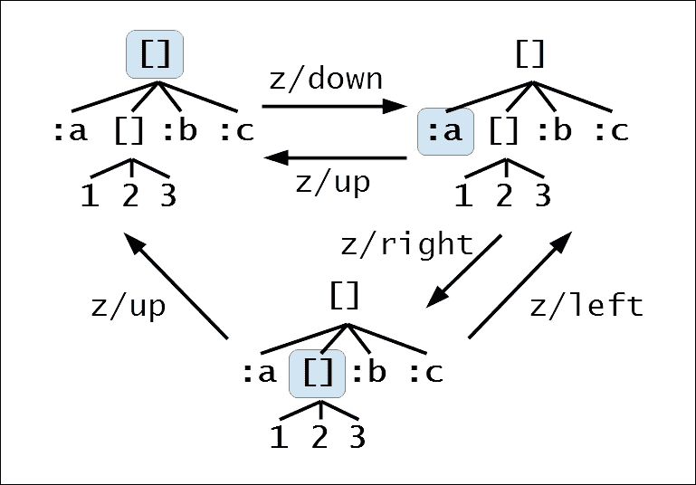

上述图示显示了 zipper 在给定树中的三个不同位置。最初，zipper 的位置在树的根处，即整个向量。`down` 函数将位置移动到树中的第一个子节点。`left` 和 `right` 函数将 zipper 的位置移动到树中同一级别或深度的其他节点。`up` 函数将 zipper 移动到当前 zipper 指向节点的父节点。

要获取表示 zipper 在树中当前位置的节点，我们必须使用 `node` 函数，如下所示：

```java
user> (-> root z/down z/right z/right z/node)
:b
user> (-> root z/down z/right z/left z/node)
:a
```

要导航到树的极端左侧或右侧，我们可以分别使用 `leftmost` 和 `rightmost` 函数，如下所示：

```java
user> (-> root z/down z/rightmost z/node)
:c
user> (-> root z/down z/rightmost z/leftmost z/node)
:a
```

`lefts` 和 `rights` 函数分别返回给定 zipper 左侧和右侧存在的节点，如下所示：

```java
user> (-> root z/down z/rights)
([1 2 3] :b :c)
user> (-> root z/down z/lefts)
nil
```

由于 `:a` 节点是树中的最左侧元素，当传递一个当前位置为 `:a` 的 zipper 时，`rights` 函数将返回树中的所有其他节点。同样，`:a` 节点的 `lefts` 函数将返回一个空值，即 `nil`。

`root` 函数可以用来获取给定 zipper 的根。它将返回用于构建 zipper 的原始树，如下所示：

```java
user> (-> root z/down z/right z/root)
[:a [1 2 3] :b :c]
user> (-> root z/down z/right r/left z/root)
[:a [1 2 3] :b :c]
```

`path` 函数可以用来获取从树的根元素到给定 zipper 当前位置的路径，如下所示：

```java
user> (def e (-> root z/down z/right z/down))
#'user/e
user> (z/node e)
1
user> (z/path e)
[[:a [1 2 3] :b :c]
 [1 2 3]]
```

在上述示例中，`tree` 中的 `1` 节点的路径由包含整个树和子树 `[1 2 3]` 的向量表示。这意味着要到达 `1` 节点，我们必须通过根和子树 `[1 2 3]`。

现在我们已经介绍了在树之间导航的基础知识，让我们看看我们如何修改原始树。`insert-child` 函数可以用来将给定的元素插入到树中，如下所示：

```java
user> (-> root (z/insert-child :d) z/root)
[:d :a [1 2 3] :b :c]
user> (-> root z/down z/right (z/insert-child 0) z/root)
[:a [0 1 2 3] :b :c]
```

我们还可以使用 `remove` 函数从 zipper 中删除节点。同样，可以使用 `replace` 函数在 zipper 中替换给定的节点：

```java
user> (-> root z/down z/remove z/root)
[[1 2 3] :b :c]
user> (-> root z/down (z/replace :d) z/root)
[:d [1 2 3] :b :c]
```

树形数据中最值得注意的例子之一是 XML。由于 zipper 在处理树形数据方面非常出色，它还允许我们轻松地遍历和修改 XML 内容。请注意，Clojure 已经提供了 `xml-seq` 函数来将 XML 数据转换为序列。然而，将 XML 文档视为序列有许多奇怪的含义。

使用 `xml-seq` 的主要缺点之一是，如果我们正在遍历序列，则没有简单的方法从节点到达文档的根。此外，`xml-seq` 只帮助我们遍历 XML 内容；它不处理修改。这些限制可以通过使用 zipper 来克服，正如我们将在下面的示例中看到的那样。

例如，考虑以下 XML 文档：

```java
<countries>
  <country name="England">
    <city>Birmingham</city>
    <city>Leeds</city>
    <city capital="true">London</city>
  </country>
  <country name="Germany">
    <city capital="true">Berlin</city>
    <city>Frankfurt</city>
    <city>Munich</city>
  </country>
  <country name="France">
    <city>Cannes</city>
    <city>Lyon</city>
    <city capital="true">Paris</city>
  </country>
</countries>
```

上面的文档包含表示为 XML 节点的国家和城市。每个国家都有若干个城市，一个城市作为其首都。一些信息，如国家名称和一个表示城市是否为首都的旗帜，被编码在节点的 XML 属性中。

### 注意

以下示例期望之前显示的 XML 内容存在于相对于你的 Leiningen 项目根目录的`resources/data/sample.xml`文件中。

让我们定义一个函数来找出文档中的所有首都，如下所示 *示例 1.10*：

```java
(defn is-capital-city? [n]
  (and (= (:tag n) :city)
       (= "true" (:capital (:attrs n)))))

(defn find-capitals [file-path]
  (let [xml-root (z/xml-zip (xml/parse file-path))
        xml-seq (iterate z/next (z/next xml-root))]
    (->> xml-seq
         (take-while #(not= (z/root xml-root) (z/node %)))
         (map z/node)
         (filter is-capital-city?)
         (mapcat :content))))
```

> *示例 1.10：使用 zippers 查询 XML*

首先，我们必须注意，来自`clojure.xml`命名空间的`parse`函数读取一个 XML 文档，并返回一个表示文档的映射。这个映射中的每个节点都是另一个映射，具有与 XML 节点的标签名、属性和内容相关的`:tag`、`:attrs`和`:content`键。

在 *示例 1.10* 中，我们首先定义了一个简单的函数，`is-capital-city?`，用于确定给定的 XML 节点是否具有`city`标签，表示为`:city`。`is-capital-city?` 函数还检查 XML 节点是否包含`capital`属性，表示为`:capital`。如果给定节点的`capital`属性值是字符串`"true"`，则`is-capital-city?` 函数返回`true`。

在这个例子中，`find-capitals` 函数执行了大部分繁重的工作。这个函数首先使用`xml-zip`函数解析提供的路径`file-path`中的 XML 文档，并将其转换为 zippers。然后我们使用`next`函数遍历 zippers，直到回到根节点，由`take-while`函数进行检查。然后我们使用`map`函数将`node`函数映射到结果序列的 zippers 上，并使用`filter`函数在所有节点中找到首都城市。最后，我们使用`mapcat`函数获取过滤节点的 XML 内容，并将结果序列的向量扁平化成一个单一列表。

当提供包含我们之前描述的 XML 内容的文件时，`find-capitals` 函数返回文档中所有首都的名称：

```java
user> (find-capitals "resources/data/sample.xml")
("London" "Berlin" "Paris")
```

如前所示，zippers 非常适合处理树形结构和如 XML 这样的分层数据。更普遍地说，序列是集合和数据多种形式的优秀抽象，Clojure 为我们提供了处理序列的巨大工具集。Clojure 语言中还有几个处理序列的函数，鼓励你自己去探索它们。

# 使用模式匹配

在本节中，我们将探讨 Clojure 中的*模式匹配*。通常，使用条件逻辑的函数可以使用`if`、`when`或`cond`形式定义。模式匹配允许我们通过声明参数的文本值模式来定义这样的函数。虽然这个想法可能看起来相当基础，但它是一个非常有用且强大的概念，正如我们将在接下来的示例中看到的那样。模式匹配也是其他函数式编程语言中的基础编程结构。

在 Clojure 中，核心语言中没有对函数和形式的模式匹配支持。然而，在 Lisp 程序员中有一个常见的观点，即我们可以通过宏轻松地修改或扩展语言。Clojure 也采取了这种方法，因此模式匹配是通过`match`和`defun`宏实现的。这些宏在`core.match` ([`github.com/clojure/core.match`](https://github.com/clojure/core.match)) 和`defun` ([`github.com/killme2008/defun`](https://github.com/killme2008/defun)) 社区库中实现。这两个库也支持 ClojureScript。

### 注意

下面的库依赖项对于即将到来的示例是必需的：

```java
[org.clojure/core.match "0.2.2"
 :exclusions [org.clojure/tools.analyzer.jvm]]
[defun "0.2.0-RC"]
```

此外，以下命名空间必须在您的命名空间声明中包含：

```java
(ns my-namespace
  (:require [clojure.core.match :as m]
            [defun :as f]))
```

以下示例可以在书籍源代码的`src/m_clj/c1/match.clj`中找到。

让我们考虑一个简单的例子，我们可以使用模式匹配来建模。XOR 逻辑函数仅在它的参数互斥时返回 true 值，也就是说，当它们具有不同的值时。换句话说，当两个参数的值都相同时，XOR 函数将返回 false。我们可以很容易地使用`match`宏定义这样的函数，如*示例 1.11*所示：

```java
(defn xor [x y]
  (m/match [x y]
           [true true] false
           [false true] true
           [true false] true
           [false false] false))
```

> *示例 1.11：使用 match 宏进行模式匹配*

*示例 1.11*中的`xor`函数简单地将其参数`x`和`y`与给定的模式集（如`[true true]`和`[true false]`）进行匹配。如果两个参数都是`true`或`false`，则函数返回`false`，否则返回`true`。这是一个简洁的定义，它依赖于提供的参数的值，而不是使用`if`和`when`之类的条件形式。`xor`函数可以通过`defun`宏以不同的方式定义，甚至更加简洁，如*示例 1.12*所示：

```java
(f/defun xor
  ([true true] false)
  ([false true] true)
  ([true false] true)
  ([false false] false))
```

> *示例 1.12：使用 defun 宏进行模式匹配*

使用`defun`宏定义的`xor`函数简单地声明实际值作为其参数。因此，要返回的表达式由其输入值确定。请注意，`defun`宏重写了`xor`函数的定义，以使用`match`宏。因此，所有由`match`宏支持的模式也可以与`defun`宏一起使用。*示例 1.11*和*示例 1.12*中`xor`函数的定义都按预期工作，如下所示：

```java
user> (xor true true)
false
user> (xor true false)
true
user> (xor false true)
true
user> (xor false false)
false
```

如果我们尝试传递未声明为模式的值给 `xor` 函数，它将抛出异常：

```java
user> (xor 0 0)
IllegalArgumentException No matching clause: [0 0] user/xor ...
```

我们可以使用 `defun` 宏定义一个简单的函数来计算斐波那契序列的第 *n* 个数，如下所示 *示例 1.13*：

```java
(f/defun fibo
  ([0] 0N)
  ([1] 1N)
  ([n] (+ (fibo (- n 1))
          (fibo (- n 2)))))
```

注意函数模式规则中变量 `n` 的使用。这表示除了 `0` 和 `1` 以外的任何值都将与使用 `n` 的模式定义相匹配。*示例 1.13* 中定义的 `fibo` 函数确实计算了第 *n* 个斐波那契序列，如下所示：

```java
user> (fibo 0)
0N
user> (fibo 1)
1N
user> (fibo 10)
55N
```

然而，*示例 1.13* 中显示的 `fibo` 的定义不能通过尾调用消除来优化。这是因为 `fibo` 的定义是树递归的。换句话说，表达式 `(+ (fibo ...) (fibo ...))` 需要两个递归调用才能完全评估。实际上，如果我们用 `recur` 表达式替换 `fibo` 函数的递归调用，得到的函数将无法编译。将树递归转换为线性递归相当简单，如 *示例 1.14* 所示：

```java
(f/defun fibo-recur
  ([a b 0] a)
  ([a b n] (recur b (+ a b) (dec n)))
  ([n] (recur 0N 1N n)))
```

> *示例 1.14：具有模式匹配的尾递归函数*

从 `fibo-recur` 函数的定义，从 *示例 1.14* 中可以看出，它确实是尾递归的。这个函数不消耗任何栈空间，可以安全地用大的 `n` 值调用，如下所示：

```java
user> (fibo-recur 0)
0N
user> (fibo-recur 1)
1N
user> (fibo-recur 10)
55N
user> (fibo-recur 9999)
207936...230626N
```

如前述示例所示，模式匹配是函数式编程中的一个强大工具。使用模式匹配定义的函数不仅正确且具有表现力，而且可以取得良好的性能。在这方面，`core.match` 和 `defun` 库是 Clojure 生态系统中的不可或缺的工具。

# 概述

在本章中，我们介绍了一些可以在 Clojure 语言中使用的编程结构。我们探讨了使用 `recur`、`loop` 和 `trampoline` 形式进行递归。我们还研究了序列和惰性的基础知识，同时描述了在 Clojure 语言中用于创建、转换和过滤序列的各种函数。接下来，我们查看了一下 zippers，以及它们如何被用来习惯性地处理树和如 XML 这样的层次数据。最后，我们简要探讨了使用 `core.match` 和 `defun` 库进行模式匹配。

在下一章中，我们将探讨并发与并行。我们将详细研究各种数据结构和函数，这些函数允许我们在 Clojure 中充分利用这些概念。

# 第二章 编排并发与并行

现在我们来探讨 Clojure 如何支持并发和并行编程。术语*并发编程*指的是同时管理多个任务。另一方面，*并行编程*或*并行性*涉及同时执行多个任务。这两个术语的区别在于，并发是关于我们如何构建和同步多个任务，而并行性更多地涉及在多个核心上并行运行多个任务。使用并发和并行性的主要优势可以详细阐述如下：

+   并发程序可以同时执行多个任务。例如，桌面应用程序可以有一个处理用户交互的单个任务，另一个处理 I/O 和网络通信的任务。单个处理器可以由多个任务共享。因此，在并发程序中，处理器利用率更为有效。

+   并行程序可以利用多个处理器核心的优势。这意味着，通过在具有更多处理器核心的系统上执行这些程序，可以使此类程序运行得更快。此外，计算密集型任务可以通过并行化以更短的时间完成。

在本章中，我们将：

+   研究如何创建和同步并发运行的任务

+   了解如何处理并发任务之间的共享状态

+   探讨如何并行化计算以及如何控制用于这些计算的并行程度

# 管理并发任务

Clojure 有几个实用的构造，允许我们定义并发任务。*线程*是运行在后台的任务的最基本抽象。在正式意义上，线程只是一系列可以调度执行的指令。在程序的后台运行的任务被称为在单独的线程上执行。底层操作系统将负责将线程调度到特定的处理器上。大多数现代操作系统允许一个进程有多个执行线程。在单个进程中管理多个线程的技术被称为*多线程*。

虽然 Clojure 支持线程的使用，但可以使用其他构造以更优雅的方式对并发任务进行建模。让我们探索我们可以定义并发任务的不同方式。

### 备注

以下示例可以在书籍源代码的`src/m_clj/c2/concurrent.clj`中找到。

## 使用延迟

可以使用*延迟*来定义一个执行被延迟，或*推迟*，直到必要时才执行的任务。延迟只运行一次，并且其结果被缓存。我们只需将给定任务的指令包裹在`delay`形式中，就可以定义一个延迟，如*示例 2.1*所示：

```java
(def delayed-1
  (delay
   (Thread/sleep 3000)
   (println "3 seconds later ...")
   1))
```

> *示例 2.1：延迟值*

### 备注

静态 `Thread/sleep` 方法暂停当前执行线程的执行，持续给定数量的毫秒，该数量作为此方法的第一个参数传递。我们可以选择性地指定当前线程必须暂停的纳秒数，作为 `Thread/sleep` 方法的第二个参数。

在 *示例 2.1* 中的 `delay` 形式简单地暂停 `3000` 毫秒，打印一个字符串并返回值 `1`。然而，它尚未 *实现*，也就是说，它尚未被执行。可以使用 `realized?` 谓词来检查延迟是否已执行，如下所示：

```java
user> (realized? delayed-1)
false
user> (realized? delayed-1)           ; after 3 seconds
false
```

### 注意

我们可以使用 `delay?` 谓词来检查一个值是否是延迟。

在 `delay` 形式中的主体表达式将在其实际使用的值返回之前不会执行。我们可以通过使用 at-the-rate 符号 (`@`) 解引用延迟来获取延迟中包含的值：

```java
user> @delayed-1
3 seconds later ...
1
user> (realized? delayed-1)
true
```

### 注意

使用 at-the-rate 符号 (`@`) 来解引用一个值与使用 `deref` 函数相同。例如，表达式 `@x` 等价于 `(deref x)`。

`deref` 函数还有一个接受三个参数的变体形式——一个要解引用的值、在超时前等待的毫秒数，以及在超时情况下返回的值。

如前所述，表达式 `@delayed-1` 在暂停 3 秒后返回值 `1`。现在，对 `realized?` 的调用返回 `true`。此外，表达式 `@delayed-1` 返回的值将被缓存，如下所示：

```java
user> @delayed-1
1
```

因此，很明显，表达式 `@delayed-1` 将被阻塞 3 秒，将打印一个字符串，并仅返回一个值。

### 注意

执行延迟的另一种方式是使用 `force` 函数，该函数接受一个延迟作为参数。如果需要，此函数将执行给定的延迟，并返回延迟内部表达式的值。

延迟对于表示不需要立即执行直到需要执行的价值或任务非常有用。然而，延迟将始终在它被解引用的同一线程中执行。换句话说，延迟是 *同步的*。因此，延迟并不是表示在后台运行的任务的真正解决方案。

## 使用未来和承诺

正如我们之前提到的，线程是处理后台任务的最基本方式。在 Clojure 中，所有函数都实现了 `clojure.lang.IFn` 接口，该接口反过来扩展了 `java.lang.Runnable` 接口。这意味着任何 Clojure 函数都可以在单独的执行线程中调用。例如，考虑 *示例 2.2* 中的函数：

```java
(defn wait-3-seconds []
  (Thread/sleep 3000)
  (println)
  (println "3 seconds later ..."))
```

> *示例 2.2：等待 3 秒的函数*

在 *示例 2.2* 中的 `wait-3-seconds` 函数等待 `3000` 毫秒并打印一个新行和一个字符串。我们可以通过使用 `Thread.` 构造函数从它构造一个 `java.lang.Thread` 对象来在单独的线程中执行此函数。然后，可以通过调用其 `.start` 方法来安排该对象在后台执行，如下所示：

```java
user> (.start (Thread. wait-3-seconds))
nil
user>
3 seconds later ...

user>
```

调用 `.start` 方法会立即返回到 REPL 提示符。`wait-3-seconds` 函数在后台执行，并在 3 秒后在 REPL 的标准输出中打印。虽然使用线程确实允许在后台执行任务，但它们有几个缺点：

+   从在单独线程上执行的功能中获取返回值没有明显的方法。

+   此外，使用 `Thread.` 和 `.start` 函数基本上是与底层 JVM 的互操作。因此，在程序代码中使用这些函数意味着程序只能在 JVM 上运行。我们实际上将程序锁定在单个平台上，程序不能在 Clojure 支持的其他任何平台上运行。

*future* 是表示在单独线程上执行的任务的更习惯用法。未来可以被简洁地定义为将在未来实现的值。未来表示执行特定计算并返回计算结果的任务。我们可以使用 `future` 形式创建一个未来，如 *示例 2.3* 所示：

```java
(defn val-as-future [n secs]
  (future
    (Thread/sleep (* secs 1000))
    (println)
    (println (str secs " seconds later ..."))
    n))
```

> *示例 2.3：一个等待一段时间并返回值的未来*

在 *示例 2.3* 中定义的 `val-as-future` 函数调用一个等待由参数 `secs` 指定秒数的未来，打印一个新行和一个字符串，并最终返回提供的值 `n`。调用 `val-as-future` 函数将立即返回一个未来，并在指定秒数后打印一个字符串，如下所示：

```java
user> (def future-1 (val-as-future 1 3))
#'user/future-1
user>
3 seconds later ...

user>
```

`realized?` 和 `future-done?` 谓词可以用来检查一个未来是否已完成，如下所示：

```java
user> (realized? future-1)
true
user> (future-done? future-1)
true
```

### 注意

我们可以使用 `future?` 谓词来检查一个值是否是未来。

可以使用 `future-cancel` 函数停止正在执行的未来，该函数只接受一个未来作为其唯一参数，并返回一个布尔值，指示提供的未来是否被取消，如下所示：

```java
user> (def future-10 (val-as-future 10 10))
#'user/future-10
user> (future-cancel future-10)
true
```

我们可以使用 `future-cancelled?` 函数来检查一个未来是否已被取消。此外，在取消一个未来之后对其进行解引用将引发异常，如下所示：

```java
user> (future-cancelled? future-10)
true
user> @future-10
CancellationException   java.util.concurrent.FutureTask.report (FutureTask.java:121)
```

既然我们已经熟悉了将任务表示为未来的概念，让我们来谈谈如何同步多个未来。首先，我们可以使用 *promises* 来同步两个或多个未来。一个通过 `promise` 函数创建的 *promise*，简单地说，是一个只能设置一次的值。使用 `deliver` 形式来设置或 *交付* 一个 *promise*。对一个已经交付的 *promise* 再次调用 `deliver` 形式将不会有任何效果，并返回 `nil`。当一个 *promise* 没有交付时，使用 `@` 符号或 `deref` 形式对其进行解引用将阻塞当前执行线程。因此，一个 *promise* 可以与一个未来一起使用，以便在某个值可用之前暂停未来的执行。以下是如何快速演示 `promise` 和 `deliver` 形式的示例：

```java
user> (def p (promise))
#'user/p
user> (deliver p 100)
#<core$promise$reify__6363@1792b00: 100>
user> (deliver p 200)
nil
user> @p
100
```

如前所述的输出所示，使用承诺 `p` 调用 `deliver` 形式的第一次调用将承诺的值设置为 `100`，而第二次调用 `deliver` 形式没有效果。

### 注意

可以使用 `realized?` 断言来检查一个承诺实例是否已被交付。

另一种同步并发任务的方法是使用 `locking` 形式。`locking` 形式允许在任何给定时间点只有一个任务持有锁变量，或监视器。任何值都可以被视为监视器。当某个任务持有或锁定监视器时，任何其他尝试获取监视器的并发任务都将被阻塞，直到监视器可用。因此，我们可以使用 `locking` 形式来同步两个或多个并发未来，如 *示例 2.4* 所示：

```java
(defn lock-for-2-seconds []
  (let [lock (Object.)
        task-1 (fn []
                 (future
                   (locking lock
                     (Thread/sleep 2000)
                     (println "Task 1 completed"))))
        task-2 (fn []
                 (future
                   (locking lock
                     (Thread/sleep 1000)
                     (println "Task 2 completed"))))]
    (task-1)
    (task-2)))
```

> *示例 2.4：使用锁定形式*

在 *示例 2.4* 中的 `lock-for-2-seconds` 函数创建了两个函数，`task-1` 和 `task-2`，这两个函数都调用了尝试获取一个由变量 `lock` 表示的监视器的未来。在这个例子中，我们使用一个无聊的 `java.lang.Object` 实例作为同步两个未来的监视器。由 `task-1` 函数调用的未来将睡眠两秒钟，而由 `task-2` 函数调用的未来将睡眠一秒钟。观察到由 `task-1` 函数调用的未来首先完成，因为由 `task-2` 函数调用的未来将不会执行，直到未来的 `locking` 形式获得监视器 `lock`，如下面的输出所示：

```java
user> (lock-for-2-seconds)
[#<core$future_call$reify__6320@19ed4e9: :pending>
 #<core$future_call$reify__6320@ac35d5: :pending>]
user>
Task 1 completed
Task 2 completed
```

我们可以使用 `locking` 形式来同步多个未来。然而，必须谨慎使用 `locking` 形式，因为其不当使用可能导致并发任务之间的死锁。并发任务通常同步以传递共享状态。Clojure 允许我们通过使用表示共享状态的引用类型来避免使用 `locking` 形式和任何可能的死锁，我们将在下一节中探讨这一点。

# 状态管理

一个程序可以被分成几个部分，这些部分可以并发执行。通常需要在这些并发运行的任务之间共享数据或状态。因此，我们得到了对某些数据有多个观察者的概念。如果数据被修改，我们必须确保更改对所有观察者都是可见的。例如，假设有两个线程从公共变量中读取数据。这个数据被一个线程修改，并且更改必须尽快传播到另一个线程，以避免不一致性。

支持可变性的编程语言通过在监视器上锁定，正如我们通过`locking`形式所展示的，并维护数据的本地副本来处理这个问题。在这样的语言中，变量只是一个数据容器。每当并发任务访问与其他任务共享的变量时，它会从变量中复制数据。这是为了防止其他任务在任务对其执行计算时意外覆盖变量。如果变量实际上被修改，给定任务仍将拥有共享数据的副本。如果有两个并发任务访问给定的变量，它们可以同时修改该变量，因此这两个任务都会对给定变量中的数据有一个不一致的视图。这个问题被称为*竞争条件*，在处理并发任务时必须避免。因此，使用监视器来同步对共享数据的访问。然而，这种方法在本质上并不是*确定性的*，这意味着我们无法轻易地推理出在特定时间点变量中实际包含的数据。这使得在使用可变性的编程语言中开发并发程序变得相当繁琐。

与其他函数式编程语言一样，Clojure 通过使用*不可变性*来解决这个问题——所有值默认都是不可变的，不能更改。为了模拟可变状态，有*身份*、*状态*和*时间*的概念：

+   *身份*是与变化状态相关联的任何事物。在特定时间点，一个身份具有单一的状态。

+   *状态*是在特定时间点与身份相关联的值。

+   *时间*定义了身份状态之间的顺序。

实际使用状态的程序因此可以分为两层。一层是纯函数性的，与状态无关。另一层构成了程序中实际需要使用可变状态的部分。这种分解使我们能够隔离程序中实际需要使用可变状态的部分。

在 Clojure 中定义可变状态有几种方式，用于此目的的数据结构被称为*引用类型*。引用类型本质上是对不可变值的可变引用。因此，必须显式地更改引用，并且引用类型中包含的实际值不能以任何方式修改。引用类型可以以下列方式描述：

+   某些引用类型的状态变化可以是*同步*的或*异步*的。例如，假设我们正在向文件写入数据。同步写入操作会阻塞调用者，直到所有数据都写入文件。另一方面，异步写入操作会启动一个后台任务将所有数据写入文件，并立即返回调用者。

+   引用类型的修改可以以 *协调* 或 *独立* 的方式进行。通过协调，我们指的是状态只能在由某些底层系统管理的交易中修改，这与数据库工作的方式非常相似。然而，独立修改引用类型的引用类型可以不使用交易显式地更改。

+   某些状态的变化可能只能对发生变化的线程可见，或者它们可能对所有当前进程中的线程可见。

我们现在将探讨在 Clojure 中可以用来表示可变状态的多种引用类型。

## 使用变量

*变量* 用于管理在线程作用域内发生变化的州。我们本质上定义了可以具有状态的变量，并将它们绑定到不同的值。变量的修改值仅对当前执行线程可见。因此，变量是一种 *线程局部* 状态。

### 注意

以下示例可以在书籍源代码的 `src/m_clj/c2/vars.clj` 中找到。

动态变量使用带有 `:dynamic` 元关键字的 `def` 形式定义。如果我们省略 `:dynamic` 元数据，那么它将等同于使用 `def` 形式定义一个普通变量或静态变量。一个约定是所有动态变量名必须以星号字符 (`*`) 开头和结尾，但这不是强制性的。例如，让我们定义一个如下所示的动态变量：

```java
(def ^:dynamic *thread-local-state* [1 2 3])
```

在 *示例 2.5* 中定义的 `*thread-local-state*` 变量代表一个可以动态变化的线程局部变量。我们已将变量 `*thread-local-state*` 初始化为向量 `[1 2 3]`，但这并不是必需的。如果未向 `def` 形式提供初始值，则生成的变量被称为 *未绑定* 变量。虽然变量的状态仅限于当前线程，但其声明对当前命名空间是全局的。换句话说，使用 `def` 形式定义的变量将对从当前命名空间调用的所有线程可见，但变量的状态仅限于更改它的线程。因此，使用 `def` 形式的变量也被称为 *全局变量*。

通常，`def` 形式创建一个静态变量，只能通过使用另一个 `def` 形式来重新定义。静态变量也可以在作用域或上下文中使用 `with-redefs` 和 `with-redefs-fn` 形式重新定义。然而，动态变量可以通过使用 `binding` 形式在定义后将其设置为新的值，如下所示：

```java
user> (binding [*thread-local-state* [10 20]]
 (map #(* % %) *thread-local-state*))
(100 400)
user> (map #(* % %) *thread-local-state*)
(1 4 9)
```

在此示例中，`binding` 形式将 `*thread-local-state*` 变量中包含的值更改为向量 `[10 20]`。这导致在未使用 `binding` 形式包围的情况下调用示例中的 `map` 形式时返回不同的值。因此，`binding` 形式可以用来临时更改提供给它的变量的状态。

Clojure 的命名空间系统会将自由符号，或者说变量名解析为其值。将变量名解析为命名空间限定符号的过程称为 *内联*。此外，`def` 形式将首先根据传递给它的符号查找现有的全局变量，如果尚未定义，则创建一个。`var` 形式可以用来获取变量的完全限定名，而不是其当前值，如下所示：

```java
user> *thread-local-state*
[1 2 3]
user> (var *thread-local-state*)
#'user/*thread-local-state*
```

### 注意

使用 `#'` 符号与使用 `var` 形式相同。例如，`#'x` 等同于 `(var x)`。

`with-bindings` 形式是重新绑定变量的另一种方式。此形式接受一个包含变量和值对的映射作为其第一个参数，然后是表单的主体，如下所示：

```java
user> (with-bindings {#'*thread-local-state* [10 20]}
 (map #(* % %) *thread-local-state*))
(100 400)
user> (with-bindings {(var *thread-local-state*) [10 20]}
 (map #(* % %) *thread-local-state*))
(100 400)
```

我们可以使用 `thread-bound?` 断言来检查变量是否绑定到当前执行线程中的任何值，这需要一个变量作为其唯一参数：

```java
user> (def ^:dynamic *unbound-var*)
#'user/*unbound-var*
user> (thread-bound? (var *unbound-var*))
false
user> (binding [*unbound-var* 1]
 (thread-bound? (var *unbound-var*)))
true
```

我们也可以使用 `with-local-vars` 形式定义非内联变量，或称为 *局部变量*。这些变量不会通过命名空间系统解析，必须使用 `var-get` 和 `var-set` 函数手动访问。因此，这些函数可以用来创建和访问可变变量，如 *示例 2.5* 所示。

### 注意

使用非内联变量与 `@` 符号相同，与使用 `var-get` 函数相同。例如，如果 `x` 是一个非内联变量，则 `@x` 等同于 `(var-get x)`。

```java
(defn factorial [n]
  (with-local-vars [i n acc 1]
    (while (> @i 0)
      (var-set acc (* @acc @i))
      (var-set i (dec @i)))
    (var-get acc)))
```

> *示例 2.5：使用 with-local-vars 形式创建的可变变量*

在 *示例 2.5* 中定义的 `factorial` 函数使用两个可变局部变量 `i` 和 `acc` 来计算 `n` 的阶乘，分别初始化为 `n` 和 `1`。请注意，此函数中的代码展示了命令式编程风格，其中使用 `var-get` 和 `var-set` 函数操纵变量 `i` 和 `acc` 的状态。

### 注意

我们可以使用 `var?` 断言检查是否通过 `with-local-vars` 形式创建了值。

## 使用引用

**软件事务内存** (**STM**) 系统也可以用来模拟可变状态。STM 实质上将可变状态视为一个位于程序内存中的小型数据库。Clojure 通过 *refs* 提供了 STM 实现，并且它们只能在事务中更改。Refs 是一种表示 *同步* 和 *协调* 状态的引用类型。

### 注意

以下示例可以在书籍源代码的 `src/m_clj/c2/refs.clj` 文件中找到。

我们可以使用 `ref` 函数创建一个引用，该函数需要一个参数来指示引用的初始状态。例如，我们可以创建一个引用如下：

```java
(def state (ref 0))
```

这里定义的变量 `state` 代表一个初始值为 `0` 的引用。我们可以使用 `@` 或 `deref` 来解引用 `state`，以获取其中包含的值。

为了修改一个引用（ref），我们必须通过使用`dosync`形式启动一个事务。如果两个并发任务同时使用`dosync`形式调用事务，那么首先完成的事务将成功更新引用。较晚完成的事务将重试，直到成功完成。因此，在`dosync`形式内必须避免 I/O 和其他副作用，因为它可以被重试。在事务中，我们可以使用`ref-set`函数来修改引用的值。此函数接受两个参数——一个引用和表示引用新状态的值。`ref-set`函数可以用来修改引用，如下所示：

```java
user> @state
0
user> (dosync (ref-set state 1))
1
user> @state
1
```

初始时，表达式`@state`返回`0`，这是引用`state`的初始状态。在`dosync`形式内的`ref-set`调用之后，此表达式的返回值将发生变化。

我们可以通过使用`ensure`函数来获取引用中包含的最新值。此函数返回引用的最新值，必须在事务中调用。例如，当在由`dosync`形式启动的事务中调用表达式`(ensure state)`时，将返回事务中引用`state`的最新值。

修改给定引用的一个更自然的做法是使用`alter`和`commute`函数。这两个函数都需要一个引用和一个作为参数传递给它的函数。`alter`和`commute`函数将应用提供的函数到给定引用中包含的值，并将结果值保存到引用中。我们还可以指定传递给提供的函数的额外参数。例如，我们可以使用`alter`和`commute`修改`state`引用的状态，如下所示：

```java
user> @state
1
user> (dosync (alter state + 2))
3
user> (dosync (commute state + 2))
5
```

使用`alter`和`commute`形式的前一个事务将值`(+ @state 2)`保存到引用`state`中。`alter`和`commute`之间的主要区别在于，当提供的函数是**交换律**时，必须优先选择`commute`形式。这意味着对`commute`形式提供的函数的连续两次调用必须产生相同的结果，无论这两次调用的顺序如何。使用`commute`形式被认为是相对于我们不在意给定引用上并发事务顺序的`alter`形式的优化。

### 注意

`ref-set`、`alter`和`commute`函数都返回提供的引用中包含的新值。此外，如果它们不在`dosync`形式内调用，这些函数将抛出错误。

`alter`和`commute`形式执行的变异也可以进行验证。这是通过在创建引用时使用`:validator`键选项来实现的，如下所示：

```java
user> (def r (ref 1 :validator pos?))
#'user/r
user> (dosync (alter r (fn [_] -1)))
IllegalStateException Invalid reference state  clojure.lang.ARef.validate (ARef.java:33)
user> (dosync (alter r (fn [_] 2)))
2
```

如前所述，当我们尝试将引用`r`的状态更改为负值时，它会抛出异常。这是因为使用了`pos?`函数来验证引用的新状态。请注意，`:validator`键选项也可以用于其他引用类型。我们还可以使用`set-validator!`函数设置未使用`:validator`键选项创建的引用的验证函数。

### 注意

`:validator`键选项和`set-validator!`函数可以与所有引用类型一起使用。提供的验证函数必须返回`false`或抛出异常以指示验证错误。

*用餐哲学家问题*描述了使用同步原语来共享资源的使用。这个问题可以这样定义：五位哲学家围坐在一张圆桌旁吃意大利面，每位哲学家需要两根叉子才能从他的盘子里吃面。桌上有五根叉子，放在五位哲学家之间。哲学家必须首先从他的左边和右边各拿起一根叉子，然后才能开始吃饭。当一个哲学家无法获得他左右两侧的两个叉子时，他必须等待直到两个叉子都可用。当一个哲学家吃完他的意大利面后，他会思考一段时间，从而允许其他哲学家使用他使用的叉子。这个问题的解决方案要求所有哲学家共享叉子，并且没有哲学家因为无法获得两个叉子而饿死。五位哲学家的盘子和叉子按照以下图示放置在桌子上：


哲学家在开始吃饭之前必须获得他左右两侧叉子的独家访问权。如果两个叉子都不可用，哲学家必须等待一段时间，直到其中一个叉子变得空闲，然后重试获取叉子。这样，每个哲学家都可以与其他哲学家协同访问叉子，避免饿死。

通常，这个解决方案可以通过使用同步原语来访问可用的叉子来实现。引用允许我们实现一个无需任何同步原语的用餐哲学家问题的解决方案。现在，我们将展示如何在 Clojure 中实现并模拟这个问题的解决方案。首先，我们必须定义叉子和哲学家的状态为引用，如*示例 2.6*所示：

```java
(defn make-fork []
  (ref true))

(defn make-philosopher [name forks food]
  (ref {:name name
        :forks forks
        :eating? false
        :food food}))
```

> *示例 2.6：使用引用的用餐哲学家问题*

`make-fork`和`make-philosopher`函数创建引用来表示叉子和哲学家的状态。一个叉子简单地表示一个布尔值的状态，指示它是否可用。而由`make-philosopher`函数创建的哲学家是一个封装为状态的映射，它具有以下键：

+   `:name`键包含一个哲学家的名字，它是一个字符串值。

+   `:forks` 键指向哲学家左右两侧的叉子。每个叉子都将由 `make-fork` 函数创建的引用（ref）表示。

+   `:eating?` 键表示哲学家是否正在进食。它是一个布尔值。

+   `:food` 键表示哲学家可用的食物数量。为了简单起见，我们将此值视为一个整数。

现在，让我们定义一些原始操作来帮助处理叉子，如 *示例 2.7* 所示：

```java
(defn has-forks? [p]
  (every? true? (map ensure (:forks @p))))

(defn update-forks [p]
  (doseq [f (:forks @p)]
    (commute f not))
  p)
```

> *示例 2.7: 使用引用解决就餐哲学家问题（继续）*

之前定义的 `has-forks?` 函数检查放置在给定哲学家引用 `p` 左右两侧的叉子是否可用。`update-forks` 函数将使用 `commute` 形式修改哲学家引用 `p` 相关的叉子的状态，并返回引用 `p`。显然，这些函数只能在由 `dosync` 形式创建的事务中调用，因为它们使用了 `ensure` 和 `commute` 函数。接下来，我们将不得不定义一些函数来启动事务，并为给定的哲学家调用 `has-forks?` 和 `update-forks` 函数，如 *示例 2.8* 所示：

```java
(defn start-eating [p]
  (dosync
   (when (has-forks? p)
     (update-forks p)
     (commute p assoc :eating? true)
     (commute p update-in [:food] dec))))

(defn stop-eating [p]
  (dosync
   (when (:eating? @p)
     (commute p assoc :eating? false)
     (update-forks p))))

(defn dine [p retry-ms max-eat-ms max-think-ms]
  (while (pos? (:food @p))
    (if (start-eating p)
      (do
        (Thread/sleep (rand-int max-eat-ms))
        (stop-eating p)
        (Thread/sleep (rand-int max-think-ms)))
      (Thread/sleep retry-ms))))
```

> *示例 2.8: 使用引用解决就餐哲学家问题（继续）*

解决就餐哲学家问题的核心是 *示例 2.8* 中的 `start-eating` 函数。此函数将使用 `has-forks?` 函数检查哲学家两侧的叉子是否可用。然后，`start-eating` 函数将调用 `update-forks` 函数来更新这些叉子的状态。`start-eating` 函数还将通过调用 `assoc` 和 `update-in` 函数（这两个函数都返回一个新的映射）来改变哲学家引用 `p` 的状态，从而使用 `commute`。由于 `start-eating` 函数使用了 `when` 形式，当任何哲学家的叉子不可用时，它将返回 `nil`。这些步骤就是解决方案；简而言之，哲学家只有在他的两个叉子都可用时才会进食。

*示例 2.8* 中的 `stop-eating` 函数在 `start-eating` 函数被调用后反转给定哲学家引用的状态。此函数基本上使用 `commute` 形式将提供的哲学家引用 `p` 中包含的映射的 `:eating` 键设置为 `false`，然后调用 `update-forks` 来重置哲学家引用 `p` 相关的叉子的状态。

`start-eating` 和 `stop-eating` 函数可以通过 `while` 形式在循环中重复调用，只要哲学家的引用 `p` 的 `:food` 键（或者说是可用的食物量）是一个正数。这是通过 *示例 2.8* 中的 `dine` 函数来执行的。该函数将在哲学家引用 `p` 上调用 `start-eating` 函数，如果哲学家的叉子被其他哲学家使用，则等待一段时间。哲学家等待的时间由传递给 `dine` 函数的 `retry-ms` 参数指示。如果哲学家的叉子可用，他将吃一个随机的时间，如表达式 `(rand-int max-eat-ms)` 所示。然后，调用 `stop-eating` 函数来重置哲学家引用 `p` 和它包含的叉子的状态。最后，`dine` 函数等待一个随机的时间，这由 `(rand-int max-think-ms)` 表达式表示，以表示哲学家正在思考。

现在，让我们定义一些函数，并实际创建一些代表哲学家和相关叉子的引用，如 *示例 2.9* 所示：

```java
(defn init-forks [nf]
  (repeatedly nf #(make-fork)))

(defn init-philosophers [np food forks init-fn]
  (let [p-range (range np)
        p-names (map #(str "Philosopher " (inc %))
                     p-range)
        p-forks (map #(vector (nth forks %)
                              (nth forks (-> % inc (mod np))))
                     p-range)
        p-food (cycle [food])]
    (map init-fn p-names p-forks p-food)))
```

> *示例 2.9：使用引用的用餐哲学家问题（继续）*

*示例 2.9* 中的 `init-forks` 函数将简单地根据其参数 `nf` 调用 `make-fork` 函数多次。`init-philosophers` 函数将创建 `np` 个哲学家，并将每个哲学家与一个包含两个叉子和一定量食物的向量相关联。这是通过将函数 `init-fn`（该函数与 *示例 2.6* 中的 `make-philosopher` 函数的阶数相匹配）映射到哲学家名称 `p-names` 和叉子 `p-forks` 的范围以及值 `food` 的无限范围 `p-food` 来实现的。

我们现在定义一个函数来打印一系列哲学家的集体状态。这可以通过使用 `doseq` 函数以相当简单的方式进行，如 *示例 2.10* 所示：

```java
(defn check-philosophers [philosophers forks]
  (doseq [i (range (count philosophers))]
    (println (str "Fork:\t\t\t available=" @(nth forks i)))
    (if-let [p @(nth philosophers i)]
      (println (str (:name p)
                    ":\t\t eating=" (:eating? p)
                    " food=" (:food p))))))
```

> *示例 2.10：使用引用的用餐哲学家问题（继续）*

*示例 2.10* 中的 `check-philosophers` 函数遍历其提供的所有哲学家引用，由 `philosophers` 表示，以及相关的叉子，由 `forks` 表示，并打印它们的状态。这里使用 `if-let` 形式来检查集合 `philosophers` 中的解引用引用是否不是 `nil`。

现在，让我们定义一个函数来并发调用哲学家集合上的 `dine` 函数。这个函数也可以传递 `dine` 函数的 `retry-ms`、`max-eat-ms` 和 `max-think-ms` 参数值。这在 *示例 2.11* 中的 `dine-philosophers` 函数中实现：

```java
(defn dine-philosophers [philosophers]
  (doall (for [p philosophers]
           (future (dine p 10 100 100))))
```

> *示例 2.11：使用引用的用餐哲学家问题（继续）*

最后，让我们使用 `init-forks`、`init-philosophers` 和 `make-philosopher` 函数定义五个哲学家的实例和五个相关的叉子，如 *示例 2.12* 所示如下：

```java
(def all-forks (init-forks 5))

(def all-philosophers
  (init-philosophers 5 1000 all-forks make-philosopher))
```

> *示例 2.12：使用 refs 解决就餐哲学家问题（续）*

现在我们可以使用 `check-philosopher` 函数来打印在 *示例 2.12* 中创建的哲学家状态和叉子引用，如下所示：

```java
user> (check-philosophers all-philosophers all-forks)
Fork:                         available=true
Philosopher 1:                eating=false food=1000
Fork:                         available=true
Philosopher 2:                eating=false food=1000
Fork:                         available=true
Philosopher 3:                eating=false food=1000
Fork:                         available=true
Philosopher 4:                eating=false food=1000
Fork:                         available=true
Philosopher 5:                eating=false food=1000
nil
```

初始时，所有叉子都是可用的，没有哲学家在吃饭。为了开始模拟，我们必须在 `all-philosophers` 哲学家引用和 `all-forks` 叉子引用上调用 `dine-philosophers` 函数，如下所示：

```java
user> (def philosophers-futures (dine-philosophers all-philosophers))
#'user/philosophers-futures
user> (check-philosophers all-philosophers all-forks)
Fork:                         available=false
Philosopher 1:                eating=true food=978
Fork:                         available=false
Philosopher 2:                eating=false food=979
Fork:                         available=false
Philosopher 3:                eating=true food=977
Fork:                         available=false
Philosopher 4:                eating=false food=980
Fork:                         available=true
Philosopher 5:                eating=false food=980
nil
```

在调用 `dine-philosophers` 函数后，每个哲学家都会观察到他们消费分配的食物，如前一个 `check-philosophers` 函数的输出所示。在任何给定的时间点，都会观察到一位或两位哲学家在吃饭，其他哲学家将等待他们完成使用可用的叉子。随后的 `check-philosophers` 函数调用也指示相同的输出，哲学家最终会消费所有分配的食物：

```java
user> (check-philosophers all-philosophers all-forks)
Fork:                         available=true
Philosopher 1:                eating=false food=932
Fork:                         available=true
Philosopher 2:                eating=false food=935
Fork:                         available=true
Philosopher 3:                eating=false food=933
Fork:                         available=true
Philosopher 4:                eating=false food=942
Fork:                         available=true
Philosopher 5:                eating=false food=935
nil
```

我们可以通过调用 `future-cancel` 函数来暂停模拟，如下所示。一旦模拟被暂停，可以通过再次调用 `dine-philosophers` 函数来恢复，如 `(dine-philosophers all-philosophers)`：

```java
user> (map future-cancel philosophers-futures)
(true true true true true)
```

总结来说，前面的示例是使用 Clojure 的 futures 和 refs 解决就餐哲学家问题的简洁且可行的实现。

## 使用原子

*原子* 用于处理原子性变化的州。一旦原子被修改，其新值将在所有并发线程中反映出来。这样，原子代表 *同步* 和 *独立* 的状态。让我们快速探索可以用来处理原子的函数。

### 注意

以下示例可以在书籍源代码的 `src/m_clj/c2/atoms.clj` 中找到。

我们可以使用 `atom` 函数定义一个原子，该函数需要将原子的初始状态作为第一个参数传递给它，如下所示：

```java
(def state (atom 0))
```

`reset!` 和 `swap!` 函数可以用来修改原子的状态。`reset!` 函数用于直接设置原子的状态。此函数接受两个参数——一个原子和表示原子新状态的值，如下所示：

```java
user> @state
0
user> (reset! state 1)
1
user> @state
1
```

`swap!` 函数需要一个函数以及传递给该函数的额外参数。提供的函数将应用于原子中包含的值，以及传递给 `swap!` 函数的其他额外参数。因此，可以使用提供的函数来使用原子进行变异，如下所示：

```java
user> @state
1
user> (swap! state + 2)
3
```

前面的 `swap!` 函数调用将原子的状态设置为表达式 `(+ @state 2)` 的结果。由于对原子 `state` 的 `swap!` 函数的并发调用，`swap!` 函数可能会多次调用函数 `+`。因此，传递给 `swap!` 函数的函数必须是无 I/O 和其他副作用。

### 注意

`reset!` 和 `swap!` 函数都返回所提供原子中包含的新值。

我们可以使用 `add-watch` 函数监视原子以及其他引用类型的任何变化。此函数会在原子状态改变时调用给定的函数。`add-watch` 函数接受三个参数——一个引用、一个键和一个 *监视函数*，即每当提供的引用类型的状态改变时必须调用的函数。传递给 `add-watch` 函数的函数必须接受四个参数——一个键、被更改的引用、引用的旧值和引用的新值。传递给 `add-watch` 函数的键的值作为第一个参数传递给 `watch` 函数。`watch` 函数还可以使用 `remove-watch` 函数从给定的引用类型中解除链接。`remove-watch` 函数接受两个参数——一个引用和一个在向引用添加 `watch` 函数时指定的键。*示例 2.13* 展示了我们可以如何使用 `watch` 函数跟踪原子的状态：

```java
(defn make-state-with-watch []
  (let [state (atom 0)
        state-is-changed? (atom false)
        watch-fn (fn [key r old-value new-value]
                   (swap! state-is-changed? (fn [_] true))]
    (add-watch state nil watch-fn)
    [state
     state-is-changed?]))
```

> *示例 2.13：使用 add-watch 函数*

在 *示例 2.13* 中定义的 `make-state-with-watch` 函数返回一个包含两个原子的向量。在这个向量中，第二个原子最初包含的值是 `false`。每当 `make-state-with-watch` 函数返回的向量中第一个原子的状态发生变化时，这个向量中第二个原子的状态就会变为 `true`。这可以在 REPL 中验证，如下所示：

```java
user> (def s (make-state-with-watch))
#'user/s
user> @(nth s 1)
false
user> (swap! (nth s 0) inc)
1
user> @(nth s 1)
true
```

因此，可以使用 `add-watch` 函数与 watch 函数一起使用，以跟踪原子和其他引用类型的状态。

### 注意

`add-watch` 函数可以与 *所有* 引用类型一起使用。

## 使用代理

*代理* 用于表示与动作队列和工作者线程池相关联的状态。任何修改代理状态的动作都必须发送到其队列中，并且提供的函数将由从代理的工作者线程池中选择的线程调用。我们也可以异步地向代理发送动作。因此，代理表示 *异步* 和 *独立* 的状态。

### 注意

以下示例可以在书籍源代码的 `src/m_clj/c2/agents.clj` 中找到。

使用 `agent` 函数创建代理。例如，我们可以创建一个代理，其初始值为空映射，如下所示：

```java
(def state (agent {}))
```

我们可以通过使用 `send` 和 `send-off` 函数来修改代理的状态。`send` 和 `send-off` 函数将以异步方式将提供的动作及其附加参数发送到代理的队列中。这两个函数都会立即返回传递给它们的代理。

`send` 和 `send-off` 函数之间的主要区别在于，`send` 函数将动作分配给从工作线程池中选择的一个线程，而 `send-off` 函数为每个动作创建一个新的专用线程来执行。使用 `send` 函数发送到代理的阻塞动作可能会耗尽代理的线程池。因此，对于发送阻塞动作到代理，`send-off` 函数是首选。

为了演示 `send` 和 `send-off` 函数，我们首先定义一个返回闭包的函数，该闭包会休眠一定的时间，然后调用 `assoc` 函数，如下所示 *示例 2.14*：

```java
(defn set-value-in-ms [n ms]
  (fn [a]
    (Thread/sleep ms)
    (assoc a :value n)))
```

> *示例 2.14：一个返回闭包的函数，该闭包会休眠并调用 assoc*

*示例 2.14* 中 `set-value-in-ms` 函数返回的闭包可以作为动作传递给 `send` 和 `send-off` 函数，如下所示：

```java
user> (send state (set-value-in-ms 5 5000))
#<Agent@7fce18: {}>
user> (send-off state (set-value-in-ms 10 5000))
#<Agent@7fce18: {}>
user> @state
{}
user> @state ; after 5 seconds
{:value 5}
user> @state ; after another 5 seconds
{:value 10}
```

对前面的 `send` 和 `send-off` 函数的调用将异步地通过代理 `state` 调用 `set-value-in-ms` 函数（*示例 2.14*）返回的闭包。代理的状态在 10 秒内发生变化，这是执行 `set-value-in-ms` 函数返回的闭包所必需的。观察到新的键值对 `{:value 5}` 在五秒后被保存到代理 `state` 中，然后在另一个五秒后，代理的状态再次变为 `{:value 10}`。

传递给 `send` 和 `send-off` 函数的任何动作都可以使用 `*agent*` 变量通过执行动作的代理来访问。

可以使用 `await` 函数等待代理队列中的所有动作完成，如下所示：

```java
user> (send-off state (set-value-in-ms 100 3000))
#<Agent@af9ac: {:value 10}>
user> (await state)  ; will block
nil
user> @state
{:value 100}
```

观察到表达式 `(await state)` 会在使用 `send-off` 函数将动作发送到代理 `state` 的上一个动作完成之前被阻塞。`await-for` 函数是 `await` 的一个变体，它等待由其第一个参数指定的一定数量的毫秒数，以便完成代理（其第二个参数）上的所有动作。

代理还会保存它在执行队列中的动作时遇到的任何错误。代理会在对 `send` 和 `send-off` 函数的任何后续调用中抛出它遇到的错误。代理保存的错误可以通过 `agent-error` 函数访问，并且可以使用 `clear-agent-errors` 函数清除，如下所示：

```java
user> (def a (agent 1))
#'user/a
user> (send a / 0)
#<Agent@5d29f1: 1>
user> (agent-error a)
#<ArithmeticException java.lang.ArithmeticException: Divide by zero>
user> (clear-agent-errors a)
1
user> (agent-error a)
nil
user> @a
1
```

遇到错误的代理也可以使用 `restart-agent` 函数重新启动。此函数将其第一个参数作为代理，第二个参数作为代理的新状态。一旦在代理上调用 `restart-agent`，之前发送到代理的所有动作都将执行。我们可以通过将 `:clear-actions true` 可选参数传递给 `restart-agent` 函数来避免这种行为。在这种情况下，在重新启动之前，代理队列中持有的任何动作都将被丢弃。

要创建一个用于代理的线程池或*threadpool*，我们必须通过传递池中期望的线程数作为参数来调用`java.util.concurrent.Executors`类的静态`newFixedThreadPool`方法，如下所示：

```java
(def pool (java.util.concurrent.Executors/newFixedThreadPool 10))
```

可以使用之前定义的线程池通过`send-via`函数来执行代理的动作。这个函数是`send`函数的一个变体，它接受一个线程池作为其第一个参数，如以下所示：

```java
user> (send-via pool state assoc :value 1000)
#<Agent@8efada: {:value 100}>
user> @state
{:value 1000}
```

我们还可以使用`set-agent-send-executor!`和`set-agent-send-off-executor!`函数分别指定所有代理执行发送给它们的动作所使用的线程池。这两个函数都接受一个表示线程池的单个参数。

可以通过调用`(shutdown-agents)`来停止当前进程中的所有代理。`shutdown-agents`函数应该在退出进程之前调用，因为在此函数调用之后无法重新启动进程中的代理。

现在，让我们尝试使用代理实现 dining philosophers problem。我们可以重用之前基于 refs 的 dining philosophers problem 实现中的大多数函数。让我们定义一些函数来使用代理模拟这个问题，如*示例 2.15*所示：

```java
(defn make-philosopher-agent [name forks food]
  (agent {:name name
          :forks forks
          :eating? false
          :food food}))

(defn start-eating [max-eat-ms]
  (dosync (if (has-forks? *agent*)
            (do
              (-> *agent*
                  update-forks
                  (send assoc :eating? true)
                  (send update-in [:food] dec))
              (Thread/sleep (rand-int max-eat-ms))))))

(defn stop-eating [max-think-ms]
  (dosync (-> *agent*
              (send assoc :eating? false)
              update-forks))
  (Thread/sleep (rand-int max-think-ms)))

(def running? (atom true))

(defn dine [p max-eat-ms max-think-ms]
  (when (and p (pos? (:food p)))
    (if-not (:eating? p)
      (start-eating max-eat-ms)
      (stop-eating max-think-ms))
    (if-not @running?
      @*agent*
      @(send-off *agent* dine max-eat-ms max-think-ms))))

(defn dine-philosophers [philosophers]
  (swap! running? (fn [_] true))
  (doall (for [p philosophers]
           (send-off p dine 100 100))))

(defn stop-philosophers []
  (swap! running? (fn [_] false)))
```

> *示例 2.15：使用代理的 dining philosophers problem*

在*示例 2.15*中，`make-philosopher-agent`函数将创建一个代表哲学家的代理。该代理的初始状态是一个包含键`:name`、`:forks`、`:eating?`和`:food`的映射，正如之前 dining philosophers problem 的实现所描述。请注意，在这个实现中，叉子仍然由 refs 表示。

*示例 2.15*中的`start-eating`函数将启动一个事务，检查哲学家左右两侧放置的叉子是否可用，相应地更改叉子和哲学家代理的状态，然后暂停当前线程一段时间以表示哲学家正在吃饭。*示例 2.15*中的`stop-eating`函数将类似地更新哲学家的状态和他所使用的叉子的状态，然后暂停当前线程一段时间以表示哲学家正在思考。请注意，`start-eating`和`stop-eating`函数都重用了之前 dining philosophers problem 实现的*示例 2.7*中的`has-forks?`和`update-forks`函数。

`start-eating` 和 `stop-eating` 函数由 *Example 2.15* 中的 `dine` 函数调用。我们可以假设这个函数将被传递给一个哲学家代理作为动作。这个函数检查哲学家代理中包含的 `:eating?` 键的值，以决定是否必须在当前调用中调用 `start-eating` 或 `stop-eating` 函数。接下来，`dine` 函数再次使用 `send-off` 函数调用自身，并取消引用 `send-off` 函数返回的代理。`dine` 函数还检查 `running?` 原子的状态，如果 `@running` 返回 `false`，则不会通过 `send-off` 函数调用自身。

*Example 2.15* 中的 `dine-philosophers` 函数通过将 `running?` 原子的值设置为 `true` 来启动模拟，然后通过 `send-off` 函数异步调用 `dine` 函数，该函数为传递给它的所有哲学家代理执行，这些代理由 `philosophers` 表示。`stop-philosophers` 函数简单地将 `running?` 原子的值设置为 `false`，从而停止模拟。

最后，让我们使用 *Example 2.9* 中的 `init-forks` 和 `init-philosophers` 函数定义五个叉子和哲学家实例，如 *Example 2.16* 中所示，如下所示：

```java
(def all-forks (init-forks 5))

(def all-philosophers
  (init-philosophers 5 1000 all-forks make-philosopher-agent))
```

> *Example 2.16: 使用代理解决就餐哲学家问题（继续）*

我们现在可以通过调用 `dine-philosophers` 函数来启动模拟。此外，我们可以使用在 *Example 2.10* 中定义的 `check-philosophers` 函数来打印模拟中叉子和哲学家实例的集体状态，如下所示：

```java
user> (def philosophers-agents (dine-philosophers all-philosophers))
#'user/philosophers-agents
user> (check-philosophers all-philosophers all-forks)
Fork:                    available=false
Philosopher 1:           eating=false food=936
Fork:                    available=false
Philosopher 2:           eating=false food=942
Fork:                    available=true
Philosopher 3:           eating=true food=942
Fork:                    available=true
Philosopher 4:           eating=false food=935
Fork:                    available=true
Philosopher 5:           eating=true food=943
nil
user> (check-philosophers all-philosophers all-forks)
Fork:                    available=false
Philosopher 1:           eating=true food=743
Fork:                    available=false
Philosopher 2:           eating=false food=747
Fork:                    available=true
Philosopher 3:           eating=false food=751
Fork:                    available=true
Philosopher 4:           eating=false food=741
Fork:                    available=true
Philosopher 5:           eating=false food=760
nil
```

如前所述的输出所示，所有哲学家代理在彼此之间共享叉子实例。实际上，他们协同工作以确保每个哲学家最终消费掉分配给他们的所有食物。

总结来说，变量、引用、原子和代理可以用来表示在并发执行的任务之间共享的可变状态。

# 并行执行任务

同时执行多个计算被称为 *并行性*。使用并行性往往可以提高计算的总体性能，因为计算可以被分割以在多个核心或处理器上执行。Clojure 有几个函数可以用于特定计算或任务的并行化，我们将在本节中简要介绍它们。

### 注意

以下示例可以在书籍源代码的 `src/m_clj/c2/parallel.clj` 中找到。

假设我们有一个函数，该函数暂停当前线程一段时间，然后返回一个计算值，如 *Example 2.17* 所示：

```java
(defn square-slowly [x]
  (Thread/sleep 2000)
  (* x x))
```

> *Example 2.17: 暂停当前线程的函数*

*示例 2.17*中的`square-slowly`函数需要一个单个参数`x`。这个函数暂停当前线程两秒钟，并返回其参数`x`的平方。如果使用`map`函数在三个值的集合上调用`square-slowly`函数，它完成所需的时间是三倍，如下所示：

```java
user> (time (doall (map square-slowly (repeat 3 10))))
"Elapsed time: 6000.329702 msecs"
(100 100 100)
```

之前展示的`map`形式返回一个惰性序列，因此需要使用`doall`形式来实现由`map`形式返回的值。我们也可以使用`dorun`形式来实现这个惰性序列的实例化。整个表达式大约在六秒内完成评估，这是`square-slowly`函数完成所需时间的三倍。我们可以使用`pmap`函数而不是`map`函数来并行化`square-slowly`函数的应用，如下所示：

```java
user> (time (doall (pmap square-slowly (repeat 3 10))))
"Elapsed time: 2001.543439 msecs"
(100 100 100)
```

整个表达式现在评估所需的时间与对`square-slowly`函数的单次调用所需的时间相同。这是由于`square-slowly`函数通过`pmap`形式在提供的集合上并行调用。因此，`pmap`形式与`map`形式具有相同的语义，除了它并行应用提供的函数。

`pvalues`和`pcalls`形式也可以用来并行化计算。`pvalues`形式并行评估传递给它的表达式，并返回一个包含结果的惰性序列。同样，`pcalls`形式并行调用传递给它的所有函数，这些函数必须不接受任何参数，并返回一个包含这些函数返回值的惰性序列：

```java
user> (time (doall (pvalues (square-slowly 10)
 (square-slowly 10)
 (square-slowly 10))))
"Elapsed time: 2007.702703 msecs"
(100 100 100)
user> (time (doall (pcalls #(square-slowly 10)
 #(square-slowly 10)
 #(square-slowly 10))))
"Elapsed time: 2005.683279 msecs"
(100 100 100)
```

如前所述的输出所示，使用`pvalues`和`pcalls`形式的两个表达式评估所需的时间与对`square-slowly`函数的单次调用相同。

### 注意

`pmap`、`pvalues`和`pcalls`形式*都*返回需要使用`doall`或`dorun`形式来实现的惰性序列。

## 使用线程池控制并行性

`pmap`形式在默认线程池上调度提供的函数的并行执行。如果我们希望配置或调整`pmap`使用的线程池，`claypoole`库([`github.com/TheClimateCorporation/claypoole`](https://github.com/TheClimateCorporation/claypoole))是一个不错的选择。这个库提供了一个必须传递可配置线程池的`pmap`形式的实现。我们现在将展示如何使用这个库来并行化给定函数。

### 注意

下面的库依赖项对于即将到来的示例是必需的：

```java
[com.climate/claypoole "1.0.0"]
```

此外，以下命名空间必须在您的命名空间声明中包含：

```java
(ns my-namespace
  (:require [com.climate.claypoole :as cp]
            [com.climate.claypoole.lazy :as cpl]))
```

来自`com.climate.claypoole`命名空间的`pmap`函数本质上是我们提供的用于并行化给定函数的线程池实例的标准`pmap`函数的一个变体。我们还可以为这个`pmap`函数的变体提供要使用的线程数，以便并行化给定函数，如下所示：

```java
user> (time (doall (cpl/pmap 2 square-slowly [10 10 10])))
"Elapsed time: 4004.029789 msecs"
(100 100 100)
```

如前所示，`claypoole`库中的`pmap`函数可以用来并行化我们在*示例 2.17*中定义的`square-slowly`函数，在三个值的集合上。这三个元素在两个批次中计算，每个批次将并行地在两个不同的线程中应用`square-slowly`函数。由于`square-slowly`函数需要两秒钟才能完成，计算三个元素集合所需的总时间大约是四秒钟。

我们可以使用`claypoole`库中的`threadpool`函数创建一个线程池的实例。然后，这个线程池实例可以传递给`claypoole`库中的`pmap`函数。`com.climate.claypoole`命名空间还提供了一个`ncpus`函数，该函数返回当前进程可用的物理处理器数量。我们可以创建一个线程池实例并将其传递给这个`pmap`函数的变体，如下所示：

```java
user> (def pool (cp/threadpool (cp/ncpus)))
#'user/pool
user> (time (doall (cpl/pmap pool square-slowly [10 10 10])))
"Elapsed time: 4002.05885 msecs"
(100 100 100)
```

假设我们正在一个具有两个物理处理器的计算机系统上运行前面的代码，前面显示的`threadpool`函数调用将创建一个包含两个线程的线程池。然后，这个线程池实例可以像前面示例中那样传递给`pmap`函数。

### 注意

我们可以通过将`:builtin`关键字作为`com.climate.claypoole/pmap`函数的第一个参数传递，来回退到`pmap`函数的标准行为。同样，如果将`:serial`关键字作为`claypoole`版本的`pmap`函数的第一个参数传递，该函数的行为将类似于标准的`map`函数。

`threadpool`函数还支持一些有用的关键选项。首先，我们可以使用`:daemon false`可选参数创建一个非守护线程池。守护线程在进程退出时会被终止，并且`threadpool`函数默认创建的线程池都是守护线程池。我们还可以使用`threadpool`函数的`:name`关键选项来命名一个线程池。`:thread-priority`关键选项可以用来指定新线程池中线程的优先级。

使用`claypoole`库中的`pmap`、`priority-threadpool`和`with-priority`形式也可以对任务进行优先级排序。使用`priority-threadpool`函数创建一个优先级线程池，然后可以使用`with-priority`函数与这个新的线程池一起使用，为必须使用`pmap`并行化的任务分配一个优先级，如下所示：

```java
user> (def pool (cp/priority-threadpool (cp/ncpus))
#'user/pool
user> (def task-1 (cp/pmap (cp/with-priority pool 1000)
 square-slowly [10 10 10]))
#'user/task-1
user> (def task-2 (cp/pmap (cp/with-priority pool 0)
 square-slowly [5 5 5]))
#'user/task-2
```

优先级较高的任务会首先分配给线程。因此，在先前的输出中，代表`task-1`的任务将先于代表`task-2`的任务分配给一个执行线程。

为了优雅地释放给定的线程池，我们可以从`com.climate.claypoole`命名空间调用`shutdown`函数，该函数接受一个线程池实例作为其唯一参数。来自同一命名空间的`shutdown!`函数将强制关闭线程池中的线程。`shutdown!`函数也可以使用`with-shutdown!`宏来调用。我们指定用于一系列计算的线程池作为绑定到`with-shutdown!`宏的绑定向量。此宏将在此宏体中的所有计算完成后，隐式调用它所创建的所有线程池的`shutdown!`函数。例如，我们可以定义一个创建线程池的函数，用它进行计算，并最终使用`with-shutdown!`函数关闭线程池，如*示例 2.18*所示：

```java
(defn square-slowly-with-pool [v]
  (cp/with-shutdown! [pool (cp/threadpool (cp/ncpus))]
    (doall (cp/pmap pool square-slowly v))))
```

> *示例 2.18：使用优先级线程池*

在*示例 2.18*中定义的`square-slowly-with-pool`函数将创建一个新的线程池，表示为`pool`，然后使用它来调用`pmap`函数。一旦`doall`形式完全评估了`pmap`函数返回的惰性序列，就会隐式调用`shutdown!`函数。

`claypoole`库还支持*无序并行性*，其中计算线程的结果一旦可用就被用来最小化延迟。`com.climate.claypoole/upmap`函数是`pmap`函数的无序并行版本。

`com.climate.claypoole`命名空间还提供了其他一些使用线程池的函数，如这里所述：

+   `com.climate.claypoole/pvalues`函数是`pvalues`函数的基于线程池的实现。它将使用提供的线程池并行评估其参数，并返回一个惰性序列。

+   `com.climate.claypoole/pcalls`函数是`pcalls`函数的基于线程池的版本，它调用几个无参数函数以返回一个惰性序列。

+   可以使用`com.climate.claypoole/future`函数创建使用给定线程池的未来。

+   我们可以使用`com.climate.claypoole/pfor`函数在给定集合的项上以并行方式评估一个表达式。

+   `com.climate.claypoole`命名空间中的`upvalues`、`upcalls`和`upfor`函数分别是来自同一命名空间的`pvalues`、`pcalls`和`pfor`函数的无序并行版本。

很明显，来自`com.climate.claypoole`命名空间的`pmap`函数会急切地评估它提供的集合。当我们打算在无限序列上调用`pmap`时，这可能是不可取的。`com.climate.claypoole.lazy`命名空间提供了`pmap`和其他来自`com.climate.claypoole`命名空间的函数的版本，这些版本保留了提供的集合的惰性。`pmap`函数的惰性版本可以如下演示：

```java
user> (def lazy-pmap (cpl/pmap pool square-slowly (range)))
#'user/lazy-pmap
user> (time (doall (take 4 lazy-pmap)))
"Elapsed time: 4002.556548 msecs"
(0 1 4 9)
```

之前定义的`lazy-pmap`序列是通过将`square-slowly`函数映射到无限序列`(range)`创建的惰性序列。如前所述，对`pmap`函数的调用会立即返回，并且结果惰性序列的前四个元素是通过`doall`和`take`函数并行实现的。

总结来说，Clojure 有`pmap`、`pvalues`和`pcalls`原语来处理并行计算。如果我们打算控制这些函数使用的并行程度，我们可以使用`claypoole`库对这些原语的实现。`claypoole`库还支持其他有用的功能，如优先级线程池和无序并行性。

# 摘要

我们已经探讨了可以用来在 Clojure 中创建并发和并行任务的多种结构。你学习了如何通过使用引用类型，即 vars、refs、atoms 和 agents 来处理共享可变状态。正如我们之前所描述的，可以使用 refs 和 agents 轻松实现就餐哲学家问题。你还学习了如何并行执行任务。最后，我们探讨了`claypoole`库，它允许我们控制给定计算使用的并行程度。

在下一章中，我们将继续通过使用归约器来探索 Clojure 中的并行性。

# 第三章. 使用归约器并行化

*归约器*是另一种在 Clojure 中看待集合的方法。在本章中，我们将研究这种特定的集合抽象，以及它与将集合视为序列的视角是如何正交的。归约器的动机是提高集合计算的性能。这种性能提升主要是通过并行化这些计算来实现的。

如我们在第一章中看到的，*使用序列和模式*，序列和惰性是处理集合的绝佳方式。Clojure 标准库提供了几个函数来处理和操作序列。然而，将集合抽象为序列有一个不幸的后果；对序列所有元素执行的计算本质上都是顺序的。此外，所有标准序列函数都会创建一个新的集合，它与传递给这些函数的集合相似。有趣的是，在没有创建类似集合的情况下，即使作为中间结果，对集合执行计算也是非常有用的。例如，通常需要通过一系列迭代转换将给定的集合缩减为一个单一值。这种计算不一定需要保存每个转换的中间结果。

从集合迭代计算值的一个后果是我们不能直接并行化它。现代*MapReduce*框架通过并行地将集合的元素通过几个转换进行管道传输来处理这类计算，最后将结果归约为一个单一结果。当然，结果也可以是一个新的集合。这种方法的一个缺点是它产生了每个转换的中间结果的实体集合，这相当浪费。例如，如果我们想从集合中过滤掉值，MapReduce 策略将需要创建空集合来表示在归约步骤中未被包含的值，以产生最终结果。

这会产生不必要的内存分配，并为生成最终结果的归约步骤创建额外的工作。因此，优化这类计算是有空间的。

这引出了将集合上的计算视为*归约器*以获得更好性能的概念。当然，这并不意味着归约器可以替代序列。序列和惰性对于抽象创建和操作集合的计算非常有用，而归约器是集合的专门高性能抽象，其中集合需要通过几个转换进行管道传输，最后合并以产生最终结果。归约器通过以下方式实现性能提升：

+   减少分配给产生所需结果的内存量

+   并行化将集合归约为一个单一结果的过程，这个结果可能是一个全新的集合

`clojure.core.reducers`命名空间提供了几个函数，用于使用归约器处理集合。现在让我们来检查归约器的实现方式，以及一些演示如何使用归约器的示例。

# 使用归约来转换集合

序列以及操作序列的函数会保留元素之间的顺序。惰性序列在需要计算时才避免集合中元素的无效实现，但这些值的实现仍然以顺序方式进行。然而，这种顺序特性可能不是所有在它上执行的计算都希望拥有的。例如，不可能在向量上应用函数并按顺序惰性实现结果集合中的值；因为`map`函数将提供的集合转换为序列。此外，`map`和`filter`等函数虽然是惰性的，但本质上仍然是顺序的。

## 序列有什么问题？

序列的一个局限性是它们在 *块* 中实现。让我们通过一个简单的例子来研究这意味着什么。考虑一个一元函数，如 *示例 3.1* 所示，我们打算将其映射到给定的向量上。该函数必须从它提供的值中计算出一个值，并执行一个副作用，以便我们可以观察它在集合元素中的应用。

### 注意

以下示例可以在书籍源代码的 `src/m_clj/c3/reducers.clj` 中找到。

```java
(defn square-with-side-effect [x]
  (do
    (println (str "Side-effect: " x))
    (* x x)))
```

> *示例 3.1：一个简单的一元函数*

`square-with-side-effect` 函数简单地使用 `*` 函数返回数字 `x` 的平方。每当这个函数被调用时，它也会使用 `println` 形式打印 `x` 的值。假设这个函数被映射到给定的向量上。如果必须对它进行计算，结果集合必须完全实现，即使结果向量中的所有元素都不需要。这可以通过以下方式演示：

```java
user> (def mapped (map square-with-side-effect [0 1 2 3 4 5]))
#'user/mapped
user> (reduce + (take 3 mapped))
Side-effect: 0
Side-effect: 1
Side-effect: 2
Side-effect: 3
Side-effect: 4
Side-effect: 5
5
```

如前所述，`mapped` 变量包含了对 `square-with-side-effect` 函数在向量上映射的结果。如果我们尝试使用 `reduce`、`take` 和 `+` 函数对结果集合中的前三个值求和，`[0 1 2 3 4 5]` 向量中的所有值都会作为副作用打印出来，如前面的输出所示。这意味着 `square-with-side-effect` 函数被应用于初始向量的所有元素，尽管实际上 `reduce` 形式只需要前三个元素。当然，这可以通过使用 `seq` 函数在映射 `square-with-side-effect` 函数之前将向量转换为序列来解决。但这样，我们就失去了在结果集合中以随机顺序高效访问元素的能力。

要理解为什么这实际上会发生，我们首先需要了解标准 `map` 函数是如何实际实现的。`map` 函数的简化定义如下所示 *示例 3.2*：

```java
(defn map [f coll]
  (cons (f (first coll))
        (lazy-seq (map f (rest coll)))))
```

> *示例 3.2：map 函数的简化定义*

*示例 3.2* 中 `map` 的定义是一个简化和相当不完整的定义，因为它没有检查空集合，并且不能用于多个集合。抛开这一点，这个 `map` 的定义确实将函数 `f` 应用到集合 `coll` 中的所有元素。这是通过 `cons`、`first`、`rest` 和 `lazy-seq` 形式的组合来实现的。

这种实现可以解释为“将函数 `f` 应用于集合 `coll` 中的第一个元素，然后以懒方式将 `f` 映射到集合的其余部分”。这种实现的一个有趣后果是 `map` 函数具有以下特性：

+   集合 `coll` 中元素的顺序被保留。

+   这种计算是递归执行的。

+   使用 `lazy-seq` 形式以懒方式执行计算。

+   使用`first`和`rest`形式表明`coll`必须是一个序列，而`cons`形式也会产生一个序列的结果。因此，`map`函数接受一个序列并构建一个新的序列。

然而，将这些序列的性质转换为非序列的结果并不需要。懒序列的另一个特点是它们的实现方式。当我们说实现时，我们的意思是给定懒序列被评估以产生具体值。懒序列以*块*的形式实现。每个块包含 32 个元素，这是作为一个优化措施。以这种方式行为的序列被称为*块序列*。当然，并非所有序列都是块序列，我们可以使用`chunked-seq?`谓词来检查给定的序列是否是块序列。`range`函数返回一个块序列，如下所示：

```java
user> (first (map #(do (print \!) %) (range 70)))
!!!!!!!!!!!!!!!!!!!!!!!!!!!!!!!!
0
user> (nth (map #(do (print \!) %) (range 70)) 32)
!!!!!!!!!!!!!!!!!!!!!!!!!!!!!!!!!!!!!!!!!!!!!!!!!!!!!!!!!!!!!!!!
32
```

前面的输出中的两个语句都从`map`函数返回的序列中选择单个元素。在前面两个语句中传递给`map`函数的函数打印`!`字符并返回其提供的值。在第一个语句中，即使只需要第一个元素，结果序列的前 32 个元素也会被实现。同样，当使用`nth`函数获取第 32 个位置的元素时，第二个语句观察到结果序列的前 64 个元素被实现。但再次强调，在块中实现集合并不需要执行集合中元素的运算。

### 注意

块序列自 Clojure 1.1 版本以来一直是其核心部分。

如果我们要高效地处理此类计算，我们不能依赖于返回序列的函数，如`map`和`filter`。顺便提一下，`reduce`函数不一定产生序列。它还具有一些其他有趣的特性：

+   `reduce`函数实际上允许提供的集合定义它是如何被计算或归约的。因此，`reduce`是*集合无关*的。

+   此外，`reduce`函数足够灵活，可以构建单个值或全新的集合。例如，使用`*`或`+`函数与`reduce`一起使用将创建一个单值结果，而使用`cons`或`concat`函数可以创建一个新集合作为结果。因此，`reduce`可以*构建任何东西*。

总结来说，`reduce`函数可以用作前提来泛化任何必须应用于集合的计算或转换。

## 引入 reducers

当一个集合使用`reduce`函数定义其行为时，我们说这个集合是*可减少的*。`reduce`函数使用的二元函数以及集合也被称为*减少函数*。减少函数需要两个参数——一个用于表示减少的累积结果，另一个用于表示必须组合到结果中的输入值。可以将几个减少函数组合成一个，这实际上改变了`reduce`函数处理给定集合的方式。这种组合是通过*减少函数转换器*或简单地*reducer*来完成的。

使用序列和惰性可以与 Rich Hickey 著名的派制作类比中使用的 reducer 执行给定计算进行比较。假设一个派制作商已经得到了一袋苹果，目的是将苹果*减少*成派。需要几个转换来完成这个任务。首先，所有苹果上的标签都必须去掉，就像我们对集合中的苹果应用一个函数来“撕掉标签”。此外，所有坏苹果都必须去掉，这类似于使用`filter`函数从集合中删除元素。派制作商不会亲自做这项工作，而是委托给她的助手。助手可以先撕掉所有苹果上的标签，从而产生一个新的集合，然后取出坏苹果以产生另一个新的集合，这说明了惰性序列的使用。但是，助手通过从坏苹果上撕掉标签而做了不必要的工，这些苹果最终会被丢弃。

另一方面，助手可以将这项工作推迟到实际将处理过的苹果减少成派的时候。一旦实际需要执行这项工作，助手将组合两个任务：对苹果集合进行*映射*和*过滤*，从而避免任何不必要的工。这种情况描述了使用 reducer 来组合和转换将苹果集合有效减少成派所需的任务。因此，避免了在每个转换之间使用中间集合，这在内存分配方面是一个优化。

当然，一个智能助手会首先丢弃坏苹果，这本质上是在映射之前过滤苹果。然而，并非所有食谱都是那么简单，而且，我们可以通过使用 reducer（减少器）实现更有趣的优化——并行化。通过使用 reducer，我们创建了一个*食谱*，将苹果集合减少成一个可以并行化的派。此外，所有处理都延迟到最终减少，而不是将集合作为每个任务的中间结果来处理。这就是 reducer 通过函数组合和并行化实现性能的精髓。

### 注意

在接下来的示例中，必须将以下命名空间包含在您的命名空间声明中：

```java
(ns my-namespace
  (:require [clojure.core.reducers :as r]))
```

`clojure.core.reducers` 命名空间需要 Java 6 以及 `jsr166y.jar` JAR 或 Java 7+ 以支持 fork/join。

现在让我们简要探讨一下 reducers 是如何实际实现的。在序列上操作的函数使用 `clojure.lang.ISeq` 接口来抽象集合的行为。在 reducers 的情况下，我们必须构建的通用接口是归约函数的接口。正如我们之前提到的，归约函数是一个双参数函数，其中第一个参数是到目前为止的累积结果，第二个参数是要与第一个参数结合的当前输入。在集合上执行计算并产生一些结果的过程可以概括为三个不同的案例。它们可以描述如下：

+   需要生成一个与提供的集合具有相同元素数量的新集合。这种 *一对一* 的情况类似于使用 `map` 函数。

+   计算通过从其中移除元素来 *缩小* 提供的集合。这可以使用 `filter` 函数来完成。

+   计算也可能是 *扩展的*，在这种情况下，它会产生一个包含更多元素的新集合。这就像 `mapcat` 函数所做的那样。

这些案例描述了集合可以转换成所需结果的不同方式。任何在集合上进行的计算或归约都可以被视为一系列这样的变换的任意序列。这些变换由 *转换器* 表示，它们本质上是将归约函数进行转换的函数。它们可以像 *Example 3.3* 中所示的那样实现：

```java
(defn mapping [f]
  (fn [rf]
    (fn [result input]
      (rf result (f input)))))

(defn filtering [p?]
  (fn [rf]
    (fn [result input]
      (if (p? input)
        (rf result input)
        result))))

(defn mapcatting [f]
  (fn [rf]
    (fn [result input]
      (reduce rf result (f input)))))
```

> *Example 3.3: 转换器*

*Example 3.3* 中的 `mapping`、`filtering` 和 `mapcatting` 函数分别代表了 `map`、`filter` 和 `mapcat` 函数的核心逻辑。所有这些函数都是接受单个参数并返回一个新函数的转换器。返回的函数将一个表示为 `rf` 的提供的归约函数进行转换，并返回一个新的归约函数，该函数使用表达式 `(fn [result input] ... )` 创建。由 `mapping`、`filtering` 和 `mapcatting` 函数返回的函数被称为 *归约函数转换器*。

`mapping` 函数将 `f` 函数应用于当前输入，由 `input` 变量表示。然后，函数 `f` 返回的值与累积结果 `result` 结合，使用归约函数 `rf`。这个转换器是对标准 `map` 函数应用函数 `f` 到集合的令人敬畏的纯抽象。`mapping` 函数对其提供的集合的结构或函数 `f` 返回的值如何结合以产生最终结果没有任何假设。

同样，`filtering` 函数使用谓词 `p?` 来检查当前输入的归约函数 `rf` 是否必须结合到最终结果中，该结果由 `result` 表示。如果谓词不为真，则归约函数将简单地返回值 `result` 而不进行任何修改。`mapcatting` 函数使用 `reduce` 函数将值 `result` 与表达式 `(f input)` 的结果组合。在这个转换器中，我们可以假设函数 `f` 将返回一个新的集合，而归约函数 `rf` 将以某种方式组合两个集合。

`reducers` 库的一个基础是定义在 `clojure.core.protocols` 命名空间中的 `CollReduce` 协议。此协议抽象了集合在作为 `reduce` 函数的参数传递时的行为，并声明如下 *示例 3.4*：

```java
(defprotocol CollReduce
  (coll-reduce [coll rf init]))
```

> *示例 3.4：CollReduce 协议*

`clojure.core.reducers` 命名空间定义了一个 `reducer` 函数，该函数通过动态扩展 `CollReduce` 协议来创建一个可归约集合，如 *示例 3.5* 所示：

```java
(defn reducer
  ([coll xf]
   (reify
     CollReduce
     (coll-reduce [_ rf init]
       (coll-reduce coll (xf rf) init)))))
```

> *示例 3.5：归约函数*

`reducer` 函数将集合 `coll` 和归约函数转换器 `xf`（由 `mapping`、`filtering` 和 `mapcatting` 函数返回）组合起来，以生成一个新的可归约集合。当在可归约集合上调用 `reduce` 时，它最终会要求集合使用由表达式 `(xf rf)` 返回的归约函数来归约自身。使用这种机制，可以将多个归约函数组合成单个计算，在给定的集合上执行。此外，`reducer` 函数只需要定义一次，而 `coll-reduce` 的实际实现由提供给 `reducer` 函数的集合提供。

现在，我们可以重新定义 `reduce` 函数，使其简单地调用由给定集合实现的 `coll-reduce` 函数，如 *示例 3.6* 所示：

```java
(defn reduce
  ([rf coll]
   (reduce rf (rf) coll))
  ([rf init coll]
   (coll-reduce coll rf init)))
```

> *示例 3.6：重新定义 reduce 函数*

如 *示例 3.6* 所示，`reduce` 函数将归约集合的任务委托给集合本身，使用 `coll-reduce` 函数。此外，`reduce` 函数还将使用归约函数 `rf` 来提供 `init` 参数，如果未指定。`reduce` 的这种定义的一个有趣后果是，当没有提供参数时，函数 `rf` 必须产生一个 *恒等值*。标准的 `reduce` 函数也使用 `CollReduce` 协议将归约集合的任务委托给集合本身，但如果提供的集合没有实现 `CollReduce` 协议，它将回退到 `reduce` 的默认定义。

### 注意

自 Clojure 1.4 以来，`reduce` 函数允许集合通过 `clojure.core.CollReduce` 协议定义其归约方式。Clojure 1.5 引入了 `clojure.core.reducers` 命名空间，该命名空间扩展了此协议的使用。

所有标准的 Clojure 集合，即列表、向量、集合和映射，都实现了 `CollReduce` 协议。`reducer` 函数可用于构建在将集合作为参数传递给 `reduce` 函数时应用于集合的转换序列。以下是如何演示：

```java
user> (r/reduce + 0 (r/reducer [1 2 3 4] (mapping inc)))
14
user> (reduce + 0 (r/reducer [1 2 3 4] (mapping inc)))
14
```

在前面的输出中，`mapping` 函数与 `inc` 函数一起使用，创建了一个用于增加给定集合中所有元素的减少函数转换器。然后，使用 `reducer` 函数将该转换器与一个向量组合，以产生一个可减少的集合。在前面的两个语句中的 `reduce` 调用被转换成表达式 `(reduce + [2 3 4 5])`，从而产生结果 `14`。现在，我们可以使用 `reducer` 函数重新定义 `map`、`filter` 和 `mapcat` 函数，如 *示例 3.7* 所示：

```java
(defn map [f coll]
  (reducer coll (mapping f)))

(defn filter [p? coll]
  (reducer coll (filtering p?)))

(defn mapcat [f coll]
  (reducer coll (mapcatting f)))
```

> *示例 3.7：使用 reducer 形式重新定义 map、filter 和 mapcat 函数*

如 *示例 3.7* 所示，`map`、`filter` 和 `mapcat` 函数现在是 `reducer` 形式与 `mapping`、`filtering` 和 `mapcatting` 转换器分别的组合。

### 注意

本节中所示 `CollReduce`、`reducer`、`reduce`、`map`、`filter` 和 `mapcat` 的定义是它们在 `clojure.core.reducers` 命名空间中实际定义的简化版本。

在 *示例 3.7* 中所示的 `map`、`filter` 和 `mapcat` 函数的定义与这些函数的标准版本具有相同的结构，如下所示：

```java
user> (r/reduce + (r/map inc [1 2 3 4]))
14
user> (r/reduce + (r/filter even? [1 2 3 4]))
6
user> (r/reduce + (r/mapcat range [1 2 3 4]))
10
```

因此，来自 `clojure.core.reducers` 命名空间的 `map`、`filter` 和 `mapcat` 函数可以像这些函数的标准版本一样使用。`reducers` 库还提供了一个 `take` 函数，它可以作为标准 `take` 函数的替代品。我们可以使用这个函数来减少在映射给定向量时对 `square-with-side-effect` 函数（来自 *示例 3.1*）的调用次数，如下所示：

```java
user> (def mapped (r/map square-with-side-effect [0 1 2 3 4 5]))
#'user/mapped
user> (reduce + (r/take 3 mapped))
Side-effect: 0
Side-effect: 1
Side-effect: 2
Side-effect: 3
5
```

因此，使用 `clojure.core.reducers` 命名空间中的 `map` 和 `take` 函数，如这里所示，可以避免将 `square-with-side-effect` 函数应用于向量 `[0 1 2 3 4 5]` 中的所有五个元素，因为只需要前三个。

`reducers` 库还提供了基于 reducers 的标准 `take-while`、`drop`、`flatten` 和 `remove` 函数的变体。实际上，基于 reducers 的函数将需要比基于序列的函数更少的分配，从而提高性能。例如，考虑 *示例 3.8* 中所示的 `process` 和 `process-with-reducer` 函数：

```java
(defn process [nums]
  (reduce + (map inc (map inc (map inc nums)))))

(defn process-with-reducer [nums]
  (reduce + (r/map inc (r/map inc (r/map inc nums)))))
```

> *示例 3.8：使用序列和 reducers 处理数字集合的函数*

*示例 3.8* 中的 `process` 函数使用 `map` 函数在由 `nums` 表示的数字集合上应用 `inc` 函数。`process-with-reducer` 函数执行相同的操作，但使用 `map` 函数的归约器变体。与 `process` 函数相比，`process-with-reducer` 函数从大向量生成结果所需的时间会更少，如下所示：

```java
user> (def nums (vec (range 1000000)))
#'user/nums
user> (time (process nums))
"Elapsed time: 471.217086 msecs"
500002500000
user> (time (process-with-reducer nums))
"Elapsed time: 356.767024 msecs"
500002500000
```

`process-with-reducer` 函数由于需要的内存分配比 `process` 函数少而获得轻微的性能提升。我们应该注意，可用的内存应该足够大，能够加载整个文件，否则我们可能会耗尽内存。如果我们能够以某种方式并行化它，那么我们可以通过更大的规模来提高这种计算的性能，我们将在下一节中探讨如何实现这一点。

# 使用折叠并行化集合

实现了 `CollReduce` 协议的集合本质上仍然是顺序的。使用 `reduce` 函数与 `CollReduce` 结合确实有一定的性能提升，但它仍然按顺序处理集合中的元素。提高在集合上执行的计算性能的最明显方法是将计算并行化。如果忽略给定集合中元素的顺序以生成计算结果，则可以并行化此类计算。在 reducers 库中，这是基于 `java.util.concurrent` 命名空间的 *fork/join* 并行化模型实现的。fork/join 模型本质上将需要执行计算的计算集合分成两半，并并行处理每个分区。这种集合的分割是以递归方式进行的。分区的粒度会影响使用 fork/join 模型模拟的计算的整体性能。这意味着，如果使用 fork/join 策略递归地将集合分割成包含单个元素的更小的集合，那么 fork/join 机制的开销实际上会降低计算的整体性能。

### 注意

基于 fork/join 的并行化方法实际上是在 Java 7 的`clojure.core.reducers`命名空间中实现的，使用了来自`java.util.concurrent`命名空间的`ForkJoinTask`和`ForkJoinPool`类。在 Java 6 中，它在`jsr166y`命名空间的`ForkJoinTask`和`ForkJoinPool`类中实现。有关 Java fork/join 框架的更多信息，请访问[`docs.oracle.com/javase/tutorial/essential/concurrency/forkjoin.html`](https://docs.oracle.com/javase/tutorial/essential/concurrency/forkjoin.html)。

使用 reducers 进行此类计算的并行化与在基于 MapReduce 的库中处理的方式大不相同。在 reducers 的情况下，元素首先通过一系列转换减少到更少的元素数量，然后最终组合起来以创建结果。这与 MapReduce 策略如何模拟此类计算形成对比，其中集合的元素通过几个转换进行映射，并使用最终减少步骤来生成最终结果。这区分了 MapReduce 并行计算模型与`reducers`库使用的*reduce-combine*模型。这种使用 reduce-combine 策略的并行化方法是通过`clojure.core.reducers`命名空间中的`fold`函数实现的。

### 注意

在 Clojure 中，`fold`函数指的是一个可并行化的计算，这与 Haskell 和 Erlang 等其他函数式编程语言中的传统 fold left (`foldl`) 和 fold right (`foldr`) 函数非常不同。Clojure 中的`reduce`函数实际上与其他语言中的`foldl`函数具有相同的顺序性质和语义。

`fold`函数通过基于 fork/join 的线程在集合上并行化给定的计算。它实现了我们之前描述的 reduce-combine 策略，并在给定集合的等分段上并行执行`reduce`函数。这些`reduce`函数的并行执行产生的结果最终通过一个*组合函数*进行组合。当然，如果提供的集合太小，实际上无法通过基于 fork/join 的并行化获得任何性能提升，`fold`形式将简单地在一个执行线程上调用`reduce`函数。因此，`fold`函数代表了一个集合上的*可能并行化*的计算。由于`fold`的这种性质，我们应该避免在使用`fold`形式时基于顺序执行进行 IO 和其他副作用。

`fold`函数允许集合定义如何将其*折叠*到结果中，这与`reduce`函数的语义类似。如果一个集合实现了来自`clojure.core.reducers`命名空间的`CollFold`协议，则称该集合为*可折叠*。`reducers`库扩展了标准向量映射集合类型的`CollFold`协议。这些`CollFold`实现的并行化是通过基于 fork/join 的并行性完成的。`CollFold`协议的定义在*示例 3.9*中展示：

```java
(defprotocol CollFold
  (coll-fold [coll n cf rf]))
```

> *示例 3.9：CollFold 协议*

`CollFold` 协议定义了一个 `coll-fold` 函数，它需要四个参数——一个集合 `coll`，集合中每个段或分区中的元素数量 `n`，一个组合函数 `cf`，以及一个归约函数 `rf`。一个可折叠的集合必须实现此协议，以及 `clojure.core.protocols.CollReduce` 协议，因为对给定集合的 `fold` 调用可能会回退到 `reduce` 函数的单线程执行。

要从集合和归约函数转换器创建一个可折叠集合，reducers 库定义了一个与 `reducer` 函数具有相似语义的 `folder` 函数。此函数的实现方式如 *示例 3.10* 所示：

```java
(defn folder
  ([coll xf]
   (reify
     CollReduce
     (coll-reduce [_ rf init]
       (coll-reduce coll (xf rf) init))
     CollFold
     (coll-fold [_ n cf rf]
       (coll-fold coll n cf (xf rf))))))
```

> *示例 3.10：folder 函数*

`folder` 函数从集合 `coll` 和归约函数转换器 `xf` 创建一个新的可折叠和可归约集合。这种 `xf` 和 `rf` 函数的组合类似于在 *示例 3.5* 中描述的 `reducer` 函数所执行的操作。除了 `xf` 和 `rf` 函数外，`coll-fold` 函数还需要一个组合函数 `cf`，用于组合 `reduce` 函数可能并行执行的结果。与 `reduce` 函数类似，`fold` 函数将折叠给定集合的实际责任传递给 `coll-fold` 函数的集合实现。`fold` 函数的实现已在 *示例 3.11* 中描述：

```java
(defn fold
  ([rf coll]
   (fold rf rf coll))
  ([cf rf coll]
   (fold 512 cf rf coll))
  ([n cf rf coll]
   (coll-fold coll n cf rf)))
```

> *示例 3.11：折叠函数*

如 *示例 3.11* 所示，`fold` 函数使用归约函数 `rf` 和组合函数 `cf` 调用集合 `coll` 的 `coll-fold` 函数。`fold` 函数还可以指定 `reduce` 函数处理的每个段中的元素数量 `n`，默认为 `512` 个元素。我们还可以避免将组合函数 `cf` 指定给 `fold` 函数，在这种情况下，归约函数 `rf` 本身将用作组合函数。

`fold` 形式中使用的组合和归约函数的一个有趣方面是，它们在本质上必须是 *结合律* 的。这保证了 `fold` 函数的结果将独立于给定集合中元素组合的顺序。这允许我们在给定集合的段上并行化 `fold` 函数的执行。同样，类似于 `reduce` 形式所需的归约函数，`fold` 函数要求组合和归约函数在无参数调用时产生一个 *恒等值*。在函数式编程中，既是结合律又是提供恒等值的函数被称为 **单例**。`clojure.core.reducers` 命名空间提供了在 *示例 3.12* 中描述的 `monoid` 函数，以创建可以用于 `fold` 形式的组合函数或归约函数的函数：

```java
(defn monoid
  [op ctor]
  (fn
    ([] (ctor))
    ([a b] (op a b))))
```

> *示例 3.12：单例函数*

在 *示例 3.12* 中显示的 `monoid` 函数产生一个函数，当提供两个参数 `a` 和 `b` 时，它会调用函数 `op`。当使用 `monoid` 函数返回的函数不带参数调用时，它将通过不带参数调用 `ctor` 函数来简单地产生操作的身份值。这个函数使我们能够轻松地创建一个组合函数，用于与 `fold` 函数一起使用，该函数可以是任何任意的 `ctor` 和 `op` 函数。

我们现在可以将 `map`、`filter` 和 `mapcat` 操作重新定义为 `folder` 函数和 *示例 3.3* 中定义的 `mapping`、`filtering` 和 `mapcatting` 转换器的组合，如 *示例 3.13* 所示：

```java
(defn map [f coll]
  (folder coll (mapping f)))

(defn filter [p? coll]
  (folder coll (filtering p?)))

(defn mapcat [f coll]
  (folder coll (mapcatting f)))
```

> *示例 3.13：使用 folder 形式重新定义 map、filter 和 mapcat 函数*

### 注意

本节中显示的 `folder`、`fold`、`monoid`、`map`、`filter` 和 `mapcat` 的定义是它们在 `clojure.core.reducers` 命名空间中实际定义的简化版本。

`reducers` 库还定义了 `foldcat` 函数。这个函数是 `reduce` 和 `conj` 函数的高性能变体。换句话说，表达式 `(foldcat coll)` 的评估将比表达式 `(reduce conj [] coll)`（其中 `coll` 是可还原或可折叠的集合）快得多。此外，`foldcat` 函数返回的集合也将是一个可折叠的集合。

让我们现在使用 `fold` 和 `map` 函数来提高 *示例 3.8* 中的 `process` 和 `process-with-reducer` 函数的性能。我们可以像 *示例 3.14* 中所示那样实现这一点：

```java
(defn process-with-folder [nums]
  (r/fold + (r/map inc (r/map inc (r/map inc nums)))))
```

> *示例 3.14：使用 fold 形式处理数字集合的函数*

如下所示，`process-with-folder` 函数在大向量上的性能可以与 `process` 和 `process-with-reducer` 函数进行比较：

```java
user> (def nums (vec (range 1000000)))
#'user/nums
user> (time (process nums))
"Elapsed time: 474.240782 msecs"
500002500000
user> (time (process-with-reducer nums))
"Elapsed time: 364.945748 msecs"
500002500000
user> (time (process-with-folder nums))
"Elapsed time: 241.057025 msecs"
500002500000
```

从前面的输出中观察到，`process-with-folder` 函数由于其固有的并行性使用，其性能显著优于 `process` 和 `process-with-reducer` 函数。总之，reducer 通过基于 fork/join 的并行性提高了必须对集合执行的计算性能。

# 使用 reducer 处理数据

现在我们将研究一个简单示例，该示例描述了在高效处理大型集合中使用 reducer 的方法。为此示例，我们将使用 `iota` 库 ([`github.com/thebusby/iota`](https://github.com/thebusby/iota)) 来处理大型内存映射文件。鼓励使用 `iota` 库来处理大型文件，作为使用具体集合的高效替代方案。例如，将 1 GB 的 TSV 文件中的记录作为字符串加载到 Clojure 向量中，由于 Java 字符串的低效存储，将消耗超过 10 GB 的内存。`iota` 库通过有效地索引和缓存大文件的 内容来避免这种情况，与使用具体集合相比，这需要更低的内存开销。

### 注意

以下示例需要以下库依赖项：

```java
[iota "1.1.2"]
```

此外，以下命名空间必须在您的命名空间声明中包含：

```java
(ns my-namespace
  (:require [iota :as i]
            [clojure.string :as cs]
            [clojure.core.reducers :as r]))
```

以下示例可以在书籍源代码的 `src/m_clj/c3/io.clj` 中找到。

假设我们有一个包含数千条记录的大型 TSV 文件。每条记录代表一个人，可以假设它有五个字段，如下所示的数据：

```java
brown  brian  :m  :child    :east
smith  bill   :f  :child    :south
jones  jill   :f  :parent   :west
```

每条记录包含两个字符串和三个关键词。记录的前两个字符串字段代表一个人的姓和名，第三列是一个表示一个人性别的关键词，第四列是一个标识一个人为父母或孩子的关键词。最后，第五列是一个表示任意方向的关键词。

### 注意

以下示例期望之前显示的内容存在于相对于您的 Leiningen 项目的根目录的 `resources/data/sample.tsv` 文件中。

可以使用 `iota` 库中的 `seq` 和 `vec` 函数来创建内存映射文件的序列和向量表示。这些对象可以用来以高效的方式访问文件。`seq` 和 `vec` 函数都需要将文件路径作为第一个参数传递给它们。`vec` 函数将以 *块* 的形式索引提供的文件，我们可以将每个块的大小作为 `vec` 函数的第二个参数指定。`seq` 函数按需执行缓冲读取提供的文件，类似于实现懒序列的方式。该序列使用的缓冲区大小可以作为 `seq` 函数的第二个参数指定。`seq` 和 `vec` 函数将文件内容按预定义的字节分隔符分割成以字符串表示的记录。这些函数还接受一个可选的第三个参数，以指示提供的文件中记录之间的字节分隔符。由于 `vec` 函数必须索引文件中的记录，因此它比 `seq` 函数慢，如下所示：

```java
user> (time (def file-as-seq (i/seq "resources/data/sample.tsv")))
"Elapsed time: 0.905326 msecs"
#'user/file-as-seq
user> (time (def file-as-vec (i/vec "resources/data/sample.tsv")))
"Elapsed time: 4.95506 msecs"
#'user/file-as-vec
```

这里显示的两个语句都将 `sample.tsv` 文件加载到 Clojure 数据结构中。正如预期的那样，`vec` 函数返回值所需的时间比 `seq` 函数多。`seq` 和 `vec` 返回的值可以像任何其他集合一样处理。自然地，迭代由 `vec` 函数返回的向量比使用序列要快，如下所示：

```java
user> (time (def first-100-lines (doall (take 100 file-as-seq))))
"Elapsed time: 63.470598 msecs"
#'user/first-100-lines
user> (time (def first-100-lines (doall (take 100 file-as-vec))))
"Elapsed time: 0.984128 msecs"
#'user/first-100-lines
```

现在我们将展示几种使用 reducers 和 `iota` 库查询 `sample.tsv` 文件数据的方法。我们首先需要定义一个函数，该函数将记录集合转换为基于字符串表示的列值集合。这可以通过基于 reducer 的 `map` 和 `filter` 函数实现，如 *示例 3.15* 中的 `into-records` 函数所示：

```java
(defn into-records [file]
  (->> file
       (r/filter identity)
       (r/map #(cs/split % #"[\t]"))))
```

> *示例 3.15：一个将内存映射文件转换为可减少集合的函数*

现在，假设我们需要从 `sample.tsv` 文件中的记录中计算女性的总数。我们可以通过使用 `map` 和 `fold` 函数来实现一个执行此计算的函数，如下所示在 *示例 3.16* 中的 `count-females` 函数：

```java
(defn count-females [coll]
  (->> coll
       (r/map #(-> (nth % 2)
                   ({":m" 0 ":f" 1})))
       (r/fold +)))
```

我们可以通过组合 `into-records` 和 `count-females` 函数来查询 `file-as-seq` 和 `file-as-vec` 集合中女性的总数。这可以使用 `->` 线程形式来完成，如下所示：

```java
user> (-> file-as-seq into-records count-females)
10090
user> (-> file-as-vec into-records count-females)
10090
```

同样，基于解决器的 `map` 和 `filter` 函数可以用来获取给定集合中具有相同姓氏或家族的所有孩子的名字，如 *示例 3.17* 中的 `get-children-names-in-family` 函数所实现的那样：

```java
(defn get-children-names-in-family [coll family]
  (->> coll
       (r/filter #(and (= (nth % 0) family)
                       (= (nth % 3) ":child")))
       (r/map #(nth % 1))
       (into [])))
```

> *示例 3.17：一个获取人员集合中所有孩子名字的函数*

`into-records` 和 `get-children-names-in-family` 函数可以组合在一起，查询所有姓氏为 `"brown"` 的孩子的名字，如下所示：

```java
user> (-> file-as-seq into-records
 (get-children-names-in-family "brown"))
["sue" "walter" ... "jill"]
user> (-> file-as-vec into-records
 (get-children-names-in-family "brown"))
["sue" "walter" ... "jill"]
```

`iota` 库提供了一些更有用的函数来处理大型文本文件：

+   `numbered-vec` 函数将创建一个表示内存映射文件的向量，其中每个表示记录的字符串都将在其给定文件中的位置前添加。

+   `iota` 库的 `subvec` 函数可以用来从 `vec` 和 `numbered-vec` 函数返回的内存映射文件中 *切片* 记录。其语义与在向量上操作的标准 `subvec` 函数相同。

解决器和 `iota` 库使我们能够以惯用和高效的方式处理包含大量字节分隔记录的文本文件。Clojure 生态系统还有其他几个库和框架使用解决器来处理大量数据，鼓励读者自行探索这些库和框架。

# 摘要

在本章中，我们详细探讨了 `clojure.core.reducers` 库。我们查看了解决器的实现方式，以及如何高效地使用解决器处理大量数据。我们还简要研究了 `iota` 库，该库可以与解决器一起使用，以处理存储在文本文件中的大量数据。

在下一章中，我们将探讨 Clojure 宏。

# 第四章。使用宏进行元编程

程序员经常会遇到想要向他们选择的编程语言中添加功能或结构的情况。通常，如果必须向语言中添加功能，则语言的编译器或解释器需要进行一些修改。或者，Clojure（以及其他 Lisp）使用 *宏* 来解决这个问题。术语 *元编程* 用于描述通过使用另一个程序生成或操作程序源代码的能力。宏是元编程工具，允许程序员轻松地向他们的编程语言添加新功能。

Lisp 语言并非唯一支持基于宏的元编程的语言。例如，在 C 和 C++ 语言中，宏由编译器的预处理器处理。在这些语言中，在程序编译之前，程序源代码中的所有宏调用都被它们的定义所替换。从这个意义上讲，宏在程序的编译阶段通过一种文本替换的形式生成代码。另一方面，Lisp 允许程序员在宏被解释或编译时转换或重写代码。因此，宏可以用来简洁地封装代码中的重复模式。当然，在没有宏的语言中也可以这样做，而且不会太麻烦。但宏允许我们以干净和简洁的方式封装代码中的模式。正如我们将在本章后面看到的那样，在其他编程语言中，没有与 Lisp 宏相当的东西，无论是从清晰度、灵活性还是功能上讲。在元编程能力方面，Lisp 真正领先于其他编程语言。

Lisp 中的宏有很深的“兔子洞”，以至于有整本书都在讨论它们。"Mastering Clojure Macros"（精通 Clojure 宏）由 "Colin Jones" 编著，这本书详细描述了宏可以使用的各种模式。在本章中，我们将探讨宏背后的基础概念及其用法。我们将：

+   首先，让我们看看 Clojure 中读取、评估和转换代码的基础知识。

+   之后，我们将研究如何定义和使用宏，并基于宏研究几个示例。我们还将描述如何使用 *reader conditionals* 来处理特定平台的代码。

# 理解读者

读者负责解释 Clojure 代码。它执行多个步骤将源代码在文本表示形式转换为可执行机器代码。在本节中，我们将简要描述读者执行的这些步骤，以说明读者是如何工作的。

Clojure 和其他 Lisp 家族的语言是**同构的**。在同构语言中，程序的源代码被表示为普通的数据结构。这意味着用 Lisp 语言编写的所有代码只是一系列嵌套的列表。因此，我们可以像操作任何其他值列表一样操作程序的代码。Clojure 有几种更多的数据结构，如其语法中的向量和映射，但它们可以同样容易地处理。在非同构语言中，程序中的任何表达式或语句在编译或解释程序时都必须被转换为一个称为*解析树*或*语法树*的内部数据结构。然而，在 Lisp 中，一个表达式已经是以语法树的形式存在的，因为树实际上只是嵌套列表的另一个名称。换句话说，表达式和它产生的语法树之间没有区别。有人也可能认为这种设计让程序员直接以语法树的形式编写代码。Lisp 的这个独特方面被以下公理简洁地概括：*代码即数据*。

让我们先看看 Lisp 中代码和数据的最基本表示——**s 表达式**。任何表达式都由*值*和*符号*组成，其中符号代表正在使用的变量。符号的嵌套列表被称为*符号表达式*、*s 表达式*或*sexp*。Clojure 中的所有源代码都表示为 s 表达式。符号表达式正式定义为：

+   原子，指的是单个符号或字面值。

+   两个 s 表达式`x`和`y`的组合，表示为`(x . y)`。在这里，点（`.`）用来表示`cons`操作。

使用这种递归定义，符号列表`(x y z)`被表示为 s 表达式`(x . (y . (z . nil)))`或`(x . (y . z))`。当 s 表达式用来表示源代码时，表达式的第一个元素代表使用的函数，其余元素是该函数的参数。当然，这只是一个理论上的表示，并不是真正的 Clojure 代码。这种表示也称为*前缀表示法*。s 表达式的这种递归结构足够灵活，可以表示代码和数据。事实上，s 表达式几乎是 Clojure（和其他 Lisp）中唯一的语法形式。例如，如果我们想加两个数，我们会使用一个以`+`函数作为第一个符号的表达式，后面跟着要加的值。同样，如果我们想定义一个函数，我们必须编写一个以`defn`或`def`作为表达式中第一个符号的表达式。在 Clojure 和其他 Lisp 中，我们使用 s 表达式表示数据，如列表、向量和映射。

让我们来看一个简单的例子，说明 Clojure 代码是如何被解释的。使用线程宏 (`->`) 的表达式 `(-> [0 1 2] first inc)` 将被解释为三个不同的步骤。这个表达式将被读取，*宏展开*，并计算为值 `1`，如下所示：

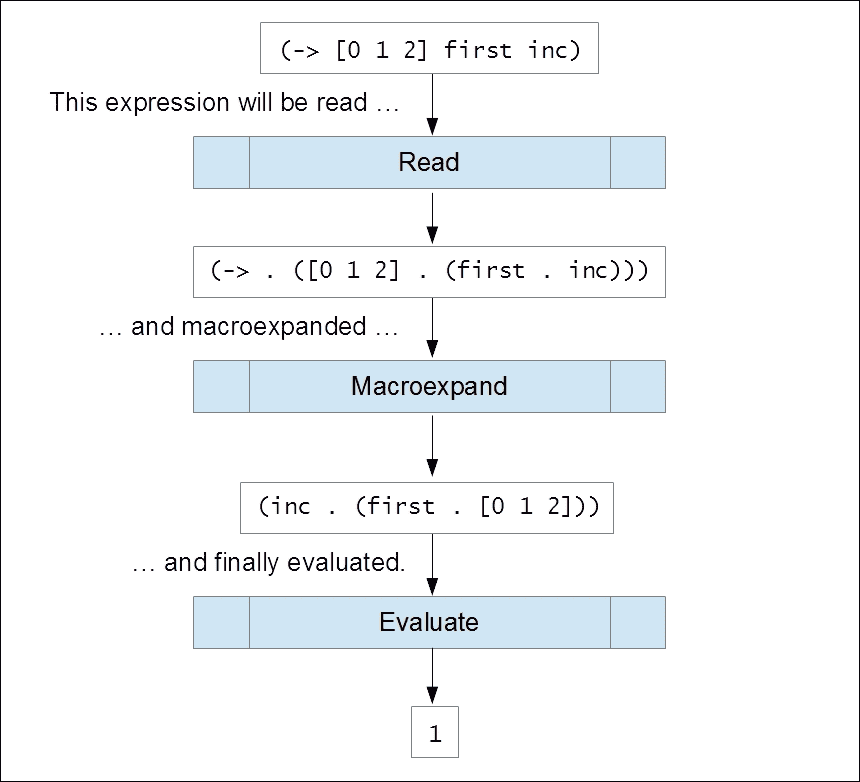

读取器首先从 Clojure 程序的源代码中解析 s-表达式的文本表示。一旦程序源代码被读取为 s-表达式，代码中的所有宏调用都将被它们的定义所替换。程序中宏调用的这种转换称为 *宏展开*。最后，宏展开阶段产生的 s-表达式将由 Clojure 运行时进行评估。在评估阶段，从提供的表达式生成字节码，加载到内存中，并执行。简而言之，程序源代码中的代码被读取，通过宏进行转换，最终被评估。此外，宏展开在程序源代码解析后立即发生，因此允许程序在评估之前内部转换自身。这种代码的转换正是宏被用来实现的目的。

### 注意

在 Clojure 中，读取器只读取代码并执行宏展开。字节码的生成由分析器和生成器完成，并且这个生成的字节码由 JVM 进行评估。

所有 Clojure 代码在评估之前都被转换为 *读取形式* 和 *特殊形式*。特殊形式是直接作为底层运行时（如 Clojure 的 JVM 或 ClojureScript 的 Rhino JavaScript 运行时）的字节码实现的构造，例如 `quote` 和 `let*`。有趣的是，Clojure 源代码主要由读取形式组成，这些读取形式在 Clojure 本身中得到实现。读取器还会在读取时立即转换某些字符和称为 *读取宏* 的形式。Clojure 语言中有几个读取宏，如下表所述：

| 读取宏 | 用法 |
| --- | --- |
| `\x` | 这是一个字符字面量。 |
| `;` | 这用于注释。它忽略该行的其余部分。 |
| `(.method o)` | 这是一个本地方法调用。它被重写为点 (`.`) 形式，作为 `(. o method)`。此外，`o` 必须是一个本地对象。 |
| `@x` 或 `@( ... )` | 这是解引用运算符。它与引用类型一起使用，并被重写为 `deref` 形式。 |
| `^{ ... }` | 这是与形式一起使用的元数据映射。它被重写为 `with-meta` 形式。 |
| `'x` 或 `'( ... )` | 这是一个引用。 |
| `` `x `` 或 `` `( ... ) `` | 这是一个语法引用。 |
| `~x` 或 `~( ... )` | 这用于非引用。 |
| `~@x` 或 `~@( ... )` | 这是一个切片非引用。 |
| `#_x` 或 `#_( ... )` | 这忽略下一个形式。`#_` 应该比 `comment` 形式更优先用于注释代码，因为注释实际上返回 `nil`。 |
| `#'x` | 这是一个变量引用。它等同于 `(var x)`。 |
| `#=x` 或 `#=( ... )` | 这将读取并评估一个表达式。 |
| `#?( ... )` | 这是一种读者条件形式。 |
| `#?@( ... )` | 这是一种读者条件拼接形式。 |

在前面的章节中，我们已经遇到了很多前面的读取器宏。我们将在本章中演示与宏一起使用的几个读取形式的用法。

### 注意

在撰写本书时，Clojure 不支持用户定义的读取器宏。

现在我们已经熟悉了 Clojure 的读取器和代码的解析方式，让我们探索各种元编程结构，这些结构帮助我们读取和评估代码。

# 阅读和评估代码

让我们看看在 Clojure 中代码是如何被解析和评估的。将文本转换为表达式的最基本方法是通过使用`read`函数。该函数将其第一个参数作为`java.io.PushbackReader`实例接受，如下所示：

```java
user> (read (-> "(list 1 2 3)"
 .toCharArray
 java.io.CharArrayReader.
 java.io.PushbackReader.))
(list 1 2 3)
```

### 注意

这些示例可以在书籍源代码的`src/m_clj/c4/read_and_eval.clj`中找到。

在这个例子中，一个包含有效表达式的字符串首先被转换为`java.io.PushbackReader`的实例，然后传递给`read`函数。读取字符串似乎是一个很多不必要的步骤，但这是因为`read`函数处理流和读取器，而不是字符串。如果没有向`read`函数传递任何参数，它将创建一个从标准输入创建的读取器，并提示用户输入要解析的表达式。`read`函数还有其他几个选项，鼓励您在 REPL 上自行探索这些选项。

从字符串中读取表达式的更简单的方法是使用`read-string`函数。该函数接受一个字符串作为其唯一参数，并将提供的字符串转换为表达式，如下所示：

```java
user> (read-string "(list 1 2 3)")
(list 1 2 3)
```

`read`和`read-string`形式只能将字符串转换为有效的表达式。如果我们必须评估一个表达式，我们必须使用`eval`函数，如下所示：

```java
user> (eval '(list 1 2 3))
(1 2 3)
user> (eval (list + 1 2 3))
6
user> (eval (read-string "(+ 1 2 3)"))
6
```

在前面的输出中的第一行语句中，我们使用引号运算符（`'`）防止在传递给`eval`函数之前评估表达式`(list 1 2 3)`。这种技术被称为*引用*，我们将在本章后面进一步探讨。`eval`函数将表达式`(list 1 2 3)`评估为列表`(1 2 3)`。同样，在第二行中，表达式`(list + 1 2 3)`首先被读取器评估为`(+ 1 2 3)`，然后`eval`函数将这个列表评估为值`6`。在第三行中，字符串`"(+ 1 2 3)"`首先被`read-string`函数解析，然后由`eval`函数评估。

`read-evaluate`宏（`#=`）可以用来强制`read`和`read-string`函数在解析时评估一个表达式，如下所示：

```java
user> (read (-> "#=(list 1 2 3)"
 .toCharArray
 java.io.CharArrayReader.
 java.io.PushbackReader.))
(1 2 3)
user> (read-string "#=(list 1 2 3)")
(1 2 3)
```

在前面的输出中，`#=` 读取宏在由 `read` 和 `read-string` 函数读取时评估表达式 `(list 1 2 3)`。如果没有使用 `#=` 宏，两个语句都会返回表达式 `(list 1 2 3)` 的字面值。我们也可以在不使用 `read` 或 `read-string` 的情况下使用 `#=` 宏，在这种情况下，它将等同于调用 `eval` 函数。此外，对 `#=` 宏的调用可以嵌套任意次数，如下所示：

```java
user> #=(list + 1 2 3)
6
user> (read-string "#=(list + 1 2 3)")
(+ 1 2 3)
user> (read-string "#=#=(list + 1 2 3)")
6
```

`#=` 宏使得在读取表达式时评估它们变得容易。哦，等等！这是一个潜在的安全隐患，因为 `read` 和 `read-string` 函数正在评估任意字符串，即使它们包含任何恶意代码。因此，在解析时评估代码被认为是不安全的。为了解决这个问题，可以将 `*read-eval*` 变量设置为 `false` 以防止使用 `#=` 宏，如下所示：

```java
user> (binding [*read-eval* false]
 (read-string (read-string "#=(list 1 2 3)")))
RuntimeException EvalReader not allowed when *read-eval* is false. clojure.lang.Util.runtimeException (Util.java:221)
```

因此，当 `*read-eval*` 设置为 `false` 时，在传递给 `read` 和 `read-string` 函数的字符串中使用 `#=` 宏将会引发错误。显然，这个变量的默认值是 `true`。因此，我们必须避免使用 `#=` 宏，或者在处理用户输入时将 `*read-eval*` 变量设置为 `false`。

另一种读取和评估任意字符串的方法是使用 `load-string` 函数。这个函数与 `read-string` 函数具有相同的 arity，并且与调用 `eval` 和 `read-string` 形式等价，如下所示：

```java
user> (load-string "(+ 1 2 3)")
6
```

使用 `load-string` 形式与 `eval` 和 `read-string` 形式的组合之间存在一些语义上的差异。首先，`load-string` 函数的行为不受 `*read-eval*` 变量的变化影响，因此对于任意用户输入的使用是不安全的。

一个更重要的区别是，`read-string` 函数只解析它传递的字符串中遇到的第一个表达式。`load-string` 函数将解析并评估传递给它的所有表达式，如下所示：

```java
user> (eval (read-string "(println 1) (println 2)"))
1
nil
user> (load-string "(println 1) (println 2)")
1
2
nil
```

在前面的输出中，`read-string` 形式跳过了它传递的字符串中的第二个 `println` 形式，因此只打印了值 `1`。然而，`load-string` 形式会解析并评估它作为字符串传递的 `println` 形式，并打印出值 `1` 和 `2`。

`load-reader` 函数类似于 `read` 函数，因为它接受一个 `java.io.PushbackReader` 实例作为参数，必须从这个实例中读取和评估形式。`load-string` 的另一个变体是 `load-file` 函数，我们可以传递包含源代码的文件路径给它。`load-file` 函数将解析它传递的路径中的文件，并评估其中所有形式。

### 注意

注意，可以使用 `*file*` 变量来获取正在执行文件的路径。

到目前为止，我们已经看到了 Clojure 读取器如何解析和评估代码。有几个结构可以用来执行这些任务。然而，评估任意字符串并不是一个好主意，因为被评估的代码是不安全的，可能是恶意的。在实践中，我们应该始终将`*read-eval*`变量设置为`false`，以防止`read`和`read-string`等函数评估任意代码。接下来，我们将探讨如何使用*引用*和*取消引用*来转换表达式。

# 引用和取消引用代码

我们现在将探讨*引用*和*取消引用*，这些是用于根据表达式的预定义模板生成表达式的技术。这些技术在创建宏时是基础性的，并且有助于使宏的代码看起来更像其宏展开形式。

### 注意

以下示例可以在书的源代码的`src/m_clj/c4/`目录下的`quoting.clj`文件中找到。

`quote`形式简单地返回一个表达式而不对其进行评估。这看起来可能微不足道，但防止表达式评估实际上并不是所有编程语言都可能做到的。`quote`形式使用撇号字符（`'`）缩写。如果我们*引用*一个表达式，它将按原样返回，如下所示：

```java
user> 'x
x
user> (quote x)
x
```

`quote`形式在 Lisp 中相当历史悠久。它是原始 Lisp 语言中的七个原始运算符之一，如约翰·麦卡锡的论文中所述。顺便提一下，`quote`是少数在 Java 中实现而在 Clojure 自身中未实现的特殊形式之一。`quote`形式用于处理变量名，或*符号*，作为值。简而言之，使用`quote`形式，我们可以将给定的表达式视为符号和值的列表。毕竟，*代码即数据*。

### 注意

撇号（`'`）仅当它作为表达式的第一个字符出现时才表示一个引用表达式。例如，`x'`只是一个变量名。

语法引号，写作反引号字符（`` ` ``），将引用一个表达式并允许在内部执行取消引用。这个构造允许我们创建与引用类似的表达式，同时还有额外的优势，即允许我们在引用形式中插入值和执行任意代码。这相当于将预定义的表达式视为模板，其中一些部分留空以供以后填充。在语法引用形式中的表达式可以使用潮汐字符 (`~`) 进行取消引用。取消引用表达式将评估它并将结果插入到周围的语法引用形式中。切片取消引用，写作 `~@`，可以用来评估返回列表的表达式，并使用返回的值列表作为形式的参数。这类似于 `apply` 形式的功能，但它是语法引号上下文中的。我们必须注意，这两种取消引用操作（`~` 和 `~@`）只能在语法引号形式中使用。我们可以在 REPL 中尝试这些操作，如下所示：

```java
user> (def a 1)
#'user/a
user> `(list ~a 2 3)
(clojure.core/list 1 2 3)
user> `(list ~@[1 2 3])
(clojure.core/list 1 2 3)
```

如此所示，在先前的语法引用 `list` 形式中取消引用变量 `a` 返回表达式 `(list 1 2 3)`。同样，使用切片取消引用向量 `[1 2 3]` 也返回相同的列表。另一方面，在引用形式中取消引用变量将展开取消引用读取宏 (`~`) 为 `clojure.core/unquote` 形式，如下所示：

```java
user> (def a 1)
#'user/a
user> `(list ~a 2 3)
(clojure.core/list 1 2 3)
user> '(list ~a 2 3)
(list (clojure.core/unquote a) 2 3)
```

使用引号和语法引号之间更有趣的区别是，后者将解析所有变量名到具有命名空间限定名的名称。这也适用于函数名。例如，让我们看看以下表达式：

```java
user> `(vector x y z)
(clojure.core/vector user/x user/y user/z)
user> `(vector ~'x ~'y ~'z)
(clojure.core/vector x y z)
```

如前所示输出，变量 `x`、`y` 和 `z` 通过引用语法被解析为 `user/x`、`user/y` 和 `user/z`，因为 `user` 是当前命名空间。此外，`vector` 函数被转换为具有命名空间限定名的名称，显示为 `clojure.core/vector`。连续使用 `~'` 操作可以用来绕过将符号解析为具有命名空间限定名的名称。

引用不仅支持列表，还支持其他数据结构，如向量、集合和映射。语法引号对所有数据结构的效果相同；它允许在内部取消引用表达式，从而转换引用形式。此外，引用形式可以嵌套，例如，一个引用形式可以包含其他引用形式。在这种情况下，最深的引用形式首先被处理。考虑以下引用向量：

```java
user> `[1 :b ~(+ 1 2)]
[1 :b 3]
user> `[1 :b '~(+ 1 2)]
[1 :b (quote 3)]
user> `[1 ~'b ~(+ 1 2)]
[1 b 3]
```

从前面的输出中可以推断出很多有趣的地方。首先，关键字显然没有被内部化到命名空间限定名称，如符号。实际上，任何评估为自身的值，如关键字、`nil`、`true`和`false`，在语法引号形式中使用时都会表现出这种行为。除此之外，在语法引号中先 unquote 然后 quote 一个表达式，如`'~(+ 1 2)`，将评估该表达式并将其用 quote 包裹。相反，unquote 一个 quote 过的符号，如`~'b`，将防止它像我们之前提到的那样解析为命名空间限定名称。让我们看看另一个使用嵌套 quote 的例子，如下所示：

```java
user> (def ops ['first 'second])
#'user/ops
user> `{:a (~(nth ops 0) ~'xs)
 :b (~(nth ops 1) ~'xs)}
{:b (second xs),
 :a (first xs)}
```

在前面的输出中，变量`first`、`second`和`xs`通过结合使用 quote（`'`）和 unquote（`~`）操作来防止被内部化到命名空间中。任何使用过较老 Lisp 的人可能在这个时候都会感到不舒服。实际上，应该避免使用`~'`操作。这是因为防止变量解析为命名空间限定名称并不是一个好主意。实际上，与 Clojure 不同，一些 Lisp 完全不允许这样做。这会导致一个称为*符号捕获*的特殊问题，我们将在探索宏的时候看到。

# 代码转换

如本章之前所述，使用`read`和`eval`函数及其变体在 Clojure 中读取和评估代码是微不足道的。我们可以在解析代码后立即评估它，而不是使用宏首先通过 quote 和 unquote 程序性地转换代码，然后再评估它。因此，宏帮助我们定义自己的结构，这些结构可以重写和转换传递给它们的表达式。在本节中，我们将探讨创建和使用宏的基本知识。

## 展开宏

宏在调用时需要被**展开**。所有 Clojure 代码都是按照我们之前描述的方式，由读取器读取、宏展开和评估的。现在让我们看看宏展开是如何进行的。正如你可能已经猜到的，这是通过普通的 Clojure 函数来完成的。

有趣的是，Clojure 运行时的读取器也使用这些函数来处理程序的源代码。作为一个例子，我们将检查`->`连接宏是如何宏展开的。`->`宏可以像下面这样使用：

```java
user> (-> [0 1 2] first inc)
1
user> (-> [0 1 2] (-> first inc))
1
user> (-> (-> [0 1 2] first) inc)
1
```

### 注意

这些例子可以在书籍源代码的`src/m_clj/c4/macroexpand.clj`中找到。

前面的输出中使用`->`宏的所有三个表达式都将被评估为值`1`。这是因为它们都被宏展开为相同的最终表达式。我们如何证明这一点呢？嗯，我们可以使用`macroexpand-1`、`macroexpand`和`clojure.walk/macroexpand-all`函数来证明。`macroexpand`函数返回一个形式的完整宏展开，如下所示：

```java
user> (macroexpand '(-> [0 1 2] first inc))
(inc (first [0 1 2]))
```

使用 `->` 连接宏的表达式因此被转换为 `(inc (first [0 1 2]))` 表达式，该表达式计算出的值为 `1`。这样，`macroexpand` 函数允许我们检查表达式的宏展开形式。

`macroexpand-1` 函数返回宏的第一个展开。实际上，`macroexpand` 函数只是重复应用 `macroexpand-1` 函数，直到无法再进行宏展开。我们可以使用这些函数检查 `(-> [0 1 2] (-> first inc))` 表达式的宏展开过程：

```java
user> (macroexpand-1 '(-> [0 1 2] (-> first inc)))
(-> [0 1 2] first inc)
user> (macroexpand '(-> [0 1 2] (-> first inc)))
(inc (first [0 1 2]))
```

`macroexpand` 函数有一个小的限制。它只重复宏展开一个表达式，直到表达式的第一个形式是宏。因此，`macroexpand` 函数不会完全宏展开 `(-> (-> [0 1 2] first) inc)` 表达式，如下所示：

```java
user> (macroexpand-1 '(-> (-> [0 1 2] first) inc))
(inc (-> [0 1 2] first))
user> (macroexpand '(-> (-> [0 1 2] first) inc))
(inc (-> [0 1 2] first))
```

如前例所示，`macroexpand` 函数将返回与 `macroexpand-1` 相同的宏展开结果。这是因为对 `->` 宏的第二次调用不是前一个表达式的第一次宏展开结果中的第一个形式。在这种情况下，我们可以使用 `clojure.walk` 命名空间中的 `macroexpand-all` 函数来宏展开给定表达式，无论宏调用在其中的位置如何，如下所示：

```java
user> (clojure.walk/macroexpand-all '(-> (-> [0 1 2] first) inc))
(inc (first [0 1 2]))
```

因此，使用 `->` 宏作为示例的所有三个表达式都被宏展开为相同的表达式 `(inc (first [0 1 2]))`，该表达式计算出的值为 `1`。

### 注意

`macroexpand-1`、`macroexpand` 和 `clojure.walk/macroexpand-all` 函数对不包含任何宏的表达式没有任何影响。

`macroexpand-1` 和 `macroexpand` 函数是调试用户定义宏的不可或缺的工具。此外，`clojure.walk/macroexpand-all` 函数可以在 `macroexpand` 函数无法完全宏展开给定表达式的情况下使用。Clojure 读取器也使用这些函数来宏展开程序的源代码。

## 创建宏

宏是通过 `defmacro` 形式定义的。宏名、宏的参数向量、可选的文档字符串和宏的主体必须传递给此形式。我们还可以指定宏的多个可变性。它与 `defn` 形式的相似性非常明显。然而，与 `defn` 形式不同的是，使用 `defmacro` 形式定义的宏不会评估传递给它的参数。换句话说，传递给宏的参数是隐式引用的。例如，我们可以创建几个宏来重写中缀和后缀表示法中的 s 表达式，如 *示例 4.1* 所示。

```java
(defmacro to-infix [expr]
  (interpose (first expr) (rest expr)))

(defmacro to-postfix [expr]
  (concat (rest expr) [(first expr)]))
```

> *示例 4.1：将前缀表达式转换的宏*

### 注意

这些示例可以在书籍源代码的 `src/m_clj/c4/defmacro.clj` 中找到。

*示例 4.1*中的每个宏都描述了一种优雅的重写表达式`expr`的方法，将其视为一个通用序列。在表达式`expr`中调用的函数使用`first`形式提取，其参数使用`rest`形式获得。要将表达式转换为其中缀形式，我们使用`interpose`函数。同样，表达式`expr`的后缀形式使用`concat`形式生成。我们可以使用`macroexpand`函数来检查`to-infix`和`to-postfix`宏生成的表达式，如下所示：

```java
user> (macroexpand '(to-infix (+ 0 1 2)))
(0 + 1 + 2)
user> (macroexpand '(to-postfix (+ 0 1 2)))
(0 1 2 +)
```

### 注意

表达式`x + y`被称为是使用*中缀*表示法书写的。这个表达式的*前缀*表示法是`+ x y`，而其*后缀*表示法是`x y +`。

通过转换表达式，我们可以有效地修改语言。就这么简单！*示例 4.1*中`to-infix`和`to-postfix`宏的基础是，我们可以将表达式的项视为一个元素序列，并使用诸如`interpose`和`concat`之类的序列函数来操作它们。当然，前面的例子足够简单，以至于我们可以完全避免使用引号。`defmacro`形式也可以与引号结合使用，以便轻松重写更复杂的表达式。同样的规则可以应用于 Clojure 代码的任何形式。

有趣的是，宏在内部表示为函数，这可以通过取消引用宏的完全限定名称并使用`fn?`函数来验证，如下所示：

```java
user> (fn? @#'to-infix)
true
user> (fn? @#'to-postfix)
true
```

### 注意

在编写这本书的时候，ClojureScript 只支持用 Clojure 编写的宏。宏必须使用`:require-macros`关键字在 ClojureScript 命名空间声明中引用，如下所示：

```java
(ns my-cljs-namespace
  (:require-macros [my-clj-macro-namespace :as macro]))
```

`symbol`和`gensym`函数可以用来在宏体内部创建临时变量。`symbol`函数从一个名称和一个可选的命名空间返回一个符号，如下所示：

```java
user> (symbol 'x)
x
user> (symbol "x")
x
user> (symbol "my-namespace" "x")
my-namespace/x
```

### 注意

我们可以使用`symbol?`谓词来检查一个值是否是符号。

`gensym` 函数可以用来创建一个唯一的符号名称。我们可以指定一个前缀，用于`gensym`函数返回的符号名称。默认的前缀是一个大写字母`G`后跟两个下划线（`G__`）。`gensym`函数还可以用来创建一个新的唯一关键字。我们可以在 REPL 中尝试`gensym`函数，如下所示：

```java
user> (gensym)
G__8090
user> (gensym 'x)
x8081
user> (gensym "x")
x8084
user> (gensym :x)
:x8087
```

如下所示，每次调用`gensym`函数时，它都会创建一个新的符号。在语法引号形式中，我们可以使用由前缀名称和`gensym`函数创建的自动符号名称，如下所示：

```java
user> `(let [x# 10] x#)
(clojure.core/let [x__8561__auto__ 10]
  x__8561__auto__)
user> (macroexpand `(let [x# 10] x#))
(let* [x__8910__auto__ 10]
  x__8910__auto__)
```

### 注意

`let`形式实际上是一个使用`let*`特殊形式定义的宏。

如前所述的表达式所示，语法引号形式中所有出现的 *自动生成符号* 变量 `x#` 都被替换为自动生成的符号名称。我们应该注意，只有符号，而不是字符串或关键字，可以用作自动生成符号的前缀。

通过这种方式生成唯一的符号，我们可以创建 *卫生宏*，这些宏避免了 *符号捕获* 或 *变量捕获* 的可能性，这是一个在使用动态作用域变量和宏时出现的有趣问题。为了说明这个问题，考虑 *示例 4.2* 中定义的宏：

```java
(defmacro to-list [x]
  `(list ~x))

(defmacro to-list-with-capture [x]
  `(list ~'x))
```

> *示例 4.2：表示符号捕获的宏*

*示例 4.2* 中的宏使用 `list` 形式和值 `x` 创建一个新的列表。当然，我们在这里实际上并不需要使用宏，但这样做只是为了演示符号捕获。`to-list-with-capture` 宏通过使用 `~'` 操作从周围作用域 *捕获* 变量 `x`。如果我们使用 `let` 形式将变量名 `x` 绑定到一个值，那么在调用 `to-list` 和 `to-list-with-capture` 宏时将得到不同的结果，如下所示：

```java
user> (let [x 10]
 (to-list 20))
(20)
user> (let [x 10]
 (to-list-with-capture 20))
(10)
```

`to-list-with-capture` 函数似乎会从周围的作用域动态获取 `x` 的值，而不是从传递给它的参数中获取。正如你可能猜到的，这可能会导致许多微妙且奇怪的错误。在 Clojure 中，这个问题的解决方案很简单；一个语法引号形式会将所有自由符号解析为命名空间限定名称。这可以通过宏展开前一个示例中使用 `to-list` 函数的表达式来验证。

假设我们想使用一个宏来执行与 *示例 4.2* 中的 `to-list` 宏相同任务的 `let` 形式来使用一个临时变量。这看起来可能相当没有必要，但这样做只是为了演示语法引号如何解析符号。这样的宏可以像 *示例 4.3* 中所示那样实现：

```java
(defmacro to-list-with-error [x]
  `(let [y ~x]
     (list y)))
```

调用 `to-list-with-error` 宏会导致错误，因为使用了自由符号 `y`，如下所示：

```java
user> (to-list-with-error 10)
CompilerException java.lang.RuntimeException:
Can't let qualified name: user/y
```

这个错误可能相当令人烦恼，因为我们只是想在 `to-list-with-error` 宏的主体中使用一个临时变量。这个错误发生是因为不清楚变量 `y` 是从哪里解析出来的。为了绕过这个错误，我们可以将变量 `y` 声明为自动生成符号变量，如 *示例 4.4* 中所示：

```java
(defmacro to-list-with-gensym [x]
  `(let [y# ~x]
     (list y#)))
```

> *示例 4.4：使用 let 形式和自动生成符号变量的宏*

`to-list-with-gensym` 宏按预期工作，没有任何错误，如下所示：

```java
user> (to-list-with-gensym 10)
(10)
```

我们还可以使用 `macroexpand` 和 `macroexpand-1` 形式来检查 `to-list-with-gensym` 宏生成的表达式，鼓励读者在 REPL 中尝试这样做。

总结来说，使用 `defmacro` 形式定义的宏可以用来重写和转换代码。语法引号和自动生成符号变量可以用来编写卫生宏，从而避免由于动态作用域的使用而可能出现的某些问题。

### 注意

语法引用实际上可以作为一个用户定义的宏来实现。例如，`syntax-quote` ([`github.com/hiredman/syntax-quote`](https://github.com/hiredman/syntax-quote)) 和 `backtick` ([`github.com/brandonbloom/backtick`](https://github.com/brandonbloom/backtick)) 库展示了语法引用是如何通过宏来实现的。

## 在宏中封装模式

在 Clojure 中，可以使用宏来用函数和特殊形式重写表达式。然而，在 Java 和 C#等语言中，为了处理特殊形式，语言中添加了大量的额外语法。例如，考虑这些语言中的`if`构造，它用于检查表达式是否为真。这个构造确实有一些特殊的语法。如果在用这些语言编写的程序中发现了`if`构造的重复使用模式，就没有明显的方法来自动化这个模式。Java 和 C#等语言有*设计模式*的概念，可以封装这类模式。但是，如果没有重写表达式的功能，在这些语言中封装模式可能会变得有些不完整和繁琐。我们向语言中添加的特别形式和语法越多，程序化生成代码就越困难。另一方面，Clojure 和其他 Lisp 中的宏可以轻松地重写表达式，以自动化代码中的重复模式。此外，在 Lisp 中，代码和数据是一致的，因此几乎没有代码的特殊语法。从某种意义上说，Lispy 语言中的宏通过扩展语言以我们自己的手工构造来允许我们简洁地封装设计模式。

让我们探索一些示例，以展示宏如何被用来封装模式。Clojure 中的`->`和`->>`线程宏通过传递一个初始值来组合几个函数。换句话说，初始值是通过`->`和`->>`宏的参数传递的各种形式进行*线程化*的。这些宏作为 Clojure 语言的一部分定义在`clojure.core`命名空间中，如*示例 4.5*所示。

### 注意

以下示例可以在书籍源代码的`src/m_clj/c4/threading.clj`中找到。

```java
(defmacro -> [x & forms]
  (loop [x x
         forms forms]
    (if forms
      (let [form (first forms)
            threaded (if (seq? form)
                       (with-meta
                         `(~(first form) ~x ~@(next form))
                         (meta form))
                       (list form x))]
        (recur threaded (next forms)))
      x)))

(defmacro ->> [x & forms]
  (loop [x x
         forms forms]
    (if forms
      (let [form (first forms)
            threaded (if (seq? form)
                       (with-meta
                         `(~(first form) ~@(next form) ~x)
                         (meta form))
                       (list form x))]
        (recur threaded (next forms)))
      x)))
```

> *示例 4.5：->和->>线程宏*

*示例 4.5* 中的 `->` 和 `->>` 宏使用 `loop` 形式递归地将值 `x` 线程通过由 `forms` 表示的表达式。一个形式中的第一个符号，即被调用的函数，是通过使用 `first` 函数确定的。除了 `x` 之外，要传递给此函数的参数是通过 `next` 函数提取的。如果一个形式只是一个不带任何额外参数的函数名，我们则使用表达式 `(list form x)` 创建一个新的形式。`with-meta` 形式用于保留使用 `form` 指定的任何元数据。`->` 宏将 `x` 作为第一个参数传递，而 `->>` 宏将 `x` 作为最后一个参数传递。这是以递归方式对所有传递给这些宏的形式进行的。有趣的是，`->` 和 `->>` 宏都很少使用语法引用形式。我们实际上可以将这些宏的一些部分重构为函数。这带来了一点点优势，因为与宏相比，函数可以很容易地进行测试。`->` 和 `->>` 线程宏可以重构如 *示例 4.6* 和 *示例 4.7* 所示：

```java
(defn thread-form [first? x form]
  (if (seq? form)
    (let [[f & xs] form
          xs (conj (if first? xs (vec xs)) x)]
      (apply list f xs))
    (list form x)))

(defn threading [first? x forms]
  (reduce #(thread-form first? %1 %2)
          x forms))
```

> *示例 4.6: 重构 -> 和 ->> 线程宏*

*示例 4.6* 中的 `thread-form` 函数使用 `conj` 函数在表达式形式中定位值 `x`。这里的假设是 `conj` 函数将在列表的头部添加一个元素，或在向量的末尾或尾部添加一个元素。`first?` 参数用于指示值 `x` 是否需要作为 `form` 的第一个参数传递。`threading` 函数简单地将 `thread-form` 函数应用于它接收到的所有表达式，即 `forms`。现在可以使用 `threading` 函数实现 `->` 和 `->>` 宏，如 *示例 4.7* 所示：

```java
(defmacro -> [x & forms]
  (threading true x forms))

(defmacro ->> [x & forms]
  (threading false x forms))
```

> *示例 4.7: 重构 -> 和 ->> 线程宏（续）*

在 *示例 4.7* 中定义的线程宏与 *示例 4.5* 中的宏效果一样好，我们可以在 REPL 中验证这一点。这被留作读者的练习。

`let` 表达式的常见用法是通过将变量传递给多个函数来反复重新绑定其值。这种模式可以使用 `as->` 线程宏进行封装，该宏的定义如 *示例 4.8* 所示。

```java
(defmacro as-> [expr name & forms]
  `(let [~name ~expr
         ~@(interleave (repeat name) forms)]
     ~name))
```

> *示例 4.8: 重构 -> 和 ->> 线程宏*

让我们跳过用文字解释 `as->` 宏的细节，而直接使用 `macroexpand` 函数描述它生成的代码，如下所示：

```java
user> (macroexpand '(as-> 1 x (+ 1 x) (+ x 1)))
(let* [x 1
       x (+ 1 x)
       x (+ x 1)]
      x)
user> (as-> 1 x (+ 1 x) (+ x 1))
3
```

`as->` 宏将其第一个参数绑定到由其第二个参数表示的符号，并生成一个 `let*` 形式作为结果。这允许我们以显式符号的形式定义必须在线程中传递的表达式。甚至可以说，与使用 `->` 和 `->>` 宏相比，这是一种更灵活的方式来执行通过多个表达式传递值的线程操作。

### 注意

`as->` 形式是在 Clojure 1.5 中引入的，与其他几个线程宏一起。

因此，宏是自动化或封装代码中模式的强大工具。Clojure 语言中一些常用的形式实际上被定义为宏，我们也可以轻松地定义自己的宏。

## 使用读取条件

在 Clojure 及其方言（如 ClojureScript）中，经常需要与原生对象进行交互。我们可以使用*读取条件*来定义特定平台的代码。现在让我们简要地看看我们如何使用读取条件。

### 注意

读取条件在 Clojure 1.7 版本中被引入。在版本 1.7 之前，特定平台的 Clojure/ClojureScript 代码必须使用`cljx`库（[`github.com/lynaghk/cljx`](https://github.com/lynaghk/cljx)）来管理。

*读取条件形式*，写作`#?( ... )`，允许我们使用`:cljs`、`:clj`、`:clr`和`:default`关键字来定义特定平台的代码。*读取条件拼接形式*，写作`#?@( ... )`，具有与读取条件形式类似的语义。它可以用来将特定平台的值或表达式列表拼接到一个形式中。这两个条件形式在读取代码时被处理，而不是在宏展开时。

自 Clojure 1.7 以来，`read-string`函数有一个第二个参数，我们可以指定一个映射作为参数。这个映射可以有两个键，`:read-cond`和`:features`。当包含条件形式的字符串传递给`read-string`函数时，可以通过在映射的`:features`键中指定平台作为一组关键字（由`:cljs`、`:clj`或`:clr`表示）来生成特定平台的代码。在这种情况下，必须指定关键字`:allow`作为传递给`read-string`函数的映射中`:read_cond`键的值，否则将抛出异常。我们可以在 REPL 中使用`read-string`函数尝试读取条件形式，如下所示：

```java
user> (read-string {:read-cond :allow :features #{:clj}}
 "#?(:cljs \"ClojureScript\" :clj \"Clojure\")")
"Clojure"
user> (read-string {:read-cond :allow :features #{:cljs}}
 "#?(:cljs \"ClojureScript\" :clj \"Clojure\")")
"ClojureScript"
```

### 注意

这些示例可以在书籍源代码的`src/m_clj/c4/reader_conditionals.cljc`中找到。

类似地，我们可以使用`read-string`函数将条件拼接形式读取到一个表达式中，如下所示：

```java
user> (read-string {:read-cond :allow :features #{:clr}}
 "[1 2 #?@(:cljs [3 4] :default [5 6])]")
[1 2 5 6]
user> (read-string {:read-cond :allow :features #{:clj}}
 "[1 2 #?@(:cljs [3 4] :default [5 6])]")
[1 2 5 6]
user> (read-string {:read-cond :allow :features #{:cljs}}
 "[1 2 #?@(:cljs [3 4] :default [5 6])]")
[1 2 3 4]
```

我们还可以通过在传递给`read-string`函数的可选映射中指定`:preserve`关键字和`:read-cond`键来防止条件形式的转换，如下所示：

```java
user> (read-string {:read-cond :preserve}
 "[1 2 #?@(:cljs [3 4] :clj [5 6])]")
[1 2 #?@(:cljs [3 4] :clj [5 6])]
```

然而，在实际操作中，将条件形式包裹在字符串中并不是我们应该做的事情。通常，我们应该将所有特定平台的代码作为读取条件形式写入具有`.cljc`扩展名的源文件中。一旦`.cljc`文件中定义的顶层形式被 Clojure 读取器处理，我们就可以像使用任何其他读取形式一样使用它们。例如，考虑在*示例 4.9*中使用读取条件形式编写的宏：

```java
(defmacro get-milliseconds-since-epoch []
  `(.getTime #?(:cljs (js/Date.)
                :clj (java.util.Date.))))
```

> *示例 4.9：使用读取条件的宏*

在*示例 4.9*中，`get-milliseconds-since-epoch`宏在从 Clojure 代码调用时，会在新的`java.util.Date`实例上调用`.getTime`方法。此外，当在 ClojureScript 代码中使用时，此宏也会在新的 JavaScript`Date`对象上调用`.getTime`方法。我们可以从 Clojure REPL 中宏展开对`get-milliseconds-since-epoch`宏的调用，以生成特定于 JVM 的代码，如下所示：

```java
user> (macroexpand '(get-milliseconds-since-epoch))
(. (java.util.Date.) getTime)
```

因此，读取条件有助于封装特定于平台的代码，以便在不受底层平台影响的代码中使用。

## 避免使用宏

宏是定义 Clojure 中我们自己的结构的一种极其灵活的方式。然而，在程序中不小心使用宏可能会变得复杂，并导致许多隐藏在视线之外的奇怪错误。正如*Stuart Halloway*和*Aaron Bedra*在《Programming Clojure》一书中所描述的，Clojure 中宏的使用有两个经验法则：

+   **不要编写宏**：每次我们尝试使用宏时，我们必须三思是否可以使用函数来完成相同的任务。

+   **如果它是封装模式的唯一方法，则编写宏**：只有当宏比调用函数更容易或更方便时，才应使用宏。

宏的问题是什么？嗯，宏以几种方式使程序的代码变得复杂：

+   宏不能像函数那样组合，因为它们实际上不是值。例如，不可能将宏作为参数传递给`map`或`apply`形式。

+   宏不像函数那样容易测试。虽然可以通过编程方式完成，但测试宏的唯一方法是通过使用宏展开函数和引用。

+   在某些情况下，调用宏的代码可能本身就是作为宏编写的，从而增加了我们代码的复杂性。

+   由符号捕获等问题引起的隐藏错误使宏变得有些棘手。在大型代码库中调试宏也不是很容易。

由于这些原因，宏必须谨慎和负责任地使用。实际上，如果我们可以使用宏和函数解决同一个问题，我们应该始终优先选择使用函数的解决方案。如果确实需要使用宏，我们应该始终努力将尽可能多的代码从宏中重构到函数中。

除了这些，宏使编程变得很有趣，因为它们允许我们定义自己的结构。它们提供了一种在其他语言中实际上不可能的自由和灵活性。你可能经常听到经验丰富的 Clojure 程序员告诉你宏是邪恶的，你不应该使用它们，但不要让这一点阻止你探索宏所能实现的可能性。一旦你遇到并解决了使用宏时出现的一些问题，你将拥有足够的经验来判断何时适当地使用宏。

# 摘要

我们在本章中探讨了如何在 Clojure 中使用元编程。我们讨论了代码是如何被读取、宏展开和评估的，以及实现这些操作的各个原始构造。宏可以用来封装代码中的模式，正如我们在本章的各个示例中所展示的那样。在章节的结尾，我们还讨论了读取条件，并指出了使用宏时出现的各种复杂情况。

在下一章中，我们将探讨如何使用转换器处理任何数据，无论数据源是什么。

# 第五章。组合转换器

让我们回到在 Clojure 中执行数据计算之旅。我们已经在第三章中讨论了如何使用**归约器**来处理集合，即*并行化使用归约器*。实际上，转换器是归约器的一种推广，它独立于数据源。此外，归约器更多地关于并行化，而转换器则更专注于泛化数据转换，而不限制我们使用任何特定的数据源。转换器捕捉了在序列上操作的标准函数（如`map`和`filter`）的本质，适用于多个数据源。它们允许我们定义和组合数据转换，而不管数据是如何提供给我们的。

顺便提一下，在物理学的背景下，转换器是一种将一种形式的能量转换为另一种形式的设备。从某种意义上说，Clojure 转换器可以被看作是捕获函数中的*能量*（如`map`和`filter`），并在不同数据源之间进行转换的方法。这些数据源包括集合、流和异步通道。转换器也可以扩展到其他数据源。在本章中，我们将重点关注如何使用转换器处理序列和集合，并将讨论与异步通道相关的转换器留到我们讨论第八章的`core.async`库时再进行。稍后在本章中，我们将研究转换器在 Clojure 中的实现方式。

# 理解转换器

转换器本质上是一系列可以组合并应用于*任何*数据表示的转换。它们允许我们定义与数据源实现特定细节无关的转换。转换器还有显著的性能优势。这归因于避免了在转换之间存储中间结果时对任意容器（如序列或其他集合）进行不必要的内存分配。 

### 注意

转换器是在 Clojure 1.7 中引入的。

可以在不使用 transducer 的情况下组合转换。这可以通过使用`comp`和`partial`形式来完成。我们可以将任意数量的转换传递给`comp`函数，`comp`函数返回的转换将是按照从右到左的顺序提供的转换的组合。在 Clojure 中，转换传统上表示为`xf`或`xform`。

### 注意

以下示例可以在书籍源代码的`src/m_clj/c5/transduce.clj`中找到。

例如，表达式`(comp f g)`将返回一个函数，该函数首先将函数`g`应用于其输入，然后将函数`f`应用于结果。`partial`函数可以将函数绑定到任意数量的参数并返回一个新的函数。`comp`函数可以与`partial`形式一起使用来组合`map`和`filter`函数，如下所示：

```java
user> (def xf-using-partial (comp
 (partial filter even?)
 (partial map inc)))
#'user/xf-using-partial
user> (xf-using-partial (vec (range 10)))
(2 4 6 8 10)
```

在前面的输出中，`partial`函数被用来将`inc`和`even?`函数分别绑定到`map`和`filter`函数上。上面显示的两种`partial`形式返回的函数都将期望传递给它们的集合。因此，它们代表了可以应用于给定集合的转换。这两个转换随后与`comp`函数组合，创建一个新的函数`xf-using-partial`。然后，这个函数被应用于一个数字向量，以返回一个偶数序列。这段代码存在一些问题：

+   使用`even?`函数过滤偶数是在应用`inc`函数之后进行的。这证明了传递给`comp`函数的转换是按照从右到左的顺序应用的，这与它们指定的顺序相反。有时这可能会有些不方便。

+   `xf-using-partial`函数返回的值是一个列表而不是向量。这是因为`map`和`filter`函数都返回惰性序列，最终会被转换成列表。因此，使用`vec`函数对`xf-using-partial`函数返回的集合类型没有影响。

+   此外，`xf-using-partial`函数应用的转换`(partial map inc)`将创建一个新的序列。这个生成的序列随后被传递给转换`(partial filter even?)`。如果我们有多个必须组合的转换，那么在内存方面，中间使用序列既不必要也是浪费的。

这引出了转换器，它解决了使用 `comp` 和 `partial` 形式组合转换所涉及的前述问题。在正式意义上，转换器是一个修改 *步骤函数* 的函数。这个步骤函数在 reducer 的上下文中类似于一个归约函数。步骤函数将输入值与给定计算的累积结果相结合。转换器接受一个步骤函数作为参数，并产生其修改后的版本。实际上，`xf` 和 `xform` 语法也用来表示转换器；因为转换器也是一种转换，它转换步骤函数。虽然没有代码可能难以说明，但转换器执行的步骤函数的这种修改实际上描绘了某些输入数据是如何被给定计算消耗以产生结果的。几个转换器也可以组合在一起。这样，转换器可以被视为处理数据的一个统一模型。

一些标准的 Clojure 函数在用单个参数调用时返回转换器。这些函数要么：

+   接受一个函数以及一个集合作为参数。此类函数的例子有 `map`、`filter`、`mapcat` 和 `partition-by`。

+   接受一个表示元素数量的值，通常指定为 `n`，以及一个集合。这个类别包括 `take`、`drop` 和 `partition-all` 等函数。

    ### 注意

    访问 [`clojure.org/transducers`](http://clojure.org/transducers) 获取实现转换器的完整标准函数列表。

Rich Hickey 的行李装载示例很好地描述了转换器的使用。假设我们打算将几个行李装入飞机。这些行李将以托盘的形式提供，可以将其视为行李的集合。要将行李装入飞机，必须执行几个步骤。首先，必须将行李从提供的托盘上解开。接下来，我们必须检查一个行李是否包含任何食物，如果不包含，则不再进一步处理。最后，所有行李都必须称重并贴上标签，以防它们很重。请注意，这些将行李装入飞机的步骤并没有指定托盘是如何提供给我们，或者标签过的行李是如何从最后一步运输到飞机上的。

我们可以将将行李装入飞机的过程建模为 *示例 5.1* 中的 `process-bags` 函数所示，如下所示：

```java
(declare unbundle-pallet)
(declare non-food?)
(declare label-heavy)

(def process-bags
  (comp
   (partial map label-heavy)
   (partial filter non-food?)
   (partial mapcat unbundle-pallet)))
```

> *示例 5.1：将行李装入飞机*

在 *示例 5.1* 中的 `unbundle-pallet`、`non-food?` 和 `label-heavy` 函数代表了将包裹装入飞机的三个步骤。这些函数使用 `map`、`filter` 和 `mapcat` 函数应用于包裹集合。此外，它们还可以使用 `comp` 和 `partial` 函数以从右到左的顺序进行组合。正如我们之前所描述的，`map`、`filter` 和 `mapcat` 函数在被调用时都会生成序列，因此在三个转换之间创建了包裹的中间集合。这种中间使用序列的方式类似于在步骤执行后将所有包裹放在手推车上。提供的输入和最终结果都会是一个手推车包裹。使用手推车不仅会在我们过程的步骤之间增加额外的工作，而且步骤现在与手推车的使用变得复杂。因此，如果我们必须使用，比如说，传送带而不是手推车来运输行李，我们就必须重新定义这些步骤。这意味着如果我们要生成不同类型的最终结果集合，我们就必须重新实现 `map`、`filter` 和 `mapcat` 函数。或者，我们可以使用转换器来实现 `process-bags` 函数，而不指定输入或结果的集合类型，如 *示例 5.2* 所示：

```java
(def process-bags
  (comp
   (mapcat unbundle-pallet)
   (filter non-food?)
   (map label-heavy)))
```

> *示例 5.2：使用转换器将包裹装入飞机*

在 *示例 5.2* 中的 `process-bags` 函数展示了如何以从左到右的顺序使用转换器来组合 `unbundle-pallet`、`non-food?` 和 `label-heavy` 函数。在 *示例 5.2* 中传递给 `comp` 函数的每个表达式都返回一个转换器。这个 `process-bags` 函数的实现执行时不会创建任何中间集合。

## 从转换器生成结果

转换器只是计算过程的配方，本身不能执行任何实际工作。当与数据源结合时，转换器可以生成结果。还有一个至关重要的组成部分，那就是步进函数。为了组合转换器、步进函数和数据源，我们必须使用 `tranduce` 函数。

传递给 `transduce` 的步进函数也用于生成要生成的结果的初始值。这个结果的初始值也可以作为 `transduce` 函数的参数指定。例如，`transduce` 函数可以与以下所示的 `conj` 形式一起使用：

```java
user> (def xf (map inc))
#'user/xf
user> (transduce xf conj [0 1 2])
[1 2 3]
user> (transduce xf conj () [0 1 2])
(3 2 1)
```

`inc` 函数与 `map` 函数结合，创建了一个转换器 `xf`，如前所述。可以使用 `conj` 函数从转换器 `xf` 中生成列表或向量。之前展示的 `transduce` 函数两种形式的元素顺序不同，这是因为 `conj` 函数会将元素添加到列表的头部，而不是向向量的末尾添加。

我们也可以使用`comp`函数将几个转换器组合在一起，如下所示：

```java
user> (def xf (comp
 (map inc)
 (filter even?)))
#'user/xf
user> (transduce xf conj (range 10))
[2 4 6 8 10]
```

前面的输出中的转换器`xf`封装了使用`map`和`filter`形式分别应用`inc`和`even?`函数。当与`transduce`和`conj`形式一起使用时，此转换器将生成一个偶数向量。请注意，`inc`函数确实应用于提供的集合`(range 10)`，否则`10`的值不会出现在最终结果中。使用转换器`xf`进行的这种计算可以表示如下：

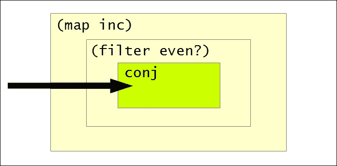

前面的图示说明了转换`(map inc)`、`(filter even?)`和`conj`如何在`xf`转换中组合。`map`形式首先应用，然后是`filter`形式，最后是`conj`形式。这样，转换器可以用于对任何数据源进行一系列转换。

从转换器生成集合的另一种方法是使用`into`函数。此函数的结果取决于它作为第一个参数提供的初始集合，如下所示：

```java
user> (into [] xf (range 10))
[2 4 6 8 10]
user> (into () xf (range 10))
(10 8 6 4 2)
```

标准的`sequence`函数也可以从转换器生成惰性序列。当然，在 REPL 中返回的惰性序列将被转换为列表，如下所示：

```java
user> (sequence xf (range 10))
(2 4 6 8 10)
```

到目前为止，我们已经组合了转换器来生成有限数量的元素集合。当与`sequence`函数一起使用时，转换器也可以生成无限值的序列。`eduction`函数可以用来表示这种计算。此函数将转换其最后一个参数指定的集合，并将其转换为任何以从右到左的顺序传递给它的转换。与使用序列相比，`eduction`形式可能需要更少的分配。

例如，如果我们使用`nth`函数检索序列中的第 100 个元素，前 99 个元素就必须实现，并在之后被丢弃，因为它们不再需要。另一方面，`eduction`形式可以避免这种开销。考虑*示例 5.3*中`simple-eduction`的声明：

```java
(def simple-eduction (eduction (map inc)
                               (filter even?)
                               (range)))
```

> *示例 5.3：使用`eduction`函数*

*示例 5.3*中显示的集合`simple-eduction`将首先使用`even?`谓词从无限范围`(range)`中过滤出偶数值，然后使用`inc`函数增加这些值。我们可以使用`nth`函数从`simple-eduction`集合中检索元素。相同的计算也可以使用惰性序列来建模，但转换器表现得更好，如下所示：

```java
user> (time (nth simple-eduction 100000))
"Elapsed time: 65.904434 msecs"
200001
user> (time (nth (map inc (filter even? (range))) 100000))
"Elapsed time: 159.039363 msecs"
200001
```

使用转换器的`eduction`形式比序列快两倍！从前面的输出中可以看出，转换器在组合多个转换方面比惰性序列表现显著更好。总之，使用如`map`和`filter`之类的函数创建的转换器可以很容易地组合起来，使用如`transduce`、`into`和`eduction`之类的函数生成集合。我们还可以使用转换器与其他数据源，如流、异步通道和可观察对象。

# 比较转换器和归约器

在第三章“使用归约器进行并行化”中讨论的转换器和归约器，都是提高集合上计算性能的方法。虽然转换器是针对多个数据源的数据处理的泛化，但转换器和归约器之间还有一些细微的区别，如下所述：

+   转换器作为 Clojure 语言的一部分在`clojure.core`命名空间中实现。然而，归约器必须显式包含在程序中，因为它们在`clojure.core.reducers`命名空间中实现。

+   转换器仅在生成一系列转换的最终结果时创建集合。不需要中间集合来存储构成转换器的转换结果。另一方面，归约器生成中间集合来存储结果，并且仅避免创建不必要的空集合。

+   转换器处理一系列转换的高效组合。这与归约器通过并行化使用集合上的计算来挤压性能的方式是正交的。转换器的性能显著优于`clojure.core`和`clojure.core.reducers`命名空间中的`reduce`函数。当然，使用`clojure.core.reducers/fold`函数仍然是实现可并行化计算的好方法。

这些转换器和归约器之间的对比描述了这两种数据处理方法的不同之处。在实践中，这些技术的性能取决于实际实现的计算。一般来说，如果我们打算以高效的方式实现数据处理算法，我们应该使用转换器。另一方面，如果我们处理的是内存中的大量数据，且不需要 I/O 和惰性，我们应该使用归约器。鼓励读者比较`transduce`函数与`clojure.core.reducers`库中的`reduce`和`fold`函数在不同计算和数据源上的性能。

# 行动中的转换器

在本节中，我们将探讨转换器的实现方式。我们还将了解如何实现我们自己的*可转换*数据源的基本概念。

## 管理易变引用

一些转换器可以在内部使用状态。结果证明，现有的引用类型，如原子和 refs，对于转换器的实现来说不够快。为了解决这个问题，转换器还引入了一种新的*易失性*引用类型。易失性引用表示一个可变的变量，它不会被复制到线程局部缓存中。此外，易失性引用不是原子的。在 Java 中，它们使用`volatile`关键字与`java.lang.Object`类型实现。

### 注意

以下示例可以在书籍源代码的`src/m_clj/c5/volatile.clj`中找到。

我们可以使用`volatile!`函数创建一个新的易失性引用。然后可以使用`@`读取宏或`deref`形式检索易失性状态中包含的值。`vreset!`函数可以用来设置易失性引用的状态，如下所示：

```java
user> (def v (volatile! 0))
#'user/v
user> @v
0
user> (vreset! v 1)
1
```

在前面的输出中，我们将值`0`封装在一个易失性状态中，然后使用`vreset!`函数将其状态设置为`1`。我们还可以使用`vswap!`函数来突变易失性引用中包含的状态。我们必须将易失性引用和要应用于引用中值的函数传递给此函数。我们还可以将提供的函数的任何其他参数作为`vswap!`函数的附加参数指定。`vswap!`函数可以用来改变我们之前定义的易失性引用`v`的状态，如下所示：

```java
user> (vswap! v inc)
2
user> (vswap! v + 3)
5
```

在前面的输出中，`vswap!`函数的第一个调用使用`inc`函数增加存储在引用`v`中的值。同样，随后的`vswap!`函数调用将值`3`添加到易失性引用`v`中的新值，从而产生最终的值`5`。

### 注意

我们可以使用`volatile?`谓词来检查一个值是否是易失性的。

有些人可能会争论，易失性引用类型与原子的语义相同。`vreset!`和`vswap!`函数与用于原子的`reset!`和`swap!`函数具有完全相同的形状。然而，易失性引用与原子的一个重要区别在于，与原子不同，易失性引用不保证对其执行的操作的原子性。因此，建议在单个线程中使用易失性引用。

## 创建转换器

由于转换器会修改提供的步骤函数，让我们首先定义一下步骤函数实际上做什么。以下方面需要考虑：

+   步骤函数必须能够为其所建模的转换提供初始值。换句话说，步骤函数必须有一个*恒等*形式，它不接受任何参数。

+   输入必须与计算到目前为止累积的结果相结合。这与减少函数将输入值与累积结果结合以产生新结果的方式类似。这种形式的 arity 与减少函数的 arity 相同；它需要两个参数来表示当前输入和累积结果。

+   步函数还必须能够完成建模过程的计算，以返回某些内容。这可以通过一个接受单个参数的函数来实现，该参数表示累积的结果。

因此，步函数被表示为一个具有三个 arity 的函数，就像之前描述的那样。某些转换器可能还需要 *早期终止*，以便根据某些条件突然停止计算过程。

现在，让我们看看 `clojure.core` 命名空间中的一些标准函数是如何使用转换器实现的。当使用单个参数调用时，`map` 函数返回一个转换器。

### 注意

以下示例可以在书的源代码 `src/m_clj/c5/implementing_transducers.clj` 中找到。

以下 *示例 5.4* 描述了 `map` 函数是如何实现的：

```java
(defn map
  ([f]
   (fn [step]
     (fn
       ([] (step))
       ([result] (step result))
       ([result input]
        (step result (f input))))))
  ([f coll]
   (sequence (map f) coll)))
```

> *示例 5.4：map 函数*

`map` 函数的 1-arity 形式返回一个接受步函数的函数，步函数由 `step` 表示，并返回另一个步函数。返回的步函数有三个不同的 arity，就像我们在本节前面描述的那样。`map` 函数的精髓可以用表达式 `(step result (f input))` 来描述，这可以翻译为“将函数 `f` 应用于当前输入 `input`，并使用函数 `step` 将其与累积结果 `result` 结合”。返回的步函数还有另外两个 arity——一个不接受任何参数，另一个接受一个参数。这些 arity 对应于我们之前描述的步函数的另外两种情况。

`map` 函数的第二个 arity，它返回一个集合而不是转换器，仅仅是 `sequence` 函数和由表达式 `(map f)` 返回的转换器的组合。集合的实际创建是由 `sequence` 函数完成的。`map` 函数的 1-arity 形式只描述了函数 `f` 如何在可转换的上下文（如集合）上应用。

类似地，`filter` 函数可以使用转换器来实现，如 *示例 5.5* 所示，如下所示：

```java
(defn filter
  ([p?]
   (fn [step]
     (fn
       ([] (step))
       ([result] (step result))
       ([result input]
        (if (p? input)
          (step result input)
          result)))))
  ([p? coll]
   (sequence (filter p?) coll)))
```

> *示例 5.5：filter 函数*

`filter` 函数的实现前提是使用谓词 `p?` 来有条件地将累积结果和当前输入（分别表示为 `result` 和 `input`）结合起来。如果表达式 `(p? input)` 不返回一个真值，则累积结果将返回而不做任何修改。与 *示例 5.4* 中的 map 函数类似，filter 函数的 2-arity 形式使用 `sequence` 形式和转换器来实现。

要处理转换器中的早期终止，我们必须使用`reduced`和`reduced?`函数。对已包裹在`reduced`形式的值调用 reduce 或步进函数将简单地返回包含的值。`reduced?`函数检查一个值是否已经被*reduced*，即包裹在`reduced`形式中。`reduced`和`reduced?`形式都接受一个参数，如下所示：

```java
user> (def r (reduced 0))
#'user/r
user> (reduced? r)
true
```

考虑以下在*示例 5.6*中使用的函数`rf`，它使用`reduced`形式确保累积结果永远不会超过 100 个元素：

```java
(defn rf [result input]
  (if (< result 100)
    (+ result input)
    (reduced :too-big)))
```

> *示例 5.6：使用 reduced 函数*

函数`rf`只是将所有输入相加以产生一个结果。如果将`rf`函数与一个足够大的集合一起传递给`reduce`函数，那么将返回`:too-big`值作为最终结果，如下所示：

```java
user> (reduce rf (range 3))
3
user> (reduce rf (range 100))
:too-big
```

可以使用`unreduced`函数或`@`读取宏从`reduced`形式中提取值。此外，可以使用`ensure-reduced`函数代替`reduced`，以避免将`reduced`形式重新应用于已经 reduced 的值。

标准的`take-while`函数可以使用`reduced`形式和转换器来实现，如下面的*示例 5.7*所示：

```java
(defn take-while [p?]
  (fn [step]
    (fn
      ([] (step))
      ([result] (step result))
      ([result input]
       (if (p? input)
         (step result input)
         (reduced result))))))
```

> *示例 5.7：take-while 函数*

注意，仅在*示例 5.7*中描述了`take-while`函数的 1-arity 形式。`take-while`函数返回的步进函数使用表达式`(p? input)`来检查累积的结果是否需要与当前输入结合。如果`p?`谓词不返回一个真值，则通过将其包裹在`reduced`形式中来返回累积的结果。这防止了任何其他可能与`take-while`函数返回的转换组合的转换修改累积结果。这样，`reduced`形式可以用来包裹转换的结果，并根据某些条件逻辑执行早期终止。

让我们看看状态化转换器的实现方式。`take`函数返回一个维护内部状态的转换器。这个状态用于跟踪到目前为止已处理的项目数量，因为根据定义，`take`函数必须只从集合或其他可转换上下文中返回一定数量的项目。*示例 5.8*描述了如何使用一个易失性引用来维护状态实现`take`函数：

```java
(defn take [n]
  (fn [step]
    (let [nv (volatile! n)]
      (fn
        ([] (step))
        ([result] (step result))
        ([result input]
         (let [n @nv
               nn (vswap! nv dec)
               result (if (pos? n)
                        (step result input)
                        result)]
           (if (not (pos? nn))
             (ensure-reduced result)
             result)))))))
```

> *示例 5.8：take 函数*

由`take`函数返回的转换器首先从提供的值`n`创建一个易失性引用`nv`来跟踪要处理的项目数量。然后返回的步骤函数会递减易失性引用`nv`，并使用`step`函数将结果与输入结合。这会一直重复，直到引用`nv`中包含的值是正数。一旦处理完所有`n`个项目，结果会被包裹在`ensure-reduced`形式中，以表示提前终止。在这里，`ensure-reduced`函数被用来防止将值`result`包裹在另一个`reduced`形式中，因为`(step result input)`可能返回一个已经减少的值。

最后，让我们快速看一下`transduce`函数的实现方式，如*示例 5.9*所示：

```java
(defn transduce
  ([xform f coll] (transduce xform f (f) coll))
  ([xform f init coll]
   (let [xf (xform f)
         ret (if (instance? clojure.lang.IReduceInit coll)
               (.reduce ^clojure.lang.IReduceInit coll xf init)
               (clojure.core.protocols/coll-reduce coll xf init))]
     (xf ret))))
```

> *示例 5.9：transduce 函数*

`transduce`函数有两种形式。`transduce`函数的 4 参数形式如果`coll`是`clojure.lang.IReduceInit`接口的实例，则会调用其`.reduce`方法。此接口定义了一个名为`reduce`的单个方法，它表示如何使用给定的函数和初始值来减少数据源。如果变量`coll`没有实现此接口，`transduce`函数将回退到`coll-reduce`函数来处理由`coll`表示的数据源。简而言之，`transduce`函数将尝试以最快的方式处理可转换上下文。所有必须支持`transduce`使用的数据源都必须实现`clojure.lang.IReduceInit`接口。

`transduce`函数的 3 参数形式通过调用不带任何参数的提供的函数`f`来生成转换的初始值。因此，这个`transduce`函数的参数形式只能与提供恒等值的函数一起使用。

### 注释

本节中所示`map`、`filter`、`take`和`take-while`函数的定义是它们实际定义的简化版本。然而，`transduce`函数在`clojure.core`命名空间中的实现方式是准确的。

这描绘了转换器和`transduce`函数的实现方式。如果我们需要实现自己的可转换数据源，本节中描述的实现可以作为指南。

# 摘要

到目前为止，我们已经看到了如何使用序列、归约器和转换器来处理数据。在本章中，我们描述了如何使用转换器进行高效的计算。我们还简要研究了转换器在 Clojure 语言中的实现方式。

在下一章中，我们将探索 Clojure 中的代数数据结构，如函子、应用和单子，这些概念将加深我们对函数组合的理解，这是函数式编程的基石。

# 第六章 探索范畴论

在探索函数式编程的旅途中，程序员最终会遇到 *范畴论*。首先，我们可以这样说，研究范畴论并不是编写更好代码的必要条件。它在纯函数式编程语言的内部更为普遍，如 Haskell 和 Idris，在这些语言中，函数是 *纯* 的，更类似于没有隐式副作用（如 I/O 和修改）的数学函数。然而，范畴论帮助我们推理计算的非常基础和实用的一个方面：*组合*。与纯函数式编程语言中的函数不同，Clojure 中的函数可以执行 I/O 和其他副作用。当然，在特定情况下，它们可以是纯的，因此范畴论的概念对于 Clojure 来说仍然很有用，可以帮助我们基于纯函数编写可重用和可组合的代码。

范畴论可以被视为一个用于建模组合的数学框架。在本章中，我们将使用 Clojure 讨论范畴论的一些概念。我们还将研究一些代数类型，如函子、幺半群和单子。

# 揭开范畴论的面纱

范畴论有其独特的符号和约定。让我们从探索范畴论中使用的术语开始，用我们这些凡人程序员能理解的语言。

一个 *范畴* 正式定义为对象和 **态射** 的集合。简单来说，对象代表抽象类型，态射代表在这些类型之间进行转换的函数。因此，范畴类似于一种编程语言，它只有几种类型和函数，并且有两个基本属性：

+   对于范畴中的每个对象，都存在一个 *恒等态射*。在实践中，可以使用单个恒等函数来表示所有给定对象的恒等态射，但这不是强制性的。

+   范畴中的态射可以组合成一个新的态射。实际上，两个或更多态射的组合是逐个应用单个态射的优化。这样，几个态射的组合被认为是与构成态射的应用 *交换* 的。

范畴中的态射可以按照以下图示进行组合：

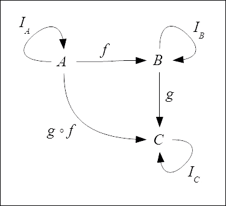

在前面的图中，顶点*A*、*B*和*C*是对象，箭头是这些对象之间的形态。形态*I[A]*、*I[B]*和*I[C]*是恒等形态，将对象*A*、*B*和*C*映射到自身。形态*f*将*A*映射到*B*，同样地，形态*g*将*B*映射到*C*。这两个形态可以组合在一起，如形态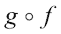所示，该形态将*A*直接映射到*C*，因此形态与形态*f*和*g***交换**。因此，前面的图被称为**交换图**。请注意，与前面的图不同，交换图中的恒等形态通常不会显示。

### 注意

以下示例可以在书籍源代码的`src/m_clj/c6/` `demystifying_cat_theory.clj`中找到。

现在，让我们将之前的图转换为 Clojure 代码。我们将使用内置的字符串、符号和关键字类型来展示如何使用`comp`函数将这些类型之间的形态（或函数）组合在一起：

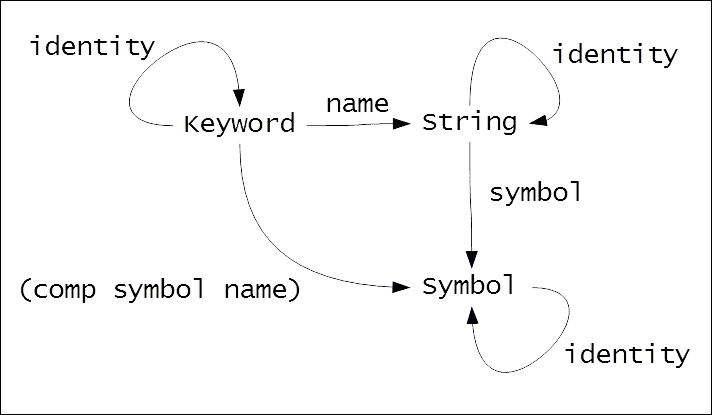

如前图所示，`name`函数将关键字转换为字符串，而`symbol`函数将字符串转换为符号。这两个函数可以组合成一个函数，该函数将关键字直接转换为符号，由`(comp symbol name)`函数表示。此外，每个范畴的恒等形态对应于`identity`函数。

### 注意

在内部，字符串、符号和关键字类型分别由`java.lang.String`、`clojure.lang.Symbol`和`clojure.lang.Keyword`类表示。

我们可以验证`name`和`symbol`函数可以使用`comp`形式组合在一起，如下面的 REPL 输出所示：

```java
user> (name :x)
"x"
user> (symbol "x")
x
user> ((comp symbol name) :x)
x
```

这确立了这样一个事实：范畴论中的概念在 Clojure 以及其他编程语言中都有等价的表达形式。虽然将范畴中的对象视为我们刚刚描述的具体类型是完全可以接受的，但**代数结构**是对象的一个更实用的替代品。代数结构描述了类型的抽象属性，而不是类型中包含的数据或类型如何组织数据，它们更像是抽象类型。因此，范畴论就是关于组合具有特定属性的抽象类型上操作的函数。

在 Clojure 中，代数结构可以被视为协议。具体类型可以实现协议，因此一个类型可以代表多个代数结构。`cats`库([`github.com/funcool/cats`](https://github.com/funcool/cats))采用这种方法，并提供了一些有趣的代数结构的基于协议的定义。`cats`库还提供了实现这些协议的类型。此外，这个库通过这些协议扩展了一些内置类型，使我们能够将它们视为代数结构。尽管有几种替代方案，但`cats`是唯一兼容 ClojureScript 的库。

### 注意

以下库依赖项对于即将到来的示例是必需的：

```java
[funcool/cats "1.0.0"]
```

此外，以下命名空间必须包含在您的命名空间声明中：

```java
(ns my-namespace
  (:require [cats.core :as cc]
            [cats.builtin :as cb]
            [cats.applicative.validation :as cav]
            [cats.monad.maybe :as cmm]
            [cats.monad.identity :as cmi]
            [cats.monad.exception :as cme]))
```

现在，让我们研究`cats`库中的一些代数结构。

# 使用幺半群

让我们从探索**幺半群**开始。为了定义一个幺半群，我们首先必须理解什么是半群。

### 注意

以下示例可以在书籍源代码的`src/m_clj/c6/` `monoids.clj`中找到。

**半群**是一种支持结合二元运算的代数结构。如果一个二元运算，比如，运算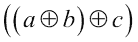产生与运算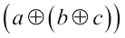相同的结果，那么这个二元运算被称为**结合**。实际上，幺半群是一个具有额外属性的半群，我们将在下面看到这一点。

来自`cats.core`命名空间的`mappend`函数可以结合相同类型的一组实例，并返回给定类型的新实例。如果我们处理的是字符串或向量，`mappend`操作由标准的`concat`函数实现。因此，字符串和向量可以使用`mappend`函数进行组合，如下所示：

```java
user> (cc/mappend "12" "34" "56")
"123456"
user> (cc/mappend [1 2] [3 4] [5 6])
[1 2 3 4 5 6]
```

由于字符串和向量支持结合的`mappend`操作，它们是半群。它们也是**幺半群**，它们只是具有**单位元素**的半群。很明显，字符串的单位元素是一个空字符串，而向量的单位元素是一个空向量。

这是个介绍功能编程世界中一个多才多艺的具体类型的好时机——`Maybe`类型。`Maybe`类型表示一个可选值，可以是空的或包含一个值。它可以被视为一个值在上下文或容器中。`cats.monads.maybe`命名空间中的`just`和`nothing`函数可以用来构建`Maybe`类型的一个实例。`just`函数构建一个包含值的实例，而`nothing`函数创建一个空的`Maybe`值。可以通过将其传递给`cats.monads.maybe/from-maybe`函数或使用`deref`形式或`@`读取宏来解引用`Maybe`实例中的值。

顺便提一下，`Maybe` 类型也是一个幺半群，因为使用 `nothing` 函数创建的空 `Maybe` 值类似于一个单位元素。我们可以使用 `mappend` 函数来组合 `Maybe` 类型的值，就像任何其他幺半群一样，如下所示：

```java
user> @(cc/mappend (cmm/just "123")
 (cmm/just "456"))
"123456"
user> @(cc/mappend (cmm/just "123")
 (cmm/nothing)
 (cmm/just "456"))
"123456"
```

因此，`mappend` 函数可以用来关联组合任何是幺半群的值。

# 使用函子

接下来，让我们看看 **函子**。函子本质上是一个容器或计算上下文中的值。函子必须实现 `fmap` 函数。这个函数将提供的函数应用到函子包含的值上。在面向对象术语中，函子可以被视为一个具有单个抽象方法 `fmap` 的通用类型。从某种意义上说，引用类型，如 refs 和 atoms，可以被视为保存结果的函子，因为引用类型将其包含的值应用于函数以获得应存储在其内的新值。

### 注意

以下示例可以在书籍源代码的 `src/m_clj/c6/` `functors.clj` 中找到。

来自 `cats.core` 命名空间的 `fmap` 函数接受两个参数：一个函数和一个函子。函子本身定义了当函子的一个实例传递给 `fmap` 函数时会发生什么。`cats` 库将向量扩展为函子。当一个向量与一个函数一起传递给 `fmap` 函数时，提供的函数会被应用到向量中的所有元素上。等等！这不是 `map` 函数所做的吗？嗯，是的，但 `map` 函数总是返回一个惰性序列。另一方面，`fmap` 函数将返回一个与传递的函子具有相同具体类型的值。`map` 和 `fmap` 函数的行为可以比较如下：

```java
user> (map inc [0 1 2])
(1 2 3)
user> (cc/fmap inc [0 1 2])
[1 2 3]
```

如上图所示，`map` 函数生成一个惰性序列，当它传递一个向量以及 `inc` 函数到 REPL 时，这个惰性序列会被实现为一个列表。然而，`fmap` 函数在传递相同的参数时会产生一个向量。我们应该注意，`fmap` 函数也被称为 `<$>`。惰性序列和集合也可以被视为函子，如下所示：

```java
user> (cc/<$> inc (lazy-seq '(1)))
(2)
user> (cc/<$> inc #{1})
#{2}
```

`Maybe` 类型也是一个函子。当 `fmap` 函数传递一个 `Maybe` 时，它返回一个 *maybe*，如下所示：

```java
user> (cc/fmap inc (cmm/just 1))
#<Just@ff5df0: 2>
user> (cc/fmap inc (cmm/nothing))
#<Nothing@d4fb58: nil>
```

当 `fmap` 函数对一个包含值的 `Maybe` 值应用时，它只对 `inc` 函数应用。这种 `fmap` 函数的行为可以通过以下图表来展示：

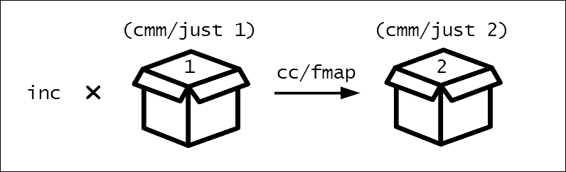

上述图表描述了 `fmap` 函数如何传递 `inc` 函数和表达式 `(cmm/just 1)`，并返回一个新的函子实例。`fmap` 函数从这个 `Maybe` 值中提取值，将 `inc` 函数应用到该值上，并创建一个新的包含结果的 `Maybe` 值。另一方面，`fmap` 函数将简单地返回一个使用 `nothing` 函数创建的空 `Maybe` 实例，而不对其进行任何操作，如下面的图表所示：

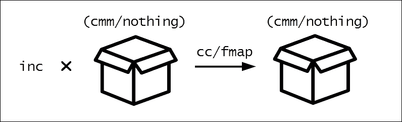

`fmap`函数的这种行为由`Maybe`类型的实现定义。这是因为函子本身可以定义`fmap`函数如何与之交互。当然，实现`fmap`函数并不足以使类型成为函子。还有函子定律，任何可能的函子实现都必须满足这些定律。函子定律可以描述如下：

1.  将恒等函子和函子*F*传递给`fmap`必须返回未经修改的函子*F*。我们可以使用`identity`函数将其翻译成 Clojure，如下所示：

    ```java
    user> (cc/<$> identity [0 1 2])
    [0 1 2]
    ```

1.  将函子*F*和函子同态*f*传递给`fmap`，然后传递结果和另一个函子同态*g*给`fmap`，必须与调用`fmap`时使用函子*F*和复合等效。我们可以使用`comp`函数来验证这一点，如下所示：

    ```java
    user> (->> [0 1 2]
     (cc/<$> inc)
     (cc/<$> (partial + 2)))
    [3 4 5]
    user> (cc/<$> (comp (partial + 2) inc) [0 1 2])
    [3 4 5]
    ```

第一定律描述了恒等函子，第二定律保持了函子复合。这些定律可以被视为`fmap`函数在有效函子中使用时可以执行的优化。

# 使用应用函子

应用函子是具有一些额外要求的函子子集，因此它们更有用。与应用函子类似，应用函子是能够将函数应用于其中包含的值的计算上下文。唯一的区别是，应用于应用函子的函数本身必须被包裹在应用函子的上下文中。应用函子还有与之关联的不同函数接口。在`cats`中，应用函子使用两个函数`fapply`和`pure`进行操作。

### 注意

以下示例可以在书籍源代码的`src/m_clj/c6/` `applicatives.clj`中找到。

来自`cats.core`命名空间的`fapply`函数可以用应用函子调用，如下所示：

```java
user> @(cc/fapply (cmm/just inc)
 (cmm/just 1))
2
```

在这里，我们再次使用`Maybe`类型，这次作为应用函子。`fapply`函数将`inc`函数和值`1`从`Maybe`值中解包，将它们组合并返回一个新的`Maybe`实例中的结果`2`。这可以用以下图表来说明：

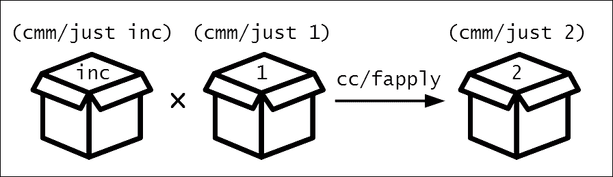

`cats.core/pure`函数用于创建应用函子的新实例。我们必须将实现特定的上下文，例如`cats.monads.maybe/context`，和一个值传递给`pure`函数，如下所示：

```java
user> (cc/pure cmm/context 1)
#<Just@cefb4d: 1>
```

`cats`库提供了一个`alet`形式来轻松组合应用函子。其语法类似于`let`形式，如下所示：

```java
user> @(cc/alet [a (cmm/just [1 2 3])
 b (cmm/just [4 5 6])]
 (cc/mappend a b))
[1 2 3 4 5 6]
```

如前所述的`alet`形式的主体返回的值被包裹在一个新的应用函子实例中并返回。周围的`alet`形式被取消引用，因此整个表达式返回一个向量。

来自`cats.core`命名空间的`<*>`函数是`fapply`函数的变长形式。它接受一个表示应用函子的值，后跟任意数量的产生应用函子的函数。`cats`库还提供了用于验证给定对象属性的`Validation`应用函子类型。此类型可以使用`cats.applicative.validation`命名空间中的`ok`和`fail`形式来构造。假设我们想要验证一个表示带有一些文本内容的页面的映射。页面必须有一个页码和一个作者。这种验证可以像*示例 6.1*中所示那样实现：

```java
(defn validate-page-author [page]
  (if (nil? (:author page))
    (cav/fail {:author "No author"})
    (cav/ok page)))

(defn validate-page-number [page]
  (if (nil? (:number page))
    (cav/fail {:number "No page number"})
    (cav/ok page)))

(defn validate-page [page]
  (cc/alet [a (validate-page-author page)
            b (validate-page-number page)]
    (cc/<*> (cc/pure cav/context page) 
            a b)))
```

> *示例 6.1: cats.applicative.validation 类型*

*示例 6.1*中的`validate-page-author`和`validate-page-number`函数检查映射是否包含`:author`和`:number`键。这些函数使用`ok`函数创建`Validation`类型的实例，并类似地使用`fail`函数创建表示验证失败的`Validation`实例。`validate-page-author`和`validate-page-number`函数都通过`<*>`函数组合在一起。传递给`<*>`的第一个参数必须是使用`pure`函数创建的`Validation`类型的实例。因此，`validate-page`函数可以验证表示页面的映射，如下所示：

```java
user> (validate-page {:text "Some text"})
#<Fail@1203b6a: {:author "No author", :number "No page number"}>
user> (validate-page {:text "Some text" :author "John" :number 1})
#<Ok@161b2f8: {:text "Some text", :author "John", :number 1}>
```

成功的验证将返回包含页面对象的`Validation`实例，而不成功的验证将返回包含适当的验证消息映射的`Validation`类型实例。这两种情况的具体类型是`Ok`和`Fail`，如前面的输出所示。

应用函子必须自己定义与`fapply`和`pure`函数一起的行为。当然，应用函子也必须遵守一些法则。除了函子的恒等性和组合性法则外，应用函子还必须遵守*同态*和*交换*法则。鼓励读者在实现自己的应用函子之前了解更多关于这些法则的信息。

# 使用单子

最后，让我们看看一种代数结构，它帮助我们构建和组合一系列计算：**单子**。网上有无数教程和文章解释单子以及它们如何被使用。在本节中，我们将以我们独特且 Clojure 风格的方式来探讨单子。

在范畴论中，单子是函子之间的一个形态。这意味着单子将包含值的上下文转换为另一个上下文。在纯函数式编程语言中，单子是用于表示按步骤定义的计算的数据结构。每个步骤由单子上的一个操作表示，并且可以链式连接多个这些步骤。本质上，单子是任何计算步骤的可组合抽象。单子的一个独特特征是它们允许我们使用纯函数来模拟在给定计算的各种步骤中可能执行的纯副作用。

单子抽象了函数将值绑定到参数并返回值的方式。形式上，单子是一个实现两个函数的代数结构：`bind`和`return`。`bind`函数用于将函数应用于单子中包含的值，而`return`函数可以被视为将值包裹在新的单子实例中的构造。`bind`和`return`函数的类型签名可以用以下伪代码描述：

```java
bind : (Monad A a, [A -> Monad B] f) -> Monad B
return : (A a) -> Monad A
```

`bind`函数的类型签名表明它接受一个类型为`Monad A`的值和一个将类型`A`的值转换为另一个类型`Monad B`的函数，这只是一个包含类型`B`的值的单子。此外，`bind`函数返回类型`Monad B`。`return`函数的类型签名显示它接受一个类型为`A`的值并返回类型`Monad A`。实现这两个函数允许单子在其`bind`实现中定义的任何代码在将提供的函数`f`应用于单子中包含的值之前执行。单子还可以定义当提供的函数`f`返回值时执行的代码，这是由单子的`return`函数实现定义的。

由于在传递给`bind`函数时，单子不仅可以对其包含的值调用函数，还可以做更多的事情，因此在纯函数式编程语言中，单子被用来表示副作用。比如说，我们有一个将类型`A`映射到`B`的函数。一个将类型`A`映射到`Monad B`的函数可以用来模拟当类型`A`的值转换为另一个类型`B`的值时可能发生的副作用。这样，单子可以用来表示副作用，如 IO、状态改变、异常和事务。

一些程序员甚至可能会争论，在具有宏的语言中，单子是不必要的。在某种程度上这是正确的，因为宏可以封装它们中的副作用。然而，单子帮助我们明确任何副作用，这非常有用。实际上，在纯函数式编程语言中，单子是唯一可以用来模拟副作用的方法。因为单子可以表示副作用，它们允许我们在纯函数式编程语言中编写命令式风格的代码，这完全是关于状态的修改。

### 注意

以下示例可以在书籍源代码的 `src/m_clj/c6/` `monads.clj` 中找到。

现在，让我们看看 `cats` 库中的 `Maybe` 类型如何以单子的形式出现。我们可以将 `Maybe` 值和函数传递给 `cats.core/bind` 函数，以在单子中包含的值上调用提供的函数。此函数别名为 `>>=`。`bind` 函数与 `Maybe` 类型的行为如下所示：

```java
user> (cc/bind (cmm/just 1) inc)
2
user> (cc/bind (cmm/nothing) inc)
#<Nothing@24e44b: nil>
```

以这种方式，我们可以将 `inc` 函数绑定到 `Maybe` 单子上。前述输出中的表达式可以用以下图表示：

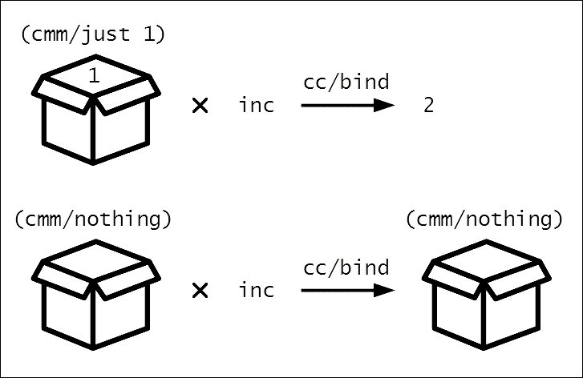

`inc` 函数仅在 `Maybe` 单子包含值时应用。当一个 `Maybe` 单子确实包含值时，使用 `bind` 函数将其应用于 `inc` 函数将简单地返回 `2`，而不是包含 `2` 的单子。这是因为标准的 `inc` 函数不返回单子。另一方面，一个空的 `Maybe` 值将保持不变。为了在这两种情况下都返回单子，我们可以使用 `cats.core` 命名空间中的 `return` 函数，如下所示：

```java
user> (cc/bind (cmm/just 1) #(-> % inc cc/return))
#<Just@208e3: 1>
user> (cc/bind (cmm/nothing) #(-> % inc cc/return))
#<Nothing@1e7075b: nil>
```

`lift-m` 形式可以用来将返回类型 `A` 的函数提升为返回包含类型 `A` 的单子。提升函数的返回值的具体类型取决于传递给它的单子上下文。如果我们将 `Maybe` 单子传递给 `inc` 的提升版本，它将返回一个新的 `Maybe` 单子实例，如下所示：

```java
user> ((cc/lift-m inc) (cmm/just 1))
#<Just@1eaaab: 2>
```

我们还可以组合多个对 `bind` 函数的调用，只要传递给 `bind` 函数的函数产生单子，如下所示：

```java
user> (cc/>>= (cc/>>= (cmm/just 1)
 #(-> % inc cmm/just))
 #(-> % dec cmm/just))
#<Just@91ea3c: 1>
```

当然，我们也可以组合对 `bind` 函数的调用以更改单子的类型。例如，我们可以将 `Maybe` 单子映射到 `Identity` 单子，该单子使用 `cats.monads.identity/identity` 函数构建。我们可以修改前面的表达式以返回一个 `Identity` 单子，如下所示：

```java
user> (cc/>>= (cc/>>= (cmm/just 1)
 #(-> % inc cmm/just))
 #(-> % dec cmi/identity))
#<Identity@dd6793: 1>
```

如前所述的输出所示，多次调用 `bind` 函数可能会有些繁琐。`mlet` 形式允许我们组合返回单子的表达式，如 *示例 6.2* 所示：

```java
(defn process-with-maybe [x]
  (cc/mlet [a (if (even? x)
                (cmm/just x)
                (cmm/nothing))
            b (do
                (println (str "Incrementing " a))
                (-> a inc cmm/just))]
    b))
```

> *示例 6.2\. mlet 形式*

简而言之，*示例 6.2* 中定义的 `process-with-maybe` 函数检查一个数字是否为偶数，然后打印一行并增加该数字。由于我们使用了 `Maybe` 类型，打印一行和增加值的最后两个步骤仅在输入 `x` 为偶数时执行。这样，使用 `nothing` 函数创建的空 `Maybe` 单子可以用来短路单子的组合。我们可以在 REPL 中验证 `process-with-maybe` 函数的此行为，如下所示：

```java
user> (process-with-maybe 2)
Incrementing 2
3
user> (process-with-maybe 3)
#<Nothing@1ebd3fe: nil>
```

如此，`process-with-maybe` 函数仅在提供的值 `x` 是偶数时打印一行。如果不是，则返回一个空的 `Maybe` 单子实例。

之前的例子描述了我们可以如何使用 `Maybe` 单子。`cats` 库还提供了 `Either` 和 `Exception` 单子的实现，分别在 `cats.monads.either` 和 `cats.monads.exception` 命名空间中。让我们探索 `cats.monads.exception` 命名空间中的几个构造。

我们可以使用 `success` 和 `failure` 函数创建一个新的 `Exception` 单子实例。`success` 形式可以传入任何值，并返回表示计算中成功步骤的单子。另一方面，`failure` 函数必须传入一个包含指向异常的 `:error` 键的映射，并返回表示计算中失败的单子。可以通过解引用（使用 `deref` 形式或 `@` 读取宏）来获取 `Exception` 单子中包含的值或异常。另一种创建 `Exception` 单子实例的方法是使用 `try-on` 宏。以下输出描述了如何使用这些构造来创建 `Exception` 单子的实例：

```java
user> (cme/success 1)
#<Success@441a312 [1]>
user> (cme/failure {:error (Exception.)})
#<Failure@4812b43 [#<java.lang.Exception>]>
user> (cme/try-on 1)
#<Success@5141a5 [1]>
user> @(cme/try-on 1)
1
```

`try-on` 宏会在传入的表达式抛出错误时返回一个 `Exception` 单子失败实例，如下所示：

```java
user> (cme/try-on (/ 1 0))
#<Failure@bc1115 [#<java.lang.ArithmeticException>]>
user> (cme/try-on (-> 1 (/ 0) inc))
#<Failure@f2d11a [#<java.lang.ArithmeticException>]>
```

一个 `Exception` 单子的失败实例可以用来短路单子的组合。这意味着如果单子包含错误，将 `Exception` 单子绑定到函数将不会调用提供的函数。这与异常用于停止计算的方式类似。我们可以使用 `bind` 函数来验证这一点，如下所示：

```java
user> (cc/bind (cme/try-on (/ 1 1)) #(-> % inc cc/return))
#<Success@116ea43 [2]>
user> (cc/bind (cme/try-on (/ 1 0)) #(-> % inc cc/return))
#<Failure@0x1c90acb [#<java.lang.ArithmeticException>]>
```

可以使用 `cats.monads.exception` 命名空间中的 `try-or-else` 和 `try-or-recover` 宏来创建 `Exception` 单子的实例。`try-or-else` 形式必须传入一个表达式和一个默认值。如果传入此形式的表达式抛出异常，则默认值会被包裹在一个 `Exception` 单子实例中并返回。`try-or-recover` 形式必须传入一个代替默认值的 1-arity 函数。在遇到错误的情况下，`try-or-recover` 宏将调用提供的函数并转达其返回的值。以下是如何演示 `try-or-else` 和 `try-or-recover` 形式的：

```java
user> (cme/try-or-else (/ 1 0) 0)
#<Success@bd15e6 [0]>
user> (cme/try-or-recover (/ 1 0)
 (fn [e]
 (if (instance? ArithmeticException e)
 0
 :error)))
0
```

以这种方式，单子可以用纯函数来模拟副作用。我们已经展示了如何使用 `Maybe` 和 `Exception` 单子类型。`cats` 库还实现了其他有趣的单子类型。还有单子定律，我们实现的任何单子都必须遵守这些定律。我们鼓励你自己学习更多关于单子定律的知识。

# 摘要

在本章中，我们讨论了范畴论中使用的符号和术语。我们还讨论了几种来自范畴论代数类型。这些抽象都有必须由其实现满足的定律，这些定律可以被视为使用这些代数类型的计算优化。

在下一章中，我们将探讨一种完全不同的编程范式——逻辑编程。

# 第七章。使用逻辑编程

现在，我们将从函数式编程的领域退一步，探索一个完全不同的范式——**逻辑编程**。逻辑编程有其独特的解决计算问题的方法。当然，逻辑编程不是解决问题的唯一方法，但看到哪些问题可以轻松地用逻辑编程解决是很有趣的。

虽然逻辑编程和函数式编程是两种完全不同的范式，但它们确实有一些共同点。首先，这两种范式都是声明式编程的形式。研究和论文也表明，在函数式编程语言中可以实现逻辑编程的语义。因此，逻辑编程在抽象程度上比函数式编程要高得多。逻辑编程更适合于那些我们有规则集的问题，并且我们希望找到所有符合这些规则的可能值。

在本章中，我们将通过`core.logic`库来探讨 Clojure 中的逻辑编程。我们还将研究一些计算问题，以及如何使用逻辑编程以简洁优雅的方式解决这些问题。

# 深入逻辑编程

在 Clojure 中，可以使用`core.logic`库进行逻辑编程([`github.com/clojure/core.logic/`](https://github.com/clojure/core.logic/))。这个库是**miniKanren**的移植，它是一种用于逻辑编程的领域特定语言。miniKanren 定义了一套简单的构造，用于创建逻辑关系并从中生成结果。

### 注意

miniKanren 最初是在 Scheme 编程语言中实现的。您可以在[`minikanren.org/`](http://minikanren.org/)了解更多关于 miniKanren 的信息。

使用逻辑编程编写的程序可以被视为一组逻辑关系。**逻辑关系**是逻辑编程的基本构建块，就像函数是函数式编程的基本构建块一样。术语*关系*和*约束*可以互换用来指代逻辑关系。《core.logic》库实际上是基于约束的逻辑编程的实现。

一个关系可以被认为是一个返回目标的函数，而一个目标可以是成功或失败。在`core.logic`库中，目标由`succeed`和`fail`常量表示。关系的另一个有趣方面是它们可以返回多个结果，甚至没有结果。这类似于产生一系列值的函数，其结果可以是空的。例如`keep`和`filter`这样的函数完美地符合这一描述。

### 注意

下面的库依赖项对于即将到来的示例是必需的：

```java
[org.clojure/core.logic "0.8.10"]
```

此外，以下命名空间必须在您的命名空间声明中包含：

```java
(ns my-namespace
  (:require [clojure.core.logic :as l]
            [clojure.core.logic.fd :as fd]))
```

以下示例可以在本书源代码的`src/m_clj/c7/diving_into_logic.clj`中找到。

## 解决逻辑关系

按照惯例，关系名称后缀为“o”。例如，来自`clojure.core.logic`命名空间中的`conso`构造是一个表示`cons`函数行为的关系。使用多个逻辑关系（如`conde`和`matche`）的逻辑编程构造以“e”结尾。我们将在本章后面探讨这些构造。现在让我们专注于如何使用逻辑关系解决问题。

来自`clojure.core.logic`命名空间的`run*`宏处理多个目标以生成所有可能的结果。`run*`形式的语义允许我们在关系中声明多个逻辑变量，这些变量可以用来返回目标。`run*`形式返回它定义的逻辑变量的可能值列表。使用`run*`形式和一组关系表达式本质上是一种向计算机提问“为了使这些关系成立，宇宙必须是什么样子？”并要求它找到答案的方式。

可以使用`run*`宏与`clojure.core.logic/==`形式结合来执行等式测试，如下所示：

```java
user> (l/run* [x]
 (l/== x 1))
(1)
user> (l/run* [x]
 (l/== 1 0))
()
```

前面的输出中使用`run*`形式的语句都找到了逻辑变量`x`的所有可能值。关系`(l/== x 1)`在`x`的值为`1`时返回一个成功的目标。显然，对于这个关系成立，`x`只能有`1`这一个值。`run*`形式评估这个关系，以返回列表中的`1`。另一方面，关系`(l/== 1 0)`在逻辑上是假的，因此当传递给`run*`形式时不会产生任何结果。这意味着没有`x`的值使得`1`等于`0`。

使用`clojure.core.logic`命名空间中的`==`形式构建的关系称为*统一*。统一在逻辑编程中经常被用作从其他范式中的变量赋值，因为它用于给变量赋值。相反，*不等式*表示一个逻辑变量不能等于给定的值。`clojure.core.logic/!=`形式用于构建不等式关系，如下所示：

```java
user> (l/run* [x]
 (l/!= 1 1))
()
user> (l/run* [x]
 (l/== 1 1))
(_0)
```

前面的输出中的第一个语句没有产生结果，因为关系`(l/!= 1 1)`在逻辑上是假的。一个有趣的特点是，第二个语句有一个总是成功的目标，它产生单个结果`_0`，这代表一个*未绑定*的逻辑变量。由于我们没有通过统一为`x`分配值，因此它的值被认为是未绑定的。符号`_0`、`_1`、`_2`等（也写作`_.0`、`_.1`、`_.2`等）在`run*`形式的上下文中代表未绑定的逻辑变量。

`clojure.core.logic/conso`形式在模拟标准`cons`函数作为关系的行为时很有用。它接受三个参数，其中两个与`cons`函数相同。传递给`conso`形式的第一个两个参数代表序列的头部和尾部。

第三个参数是一个在应用`cons`函数到前两个参数时预期返回的序列。`conso`关系可以如下演示：

```java
user> (l/run* [x]
 (l/conso 1 [2 x]
 [1 2 3]))
(3)
```

在前面的输出中使用`conso`关系表达式，将解决`x`的值，当对`1`和`[2 x]`应用`cons`形式时，将产生值`[1 2 3]`。显然，`x`必须是`3`，这样这个关系才成立，因此产生了结果`3`。

可以使用来自`clojure.core.logic`命名空间的`lvar`函数在不使用`run*`形式的情况下创建逻辑变量。在`run*`形式中，我们可以使用`clojure.core.logic/fresh`宏创建局部逻辑变量。使用`fresh`形式声明的变量将不会是周围`run*`形式产生的最终结果的一部分。例如，考虑以下输出中使用`run*`形式的表达式：

```java
user> (l/run* [x y]
 (l/== x y)
 (l/== y 1))
([1 1])
user> (l/run* [x]
 (l/fresh [y]
 (l/== x y)
 (l/== y 1)))
(1)
```

之前显示的第一个表达式产生了结果向量`[1 1]`，而第二个表达式产生了结果`1`。这是因为我们在第二个表达式中指定了一个单个逻辑变量`x`，并使用`fresh`形式在内部声明了逻辑变量`y`。

`run*`形式在其提供的关系的集合中全面搜索结果。如果我们打算找到有限数量的结果并避免执行任何额外的计算来找到更多结果，我们应该使用来自`clojure.core.logic`命名空间的`run`宏。`run`形式具有与`run*`形式相同的语义，但还需要将所需的结果数量作为第一个参数传递给它。

`clojure.core.logic.fd`命名空间为我们提供了几个结构来处理在有限值范围内受约束的关系。例如，假设我们想要找到在`0`到`100`范围内的值，这些值大于`10`。我们可以很容易地使用来自`clojure.core.logic.fd`命名空间的`>`, `in`, 和 `interval`形式来表达这个关系，并使用`run`形式从中提取前五个值，如下所示：

```java
user> (l/run 5 [x]
 (fd/in x (fd/interval 0 100))
 (fd/> x 10))
(11 12 13 14 15)
```

前面的表达式使用了`in`和`interval`形式来约束变量`x`的值。使用这两个形式的表达式确保`x`在`0`和`100`的范围内。此外，`clojure.core.logic.fd/>`函数定义了一个关系，其中`x`必须大于`10`。周围的`run`形式简单地从它提供的关系中提取`x`的前五个可能值。在`clojure.core.logic.fd`命名空间中还实现了几个其他的算术比较运算符，即`<`、`<=`和`>=`。我们不仅可以通过指定`in`宏的值范围，还可以通过使用`clojure.core.logic.fd/domain`形式来枚举变量的可能值。

`firsto`形式可以用来描述一个关系，其中给定变量的值必须是集合中的第一个元素。我们可以像下面这样在 REPL 中尝试`domain`和`firsto`形式：

```java
user> (l/run 1 [v a b x]
 (l/== v [a b])
 (fd/in a b x (fd/domain 0 1 2))
 (fd/< a b)
 (l/firsto v x))
([[0 1] 0 1 0])
```

在前面的表达式中，我们求解满足以下关系的`v`、`a`、`b`和`x`的第一组值。`a`的值必须小于`b`的值，这通过`<`形式表示，并且`a`和`b`都必须是向量`v`的元素，这通过`==`形式表示。此外，`a`、`b`和`x`必须等于`0`、`1`或`2`，这是通过`in`和`domain`形式的组合来描述的。最后，向量`v`的第一个元素必须等于值`x`。这些关系生成了向量`[0 1]`以及`a`、`b`和`x`分别为`0`、`1`和`0`的值。注意前述表达式中`in`形式的阶数，它允许将多个逻辑变量及其约束传递给它。

## 组合逻辑关系

`clojure.core.logic/conde`形式允许我们指定多个关系，并且与标准的`cond`形式有点相似。例如，考虑以下使用`conde`形式的表达式：

```java
user> (l/run* [x]
 (l/conde
 ((l/== 'A x) l/succeed)
 ((l/== 'B x) l/succeed)
 ((l/== 'C x) l/fail)))
(A B)
```

使用`conde`形式的上述表达式对符号`A`、`B`和`C`与逻辑变量`x`进行了等值检查。只有其中两个检查产生了成功的目标，这在使用`conde`形式子句中的`succeed`和`fail`常量进行了描述。前述表达式中的`conde`形式通过以下图表说明了这种逻辑分支：

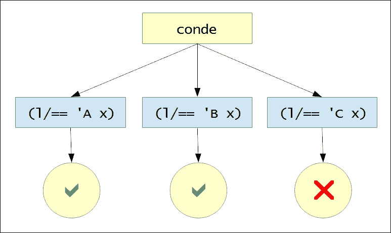

在我们之前的例子中，`conde`形式创建了一个针对三个子句的条件检查。在这三个子句中，只有两个成功，因此返回了符号`A`和`B`作为结果。我们应该注意，在`conde`形式中定义的子句可以包含任意数量的关系。此外，`l/succeed`常量的使用是隐式的，我们只需要使用`l/fail`常量来表示一个失败的目标。

另一种执行相等性检查的方法是通过模式匹配。这可以通过使用`clojure.core.logic/matche`形式来完成。因此，`matche`形式是定义涉及逻辑变量的条件分支的更自然的方式，如下所示：

```java
user> (l/run* [x]
 (l/conde
 ((l/== 'A x) l/succeed)
 ((l/== 'B x) l/succeed)))
(A B)
user> (l/run* [x]
 (l/matche [x]
 (['A] l/succeed)
 (['B] l/succeed)))
(A B)
```

两个先前的表达式产生相同的结果。这两个表达式之间的唯一区别是，第一个使用了一个`conde`形式，而第二个使用了一个`matche`形式来进行模式匹配。此外，`l/succeed`常量是隐式的，不需要指定，类似于`conde`形式。`_`通配符也由`matche`形式支持，如下所示：

```java
user> (l/run* [x]
 (l/matche [x]
 (['A])
 ([_] l/fail)))
(A)
```

在上述表达式中，我们求解了所有与模式`'A'`匹配的`x`的值。所有其他情况都失败，这使用`_`通配符和`l/fail`常量来描述。当然，使用`_`通配符的模式是隐式的，这里只是为了说明如何在`matche`形式中使用它。

`matche`构造也支持序列的解构。一个序列可以通过`matche`形式使用点（`.`）来界定序列的头部和尾部进行解构，如下所示：

```java
user> (l/run* [x]
 (l/fresh [y]
 (l/== y [1 2 3])
 (l/matche [y]
 ([[1 . x]]))))
((2 3))
```

在上述表达式中，逻辑变量`x`必须为`(2 3)`，才能使使用`matche`形式定义的关系成功。我们可以使用与`defn`形式类似的语法，通过`clojure.core.logic`命名空间中的`defne`宏来定义关系。`defne`形式允许我们以模式匹配风格定义关系。顺便提一下，`core.logic`库中的许多结构都是使用`defne`形式定义的。例如，考虑*示例 7.1*中`membero`关系的定义：

```java
(l/defne membero [x xs]
  ([_ [x . ys]])
  ([_ [y . ys]]
   (membero x ys)))
```

> *示例 7.1：使用 defne 宏定义 membero 关系*

`membero`关系用于确保值`x`是集合`xs`的成员。此关系的实现将集合`xs`解构为其头部和尾部部分。如果值`x`是集合`xs`的头部，则关系成功，否则关系将以值`x`和解构列表的尾部`ys`递归调用。我们可以在 REPL 中使用`run*`形式尝试此关系，如下所示：

```java
user> (l/run* [x]
 (membero x (range 5))
 (membero x (range 3 10)))
(3 4)
```

上述表达式求解了包含在范围`0`到`5`以及范围`3`到`10`内的`x`的值。结果`3`和`4`是由使用`membero`形式的这两个关系产生的。

在处理逻辑变量时，需要注意的是，我们不能使用标准函数对它们进行任何计算。为了从一组逻辑变量中提取值，我们必须使用`clojure.core.logic/project`形式。例如，考虑以下语句：

```java
user> (l/run 2 [x y]
 (l/membero x (range 1 10))
 (l/membero y (range 1 10))
 (l/project [x y]
 (l/== (+ x y) 5)))
([1 4] [2 3])
```

前面的陈述求解了两个 `x` 和 `y` 的值，它们都在 `1` 到 `10` 的范围内，并且它们的和等于 `5`。返回的结果是 `[1 4]` 和 `[2 3]`。使用 `project` 形式来提取 `x` 和 `y` 的值，否则 `+` 函数会抛出异常。

因此，`core.logic` 库为我们提供了一系列构造，可以用来定义逻辑关系、组合它们并从中生成结果。

# 以逻辑关系思考

现在我们已经熟悉了 `core.logic` 库中的各种构造，让我们看看一些可以通过逻辑编程解决的问题。

## 解决 n-皇后问题

**n-皇后问题**是一个有趣的问题，可以使用逻辑关系来实现。n-皇后问题的目标是放置 *n* 个女王在一个 *n* *x* *n* 大小的棋盘上，使得没有两个女王会相互构成威胁。这个问题是 1848 年由 Max Bezzel 发布的 *八皇后问题* 的一般化，涉及八个皇后。实际上，我们可以解决任何数量的 n-皇后问题，只要我们处理的是四个或更多的皇后。传统上，这个问题可以使用一种称为 *回溯算法* 的算法技术来解决，它本质上是对给定问题所有可能解决方案的穷举搜索。然而，在本节中，我们将使用逻辑关系来解决它。

让我们先定义一下如何使用女王。众所周知，女王可以随心所欲地移动！女王可以在棋盘上水平、垂直或对角线移动。如果任何其他棋子在女王可以移动的同一路径上，那么女王就会对其构成威胁。棋子在棋盘上的位置可以使用一对整数来指定，就像如何使用笛卡尔坐标来表示平面上点的位置一样。假设 (*x[1], y[1]) 和 (x[2], y[2]*) 代表棋盘上两个女王的坐标。由于它们可以在水平、垂直或对角线上相互威胁，我们必须避免以下三种不同的情况：

+   女王不能位于相同的垂直路径上，也就是说，*x[1]* 等于 *x[2]*。

+   同样，女王不能位于相同的水平路径上，也就是说，*y[1]* 等于 *y[2]*。

+   女王不能位于相同的对角路径上，在这种情况下，它们之间的垂直和水平距离的比率要么是 `1`，要么是 `-1`。这实际上是坐标几何中的一个技巧，其证明超出了我们讨论的范围。这种情况可以用以下方程简洁地表示：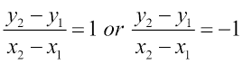

这些是确定两个皇后是否相互威胁的唯一规则。然而，如果你从程序或面向对象的视角来思考，实现它们可能需要大量的代码。相反，如果我们从关系的角度思考，我们可以使用 `core.logic` 库相对容易地实现这三个规则，如以下 *示例 7.2* 所示：

### 注意

以下示例可以在书籍源代码的 `src/m_clj/c7/nqueens.clj` 中找到。此示例基于 Martin Trojer 的代码 *使用 core.logic 的 n-皇后问题*([`martinsprogrammingblog.blogspot.in/2012/07/n-queens-with-corelogic-take-2.html`](http://martinsprogrammingblog.blogspot.in/2012/07/n-queens-with-corelogic-take-2.html))。

```java
(l/defne safeo [q qs]
  ([_ ()])
  ([[x1 y1] [[x2 y2] . t]]
     (l/!= x1 x2)
     (l/!= y1 y2)
     (l/project [x1 x2 y1 y2]
       (l/!= (- x2 x1) (- y2 y1))
       (l/!= (- x1 x2) (- y2 y1)))
     (safeo [x1 y1] t)))

(l/defne nqueenso [n qs]
  ([_ ()])
  ([n [[x y] . t]]
     (nqueenso n t)
     (l/membero x (range n))
     (safeo [x y] t)))

(defn solve-nqueens [n]
  (l/run* [qs]
    (l/== qs (map vector (repeatedly l/lvar) (range n)))
    (nqueenso n qs)))
```

> *示例 7.2：n-皇后问题*

在 *示例 7.2* 中，我们定义了两个关系，即 `safeo` 和 `nqueenso`，来描述 n-皇后问题。这两个关系都必须传递一个列表 `qs` 作为参数，其中 `qs` 包含坐标对，代表放置在棋盘上的皇后位置。它们是递归关系，终止条件是 `qs` 为空。

`safeo` 关系是实现确定两个皇后是否相互威胁的三个规则的实现。注意这个关系如何使用 `project` 形式提取 `x1`、`y1`、`x2` 和 `y2` 的值来处理两个皇后位于同一对角线路径上的情况。`nqueenso` 关系处理 `qs` 列表中的所有皇后位置，并确保每个皇后都是安全的。`solve-queens` 函数使用 `clojure.core.logic/lvar` 形式初始化 `n` 个逻辑变量。

`qs` 的值被初始化为一个向量对列表，每个向量对包含一个逻辑变量和范围在 *0* 到 *n* 之间的一个数字。实际上，我们初始化所有向量对的 *y* 坐标，并求解 *x* 坐标。这样做的原因是，当我们在一个有 *n* 列和 *n* 行的棋盘上求解 *n* 后问题时，每一行都会放置一个皇后。

`solve-nqueens` 函数返回一个包含坐标对列表的解决方案列表。我们可以通过使用 `partition` 和 `clojure.pprint/pprint` 函数以更直观的方式打印这些数据，如 *示例 7.3* 所示：

```java
(defn print-nqueens-solution [solution n]
  (let [solution-set (set solution)
        positions (for [x (range n)
                        y (range n)]
                    (if (contains? solution-set [x y]) 1 0))]
    (binding [clojure.pprint/*print-right-margin* (* n n)]
      (clojure.pprint/pprint
       (partition n positions)))))

(defn print-all-nqueens-solutions [solutions n]
  (dorun (for [i (-> solutions count range)
               :let [s (nth solutions i)]]
           (do
             (println (str "\nSolution " (inc i) ":"))
             (print-nqueens-solution s n)))))

(defn solve-and-print-nqueens [n]
  (-> (solve-nqueens n)
      (print-all-nqueens-solutions n)))
```

> *示例 7.3：n-皇后问题（继续）*

现在，我们只需要通过传递皇后数量来调用 `solve-and-print-nqueens` 函数。让我们尝试使用此函数来解决四个皇后的 n-皇后问题，如下所示：

```java
user> (solve-and-print-nqueens 4)

Solution 1:
((0 1 0 0)
 (0 0 0 1)
 (1 0 0 0)
 (0 0 1 0))

Solution 2:
((0 0 1 0)
 (1 0 0 0)
 (0 0 0 1)
 (0 1 0 0))
nil
```

`solve-and-print-nqueens` 函数打印了四个皇后的两个解决方案。每个解决方案都打印为一组嵌套列表，其中每个内部列表代表棋盘上的一行。值 `1` 表示在该位置上放置了一个皇后。正如你所见，在这两个解决方案中，四个皇后都没有相互威胁。

以这种方式，`solve-nqueens` 函数使用关系来解决八皇后问题。我们之前提到，八皇后问题最初涉及八个皇后。总共有 92 个不同的八皇后解决方案，`solve-nqueens` 函数可以找到每一个。我们鼓励你通过将值 `8` 传递给 `solve-and-print-nqueens` 函数并验证它打印的解决方案来尝试这一点。

## 解决数独谜题

我们中的一些人可能已经深深地爱上了我们在报纸和杂志上找到的直观迷人的数独谜题。这是一个涉及逻辑规则的问题。数独板是一个 *9* *x* *9* 的网格，我们可以在其上放置数字。网格被分成九个更小的网格，每个更小的网格进一步被分成包含数字的 *3* *x* *3* 网格。这些更小的网格也被称为 *方格* 或 *盒子*。一些方格将被填充。目标是放置数字在网格的所有位置上，使得每一行、每一列以及每个更小的网格都包含 1 到 9 范围内的不同数字。

让我们以这种方式实现数独谜题的规则。我们将为数独板上每个可能的数字位置创建一个逻辑变量，并使用谜题的规则求解它们的值。数独板上数字的初始值可以作为一个包含 81 个数字的单个向量提供。在这个实现中，我们引入了一些新的结构，这些结构在简洁地描述数独谜题的规则时非常有用。`clojure.core.logic` 命名空间中的 `everyg` 函数可以用来在逻辑变量的列表上应用一个关系，从而确保该关系对所有提供的逻辑变量都为真。我们还必须确保数独谜题中行、列和 *3* *x* *3* 大小的网格中的逻辑变量是不同的。这可以通过使用 `clojure.core.logic.fd/distinct` 函数来完成。这种数独求解器设计的实现示例如 *示例 7.4* 所示。

### 注意

以下示例可以在书籍源代码的 `src/m_clj/c7/sudoku.clj` 中找到。

```java
(l/defne init-sudoku-board [vars puzzle]
  ([[] []])
  ([[_ . vs] [0 . ps]] (init-sudoku-board vs ps))
  ([[n . vs] [n . ps]] (init-sudoku-board vs ps)))

(defn solve-sudoku [puzzle]
  (let [board (repeatedly 81 l/lvar)
        rows (into [] (map vec (partition 9 board)))
        cols (apply map vector rows)
        val-range (range 1 10)
        in-range (fn [x]
                   (fd/in x (apply fd/domain val-range)))
        get-square (fn [x y]
                     (for [x (range x (+ x 3))
                           y (range y (+ y 3))]
                       (get-in rows [x y])))
        squares (for [x (range 0 9 3)
                      y (range 0 9 3)]
                  (get-square x y))]
    (l/run* [q]
      (l/== q board)
      (l/everyg in-range board)
      (init-sudoku-board board puzzle)
      (l/everyg fd/distinct rows)
      (l/everyg fd/distinct cols)
      (l/everyg fd/distinct squares))))
```

> *示例 7.4：数独求解器*

在 *示例 7.4* 中，`init-sudoku-board` 关系从谜题 `puzzle` 中初始化逻辑变量 `vars`，而 `solve-sudoku` 函数找到给定谜题的所有可能解。`solve-sudoku` 函数通过 `repeatedly` 和 `clojure.core.logic/lvar` 表达式的组合创建逻辑变量。然后，这些变量被划分为行、列和方块，分别由变量 `rows`、`cols` 和 `squares` 表示。`solve-sudoku` 函数随后使用 `init-sudoku-board` 表达式初始化逻辑变量，并使用 `everyg` 和 `distinct` 表达式的组合来确保解的行、列和方块包含不同的值。所有逻辑变量也通过内部定义的 `in-range` 函数绑定到范围 `1` 到 `9`。

在 *示例 7.4* 中定义的 `solve-sudoku` 函数接受一个表示数独棋盘初始状态的值向量作为参数，并返回一个列表，其中每个解都是一个向量。由于一个普通的向量并不是一个直观的数独棋盘表示，让我们定义一个简单的函数来找到给定谜题的所有解并打印出来，如 *示例 7.5* 所示：

```java
(defn solve-and-print-sudoku [puzzle]
  (let [solutions (solve-sudoku puzzle)]
    (dorun (for [i (-> solutions count range)
                 :let [s (nth solutions i)]]
             (do
               (println (str "\nSolution " (inc i) ":"))
               (clojure.pprint/pprint
                (partition 9 s)))))))
```

> *示例 7.5：数独求解器（继续）*

在 *示例 7.5* 中的 `solve-and-print-sudoku` 函数调用 `solve-sudoku` 函数来确定给定数独谜题的所有可能解，并使用 `partition` 和 `clojure.pprint/pprint` 函数打印结果。现在，让我们定义一个简单的数独谜题来求解，如 *示例 7.6* 所示。

```java
(def puzzle-1
  [0 9 0 0 0 0 0 5 0
   6 0 0 0 5 0 0 0 2
   1 0 0 8 0 4 0 0 6
   0 7 0 0 8 0 0 3 0
   8 0 3 0 0 0 2 0 9
   0 5 0 0 3 0 0 7 0
   7 0 0 3 0 2 0 0 5
   3 0 0 0 6 0 0 0 7
   0 1 0 0 0 0 0 4 0])
```

> *示例 7.6：数独求解器（继续）*

现在，让我们将向量 `puzzle-1` 传递给 `solve-and-print-sudoku` 函数，以打印出所有可能的解，如下所示：

```java
user> (solve-and-print-sudoku puzzle-1)

Solution 1:
((4 9 8 6 2 3 7 5 1)
 (6 3 7 9 5 1 4 8 2)
 (1 2 5 8 7 4 3 9 6)
 (9 7 1 2 8 6 5 3 4)
 (8 4 3 5 1 7 2 6 9)
 (2 5 6 4 3 9 1 7 8)
 (7 6 9 3 4 2 8 1 5)
 (3 8 4 1 6 5 9 2 7)
 (5 1 2 7 9 8 6 4 3))
nil
```

`solve-sudoku` 函数找到了之前表示的由向量 `puzzle-1` 表示的数独谜题的单个解。由 `puzzle-1` 表示的谜题及其解在以下插图中的数独棋盘上显示：

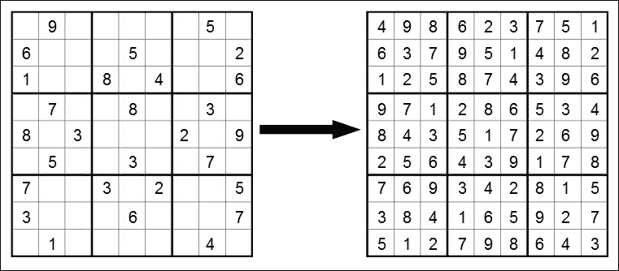

示例 7.7：数独求解器（继续）

很可能一个数独谜题有多个解。例如，*示例 7.7* 中的 `puzzle-2` 表示的数独谜题有八个不同的解。你完全可以使用 `solve-and-print-sudoku` 函数来找到这个谜题的解：

```java
(def puzzle-2
  [0 8 0 0 0 9 7 4 3
   0 5 0 0 0 8 0 1 0
   0 1 0 0 0 0 0 0 0
   8 0 0 0 0 5 0 0 0
   0 0 0 8 0 4 0 0 0
   0 0 0 3 0 0 0 0 6
   0 0 0 0 0 0 0 7 0
   0 3 0 5 0 0 0 8 0
   9 7 2 4 0 0 0 5 0])
```

> *示例 7.7：数独求解器（继续）*

总之，我们可以使用 `core.logic` 库将数独谜题的规则实现为逻辑关系。

# 摘要

在本章中，我们探讨了如何使用 Clojure 进行逻辑编程。我们通过探索这个库提供的各种构造来介绍了 `core.logic` 库。我们还研究了如何使用 `core.logic` 库实现 n-皇后问题和数独谜题的解决方案。

在下一章中，我们将继续我们的函数式编程之旅，并讨论在 Clojure 中处理异步任务。

# 第八章。利用异步任务

术语**异步编程**指的是定义在不同执行线程上异步执行的任务。虽然这与多线程类似，但也有一些细微的差别。首先，一个线程或一个未来将保留分配给单个操作系统线程，直到完成。这导致了一个事实，即可以同时执行的未来数量是有限的，这取决于可用的处理核心数量。另一方面，异步任务被安排在线程池的线程上执行。这样，一个程序可以有数千个，甚至数百万个异步任务同时运行。异步任务可以在任何时候暂停，或者*停放*，并且执行线程可以被重新分配给另一个任务。异步编程结构还允许定义异步任务看起来像一系列同步调用，但每个调用可能都是异步执行的。

在本章中，我们将探讨在 Clojure 中进行异步编程时可以使用的各种库和结构。首先，我们将查看`core.async`库中的*进程*和*通道*，用于异步编程。稍后，我们将探索来自*Pulsar*库的*actor*。进程和通道是与 Go 编程语言中的*go-routines*类似的构造。另一方面，actor 最初在 Erlang 编程语言中流行起来。所有这些技术都是结构异步执行代码的不同方式。我们必须理解，这些概念背后的理论并不是真正新颖的，自从分布式和多核架构兴起以来，这些理论的更多实现已经层出不穷。有了这个想法，让我们开始我们的异步编程之旅。

# 使用通道

`core.async`库([`github.com/clojure/core.async`](https://github.com/clojure/core.async))促进了 Clojure 中的异步编程。通过这个库，我们可以在 JVM 和网页浏览器上使用异步构造，而无需处理它们在低级线程上的执行调度。这个库是实现 C. A. R. Hoare 在 70 年代末发表的论文中的理论，即**通信顺序进程**（**CSP**）。CSP 的基本观点是，任何处理某些输入并提供输出的系统都可以由更小的子系统组成，每个子系统都可以用**进程**和**队列**来定义。队列简单地缓冲数据，进程可以从多个队列中读取和写入。在这里，我们不应该将术语**进程**与操作系统进程混淆。在 CSP 的上下文中，进程只是一系列与存储在队列中的某些数据交互的指令。一个系统中可能存在多个进程，队列是它们之间传递数据的一种方式。一个从单个队列中获取数据并将数据输出到另一个队列的进程可以表示如下：

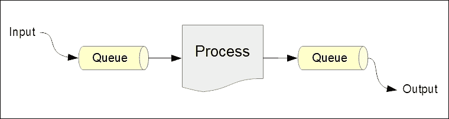

如前图所示，输入数据进入队列，进程通过队列操作这些数据，最后将输出数据写入另一个队列。`core.async`库本质上提供了创建进程和队列的一等支持。在`core.async`库中，队列被称为**通道**，可以使用`chan`函数创建。进程可以使用`go`和`thread`宏创建。让我们更深入地探讨一下细节。

### 注意

以下库依赖对于即将到来的示例是必需的：

```java
[org.clojure/core.async " 0.1.346.0-17112a-alpha"]
```

此外，以下命名空间必须在您的命名空间声明中包含：

```java
(ns my-namespace
  (:require [clojure.core.async :as a]))
```

使用`thread`和`go`形式创建的进程将在线程池上执行。实际上，我们可以在程序中创建数千个这样的进程，因为它们不需要自己的专用线程。另一方面，创建大量线程或未来会导致过多的作业排队等待执行。这实际上限制了我们可以同时运行的线程或未来的数量。因此，`core.async`库以及一般的 CSP（通信顺序进程）允许我们将系统建模为大量轻量级和并发的进程。

可以将通道视为管理进程之间状态的数据结构。`core.async`命名空间中的`chan`函数返回一个可以由多个并发进程读取和写入的通道。默认情况下，通道是无缓冲的，这意味着对通道的写入操作将不会完成，直到并发地对其调用读取操作，反之亦然。我们还可以通过指定一个数字给`chan`函数来指定缓冲区大小来创建一个缓冲通道。缓冲通道将允许写入一定数量的值而不阻塞，然后可以读取这些缓冲值。可以使用`core.async`命名空间中的`close!`函数关闭通道。

我们也可以通过将缓冲区对象传递给`chan`函数来创建一个缓冲通道。可以使用`buffer`、`dropping-buffer`或`sliding-buffer`函数来创建缓冲区对象，这些函数需要一个数字作为参数，表示缓冲区的大小。可以使用`(a/chan (a/buffer n))`或`(a/chan n)`中的任何一个表达式来创建一个可以缓冲`n`个值的通道，一旦通道被填充了`n`个值，它将阻止对该通道的写入操作。`dropping-buffer`函数创建的缓冲区在满载后会丢弃新添加的值。相反，使用`sliding-buffer`函数创建的缓冲区在完全填满后会丢弃最老的值。

`core.async`库提供了一些用于从通道读取和写入的构造，传递给这些构造的值遵循一些简单的规则。对通道的读取操作会从通道返回一个值，如果通道已关闭，则返回`nil`。如果写入操作成功，则返回`true`，如果通道已关闭且写入操作无法完成，则返回`false`。我们可以从已关闭的通道中读取缓冲数据，但一旦通道中的数据耗尽，对该通道的读取操作将返回`nil`。通道的读取和写入操作的参数遵循以下模式：

1.  任何操作的第一个参数都是一个通道。

1.  除了通道本身外，写入操作还必须传递一个值以放入通道。

在通道的上下文中，我们应该注意，“写入”和“放置”这两个术语可以互换使用，同样，“读取”和“获取”这两个术语也指代相同的操作。`take!` 和 `put!` 函数从队列中获取数据和放置数据。这两个函数都会立即返回，并且除了常规参数外，还可以传递一个回调函数作为参数。同样，`<!!` 和 `>!!` 函数可以分别用于从通道读取和写入。然而，如果提供的通道中没有数据，`<!!` 操作会阻塞调用线程，而如果没有更多缓冲空间可用，`>!!` 操作将被阻塞。这两个操作旨在在 `thread` 形式中使用。最后，暂停读写函数，即 `<!` 和 `>!`，可以在 `go` 形式中用于与通道交互。`<!` 和 `>!` 操作都会暂停任务状态，并在无法立即完成操作时释放底层执行线程。

让我们继续探讨使用 `core.async` 库创建过程的细节。`core.async/thread` 宏用于创建单线程过程。在意义上，它与 `future` 形式相似，即 `thread` 形式的主体在新的线程上执行，并且对 `thread` 形式的调用会立即返回。`thread` 形式返回一个通道，可以从其中读取其主体的输出。这使得 `thread` 形式在处理通道方面比标准 `future` 形式更方便，因此更受欢迎。`<!!` 和 `>!!` 函数可以在 `thread` 形式中用于与通道交互。

要创建一个可以暂停并调度执行的非阻塞异步过程，我们必须使用 `core.async` 命名空间中的 `go` 宏。与 `thread` 形式类似，它返回一个通道，可以从其中读取其主体的输出。`go` 形式主体内的所有通道操作都将暂停，而不是阻塞执行线程。这意味着执行线程不会被阻塞，可以被重新分配到另一个异步过程。因此，多个 `go` 形式的执行可以交织在更少的实际线程上。我们必须确保在 `go` 形式中不执行任何特定于线程的操作，如 `Thread/sleep`，因为这些操作会影响执行线程。在 `go` 形式中，我们必须始终使用 `<!` 和 `>!` 暂停形式来从通道读取和写入。

### 注意

访问 [`clojure.github.io/core.async/`](https://clojure.github.io/core.async/) 获取关于 `core.async` 库中所有函数和宏的完整文档。

`go-loop` 宏是 `loop` 形式的异步版本，它接受一个绑定向量作为其第一个参数，后面跟着任何必须执行的形式。`go-loop` 形式的主体将在 `go` 形式内部执行。`go-loop` 构造通常用于创建具有自己局部状态的异步事件循环。作为一个例子，让我们考虑一个简单的 `wait-and-print` 函数，该函数启动一个从给定通道读取的过程，如 *示例 8.1* 所示。

### 注意

以下示例可以在书籍源代码的 `src/m_clj/c8/async.clj` 中找到。

```java
(defn wait-and-print [c]
  (a/go-loop [n 1]
    (let [v (a/<! c)]
      (when v
        (println (str "Got a message: " v))
        (println (str "Got " n " messages so far!"))
        (recur (inc n)))))
  (println "Waiting..."))
```

> *示例 8.1：一个异步从通道读取的函数*

之前展示的 `wait-and-print` 函数会反复从传递给它的通道 `c` 中读取。使用 `when` 形式是为了检查从通道读取的值，用 `v` 表示，是否不是 `nil`，因为如果通道 `c` 被关闭，`<!` 形式可能会返回 `nil`。之前示例中的 `go-loop` 形式也使用变量 `n` 来计算从通道读取的值的数量。在从通道接收到值时，会打印一些信息，并使用 `recur` 形式循环体。我们可以创建一个通道，将其传递给 `wait-and-print` 函数，并观察向通道发送值的输出，如下所示：

```java
user> (def c (a/chan))
#'user/c
user> (wait-and-print c)
Waiting...
nil
user> (a/>!! c :foo)
true
Got a message: :foo
Got 1 messages so far!
user> (a/>!! c :bar)
true
Got a message: :bar
Got 2 messages so far!
```

如前所述，调用 `wait-and-print` 函数启动一个异步事件循环，该循环从通道 `c` 中读取。使用 `>!!` 形式向通道 `c` 发送值时，该值会与发送到通道的总值数一起打印出来。此外，`>!!` 形式的调用会立即返回值 `true`。现在，让我们看看当我们使用 `close!` 函数关闭通道 `c` 时会发生什么，如下所示：

```java
user> (a/close! c)
nil
user> (a/>!! c :foo)
false
```

在关闭通道 `c` 后，当 `>!!` 形式应用于通道时，它返回 `false`，这意味着通道 `c` 不再允许放入任何值。而且，没有任何内容被打印出来，这意味着尝试从通道 `c` 中获取值的异步例程已经终止。

向通道发送值的另一种方式是使用 `core.async` 命名空间中的 `onto-chan` 函数。这个函数必须传递一个通道和一个要放入通道的值集合，如下所示：

```java
user> (def c (a/chan 4))
#'user/c
user> (a/onto-chan c (range 4))
#<ManyToManyChannel@0x86f03a>
user> (repeatedly 4 #(-> c a/<!!))
(0 1 2 3)
```

当提供的值集合完全放入通道后，`onto-chan` 函数会关闭它所接收的通道。为了避免关闭通道，我们可以在 `onto-chan` 函数中指定 `false` 作为额外的参数。

来自 `core.async` 命名空间的 `alts!` 和 `alts!!` 函数可用于等待多个通道操作之一完成。这些函数之间的主要区别在于，`alts!` 函数旨在在 `go` 形式中使用，并将暂停当前线程，而 `alts!!` 函数会阻塞当前线程，必须在 `thread` 形式中使用。这两个函数都必须传递一个通道向量，并返回一个包含两个元素的向量。返回向量中的第一个元素代表取操作的价值或放入操作的布尔值，第二个元素表示操作完成的通道。我们还可以通过将 `:default` 作为关键字参数传递给 `alts!` 和 `alts!!` 函数来指定默认值。如果没有提供给 `alts!` 或 `alts!!` 形式的操作完成，则将返回默认值。

`core.async` 库提供了两个多功能的宏，即 `alt!` 和 `alt!!`，用于等待多个通道操作中之一完成。正如你可能已经猜到的，`alt!` 形式会暂停当前任务，而 `alt!!` 形式会阻塞当前线程。这两个形式在使用带有关键字参数 `:default` 时也可以返回默认值。我们可以向 `alt!` 和 `alt!!` 形式传递多个子句，用于从多个通道读取和写入。*示例 8.2* 中的 `alt!` 形式描述了 `alt!` 和 `alt!!` 宏支持的子句：

```java
(defn process-channels [c0 c1 c2 c3 c4 c5]
  (a/go
    (a/alt!
      ;; read from c0, c1, c2, c3
      c0 :r
      c1 ([v] (str v))
      [c2 c3] ([v c] (str v))
      ;; write to c4, c5
      [[c4 :v1] [c5 :v2]] :w)))
```

> *示例 8.2：使用 alt! 形式实现的异步过程*

前面的 `process-channels` 函数接受六个通道作为其参数，并在 `go` 形式中使用 `alt!` 形式对这些通道执行异步操作。通道 `c0`、`c1`、`c2` 和 `c3` 被读取，而通道 `c4` 和 `c5` 被写入。`alt!` 形式尝试从通道 `c0` 读取，如果操作首先完成，则返回关键字 `:r`。通道 `c1` 也被读取，但其子句的右侧包含一个带有参数 `v` 的参数化表达式，其中 `v` 是从通道读取的值。通道 `c2` 和 `c3` 作为向量传递给前面显示的 `alt!` 形式的一个子句，该子句使用带有参数 `v` 和 `c` 的参数化表达式，其中 `c` 是首先完成读取操作的通道，而 `v` 是从通道读取的值。写入操作在 `alt!` 形式中指定为嵌套向量，其中每个内部向量包含一个通道和一个要放入通道的值。在之前的 `alt!` 形式中写入通道 `c4` 和 `c5`，如果两个写入操作中的任何一个首先完成，则返回值 `:w`。通过这种方式，我们可以指定给 `alt!` 和 `alt!!` 形式的子句，以读取和写入多个通道，并根据哪个通道操作首先完成返回一个值。

在异步编程中，经常需要的一个功能是能够为给定的操作指定一个*超时*。通过术语*超时*，我们指的是在指定时间后当前操作被取消。`core.async`有一个直观的方法来指定带有超时的操作。这是通过使用`core.async/timeout`函数来完成的，它必须提供一个时间间隔（以毫秒为单位），并在指定的时间后关闭返回的通道。如果我们打算执行带有超时的操作，我们使用`alt*`形式之一，该形式使用由`timeout`函数返回的通道。

这样，由`timeout`形式返回的通道进行的操作将在指定的时间后肯定完成。`timeout`形式在暂停或阻塞当前执行线程一段时间也是很有用的。例如，从`timeout`形式返回的通道进行的阻塞读取操作将阻塞当前线程指定的时间间隔，如下所示：

```java
user> (time  (a/<!! (a/timeout 1000)))
"Elapsed time: 1029.502223 msecs"
nil
```

我们现在已经涵盖了`core.async`库中进程和通道的基本知识。

## 自定义通道

通道也可以被编程来修改或计算放入其中的值。例如，对通道的读取操作可以调用使用同一通道中缓存的值或甚至其他通道的值的计算。`core.async`命名空间中的`reduce`函数可以用来从通道中计算值，并且与标准`reduce`函数有更多或更少的相同语义。这个`reduce`函数的变体需要一个减少操作、减少操作的初始值以及要传递给它的通道，并且它将返回一个可以从中读取结果的通道。此外，此函数仅在传递给它的通道关闭后才会产生值。例如，考虑以下使用`core.async/reduce`函数从通道中的值计算字符串的代码：

```java
user> (def c (a/chan 5))
#'user/c
user> (a/onto-chan c (range 5))
#<ManyToManyChannel@0x4adadd>
user> (def rc (a/reduce #(str %1 %2 " ") "" c))
#'user/rc
user> (a/<!! rc)
"0 1 2 3 4 "
```

在前面的例子中，由`(range 5)`表达式生成的序列被使用`onto-chan`形式放入通道`c`中，然后使用基于通道的`reduce`函数的变体计算通道中的值。从结果通道`rc`中读取单个值，从而生成包含通道`c`中所有值的字符串。请注意，在这个例子中，`reduce`形式产生了结果，而没有显式调用`close!`函数，因为`onto-chan`函数在将值放入通道后关闭了提供的通道。

从通道计算值的一种更强大、更直观的方法是使用转换器。我们已经在 第五章 *组合转换器* 中详细讨论了转换器，现在我们将看看如何使用通道与转换器一起使用。本质上，可以通过将转换器指定为 `core.async/chan` 函数的第二个参数来将通道与转换器关联。让我们考虑 *示例 8.3* 中显示的简单转换器 `xform`。

```java
(def xform
  (comp
   (map inc)
   (map #(* % 2))))
```

> *示例 8.3：与通道一起使用的简单转换器*

展示的转换器 `xform` 是将函数 `inc` 和 `#(* % 2)` 映射的简单组合。它将简单地增加数据源中（或更确切地说，是一个通道）的所有值，然后加倍前一步骤的所有结果。让我们使用这个转换器创建一个通道，并观察其行为，如下所示：

```java
user> (def xc (a/chan 10 xform))
#'user/xc
user> (a/onto-chan xc (range 10) false)
#<ManyToManyChannel@0x17d6a37>
user> (repeatedly 10 #(-> xc a/<!!))
(2 4 6 8 10 12 14 16 18 20)
```

通道 `xc` 将将转换器 `xform` 应用到它包含的每个值。因此，从通道 `xc` 重复取值的结果是一个偶数序列，这是通过将函数 `inc` 和 `#(* % 2)` 应用到 `(range 10)` 范围内的每个数字产生的。请注意，在前面的例子中，`onto-chan` 形式并没有关闭通道 `xc`，因为我们将其最后一个参数传递为 `false`。

与一个通道关联的转换器可能会遇到异常。为了处理错误，我们可以将一个函数作为额外的参数传递给 `chan` 形式。这个函数必须恰好接受一个参数，并将传递给转换器在转换通道中的值时遇到的任何异常。例如，表达式 `(a/chan 10 xform ex-handler)` 创建了一个带有转换器 `xform` 和异常处理器 `ex-handler` 的通道。

以这种方式，`core.async/reduce` 形式和转换器可以用来对通道中包含的值进行计算。

## 连接通道

现在我们已经熟悉了 `core.async` 库中通道和进程的基本知识，让我们探索通道可以连接在一起的不同方式。连接两个或更多通道对于在它们之间聚合和分配数据是有用的。两个或更多通道之间的连接称为 *联合适配*，或简单地称为 *联合*。在本节中，我们将使用图表来描述一些更复杂的联合适配。请注意，这些图表中的箭头指示了给定通道中数据流的流向。

连接两个通道最简单的方式是使用一个*管道*，该管道通过`core.async/pipe`函数实现。这个函数将从它提供的第一个通道中获取值，并将这些值提供给传递给它的第二个通道。通过这种方式，通道之间的管道类似于 UNIX 风格的流管道。例如，表达式`(a/pipe from to)`将从`from`通道中获取值并将它们放入`to`通道。`pipe`函数还接受一个可选的第三个参数，该参数指示当源通道关闭时，目标通道是否会关闭，并且此参数默认为`true`。我们还可以使用`core.async`命名空间中的`pipeline`函数通过管道连接两个通道。`pipeline`函数将基本上在将值放入另一个通道之前，将这些值应用于通道中的转换器。提供的转换器也将由`pipeline`函数并行地对提供的通道中的每个元素调用。

`core.async`命名空间中的`merge`函数可以用来合并多个通道。此函数必须传递一个通道向量，并返回一个可以从所有提供的通道中读取值的通道。默认情况下，返回的通道是非缓冲的，我们可以通过将一个数字作为额外的参数传递给`merge`函数来指定通道的缓冲区大小。此外，一旦所有源通道都已关闭，由`merge`形式返回的通道将被关闭。两个通道的`merge`函数的操作可以用以下插图表示：

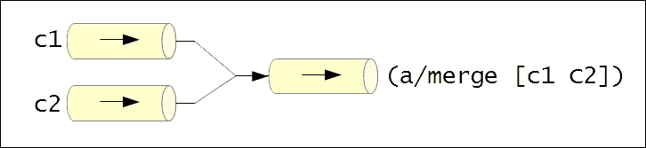

可以使用`core.async/split`函数将一个通道拆分为两个通道。`split`函数必须传递一个谓词`p?`和一个通道`c`，并返回一个包含两个通道的向量。谓词`p?`用于决定将`c`通道中的值放入哪个通道。所有通过谓词`p?`返回真值的`c`通道中的值都将放入`split`函数返回的向量中的第一个通道。

相反，返回向量中的第二个通道将包含所有在应用`p?`时返回`false`或`nil`的值。此函数返回的两个通道默认都是非缓冲的，并且可以通过将额外的参数传递给`split`形式来指定这两个通道的缓冲区大小。`split`函数可以用以下插图表示：

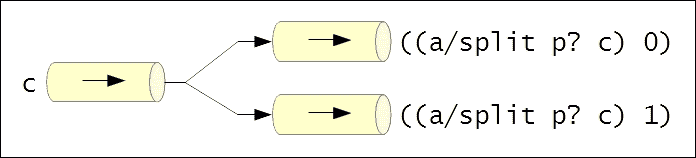

与`merge`函数相比，更动态地组合几个通道的方法是使用`core.async`命名空间中的`mix`、`admix`和`unmix`函数。`mix`函数创建一个**混合**，可以使用`admix`函数将具有传入数据的通道连接到该混合。`mix`函数接受一个通道作为参数，提供的通道将包含由`admix`函数添加的所有源通道的值。可以使用`unmix`函数从混合器中移除源通道。`admix`和`unmix`函数都接受一个混合，这是由`mix`函数返回的，以及一个源通道作为参数。要从一个混合中移除所有通道，我们只需将混合作为参数传递给`unmix-all`函数。混合的精髓在于它允许我们动态地添加和移除向给定输出通道发送数据的源通道。混合、其输出通道和源通道可以如下所示：

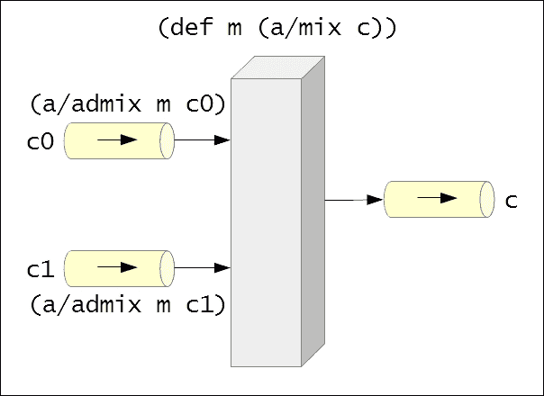

在前面的示意图中，通道`c`被用作混合`m`的输出通道，通道`c0`和`c1`使用`admix`函数添加为混合`m`的源通道。

`core.async/mult` 函数创建给定通道的**多个**副本。可以通过`tap`函数从另一个通道中**提取**多个通道的数据。提供给`tap`函数的通道将接收所有发送到多个通道源通道的数据副本。`untap`函数用于从多个通道断开一个通道，而`untap-all`函数将断开所有通道与多个通道的连接。多个通道本质上允许我们动态地添加和移除从给定源通道读取值的输出通道。`mult`和`tap`函数可以用以下图表来描述：

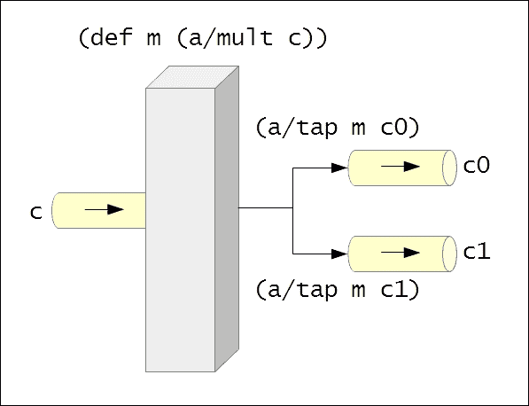

在前面的示意图中，通道`c`被多个`m`用作源通道，通道`c0`和`c1`传递给`tap`函数，以便它们有效地接收发送到通道`c`的数据副本。

`core.async` 库还支持一种 *发布-订阅* 的数据传输模型。这可以通过使用 *发布* 来完成，该发布是通过 `core.async/pub` 函数创建的。这个函数必须提供一个源通道和一个函数来决定发布中给定值的主题。在这里，主题可以是任何字面量，如字符串或关键字，该字面量由提供给 `pub` 形式的函数返回。通道可以通过 `sub` 函数订阅一个发布和一个主题，一个通道可以使用 `unsub` 函数从发布中取消订阅。`sub` 和 `unsub` 函数必须传递一个发布、一个主题值和一个通道。此外，可以使用 `unsub-all` 函数来断开所有已订阅发布的通道。此函数可以可选地传递一个主题值，并将断开所有已订阅给定主题的通道。以下图中展示了已订阅两个通道的发布：

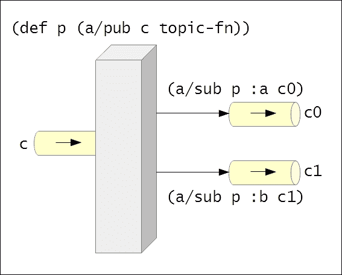

在前面的示例中，使用通道 `c` 和函数 `topic-fn` 创建了发布 `p`。通道 `c0` 订阅了发布 `p` 和主题 `:a`，而通道 `c1` 订阅了相同的发布，但针对主题 `:b`。当通道 `c` 接收到一个值时，如果函数 `topic-fn` 对于该值返回 `:a`，则该值将被发送到通道 `c0`；如果函数 `topic-fn` 对于该值返回 `:b`，则该值将被发送到通道 `c1`。请注意，前面图中的值 `:a` 和 `:b` 只是任意字面量，我们同样可以轻松地使用其他字面量。

总结来说，`core.async` 库提供了几个构造来在通道之间创建连接。这些构造有助于模拟数据从任意数量的源通道流向任意数量的输出通道的不同方式。

## 再次探讨就餐哲学家问题

现在，让我们尝试使用 `core.async` 库来实现就餐哲学家问题的解决方案。我们已经在第二章中实现了就餐哲学家问题的两个解决方案，其中一种解决方案使用了 refs，另一种使用了 agents。在本节中，我们将使用通道来实现就餐哲学家问题的解决方案。

就餐哲学家问题可以简洁地描述如下。五位哲学家坐在一张桌子旁，桌子上有五把叉子放在他们之间。每位哲学家需要两把叉子才能吃饭。哲学家们必须以某种方式共享他们之间放置的叉子的访问权限，以消费分配给他们的食物，并且没有任何哲学家因为无法获得两把叉子而饿死。在这个实现中，我们将使用通道来维护桌子上的叉子和哲学家的状态。

### 注意

在接下来的示例中，必须在您的命名空间声明中包含以下命名空间：

```java
(ns my-namespace
  (:require [clojure.core.async :as a]
            [m-clj.c2.refs :as c2]))
```

以下示例可以在书籍源代码的`src/m_clj/c8/` `dining_philosophers_async.clj`中找到。其中一些示例基于 Pepijn de Vos 的*《进餐哲学家求解器》*中的代码([`pepijndevos.nl/2013/07/11/dining-philosophers-in-coreasync.html`](http://pepijndevos.nl/2013/07/11/dining-philosophers-in-coreasync.html))。

首先，让我们定义几个函数来初始化我们正在处理的所有哲学家和叉子，如*示例 8.4*所示：

```java
(defn make-philosopher [name forks food]
  {:name name
   :forks forks
   :food food})

(defn make-forks [nf]
  (let [forks (repeatedly nf #(a/chan 1))]
    (doseq [f forks]
      (a/>!! f :fork))
    forks))
```

> *示例 8.4: 进餐哲学家问题*

在*示例 8.4*中定义的`make-philosopher`函数创建了一个表示哲学家状态的映射。参数`name`将是一个字符串，参数`forks`将是一个包含两个叉子通道的向量，参数`food`将是一个表示提供给哲学家的食物数量的数字。这两个叉子代表哲学家左右两侧的叉子。这些叉子将由我们之前在第二章中定义的`init-philosophers`函数分配并传递给`make-philosopher`函数。之前显示的`make-forks`函数创建指定数量的通道，将值`:fork`放入每个通道中，最后返回新的通道。

接下来，让我们将哲学家的常规定义为一种进程。哲学家必须尝试获取他左右两侧的叉子，如果获取到两个叉子，就吃他的食物，最后释放他成功获取的任何叉子。由于我们模拟中所有哲学家的状态都由一个通道捕获，因此我们必须将一个哲学家从通道中取出，执行哲学家的常规，然后将哲学家的状态放回通道。这个常规由*示例 8.5*中的`philosopher-process`函数实现：

```java
(defn philosopher-process [p-chan max-eat-ms max-think-ms]
  (a/go-loop []
    (let [p (a/<! p-chan)
          food (:food p)
          fork-1 ((:forks p) 0)
          fork-2 ((:forks p) 1)
          ;; take forks
          fork-1-result (a/alt!
                          (a/timeout 100) :timeout
                          fork-1 :fork-1)
          fork-2-result (a/alt!
                          (a/timeout 100) :timeout
                          fork-2 :fork-2)]
      (if (and (= fork-1-result :fork-1)
               (= fork-2-result :fork-2))
        (do
          ;; eat
          (a/<! (a/timeout (rand-int max-eat-ms)))
          ;; put down both acquired forks
          (a/>! fork-1 :fork)
          (a/>! fork-2 :fork)
          ;; think
          (a/<! (a/timeout (rand-int max-think-ms)))
          (a/>! p-chan (assoc p :food (dec food))))
        (do
          ;; put down any acquired forks
          (if (= fork-1-result :fork-1)
            (a/>! fork-1 :fork))
          (if (= fork-2-result :fork-2)
            (a/>! fork-2 :fork))
          (a/>! p-chan p)))
      ;; recur
      (when (pos? (dec food)) (recur)))))
```

> *示例 8.5: 进餐哲学家问题（续）*

前面的`philosopher-process`函数使用`go-loop`宏启动一个异步进程。参数`p-chan`、`max-eat-ms`和`max-think-ms`分别代表包含所有哲学家状态的通道、哲学家可以花费的最大吃饭时间和哲学家可以思考的最大时间。`philosopher-process`函数启动的异步任务将尝试从哲学家的`fork-1`和`fork-2`叉子中获取值，超时时间为`100`毫秒。这是通过`alt!`和`timeout`函数的组合来完成的。如果哲学家能够获取两个叉子，他将吃一段时间，放下或释放两个叉子，花一些时间思考，然后重复相同的过程。如果他无法获取两个叉子，哲学家将释放任何获取到的叉子并重新启动相同的过程。哲学家的状态始终被放回到通道`p-chan`。这个异步进程会一直重复，直到哲学家有任何剩余的食物。接下来，让我们定义一些函数来启动和打印我们模拟中的哲学家，如下所示*示例 8.6*：

```java
(defn start-philosophers [p-chan philosophers]
  (a/onto-chan p-chan philosophers false)
  (dorun (repeatedly (count philosophers)
                     #(philosopher-process p-chan 100 100)))) 

(defn print-philosophers [p-chan n]
  (let [philosophers (repeatedly n #(a/<!! p-chan))]
    (doseq [p philosophers]
      (println (str (:name p) ":\t food=" (:food p)))
      (a/>!! p-chan p))))
```

> *示例 8.6：就餐哲学家问题（继续）*

前面的`start-philosophers`函数将哲学家序列（由参数`philosophers`表示）放入通道`p-chan`，然后对序列`philosophers`中的每个哲学家调用`philosopher-process`函数。`print-philosophers`函数使用阻塞通道读写函数，即`<!!`和`>!!`，从通道`p-chan`读取`n`个哲学家并打印每个哲学家盘子上的剩余食物量。

最后，让我们使用`make-philosopher`和`make-forks`函数创建一些哲学家的实例及其相关的叉子。我们还将使用来自第二章的`init-philosophers`函数，编排并发与并行，使用`make-philosopher`函数创建哲学家对象，并将两个叉子分配给每个哲学家。我们模拟中哲学家和叉子的这些顶级定义在*示例 8.7*中展示。

```java
(def all-forks (make-forks 5))
(def all-philosophers
  (c2/init-philosophers 5 1000 all-forks make-philosopher))

(def philosopher-chan (a/chan 5))
```

> *示例 8.7：就餐哲学家问题（继续）*

如此所示，我们定义了五个叉子和哲学家，并创建了一个通道来表示我们创建的所有哲学家的状态。请注意，我们用于哲学家的通道具有`5`的缓冲区大小。可以通过调用`start-philosophers`函数来启动模拟，并使用`print-philosophers`函数打印哲学家的状态，如下所示：

```java
user> (start-philosophers philosopher-chan all-philosophers)
nil
user> (print-philosophers philosopher-chan 5)
Philosopher 3:   food=937
Philosopher 2:   food=938
Philosopher 1:   food=938
Philosopher 5:   food=938
Philosopher 4:   food=937
nil
user> (print-philosophers philosopher-chan 5)
Philosopher 4:   food=729
Philosopher 1:   food=729
Philosopher 2:   food=729
Philosopher 5:   food=730
Philosopher 3:   food=728
nil
```

如前述输出所示，五位哲学家在他们之间共享叉子，并以相同的速度消耗食物。所有哲学家都有机会吃到食物，因此没有人会饿死。请注意，`print-philosophers`函数打印的哲学家的顺序可能随时变化，某些哲学家也可能被此函数打印两次。

以这种方式，我们可以使用`core.async`库中的通道和进程来解决给定的问题。此外，我们可以创建任意数量的此类进程，而无需担心操作系统级别的线程数量。

# 使用 actor

**Actor**是另一种将系统建模为大量并发运行进程的方法。在*actor 模型*中，每个进程被称为 actor，此模型基于这样的哲学：系统中的每一块逻辑都可以表示为一个 actor。actor 背后的理论最早由 Carl Hewitt 在 20 世纪 70 年代初发表。在我们探索 actor 之前，我们必须注意，核心 Clojure 语言和库并没有提供 actor 模型的实现。事实上，在 Clojure 社区中，普遍认为进程和通道是比 actor 更好的并发运行进程的建模方法。除此之外，actor 可以用来提供更健壮的错误处理和恢复，并且可以通过 Pulsar 库在 Clojure 中使用 actor（[`github.com/puniverse/pulsar`](https://github.com/puniverse/pulsar)）。

### 注意

要了解更多关于为什么在 Clojure 中进程和通道比 actor 更受欢迎的原因，请参阅 Rich Hickey 的《Clojure core.async Channels》(*Clojure core.async Channels*) ([`clojure.com/blog/2013/06/28/clojure-core-async-channels`](http://clojure.com/blog/2013/06/28/clojure-core-async-channels))。

Actor 模型描述 actor 为接收消息时执行某些计算的并发进程。actor 还可以向其他 actor 发送消息，创建更多 actor，并根据接收到的消息改变自己的行为。actor 也可以有自己的内部状态。实际上，actor 最初被描述为具有自己的本地内存的独立处理器，它们通过高速通信网络相互交互。每个 actor 都有自己的*邮箱*来接收消息，而消息是 actor 之间传递数据的唯一手段。以下图展示了 actor 作为一个接收某些输入作为消息并执行计算以产生某些输出的实体：

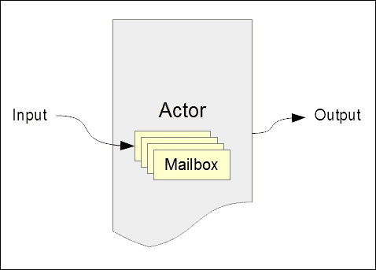

Pulsar 库提供了演员模型的全面实现。在这个库中，演员被安排在 **fibers** 上执行，这些 fibers 与使用 `core.async` 库的 `go` 表达式创建的异步任务类似。fibers 被安排在分叉-合并线程池上运行，这与在 `core.async` 库中使用的常规线程池不同。由于这种设计，Pulsar 库仅在 JVM 上可用，而不是通过 ClojureScript 在浏览器中使用。

Fibers 通过 Pulsar 库自己实现的 *promises* 和 *channels* 进行通信。有趣的是，Pulsar 库在其通道实现周围还有几个薄薄的包装器，以提供一个与 `core.async` 库完全兼容的 API。尽管我们不会在本节中进一步讨论 Pulsar 库的 fibers、promises 和 channels，但我们必须理解通道与演员非常相关，因为演员的邮箱是用通道实现的。现在，让我们探索 Pulsar 库中演员的基本知识。

## 创建演员

来自 `co.paralleluniverse.pulsar.actors` 命名空间的 `spawn` 宏创建一个新的演员，并且必须传递一个不接受任何参数的函数。我们可以使用 `spawn` 宏的 `:mailbox-size` 关键字参数来指定演员邮箱的缓冲区大小。还有其他几个有趣的关键字参数可以传递给 `spawn` 表达式，您被鼓励自行了解更多关于它们的信息。

### 注意

下面的库依赖项对于即将到来的示例是必需的：

```java
[co.paralleluniverse/quasar-core "0.7.3"]
[co.paralleluniverse/pulsar "0.7.3"]
```

您的 `project.clj` 文件还必须包含以下条目：

```java
:java-agents
[[co.paralleluniverse/quasar-core "0.7.3"]]
:jvm-opts
["-Dco.paralleluniverse.pulsar.instrument.auto=all"]
```

此外，以下命名空间必须在您的命名空间声明中包含：

```java
(ns my-namespace
  (:require [co.paralleluniverse.pulsar.core :as pc]
            [co.paralleluniverse.pulsar.actors :as pa]))
```

传递给 `spawn` 宏的函数必须使用来自 `co.paralleluniverse.pulsar.actors` 命名空间的 `receive` 宏来处理演员接收到的消息。在这个提供的函数中，我们可以使用表达式 `@self` 来引用执行它的演员。`receive` 表达式还支持模式匹配，这是通过 `core.match` 库实现的。我们还可以不带参数调用 `receive` 宏，在这种情况下，它将返回演员邮箱中的消息。`receive` 表达式还将暂停执行它的 fiber。

要向演员发送消息，我们可以使用 `co.paralleluniverse.pulsar.actors` 命名空间中的 `!` 或 `!!` 宏。这两个宏都必须传递一个演员和一个返回值的表达式，并且这两种形式都返回 `nil`。这两种形式之间的唯一区别是 `!` 是异步的，而 `!!` 是同步的，并且如果演员的邮箱已满，它可能会阻塞当前执行的线程。演员在收到特定消息时可能会终止，我们可以使用 `co.paralleluniverse.pulsar.actors` 命名空间中的 `done?` 函数来检查演员是否仍然活跃。一旦演员终止，我们可以使用 `co.paralleluniverse.pulsar.core` 命名空间中的 `join` 函数来获取演员返回的最终值。例如，考虑使用 `spawn` 和 `receive` 形式在 *示例 8.8* 中创建的演员。

### 注意

以下示例可以在书籍源代码的 `src/m_clj/c8/actors.clj` 中找到。其中一些示例基于官方 Pulsar 文档中的代码（`http://docs.paralleluniverse.co/pulsar/`）。

```java
(def actor (pa/spawn
            #(pa/receive
              :finish (println "Finished")
              m (do
                  (println (str "Received: " m))
                  (recur)))))
```

> *示例 8.8：使用 spawn 宏创建的演员*

由前一个变量 `actor` 表示的演员将接收一条消息，打印它并使用 `recur` 形式循环。如果收到消息 `:finish`，它将打印一个字符串并终止。以下代码演示了我们可以如何向演员发送消息：

```java
user> (pa/! actor :foo)
nil
Received: :foo
user> (pa/done? actor)
false
```

如此所示，向演员发送值 `:foo` 会立即返回 `nil`，并且消息会从另一个线程中打印出来。由于 `done?` 函数在传递变量 `actor` 时返回 `false`，因此很明显，演员在收到值 `:foo` 作为消息时不会终止。另一方面，如果我们向演员发送值 `:finish`，它将终止，如下所示：

```java
user> (pa/! actor :finish)
nil
Finished
user> (pa/done? actor)
true
```

在发送值 `:finish` 后，当将 `done?` 函数应用于演员时，它返回 `true`，这意味着演员已经终止。演员在终止前返回的值可以使用 `co.paralleluniverse.pulsar.core` 命名空间中的 `join` 函数获取。我们必须注意，`join` 函数实际上返回任何纤维的结果，并且将阻塞调用线程的执行，直到纤维完成或终止。例如，考虑 *示例 8.9* 中除以另一个数字的演员：

```java
(def divide-actor
  (pa/spawn
   #(loop [c 0]
      (pa/receive
       :result c
       [a b] (recur (/ a b))))))
```

> *示例 8.9：执行数字除法的演员*

我们可以向 *示例 8.9* 中定义的演员 `divide-actor` 发送消息，并使用 `join` 函数从它那里获取最终结果，如下所示：

```java
user> (pa/! divide-actor 30 10)
nil
user> (pa/! divide-actor :result)
nil
user> (pc/join divide-actor)
3
```

前面的代码显示我们可以向演员 `divide-actor` 发送两个数字，并发送值 `:result` 来终止它。终止后，我们可以通过将演员传递给 `join` 函数来获取演员的结果，即 `3`。

演员可以用有意义的名称注册，这些名称可以用来定位它们。这是通过`co.paralleluniverse.pulsar.actors`命名空间中的`register!`函数完成的，该函数必须传递一个演员实例和一个要为该演员注册的名称。然后我们可以通过指定演员的名称到`!`或`!!`函数来向注册的演员发送消息。例如，假设变量`actor`代表使用`spawn`宏创建的演员实例。通过调用`(pa/register! actor :my-actor)`将演员以名称`:my-actor`注册后，我们可以通过调用`(pa/! :my-actor :foo)`将值`:foo`发送到该演员。

## 传递演员之间的消息

现在，让我们构建一个简单的由两个演员组成的乒乓游戏的模拟。这两个演员将互相发送指定次数的`:ping`和`:pong`消息。这个模拟的代码在*示例 8.10*中如下所示：

```java
(defn ping-fn [n pong]
  (if (= n 0)
    (do
      (pa/! pong :finished)
      (println "Ping finished"))
    (do
      (pa/! pong [:ping @pa/self])
      (pa/receive
       :pong (println "Ping received pong"))
      (recur (dec n) pong))))

(defn pong-fn []
  (pa/receive
   :finished (println "Pong finished")
   [:ping ping] (do
                  (println "Pong received ping")
                  (pa/! ping :pong)
                  (recur))))

(defn start-ping-pong [n]
  (let [pong (pa/spawn pong-fn)
        ping (pa/spawn ping-fn n pong)]
    (pc/join pong)
    (pc/join ping)
    :finished))
```

> *示例 8.10：两个演员玩乒乓球的例子*

在*示例 8.10*中展示的`ping-fn`和`pong-fn`函数实现了两个演员玩乒乓球的逻辑。`ping-fn`将基本上发送一个包含关键字`:ping`和当前演员实例的向量到由参数`pong`表示的演员。这会进行`n`次，最后将消息`:finished`发送到演员`pong`。`pong-fn`函数将接收向量`[:ping ping]`，其中`ping`将是发送消息的演员。使用`pong-fn`创建的演员一旦收到消息`:finished`就会终止。`start-ping-pong`函数简单地使用`ping-fn`和`pong-fn`函数创建两个演员，并使用`join`函数等待它们都完成。我们可以通过传递每个演员必须互相发送消息的次数来调用`start-ping-pong`函数，如下所示：

```java
user> (start-ping-pong 3)
Pong received ping
Ping received pong
Pong received ping
Ping received pong
Pong received ping
Ping received pong
Ping finished
Pong finished
:finished
```

由`start-ping-pong`函数创建的两个演员通过互相传递消息来模拟乒乓球游戏，如前面的输出所示。总之，Pulsar 库中的演员可以用来实现并发执行的过程。

## 使用演员处理错误

演员支持一些有趣的错误处理方法。如果一个演员在处理接收到的消息时遇到错误，它将终止。在执行演员的纤维中抛出的异常将被保存，并在我们将演员传递给`join`函数时再次抛出。实际上，我们不需要在传递给`spawn`宏的函数中处理异常，相反，我们必须在调用`join`函数时捕获异常。

这引出了演员的一个有趣后果。如果一个演员可能遇到错误并失败，我们可以有一个监视第一个演员的另一个演员，并在失败的情况下重新启动它。因此，演员可以在系统中的另一个演员终止时得到通知。这个原则允许演员以自动化的方式从错误中恢复。在 Pulsar 库中，这种错误处理是通过 `co.paralleluniverse.pulsar.actors` 命名空间中的 `watch!` 和 `link!` 函数来完成的。

演员可以通过在其体内调用 `watch!` 函数来*监视*或*监控*另一个演员。例如，我们必须在演员的体内调用 `(watch! A)` 来监视演员 `A`。如果被监视的演员遇到异常，监视演员的 `receive` 形式将抛出相同的异常。监视演员必须捕获异常，否则它将与产生异常的演员一起终止。此外，监视演员可以通过调用 `spawn` 宏来重新启动已终止的演员。要停止监视一个演员，我们必须在监视演员的体内将监视的演员传递给 `unwatch!` 函数。

两个演员也可以通过将它们传递给 `link!` 函数来*链接*。如果两个演员被链接在一起，那么两个演员中的任何一个遇到的异常都将被另一个捕获。通过这种方式，链接两个演员是对它们进行错误监视的对称方式。`link!` 函数也可以在传递给 `spawn` 形式的函数中调用，在这种情况下，必须传递要链接的演员。要解除两个演员的链接，我们可以使用 `unlink!` 函数。

因此，Pulsar 库提供了一些有趣的方法来监视和链接演员以执行错误处理和恢复。

## 使用演员管理状态

如我们之前提到的，演员可以拥有自己的内部可变状态。当然，不允许从其他演员访问这个状态，不可变消息是演员与其他演员通信的唯一方式。演员维持或管理其状态的另一种方式是根据接收到的消息改变其行为，这种技术称为*选择性接收*。

使用 `spawn` 函数创建的每个演员都可以使用表达式 `@state` 读取其内部状态，也可以使用 `set-state!` 函数写入此状态。`set-state!` 函数还将返回演员的新状态，正如表达式 `@state` 返回的那样。请注意，这两个形式都是在 `co.paralleluniverse.pulsar.actors` 命名空间中实现的。

考虑 *示例 8.11* 中的 `add-using-state` 函数，该函数使用演员来添加两个数字。当然，在现实世界中我们永远不会真正需要这样的函数，这里只是演示了演员如何改变其内部状态。

```java
(defn add-using-state [a b]
  (let [actor (pa/spawn
               #(do
                  (pa/set-state! 0)
                  (pa/set-state! (+ @pa/state (pa/receive)))
                  (pa/set-state! (+ @pa/state (pa/receive)))))]
    (pa/! actor a)
    (pa/! actor b)
    (pc/join actor)))
```

> *示例 8.11：使用演员添加两个数字的函数*

*示例 8.11*中所示的`add-using-state`函数创建了一个 actor，将其状态设置为`0`，并将它接收到的前两个消息添加到其状态中。actor 将返回 actor 的最新状态，这是通过`spawn`宏传递给函数的`set-state!`的最后一次调用返回的状态。在调用带有两个数字的`add-using-state`函数时，它产生它们的和作为其输出，如下所示：

```java
user> (add-using-state 10 20)
30
```

另一种 actor 可以修改其状态的方式是通过选择性接收，在 actor 接收到特定消息时修改其行为。这是通过在另一个`receive`形式的体内调用`receive`形式来完成的，如*示例 8.12*所示：

```java
(defn add-using-selective-receive [a b]
  (let [actor (pa/spawn
               #(do
                  (pa/set-state! 0)
                  (pa/receive
                   m (pa/receive
                      n (pa/set-state! (+ n m))))))]
    (pa/! actor a)
    (pa/! actor b)
    (pc/join actor)))
```

> *示例 8.12：使用具有选择性接收的 actor 添加两个数字的函数*

如前所述的`add-using-selective-receive`函数将设置其状态为`0`，通过选择性接收接收消息`m`和`n`，并将这些消息相加。此函数产生的结果与*示例 8.11*中的`add-using-state`函数相同，如下所示：

```java
user> (add-using-selective-receive 10 20)
30
```

以这种方式，actors 可以根据发送给它们的消息改变其内部状态和行为。

## 比较进程和 actors

CSPs 和 actors 是两种将系统建模为大量并发进程的方法，这些进程异步执行和交互。异步任务逻辑可以位于使用`go`块创建的进程内，或者位于创建 actor 的`spawn`宏传递的函数内。然而，这两种方法之间存在一些细微的对比：

+   使用`go`和`thread`形式创建的进程鼓励我们将所有状态放入通道中。另一方面，actors 可以有自己的内部状态，除了以发送给它们的消息形式的状态之外。因此，actors 更像是具有封装状态的对象，而进程更像是操作存储在通道中的状态的函数。

+   使用`go`或`thread`宏创建的任务没有隐式的错误处理，我们必须在`go`和`thread`宏的体内使用`try`和`catch`形式来处理异常。当然，通道支持错误处理，但仅当与转换器结合使用时。然而，actors 会在我们对其应用`join`函数之前保存它们遇到的任何异常。此外，actors 可以被链接和监控，以提供一种自动的错误恢复形式。以这种方式，actors 更专注于构建容错系统。

CSPs（通信顺序进程）与 actor 模型之间的这些区别因素，让我们对在特定问题中实现异步任务哪种方法更合适有了概念。

# 摘要

在本章中，我们探讨了如何使用`core.async`和 Pulsar 库创建并发和异步任务。`core.async`库提供了一个 CSP 的实现，并在 Clojure 和 ClojureScript 中都有支持。我们研究了`core.async`库中的各种构造，并展示了如何使用这个库实现就餐哲学家问题的解决方案。后来，我们通过 Pulsar 库探索了 actor。

在下一章中，我们将探讨响应式编程。正如我们之前所看到的，响应式编程可以被视为异步编程的扩展，用于处理数据和事件。

# 第九章。响应式编程

使用异步任务进行编程的许多有趣应用之一是*响应式编程*。这种编程方法完全是关于异步响应状态的变化。在响应式编程中，代码以这样的方式组织，它可以*响应*变化。通常，这是通过异步数据流实现的，其中数据和事件在程序中异步传播。实际上，响应式编程有许多有趣的变体。

响应式编程在设计和开发前端图形用户界面时特别有用，因为应用程序内部状态的变化必须异步地逐渐传递到用户界面。因此，程序被分割成事件和在这些事件上执行的逻辑。对于习惯于命令式和面向对象编程技术的程序员来说，响应式编程中最困难的部分是思考响应式抽象，并放弃使用可变状态等旧习惯。然而，如果你一直保持关注并开始用不可变性和函数进行思考，你会发现响应式编程非常自然。在 JavaScript 世界中，使用*观察者*进行响应式编程可以被视为使用承诺管理异步事件和动作的对比替代方案。

在本章中，我们将通过 Clojure 和 ClojureScript 库探索一些有趣的响应式编程形式。稍后，我们还将展示如何使用响应式编程构建动态用户界面。

# 使用纤维和数据流变量进行响应式编程

*数据流编程* 是反应式编程中最简单的一种形式。在数据流编程中，计算是通过组合变量来描述的，而不必关心这些变量何时被设置为某个值。这样的变量也被称为 **数据流变量**，一旦它们被设置，就会触发引用它们的计算。*Pulsar* 库（[`github.com/puniverse/pulsar`](https://github.com/puniverse/pulsar)）为数据流编程提供了一些有用的构造。这些构造也可以与 Pulsar **纤维** 一起使用，我们曾在第八章 *利用异步任务* 中简要讨论过。在本节中，我们将从 Pulsar 库中探索纤维和数据流变量的基础知识。

### 注意

以下示例所需的库依赖项：

```java
[co.paralleluniverse/quasar-core "0.7.3"]
[co.paralleluniverse/pulsar "0.7.3"]
```

您的 `project.clj` 文件还必须包含以下条目：

```java
:java-agents
[[co.paralleluniverse/quasar-core "0.7.3"]]
:jvm-opts
["-Dco.paralleluniverse.pulsar.instrument.auto=all"]
```

此外，以下命名空间必须在您的命名空间声明中包含：

```java
(ns my-namespace
  (:require [co.paralleluniverse.pulsar.core :as pc]
            [co.paralleluniverse.pulsar.dataflow
             :as pd]))
```

Pulsar 库中异步任务的基本抽象是纤维。纤维被安排在基于 fork-join 的线程池上执行，我们可以创建大量纤维，而无需担心可用的处理核心数量。可以使用来自 `co.paralleluniverse.pulsar.core` 命名空间的 `spawn-fiber` 和 `fiber` 宏来创建纤维。`spawn-fiber` 宏必须传递一个不接受任何参数的函数，而 `fiber` 形式必须传递一个表达式体。这两个形式的体将在新的纤维上执行。可以使用来自 `co.paralleluniverse.pulsar.core` 命名空间的 `join` 函数来检索纤维返回的值。

在处理纤维时，我们必须牢记的一个重要规则是，我们绝不能在纤维内部调用操作当前执行线程的方法或函数。相反，我们必须使用来自 `co.paralleluniverse.pulsar.core` 命名空间的特殊纤维函数来执行这些操作。例如，在纤维中调用 `java.lang.Thread/sleep` 方法必须避免。相反，可以使用来自 `co.paralleluniverse.pulsar.core` 命名空间的 `sleep` 函数来暂停当前纤维一段时间，以毫秒为单位。

### 注意

以下示例可以在书籍源代码的 `src/m_clj/c9/fibers.clj` 中找到。其中一些示例基于官方 Pulsar 文档中的代码（[`docs.paralleluniverse.co/pulsar/`](http://docs.paralleluniverse.co/pulsar/)）。

例如，我们可以使用纤维来添加两个数字，如 *示例 9.1* 所示。当然，使用纤维进行这种微不足道的操作没有实际用途，这里仅展示如何创建纤维并获取其返回值：

```java
(defn add-with-fiber [a b]
  (let [f (pc/spawn-fiber
               (fn []
                 (pc/sleep 100)
                 (+ a b)))]
    (pc/join f)))
```

> *示例 9.1：使用纤维添加两个数字*

前面的 `add-with-fiber` 函数使用 `spawn-fiber` 宏创建了一个纤维 `f`，并使用 `join` 函数获取纤维的返回值。纤维 `f` 将使用 `sleep` 函数暂停 `100` 毫秒，然后返回 `a` 和 `b` 的和。

让我们简单谈谈数据流变量。我们可以使用 `co.paralleluniverse.pulsar.dataflow` 命名空间中的 `df-val` 和 `df-var` 函数来创建数据流变量。使用这些函数创建的数据流变量可以通过像调用函数一样调用它并传递一个值来设置。此外，可以通过使用 `@` 操作符或 `deref` 形式解引用来获取数据流变量的值。使用 `df-val` 函数声明的数据流变量只能设置一次，而使用 `df-var` 函数创建的可以设置多次。

`df-var` 函数也可以传递一个不带参数的函数，该函数引用当前作用域中的其他数据流变量。这样，当引用变量的值发生变化时，此类数据流变量的值将重新计算。例如，可以使用数据流变量将两个数字相加，如 *示例 9.2* 中定义的 `df-add` 函数所示：

```java
(defn df-add [a b]
  (let [x (pd/df-val)
        y (pd/df-val)
        sum (pd/df-var #(+ @x @y))]
    (x a)
    (y b)
    @sum))
```

> *示例 9.2：使用数据流变量添加两个数字*

在前面的 `df-add` 函数中声明的数据流变量 `sum` 的值将在引用的数据流变量 `x` 和 `y` 被设置为值时重新计算。变量 `x` 和 `y` 通过像函数一样调用它们来设置。同样，我们可以使用 `df-val` 和 `df-var` 函数，如以下 *示例 9.3* 所示，向数字范围中的每个元素添加一个数字：

```java
(defn df-add-to-range [a r]
  (let [x (pd/df-val)
        y (pd/df-var)
        sum (pd/df-var #(+ @x @y))
        f (pc/fiber
           (for [i r]
             (do
               (y i)
               (pc/sleep 10)
               @sum)))]
    (x a)
    (pc/join f)))
```

> *示例 9.3：使用数据流变量向数字范围添加一个数字*

之前展示的 `df-add-to-range` 函数定义了数据流变量 `x`、`y` 和 `sum`，其中 `sum` 依赖于 `x` 和 `y`。该函数随后创建了一个使用 `for` 宏返回一系列值的纤维 `f`。在 `for` 宏的体内，数据流变量 `y` 被设置为范围 `r` 中的一个值，并返回 `@sum` 的值。因此，纤维返回了将 `a` 添加到范围 `r` 中所有元素的结果，如下面的输出所示：

```java
user> (df-add-to-range 2 (range 10))
(2 3 4 5 6 7 8 9 10 11)
```

总之，我们可以使用 `df-val` 和 `df-var` 函数来定义数据流变量，当其引用的变量发生变化时，其值可以重新计算。实际上，更改数据流变量的状态可能会使其他数据流变量对变化做出 *反应*。

我们应该注意，Pulsar 库也实现了通道，这些通道与`core.async`库中的通道类似。简而言之，通道可以用于与纤维交换数据。Pulsar 库还通过`co.paralleluniverse.pulsar.rx`命名空间提供了具有通道的响应式编程结构。这些结构被称为*响应式扩展*，它们在通道中的值上执行某些计算，与转换器非常相似。响应式扩展也由*RxClojure*库实现。我们应该注意，Pulsar 和 RxClojure 库的一个局限性是它们仅在 JVM 上可用，不能用于 ClojureScript 程序。因此，在 ClojureScript 中使用带有转换器的`core.async`通道是一个更可行的选项。尽管如此，我们将在下一节简要探讨通过 RxClojure 库的响应式扩展。

# 使用响应式扩展

**响应式扩展**（缩写为**Rx**）是响应式编程的通用实现，可用于建模事件和数据流。在 Rx 中，可以将事件流视为具有某些方法和属性的对象。在 Rx 中，异步事件流被称为*可观察量*。订阅来自可观察量事件的实体或对象被称为*观察者*。响应式扩展本质上是一个函数库或方法库，用于操作可观察量并创建符合观察者-可观察量模式的对象。例如，可以使用 Rx 的`map`和`filter`函数变体来转换可观察量，如下面的插图所示：

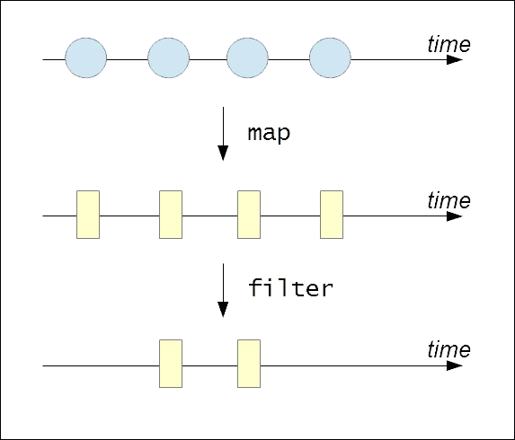

如前所述，一个可观察量可以被描述为随时间变化的一系列值。很明显，可观察量可以用`map`和`filter`函数的 Rx 风格变体来处理，将其视为值序列。一个可观察量也可以被观察者订阅，观察者将对可观察量产生的任何值进行异步调用。

我们现在将讨论 RxClojure 库的各种结构（[`github.com/ReactiveX/RxClojure`](https://github.com/ReactiveX/RxClojure)）。Rx 在多种语言中都有几个实现，例如 C#、Java 和 PHP。响应式扩展的 Java 库是 RxJava，RxClojure 库为 RxJava 提供了 Clojure 绑定。如我们之前提到的，需要注意的是，RxClojure 只能在 JVM 上使用。此外，RxClojure 库在 Clojure 实现转换器之前就已经存在，因此通道和转换器是响应式编程的更便携和更通用的方法。

### 注意

以下库依赖项对于即将到来的示例是必需的：

```java
[io.reactivex/rxclojure "1.0.0"]
```

此外，以下命名空间必须在您的命名空间声明中包含：

```java
(ns my-namespace
  (:require [rx.lang.clojure.core :as rx]
            [rx.lang.clojure.blocking :as rxb]
            [rx.lang.clojure.interop :as rxj]))
```

`rx.lang.clojure.core`命名空间包含用于创建和操作可观察对象的函数。可观察对象在内部表示为值的集合。要从可观察对象中提取值，我们可以使用`rx.lang.clojure.blocking`命名空间中的函数。然而，我们必须注意，`rx.lang.clojure.blocking`命名空间中的函数应避免在程序中使用，仅用于测试目的。`rx.lang.clojure.interop`命名空间包含用于与底层 RxJava 库进行 Java 互操作的函数。

### 注意

以下示例可以在书籍源代码的`src/m_clj/c9/rx.clj`中找到。

可以使用`rx.lang.clojure.core`命名空间中的`return`函数将值转换为可观察对象。可以使用`rx.lang.clojure.blocking/into`函数将可观察对象转换为值的向量，同样，我们可以使用`rx.lang.clojure.blocking/first`函数获取可观察对象的第一值。这些函数在以下输出中得到了演示：

```java
user> (def o (rx/return 0))
#'user/o
user> (rxb/into [] o)
[0]
user> (rxb/first o)
0
```

可以使用`rx.lang.clojure.core`命名空间中的`seq->o`函数将值序列转换为可观察对象。要将可观察对象转换回序列，我们将它传递给`rx.lang.clojure.blocking`命名空间中的`o->seq`函数。例如，我们可以将向量`[1 2 3]`转换为可观察对象，然后再将其转换回序列，如下所示：

```java
user> (def o (rx/seq->o [1 2 3]))
#'user/o
user> (rxb/o->seq o)
(1 2 3)
```

创建可观察对象的另一种方法是使用`rx.lang.clojure.core`命名空间中的`cons`和`empty`函数。`empty`函数创建一个没有值的可观察对象，而`cons`函数将一个值和一个可观察对象添加或组合到一个新的、可观察的对象中，类似于标准的`cons`函数。我们可以使用`cons`和`empty`函数创建包含值`0`的可观察对象，如下所示：

```java
user> (def o (rx/cons 0 (rx/empty)))
#'user/o
user> (rxb/first o)
0
```

如我们之前提到的，观察者可以订阅可观察对象的事件。观察者可以通过实现`rx.lang.clojure.Observer`接口来定义。该接口定义了三个方法，即`onNext`、`onError`和`onCompleted`。每当可观察对象产生新值时，都会调用`onNext`方法，而当可观察对象完成产生值时，会调用`onCompleted`方法。如果遇到异常，将调用`onError`方法。有趣的是，所有这些方法都将从可观察对象异步调用。例如，我们可以使用`reify`形式创建一个观察者来实现`Observer`接口，如*示例 9.4*所示：

```java
(def observer
  (reify rx.Observer
    (onNext [this v] (println (str "Got value: " v "!")))
    (onError [this e] (println e))
    (onCompleted [this] (println "Done!"))))
```

> *示例 9.4：实现 rx.lang.clojure.Observer 接口*

可观察对象可以使用 `rx.lang.clojure.core` 命名空间中的 `on-next`、`on-error` 和 `on-completed` 函数调用其所有已订阅观察者的方法。我们还可以使用这些函数和 `rx.lang.clojure.core` 命名空间中的 `observable*` 形式定义可观察对象。`observable*` 形式必须传递一个接受单个参数的函数，该参数表示观察者。例如，我们可以使用 `observable*` 形式定义一个创建两个值可观察对象的函数，如 *示例 9.5* 所示：

```java
(defn make-observable []
  (rx/observable* (fn [s]
                    (-> s
                        (rx/on-next :a)
                        (rx/on-next :b)
                        rx/on-completed))))
```

> *示例 9.5：使用 observable 形式创建可观察对象*

之前展示的 `observable*` 形式的函数调用 `on-next` 和 `on-completed` 函数以产生两个值的可观察对象。我们可以使用 `rx.lang.clojure.blocking` 命名空间中的 `into` 函数将此可观察对象转换为向量，如下所示：

```java
user> (def o (make-observable))
#'user/o
user> (rxb/into [] o)
[:a :b]
```

观察者也可以使用 `rx.lang.clojure.core` 命名空间中的 `subscribe` 函数创建。这个函数必须传递一个接受单个值的函数，并通过实现提供的函数使用 `onNext` 方法创建观察者。我们还可以将表示 `onError` 方法的第二个参数以及表示 `onCompleted` 方法的第三个参数传递给 `subscribe` 函数。例如，我们可以使用 `subscribe` 函数订阅可观察对象，并使用 `rx.lang.clojure.core/map` 函数对所有可观察对象中的值应用一个函数，如 *示例 9.6* 所示：

```java
(defn rx-inc [o]
  (rx/subscribe o (fn [v] (println (str "Got value: " v "!"))))
  (rx/map inc o))
```

> *示例 9.6：使用 subscribe 函数订阅可观察对象*

我们可以创建一个可观察对象并将其传递给 *示例 9.6* 中定义的 `rx-inc` 函数，如下所示：

```java
user> (def o (rx/seq->o [0 1 2]))
#'user/o
user> (rx-inc o)
Got value: 0!
Got value: 1!
Got value: 2!
#<rx.Observable 0xc3fae8>
```

在 *示例 9.6* 中传递给 `subscribe` 形式的函数会在每次将 `inc` 函数应用于可观察对象 `o` 中的值时执行。我们同样可以使用 RxJava 和 Java 互操作定义 `rx-inc` 函数，如 *示例 9.7* 所示：

```java
(defn rxj-inc [o]
  (.subscribe o (rxj/action [v]
                  (println (str "Got value: " v "!"))))
  (.map o (rxj/fn [v] (inc v))))
```

> *示例 9.7：使用 Java 互操作订阅可观察对象*

很明显，通过 Java 互操作使用 RxJava 库并不美观，因为我们不得不将 `rx.lang.clojure.interop` 命名空间中的 `action` 和 `fn` 形式的所有函数包装起来。`action` 宏用于表示执行副作用的功能，而 `fn` 宏用于包装返回值的函数。可观察对象也可以使用 Java 互操作创建。这是通过 `rx.lang.clojure.core.Observable` 类的 `from` 静态方法完成的。以下输出展示了此方法以及定义在 *示例 9.7* 中的 `rxj-inc` 函数：

```java
user> (def o (rx.Observable/from [0 1 2]))
#'user/o
user> (rxj-inc o)
Got value: 0!
Got value: 1!
Got value: 2!
#<rx.Observable 0x16459ef>
```

当然，我们应该优先使用来自 `rx.lang.clojure.core` 命名空间的功能，我们在这里使用 Java 互操作只是为了说明这是可能的。类似于在 *示例 9.6* 中使用的 `map` 函数，`rx.lang.clojure.core` 命名空间中还有其他几个函数允许我们将可观察对象视为序列。因此，`map`、`filter` 和 `mapcat` 等函数构成了可观察对象的接口，并描述了我们与之交互的多种方式。例如，以下输出演示了 `take`、`cycle` 和 `range` 函数的 Rx 变体：

```java
user> (rxb/into [] (->> (rx/range)
 (rx/take 10)))
[0 1 2 3 4 5 6 7 8 9]
user> (rxb/into [] (->> (rx/cycle (rx/return 1))
 (rx/take 5)))
[1 1 1 1 1]
```

`rx.lang.clojure.core` 命名空间还提供了一个 `filter` 函数，可以与可观察对象和谓词一起使用，如下所示：

```java
user> (rxb/into [] (->> (rx/seq->o [:a :b :c :d :e])
 (rx/filter #{:b :c})))
[:b :c]
```

来自 `rx.lang.clojure.core` 命名空间的 `group-by` 和 `mapcat` 函数与这些函数的标准版本具有相同的语义。例如，让我们定义一个使用 `group-by` 和 `mapcat` 函数的函数，如 *示例 9.8* 所示：

```java
(defn group-maps [ms]
  (->> ms
       (rx/seq->o)
       (rx/group-by :k)
       (rx/mapcat (fn [[k vs :as me]]
                    (rx/map #(vector k %) vs)))
       (rxb/into [])))
```

> *示例 9.8：使用 group-by 和 mapcat 函数*

之前定义的 `group-maps` 函数将多个映射转换为可观察对象，按键 `:k` 的值对这些映射进行分组，并使用 `mapcat` 和 `map` 函数创建多个向量。当然，在实践中我们可能并不真的需要这样的函数，这里只展示如何使用 `group-by` 和 `mapcat` 函数。我们可以将映射的向量传递给 `group-maps` 函数以生成一个向量的序列，如下所示：

```java
user> (group-maps [{:k :a :v 1}
 {:k :b :v 2}
 {:k :a :v 3}
 {:k :c :v 4}])
[[:a {:k :a, :v 1}]
 [:a {:k :a, :v 3}]
 [:b {:k :b, :v 2}]
 [:c {:k :c, :v 4}]]
```

可以使用 `rx.lang.clojure.core` 命名空间的 `merge` 函数将多个可观察对象组合起来。`merge` 函数可以传递任意数量的可观察对象，如下所示：

```java
user> (let [o1 (rx/seq->o (range 5))
 o2 (rx/seq->o (range 5 10))
 o (rx/merge o1 o2)]
 (rxb/into [] o))
[0 1 2 3 4 5 6 7 8 9]
```

可观察对象也可以使用 `rx.lang.clojure.core` 命名空间的 `split-with` 函数拆分为两个可观察对象。这个函数必须传递一个可观察对象和一个谓词函数，如下所示：

```java
user> (->> (range 6)
 rx/seq->o
 (rx/split-with (partial >= 3))
 rxb/first
 (map (partial rxb/into [])))
([0 1 2 3] [4 5])
```

总结来说，RxClojure 库为我们提供了创建和操作可观察对象的几个构造。我们还可以使用这个库中的 `subscribe` 函数轻松创建异步 *响应* 可观察对象的观察者。此外，`rx.lang.clojure.core` 命名空间中的构造与标准函数（如 `map`、`filter` 和 `mapcat`）的语义相似。在本节中，我们还没有讨论 `rx.lang.clojure.core` 命名空间中的几个函数，我们鼓励你自己去探索它们。

# 使用函数式响应式编程

更功能化的响应式编程风味是**函数式响应式编程**（简称**FRP**）。FRP 首次在 20 世纪 90 年代末由 Conal Elliott 描述，当时他是微软图形研究小组的成员，同时也是 Haskell 编程语言的主要贡献者。FRP 最初被描述为一系列用于与*事件*和*行为*交互的函数。事件和行为都代表随时间变化的值。这两者之间的主要区别在于，事件是随时间离散变化的值，而行为是持续变化的值。在 FRP 中没有提到观察者可观察的模式。此外，FRP 中的程序被编写为事件和行为的可组合转换，也被称作**组合事件系统**（**CESs**）。

FRP 的现代实现提供了创建和转换异步事件流的构造。任何形式的状态变化都表示为事件流。从这个角度来看，按钮的点击、对服务器的请求以及变量的修改都可以被视为事件流。*Bacon.js*库（[`github.com/baconjs/bacon.js/`](https://github.com/baconjs/bacon.js/））是 FRP 的 JavaScript 实现，*Yolk*库（[https://github.com/Cicayda/yolk](https://github.com/Cicayda/yolk)）提供了对 Bacon.js 库的 ClojureScript 绑定。在本节中，我们将简要研究 Yolk 库提供的构造。

### 注意

以下示例需要以下库依赖：

```java
[yolk "0.9.0"]
```

此外，以下命名空间必须包含在您的命名空间声明中：

```java
(ns my-namespace
  (:require [yolk.bacon :as y]))
```

除了前面的依赖项之外，以下示例还使用了来自`src/m_clj/c9/common.cljs`的`set-html!`和`by-id`函数。这些函数定义如下：

```java
(defn ^:export by-id [id]
  (.getElementById js/document id))

(defn ^:export set-html! [el s]
  (set! (.-innerHTML el) s))
```

确保以下 ClojureScript 示例中的代码使用以下命令编译：

```java
$ lein cljsbuild once

```

`yolk.bacon`命名空间提供了创建事件流的几个函数，例如`later`和`interval`函数。`later`函数创建一个事件流，在给定延迟后产生一个单一值。`interval`函数可以在给定的时间间隔内无限重复一个值。这两个函数都必须传递一个表示毫秒数的第一个参数和一个作为第二个参数产生的值。

Yolk 库中的事件流可能会产生无限数量的值。我们可以通过使用`yolk.bacon/sliding-window`函数来限制事件流产生的值的数量，该函数创建一个事件流，一旦填满就会丢弃旧值。此函数必须传递一个事件流和一个表示返回的事件流容量的数字。

我们还可以使用 `yolk.bacon` 命名空间中的 `bus` 函数创建一个 *事件总线*，我们可以任意地向其推送值。`push` 函数将一个值推送到事件总线，而 `plug` 函数将事件总线连接到另一个事件流。

要监听事件流产生的值，我们可以使用 `on-value`、`on-error` 和 `on-end` 函数。`on-value` 和 `on-error` 函数将在给定的事件流产生值或错误时分别调用提供的 1-arity 函数。`on-end` 函数将在流结束时调用一个不带参数的函数。此函数通常与 `yolk.bacon/never` 函数一起使用，该函数创建一个立即结束而不产生值的流。

事件流也可以以几种方式组合。`merge-all` 函数将多个事件流组合成一个单一的流。另一种以这种方式从多个事件流中收集值的函数是 `flat-map` 函数。或者，可以使用 `combine-array` 函数创建一个生成从提供的流中值的数组的单一事件流。`yolk.bacon/when` 函数可以用来条件性地组合多个通道。此函数必须传递多个子句，类似于 `cond` 形式。每个子句必须有两个部分——事件流的向量和一个表达式，当所有提供的事件流产生值时将调用该表达式。

`yolk.bacon` 命名空间还提供了基于事件流的 `map`、`filter` 和 `take` 函数的标准变体。这些函数将事件流作为第一个参数，这与这些函数标准版本的语义略有不同。

使用 Yolk 库中的这些函数，我们可以实现一个简化的基于 ClojureScript 的 dining philosophers 问题解决方案，我们已在之前的章节中描述过。有关 dining philosophers 问题及其解决方案的详细解释，请参阅第二章 Orchestrating Concurrency and Parallelism 和第八章 Leveraging Asynchronous Tasks。

### 注意

以下示例可以在书的源代码的 `src/m_clj/c9/yolk/core.cljs` 中找到。此外，以下 ClojureScript 示例的 HTML 页面可以在 `resources/html/yolk.html` 中找到。以下脚本将包含在这个页面上：

```java
<script type="text/javascript" src="img/bacon.js">
</script>
<script type="text/javascript" src="img/yolk.js">
</script>
```

在这个 dining philosophers 问题的实现中，我们将使用事件总线来表示哲学家和桌子上的叉子的状态。然后可以使用 Yolk 库中的 `when` 函数将这些事件总线组合起来。为了简化，我们不会维护太多关于哲学家的状态。让我们首先定义打印哲学家和表示哲学家日常生活的函数，如下面的 *示例 9.9* 所示：

```java
(defn render-philosophers [philosophers]
  (apply str
         (for [p (reverse philosophers)]
           (str "<div>" p "</div>"))))

(defn philosopher-fn [i n forks philosophers wait-ms]
  (let [p (nth philosophers i)
        fork-1 (nth forks i)
        fork-2 (nth forks (-> i inc (mod n)))]
    (fn []
      (js/setTimeout
       (fn []
         (y/push fork-1 :fork)
         (y/push fork-2 :fork)
         (y/push p {}))
       wait-ms)
      (str "Philosopher " (inc i) " ate!"))))
```

> *示例 9.9：使用事件流解决就餐哲学家问题*

前面的`render-philosophers`函数将每个哲学家包裹在一个`div`标签中，该标签将在网页上显示。`philosopher-fn`函数返回一个表示哲学家日常生活的函数。该函数通过使用`setTimeout` JavaScript 函数启动一个任务，将代表特定哲学家及其相关叉子的值推送到事件总线上。这个函数最终将返回一个字符串，表明给定的哲学家能够吃到提供的食物。使用这些函数，我们可以在网页上创建就餐哲学家问题的模拟，如下面的*示例 9.10*所示：

```java
(let [out (by-id "ex-9-10-out")
      n 5
      [f1 f2 f3 f4 f5 :as forks] (repeatedly n #(y/bus))
      [p1 p2 p3 p4 p5 :as philosophers] (repeatedly n #(y/bus))
      eat #(philosopher-fn % n forks philosophers 1000)
      events (y/when [p1 f1 f2] (eat 0)
                     [p2 f2 f3] (eat 1)
                     [p3 f3 f4] (eat 2)
                     [p4 f4 f5] (eat 3)
                     [p5 f5 f1] (eat 4))]
  (-> events
      (y/sliding-window n)
      (y/on-value
       #(set-html! out (render-philosophers %))))
  (doseq [f forks]
    (y/push f :fork))
  (doseq [p philosophers]
    (y/push p {})))
```

> *示例 9.10：使用事件流解决就餐哲学家问题（继续）*

在*示例 9.10*中显示的`let`形式中，我们使用 Yolk 库的`bus`函数在我们的模拟中创建了哲学家和叉子。这些事件总线产生的值随后通过`when`形式进行组合。前述代码中的`when`函数将检查来自哲学家及其左右手边的叉子的事件。实际上，哲学家和叉子的组合是硬编码在`when`形式的子句中的。当然，我们必须理解，前面显示的`when`形式的子句可以很容易地通过宏生成。然后使用`push`函数将这些值放置到代表哲学家和叉子的事件总线上，以启动模拟。最后五个能够就餐的哲学家将在网页上显示，如下所示：

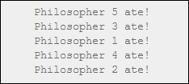

总结来说，Yolk 库提供了处理事件流的几个构造。该库中还有一些我们尚未讨论的函数，您应该自己探索它们。在下一节中，我们将提供一些示例，展示 Yolk 库的其他函数。

### 注意

一些先前的示例基于 Wilkes Joiner 的*Yolk 示例*代码（[`github.com/Cicayda/yolk-examples`](https://github.com/Cicayda/yolk-examples)）。

# 构建响应式用户界面

响应式编程的主要应用之一是前端开发，我们必须创建对状态变化异步响应的用户界面组件。在本节中，我们将描述一些使用`core.async`库和 Yolk 库实现的示例。这是为了向您展示通道和事件流的比较，并展示我们如何使用这两个概念设计解决方案。请注意，这里将仅描述这些示例的整体设计和代码，您应该能够自己填充细节。

### 注意

以下示例所需的库依赖项如下：

```java
[yolk "0.9.0"]
[org.clojure/core.async "0.1.346.0-17112a-alpha"]
```

此外，以下命名空间必须在您的命名空间声明中包含：

```java
(ns my-namespace
  (:require [goog.events :as events]
            [goog.events.EventType]
            [goog.style :as style]
            [cljs.core.async :as a]
            [yolk.bacon :as y])
  (:require-macros [cljs.core.async.macros
                    :refer [go go-loop alt!]]))
```

除了前面的依赖关系外，以下示例还使用了来自 `src/m_clj/c9/common.cljs` 的 `set-html!` 和 `by-id` 函数。请确保以下 ClojureScript 示例中的代码使用以下命令进行编译：

```java
$ lein cljsbuild once

```

作为第一个示例，让我们创建三个异步任务，每个任务在不同的时间间隔产生值。我们必须获取这些任务产生的所有值，并以相同的顺序在网页上渲染它们。

### 注意

以下示例可以在书籍源代码的 `src/m_clj/c9/reactive/core.cljs` 中找到。此外，以下 ClojureScript 示例的 HTML 页面可以在 `resources/html/reactive.html` 中找到。以下脚本将包含在此页面上：

```java
<script type="text/javascript" src="img/bacon.js">
</script>
<script type="text/javascript" src="img/reactive.js">
</script>
```

我们可以使用 `core.async` 库中的进程和通道来实现这一点。在这种情况下，通道将传递三个进程产生的值，我们将使用 `merge` 操作来组合这些通道，如下所示 *示例 9.11*：

```java
(defn render-div [q]
  (apply str
         (for [p (reverse q)]
           (str "<div class='proc-" p "'>Process " p "</div>"))))

(defn start-process [v t]
  (let [c (a/chan)]
    (go (while true
          (a/<! (a/timeout t))
          (a/>! c v)))
    c))

(let [out (by-id "ex-9-11-out")
      c1 (start-process 1 250)
      c2 (start-process 2 1000)
      c3 (start-process 3 1500)
      c (a/merge [c1 c2 c3])
      firstn (fn [v n]
               (if (<= (count v) n)
                 v
                 (subvec v (- (count v) n))))]
  (go-loop [q []]
    (set-html! out (render-div q))
    (recur (-> (conj q (a/<! c))
               (firstn 10)))))
```

> *示例 9.11：使用通道的三个异步任务*

前面的 `start-process` 函数将创建一个进程，该进程会定期使用 `go` 形式产生值，并返回一个可以从中读取值的通道。`render-div` 函数将为三个任务产生的值生成 HTML。只会显示最近的十个值。此代码将产生以下输出：

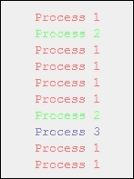

我们也可以使用 FRP（函数式响应式编程）来实现前面的示例，其中每个任务产生的值都表示为事件流。`yolk.bacon` 命名空间中的 `merge-all` 函数可以用来组合这些事件流，而 `sliding-window` 函数可以获取结果流产生的十个最新值。*示例 9.11* 中的 `render-div` 函数可以重用来渲染值。这已在 *示例 9.12* 中实现，并产生与 *示例 9.11* 相同的输出：

```java
(let [out (by-id "ex-9-12-out")
      events [(y/interval 250 1)
              (y/interval 1000 2)
              (y/interval 1500 3)]]
  (-> events
      y/merge-all
      (y/sliding-window 10)
      (y/on-value
       #(set-html! out (render-div %)))))
```

> *示例 9.12：使用 FRP 的三个异步任务*

接下来，让我们尝试捕获特定 `div` 标签的鼠标事件，并显示这些事件位置的页面偏移值。我们可以使用通道来完成此操作，但首先需要一个将 DOM 事件传递到通道的函数。我们可以使用 `goog.events/listen` 和 `cljs.core.async/put!` 函数来实现这一点，如下所示 *示例 9.13*：

```java
(defn listen
  ([el type] (listen el type nil))
  ([el type f] (listen el type f (a/chan)))
  ([el type f out]
   (events/listen el type
                  (fn [e] (when f (f e)) (a/put! out e)))
   out))
```

> *示例 9.13：一个将事件传递到通道的函数*

我们现在可以使用之前定义的 `listen` 函数来监听来自特定 `div` 标签的 `goog.events.EventType.MOUSEMOVE` 事件类型。值必须转换为页面偏移，这可以使用 `goog.style` 命名空间中的 `getPageOffsetLeft` 和 `getPageOffsetTop` 函数来完成。此实现已在 *示例 9.14* 中描述：

```java
(defn offset [el]
  [(style/getPageOffsetLeft el) (style/getPageOffsetTop el)])

(let [el (by-id "ex-9-14")
      out (by-id "ex-9-14-out")
      events-chan (listen el goog.events.EventType.MOUSEMOVE)
      [left top] (offset el)
      location (fn [e]
                 {:x (+ (.-offsetX e) (int left))
                  :y (+ (.-offsetY e) (int top))})]
  (go-loop []
    (if-let [e (a/<! events-chan)]
      (let [loc (location e)]
        (set-html! out (str (:x loc) ", " (:y loc)))
        (recur)))))
```

> *示例 9.14：使用通道的鼠标事件*

我们也可以使用 Yolk 库中的 `from-event-stream` 和 `map` 函数来实现这个问题的解决方案。有趣的是，由 `from-event-target` 函数返回的流产生的事件将具有事件存储为 `pageX` 和 `pageY` 属性的页面偏移量。这使得我们可以实现一个更简单的实现，如 *示例 9.15* 所示：

```java
(let [el (by-id "ex-9-15")
      out (by-id "ex-9-15-out")
      events (y/from-event-target el "mousemove")]
  (-> events
      (y/map (juxt (fn [e] (.-pageX e))
                   (fn [e] (.-pageY e))))
      (y/map (fn [[x y]] (str x ", " y)))
      (y/on-value
       #(set-html! out %))))
```

> *示例 9.15：使用 FRP 的鼠标事件*

在 *示例 9.14* 和 *示例 9.15* 中展示的两个实现都按预期工作，并产生以下输出：


作为最后的例子，我们将模拟执行几个搜索查询并显示前三个返回结果的查询结果。查询可以描述为：两个针对网页结果的查询，两个针对图片结果的查询，以及两个针对视频结果的查询。我们可以将这些模拟查询实现如 *示例 9.16* 所示：

```java
(defn chan-search [kind]
  (fn [query]
    (go
      (a/<! (a/timeout (rand-int 100)))
      [kind query])))

(def chan-web1 (chan-search :web1))
(def chan-web2 (chan-search :web2))
(def chan-image1 (chan-search :image1))
(def chan-image2 (chan-search :image2))
(def chan-video1 (chan-search :video1))
(def chan-video2 (chan-search :video2))
```

> *示例 9.16：使用通道模拟搜索查询*

`chan-search` 函数返回一个函数，该函数使用 `cljs.core.async/timeout` 函数通过暂停当前任务一定数量的毫秒来模拟搜索查询。使用 `chan-search` 函数，我们可以为不同类型的感兴趣结果创建多个查询。使用这些函数，我们可以实现一个执行所有查询并返回前三个结果的函数，如 *示例 9.17* 所示：

```java
(defn chan-search-all [query & searches]
  (let [cs (for [s searches]
             (s query))]
    (-> cs vec a/merge)))

(defn chan-search-fastest [query]
  (let [t (a/timeout 80)
        c1 (chan-search-all query chan-web1 chan-web2)
        c2 (chan-search-all query chan-image1 chan-image2)
        c3 (chan-search-all query chan-video1 chan-video2)
        c (a/merge [c1 c2 c3])]
    (go (loop [i 0
               ret []]
          (if (= i 3)
            ret
            (recur (inc i)
                   (conj ret (alt!
                               [c t] ([v] v)))))))))
```

> *示例 9.17：使用通道模拟搜索查询（继续）*

如前例所示，可以使用 `merge` 函数将产生搜索查询结果的通道合并。请注意，针对所有三种类型的结果（即网页、图片和视频）的查询在 `80` 毫秒后超时。我们可以使用之前定义的 `listen` 函数将 `chan-search-fastest` 函数绑定到鼠标按钮的点击上，如 *示例 9.18* 所示：

```java
(let [out (by-id "ex-9-18-out")
      button (by-id "search-1")
      c (listen button goog.events.EventType.CLICK)]
  (go (while true
        (let [e (a/<! c)
              result (a/<! (chan-search-fastest "channels"))
              s (str result)]
          (set-html! out s)))))
```

> *示例 9.18：使用通道模拟搜索查询（继续）*

点击绑定到 `chan-search-fastest` 函数的按钮将显示以下输出。注意，以下输出中的 `nil` 值表示特定搜索结果类型的所有查询都超时了。


我们可以同样容易地实现之前描述的搜索查询模拟的 FRP 版本。针对各种数据源的查询定义如以下 *示例 9.19* 所示：

```java
(defn frp-search [kind]
  (fn [query]
    (y/later (rand-int 100) [kind query])))

(def frp-web1 (frp-search :web1))
(def frp-web2 (frp-search :web2))
(def frp-image1 (frp-search :image1))
(def frp-image2 (frp-search :image2))
(def frp-video1 (frp-search :video1))
(def frp-video2 (frp-search :video2))
```

> *示例 9.19：使用 FRP 模拟搜索查询*

前面的函数都返回搜索结果的事件流。产生的搜索结果可以使用 `yolk.bacon` 命名空间中的 `later`、`merge` 和 `combine-as-array` 函数与超时结合，如 *示例 9.20* 所示：

```java
(defn frp-search-all [query & searches]
  (let [results (map #(% query) searches)
        events (cons (y/later 80 "nil") results)]
    (-> (apply y/merge events)
        (y/take 1))))

(defn frp-search-fastest [query]
  (y/combine-as-array
   (frp-search-all query frp-web1 frp-web2)
   (frp-search-all query frp-image1 frp-image2)
   (frp-search-all query frp-video1 frp-video2)))
```

> *示例 9.20：使用 FRP 模拟搜索查询（继续）*

可以在点击按钮时调用 `frp-search-fastest` 函数，如 *示例 9.21* 所示：

```java
(let [out (by-id "ex-9-21-out")
      button (by-id "search-2")
      events (y/from-event-target button "click")]
  (-> events
      (y/flat-map-latest #(frp-search-fastest "events"))
      (y/on-value
       #(set-html! out %))))
```

> *示例 9.21：使用 FRP 模拟搜索查询（继续）*

当点击搜索按钮时，前面的示例会产生以下输出：


总之，我们可以在网页中同时使用通道和事件流来实现交互式界面。尽管前面示例的 FRP 实现略短，但我们可以说 `core.async` 和 Yolk 库都有自己的优雅之处。

### 注意

前面的示例基于 David Nolen 的 *Communicating Sequential Processes* ([`swannodette.github.io/2013/07/12/communicating-sequential-processes/`](http://swannodette.github.io/2013/07/12/communicating-sequential-processes/)) 和 Draco Dormiens 的 *CSP vs. FRP* ([`potetm.github.io/2014/01/07/frp.html`](http://potetm.github.io/2014/01/07/frp.html)) 中的代码。

# 介绍 Om

*Om* 库 ([`github.com/omcljs/om`](https://github.com/omcljs/om)) 是在 ClojureScript 中构建动态用户界面的优秀工具。实际上，它是对 *React.js* ([`facebook.github.io/react/`](http://facebook.github.io/react/)) 的接口，这是一个用于创建交互式用户界面组件的 JavaScript 库。Om 允许我们将用户界面定义为组件的层次结构，并且每个组件根据组件状态的变化反应性地修改其外观。通过这种方式，Om 组件 *对状态的变化做出反应*。

### 注意

以下示例需要以下库依赖项：

```java
[org.omcljs/om "0.8.8"]
```

此外，以下命名空间必须包含在你的命名空间声明中：

```java
(ns my-namespace
  (:require [om.core :as om :include-macros true]
            [om.dom :as dom :include-macros true]))
```

除了前面的依赖关系之外，以下示例还使用了来自 `src/m_clj/c9/common.cljs` 的 `by-id` 函数。请确保以下 ClojureScript 示例代码已编译，使用以下命令：

```java
$ lein cljsbuild once

```

Om 组件通常通过实现 `om.core` 命名空间中的 `IRender` 和 `IRenderState` 协议来定义。`IRender` 协议声明了一个名为 `render` 的单个函数，同样地，`IRenderState` 协议声明了 `render-state` 函数。`render` 和 `render-state` 函数定义了实现这些协议之一的组件如何转换为 DOM，这可以通过网络浏览器进行渲染。这些函数的实现必须返回使用 `om.dom` 命名空间中的函数构建的 DOM 对象。`om.core` 命名空间中还有其他几个协议，允许我们定义组件的行为。内部，Om 使用 React.js 进行批处理更新 DOM 以提高性能，并使用 *虚拟 DOM* 来维护要渲染的 DOM 的状态。

### 注意

以下示例可以在书籍源代码的 `src/m_clj/c9/om/core.cljs` 中找到。此外，以下 ClojureScript 示例的 HTML 页面可以在 `resources/html/om.html` 中找到。以下脚本将包含在这个页面中：

```java
<script type="text/javascript" src="img/om.js">
</script>
```

现在我们使用 Om 构建一个简单的组件。假设我们想要构建一个网络应用程序。这样做的一个第一步是为我们的应用程序创建一个登录页面。作为一个例子，让我们使用 Om 创建一个简单的登录表单。用户将在这个表单中输入他们的用户名和密码。唯一的要求是这个表单的提交按钮只有在用户输入了用户名和密码时才启用。让我们首先定义一些函数来创建表单的输入字段，如 *示例 9.22* 所示：

```java
(defn update-input-value-fn [owner]
  (fn [e]
    (let [target (.-target e)
          val (.-value target)
          id (keyword (.-id target))]
      (om/set-state! owner id val))))

(defn input-field [text owner attrs]
  (let [handler (update-input-value-fn owner)
        event-attr {:onChange handler}
        js-attrs (-> attrs (merge event-attr) clj->js)]
    (dom/div
     nil
     (dom/div nil text)
     (dom/input js-attrs))))
```

> *示例 9.22：使用 Om 的登录表单*

在 *示例 9.22* 中定义的 `update-input-value-fn` 函数接受一个组件 `owner` 作为参数，并返回一个我们可以绑定到 DOM 事件的函数。返回的函数使用 `om.core` 命名空间中的 `set-state!` 函数更新组件的状态，该状态使用 `.-value` 属性的值。`input-field` 函数返回一个具有一些相关属性的输入字段的 DOM 对象。`input-field` 函数还使用 `update-input-value-fn` 函数创建一个事件处理器，并将其绑定到输入字段的 `onChange` 事件。

### 注意

注意，组件可以通过使用 `om.core` 命名空间中的 `set-state!`、`update-state!`、`update!` 或 `transact!` 函数来改变其状态或全局应用程序状态。

接下来，让我们使用 `om.core/IRenderState` 协议和 `input-field` 函数将表单定义为组件，如 *示例 9.23* 所示：

```java
(defn form [data owner]
  (reify
    om/IInitState
    (init-state [_]
      {:username "" :password ""})
    om/IRenderState
    (render-state [_ state]
      (dom/form
       nil
       (input-field "Username" owner
                    {:type "text"
                     :id "username"
                     :value (:username state)})
       (input-field "Password" owner
                    {:type "password"
                     :id "password"
                     :value (:password state)})
       (dom/br nil)
       (dom/input
        #js {:type "submit"
             :value "Login"
             :disabled (or (-> state :username empty?)
                           (-> state :password empty?))})))))

(om/root form nil {:target (by-id "ex-9-23")})
```

> *示例 9.23：使用 Om 的登录表单（续）*

之前的 `form` 函数通过实现 `IRenderState` 协议的 `render-state` 函数来创建一个组件。此组件还实现了 `IInitState` 协议以定义组件的初始状态。`form` 函数将渲染一个包含两个输入字段（用于用户名和密码）以及一个登录按钮的登录表单。按钮仅在用户名和密码输入后才会启用。此外，该组件使用 `om.core/root` 函数挂载到一个 `div` 元素上。以下网页中的输出描述了由 `form` 函数定义的组件的行为：


上述输出描述了由 `form` 函数定义的登录表单组件的两个状态。观察到当用户名或密码字段为空时，登录按钮处于禁用状态，并且只有在用户在这两个输入字段中输入值时才会启用。通过这种方式，登录表单 *响应* 输入字段状态的变化。

### 注意

访问 [`github.com/omcljs/om/wiki/Documentation`](https://github.com/omcljs/om/wiki/Documentation) 获取 Om 库中所有协议、函数和宏的完整文档。

因此，Om 库为我们提供了创建交互式和有状态组件的几个构造。

# 概述

到目前为止，我们通过 Pulsar、RxClojure 和 Yolk 库讨论了响应式编程。我们还描述了几个 ClojureScript 示例，比较了 `core.async` 库中的通道与 Yolk 库中的响应式事件流。我们还演示了如何利用 Om 库构建动态用户界面。

在下一章中，我们将探讨如何测试我们的 Clojure 程序。

# 第十章：测试您的代码

测试是软件开发的一个组成部分。在实现软件功能的同时，我们必须同时定义测试来验证其多个方面。Clojure 标准库提供了几个构造来定义测试和模拟数据。还有几个社区库允许我们验证正在测试的代码的不同方面。

使用测试的主要优势在于，它们使我们能够识别程序代码中特定更改的整体影响。如果我们有测试来检查程序的功能，我们就可以有信心地对程序进行重构，而无需担心丢失任何功能。如果在重构程序时不可避免地遗漏了某些内容，那么在运行程序测试时，这些内容肯定会引起我们的注意。因此，测试是保持代码可维护性的不可或缺的工具。

在本章中，我们将研究在 Clojure 中编写测试的不同方法。我们还将讨论如何在 Clojure 中执行类型检查。尽管在本章中我们描述了几个用于编写测试的库，但我们必须注意，Clojure 生态系统中有更多可用的库。除此之外，本章中描述的库是测试我们代码最成熟和经验丰富的工具。

# 编写测试

作为一种精心设计的语言，Clojure 内置了单元测试库，即 `clojure.test`。除此之外，核心语言中还有一些有助于测试的构造。当然，这些构造并不能让我们在正式意义上定义和运行任何测试，对于这个目的，我们应优先使用 `clojure.test` 命名空间中的构造。

让我们先简要讨论一下核心语言中可用于单元测试的构造。`assert` 函数检查表达式在运行时是否评估为真值。如果传递给该函数的表达式没有评估为真值，则该函数将抛出异常，并且可以可选地指定异常的消息作为 `assert` 表达式的第二个参数。我们可以通过使用全局的 `*assert*` 编译时 `var` 来有效地禁用给定程序中的所有 `assert` 表达式。这个变量只能通过给定程序或命名空间中的顶层 `set!` 表达式来更改。

测试的另一个有趣方面，可以通过核心语言轻松解决，是*模拟*和*存根*。简而言之，这些技术允许我们在测试用例的上下文中重新定义某些函数的行为。这在防止函数执行不想要的副作用或使用不可用的资源时非常有用。在 Clojure 语言中，这可以使用`with-redefs`函数来完成。这个形式可以在测试以及普通函数中使用，但鼓励不要在测试范围之外使用它。它的语义与标准`let`形式相似，鼓励您查阅 Clojure 文档以获取`with-redefs`形式的示例。

现在，让我们探索如何使用`clojure.test`命名空间中的构造来实际定义测试。

## 定义单元测试

Clojure 内置了对定义单元测试的支持。`clojure.test`命名空间不需要任何额外的依赖，提供了几个用于测试我们代码的构造。让我们探索其中的一些。

### 注意

在接下来的示例中，你必须将以下命名空间包含在你的命名空间声明中：

```java
(ns my-namespace
  (:require [clojure.test :refer :all]))
```

以下示例可以在书籍源代码的`test/m_clj/c10/test.clj`中找到。

测试可以使用`deftest`宏来定义。这个形式必须传递一个符号，表示定义的测试的名称，以及任意数量的表达式。通常，在`deftest`宏中使用`is`和`are`形式。`is`形式必须传递一个表达式，如果提供的表达式不返回一个真值，则测试将失败。`are`形式必须传递一个变量名向量、一个要测试的条件以及为定义的变量提供的值。例如，标准的`*`函数可以像*示例 10.1*中所示的那样进行测试：

```java
(deftest test-*
  (is (= 6 (* 2 3)))
  (is (= 4 (* 1 4)))
  (is (= 6 (* 3 2))))

(deftest test-*-with-are
  (are [x y] (= 6 (* x y))
    2 3
    1 6
    3 2))
```

> *示例 10.1：使用 clojure.test 命名空间定义测试*

前面的代码使用`is`和`are`形式定义了两个测试。我们可以使用`clojure.test`命名空间中的`run-tests`和`run-all-tests`函数来运行测试。`run-tests`函数可以传递任意数量的命名空间，并将运行其中定义的所有测试。此外，这个形式可以不传递任何参数来调用，在这种情况下，它将运行当前命名空间中的所有测试。`run-all-tests`函数将运行当前项目中所有命名空间中的所有测试。它可以可选地传递一个正则表达式，如果提供了这个参数，它将只运行匹配命名空间中的测试。实际上，具有集成测试运行支持的 IDE 会调用这些函数。例如，我们可以使用这里显示的`run-tests`函数来运行我们在*示例 10.1*中定义的测试：

```java
user> (run-tests)

Testing ...

Ran 2 tests containing 6 assertions.
0 failures, 0 errors.
{:test 2, :pass 6, :fail 0, :error 0, :type :summary}
```

如前所述的输出所示，`run-tests`函数执行了这两个测试，并且它们都通过了。现在，让我们定义一个会失败的测试，尽管我们实际上不应该这样做，除非我们有充分的理由：

```java
(deftest test-*-fails
  (is (= 5 (* 2 3))))
```

> *示例 10.2：一个失败的测试*

在 *示例 10.2* 中显示的 `test-*-fails` 测试在运行时会失败，如下所示：

```java
user> (run-tests)

Testing ...

FAIL in (test-*-fails) (test.clj:24)
expected: (= 5 (* 2 3))
  actual: (not (= 5 6))

Ran 3 tests containing 7 assertions.
1 failures, 0 errors.
{:test 3, :pass 6, :fail 1, :error 0, :type :summary}
```

事实上，定义失败的测试应该被视为程序开发的一个组成部分。为了启动一个功能或修复程序中的错误，我们首先必须定义一个验证此更改的测试（通过失败！）然后继续实现功能或修复，以确保所有新定义的测试都通过。这两个步骤然后重复进行，直到满足我们功能或修复的所有要求。这就是**测试驱动开发**（**TDD**）的精髓。

### 注意

我们也可以使用以下命令来运行给定命名空间中定义的测试：

```java
$ lein test my-namespace

```

对于严格使用 Clojure 编写的程序，必须使用 `clojure.test` 命名空间进行测试。为了以相同的方式测试 ClojureScript 程序，我们可以使用 *doo* 库（[`github.com/bensu/doo`](https://github.com/bensu/doo)），它提供了 `deftest`、`is` 和 `are` 构造的 ClojureScript 实现。

## 使用自顶向下测试

在 Clojure 中定义测试的一个更强大的方法是使用 *Midje* 库（[`github.com/marick/Midje`](https://github.com/marick/Midje)）。这个库提供了几个构造，允许我们通过描述几个函数之间的关系来轻松定义单元测试，而不是描述函数的实现本身。这种方法也称为 *自顶向下测试*，Midje 推崇这种测试方法。让我们深入了解 Midje 库的细节。

### 注意

以下库依赖对于即将到来的示例是必需的：

```java
[midje "1.8.2"]
```

我们还必须在 `project.clj` 文件的 `:plugins` 部分包含以下依赖项：

```java
[lein-midje "3.1.3"]
```

此外，以下命名空间必须在您的命名空间声明中包含：

```java
(ns my-namespace
  (:require [midje.sweet :refer :all]
            [midje.repl :as mr]))
```

以下示例可以在书的源代码的 `test/m_clj/c10/midje.clj` 中找到。

首先，让我们定义一个我们打算测试的简单函数，如 *示例 10.3* 所示：

```java
(defn first-element [sequence default]
  (if (empty? sequence)
    default
    (first sequence)))
```

> *示例 10.3：一个简单的测试函数*

我们可以使用 `midje.sweet` 命名空间中的 `facts` 和 `fact` 构造来定义 `first-element` 函数的测试，如 *示例 10.4* 所示。

```java
(facts "about first-element"
  (fact "it returns the first element of a collection"
        (first-element [1 2 3] :default) => 1
        (first-element '(1 2 3) :default) => 1)

  (fact "it returns the default value for empty collections"
        (first-element [] :default) => :default
        (first-element '() :default) => :default
        (first-element nil :default) => :default
        (first-element
         (filter even? [1 3 5])
         :default) => :default))
```

> *示例 10.4：第一个元素函数的测试*

如前述代码所示，`fact` 形式描述了一个测试，可以传递任意数量的子句。每个子句由一个表达式、一个 `=>` 符号和所提供表达式的预期返回值组成。`facts` 形式简单用于将多个 `fact` 形式组合在一起。很明显，我们不是检查逻辑条件，而是使用 `fact` 形式来检查表达式及其返回的值。

可以使用 `provided` 形式来模拟函数调用。Midje 库允许我们在测试中使用 *元常量*，它们通常与 `provided` 形式一起使用。元常量可以被视为值和函数的通用占位符。所有元常量都应该以两个或更多点（`.`）或连字符（`-`）开始和结束；连字符更适合表示函数的元常量。例如，我们可以使用元常量和 `provided` 形式测试我们之前定义的 `first-element` 函数，如 *示例 10.5* 所示：

```java
(fact "first-element returns the first element of a collection"
      (first-element ..seq.. :default) => :default
      (provided
       (empty? ..seq..) => true))
```

> *示例 10.5：使用提供的形式和元常量*

在前面的测试中，元常量 `..seq..` 用于指示传递给 `first-element` 函数的第一个参数，而 `provided` 形式模拟了对 `empty?` 函数的调用。这样，我们可以在不完整实现被测试函数的情况下实现测试。当然，我们应该避免在 `provided` 形式中模拟或重新定义标准函数。例如，假设我们有三个部分实现的功能，如 *示例 10.6* 所示。

```java
(defn is-diesel? [car])

(defn cost-of-car [car])

(defn overall-cost-of-car [car]
  (if (is-diesel? car)
    (* (cost-of-car car) 1.4)
    (cost-of-car car)))
```

> *示例 10.6：部分实现的功能以进行测试*

注意，在前面代码中，只有 `overall-cost-of-car` 函数是完全实现的。尽管如此，我们仍然可以使用 Midje 库测试这三个函数之间的关系，如 *示例 10.7* 所示。

```java
(fact
  (overall-cost-of-car ..car..) => (* 5000 1.4)
  (provided
    (cost-of-car ..car..) => 5000
    (is-diesel? ..car..) => true))
```

> *示例 10.7：测试 is-diesel?、cost-of-car 和 overall-cost-of-car 函数*

在前面的测试中，使用 `provided` 形式和 `..car..` 元常量模拟了 `cost-of-car` 和 `is-diesel?` 函数，并检查了 `overall-cost-of-car` 函数返回的值。我们可以使用 `midje.repl` 命名空间中的 `autotest` 函数运行我们迄今为止定义的所有测试，如下所示：

```java
user> (mr/autotest :files "test")

====================================================================
Loading ( ... )
>>> Output from clojure.test tests:

0 failures, 0 errors.
>>> Midje summary:
All checks (8) succeeded.
[Completed at ... ]
```

### 注意

我们还可以使用以下命令运行给定命名空间中定义的测试。请注意，以下命令将监视您的项目文件更改，并在文件更改后运行任何文件的测试：

```java
$ lein midje :autotest test

```

以这种方式，我们可以使用 Midje 库来编写测试，即使是尚未完全实现的功能也可以。Midje 允许我们使用元常量来描述测试，这些测试是函数之间的关系。总之，`clojure.test` 和 Midje 库是定义单元测试的出色工具。

# 使用 specs 进行测试

现在，我们将查看 Speclj 库，发音为 *speckle* ([`github.com/slagyr/speclj`](https://github.com/slagyr/speclj))，它用于编写 *specs*。Specs 与单元测试类似，但专注于被测试函数的行为，而不是其内部实现。实际上，**行为驱动开发**（**BDD**）的核心是编写 specs。

TDD 和 BDD 之间的主要区别在于 BDD 专注于函数的行为或规范，而不是它们的实现。从这个角度来看，如果我们更改已经测试过的函数的内部实现，我们修改与该函数关联的测试或规范的可能性较小。BDD 也可以被视为对 TDD 的改进方法，其中函数的接口和行为比其内部实现更重要。现在，让我们研究 Speclj 库的各种构造。

### 注意

下面的库依赖项对于即将到来的示例是必需的。我们还必须在 `project.clj` 文件的 `:plugins` 部分包含以下依赖项：

```java
[speclj "3.3.1"]
```

此外，以下命名空间必须在您的命名空间声明中包含：

```java
(ns my-namespace
  (:require [speclj.core :refer :all]))
```

来自 `speclj.core` 命名空间的 `describe`、`it` 和 `should` 形式用于定义给定函数的规范。`it` 形式代表对正在测试的函数的单个规范，而 `describe` 形式用于将多个规范组合在一起。`it` 形式内的断言可以使用 `should` 形式及其变体来表示。例如，我们可以为标准 `*` 函数的行为编写规范，如下面的 *示例 10.8* 所示。

### 注意

以下示例可以在书籍源代码的 `spec/m_clj/c10/speclj.clj` 中找到。

```java
(describe "*"
  (it "2 times 3 is 6"
    (should (= 6 (* 2 3)))))
```

> *示例 10.8: `*` 函数的规范*

之前显示的规范使用 `should` 和 `=` 形式检查单个条件。`should` 形式有几个变体，如 `should=`, `should-not`, `should-fail` 和 `should-throw`。这些形式基本上是自我解释的，我们鼓励您查阅 Speclj 文档以获取更多详细信息。我们可以为标准的 `/` 函数描述一些规范，如下面的 *示例 10.9* 所示。

```java
(describe "/"
  (it "5 divided by 5 is 1"
    (should= 1 (/ 5 5)))
  (it "5 divided by 5 is not 0"
    (should-not= 0 (/ 5 5)))
  (it "fail if 5 divided by 5 is not 1"
    (if (not= 1 (/ 5 5))
      (should-fail "divide not working")))
  (it "throw an error if 5 is divided by 0"
    (should-throw ArithmeticException
      (/ 5 0))))
```

> *示例 10.9: 使用多个 `it` 形式对 `/` 函数进行规范*

在 `describe` 形式中，我们可以使用 `before` 和 `after` 形式在检查每个 `it` 形式之前或之后执行任意代码。同样，`before-all` 和 `after-all` 形式可以指定在 `describe` 形式中检查所有规范之前和之后要执行的操作。

某个函数执行输入和输出可以使用规范来描述。这是通过使用 `with-out-str` 和 `with-in-str` 形式来完成的。`with-out-str` 形式返回由给定表达式发送到标准输出的任何数据。相反，`with-in-str` 形式必须传递一个字符串和一个表达式，并且提供的字符串将在提供的表达式被调用后发送到标准输入。例如，假设我们有一个简单的读取字符串并打印它的函数。我们可以使用 `with-out-str` 和 `with-in-str` 形式编写这样的函数的规范，如下面的 *示例 10.10* 所示：

```java
(defn echo []
  (let [s (read-line)]
    (println (str "Echo: " s))))

(describe "echo"
  (it "reads a line and prints it"
    (should= "Echo: Hello!\r\n"
      (with-out-str
        (with-in-str "Hello!"
          (echo))))))
```

> *示例 10.10: 对读取字符串并打印它的函数进行规范*

我们还可以使用前面描述的标准 `with-redefs` 宏在 `it` 表达式中模拟函数调用。例如，我们可以通过模拟 *示例 10.11* 中的 `read-line` 和 `println` 函数来编写 *示例 10.10* 中描述的 `echo` 函数的 spec。显然，模拟标准函数是不推荐的，这里仅为了展示在 spec 中使用 `with-redefs` 宏的用法。

```java
(describe "echo"
  (it "reads a line and prints it"
    (with-redefs [read-line (fn [] "Hello!")
                  println (fn [x] x)]
      (should= "Echo: Hello!" (echo)))))
```

> *示例 10.11：在 spec 中使用 with-redefs 宏*

要运行给定项目中定义的所有 spec，我们可以调用 `run-specs` 宏，如下所示：

```java
user> (run-specs)
...

Finished in 0.00547 seconds
7 examples, 0 failures
#<speclj.run.standard.StandardRunner 0x10999>
```

### 注意

我们还可以使用以下命令运行给定命名空间中定义的 spec。请注意，以下命令将监视您的项目文件更改，并在文件更改后运行 spec：

```java
$ lein spec -a

```

总结来说，Speclj 库为我们提供了几个结构来定义 BDD 的 spec。对于给定函数的 spec 应该只在需要更改函数所需的功能或行为时进行修改。有了 spec，修改函数的底层实现需要更改其相关 spec 的可能性就小得多。当然，是否应该在项目中使用 spec 或测试是一个主观问题。有些项目使用简单的测试就很好，而有些则更喜欢使用 spec。

# 生成测试

另一种测试形式是**生成测试**，在这种测试中，我们定义函数的属性，这些属性必须对所有输入都成立。这与列举函数的预期输入和输出有很大不同，而这正是单元测试和 spec 所做的。在 Clojure 中，可以使用 `test.check` 库进行生成测试 ([`github.com/clojure/test.check`](https://github.com/clojure/test.check))。这个库受到了 Haskell 的 QuickCheck 库的启发，并为测试函数的属性提供了类似的构造。

### 注意

以下库依赖对于即将到来的示例是必需的：

```java
[org.clojure/test.check "0.9.0"]
```

此外，以下命名空间必须在您的命名空间声明中包含：

```java
(ns my-namespace
  (:require [clojure.test.check :as tc]
            [clojure.test.check.generators :as gen]
            [clojure.test.check.properties :as prop]
            [clojure.test.check.clojure-test 
             :refer [defspec]]))
```

以下示例可以在本书源代码的 `src/m_clj/c10/check.clj` 中找到。

要定义一个要检查的属性，我们可以使用 `clojure.test.check.properties` 命名空间中的 `for-all` 宏。此宏必须传递一个生成器绑定向量，这些绑定可以使用 `clojure.test.check.generators` 命名空间中的构造创建，并附带一个要验证的属性。例如，考虑 *示例 10.12* 中定义的属性：

```java
(def commutative-mult-prop
  (prop/for-all [a gen/int
                 b gen/int]
    (= (* a b)
       (* b a))))

(def first-is-min-after-sort-prop
  (prop/for-all [v (gen/not-empty (gen/vector gen/int))]
    (= (apply min v)
       (first (sort v)))))
```

> *示例 10.12：使用 test.check 库定义的简单属性*

在前面的代码中，我们定义了两个属性，即 `commutative-mult-prop` 和 `first-is-min-after-sort-prop`。`commutative-mult-prop` 属性断言使用 `*` 函数的乘法操作是交换律的，而 `first-is-min-after-sort-prop` 函数检查使用 `sort` 函数排序的整数向量的第一个元素是否是向量中的最小值。注意使用了来自 `clojure.test.check.generators` 命名空间的 `int`、`vector` 和 `non-empty` 函数。我们可以使用 `clojure.test.check` 命名空间中的 `quick-check` 函数来验证这些属性是否成立，如下所示：

```java
user> (tc/quick-check 100 commutative-mult-prop)
{:result true, :num-tests 100, :seed 1449998010193}
user> (tc/quick-check 100 first-is-min-after-sort-prop)
{:result true, :num-tests 100, :seed 1449998014634}
```

如前所述，`quick-check` 函数必须传递要运行的检查次数和一个要验证的性质。此函数返回一个描述对提供的属性执行的检查的映射，其中 `:result` 键的值表示测试的结果。很明显，对于指定的输入类型，两个属性 `commutative-mult-prop` 和 `first-is-min-after-sort-prop` 都是成立的。现在，让我们定义一个不成立的属性，如 *示例 10.13* 所示：

```java
(def commutative-minus-prop
  (prop/for-all [a gen/int
                 b gen/int]
    (= (- a b)
       (- b a))))
```

> *示例 10.13：使用 test.check 库定义的一个不会成立的属性*

运行前面的检查将显然失败，如下面的输出所示：

```java
user> (tc/quick-check 100 commutative-minus-prop)
{:result false, :seed 1449998165908,
 :failing-size 1, :num-tests 2, :fail [0 -1],
 :shrunk {:total-nodes-visited 1, :depth 0, :result false,
               :smallest [0 -1]}}
```

我们还可以使用 `clojure.test.check.clojure-test` 命名空间中的 `defspec` 宏根据生成性测试来定义规范。这个形式必须传递要执行的检查次数和一个性质，这与 `quick-check` 函数类似。使用 `defspec` 形式定义的规范将由标准的 `clojure.test` 运行器进行检查。例如，我们可以将 `commutative-mult-prop` 属性定义为规范，如 *示例 10.14* 所示：

```java
(defspec commutative-mult 100
  (prop/for-all [a gen/int
                 b gen/int]
    (= (* a b)
       (* b a))))
```

> *示例 10.14：使用 defspec 宏定义的规范*

在前面的代码中定义的规范可以通过从 `clojure.test` 命名空间调用 `run-tests` 或 `run-all-tests` 函数，或者通过运行 `lein test` Leiningen 命令来验证。总之，通过 `test.check` 库进行生成性测试是我们测试代码的另一种方式。它侧重于指定函数的性质，而不是描述函数对于某些输入的预期输出。

# 使用类型进行测试

**类型检查** 在静态类型语言中通常是理所当然的。有了类型检查，类型错误可以在编译时而不是在运行时被发现。在一些动态语言，如 Clojure 中，类型签名可以在需要时和任何地方声明，这种技术被称为 *可选类型*。类型检查可以使用 `core.typed` 库（[`github.com/clojure/core.typed`](https://github.com/clojure/core.typed)）来完成。使用 `core.typed`，可以使用 *类型注解* 检查变量的类型签名。可以为任何变量声明类型注解，包括使用 `def` 形式、`binding` 形式或任何其他创建变量的构造创建的值。在本节中，我们将探讨这个库的细节。

### 注意

下面的库依赖对于即将到来的示例是必需的。

```java
[org.clojure/core.typed "0.3.0"]
```

此外，以下命名空间必须包含在你的命名空间声明中。

```java
(ns my-namespace
  (:require [clojure.core.typed :as t]))
```

以下示例可以在书籍源代码的 `src/m_clj/c10/typed.clj` 中找到。

使用 `clojure.core.typed` 命名空间中的 `ann` 宏声明变量的类型注解。这个形式必须传递一个要注解的表达式和一个类型向量。例如，一个接受两个数字作为参数并返回数字的函数的类型注解如 *示例 10.15* 所示。

```java
(t/ann add [Number Number -> Number])
(defn add [a b]
  (+ a b))
```

> *示例 10.15：一个接受两个数字并返回数字的函数的类型注解*

要检查给定命名空间中的所有类型注解，我们必须通过传递要检查的命名空间来调用 `clojure.core.typed/check-ns` 函数，如下所示：

```java
user> (t/check-ns 'my-namespace)
Start collecting my-namespace
Finished collecting my-namespace
Collected 2 namespaces in 200.965982 msecs
Start checking my-namespace
Checked my-namespace in 447.580402 msecs
Checked 2 namespaces  in 650.979682 msecs
:ok
```

如前所述，`check-ns` 函数会打印出正在检查的命名空间的一些信息，如果指定命名空间中的所有类型检查都通过，则返回关键字 `:ok`。现在，让我们改变之前定义的 `add` 函数，如下所示 *示例 10.16*：

```java
(defn add [a b]
  (str (+ a b)))
```

> *示例 10.16：重新定义 add 函数*

虽然前面的定义是有效的，但它不会被类型检查器通过，如下所示：

```java
user> (t/check-ns 'my-namespace)
Start collecting my-namespace
Finished collecting my-namespace
Collected 2 namespaces in 215.705251 msecs
Start checking my-namespace
Checked my-namespace in 493.669488 msecs
Checked 2 namespaces  in 711.644548 msecs
Type Error (m_clj/c1/typed.clj:23:3) Type mismatch:

Expected:   Number

Actual:   String
in: (str (clojure.lang.Numbers/add a b))
ExceptionInfo Type Checker: Found 1 error  clojure.core/ex-info (core.clj:4403)
```

`check-ns` 函数抛出一个错误，指出在期望 `Number` 类型的地方找到了 `String` 类型。这样，`check-ns` 函数就可以在用 `ann` 宏注解的函数中找到类型错误。可以使用 `clojure.core.typed` 命名空间中的 `IFn` 构造来注解具有多个 arity 的函数，如 *示例 10.17* 所示：

```java
(t/ann add-abc
       (t/IFn [Number Number -> Number]
              [Number Number Number -> Number]))
(defn add-abc
  ([a b]
   (+ a b))
  ([a b c]
   (+ a b c)))
```

> *示例 10.17：使用多个 arity 注解函数*

我们还可以使用传递给 `ann` 宏的类型向量中的 `*` 符号来注解具有可变参数的函数，如 *示例 10.18* 所示。

```java
(t/ann add-xs [Number * -> Number])
(defn add-xs [& xs]
  (apply + xs))
```

> *示例 10.18：使用可变参数注解函数*

在 REPL 中，我们可以使用`clojure.core.typed`命名空间中的`cf`宏来确定表达式或值的推断类型。此宏也可以将预期类型作为第二个参数传递。请注意，`cf`形式仅用于实验，不应用于类型注解。`cf`形式返回一个推断类型，以及一个称为**过滤器集**的结构，它表示为映射。例如，可以使用`cf`形式推断`nil`、`true`和`false`值的类型，如下所示：

```java
user> (t/cf nil)
[nil {:then ff, :else tt}]
user> (t/cf true)
[true {:then tt, :else ff}]
user> (t/cf false)
[false {:then ff, :else tt}]
```

在前面的输出中，由`cf`宏返回的每个向量中的第二个值代表从提供的表达式派生的过滤器集。过滤器集可以描述为两个过滤器的集合：

+   如果表达式是一个真值，则`:then`过滤器为真

+   如果表达式不是真值，则`:else`过滤器为真

在过滤器集的上下文中，存在两个**平凡过滤器**，即`tt`和`ff`，可以描述如下：

+   `tt`，它翻译为**显然为真**，意味着值是真值。

+   `ff`，它翻译为**永远为假**，意味着值不是真值。此过滤器也称为**不可能过滤器**。

从这个角度来看，过滤器集`{:then tt, :else ff}`翻译为“表达式可能是一个真值，但它不可能是一个非真值”。因此，`nil`和`false`等假值永远不会被`cf`形式推断为真，这与 Clojure 中这些值的语义一致。真值将始终有`tt`作为`:then`过滤器，如下面的输出所示：

```java
user> (t/cf "Hello")
[(t/Val "Hello") {:then tt, :else ff}]
user> (t/cf 1)
[(t/Val 1) {:then tt, :else ff}]
user> (t/cf :key)
[(t/Val :key) {:then tt, :else ff}]
```

`cf`宏也可以用来检查函数的类型签名，如下所示：

```java
user> (t/cf str)
[t/Any * -> String]
user> (t/cf +)
(t/IFn [Long * -> Long]
       [(t/U Double Long) * -> Double]
       [t/AnyInteger * -> t/AnyInteger]
       [Number * -> Number])
```

可以使用`ann-form`宏对形式或表达式进行预期类型的注解，如下所示：

```java
user> (t/cf (t/ann-form #(inc %) [Number -> Number]))
[[Number -> Number] {:then tt, :else ff}]
user> (t/cf (t/ann-form #(str %) [t/Any -> String]))
[[t/Any -> String] {:then tt, :else ff}]
```

列表和向量等聚合类型在`clojure.core.typed`命名空间中也有为它们定义的类型。我们可以使用`cf`宏推断这些数据结构的类型，如下所示：

```java
user> (t/cf (list 0 1 2))
(PersistentList (t/U (t/Val 1) (t/Val 0) (t/Val 2)))
user> (t/cf [0 1 2])
[(t/HVec [(t/Val 0) (t/Val 1) (t/Val 2)]) {:then tt, :else ff}]
```

前面的输出中的类型`PersistentList`和`HVec`分别是列表和向量的具体类型。我们还可以将预期类型作为额外的参数传递给`cf`形式，如下所示：

```java
user> (t/cf (list 0 1 2) (t/List t/Num))
(t/List t/Num)
user> (t/cf [0 1 2] (t/Vec t/Num))
(t/Vec t/Num)
user> (t/cf {:a 1 :b 2} (t/Map t/Keyword t/Int))
(t/Map t/Keyword t/Int)
user> (t/cf #{0 1 2} (t/Set t/Int))
(t/Set t/Int)
```

`core.typed` 库也支持**参数化类型**、**联合类型**和**交集类型**。联合类型使用 `U` 构造来声明，交集类型使用 `I` 构造来声明。交集类型旨在与协议一起使用，这意味着交集类型 `(I A B)` 必须实现协议 `A` 和 `B`。另一方面，联合类型可以使用具体类型来定义。例如，`clojure.core.typed` 命名空间定义了一个参数化的 `Option` 类型，它只是 `nil` 和参数化类型的联合。换句话说，类型 `(Option x)` 被定义为联合类型 `(U x nil)`。另一个联合类型的良好例子是 `AnyInteger` 类型，它表示一个整数，并在 `clojure.core.typed` 命名空间中定义，如 *示例 10.19* 所示。

```java
(defalias AnyInteger
  (U Integer Long clojure.lang.BigInt BigInteger Short Byte))
```

> *示例 10.19：AnyInteger 联合类型*

`core.typed` 库也支持**多态类型**，这允许我们指定泛化类型。例如，`identity` 和 `iterate` 函数具有多态类型签名，如下所示：

```java
user> (t/cf identity)
(t/All [x] [x -> x :filters ... ])
user> (t/cf iterate)
(t/All [x] [[x -> x] x -> (t/ASeq x)])
```

我们可以使用来自 `clojure.core.typed` 命名空间的 `All` 构造来为函数添加多态类型签名，如 *示例 10.20* 所示。

```java
(t/ann make-map (t/All [x] [x -> (t/Map t/Keyword x)]))
(defn make-map [a]
  {:x a})
```

> *示例 10.20：定义多态类型签名*

总之，`core.typed` 库提供了几个构造来定义和验证变量的类型签名。还有几个构造用于确定给定表达式的类型签名。使用 `core.typed`，你可以在代码在运行时执行之前找到逻辑类型错误。类型注解也可以被视为一种文档形式，它简洁地描述了函数和变量的类型。因此，通过 `core.typed` 库在 Clojure 中使用类型有多个好处。

# 摘要

到目前为止，我们已经讨论了几个可以帮助我们测试和验证代码的库。我们讨论了用于定义测试的 `clojure.test` 和 Midje 库。我们还探讨了如何使用 Speclj 库在 BDD 精神中定义规范。生成测试是另一种测试方法，我们展示了如何使用 `test.check` 库来实现。最后，我们讨论了如何使用 `core.typed` 库在 Clojure 中执行类型检查。因此，在 Clojure 中测试我们的代码有广泛的选项。

在下一章和最后一章中，我们将讨论如何调试我们的代码，以及一些在 Clojure 中开发应用程序的良好实践。

# 第十一章。故障排除和最佳实践

到现在为止，你必须已经了解了 Clojure 语言的所有特性和大多数构造。在你开始使用 Clojure 构建自己的应用程序和库之前，我们将简要讨论一些调试代码的技术以及你应该在你的项目中采用的一些实践。

# 调试你的代码

在您使用 Clojure 构建应用程序和库的过程中，您肯定会遇到需要调试代码的情况。对此类情况的通常反应是使用带有调试器的 **集成开发环境** （**IDE**）。虽然 Clojure IDE，如 *CIDER* ([`github.com/clojure-emacs/cider`](https://github.com/clojure-emacs/cider)) 和 *Counterclockwise* ([`doc.ccw-ide.org`](http://doc.ccw-ide.org)) 支持调试，但我们还可以使用一些更简单的构造和工具来排除代码中的故障。让我们看看其中的一些。

调试代码的最简单方法之一是打印函数内部使用的某些变量的值。我们可以使用标准的 `println` 函数来完成这个任务，但它并不总是为复杂的数据类型产生最可读的输出。作为一种惯例，我们应该使用 `clojure.pprint/pprint` 函数将变量打印到控制台。这个函数是 Clojure 语言的标准化格式化打印器。

### 注意

宏在调试时可能会让人感到困惑。正如我们在 第四章 中提到的 *使用宏进行元编程*，宏应该谨慎使用，我们可以使用宏展开构造，如 `macroexpand` 和 `macroexpand-all` 来调试宏。

除了这些内置构造之外，还有一些有用的库我们可以添加到我们的调试工具包中。

### 注意

以下示例可以在书籍源代码的 `test/m_clj/c11/` `debugging.clj` 中找到。

## 使用追踪

*追踪* 可以用来确定何时以及如何调用一个形式。`tools.trace` 贡献库 ([`github.com/clojure/tools.trace`](https://github.com/clojure/tools.trace)) 为我们的代码追踪提供了一些实用的构造。

### 注意

以下库依赖项对于即将到来的示例是必需的：

```java
[org.clojure/tools.trace "0.7.9"]
```

此外，以下命名空间必须在您的命名空间声明中包含：

```java
(ns my-namespace
  (:require [clojure.tools.trace :as tr]))
```

来自 `clojure.tools.trace` 命名空间的 `trace` 函数是追踪表达式的最基本方法。它将简单地打印传递给它的表达式的返回值。`trace` 构造也可以传递一个字符串，作为附加参数，以便对追踪进行标记。例如，假设我们需要追踪定义在 *示例 11.1* 中的函数：

```java
(defn make-vector [x]
  [x])
```

> *示例 11.1：一个简单的追踪函数*

我们可以使用这里显示的 `trace` 函数来追踪表达式 `(make-vector 0)`：

```java
user> (tr/trace (make-vector 0))
TRACE: [0]
[0]
user> (tr/trace "my-tag" (make-vector 0))
TRACE my-tag: [0]
[0]
```

我们可以通过将命名空间传递给定义在 `clojure.tools.trace` 命名空间中的 `trace-ns` 宏来追踪一个命名空间中定义的所有函数。同样，可以使用 `trace-vars` 宏来追踪命名空间中的特定函数或变量。使用这些形式添加的追踪可以通过 `untrace-ns` 和 `untrace-vars` 宏来移除。如果我们想确定几个表达式中的哪一个失败了，我们可以将表达式传递给这里显示的 `trace-forms` 宏：

```java
user> (tr/trace-forms (+ 10 20) (* 2 3) (/ 10 0))
ArithmeticException Divide by zero
  Form failed: (/ 10 0)
clojure.lang.Numbers.divide (Numbers.java:158)
```

如前述输出所示，`trace-forms` 宏将打印出导致错误的表达式。通过将定义中的 `defn` 符号替换为 `clojure.tools.trace/deftrace`，可以更详细地追踪一个函数。`deftrace` 简单地定义了一个函数，其参数和返回值将被追踪。例如，考虑以下 *示例 11.2* 中定义的函数：

```java
(tr/deftrace add-into-vector [& xs]
  (let [sum (apply + xs)]
    [sum]))
```

> *示例 11.2：使用 deftrace 宏追踪函数*

在调用之前定义的 `add-into-vector` 函数时，将打印以下追踪信息：

```java
user> (add-into-vector 10 20)
TRACE t9083: (add-into-vector 10 20)
TRACE t9083: => [30]
[30]
```

这样，追踪可以用来在程序执行过程中找到表达式的返回值。`tools.trace` 命名空间中的追踪结构允许我们确定函数何时被调用，以及它的返回值和参数是什么。

## 使用 Spyscope

正如您可能已经想到的，您可以使用宏轻松实现自己的调试结构。Spyscope 库（[`github.com/dgrnbrg/spyscope`](https://github.com/dgrnbrg/spyscope)）采用这种方法，并实现了一些用于调试代码的读取宏。对于具有 Lisp 风格括号语法的语言，使用读取宏进行调试是一种更受欢迎的方法。这是因为在这些语言中，与 `trace` 和 `deftrace` 这样的形式相比，可以更容易地将打印调试信息的读取宏添加到现有程序中。让我们探索 Spyscope 库的结构，以更清楚地了解使用读取宏进行调试代码的优势。

Spyscope 库提供了 `#spy/p`、`#spy/d` 和 `#spy/t` 读取宏，这些都可以通过在需要调试的表达式之前立即写入它们来使用。在 Leiningen 项目中，使用 `project.clj` 文件的 `:injections` 部分使这些形式可用是一种常见做法。

### 注意

以下库依赖关系对于即将到来的示例是必需的：

```java
[spyscope "0.1.5"]
```

我们还必须在 `project.clj` 文件的 `:injections` 部分包含以下形式作为向量：

```java
(require 'spyscope.core)
```

此外，以下命名空间必须在您的命名空间声明中包含：

```java
(ns my-namespace
  (:require [spyscope.repl :as sr]))
```

`#spy/p` 读取宏可以用来打印表达式内部使用的值。关于这个结构的有趣之处在于它是使用 `clojure.pprint/pprint` 函数实现的。例如，我们可以打印出这里显示的 `take` 形式产生的中间值：

```java
user> (take 5 (repeatedly
 #(let [r (rand-int 100)]
 #spy/p r)))
95
36
61
99
73
(95 36 61 99 73)
```

要生成更详细的信息，例如调用堆栈和返回值的表达式，我们可以使用 `#spy/d` 读取宏。例如，我们可以使用这个结构生成以下信息：

```java
user> (take 5 (repeatedly
 #(let [r (rand-int 100)]
 #spy/d (/ r 10.0))))
user$eval9408$fn__9409.invoke(form-init1..0.clj:2) (/ r 10.0) => 4.6
user$eval9408$fn__9409.invoke(form-init1..0.clj:2) (/ r 10.0) => 4.4
user$eval9408$fn__9409.invoke(form-init1..0.clj:2) (/ r 10.0) => 5.0
user$eval9408$fn__9409.invoke(form-init1..0.clj:2) (/ r 10.0) => 7.8
user$eval9408$fn__9409.invoke(form-init1..0.clj:2) (/ r 10.0) => 3.1
(4.6 4.4 5.0 7.8 3.1)
```

`#spy/d` 读取宏还支持几个选项，可以作为元数据传递给它。这个元数据映射的 `:fs` 键指定要显示的堆栈帧数。此外，可以使用 `:marker` 键为表达式声明一个字符串标签。我们可以使用这些选项来显示来自表达式调用堆栈的信息，如下所示：

```java
user> (take 5 (repeat #spy/d ^{:fs 3 :marker "add"}
 (+ 0 1 2)))
----------------------------------------
clojure.lang.Compiler.eval(Compiler.java:6745)
clojure.lang.Compiler.eval(Compiler.java:6782)
user$eval9476.invoke(form-init1..0.clj:1) add (+ 0 1 2) => 3
(3 3 3 3 3)
```

上述输出显示了`+`表单调用的前三个堆栈帧。我们还可以使用正则表达式通过`:nses`键从调用堆栈信息中过滤出堆栈帧，如下所示：

```java
user> (take 5 (repeat #spy/d ^{:fs 3 :nses #"core|user"}
 (+ 0 1 2)))
----------------------------------------
clojure.core$apply.invoke(core.clj:630)
clojure.core$eval.invoke(core.clj:3081)
user$eval9509.invoke(form-init1..0.clj:1) (+ 0 1 2) => 3
(3 3 3 3 3)
```

要跳过打印正在调试的表单，我们可以在指定的元数据映射中指定`:form`键为`false`值给`#spy/d`读取宏，并且此键默认为`true`。我们还可以使用`:time`键打印出表单被调用的时间。此键的值可以是`true`，在这种情况下，使用默认的时间格式，或者是一个如`"hh:mm:ss"`的字符串，它表示必须显示的时间戳格式。

`#spy/t`读取宏用于跟踪一个表单，这个构造支持与`#spy/d`读取宏相同的选项。跟踪不会立即打印，可以使用`spyscope.repl`命名空间中的`trace-query`函数显示。例如，考虑*示例 11.3*中在未来的值中添加数字的函数：

```java
(defn add-in-future [& xs]
  (future
    #spy/t (apply + xs)))
```

> *示例 11.3：跟踪在未来的加法函数*

一旦调用`add-in-future`函数，我们可以使用`trace-query`函数显示调用跟踪，如下所示：

```java
user> (sr/trace-next)
nil
user> (def f1 (add-in-future 10 20))
#'user/f1
user> (def f2 (add-in-future 20 30))
#'user/f2
user> (sr/trace-query)
user$add_in_future$fn_..7.invoke(debugging.clj:66) (apply + xs) => 30
----------------------------------------
user$add_in_future$fn_..7.invoke(debugging.clj:66) (apply + xs) => 50
nil
```

在上述输出中，使用`trace-next`函数启动一个新的*生成*跟踪。Spyscope 库中的跟踪被分组到生成中，可以使用`spyscope.repl/trace-next`函数启动一个新的生成。可以使用`spyscope.repl`命名空间中的`trace-clear`函数清除所有生成中的跟踪信息。我们还可以向`trace-query`函数传递一个参数来过滤结果。此参数可以是表示要显示的最近生成数量的数字，或者是一个正则表达式，用于通过命名空间过滤跟踪。

总结来说，在 Clojure 中，不使用调试器也可以有几种方法来调试你的代码。`tools.trace`和 Spyscope 库提供了几个有用的简单构造，用于调试和跟踪 Clojure 代码的执行。

# 在你的应用程序中记录错误

分析应用程序中发生错误的另一种方法是使用日志。可以使用`tools.logging`贡献库进行日志记录。这个库允许我们通过一个无差别的接口使用多个日志实现，可以选择的实现包括`slf4j`、`log4j`和`logback`。让我们快速浏览一下如何使用`tools.logging`库和`logback`（可以说是最最新和可配置的实现）将日志添加到任何 Clojure 程序中。

### 注意

以下库依赖关系对于即将到来的示例是必需的：

```java
[org.clojure/tools.logging "0.3.1"]
[ch.qos.logback/logback-classic "1.1.3"]
```

此外，以下命名空间必须在你的命名空间声明中包含：

```java
(ns my-namespace
  (:require [clojure.tools.logging :as log]))
```

以下示例可以在书籍源代码的`test/m_clj/c11/` `logging.clj`中找到。

在 `clojure.tools.logging` 命名空间中实现的全部日志宏分为两类。第一类宏需要像传递给 `println` 形式的参数一样传递参数。所有这些参数都将连接并写入日志。另一类宏必须传递一个格式字符串和要插入到指定格式的值。这类宏通常以 `f` 字符结尾，例如 `debugf` 或 `infof`。`tools.logging` 库中的日志宏可以传递一个异常，然后是其他常规参数。

`tools.logging` 库中的宏以不同的日志级别写入日志消息。例如，`debug` 和 `debugf` 形式在 `DEBUG` 级别写入日志消息，同样，`error` 和 `errorf` 宏在 `ERROR` 级别进行日志记录。此外，`spy` 和 `spyf` 宏将评估并返回表达式的值，如果当前日志级别等于或低于指定的日志级别（默认为 `DEBUG`），则可能记录结果。

例如，以下 *示例 11.4* 中所示的 `divide` 函数，在执行整数除法的同时，使用 `info`、`spyf` 和 `error` 宏记录一些信息：

```java
(defn divide [a b]
  (log/info "Dividing" a "by" b)
  (try
    (log/spyf "Result: %s" (/ a b))
    (catch Exception e
      (log/error e "There was an error!"))))
```

> *示例 11.4：使用 tools.logging 库记录信息的函数*

当调用 `divide` 函数时，将写入以下日志消息：

```java
user> (divide 10 1)
INFO  - Dividing 10 by 1
DEBUG - Result: 10
10
user> (divide 10 0)
INFO  - Dividing 10 by 0
ERROR - There was an error!
java.lang.ArithmeticException: Divide by zero
at clojure.lang.Numbers.divide(Numbers.java:158) ~[clojure-1.7.0.jar:na]
...
at java.lang.Thread.run(Thread.java:744) [na:1.7.0_45]
nil
```

如前所述，当调用 `divide` 函数时，它会以不同的日志级别写入多个日志消息。`logback` 的日志配置必须保存在一个名为 `logback.xml` 的文件中，该文件可以位于 Leiningen 项目的 `src/` 或 `resources/` 目录中。我们可以在该文件中指定 `logback` 的默认日志级别和其他几个选项。

### 注意

如果您对前例的日志配置感兴趣，请查看书中源代码的 `src/logback.xml` 文件。有关详细的配置选项，请访问 [`logback.qos.ch/manual/configuration.html`](http://logback.qos.ch/manual/configuration.html)。

拥有一个全局异常处理器，记录程序中所有线程的异常，也非常方便。这特别有助于检查在执行 `core.async` 库中的 `go` 和 `thread` 宏时遇到的错误。可以使用 `java.lang.Thread` 类的 `setDefaultUncaughtExceptionHandler` 方法定义这样的全局异常处理器，如 *示例 11.5* 所示：

```java
(Thread/setDefaultUncaughtExceptionHandler
 (reify Thread$UncaughtExceptionHandler
   (uncaughtException [_ thread ex]
     (log/error ex "Uncaught exception on" (.getName thread)))))
```

> *示例 11.5：一个全局异常处理器，记录所有错误*

### 注意

您还可以使用 *Timbre* ([`github.com/ptaoussanis/timbre`](https://github.com/ptaoussanis/timbre)) 进行日志记录，它可以在不使用 XML 的情况下进行配置，并且也支持 ClojureScript。

总之，通过 `tools.logging` 库，我们有几种日志记录选项可用。此库还支持几种日志实现，每种实现都有自己的配置选项集。

# 在 Clojure 中思考

让我们简要讨论一些在 Clojure 中构建现实世界应用程序的良好实践。当然，这些实践只是指南，你最终应该尝试建立自己的一套规则和实践来编写 Clojure 代码：

+   **最小化状态并使用纯函数**：大多数应用程序不可避免地必须使用某种形式的状态。你必须始终努力减少你处理的状态量，并在纯函数中实现大部分繁重的工作。在 Clojure 中，可以使用引用类型、通道甚至单子来管理状态，这为我们提供了很多经过验证的选项。这样，我们可以减少可能导致程序中任何意外行为的条件数量。纯函数也更容易组合和测试。

+   **不要忘记懒惰**：懒惰可以用作解决基于递归的解决方案的替代方案。虽然懒惰确实倾向于简化函数式编程的几个方面，但在某些情况下，如保留懒惰序列的头部，它也会导致额外的内存使用。查看[`clojure.org/reference/lazy#_don_t_hang_onto_your_head`](http://clojure.org/reference/lazy#_don_t_hang_onto_your_head)了解更多关于懒惰如何增加程序内存使用的信息。Clojure 中的大多数标准函数都返回懒惰序列作为结果，因此在使用它们时，你必须始终考虑懒惰。

+   **将你的程序建模为数据的转换**：作为人类，按步骤思考是不可避免的，你必须始终尝试将你的代码建模为转换数据的步骤。尽量避免按步骤思考会改变状态，而应该是在数据的转换上。这导致了一种更可组合的设计，使得组合几个转换变得非常容易。

+   **使用线程宏->和->>来避免嵌套表达式**：你一定在这本书中看到了很多使用这些宏的例子，可能已经开始享受它们在你自己的代码中的存在了。`->`和`->>`宏极大地提高了可读性，应该在可能的情况下使用。即使它避免了几个嵌套级别，也不要犹豫使用这些宏。还有一些其他的线程宏，如`cond->`和`as->`，通常非常有用。

+   **并行性触手可及**：在 Clojure 中，有几种编写能够通过并行使用受益的程序的方法。你可以选择使用 futures、reducers、`core.async`进程以及几种其他结构来模拟并发和并行操作。此外，大多数状态管理结构，如 atoms、agents 和 channels，都是考虑到并发而设计的。所以，在处理并发任务和状态时，不要犹豫使用它们。

+   **生活在 REPL 中**：这是实验代码和原型化程序不可或缺的工具。在编写函数或宏之后，你应该首先在 REPL 中对其进行实验。你可以使用`load-file`函数快速重新加载源文件中的更改，而无需重新启动 REPL。请记住，使用`load-file`形式重新加载源文件将擦除通过 REPL 在源文件命名空间中通过 REPL 所做的任何修改或重新定义。

+   **在应用程序中嵌入 Clojure REPL**：可以将 REPL 嵌入到应用程序中，这样我们就可以连接到它，并根据我们的需求在运行时修改其行为。有关如何做到这一点的更多信息，请参阅`clojure.core.server.repl`命名空间中的结构或`tools.nrepl`库（[`github.com/clojure/tools.nrepl`](https://github.com/clojure/tools.nrepl)）。但是，这可能会带来潜在的安全风险，因此应谨慎使用。

+   **使用一致的标准化编码风格**：在任何项目或编程语言中，保持良好的编码风格都很重要。本书中的所有示例都按照 Clojure 风格指南（[`github.com/bbatsov/clojure-style-guide`](https://github.com/bbatsov/clojure-style-guide)）定义的标准方式格式化。

# 摘要

到目前为止，我们讨论了几种调试代码的方法。`tools.trace`和 Spyscope 库在交互式调试中很有用，而`tools.logging`库可以用于在运行中的应用程序中记录信息。我们还讨论了在 Clojure 中开发应用程序和库的一些良好实践。

到现在为止，你可能已经迫不及待地想要用 Clojure 编写自己的应用程序了。如果你一直很关注，你一定已经注意到 Clojure 确实是一种简单的语言。然而，正是通过其简单性，我们能够创造出优雅且可扩展的解决方案来解决许多有趣的问题。在你继续使用 Clojure 的旅程中，始终努力使事物变得更简单，如果它们还不够简单的话。我们将给你留下一些引人深思的名言，以便你继续探索这个优雅、强大且简单的编程语言的无限可能。

|   | *"通过组合简单的组件，我们编写出健壮的软件。" |   |
| --- | --- | --- |
|   | --*理查德·赫基* |
|   | *"简洁是可靠性的前提。" |   |
|   | --*埃德加·W·迪杰斯特拉* |
|   | *"简洁是最高级的复杂。" |   |
|   | --*列奥纳多·达·芬奇* |

# 附录 A. 参考文献

+   *《Reducer 的解剖学》，理查德·赫基（2012）*：[`clojure.com/blog/2012/05/15/anatomy-of-reducer.html`](http://clojure.com/blog/2012/05/15/anatomy-of-reducer.html)

+   *《即将到来的 Transducers》，理查德·赫基（2014）*：[`blog.cognitect.com/blog/2014/8/6/transducers-are-coming`](http://blog.cognitect.com/blog/2014/8/6/transducers-are-coming)

+   *使用 Clojure 进行逻辑编程入门*, Ambrose Bonnaire-Sergeant (2011): [`github.com/frenchy64/Logic-Starter/wiki`](http://github.com/frenchy64/Logic-Starter/wiki)

+   *使用 core.logic 解决 N 皇后问题*, Martin Trojer (2012): [`martinsprogrammingblog.blogspot.in/2012/07/n-queens-with-corelogic-take-2.html`](http://martinsprogrammingblog.blogspot.in/2012/07/n-queens-with-corelogic-take-2.html)

+   *Clojure core.async 通道*, Rich Hickey (2013): [`clojure.com/blog/2013/06/28/clojure-core-async-channels`](http://clojure.com/blog/2013/06/28/clojure-core-async-channels)

+   *通信顺序过程*, C. A. R. Hoare (1978): [`www.cs.ucf.edu/courses/cop4020/sum2009/CSP-hoare.pdf`](http://www.cs.ucf.edu/courses/cop4020/sum2009/CSP-hoare.pdf)

+   *通信顺序过程*, David Nolen (2013): [`swannodette.github.io/2013/07/12/communicating-sequential-processes/`](http://swannodette.github.io/2013/07/12/communicating-sequential-processes/)

+   *哲学家就餐问题求解器*，Pepijn de Vos (2013): [`pepijndevos.nl/2013/07/11/dining-philosophers-in-coreasync.html`](http://pepijndevos.nl/2013/07/11/dining-philosophers-in-coreasync.html)

+   *CSP 与 FRP 对比*, Draco Dormiens (2014): [`potetm.github.io/2014/01/07/frp.html`](http://potetm.github.io/2014/01/07/frp.html)

+   *功能性反应式动画*, Conal Elliott 和 Paul Hudak (1997): [`conal.net/papers/icfp97/icfp97.pdf`](http://conal.net/papers/icfp97/icfp97.pdf)

+   *Yolk 示例*, Wilkes Joiner (2013): [`github.com/Cicayda/yolk-examples`](https://github.com/Cicayda/yolk-examples)

+   *Clojure 文档*: [`clojure.org/`](http://clojure.org/)

+   *Cats 文档*: [`funcool.github.io/cats/latest`](http://funcool.github.io/cats/latest)

+   *core.logic 的 wiki*: [`github.com/clojure/core.logic/wiki`](http://github.com/clojure/core.logic/wiki)

+   *Pulsar 文档*: [`docs.paralleluniverse.co/pulsar/`](http://docs.paralleluniverse.co/pulsar/)

+   *Midje 的 wiki*: [`github.com/marick/Midje/wiki`](http://github.com/marick/Midje/wiki)

+   *使用 Speclj 入门*: [`speclj.com/tutorial`](http://speclj.com/tutorial)

+   *core.typed 的 wiki*: [`github.com/clojure/core.typed/wiki`](http://github.com/clojure/core.typed/wiki)
