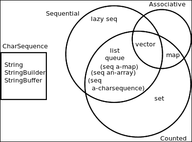

# 第二章 Clojure 抽象

Clojure 有四个基本理念。首先，它被建立为一个函数式语言。它不是纯函数式（如纯粹函数式），但强调不可变性。其次，它是一种 Lisp 方言；Clojure 足够灵活，用户可以在不等待语言实现者添加新特性和结构的情况下扩展语言。第三，它是为了利用并发来应对新一代挑战而构建的。最后，它被设计为托管语言。截至目前，Clojure 实现存在于 JVM、CLR、JavaScript、Python、Ruby 和 Scheme 上。Clojure 与其宿主语言无缝融合。

Clojure 丰富的抽象。尽管语法本身非常简洁，但抽象是细粒度的、大部分可组合的，并且旨在以最简单的方式解决广泛的问题。在本章中，我们将讨论以下主题：

+   非数值标量的性能特征

+   不变性以及纪元时间模型通过隔离铺平了性能之路

+   持久数据结构和它们的性能特征

+   惰性及其对性能的影响

+   临时对象作为高性能、短期逃逸通道

+   其他抽象，如尾递归、协议/类型、多方法等

# 非数值标量与池化

Clojure 中的字符串和字符与 Java 中的相同。字符串字面量是隐式池化的。池化是一种只存储唯一值在堆中并在需要的地方共享引用的方法。根据 JVM 供应商和您使用的 Java 版本，池化数据可能存储在字符串池、Permgen、普通堆或堆中标记为池化数据的一些特殊区域。当不使用时，池化数据会像普通对象一样受到垃圾回收。请看以下代码：

```java
user=> (identical? "foo" "foo")  ; literals are automatically interned
true
user=> (identical? (String. "foo") (String. "foo"))  ; created string is not interned
false
user=> (identical? (.intern (String. "foo")) (.intern (String. "foo")))
true
user=> (identical? (str "f" "oo") (str "f" "oo"))  ; str creates string
false
user=> (identical? (str "foo") (str "foo"))  ; str does not create string for 1 arg
true
user=> (identical? (read-string "\"foo\"") (read-string "\"foo\""))  ; not interned
false
user=> (require '[clojure.edn :as edn])  ; introduced in Clojure 1.5
nil
user=> (identical? (edn/read-string "\"foo\"") (edn/read-string "\"foo\""))
false
```

注意，Clojure 中的 `identical?` 与 Java 中的 `==` 相同。字符串池化的好处是没有重复字符串的内存分配开销。通常，在 JVM 上的应用程序在字符串处理上花费相当多的时间。因此，当有机会同时处理重复字符串时，将它们池化是有意义的。今天的大多数 JVM 实现都有一个非常快速的池化操作；然而，如果您有较旧的版本，您应该测量 JVM 的开销。

字符串池化的另一个好处是，当你知道两个字符串标记被池化时，你可以使用 `identical?` 比非池化字符串标记更快地比较它们是否相等。等价函数 `=` 首先检查引用是否相同，然后再进行内容检查。

Clojure 中的符号总是包含池化字符串引用，因此从给定字符串生成符号的速度几乎与池化字符串一样快。然而，从同一字符串创建的两个符号不会相同：

```java
user=> (identical? (.intern "foo") (.intern "foo"))
true
user=> (identical? (symbol "foo") (symbol "foo"))
false
user=> (identical? (symbol (.intern "foo")) (symbol (.intern "foo")))
false
```

关键字基于其实现建立在符号之上，并设计为与`identical?`函数一起用于等价性。因此，使用`identical?`比较关键字以进行相等性检查将更快，就像池化的字符串标记一样。

Clojure 越来越被用于大量数据处理，这包括文本和复合数据结构。在许多情况下，数据要么以 JSON 或 EDN（[`edn-format.org`](http://edn-format.org)）的形式存储。在处理此类数据时，您可以通过字符串池化或使用符号/关键字来节省内存。请记住，从这种数据中读取的字符串标记不会被自动池化，而从中读取的符号和关键字则必然会被池化。在处理关系型或 NoSQL 数据库、Web 服务、CSV 或 XML 文件、日志解析等情况时，您可能会遇到这种情况。

池化与 JVM 的垃圾回收（**GC**）相关联，而垃圾回收反过来又与性能密切相关。当您不池化字符串数据并允许重复存在时，它们最终会在堆上分配。更多的堆使用会导致 GC 开销增加。池化字符串会有微小但可测量且即时的性能开销，而 GC 通常是不可预测且不清晰的。在大多数 JVM 实现中，GC 性能并没有像硬件性能提升那样以相似的比例增长。因此，通常，有效的性能取决于防止 GC 成为瓶颈，这在大多数情况下意味着最小化它。

# 身份、值和时态时间模型

Clojure 的一个主要优点是其简单的设计，这导致了可塑性强、美观的组合性。用符号代替指针是一种存在了几十年的编程实践。它已在几种命令式语言中得到广泛应用。Clojure 剖析了这个概念，以揭示需要解决的核心问题。以下小节将说明 Clojure 的这一方面。

我们使用逻辑实体来表示值。例如，`30`这个值如果没有与逻辑实体关联，比如`age`，就没有意义。这里的逻辑实体`age`是身份。现在，尽管`age`代表一个值，但这个值可能会随时间变化；这引出了`状态`的概念，它代表在某个时间点的身份值。因此，`状态`是时间的函数，并且与我们在程序中执行的操作有因果关系。Clojure 的力量在于将身份与其在特定时间保持为真的值绑定在一起，而身份保持与它可能后来代表的任何新值隔离。我们将在第五章 *并发* 中讨论状态管理。

## 变量和修改

如果你之前使用过命令式语言（如 C/C++、Java 等），你可能对变量的概念很熟悉。**变量**是对内存块的一个引用。当我们更新其值时，我们实际上是在更新存储值的内存位置。变量继续指向存储旧版本值的那个位置。因此，本质上，变量是值存储位置的别名。

有一点分析可以揭示，变量与读取或突变其值的进程紧密相关。每一次突变都是一个状态转换。读取/更新变量的进程应该了解变量的可能状态，以便理解状态。你能在这里看到问题吗？它混淆了身份和状态！在处理变量时，在时间上引用一个值或状态是不可能的——除非你完全控制访问它的进程，否则值可能会随时改变。可变模型不适应导致其状态转换的时间概念。

可变性的问题并不止于此。当你有一个包含可变变量的复合数据结构时，整个数据结构就变得可变了。我们如何在不破坏可能正在观察它的其他进程的情况下突变它？我们如何与并发进程共享这个数据结构？我们如何将这个数据结构用作哈希表中的键？这个数据结构什么也没传达。它的意义可能会随着突变而改变！我们如何在不补偿可能以不同方式突变它的时间的情况下将这样的事物发送给另一个进程？

不变性是函数式编程的一个重要原则。它不仅简化了编程模型，还为安全性和并发性铺平了道路。Clojure 在整个语言中支持不变性。Clojure 还支持快速、以突变为导向的数据结构，以及通过并发原语实现线程安全的状态管理。我们将在接下来的章节中讨论这些主题。

## 集合类型

Clojure 中有几种集合类型，这些类型根据其属性进行分类。以下维恩图根据集合是否计数（`counted?`返回`true`）、是否关联（`associative?`返回`true`）或顺序（`sequential?`返回`true`）来描述这种分类：



之前的图展示了不同类型的数据结构所共有的特征。顺序结构允许我们对集合中的项目进行迭代，计数结构的项数可以随时间保持不变，关联结构可以通过键来查看相应的值。"**CharSequence**"框显示了 Java 类型字符序列，可以使用`seq charseq`将其转换为 Clojure 序列。

# 持久性数据结构

正如我们在上一节中注意到的，Clojure 的数据结构不仅不可变，而且可以在不影响旧版本的情况下产生新值。操作以这种方式产生新值，使得旧值仍然可访问；新版本的产生符合该数据结构的复杂度保证，并且旧版本和新版本继续满足复杂度保证。这些操作可以递归应用，并且仍然可以满足复杂度保证。Clojure 提供的这种不可变数据结构被称为 **持久数据结构**。它们是“持久”的，即当创建新版本时，旧版本和新版本在值和复杂度保证方面都“持续”存在。这与数据的存储或持久性无关。修改旧版本不会妨碍使用新版本，反之亦然。两个版本都以类似的方式持续存在。

在启发 Clojure 持久数据结构实现的出版物中，其中两本尤为知名。Chris Okasaki 的 *纯函数式数据结构* 对持久数据结构和惰性序列/操作的实施产生了影响。Clojure 的持久队列实现是从 Okasaki 的 *批处理队列* 中改编而来的。Phil Bagwell 的 *理想哈希树*，虽然旨在用于可变和命令式数据结构，但被改编以实现 Clojure 的持久映射/向量/集合。

## 构建较少使用的数据结构

Clojure 支持一种著名的字面量语法，用于创建列表、向量、集合和映射。以下列表展示了创建其他数据结构的一些较少使用的方法：

+   映射 (`PersistentArrayMap` 和 `PersistentHashMap`):

    ```java
    {:a 10 :b 20}  ; array-map up to 8 pairs
    {:a 1 :b 2 :c 3 :d 4 :e 5 :f 6 :g 7 :h 8 :i 9}  ; hash-map for 9 or more pairs
    ```

+   排序映射 (`PersistentTreeMap`):

    ```java
    (sorted-map :a 10 :b 20 :c 30)  ; (keys ..) should return sorted
    ```

+   排序集合 (`PersistentTreeSet`):

    ```java
    (sorted-set :a :b :c)
    ```

+   队列 (`PersistentQueue`):

    ```java
    (import 'clojure.lang.PersistentQueue)
    (reduce conj PersistentQueue/EMPTY [:a :b :c :d])  ; add to queue
    (peek queue)  ; read from queue
    (pop queue)  ; remove from queue
    ```

如您所见，如 `TreeMap`（按键排序）、`TreeSet`（按元素排序）和 `Queue` 这样的抽象应该通过调用它们各自的 API 来实例化。

## 复杂度保证

以下表格总结了 Clojure 中各种持久数据结构的复杂度保证（使用大 O 表示法）：

| 操作 | PersistentList | PersistentHashMap | PersistentArrayMap | PersistentVector | PersistentQueue | PersistentTreeMap |
| --- | --- | --- | --- | --- | --- | --- |
| `count` | O(1) | O(1) | O(1) | O(1) | O(1) | O(1) |
| `conj` | O(1) |   |   | O(1) | O(1) |   |
| `first` | O(1) |   |   | O(<7) | O(<7) |   |
| `rest` | O(1) |   |   | O(<7) | O(<7) |   |
| `doseq` | O(n) | O(n) | O(n) | O(n) | O(n) |   |
| `nth` | O(n) |   |   | O(<7) | O(<7) |   |
| `last` | O(n) |   |   | O(n) | O(n) |   |
| `get` |   | O(<7) | O(1) | O(<7) | O(<7) | O(log n) |
| `assoc` |   | O(<7) | O(1) | O(<7) |   | O(log n) |
| `dissoc` |   | O(<7) | O(1) | O(<7) |   | O(log n) |
| `peek` |   |   |   | O(1) | O(1) |   |
| `pop` |   |   |   | O(<7) | O(1) |   |

**列表**是一种顺序数据结构。它为计数和仅涉及第一个元素的操作提供常数时间访问。例如，`conj`将元素添加到头部并保证*O(1)*复杂度。同样，`first`和`rest`也提供*O(1)*保证。其他所有操作都提供*O(n)*复杂度保证。

持久哈希映射和向量在底层使用 32 个分支因子的 trie 数据结构。因此，尽管复杂度是*O(log* *[32]* *n)*，但只有 2³²个哈希码可以放入 trie 节点中。因此，log[32] 2³²，结果是`6.4`，小于`7`，是最坏情况下的复杂度，可以认为是接近常数时间。随着 trie 的增长，由于结构共享，需要复制的部分成比例地变得很小。持久哈希集实现也是基于哈希映射的；因此，哈希集共享哈希映射的特性。在持久向量中，最后一个不完整的节点放在尾部，这总是可以从根直接访问。这使得使用`conj`到末尾的操作是常数时间操作。

持久树映射和树集基本上分别是排序映射和排序集。它们的实现使用红黑树，通常比哈希映射和哈希集更昂贵。持久队列在底层使用持久向量来添加新元素。从持久队列中移除元素会从向量中移除头部，该向量是从添加新元素的位置创建的。

算法在数据结构上的复杂度并不是其性能的绝对度量。例如，使用哈希映射涉及计算 hashCode，这不包括在复杂度保证中。我们应该根据实际用例选择数据结构。例如，何时应该使用列表而不是向量？可能是在需要顺序或**后进先出**（**LIFO**）访问时，或者当为函数调用构造**抽象语法树**（**AST**）时。

### O(<7)表示接近常数时间

你可能知道，**大 O**符号用于表示任何算法效率的上界（最坏情况）。变量*n*用于表示算法中的元素数量。例如，在排序关联集合上进行的二分搜索，如排序向量，是对数时间，即*O(log* *[2]* *n)*或简单地*O(log n)*算法。由于 Java 集合中最多可以有 2³²（技术上由于有符号正整数是 2³¹）个元素，log[2] 2³²是 32，因此二分搜索在最坏情况下可以是*O(≤32)*。同样，尽管持久集合的操作是 O(log[32] n)，但在最坏情况下实际上最多是 O(log[32] 2³²)，这是*O(<7)*。请注意，这比对数时间低得多，接近常数时间。这意味着即使在最坏的情况下，持久集合的性能也不是很糟糕。

## 持久数据结构的连接

尽管持久数据结构具有出色的性能特性，但两个持久数据结构的连接操作一直是一个线性时间 *O(N)* 操作，除了最近的一些发展。截至 Clojure 1.7，`concat` 函数仍然提供线性时间连接。在 **core.rrb-vector** 贡献项目中进行的 **Relaxed Radix Balanced** (**RRB**) 树的实验工作正在进行中（[`github.com/clojure/core.rrb-vector`](https://github.com/clojure/core.rrb-vector)），这可能提供对数时间 *O(log N)* 连接。对细节感兴趣的读者应参考以下链接：

+   RRB-trees 论文在 [`infoscience.epfl.ch/record/169879/files/RMTrees.pdf`](http://infoscience.epfl.ch/record/169879/files/RMTrees.pdf)

+   Phil Bagwell 在 [`www.youtube.com/watch?v=K2NYwP90bNs`](http://www.youtube.com/watch?v=K2NYwP90bNs) 的演讲

+   Tiark Rompf 在 [`skillsmatter.com/podcast/scala/fast-concatenation-immutable-vectors`](http://skillsmatter.com/podcast/scala/fast-concatenation-immutable-vectors) 的演讲

# 序列和懒性

|    | *"A seq is like a logical cursor."*    |
| --- | --- |
|    | --*Rich Hickey* |

**序列**（通常称为 **seqs**）是按顺序消费一系列数据的方式。与迭代器一样，它们允许用户从头部开始消费元素，并逐个实现一个元素。然而，与迭代器不同，序列是不可变的。此外，由于序列只是底层数据的视图，它们不会修改数据的存储结构。

使序列与众不同的地方在于它们本身不是数据结构；相反，它们是对数据流的数据抽象。数据可能由算法或与 I/O 操作连接的数据源产生。例如，`resultset-seq` 函数接受一个 `java.sql.ResultSet` JDBC 实例作为参数，并以 `seq` 的形式产生懒实现的行数据。

Clojure 数据结构可以通过 `seq` 函数转换为序列。例如，（`seq [:a :b :c :d]`）返回一个序列。对空集合调用 `seq` 返回 nil。

序列可以被以下函数消费：

+   `first`：此函数返回序列的头部

+   `rest`：此函数返回移除头部后的剩余序列，即使它是空的

+   `next`：此函数返回移除头部后的剩余序列或 nil，如果它是空的

## 懒性

Clojure 是一种严格的（即“懒”的对立面）语言，可以在需要时显式地利用懒性。任何人都可以使用 `lazy-seq` 宏创建一个懒评估序列。一些 Clojure 对集合的操作，如 `map`、`filter` 等，都是有意为之的懒操作。

**惰性**简单来说就是值只有在实际需要时才会被计算。一旦值被计算，它就会被缓存起来，这样任何对值的未来引用都不需要重新计算它。值的缓存称为 **记忆化**。惰性和记忆化常常是相辅相成的。

### 数据结构操作中的惰性

惰性和记忆化结合在一起形成了一种极其有用的组合，可以保持函数式算法的单线程性能与其命令式对应物相当。例如，考虑以下 Java 代码：

```java
List<String> titles = getTitles();
int goodCount = 0;
for (String each: titles) {
  String checksum = computeChecksum(each);
  if (verifyOK(checksum)) {
    goodCount++;
  }
}
```

如前文片段所示，它具有线性时间复杂度，即 *O(n*)，整个操作都在单次遍历中完成。相应的 Clojure 代码如下：

```java
(->> (get-titles)
  (map compute-checksum)
  (filter verify-ok?)
  count)
```

现在，既然我们知道 `map` 和 `filter` 是惰性的，我们可以推断出 Clojure 版本也具有线性时间复杂度，即 *O(n*)，并且可以在一次遍历中完成任务，没有显著的内存开销。想象一下，如果 `map` 和 `filter` 不是惰性的，那么复杂度会是什么？它需要多少次遍历？不仅仅是 map 和 filter 都会各自进行一次遍历，即 *O(n*)，每个；在最坏的情况下，它们各自会占用与原始集合一样多的内存，因为需要存储中间结果。

在强调不可变性的函数式语言如 Clojure 中了解惰性和记忆化的价值非常重要。它们是持久数据结构中 **摊销** 的基础，这涉及到关注复合操作的整体性能，而不是微观分析其中每个操作的性能；操作被调整以在最重要的操作中更快地执行。

另一个重要的细节是，当惰性序列被实现时，数据会被记忆化并存储。在 JVM 上，所有以某种方式可达的堆引用都不会被垃圾回收。因此，结果就是，整个数据结构除非你失去了序列的头部，否则会一直保留在内存中。当使用局部绑定处理惰性序列时，确保你不会从任何局部引用惰性序列。当编写可能接受惰性序列（s）的函数时，注意任何对惰性 `seq` 的引用都不应该超出函数执行的生存期，形式为闭包或其他。

### 构建惰性序列

现在我们知道了惰性序列是什么，让我们尝试创建一个重试计数器，它应该只在重试可以进行时返回 true。这如下面的代码所示：

```java
(defn retry? [n]
  (if (<= n 0)
    (cons false (lazy-seq (retry? 0)))
    (cons true (lazy-seq (retry? (dec n))))))
```

`lazy-seq` 宏确保栈不会被用于递归。我们可以看到这个函数会返回无限多的值。因此，为了检查它返回的内容，我们应该限制元素的数量，如下面的代码所示：

```java
user=> (take 7 (retry? 5))
(true true true true true false false)
```

现在，让我们尝试以模拟的方式使用它：

```java
(loop [r (retry? 5)]
  (if-not (first r)
    (println "No more retries")
    (do
      (println "Retrying")
      (recur (rest r)))))
```

如预期，输出应该打印 `Retrying` 五次，然后打印 `No more retries` 并退出，如下所示：

```java
Retrying
Retrying
Retrying
Retrying
Retrying
No more retries
nil
```

让我们再举一个更简单的例子来构建一个惰性序列，它可以从指定的数字倒数到零：

```java
(defn count-down [n]
  (if (<= n 0)
    '(0)
    (cons n (lazy-seq (count-down (dec n))))))
```

我们可以如下检查它返回的值：

```java
user=> (count-down 8)
(8 7 6 5 4 3 2 1 0)
```

惰性序列可以无限循环而不会耗尽栈空间，当与其他惰性操作一起工作时非常有用。为了在节省空间和性能之间保持平衡，消耗惰性序列会导致元素以 32 的倍数进行分块。这意味着尽管惰性序列是按顺序消耗的，但它们是以 32 个元素为一个块来实现的。

#### 自定义分块

默认块大小 32 可能不是所有惰性序列的最佳选择——当你需要时可以覆盖分块行为。考虑以下代码片段（改编自 Kevin Downey 在[`gist.github.com/hiredman/324145`](https://gist.github.com/hiredman/324145)的公开 gist）：

```java
(defn chunked-line-seq
  "Returns the lines of text from rdr as a chunked[size] sequence of strings.
  rdr must implement java.io.BufferedReader."
  [^java.io.BufferedReader rdr size]
  (lazy-seq
    (when-let [line (.readLine rdr)]
      (chunk-cons
        (let [buffer (chunk-buffer size)]
          (chunk-append buffer line)
          (dotimes [i (dec size)]
            (when-let [line (.readLine rdr)]
              (chunk-append buffer line)))
  (chunk buffer))
(chunked-line-seq rdr size)))))
```

根据前面的代码片段，用户可以传递一个块大小，该大小用于生成惰性序列。在处理大型文本文件时，例如处理 CSV 或日志文件时，较大的块大小可能很有用。你会在代码片段中注意到以下四个不太为人所知的功能：

+   `clojure.core/chunk-cons`

+   `clojure.core/chunk-buffer`

+   `clojure.core/chunk-append`

+   `clojure.core/chunk`

虽然`chunk-cons`是针对分块序列的`clojure.core/cons`的等价物，但`chunk-buffer`创建了一个可变的块缓冲区（控制块大小），`chunk-append`将一个项目追加到可变块缓冲区的末尾，而`chunk`将可变块缓冲区转换为不可变块。

`clojure.core`命名空间中列出了与分块序列相关的几个函数，如下所示：

+   `chunk`

+   `chunk-rest`

+   `chunk-cons`

+   `chunk-next`

+   `chunk-first`

+   `chunk-append`

+   `chunked-seq?`

+   `chunk-buffer`

这些函数没有文档说明，所以我鼓励你研究它们的源代码以了解它们的功能，但我建议你不要对未来 Clojure 版本中它们的支持做出任何假设。

#### 宏和闭包

通常，我们定义一个宏，以便将代码的参数体转换为闭包并将其委托给函数。请看以下示例：

```java
(defmacro do-something
  [& body]
  `(do-something* (fn [] ~@body)))
```

当使用这样的代码时，如果主体将一个局部变量绑定到一个惰性序列，它可能比必要的保留时间更长，这可能会对内存消耗和性能产生不良影响。幸运的是，这可以很容易地修复：

```java
(defmacro do-something
  [& body]
  `(do-something* (^:once fn* [] ~@body)))
```

注意`^:once`提示和`fn*`宏，这使得 Clojure 编译器清除闭包引用，从而避免了这个问题。让我们看看它是如何工作的（来自 Alan Malloy 的[`groups.google.com/d/msg/clojure/Ys3kEz5c_eE/3St2AbIc3zMJ`](https://groups.google.com/d/msg/clojure/Ys3kEz5c_eE/3St2AbIc3zMJ)的示例）：

```java
user> (let [x (for [n (range)] (make-array Object 10000))
      f (^:once fn* [] (nth x 1e6))]  ; using ^:once
        (f))
#<Object[] [Ljava.lang.Object;@402d3105>
user> (let [x (for [n (range)] (make-array Object 10000))
            f (fn* [] (nth x 1e6))]         ; not using ^:once
        (f))
OutOfMemoryError GC overhead limit exceeded
```

前一个条件的体现取决于可用的堆空间。这个问题很难检测，因为它只会引发 `OutOfMemoryError`，这很容易被误解为堆空间问题而不是内存泄漏。作为预防措施，我建议在所有关闭任何可能懒加载序列的情况下使用 `^:once` 与 `fn*`。

# 转换器

Clojure 1.7 引入了一个名为转换器的新抽象，用于“可组合算法转换”，通常用于在集合上应用一系列转换。转换器的想法源于**累加函数**，它接受形式为 (`result, input`) 的参数并返回 `result`。累加函数是我们通常与 `reduce` 一起使用的函数。**转换器**接受一个累加函数，将其功能包装/组合以提供额外的功能，并返回另一个累加函数。

处理集合的 `clojure.core` 中的函数已经获得了一个 `arity-1` 变体，它返回一个转换器，即 `map`、`cat`、`mapcat`、`filter`、`remove`、`take`、`take-while`、`take-nth`、`drop`、`drop-while`、`replace`、`partition-by`、`partition-all`、`keep`、`keep-indexed`、`dedupe` 和 `random-sample`。

考虑以下几个例子，它们都做了相同的事情：

```java
user=> (reduce ((filter odd?) +) [1 2 3 4 5])
9
user=> (transduce (filter odd?) + [1 2 3 4 5])
9
user=> (defn filter-odd? [xf]
         (fn
           ([] (xf))
           ([result] (xf result))
           ([result input] (if (odd? input)
                               (xf result input)
                               result))))
#'user/filter-odd?
user=> (reduce (filter-odd? +) [1 2 3 4 5])
9
```

在这里，(`filter odd?`) 返回一个转换器——在第一个例子中，转换器将累加函数 `+` 包装起来，以返回另一个组合的累加函数。虽然我们在第一个例子中使用了普通的 `reduce` 函数，但在第二个例子中，我们使用了接受转换器作为参数的 `transduce` 函数。在第三个例子中，我们编写了一个转换器 `filter-odd?`，它模拟了 (`filter odd?`) 的行为。让我们看看传统版本和转换器版本之间的性能差异：

```java
;; traditional way
user=> (time (dotimes [_ 10000] (reduce + (filter odd? (range 10000)))))
"Elapsed time: 2746.782033 msecs"
nil
;; using transducer
(def fodd? (filter odd?))
user=> (time (dotimes [_ 10000] (transduce fodd? + (range 10000))))
"Elapsed time: 1998.566463 msecs"
nil
```

## 性能特性

转换器背后的关键点在于每个转换可以允许多么正交，同时又能高度可组合。同时，转换可以在整个序列上同步发生，而不是每个操作都产生懒加载的块序列。这通常会给转换器带来显著的性能优势。当最终结果太大而无法一次性实现时，懒加载序列仍然会很有用——对于其他用例，转换器应该能够适当地满足需求并提高性能。由于核心函数已经被彻底改造以与转换器一起工作，因此经常用转换器来建模转换是有意义的。

# 瞬态

在本章前面，我们讨论了不可变性的优点和可变性的陷阱。然而，尽管可变性在本质上是不安全的，但它也具有非常好的单线程性能。现在，如果有一种方法可以限制局部上下文中的可变操作，以提供安全保证，那将等同于结合性能优势和局部安全保证。这正是 Clojure 提供的称为 **transients** 的抽象。 

首先，让我们验证它是安全的（仅限于 Clojure 1.6）：

```java
user=> (let [t (transient [:a])]
  @(future (conj! t :b)))
IllegalAccessError Transient used by non-owner thread  clojure.lang.PersistentVector$TransientVector.ensureEditable (PersistentVector.java:463)
```

如前所述，直到 Clojure 1.6，一个线程中创建的 transient 不能被另一个线程访问。然而，在 Clojure 1.7 中允许这种操作，以便 transducers 能够与 `core.async` ([`github.com/clojure/core.async`](https://github.com/clojure/core.async)) 库良好地协作——开发者应在跨线程上保持 transients 的操作一致性：

```java
user=> (let [t (transient [:a])] (seq t))

IllegalArgumentException Don't know how to create ISeq from: clojure.lang.PersistentVector$TransientVector  clojure.lang.RT.seqFrom (RT.java:505)
```

因此，transients 不能转换为 seqs。因此，它们不能参与新持久数据结构的生成，并且会从执行范围中泄漏出来。考虑以下代码：

```java
(let [t (transient [])]
  (conj! t :a)
  (persistent! t)
  (conj! t :b))
IllegalAccessError Transient used after persistent! call  clojure.lang.PersistentVector$TransientVector.ensureEditable (PersistentVector.java:464)
```

`persistent!` 函数永久地将 `transient` 转换为等效的持久数据结构。实际上，transients 只能用于一次性使用。

在 `persistent` 和 `transient` 数据结构之间（`transient` 和 `persistent!` 函数）的转换是常数时间，即它是一个 *O(1)* 操作。transients 只能从未排序的映射、向量和集合中创建。修改 transients 的函数有：`conj!`、`disj!`、`pop!`、`assoc!` 和 `dissoc!`。只读操作，如 `get`、`nth`、`count` 等，在 transients 上按常规工作，但像 `contains?` 和那些暗示 seqs 的函数，如 `first`、`rest` 和 `next`，则不工作。

## 快速重复

函数 `clojure.core/repeatedly` 允许我们多次执行一个函数，并产生一个结果的惰性序列。Peter Taoussanis 在他的开源序列化库 **Nippy** ([`github.com/ptaoussanis/nippy`](https://github.com/ptaoussanis/nippy)) 中编写了一个对 transient 有意识的变体，其性能显著提高。它在他的许可下被复制，如下所示（注意，该函数的参数数量与 `repeatedly` 不同）：

```java
(defn repeatedly*
  "Like `repeatedly` but faster and returns given collection type."
  [coll n f]
  (if-not (instance? clojure.lang.IEditableCollection coll)
    (loop [v coll idx 0]
      (if (>= idx n)
        v
        (recur (conj v (f)) (inc idx))))
    (loop [v (transient coll) idx 0]
      (if (>= idx n)
        (persistent! v)
        (recur (conj! v (f)) (inc idx))))))
```

# 性能杂项

除了本章前面看到的重大抽象之外，Clojure 还有其他一些较小但同样非常关键的性能部分，我们将在本节中看到。

## 在生产环境中禁用断言

断言在开发过程中捕获代码中的逻辑错误非常有用，但它们在生产环境中可能会带来运行时开销，你可能想避免。由于 `assert` 是一个编译时变量，断言可以通过将 `assert` 绑定到 `false` 或在代码加载之前使用 `alter-var-root` 来静默。不幸的是，这两种技术都很难使用。Paul Stadig 的名为 **assertions** 的库（[`github.com/pjstadig/assertions`](https://github.com/pjstadig/assertions)）通过通过命令行参数 `-ea` 到 Java 运行时启用或禁用断言来帮助解决这个特定用例。

要使用它，你必须将其包含在你的 Leiningen `project.clj` 文件中作为依赖项：

```java
:dependencies [;; other dependencies…
                            [pjstadig/assertions "0.1.0"]]
```

你必须使用这个库的 `assert` 宏而不是 Clojure 自己的，因此应用程序中的每个 `ns` 块都应该类似于以下内容：

```java
(ns example.core

  (:refer-clojure :exclude [assert])

  (:require [pjstadig.assertions :refer [assert]]))
```

在运行应用程序时，你应该将 `-ea` 参数包含到 JRE 中，以启用断言，而排除它则意味着在运行时没有断言：

```java
$ JVM_OPTS=-ea lein run -m example.core
$ java -ea -jar example.jar
```

注意，这种用法不会自动避免依赖库中的断言。

## 解构

**解构** 是 Clojure 的内置迷你语言之一，并且可以说是开发期间的一个顶级生产力提升器。这个特性导致了将值解析以匹配绑定形式的左侧。绑定形式越复杂，需要完成的工作就越多。不出所料，这会有一点性能开销。

通过使用显式函数在紧密循环和其他性能关键代码中解开数据，可以轻松避免这种开销。毕竟，这一切都归结于让程序工作得少，做得多。

## 递归和尾调用优化（TCO）

函数式语言有与递归相关的尾调用优化概念。所以，想法是当递归调用处于尾位置时，它不会占用递归的栈空间。Clojure 支持一种用户辅助递归调用形式，以确保递归调用不会耗尽栈空间。这有点像命令式循环，但速度非常快。

在执行计算时，在紧密循环中使用 `loop-recur` 而不是迭代合成数字可能非常有意义。例如，我们想要将 0 到 1,000,000 之间的所有奇数相加。让我们比较一下代码：

```java
(defn oddsum-1 [n]  ; using iteration
  (->> (range (inc n))
    (filter odd?)
    (reduce +)))
(defn oddsum-2 [n]  ; using loop-recur
  (loop [i 1 s 0]
    (if (> i n)
      s
      (recur (+ i 2) (+ s i)))))
```

当我们运行代码时，我们得到了有趣的结果：

```java
user=> (time (oddsum-1 1000000))
"Elapsed time: 109.314908 msecs"

250000000000
user=> (time (oddsum-2 1000000))
"Elapsed time: 42.18116 msecs"

250000000000
```

`time` 宏作为性能基准工具远非完美，但相对数值表明了一种趋势——在随后的章节中，我们将探讨 *Criterium* 库进行更科学的基准测试。在这里，我们使用 `loop-recur` 不仅是为了更快地迭代，而且我们还能通过只迭代大约其他示例一半的次数来改变算法本身。

### 迭代提前结束

在对集合进行累积时，在某些情况下，我们可能希望提前结束。在 Clojure 1.5 之前，`loop-recur`是唯一的方法。当使用`reduce`时，我们可以使用 Clojure 1.5 中引入的`reduced`函数来完成，如下所示：

```java
;; let coll be a collection of numbers
(reduce (fn ([x] x) ([x y] (if (or (zero? x) (zero? y)) (reduced 0) (* x y))))
             coll)
```

在这里，我们乘以集合中的所有数字，并在找到任何数字为零时，立即返回结果零，而不是继续到最后一个元素。

函数`reduced?`有助于检测何时返回了减少值。Clojure 1.7 引入了`ensure-reduced`函数，用于将非减少值装箱为减少值。

## 多态方法与协议

**多态方法**是一种出色的多态分派表达式抽象，其分派函数的返回值用于分派。与多态方法相关联的分派函数在运行时维护，并在每次调用多态方法时查找。虽然多态方法在确定分派方面提供了很多灵活性，但与协议实现相比，性能开销实在太高。

协议（`defprotocol`）在 Clojure 中通过`reify`、记录（`defrecord`）和类型（`deftype`、`extend-type`）实现。这是一个大讨论话题——既然我们在讨论性能特征，那么只需说协议实现基于多态类型进行分派，并且比多态方法快得多就足够了。协议和类型通常是 API 的实现细节，因此它们通常由函数来呈现。

由于多态方法的灵活性，它们仍然有其位置。然而，在性能关键代码中，建议使用协议、记录和类型。

## 内联

宏在调用位置内联展开并且避免了函数调用。因此，存在一定的性能优势。还有一个`definline`宏，允许你像正常宏一样编写函数。它创建了一个实际函数，在调用位置内联：

```java
(def PI Math/PI)
(definline circumference [radius]
  `(* 2 PI ~radius))
```

### 注意

注意，JVM 也会分析它运行的代码，并在运行时进行代码内联。虽然你可以选择内联热点函数，但这种技术仅能提供适度的性能提升。

当我们定义一个`var`对象时，其值在每次使用时都会被查找。当我们使用指向`long`或`double`值的`:const`元数据定义`var`对象时，它将从调用位置内联：

```java
(def ^:const PI Math/PI)
```

这在适用时众所周知可以提供不错的性能提升。请看以下示例：

```java
user=> (def a 10)
user=> (def ^:const b 10)
user=> (def ^:dynamic c 10)
user=> (time (dotimes [_ 100000000] (inc a)))
"Elapsed time: 1023.745014 msecs"
nil
user=> (time (dotimes [_ 100000000] (inc b)))
"Elapsed time: 226.732942 msecs"
nil
user=> (time (dotimes [_ 100000000] (inc c)))
"Elapsed time: 1094.527193 msecs"
nil
```

# 摘要

性能是 Clojure 设计的基础之一。Clojure 中的抽象设计用于简单性、强大性和安全性，同时始终考虑性能。我们看到了各种抽象的性能特征，以及如何根据性能用例做出抽象决策。

在下一章中，我们将看到 Clojure 如何与 Java 交互，以及我们如何提取 Java 的力量以获得最佳性能。
